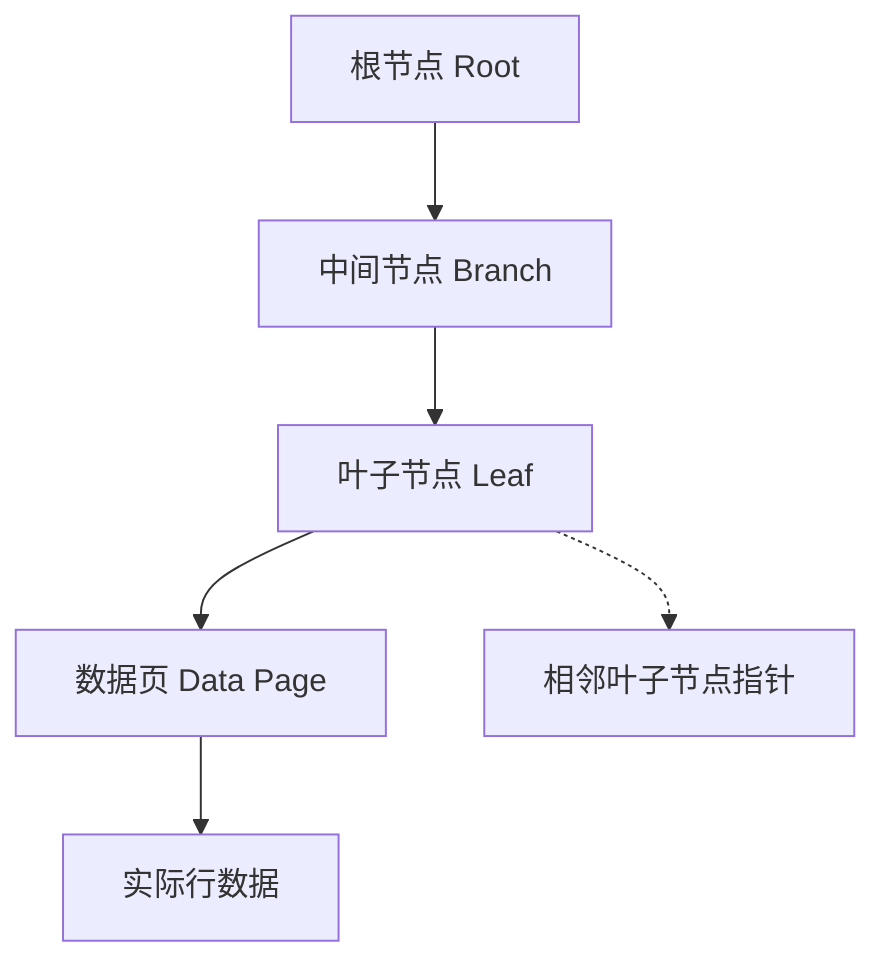

# MySQL索引

索引是数据库为表中的列额外建立的数据结构，它是有序的，为了便于快速查找，类似于书的目录。通俗来说就是“翻整本书找某一行”变成“翻到指定页找某一行”

本质上是在磁盘或内存里，数据库会再建一个更小、更紧凑、按某列排序的“副表”，并维护它与原表的映射关系

## 索引类型1 （数据结构角度）

### B+树索引（MySQL默认索引类型）

innoDB B+树索引：

- clustered - 主键索引

全表唯一 ～主键有序 ～ 叶子节点存储完整的数据行 ～ 非叶子节点存储主键和页号

叶子节点之间有双向链表 ～ 适合范围查询

叶子节点内有页目录，内部单链表 -> 查找\<页目录二分加遍历链表>

- non-clustered - 非主键索引的索引（二级索引）

可有多个 ～ 叶子节点只保存索引字段和主键值 ～ 适合快速查找特定列

回表：通过二级查询得到id，再去主键索引查数据 （避免select \* 导致额外数据查找的不必要浪费）

### 哈希索引

哈希 ～ 快 ～ 不存储数据顺序 ～ 基本用于等值查询 ～ 常用于Memory引擎

### 倒排索引

Full-Text ～ 存储词与文档映射 ～ 适用于大文本字段

### R-树索引

专为多维空间数据设计 ～ GIS

## 索引类型2（索引性质角度）

普通索引：非主键 + 非唯一

主键索引：每个表唯一 + 非null

联合索引：多列组成 ～ 提高多条件查询性能 + 多列按照指定顺序排序

唯一索引：值唯一 ～ 防止重复插入 + 允许null

全文索引：适用于对文本内容搜索

空间索引：地理信息数据

## B+树


### 数据结构优势

B+树在磁盘-内存二级存储体系下，能够用最少的随机IO，最矮的树高，最紧凑的叶子链表，把“范围 / 顺序 /点查”三种最常见的数据库访问模式一次性解决

“矮胖树、顺序叶、局部锁、范围快、点查稳”，这就是 MySQL 选 B+ 树的全部理由

1. 磁盘 I/O 最小化
   - 数据库索引本质是“磁盘数据结构”。磁盘擅长顺序读，惧怕随机寻道
   - B+ 树节点大小通常按 页（InnoDB 默认 16 KB） 对齐，一次 I/O 就能拉一整页；
     节点扇出大（通常几百个 key），3～4 层即可索引 亿级 行，树高低 ⇒ I/O 次数少
1. 查询复杂度稳定
   - B+ 树高 ≈ log₍fanout₎(N) ≈ 常数（3~4），点查、范围查都是 O(log N) 且最坏 ≈ 3～4 次磁盘 I/O
1. 叶子节点全表有序且链表串接
   - 所有 data pointer / 行记录都在同一层叶子，天然 顺序存储；
   - 叶子之间用双向链表串起来，范围查询、ORDER BY、GROUP BY、LIKE 'abc%' 只需顺序扫链表，效率极高
     （B 树非叶子也存数据，范围查需跨层回溯，磁盘跳来跳去效率差。）
1. 更紧凑的内部节点
   - 内部节点只存 key + 子节点指针，不存行数据 → 一个 16 KB 页可存更多 key，扇出更大，树更矮
1. 插入/删除局部调整
   - 分裂/合并只影响 相邻节点 和 父节点一页，锁粒度小，适合高并发 OLTP；
   - 相比哈希表（rehash 全表）、红黑树（高重写）更友好
1. 全内存场景也不吃亏
   - 即使整棵树被缓存到 Buffer Pool，CPU 缓存行友好（顺序数组 + 二分查找）仍优于指针跳来跳去的红黑/跳表
   - 范围遍历只需线性扫数组，cache miss 少
1. 对比其他候选结构
   - 哈希索引：只能点查，无法范围、排序；碰撞桶链过长后退化；需要额外结构解决范围问题
   - 红黑树/AVL：逻辑高度 log₂N ≈ 20～30，每下一层是一次指针随机跳，磁盘 I/O 爆炸
   - LSM-Tree：写放大、读放大，更适合写多读少的日志型场景（HBase、RocksDB）
   - B-tree（非 B+）：非叶节点也存 data，范围查询需回溯上层，I/O 不连续
1. MySQL 实战细节
   - InnoDB 聚簇索引就是一棵 B+ 树，主键即数据；二级索引也是 B+ 树，叶子存主键值，回表仍走 B+ 树，逻辑统一
   - 页分裂/合并、顺序写、自适应哈希索引、change buffer 等优化全部围绕 “让 B+ 树在磁盘上跑得快” 而设计

### 数据量估算

以3层B+树为例

页节点 ~ 16KB / 数据行 ~ 1KB（主键 + 数据）-> 叶子节点存16条数据

指针 ~ 6Bytes / 索引键 ~ 8Bytes -> 非叶子节点存 16\*1024/(6+8)=1170个记录

总数据量 = 1170^2 \* 16 = 21902400，约2000万条数据

数据行在叶子节点中按照主键顺序存储 ～ 高效单条查询 + 范围查询

### 查询数据

#### B+树结构核心要素

在InnoDB中，B+树是索引的物理实现形式，具有以下关键特征：



节点类型：

- 根节点（1个）：查询入口
- 中间节点：存储键值+子节点指针
- 叶子节点：存储键值+数据指针/行数据

关键特性：

- 所有数据存储在叶子节点
- 叶子节点形成双向链表（支持范围查询）
- 非叶子节点只存储索引键（不存数据）

#### 查询过程全解析（以`SELECT * FROM users WHERE id=100`为例）

前置条件

```sql
CREATE TABLE users (
    id INT PRIMARY KEY,  -- 聚簇索引
    name VARCHAR(50),
    email VARCHAR(100)
) ENGINE=InnoDB;
```

查询步骤分解：

1. 定位根节点

```sql
-- 系统启动时加载根节点到内存（Buffer Pool）
-- 根节点位置存储在系统表空间中
```

- 根节点常驻内存（避免磁盘I/O）
- 根节点包含多个键值范围和子节点指针：

```
[ (50, page1), (150, page2), (300, page3) ]
```

2. 中间节点导航

```sql
-- 比较目标值100与节点键值
100 > 50 && 100 < 150 → 选择page2
```

- 加载page2（中间节点）到内存
- 重复比较过程直到到达叶子层级

3. 叶子节点定位

```sql
-- 在叶子节点中二分查找
[ (90, row1), (95, row2), (100, row3), (105, row4) ]
```

- 找到键值100对应的记录指针

叶子节点结构：

```c
struct leaf_node {
   int key;           // 索引键值
   void* data_ptr;    // 指向实际数据的指针
   leaf_node* next;   // 下一个叶子节点指针
}
```

4. 数据页读取

```sql
-- 通过指针定位到实际数据页
-- InnoDB以16KB为单位管理数据页
```

数据页结构：

```c
struct page {
   page_header_t header;  // 页头信息
   infimum_record;       // 虚拟最小记录
   supremum_record;      // 虚拟最大记录
   user_records[];       // 实际行数据
   free_space;           // 空闲空间
   page_directory;       // 记录槽位
}
```

5. 行数据提取

```sql
-- 从数据页中解析行记录
-- InnoDB行格式：Compact/Redundant/Dynamic
```

行记录结构（Compact格式）：

```
[变长字段长度列表][NULL标志位][记录头信息][列1数据][列2数据]...
```

#### 二级索引查询过程（回表机制）

```sql
CREATE INDEX idx_email ON users(email);
SELECT * FROM users WHERE email='test@example.com';
```

1. 二级索引B+树查找

- 在email索引树中定位到`test@example.com`
- 获取对应的主键值（如id=100）

1. 回表操作

需要额外一次B+树查找（性能损耗）

```sql
-- 使用主键id=100到聚簇索引中查找
SELECT * FROM users WHERE id=100;
```

1. 覆盖索引优化

直接从二级索引获取数据（无需回表）

```sql
SELECT id, email FROM users WHERE email='test@example.com';
```

#### 关键性能指标分析

| 操作阶段     | 时间复杂度 | 磁盘I/O次数 | 内存操作             |
| ------------ | ---------- | ----------- | -------------------- |
| 根节点访问   | O(1)       | 0           | Buffer Pool直接访问  |
| 中间节点访问 | O(logₘN)   | 1~3次       | 页缺失时触发磁盘读取 |
| 叶子节点定位 | O(logₘN)   | 1次         | 二分查找             |
| 数据页读取   | O(1)       | 1次         | 页缺失时触发磁盘读取 |
| 行记录解析   | O(1)       | 0           | 内存解析             |

> 注：m为B+树阶数（通常100+），N为数据量

#### 查询优化技术

1. 索引下推（ICP）

```sql
-- 传统方式：存储引擎返回数据→Server层过滤
-- ICP优化：存储引擎直接过滤索引列
SELECT * FROM users WHERE last_name='Smith' AND first_name='John';
```

- 在索引中同时过滤last_name和first_name
- 减少回表次数

1. MRR（Multi-Range Read）

```sql
-- 传统：随机I/O读取数据页
-- MRR：将主键排序→顺序I/O读取
SELECT * FROM users WHERE id IN (100, 200, 300);
```

- 减少随机I/O，提升磁盘读取效率

3. 自适应哈希索引

```sql
-- InnoDB自动监控热点查询
-- 对频繁访问的索引页建立哈希索引
```

- 内存结构：O(1)时间复杂度
- 自动维护，无需人工干预

#### 查询过程可视化工具

1. EXPLAIN分析

```sql
EXPLAIN SELECT * FROM users WHERE id=100;
```

输出解读：

```
+----+-------------+-------+------------+-------+---------------+---------+---------+-------+------+----------+-------+
| id | select_type | table | partitions | type  | possible_keys | key     | key_len | ref   | rows | filtered | Extra |
+----+-------------+-------+------------+-------+---------------+---------+---------+-------+------+----------+-------+
|  1 | SIMPLE      | users | NULL       | const | PRIMARY       | PRIMARY | 4       | const |    1 |   100.00 | NULL  |
+----+-------------+-------+------------+-------+---------------+---------+---------+-------+------+----------+-------+
```

- `type=const`：主键唯一匹配
- `key=PRIMARY`：使用聚簇索引
- `rows=1`：预估扫描行数

1. Optimizer Trace

```sql
SET optimizer_trace = "enabled=on";
SELECT * FROM users WHERE id=100;
SELECT * FROM information_schema.optimizer_trace\G
```

关键输出：

```json
{
  "steps": [
    {
      "join_preparation": {
        /* SQL解析阶段 */
      }
    },
    {
      "join_optimization": {
        "rows_estimation": [
          {
            "table": "`users`",
            "range_analysis": {
              "table_scan": {
                /* 全表扫描代价 */
              },
              "potential_range_indexes": [
                /* 可用索引分析 */
              ],
              "best_covering_index_scan": {
                /* 最佳覆盖索引 */
              }
            }
          }
        ]
      }
    }
  ]
}
```

#### 生产环境调优案例

场景：用户表千万级数据查询优化

```sql
-- 原始查询（耗时2.3s）
SELECT * FROM user WHERE phone='13800138000';

-- 优化方案
1. 添加索引：
ALTER TABLE user ADD INDEX idx_phone (phone);

1. 使用覆盖索引：
SELECT id, name FROM user WHERE phone='13800138000';

1. 强制索引提示：
SELECT * FROM user FORCE INDEX (idx_phone) WHERE phone='13800138000';
```

| 方案     | 耗时  | 磁盘读取 | 索引使用  |
| -------- | ----- | -------- | --------- |
| 无索引   | 2.3s  | 5000+    | 全表扫描  |
| 普通索引 | 0.05s | 3        | idx_phone |
| 覆盖索引 | 0.01s | 1        | idx_phone |
| 强制索引 | 0.04s | 3        | idx_phone |

#### 核心结论

1. 查询路径：根节点 → 中间节点 → 叶子节点 → 数据页 → 行记录
1. 性能关键：
   - 索引层级深度（决定I/O次数）
   - 缓冲池命中率（减少磁盘访问）
   - 索引覆盖度（避免回表）
1. 优化方向：
   - 合理设计索引（减少层级）
   - 使用覆盖索引（避免回表）
   - 利用MySQL内置优化特性（ICP/MRR）

> 黄金法则：B+树查询效率 = 索引层级 × 单次I/O时间 + 内存操作时间
> 通过减少索引层级和磁盘I/O次数，可获得数量级的性能提升

## 最左前缀匹配原则

前缀 ～ 多列索引（联合索引）

联合索引：对 (a, b, c) 三列建一个索引，相当于在磁盘上生成一棵 按 a → b → c 顺序排序的 B+ 树

- 第一层先按 a 排序
- a 相同再按 b 排序
- a、b 都相同再按 c 排序

为了利用B+树的有序性，要从索引定义的最左侧连续列开始匹配，而能用到“前缀长度”取决于查询条件里连续地从左起给了多少列

“带头大哥不能丢，中间兄弟不能断，范围之后全完蛋”

| 查询条件                        | 能否用到索引 | 用到哪几列                      |
| ------------------------------- | ------------ | ------------------------------- |
| WHERE a = 1                     |              | a                               |
| WHERE a = 1 AND b = 2           |              | a, b                            |
| WHERE a = 1 AND b = 2 AND c = 3 |              | a, b, c                         |
| WHERE b = 2                     | ❌           | 无                              |
| WHERE a = 1 AND c = 3           | (部分)       | 只用到 a （MySQL5.6后索引下推） |
| WHERE a > 1 AND b = 2           | (部分)       | a（范围后 b 失效）              |
| WHERE a = 1 AND b > 2 AND c = 3 | (部分)       | a, b（范围后 c 失效）           |

MySQL 8.0.13 后引入 Skip Scan Range Access Method，在特定条件下会利用范围扫描代替全表扫描，会自动拼接最左条件来构造 （听过就行）

## 建立索引的场景

所有的技术都有trade-off，索引是用空间换时间，并且要维护和数据的一致性

### 不建议的场景

- 字段的值有大量重复 ～ 例如性别 ～ 并没有有效降低筛选后的数据规模
- 长字段 ～ 例如TEXT ～ 增加内存压力，甚至有可能排挤内存中的缓存数据
- 修改频率远大于查询频率 ～ 得不偿失

### 建议的场景

- 需要频繁作为条件查询的字段 ～ 多个条件 -> 联合索引
- ORDER BY / GROUP BY / DISTINCT 后面的字段 ～ 通常需要对结果 排序/分组/去重

## 索引的有效性

索引不是万能灵药，要评估CPU / IO 成本决定辅助索引还是全表扫描

### 可能失效的场景

- 查询条件中没用到索引列
- 查询条件中用到低基数列
- 查询条件复杂且不匹配索引顺序（包含列但是没用上）
- 小表 ～ 全表扫描也许开销更小

### 排查索引效果

观察 EXPLAIN命令的输出

- type（访问类型）～ index / range -> 用到索引，ALL -> 扫描全表没用索引
- key （用的索引）～ 显示索引名称 -> 用到索引，NULL -> 没用到索引
- rows（扫描行数）～ 观察扫描量

### 本质使用场景

在InnoDB查数据，都只能用索引

- 利用 主键索引 / 二级索引快速查找
- 全扫描二级索引进行查找

### 回表 look-up

通过二级索引查询数据时，查找过程通常分为两步：

1. 第一次查找 (二级索引查找)： MySQL 首先根据二级索引的 B+树结构，找到你查询的索引列值，并从二级索引的叶子节点中获取到该行对应的主键值
1. 第二次查找 (聚集索引查找 / 回表)： 然后，MySQL 会使用这个获取到的主键值，再到主键索引（聚集索引）中去查找完整的行数据。这个过程被称为“回表”（英文是 "Look-up" 或 "Bookmark Look-up"），因为它需要回到主键索引中获取完整数据

回表 -> 带来随机IO（慢于 顺序IO） ～ 不要盲目select \*（减少回表）

### 覆盖索引

覆盖索引 (Covering Index) 是一种特殊的二级索引（非聚集索引）。它的特别之处在于，一个查询所需的所有数据都可以直接从这个二级索引中获取，而无需再回到主键索引中查找完整的行数据。这个“无需回表”的特性是覆盖索引最核心的优势

#### 优势

- 显著提升查询性能： 避免了回表操作，减少了磁盘 I/O 次数，尤其是在数据量大、回表成本高的情况下效果更明显
- 减少锁竞争： 如果查询是覆盖索引，那么在整个查询过程中，可能只需要对索引页加锁，而不需要对数据行页加锁（或只需要非常短的时间），从而减少了并发冲突
- 减少内存消耗： 数据库在处理查询时，只需要将相关的索引页加载到内存，而不是整个数据页

#### 判断

在 MySQL 中，你可以使用 EXPLAIN 语句来分析查询计划。如果 Extra 列中包含 Using index，则表示该查询使用了覆盖索引

### 典型索引实效场景

| 分类         | 说明             | 举例                                                                    |
| ------------ | ---------------- | ----------------------------------------------------------------------- |
| 影响索引本身 | 索引中使用了运算 | select \* from user where id+3=8                                        |
|              | 索引中使用了函数 | select \* from user where LOWER(user) like 'cong%'                      |
|              | 随意的字段类型   | select \* from user where username=1 相当于用上函数(隐式字符编码转换)   |
| 使用方法不当 | 不符合最左前缀   | select \* from user where age=10 and  id=1 (索引是name_age_id)          |
|              | 随意使用like     | select \* from user where name like '%cong%' (变相地不符合最左前缀)     |
|              | 随意使用or       | select \* from user where name='cong' or age=18 (索引了name但没索引age) |
|              | 随意使用order by | 后面跟的不是主键或者不是覆盖索引 -> 不走索引                            |
|              | 比较表中不同字段 | select \* from user where id>age                                        |
| MySQL机制    | 不同的参数       | MySQL会评估是否用索引，特别是复杂查询(联表，子查询，需要回表等)         |

### 索引数量

时间成本 + 空间成本 + MySQL查询优化器 ～ 并非越多越好

#### 时间成本

数据表中数据增删改 -> 索引也要更新 ～ 增加写入操作开销

B+树本身的操作开销 ～ 页的分裂和合并等

#### 空间成本

一个二级索引 ～ 新的B+树（默认每个数据页16KB）

#### MySQL查询优化器

分析当前的查询 -> 选择最优的计划 -> 索引多 ～ 更多需要比较多选项（增加开销）甚至选的不是最优解

# MySQL存储引擎

|      | InnoDB            | MyISAM            | MEMORY            | NDB      | ARCHIVE        |
| ---- | ----------------- | ----------------- | ----------------- | -------- | -------------- |
| 事务 | Y                 | N                 | N                 | Y        | N              |
| 外键 | Y                 | N                 | N                 | Y        | N              |
| 锁   | 行                | 表                | 表                | 行       | 行             |
| 场景 | 高并发高负载 OLTP | 读取多更新少 数仓 | 临时存储/快速缓存 | 分布式   | 日志存储       |
| 特点 | 检索效率高        | 读取效率高        | 存储在内存中      | 自动分区 | 高效插入和压缩 |

# MySQL的优化

## 调优

观察慢SQL ～ EXPLAIN语句看执行计划 ～ 识别性能瓶颈

### 索引相关

- 联合索引进行覆盖索引优化 ～ 减少回表
- 联合索引满足最左匹配原则
- 不要对无索引的字段进行排序

### SQL语句相关

- 避免SELECT \* ～ 只查必要字段
- 避免 %LIKE ～ 会导致全表扫描
- 避免语句中进行函数计算 ～ 无法命中索引
- 联表查询注意不同字段的字符集是否一致 ～ 不一致会导致全表扫描

### 其他

- 增加缓存
- 优化业务（不多展示不必要字段）

## 慢SQL

执行时间超预期阈值的SQL

1. 执行耗时 ≥ long_query_time（默认 10 s，可改）；
1. 扫描行数/返回行数比值极大；
1. 引发 CPU、I/O、锁等高资源消耗；
1. 被业务或 DBA 人工标记为“明显拖慢系统”的语句

“跑不快、扫太多、锁太久、耗资源的 SQL 就是慢 SQL。”

| 命令                                   | 释义                     | 备注     |
| -------------------------------------- | ------------------------ | -------- |
| show variables like '%slow_query_log%' | 慢日志是否开启和存储路径 |          |
| set global slow_query_log = 'ON'       | 开启自带日志记录         | 默认关闭 |
| set global long_query_time = 3         | 慢SQL的阈值              | 单位为秒 |

## EXPLAIN语句

EXPLAIN（MySQL 8.x 默认格式）返回的每一列都告诉你一条 SQL 在执行计划里的“运行路线”

1. id
   - 查询块编号
   - 相同 id → 同一层，执行顺序由上到下；
   - 不同 id → 子查询/派生表，数字越大越先执行
     口诀：同层从上到下，子查询 id 大者先行
1. select_type
   - SIMPLE：最普通的单表或 JOIN
   - PRIMARY：最外层 SELECT
   - SUBQUERY：子查询（非 FROM）
   - DERIVED：FROM 中的派生表（5.7 临时磁盘表，8.0 已改为物化）
   - UNION / UNION RESULT：UNION 查询
     口诀：看到 DERIVED/UNION 先怀疑临时表性能
1. table
   - 表名或别名；出现 derivedN 表示第 N 个派生表
     口诀：出现 derived 就去找对应 id=N 的行
1. partitions
   - 分区裁剪后真正要扫的分区列表
     口诀：出现 NULL 代表没用到分区裁剪
1. type（访问方法，核心指标）
   性能从好到差：
   system > const > eq_ref > ref > range > index > ALL
   - system/const：最多 1 行，主键或唯一索引常量等值
   - eq_ref：JOIN 时主键/唯一索引等值匹配
   - ref：普通二级索引等值或前缀匹配
   - range：索引范围扫描（>、\<、BETWEEN、LIKE 'abc%'）
   - index：全索引扫（叶子顺序读）
   - ALL：全表扫
     口诀：见到 ALL 先加索引；range 以下都算“及格”
1. possible_keys
   - 优化器认为可用的索引列表
     口诀：这里列出但没用，就要看 key_len 与 WHERE/ORDER 是否匹配
1. key
   - 真正决定用的索引
     口诀：空值 ⇒ 全表；跟 possible_keys 不一致 ⇒ 索引合并或强制走错
1. key_len
   - 使用索引的长度（字节数）
   - 联合索引可据此判断是否用到了后缀列：
     (a INT, b INT) 索引，key_len=4 ⇒ 只用 a；key_len=8 ⇒ a+b 都用
     口诀：字节数对不上列宽，就怀疑最左前缀被截断
1. ref
   - 与 key 比较的常量或列
   - const 说明等值常量，db.t.col 说明跨表等值
     口诀：看到 func 代表列被函数包了一层，索引失效
1. rows
   - 优化器估算要扫多少行
   - 越小越好；与实际情况差 10 倍以上就要用 ANALYZE TABLE 更新统计信息
     口诀：rows 百万级 + type=ALL ⇒ 必加索引或改写 SQL
1. filtered
   - 从存储引擎返回的行中，再经过 Server 层过滤后剩余行数的百分比
   - 100% 最好，\<10% 说明索引过滤性很差
     口诀：filtered 低但 rows 高，考虑覆盖索引或把过滤条件推到索引层
1. Extra（信息量最大）
   - Using index：覆盖索引，不回表
   - Using where：Server 层再次过滤（通常配合 type=ALL/index）
   - Using temporary：需要临时表（GROUP BY/ORDER BY 无法走索引）
   - Using filesort：需要额外排序（磁盘或内存）
   - Using join buffer (Block Nested Loop)：被驱动表没用到索引，退化成批量嵌套循环
   - FirstMatch/Loosescan/Materialize：半连接或物化子查询优化策略
     口诀：看到 filesort/temporary/join buffer 三连击，先修索引或重写 SQL

### 速读 EXPLAIN 的三步法

1. 先看 type：ALL 直接打回重写；range 以下继续
1. 再看 key / key_len / ref：确认索引被正确使用且用到预期列
1. 最后扫 Extra：没有 filesort / temporary / join buffer → 计划基本健康

# MySQL事务

事务主要为了实现一致性 -> 通过AID（原子性隔离性持久性）实现

MySQL主要是通过以下方式实现事务

- 锁
- RedoLog / UndoLog
- MVCC

## 锁

行锁，间隙锁 等 ～ 使用数据并发修改的控制 ～ 隔离性

表-行-间隙三粒度，S-X-IS-IX 四模式，Next-Key 在 RR，意向锁做表行兼容

IS/IX 做意向，Record/Gap/Next-Key 护行，AUTO-INC 抢自增，MDL 管元数据

### 锁分类

#### 按类型划分

| 锁类型分类     | 锁类型                              | 描述                                                                           |
| -------------- | ----------------------------------- | ------------------------------------------------------------------------------ |
| 按锁的粒度分类 | 表级锁（Table-Level Lock）          | 锁定整个表，粒度较大，并发度较低。适用于频繁读操作和较少写操作的场景。         |
|                | 行级锁（Row-Level Lock）            | 锁定表中的一行数据，粒度较小，并发度较高。适用于频繁写操作的场景。             |
|                | 页级锁（Page-Level Lock）           | 锁定一个内存页，粒度介于表级锁和行级锁之间。                                   |
|                | 元数据锁（Metadata Lock）           | 保护表的结构定义，确保在查询期间表结构不被修改。                               |
| 按锁的属性分类 | 共享锁（Shared Lock，S锁）          | 允许事务读取数据，但不允许修改。多个事务可以同时持有共享锁。                   |
|                | 排他锁（Exclusive Lock，X锁）       | 允许事务修改数据，不允许其他事务持有任何类型的锁。                             |
|                | 意向锁（Intention Lock）            | 用于表示事务稍后将对表中的行加锁，分为意向共享锁（IS锁）和意向排他锁（IX锁）。 |
|                | 记录锁（Record Lock）               | 锁定索引记录，防止其他事务插入、更新或删除该记录。                             |
|                | 间隙锁（Gap Lock）                  | 锁定索引记录之间的间隙，防止其他事务插入数据到该间隙中。                       |
|                | 临键锁（Next-Key Lock）             | 结合行级锁和间隙锁，锁定一个索引记录及其前面的间隙。                           |
| 其他锁类型     | 自增锁（Auto-Increment Lock）       | 用于生成自增列的值，确保自增值的唯一性和连续性。                               |
|                | 插入意向锁（Insert Intention Lock） | 在插入操作之前设置的一种轻量级锁，表示事务打算在某个间隙中插入新记录。         |

#### 按粒度划分

| 粒度 | 锁名称 / 关键字 | 英文简称              | 作用范围               | 场景示例                            | 备注                            |
| ---- | --------------- | --------------------- | ---------------------- | ----------------------------------- | ------------------------------- |
| 表级 | 元数据锁        | MDL                   | 整个表对象             | ALTER TABLE 与 SELECT 互斥          | 由 Server 层自动加              |
| 表级 | 手动表锁        | —                     | 整张表                 | LOCK TABLES t WRITE                 | 用户显式加                      |
| 表级 | 意向共享锁      | IS                    | 表                     | SELECT ... LOCK IN SHARE MODE 前加  | 与行锁兼容表                    |
| 表级 | 意向排他锁      | IX                    | 表                     | UPDATE/DELETE/INSERT 前加           | 与行锁兼容表                    |
| 行级 | 记录锁          | Record Lock           | 单行索引记录           | WHERE id = 5                        | 锁住具体行                      |
| 行级 | 间隙锁          | Gap Lock              | 两行索引记录之间的空隙 | WHERE id BETWEEN 10 AND 20 防止幻读 | 只在 RR 及以上                  |
| 行级 | Next-Key 锁     | Next-Key Lock         | 记录 + 前间隙          | RR 默认加                           | 组合锁                          |
| 行级 | 插入意向锁      | Insert Intention Lock | 间隙                   | 并发 INSERT 时使用                  | 与 Gap Lock 兼容                |
| 特殊 | 自增锁          | AUTO-INC Lock         | 表级短暂锁             | INSERT ... AUTO_INCREMENT           | 可配置 innodb_autoinc_lock_mode |
| 特殊 | 谓词锁          | Predicate Lock        | 空间索引行             | GIS 查询                            | 8.0+                            |

#### 兼容矩阵

| 已持有 / 请求 | IS  | IX  | S   | X   |
| ------------- | --- | --- | --- | --- |
| IS            | ✔️  | ✔️  | ✔️  | ❌  |
| IX            | ✔️  | ✔️  | ❌  | ❌  |
| S             | ✔️  | ❌  | ✔️  | ❌  |
| X             | ❌  | ❌  | ❌  | ❌  |

### 死锁

#### 解除死锁

| 参与方 | 机制                                      | 机制                                   |
| ------ | ----------------------------------------- | -------------------------------------- |
| MySQL  | 自带死锁检测机制 innodb_deadlock_detect   | 自动回滚一个事务，通常是持有资源最少的 |
| MySQL  | 锁等待超时的参数 innodb_lock_wait_timeout | 获取锁等待时间超过阈值就释放锁进行回滚 |
| CODER  | 通过命令找出被阻塞的事务及其线程ID        | 手动kill                               |

#### 死锁日志

```SQL
//获取死锁日志
SHOW ENGINE INNODB STATUS;

//查看当前锁和锁等待情况
SELECT *FROM INFORMATION_SCHEMA.INNODB_LOCKS;
SELECT* FROM INFORMATION_SCHEMA.INNODB_LOCK_WAITS;

//innodb_trx查询线程id
SELECT trx_state, trx_started, trx_mysql_thread_id, trx_query, trx_id
FROM INFORMATION_SCHEMA.INNODB_TRX
WHERE trx_id = 'xxxxxxx';
```

INFORMATION_SCHEMA的innodb_trx -> 事务ID和线程ID的关联关系

#### 避免死锁

让事务永远拿不到环形等待：统一顺序、最小锁、快提交、低级别、拆批重试

配置MySQL

- 开启死锁检测
- 适当调整锁等待时常

批量拆分

- 大批量 UPDATE/DELETE 拆成小批次
- 使用分段主键范围分批处理，降低单事务锁数量

最小锁粒度 + 最短事务

- 语句只锁必须的数据，避免 SELECT \* FOR UPDATE大范围加锁
- 拿锁后立刻完成业务逻辑并 COMMIT，禁止长事务

降低隔离级别

- 读多写少场景降到READ COMMITTED，可去掉大量 Gap Lock
- 对一致性要求不高的报表库，可使用READ ONLY会话

合理建立索引/行顺序

- 范围查询尽量用主键/唯一索引精准定位，命中索引则会锁对应行，避免全表扫
- 所有事务按固定顺序访问表/行（如先 A 后 B，绝不允许先 B 后 A）
- 更新数据时保证获得足够多的锁（先获取影响范围大的锁，如修改操作，先获取排他锁再获取共享锁）

## 日志

| binlog                  | redolog                      | undolog                        |
| ----------------------- | ---------------------------- | ------------------------------ |
| 二进制日志（逻辑日志）  | 二进制日志（物理日志）       |                                |
| 记录所有DDL和DML（SQL） | 记录数据页修改               | 记录操作（发生数据新增或修改） |
| 数据复制                | 恢复数据，保持一致性和持久性 | 回滚                           |
| 事务提交后生成          | MySQL发生宕机或崩溃时使用    | 事务提交后保留一段时间         |
| 跨平台                  | 不可跨平台                   |                                |
| Server层                | InnoDB存储引擎层             | InnoDB存储引擎层               |

redolog～ 持久性

undolog ～ 原子性 + 隔离性

## MVCC Multi-Version Concurrency Control

允许多个事务同时读和写数据库并无需互相等待 ～ 提高并发性

每个事务 -> 创建一个数据快照 ～ 数据修改 -> 生成新版本记录（不覆盖旧数据 + 每个记录有版本号或时间戳）

读(普通读)写不会阻塞 => 多个版本 -> 版本链 ～ 不同时刻启动的事务无锁获得不同版本数据

写操作可以继续写 => 写会创建新版本数据（事务提交后新版本才对其他事务可见，已经启动的事务读历史版本数据）

### Undo Log

多版本是借助undolog的记录每次写操作的反向操作

insert产生的undolog就回收了（去数据不存在的时候没意义），update产生的undolog会产生版本链

- trx_id：当前事务ID
- roll_pointer：指向undolog的指针

### readView

MVCC中生成的一致性快照，用来判断哪个版本对当前事务可见，从最新版本往老版本寻找条件符合的。在 InnoDB 里，它并不是一个持久化对象，而是事务启动（或第一次 SELECT）时在内存里构建的结构体

| 字段           | 含义                                                 |
| -------------- | ---------------------------------------------------- |
| m_ids          | 创建 readView 时所有活跃事务的事务 ID 列表           |
| min_trx_id     | m_ids 中的最小值                                     |
| max_trx_id     | 下一个要分配的事务 ID（= 当前最大已分配事务 ID + 1） |
| creator_trx_id | 创建该 readView 的事务自己的 ID                      |

可见性判断，对某一行版本 row.trx_id：

if row.trx_id == creator_trx_id → 可见（自己的修改）
else if row.trx_id < min_trx_id → 可见（已提交）
else if row.trx_id >= max_trx_id → 不可见（未来事务）
else if row.trx_id in m_ids → 不可见（活跃未提交）
else → 可见（已提交）

### 读已提交隔离级别

读已提交（READ COMMITTED，简称 RC）隔离级别下的 MVCC 关键点可以一句话概括：每条 SELECT 都会生成新的 readView，因此同一事务里前后两条查询可能看到不同版本的数据（读一次、建一次 readView；别人一提交，我就看得见）

#### readView 的创建时机

- 事务启动时不生成readView
- 每次执行普通 SELECT时现场生成一份新的 readView → RC 里一个事务里可能有 N 个 readView

#### 可见性判定规则

与 RR 相同算法，只是 readView 新鲜，对新 readView 内的 m_ids / min_trx_id / max_trx_id 做判断：

- 行版本的事务 ID 在生成 readView 时已提交且小于max_trx_id → 可见
- 仍在 m_ids（活跃未提交）或 ≥ max_trx_id → 不可见，继续沿 Undo 链找旧版本

#### 带来的现象

- 不可重复读（Non-repeatable read）：同一事务内两次 SELECT 之间，如果别的事务把某行提交，第二次就能读到新值
- 幻读（Phantom）：同一事务内两次范围查询之间，能读到别的事务新插入并提交的行。因为 RC 只保证“读已提交”，不保证“快照不变”

#### 示例时间线

| 时刻 | 事务 T1 (RC)         | 事务 T2                     | 数据版本                          |
| ---- | -------------------- | --------------------------- | --------------------------------- |
| t0   | BEGIN;               |                             | balance = 100 (trx_id=90, 已提交) |
| t1   | SELECT balance → 100 |                             | 生成 ReadView1: { }               |
| t2   |                      | UPDATE balance=200; COMMIT; | 新版本 200 (trx_id=91, 已提交)    |
| t3   | SELECT balance →200  |                             | 生成 ReadView2: { }，可见 91      |

T1 两次 SELECT 结果不同，正是 RC 下的典型行为

#### 与锁/当前读

- 快照读（普通 SELECT）使用上述 MVCC
- 当前读（SELECT ... FOR UPDATE/LOCK IN SHARE MODE）直接加锁，不再用 readView，而是读最新已提交版本

### 可重复读隔离级别

可重复读（REPEATABLE READ，简称 RR）是InnoDB 默认隔离级别。核心保证：在同一个事务内，无论别的事务如何提交，你多次执行同一 SELECT 看到的数据版本始终相同，即快照一致性（一生只用一张快照，别人再改也白搭；当前读加 Gap Lock，幻读也进不来）

#### 快照时机

- 事务里第一次执行普通 SELECT（或 START TRANSACTION WITH CONSISTENT SNAPSHOT）时生成唯一一份 Read View
- 整个事务期间复用这一份快照，不再重新生成

#### 可见性规则

与 RC 相同算法，Read View 的四个字段（m_ids、min_trx_id、max_trx_id、creator_trx_id）用来判断：

- 行版本的事务 ID 在生成 Read View 时已提交且小于 max_trx_id → 可见（快照内）
- 否则沿 Undo 链往前找旧版本 → 因而后续别的事务提交的新版本对当前事务永远不可见

#### 带来的现象

- 可重复读：同一事务多次读同一行结果不变
- 幻读： 在当前读 SELECT … FOR UPDATE场景下仍可能出现；但 InnoDB 通过间隙锁(Gap Lock)把幻读也消除，因此 InnoDB 的 RR ≈ “无幻读”

#### 时间线示例

| 时刻 | 事务 T1 (RR)         | 事务 T2                     | 数据                       |
| ---- | -------------------- | --------------------------- | -------------------------- |
| t0   | BEGIN;               |                             | balance = 100 (trx_id=90)  |
| t1   | SELECT balance → 100 |                             | 生成 ReadView: { }         |
| t2   |                      | UPDATE balance=200; COMMIT; | 新版本 200 (trx_id=91)     |
| t3   | SELECT balance → 100 |                             | 仍用旧 ReadView，91 不可见 |

T1 两次读结果一致

#### 与锁/当前读

- 快照读：MVCC 无锁，保证可重复读
- 当前读：加 记录锁+间隙锁，防止幻读，但不再使用快照

#### 代价与注意

- 长事务会阻止 Undo 旧版本被 purge，导致Undo 表空间膨胀
- 写冲突：RR 下 UPDATE/DELETE 使用当前读，若发现版本已变，可能触发死锁重试

### 幻读

在事务开始的时候，直接使用SELECT ... FOR UPDATE，加锁后其他事务无法新增数据，从而避免幻读

## 隔离级别

|            | 读未提交                                     | 读已提交                             | 可重复读                   | 串行化                   |
| ---------- | -------------------------------------------- | ------------------------------------ | -------------------------- | ------------------------ |
| 英文名     | READ UNCOMMITTED                             | READ COMMITTED                       | REPEATABLE READ            | SERIALIZABLE             |
| 隔离性     | 低                                           | 中                                   | MySQL默认                  | 最高                     |
| 特性       | 一个事务可以看到另一个事务尚未提交的数据修改 | 一个事务只能看到已提交事务的数据修改 | 一个事务中多个查询结果一致 | 并发事务被保证串行化执行 |
| 脏读       | 可能                                         | 不会                                 | 不会                       | 不会                     |
| 幻读       | 可能                                         | 可能                                 | 可能                       | 不会                     |
| 不可重复读 | 可能                                         | 可能                                 | 不会                       | 不会                     |

隔离性低 ～ 并发性高 ～ 数据一致性低

隔离性高 ～ 并发性低 ～ 数据一致性高

|      | 脏读                               | 幻读                           | 不可重复读                           |
| ---- | ---------------------------------- | ------------------------------ | ------------------------------------ |
| 英文 | Dirty Read                         | Phantom Read                   | Non- repeatable Read                 |
| 释义 | 一个事务读到另一个事务未提交的数据 | 同一事务中相同查询得到不同结果 | 同一事务中读同一数据两次得到不同结果 |
| 原因 | 未提交事务最终被回滚               | 其他事务插入而发生变化         | 是他事务的提交                       |
| 对比 |                                    | 事务期间将别的事务提交的读到了 | 事务期间将别的事务修改后的数据读到了 |
| 针对 |                                    | 数据的数量                     | 数据的内容                           |

### REPEATABLE READ

MySQL 默认隔离级别 ～ 兼容早期binlog的statement格式（本质就是原先的SQL语句） ～ RU / RC 的statement格式binlog会导致主从数据库数据不一致

RR ～ 间隙锁(Gap Locks)+临键锁(Next-Key Locks) -> 主从数据一致

### SERIALIZABLE

隔离级别 = 把所有普通 SELECT 也当成 SELECT … LOCK IN SHARE MODE（共享 next-key lock）

让并发事务按串行顺序执行，彻底杜绝脏读、不可重复读、幻读，代价是并发度最低。读也加锁，事务排队，最安全也最慢

#### 实现方式

- 任何事务里的任何 SELECT（无论是否加FOR SHARE）都会加共享 next-key lock（记录锁 + 间隙锁）
- 写操作照常加排它锁
- 最终效果：读-读可并发，读-写、写-写全部互斥，相当于单线程执行

#### 现象对比

| 场景        | RR                    | SERIALIZABLE         |
| ----------- | --------------------- | -------------------- |
| 普通 SELECT | 不加锁（MVCC 快照读） | 加共享 next-key lock |
| 并发写入    | 可能阻塞              | 必定阻塞             |
| 幻读        | 已避免（间隙锁）      | 进一步强制串行       |

#### 性能影响

- TPS 会急剧下降，长事务更容易造成大量锁等待 / 死锁
- 一般只用于极端强一致场景（账务结算、库存对账）或故障排查

## 二阶段提交 2PC

保证crash recovery时，不会数据丢失或者数据不一致，解决“跨日志双写一致性”的最小代价方案，确保redolog和binlog之间的一致性

### 过程

#### 准备阶段 Prepare Phase

InnoDB引擎先写入redolog

将其状态标为prepare（事务准备提交但还没完成）- 预提交状态

#### 提交阶段 Commit Phase

MySQL Server 写入binlog

MySQL通知InnoDB将redolog状态改为commit - 完成提交

### 为什么要有2PC

#### 没有2PC会怎样

场景1：先刷redolog后刷binlog，宕机前崩溃

- redolog已写入 → 事务在 InnoDB 中“已提交”
- binlog 未写入 → 从库收不到这条事务
- 结果：主库有数据，从库丢失 → 主从不一致

场景2：先刷binlog后刷redolog，宕机前崩溃

- binlog已写入 → 从库回放成功
- redolog未写入 → InnoDB 中事务实际回滚
- 结果：从库多了一条数据 → 主从不一致

#### 有2PC会怎样

任何阶段宕机，崩溃恢复时，MySQL 扫描redolog与 binlog：

- redolog为PREPARE，binlog不存在 → 回滚事务（从库未收到，主库必须回滚）
- redolog为PREPARE，binlog已存在 → 提交事务（从库已收到，主库必须提交）

#### 不能直接判断两个日志是否完整吗

theoritally yes, practically no

本质上是经典分布式解决方案，协商场景下每个人都说ok才提交

- redolog提交 ～ 事务已经提交 ～ 此刻无法回滚 -> 如果binlog还没写，则数据不一致
- 补写binlog过于麻烦

#### 如何对比

- prepare-redo + XID 找得到 → 提交
- prepare-redo + XID 找不到 → 回滚

### 组提交 Group Commit

把处于 Prepare 状态的事务聚成一批，一次性把 redo log + binlog 刷盘，再统一给这批事务发“提交完成”信号。把多个事务的“刷盘阶段”合并成一次 I/O，既保住持久性，又把磁盘 fsync 次数从 N 次降到 1 次\*\*，从而在高并发写入时显著提升 TPS、降低延迟

二阶段提交虽能保证一致性，但每个事务都要 redo log fsync → binlog fsync → commit，一次事务至少2 次 fsync；并发一高，磁盘 I/O 成为瓶颈

#### redolog 层组提交

innodb_flush_log_at_trx_commit = 1 时生效
Leader 线程收集一批 Prepare 事务 → 一次 fsync(redo log)；各事务继续第二阶段

#### binlog 层组提交

binlog_group_commit_sync_delay（等待微秒）
binlog_group_commit_sync_no_delay_count（等待事务数）
Flush Stage → Sync Stage → Commit Stage；同一批事务共用一次 fsync(binlog)

#### innodb_flush_log_at_trx_commit

| 数值 | 动作                                       | 安全性       | 组提交效果 |
| ---- | ------------------------------------------ | ------------ | ---------- |
| 1    | 每个事务提交时立即redolog刷盘              | 最安全       | 比较弱     |
| 2    | 每个事务提交时仅将日志写入OS缓存，定期刷盘 |              | 更明显     |
| 0    | 不在事务提交时刷盘                         | 数据可能丢失 | 最大化     |

# 主从复制

通过binlog实现复制

1. 主数据库写操作时，将操作记录到binlog
1. 推送给从数据库，从库IO线程拉取
1. 从数据库重放对应日志完成复制，SQL线程回放

## 复制模式

| 模式         | 主库等待      | 数据安全      | 性能 | 配置参数                                   |
| ------------ | ------------- | ------------- | ---- | ------------------------------------------ |
| 异步（默认） | 0 个从库      | 可能丢数据    | 最高 | 无                                         |
| 半同步       | ≥1 个从库 ACK | 最多丢 1 事务 | 中   | rpl_semi_sync_master_wait_point=AFTER_SYNC |
| 全同步       | 全部从库 ACK  | 零丢失        | 最差 | 需组复制或 NDB                             |

## 并行复制

把“单线程回放”升级成“多线程回放”，靠主库组提交 + 从库 coordinator + worker 线程 来降低复制延迟

| 版本 | 并行策略                 | 并发粒度           | 是否推荐       |
| ---- | ------------------------ | ------------------ | -------------- |
| 5.6  | DATABASE                 | 按库分线程         | 单库场景无并发 |
| 5.7  | LOGICAL_CLOCK（MTS）     | 按无冲突事务组并行 | 通用           |
| 8.0  | LOGICAL_CLOCK + WRITESET | 按行冲突矩阵并行   | 更细粒度       |

## 核心原理（5.7+ LOGICAL_CLOCK）

主库

- 组提交（Group Commit）把同时提交的事务打包成一个 group
- 每个事务在 binlog 里写入 last_committed 和 sequence_number 字段

从库

- 1 个 coordinator 线程读取 relay-log
- N 个 worker 线程拿到同一 last_committed 值的事务并发回放
- 事务间无行冲突即可并行，否则顺序执行

```sql
-- 组提交等待延迟提交到时间，每次binlog组提交等待一阵再fsync
SET GLOBAL binlog_group_commit_sync_delay = 100;   -- μs
-- 组提交允许的最大事务量，达到数量时立即触发组提交而无需等待延迟时间
SET GLOBAL binlog_group_commit_sync_no_delay_count = 20;
```

## 主从同步延迟

延迟必然存在，只能优化无法避免

### 常见原因

| 类别       | 典型现象                          | 根因说明                              | 优化方案       |
| ---------- | --------------------------------- | ------------------------------------- | -------------- |
| 大事务     | 一条 UPDATE/DELETE/DDL 涉及百万行 | 重放时间 = 主库执行时间，延迟瞬间飙高 | 优化程序       |
| 单线程回放 | 主库并发 1 w TPS，从库 1 SQL 线程 | 5.7 之前默认单线程，CPU 空转          | 启用多线程复制 |
| 网络/IO    | 跨机房、千兆带宽跑满              | binlog 传不快或 fsync 慢              | 优化网络连接   |
| 从库负载高 | 从库跑报表/全表扫描               | IO/CPU 被占满，SQL 线程饥饿           | 增加从库实例   |
| 从库数量高 |                                   | 主库同步压力过大                      | 合理评估数量   |
| 从库性能差 |                                   |                                       | 增加硬件资源   |

### 解决方式

#### 二次查询 （兜底策略较简单）

从库查不到 ～ 主库再查一遍 ～ API封装逻辑即可 -> 读压力转移到主库

#### 强制写之后立马读的操作转移到主库 （不推荐较死板）

写之后立马查询的操作绑定在一起，代码写死都走主库

#### 关键业务读写都走主库

例如用户注册走主库（不会报用户不存在+业务访问量不会太多） ～ 非关键业务依然读写分离 -> 根据业务适当调整

#### 使用缓存

主库写完同步到缓存 ～ 查询先查缓存避免延迟 -> 引入缓存数据一致性问题

# 深度分页

## 方案 1：游标（Key-Set / 记录最大 ID）—— 首推

| 场景 | 连续翻页、瀑布流                                                 |
| ---- | ---------------------------------------------------------------- |
| SQL  | SELECT \* FROM t WHERE id > ${last_id} ORDER BY id ASC LIMIT 20; |
| 优点 | 无 OFFSET，扫描行数 = LIMIT 行数，性能恒定                       |
| 注意 | 要求排序列唯一且递增；前端需把 last_id 带回                      |

## 方案 2：延迟关联（Deferred Join）—— 非主键排序

| 场景 | 按创建时间、状态等非主键排序                                                                                  |
| ---- | ------------------------------------------------------------------------------------------------------------- |
| SQL  | SELECT t.\* FROM t JOIN ( SELECT id FROM t ORDER BY create_time DESC LIMIT 100000, 20 ) tmp ON t.id = tmp.id; |
| 原理 | 子查询只扫描索引 → 拿到 20 个主键 → 再回表取完整行                                                            |
| 收益 | 回表次数从 100020 降至 20                                                                                     |

## 方案 3：覆盖索引 + 子查询

| 场景 | 查询列全部能被索引覆盖                                                        |
| ---- | ----------------------------------------------------------------------------- |
| SQL  | SELECT id FROM t WHERE status=1 ORDER BY create_time LIMIT 100000, 20; 再回表 |
| 条件 | 查询列全部包含在联合索引（覆盖索引）里，避免回表                              |

## ⚠️ 方案 4：分区 + 分区裁剪

| 做法 | 按日期/ID 做 RANGE 分区，查询只扫相关分区 |
| ---- | ----------------------------------------- |
| 收益 | 1000 万行 → 百万级扫描量级                |
| 注意 | 分区键需与分页条件对齐                    |

## ⚠️ 方案 5：限制跳转页码 / 缓存

| 做法 | 前端只给“下一页”；或把热门页缓存 5 min |
| ---- | -------------------------------------- |
| 适用 | 管理后台、运营报表等低频场景           |

## 🚫 不推荐

| 方案              | 原因                             |
| ----------------- | -------------------------------- |
| LIMIT 1000000, 10 | 扫描并丢弃 100 万行，CPU/IO 爆炸 |
| 存储过程游标      | 维护成本高，不如延迟关联         |
