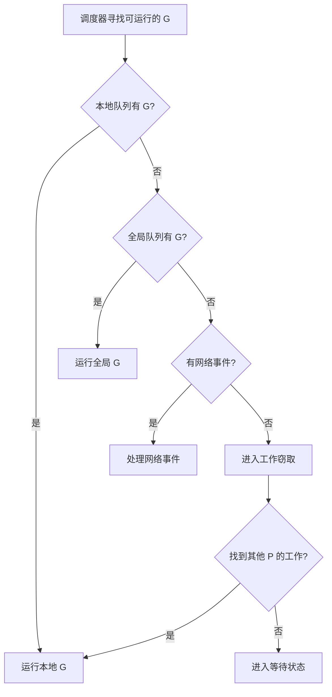
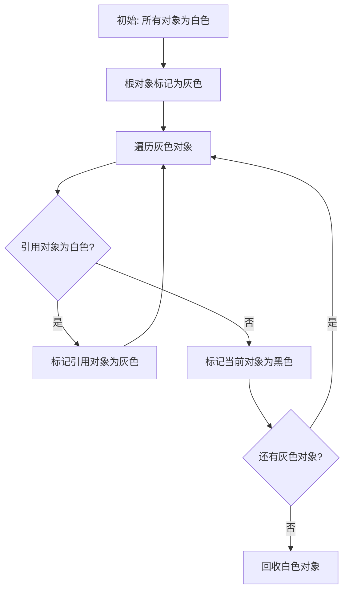
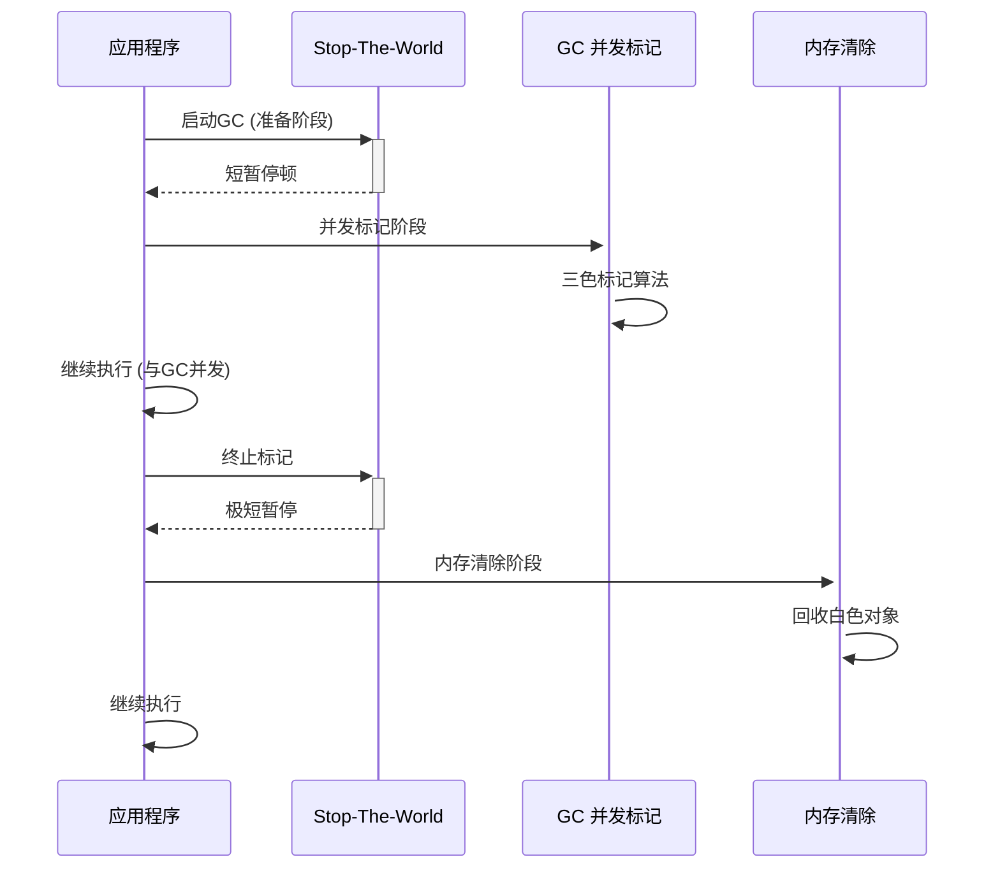

# 切片容量增长

在 Go 语言中，切片（slice）的容量增长机制是编译器自动处理的，当切片容量不足时会自动进行扩容。

## 基本概念

切片是对数组的封装，包含三个字段：

- 指向底层数组的指针
- 长度（len）
- 容量（cap）

## 增长策略

Go 1.18 及以后版本的扩容策略如下：

1. 所需容量 > 当前容量的 2 倍

```go
if cap > doublecap {
    newcap = cap
}
```

直接使用所需的容量

2. 所需容量 ≤ 当前容量的 2 倍

小容量阶段（容量 < 256）

```go
if old.cap < 256 {
    newcap = doublecap  // 容量翻倍
}
```

大容量阶段（容量 ≥ 256）

```go
for 0 < newcap && newcap < cap {
    newcap += (newcap + 3*256) / 4  // 约 1.25 倍增长
}
```

## 具体示例

```go
func main() {
    var s []int
    oldCap := cap(s)
    for i := 0; i < 2000; i++ {
        s = append(s, i)
        newCap := cap(s)
        if newCap != oldCap {
            fmt.Printf("长度 %d: 容量 %d -> %d\n", i+1, oldCap, newCap)
            oldCap = newCap
        }
    }
}
```

输出示例：

```
长度 1: 容量 0 -> 1
长度 2: 容量 1 -> 2
长度 3: 容量 2 -> 4
长度 5: 容量 4 -> 8
长度 9: 容量 8 -> 16
长度 17: 容量 16 -> 32
长度 33: 容量 32 -> 64
长度 65: 容量 64 -> 128
长度 129: 容量 128 -> 256
长度 257: 容量 256 -> 512
长度 513: 容量 512 -> 848
长度 849: 容量 848 -> 1280
长度 1281: 容量 1280 -> 1792
长度 1793: 容量 1792 -> 2560
```

## 增长规律

| 当前容量 | 扩容后容量（近似） |
| -------- | ------------------ |
| < 256    | cap × 2            |
| ≥ 256    | cap × 1.25         |

- 扩容算法可能变化：Go 团队可能会调整扩容策略以优化性能
- 预分配提升性能：使用 `make([]T, len, cap)` 预分配容量可避免频繁扩容
- 避免依赖具体数值：不要依赖具体的扩容数值进行业务逻辑设计

## 性能优化

```go
// 推荐：预估容量
s := make([]int, 0, 1000)
for i := 0; i < 1000; i++ {
    s = append(s, i)
}

// 不推荐：从零开始逐个 append
var s []int
for i := 0; i < 1000; i++ {
    s = append(s, i)  // 多次扩容拷贝
}
```

这种优化可以显著减少内存分配和数据拷贝的开销

# map的扩容机制

使 Go map 在大多数情况下都能保持 O(1) 的平均时间复杂度，同时通过渐进式扩容避免了长时间的停顿

1. 触发条件：负载因子 > 6.5 或溢出过多
1. 扩容方式：等量扩容或翻倍扩容
1. 迁移策略：渐进式迁移，避免停顿
1. 性能影响：写操作可能有额外延迟
1. 内存管理：旧 bucket 在迁移完成后释放

## 基本结构

Go 的 map 底层使用哈希表实现，主要数据结构：

```go
// map 的运行时结构
type hmap struct {
    count     int    // 元素个数
    flags     uint8  // 状态标志
    B         uint8  // bucket 数量的对数 (2^B)
    noverflow uint16 // 溢出 bucket 的近似数
    hash0     uint32 // 哈希种子
    buckets   unsafe.Pointer // bucket 数组的指针
    oldbuckets unsafe.Pointer // 扩容时的旧 bucket 数组
    nevacuate  uintptr // 扩容进度计数器
    extra     *mapextra // 额外字段
}
```

每个 bucket 可以存储 8 个键值对：

```go
type bmap struct {
    tophash [bucketCnt]uint8 // 哈希值的高 8 位
    // 实际结构更复杂，包含键和值的存储
}
```

## 触发条件

1. 负载因子过高

当负载因子超过 6.5 时触发扩容：

```
负载因子 = count / (2^B) > 6.5
```

翻倍扩容（overLoad grow）

- bucket 数量翻倍 (B+1)
- 用于解决容量不足问题
- 这是最常见的扩容方式

1. 溢出 bucket 过多

当溢出 bucket 数量过多时也会触发扩容

等量扩容（same-size grow）

- bucket 数量不变
- 主要处理过多的溢出 bucket
- 用于解决哈希冲突问题

## 扩容过程

1. 触发扩容

```go
// 在 runtime/map.go 中的 hashGrow 函数
func hashGrow(t *maptype, h *hmap) {
    bigger := uint8(1)
    if !overLoadFactor(h.count+1, h.B) {
        bigger = 0  // 等量扩容
    }
    // 创建新的 bucket 数组
    // 保存旧的 bucket 数组到 oldbuckets
}
```

2. 渐进式迁移

扩容不是一次性完成的，而是渐进式的：

```go
// 每次 map 操作时迁移部分数据
func mapassign(t *maptype, h *hmap, key unsafe.Pointer) unsafe.Pointer {
    if h.growing() {
        growWork(t, h, bucket)  // 迁移部分 bucket
    }
    // ... 其他逻辑
}
```

## 扩容算法

哈希计算和 bucket 分配

```go
// 哈希值计算
hash := t.hasher(key, uintptr(h.hash0))

// 旧 bucket 索引
bucket := hash & (oldbucketmask)

// 新 bucket 索引（扩容后）
bucket1 := hash & (bucketmask)
bucket2 := bucket1 ^ (oldbucketmask + 1)
```

数据迁移过程

```go
// 迁移单个 bucket
func evacuate(t *maptype, h *hmap, oldbucket uintptr) {
    // 计算需要迁移到的新 bucket
    // 将旧 bucket 中的数据重新分配到新的 bucket 中
    // 更新 tophash 和键值对位置
}
```

扩容期间的操作特点

1. 读操作：正常进行，可能需要检查新旧两个数组
1. 写操作：触发迁移，延迟增加
1. 删除操作：正常进行

扩容完成后的性能

```go
// 扩容后哈希冲突减少
// 平均查找时间从 O(1+α) 优化到 O(1+α/2)
// 其中 α 是负载因子
```

## 常见误区

1. 扩容时机的误解

```go
// 错误：认为容量就是 make 时指定的大小
m := make(map[int]int, 10) // 这是初始桶数的 hint，不是硬限制

// 正确：map 可以无限制增长
m[100] = 1  // 仍然可以添加超出初始容量的元素
```

2. 并发扩容问题

```go
// 错误：并发操作 map
var m = make(map[int]int)
go func() { m[1] = 1 }()  // race condition
go func() { m[2] = 2 }()  // race condition

// 正确：使用 sync.Map 或加锁
var mu sync.RWMutex
go func() {
    mu.Lock()
    m[1] = 1
    mu.Unlock()
}()
```

# map不是线程安全

Go 内置 map 不是线程安全的，并发访问会导致数据竞争和运行时错误

解决方案选择：

- 频繁读取，少量写入：`sync.Map`
- 频繁写入或复杂操作：`sync.RWMutex` + `map`
- 高性能要求：考虑使用分片锁或第三方库

关键原则：

- 明确识别并发访问的场景
- 选择合适的并发控制机制
- 封装线程安全的操作
- 避免过度同步导致性能下降

记住："并发不是并行"，在设计并发安全的数据结构时，要考虑实际的使用模式来选择最合适的方案

## 并发访问

```go
package main

import (
    "fmt"
    "sync"
)

func main() {
    m := make(map[int]int)
    var wg sync.WaitGroup

    // 并发写入 - 危险！
    for i := 0; i < 10; i++ {
        wg.Add(1)
        go func(i int) {
            defer wg.Done()
            m[i] = i * 2  // 可能导致 panic 或数据竞争
        }(i)
    }

    wg.Wait()
}
```

运行上述代码可能导致：

- `fatal error: concurrent map writes`
- 数据不一致
- 内存损坏

## 并发读写

```go
// 一个 goroutine 写入
go func() {
    for i := 0; i < 1000; i++ {
        m[i] = i
    }
}()

// 另一个 goroutine 读取
go func() {
    for i := 0; i < 1000; i++ {
        _ = m[i] // 可能读到不完整或损坏的数据
    }
}()
```

## 运行时保护机制

Go 运行时在某些情况下会检测并发访问：

```go
// 会触发运行时错误
func concurrentWritePanic() {
    m := make(map[int]int)
    done := make(chan bool)

    go func() {
        m[1] = 1  // 写入
        done <- true
    }()

    go func() {
        m[2] = 2  // 并发写入 - 可能 panic
        done <- true
    }()

    <-done
    <-done
}
```

## 解决方案

1. 使用互斥锁（Mutex）

```go
type SafeMap struct {
    mu sync.RWMutex
    m  map[int]int
}

func NewSafeMap() *SafeMap {
    return &SafeMap{
        m: make(map[int]int),
    }
}

func (sm *SafeMap) Set(key, value int) {
    sm.mu.Lock()
    defer sm.mu.Unlock()
    sm.m[key] = value
}

func (sm *SafeMap) Get(key int) (int, bool) {
    sm.mu.RLock()
    defer sm.mu.RUnlock()
    value, ok := sm.m[key]
    return value, ok
}

func (sm *SafeMap) Delete(key int) {
    sm.mu.Lock()
    defer sm.mu.Unlock()
    delete(sm.m, key)
}

func (sm *SafeMap) Len() int {
    sm.mu.RLock()
    defer sm.mu.RUnlock()
    return len(sm.m)
}
```

2. 使用 sync.Map（Go 1.9+）

```go
var m sync.Map

// 写入
m.Store("key1", "value1")
m.Store("key2", "value2")

// 读取
if value, ok := m.Load("key1"); ok {
    fmt.Println(value)
}

// 删除
m.Delete("key1")

// 遍历
m.Range(func(key, value interface{}) bool {
    fmt.Printf("Key: %v, Value: %v\n", key, value)
    return true // 返回 false 停止遍历
})
```

3. 使用 Channel 实现并发安全

```go
type MapWithChannel struct {
    m map[int]int
    c chan func()
}

func NewMapWithChannel() *MapWithChannel {
    mm := &MapWithChannel{
        m: make(map[int]int),
        c: make(chan func(), 100),
    }

    // 启动处理 goroutine
    go func() {
        for f := range mm.c {
            f()
        }
    }()

    return mm
}

func (mm *MapWithChannel) Set(key, value int) {
    done := make(chan bool)
    mm.c <- func() {
        mm.m[key] = value
        done <- true
    }
    <-done
}
```

## sync.Map vs 普通 map + Mutex

sync.Map 适用场景

```go
// 1. 写入一次，多次读取（如配置）
// 2. 多个 goroutine 读取不同的 key
// 3. key-value 对会增长然后停止增长

type Config struct {
    data sync.Map
}

func (c *Config) SetConfig(key string, value interface{}) {
    c.data.Store(key, value)
}

func (c *Config) GetConfig(key string) interface{} {
    if value, ok := c.data.Load(key); ok {
        return value
    }
    return nil
}
```

Mutex 适用场景

```go
// 1. 频繁的写操作
// 2. 需要复合操作（如 check-then-set）
// 3. 需要遍历 map

type Counter struct {
    mu    sync.RWMutex
    items map[string]int
}

func (c *Counter) Increment(key string) {
    c.mu.Lock()
    defer c.mu.Unlock()
    c.items[key]++
}

func (c *Counter) GetTopItems(n int) []string {
    c.mu.RLock()
    defer c.mu.RUnlock()
    // 实现获取前 n 个项目的逻辑
    // ...
}
```

## 最佳实践

1. 选择合适的方案

```go
// 对于配置、缓存等场景 - sync.Map
var cache sync.Map

// 对于频繁更新的共享状态 - Mutex
type SharedState struct {
    mu   sync.RWMutex
    data map[string]interface{}
}
```

2. 封装线程安全的 map

```go
type ThreadSafeMap[K comparable, V any] struct {
    mu sync.RWMutex
    m  map[K]V
}

func NewThreadSafeMap[K comparable, V any]() *ThreadSafeMap[K, V] {
    return &ThreadSafeMap[K, V]{
        m: make(map[K]V),
    }
}

func (tsm *ThreadSafeMap[K, V]) Set(key K, value V) {
    tsm.mu.Lock()
    defer tsm.mu.Unlock()
    tsm.m[key] = value
}

func (tsm *ThreadSafeMap[K, V]) Get(key K) (V, bool) {
    tsm.mu.RLock()
    defer tsm.mu.RUnlock()
    value, ok := tsm.m[key]
    return value, ok
}
```

3. 避免死锁

```go
type SafeMap struct {
    mu sync.RWMutex
    m  map[string]int
}

// 错误：在锁内调用可能再次获取锁的函数
func (sm *SafeMap) BadMethod(key string) {
    sm.mu.Lock()
    defer sm.mu.Unlock()

    if sm.m[key] == 0 {
        sm.Set(key, 1) // 可能导致死锁
    }
}

// 正确：分解操作
func (sm *SafeMap) GoodMethod(key string) {
    sm.mu.Lock()
    defer sm.mu.Unlock()

    if sm.m[key] == 0 {
        sm.m[key] = 1 // 直接操作
    }
}
```

# new V.S. make

在 Go 语言中，make 和 new 都用于内存分配，但它们的用途和行为有本质区别：

- new：适用于任何类型，返回指向零值的指针
- make：专用于 slice、map、channel，返回已初始化的值
- 性能考虑：make 通常更高效，因为它直接创建可用的对象
- 类型安全：make 确保引用类型被正确初始化

记住：需要引用类型且要立即使用时用 make，需要指针且接受零值时用 new

| 特性     | new                | make                     |
| -------- | ------------------ | ------------------------ |
| 用途     | 分配内存并返回指针 | 创建并初始化引用类型     |
| 返回值   | 指向零值的指针     | 初始化后的值（不是指针） |
| 适用类型 | 任意类型           | slice, map, channel      |

## new 的使用

new 为任何类型分配内存，返回指向该类型零值的指针：

```go
// 基本类型
var p *int = new(int)        // *int，指向 0
var p2 = new(int)            // 类型推断，*int

// 结构体
type Person struct {
    Name string
    Age  int
}
var person *Person = new(Person)  // *Person，字段为零值

// 数组
var arr *[5]int = new([5]int)     // *[5]int，数组元素为零值
```

## make 的使用

make 只能用于 slice、map、channel，返回初始化后的值：

```go
// Slice
slice := make([]int, 5)           // len=5, cap=5
slice2 := make([]int, 3, 10)      // len=3, cap=10

// Map
m := make(map[string]int)         // 空 map
m2 := make(map[string]int, 100)   // 预分配容量

// Channel
ch := make(chan int)              // 无缓冲 channel
ch2 := make(chan int, 5)          // 缓冲 channel，容量 5
```

## 对比示例

Slice 对比

```go
// 使用 new
slice1 := new([]int)              // *[]int，指向 nil 切片
fmt.Println(slice1)               // &[]
fmt.Println(*slice1)              // [] (nil 切片)
// (*slice1)[0] = 1               // panic: assignment to entry in nil slice

// 使用 make
slice2 := make([]int, 3)          // []int，已初始化
slice2[0] = 1                     // 正常工作
fmt.Println(slice2)               // [1 0 0]
```

Map 对比

```go
// 使用 new
m1 := new(map[string]int)         // *map[string]int，指向 nil map
// (*m1)["key"] = 1               // panic: assignment to entry in nil map

// 使用 make
m2 := make(map[string]int)        // map[string]int，已初始化
m2["key"] = 1                     // 正常工作
```

## 使用场景

使用 new 的情况：

- 需要指向零值的指针
- 为结构体分配内存
- 基本类型或数组的指针分配

```go
type Config struct {
    Host string
    Port int
}

func NewConfig() *Config {
    return new(Config)  // 返回零值配置
}
```

使用 make 的情况：

- 创建可直接使用的 slice、map、channel
- 需要预分配容量

```go
func processData(size int) []int {
    slice := make([]int, 0, size)  // 预分配容量
    // ... 处理逻辑
    return slice
}

func NewCounter() map[string]int {
    return make(map[string]int)    // 初始化空 map
}
```

## 常见误区

```go
// 错误：make 返回的不是指针
slice := make([]int, 5)
// slice 是 []int 类型，不是 *[]int

// 错误：new 不初始化引用类型
m := new(map[string]int)
// m 是 *map[string]int，但指向 nil map
// (*m)["key"] = 1  // 会 panic

// 正确做法
m := make(map[string]int)  // 返回 map[string]int
m["key"] = 1               // 正常工作
```

# 接口 Interface

## 基本概念

Go 中的接口是隐式实现的，类型只需要实现接口定义的所有方法即可，无需显式声明。

```go
// 定义接口
type Writer interface {
    Write([]byte) (int, error)
}

// 实现接口的类型（隐式）
type File struct {
    name string
}

func (f *File) Write(data []byte) (int, error) {
    // 实现写入逻辑
    return len(data), nil
}

// File 自动实现了 Writer 接口
```

## 底层机制

Go 的接口在底层由 `runtime.iface` 和 `runtime.eface` 两个结构体表示：

空接口 `interface{}`

```go
type eface struct {
    _type *_type          // 类型信息
    data  unsafe.Pointer  // 指向实际数据
}
```

非空接口

```go
type iface struct {
    tab  *itab           // 接口表
    data unsafe.Pointer   // 指向实际数据
}
```

itab 结构详解

```go
type itab struct {
    inter *interfacetype   // 接口类型信息
    _type *_type          // 实际类型信息
    hash  uint32          // 类型哈希值（用于快速比较）
    _     [4]byte
    fun   [1]uintptr      // 函数指针数组（实际大小可变）
}
```

## 工作原理

1. 方法集匹配

编译器在编译时检查类型是否实现了接口的所有方法：

```go
type Shape interface {
    Area() float64
    Perimeter() float64
}

type Rectangle struct {
    Width, Height float64
}

// 必须实现所有接口方法
func (r Rectangle) Area() float64 {
    return r.Width * r.Height
}

func (r Rectangle) Perimeter() float64 {
    return 2 * (r.Width + r.Height)
}

// Rectangle 隐式实现了 Shape 接口
```

2. 接口值的构成

接口值包含两个部分：动态类型和动态值

```go
var w Writer = &File{name: "test.txt"}
// 动态类型: *File
// 动态值: File 实例的地址
```

## 动态性

类型断言

```go
func process(w Writer) {
    if file, ok := w.(*File); ok {
        fmt.Printf("Processing file: %s\n", file.name)
    }
}

// 类型切换
func describe(w Writer) {
    switch v := w.(type) {
    case *File:
        fmt.Printf("File: %s\n", v.name)
    case *Buffer:
        fmt.Printf("Buffer with %d bytes\n", v.Len())
    default:
        fmt.Println("Unknown writer type")
    }
}
```

反射

```go
import "reflect"

func inspectInterface(i interface{}) {
    v := reflect.ValueOf(i)
    t := reflect.TypeOf(i)

    fmt.Printf("Type: %v\n", t)
    fmt.Printf("Kind: %v\n", t.Kind())
    fmt.Printf("Value: %v\n", v)
}
```

## 性能考虑

接口调用的成本

```go
// 直接调用（内联优化）
func directCall(f *File) {
    f.Write([]byte("hello"))
}

// 接口调用（需要查找函数指针）
func interfaceCall(w Writer) {
    w.Write([]byte("hello"))
}
```

接口调用涉及：

1. itab 查找：找到正确的函数指针
1. 间接调用：通过函数指针调用

小对象装箱成本

```go
var i interface{} = 42  // int 装箱为 interface{}
// 需要分配内存存储 int 值
```

## 最佳实践

1. 接受接口，返回结构体

```go
// ✅ 好的做法
func ProcessData(r io.Reader) ([]byte, error) {
    return io.ReadAll(r)
}

// ❌ 避免返回接口（除非必要）
func NewWriter() io.Writer { /* ... */ }
```

2. 小接口原则

```go
// ✅ 小而专注的接口
type Reader interface {
    Read([]byte) (int, error)
}

type Writer interface {
    Write([]byte) (int, error)
}

type Closer interface {
    Close() error
}

// 组合使用
type ReadWriter interface {
    Reader
    Writer
}
```

3. 接口作为契约

```go
// 定义行为契约
type Repository interface {
    Save(user *User) error
    FindByID(id string) (*User, error)
    Delete(id string) error
}

// 不同实现
type MySQLRepository struct{}
type MemoryRepository struct{}

// 两者都实现了 Repository 接口
```

## 运行时检查

```go
// 编译时检查接口实现
var _ Writer = (*File)(nil)

// 运行时类型检查
func assertType(w Writer) {
    switch w.(type) {
    case *File:
        fmt.Println("It's a File")
    case *Buffer:
        fmt.Println("It's a Buffer")
    }
}
```

## 常见陷阱

1. nil 接口值 vs nil 指针

```go
func getWriter() io.Writer {
    var f *File // nil 指针
    return f    // 返回的是 nil 指针，但接口值不为 nil
}

w := getWriter()
fmt.Println(w == nil) // false! 接口包含类型信息

// 正确做法
func getWriter() io.Writer {
    return nil // 真正的 nil 接口值
}
```

2. 方法集问题

```go
type T struct{}

func (t T) M() {}    // 值类型方法
func (t *T) P() {}   // 指针类型方法

var t T
var pt *T = &T

// T 类型变量可以调用 M()
// *T 类型变量可以调用 M() 和 P()

var i interface{ M() } = t   // ✅
var j interface{ P() } = t   // ❌ 编译错误
var k interface{ P() } = pt  // ✅
```

# 协程、线程、进程

| 特性       | 进程 (Process)                      | 线程 (Thread)                | 协程 (Coroutine)                 |
| ---------- | ----------------------------------- | ---------------------------- | -------------------------------- |
| 调度主体   | 操作系统内核                        | 操作系统内核                 | 程序/运行时（用户态）            |
| 资源单位   | 操作系统分配的独立资源块            | 进程内的轻量级执行单元       | 用户态调度的轻量级执行单元       |
| 调度者     | 操作系统内核                        | 操作系统内核                 | 程序或运行时                     |
| 内存空间   | 独立地址空间                        | 共享进程地址空间             | 共享线程栈空间                   |
| 创建开销   | 高（数百微秒）                      | 中等（数十微秒）             | 极低（纳秒级）                   |
| 上下文切换 | 高（需切换页表、寄存器等）- 微秒级  | 中（切换栈指针等）- 微秒级   | 极低（仅切换寄存器状态）- 纳秒级 |
| 创建开销   | 高（通常毫秒级）                    | 中（微秒级）                 | 极低（纳秒级）                   |
| 最大并发数 | 受内存和CPU核心数限制（通常几百个） | 受进程资源限制（通常几千个） | 可达十万级（如Go的goroutine）    |

## 基本概念

### 进程 (Process)

```go
// 创建进程示例（伪代码）
func createProcess() {
    // 每个进程都有独立的：
    // - 地址空间
    // - 文件描述符
    // - 环境变量
    // - 进程ID

    // 在 Go 中创建进程
    cmd := exec.Command("ls", "-l")
    cmd.Run() // 创建新的进程执行命令
}
```

本质：操作系统资源分配和调度的最小单位。

特点：

- 拥有独立的内存空间、文件描述符、环境变量。
- 进程间通信需通过IPC（管道、共享内存、套接字）。

适用场景：需要完全隔离的服务（如独立Web服务器、容器化应用）

优点

- 隔离性好：进程间相互独立，一个进程崩溃不会影响其他进程
- 安全性高：操作系统提供内存保护机制

缺点

- 资源开销大：创建和销毁成本高
- 通信复杂：进程间通信需要特殊机制（管道、共享内存等）

### 线程 (Thread)

```go
// Go 中的线程（通过 goroutine 映射）
func multiThreadExample() {
    // 每个线程共享：
    // - 进程的内存空间
    // - 文件描述符
    // - 但拥有独立的栈空间

    var wg sync.WaitGroup
    for i := 0; i < 10; i++ {
        wg.Add(1)
        go func(id int) {
            defer wg.Done()
            fmt.Printf("Goroutine %d running on OS thread\n", id)
        }(i)
    }
    wg.Wait()
}
```

线程是进程内的执行单元，共享进程的资源，但拥有独立的执行栈

本质：进程内的执行流，共享进程资源

特点：

- 共享进程内存，但有独立栈空间和寄存器。
- 线程同步需锁（Mutex、Semaphore）防止数据竞争。

适用场景：CPU密集型任务（如图像处理）或需要真正的并行计算。

优点

- 资源共享：线程间可以方便地共享数据
- 响应性好：一个线程阻塞不影响其他线程

缺点

- 同步复杂：需要处理线程安全问题
- 上下文切换成本：比协程高

### 协程 (Coroutine)

协程是用户态的轻量级线程，由程序或运行时进行调度

Go 中的协程 (Goroutine)

```go
// Goroutine 示例
func goroutineExample() {
    // 创建大量 goroutine
    for i := 0; i < 10000; i++ {
        go func(id int) {
            // 每个 goroutine 初始栈大小仅为 2KB
            fmt.Printf("Goroutine %d\n", id)
        }(i)
    }
}

// 协程的特点
func coroutineCharacteristics() {
    // 1. 极低的创建开销
    go func() { /* ... */ }() // 几乎瞬时创建

    // 2. 动态栈大小
    var stackData [1000000]int // 栈可以动态增长

    // 3. 用户态调度
    // Go 运行时负责调度，不涉及内核调用
}
```

本质：用户态调度的轻量级线程

特点：

- 用户态调度：由运行时控制，避免内核态切换
- 协作式调度：主动让出CPU（如Go的`runtime.Gosched()`）
- 极低开销：可在单个线程上调度数万协程

适用场景：高并发IO密集型任务（如Web服务、微服务间通信）

## 调度机制

| 调度类型 | 进程             | 线程             | 协程（Go）                   |
| -------- | ---------------- | ---------------- | ---------------------------- |
| 模型     | 1:1（内核调度）  | 1:1（内核调度）  | M:N（用户态+内核）           |
| 调度触发 | 时间片轮转、中断 | 时间片、系统调用 | 事件驱动（IO阻塞、主动让出） |
| 切换成本 | ~1000~2000纳秒   | ~1000纳秒        | ~20~200纳秒                  |

进程调度

```go
// 操作系统内核调度
// 时间片轮转、优先级调度等算法
// 涉及系统调用，开销较大
```

线程调度

```go
// 操作系统内核调度
// 1:1 模型（每个用户线程对应一个内核线程）
// Go 中的 goroutine 使用 M:N 模型
```

协程调度 (Go 的 GPM 模型)

```go
// Goroutine 调度器 (G-P-M 模型)
type GPMModel struct {
    // G: Goroutine
    // P: Processor (逻辑处理器)
    // M: Machine (操作系统线程)

    // 调度特点：
    // - 用户态调度，无系统调用开销
    // - 抢占式调度 + 协作式调度
    // - 工作窃取算法平衡负载
}
```

## 上下文切换开销

进程切换

```
1. 保存当前进程上下文
2. 切换地址空间
3. 恢复目标进程上下文
4. 涉及内核态切换
开销：微秒级
```

线程切换

```
1. 保存线程上下文
2. 切换栈指针
3. 恢复目标线程上下文
4. 可能涉及内核态切换
开销：微秒级
```

协程切换

```
1. 保存寄存器状态
2. 切换栈指针
3. 恢复目标协程状态
4. 纯用户态操作
开销：纳秒级
```

## GPM调度模型

### 模型组成

1. Goroutine (G)

定义：用户代码执行的基本单位

属性：

```go
type g struct {
    // 栈管理
    stack    stack   // 协程栈
    stackguard uintptr // 栈保护边界

    // 调度相关
    sched    gobuf   // 上下文信息
    m        *m       // 关联的m
    schedlink*g       // 本地队列链表节点

    // 其他状态字段...
    goid     uint64   // 协程唯一ID
    status   uint32   // 协程状态
    waitsince int64   // 等待开始时间
}
```

状态：

```go
// 协程状态常量
const (
    _Gidle        = 0  // 刚创建，未被调度
    _Grunnable    = 1  // 在运行队列中，等待运行
    _Grunning     = 2  // 正在运行
    _Gsyscall     = 3  // 正在执行系统调用
    _Gwaiting     = 4  // 等待状态
    _Gdead        = 6  // 已结束
)
```

2. Processor (P)

定义：执行上下文和资源分配器

结构：

```go
type p struct {
    // 调度相关
    lock mutex
    id   int32 // P的ID

    // 运行队列 - 核心组件
    runqhead uint32
    runqtail uint32
    runq     [256]g // 本地运行队列

    // 全局队列指针
    nextp *p

    // 持有的m和关联的缓存
    m      *m    // 当前绑定的m
    mcache *mcache // 内存缓存
}
```

数量控制：`GOMAXPROCS`（默认等于CPU核心数）

3. Machine (M)

定义：操作系统线程

结构：

```go
type m struct {
    // 关联的p和g
    p           p
    curg        *g     // 当前正在执行的g
    g0          *g     // 用于执行Go代码的g
    mstartfn    func(*m) // 启动函数

    // 系统线程相关
    lockedg     *g     // 被锁定的g
    tls         [6]uintptr // 线程本地存储
    mcs         mspancache // 内存分配缓存
}
```

### 调度流程

1. 协程创建

```go
// go关键字触发协程创建
go func() {
    // 创建一个新的G
    newg := newproc(func() {
        // 用户代码
    })

    // 将G放入P的本地运行队列
    runqput(_p_, newg, false)

    // 唤醒或创建M来执行
    if _p_.m != nil && atomic.Xchg(&(*p).m.ptr().gsignal, 1) == 0 {
        // 唤醒工作线程
        notewakeup(&(*p).m.ptr().park)
    } else {
        // 创建新工作线程
        newm()
    }
}()
```

2. 调度循环

```go
// 调度核心函数
func schedule() {
    // 获取当前P
    _p_ := getg().m.p.ptr()

    // 从本地运行队列获取
    gp := runqget(_p_)
    if gp == nil {
        // 本地队列空，尝试全局队列或窃取
        gp = globalqueue.get()
        if gp == nil {
            // 尝试从其他P窃取
            gp = runqsteal(_p_, allp)
            if gp == nil {
                // 没有任务，进入空闲循环
                gosleep()
                return
            }
        }
    }

    // 将G标记为运行中
    casgstatus(gp, _Grunnable, _Grunning)

    // 绑定到M
    execute(gp, false)
}
```

3. 工作窃取（Work Stealing）

```go
func runqsteal(pp *p, allp []*p) *g {
    // 选择随机P进行窃取
    var i int
    for len(allp) > 1 {
        i = fastrandn(uint32(len(allp)))
        if allp[i] != pp {
            break
        }
    }
    p2 := allp[i]

    // 锁定目标P
    lock(&p2.lock)
    // 窃取一半任务
    n := p2.runqhead / 2
    gp := p2.runqget(n)
    unlock(&p2.lock)

    // 将窃取的任务加入当前P队列
    for ; gp != nil; gp = gp.schedlink {
        runqput(pp, gp)
    }

    return pp.runqget(1)
}
```

### 模型特点

1. M:N调度模型

M：系统线程（通常几十个）
N：协程（可数百万个）
P：桥梁（通常等于CPU核心数）

2. 调度策略

局部性优先：优先执行本地队列中的协程
工作窃取：本地队列空时从其他P窃取
全局队列：负载过高时，新协程放入全局队列

3. 抢占式调度（Go 1.14+）

```go
// 抢占点检查
func checkpreempt1(mp *m) {
    // 检查是否被抢占
    if mp.curg != mp.g0 && mp.p.ptr().schedtick > mp.preempttick {
        // 设置抢占标志
        set preemptScheduled // 全局变量
    }
}
```

### 性能优势

1. 极低的调度开销

```go
// 协程切换仅需约100纳秒
// 线程切换通常需要数千纳秒
func switchM2G(gp *g) {
    // 仅保存少量寄存器
    // 无需切换内存空间
    _g_ := getg()
    _g_.m.curg = gp
    gogo(&gp.sched, 0)
}
```

2. 高效的资源利用

```go
// 每个P绑定独立的内存分配缓存
type mcache struct {
    // 小对象分配
    tiny             uintptr
    alloc [numSpanClasses]*mspan

    // ...
}

// 分配时无需加锁
func tinyalloc(n uintptr, size *uintptr) {
    // 使用P的缓存快速分配
    if c := getm().mcache; c != nil {
        // ...
    }
}
```

3. 负载均衡

```go
// 全局队列负载控制
func globalqueue.get() *g {
    lock(&global.queueLock)

    // 策略：当P的数量过多时，新任务放入全局队列
    // 否则放入本地队列
    if len(allp) > global.workPerP {
        gp = global.queue.pop()
    } else {
        // ...
    }

    unlock(&global.queueLock)
    return gp
}
```

### 性能调优

1. 设置P数量

```go
// 设置为CPU核心数
runtime.GOMAXPROCS(runtime.NumCPU())

// 限制P数量（测试用）
runtime.GOMAXPROCS(4)
```

2. 避免阻塞操作

```go
// 不要在协程内执行阻塞系统调用
go func() {
    // 错误：阻塞了P
    fmt.Println(os.Args[0])
}()

// 正确：使用通道或专用线程
syscallDone := make(chan struct{})
go func() {
    fmt.Println(os.Args[0])
    syscallDone <- struct{}{}
}()
<-syscallDone
```

3. 协程池

```go
var workerPool = make(chan chan Task, 100)

func startDispatcher(workers int) {
    for i := 0; i < workers; i++ {
        // 创建工作协程
        go worker(workerPool)
    }

    // 分发任务
    go func() {
        for task := range taskQueue {
            // 获取空闲worker
            worker := <-workerPool
            worker <- task
        }
    }()
}
```

### 工作窃取（Work Stealing）

Go 语言采用了 M-P-G（Machine-Processor-Goroutine）调度模型，其中工作窃取是其核心调度策略之一。该机制确保在多核环境下负载均衡，提高 CPU 利用率和程序性能。工作窃取通过允许空闲的 P（Processor）从其他繁忙 P 的本地队列中"窃取"任务来实现负载均衡。

#### 原理

1. 每个 P 都有本地运行队列（Local Run Queue）
1. 当 P 的本地队列为空时，会从其他 P 窃取任务
1. 通常窃取一半的任务以减少竞争

```go
// 简化的窃取示例
func (p *P) stealWork() *G {
    // 遍历所有 P 寻找可窃取的任务
    for i := 0; i < len(allp); i++ {
        victim := allp[(int(p.id)+i)%len(allp)]
        if victim == p {
            continue
        }

        // 尝试窃取 victim P 的一半任务
        n := victim.runqsize / 2
        if n > 0 {
            return victim.runqget(n)
        }
    }
    return nil
}
```

#### 实现细节

全局可运行队列（Global Run Queue）

- 当本地队列满时，goroutine 被放到全局队列
- 长时间等待的任务可能被移到全局队列
- 空闲 P 会从全局队列获取任务

偷取策略

1. 本地队列优先：优先执行本地队列任务
1. 全局队列次之：本地队列为空则检查全局队列
1. 工作窃取最后：只有上述都为空才去偷取其他 P 的任务

窃取算法

```go
// 简化版的工作窃取算法
func findrunnable() (gp *g, inheritTime bool) {
    _p_ := getg().m.p.ptr()

    // 本地队列检查
    if gp := runqget(_p_); gp != nil {
        return gp, false
    }

    // 全局队列和网络轮询器检查
    if (sched.runqsize || sched.nmspinning || ...) {
        gp = globrunqget(_p_, 0)
        if gp != nil {
            return gp, false
        }
    }

    // 工作窃取阶段
    for i := 0; i < spinning; i++ {
        // 随机选择一个 victim P 进行窃取
        allp := [...]
        if len(allp) > 1 {
            for j := 0; j < len(allp); j++ {
                victim := allp[(i+j)%len(allp)]
                if victim == _p_ {
                    continue
                }
                if gp := runqsteal(_p_, victim, false); gp != nil {
                    return gp, false
                }
            }
        }
    }

    return nil, true
}
```

窃取粒度

- 通常一次窃取一半的本地队列任务
- 避免频繁的少量窃取增加系统开销
- 减少多个 P 竞争同一 victim 的情况

#### 数据结构

P 结构体（Processor）

```go
type p struct {
    id          int32
    status      uint32 // one of pidle/prunning/...
    m           muintptr   // 反向链接到当前 M
    runqhead    uint32     // 运行队列头索引
    runqtail    uint32     // 运行队列尾索引
    runq        [256]guintptr // 本地运行队列（环形缓冲区）
    runnext     guintptr   // 下一个要运行的 G
    gfree       *g         // 空闲 G 列表
    schedtick   uint32     // 线程切换次数
    syscalltick uint32     // 系统调用切换次数
    // ... 其他字段
}
```

环形队列实现

```go
// 获取本地运行队列中的 goroutine
func runqget(_p_ *p) (gp *g, inheritTime bool) {
    // 快速路径：检查 next G
    next := _p_.runnext
    if next != 0 {
        _p_.runnext = 0
        return next.ptr(), true
    }

    // 从环形队列中获取
    tail := _p_.runqtail
    if _p_.runqhead == tail {
        return nil, false
    }
    head := _p_.runqhead
    gp := _p_.runq[head%uint32(len(_p_.runq))].ptr()
    _p_.runq[head%uint32(len(_p_.runq))] = 0
    _p_.runqhead = head + 1
    return gp, false
}
```

工作窃取实现

```go
func runqsteal(_p_, p2 *p, nowait bool) *g {
    // 计算 victim P 中可窃取的任务数量
    t2 := p2.runqtail
    h2 := p2.runqhead
    n := (t2 - h2) / 2
    if n == 0 {
        return nil
    }
    if n > uint32(len(_p_.runq)/2) {
        n = uint32(len(_p_.runq) / 2)
    }

    // 批量移动任务到当前 P
    for i := uint32(0); i < n; i++ {
        h1 := _p_.runqhead
        t1 := _p_.runqtail
        if t1-h1 >= uint32(len(_p_.runq)) {
            // 当前 P 的队列已满
            break
        }
        gp := p2.runq[(h2+i)%uint32(len(p2.runq))]
        p2.runq[(h2+i)%uint32(len(p2.runq))] = 0
        _p_.runq[t1%uint32(len(_p_.runq))] = gp
        _p_.runqtail = t1 + 1
    }

    // 更新 victim P 的队列头
    p2.runqhead = h2 + n
    return _p_.runq[(_p_.runqtail-1)%uint32(len(_p_.runq))].ptr()
}
```

#### 算法流程

完整调度循环流程图



窃取具体步骤

1. 寻找 victim：随机或轮询选择其他 P
1. 检查可窃取性：确认 victim 有足够的任务可供窃取
1. 窃取任务：一次性移动多个任务到本地队列
1. 更新状态：调整队列指针，确保数据一致性
1. 返回执行：从窃取到的任务中取出一个执行

```go
// 简化的工作窃取流程
func steal() {
    currentP := getg().m.p.ptr()

loop:
    for i := 0; i < len(allp); i++ {
        // 避免总是按相同顺序检查
        victimIndex := (int(currentP.id) + i) % len(allp)
        victimP := allp[victimIndex]

        if victimP == currentP {
            continue
        }

        // 原子性检查 victim 状态和队列大小
        if victimP.status != _Prunning {
            continue
        }

        // 尝试窃取
        stolenG := runqsteal(currentP, victimP, false)
        if stolenG != nil {
            execute(stolenG)
            return
        }
    }

    // 所有 P 都没有可窃取的工作，进入休眠
    park()
}
```

#### 优点与限制

优点

- 负载均衡：自动平衡各处理器间的负载
- 可扩展性：随着核心数增加而提高效率
- 缓存友好：减少任务迁移带来的缓存失效
- 低竞争：通过窃取策略减少 P 间的竞争

限制

- 开销存在：在负载均衡时仍有一定系统开销
- 随机性因素：可能影响某些应用的可预测性
- 缓存效率：频繁的任务迁移可能影响缓存局部性
- 内存访问模式：可能因多线程访问导致缓存行撕裂

#### 性能分析

窃取效果测量指标

1. 调度均衡度：各 P 间的任务分布
1. 窃取频率：单位时间内的窃取次数
1. 窃取成功率：成功窃取任务的比例
1. 系统开销：窃取操作占用的 CPU 时间

典型性能特征

```bash
# 使用 pprof 分析调度器性能
go tool pprof -http=:8080 http://localhost:6060/debug/pprof/profile

# 查看调度器相关指标
go tool trace trace.out
```

#### 调优建议

1. 合理设置 GOMAXPROCS
1. 避免过多的短生命周期 goroutine
1. 考虑批量处理减少调度开销
1. 使用适当的并发控制机制

#### 最佳实践

合理使用 goroutine 数量

```go
// ❌ 过量创建 goroutine
for i := 0; i < 1000000; i++ {
    go processSmallTask(i)
}

// ✅ 批量处理或限制数量
const maxWorkers = 1000
sem := make(chan struct{}, maxWorkers)
for i := 0; i < 1000000; i++ {
    sem <- struct{}{}
    go func(id int) {
        defer func() { <-sem }()
        processSmallTask(id)
    }(i)
}
```

避免创建过多本地状态

```go
// ❌ 每个 goroutine 持有大量数据
var results []Result
var mu sync.Mutex

// ✅ 使用批量处理和通道传递
resultChan := make(chan Result, 1000)
```

使用 `GODEBUG=schedtrace=1000` 观察调度情况
利用 `runtime.Gosched()` 手动触发调度
监控 `runtime.NumGoroutine()` 控制并发量

| 场景     | 推荐做法                              |
| -------- | ------------------------------------- |
| 高并发   | 限制 goroutine 数量，使用 worker pool |
| I/O 密集 | 充分利用异步 I/O 和 channel           |
| CPU 密集 | 合理分配 GOMAXPROCS                   |
| 负载不均 | 监控调度器状态并优化任务划分          |

## 应用场景

| 场景                    | 推荐方案                |
| ----------------------- | ----------------------- |
| 高隔离需求（安全/稳定） | 进程（如Docker容器）    |
| CPU密集型并行计算       | 线程（Go需绑定CPU核心） |
| 高并发IO（微服务/API）  | 协程（Go的Goroutine）   |
| 跨语言混合开发          | 按语言特性选择          |

进程适用场景

```go
// 独立服务、高隔离要求的场景
func processUseCases() {
    // 1. 微服务间隔离
    // 2. 需要独立资源管理的应用
    // 3. 安全要求极高的场景

    // 执行外部程序
    cmd := exec.Command("nginx")
    cmd.Start()
}
```

线程适用场景

```go
// 已被 goroutine 替代，但在其他语言中：
func threadUseCases() {
    // 1. CPU 密集型任务并行处理
    // 2. 需要真正并行执行的场景
    // 3. 与系统 API 交互密集的应用
}
```

协程适用场景

```go
// Go 中的典型应用场景
func coroutineUseCases() {
    // 1. 高并发网络服务
    func handleConnection(conn net.Conn) {
        go func() {
            // 处理连接，可以创建更多 goroutine
        }()
    }

    // 2. 并发处理任务
    var wg sync.WaitGroup
    for _, task := range tasks {
        wg.Add(1)
        go func(t Task) {
            defer wg.Done()
            processTask(t)
        }(task)
    }

    // 3. 生产者-消费者模式
    ch := make(chan int, 100)
    go producer(ch)
    go consumer(ch)
}
```

## 代码示例

进程并发

```go
// 创建多个进程
func processConcurrency() {
    var processes []*exec.Cmd
    for i := 0; i < 10; i++ {
        cmd := exec.Command("./worker", fmt.Sprintf("--id=%d", i))
        cmd.Start()
        processes = append(processes, cmd)
    }

    // 等待所有进程完成
    for _, cmd := range processes {
        cmd.Wait()
    }
}
```

线程并发（Go 实现）

```go
// 使用 goroutine 模拟线程并发
func threadConcurrency() {
    var wg sync.WaitGroup
    for i := 0; i < 10; i++ {
        wg.Add(1)
        go func(id int) {
            defer wg.Done()
            // 每个 goroutine 类似一个线程
            process(id)
        }(i)
    }
    wg.Wait()
}
```

协程并发

```go
// 高并发协程处理
func coroutineConcurrency() {
    // 可以轻松创建数万个 goroutine
    tasks := make(chan Task, 1000)

    // 启动工作池
    for i := 0; i < 100; i++ {
        go worker(tasks)
    }

    // 发送任务
    for _, task := range allTasks {
        tasks <- task
    }
    close(tasks)
}
```

# context 包

## 总览

Context的核心作用

- 跨API边界传递请求作用域数据
- 传播取消信号
- 管理超时

Context是一个接口类型，定义如下：

```go
type Context interface {
    Deadline() (deadline time.Time, ok bool)
    Done() <-chan struct{}
    Err() error
    Value(key interface{}) interface{}
}
```

```
┌─────────────────┐
│   Background()  │ ← 永不取消的根节点
└────────┬────────┘
         │ 派生
┌────────┴────────┐     ┌────────────────────────────┐
│ cancelContext   │ ←→  │ timerCtx / valueCtx 池化   │
├─────────────────┤     ├────────────────────────────┤
│ mu              │     │ heap-based timerMgr        │
│ done            │     ├────────────────────────────┤
│ children        │     │ key/value linked-list      │
│ err             │     │ (无锁读取)                 │
└─────────────────┘     └────────────────────────────┘
          │
          ▼
timerCtx (集成 cancelContext + time.Timer)
valueCtx (仅存储一个键值对，指针嵌入)
afterFuncCtx(Go1.20+，长链接保活)
```

| 类型         | 取消能力 | 过期控制 | 键值存储 | 常用构造函数           |
| ------------ | -------- | -------- | -------- | ---------------------- |
| emptyCtx     | ×        | ×        | ×        | `context.Background()` |
| CancelFunc   | √        | ×        | ×        | `WithCancel`           |
| timerCtx     | √        | √        | ×        | `WithTimeout/Deadline` |
| valueCtx     | ×        | ×        | √        | `WithValue`            |
| afterFuncCtx | √        | ×        | ×        | `WithCancelCause`      |

> 所有节点都基于接口 `Context`，任何第三方实现必须满足四大方法：`Done() <-chan struct{}`、`Err() error`、`Deadline()`、`Value(key)`

## 原理

### emptyCtx —— 永恒的根节点

这是所有Context的祖先，不能取消、没有值、没有截止时间。Background()和TODO()返回的都是emptyCtx。

```go
type emptyCtx int
func (*emptyCtx) Deadline() (time.Time, bool) {return time.Time{}, false }
func (*emptyCtx) Done() <-chan struct{}       { return nil }
func (*emptyCtx) Err() error                  { return nil }
func (*emptyCtx) Value(key any) any           { return nil }

var (
    background = new(emptyCtx)      //全局单例
    todo       = new(emptyCtx)      //语义提示“占位”
)
```

- 零开销，单向根
- `context.TODO` == `background`，可读性差异

### cancelCtx —— 取消信号的神经中枢

这是WithCancel创建的Context底层实现

```go
type cancelCtx struct {
    Context

    mu       sync.Mutex            // 保护以下字段
    done     chan struct{}         // 懒创建，被第一个cancel()关闭
    children map[canceler]struct{} // 该context的所有子节点
    err      error                 // cancel()调用时设置非nil
}
```

核心 API

| 函数              | 作用片段                                                                                     |
| ----------------- | -------------------------------------------------------------------------------------------- |
| `propagateCancel` | 向上遍历老树，把 child 加入最近的 `cancelCtx` children 中；无 cancelCtx 则创建守护 goroutine |
| `cancel`          | 广播关闭全部子树，`close(done)`；底层通过 DFS（深度优先）遍历 children white/children map    |

锁粒度的优化

- `done` 使用 `atomic.Pointer` 实现懒初始化，减少锁碰撞
- 读路径完全无锁：`select { <-ctx.Done(): }` 对 `cancelCtx` 都是 lock-free 的

### timerCtx —— 超时警报器

WithDeadline和WithTimeout创建这种Context，它在cancelCtx基础上增加了定时器功能。

```go
type timerCtx struct {
	cancelCtx
	timer    *time.Timer // time.AfterFunc 回调内部会恢复 cancel 逻辑
	deadline time.Time
}
```

调度：

- Go 使用 最小堆 维护 `runtimeTimer`，超时后自动调用 `cancel(ctx , DeadlineExceeded)`。
- 解决 1.19 之前早期实现（`time.Timer` 泄漏）通过 internal `timerCtxPool` 共享半成品节点。

### valueCtx —— 弱侵入式请求元数据

```go
type valueCtx struct {
	Context
	key, val any
}
```

检索算法: 递归 `v := ctx.Context.Value(k)`（链表回溯）

- 时间复杂度 O(n) 但 n≤链路深度（通常 ≤5），可忽略

## 核心机制

### 取消机制

WithCancel创建的可取消Context工作原理：

1. 首次调用cancel()函数时：
   - 关闭done channel
   - 设置err字段
   - 递归取消所有子Context

1. 后续调用cancel()直接返回，不重复操作

```go
func (c *cancelCtx) cancel(removeFromParent bool, err error) {
    // 加锁保证原子性
    c.mu.Lock()
    defer c.mu.Unlock()

    if c.err != nil {
        return // 已经取消过
    }
    c.err = err
    if c.done == nil {
        c.done = closedchan // 特殊值表示已关闭
    } else {
        close(c.done)
    }

    // 递归取消所有子节点
    for child := range c.children {
        child.cancel(false, err)
    }
    c.children = nil

    // 从父节点移除
    if removeFromParent {
        removeChild(c.Context, c)
    }
}
```

### 超时机制

WithTimeout实现原理：

1. 创建一个timerCtx，设置超时时间
1. 启动一个定时器
1. 定时器到期后调用cancel()

```go
func WithTimeout(parent Context, timeout time.Duration) (Context, CancelFunc) {
    return WithDeadline(parent, time.Now().Add(timeout))
}

func WithDeadline(parent Context, d time.Time) (Context, CancelFunc) {
    // 如果父Context的截止时间更早，直接返回可取消的Context
    if cur, ok := parent.Deadline(); ok && cur.Before(d) {
        return WithCancel(parent)
    }

    c := &timerCtx{
        cancelCtx: newCancelCtx(parent),
        deadline:  d,
    }

    // 建立父子关系
    propagateCancel(parent, c)

    // 计算剩余时间
    dur := time.Until(d)
    if dur <= 0 {
        c.cancel(true, context.DeadlineExceeded)
        return c, func() { c.cancel(false, Canceled) }
    }

    c.mu.Lock()
    defer c.mu.Unlock()
    if c.err == nil {
        // 启动定时器
        c.timer = time.AfterFunc(dur, func() {
            c.cancel(true, context.DeadlineExceeded)
        })
    }
    return c, func() { c.cancel(true, Canceled) }
}
```

### 值传递机制

WithValue实现原理：

```go
func WithValue(parent Context, key, val interface{}) Context {
    if key == nil {
        panic("nil key")
    }
    if !reflectlite.TypeOf(key).Comparable() {
        panic("key is not comparable")
    }
    return &valueCtx{parent, key, val}
}

func (c *valueCtx) Value(key interface{}) interface{} {
    if c.key == key {
        return c.val
    }
    // 递归向上查找
    return c.Context.Value(key)
}
```

## 最佳实践

### 在API中的使用规范

```go
// 正确：Context作为第一个参数
func DoSomething(ctx context.Context, arg Arg) error {
    // ...
}

// 错误：Context位置不对
func DoSomething(arg Arg, ctx context.Context) error {
    // ...
}
```

### HTTP中间件示例

```go
func TracingMiddleware(next http.Handler) http.Handler {
    return http.HandlerFunc(func(w http.ResponseWriter, r *http.Request) {
        // 生成请求ID
        reqID := generateRequestID()

        // 创建带RequestID的Context
        ctx := context.WithValue(r.Context(), "request_id", reqID)

        // 替换请求Context
        r = r.WithContext(ctx)

        // 设置响应头
        w.Header().Set("X-Request-ID", reqID)

        next.ServeHTTP(w, r)
    })
}
```

### 并发控制示例

```go
func WorkerPool(ctx context.Context, tasks <-chan Task) <-chan Result {
    results := make(chan Result)

    var wg sync.WaitGroup
    wg.Add(5) // 5个worker

    // 启动worker
    for i := 0; i < 5; i++ {
        go func() {
            defer wg.Done()

            for {
                select {
                case task, ok := <-tasks:
                    if !ok {
                        return
                    }
                    results <- processTask(task)

                    // Do something with task...

                case <-ctx.Done():
                    // 收到取消信号，优雅退出
                    return
                }
            }
        }()
    }

    // 等待所有worker完成关闭结果channel
    go func() {
        wg.Wait()
        close(results)
    }()

    return results
}
```

## 注意事项

1. 不要存储Context在结构体中 - Context应该是流动的，应该作为参数传递

1. 谨慎使用context.Value - 会降低API的可读性和安全性，应该使用特定类型和接口

1. 总是检查Context是否被取消 - 在长耗时操作前检查ctx.Done()

1. 派生Context要及时释放 - 使用defer cancel()

1. 不要滥用Context传递数据 - 只传递请求范围的元数据

# Go 语言 Channel 底层实现

Go Channel的底层实现体现了以下设计原则：

1. 高效并发：快速路径处理常见无竞争情况
1. 公平排队：FIFO顺序处理阻塞的Goroutine
1. 类型安全：利用类型系统确保数据正确传递
1. 资源管理：自动管理缓冲区内存和Goroutine生命周期
1. 零拷贝优化：在直接传递数据时避免不必要的拷贝

## 数据结构

Channel在运行时层面的核心结构体是`hchan`，定义在`runtime/chan.go`中：

```go
type hchan struct {
    qcount   uint           // 队列中元素的数量
    dataqsiz uint           // 环形缓冲区的容量
    buf      unsafe.Pointer // 环形缓冲区的指针
    elemsize uint16         // 每个元素的大小
    closed   uint32         // 关闭状态标志
    elemtype *_type         // 元素类型信息
    sendx    uint           // 发送索引位置
    recvx    uint           // 接收索引位置
    recvq    waitq          // 等待接收的Goroutine队列
    sendq    waitq          // 等待发送的Goroutine队列
    lock     mutex          // 保护整个结构的互斥锁
}
```

- 环形缓冲区：通过`buf`、`dataqsiz`、`qcount`、`sendx`、`recvx`实现
- 等待队列：`recvq`和`sendq`分别是阻塞在接收和发送操作上的Goroutine队列
- 类型信息：`elemtype`包含元素的runtime类型信息，用于安全的数据拷贝
- 关闭标志：`closed`表示channel是否已关闭

## 环形缓冲区

### 环形队列原理

Channel 的缓冲区实现是一个环形队列（循环缓冲区），其核心原理是：

- 一个固定的内存块，有起点和终点
- 使用两个索引（sendx 和 recvx）表示缓冲区的头部和尾部位置
- 当数据填满时，形成一个环：

```
+--------------环形缓冲区示意图-------------+
|  0   1   2   3   4   5                    |
|  T   A   B   C   D   E  <- 写指针 sendx   |
|  ^                                        |
| recvx(读指针)                             |
|                                           |
+-------------------------------------------+
```

索引计算：使用循环方式计算下一个位置

```go
nextRecv := (c.recvx + c.elemsize) % c.dataqsiz
```

索引更新逻辑：

```go
// 发送后更新
c.sendx++
if c.sendx == c.dataqsiz {
    c.sendx = 0
}

// 接收后更新
c.recvx++
if c.recvx == c.dataqsiz {
    c.recvx = 0
}
```

满条件检测：当 `(c.sendx + c.elemsize) % c.dataqsiz == c.recvx` 时表示环形缓冲区已满

发送/接收顺序：

- 按照顺序进行，但不保证元素顺序
- 实际是顺序的，但分为 FIFO 队列

空/满的定义：

- 空：`c.qcount == 0`
- 满：`c.qcount == c.dataqsiz` 且有发送者在等待

### 内存分配策略

元素类型：

- 无指针类型：合并分配`hchan`和缓冲区，减少内存碎片
- 包含指针类型：分开分配，便于GC追踪

缓冲区分配：

- 根据元素大小和容量计算所需内存
- 使用`mallocgc`进行内存分配，考虑垃圾回收

```go
func makechan(t *chantype, size int) *hchan {
    elem := t.elem

    // 计算缓冲区所需内存
    mem, overflow := math.MulUintptr(elem.size, uintptr(size))
    if overflow || mem > maxAlloc || size < 0 {
        panic(plainError("chan make size out of range"))
    }

    var c *hchan
    switch {
    case mem == 0:
        // 无缓冲或元素大小为0的特殊情况
        c = (*hchan)(mallocgc(hchanSize, nil, true))
        c.buf = c.raceaddr()
    case elem.ptrdata == 0:
        // 元素不包含指针，合并分配hchan和缓冲区
        c = (*hchan)(mallocgc(hchanSize+mem, nil, true))
        c.buf = add(unsafe.Pointer(c), hchanSize)
    default:
        // 元素包含指针，分开分配
        c = new(hchan)
        c.buf = mallocgc(mem, elem, true)
    }

    c.elemsize = uint16(elem.size)
    c.elemtype = elem
    c.dataqsiz = uint(size)

    return c
}
```

1. 内存池技术

- expedited（快速模式）：对于不包含指针的类型，用于高速通道
- mcache 分配：通道与元素类型缓存
- 对象预分配：提前分配最大容量的缓冲区

2. 内存重用机制

对于不包含指针的元素类型，Go 编译器在编译时会检查：

```go
// 如果元素不包含指针
if elem.ptrdata == 0 {
    c = (*hchan)(mallocgc(hchanSize+mem, nil, true))
}
```

3. 内存回收策略

- 当通道被关闭后，其缓冲区不再被重用
- 元素是障碍对象，引发垃圾回收时被单独处理

## 操作示例

### 发送操作（`ch <- x`）

发送操作流程

1. 快速路径：无竞争且缓冲区未满时，直接放入缓冲区
1. 加锁检查：处理竞态条件，确保一致性
1. 优先匹配接收者：如果有阻塞的接收者，直接发送
1. 缓冲处理：放入环形缓冲区并更新索引
1. 阻塞处理：缓冲区满时阻塞当前goroutine

```go
func chansend(c *hchan, ep unsafe.Pointer, block bool, callerpc uintptr) bool {
    // 快速路径：无竞争情况处理
    if !block && c.closed == 0 && c.recvq.first == nil && c.qcount < c.dataqsiz {
        // 无接收者且缓冲区未满，直接放入缓冲区
        typedmemmove(c.elemtype, chanbuf(c, c.sendx), ep)
        c.sendx++
        if c.sendx == c.dataqsiz {
            c.sendx = 0
        }
        c.qcount++
        return true
    }

    // 加锁处理
    lock(&c.lock)

    // 再次检查状态（避免竞态条件）
    if c.closed != 0 {
        unlock(&c.lock)
        panic(plainError("send on closed channel"))
    }

    // 优先处理阻塞的接收者
    if sg := c.recvq.dequeue(); sg != nil {
        // 直接发送给阻塞的接收者
        send(c, sg, ep, func() { unlock(&c.lock) }, 3)
        return true
    }

    // 缓冲区有空间，放入缓冲区
    if c.qcount < c.dataqsiz {
        typedmemmove(c.elemtype, chanbuf(c, c.sendx), ep)
        c.sendx++
        if c.sendx == c.dataqsiz {
            c.sendx = 0
        }
        c.qcount++
        // 如果有发送者在等待，唤醒一个
        if c.sendq.first != nil {
            goready(c.sendq.pop())
        }
        unlock(&c.lock)
        return true
    }

    // 缓冲区已满，阻塞等待
    if !block {
        unlock(&c.lock)
        return false
    }

    // 将当前goroutine加入等待队列
    gp := getg()
    mysg := acquireSudog()
    // 设置sudog字段...
    mysg.elem = ep
    mysg.g = gp
    c.sendq.enqueue(mysg)

    // 阻塞当前goroutine
    gopark(chanparkcommit, unsafe.Pointer(&c.lock), waitReasonChanSend, traceEvGoBlockSend, 2)

    // 被唤醒后继续执行...
}
```

### 接收操作（`<-ch`）

接收操作流程

1. 快速路径：无竞争且缓冲区为空时，直接返回
1. 加锁检查：处理竞态条件
1. 关闭处理：如通道关闭且缓冲区为空，返回零值
1. 优先匹配发送者：如果有阻塞的发送者，直接接收
1. 缓冲处理：从环形缓冲区取出数据并更新索引
1. 阻塞处理：缓冲区空时阻塞当前goroutine

```go
func chanrecv(c *hchan, ep unsafe.Pointer, block bool) (selected, received bool) {
    // 快速路径：无竞争情况
    if !block && atomic.Loaduint(&c.qcount) == 0 &&
       atomic.Loaduint(&c.sendq.len) == 0 &&
       atomic.Load(&c.closed) == 0 {
        return
    }

    // 加锁处理
    lock(&c.lock)

    // 检查关闭状态
    if c.closed != 0 && c.qcount == 0 {
        unlock(&c.lock)
        if ep != nil {
            typedmemclr(c.elemtype, ep)
        }
        return true, false
    }

    // 优先处理阻塞的发送者
    if sg := c.sendq.dequeue(); sg != nil {
        recv(c, sg, ep, func() { unlock(&c.lock) }, 3)
        return true, true
    }

    // 从缓冲区获取数据
    if c.qcount > 0 {
        typedmemmove(c.elemtype, ep, chanbuf(c, c.recvx))
        c.recvx++
        if c.recvx == c.dataqsiz {
            c.recvx = 0
        }
        c.qcount--
        // 如果有接收者在等待，唤醒一个
        if c.recvq.first != nil {
            goready(c.recvq.pop())
        }
        unlock(&c.lock)
        return true, true
    }

    // 缓冲区为空，阻塞等待
    if !block {
        unlock(&c.lock)
        return false, false
    }

    // 将当前goroutine加入等待队列
    gp := getg()
    mysg := acquireSudog()
    // 设置sudog字段...
    mysg.g = gp
    c.recvq.enqueue(mysg)

    // 阻塞当前goroutine
    gopark(chanparkcommit, unsafe.Pointer(&c.lock), waitReasonChanReceive, traceEvGoBlockRecv, 2)

    // 被唤醒后继续执行...
}
```

### 关闭 Channel

关闭Channel的效果

1. 所有阻塞的接收者被唤醒，收到零值
1. 所有阻塞的发送者被唤醒，恢复后执行时检测channel已关闭，触发panic
1. 后续发送操作会立即panic

```go
func closechan(c *hchan) {
    // 检查是否已经关闭
    if atomic.Load(&c.closed) != 0 {
        panic(plainError("close of closed channel"))
    }

    // 设置关闭标志
    lock(&c.lock)
    if c.closed != 0 {
        unlock(&c.lock)
        panic(plainError("close of closed channel"))
    }
    c.closed = 1

    // 唤醒所有等待的接收者
    for {
        sg := c.recvq.dequeue()
        if sg == nil {
            break
        }
        // 接收零值
        recv(c, sg, nil, nil, 3, false)
        goready(sg.g)
    }

    // 唤醒所有等待的发送者，触发panic
    for {
        sg := c.sendq.dequeue()
        if sg == nil {
            break
        }
        // 发送操作恢复后会检测到channel已关闭
        send(c, sg, nil, nil, 3, true)
        goready(sg.g)
    }

    unlock(&c.lock)
}
```

### nil Channel 的特殊处理

当channel为nil时

- 发送：永久阻塞当前goroutine
- 接收：永久阻塞当前goroutine
- 关闭：panic(plainError("close of nil channel"))

```go
// 在chansend/chanrecv/closechan函数中首先检查
if c == nil {
    // 永久阻塞
    if block {
        gopark(nil, nil, waitReasonChanReceive, traceEvGoBlock, 2)
    }
    return false
}
```

## 极端性能分析

### 零等待发送/接收

当通道有多余空间时，实现只需要：

1. 计算发送/接收位置（CPU 缓存友好）
1. 移动字节数据（高效内存操作）
1. 更新索引和统计

### 高并发场景建议

1. 使用无缓冲 channel 实现轻量同步
1. 合理设置缓冲区大小（避免过大或过小）
1. 考虑原子操作替代小规模同步
1. 使用信号量或 sync.Cond 实现更简单的同步

## 应用示例

生产者-消费者模式

```go
func worker(id int, in <-chan int, out chan<- int) {
    for x := range in {
        // 进行一些处理
        processed := x * id

        // 将处理结果发送到通道
        out <- processed
    }
}

func main() {
    // 创建 10 个 worker channel
    const numWorkers = 10
    workerChannels := make([]chan<- int, numWorkers)

    // 创建任务通道和结果通道
    tasks := make([]chan int, numWorkers)
    results := make([]chan int, numWorkers)
    for i := 0; i < numWorkers; i++ {
        tasks[i] = make(chan int, 100)
        results[i] = make(chan int, 100)
        go worker(i, tasks[i], results[i])
    }

    // 发送任务（简化）
    for i := 0; i < 10000; i++ {
        select {
        case <-time.After(10 * time.Millisecond):
            // 将任务分发到随机一个通道
            workerID := i % numWorkers
            tasks[workerID] <- i
        }
    }

    // 收集结果
    // ...
}
```

## 性能优化

1. 快速路径优化

大多数无竞争情况下，Channel操作只需：

- 几次原子操作
- 缓冲区内存拷贝
- 避免系统调用和内存分配

2. 内存分配优化

- 对无指针类型的元素，合并分配`hchan`和缓冲区
- 预分配足够的内存，减少运行时分配

3. 等待队列优化

- 使用自旋和休眠平衡减少锁争用
- 直接在Goroutine之间传递数据，减少缓冲区拷贝

## 最佳实践

1. 优先使用无缓冲 channels 进行轻量级同步
1. 阻塞操作使用带缓冲 channels 代替频繁的锁竞争
1. 选择合适的缓冲区大小，过大或过小都会影响性能
1. 控制 goroutine 数量，避免过度创建
1. 不要使用 address sanitizer 创建的 channels (ASAN) 会影响性能

# 垃圾回收

Go 的 GC 机制是其运行时系统的核心特性之一，负责自动管理内存，防止内存泄漏，并尽可能减少对程序运行的干扰
Go 的 GC 机制通过并发三色标记-清除算法，实现了低延迟、高并发的内存自动管理

1. 核心机制：三色标记算法是基础，写屏障保证并发正确性
1. 关键流程：准备(STW)→标记(并发)→终止(STW)→清除(并发)
1. 性能优化：并发标记、辅助GC、内存页管理等多项技术
1. 调优工具：GODEBUG、pprof、runtime/MemStats 等
1. 最佳实践：减少分配、重用对象、合理设置参数

## 基本原理

Go 的 GC 主要管理堆内存，而栈内存则通过逃逸分析自动管理。当对象不再被引用时，GC 会自动回收其占用的内存

设计目标

- 低延迟：最小化 STW(Stop-the-World) 停顿时间
- 高并发：GC 与用户逻辑并发执行
- 可扩展性：适应多核环境和不同负载
- 简化开发：开发者无需手动管理内存

| Go 版本 | GC 特点                          |
| ------- | -------------------------------- |
| 1.3 前  | STW 标记清除，停顿时间秒级       |
| 1.5     | 引入并发标记，停顿时间降至毫秒级 |
| 1.8     | 引入混合写屏障，进一步减少 STW   |
| 1.12+   | 持续优化，目标 STW < 100 微秒    |

## 三色标记

Go 的 GC 基于三色标记算法，将对象分为三种颜色：

```go
const (
    _colorWhite = iota // 白色 - 未被访问的对象，可能被回收
    _colorBlack       // 黑色 - 已访问且其引用对象也已访问（活跃对象）
    _colorGray        // 灰色 - 已访问但其引用对象尚未完全访问（待处理）
)
```

算法执行流程：

1. 初始状态：所有对象为白色
1. 根标记：从根对象（全局变量、栈变量等）开始，标记为灰色
1. 标记传播：扫描灰色对象，将其引用的白色对象标记为灰色，自身标记为黑色
1. 完成标记：当没有灰色对象时，标记完成
1. 回收对象：所有白色对象为不可达对象，可被回收



## 详细流程

1. 标记准备阶段（STW）

目标：启动 GC 并准备标记环境

操作：

- 停止所有 goroutine（短暂的 STW）
- 启用写屏障（保护并发标记时的指针引用）
- 清理未标记内存（上一轮 GC 遗留）
- 准备标记任务队列和 worker 协程

STW 时间：通常在几十微秒内

2. 标记并发阶段

目标：并发标记所有可达对象

操作：

- 从根对象开始并发标记
- 分配标记任务给后台 worker 协程执行
- 使用混合写屏障保证标记正确性
- 应用程序与 GC 并发执行

特点：无 STW，对用户程序影响最小

3. 标记终止阶段（STW）

目标：完成标记并准备回收

操作：

- 短暂暂停所有 goroutine
- 确保所有标记任务完成
- 重新扫描栈（可能在并发阶段有更新）
- 禁用写屏障

STW 时间：通常在 100 微秒内

4. 内存清除阶段

目标：回收不可达对象

操作：

- 并发执行，非 STW
- 应用程序分配内存时，逐步将白色对象内存页回收
- 合并连续空闲内存页，减少内存碎片

特点：完全并发，对程序无影响



## 写屏障机制

写屏障是保证并发标记正确性的关键技术，在指针写入时执行特定操作

Dijkstra 写屏障 - Go 1.8 之前使用：

```go
writePointer(slot, ptr):
    shade(ptr)  // 将目标指针标记为灰色
    *slot = ptr
```

混合写屏障 (Go 1.8+) - 结合了 Dijkstra 和 Yuasa 写屏障的优点：

```go
writePointer(slot, ptr):
    shade(ptr)  // 目标指针标记为灰色
    shade(*slot) // 原指针指向的对象标记为灰色 (栈扫描保护)
    *slot = ptr
```

为什么需要写屏障？

1. 防止对象丢失：在并发标记期间，应用程序可能修改对象引用关系
1. 保证标记完整性：确保所有可达对象都被正确标记
1. 减少 STW 时间：避免对整个堆加锁

## 触发条件

GC 的触发由 Go 运行时根据内存分配情况决定：

1. 内存分配增长：当堆内存增长达到 `GOGC` 比例时
   - 默认 `GOGC=100`：表示堆增长 100% 时触发 GC
   - 可通过环境变量调整：`GODEBUG=gctrace=1 GOGC=50 go run main.go`

1. 定时触发：如果 2 分钟内未触发 GC，强制执行一次

1. 手动触发：显式调用 `runtime.GC()`

1. 内存限制：接近 `GOMEMLIMIT` 时触发更积极的 GC

| GOGC 值    | 行为             | 适用场景       |
| ---------- | ---------------- | -------------- |
| off        | 禁用自动 GC      | 仅手动管理内存 |
| 100 (默认) | 堆增长 100% 触发 | 通用场景       |
| 50         | 堆增长 50% 触发  | 内存敏感应用   |
| 200        | 堆增长 200% 触发 | CPU 敏感应用   |

## 性能监控与调试

1. 运行时指标

```go
import "runtime"

func main() {
    var m runtime.MemStats
    runtime.ReadMemStats(&m)

    // GC 相关指标
    fmt.Printf("GC次数: %d\n", m.NumGC)
    fmt.Printf("GC总暂停时间: %.2f ms\n", float64(m.PauseTotalNs)/1e6)
    fmt.Printf("上次GC暂停时间: %.2f ms\n", float64(m.PauseNs[(m.NumGC+255)%256])/1e6)
    fmt.Printf("当前堆使用: %.2f MB\n", float64(m.HeapAlloc)/1e6)
    fmt.Printf("下次GC触发堆大小: %.2f MB\n", float64(m.NextGC)/1e6)
}
```

2. GODEBUG 调试

```bash
# 启用 GC 跟踪
GODEBUG=gctrace=1 go run main.go

# 示例输出:
# gc 1 @0.001s 0%: 0.018+0.23+0.019 ms clock, 0.054+0.20/0.074/0+0.058 ms cpu, 4->6->2 MB, 5 MB goal, 4 P
# 格式说明:
# gc 1: 第1次GC
# 0.001s: 程序运行时间
# 0%: CPU使用率(0%表示此时无用户代码运行)
# 0.018+0.23+0.019 ms clock: STW1+并发标记+STW2时间
# 4->6->2 MB: GC前后堆大小变化
# 5 MB goal: GC目标堆大小
# 4 P: 使用的处理器数量
```

3. 内存分析工具

```bash
# 生成内存分析报告
go tool pprof http://localhost:8080/debug/pprof/heap

# 生成跟踪报告
go run main.go 2> trace.out
go tool trace trace.out
```

4. 自定义监控指标

```go
// 记录 GC 暂停时间
func monitorGCPause() {
    var lastGC uint64
    var lastPause time.Time

    for range time.Tick(time.Second) {
        var m runtime.MemStats
        runtime.ReadMemStats(&m)

        if m.NumGC > lastGC {
            pause := time.Duration(m.PauseNs[(m.NumGC+255)%256])
            log.Printf("GC %d: 暂停时间 %v", m.NumGC, pause)
            lastGC = m.NumGC
            lastPause = time.Now()
        }
    }
}
```

## 最佳实践

1. 减少 GC 压力的编码技巧

避免频繁创建对象：重用对象，减少内存分配
使用值类型：小对象优先使用 struct 而非指针
预分配切片/映射：避免多次扩容
使用 sync.Pool：缓存临时对象

```go
// 使用 sync.Pool 重用对象
var bufPool = sync.Pool{
    New: func() interface{} {
        return bytes.NewBuffer(make([]byte, 0, 1024))
    },
}

func processData(data []byte) {
    buf := bufPool.Get().(*bytes.Buffer)
    defer bufPool.Put(buf)

    buf.Reset()
    buf.Write(data)
    // 处理数据...
}
```

2. GC 友好的数据结构选择

避免指针过多：使用连续内存结构（如切片）
谨慎使用指针容器：如 `[]*T` 会增加 GC 扫描时间
考虑对象池：对于生命周期短但频繁创建的对象

3. 调优 GC 参数

```go
// 设置 GC 触发阈值
debug.SetGCPercent(50)  // 比 GOGC=50 更精确

// 设置内存限制
debug.SetMemoryLimit(8 * 1024 * 1024 * 1024) // 8GB
```

4. 监控与告警

持续监控 GC 频率和暂停时间
设置告警阈值（如单次GC暂停>10ms）
分析内存分配热点（使用 pprof）
定期评估 GC 对应用性能的影响

5. 特殊场景优化

服务启动预热：启动后触发一次 GC，减少运行时影响
低延迟服务：适当降低 GOGC，增加 GC 频率以减少每次GC工作量
批量处理：合并多次小分配为单次大分配
关闭 Finalizer：避免使用，增加 GC 负担且不保证执行时机

## GC 调优

Go 的 GC 调优是一个平衡艺术，需要在延迟、吞吐量和内存使用之间找到适合应用场景的最佳点，调优前需明确的目标：

1. 降低 STW（Stop-The-World）时间：减少单次 GC 停顿时间
1. 减少 GC 频率：避免过多 GC 占用 CPU 资源
1. 控制内存使用：防止内存无限制增长
1. 提高吞吐量：降低 GC 对应用性能的整体影响

### 核心调优参数

1. GOGC 参数

Go 最核心的 GC 调优参数，控制 GC 触发阈值。

```go
// 默认值：100
// 通过环境变量设置
GOGC=100 go run main.go

// 程序内动态调整
import "runtime/debug"
debug.SetGCPercent(50) // 50 表示堆增长50%时触发GC
```

| GOGC 值      | 行为特点                 | 适用场景               |
| ------------ | ------------------------ | ---------------------- |
| 100 (默认)   | 堆增长100%时触发GC       | 通用场景               |
| \<100 (如50) | 更频繁的GC，单次工作量小 | 延迟敏感型应用         |
| >100 (如200) | GC频率降低，单次工作量大 | 吞吐量敏感型应用       |
| off          | 禁用自动GC               | 特殊场景（需手动管理） |

GOGC 计算公式：

```
下次GC触发大小 = 当前堆大小 + (当前堆大小 * GOGC/100)
```

2. GOMEMLIMIT 参数（Go 1.19+）

控制 Go 运行时总内存使用上限（包括 Go 堆和其他运行时内存）。

```go
// 通过环境变量设置
GOMEMLIMIT=8GiB go run main.go

// 程序内设置
import "runtime/debug"
debug.SetMemoryLimit(8 * 1024 * 1024 * 1024) // 8GB
```

特点：

- 当内存接近限制时，GC 会变得更积极（提前触发，更频繁）
- 防止内存无限增长，保护系统稳定性
- 不包括外部 C 分配的内存

3. GOMAXPROCS 参数

控制并发标记的并行度，间接影响 GC 性能。

```go
// 默认值：CPU 核心数
runtime.GOMAXPROCS(4) // 使用4个逻辑CPU
```

### 监控与诊断工具

1. GODEBUG=gctrace

实时查看 GC 详细信息：

```bash
# 启用 GC 跟踪
GODEBUG=gctrace=1 go run main.go
```

输出示例：

```
# gc 20 @2.458s 3%: 0.016+1.7+0.021 ms clock, 0.064+0.16/0.15/0.063+0.085 ms cpu, 45->62->31 MB, 64 MB goal, 8 P
```

关键字段解析：

- `gc 20`：第20次GC
- `@2.458s`：程序运行时间
- `3%`：STW时间占比
- `0.016+1.7+0.021 ms clock`：STW时间(准备)+并发标记时间+STW时间(终止)
- `45->62->31 MB`：GC前堆大小→GC期间峰值→GC后堆大小
- `64 MB goal`：目标堆大小
- `8 P`：使用的处理器数量

2. runtime.ReadMemStats

程序内获取内存统计信息：

```go
import "runtime"

func printMemStats() {
    var m runtime.MemStats
    runtime.ReadMemStats(&m)

    fmt.Printf("GC次数: %d\n", m.NumGC)
    fmt.Printf("总STW时间: %.2f秒\n", float64(m.PauseTotalNs)/1e9)
    fmt.Printf("当前堆使用: %.2f MB\n", float64(m.HeapAlloc)/1e6)
    fmt.Printf("下次GC触发大小: %.2f MB\n", float64(m.NextGC)/1e6)
    fmt.Printf("上次GC暂停: %.2f μs\n", float64(m.PauseNs[(m.NumGC+255)%256])/1e3)
}
```

3. pprof 和 trace

内存分析和追踪：

```bash
# 生成CPU和内存分析
go tool pprof http://localhost:6060/debug/pprof/heap
go tool pprof http://localhost:6060/debug/pprof/profile

# 生成内存追踪
go run -trace trace.out main.go
go tool trace trace.out
```

### 调优策略

1. 延迟敏感型应用调优

目标：最小化单次GC停顿时间

策略：

- 降低GOGC：设置为50或更低，每次GC工作量小
- 设置GOMEMLIMIT：防止内存无限增长
- 优化内存分配：减少堆分配，特别是大对象和指针密集型结构
- 使用值类型：小对象尽量使用struct而非指针

```go
// 示例：为延迟敏感服务设置GC参数
func init() {
    // 更频繁的GC，减少单次GC工作量
    debug.SetGCPercent(50)
    // 限制内存使用上限
    debug.SetMemoryLimit(4 * 1024 * 1024 * 1024) // 4GB
}
```

2. 吞吐量敏感型应用调优

目标：最大化应用程序吞吐量，减少GC占用CPU

策略：

- 提高GOGC：设置为200或更高，减少GC频率
- 批量处理：集中处理数据，减少分散分配
- 预分配：提前分配足够容量，减少扩容
- 对象复用：使用sync.Pool重用临时对象

```go
// 示例：提高GOGC以减少GC频率
func init() {
    // 允许堆增长更多，减少GC次数
    debug.SetGCPercent(200)
}

// 使用对象池减少分配
var bufferPool = sync.Pool{
    New: func() interface{} {
        return make([]byte, 1024)
    },
}

func processData() {
    buf := bufferPool.Get().([]byte)
    defer bufferPool.Put(buf)

    // 使用buf处理数据...
}
```

3. 内存受限环境调优

目标：控制内存使用在限定范围内

策略：

- 设置GOMEMLIMIT：严格限制内存使用上限
- 降低GOGC：使GC更频繁，保持内存平滑
- 内存分析：使用pprof找出内存热点
- 手动GC：关键点调用runtime.GC()控制GC时机

```go
// 内存受限环境下的GC设置
func init() {
    // 严格限制内存使用
    debug.SetMemoryLimit(2 * 1024 * 1024 * 1024) // 2GB
    // 更积极的GC策略
    debug.SetGCPercent(75)
}

// 在关键点手动触发GC
func processBatch() {
    // 处理一批数据...

    // 处理完成后手动触发GC
    runtime.GC()

    // 处理下一批数据...
}
```

4. 代码级优化技巧

避免不必要分配：

```go
// bad: 每次循环都创建新对象
for i := 0; i < 1000; i++ {
    s := fmt.Sprintf("item-%d", i) // 每次分配新字符串
    // 使用s...
}

// good: 重用缓冲区
buf := new(strings.Builder)
for i := 0; i < 1000; i++ {
    buf.Reset()
    buf.WriteString("item-")
    buf.WriteString(strconv.Itoa(i))
    s := buf.String() // 重用底层内存
    // 使用s...
}
```

预分配切片和映射：

```go
// bad: 频繁扩容
var s []int
for i := 0; i < 1000; i++ {
    s = append(s, i) // 多次重新分配
}

// good: 预分配容量
s := make([]int, 0, 1000) // 提前分配足够容量
for i := 0; i < 1000; i++ {
    s = append(s, i) // 无需重新分配
}
```

减少指针使用：

```go
// bad: 大量小对象指针
type Point struct {
    X, Y int
}

points := []*Point{} // 每个元素都是指针，GC需扫描所有
for i := 0; i < 1000; i++ {
    points = append(points, &Point{X: i, Y: i})
}

// good: 使用值类型
points := []Point{} // 连续内存，GC扫描效率高
for i := 0; i < 1000; i++ {
    points = append(points, Point{X: i, Y: i})
}
```

使用sync.Pool：

```go
var jsonEncoderPool = sync.Pool{
    New: func() interface{} {
        return json.NewEncoder(nil)
    },
}

func encodeJSON(w io.Writer, v interface{}) error {
    enc := jsonEncoderPool.Get().(*json.Encoder)
    defer jsonEncoderPool.Put(enc)

    enc.Reset(w)
    return enc.Encode(v)
}
```

### 调优技巧

1. 动态调整GC策略

根据应用负载动态调整GOGC：

```go
func dynamicGCAdjustment() {
    var m runtime.MemStats
    runtime.ReadMemStats(&m)

    // 根据堆使用情况动态调整
    heapMB := m.HeapAlloc / 1024 / 1024
    switch {
    case heapMB > 1000:
        debug.SetGCPercent(50) // 高内存时更积极GC
    case heapMB > 500:
        debug.SetGCPercent(75)
    default:
        debug.SetGCPercent(100) // 默认值
    }
}
```

2. 阶段性调优

针对应用不同阶段采用不同GC策略：

```go
func init() {
    // 启动阶段：允许更多内存，减少GC频率
    debug.SetGCPercent(200)

    // 启动完成后切换到正常运行策略
    go func() {
        time.Sleep(5 * time.Minute) // 假设5分钟完成启动
        debug.SetGCPercent(100)
    }()
}
```

3. 监控与告警

建立完善的GC监控体系：

```go
// GC监控示例
func monitorGC() {
    var lastGCNum uint32
    var lastPause time.Duration

    ticker := time.NewTicker(5 * time.Second)
    defer ticker.Stop()

    for range ticker.C {
        var m runtime.MemStats
        runtime.ReadMemStats(&m)

        // 计算GC次数增量
        gcCount := m.NumGC - lastGCNum
        if gcCount > 0 {
            // 获取最近一次GC暂停时间
            pause := time.Duration(m.PauseNs[(m.NumGC+255)%256])
            lastPause = pause

            // 告警：单次GC暂停超过阈值
            if pause > 5*time.Millisecond {
                log.Printf("WARNING: High GC pause: %v", pause)
            }

            // 告警：GC频率过高
            if gcCount > 10 {
                log.Printf("WARNING: High GC frequency: %d cycles in 5s", gcCount)
            }
        }

        // 记录指标
        metrics.RecordGCStats(m.NumGC, m.PauseTotalNs, m.HeapAlloc)
        lastGCNum = m.NumGC
    }
}
```

### 常见问题

1. GC暂停时间过长

可能原因：

- 堆过大，每次GC工作量太大
- 对象图复杂，指针关系密集
- CPU资源不足，GC标记慢

解决方案：

- 降低GOGC，减少每次GC的工作量
- 优化数据结构，减少指针使用
- 增加GOMAXPROCS，提高GC并行度
- 分析堆内存，找出大对象和指针密集型结构

2. GC频率过高

可能原因：

- GOGC设置过低
- 内存分配速率过高
- 内存泄漏导致对象无法回收

解决方案：

- 提高GOGC值
- 分析代码，减少内存分配
- 使用pprof检查内存泄漏
- 使用sync.Pool重用对象

3. 内存使用持续增长

可能原因：

- GOGC设置过高
- 内存泄漏（全局变量、未关闭的资源、goroutine泄漏）
- 外部C库内存分配

解决方案：

- 设置合理的GOMEMLIMIT
- 检查内存泄漏点
- 监控goroutine数量，避免泄漏
- 考虑手动触发GC

### 检查清单

1. 确定应用类型：延迟敏感、吞吐量敏感还是内存受限？
1. 收集基线数据：使用GODEBUG=gctrace=1观察默认GC行为
1. 设置合适参数：根据应用类型调整GOGC和GOMEMLIMIT
1. 监控关键指标：
   - GC频率
   - 单次GC暂停时间
   - 堆内存使用
   - GC占用的CPU时间
1. 优化代码：
   - 减少不必要的内存分配
   - 使用值类型代替小对象指针
   - 使用sync.Pool重用临时对象
   - 预分配切片和映射容量
1. 分析热点：使用pprof分析内存分配热点
1. 测试验证：进行压力测试，验证调优效果
1. 持续监控：建立长期监控体系，定期评估GC性能
