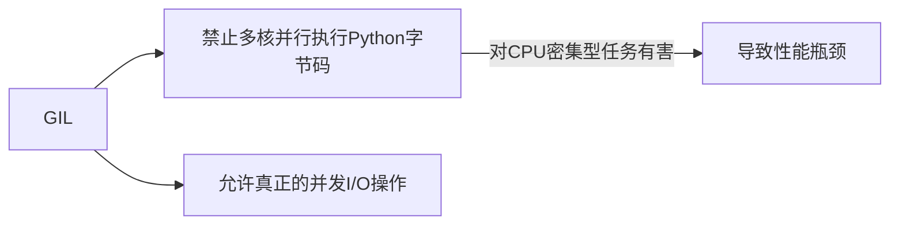
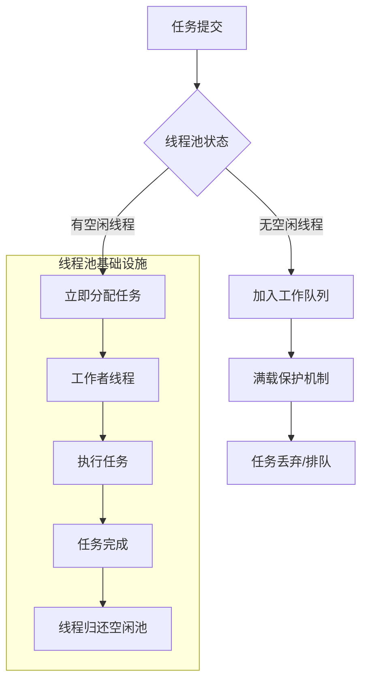
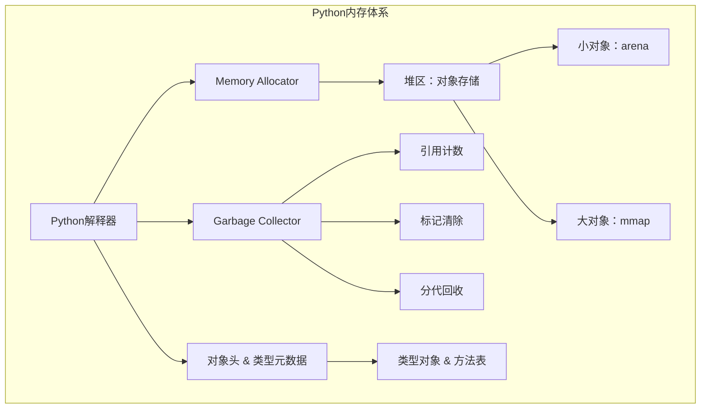
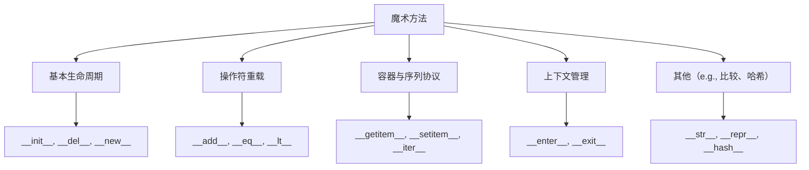
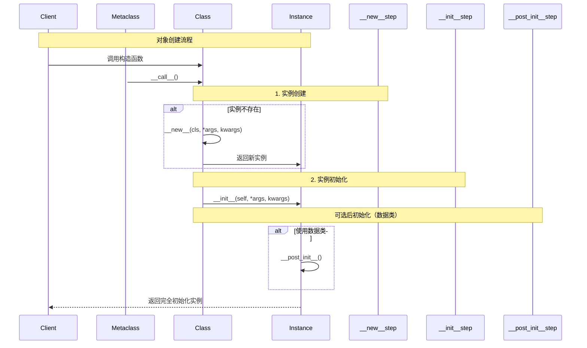
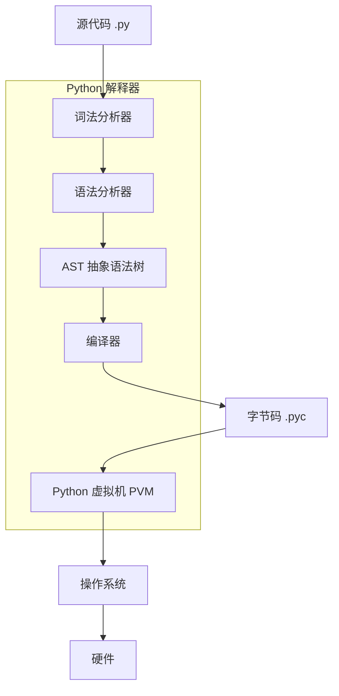
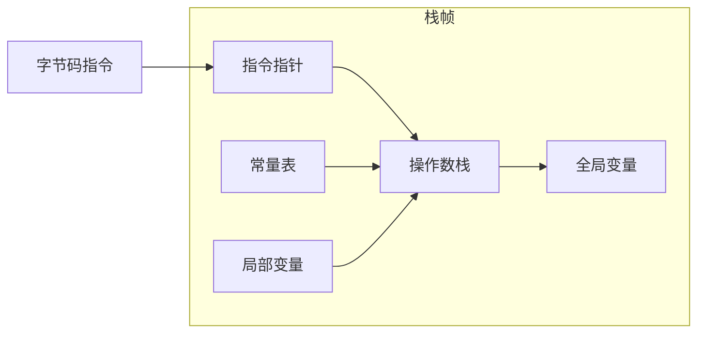

# 闭包（Closure）

## 概念

一种强大的语言特性，它允许你将函数及其词法环境打包在一起。这种机制增强了函数的扩展能力和封装性，在 Python 的装饰器、工厂函数、回调处理等方面广泛使用。一个闭包由一个函数及其捕获的外部变量（自由变量/自由绑定）组成

> 闭包 = 内部函数（嵌套函数） + 外部作用域变量（非全局变量）

换句话说：闭包让我们可以在一个函数内部访问其外部作用域中的变量，即使外部函数已经执行完毕

## 示例

```python
def outer(x):
    def inner(y):
        return x + y  # 使用了 outer 的参数 x
    return inner

# 创建一个闭包
add_five = outer(5)

# 调用闭包
print(add_five(3))  # 输出: 8
```

在这个例子中：

- `inner` 是定义在 `outer` 内部的一个嵌套函数。
- `x` 是 `outer` 的局部变量，但它被 `inner` 引用了。
- 当我们从 `outer` 返回 `inner` 时，`inner` “记住了” `x` 的值，这就是闭包。

## 判断

可以用以下条件判断一个函数是不是闭包：

1. 函数内部定义了另一个函数
1. 内部函数引用了外部函数的变量
1. 外部函数返回内部函数

此外，可以通过访问函数的 `__closure__` 属性查看自由变量信息：

```python
print(add_five.__closure__)         # (<cell at 0x...: int object at 0x...>,)
print(add_five.__closure__[0].cell_contents)  # 5
```

如果这个属性为 `None`，说明不是闭包。

## 应用场景

1. 装饰器（Decorators）

几乎是闭包最常见的应用场景：

```python
def my_decorator(func):
    def wrapper(*args, kwargs):
        print("Before function call")
        result = func(*args, kwargs)
        print("After function call")
        return result
    return wrapper

@my_decorator
def say_hello():
    print("Hello!")

say_hello()
```

装饰器本质上是利用闭包来保存原始函数对象并在新函数中增强其行为。

2. 工厂函数 / 闭包工厂模式

创建多个相似功能但不同配置的函数：

```python
def make_multiplier(n):
    def multiplier(x):
        return x * n
    return multiplier

double = make_multiplier(2)
triple = make_multiplier(3)

print(double(5))  # 输出 10
print(triple(5))  # 输出 15
```

每个函数保存了不同的外部参数（如 `n`），从而有不同的行为。

3. 维持状态不使用类

闭包可以作为简单的状态管理器：

```python
def counter():
    count = 0
    def increment():
        nonlocal count
        count += 1
        return count
    return increment

c = counter()
print(c())  # 1
print(c())  # 2
print(c())  # 3
```

这比创建一个类简单得多

## 注意事项

1. 使用 `nonlocal` 修改外部变量

当你试图修改闭包内绑定的外部作用域变量时，需要加上 `nonlocal`。

```python
def outer():
    x = 0
    def inner():
        nonlocal x  # 否则会抛 UnboundLocalError
        x += 1
        return x
    return inner
```

2. Python 中的闭包与循环陷阱

常见错误场景（尤其是在闭包和循环一起用的时候）：

```python
funcs = []
for i in range(3):
    funcs.append(lambda: i)

for f in funcs:
    print(f())  # 每次都是 2！不是 0, 1, 2
```

解决方法：使用默认参数绑定当前值：

```python
funcs = []
for i in range(3):
    funcs.append(lambda x=i: x)

for f in funcs:
    print(f())  # 现在输出 0, 1, 2
```

或更干净地使用闭包：

```python
funcs = []
for i in range(3):
    def make_func(i):
        return lambda: i
    funcs.append(make_func(i))
```

## 最佳实践

| 场景                       | 是否适用               |
| -------------------------- | ---------------------- |
| 需要持久化一些上下文/状态  | 推荐使用闭包           |
| 编写装饰器                 | 标准用途               |
| 隐藏实现细节且避免全局变量 | 闭包天然私有域         |
| 替代小型类                 | 特别适合轻量级状态函数 |
| 处理异步回调或事件驱动系统 | 可以绑定上下文         |

如果你是在构建大型项目、编写并发/异步逻辑或推动高质量 Python 代码演进，请记住：闭包能帮助你在不增加模块依赖的情况下做到轻量、灵活的状态保持，有时远胜过提前设计一套抽象类体系

# 装饰器

## 概念

在 Python 3 中，装饰器（Decorator） 是一门非常灵活且功能强大的编程技巧。它可以让你在不改变原有函数或类代码的情况下为其增加额外的功能，例如日志、权限控制、缓存、节流等等

> 装饰器本质上是一个高阶函数：接受一个函数作为参数，并返回一个新的函数（或可调用对象），通常用于包装（wrap）或增强原始函数行为

它使用 `@decorator_name` 语法应用于函数/类上方，形式类似于数学上 "f(g(x))" 的复合函数思想

## 写法

### 简单示例

```python
def my_decorator(func):
    def wrapper():
        print("Before calling func")
        func()
        print("After calling func")
    return wrapper

@my_decorator
def say_hello():
    print("Hello!")

say_hello()

# Output:
# Before calling func
# Hello!
# After calling func
```

### 函数签名问题

原函数如果带参数，则必须确保 `wrapper()` 接受对应参数列表：

```python
import functools

def logged(func):
    @functools.wraps(func)  # 保留原函数元数据（__name__, docstring等）
    def wrapper(*args, kwargs):
        print(f"Calling {func.__name__} with args={args}, kwargs={kwargs}")
        result = func(*args, kwargs)
        return result
    return wrapper
```

使用 `@functools.wraps(func)` 是良好实践，它可以帮助你避免破坏被包装函数的元信息

### 带参数的装饰器（两层函数）

```python
def repeat(times):
    def decorator(func):
        @functools.wraps(func)
        def wrapper(*args, kwargs):
            for _ in range(times):
                result = func(*args, kwargs)
            return result
        return wrapper
    return decorator

@repeat(3)
def greet(name):
    print(f"Hi, {name}")

greet("Alice")

# Output:
# Hi, Alice
# Hi, Alice
# Hi, Alice
```

结构是三明治：

```python
@decorator_with_params(params)
def target_function():
    ...
```

就是：

```python
target_function = decorator_with_params(params)(target_function)
```

### 类装饰器

装饰器也可以是一个带有 `__call__` 方法的类：

```python
class CountCalls:
    def __init__(self, func):
        self.func = func
        self.count = 0

    def __call__(self, *args, kwargs):
        self.count += 1
        print(f"{self.func.__name__} has been called {self.count} times")
        return self.func(*args, kwargs)

@CountCalls
def say_hi():
    print("Hi!")

say_hi()  # Hi! + Call count message
say_hi()  # Call again...
```

## 实用场景

1. 日志记录（Logging）

```python
import logging

def log_calls(func):
    @functools.wraps(func)
    def wrapper(*args, kwargs):
        logging.info(f"Calling {func.__name__} with args={args}, kwargs={kwargs}")
        return func(*args, kwargs)
    return wrapper
```

2. 权限检查（Authorization）

```python
def require_auth(role):
    def decorator(func):
        @functools.wraps(func)
        def wrapper(*args, kwargs):
            user = kwargs.get('user')
            if not user or user['role'] != role:
                raise PermissionError("Insufficient privileges")
            return func(*args, kwargs)
        return wrapper
    return decorator

@require_auth('admin')
def delete_user(user_id, user=None):
    ...
```

3. 耗时统计（Profiling）

```python
import time

def timer(func):
    @functools.wraps(func)
    def wrapper(*args, kwargs):
        start = time.perf_counter()
        result = func(*args, kwargs)
        print(f"{func.__name__} took {time.perf_counter() - start:.4f} seconds")
        return result
    return wrapper

@timer
def slow_function():
    time.sleep(1)
```

4. 缓存机制（Memoization）

标准库提供：

```python
from functools import lru_cache

@lru_cache(maxsize=128)
def fibonacci(n):
    if n <= 1:
        return n
    else:
        return fibonacci(n-1) + fibonacci(n-2)
```

或者手动缓存：

```python
def memoize(func):
    cache = {}
    @functools.wraps(func)
    def wrapper(*args):
        if args in cache:
            return cache[args]
        result = func(*args)
        cache[args] = result
        return result
    return wrapper
```

## 多层嵌套

你可以同时应用多个装饰器：

```python
@d1
@d2
def func():
    pass
```

等价于：

```python
func = d1(d2(func))
```

注意顺序：最靠近函数的装饰器最先执行（inside-out）

## 设计建议

在工业项目中，我们通常会对以下几点做优化和约束：

| 项目点           | 实践建议                                                   |
| ---------------- | ---------------------------------------------------------- |
| 函数签名伪造     | 使用 `functools.wraps()` 或更强大的 `functools.partial()`  |
| 异常处理包裹     | 所有 decorator 必须考虑 try-except，内部抛出更清晰的堆栈   |
| 元数据支持       | 支持 docstring/class-method property/reflection inspection |
| 单元测试覆盖     | 为每个复杂的 decorator 配备测试验证 inputs & behavior      |
| 构建文档指南     | 提供对应的 design/model/example 来说明其用途               |
| 兼容 typing/mypy | 装饰器可以违反类型检查器预期 => 编写 stub (.pyi) 保证安全  |

## 高级用法

动态注册 + inspect 模块配合

```python
import inspect

def auto_register(cls):
    """ 将所有带特定标记的 method 自动加入列表中 """
    cls._handlers = [
        method for _, method in inspect.getmembers(cls, predicate=inspect.isfunction)
        if hasattr(method, '_handler_marker')
    ]
    return cls

def handler(func):
    func._handler_marker = True
    return func

@auto_register
class EventProcessor:
    @handler
    def process_msg(self): ...

    @handler
    def process_alarm(self): ...
```

这种设计广泛用于事件处理器系统、回调队列等地方。

## 最佳实践

| 点                         | 建议                                                          |
| -------------------------- | ------------------------------------------------------------- |
| 参数正确转发               | 使用 `*args, kwargs` 并由 `functools.wraps(func)` 包含 meta   |
| 返回优化封装体             | `wrapper` 应尽量模仿原始函数语义（如 signature, annotations） |
| 禁止副作用随意暴露全局状态 | 封闭状态用闭包对象或 class 属性保持可控性                     |
| 支持 unittest              | 每个 decorator 配有 excludable mocks/test bootstrap           |

生产化模式下应加入监控、耦合追踪接口（例如我们在金融风控系统中要做到如下规范）：

```python
def monitored(func):
    @wraps(func)
    def wrapper(*args, kwargs):
        entry_ts = time.time()
        try:
            r = func(*args, kwargs)
            log_event("success", func.__name__)
            return r
        except Exception as e:
            log_event("failed", func.__name__, error=str(e))
            raise
    return wrapper
```

并在 Prometheus/Grafana/Datadog 上埋点

# 多线程

## 核心概念

Python 通过 `threading` 模块提供线程支持。关键点是理解 GIL（Global Interpreter Lock）的工作原理：



## 跨平台线程实现

1. 使用 `threading` 标准库

```python
import threading
import time

class WorkerThread(threading.Thread):
    def run(self):
        while True:
            # 处理任务
            time.sleep(0.1)  # 避免CPU占用

thread = WorkerThread(daemon=True)
thread.start()
```

1. 守护线程管理

```python
import atexit

def shutdown_hook():
    print("Shutting down threads")

atexit.register(shutdown_hook)
```

## 线程同步

1. 互斥锁（Lock）

基础同步原语，防止多个线程同时修改共享数据：

```python
from threading import Lock
from concurrent.futures import ThreadPoolExecutor

counter = 0
lock = Lock()

def increment():
    global counter
    with lock:
        counter += 1

with ThreadPoolExecutor(max_workers=10) as executor:
    futures = [executor.submit(increment) for _ in range(1000)]
    for f in futures:
        f.result()
print(counter)  # 结果为 1000
```

2. 原子操作（Atomic Operations）

对于简单的计数器任务：

```python
counter = 0
import operator
import threading

gcounter = 0  # 使用全局变量在C层级保证原子性
lock = threading.Lock()

def atomic_increment():
    global gcounter
    with lock:
        gcounter = operator.add(gcounter, 1)

# 或者使用内置原子操作
import threading
counter = 0
# 内存屏障保证原子性
```

3. 信号量（Bounded Semaphore）

限制同时访问资源的线程数量：

```python
from threading import BoundedSemaphore

db_semaphore = BoundedSemaphore(5)  # 最多5个线程同时访问数据库

def db_worker():
    with db_semaphore:
        # 执行数据库操作（可能I/O密集）
        pass
```

4. 条件变量（Condition）

实现生产者-消费者模式核心逻辑：

```python
from threading import Condition, BoundedSemaphore

class BoundedQueue:
    def __init__(self, capacity):
        self._buffer = dequе()
        self._cv = Condition()
        self._capacity = capacity

    def put(self, item):
        with self._cv:
            while len(self._buffer) >= self._capacity:
                self._cv.wait()
            self._buffer.append(item)
            self._cv.notify_all()

    def get(self):
        with self._cv:
            while not self._buffer:
                self._cv.wait()
            return self._buffer.popleft()
```

## 异步IO替代方案

当IO密集型任务占比超过70%时，考虑使用异步IO：

```python
import httpx
import asyncio

async def fetch(url):
    async with httpx.AsyncClient() as client:
        return await client.get(url)

async def main():
    tasks = [fetch(f"https://example.com/{i}") for i in range(100)]
    await asyncio.gather(*tasks)

# 运行异步任务
asyncio.run(main())
```

Python 3.11+ 异步线程支持

新版本引入 `async` 上下文管理器：

```python
from concurrent.futures import ThreadPoolExecutor

async def process_async():
    with ThreadPoolExecutor() as executor:
        await something
```

## 线程池

在生产环境中，使用线程池可以显著减少线程创建开销：

```python
from concurrent.futures import ThreadPoolExecutor, as_completed

def process_request(url):
    return requests.get(url).status_code

# 异步执行请求
urls = ['https://api.example.com' for _ in range(1000)]
with ThreadPoolExecutor(max_workers=20) as executor:
    future_to_url = {executor.submit(process_request, u): u for u in urls}
    results = {}
    for future in as_completed(future_to_url):
        url = future_to_url[future]
        try:
            results[url] = future.result()
        except Exception as exc:
            print('%r generated an exception: %s' % (url, exc))
```

### 核心架构

线程池由三个主要组件构成：

1. 工作队列 - 任务缓冲区，先进先出(FIFO)
1. 工作者线程 - 从队列中获取任务的线程池
1. 任务调度器 - 管理线程与任务的协调者



### 工作队列管理

线程池的任务队列遵循不同的调度策略：

1. FIFO：最新先到的任务后执行 (标准行为)
1. 优先级队列：允许高优先级任务插队
1. LIFO：先进先出的变体 (不建议用于大多数场景)

```python
from concurrent.futures.thread import ThreadPoolExecutor
import queue

class PriorityQueueThreadPool:
    def __init__(self, max_workers):
        self._queue = queue.PriorityQueue()
        self._worker_thread = None

    def _process(self):
        while True:
            task = self._queue.get()
            # 进行任务执行
            task()
            self._queue.task_done()
```

### 生命周期管理

线程池状态机

1. 新建：创建线程池，初始化空闲线程
1. 就绪：等待任务到达
1. 忙碌：工作者线程活跃，处理任务
1. 调整：根据负载动态增减线程
1. 终止：所有任务完成，释放资源

动态线程调整策略 - WFQ (Weighted Fair Queuing) 算法：

```python
class DynamicThreadPool:
    def __init__(self, min_workers, max_workers, idle_time=5):
        self.min_workers = min_workers
        self.max_workers = max_workers
        self.idle_time = idle_time
        self.set_thread_count(min_workers)
        self._monitor_thread = None
        self.last_busy_time = time.time()

    def _monitor(self):
        while True:
            current_time = time.time()
            if current_time - self.last_busy_time > self.idle_time:
                new_count = max(self.min_workers, self.thread_count - 1)
                self.set_thread_count(new_count)
```

### 并发控制机制

阻塞队列策略 - 处理突发请求的关键策略：

1. 拒绝策略：当队列满时的处理方式
1. 超时机制：任务等待执行的时间限制
1. 资源隔离：通过线程池实现 I/O/计算分离

```python
from concurrent.futures import ThreadPoolExecutor, Future
from typing import List

class CircuitBreakerThreadPool:
    def __init__(self, max_workers: int, queue_maxsize: int = 1000):
        self._workers = max_workers
        self._queue = queue.Queue(maxsize=queue_maxsize)
        self._active_workers = 0
        self._shutdown = False
        self.thread_pool = ThreadPoolExecutor(max_workers=self._workers)

    def submit(self, fn, *args, kwargs):
        if self._shutdown:
            raise RuntimeError("ThreadPool is shutdown")

        future = Future()
        try:
            self._queue.put_nowait((fn, args, kwargs, future))
        except queue.Full:
            # 完全拒绝新任务
            future.set_exception("ThreadPool is at capacity")
        return future

    def _worker_loop(self):
        while not self._shutdown:
            try:
                task, args, kwargs, future = self._queue.get(timeout=1.0)
                result = task(*args, kwargs)
                future.set_result(result)
            except Exception as e:
                future.set_exception(e)
```

### 任务调度策略

先进先出 vs 优先级调度

```python
from concurrent.futures import ThreadPoolExecutor, FIRST_VARIANT

class PriorityThreadPool(ThreadPoolExecutor):
    def __init__(self, max_workers, max_queue_size):
        super().__init__(max_workers)
        self._queue = PriorityQueue(maxsize=max_queue_size)

    def submit(self, fn, priority, *args, kwargs):
        self._queue.put_nowait((priority, fn, args, kwargs))
```

批处理调度优化

```python
class BatchThreadPool:
    def __init__(self, max_workers, batch_size):
        self.max_workers = max_workers
        self.batch_size = batch_size
        self.batch = []
        self._lock = threading.Lock()

    def submit(self, fn, *args, kwargs):
        with self._lock:
            self.batch.append((fn, args, kwargs))
            if len(self.batch) >= self.batch_size:
                self._execute_batch()

    def _execute_batch(self):
        threads = []
        for task in self.batch:
            t = threading.Thread(target=self._run_task, args=task)
            t.start()
            threads.append(t)
        for t in threads:
            t.join()
        self.batch.clear()
```

### 性能调优

线程池参数优化，根据并发模式选择参数：

```python
from concurrent.futures import ThreadPoolExecutor

# I/O 密集型：线程数 = 核心数 * 2
def optimize_io_bound():
    executor = ThreadPoolExecutor(max_workers=2*4, thread_name_prefix="io_worker")
    # 执行 I/O 密集型任务

# CPU 密集型：线程数 = 核心数
def optimize_cpu_bound():
    import os
    executor = ThreadPoolExecutor(max_workers=os.cpu_count(), thread_name_prefix="cpu_worker")
    # 执行计算密集型任务
```

### 综合线程池设计

集成最佳实践，实现万无一失的线程池：

```python
from concurrent.futures import ThreadPoolExecutor
from queue import Full, Empty
from abc import ABC, abstractmethod
from typing import Callable, Any, List
import logging
import threading
import time
from threading import Lock, RLock

class BaseThreadPool(ABC):
    """
    基础线程池架构 - 守护并发系统稳定的基石
    """

    def __init__(self, min_workers: int = 10, max_workers: int = 100, queue_size: int = 5000):
        self.min_workers = min_workers
        self.max_workers = max_workers
        self.queue_size = queue_size
        self._lock = Lock()
        self._shutdown_lock = RLock()
        self._active_workers = 0
        self._condition = Condition(self._lock)
        self._task_queue: List[Callable[..., Any]] = []
        self._start_time = None

    @property
    def task_count(self) -> int:
        """获取任务堆积数"""
        with self._lock:
            return len(self._task_queue)

    def _internal_submit(self, fn: Callable[..., Any], *args: Any, kwargs: Any) -> Any:
        """内部提交机制，集成资源监控"""
        with self._condition:
            self._task_queue.append((fn, args, kwargs))
            self._condition.notify_all()
            # 添加堆积数量告警逻辑
            if self.task_count > self.queue_size * 0.8:
                logging.warning(f"High task queue: {self.task_count} > {self.queue_size*0.8}")
            return

    def submit(self, fn: Callable[..., Any], *args: Any, kwargs: Any) -> Any:
        """任务提交接口"""
        with self._lock:
            if self._shutdown:
                raise RuntimeError("ThreadPool is shutdown")
            # 动态调整线程策略
            # ...
```

### 性能监控指标

每个生产环境线程池必须关注：

1. 任务堆积率：任务在队列中停留的时间趋势
1. 资源利用率：I/O Wait、上下文切换、CPU使用率
1. 错误率：任务失败与总数比例
1. 线程存活时间：内存占用随线程年龄变化曲线

```python
# 导入Python标准库进行监控
from monitor_utils import MonitorBase

class ThreadPoolMonitor(MonitorBase):
    def __init__(self):
        super().__init__()
        self.add_metric("task_queue_length")
        self.add_metric("active_threads")
        self.add_metric("completed_tasks")
        self.add_metric("task_rejection_count")
```

### 进阶工具

监控工具

1. PyInstrument - 代码级性能分析
1. Prometheus - 度量系统集成
1. gRPC/Prof - 分布式追踪

调优技巧

1. 适当使用`threading.BoundedSemaphore`，防止数据库连接池耗尽
1. 为频繁调用的IO操作考虑第三方库，如 `asyncio` 替代标准库IO操作
1. 考虑使用`concurrent.futures.ProcessPoolExecutor` 对比CPU密集型任务

# 内存管理

Python 的内存模型由 garbage collector、memory allocator 与内置对象管理器三部分协同工作：



```
Python 内存管理 =
    Python 内核 + 计算机编译器 + 操作系统分页 +
    数据中心网络缓存 + 软件订阅模型
```

## 核心机制：垃圾回收

1. 引用计数（Reference Counting）

每个 Python 对象都有一个关联的 `refcount` 计数器
采用 `atomicOp` 原子操作避免并发问题
缺点：不处理循环引用，性能开销大

```python
import sys
def test_refcount():
    a = []  # refcount=1
    print(sys.getrefcount(a))  # 获取当前作用域内的引用计数（包括自己）
    b = a  # refcount=2
    c = [a]  # refcount=3
    d = c.copy()  # refcount=4
    del a, b, c  # 剩下d的引用
    return d  # 函数退出前，该引用会被释放
```

2. 分代回收（Generational Collection）

Python 假设“对象活得越久越不可能被回收”的理论：

- 第0代：新创建的对象（存活时间短）
- 第1代：存活一轮 GC 的对象（fast tier）
- 第2代：存活多轮 GC 的对象（slow tier）

```python
import gc
gc.set阈值(500, 10, 10)  # 调整分代阈值
```

3. 标记清除（Mark-Sweep）

解决循环引用问题，但已合并到分代回收中

## 诊断工具

现场问题诊断

```python
import tracemalloc
tracemalloc.start()
# 执行待测代码
print(tracemalloc.get_top_stats(limit=10))
```

高级调试

```python
# 查看内存分配详情
import sys
stats = sys.monitoring(delta=1).items()  # sys.abiflags 替代方案

# 分析对象占用空间
from pympler import asg
snapshot = asg.asg()
stats = asg.mstats()
```

## 实战：控制与优化策略

1. 手动触发 GC 收集

```python
import gc
gc.collect(generation=0)  # 指定世代回收（谨慎使用）
```

2. 禁用/启用引用计数

```python
sys.setrecursionlimit(10000)  # 递归深度限制（隐式内存管理边界）
```

3. 核心库配置优化

```python
# redis 配置回收策略
import redis
r = redis.Redis(max_connections=1000, populate=True, prune_expired_responses=True)

# numpy 内存池配置
import numpy as np
np.set_printoptions(threshold=1000)  # 减少大型数组的输出

# 对象分配优化
class MyClass:
    __slots__ = ('x', 'y')  # 固定属性，减少对象开销
```

4. 内存对齐技巧

避免跨页中断，提升缓存局部性：

```python
import mmap
import os

with open('temp.bin', 'wb') as f:
    f.write(b'0' * 1000000)  # 预留存储空间

with open('temp.bin', 'rb') as f:
    memory = mmap.mmap(-1, 1000000, access=mmap.ACCESS_READ)
    aligned_memory = memory[offset:]  # 当机密对齐内存边界时使用
```

## 高并发环境特殊内化策略

1. 使用 `mmap` 原生内存映射

```python
import mmap

with open('large_data.bin', 'r+b') as f:
    mmapped_data = mmap.mmap(f.fileno(), 0, access=mmap.ACCESS_COPY)
    # 映射的内存不会作为 Python 堆的一部分管理
```

2. `shared_memory` 内存共享技术（Windows/Linux）

```python
from multiprocessing import shared_memory

# 创建共享内存
shm = shared_memory.SharedMemory(create=True, size=1000)
try:
    # 将 numpy 数组视图连接到共享内存
    arr = np.ndarray(shape=(100,), dtype=np.int32, buffer=shm.buf)
finally:
    shm.close()  # 关闭但保留命名对象
    shm.unlink()  # 删除共享内存
```

3. 使用 CFFI 进行零拷贝

```python
import cffi
import llvmlite

ffi = cffi.FFI()
ffi.cdef("void process_data(const uint8_t* data, size_t size);")

# 零拷贝内存传递
c_data = ffi.from_buffer("double[]", input_array)
process_data(c_data, len(input_array))
```

## 最佳实践

1. 尽可能使用内置类型（比自定义类更高效）
1. 避免创建不必要的临时对象
1. 使用 `__slots__` 替代标准类（减少内存占用约30-50%）
1. 启用 Python 内建的内存profiling
1. 手动进行小规模内存池管理
1. 优先使用预分配的内存区域

# 魔术方法

## 概览：Python 的协议系统

魔术方法（也称为 dunder methods）是 Python 对象模型的基石。它们不是真的"魔术"，而是一套定义明确的协议接口，通过实现这些方法，你的类可以：

- 模拟内置类型行为
- 与运算符无缝集成
- 响应内置函数调用
- 控制对象生命周期

当 Python 解释器遇到特定语法时，它会自动调用对应的魔术方法。例如 `a + b` 会触发 `a.__add__(b)` 或 `b.__radd__(a)`。

类型契约要求：所有公共接口方法必须包含精确的类型签名与文档字符串：

```python
class MyType:
    def __add__(self, other: "MyType") -> "MyType":
        """
        返回两个 MyType 对象相加的新对象

        Args:
            other: 另一个 MyType 实例

        Returns:
            新的 MyType 实例

        Raises:
            TypeError: 如果参数类型不匹配
        """
        if not isinstance(other, MyType):
            raise TypeError("Operands must be MyType instances")
        return MyType(self.value + other.value)
```

## 分类详解



### 创建与初始化协议



关键方法实现：

```python
class OptimizedObject:
    def __new__(cls, *args, kwargs):
        """控制实例创建过程（单例模式常用）"""
        if not hasattr(cls, '_instance'):
            cls._instance = super().__new__(cls)
        return cls._instance

    def __init__(self, value: int):
        """实例初始化"""
        self.value: int = value

    def __del__(self):
        """析构函数 - 谨慎使用"""
        # 释放资源（文件句柄、数据库连接等）
        # 注意：不要依赖__del__进行关键清理，GC时机不确定
        pass

    def __repr__(self) -> str:
        """开发友好的字符串表示"""
        return f"{self.__class__.__name__}(value={self.value})"

    def __str__(self) -> str:
        """用户友好的字符串表示"""
        return f"Optimized Object: {self.value}"
```

最佳实践：

- 永远让 `__repr__` 返回尽可能精确的对象表示
- `__str__` 用于面向用户的输出
- `__del__` 中避免抛出异常，只做释放非关键资源

### 比较与排序协议

```python
from functools import total_ordering
from typing import Any

@total_ordering  # 自动填充其他比较方法
class DataPoint:
    def __init__(self, x: int, y: int):
        self.x = x
        self.y = y

    def __eq__(self, other: Any) -> bool:
        """相等性检查"""
        if not isinstance(other, DataPoint):
            return NotImplemented
        return (self.x, self.y) == (other.x, other.y)

    def __lt__(self, other: Any) -> bool:
        """小于比较"""
        if not isinstance(other, DataPoint):
            return NotImplemented
        return (self.x, self.y) < (other.x, other.y)
```

实现关键点：

1. 始终检查类型兼容性，返回 `NotImplemented` 而非直接抛出异常
1. 使用 `@total_ordering` 装饰器减少重复代码
1. 比较方法应实现为严格偏序关系（反对称性、传递性）

### 算术运算符协议

```python
class Vector:
    def __init__(self, x: float, y: float):
        self.x = x
        self.y = y

    def __add__(self, other: "Vector") -> "Vector":
        """加法运算：self + other"""
        if not isinstance(other, Vector):
            return NotImplemented
        return Vector(self.x + other.x, self.y + other.y)

    def __radd__(self, other: "Vector") -> "Vector":
        """右加法处理：other + self"""
        return self.__add__(other)  # 加法可交换

    def __iadd__(self, other: "Vector") -> "Vector":
        """原地加法：self += other"""
        if not isinstance(other, Vector):
            return NotImplemented
        self.x += other.x
        self.y += other.y
        return self

    def __mul__(self, scalar: float) -> "Vector":
        """标量乘法"""
        if not isinstance(scalar, (int, float)):
            return NotImplemented
        return Vector(self.x * scalar, self.y * scalar)

    def __matmul__(self, other: "Vector") -> float:
        """矩阵乘法（点积）Python 3.5+"""
        if not isinstance(other, Vector):
            return NotImplemented
        return self.x * other.x + self.y * other.y
```

实现规则：

1. 每个数学运算符都有一对方法：`__op__` 和 `__rop__`
1. 原地运算符（`__iop__`）应返回 `self` 以达到链式操作
1. 对于类型不匹配的情况返回 `NotImplemented`

### 容器类型协议

```python
class SparseMatrix:
    """稀疏矩阵实现"""
    def __init__(self, rows: int, cols: int):
        self._data = {}
        self.rows = rows
        self.cols = cols

    def __len__(self) -> int:
        """返回元素数量"""
        return self.rows * self.cols

    def __getitem__(self, key: tuple[int, int]) -> float:
        """矩阵索引访问"""
        row, col = key
        if not (0 <= row < self.rows and 0 <= col < self.cols):
            raise IndexError("Matrix index out of range")
        return self._data.get((row, col), 0.0)

    def __setitem__(self, key: tuple[int, int], value: float) -> None:
        """矩阵元素赋值"""
        row, col = key
        if not (0 <= row < self.rows and 0 <= col < self.cols):
            raise IndexError("Matrix index out of range")
        if value != 0.0:  # 只存储非零值
            self._data[(row, col)] = value
        elif (row, col) in self._data:
            del self._data[(row, col)]

    def __contains__(self, key: tuple[int, int]) -> bool:
        """成员检查"""
        return key in self._data

    def __iter__(self) -> Iterator[tuple[int, int, float]]:
        """迭代非零元素"""
        return iter((r, c, v) for (r, c), v in self._data.items())

    def __reversed__(self) -> Iterator[tuple[int, int, float]]:
        """反向迭代"""
        return reversed(list(self.__iter__()))
```

容器协议关键点：

- `__len__` 应恒定时间返回值
- `__getitem__` 支持切片操作时需处理 `slice` 对象
- `__iter__` 返回迭代器对象
- 实现 `__reversed__` 需确保与 `__iter__` 顺序一致

### 可调用对象协议

```python
class Multiplier:
    def __init__(self, factor: float):
        self.factor = factor

    def __call__(self, value: float) -> float:
        """使实例可被调用"""
        return self.factor * value

# 使用示例
double = Multiplier(2.0)
result = double(5.0)  # 输出 10.0，实际调用 double.__call__(5.0)
```

### 上下文管理协议

```python
from typing import IO, Any
import sqlite3

class DatabaseConnection:
    def __init__(self, db_path: str):
        self.db_path = db_path
        self.conn: sqlite3.Connection | None = None

    def __enter__(self) -> sqlite3.Connection:
        """进入with语句块时调用"""
        self.conn = sqlite3.connect(self.db_path)
        return self.conn

    def __exit__(
        self,
        exc_type: type[BaseException] | None,
        exc_val: BaseException | None,
        exc_tb: Any
    ) -> bool | None:
        """退出with语句块时调用"""
        if self.conn:
            if exc_type is None:
                self.conn.commit()
            else:
                self.conn.rollback()
            self.conn.close()
        # 返回False（或None）表示异常应传播
        # 返回True表示已处理异常
        return None

# 使用示例
with DatabaseConnection("app.db") as conn:
    conn.execute("INSERT INTO ...")
```

### 反射与内省协议

```python
class FlexibleObject:
    def __getattr__(self, name: str) -> Any:
        """属性访问失败时调用"""
        if name.startswith("dynamic_"):
            return f"Dynamic attribute: {name}"
        raise AttributeError(f"'{self.__class__.__name__}' has no attribute '{name}'")

    def __setattr__(self, name: str, value: Any) -> None:
        """属性赋值拦截"""
        if name.startswith("protected_"):
            raise AttributeError(f"Cannot modify protected attribute: {name}")
        super().__setattr__(name, value)

    def __dir__(self) -> list[str]:
        """自定义dir()输出"""
        return ["standard_attr", "dynamic_method"] + [a for a in self.__dict__ if not a.startswith("_")]

    def __getattribute__(self, name: str) -> Any:
        """所有属性访问的终极拦截点"""
        # 谨慎使用，易导致无限递归
        attr = object.__getattribute__(self, name)
        if callable(attr) and not name.startswith("__"):
            def wrapper(*args, kwargs):
                print(f"Calling {name} with {args}")
                return attr(*args, kwargs)
            return wrapper
        return attr
```

## 高级魔法模式

### 描述符协议（属性控制核心）

```python
from typing import Any, Callable, Optional
from weakref import WeakKeyDictionary

class ValidationDescriptor:
    """类型验证描述符"""
    def __init__(self, name: str, type_: type):
        self.name = name
        self.type = type_
        self._values = WeakKeyDictionary()  # 避免内存泄漏

    def __get__(self, obj: Any, objtype: Optional[type] = None) -> Any:
        if obj is None:
            return self
        return self._values.get(obj, None)

    def __set__(self, obj: Any, value: Any) -> None:
        if not isinstance(value, self.type):
            raise TypeError(f"Expected {self.type}, got {type(value)}")
        self._values[obj] = value

class Model:
    name = ValidationDescriptor("name", str)
    age = ValidationDescriptor("age", int)

# 使用示例
m = Model()
m.name = "Alice"  # 正常
m.age = 30        # 正常
try:
    m.age = "thirty"  # 触发 TypeError
except TypeError as e:
    print(e)  # Expected <class 'int'>, got <class 'str'>
```

### 元类（类的生成器）

```python
from typing import Any, Dict, Type, Tuple, TypeVar, ClassVar
from dataclasses import dataclass

T = TypeVar("T")

class FieldMeta(type):
    """自动添加FIELD_REGISTRY的元类"""
    def __new__(
        mcls: Type[T],
        name: str,
        bases: Tuple[type, ...],
        namespace: Dict[str, Any]
    ) -> T:
        # 收集所有以_field结尾的属性
        fields = {k: v for k, v in namespace.items() if k.endswith("_field")}

        # 向类添加FIELD_REGISTRY类属性
        namespace["FIELD_REGISTRY"] = fields

        # 创建类对象
        cls = super().__new__(mcls, name, bases, namespace)
        return cls

# 使用元类的基类
class BaseModel(metaclass=FieldMeta):
    pass

class UserModel(BaseModel):
    username_field = "default_user"
    age_field = 18
    email_field = "user@example.com"

# 自动生成的注册表
print(UserModel.FIELD_REGISTRY)
# 输出: {'username_field': 'default_user', 'age_field': 18, 'email_field': 'user@example.com'}
```

### 序列化协议（JSON支持）

```python
import json
from typing import Any, Dict, Union

class Serializable:
    def to_dict(self) -> Dict[str, Any]:
        """转换为字典"""
        return {
            k: v
            for k, v in self.__dict__.items()
            if not k.startswith("_") and not callable(v)
        }

    def __json__(self) -> Dict[str, Any]:
        """JSON序列化接口"""
        return self.to_dict()

    @classmethod
    def from_dict(cls: type[T], data: Dict[str, Any]) -> T:
        """从字典创建实例"""
        instance = cls()
        for k, v in data.items():
            setattr(instance, k, v)
        return instance

# 自定义JSON编码器
class SerializableEncoder(json.JSONEncoder):
    def default(self, obj: Any) -> Union[Dict[str, Any], Any]:
        if hasattr(obj, "__json__"):
            return obj.__json__()
        return super().default(obj)

# 使用示例
@dataclass
class User(Serializable):
    username: str
    email: str

user = User("bob", "bob@example.com")
json_str = json.dumps(user, cls=SerializableEncoder, indent=2)
print(json_str)
"""
输出:
{
  "username": "bob",
  "email": "bob@example.com"
}
"""

# 反序列化
data = json.loads(json_str)
restored_user = User.from_dict(data)
print(restored_user.username)  # 输出: bob
```

## 性能考虑与陷阱规避

### 性能优化技巧

1. 避免频繁创建临时对象：

   ```python
   # 差：每次循环创建新对象
   for i in range(1000):
       v = Vector(i, i)
       result += v

   # 好：就地操作
   v = Vector(0, 0)
   for i in range(1000):
       v.x += i
       v.y += i
   ```

1. 使用 `__slots__` 减少内存占用：

   ```python
   class OptimizedVector:
       __slots__ = ["x", "y"]  # 防止动态属性创建
       def __init__(self, x, y):
           self.x = x
           self.y = y
   ```

1. 缓存计算结果：

   ```python
   from functools import cached_property

   class ExpensiveCalculation:
       @cached_property
       def complex_attribute(self) -> float:
           print("Performing expensive calculation...")
           return sum(i2 for i in range(100000))
   ```

### 常见陷阱与规避

| 魔术方法      | 常见陷阱                   | 解决方案                         |
| ------------- | -------------------------- | -------------------------------- |
| `__init__`    | 返回非None值               | 永远不应返回值                   |
| `__del__`     | 循环引用导致永不调用       | 使用弱引用或显式清理方法         |
| `__getattr__` | 访问`__dict__`导致无限递归 | 使用`super().__getattribute__`   |
| `__eq__`      | 返回非布尔值               | 确保总是返回bool或NotImplemented |
| `__hash__`    | 可变对象被哈希             | 只有不可变对象才实现`__hash__`   |
| `__iter__`    | 返回非迭代器对象           | 返回迭代器对象                   |

### 线程安全考虑

```python
import threading

class ThreadSafeCounter:
    def __init__(self):
        self._value = 0
        self._lock = threading.Lock()

    def __iadd__(self, other: int) -> "ThreadSafeCounter":
        """线程安全的加法"""
        with self._lock:
            self._value += other
        return self

    def __str__(self) -> str:
        """线程安全的字符串表示"""
        with self._lock:
            return str(self._value)

    def __repr__(self) -> str:
        """线程安全的开发表示"""
        with self._lock:
            return f"ThreadSafeCounter(value={self._value})"
```

# 代码执行过程

理解 Python 代码如何执行对开发者至关重要，它帮助我们：

- 调试复杂问题：知道代码在受限环境（如嵌入式系统）中的行为
- 性能优化：识别热点和瓶颈
- 安全审计：理解潜在漏洞路径
- 工具构建：开发调试器、性能分析器等工具
- 架构设计：确保系统在各种环境下的稳定运行

Python 代码执行分为多个层次，从高层到底层：

1. 源代码层：`.py` 文件中的代码
1. 编译层：源代码转换为字节码
1. 虚拟机层：字节码被 Python 虚拟机执行
1. 硬件抽象层：与操作系统和硬件交互

## Python 执行模型

Python 执行过程采用编译-解释混合模型，包含关键组件：



1. 词法分析（Lexical Analysis）- 词法分析器将源代码分解为一系列"标记"(tokens)：

```python
# 示例代码：a = b + 3
# 词法分析结果：
NAME 'a'
OP '='
NAME 'b'
OP '+'
NUMBER '3'
NEWLINE
ENDMARKER
```

2. 语法分析（Syntax Analysis）- 语法分析器将标记组织成抽象语法树(AST)，表示代码的结构：

```python
# 对于 a = b + 3 生成的 AST 结构
Module(
    body=[
        Assign(
            targets=[Name(id='a', ctx=Store())],
            value=BinOp(
                left=Name(id='b', ctx=Load()),
                op=Add(),
                right=Constant(value=3)
            )
        )
    ],
    type_ignores=[]
)
```

3. 编译（Compilation）- 编译器将 AST 转换为字节码(bytecode)，这些是 Python 虚拟机可以理解的指令序列：

```python
def add_numbers():
    a = 1 + 2

# 使用 dis 模块查看字节码
import dis
dis.dis(add_numbers)
"""
输出:
  4           0 LOAD_CONST               1 (1)
              2 LOAD_CONST               2 (2)
              4 BINARY_ADD
              6 STORE_FAST               0 (a)
              8 LOAD_CONST               0 (None)
             10 RETURN_VALUE
"""
```

4. Python 虚拟机（PVM）- Python 虚拟机是一个栈式计算机，负责执行字节码：



## 实例分析

让我们通过一个简单函数分析执行过程：

```python
def calculate_sum(x, y):
    result = x + y
    return result

# 调用函数
total = calculate_sum(3, 5)
```

步骤解析：

1. 函数定义阶段：
   - 语法分析生成 AST
   - 编译生成字节码
   - 函数对象创建，包含字节码和关联的命名空间信息

1. 函数调用阶段：
   - 创建新的栈帧(frame)对象，包含：
     - 局部变量表（x=3, y=5）
     - 操作数栈（初始为空）
     - 代码对象（函数的字节码）
     - 指令指针（指向第一条指令）
   - 推入调用栈

1. 字节码执行阶段：

   ```
   0 LOAD_FAST                0 (x)    # 将x压入栈顶
   2 LOAD_FAST                1 (y)    # 将y压入栈顶
   4 BINARY_ADD                        # 执行加法操作
   6 STORE_FAST               2 (result) # 存储结果
   8 LOAD_FAST                2 (result) # 将结果压入栈顶
   10 RETURN_VALUE                      # 返回栈顶值
   ```

1. 返回值处理：
   - 返回值出栈并传递给调用方
   - 栈帧对象弹出调用栈
   - 可能触发垃圾回收（如果栈帧无其他引用）

## 实践与优化

1. 性能优化关键点

理解执行过程可以指导我们进行性能优化：

```python
# 低效写法：每次循环都执行属性查找
for item in my_list:
    process(item.method())

# 高效写法：提前绑定方法避免查找开销
method = item.method
for item in my_list:
    process(method(item))
```

性能提升关键：

- 提前绑定方法减少属性查找开销
- 局部变量访问速度快于全局变量和属性访问
- 使用`__slots__`减少内存占用和访问时间

2. 内存管理机制

Python 使用引用计数为主、分代回收为辅的内存管理：

```python
import sys
import gc

# 示例对象
a = []
b = a
print(sys.getrefcount(a))  # 输出引用计数 (会多1因为getrefcount参数也引用了a)

# 循环引用问题
a.append(b)
b.append(a)  # 形成循环引用

# 手动触发垃圾回收
gc.collect()  # 回收循环引用的对象
```

内存管理优化策略：

- 使用弱引用(weakref)解决循环引用
- 避免不必要的对象创建
- 使用`__slots__`减少内存占用
- 考虑使用`array`或`numpy`代替列表处理大数据

3. 调试与剖析技巧

使用调试器和性能剖析工具深入理解执行过程：

```python
# 使用sys.settrace跟踪执行
def trace_calls(frame, event, arg):
    if event == 'call':
        print(f"Calling {frame.f_code.co_name} on line {frame.f_lineno}")
    elif event == 'line':
        print(f"Executing line {frame.f_lineno}")
    return trace_calls

# 设置跟踪函数
sys.settrace(trace_calls)

# 执行需要分析的代码
my_function()

# 禁用跟踪
sys.settrace(None)
```

高级剖析工具：

- `cProfile`：函数级别性能分析
- `line_profiler`：行级别性能分析
- `memory_profiler`：内存使用分析
- `py-spy`：采样分析器，无侵入性

4. 字节码优化技术

直接操作字节码进行优化（高级技巧）：

```python
import types
import dis

def optimized_add(a, b):
    return a + b

# 获取函数字节码
bytecode = optimized_add.__code__.co_code

# 创建新的代码对象
new_code = types.CodeType(
    optimized_add.__code__.co_argcount,
    optimized_add.__code__.co_kwonlyargcount,
    optimized_add.__code__.co_nlocals,
    optimized_add.__code__.co_stacksize,
    optimized_add.__code__.co_flags,
    bytecode,  # 修改后的字节码
    optimized_add.__code__.co_consts,
    optimized_add.__code__.co_names,
    optimized_add.__code__.co_varnames,
    optimized_add.__code__.co_filename,
    optimized_add.__code__.co_name,
    optimized_add.__code__.co_firstlineno,
    optimized_add.__code__.co_lnotab,
    optimized_add.__code__.co_freevars,
    optimized_add.__code__.co_cellvars
)

# 创建新函数
new_func = types.FunctionType(new_code, optimized_add.__globals__)
```

# 深拷贝与浅拷贝

理解 Python 的基本对象模型：

```python
# Python 变量存储的是对象的引用（地址），而非对象本身
a = [1, 2, 3]  # 变量 a 存储的是列表对象的内存地址
b = a          # 变量 b 存储的是同一个地址
print(a is b)  # 输出: True，表示它们指向同一个对象

# 修改 b 会影响 a，因为它们引用同一个对象
b.append(4)
print(a)  # 输出: [1, 2, 3, 4]
```

## 浅拷贝（Shallow Copy）

> 浅拷贝创建一个新对象，但不递归复制其包含的子对象

实现方式：

```python
import copy

# 创建原始对象
original = [1, 2, [3, 4]]

# 方法1: 使用 copy.copy() 函数
shallow_copy1 = copy.copy(original)

# 方法2: 使用对象的 copy() 方法
shallow_copy2 = original.copy()

# 方法3: 使用切片
shallow_copy3 = original[:]

# 方法4: 使用列表构造函数
shallow_copy4 = list(original)

# 方法5: 使用列表推导式
shallow_copy5 = [x for x in original]
```

行为分析：

```python
import copy

original = [1, 2, [3, 4]]
shallow_copy = copy.copy(original)

# 修改浅拷贝中的不可变元素
shallow_copy[0] = 'changed'
print(original[0])  # 输出: 1（不受影响）

# 修改浅拷贝中的可变对象
shallow_copy[2].append('modified')
print(original)  # 输出: [1, 2, [3, 4, 'modified']]（受影响）
```

内存模型：

```
原始对象:
+------------+      +------------+
|   original |      | shallow_  |
|  +----+    |      |   copy    |
|  | 0  |──1-->     |  +----+    |
|  | 1  |──2-->     |  | 0  |──1-->
|  | 2  |───> +-----+  | 1  |──2-->
|  +----+     |        | 2  |───> +------------------+
+------------+        |  +----+    | 可变对象 [3, 4] |
                      +------------+ 'modified'      |
                                                        +------------------+
                                                        | 共享的列表对象  |
                                                        +------------------+
```

## 深拷贝（Deep Copy）

> 深拷贝创建一个新对象，并递归复制所有嵌套的可变对象。

实现方式：

```python
import copy

original = [1, 2, [3, 4]]

# 深拷贝
deep_copy = copy.deepcopy(original)
```

行为分析：

```python
import copy

original = [1, 2, [3, 4]]
deep_copy = copy.deepcopy(original)

# 修改深拷贝中的不可变元素
deep_copy[0] = 'changed'
print(original[0])  # 输出: 1（不受影响）

# 修改深拷贝中的可变对象
deep_copy[2].append('modified')
print(original)  # 输出: [1, 2, [3, 4]]（不受影响）
```

内存模型：

```
原始对象:               深拷贝对象:
+------------+      +------------+
|   original |      |  deep_    |
|  +----+    |      |   copy    |
|  | 0  |──1-->     |  +----+    |
|  | 1  |──2-->     |  | 0  |──1-->
|  | 2  |───> +-----+  | 1  |──2-->
|  +----+     |        | 2  |───> +------------------+
+------------+        |  +----+    | 新的列表对象    |
                      +------------+ [3, 4, 'modified']|
                                                        +------------------+
                                                        | 独立的列表对象  |
                                                        +------------------+
```

## 关键区别

| 特性           | 浅拷贝 (Shallow Copy)                  | 深拷贝 (Deep Copy)                         |
| -------------- | -------------------------------------- | ------------------------------------------ |
| 创建方式       | `copy.copy()`, `obj.copy()`, 切片等    | `copy.deepcopy()`                          |
| 嵌套对象处理   | 不递归复制子对象，共享引用             | 递归复制所有对象，完全独立                 |
| 不可变对象处理 | 共享不可变对象（整数、字符串、元组等） | 共享不可变对象（效率更高）                 |
| 可变对象处理   | 共享可变对象（列表、字典、集合等）     | 创建新副本                                 |
| 内存使用       | 较少（仅复制最外层对象）               | 较多（递归复制所有对象）                   |
| 执行速度       | 较快                                   | 较慢（递归复制消耗更多资源）               |
| 适用场景       | 不可变对象或不需要修改的可变对象       | 需要完全隔离的对象或需要修改嵌套的可变对象 |
| 自定义实现     | 实现`__copy__`方法                     | 实现`__deepcopy__`方法                     |

## 应用场景

函数参数保护（深拷贝示例）

```python
def process_data(data):
    """处理数据但不修改原始数据"""
    # 使用深拷贝保护原始数据
    data_copy = copy.deepcopy(data)

    # 处理拷贝的数据
    data_copy['value'] *= 2
    data_copy['items'].append('new_item')

    return data_copy

# 原始数据
original_data = {
    'value': 10,
    'items': ['a', 'b', 'c']
}

# 处理数据
processed = process_data(original_data)

# 验证原始数据未被修改
print("Original:", original_data)
# 输出: {'value': 10, 'items': ['a', 'b', 'c']}
print("Processed:", processed)
# 输出: {'value': 20, 'items': ['a', 'b', 'c', 'new_item']}
```

缓存实现（浅拷贝示例）

```python
class SimpleCache:
    """简单的缓存实现，使用浅拷贝"""

    def __init__(self):
        self._data = {}

    def set(self, key, value):
        """缓存对象（使用浅拷贝）"""
        self._data[key] = value.copy() if hasattr(value, 'copy') else value

    def get(self, key):
        """获取缓存对象（返回拷贝）"""
        cached = self._data.get(key)
        if cached is not None and hasattr(cached, 'copy'):
            return cached.copy()
        return cached

# 使用缓存
cache = SimpleCache()
data = {'items': [1, 2, 3], 'count': 3}
cache.set('my_data', data)

# 获取数据副本
cached_data = cache.get('my_data')
cached_data['items'].append(4)

# 原始数据不受影响
print("Cached data:", cache.get('my_data'))
# 输出: {'items': [1, 2, 3], 'count': 3}
```

自定义拷贝行为

```python
class Person:
    """自定义对象的拷贝行为"""

    def __init__(self, name, age, friends=None):
        self.name = name
        self.age = age
        self.friends = friends or []

    def __copy__(self):
        """自定义浅拷贝行为"""
        # 创建新实例，friends列表共享
        print("Custom shallow copy executed")
        return Person(self.name, self.age, self.friends)

    def __deepcopy__(self, memo):
        """自定义深拷贝行为"""
        # 创建新实例，friends列表深拷贝
        print("Custom deep copy executed")
        return Person(self.name, self.age, copy.deepcopy(self.friends, memo))

    def __repr__(self):
        return f"Person(name={self.name}, age={self.age}, friends={self.friends})"

# 创建对象
alice = Person("Alice", 30, [Person("Bob", 28)])

# 测试浅拷贝
shalice = copy.copy(alice)
shalice.name = "Alice S"
shalice.friends[0].name = "Bobby"
print("Original after shallow copy:", alice)
# 输出: Person(name=Alice, age=30, friends=[Person(name=Bobby, age=28)])

# 测试深拷贝
depalice = copy.deepcopy(alice)
depalice.name = "Alice D"
depalice.friends[0].name = "Robert"
print("Original after deep copy:", alice)
# 输出: Person(name=Alice, age=30, friends=[Person(name=Bobby, age=28)])
```

## 最佳实践

| 场景                   | 推荐方式               | 理由                           |
| ---------------------- | ---------------------- | ------------------------------ |
| 仅包含不可变对象       | 浅拷贝或赋值           | 不可变对象无法修改，无需深拷贝 |
| 包含可变对象的简单结构 | 浅拷贝                 | 平衡性能和安全性               |
| 复杂嵌套结构           | 深拷贝                 | 确保完全隔离，避免意外修改     |
| 大型数据结构           | 自定义拷贝或惰性拷贝   | 避免深拷贝的性能开销           |
| 需要共享部分状态       | 混合策略               | 精确控制共享范围               |
| 多线程环境             | 深拷贝或不可变数据结构 | 避免竞争条件                   |

1. 陷阱：误以为对象创建会自动拷贝

```python
# 错误理解：创建新列表会自动复制内容
list1 = [1, 2, 3]
list2 = list1  # 只是引用，不是拷贝
list2[0] = 99
print(list1[0])  # 输出: 99（受影响）
```

2. 陷阱：对不可变对象使用深拷贝

```python
# 不必要地深拷贝不可变对象
x = 42  # 不可变对象
y = copy.deepcopy(x)  # 性能浪费
print(x is y)  # 优化情况下可能返回True（Python可能重用不可变对象）
```

3. 陷阱：忽略循环引用

```python
# 循环引用示例
a = [1]
b = [2]
a.append(b)  # a = [1, [2]]
b.append(a)  # b = [2, [...]] 循环引用

# 深拷贝正确处理循环引用
c = copy.deepcopy(a)
# 不会无限递归
```
