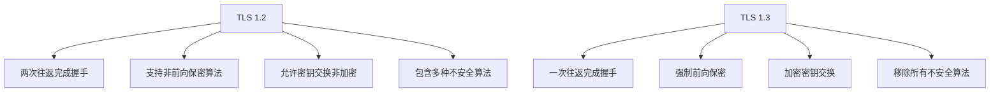
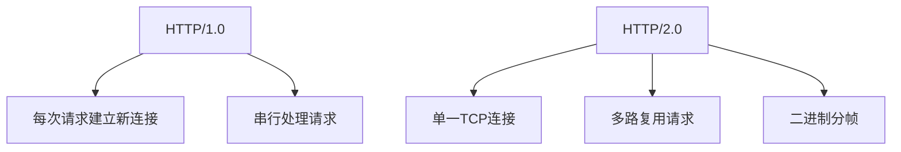

# HTTP请求结构

```http
POST /api/login HTTP/1.1
Host: example.com
User-Agent: Mozilla/5.0
Content-Type: application/json
Content-Length: 42

{"username":"admin","password":"123456"}
```

## 请求行(Request Line)

- HTTP方法：如GET、POST、PUT、DELETE等，指示请求的操作类型
- 请求URI：标识请求的具体资源路径
- HTTP版本：如HTTP/1.1或HTTP/2

示例：

```http
GET /index.html HTTP/1.1
```

### HTTP方法

- 语义化使用：遵循RESTful设计原则，为不同操作选择适当的方法
- 访问控制：实施适当的认证和授权机制
- 输入验证：对所有提交数据进行严格验证
- 传输安全：使用HTTPS保护敏感数据传输
- 最小权限：确保用户只能执行被授权的操作

#### GET（从服务器获取资源）

- 参数通过URL查询字符串传递
- 应该是幂等的(多次返回相同结果)
- 应该是安全的(不修改服务器状态)
- 数据通常会被缓存

敏感信息不应通过GET传递，因为会出现在浏览器历史、服务器日志等位置

#### POST（向服务器提交数据，通常会导致服务器状态改变）

- 数据在请求体中发送
- 不是幂等的(可能导致多次创建资源)
- 通常不会被缓存

必须严格验证输入数据，防止XSS、SQL注入等攻击

#### PUT（更新服务器上的资源，若不存在则创建资源）

- 是幂等的(多次相同请求结果相同)

需要确保用户有更新权限，防止未授权修改

#### DELETE（删除服务器上的资源）

- 是幂等的

需要严格的权限验证，防止数据误删

#### HEAD（与GET类似，但服务器只返回响应头，不返回响应体）

- 常用于检查资源是否存在或获取资源元数据
- 是安全的和幂等的

#### OPTIONS（获取服务器支持的HTTP方法和其他选项）

- 常用于CORS(跨域资源共享)预检请求
- 是安全的和幂等的

#### PATCH（对资源进行部分修改）

- 不是幂等的

#### CONNECT（建立到服务器的隧道连接，通常用于HTTPS代理）

- 主要用于代理场景

#### TRACE（测试或诊断目的，服务器返回接收到的请求）

- 特点：可能引发跨站跟踪攻击(XST)，建议禁用或限制使用

## 请求头(Request Headers)

提供关于请求或客户端的附加信息，常见头字段包括：

- `Accept-Encoding`：客户端支持的编码方式
- `Accept`：客户端可接受的内容类型
- `Authorization`：身份验证凭据
- `Connection`：连接类型(如keep-alive)
- `Content-Length`：请求体的字节长度
- `Content-Type`：请求体的内容类型(POST/PUT请求)
- `Cookie`：服务器端的会话信息
- `Host`：目标服务器域名和端口号
- `Referer`：请求来源页面的URL
- `User-Agent`：客户端类型和版本信息

### 通用请求头（应用于整个HTTP请求，不限于特定内容）

- `Cache-Control` - 控制缓存行为
- `Connection` - 管理持久连接(如keep-alive)
- `Date` - 请求创建的日期和时间
- `Pragma` - 兼容HTTP/1.0的缓存控制指令
- `Transfer-Encoding` - 指定传输消息体的编码方式
- `Upgrade` - 允许协议升级

### 实体请求头（描述请求体的内容）

- `Content-Encoding` - 内容编码方式(如gzip)
- `Content-Language` - 内容使用的自然语言
- `Content-Length` - 请求体的字节大小
- `Content-Location` - 资源的备用位置
- `Content-Type` - 请求体的MIME类型(如application/json)

### 请求特定头（包含请求本身的详细信息）

- `Accept-Charset` - 支持的字符集
- `Accept-Encoding` - 支持的内容编码
- `Accept-Language` - 偏好的自然语言
- `Accept` - 客户端可接受的内容类型
- `Host` - 目标服务器域名和端口
- `User-Agent` - 发起请求的客户端信息

### 安全相关请求头

- `Authorization` - 包含认证凭据
- `Cookie` - 发送到服务器的会话数据
- `Origin` - 跨域请求的发起来源
- `Referer` - 请求来源页面
- `X-Forwarded-For` - 通过代理时的原始客户端IP
- `X-Requested-With` - 区分AJAX请求(通常为XMLHttpRequest)

### 条件请求头

- `If-Modified-Since` - 仅在资源修改后才获取
- `If-None-Match` - 仅在资源不匹配ETag时获取
- `If-Unmodified-Since` - 仅在资源未修改时获取

## 空行

请求头和请求体之间的分隔符，由回车换行符(CRLF)组成

## 请求体(Request Body)

包含实际发送到服务器的数据，常见于POST、PUT等请求方法。内容格式取决于Content-Type头

### 表单数据

application/x-www-form-urlencoded

- 键值对格式，使用`&`连接，键和值用`=`连接
- 空格转换为`+`，特殊字符进行URL编码
- 示例：`username=john&password=12345`

multipart/form-data

- 用于文件上传和数据包含二进制内容
- 包含多个边界分隔的部分(part)
- 示例：表单提交并同时上传图片文件

### 结构化数据

application/json

- 现代Web应用中最常用的数据格式
- 示例：`{"username":"john","email":"john@example.com"}`

application/xml

- 基于XML标签的层次化数据结构
- 示例：`<user><name>john</name><email>john@example.com</email></user>`

### 文本与二进制数据

文本类型

- text/plain：纯文本
- text/html：HTML内容
- text/csv：CSV格式数据

二进制类型

- application/octet-stream：通用二进制流
- application/pdf：PDF文档
- image/jpeg、image/png：图像文件
- application/zip：压缩文件

### 多部分消息类型

- multipart/related：相关文档组合
- multipart/alternative：同一内容的多种表示
- multipart/mixed：不同类型的混合内容

# 状态码

HTTP状态码分为5大类，以1-5开头数字表示不同的响应状态

## 信息性状态码(1xx)

- 100 Continue: 服务器已收到请求的一部分，客户端应继续发送其余部分
- 101 Switching Protocols: 服务器切换协议

## 成功状态码(2xx)

- 200 OK: 请求成功，通常包含返回数据
- 201 Created: 请求成功，服务器创建了新资源
- 202 Accepted: 请求已接收但尚未处理完成
- 204 No Content: 请求成功但没有返回内容（适用于无需返回响应体的成功操作，如删除资源或提交表单后的页面跳转）
- 206 Partial Content: 服务器成功处理了范围请求

## 重定向状态码(3xx)

- 301 Moved Permanently: 永久重定向（通常会更新客户端的书签）
- 302 Found: 临时重定向（不会更新书签）
- 304 Not Modified: 资源未修改，使用缓存版本（当资源未修改，服务器通过返回该状态码通知客户端继续使用缓存从而减少宽带消耗）
- 307 Temporary Redirect: 临时重定向（与302类似，但要求客户端使用相同的HTTP方法进行重定向保证语义一致性）
- 308 Permanent Redirect: 永久重定向

## 客户端错误状态码(4xx)

- 400 Bad Request: 客户端请求语法错误
- 401 Unauthorized: 请求未经授权(缺少有效认证凭据)
- 403 Forbidden: 服务器理解请求但拒绝执行(权限不足)
- 404 Not Found: 服务器上未找到请求的资源
- 405 Method Not Allowed: 禁用了请求中指定的方法
- 409 Conflict: 请求与服务器当前状态冲突
- 413 Payload Too Large: 请求体过大
- 414 URI Too Long: 请求的URI过长
- 422 Unprocessable Entity: 服务器理解请求内容语法，但无法处理
- 429 Too Many Requests: 用户发送过多请求
- 431 Request Header Fields Too Large: 请求头字段过大

## 服务器错误状态码(5xx)

- 500 Internal Server Error: 服务器内部错误
- 501 Not Implemented: 服务器不支持请求的功能
- 502 Bad Gateway: 服务器作为网关或代理时，未能从上游服务器接收有效响应
- 503 Service Unavailable: 服务器暂时无法处理请求(过载或维护)
- 504 Gateway Timeout: 服务器作为网关或代理时，未能及时从上游服务器接收响应
- 505 HTTP Version Not Supported: 服务器不支持请求中使用的HTTP协议版本

# GET V.S. POST

## 关键区别

| 比较项           | GET                                                             | POST                                          |
| :--------------- | :-------------------------------------------------------------- | :-------------------------------------------- |
| 主要用途         | 获取信息（幂等、安全）                                          | 提交信息，改变服务器状态（非幂等）            |
| 请求数据传递方式 | 请求数据附加在URL上，作为查询字符串（Query String）             | 请求数据放在请求体（Request Body）内          |
| 数据长度限制     | URL长度有限（通常约2048字符，但因浏览器和服务器设置而异）       | 理论上无限制（受服务器`max_post_size`等限制） |
| 数据类型支持     | 仅纯文本（ASCII或URL编码）                                      | 支持任意格式（文本、二进制、JSON、XML）       |
| 安全性           | 数据在URL中可见，不安全，可能被记录（如浏览器历史、服务器日志） | 数据在请求体中，相对更安全                    |
| 缓存性           | 可被浏览器或代理服务器缓存                                      | 不应被缓存（除非明确指定缓存头）              |
| 书签性           | URL可被收藏为书签                                               | 请求体数据不可被保存在书签中                  |
| 历史记录         | URL会被记录在浏览器历史记录中                                   | 不会记录（在历史记录中只显示URL）             |
| 幂等性（语义）   | 幂等（多次操作结果一致）                                        | 非幂等（多次操作可能导致服务器不同状态）      |

## 实际开发

### 使用GET的场景

- 查询资源（如获取商品列表、搜索文章）
- 携带页码、排序参数等非敏感数据
- 需要缓存结果以提升性能

### 使用POST的场景

- 创建资源（如注册用户、提交订单）
- 传输大量数据（如文件上传、JSON表单）
- 提交敏感数据（如登录表单，但必须用HTTPS加密）

## 注意事项

POST不等于安全

- 即使使用POST，数据仍需HTTPS加密（否则易被中间人攻击）。
- 示例：登录接口应使用 `POST /login` + `{"username": "...", "password": "..."}`。

GET可传递二进制数据

- 虽然传统用于文本，但现代浏览器支持Base64编码的二进制参数（Scheme需处理）

GET请求重定向

- 浏览器在重定向后会自动保留GET方法，但会将POST转为GET

字符编码

- GET请求的URL通常为 URL encoding
- POST请求支持更广泛的 Content-Type

防CSRF攻击

- GET请求易被CSRF攻击（如 ``）
- POST需配合 CSRF Token 验证机制

## 在网络层的区别

HTTP基于TCP协议之上，在OSI七层模型中属于应用层协议，它依赖于传输层的TCP协议来完成数据的可靠传输

```
+---------------------+
|     应用层 (HTTP)   | <- 我们通俗说的GET/POST行为
+---------------------+
|     传输层 (TCP)    | <- 网络传输行为，保障可靠性、顺序性
+---------------------+
|     网络层 (IP)     |
+---------------------+
|     数据链路层       |
+---------------------+
|     物理层          |
+---------------------+
```

### 核心应用层差异（最重要的差异来源）

| 维度         | GET 请求                                                                                  | POST 请求                                     |
| :----------- | :---------------------------------------------------------------------------------------- | :-------------------------------------------- |
| 数据携带方式 | 数据置于 请求行（Request Line）中的URL查询字符串，如：`GET /api/users?name=john HTTP/1.1` | 数据置于 请求体（Request Body）内             |
| 结构清晰度   | URL可见性强，但长度有限（受浏览器和服务器限制）                                           | Body隔离数据，支持任意内容（JSON、XML、文件） |
| 是否可缓存   | 是的，响应可被缓存（如果设置`Cache-Control`等头）                                         | 通常不缓存（除非显式声明）                    |

因此，在应用层发起这两种请求时，客户端和服务端处理的出发点和格式已完全不一样

在传输层（TCP）视角下，GET和POST没有本质差异，均通过三次握手建立可靠连接，然后进行顺序、无差错的数据传输。之所以我们感知它们行为不同，是因为它们在应用层（HTTP）中的结构设计有差异，但这些差异并不直接影响TCP协议的行为。

### 数据大小

虽然TCP不关心应用层的大小级差异，但在现实中，仍有一些变化

GET 请求

- 若携带参数（Query String）太长（超过大多数浏览器和服务器接受的最大URL长度），会导致请求被截断或拒绝。更主要的是逻辑上不适合携带大体积数据
- 请求默认是无状态、快速响应的请求
- 通常可以复用已有TCP连接，无需重新建立连接
- 请求行和请求头可以一次性发完

POST 请求

- 支持请求体携带大文件（如上传），数据分布独立在TCP数据段中，可以安全地分多次传输或控制流速
- 在某些情况下会使用新的TCP连接
- 请求数据放在请求体内，尤其是HTTPS加密的情况下请求数据会被拆为多个加密数据包

# HTTPS

HTTPS的本质是拦截HTTP请求和响应，对其封装在加密通道中（由SSL/TLS完成）传输

HTTP（HyperText Transfer Protocol）

- 定义： 超文本传输协议，是用于分布式、协作式和超媒体信息系统的应用层协议。
- 目标： 提供客户端与服务器之间的明文通信机制，用于数据传输。
- 标准： RFC 7230-7235（HTTP/1.1）、RFC 7540（HTTP/2）

HTTPS（HTTP Secure / HTTP over TLS）

- 定义： 在HTTP基础之上，通过SSL/TLS协议进行加密传输的HTTP协议。
- 目标： 提供加密、身份认证、数据完整性的传输保障。
- 标准： RFC 2818（HTTP over TLS）

| 维度         | HTTP                     | HTTPS                                            |
| :----------- | :----------------------- | :----------------------------------------------- |
| 协议栈位置   | 应用层协议，直接基于TCP  | 应用层协议，基于安全层（SSL/TLS）之上，再基于TCP |
| 协议封装关系 | 应用数据 → HTTP → TCP/IP | 应用数据 → HTTP → TLS/SSL → TCP/IP               |
| 默认端口     | `80`                     | `443`（有时在URL中省略）                         |
| 加密机制     | ❌ 无加密，纯明文传输    | ✅ 加密传输（对称+非对称加密结合）               |

## 核心安全差异

这可以说是HTTP和HTTPS最重要的区别。

### 加密传输能力（Confidentiality）

HTTP传输内容：浏览器发送和服务器返回的数据都是明文，对中间人（如ISP、防火墙、代理）完全可见，极易被拦截

```http
GET /login?username=admin&password=12345 HTTP/1.1
Host: example.com
```

HTTPS传输内容：整个通信内容（包括URL path但不包括域名）都被加密（如TLS 1.2 使用 AES、ChaCha20），提供了保密性

### 身份认证（Authentication）

HTTP：无内置身份验证机制。中间人（MiTM）可伪装成服务器网站

HTTPS：通过SSL证书进行服务器身份验证

- 服务器持有由CA（Certificate Authority）签发的证书
- 客户端验证证书的有效性、颁发者、域名等，确保“服务器是可信的”

### 数据完整性（Integrity）

HTTP：数据在传输过程中可能被篡改（如广告注入、劫持、重定向），无检测机制

HTTPS：使用HMAC（消息认证码）或加密算法的校验机制确保数据未被篡改或伪造

## HTTPS的工作流程（握手过程）

了解HTTPS的安全机制实现，就必须了解TLS握手流程（以TLS 1.2为例，TLS 1.3更加简化和迅速）

ECDHE与RSA握手的关键区别

| 特性       | ECDHE握手                | RSA握手         |
| ---------- | ------------------------ | --------------- |
| 密钥交换   | 椭圆曲线Diffie-Hellman   | RSA公钥加密     |
| 前向保密   | 是（临时密钥对）         | 否              |
| 服务器消息 | 需要Server Key Exchange  | 仅需Certificate |
| 性能       | 稍慢（需签名验证）       | 较快            |
| 安全性     | 更高（防止长期密钥泄露） | 依赖RSA密钥安全 |

### HTTPS RSA握手过程

#### 第一次握手：Client Hello (客户端 → 服务端)

消息内容:

- 支持的最高TLS协议版本(如TLS 1.2)
- 客户端随机数(client random) - 32字节随机值
- 支持的密码套件列表(cipher suites)
- 支持的压缩算法
- 扩展信息(如SNI、ALPN等)

```javascript
// 示例ClientHello内容
{
  version: "TLS 1.2",
  random: clientRandom,  // 32字节随机数
  cipherSuites: [
    "TLS_RSA_WITH_AES_128_CBC_SHA",
    "TLS_RSA_WITH_AES_256_CBC_SHA",
    "TLS_RSA_WITH_AES_128_GCM_SHA256"
  ],
  compressionMethods: ["compression_null"],
  extensions: [
    {type: "server_name", value: "example.com"},
    {type: "supported_versions", value: "TLS 1.2"}
  ]
}
```

#### 第二次握手：Server Hello & Certificate & ServerHelloDone (服务端 → 客户端)

ServerHello:

- 选择的TLS协议版本
- 服务器随机数(server random) - 32字节随机值
- 选定的密码套件
- 选定的压缩方法

Certificate:

- 服务器的X.509证书链
- 包含服务器的公钥(用于RSA加密)

ServerHelloDone:

- 表示服务器Hello阶段结束

```javascript
// 示例Server响应
{
  serverHello: {
    version: "TLS 1.2",
    random: serverRandom,  // 32字节随机数
    cipherSuite: "TLS_RSA_WITH_AES_128_GCM_SHA256",
    compression: "compression_null"
  },
  certificate: "-----BEGIN CERTIFICATE-----\n...服务器证书内容...\n-----END CERTIFICATE-----",
  serverHelloDone: {}
}
```

#### 第三次握手：Client KeyExchange, ChangeCipherSpec & Finished (客户端 → 服务端)

Client KeyExchange:

- 生成48字节的预主密钥(Pre-Master Secret)
- 使用服务器的公钥加密预主密钥

ChangeCipherSpec:

- 通知接下来将使用加密参数
- 触发加密算法切换

Finished:

- 使用主密钥加密握手验证消息
- 验证握手完整性

```javascript
// 示例客户端加密数据
// 1. 生成预主密钥
const preMasterSecret = generatePreMasterSecret();

// 2. 使用服务器公钥加密
const encryptedPreMaster = rsaEncrypt(preMasterSecret, serverPublicKey);

// 3. 计算主密钥
const masterSecret = PRF(preMasterSecret, clientRandom + serverRandom);

// 4. 生成Finished消息
const finishedMessage = HMAC - SHA256(masterSecret, handshake_messages);
const encryptedFinished = encrypt(finishedMessage, sessionKeys);
```

#### 第四次握手：ChangeCipherSpec & Finished (服务端 → 客户端)

ChangeCipherSpec:

- 通知客户端切换到加密模式
- 服务端开始使用加密参数

Finished:

- 使用相同的主密钥生成验证消息
- 完成双向验证

```javascript
// 服务端处理流程
// 1. 解密预主密钥
const decryptedPreMaster = rsaDecrypt(encryptedPreMaster, serverPrivateKey);

// 2. 计算相同主密钥
const masterSecret = PRF(decryptedPreMaster, clientRandom + serverRandom);

// 3. 验证客户端Finished
const clientFinished = HMAC - SHA256(masterSecret, handshake_messages);
if (clientFinished != decryptedClientFinished) {
  throw new Error("Handshake verification failed");
}

// 4. 生成服务端Finished
const serverFinished =
  HMAC - SHA256(masterSecret, handshake_messages + clientFinished);
const encryptedServerFinished = encrypt(serverFinished, sessionKeys);
```

### HTTPS ECDHE 四次握手过程详解

#### 第一次握手：Client Hello (客户端 → 服务端)

消息内容:

- 客户端支持的TLS最高版本（如TLS 1.2/1.3）
- 客户端随机数（Client Random）- 32字节
- 支持的椭圆曲线列表（如prime256v1, secp384r1）
- 支持的点格式（如uncompressed）
- 密码套件列表（优先支持ECDHE套件）
- 扩展信息（如SNI、ALPN）

```javascript
// 示例Client Hello结构
{
  version: "TLS 1.2",
  random: clientRandom,  // 32字节
  supportedCurves: [ // 支持的椭圆曲线
    CurveID.secp256r1,
    CurveID.secp384r1,
    CurveID.secp521r1
  ],
  pointFormats: ["uncompressed"], // 点格式
  cipherSuites: [
    {id: 0xC02B, name: "TLS_ECDHE_ECDSA_WITH_AES_128_GCM_SHA256"},
    {id: 0xC02C, name: "TLS_ECDHE_RSA_WITH_AES_128_GCM_SHA256"}
  ],
  extensions: [
    {type: "server_name", value: "example.com"},
    {type: "supported_groups", value: [CurveID.secp256r1]}
  ]
}
```

#### 第二次握手：Server Hello & Server Key Exchange & Certificate & ServerHelloDone

Server Hello：

- 选择的TLS版本
- 服务器随机数（Server Random）- 32字节
- 选定的椭圆曲线和点格式
- 最终密码套件
- 选定的扩展

Certificate：

- 服务器的X.509证书链
- 包含服务器的身份验证公钥（RSA或ECDSA）

Server Key Exchange（ECDHE特有）：

- 选定的椭圆曲线参数（曲线ID + 服务器ECDH公钥）
- 对上述参数的签名（使用服务器私钥）

```javascript
// Server Key Exchange 示例结构
{
  curve_params: {
    curve_type: "named_curve",
    curve_id: CurveID.secp256r1
  },
  public_key: "A1B2C3...", // 服务器ECDH公钥（65字节，0x04前缀+32字节X+32字节Y）
  signature: {
    hash_algorithm: SHA256,
    signature_algorithm: ECDSA,
    signature: "DEADBEEF..." // 签名值
  }
}
```

ServerHelloDone：

- 表示服务端准备完成握手

#### 第三次握手：Client Key Exchange & Change Cipher Spec & Finished

Client Key Exchange：

- 生成客户端ECDH临时密钥对
- 创建共享密钥（pre_master_secret）
- 发送客户端ECDH公钥（未加密）

```javascript
// 客户端ECDHE实现示例
// 1. 生成临时密钥对
const clientKeys = ecdh.generateKeypair(curve.secp256r1);

// 2. 计算共享密钥
const sharedSecret = ecdh.computeSecret(
  serverPublicKey, // 从Server Key Exchange获取
  clientPrivateKey, // 客户端临时私钥
);

// 3. 构建pre_master_secret
const preMasterSecret = sharedSecret; // 直接使用共享 secret
```

Change Cipher Spec：

- 通知切换到加密模式
- 基于已确定的参数生成会话密钥

Finished：

- 使用新密钥加密的握手消息验证值
- 验证握手完整性

```javascript
// 会话密钥派生
function deriveKeys(masterSecret) {
  const clientMACKey = HMAC - SHA256(masterSecret, "client key expansion");
  const serverMACKey = HMAC - SHA256(masterSecret, "server key expansion");
  const clientWriteKey = HMAC - SHA256(masterSecret, "client write key");
  const serverWriteKey = HMAC - SHA256(masterSecret, "server write key");

  return {
    clientMACKey,
    serverMACKey,
    clientWriteKey,
    serverWriteKey,
    clientIV,
    serverIV, // 派生自上面的密钥
  };
}
```

#### 第四次握手：Change Cipher Spec & Finished

Change Cipher Spec：

- 服务端切换到加密模式
- 使用相同参数生成会话密钥

Finished：

- 验证客户端Finished消息
- 发送服务端自己的Finished消息

```javascript
// 服务端验证流程
// 1. 验证客户端公钥有效性
const isValidKey = validatePublicKey(clientPublicKey);

// 2. 验证签名（确保参数未被篡改）
const isValidSignature = ecdsa.verify(
  serverPublicKey,
  signature,
  hash(SERVER_KEY_EXCHANGE_CONTENTS),
);

// 3. 计算共享密钥（同客户端）
const sharedSecret = ecdh.computeSecret(clientPublicKey, serverPrivateKey);

// 4. 生成会话密钥并验证客户端Finished
const keys = deriveKeys(sharedSecret);
const isValidClientFinished = verifyFinished(
  receivedClientFinished,
  keys.clientWriteKey,
  keys.clientIV,
);
```

## 性能对比

### HTTPS的额外开销（性能关注点）

| 项目                   | HTTP               | HTTPS                                    |
| :--------------------- | :----------------- | :--------------------------------------- |
| 握手开销（Round Trip） | 直接请求，无需握手 | 需要TLS握手（1～2个额外RTT）导致额外延迟 |
| CPU & 内存消耗         | 低（无加密）       | 高（需加密解密）                         |
| 流量安全               | 不安全（易监控）   | 安全（防窃取、篡改）                     |
| QPS（每秒查询）        | 较高               | 略低（取决于硬件配置与加密强度）         |

### HTTPS性能优化手段

TLS 1.3 协议支持： 将握手延迟减少到1个RTT，并支持0-RTT快速恢复会话
Session Resumption（会话恢复）：Session ID（经典）/ Session Ticket（TLS 1.2+）
TLS False Start： 客户端可在收到Finish前发送加密数据，进一步减少延迟
硬件加速（如Intel QAT、专用SSL加速卡）：减轻CPU负担
HTTP/2 over HTTPS： HTTP/2多路复用在HTTPS下工作更高效（HTTP明文下无法启用）

## 实际部署（生产环境）

HTTP站点部署注意事项

- 可快速上线，但必须依赖于安全网络环境（如内网）
- 明文传输敏感信息是严重安全风险（如账号密码、API Key）
- 受限于钓鱼、劫持等网络攻击
- 不利于搜索引擎排名（Google 推动HTTPS作为排名因子）

HTTPS站点部署要求

- 必须部署SSL证书（自签名不被浏览器信任，商业证书或Let's Encrypt免费CA可用）
- 配置证书时需正确设置域名、多域名支持（SAN证书）
- 服务器需支持TLS协议配置（常见于Nginx、Apache、Node.js等）
- 强烈推荐启用 HSTS（HTTP Strict Transport Security） 头，强制浏览器只使用HTTPS访问
- 启用 OCSP Stapling 缩短客户端验证证书有效性的时间

```http
Strict-Transport-Security: max-age=31536000; includeSubDomains
```

# SSL / TLS

## 协议概述

SSL/TLS 是建立在网络传输层之上的安全协议，提供三种基本安全服务：

1. 机密性：通过加密防止信息被未授权方读取
1. 完整性：确保数据在传输过程中不被篡改
1. 身份验证：验证通信双方身份的真实性

## 演进历史

| 版本    | 发布时间 | 主要特点        | 安全状况               |
| ------- | -------- | --------------- | ---------------------- |
| SSL 2.0 | 1995     | 初版协议        | 已废弃，严重漏洞       |
| SSL 3.0 | 1996     | 改进加密算法    | 已废弃，存在POODLE漏洞 |
| TLS 1.0 | 1999     | 取代SSL         | 不安全，不推荐使用     |
| TLS 1.1 | 2006     | 修复CBC模式漏洞 | 不安全，逐步淘汰       |
| TLS 1.2 | 2008     | 广泛采用版本    | 安全，但部分算法过时   |
| TLS 1.3 | 2018     | 大幅简化与增强  | 最新安全标准           |

## 核心改进（TLS 1.3）

相比TLS 1.2，TLS 1.3做了革命性改进：



## 密钥派生

```javascript
// 主密钥派生函数
master_secret = PRF(pre_master_secret,
                   "master secret",
                   client_random + server_random,
                   48字节);

// 会话密钥派生
client_write_key = PRF(master_secret,
                      "key expansion",
                      client_random + server_random + 手握手机器数据前缀,
                      32字节);

server_write_key = PRF(master_secret,
                      "key expansion",
                      server_random + client_random + 手握手机器数据前缀,
                      32字节);

// MAC密钥和IV派生
derive_write_keys(master_secret, handshake_hash);
```

## 加密组件

| 组件     | 作用         | 常用算法                   | 安全性                |
| -------- | ------------ | -------------------------- | --------------------- |
| 密钥交换 | 安全交换密钥 | RSA、ECDHE、DHE            | ECDHE/DHE提供前向保密 |
| 身份验证 | 验证身份     | X.509证书、ECDSA           | 取决于证书和私钥安全  |
| 对称加密 | 加密应用数据 | AES-GCM、ChaCha20-Poly1305 | AES-GCM是行业标准     |
| 消息验证 | 确保数据完整 | HMAC-SHA256、Poly1305      | SHA-256以上安全       |

## 威胁防御

| 威胁类型     | 描述             | 防御措施                     |
| ------------ | ---------------- | ---------------------------- |
| 中间人攻击   | 攻击者拦截通信   | 使用证书认证、HSTS           |
| 降级攻击     | 强制使用旧协议   | 版本检测、安全配置           |
| 密码套件降级 | 弱化加密算法     | 前/后向安全偏好              |
| 握手攻击     | 耗尽服务器资源   | 限制握手速率、增加客户端要素 |
| SWEET32      | 64位分组加密漏洞 | 停用3DES、DES                |
| POODLE       | SSLv3 CBC漏洞    | 禁用SSLv3、TLS 1.0           |

# HTTP/1.0、HTTP/2.0 和 HTTP/3.0 的区别

HTTP协议的演进反映了网络基础设施的持续优化：

1. HTTP/1.0建立了基本的请求-响应模型
1. HTTP/2.0通过多路复用解决了连接效率问题
1. HTTP/3.0通过QUIC彻底解决了底层传输层的瓶颈

| 特性       | HTTP/1.0 | HTTP/2.0      | HTTP/3.0            |
| ---------- | -------- | ------------- | ------------------- |
| 连接建立   | 3次握手  | 3次握手 + TLS | 1次握手 + 0-RTT恢复 |
| 多路复用   | 无       | 有            | 有                  |
| 加密方式   | 可选     | TLS           | 内置                |
| 队头阻塞   | 严重     | 流级别        | 无                  |
| 连接迁移   | 不支持   | 不支持        | 支持                |
| 部署复杂性 | 简单     | 中等          | 复杂                |

| HTTP/1.0              | HTTP/2.0              | HTTP/3.0                 |
| --------------------- | --------------------- | ------------------------ |
| 简单可靠，奠定Web基础 | 多路复用，提升性能    | 革命性架构，解决根本问题 |
| 连接开销大            | 减少连接开销但受限TCP | 最小化连接开销           |
| 无队头阻塞概念        | 流级多路但TCP队头阻塞 | 真正流级独立             |
| 静态内容传输          | 动态内容优化          | 移动和万物联网优化       |

## HTTP/1.0 (1996)

特点

- 文本协议：基于纯文本格式，人类可读
- 顺序处理：请求-响应对应一条TCP连接
- 无持久连接：默认每次请求后关闭连接
- 资源延迟：每个资源都需要新建TCP连接

局限性

- 低效的资源传输（每个资源需TCP握手）
- 队头阻塞问题
- 带宽利用率低
- 无请求优先级机制
- 缺乏头部压缩

应用场景

```
浏览网页 → 等待TCP握手 → 下载HTML → 关闭连接
→ 等待TCP握手 → 下载CSS → 关闭连接
→ 等待TCP握手 → 下载JS → 关闭连接
...
```

## HTTP/2.0 (2015)

核心改进

- 二进制分帧层：替换文本协议为二进制格式
- 多路复用：单一TCP连接并行处理多个请求
- 头部压缩：使用HPACK算法减少头部开销
- 服务器推送：服务器可预先推送客户端可能需要的资源
- 流优先级：请求可设置优先级，优化资源加载顺序

架构变革



性能提升

- 减少网络延迟（减少TCP握手次数）
- 提高带宽利用率（头部压缩）
- 消除关键路径阻塞（多路复用）

应用场景

```
单TCP连接 → 同时请求HTML/CSS/JS → 并行下载
```

## HTTP/3.0 (2020)

核心变革

- 传输层协议变更：从TCP切换到UDP之上的QUIC协议
- 0-RTT连接建立：支持前向安全快速重连
- 连接迁移：支持连接在IP地址变化时保持
- 前向纠错(FEC)：内置数据包丢失恢复机制

本质区别（与HTTP/2）

| 特性     | HTTP/2.0           | HTTP/3.0          |
| -------- | ------------------ | ----------------- |
| 传输层   | TCP                | QUIC over UDP     |
| 连接建立 | 需要1-RTT握手      | 支持0-RTT连接恢复 |
| 队头阻塞 | 流级别的队头阻塞   | 完全消除队头阻塞  |
| 证书迁移 | 连接断开需重新握手 | 支持连接迁移      |
| 加密     | TLS加密            | QUIC内置加密      |

协议优势（QUIC）

1. 内置加密：解决了TCP+TLS的额外延迟
1. 数据包保护：即使数据包丢失，也能保持加密完整性
1. 独立的数据流：单个数据包丢失不会阻塞其他数据流
1. 前向安全：每次握手使用新的密钥

应用场景

```
建立QUIC连接 → 0-RTT恢复 → 并行下载 → 网络切换时无感知
```
