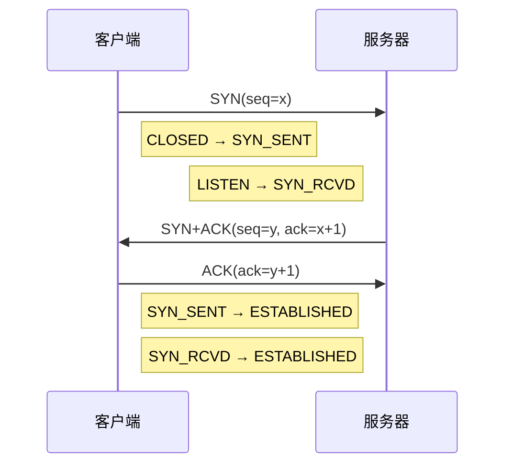
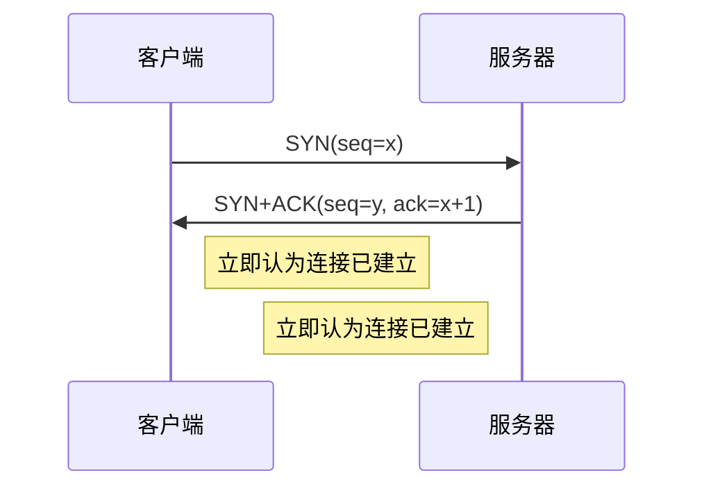
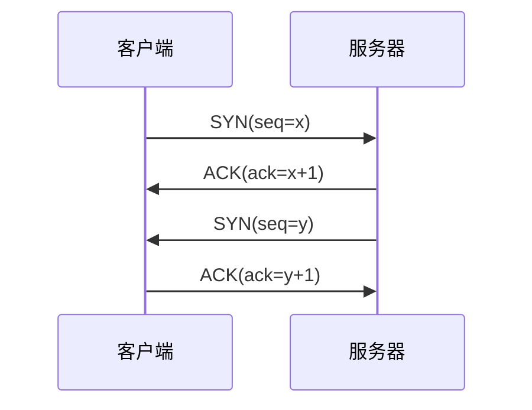
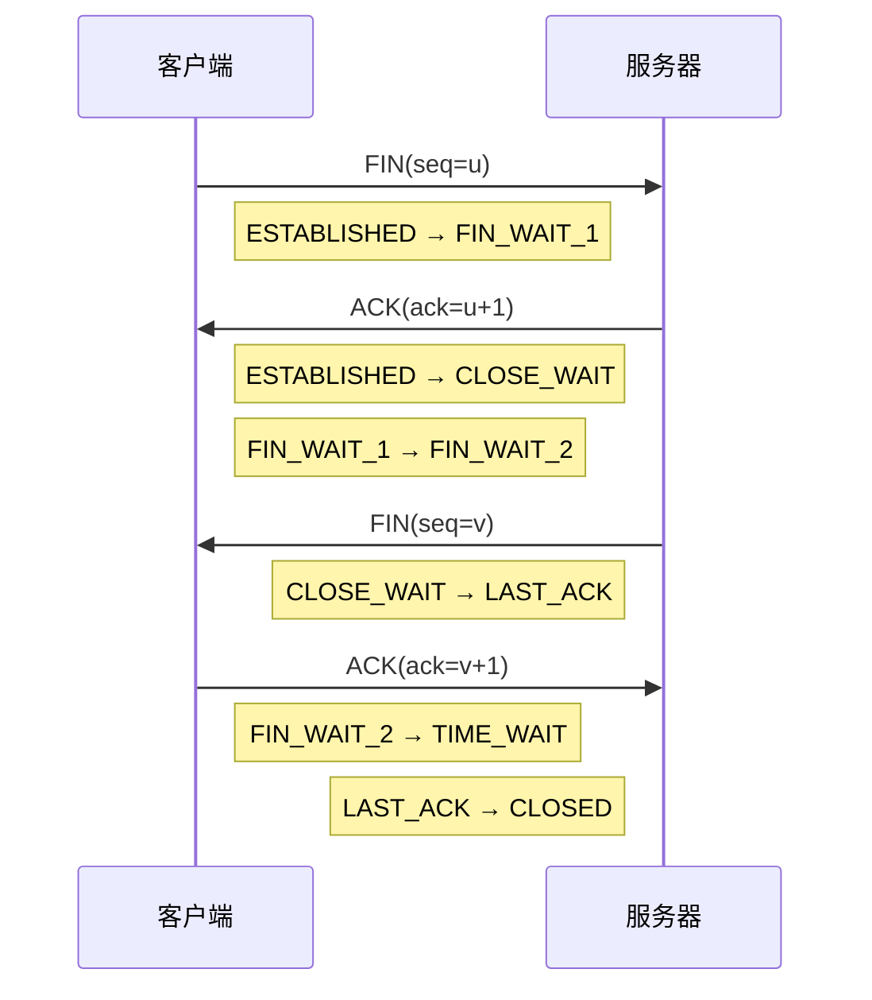
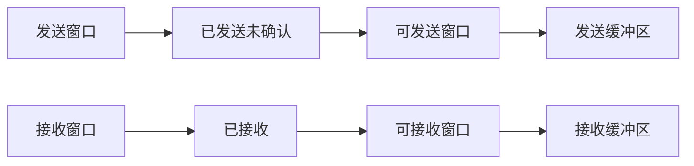
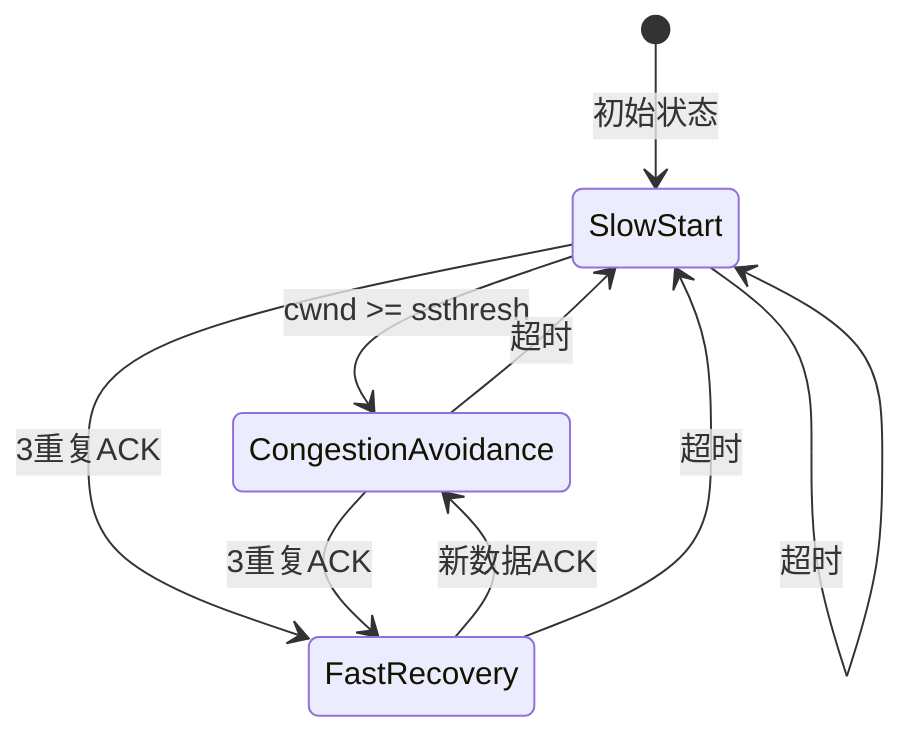
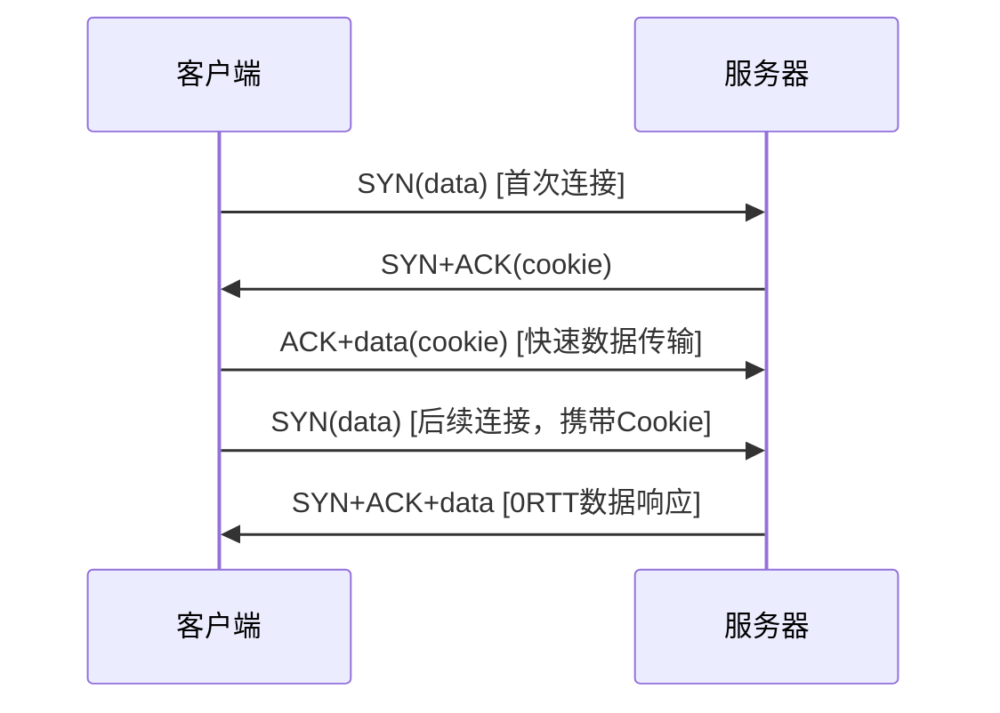
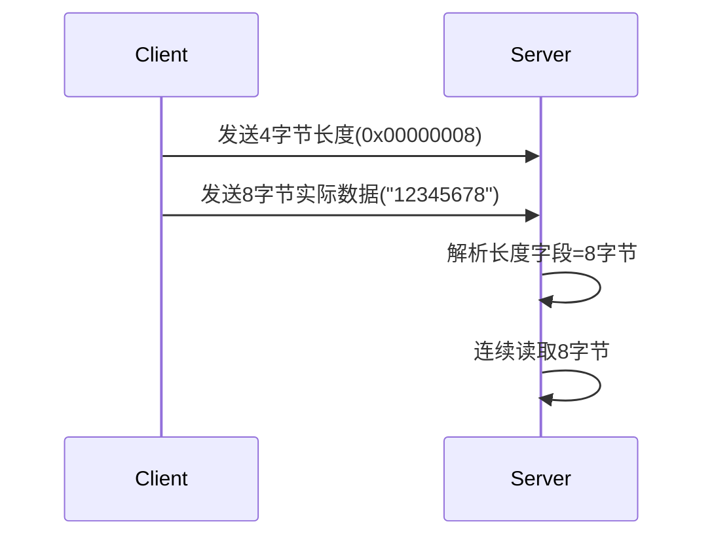
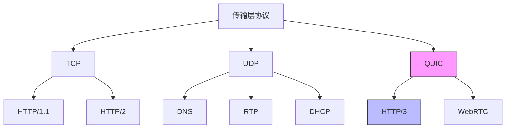
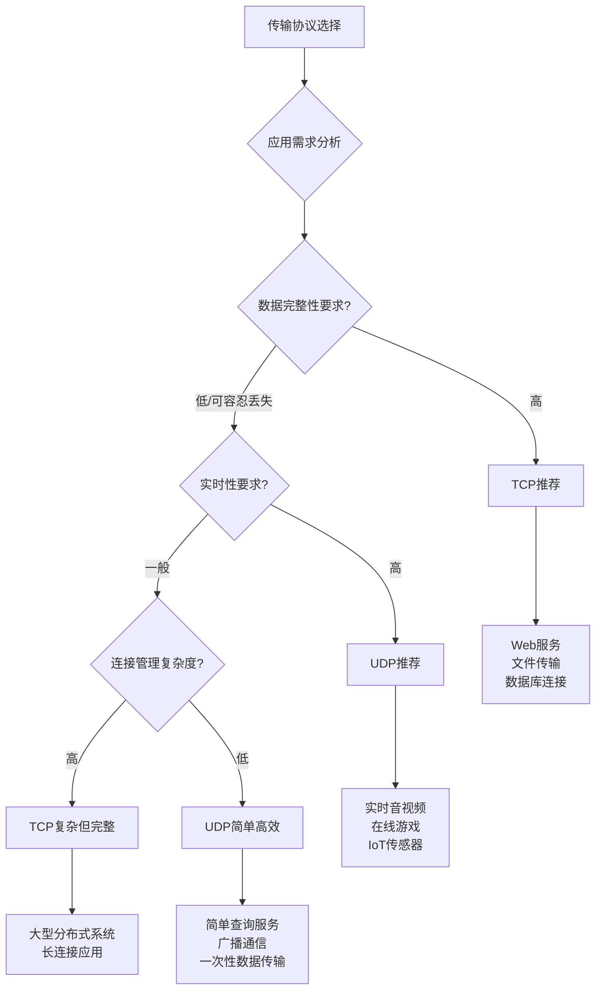

# TCP协议

TCP（Transmission Control Protocol）是一种面向连接的、可靠的、基于字节流的传输层协议，它工作在OSI模型的传输层，为上层应用提供可靠的数据传输服务

## 核心特性

1. 连接管理：三次握手建立连接，四次挥手断开连接
1. 可靠传输：序列号、确认应答、超时重传、快速重传
1. 流量控制：滑动窗口机制调节发送速率
1. 拥塞控制：慢启动、拥塞避免、快速恢复等算法
1. 性能优化：Nagle算法、延迟确认、选择性确认等

## 报文结构

```
 0                   1                   2                   3
 0 1 2 3 4 5 6 7 8 9 0 1 2 3 4 5 6 7 8 9 0 1 2 3 4 5 6 7 8 9 0 1
+-+-+-+-+-+-+-+-+-+-+-+-+-+-+-+-+-+-+-+-+-+-+-+-+-+-+-+-+-+-+-+-+
|          Source Port          |       Destination Port        |
+-+-+-+-+-+-+-+-+-+-+-+-+-+-+-+-+-+-+-+-+-+-+-+-+-+-+-+-+-+-+-+-+
|                        Sequence Number                        |
+-+-+-+-+-+-+-+-+-+-+-+-+-+-+-+-+-+-+-+-+-+-+-+-+-+-+-+-+-+-+-+-+
|                    Acknowledgment Number                      |
+-+-+-+-+-+-+-+-+-+-+-+-+-+-+-+-+-+-+-+-+-+-+-+-+-+-+-+-+-+-+-+-+
|  Data |           |U|A|P|R|S|F|                               |
| Offset| Reserved  |R|C|S|S|Y|I|            Window             |
|       |           |G|K|H|T|N|N|                               |
+-+-+-+-+-+-+-+-+-+-+-+-+-+-+-+-+-+-+-+-+-+-+-+-+-+-+-+-+-+-+-+-+
|           Checksum            |         Urgent Pointer        |
+-+-+-+-+-+-+-+-+-+-+-+-+-+-+-+-+-+-+-+-+-+-+-+-+-+-+-+-+-+-+-+-+
|                    Options                    |    Padding    |
+-+-+-+-+-+-+-+-+-+-+-+-+-+-+-+-+-+-+-+-+-+-+-+-+-+-+-+-+-+-+-+-+
|                             data                              |
+-+-+-+-+-+-+-+-+-+-+-+-+-+-+-+-+-+-+-+-+-+-+-+-+-+-+-+-+-+-+-+-+
```

### 序列号（Sequence Number）- 32位

- 标识发送方数据流的字节偏移量
- 每发送一个字节，序列号递增1
- SYN标志位也占用1个序列号位

### 确认号（Acknowledgment Number）- 32位

- 期望接收的下一个字节的序列号
- ACK标志位为1时有效

### 标志位（6位控制位）

- URG: 紧急指针有效
- ACK: 确认号有效
- PSH: 推送操作，要求立即交付应用
- RST: 重置连接
- SYN: 同步序号，建立连接
- FIN: 发送方已完成数据传输

### 窗口大小（Window Size）- 16位

- 流量控制机制，告知对方还能接收多少字节
- 最大65535字节，可通过窗口扩大选项扩展

## 连接管理

### 三次握手（建立连接）



```
本质是"双向身份认证+状态同步":
1. SYN: 我是A，请求连接，初始序列号x
2. SYN+ACK: 我是B，接受连接，初始序列号y，确认x+1
3. ACK: 确认y+1，握手完成

防止的情况:
- 过期报文导致错误连接
- 网络单向可达造成的"半死连接"
- 旧连接残余报文影响新连接
```

同步初始序列号：防止历史连接干扰
确认双方收发能力：验证通信路径双向可达
避免重复历史连接：防止网络延时报文建立错误连接

#### 为什么TCP建立连接必须是三次握手

TCP需要三次握手是为了在不可靠的网络中，实现两个关键目标：

1. 同步双方初始序列号（确保数据有序）
1. 验证双方的双向通信能力（确保连接有效性）

##### 两次握手过程



两次握手的根本问题

1. 历史连接请求干扰

```
时间线场景:
1. 客户端发送旧连接请求: SYN(seq=100) → 网络延迟
2. 客户端超时重传新请求: SYN(seq=200)
3. 服务器收到新请求，回复: SYN+ACK(seq=300, ack=201)
4. 旧请求终于到达: SYN(seq=100)
5. 服务器误以为是新连接，回复: SYN+ACK(seq=400, ack=101)

问题:
- 服务器为旧连接分配资源
- 客户端不期望收到对旧请求的确认
- 可能导致数据混乱或拒绝服务攻击
```

2. 无法验证客户端接收能力

```
客户端视角:
发送SYN → 收到SYN+ACK → 立即进入ESTABLISHED状态

隐患:
如果客户端的第一个SYN并没有真正发送出去
服务器仍然为一个"不存在"的连接分配资源
```

3. 资源浪费攻击风险：

```c
// 两次握手的服务器状态变化
struct tcp_connection {
    int state;        // 0=LISTEN, 1=SYN_RCVD, 2=ESTABLISHED
    uint32_t seq_num;
    ...其他状态...
};

// 两次握手的问题:
// 收到SYN+ACK就进入ESTABLISHED → 立即分配完整资源
// 攻击者可发送大量虚假SYN → 服务器迅速耗尽连接资源
```

##### 四次握手过程

理论上可行（能达成同样目标），效率低下（存在冗余）



四次握手的代价:

1. 多一次网络往返时延(RTT)
   - 三次握手: 1 RTT建立连接
   - 四次握手: 1.5 RTT建立连接
1. 多一次网络传输开销
1. 多占用一次序列号空间(虽然微不足道)

SYN和ACK信息可以合并传输而不会造成歧义，因此第三次握手已经是"信息压缩"的最优解

| 方案     | 网络开销 | 时间开销 | 状态管理复杂度 | 资源安全性 |
| -------- | -------- | -------- | -------------- | ---------- |
| 两次握手 | 最小     | 最快     | 简单           | ✘ 极差     |
| 三次握手 | 适中     | 适中     | 适中           | ✔ 良好    |
| 四次握手 | 较大     | 较慢     | 复杂           | ✔ 良好    |

### 四次挥手（断开连接）



```
四次挥手确保:
A: "我没有数据要发了" (FIN)
B: "我知道了" (ACK)
B: "我也没有数据了" (FIN)
A: "我知道了" (ACK)

任何中途断电重启:
下次连接会因序列号不匹配而被RST拒绝，防止数据污染
```

主动关闭方（客户端）

FIN_WAIT_1：发送FIN等待ACK
FIN_WAIT_2：收到ACK等待对方FIN
TIME_WAIT：收到对方FIN并ACK后，等待2MSL确保最后ACK到达

被动关闭方（服务器）

CLOSE_WAIT：收到对方FIN，等待应用关闭
LAST_ACK：发送FIN等待最后ACK

#### 为什么需要四次

全双工特性：TCP连接允许数据在两个方向上同时传输，因此断开时两个方向需要分别处理

数据处理完整性：

- 当一方发送FIN后，仅表示没有新数据要发送
- 对方可能仍有数据要发送，必须完成传输才能关闭

状态转换必要性：

- 第一次挥手：主动关闭方表示完成发送（半关闭状态）
- 第二次挥手：被动关闭方确认收到
- 第三次挥手：被动关闭方完成发送请求关闭
- 第四次挥手：主动关闭方确认并彻底关闭

## 可靠传输

```
          ┌─────────────────────────────┐
          │ 应用层: 数据完整性保障       │ ← 最终交付目标
          ├─────────────────────────────┤
          │ 连接层: 双向可达性确认       │ ← 建立可靠基础
          ├─────────────────────────────┤
          │ 传输层: 端到端可靠传输       │ ← TCP核心职责
          │  • 序列号跟踪完整路径        │
          │  • 确认机制确保收到反馈      │
          │  • 重传机制应对丢包          │
          │  • 校验机制查验正确性        │
          │  • 窗口机制调节发送节奏      │
          └─────────────────────────────┘
```

### 序列号机制 - 数据完整性追踪

```text
发送方:    [数据①(seq=100)] → [数据②(seq=200)] → [数据③(seq=300)]
接收方: ← [ACK(ack=200)]   ← [ACK(ack=300)]   ← [ACK(ack=400)]
```

- 每字节都有唯一序列号，形成"数据身份证"
- 接收方据此检查是否有数据缺失或乱序

### 确认应答（ACK）- 完成闭环反馈

```
正常流程:
[应用数据] → [TCP发送] → [网络传输] → [TCP接收] → [发送ACK] → [发送方确认]
  seq=100                    ↑                                    ↓
                        接收成功                                继续发送

异常流程:
[应用数据] → [TCP发送] → 丢包 → 无ACK → 超时重传 → 确认收到
  seq=100       500ms               ↑                ↓
                              触发重传            继续流程
```

```
接收方收到数据: ①②④⑤ (③丢失)
期望收到序列号: 300 (即数据③)
发送累计确认: ACK(ack=300)

发送方理解:
- ①②已收到 (因为确认号>200)
- ③未收到 (确认号=300)
- ④⑤需重传 (可能乱序到达，缓存等待)
```

### 超时重传 - 应对丢包的兜底机制

自适应超时计算（Karn算法）

```c
// RTT测量和RTO计算
SampleRTT = 当前往返时间测量值
SmoothedRTT = 0.875 * SmoothedRTT + 0.125 * SampleRTT
RTTVar = 0.75 * RTTVar + 0.25 * |SampleRTT - SmoothedRTT|
RTO = SmoothedRTT + 4 * RTTVar
```

快速重传（Fast Retransmit）

```
发送方: [1] [2] [3] [4] [5] →
接收方: ← [ACK=2] [ACK=2] [ACK=2] [ACK=2]
         重复ACK ≥ 3次时，立即重传丢失的段3
```

双重保险：超时+重复ACK

```
场景1 - 完全丢包（超时重传）
A → B: [数据包(seq=100)]        → (网络丢弃)
A等待ACK超时(约1秒) → 重传 → B确认接收

场景2 - 大部分丢包（快速重传）
A → B: [①(seq=100)] [②(seq=200)] [③(seq=300)] [④(seq=400)] [⑤(seq=500)]
B ← A: [ACK=200]               [重复ACK=200] [重复ACK=200] [重复ACK=200]
     正常确认                      ↑
                              3次重复ACK触发快速重传(无需等待超时)
                              立即重传②(seq=200)
```

### 完整性校验 - 检测数据损坏

16位校验和检测

```
发送方计算校验和:
[源端口] [目标端口] [序列号] [确认号] [头部长度+标志] [窗口] [校验和] [紧急指针] [选项] [数据]
   ↓           ↓         ↓        ↓            ↓         ↓      ↓        ↓      ↓      ↓
合并所有16位字 → 累加 → 按位取反 → 填入校验和字段

接收方验证:
重新计算校验和 + 原校验和 = 0xFFFF → 通过
                              ≠ 0xFFFF → 数据错误丢弃
```

应用层CRC增强（可选）

现代实现中，很多协议栈还额外采用CRC32算法对TCP payload进行更强的完整性校验

### 流量控制 - 防止发送方压垮接收方

动态窗口调节

```
初始阶段: 接收缓冲区空闲 → 窗口大 → 发送方快发
后期阶段: 接收处理慢 → 缓冲区接近满 → 窗口小 → 发送方减速

发送方视角:
接收窗口 = min(接收方通告窗口, 拥塞窗口)
实际发送量 ≤ 接收窗口
```

零窗口探测机制

```
接收方缓冲区满时:
通知发送方窗口=0 → 发送方暂停数据传输
每500ms探测一次(发送1字节探针) → 若窗口恢复则恢复正常传输
最多尝试3次，否则可发送RST强制关闭连接
```

### 选择性确认（SACK - Selective Acknowledgment）

```
# 启用SACK的ACK报文示例
TCP Options:
  SACK Permited: True
  SACK: 1101-2000, 3001-4000  // 表示接收了这些范围的数据
```

## 流量控制

### 滑动窗口协议



发送窗口 = Min(接收窗口, 拥塞窗口)
接收窗口 = 接收缓冲区大小 - 已接收未读取数据

```
发送方窗口状态:
[已确认] [已发送未确认] [可发送] [不可发送]
-------  --------------  --------  --------
 seq=100    seq=500       seq=900   seq=1500
         ↑               ↑         ↑
      LastAck         SendNext   SendMax
```

### 零窗口探测（Zero Window Probe）

当接收方通告窗口为0时：

```
发送方:
  每隔 RTO 时间发送 1 字节探测报文
  最多尝试 3 次
  超时后可发送 RST 关闭连接
```

## 拥塞控制

### 主要步骤

慢启动（Slow Start）

- 初始状态：连接建立后，拥塞窗口（cwnd）初始化为1个MSS（最大报文段大小）
- 增长方式：每收到一个ACK确认，cwnd值翻倍（指数增长）
- 目的：快速探测网络可用带宽
- 终止条件：当cwnd达到慢启动阈值（ssthresh）时结束
- 特点：从保守的初始窗口开始，逐步增加发送速率

拥塞避免（Congestion Avoidance）

- 起始点：cwnd达到ssthresh时进入
- 增长方式：每个RTT（往返时间）内，cwnd线性增加1个MSS
- 公式：cwnd = cwnd + 1 MSS（每个RTT）
- 目的：平稳探测可用带宽，避免触发拥塞
- 特点：从指数增长转为线性增长，更加谨慎地增加发送速率

快速重传（Fast Retransmit）

- 触发条件：收到3个重复的ACK
- 行为：立即重传认为丢失的报文，等待超时
- 目的：检测丢包而不必等待超时
- 特点：基于重复ACK推断丢包，减少恢复延迟

快速恢复（Fast Recovery）

- 起始点：快速重传之后
- 操作：将ssthresh设置为当前cwnd的一半 / 将cwnd设置为ssthresh + 3 MSS（因为收到3个重复ACK）
- 后续：进入线性增长阶段（类似拥塞避免）
- 目的：快速恢复连接状态而不降低到慢启动阶段
- 特点：在网络轻拥塞情况下提供更快的恢复速度

### 超时重传处理

```
发生超时:
ssthresh = cwnd / 2
cwnd = 1 MSS
重新进入慢启动
```

### 拥塞控制状态机



### 现代拥塞控制算法

#### 经典算法

##### TCP Reno

特点：最早广泛使用的拥塞控制算法
机制：慢启动（指数增长）/ 拥塞避免（线性增长）/ 拥塞发生后（慢启动阈值减半，窗口重置为1）
问题：在丢包较多的高延迟网络中性能不佳

##### TCP Tahoe

特点：Reno的前身，更加保守
机制：任何丢包都进入慢启动
区别：比Reno更严格，响应更慢

#### 现代改进算法

##### TCP CUBIC

特点：Linux默认算法，适用于高延迟带宽网络
机制：使用三次函数替代线性增长 / 在丢包后恢复更快 / 更关注公平性
优势：在长肥网络(LFN)中表现优异

##### TCP BBR (Bottleneck Bandwidth and RTT)

特点：Google开发的新一代算法
机制：基于带宽和RTT的测量 / 不依赖丢包判断拥塞 / 动态调整发送速率
优势：低延迟、高吞吐量，减少缓冲区膨胀

##### TCP Vegas

特点：基于RTT变化检测拥塞
机制：预测期望吞吐量 / 提前降低窗口避免丢包
优势：减少丢包，提高网络稳定性

##### TCP Westwood

特点：Vegas的改进版
机制：从ACK中估计可用带宽 / 动态调整发送速率
优势：对无线网络环境适应性好

#### 特定场景算法

##### TCP Hybla

特点：针对高延迟卫星网络优化
机制：基于RTT的缩放因子 / 消除延迟差异带来的不公平性
适用：高延迟场景

##### TCP Illinois

特点：基于RTT和丢包率的混合算法
机制：综合考虑往返时间和丢包率 / 动态调整拥塞窗口增长曲线
优势：公平性更好

##### TCP Veno

特点：改进版的Vegas，适合无线网络
机制：检测非拥塞丢包(无线信道问题) / 区分真实拥塞丢包
优势：提高无线网络性能

##### Compound TCP (CTCP)

特点：Windows系统默认算法
机制：结合延迟感知和带宽优化 / 动态平衡吞吐量和延迟
优势：适合异构网络环境

## 性能优化

### TCP选项优化

#### 窗口扩大（Window Scale）

```
TCP Options:
  Window Scale: 7  // 窗口左移7位，最大窗口可达1GB
```

#### 时间戳（Timestamp）

```
TCP Options:
  Timestamp: TSval=123456, TSecr=789012
  用途: 精确RTT测量，防止序列号回绕
```

#### 选择性确认（SACK）

```
TCP Options:
  SACK Permited: True
```

### Nagle算法 vs 延迟确认

#### Nagle算法

```
条件: 未确认数据 >= MSS 或 发送缓冲区无更多数据
作用: 减少小包发送，提高网络利用率
```

#### 延迟确认

```
条件: 收到数据后延迟发送ACK
默认延迟: 200-500ms 或 收到第二个数据包
作用: 减少ACK数量，提高效率
```

#### 组合影响

```
Nagle + 延迟确认可能导致死锁:
发送方等待ACK确认才发送，接收方等待更多数据才发送ACK
解决方案:
1. 使用TCP_NODELAY禁用Nagle
2. 应用层批量发送数据
```

### TCP Fast Open（TFO）



```
传统方式: 三次握手 → 数据传输
TFO方式:
  SYN携带数据 → 服务器缓存
  三次握手完成 → 直接传输数据
减少1个RTT时延
```

### QUIC协议的创新

```
基于UDP的QUIC采用0RTT握手:
连接ID机制避免重连时的完整握手
但这也要求应用层配合(如HTTP/3)
```

## 粘包拆包

TCP协议中常见的数据传输问题，源于TCP流量控制和缓冲区机制设计

粘包：多个独立数据包到达接收端时粘连成一个数据包

```
发送端: [包1][包2][包3]
接收端: [包1包2包3]
```

拆包：一个完整数据包被拆分成多个小包到达接收端

```
发送端: [包1|完整数据]
接收端: [包1|部份数据][包2|剩余数据]
```

### 产生原因

#### 粘包原因

TCP缓冲区机制

- 发送缓冲区累积数据后批量发送
- 接收缓冲区一次性读取多个数据包

Nagle算法

- TCP自动合并小数据包减少网络开销
- 等待ACK后发送更多数据

MSS限制

- 超过MSS的数据可能被拆分发送，小包可能被合并

#### 拆包原因

TCP分帧机制

- 数据超过MTU时自动拆分
- 网络层IP分片导致数据包重组

滑动窗口控制

- 拥塞时TCP拆分大数据包
- 优先发送部分 ACK 响应

接收方处理延迟

- 应用层读取不及时导致接收缓冲区满
- 强制触发TCP发送部分数据

### 解决方案

长度字段方案



固定长度方案

```
包1: [固定长度的10字节数据]
包2: [固定长度的10字节数据]
```

特定分隔符方案

```
包1: "数据1\n"
包2: "数据2\r\n"
包3: "数据3\r\n\r\n"
```

### 预防措施

1. 数据包大小控制在合理范围内(1K~64K)
1. 实现心跳机制检测连接状态
1. 添加消息校验(如CRC32)确保完整性
1. 设计合理的消息超时重发机制

# UDP协议

UDP（User Datagram Protocol）是一种无连接的、不可靠的、基于数据报的传输层协议
与TCP不同，UDP提供了一种轻量级的数据传输服务

## 核心特性

1. 无连接：：通信前无需建立连接
1. 不可靠传输：：不保证数据完整性和顺序
1. 基于数据报：：保持消息边界
1. 无流量控制：：发送速率由应用控制
1. 低开销：：头部只有8字节

## 报文结构

```
 0                   1                   2                   3
 0 1 2 3 4 5 6 7 8 9 0 1 2 3 4 5 6 7 8 9 0 1 2 3 4 5 6 7 8 9 0 1
+-+-+-+-+-+-+-+-+-+-+-+-+-+-+-+-+-+-+-+-+-+-+-+-+-+-+-+-+-+-+-+-+
|          Source Port          |       Destination Port        |
+-+-+-+-+-+-+-+-+-+-+-+-+-+-+-+-+-+-+-+-+-+-+-+-+-+-+-+-+-+-+-+-+
|            Length             |           Checksum            |
+-+-+-+-+-+-+-+-+-+-+-+-+-+-+-+-+-+-+-+-+-+-+-+-+-+-+-+-+-+-+-+-+
|                             data                              |
+-+-+-+-+-+-+-+-+-+-+-+-+-+-+-+-+-+-+-+-+-+-+-+-+-+-+-+-+-+-+-+-+
```

### 源端口（Source Port）- 16位

- 发送方端口号
- 可为0（表示无端口）

### 目标端口（Destination Port）- 16位

- 接收方端口号
- 必须指定

### 长度（Length）- 16位

- UDP头部+数据总长度
- 最小值为8字节（仅有头部）

### 校验和（Checksum）- 16位

- 可选字段（IPv4中）
- 包含伪头部、UDP头部和数据
- 使用补码求和算法

## 应用场景

实时性要求高的应用

- 实时音视频传输（RTP/RTCP）
- 在线游戏

简单查询服务

- DNS查询
- NTP时间同步

广播/多播应用场景

- 网络发现服务
- 多媒体直播（IPTV）

```
应用需求分析:
┌───────────────────────────────┐
│ 实时性 > 可靠性 ?             │
└─────────┬─────────────────────┘
          │ 是
┌─────────▼────────┐       ┌─────┐ 否
│ 多少丢包容忍度?   │ ◄─────┤ TCP │
└─────────┬────────┘       └─────┘
          │ 高容忍
┌─────────▼────────┐       ┌─────┐ 低容忍
│ 数据完整性要求?   │ ◄─────┤ UDP │
└─────────┬────────┘       └─────┘
          │ 低要求
┌─────────▼────────┐       ┌─────────────────┐ 高要求
│ 多播/广播需求?    │ ◄─────┤ 增强型UDP协议   │
└─────────┬────────┘       └─────────────────┘
          │ 有
┌─────────▼────────┐       ┌─────────────────┐ 无
│ 最终决策: UDP     │ ◄─────┤ 协议封装(QUIC等)│
└──────────────────┘       └─────────────────┘
```

# TCP V.S. UDP

```
  ┌─────────────────────────────────────────────────────────────┐
  │                   Application Layer                         │
  │  HTTP/HTTPS  DNS  FTP  SMTP  RTP  SNMP  ...                 │
  ├─────────────────────────────────────────────────────────────┤
  │                   Transport Layer                           │
  │                                                             │
  │  ┌─────────────┐            ┌─────────────┐                 │
  │  │    TCP      │            │    UDP      │                 │
  │  │             │            │             │                 │
  │  │ • 可靠传输   │            │ • 尽力而为   │                 │
  │  │ • 面向连接   │            │ • 无连接     │                 │
  │  │ • 流式服务   │            │ • 数据报服务 │                 │
  │  │ • 流量控制   │            │ • 简单       │                 │
  │  │ • 拥塞控制   │            │ • 高效       │                 │
  │  └─────────────┘            └─────────────┘                 │
  ├─────────────────────────────────────────────────────────────┤
  │                   Network Layer                             │
  │                       IP Protocol                           │
  └─────────────────────────────────────────────────────────────┘
```

| 特性类别 | TCP              | UDP              | 核心区别       |
| -------- | ---------------- | ---------------- | -------------- |
| 连接类型 | 面向连接         | 无连接           | 连接管理开销   |
| 可靠性   | 可靠传输         | 尽力而为         | 数据完整性保障 |
| 数据边界 | 流模式           | 报文模式         | 消息处理方式   |
| 顺序保证 | 严格有序         | 不保证           | 应用层排序需求 |
| 重复检测 | 自动去重         | 可能重复         | 数据去重机制   |
| 流量控制 | 滑动窗口         | 无               | 防止接收方过载 |
| 拥塞控制 | 完整机制         | 无               | 网络拥塞感知   |
| 错误恢复 | 自动重传         | 无               | 丢包处理机制   |
| 校验和   | 必须启用         | 可选             | 数据校验强度   |
| 速度性能 | 相对较慢         | 快速             | 传输效率权衡   |
| 资源消耗 | 高内存/CPU       | 低资源           | 系统负载影响   |
| 头部开销 | 20+字节          | 8字节            | 网络带宽利用   |
| 应用场景 | 网页、邮件、文件 | 实时音视频、游戏 | 业务需求匹配   |

## 协议头部

TCP头部结构（20字节最小）

```
 0                   1                   2                   3
 0 1 2 3 4 5 6 7 8 9 0 1 2 3 4 5 6 7 8 9 0 1 2 3 4 5 6 7 8 9 0 1
+-+-+-+-+-+-+-+-+-+-+-+-+-+-+-+-+-+-+-+-+-+-+-+-+-+-+-+-+-+-+-+-+
|          Source Port          |       Destination Port        |
+-+-+-+-+-+-+-+-+-+-+-+-+-+-+-+-+-+-+-+-+-+-+-+-+-+-+-+-+-+-+-+-+
|                        Sequence Number                        |
+-+-+-+-+-+-+-+-+-+-+-+-+-+-+-+-+-+-+-+-+-+-+-+-+-+-+-+-+-+-+-+-+
|                    Acknowledgment Number                      |
+-+-+-+-+-+-+-+-+-+-+-+-+-+-+-+-+-+-+-+-+-+-+-+-+-+-+-+-+-+-+-+-+
|  Data |           |U|A|P|R|S|F|                               |
| Offset| Reserved  |R|C|S|S|Y|I|            Window             |
|       |           |G|K|H|T|N|N|                               |
+-+-+-+-+-+-+-+-+-+-+-+-+-+-+-+-+-+-+-+-+-+-+-+-+-+-+-+-+-+-+-+-+
|           Checksum            |         Urgent Pointer        |
+-+-+-+-+-+-+-+-+-+-+-+-+-+-+-+-+-+-+-+-+-+-+-+-+-+-+-+-+-+-+-+-+
|                    Options                    |    Padding    |
+-+-+-+-+-+-+-+-+-+-+-+-+-+-+-+-+-+-+-+-+-+-+-+-+-+-+-+-+-+-+-+-+
```

UDP头部结构（8字节）

```
 0                   1                   2                   3
 0 1 2 3 4 5 6 7 8 9 0 1 2 3 4 5 6 7 8 9 0 1 2 3 4 5 6 7 8 9 0 1
+-+-+-+-+-+-+-+-+-+-+-+-+-+-+-+-+-+-+-+-+-+-+-+-+-+-+-+-+-+-+-+-+
|          Source Port          |       Destination Port        |
+-+-+-+-+-+-+-+-+-+-+-+-+-+-+-+-+-+-+-+-+-+-+-+-+-+-+-+-+-+-+-+-+
|            Length             |           Checksum            |
+-+-+-+-+-+-+-+-+-+-+-+-+-+-+-+-+-+-+-+-+-+-+-+-+-+-+-+-+-+-+-+-+
```

## 资源消耗

内存使用模式

```c
// TCP连接内存开销
struct tcp_tcb {
    uint32_t send_una;      // 未确认数据起始序列号
    uint32_t send_nxt;      // 下一个发送序列号
    uint32_t send_wnd;      // 发送窗口大小
    uint32_t send_wl1;      // 窗口更新序列号
    uint32_t send_wl2;      // 窗口更新确认号
    uint32_t iss;           // 初始发送序列号

    uint32_t rcv_nxt;       // 下一个期望接收序列号
    uint32_t rcv_wnd;       // 接收窗口大小
    uint32_t irs;           // 初始接收序列号

    uint16_t cwnd;          // 拥塞窗口
    uint16_t ssthresh;      // 慢启动阈值

    struct timer *timers;   // 各种定时器
    struct tcp_segment *retransmit_queue;  // 重传队列

    // 连接状态和统计信息
    int state;
    uint32_t stats[STATS_COUNT];

    // 总计: 约1KB-4KB/连接 (取决于实现)
};

// UDP内存开销
struct udp_pcb {
    uint16_t src_port;
    uint16_t dst_port;
    // 几乎没有状态需要维护
    // 总计: 约32-64字节/连接
};
```

## 协议演进



## 技术选型



选择TCP

- 数据完整性和顺序至关重要
- 需要可靠的状态管理
- 涉及复杂的会话控制
- 传输大量连续数据
- 运行在不可预测的网络环境

选择UDP

- 实时性比可靠性更关键
- 可以容忍数据丢失和乱序
- 需要低延迟和高吞吐量
- 涉及多媒体或传感器数据
- 需要广播或多播通信

考虑混合方案

- 同时需要可靠控制和高效数据传输
- 构建现代实时Web应用
- 需要灵活的传输策略
- 对性能和可靠性都有高要求

## 常见协议

### 基于TCP的重要协议

#### Web相关协议

| 协议          | 端口   | 主要用途                    |
| ------------- | ------ | --------------------------- |
| HTTP          | 80     | 超文本传输，Web页面浏览     |
| HTTPS         | 443    | 安全超文本传输，加密Web通信 |
| WebSocket     | 80/443 | 全双工通信，实时Web应用     |
| HTTP/2        | 80/443 | 优化HTTP性能，多路复用      |
| HTTP/3 (QUIC) | 80/443 | 基于UDP的新一代HTTP         |

#### 文件传输协议

| 协议 | 端口 | 主要用途                  |
| ---- | ---- | ------------------------- |
| FTP  | 21   | 文件传输，基本文件操作    |
| FTPS | 990  | 安全文件传输，带加密      |
| SFTP | 22   | 安全文件传输，通过SSH隧道 |
| SCP  | 22   | 安全文件拷贝，SSH文件传输 |

#### 电子邮件协议

| 协议  | 端口 | 主要用途               |
| ----- | ---- | ---------------------- |
| SMTP  | 25   | 邮件发送，服务器间通信 |
| SMTPS | 465  | 安全邮件发送，加密传输 |
| POP3  | 110  | 邮件接收，获取邮件     |
| POP3S | 995  | 安全邮件接收，加密传输 |
| IMAP  | 143  | 邮件访问，高级邮箱管理 |
| IMAPS | 993  | 安全邮件访问，加密传输 |

#### 远程访问协议

| 协议   | 端口      | 主要用途                   |
| ------ | --------- | -------------------------- |
| SSH    | 22        | 安全远程 shell，管理服务器 |
| Telnet | 23        | 远程终端，明文远程访问     |
| RDP    | 3389      | Windows远程桌面            |
| VNC    | 5900/5901 | 图形化远程桌面             |
| BGP    | 179       | 网关间路由协议             |

#### 数据库协议

| 协议       | 端口  | 主要用途             |
| ---------- | ----- | -------------------- |
| MySQL      | 3306  | MySQL数据库连接      |
| PostgreSQL | 5432  | PostgreSQL数据库连接 |
| MongoDB    | 27017 | MongoDB数据库连接    |
| Redis      | 6379  | Redis内存数据存储    |
| Oracle     | 1521  | Oracle数据库服务     |

#### 其他重要协议

| 协议       | 端口 | 主要用途             |
| ---------- | ---- | -------------------- |
| DNS查询    | 53   | 域名解析服务         |
| LDAP       | 389  | 轻量级目录访问       |
| NTP        | 123  | 网络时间同步         |
| SNMP       | 161  | 网络管理，设备监控   |
| Syslog     | 514  | 系统日志收集         |
| Docker API | 2376 | Docker容器管理       |
| Kafka      | 9092 | 分布式消息队列       |
| Redis      | 6379 | 内存数据库，缓存服务 |

### 基于UDP的重要协议列表

#### 实时通信协议

| 协议   | 端口        | 主要用途                   |
| ------ | ----------- | -------------------------- |
| RTP    | 16384-32767 | 实时传输协议，音视频传输   |
| RTCP   | 16384-32767 | RTP控制协议，监控传输质量  |
| RTSP   | 554         | 实时流媒体控制，点播/直播  |
| SDP    | 9875        | 会话描述协议，媒体会话定义 |
| WebRTC | 10000-65535 | 实时音视频通信             |
| SIP    | 5060        | 会话发起协议，VoIP电话     |

#### 网络服务协议

| 协议   | 端口    | 主要用途                 |
| ------ | ------- | ------------------------ |
| DNS    | 53      | 域名解析，域名系统查询   |
| DHCP   | 67/68   | 动态主机配置，IP地址分配 |
| NTP    | 123     | 网络时间协议，时钟同步   |
| TFTP   | 69      | 简单文件传输，无认证     |
| SNMP   | 161/162 | 简单网络管理，设备监控   |
| Syslog | 514     | 系统日志，网络日志收集   |
| LDAP   | 389     | 轻量级目录访问，替代方案 |

#### 多媒体与广播协议

| 协议       | 端口   | 主要用途                   |
| ---------- | ------ | -------------------------- |
| RTMP       | 1935   | 实时消息协议，直播/点播    |
| HLS(HTTP)  | 80/443 | HTTP直播流，自适应码率     |
| MPEG-TS    | 1234   | 运动专家组传输流，视频传输 |
| DASH(HTTP) | 80/443 | 自适应HTTP流，类似HLS      |
| RUDP       | -      | 可靠UDP，改进UDP可靠性     |

#### 物联网与移动协议

| 协议         | 端口      | 主要用途                 |
| ------------ | --------- | ------------------------ |
| CoAP         | 5683/5684 | 受限应用协议，IoT设备    |
| MQTT         | 1883      | 消息队列遥测，IoT通信    |
| DDS          | 7400-7700 | 分布式数据系统，实时系统 |
| ZigBee       | -         | 低功耗无线个人区域网络   |
| Bluetooth LE | -         | 低功耗蓝牙通信           |

#### 其他协议

| 协议           | 端口   | 主要用途                      |
| -------------- | ------ | ----------------------------- |
| ICMP           | -      | 互联网控制消息协议，网络诊断  |
| IPsec ESP      | -      | IPsec封装安全负载，VPN        |
| QUIC           | 80/443 | 快速UDP互联网连接，HTTP/3基础 |
| BitTorrent DHT | 6881+  | 分布式哈希表，P2P文件共享     |
| 游戏协议       | 多样   | 实时多人游戏状态同步          |

# TCP/IP 四层模型

## 模型结构

1. 应用层（Application Layer）

功能：为应用程序提供网络服务接口

核心协议：

- HTTP/HTTPS：超文本传输协议，用于万维网浏览
- FTP：文件传输协议，用于文件上传下载
- SMTP/POP3/IMAP：电子邮件传输协议
- DNS：域名系统服务
- Telnet：远程终端协议
- SSH：安全远程登录协议

关键特性：

- 直接面向用户应用程序
- 处理特定的应用数据格式
- 使用 TCP 或 UDP 作为传输层协议

2. 传输层（Transport Layer）

功能：提供端到端的可靠或不可靠数据传输

核心协议：

- TCP（Transmission Control Protocol）：
  - 面向连接的可靠传输
  - 提供差错校验、流量控制和拥塞控制
  - 三次握手建立连接，四次挥手断开连接
- UDP（User Datagram Protocol）：
  - 无连接的不可靠传输
  - 尽最大努力交付，不保证顺序和可靠性
  - 开销小，传输效率高

端口作用：

- 通过端口号区分同一台主机上的不同服务
- 熟知端口（0-1023）：HTTP(80)、HTTPS(443)、FTP(21)
- 注册端口（1024-49151）
- 动态/私有端口（49152-65535）

3. 网络层（Internet Layer）

功能：负责数据包的路由和转发，实现跨网络通信

核心协议：

IP（Internet Protocol）：

- 提供逻辑地址（IP地址）
- 负责数据包的路由选择和转发
- 分为 IPv4 和 IPv6 两个版本

ICMP（Internet Control Message Protocol）：

- 网络层控制协议，用于发送控制消息
- 常见工具：ping、traceroute

ARP/RARP：

- 地址解析协议：将IP地址解析为MAC地址
- 反向地址解析协议：将MAC地址解析为IP地址（已较少使用）

核心功能：

- 逻辑寻址（IP地址）
- 路由选择
- 分组与重组
- 错误处理

4. 网络接口层（Network Access Layer）

功能：负责数据帧的封装与解封装，实现物理网络传输

核心内容：

- 数据帧封装：将IP数据包封装成适合物理网络传输的数据帧
- 物理地址：使用MAC地址标识网络设备
- 网络拓扑：处理局域网、广域网等物理连接
- 设备驱动：网卡驱动程序、交换机、路由器等物理设备

常见协议：

- Ethernet II：以太网帧格式
- PPP：点对点协议
- HDLC：高级数据链路控制协议

## 数据封装过程

数据在发送时从应用层逐层向下封装，接收时从网络接口层逐层向上解封装：

1. 应用层：产生原始数据（如HTTP请求）
1. 传输层：添加TCP/UDP头部（源端口、目的端口）
1. 网络层：添加IP头部（源IP、目的IP）
1. 网络接口层：添加帧头/帧尾（源MAC、目的MAC）
1. 物理层：转换为比特流在物理介质上传输

```
应用数据
+----------------+  // 应用层(PDU：数据)
| 应用数据 + 应用层头部 |
+----------------+
+----------------+  // 传输层(PDU：段)
| TCP/UDP头部 + 数据 |
+----------------+
+----------------+  // 网络层(PDU：包)
| IP头部 + 数据 |
+----------------+
+----------------+  // 网络接口层(PDU：帧)
| 帧头 + IP包 + 帧尾 |
+----------------+
+----------------+  // 物理层(PDU：比特流)
| 比特流 |
+----------------+
```

| 层  | 名称       | PDU 单位 | 头部长度                    | 快闪记忆字段（十秒口诀）                                 |
| --- | ---------- | -------- | --------------------------- | -------------------------------------------------------- |
| 4   | 应用层     | Data     | 0 B\*                       | HTTP 头 / MQTT / gRPC…（协议自定义）                     |
| 3   | 传输层     | Segment  | TCP 20–60 B<br />UDP 8 B    | ⚡ 源 Port 2 / 目 Port 2 / Seq 4 / Ack 4 / Flags 2       |
| 2   | 网络层     | Packet   | IPv4 20–60 B<br />IPv6 40 B | ⚡ Version 1 / TTL 1 / Protocol 1 / Src-IP 4 / Dest-IP 4 |
| 1   | 网络接口层 | Frame    | 以太网 14–18 B              | ⚡ Dest-MAC 6 / Src-MAC 6 / Eth-Type 2 [+ VLAN 4\*]      |

- 应用层把数据粘在自己的「信封」里
- IPv6 固定 40 字节，无选项即如此
- VLAN Tag 若存在，再在 Eth-Type 前额外占 4 字节

“ETH 14 贴门牌，IP 20 写址，TCP 20 查端口——共 54 ≤ head ≤ ???”

“HTTP 一次 GET 请求 100 B，加上 TCP20 IP20 Ethernet14，全网通共花 154 B 才能走完一次四层‘旅行’“

## 四层模型与OSI七层模型的对应关系

| OSI模型层级 | TCP/IP模型层级 | 主要功能                    |
| ----------- | -------------- | --------------------------- |
| 应用层      | 应用层         | 用户接口，应用程序网络服务  |
| 表示层      | (无对应)       | 数据格式转换、加密解密      |
| 会话层      | (无对应)       | 建立、管理和终止会话        |
| 传输层      | 传输层         | 端到端连接、可靠/不可靠传输 |
| 网络层      | 网络层         | 逻辑寻址、路由选择          |
| 数据链路层  | 网络接口层     | 物理寻址、帧传输            |
| 物理层      | (无对应)       | 比特流传输、物理介质标准    |

分层优势：

- 模块化设计：各层独立开发测试
- 标准化：允许不同厂商设备互操作
- 故障隔离：问题定位更精确

当前挑战：

- IPv4地址枯竭→IPv6部署
- 网络安全威胁加剧
- 物联网设备数量激增

未来方向：

- SDN（软件定义网络）
- NFV（网络功能虚拟化）
- 边缘计算与5G融合
