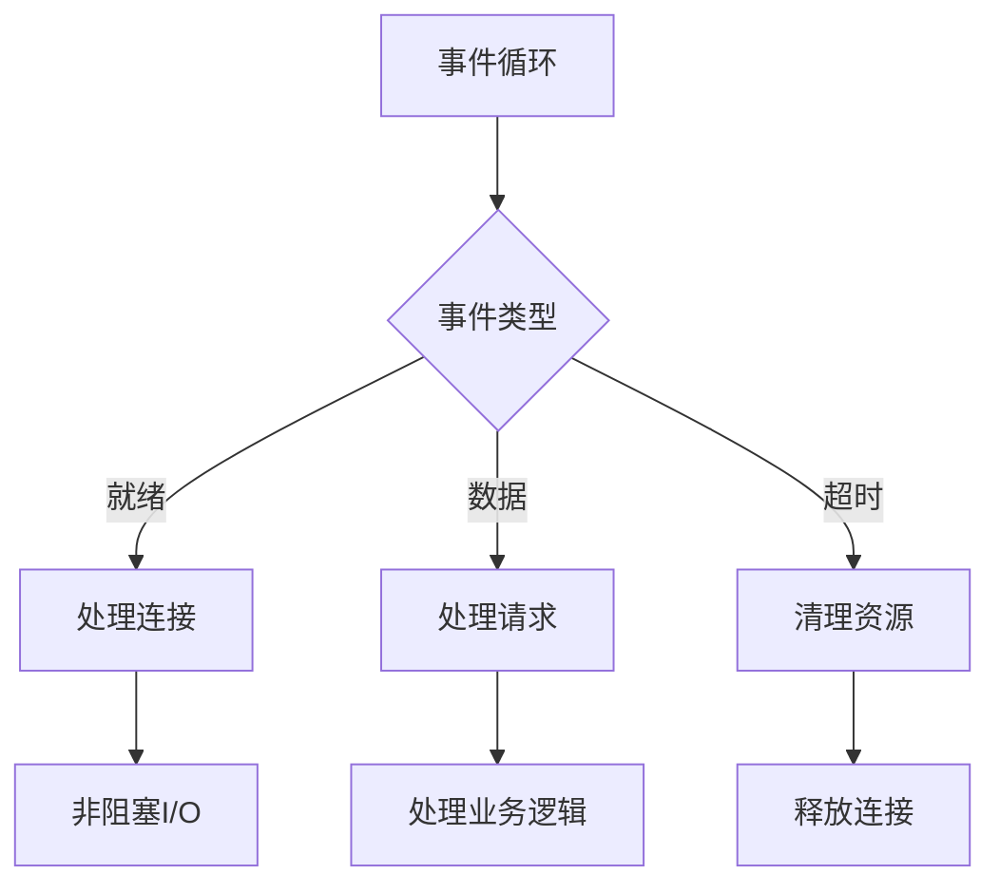
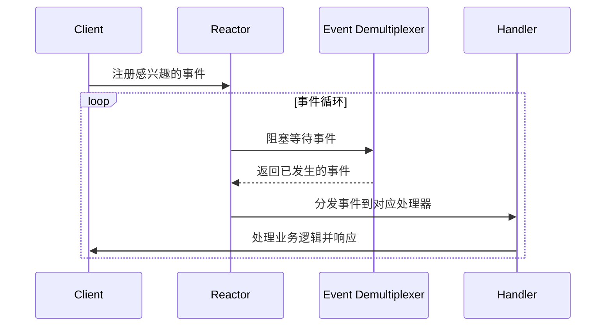
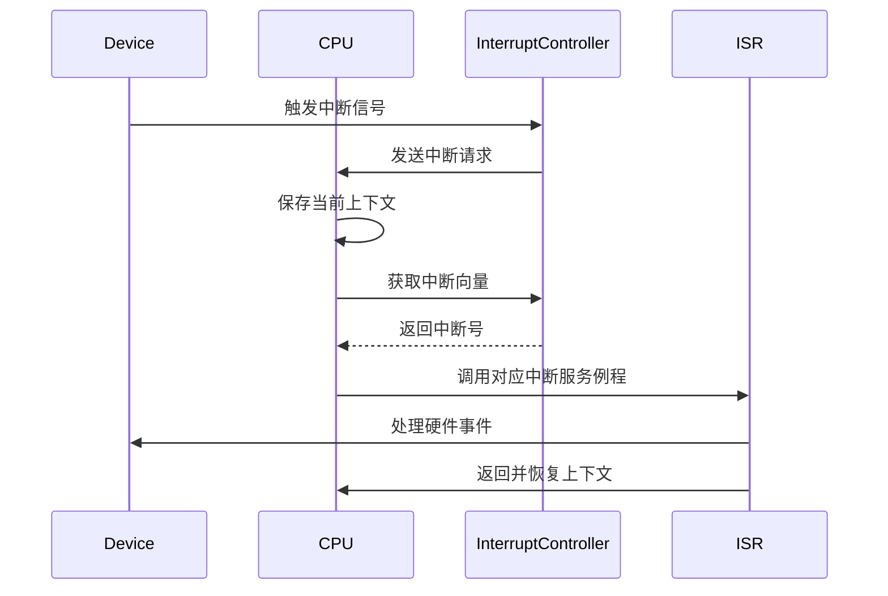
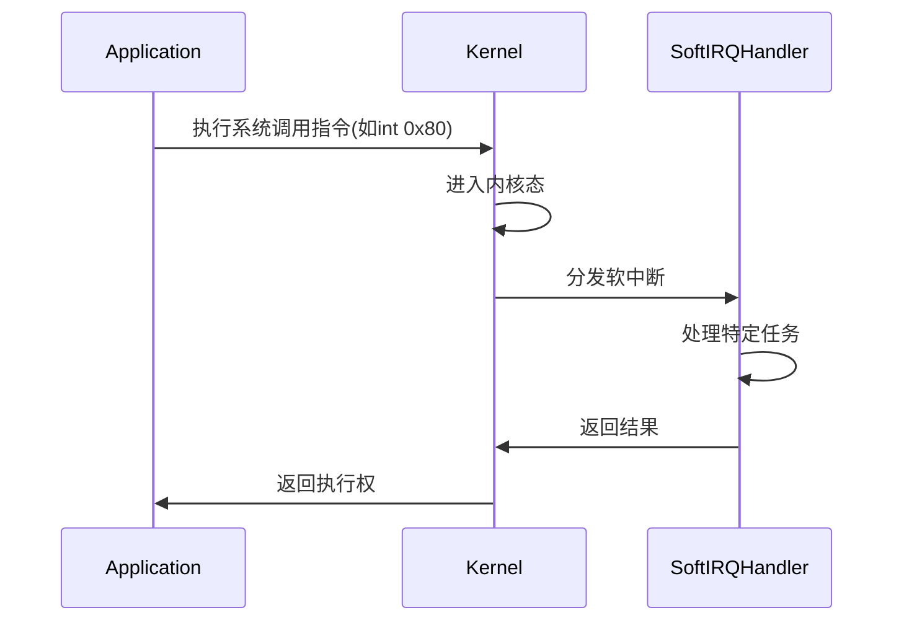

# 进程

## 本质

进程是程序在计算机上的一次执行实例，是操作系统进行资源分配和调度的基本单位。每个进程拥有独立的地址空间和系统资源，实现故障隔离。

- 独立性：拥有独立的虚拟地址空间
- 动态性：生命周期包含创建、执行、终止
- 并发性：多个进程可同时运行
- 结构性：由程序代码、数据、执行上下文组成

## 内部结构

### 进程控制块(PCB)

操作系统通过进程控制块管理所有进程。Linux中对应 `task_struct`结构体：

```c
struct task_struct {
    pid_t pid;                // 进程ID
    struct mm_struct *mm;     // 内存管理信息
    struct files_struct *files; // 文件描述符表
    struct sighand_struct *sighand; // 信号处理
    struct nsproxy *nsproxy;  // 命名空间
    // ...
};
```

### 地址空间

```
+---------------------+ 0x7ffffffff000
|     用户态栈        |
+---------------------+
|      映射区         | (mmap)
+---------------------+
|       堆           | ← brk增长
+---------------------+
|     .data/.bss      |
+---------------------+
|      .text          |
+---------------------+ 0x400000
```

查看进程内存映射：

```bash
cat /proc/<pid>/maps
```

## 生命周期

### 进程创建

Linux使用 `fork()`和 `clone()`系统调用创建进程：

```c
pid_t fork(void);
pid_t clone(unsigned long clone_flags, void *child_stack);
```

Go语言中的进程创建：

```go
package main

import (
    "fmt"
    "os"
    "os/exec"
)

func main() {
    // 方法1: 使用命令
    cmd := exec.Command("echo", "Hello Process")
    output, _ := cmd.Output()
    fmt.Print(string(output))

    // 方法2: 直接系统调用(需要CGO)
    /*
    pid, _, _ := syscall.Syscall(syscall.SYS_FORK, 0, 0, 0)
    if pid == 0 {
        // 子进程
        syscall.SYS_EXECVE(...)
    }
    */
}
```

### 进程终止

进程终止流程：

1. 执行 `exit()`系统调用
1. 释放资源
1. 向父进程发送SIGCHLD信号
1. 进入僵尸态，等待父进程回收

处理僵尸进程：

```bash
# 查看僵尸进程
ps -eo pid,stat,comm | grep Z

# 方法1: 终止父进程
kill <parent_pid>

# 方法2: 使用wait系统调用
sudo gdb -p <parent_pid>
(gdb) call waitpid(-1, 0, 0)
```

## 调度机制

### 调度目标

CPU利用率最大化：减少CPU空闲时间
吞吐量最大化：单位时间内完成更多进程
周转时间最小化：从提交到完成的总时间
等待时间最小化：进程在就绪队列的等待时间
响应时间最小化：交互式系统的快速响应

### 调度层次

长程调度：决定哪些进程进入内存（作业调度）
中程调度：内存和外存间进程的对换
短程调度：CPU分配给就绪进程（进程调度）

### 调度算法

| 算法   | 平均等待时间 | 响应时间 | 公平性 | 实现复杂度 | 适用场景 |
| ------ | ------------ | -------- | ------ | ---------- | -------- |
| FCFS   | 中等         | 差       | 好     | 简单       | 批处理   |
| SJF    | 最短         | 中等     | 一般   | 中等       | 批处理   |
| SRTF   | 最短         | 中等     | 一般   | 复杂       | 实时系统 |
| RR     | 中等         | 好       | 好     | 简单       | 分时系统 |
| 优先级 | 可变         | 可变     | 差     | 中等       | 实时系统 |
| MLFQ   | 中等         | 好       | 好     | 复杂       | 通用系统 |

#### 经典调度算法

##### 先来先服务（FCFS, First-Come First-Served）

原理：按进程到达顺序执行，非抢占式

```go
package main

import (
    "fmt"
    "sort"
)

type Process struct {
    ID       int
    Arrival  int  // 到达时间
    Burst    int  // CPU执行时间
    Wait     int  // 等待时间
    Turnaround int // 周转时间
    Completion int // 完成时间
}

// FCFS调度算法实现
func FCFS(processes []Process) []Process {
    n := len(processes)
    results := make([]Process, n)
    copy(results, processes)

    // 按到达时间排序
    sort.Slice(results, func(i, j int) bool {
        return results[i].Arrival < results[j].Arrival
    })

    currentTime := 0
    for i := 0; i < n; i++ {
        // 如果当前时间小于进程到达时间，CPU空闲
        if currentTime < results[i].Arrival {
            currentTime = results[i].Arrival
        }

        results[i].Completion = currentTime + results[i].Burst
        results[i].Turnaround = results[i].Completion - results[i].Arrival
        results[i].Wait = results[i].Turnaround - results[i].Burst

        currentTime = results[i].Completion
    }

    return results
}

func main() {
    processes := []Process{
        {1, 0, 5, 0, 0, 0},
        {2, 1, 3, 0, 0, 0},
        {3, 2, 8, 0, 0, 0},
        {4, 4, 6, 0, 0, 0},
    }

    results := FCFS(processes)
    fmt.Println("FCFS调度结果:")
    fmt.Printf("PID\t到达\t执行\t完成\t周转\t等待\n")
    totalWait := 0
    totalTurnaround := 0

    for _, p := range results {
        fmt.Printf("%d\t%d\t%d\t%d\t%d\t%d\n",
            p.ID, p.Arrival, p.Burst, p.Completion, p.Turnaround, p.Wait)
        totalWait += p.Wait
        totalTurnaround += p.Turnaround
    }

    fmt.Printf("平均等待时间: %.2f\n", float64(totalWait)/float64(len(results)))
    fmt.Printf("平均周转时间: %.2f\n", float64(totalTurnaround)/float64(len(results)))
}
```

优点：

- 实现简单
- 公平性好

缺点：

- 平均等待时间长
- 护航效应：短进程被长进程阻塞

##### 短作业优先（SJF, Shortest Job First）

原理：优先执行执行时间最短的进程

```go
// 非抢占式SJF
func SJF(processes []Process) []Process {
    n := len(processes)
    results := make([]Process, n)
    copy(results, processes)

    // 按到达时间排序
    sort.Slice(results, func(i, j int) bool {
        return results[i].Arrival < results[j].Arrival
    })

    currentTime := 0
    completed := 0
    isCompleted := make([]bool, n)

    for completed < n {
        // 找到已到达且未完成的最短作业
        minBurst := 999999
        idx := -1

        for i := 0; i < n; i++ {
            if !isCompleted[i] && results[i].Arrival <= currentTime {
                if results[i].Burst < minBurst {
                    minBurst = results[i].Burst
                    idx = i
                }
            }
        }

        // 如果没有可执行的进程，跳转到下一个进程到达时间
        if idx == -1 {
            minArrival := 999999
            for i := 0; i < n; i++ {
                if !isCompleted[i] && results[i].Arrival > currentTime {
                    if results[i].Arrival < minArrival {
                        minArrival = results[i].Arrival
                    }
                }
            }
            currentTime = minArrival
            continue
        }

        // 执行选中的进程
        results[idx].Completion = currentTime + results[idx].Burst
        results[idx].Turnaround = results[idx].Completion - results[idx].Arrival
        results[idx].Wait = results[idx].Turnaround - results[idx].Burst
        currentTime = results[idx].Completion
        isCompleted[idx] = true
        completed++
    }

    return results
}
```

优点：

- 平均等待时间最短
- 理论最优

缺点：

- 需要预知执行时间（实际中难以做到）
- 长作业饥饿问题

##### 最短剩余时间优先（SRTF, Shortest Remaining Time First）

原理：SJF的抢占式版本

```go
// 抢占式SJF (SRTF)
func SRTF(processes []Process) []Process {
    n := len(processes)
    results := make([]Process, n)
    copy(results, processes)

    remainingTime := make([]int, n)
    for i := 0; i < n; i++ {
        remainingTime[i] = results[i].Burst
    }

    completed := 0
    currentTime := 0
    isCompleted := make([]bool, n)

    for completed < n {
        // 找到已到达且剩余时间最短的进程
        minRemaining := 999999
        shortest := -1

        for i := 0; i < n; i++ {
            if !isCompleted[i] && results[i].Arrival <= currentTime {
                if remainingTime[i] < minRemaining {
                    minRemaining = remainingTime[i]
                    shortest = i
                }
            }
        }

        // 如果没有进程可执行，跳转时间
        if shortest == -1 {
            minArrival := 999999
            for i := 0; i < n; i++ {
                if !isCompleted[i] && results[i].Arrival > currentTime {
                    if results[i].Arrival < minArrival {
                        minArrival = results[i].Arrival
                    }
                }
            }
            currentTime = minArrival
            continue
        }

        // 执行一个时间单位
        remainingTime[shortest]--
        currentTime++

        // 如果进程完成
        if remainingTime[shortest] == 0 {
            isCompleted[shortest] = true
            completed++
            results[shortest].Completion = currentTime
            results[shortest].Turnaround = currentTime - results[shortest].Arrival
            results[shortest].Wait = results[shortest].Turnaround - results[shortest].Burst
        }
    }

    return results
}
```

##### 时间片轮转（RR, Round Robin）

原理：每个进程分配固定时间片，轮转执行

```go
// 时间片轮转调度
func RoundRobin(processes []Process, timeQuantum int) []Process {
    n := len(processes)
    results := make([]Process, n)
    copy(results, processes)

    // 保存原始信息用于计算
    arrival := make([]int, n)
    burst := make([]int, n)
    for i := 0; i < n; i++ {
        arrival[i] = results[i].Arrival
        burst[i] = results[i].Burst
    }

    remainingTime := make([]int, n)
    copy(remainingTime, burst)

    queue := make([]int, 0)  // 就绪队列
    currentTime := 0
    completed := 0
    completionTime := make([]int, n)
    isCompleted := make([]bool, n)

    // 初始化队列
    for i := 0; i < n && results[i].Arrival <= currentTime; i++ {
        queue = append(queue, i)
    }

    for completed < n {
        if len(queue) == 0 {
            // 找到下一个到达的进程
            minArrival := 999999
            for i := 0; i < n; i++ {
                if !isCompleted[i] && results[i].Arrival > currentTime {
                    if results[i].Arrival < minArrival {
                        minArrival = results[i].Arrival
                    }
                }
            }
            currentTime = minArrival
            // 添加新到达的进程到队列
            for i := 0; i < n; i++ {
                if !isCompleted[i] && results[i].Arrival <= currentTime {
                    // 检查是否已在队列中
                    found := false
                    for _, pid := range queue {
                        if pid == i {
                            found = true
                            break
                        }
                    }
                    if !found {
                        queue = append(queue, i)
                    }
                }
            }
            continue
        }

        // 取出队首进程
        currentProcess := queue[0]
        queue = queue[1:]

        // 执行时间片或剩余时间
        execTime := timeQuantum
        if remainingTime[currentProcess] < timeQuantum {
            execTime = remainingTime[currentProcess]
        }

        currentTime += execTime
        remainingTime[currentProcess] -= execTime

        // 添加新到达的进程到队列
        for i := 0; i < n; i++ {
            if !isCompleted[i] && results[i].Arrival <= currentTime && results[i].Arrival > results[currentProcess].Arrival {
                // 检查是否已在队列中
                found := false
                for _, pid := range queue {
                    if pid == i {
                        found = true
                        break
                    }
                }
                if !found {
                    queue = append(queue, i)
                }
            }
        }

        // 如果进程完成
        if remainingTime[currentProcess] == 0 {
            isCompleted[currentProcess] = true
            completed++
            completionTime[currentProcess] = currentTime
            results[currentProcess].Completion = currentTime
            results[currentProcess].Turnaround = currentTime - arrival[currentProcess]
            results[currentProcess].Wait = results[currentProcess].Turnaround - burst[currentProcess]
        } else {
            // 进程未完成，重新加入队列末尾
            queue = append(queue, currentProcess)
        }
    }

    return results
}
```

优点：

- 响应时间好
- 公平性好
- 适合交互式系统

缺点：

- 时间片选择影响性能
- 进程切换开销

##### 优先级调度（Priority Scheduling）

原理：按进程优先级调度，数值越小优先级越高

```go
type PriorityProcess struct {
    Process
    Priority int
}

// 非抢占式优先级调度
func PriorityScheduling(processes []PriorityProcess) []PriorityProcess {
    n := len(processes)
    results := make([]PriorityProcess, n)
    copy(results, processes)

    // 按到达时间和优先级排序
    sort.Slice(results, func(i, j int) bool {
        if results[i].Arrival == results[j].Arrival {
            return results[i].Priority < results[j].Priority
        }
        return results[i].Arrival < results[j].Arrival
    })

    currentTime := 0
    completed := 0
    isCompleted := make([]bool, n)

    for completed < n {
        // 找到已到达且未完成的最高优先级进程
        highestPriority := 999999
        idx := -1

        for i := 0; i < n; i++ {
            if !isCompleted[i] && results[i].Arrival <= currentTime {
                if results[i].Priority < highestPriority {
                    highestPriority = results[i].Priority
                    idx = i
                }
            }
        }

        // 如果没有可执行的进程，跳转时间
        if idx == -1 {
            minArrival := 999999
            for i := 0; i < n; i++ {
                if !isCompleted[i] && results[i].Arrival > currentTime {
                    if results[i].Arrival < minArrival {
                        minArrival = results[i].Arrival
                    }
                }
            }
            currentTime = minArrival
            continue
        }

        // 执行进程
        results[idx].Completion = currentTime + results[idx].Burst
        results[idx].Turnaround = results[idx].Completion - results[idx].Arrival
        results[idx].Wait = results[idx].Turnaround - results[idx].Burst
        currentTime = results[idx].Completion
        isCompleted[idx] = true
        completed++
    }

    return results
}

// 抢占式优先级调度
func PreemptivePriority(processes []PriorityProcess) []PriorityProcess {
    n := len(processes)
    results := make([]PriorityProcess, n)
    copy(results, processes)

    remainingTime := make([]int, n)
    for i := 0; i < n; i++ {
        remainingTime[i] = results[i].Burst
    }

    completed := 0
    currentTime := 0
    isCompleted := make([]bool, n)
    lastExecuted := -1

    for completed < n {
        // 找到已到达且未完成的最高优先级进程
        highestPriority := 999999
        highestPriorityIdx := -1

        for i := 0; i < n; i++ {
            if !isCompleted[i] && results[i].Arrival <= currentTime {
                if results[i].Priority < highestPriority {
                    highestPriority = results[i].Priority
                    highestPriorityIdx = i
                }
            }
        }

        // 如果没有进程可执行，跳转时间
        if highestPriorityIdx == -1 {
            minArrival := 999999
            for i := 0; i < n; i++ {
                if !isCompleted[i] && results[i].Arrival > currentTime {
                    if results[i].Arrival < minArrival {
                        minArrival = results[i].Arrival
                    }
                }
            }
            currentTime = minArrival
            continue
        }

        // 如果有更高优先级的进程到来，进行抢占
        if lastExecuted != -1 && results[highestPriorityIdx].Priority < results[lastExecuted].Priority {
            // 可以实现抢占逻辑
        }

        // 执行一个时间单位
        remainingTime[highestPriorityIdx]--
        currentTime++
        lastExecuted = highestPriorityIdx

        // 如果进程完成
        if remainingTime[highestPriorityIdx] == 0 {
            isCompleted[highestPriorityIdx] = true
            completed++
            results[highestPriorityIdx].Completion = currentTime
            results[highestPriorityIdx].Turnaround = currentTime - results[highestPriorityIdx].Arrival
            results[highestPriorityIdx].Wait = results[highestPriorityIdx].Turnaround - results[highestPriorityIdx].Burst
        }
    }

    return results
}
```

##### 多级反馈队列（MLFQ, Multilevel Feedback Queue）

```go
type QueueLevel struct {
    processes []Process
    timeQuantum int
    priority int
}

type MLFQScheduler struct {
    queues []QueueLevel
    maxLevels int
}

func NewMLFQ(maxLevels int) *MLFQScheduler {
    queues := make([]QueueLevel, maxLevels)
    for i := 0; i < maxLevels; i++ {
        queues[i] = QueueLevel{
            processes: make([]Process, 0),
            timeQuantum: 1 << uint(i), // 1, 2, 4, 8...
            priority: i,
        }
    }

    return &MLFQScheduler{
        queues: queues,
        maxLevels: maxLevels,
    }
}

func (m *MLFQScheduler) AddProcess(process Process) {
    // 新进程加入最高优先级队列
    m.queues[0].processes = append(m.queues[0].processes, process)
}

func (m *MLFQScheduler) Schedule() (Process, bool) {
    // 从最高优先级队列开始查找
    for i := 0; i < m.maxLevels; i++ {
        if len(m.queues[i].processes) > 0 {
            process := m.queues[i].processes[0]
            m.queues[i].processes = m.queues[i].processes[1:]
            return process, true
        }
    }
    return Process{}, false
}
```

#### 现代调度算法

##### 完全公平调度器（CFS, Completely Fair Scheduler）

Linux内核使用的核心调度算法：

```go
// CFS的核心概念：虚拟运行时间
type CFSProcess struct {
    Process
    vruntime int64  // 虚拟运行时间
    weight   int64  // 权重（优先级相关）
}

// 计算虚拟运行时间
func (p *CFSProcess) updateVruntime(execTime int) {
    p.vruntime += int64(execTime) * 1024 / p.weight
}

// CFS调度器简化的实现
type CFSScheduler struct {
    processes []*CFSProcess
    minHeap   []*CFSProcess  // 最小堆按vruntime排序
}

func (c *CFSScheduler) addProcess(process *CFSProcess) {
    c.processes = append(c.processes, process)
    c.minHeap = append(c.minHeap, process)
    // 维护最小堆性质
    c.heapifyUp(len(c.minHeap) - 1)
}

func (c *CFSScheduler) schedule() *CFSProcess {
    if len(c.minHeap) == 0 {
        return nil
    }

    // 选择vruntime最小的进程
    selected := c.minHeap[0]
    c.minHeap[0] = c.minHeap[len(c.minHeap)-1]
    c.minHeap = c.minHeap[:len(c.minHeap)-1]
    c.heapifyDown(0)

    return selected
}
```

##### 实时调度算法

Rate Monotonic Scheduling (RMS)

```go
// 速率单调调度：周期越短，优先级越高
func RMSSchedule(processes []PeriodicProcess) bool {
    // 按周期排序
    sort.Slice(processes, func(i, j int) bool {
        return processes[i].Period < processes[j].Period
    })

    // 计算CPU利用率
    totalUtilization := 0.0
    for _, p := range processes {
        totalUtilization += float64(p.Execution) / float64(p.Period)
    }

    // 可调度性测试：U <= n*(2^(1/n) - 1)
    n := float64(len(processes))
    limit := n * (math.Pow(2, 1/n) - 1)

    return totalUtilization <= limit
}
```

## 进程间通信(IPC)

| IPC方式  | 适用场景                 | 速度  | 复杂度 | 可靠性 |
| -------- | ------------------------ | ----- | ------ | ------ |
| 管道     | 简单数据流，父子进程     | 中    | 低     | 中     |
| 消息队列 | 结构化数据，多进程通信   | 中    | 中     | 高     |
| 共享内存 | 高性能数据交换，本地进程 | 最快  | 高     | 需同步 |
| 信号量   | 同步控制                 | 快    | 高     | 高     |
| 套接字   | 网络通信，跨进程         | 中-高 | 高     | 高     |
| 信号     | 异步事件通知             | 最快  | 低     | 中     |

选择建议：

- 本地进程通信优先考虑共享内存+信号量（最快）
- 不同主机间通信必须使用网络套接字
- 需要流式数据传输，管道更合适
- 复杂结构化数据交换，消息队列更合适
- 简单通知机制，信号足够

### 匿名管道(Anonymous Pipe)

特点：单向通信，只能在具有亲缘关系的进程间使用（如父子进程）
实现：通过内核缓冲区实现
限制：数据只能单向流动，半双工通信

```go
// Go实现匿名管道示例
package main

import (
    "fmt"
    "os"
    "os/exec"
)

func main() {
    // 创建管道
    reader, writer, err := os.Pipe()
    if err != nil {
        fmt.Println("创建管道失败:", err)
        return
    }

    // 启动子进程
    cmd := exec.Command("wc", "-c")
    cmd.Stdin = reader
    output, _ := cmd.CombinedOutput()

    // 父进程写入数据到管道
    writer.Write([]byte("Hello, world!"))
    writer.Close()

    fmt.Printf("子进程输出: %s", output)
}
```

### 命名管道(Named Pipe / FIFO)

特点：可以在无关进程间使用，以文件系统路径形式存在
实现：通过特殊文件实现，通信双方通过读写路径相同的FIFO文件

```go
// Go实现命名管道示例
package main

import (
    "fmt"
    "os"
)

func main() {
    fifoPath := "/tmp/myfifo"

    // 创建命名管道
    os.Remove(fifoPath) // 先删除已存在的
    err := os.Mkfifo(fifoPath, 0666)
    if err != nil {
        fmt.Println("创建命名管道失败:", err)
        return
    }

    // 进程A - 写端
    go func() {
        writer, _ := os.OpenFile(fifoPath, os.O_WRONLY, 0)
        writer.WriteString("Hello from Named Pipe!")
        writer.Close()
    }()

    // 进程B - 读端
    reader, _ := os.OpenFile(fifoPath, os.O_RDONLY, 0)
    buf := make([]byte, 100)
    n, _ := reader.Read(buf)
    fmt.Printf("从管道读取: %s", buf[:n])
    reader.Close()
}
```

### 消息队列(Message Queue)

特点：消息的链表，保存在内核中，多个进程可以读写
优势：可以实现任意进程间通信，通信方式全双工
类型：System V消息队列和POSIX消息队列

```go
// Go实现消息队列示例（使用mq库）
package main

import (
    "fmt"
    "os"
    "syscall"
    "unsafe"
)

const (
    MQ_PATH = "/tmp/mymq"
    MQ_FLAG = syscall.O_CREAT | syscall.O_RDWR
    MQ_MODE = 0666
)

func main() {
    // 创建打开消息队列
    mqAttr := &syscall.MqAttr{
        MsgSize: 1024, // 消息大小
        MsgMax: 10,   // 最大消息数
    }

    mqd, err := syscall.MqOpen(MQ_PATH, MQ_FLAG, MQ_MODE, mqAttr)
    if err != nil {
        fmt.Println("消息队列创建失败:", err)
        return
    }
    defer syscall.MqUnlink(MQ_PATH)
    defer syscall.MqClose(mqd)

    // 发送消息
    msg := "Hello from Message Queue"
    _, err = syscall.MqSend(mqd, msg, len(msg), 0, 0)
    if err != nil {
        fmt.Println("发送消息失败:", err)
        return
    }

    // 接收消息
    buf := make([]byte, 1024)
    n, _, err := syscall.MqReceive(mqd, buf, 1024, 0, 0)
    if err != nil {
        fmt.Println("接收消息失败:", err)
        return
    }

    fmt.Printf("接收到消息: %s\n", buf[:n])
}
```

### 共享内存(Shared Memory)

特点：多个进程可以直接读写同一块内存空间，速度最快
优势：不需要数据从内核空间到用户空间的拷贝，效率最高
注意：需要同步机制（如信号量）来保证数据一致性

```go
// Go实现共享内存示例（mmap）
package main

import (
    "fmt"
    "os"
    "syscall"
    "unsafe"
)

const SHM_SIZE = 4096 // 4KB共享内存

func main() {
    shmPath := "/tmp/shmem"

    // 创建共享内存文件
    fd, err := os.Create(shmPath)
    if err != nil {
        fmt.Println("创建共享内存文件失败:", err)
        return
    }
    fd.Truncate(SHM_SIZE)
    fd.Close()

    // 打开文件并映射到内存
    fd, err = os.Open(shmPath, os.O_RDWR, 0)
    if err != nil {
        fmt.Println("打开共享内存文件失败:", err)
        return
    }
    defer fd.Close()

    // 将文件映射到内存
    data, err := syscall.Mmap(int(fd.Fd()), 0, SHM_SIZE,
        syscall.PROT_READ|syscPROT_WRITE, syscall.MAP_SHARED)
    if err != nil {
        fmt.Println("映射内存失败:", err)
        return
    }
    defer syscall.Munmap(data)

    // 写入数据
    msg := "共享内存内容"
    copy(data[:len(msg)], msg)

    // 读取数据
    fmt.Printf("读取共享内存内容: %s\n", string(data[:len(msg)]))
}
```

### 信号量(Semaphore)

- 特点：主要用于进程间同步，也可用于互斥访问资源
- 作用：控制多个进程对共享资源的访问
- 类型：二值信号量（互斥锁）和计数信号量（资源池）

```go
// Go实现信号量示例（使用第三方库github.com/fluent/posix_ipc)
package main

import (
    "fmt"
    "time"
    "github.com/fluent/posix_ipc"
)

func main() {
    // 创建或打开信号量
    sem, err := posix_ipc.NewSemaphore("example_semaphore",
        posix_ipc.O_CREAT, 0666, &posix_ipc.SemaphoreAttr{Value: 1})
    if err != nil {
        fmt.Println("创建信号量失败:", err)
        return
    }
    defer sem.Destroy()
    defer sem.Close()

    // 进程A - 获取信号量
    go func() {
        sem.Lock()
        fmt.Println("进程A获取信号量")
        defer sem.Unlock()
        time.Sleep(2 * time.Second)
        fmt.Println("进程A释放信号量")
    }()

    // 进程B - 尝试获取信号量
    time.Sleep(100 * time.Millisecond) // 确保A先执行
    sem.Lock()
    fmt.Println("进程B获取信号量")
    sem.Unlock()
}
```

### 套接字(Socket)

特点：最通用的IPC方式，可用于不同主机间的通信
类型：

- 网络套接字：TCP/IP、UDP协议
- 本地套接字(UNIX Domain Socket)：用于同一主机上的进程通信

```go
// TCP套接字通信示例 - 服务器端
package main

import (
    "fmt"
    "net"
)

func handleConnection(conn net.Conn) {
    defer conn.Close()

    buf := make([]byte, 1024)
    n, _ := conn.Read(buf)
    fmt.Printf("服务器收到: %s\n", string(buf[:n]))

    conn.Write([]byte("Hello from server!"))
}

func main() {
    listener, err := net.Listen("tcp", ":8080")
    if err != nil {
        fmt.Println("监听失败:", err)
        return
    }
    defer listener.Close()

    fmt.Println("服务器启动，监听端口8080...")

    for {
        conn, err := listener.Accept()
        if err != nil {
            fmt.Println("接受连接失败:", err)
            continue
        }

        go handleConnection(conn)
    }
}
```

### 信号(Signal)

特点：用于异步通知，用于处理特定事件
常用信号：

- SIGINT：中断进程
- SIGTERM：终止进程
- SIGUSR1/SIGUSR2：用户自定义信号

```go
// Go实现信号处理示例
package main

import (
    "fmt"
    "os"
    "os/signal"
    "syscall"
    "time"
)

func main() {
    // 创建信号通道
    signalChan := make(chan os.Signal, 1)
    signal.Notify(signalChan, syscall.SIGINT, syscall.SIGTERM, syscall.SIGUSR1)

    go func() {
        for sig := range signalChan {
            switch sig {
            case syscall.SIGINT:
                fmt.Println("收到SIGINT信号，准备退出...")
                os.Exit(0)
            case syscall.SIGTERM:
                fmt.Println("收到SIGTERM信号，准备退出...")
                os.Exit(0)
            case syscall.SIGUSR1:
                fmt.Println("收到用户自定义信号SIGUSR1")
            default:
                fmt.Println("收到未知信号:", sig)
            }
        }
    }()

    fmt.Println("程序运行中，按Ctrl+C发送SIGINT信号...")
    for {
        time.Sleep(1 * time.Second)
        fmt.Println("程序正常运行...")
    }
}
```

### 文件(File)

进程可以通过读写文件进行通信，常用于进程之间的间接通信，例如使用临时文件或共享文件

## 进程监控与调试

### 监控工具

```bash
# 进程树视图
pstree -p

# 详细进程信息
ps auxf --forest

# 实时监控资源使用
top -p <pid> -b -n 1

# 内存映射分析
cat /proc/<pid>/maps

# 查看打开文件
lsof -p <pid>

# 跟踪系统调用
strace -fp <pid>
```

### 进程资源限制

使用cgroups限制进程资源：

```bash
# 创建cgroup
sudo mkdir /sys/fs/cgroup/cpu/mygroup
# 设置CPU限制
echo 50000 | sudo tee /sys/fs/cgroup/cpu/mygroup/cpu.cfs_quota_us
echo 100000 | sudo tee /sys/fs/cgroup/cpu/mygroup/cpu.cfs_period_us

# 启动受限进程
sudo -E stress --cpu 2

# 将进程加入cgroup
echo <pid> | sudo tee /sys/fs/cgroup/cpu/mygroup/tasks
```

# 线程

## 线程的本质

线程是程序执行的最小单位，是操作系统调度的基本实体。一个进程可以包含多个线程，它们共享进程的资源，同时拥有独立的执行路径。

- 轻量级进程：比进程更小的调度单位
- 资源共享：同一进程内的线程共享地址空间、文件描述符等
- 独立执行：每个线程有自己的程序计数器、寄存器和栈空间
- 并发执行：多个线程可交替执行

## 线程模型

### 主流线程模型

1:1模型（用户级线程：1个用户线程对应1个内核线程）

- 代表实现：Linux threads, Windows threads
- 优点：支持多核并行，可利用硬件并发
- 缺点：创建开销大，切换频繁

N:1模型（多个用户线程对应1个内核线程）

- 代表实现：早期Java线程（用户级线程库）
- 优点：切换快，实现简单
- 缺点：无法利用多核，阻塞会影响整个进程

M:N模型（M个用户线程对应N个内核线程）

- 代表实现：Go的goroutine, Java的ForkJoin
- 优点：平衡性能与资源使用
- 缺点：实现复杂，调度算法复杂

### Go语言的M:N实现

```go
// Go调度器模型概述
/*
G - Goroutine (用户线程)
M - OS Thread (内核线程)
P - Processor (处理器，包含调度上下文)
*/

// 创建多个goroutine
package main

import (
    "fmt"
    "runtime"
    "sync"
)

func worker(id int, wg *sync.WaitGroup) {
    defer wg.Done()
    fmt.Printf("Worker %d: started\n", id)
    // 模拟工作负载
    for i := 0; i < 1000; i++ {
        _ = i * i
    }
    fmt.Printf("Worker %d: finished\n", id)
}

func main() {
    var wg sync.WaitGroup
    numWorkers := 10
    runtime.GOMAXPROCS(4) // 设置使用4个逻辑核心

    for i := 0; i < numWorkers; i++ {
        wg.Add(1)
        go worker(i, &wg)
    }

    wg.Wait()
    fmt.Println("All workers completed")
}
```

## 线程同步与通信

### 同步机制

互斥锁（Mutex）

```go
package main

import (
    "fmt"
    "sync"
)

type Counter struct {
    mu   sync.Mutex
    count int
}

func (c *Counter) Increment() {
    c.mu.Lock()
    defer c.mu.Unlock()
    c.count++
}

func main() {
    counter := Counter{}
    var wg sync.WaitGroup
    var numGoroutines = 10
    var increments = 1000

    for i := 0; i < numGoroutines; i++ {
        wg.Add(1)
        go func() {
            defer wg.Done()
            for j := 0; j < increments; j++ {
                counter.Increment()
            }
        }()
    }

    wg.Wait()
    fmt.Printf("Final count: %d (expected: %d)\n",
        counter.count, numGoroutines*increments)
}
```

读写锁（RWMutex）

```go
type SafeMap struct {
    mu    sync.RWMutex
    items map[string]string
}

func (sm *SafeMap) Read(key string) string {
    sm.mu.RLock()
    defer sm.mu.RUnlock()
    return sm.items[key]
}

func (sm *SafeMap) Write(key, value string) {
    sm.mu.Lock()
    defer sm.mu.Unlock()
    sm.items[key] = value
}
```

条件变量（Cond）

```go
type TaskQueue struct {
    tasks    []string
    cond     *sync.Cond
    mu       sync.Mutex
}

func (tq *TaskQueue) AddTask(task string) {
    tq.mu.Lock()
    defer tq.mu.Unlock()
    tq.tasks = append(tq.tasks, task)
    tq.cond.Signal() // 唤醒一个等待的worker
}

func (tq *TaskQueue) GetTask() string {
    tq.mu.Lock()
    defer tq.mu.Unlock()

    for len(tq.tasks) == 0 {
        tq.cond.Wait() // 等待任务到达
    }

    task := tq.tasks[0]
    tq.tasks = tq.tasks[1:]
    return task
}
```

### 通信机制

通道（Channel）

```go
// 生产者-消费者模式
package main

import (
    "fmt"
    "time"
)

func producer(id int, ch chan<- int) {
    for i := 0; i < 5; i++ {
        value := id * 10 + i
        fmt.Printf("Producer %d: sending %d\n", id, value)
        ch <- value
        time.Sleep(100 * time.Millisecond)
    }
    fmt.Printf("Producer %d: done\n", id)
}

func consumer(id int, ch <-chan int) {
    for value := range ch {
        fmt.Printf("Consumer %d: received %d\n", id, value)
        time.Sleep(150 * time.Millisecond)
    }
    fmt.Printf("Consumer %d: done\n", id)
}

func main() {
    ch := make(chan int, 5)

    go producer(1, ch)
    go producer(2, ch)
    go consumer(1, ch)

    time.Sleep(2 * time.Second)
    close(ch)

    // 等待消费者处理完
    time.Sleep(1 * time.Second)
}
```

选择器（Select）

```go
func selectExample() {
    ch1 := make(chan int)
    ch2 := make(chan string)

    go func() {
        time.Sleep(100 * time.Millisecond)
        ch1 <- 42
    }()

    go func() {
        time.Sleep(150 * time.Millisecond)
        ch2 <- "Hello"
    }()

    for i := 0; i < 2; i++ {
        select {
        case num := <-ch1:
            fmt.Printf("Received from ch1: %d\n", num)
        case str := <-ch2:
            fmt.Printf("Received from ch2: %s\n", str)
        case <-time.After(200 * time.Millisecond):
            fmt.Println("Timeout occurred")
        }
    }
}
```

## 生命周期与状态

### 线程状态

```
创建态 → 就绪态 → 运行态 → 阻塞态 → 终止态
   ↓        ↑      ↓       ↑       ↓
 [内核]   [调度]  [IO]   [等待]   [回收]
```

### 状态转换

```go
// Go中的goroutine状态
/*
 1. 创建: go func() 创建goroutine
 2. 就绪: 进入调度器队列
 3. 运行: 被调度器分配到M上执行
 4. 阻塞: 系统调用、channel操作、锁等待等
 5. 终止: 函数执行完成或panic恢复
*/
```

## 多线程编程的挑战

### 死锁

```go
// 死锁示例
type DeadlockExample struct {
    mu1, mu2 sync.Mutex
}

func (de *DeadlockExample) deadlockMethod1() {
    de.mu1.Lock()
    defer de.mu1.Unlock()

    // 尝试获取de.mu2
    de.mu2.Lock()
    defer de.mu2.Unlock()
}

func (de *DeadlockExample) deadlockMethod2() {
    de.mu2.Lock()
    defer de.mu2.Unlock()

    // 尝试获取de.mu1
    de.mu1.Lock()
    defer de.mu1.Unlock()
}

func main() {
    de := &DeadlockExample{}
    go de.deadlockMethod1()
    de.deadlockMethod2() // 死锁
}
```

死锁预防：

1. 按固定顺序获取锁
1. 使用带超时的锁
1. 避免嵌套锁
1. 死锁检测算法

### 竞态条件

```go
// 竞态条件示例
func raceConditionExample() {
    counter := 0
    var wg sync.WaitGroup

    for i := 0; i < 1000; i++ {
        wg.Add(1)
        go func() {
            defer wg.Done()
            counter++ // 非原子操作
        }()
    }

    wg.Wait()
    fmt.Printf("Counter: %d (expected: 1000)\n", counter)
}
```

竞态条件解决：

1. 使用互斥锁保护共享资源
1. 使用原子操作
1. 使用不可变数据结构

### 线程泄漏

```go
// 线程泄漏示例
func threadLeakExample() {
    for i := 0; i < 100000; i++ {
        go func(id int) {
            time.Sleep(1 * time.Hour)
            // 没有正确处理退出条件
        }(i)
    }
}
```

预防措施：

1. 使用工作池模式
1. 设置超时机制
1. 资源监控和告警

## 线程池模型与最佳实践

### 线程池实现

```go
// 固定大小线程池实现
package main

import (
    "fmt"
    "sync"
    "time"
)

type WorkerPool struct {
    tasks    chan func()
    wg       sync.WaitGroup
    stop     chan struct{}
}

func NewWorkerPool(numWorkers int) *WorkerPool {
    pool := &WorkerPool{
        tasks: make(chan func(), 100),
        stop:  make(chan struct{}),
    }

    // 创建worker
    for i := 0; i < numWorkers; i++ {
        pool.wg.Add(1)
        go pool.worker(i)
    }

    return pool
}

func (p *WorkerPool) worker(id int) {
    defer p.wg.Done()
    for {
        select {
        case task := <-p.tasks:
            task()
        case <-p.stop:
            fmt.Printf("Worker %d stopping\n", id)
            return
        }
    }
}

func (p *WorkerPool) Submit(task func()) {
    select {
    case p.tasks <- task:
    default:
        fmt.Println("Task queue full, rejecting task")
    }
}

func (p *WorkerPool) Shutdown() {
    close(p.stop)
    p.wg.Wait()
}

func main() {
    pool := NewWorkerPool(3)

    // 提交任务
    for i := 0; i < 10; i++ {
        id := i
        pool.Submit(func() {
            fmt.Printf("Processing task %d\n", id)
            time.Sleep(100 * time.Millisecond)
        })
    }

    // 关闭线程池
    pool.Shutdown()
}
```

### 工作队列模式

```go
// 工作队列实现
type Task struct {
    ID      int
    Data    interface{}
    Handler func(interface{}) interface{}
}

type Worker struct {
    ID      int
    Tasks   chan *Task
    Results chan *Task
    Quit    chan struct{}
}

func NewWorker(id int, tasks chan *Task, results chan *Task) *Worker {
    return &Worker{
        ID:      id,
        Tasks:   tasks,
        Results: results,
        Quit:    make(chan struct{}),
    }
}

func (w *Worker) Start() {
    go func() {
        for {
            select {
            case task := <-w.Tasks:
                result := task.Handler(task.Data)
                task.Data = result
                w.Results <- task
            case <-w.Quit:
                return
            }
        }
    }()
}

func main() {
    numWorkers := 4
    tasks := make(chan *Task, 100)
    results := make(chan *Task, 100)

    // 创建workers
    for i := 0; i < numWorkers; i++ {
        worker := NewWorker(i, tasks, results)
        worker.Start()
    }

    // 提交任务
    for i := 0; i < 20; i++ {
        task := &Task{
            ID:    i,
            Data:  i,
            Handler: func(data interface{}) interface{} {
                n := data.(int)
                return n * 2
            },
        }
        tasks <- task
    }

    // 收集结果
    for i := 0; i < 20; i++ {
        task := <-results
        fmt.Printf("Result for task %d: %v\n", task.ID, task.Data)
    }

    // 关闭channels
    close(tasks)
    close(results)
}
```

## 线程安全设计模式

### 不可变模式

```go
// 不可变数据结构
type ImmutableCounter struct {
    value int
}

func (ic ImmutableCounter) Increment() ImmutableCounter {
    return ImmutableCounter{value: ic.value + 1}
}

func (ic ImmutableCounter) Value() int {
    return ic.value
}

// 使用示例
func immutableExample() {
    counter := ImmutableCounter{value: 0}

    var wg sync.WaitGroup
    for i := 0; i < 10; i++ {
        wg.Add(1)
        go func(idx int) {
            defer wg.Done()
            // 每次创建新的不可变对象
            counter = counter.Increment()
            log.Printf("Worker %d: %d", idx, counter.Value())
        }(i)
    }

    wg.Wait()
    log.Printf("Final count: %d", counter.Value())
}
```

### 线程局部存储

```go
// 使用context实现线程局部存储
func main() {
    ctx := context.Background()

    // 在context中存储数据
    ctx = context.WithValue(ctx, "userID", 123)
    ctx = context.WithValue(ctx, "sessionID", "abc123")

    // 在不同goroutine间传递context
    go func(ctx context.Context) {
        // 从context中获取数据
        userID := ctx.Value("userID").(int)
        sessionID := ctx.Value("sessionID").(string)

        log.Printf("Worker userID: %d, sessionID: %s", userID, sessionID)
    }(ctx)
}
```

### 消息传递模式

```go
// 使用通道实现生产者-消费者模式
type Message struct {
    Type    string
    Payload interface{}
}

type MessageBus struct {
    subscribers map[string][]chan Message
    mu          sync.RWMutex
}

func NewMessageBus() *MessageBus {
    return &MessageBus{
        subscribers: make(map[string][]chan Message),
    }
}

func (mb *MessageBus) Subscribe(topic string) chan Message {
    mb.mu.Lock()
    defer mb.mu.Unlock()

    ch := make(chan Message, 100)
    mb.subscribers[topic] = append(mb.subscribers[topic], ch)
    return ch
}

func (mb *MessageBus) Publish(topic string, msg Message) {
    mb.mu.RLock()
    defer mb.mu.RUnlock()

    for _, ch := range mb.subscribers[topic] {
        select {
        case ch <- msg:
        default:
            log.Printf("Subscriber channel full for topic %s", topic)
        }
    }
}

// 使用示例
func messageBusExample() {
    bus := NewMessageBus()

    // 订阅者
    sub1 := bus.Subscribe("topic1")
    sub2 := bus.Subscribe("topic2")

    // 发布者
    go func() {
        bus.Publish("topic1", Message{Type: "event", Payload: "Hello"})
        bus.Publish("topic2", Message{Type: "event", Payload: "World"})
    }()

    // 处理消息
    go func() {
        for msg := range sub1 {
            log.Printf("Subscriber 1: %v", msg)
        }
    }()

    go func() {
        for msg := range sub2 {
            log.Printf("Subscriber 2: %v", msg)
        }
    }()

    time.Sleep(1 * time.Second)
}
```

# 进程 V.S. 线程

## 层次结构

```
进程 (PID)
├── 线程1 (TID1)
│   ├── 栈空间
│   ├── 寄存器状态
│   └── 程序计数器
├── 线程2 (TID2)
│   ├── 栈空间
│   ├── 寄存器状态
│   └── 程序计数器
└── 共享资源
    ├── 代码段
    ├── 数据段
    ├── 文件描述符表
    └── 堆内存
```

## 对比分析

| 特性 | 进程                           | 线程                 |
| ---- | ------------------------------ | -------------------- |
| 本质 | 资源分配单位                   | CPU调度单位          |
| 资源 | 独立地址空间                   | 共享进程资源         |
| 开销 | 大（创建、销毁、切换）内存独立 | 小 共享内存          |
| 切换 | 大                             | 小                   |
| 通信 | 复杂（IPC机制）                | 简单（共享内存）     |
| 隔离 | 高（完全隔离）                 | 低（部分隔离）       |
| 并发 | 进程级并发                     | 线程级并发           |
| 调度 | 操作系统调度                   | 操作系统或用户态调度 |
| 故障 | 独立，不影响其他进程           | 可能影响整个进程     |

## 关键差异

### 内存空间对比

| 特性     | 进程                      | 线程                          |
| -------- | ------------------------- | ----------------------------- |
| 地址空间 | 独立地址空间              | 共享进程地址空间              |
| 内存分布 | 完全隔离                  | 线程私有栈 + 共享/读数据段    |
| 创建开销 | 大（复制页表等）          | 小（只分配栈和TSS）           |
| 切换开销 | 大（保存/恢复完整上下文） | 小（只需保存/恢复少量寄存器） |

### 性能与资源对比

| 特性      | 进程               | 线程                   |
| --------- | ------------------ | ---------------------- |
| 内存消耗  | 高(独立地址空间)   | 低(共享内存)           |
| CPU利用率 | 中等(需要更多调度) | 高(切换成本低)         |
| 启动时间  | 长                 | 短                     |
| 扩展性    | 可在不同机器间扩展 | 通常在同一进程内       |
| 故障恢复  | 简单(重启进程)     | 复杂(可能影响整个进程) |

### 调度策略差异

| 特性         | 进程调度           | 线程调度         |
| ------------ | ------------------ | ---------------- |
| 调度单位     | 进程               | 线程             |
| 处理器亲和性 | 整个进程共享       | 可单独设置       |
| 线程优先级   | 通过进程nice值控制 | 可单独设置优先级 |
| 调度延迟     | 相对较长           | 相对较短         |

### 并发模型对比

| 特性       | 进程模型             | 线程模型                 |
| ---------- | -------------------- | ------------------------ |
| 并发单位   | 进程级别             | 线程级别                 |
| 并行能力   | 多进程可利用多核     | 多线程可利用多核         |
| 资源开销   | 高，每个进程独立内存 | 低，线程共享内存         |
| 故障隔离   | 高，进程间故障不传播 | 低，线程崩溃影响整个进程 |
| 编程复杂度 | 简单，无需同步原语   | 复杂，需要锁、同步等机制 |

### 选型原则对比

计算密集型 vs I/O密集型

- 计算密集型：进程模型更合适
- I/O密集型：线程模型更合适

安全性与隔离需求

- 高安全需求：进程模型
- 内部协作：线程模型

扩展性与分布性需求

- 需要跨机器扩展：进程模型
- 同一机器内高并发：线程模型

故障恢复需求

- 快速独立恢复：进程模型
- 故障容忍：线程模型+隔离

| 场景           | 推荐模型 | 理由                   |
| -------------- | -------- | ---------------------- |
| Web服务器      | 线程模型 | 大量并发连接，共享资源 |
| 数据处理       | 混合模型 | 分阶段处理，并行计算   |
| 微服务架构     | 进程模型 | 独立部署，故障隔离     |
| 实时游戏       | 进程模型 | 稳定性要求高           |
| 高频交易       | 线程模型 | 低延迟要求             |
| 长时间运行任务 | 混合模型 | 资源隔离+并行处理      |

优先考虑线程模型当：

- 需要高并发处理
- 任务间需要频繁通信
- 资源效率是关键因素
- 同一进程内的协作场景

优先考虑进程模型当：

- 安全和隔离是首要考虑
- 需要独立扩展和部署
- 处理计算密集型任务
- 微服务架构设计

混合模型适合：

- 需要平衡隔离性与性能
- 分阶段处理流程
- 复杂系统架构设计

# I/O模型

## 五种基本I/O模型

### 阻塞I/O（Blocking I/O）

特点：调用I/O操作后进程被阻塞，直到数据准备好并完成拷贝

```go
package main

import (
    "fmt"
    "net"
)

func handleConnection(conn net.Conn) {
    defer conn.Close()
    buffer := make([]byte, 1024)
    // Read是阻塞调用，等待数据到达
    n, err := conn.Read(buffer)
    if err != nil {
        fmt.Println("读取失败:", err)
        return
    }
    fmt.Printf("收到数据: %s\n", string(buffer[:n]))
    conn.Write([]byte("服务器响应"))
}

func blockingServer() {
    listener, _ := net.Listen("tcp", ":8080")
    defer listener.Close()

    fmt.Println("阻塞I/O服务器启动")
    for {
        // Accept是阻塞调用
        conn, _ := listener.Accept()
        handleConnection(conn)
    }
}
```

优点：

- 实现简单直观
- 编程模型清晰

缺点：

- 并发处理能力差
- 资源利用率低
- 难以扩展

#### 为什么网络I/O会被阻塞

网络I/O被阻塞是操作系统工作原理和TCP协议特性共同作用的结果

##### 根本原因

1. 操作系统设计机制

操作系统为了保护系统资源，实现合理的进程调度，设计了阻塞式I/O模型

内核与用户空间的分隔：

- 数据需要从内核空间拷贝到用户空间
- 当用户空间没有数据时，进程必须等待

2. TCP协议特性

TCP协议的可靠传输机制导致数据传输具有时序性：

- 三次握手：建立连接需要完成完整握手过程
- 流量控制：接收端通过滑动窗口机制控制发送速度
- 拥塞控制：网络繁忙时发送速率自动降低
- 确认应答：每数据包都需要接收确认

##### 具体场景

1. 连接建立阻塞

```go
// Go中的阻塞连接示例
func blockingConnect() {
    conn, err := net.Dial("tcp", "example.com:80") // 阻塞点1：DNS解析
    if err != nil {
        // 错误处理
    }

    // 阻塞点2：TCP三次握手
    _, err = conn.Write([]byte("GET / HTTP/1.1\r\n")) // 阻塞点3：等待发送缓冲区空间
}
```

阻塞原因：

- DNS解析需要时间
- TCP三次握手往返RTT
- 网络拥塞导致重传

2. 数据发送阻塞

```c
// C中的阻塞写入
char *data = "GET / HTTP/1.1\r\n";
int ret = write(sockfd, data, strlen(data));
// 当TCP发送缓冲区满时，write()调用会阻塞
```

阻塞原因：

- 对端接收窗口为0（流量控制）
- 内核缓冲区限制（/proc/sys/net/core/wmem_default）
- 网络接口发送队列满

3. 数据接收阻塞

```go
// Go中的阻塞读取
func blockingRead(conn net.Conn) {
    buffer := make([]byte, 1024)
    n, err := conn.Read(buffer) // 阻塞点：等待数据到达
    if err != nil {
        // 处理错误
    }
    // 处理接收到的数据
}
```

阻塞原因：

- 网络数据传输需要时间
- 套接字接收队列为空
- 网络拥塞导致延迟

##### 阻塞作用

1. 资源保护

防止应用程序过度消耗系统资源：

```c
// 内核缓冲区限制示例
struct sysctl_netCore {
    int wmem_default; // 默认发送窗口大小
    int rmem_default; // 默认接收窗口大小
};
```

Linux系统缓冲区大小配置：

```bash
sysctl net.core.wmem_max=134217728  # 128MB
sysctl net.core.rmem_max=134217728  # 128MB
```

2. 流量控制

TCP sliding window机制：

```
发送端窗口 [ 待发送 | 已发送未确认 || 不可发送 ]
接收端窗口 [ 已接收 | 可接收 | 不可接收 ]
```

当接收窗口为0时，发送端必须暂停发送，直到窗口更新。

##### 表现形式

1. 套接字状态变化

```
初始 -> 连接中 -> 已连接 -> 数据传输中 -> 关闭中 -> 已关闭
```

各状态都可能伴随阻塞：

- SYN_SENT状态：阻塞等待SYN-ACK
- ESTABLISHED状态：阻塞等待数据发送/接收
- CLOSE_WAIT状态：阻塞等待关闭确认

2. 调用栈中的阻塞点

```
应用程序
  ↓
系统调用 (sys_read/sys_write)
  ↓
TCP/AIP协议栈处理
  ↓
网络设备驱动
  ↓
物理网络传输
```

每一层都可能造成阻塞。

##### 解决方案

1. 非阻塞套接字

```c
// 设置为非阻塞模式
int flags = fcntl(sockfd, F_GETFL, 0);
fcntl(sockfd, F_SETFL, flags | O_NONBLOCK);

// 非阻塞读写
ret = read(sockfd, buffer, size); // 立即返回，没有数据时返回EWOULDBLOCK
```

2. I/O多路复用

```go
// Go中的select实现多路复用
func multiplexing() {
    conn, _ := net.Dial("tcp", "example.com:80")

    for {
        select {
        case <-time.After(5 * time.Second):
            fmt.Println("超时")
        case data := <-dataChan:
            conn.Write(data)
        case status := <-statusChan:
            handleStatus(conn, status)
        case <-quitChan:
            conn.Close()
            return
        }
    }
}
```

3. 异步I/O

```python
# Python中的asyncio
async def async_example():
    reader, writer = await asyncio.open_connection('example.com', 80)
    # 所有I/O操作都是非阻塞的
    data = await reader.read(100)
    await writer.write(b"GET / HTTP/1.1\r\n")
```

4. 高级框架实现

现代网络框架自动处理阻塞问题：

```java
// Java NIO实现
Selector selector = Selector.open();
ServerSocketChannel channel = ServerSocketChannel.open();
channel.configureBlocking(false);
channel.register(selector, SelectionKey.OP_ACCEPT);

while (true) {
    selector.select(); // 阻塞直到事件发生
    // 处理就绪的通道
}
```

##### 应对策略

1. 事件驱动架构



2. 协程与异步模型

```go
// Go的协程+非阻塞I/O
func goServer() {
    listener, _ := net.Listen("tcp", ":8080")

    for {
        conn, _ := listener.Accept() // 阻塞，但只阻塞一个goroutine
        go handleConnection(conn)   // 每连接一个goroutine
    }
}

func handleConnection(conn net.Conn) {
    defer conn.Close()

    // 使用带超时的context
    ctx, cancel := context.WithTimeout(context.Background(), 5*time.Second)
    defer cancel()

    // 使用select和channel处理I/O超时
    done := make(chan struct{})

    go func() {
        // 读取数据
        buf := make([]byte, 1024)
        n, _ := conn.Read(buf)
        // 处理数据...
        close(done)
    }()

    select {
    case <-ctx.Done():
        // 超时处理
    case <-done:
        // 正常完成
    }
}
```

3. 线程池优化

```c++
// C++线程池实现
ThreadPool pool(8); // 8个线程

for (auto &conn : connections) {
    pool.enqueue([conn]() {
        // 处理每个连接
        while (true) {
            boost::asio::streambuf buffer;
            boost::system::error_code ec;
            size_t n = conn->async_read_some(
                buffer.prepare(1024),
                boost::bind(&Handler::handle_read, this, _1, _2)
            );
        }
    });
}
```

### 非阻塞I/O（Non-blocking I/O）

特点：I/O操作立即返回，通过轮询检查数据是否准备好

```go
package main

import (
    "fmt"
    "net"
    "os"
    "syscall"
)

func nonBlockingServer() {
    listener, _ := net.Listen("tcp", ":8081")
    file, _ := listener.(*net.TCPListener).File()
    // 设置为非阻塞模式
    syscall.SetNonblock(int(file.Fd()), true)
    defer listener.Close()

    fmt.Println("非阻塞I/O服务器启动")
    for {
        // 非阻塞模式调用
        conn, err := listener.Accept()
        if err != nil {
            // 没有新连接，短暂休眠避免CPU空转
            time.Sleep(10 * time.Millisecond)
            continue
        }

        handleConnection(conn)
    }
}
```

优点：

- 进程不会被阻塞
- 可以同时处理多个任务

缺点：

- CPU利用率高（轮询开销）
- 编程复杂度增加
- 资源浪费在忙等待上

### I/O多路复用（I/O Multiplexing）

特点：使用select/epoll等机制同时监视多个文件描述符

Linux实现（epoll）

```go
package main

import (
    "fmt"
    "net"
    "syscall"
)

func epollServer() {
    listener, _ := net.Listen("tcp", ":8082")
    epfd, _ := syscall.EpollCreate1(0)

    // 将监听套接字加入epoll
    listenerFd, _ := listener.(*net.TCPListener).File()
    event := syscall.EpollEvent{
        Events: syscall.EPOLLIN,
        Fd:     int32(listenerFd.Fd()),
    }
    syscall.EpollCtl(epfd, syscall.EPOLL_CTL_ADD, int(listenerFd.Fd()), &event)

    events := make([]syscall.EpollEvent, 10)
    fmt.Println("Epoll服务器启动")

    for {
        n, _ := syscall.EpollWait(epfd, events, -1)
        for i := 0; i < n; i++ {
            if int(events[i].Fd) == int(listenerFd.Fd()) {
                // 新连接
                conn, _ := listener.Accept()
                connFd, _ := conn.(*net.TCPConn).File()
                connEvent := syscall.EpollEvent{
                    Events: syscall.EPOLLIN,
                    Fd:     int32(connFd.Fd()),
                }
                syscall.EpollCtl(epfd, syscall.EPOLL_CTL_ADD, int(connFd.Fd()), &connEvent)
            } else {
                // 已连接套接字有数据
                conn := os.NewFile(uintptr(events[i].Fd), "tcp")
                handleConnection(conn)
                syscall.EpollCtl(epfd, syscall.EPOLL_CTL_DEL, int(events[i].Fd), nil)
            }
        }
    }
}
```

跨平台实现（Go内置）

```go
package main

import (
    "fmt"
    "net"
    "time"
)

func multiServer() {
    listener, _ := net.Listen("tcp", ":8083")
    defer listener.Close()

    fmt.Println("多路复用服务器启动")

    // 使用select实现的多路复用
    for {
        select {
        case conn := <-acceptCh:
            go handleConnection(conn)
        case <-time.After(1 * time.Second):
            // 定时检查或其他任务
        }
    }
}

// acceptCh 模拟获取连接的通道
var acceptCh = make(chan net.Conn, 10)

func main() {
    listener, _ := net.Listen("tcp", ":8083")
    defer listener.Close()

    // 模拟接受连接并放入通道
    go func() {
        for {
            conn, err := listener.Accept()
            if err != nil {
                continue
            }
            acceptCh <- conn
        }
    }()

    multiServer()
}
```

优点：

- 单线程处理多个连接
- 高效的事件通知机制
- 资源利用率高

缺点：

- 编程复杂度较高
- 需要额外的系统调用

#### select、poll、epoll 的区别详解

1. select

```c
#include <sys/select.h>
int select(int nfds, fd_set *readfds, fd_set *writefds,
           fd_set *exceptfds, struct timeval *timeout);
```

核心思想：使用位图(Bitmap)表示文件描述符集合
设计目标：简单的跨平台多路复用解决方案

2. poll

```c
#include <sys/poll.h>
int poll(struct pollfd *fds, nfds_t nfds, int timeout);
```

核心思想：使用数组存储文件描述符信息
设计目标：解决 select 的文件描述符限制问题

3. epoll (Linux 特有)

```c
#include <sys/epoll.h>
int epoll_create(int size);
int epoll_ctl(int epfd, int op, int fd, struct epoll_event *event);
int epoll_wait(int epfd, struct epoll_event *events,
              int maxevents, int timeout);
```

核心思想：基于事件驱动的红黑树实现
设计目标：解决 select/poll 的性能瓶颈

##### 核心差异

| 特性           | select                   | poll                        | epoll                          |
| -------------- | ------------------------ | --------------------------- | ------------------------------ |
| 文件描述符限制 | 通常 1024 (编译时限制)   | 无数量限制 (受系统资源限制) | 无数量限制 (受系统资源限制)    |
| 数据结构       | 位图集合 (fd_set)        | 结构体数组 (pollfd[])       | 红黑树 + 就绪链表              |
| 可移植性       | POSIX标准，跨平台支持    | POSIX标准，跨平台支持       | Linux特有                      |
| 事件触发模式   | 水平触发                 | 水平触发                    | 水平/边缘触发(ET)              |
| 性能随FD增长   | O(n) 全集扫描            | O(n) 全集扫描               | O(1) 只扫描就绪集合            |
| 用户空间拷贝   | 每次调用需要拷贝整个位图 | 每次调用需要拷贝整个数组    | 初始化后内核维护状态，无需拷贝 |
| 支持边缘触发   | 不支持                   | 不支持                      | 支持 (EPOLLET)                 |

##### 应用场景

1. 适用场景

```c
// select适用场景
if (fd_count < 100 && need_portability) {
    // 简单应用，少量连接，需要跨平台
    select(...);
}

// poll适用场景
if (fd_count < 1000 && need_portability) {
    // 中等规模连接，如嵌入式系统
    poll(...);
}

// epoll适用场景
if (fd_count > 1000 || need_high_performance) {
    // 大规模连接，如高性能网络服务器
    epoll_create(1024);
    // 注册事件
    epoll_ctl(..., EPOLL_CTL_ADD, ..., EPOLLIN | EPOLLET);
    // 等待事件
    epoll_wait(...);
}
```

2. 典型应用实例

| 应用类型     | 使用方案         | 原因说明                 |
| ------------ | ---------------- | ------------------------ |
| Web服务器    | Nginx (epoll)    | 需要处理高并发连接       |
| 数据库连接池 | MySQL (epoll)    | 大量并发连接管理         |
| 消息队列     | RabbitMQ (epoll) | 高吞吐量消息处理         |
| 嵌入式系统   | poll/select      | 资源受限，需要跨平台     |
| 移动应用     | Go net poller    | 高级抽象自动选择最优方案 |

##### 选择建议

| 方案   | 核心优势         | 主要缺陷            | 现代地位        |
| ------ | ---------------- | ------------------- | --------------- |
| select | 简单通用         | 性能差，FD有限      | 逐渐被淘汰      |
| poll   | 无FD限制         | 性能仍为O(n)        | 跨平台备选方案  |
| epoll  | O(1)性能，ET模式 | Linux专用，编程复杂 | Linux高性能标准 |

优先选择epoll的情况：

- Linux环境开发
- 需要处理大量连接（>1000）
- 对性能要求苛刻的场景
- 使用边缘触发模式优化吞吐量

使用poll/select的情况：

- 跨平台需求
- 连接数量少（\<1000）
- 嵌入式系统资源受限
- 简单原型开发

现代替代方案：

```go
// Go语言自动优化
func goTcpServer() {
    listener, _ := net.Listen("tcp", ":8080")

    for {
        conn, _ := listener.Accept()
        go handleConnection(conn) // 使用Goroutine+轻量级线程
    }
}
```

最佳实践建议：

1. Linux环境优先使用epoll (ET模式)
1. 考虑使用现代框架（如Go、Netty）简化开发
1. 跨平台项目使用封装库（libevent、libev）
1. 评估业务需求后再做技术选择

### 信号驱动I/O（Signal-driven I/O）

特点：内核在数据准备好时发送信号通知应用

```c
#include <signal.h>
#include <sys/types.h>
#include <sys/socket.h>
#include <netinet/in.h>
#include <unistd.h>

void sigio_handler(int signo) {
    // 处理数据就绪
    // read() 非阻塞调用
}

int sigio_server() {
    int sockfd = socket(AF_INET, SOCK_STREAM, 0);
    fcntl(sockfd, F_SETOWN, getpid());
    signal(SIGIO, sigio_handler);
    fcntl(sockfd, F_SETFL, O_ASYNC);

    // 绑定、监听...
    // 主循环可以做其他工作
    while(1) {
        sleep(1);
    }
    return 0;
}
```

优点：

- 非阻塞运行
- 通知机制高效

缺点：

- 信号处理复杂
- 信号数量有限
- 可能存在竞态条件

### 异步I/O（Asynchronous I/O）

特点：整个I/O操作（包括数据拷贝）由内核完成，完成后通知应用

POSIX AIO

```c
#include <aio.h>
#include <fcntl.h>

void aio_example() {
    struct aiocb aio_req;
    int fd = open("file.txt", O_RDONLY);

    bzero(&aio_req, sizeof(aio_req));
    aio_req.aio_fildes = fd;
    aio_req.aio_buf = buffer;
    aio_req.aio_nbytes = sizeof(buffer);

    // 异步读取
    aio_read(&aio_req);

    // 主循环可以继续执行其他任务
    while(aio_error(&aio_req) == EINPROGRESS) {
        // 等待数据准备好
        sleep(1);
    }

    // 获取结果
    ssize_t bytes_read = aio_return(&aio_req);
}
```

io_uring (Linux 5.1+)

```go
package main

import "fmt"
import "syscall"
import "unsafe"

func ioUringExample() {
    // 创建io_uring实例
    ringPtr, err := syscall.IoUringSetup(32, &params)
    if err != nil {
        panic(err)
    }

    // 提交异步操作
    submitSqe := &ringPtr.sq.sqes[0]
    *submitSqe = syscall.IoUringSqe{
        Op:    syscall.IORING_OP_READ,
        Fd:    fd,
        Addr:  uint64(unsafe.Pointer(buffer)),
        Len:   4096,
    }

    // 等待完成
    syscall.IoUringEnter(ringPtr.ringFd, 1, 1, 0)

    // 获取结果
    cqe := &ringPtr.cq.cqes[0]
    fmt.Printf("读取了 %d 字节数据", cqe.Res)
}
```

优点：

- 真正的非阻塞
- 内核完成所有I/O操作
- 最高效的I/O模型

缺点：

- 实现复杂
- 依赖特定平台支持
- 编程模型复杂

## 各模型对比

| 模型        | CPU利用率 | 内存占用 | 并发能力 | 编程复杂度 | 适用场景   |
| ----------- | --------- | -------- | -------- | ---------- | ---------- |
| 阻塞I/O     | 低        | 低       | 差       | 简单       | 简单应用   |
| 非阻塞I/O   | 高        | 低       | 中       | 中         | 特定领域   |
| I/O多路复用 | 中        | 中       | 高       | 高         | 高并发服务 |
| 信号驱动    | 中        | 低       | 中       | 高         | 实时系统   |
| 异步I/O     | 高        | 中       | 优       | 高         | 高性能存储 |

## 现代编程语言中的I/O模型

### Go语言的I/O模型

Go语言通过Goroutine和runtime内置的netpoller实现了独特的并发I/O模型：

```go
// 高性能Go服务器实现
package main

import (
    "fmt"
    "net"
    "runtime"
)

func goHandler(conn net.Conn) {
    defer conn.Close()
    buf := make([]byte, 1024)
    _, _ = conn.Read(buf)
    conn.Write([]byte("响应"))
}

func main() {
    listener, _ := net.Listen("tcp", ":8080")
    defer listener.Close()

    fmt.Println("Go服务器启动，使用:", runtime.NumCPU(), "CPU核心")

    for {
        // 接受连接
        conn, _ := listener.Accept()
        // 每个连接一个Goroutine
        go goHandler(conn)
    }
}
```

Go的优势：

- 单线程多路复用
- 无需大量线程
- 内存占用低
- 简单的并发模型

### Node.js的I/O模型

```javascript
// Node.js异步I/O
const http = require("http");

const server = http.createServer((req, res) => {
  // 非阻塞I/O
  fs.readFile("file.txt", (err, data) => {
    if (err) {
      res.writeHead(500);
      res.end("错误");
      return;
    }
    res.writeHead(200);
    res.end(data);
  });
});

server.listen(8080, () => {
  console.log("Node.js服务器启动");
});
```

Node.js的优势：

- 单线程事件循环
- 非阻塞I/O
- 轻量级
- 适合高I/O应用

## I/O模型选择指南

### 选择考虑因素：

系统类型：

- 批处理系统：阻塞I/O
- 交互式应用：I/O多路复用
- 实时系统：信号驱动或异步I/O
- 高并发服务：I/O多路复用或异步I/O

性能要求：

- 低延迟：异步I/O
- 高吞吐量：I/O多路复用
- 低CPU占用：阻塞I/O

开发复杂度：

- 简单应用：阻塞I/O
- 专业团队：异步I/O
- 平衡选择：I/O多路复用

### 实际应用场景：

Web服务器：Nginx (epoll)、Apache (多进程/线程)
数据库：PostgreSQL (多线程)、MySQL (I/O多路复用)
微服务：Go (Goroutine)、Node.js (事件循环)
实时系统：Redis (事件驱动)、RabbitMQ (epoll)
高性能存储：io_uring、POSIX AIO

1. 阻塞I/O：简单但低效，适合开发初期或简单应用
1. 非阻塞I/O：通过轮询解决阻塞问题，但CPU利用率高
1. I/O多路复用：通过事件通知实现高效并发，是现代网络服务的基础
1. 信号驱动I/O：特定场景下的高效选择，但实现复杂
1. 异步I/O：性能最优，但实现难度最大

## Reactor 设计模式

Reactor 模式是一种用于处理服务请求的并发设计模式，它通过一个或多个输入源分配并发请求到相应的请求处理器。其核心思想是非阻塞 I/O + 单线程事件循环。Reactor 设计模式在构建高性能网络应用中扮演着核心角色。这种模式特别适用于需要处理大量并发连接的场景，如 Web 服务器、消息中间件和实时通信系统。

Reactor 设计模式通过非阻塞 I/O + 事件驱动架构，为高并发网络应用提供了高效解决方案。其核心优势在于：

- 将 I/O 密集型操作高效调度
- 避免大量线程带来的资源消耗
- 线程模型简单，易于理解和维护

在选择应用场景时，Reactor 模式特别适合：

- 需要处理大量并发连接的网络服务
- I/O 密集型应用
- 对响应时间敏感的系统

### 关键组件

1. 事件循环 (Event Loop)
   - Reactor 的核心组件，负责监听事件和调度事件处理器

1. 同步事件分离器 (Synchronous Event Demultiplexer)
   - 系统调用如 `epoll`(Linux)、`kqueue`(BSD)、`IOCP`(Windows)
   - 能够阻塞等待多个事件源中任意一个发生

1. 事件处理器 (Event Handler)
   - 包含业务逻辑，定义如何处理特定类型事件
   - 通常实现统一的接口，如 `handle_read()`, `handle_write()`

### 工作流程



1. 客户端注册：将事件处理器注册到 Reactor
1. 事件等待：Reactor 使用事件分离器等待事件
1. 事件发生：当 I/O 事件就绪时，分离器返回
1. 事件分发：Reactor 将事件分发给对应的处理器
1. 业务处理：处理执行 I/O 操作并调用业务逻辑

### 类型

1. 单 Reactor 单线程

- 所有任务（I/O、业务逻辑）在一个线程中处理
- 优点：实现简单，没有线程切换开销
- 缺点：无法充分利用多核，业务逻辑阻塞会影响整个系统

```go
// 伪代码示例
func main() {
    reactor := NewReactor()
    reactor.Register("read", handleRead)
    reactor.Register("write", handleWrite)
    reactor.Run() // 单线程事件循环
}
```

2. 单 Reactor 多线程

- Reactor 负责监听和分发事件
- 工作线程池处理业务逻辑
- 优点：提高业务逻辑处理能力
- 缺点：Reactor 成为性能瓶颈

```go
// 伪代码示例
func main() {
    reactor := NewReactor()
    workerPool := NewWorkerPool(8)

    reactor.Register("read", func(event Event) {
        workerPool.Submit(handleRead, event)
    })

    reactor.Run()
}
```

3. 主从 Reactor 模式 (最常用)

- 主 Reactor：负责监听连接，接受新连接后分发给从 Reactor
- 从 Reactor：每个 Reactor 线程独立处理已连接 I/O 事件
- 优点：充分利用多核，无性能瓶颈，高并发能力

```go
// 伪代码示例
func main() {
    masterReactor := NewReactor()
    slaveReactors := make([]*Reactor, runtime.NumCPU())

    // 初始化从 Reactors
    for i := range slaveReactors {
        slave := NewReactor()
        slaveReactors[i] = slave
        go slave.Run()
    }

    // 主 Reactor 处理连接
    masterReactor.Register("accept", func(event Event) {
        conn := acceptConnection()
        // 轮询分配到从 Reactor
        slave := slaveReactors[atomic.AddUint32(&nextSlave, 1) % uint32(len(slaveReactors))]
        slave.Register("read", handleRead)
        slave.Register(conn)
    })

    masterReactor.Run()
}
```

### 优势

高并发处理能力

- 单 Reactor 线程可处理成千上万并发连接
- 主从 Reactor 可充分利用多核 CPU

资源高效利用

- 线程数量固定（通常 = CPU 核心数）
- 避免频繁创建/销毁线程开销

无锁化设计

- 事件在单线程内顺序处理，避免多线程同步问题
- 减少锁竞争，提高性能

可扩展性

- 可通过增加从 Reactor 轻松扩展系统

### 挑战与解决方案

1. CPU 密集型任务处理

问题：业务逻辑计算量大会阻塞事件循环

解决方案：

- 独立的工作线程池处理 CPU 密集任务
- 使用 `epoll ET (Edge Triggered)` 模式减少事件唤醒次数

2. 如何保证线程安全

问题：共享资源的并发访问

解决方案：

- 无状态设计：每个 Reactor 线程独立处理连接
- 必要时使用原子操作或锁保护临界区

3. 编程复杂性

问题：回调地狱和复杂的状态管理

解决方案：

- 使用协程/轻量级线程（如 Go 的 goroutine）
- 采用现代异步编程范式（async/await）

### 实际应用

1. Nginx

- 使用单 Reactor 多线程模型
- 每个工作进程处理连接

2. Netty (Java)

- 典型的主从 Reactor 模式实现
- Boss Reactor 和 Worker Reactor 分离

3. Redis

- 单 Reactor 单线程（加上 I/O 多路复用）
- 结合内存操作避免阻塞

# 用户态 V.S. 内核态

用户态和内核态的区分是现代操作系统的核心设计：

1. 保证系统安全：隔离用户程序和内核
1. 提供统一接口：通过系统调用简化硬件访问
1. 优化性能：减少状态切换频率
1. 实现资源隔离：防止程序相互干扰

## 基本定义

内核态（Kernel Mode）

- 运行在最高权限级别
- 访问所有硬件资源和内存
- 执行操作系统核心代码
- 可以执行特权指令

用户态（User Mode）

- 运行在受限的权限级别
- 只能访问用户进程分配的内存空间
- 不能直接访问硬件
- 需要通过系统调用请求内核服务

```
// 内核态可以执行的操作
- 直接访问所有硬件设备
- 执行所有CPU指令
- 访问任意物理内存地址
- 改变CPU模式状态

// 用户态受限的操作
- 不能直接访问磁盘、网卡等硬件
- 不能随意修改内核数据结构
- 不能访问其他进程的内存空间
```

## 为何区分

1. 系统安全性

- 内核态 = 系统管理员 ～ 有最高权限
- 用户态 = 普通用户 ～ 只能申请执行特定操作

2. 资源保护机制

- 防止用户程序破坏系统稳定性
- 隔离不同用户程序
- 避免恶意程序控制系统

3. 执行效率

- 内核代码优化执行核心功能
- 用户程序避免冗长的权限检查

## 状态切换机制

1. 用户态→内核态的切换（Trap）

```c
// 用户程序通过系统调用触发切换
#include <unistd.h>

// 用户态调用
long result = syscall(__NR_write, 1, "Hello", 5);

// 内核处理流程:
1. 程序执行陷入内核（trap）
2. CPU切换到内核模式
3. 内核执行系统调用
4. 恢复用户模式和上下文
5. 返回用户程序
```

2. 上下文保存与恢复

```c
// 内核上下文切换伪代码
void context_switch(struct task_struct *prev, struct task_struct *next) {
    // 保存当前进程状态
    prev->regs = save_cpu_registers();
    prev->stack_pointer = get_stack_pointer();

    // 恢复新进程状态
    set_stack_pointer(next->stack_pointer);
    restore_cpu_registers(next->regs);

    // 切换MMU（内存管理单元）
    switch_mm(next->mm);
}
```

3. 触发条件

- 系统调用（System Call）
- 硬件中断（Hardware Interrupt）
- 异常（Exception）
- 进程调度

## 操作系统的保护模式

保护模式是现代操作系统运行的核心模式，它是一种CPU运行级别，实现了硬件级别的内存保护和权限管理。1982年，Intel在80286处理器中首次引入保护模式，并在后续处理器中不断完善。保护模式是现代操作系统的基础，通过硬件机制实现了：

1. 内存保护：防止程序越界访问内存
1. 特权级隔离：保护操作系统内核不被破坏
1. 虚拟内存：提供独立的地址空间
1. 安全执行：防止恶意代码执行
1. 资源隔离：不同进程间互不干扰

保护模式是一种CPU运行模式，它：

- 为进程提供独立的地址空间
- 实现内存区域权限控制
- 防止操作系统内核被用户程序破坏
- 提供多任务安全的运行环境

### 保护模式 V.S. 实模式

1. 实模式（Real Mode）

```
特点:
- 地址空间: 1MB (0x00000-0xFFFFF)
- 内存访问: 直接物理地址访问，无保护
- 中断处理: 硬件中断直接跳转到中断向量
- 兼容性: 运行在早期的8086处理器上
```

2. 保护模式（Protected Mode）

```
特点:
- 地址空间: 4GB (32位) 或更高 (64位)
- 内存访问: 虚拟内存机制，带权限控制
- 中断处理: 通过中断描述符表(IDT)
- 特权级: 0-3级特权，保护操作系统内核
```

### 核心特性

1. 内存保护

```
保护模式通过分段或分页机制实现:
- 每个进程拥有独立的地址空间
- 内存区域可读/写/执行权限控制
- 防止缓冲区溢出攻击
```

2. 特权级隔离

```
x86系统定义4个特权级(Ring 0-3):
Ring 0: 最高权限，操作系统内核
Ring 1: 设备驱动程序
Ring 2: 特殊系统服务
Ring 3: 用户应用程序
```

3. 虚拟内存管理

```
- 页面级内存保护
- 写时复制(COW)
- 请求式分页
- 交换机制
```

## 微内核与宏内核

### 宏内核(Monolithic Kernel)

1. 基本概念与设计理念

宏内核将操作系统的主要功能（如进程管理、内存管理、文件系统、设备驱动等）实现在一个大的地址空间中，所有组件直接访问硬件，组件间通过直接函数调用通信。

2. 优势

- 高性能：组件间函数调用无需用户态/内核态切换，通信开销小
- 实现效率高：开发相对简单，接口直接
- 资源共享高效：共享内存和数据结构访问快速

3. 劣势

- 健壮性差：单个组件故障可能导致整个系统崩溃
- 安全性低：漏洞可导致任意代码执行，危害整个系统
- 可扩展性弱：内核更新需重新编译整个系统
- 开发维护困难：代码庞大复杂（Linux内核超过2800万行代码）

4. 代表系统

- Linux
- Unix (BSD, Solaris等)
- 传统Unix系统

5. 架构图

```
+---------------------+
|      应用程序       |
+---------------------+
|                     |
|     系统调用        |
|        |            |
|        v            |
+---------------------+
|       宏内核        |
| - 进程管理  ←→ 设备驱动 |
| - 内存管理  ←→ 文件系统 |
| - 网络栈    ←→ 系统调用 |
| - 系统服务  ←→ IPC机制   |
+---------------------+
|        |            |
|        v            |
+---------------------+
|       硬件抽象层    |
+---------------------+
|        硬件        |
+---------------------+
```

### 微内核(Microkernel)

1. 基本概念与设计理念

微内核只保留最核心功能（如进程间通信、内存保护和任务调度），其他服务（文件系统、网络协议栈、设备驱动等）作为用户态服务进程实现，通过IPC进行通信。

2. 优势

- 高可靠性：服务相互隔离，单个服务崩溃不影响系统整体运行
- 安全性高：最小的攻击面，服务运行在受限的用户态
- 可扩展性好：服务可动态加载/卸载，无需修改内核
- 代码简单：内核通常少于1万行代码，易于验证和维护
- 跨平台支持：服务可移植性强

3. 劣势

- 性能开销：服务间通信需多次用户态/内核态切换
- 设计复杂：IPC机制设计需解决通信效率、同步和状态管理
- 用户态/内核态切换成本：频繁系统调用影响性能

4. 代表系统

- QNX
- MINIX
- L4微内核系列
- Google Fuchsia (Zircon微内核)
- 鸿蒙系统

5. 架构图

```
+---------------------+
|      应用程序       |
+---------------------+
|                     |
|     服务进程        | <- 文件系统服务
|  <- 网络协议栈服务    |
|  <- 设备驱动服务      |
|  <- 窗口系统服务      |
|        |            |
|        v            |
+---------------------+  <- IPC通信
|       微内核        | - 进程通信管理
| - 任务调度            | - 内存保护
| - 进程通信(IPC)       | - 基本系统调用
| - 内存保护            | - 硬件中断处理
+---------------------+
|        |            |
|        v            |
+---------------------+
|       硬件抽象层    |
+---------------------+
|        硬件        |
+---------------------+
```

### 关键区别对比

| 特性     | 宏内核                | 微内核                     |
| -------- | --------------------- | -------------------------- |
| 内核大小 | 大(数百万-千万行代码) | 小(通常\<1万行代码)        |
| 运行位置 | 组件均在内核态        | 核心在内核态，服务在用户态 |
| 通信方式 | 函数调用              | 进程间通信(IPC)            |
| 隔离性   | 弱(共享地址空间)      | 强(地址空间隔离)           |
| 可靠性   | 较低(整体崩溃风险高)  | 高(服务隔离)               |
| 安全性   | 较低(攻击面大)        | 高(最小权限原则)           |
| 扩展性   | 弱(需重新编译内核)    | 强(动态加载服务)           |
| 性能     | 高(切换开销小)        | 低(频繁模式切换)           |
| 维护难度 | 高(代码复杂)          | 低(内核简单)               |

### 实际应用场景

宏内核适用场景

- 高性能服务器：如Linux Web服务器，需要最大化网络吞吐量
- 桌面系统：需要快速文件访问和图形渲染
- 嵌入式系统：资源受限但需要高性能的设备

微内核适用场景

- 高可靠性系统：工业控制、医疗设备、航天系统
- 安全敏感系统：金融交易、军事应用
- 实时系统：QNX在汽车电子中广泛应用
- 物联网设备：资源受限但需要安全隔离的设备

### 现代发展趋势

1. 混合内核(Hybrid Kernel)

结合宏内核和微内核特点，如Windows NT、XNU(Mac OS)：

- 核心组件在内核态运行
- 部分服务在用户态实现
- 在性能和安全性间寻求平衡

2. 宏内核模块化

现代宏内核(如Linux)通过内核模块实现部分微内核特性：

- 动态加载驱动和文件系统
- 部分服务在用户态实现

3. 性能优化

微内核系统通过以下方式减少性能开销：

- 快速IPC机制(共享内存、消息传递)
- 批量处理和零拷贝技术
- 内核旁路(Bypass)技术(如DPDK)

# 虚拟内存

虚拟内存是现代操作系统的核心机制之一，其出现解决了物理内存的诸多局限性，并为系统带来了巨大的灵活性和安全性。以下是虚拟内存存在的主要原因及其带来的价值：

## 主要原因

### 解决物理内存的局限性

1. 容量限制

问题：物理内存（RAM）容量有限，无法同时容纳所有程序和大型数据集
解决方案：虚拟内存通过将部分数据暂存到硬盘（交换空间/页面文件），实现"内存"的无限扩展
效果：程序可使用远超物理内存容量的地址空间

1. 内存碎片

问题：物理内存会因频繁分配/释放产生碎片（分散的小块可用空间），导致大块连续内存无法分配
解决方案：虚拟内存通过页式管理（将内存划分为固定大小的页），允许物理不连续的页映射到连续的虚拟地址
效果：碎片被有效利用，内存利用率显著提升

### 实现进程隔离与保护

1. 地址空间隔离

问题：直接操作物理内存可能导致进程间越界访问，破坏系统稳定性
解决方案：每个进程拥有独立的虚拟地址空间，物理内存通过页表动态映射
效果：进程A的地址空间`0x1234`与进程B的`0x1234`指向不同物理地址，实现天然隔离

1. 权限控制

机制：页表可标记内存页的权限（读/写/执行）
保护作用：防止代码段被恶意篡写（如堆栈溢出攻击）/ 禁止非法内存读写（如访问已释放的内存）

> 与保护模式协同：CPU的MMU（内存管理单元）结合页表，在硬件层面强制地址权限检查

### 简化程序设计与内存管理

1. 统一的地址空间

优势：程序无需关心物理内存分配，使用连续的逻辑地址（如`0x400000`起始的代码段）。
例子：C语言中的指针运算（如`p+1`）基于虚拟地址，硬件自动翻译为物理地址。

2. 自动化内存管理

按需加载（Demand Paging）：仅加载程序运行所需的页到内存，减少启动时间。
写时复制（Copy-on-Write）：创建进程时复制父进程页表，实际写操作才分配物理内存。

### 提高系统性能与效率

1. 缓存优化

TLB（转换后备缓冲区）：缓存常用虚拟地址→物理地址的映射，减少页表访问开销。
效果：地址翻译速度接近直接访问物理内存。

1. 内存预取与预读

机制：操作系统通过预测性算法（如LRU）将可能用到的数据预加载到内存。
效果：减少磁盘I/O等待，加速程序执行。

### 支持高级内存特性

1. 内存共享

匿名共享内存：多个进程共享同一物理内存区域（如进程间通信）。
共享库：如`libc`只需加载一份到物理内存，多个进程共享映射。

2. 大页技术（Huge Pages）

优势：使用2MB/1GB大页减少页表项数量，降低TLB Miss率，提升高性能计算性能。

3. 透明大页（THP）

自动化：内核自动合并小页为大页，减少程序开发复杂度。

### 支持现代系统功能

1. 虚拟机（Virtualization）

每个虚拟机拥有独立虚拟地址空间，通过VMM（虚拟机监视器）映射到物理内存。
隔离不同操作系统（如Linux + Windows）。

2. 地址空间布局随机化（ASLR）

安全性：程序加载地址随机化，增加缓冲区溢出攻击难度。

3. 统一内存访问（NUMA）

多处理器系统优化：虚拟内存允许跨NUMA节点分配内存，提升多核性能。

### 历史与必要性

物理内存的原始问题：早期计算机无虚拟内存，程序需手动管理物理内存，碎片严重，多进程难以共存。
虚拟内存的诞生：20世纪60年代，Atlas、System/360等系统首次引入虚拟内存概念，彻底变革内存管理范式。

## 虚拟内存的核心价值

| 方面           | 无虚拟内存         | 有虚拟内存                 |
| -------------- | ------------------ | -------------------------- |
| 内存容量       | 受物理内存限制     | 理论上无限（硬盘作为扩展） |
| 进程隔离       | 物理地址直接冲突   | 完全隔离，越界访问崩溃     |
| 内存碎片       | 严重，需手动重组   | 自动化页映射，碎片无害     |
| 程序开发复杂度 | 需精确控制物理内存 | 逻辑地址编程，无需关心物理 |
| 多任务性能     | 低效，竞争物理内存 | 按需分配，高效共享         |
| 安全性         | 易被篡改/越界访问  | 硬件权限保护，ASLR增强安全 |

> 虚拟内存将内存管理的复杂性从程序员和物理硬件中抽象出来，以系统级策略提供安全、隔离、高效的内存使用环境，成为现代操作系统的基石。

# 分段 V.S. 分页

内存分段和分页是操作系统中两种重要的内存管理机制，它们解决了程序的地址如何映射到物理内存的问题

## 内存分段 (Segmentation)

### 基本原理

内存管理将程序的地址空间按照逻辑功能划分为多个大小可变的段，如：

- 代码段 (存放程序指令)
- 数据段 (存放全局和静态变量)
- 堆栈段 (存放局部变量和函数调用信息)
- 堆段 (动态分配的内存)

每个段有三个关键属性：段基址、段界限和访问权限

### 实现方式

逻辑地址结构：

- 由段选择子和段内偏移组成
- 例如：段选择子:偏移量(16位:32位)

段描述符表：

- 存储每个段的基址、界限、权限等信息
- 全局描述符表(GDT)或局部描述符表(LDT)维护

地址转换：

```
逻辑地址 = [段选择子:段内偏移]
                |
                v
        查段描述符表，获取段基址
                |
                v
        物理地址 = 段基址 + 段内偏移
```

### 优缺点

优点

- 符合程序逻辑：段结构清晰，符合程序员思维
- 隔离性好：不同访问权限的内存区域完全隔离
- 灵活性强：段大小可变，能适应不同程序需求
- 支持共享：相同代码段可以被多个进程共享

缺点

- 内存碎片问题：严重的外部碎片导致内存利用率低
- 分配效率低：需要为不同大小的段寻找连续空间
- 实现复杂：段表庞大且复杂，查找效率降低
- 扩展性受限：受单一段大小限制，难以支持超大地址空间

## 内存分页 (Paging)

### 基本原理

内存分页将物理内存和程序的逻辑地址空间都划分为固定大小的块：

- 物理内存块称为页框(物理页)
- 逻辑地址空间块称为页
- 页面大小通常为4KB、2MB、1GB等

### 实现方式

逻辑地址结构：

- 由页号和页内偏移组成
- 例如：页号|偏移量(10位|22位) 对于4KB页面

页表机制：

- 描述每个页对应的物理页框号
- 存储在内存中的页表中

地址转换：

```
逻辑地址 = [页号 | 页内偏移]
                 |
                 v
             查页表
                 |
                 v
物理地址 = [物理页框号 | 页内偏移]
```

### 关键优化

TLB (快表)：缓存最近使用的地址映射，加速地址转换
多级页表：节省内存空间，减少页表占用

### 优缺点

优点

- 内存利用率高：几乎没有外部碎片问题
- 分配效率高：固定大小的页面易于分配和释放
- 虚拟内存支持：可以实现按需加载和虚拟内存
- 隔离性好：通过权限位实现页级的访问控制

缺点

- 内部碎片：页面末尾可能有未使用的内存空间
- 地址空间不连续：逻辑上连续的地址可能映射到物理不连续的位置
- 页表开销：页表占用额外内存，管理复杂度增加

## 分段与分页的比较

| 特性       | 内存分段         | 内存分页           |
| ---------- | ---------------- | ------------------ |
| 单位大小   | 可变大小         | 固定大小           |
| 碎片类型   | 外部碎片         | 内部碎片           |
| 内存利用率 | 较低             | 较高               |
| 地址空间   | 二维(段:偏移)    | 一维(页号:偏移)    |
| 共享机制   | 段级共享         | 页级共享           |
| 安全性     | 严格按照隔离     | 按页隔离           |
| 扩展性     | 受限于最大段大小 | 理论上限非常高     |
| 地址转换   | 简单但效率不高   | 复杂但支持多级优化 |

## 现代操作系统的混合使用（段页式）

现代操作系统(如x86-64架构)通常采用"分段+分页"的混合机制：

先分段，后分页：

```
逻辑地址 -> 段选择子:偏移 -> 线性地址 -> 物理地址
(分段)(分页)
```

实际应用中：

- 分段主要用于实现基本保护和隔离
- 虚拟内存的核心机制由分页负责

分段功能弱化：

- 在64位系统中，通常设置平坦模型
- 绝大部分情况下，只使用一个段，分段机制近乎透明

# 软中断 V.S. 硬中断

## 硬中断 (Hardware Interrupt)

### 基本概念

硬中断是由硬件设备产生的异步信号，用于通知CPU发生需要立即处理的事件。它是最底层的通信机制，直接与硬件交互

异步性：完全由外部硬件触发，与CPU当前执行无关
随机性：发生时间不可预测
不可屏蔽：某些硬件中断（如NMI-非屏蔽中断）无法被屏蔽
优先级高：具有最高优先级，可打断当前CPU执行
不可嵌套：处理过程中通常禁止响应其他硬中断

### 工作流程



### 典型应用场景

- 网络数据到达
- 磁盘I/O完成
- 定时器到期
- 硬件故障检测

### 优缺点

优点

- 响应速度快，实时性高
- 直接反映硬件状态变化
- 系统底层必须依赖的机制

缺点

- 不可预测性可能导致系统不稳定
- 长时间处理会阻塞其他操作
- 编程复杂度较高，需要考虑硬件特性

## 软中断 (Software Interrupt)

### 基本概念

软中断是软件程序主动触发的一种同步事件，用于实现系统调用、异常处理或任务调度等内核功能。它本质上是一条特殊的指令。

同步性：由程序主动触发，执行位置可控
可预测性：发生点确定，可预先规划
可屏蔽：可以通过状态寄存器控制其响应
优先级可调：可根据需要设置优先级
可嵌套：软中断处理中可以响应其他软中断

### 工作流程



### 典型应用场景

- 系统调用（如open()、read()）
- 信号处理
- 任务调度
- 异常处理（如除零错误）

### 优缺点

优点

- 执行位置可控，便于调试和优化
- 可以与其他任务协调执行
- 支持优先级调度
- 上下文切换成本较低

缺点

- 不能处理真正的硬件事件
- 依赖内核机制，灵活性受限
- 过多使用会增加系统复杂性

## 对比分析

| 特性     | 硬中断      | 软中断         |
| -------- | ----------- | -------------- |
| 触发源   | 硬件设备    | 软件程序       |
| 执行方式 | 异步        | 同步           |
| 处理时间 | 微秒级      | 纳秒级(指令级) |
| 可预测性 | 低          | 高             |
| 阻塞处理 | 阻塞CPU执行 | 不阻塞CPU执行  |
| 执行位置 | 任意位置    | 指令点         |
| 典型用途 | 硬件通知    | 系统调用/调度  |
| 优先级   | 最高        | 可变           |
| 嵌套支持 | 通常不支持  | 支持           |

## 现代操作系统中的实现

### Linux系统中的实现

硬中断：

- 使用中断描述符表(IDT)
- 中断处理程序简短快速
- 复杂任务延迟处理（软中断下半部）

软中断：

- softirq机制实现，定义了NR_SOFTIRQS个软中断类型
- 常用于网络、定时器等子系统
- 工作队列(workqueue)处理延迟任务

### 现代CPU的中断优化

中断亲和性(IRQ Affinity)：将特定中断绑定到特定CPU
中断合并(Interrupt Coalescing)：减少中断频率
中断确认多路分离(Interrupt Affinity)：均衡中断负载

### 典型案例：网络服务器

```go
// Go语言中的软中断应用示例
package main

import (
    "net"
    "runtime"
)

func handleConnection(conn net.Conn) {
    // 设置软中断处理
    runtime.SetFinalizer(conn, func(conn net.Conn) {
        // 资源清理作为软中断处理
        conn.Close()
    })

    // 处理业务逻辑
    // ...
}

func main() {
    ln, _ := net.Listen("tcp", ":8080")
    for {
        conn, _ := ln.Accept()
        go handleConnection(conn) // 使用软中断管理连接生命周期
    }
}
```
