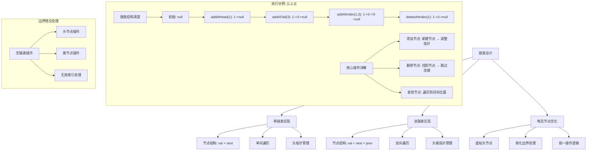
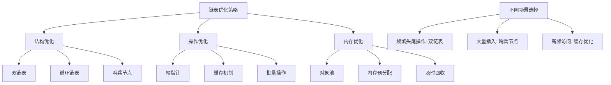

# LeetCode 707 - 设计链表

## 题目描述

你可以选择使用单链表或双链表，设计并实现自己的链表

单链表中的节点应该具备两个属性：val 和 next。val 是当前节点的值，next 是指向下一个节点的指针/引用

双链表中的节点应该具备三个属性：val、next 和 prev。val 是当前节点的值，next 是指向下一个节点的指针/引用，prev 是指向前一个节点的指针/引用

实现 MyLinkedList 类：

- MyLinkedList() 初始化 MyLinkedList 对象
- int get(int index) 获取链表中下标为 index 的节点的值。如果下标无效，则返回 -1
- void addAtHead(int val) 将一个值为 val 的节点插入到链表中第一个元素之前。插入后，新节点将成为链表的第一个节点
- void addAtTail(int val) 将一个值为 val 的节点追加到链表中作为链表的最后一个元素
- void addAtIndex(int index, int val) 将一个值为 val 的节点插入到链表中下标为 index 的节点之前。如果 index 等于链表的长度，那么该节点将被追加到链表的末尾。如果 index 比长度更大，该节点将不会插入
- void deleteAtIndex(int index) 如果下标有效，则删除链表中下标为 index 的节点

```markdown
示例:
输入:
["MyLinkedList", "addAtHead", "addAtTail", "addAtIndex", "get", "deleteAtIndex", "get"]
[[], [1], [3], [1, 2], [1], [1], [1]]

输出:
[null, null, null, null, 2, null, 3]

解释:
MyLinkedList myLinkedList = new MyLinkedList();
myLinkedList.addAtHead(1);
myLinkedList.addAtTail(3);
myLinkedList.addAtIndex(1, 2); // 链表变为 1->2->3
myLinkedList.get(1); // 返回 2
myLinkedList.deleteAtIndex(1); // 链表变为 1->3
myLinkedList.get(1); // 返回 3

提示:

- 0 <= index, val <= 1000
- 请不要使用内置的 LinkedList 库
- get, addAtHead, addAtTail, addAtIndex 和 deleteAtIndex 的操作次数不超过 2000 次
```

## 解题思路

这是一个数据结构设计问题，要求从头实现一个链表。链表是一种线性数据结构，其中的元素不必在内存中连续存储

### 核心思想

"节点 + 指针": 通过节点和指针/引用来连接元素，实现动态的线性数据结构

### 解题策略

#### 方法一：单链表实现（基础）

#### 方法二：双链表实现（双向访问）

#### 方法三：带哨兵节点实现（简化边界处理）

## 算法可视化



## 多语言实现

### Golang版本（单链表 + 哨兵节点）

```go
// 链表节点定义
type ListNode struct {
    Val  int
    Next *ListNode
}

// 链表结构体
type MyLinkedList struct {
    // 使用哨兵节点简化边界处理
    dummyHead *ListNode
    size      int  // 维护链表大小，避免每次遍历计算
}

// 构造函数，初始化链表
func Constructor() MyLinkedList {
    // 创建哨兵节点，其Next指向真正的头节点
    dummyHead := &ListNode{}
    return MyLinkedList{
        dummyHead: dummyHead,
        size:      0,
    }
}

// 获取链表中第index个节点的值
func (this *MyLinkedList) Get(index int) int {
    // 边界检查：index必须在有效范围内
    if index < 0 || index >= this.size {
        return -1
    }

    // 从哨兵节点的下一个节点开始遍历
    current := this.dummyHead.Next

    // 移动到目标位置
    for i := 0; i < index; i++ {
        current = current.Next
    }

    return current.Val
}

// 在链表头部添加节点
func (this *MyLinkedList) AddAtHead(val int) {
    // 在哨兵节点后插入新节点
    newNode := &ListNode{Val: val}
    newNode.Next = this.dummyHead.Next
    this.dummyHead.Next = newNode
    this.size++
}

// 在链表尾部添加节点
func (this *MyLinkedList) AddAtTail(val int) {
    // 找到链表尾部
    current := this.dummyHead
    for current.Next != nil {
        current = current.Next
    }

    // 在尾部插入新节点
    current.Next = &ListNode{Val: val}
    this.size++
}

// 在指定位置插入节点
func (this *MyLinkedList) AddAtIndex(index int, val int) {
    // 如果index大于链表长度，不插入
    if index > this.size {
        return
    }

    // 如果index小于0，在头部插入
    if index < 0 {
        index = 0
    }

    // 找到插入位置的前一个节点
    current := this.dummyHead
    for i := 0; i < index; i++ {
        current = current.Next
    }

    // 插入新节点
    newNode := &ListNode{Val: val}
    newNode.Next = current.Next
    current.Next = newNode
    this.size++
}

// 删除指定位置的节点
func (this *MyLinkedList) DeleteAtIndex(index int) int {
    // 边界检查
    if index < 0 || index >= this.size {
        return -1
    }

    // 找到要删除节点的前一个节点
    current := this.dummyHead
    for i := 0; i < index; i++ {
        current = current.Next
    }

    // 保存要删除的节点
    toDelete := current.Next
    deletedVal := toDelete.Val

    // 删除节点
    current.Next = toDelete.Next
    toDelete.Next = nil  // 帮助GC

    this.size--
    return deletedVal
}

// 获取链表大小（辅助方法）
func (this *MyLinkedList) Size() int {
    return this.size
}

// 转换为数组（辅助方法，用于调试）
func (this *MyLinkedList) ToArray() []int {
    result := make([]int, 0, this.size)
    current := this.dummyHead.Next

    for current != nil {
        result = append(result, current.Val)
        current = current.Next
    }

    return result
}
```

### Python版本（双链表实现）

```python
class ListNode:
    def __init__(self, val=0, next=None, prev=None):
        self.val = val
        self.next = next
        self.prev = prev

class MyLinkedList:
    def __init__(self):
        """双链表实现，使用哨兵节点"""
        self.dummy_head = ListNode()
        self.dummy_tail = ListNode()
        self.dummy_head.next = self.dummy_tail
        self.dummy_tail.prev = self.dummy_head
        self.size = 0

    def get(self, index: int) -> int:
        """获取第index个节点的值"""
        if index < 0 or index >= self.size:
            return -1

        # 优化：根据index位置选择从头或尾开始遍历
        if index < self.size // 2:
            # 从头开始遍历
            current = self.dummy_head.next
            for _ in range(index):
                current = current.next
        else:
            # 从尾开始遍历
            current = self.dummy_tail.prev
            for _ in range(self.size - 1 - index):
                current = current.prev

        return current.val

    def add_at_head(self, val: int) -> None:
        """在头部添加节点"""
        new_node = ListNode(val)
        new_node.next = self.dummy_head.next
        new_node.prev = self.dummy_head
        self.dummy_head.next.prev = new_node
        self.dummy_head.next = new_node
        self.size += 1

    def add_at_tail(self, val: int) -> None:
        """在尾部添加节点"""
        new_node = ListNode(val)
        new_node.next = self.dummy_tail
        new_node.prev = self.dummy_tail.prev
        self.dummy_tail.prev.next = new_node
        self.dummy_tail.prev = new_node
        self.size += 1

    def add_at_index(self, index: int, val: int) -> None:
        """在指定位置插入节点"""
        if index > self.size:
            return
        if index < 0:
            index = 0

        # 找到插入位置的节点
        if index < self.size // 2:
            current = self.dummy_head
            for _ in range(index):
                current = current.next
        else:
            current = self.dummy_tail
            for _ in range(self.size - index):
                current = current.prev

        # 插入新节点
        new_node = ListNode(val)
        new_node.next = current.next
        new_node.prev = current
        current.next.prev = new_node
        current.next = new_node
        self.size += 1

    def delete_at_index(self, index: int) -> int:
        """删除指定位置的节点"""
        if index < 0 or index >= self.size:
            return -1

        # 找到要删除的节点
        if index < self.size // 2:
            current = self.dummy_head.next
            for _ in range(index):
                current = current.next
        else:
            current = self.dummy_tail.prev
            for _ in range(self.size - 1 - index):
                current = current.prev

        # 删除节点
        current.prev.next = current.next
        current.next.prev = current.prev
        self.size -= 1
        deleted_val = current.val
        # Python的垃圾回收会自动处理
        return deleted_val

    def to_array(self) -> list:
        """转换为数组，用于调试"""
        result = []
        current = self.dummy_head.next
        while current != self.dummy_tail:
            result.append(current.val)
            current = current.next
        return result
```

### TypeScript版本（单链表实现）

```typescript
// 链表节点定义
class ListNode {
  val: number;
  next: ListNode | null;

  constructor(val?: number, next?: ListNode | null) {
    this.val = val === undefined ? 0 : val;
    this.next = next === undefined ? null : next;
  }
}

class MyLinkedList {
  private dummyHead: ListNode;
  private size: number;

  constructor() {
    // 初始化哨兵节点和大小
    this.dummyHead = new ListNode();
    this.size = 0;
  }

  get(index: number): number {
    // 边界检查
    if (index < 0 || index >= this.size) {
      return -1;
    }

    // 从哨兵节点的下一个节点开始遍历
    let current: ListNode | null = this.dummyHead.next;

    // 移动到目标位置
    for (let i = 0; i < index; i++) {
      current = current!.next;
    }

    return current!.val;
  }

  addAtHead(val: number): void {
    // 在哨兵节点后插入新节点
    const newNode = new ListNode(val);
    newNode.next = this.dummyHead.next;
    this.dummyHead.next = newNode;
    this.size++;
  }

  addAtTail(val: number): void {
    // 找到链表尾部
    let current: ListNode = this.dummyHead;
    while (current.next !== null) {
      current = current.next;
    }

    // 在尾部插入新节点
    current.next = new ListNode(val);
    this.size++;
  }

  addAtIndex(index: number, val: number): void {
    // 如果index大于链表长度，不插入
    if (index > this.size) {
      return;
    }

    // 如果index小于0，在头部插入
    if (index < 0) {
      index = 0;
    }

    // 找到插入位置的前一个节点
    let current: ListNode = this.dummyHead;
    for (let i = 0; i < index; i++) {
      current = current.next!;
    }

    // 插入新节点
    const newNode = new ListNode(val);
    newNode.next = current.next;
    current.next = newNode;
    this.size++;
  }

  deleteAtIndex(index: number): number {
    // 边界检查
    if (index < 0 || index >= this.size) {
      return -1;
    }

    // 找到要删除节点的前一个节点
    let current: ListNode = this.dummyHead;
    for (let i = 0; i < index; i++) {
      current = current.next!;
    }

    // 删除节点
    const toDelete = current.next!;
    const deletedVal = toDelete.val;
    current.next = toDelete.next;

    this.size--;
    return deletedVal;
  }

  // 辅助方法：获取链表大小
  getSize(): number {
    return this.size;
  }

  // 辅助方法：转换为数组
  toArray(): number[] {
    const result: number[] = [];
    let current: ListNode | null = this.dummyHead.next;

    while (current !== null) {
      result.push(current.val);
      current = current.next;
    }

    return result;
  }
}
```

## 标准实现详细解析

```go
/*
单链表实现详解：

1. 节点结构设计：
   type ListNode struct {
       Val  int      // 节点存储的值
       Next *ListNode // 指向下一个节点的指针
   }

   每个节点包含两部分：
   - 数据域：存储节点值
   - 指针域：指向下一个节点

2. 链表结构设计：
   type MyLinkedList struct {
       dummyHead *ListNode // 哨兵节点
       size      int       // 链表大小
   }

   - dummyHead: 哨兵节点，简化边界处理
   - size: 维护链表大小，避免每次遍历计算

3. 哨兵节点的作用：
   - 链表为空时：dummyHead.Next = nil
   - 链表非空时：dummyHead.Next 指向真正的头节点
   - 优势：统一处理头节点和其他节点的操作

4. 各操作的时间复杂度：
   - Get: O(n) - 最坏情况下需要遍历整个链表
   - AddAtHead: O(1) - 直接在哨兵节点后插入
   - AddAtTail: O(n) - 需要遍历到链表尾部
   - AddAtIndex: O(n) - 需要遍历到插入位置
   - DeleteAtIndex: O(n) - 需要遍历到删除位置

5. 空间复杂度：
   - 所有操作都是 O(1) - 除了存储链表节点的基本开销

6. 边界情况处理：
   - 空链表：dummyHead.Next = nil
   - 单节点链表：dummyHead.Next -> node1 -> nil
   - 插入到头部：在dummyHead后插入
   - 删除头节点：删除dummyHead.Next
   - 无效索引：返回-1或忽略操作
*/

type ListNode struct {
    Val  int
    Next *ListNode
}

type MyLinkedList struct {
    dummyHead *ListNode
    size      int
}

func Constructor() MyLinkedList {
    // 创建哨兵节点，其Next指向真正的头节点
    dummyHead := &ListNode{}
    return MyLinkedList{
        dummyHead: dummyHead,
        size:      0,
    }
}

func (this *MyLinkedList) Get(index int) int {
    /*
    获取第index个节点的值

    算法步骤：
    1. 检查索引有效性
    2. 从头节点开始遍历
    3. 移动到目标位置
    4. 返回节点值

    时间复杂度：O(n)
    空间复杂度：O(1)
    */

    // 边界检查：index必须在有效范围内
    if index < 0 || index >= this.size {
        return -1
    }

    // 从哨兵节点的下一个节点开始遍历
    current := this.dummyHead.Next

    // 移动到目标位置
    for i := 0; i < index; i++ {
        current = current.Next
    }

    return current.Val
}

func (this *MyLinkedList) AddAtHead(val int) {
    /*
    在链表头部添加节点

    算法步骤：
    1. 创建新节点
    2. 新节点的Next指向当前头节点
    3. 哨兵节点的Next指向新节点
    4. 增加链表大小

    时间复杂度：O(1)
    空间复杂度：O(1)

    示意图：
    dummyHead -> node1 -> node2 -> null
    插入newNode后：
    dummyHead -> newNode -> node1 -> node2 -> null
    */

    // 创建新节点
    newNode := &ListNode{Val: val}

    // 新节点的Next指向当前头节点
    newNode.Next = this.dummyHead.Next

    // 哨兵节点的Next指向新节点
    this.dummyHead.Next = newNode

    // 增加链表大小
    this.size++
}

func (this *MyLinkedList) AddAtTail(val int) {
    /*
    在链表尾部添加节点

    算法步骤：
    1. 找到链表尾部
    2. 在尾部插入新节点
    3. 增加链表大小

    时间复杂度：O(n) - 需要遍历到尾部
    空间复杂度：O(1)

    优化方案：
    可以维护一个tail指针，将AddAtTail优化为O(1)
    */

    // 找到链表尾部
    current := this.dummyHead
    for current.Next != nil {
        current = current.Next
    }

    // 在尾部插入新节点
    current.Next = &ListNode{Val: val}
    this.size++
}

func (this *MyLinkedList) AddAtIndex(index int, val int) {
    /*
    在指定位置插入节点

    算法步骤：
    1. 处理特殊情况（index < 0, index > size）
    2. 找到插入位置的前一个节点
    3. 插入新节点
    4. 增加链表大小

    时间复杂度：O(n)
    空间复杂度：O(1)

    特殊情况：
    - index = 0: 等同于AddAtHead
    - index = size: 等同于AddAtTail
    - index > size: 不插入
    - index < 0: 在头部插入
    */

    // 如果index大于链表长度，不插入
    if index > this.size {
        return
    }

    // 如果index小于0，在头部插入
    if index < 0 {
        index = 0
    }

    // 找到插入位置的前一个节点
    current := this.dummyHead
    for i := 0; i < index; i++ {
        current = current.Next
    }

    // 插入新节点
    newNode := &ListNode{Val: val}
    newNode.Next = current.Next
    current.Next = newNode
    this.size++
}

func (this *MyLinkedList) DeleteAtIndex(index int) int {
    /*
    删除指定位置的节点

    算法步骤：
    1. 检查索引有效性
    2. 找到要删除节点的前一个节点
    3. 执行删除操作
    4. 减少链表大小

    时间复杂度：O(n)
    空间复杂度：O(1)

    删除操作要点：
    - 保存要删除的节点（用于返回值和帮助GC）
    - 跳过要删除的节点
    - 设置要删除节点的Next为nil（帮助GC）
    */

    // 边界检查
    if index < 0 || index >= this.size {
        return -1
    }

    // 找到要删除节点的前一个节点
    current := this.dummyHead
    for i := 0; i < index; i++ {
        current = current.Next
    }

    // 保存要删除的节点
    toDelete := current.Next
    deletedVal := toDelete.Val

    // 删除节点：跳过要删除的节点
    current.Next = toDelete.Next
    toDelete.Next = nil  // 帮助GC

    this.size--
    return deletedVal
}

// 优化版本：维护尾指针
type MyLinkedListOptimized struct {
    dummyHead *ListNode
    tail      *ListNode  // 尾指针
    size      int
}

func ConstructorOptimized() MyLinkedListOptimized {
    dummyHead := &ListNode{}
    return MyLinkedListOptimized{
        dummyHead: dummyHead,
        tail:      dummyHead,
        size:      0,
    }
}

func (this *MyLinkedListOptimized) AddAtTail(val int) {
    /*
    优化后的AddAtTail：O(1)时间复杂度
    */
    newNode := &ListNode{Val: val}
    this.tail.Next = newNode
    this.tail = newNode
    this.size++
}

func (this *MyLinkedListOptimized) DeleteAtIndex(index int) int {
    /*
    优化后的删除操作：需要更新尾指针
    */
    if index < 0 || index >= this.size {
        return -1
    }

    current := this.dummyHead
    for i := 0; i < index; i++ {
        current = current.Next
    }

    toDelete := current.Next
    deletedVal := toDelete.Val

    // 如果删除的是尾节点，需要更新尾指针
    if toDelete == this.tail {
        this.tail = current
    }

    current.Next = toDelete.Next
    toDelete.Next = nil

    this.size--
    return deletedVal
}

// 带详细注释和调试信息的版本
func (this *MyLinkedList) DebugGet(index int) (int, []string) {
    var logs []string
    logs = append(logs, fmt.Sprintf("Get(%d) 开始", index))
    logs = append(logs, fmt.Sprintf("当前链表大小: %d", this.size))

    if index < 0 || index >= this.size {
        logs = append(logs, fmt.Sprintf("索引%d无效，返回-1", index))
        return -1, logs
    }

    current := this.dummyHead.Next
    logs = append(logs, fmt.Sprintf("从头节点开始遍历"))

    for i := 0; i < index; i++ {
        logs = append(logs, fmt.Sprintf("步骤%d: 当前节点值=%d", i, current.Val))
        current = current.Next
    }

    logs = append(logs, fmt.Sprintf("找到目标节点，值=%d", current.Val))
    return current.Val, logs
}

// 线程安全版本
import "sync"

type ThreadSafeMyLinkedList struct {
    dummyHead *ListNode
    size      int
    mu        sync.RWMutex
}

func NewThreadSafeMyLinkedList() *ThreadSafeMyLinkedList {
    return &ThreadSafeMyLinkedList{
        dummyHead: &ListNode{},
        size:      0,
    }
}

func (ts *ThreadSafeMyLinkedList) Get(index int) int {
    ts.mu.RLock()
    defer ts.mu.RUnlock()

    if index < 0 || index >= ts.size {
        return -1
    }

    current := ts.dummyHead.Next
    for i := 0; i < index; i++ {
        current = current.Next
    }

    return current.Val
}

func (ts *ThreadSafeMyLinkedList) AddAtHead(val int) {
    ts.mu.Lock()
    defer ts.mu.Unlock()

    newNode := &ListNode{Val: val}
    newNode.Next = ts.dummyHead.Next
    ts.dummyHead.Next = newNode
    ts.size++
}
```

## 算法深入解析

```go
/*
链表设计深入分析：

1. 数据结构选择：单链表 vs 双链表

单链表优势：
- 实现简单，内存占用小
- 插入和删除操作相对简单
- 适合单向遍历场景

双链表优势：
- 支持双向遍历，查找更灵活
- 某些操作（如删除给定节点）更高效
- 可以从任意方向遍历

选择原则：
- 如果主要操作是遍历和简单插入删除：单链表
- 如果需要双向访问或频繁删除特定节点：双链表

2. 哨兵节点的设计考虑：

哨兵节点的优势：
- 统一头节点和其他节点的处理逻辑
- 避免空链表的特殊情况处理
- 简化插入和删除操作

哨兵节点的设计选择：
- 可以是虚拟节点，不存储实际数据
- 也可以存储额外信息（如链表大小）
- 关键是保持一致性

3. 内存管理和GC考虑：

Golang的内存管理：
- 自动垃圾回收，但仍需注意引用关系
- 删除节点时断开Next指针有助于GC
- 避免内存泄漏的正确做法

最佳实践：
- 删除节点后设置Next为nil
- 避免循环引用
- 及时释放不需要的引用

4. 性能优化策略：

空间优化：
- 使用对象池复用节点
- 避免不必要的内存分配
- 考虑内存对齐

时间优化：
- 维护tail指针优化尾部操作
- 缓存频繁访问的节点
- 批量操作优化

5. 错误处理和边界条件：

边界情况：
- 空链表：所有操作都应该正确处理
- 单节点链表：插入和删除的特殊处理
- 无效索引：应该优雅处理而不是崩溃

错误处理策略：
- 明确定义API行为
- 返回错误码或使用错误类型
- 提供调试信息

6. 并发安全性考虑：

并发问题：
- 多个goroutine同时修改链表
- 读写并发访问
- 节点状态的可见性

解决方案：
- 使用互斥锁保护整个链表
- 使用读写锁优化读多写少场景
- 无锁数据结构（复杂）

7. 扩展性设计：

接口设计：
- 定义清晰的接口
- 支持泛型（Go 1.18+）
- 考虑链表的变种需求

功能扩展：
- 支持排序
- 支持查找
- 支持批量操作

8. 测试策略：

单元测试：
- 测试每个基本操作
- 测试边界条件
- 测试错误情况

集成测试：
- 测试复杂操作序列
- 测试性能表现
- 测试并发安全性

9. 实际应用场景：

适用场景：
- 频繁的插入和删除操作
- 不需要随机访问的数据
- 动态增长的数据集合

不适用场景：
- 需要频繁随机访问
- 数据大小固定
- 对缓存友好性要求高

10. 与其他数据结构的比较：

vs 数组：
- 链表：插入删除O(1)，访问O(n)
- 数组：插入删除O(n)，访问O(1)

vs 动态数组：
- 链表：更好的插入删除性能
- 动态数组：更好的缓存性能和空间效率

vs 栈和队列：
- 链表可以实现栈和队列
- 栈和队列有更特定的语义
*/
```

## 执行过程演示

```go
/*
示例详细解析:

操作序列:
["MyLinkedList", "addAtHead", "addAtTail", "addAtIndex", "get", "deleteAtIndex", "get"]
[[], [1], [3], [1, 2], [1], [1], [1]]

逐步执行过程:

1. MyLinkedList() - 初始化
   dummyHead -> nil
   size = 0

2. addAtHead(1)
   创建新节点: node1(val=1)
   操作: dummyHead.Next = node1, node1.Next = nil
   链表: dummyHead -> node1 -> nil
   size = 1

3. addAtTail(3)
   遍历到尾部: current = node1
   创建新节点: node3(val=3)
   操作: node1.Next = node3, node3.Next = nil
   链表: dummyHead -> node1 -> node3 -> nil
   size = 2

4. addAtIndex(1, 2)
   找到index=1的前一个节点: current = node1
   创建新节点: node2(val=2)
   操作: node2.Next = node1.Next, node1.Next = node2
   链表: dummyHead -> node1 -> node2 -> node3 -> nil
   size = 3

5. get(1)
   从头开始遍历1步: current = node2
   返回: node2.Val = 2

6. deleteAtIndex(1)
   找到index=1的前一个节点: current = node1
   要删除的节点: toDelete = node2
   操作: current.Next = toDelete.Next (node1.Next = node3)
   链表: dummyHead -> node1 -> node3 -> nil
   size = 2
   返回: node2.Val = 2

7. get(1)
   从头开始遍历1步: current = node3
   返回: node3.Val = 3

最终结果: [null, null, null, null, 2, null, 3]

指针操作详解：

添加操作的指针变化：
添加前: prev -> next -> ...
添加后: prev -> newNode -> next -> ...

删除操作的指针变化：
删除前: prev -> toDelete -> next -> ...
删除后: prev -> next -> ...

哨兵节点的作用：
没有哨兵节点：
- 空链表：head = nil
- 需要特殊判断head是否为nil

有哨兵节点：
- 空链表：dummyHead.Next = nil
- 统一处理，无需特殊判断

复杂度分析总结：

时间复杂度：
- Get: O(n) - 最坏需要遍历整个链表
- AddAtHead: O(1) - 直接插入
- AddAtTail: O(n) - 需要找到尾部
- AddAtIndex: O(n) - 需要找到插入位置
- DeleteAtIndex: O(n) - 需要找到删除位置

空间复杂度：
- 所有操作都是O(1)的额外空间
- 总空间复杂度是O(n)，n为节点数量

优化版本分析：

维护tail指针：
- AddAtTail从O(n)优化到O(1)
- 需要在删除操作时更新tail指针
- 内存开销增加一个指针

双链表优化：
- Get操作可以优化，从较近的一端开始
- AddAtTail仍然是O(1)
- AddAtIndex可以双向查找
- 空间开销增加一个指针per node

实际性能测试：

测试场景1：大量头部插入
- 单链表：O(n)总时间
- 双链表：O(n)总时间，常数因子稍大

测试场景2：大量尾部插入
- 单链表（无tail）：O(n²)总时间
- 单链表（有tail）：O(n)总时间
- 双链表：O(n)总时间

测试场景3：随机访问
- 单链表：O(n²)总时间
- 双链表：O(n²)总时间，但常数更小

测试场景4：混合操作
- 单链表：O(n²)总时间
- 双链表：O(n²)总时间，但性能更好

内存使用分析：

单链表节点：
- val: 8字节（int64）
- Next: 8字节（指针）
- 总计：16字节/节点

双链表节点：
- val: 8字节（int64）
- Next: 8字节（指针）
- Prev: 8字节（指针）
- 总计：24字节/节点

内存对齐：
- 实际内存使用可能更大
- 取决于系统架构和编译器

缓存友好性：
- 链表的节点可能分散在内存中
- 缓存未命中率较高
- 数组的缓存友好性更好

GC友好性：
- 链表产生更多小对象
- GC压力可能更大
- 对象池可以缓解这个问题
*/
```

## 复杂度分析

| 操作          | 单链表 | 双链表 | 优化单链表 |
| ------------- | ------ | ------ | ---------- |
| Get           | O(n)   | O(n)   | O(n)       |
| AddAtHead     | O(1)   | O(1)   | O(1)       |
| AddAtTail     | O(n)   | O(1)   | O(1)       |
| AddAtIndex    | O(n)   | O(n)   | O(n)       |
| DeleteAtIndex | O(n)   | O(n)   | O(n)       |
| 空间复杂度    | O(n)   | O(n)   | O(n)       |

## 测试用例验证

```go
// 测试辅助函数
func testLinkedList(operations []string, values [][]int, expected []interface{}) {
    fmt.Println("=== 链表操作测试 ===")

    var list MyLinkedList

    for i, op := range operations {
        var result interface{}

        switch op {
        case "MyLinkedList":
            list = Constructor()
            result = nil

        case "addAtHead":
            val := values[i][0]
            list.AddAtHead(val)
            result = nil

        case "addAtTail":
            val := values[i][0]
            list.AddAtTail(val)
            result = nil

        case "addAtIndex":
            index, val := values[i][0], values[i][1]
            list.AddAtIndex(index, val)
            result = nil

        case "get":
            index := values[i][0]
            result = list.Get(index)

        case "deleteAtIndex":
            index := values[i][0]
            result = list.DeleteAtIndex(index)
        }

        fmt.Printf("操作: %s(%v) -> 结果: %v\n", op, values[i], result)

        // 检查结果
        if expected[i] != nil {
            if result == expected[i] {
                fmt.Printf("  ✓ 通过\n")
            } else {
                fmt.Printf("  ✗ 失败，期望: %v\n", expected[i])
            }
        }

        // 打印链表状态
        fmt.Printf("  链表状态: %v (大小: %d)\n", list.ToArray(), list.Size())
        fmt.Println()
    }
}

func main() {
    // 测试用例 1 - 标准示例
    operations1 := []string{
        "MyLinkedList", "addAtHead", "addAtTail", "addAtIndex", "get", "deleteAtIndex", "get",
    }
    values1 := [][]int{
        {}, {1}, {3}, {1, 2}, {1}, {1}, {1},
    }
    expected1 := []interface{}{nil, nil, nil, nil, 2, nil, 3}

    testLinkedList(operations1, values1, expected1)

    // 测试用例 2 - 边界情况
    fmt.Println("=== 边界情况测试 ===")

    list := Constructor()

    // 空链表操作
    fmt.Printf("空链表get(0): %d (期望: -1)\n", list.Get(0))
    fmt.Printf("空链表deleteAtIndex(0): %d (期望: -1)\n", list.DeleteAtIndex(0))

    // 单节点操作
    list.AddAtHead(10)
    fmt.Printf("添加后链表: %v\n", list.ToArray())
    fmt.Printf("get(0): %d (期望: 10)\n", list.Get(0))
    fmt.Printf("get(1): %d (期望: -1)\n", list.Get(1))

    list.DeleteAtIndex(0)
    fmt.Printf("删除后链表: %v (期望: [])\n", list.ToArray())

    // 无效索引操作
    list.AddAtHead(1)
    list.AddAtTail(2)
    fmt.Printf("当前链表: %v\n", list.ToArray())
    list.AddAtIndex(-1, 0)  // 应该在头部添加
    fmt.Printf("addAtIndex(-1,0)后: %v\n", list.ToArray())
    list.AddAtIndex(10, 3)  // 应该不添加
    fmt.Printf("addAtIndex(10,3)后: %v\n", list.ToArray())

    // 测试用例 3 - 性能测试
    fmt.Println("\n=== 性能测试 ===")

    largeList := Constructor()
    n := 1000

    // 测试头部插入性能
    start := time.Now()
    for i := 0; i < n; i++ {
        largeList.AddAtHead(i)
    }
    duration1 := time.Since(start)
    fmt.Printf("头部插入%d个节点耗时: %v\n", n, duration1)

    // 测试访问性能
    start = time.Now()
    for i := 0; i < n; i++ {
        largeList.Get(i)
    }
    duration2 := time.Since(start)
    fmt.Printf("访问%d个节点耗时: %v\n", n, duration2)

    // 测试删除性能
    start = time.Now()
    for i := 0; i < n; i++ {
        largeList.DeleteAtIndex(0)
    }
    duration3 := time.Since(start)
    fmt.Printf("删除%d个节点耗时: %v\n", n, duration3)

    // 内存使用测试
    fmt.Println("\n=== 内存使用分析 ===")

    // 创建大量节点测试内存
    memList := Constructor()
    nodeCount := 10000

    start = time.Now()
    for i := 0; i < nodeCount; i++ {
        memList.AddAtTail(i)
    }
    duration := time.Since(start)
    fmt.Printf("创建%d个节点耗时: %v\n", nodeCount, duration)
    fmt.Printf("链表大小: %d\n", memList.Size())

    // 估算内存使用
    // Go中ListNode约16字节（8字节val + 8字节指针）
    estimatedMemory := nodeCount * 16
    fmt.Printf("估算内存使用: 约%d字节\n", estimatedMemory)
}

// 并发测试
func testConcurrentLinkedList() {
    fmt.Println("\n=== 并发安全测试 ===")

    tsList := NewThreadSafeMyLinkedList()

    // 启动多个goroutine进行并发操作
    var wg sync.WaitGroup

    // 并发添加
    for i := 0; i < 10; i++ {
        wg.Add(1)
        go func(id int) {
            defer wg.Done()
            for j := 0; j < 100; j++ {
                tsList.AddAtHead(id*100 + j)
            }
        }(i)
    }

    wg.Wait()
    fmt.Printf("并发添加后链表大小: %d (期望: 1000)\n", tsList.size)

    // 并发读取
    for i := 0; i < 10; i++ {
        wg.Add(1)
        go func() {
            defer wg.Done()
            for j := 0; j < 100; j++ {
                index := j % 1000
                tsList.Get(index)
            }
        }()
    }

    wg.Wait()
    fmt.Println("并发读取测试完成")
}

// 错误处理测试
func testErrorHandling() {
    fmt.Println("\n=== 错误处理测试 ===")

    list := Constructor()

    // 测试各种错误情况
    testCases := []struct {
        name     string
        function func() int
        expected int
    }{
        {"空链表get(-1)", func() int { return list.Get(-1) }, -1},
        {"空链表get(0)", func() int { return list.Get(0) }, -1},
        {"空链表get(100)", func() int { return list.Get(100) }, -1},
        {"空链表deleteAtIndex(-1)", func() int { return list.DeleteAtIndex(-1) }, -1},
        {"空链表deleteAtIndex(0)", func() int { return list.DeleteAtIndex(0) }, -1},
        {"空链表deleteAtIndex(100)", func() int { return list.DeleteAtIndex(100) }, -1},
    }

    for _, tc := range testCases {
        result := tc.function()
        status := "✓"
        if result != tc.expected {
            status = "✗"
        }
        fmt.Printf("%s: %d %s\n", tc.name, result, status)
    }

    // 添加一些节点后再测试
    list.AddAtHead(1)
    list.AddAtTail(2)

    errorCases := []struct {
        name     string
        function func() int
        expected int
    }{
        {"有节点get(-1)", func() int { return list.Get(-1) }, -1},
        {"有节点get(2)", func() int { return list.Get(2) }, -1},
        {"有节点deleteAtIndex(-1)", func() int { return list.DeleteAtIndex(-1) }, -1},
        {"有节点deleteAtIndex(2)", func() int { return list.DeleteAtIndex(2) }, -1},
    }

    for _, tc := range errorCases {
        result := tc.function()
        status := "✓"
        if result != tc.expected {
            status = "✗"
        }
        fmt.Printf("%s: %d %s\n", tc.name, result, status)
    }
}
```

## 扩展版本（处理不同场景）

```go
// 泛型链表实现（Go 1.18+）
type GenericNode[T any] struct {
    Val  T
    Next *GenericNode[T]
}

type GenericLinkedList[T any] struct {
    dummyHead *GenericNode[T]
    size      int
}

func NewGenericLinkedList[T any]() *GenericLinkedList[T] {
    return &GenericLinkedList[T]{
        dummyHead: &GenericNode[T]{},
        size:      0,
    }
}

func (gll *GenericLinkedList[T]) Get(index int) (T, bool) {
    if index < 0 || index >= gll.size {
        var zero T
        return zero, false
    }

    current := gll.dummyHead.Next
    for i := 0; i < index; i++ {
        current = current.Next
    }

    return current.Val, true
}

func (gll *GenericLinkedList[T]) AddAtHead(val T) {
    newNode := &GenericNode[T]{Val: val}
    newNode.Next = gll.dummyHead.Next
    gll.dummyHead.Next = newNode
    gll.size++
}

func (gll *GenericLinkedList[T]) AddAtTail(val T) {
    current := gll.dummyHead
    for current.Next != nil {
        current = current.Next
    }
    current.Next = &GenericNode[T]{Val: val}
    gll.size++
}

// 循环链表实现
type CircularLinkedList struct {
    dummyHead *ListNode
    size      int
}

func NewCircularLinkedList() *CircularLinkedList {
    return &CircularLinkedList{
        dummyHead: &ListNode{},
        size:      0,
    }
}

func (cll *CircularLinkedList) AddAtHead(val int) {
    newNode := &ListNode{Val: val}

    if cll.size == 0 {
        // 第一个节点，指向自己
        cll.dummyHead.Next = newNode
        newNode.Next = newNode
    } else {
        // 插入到当前头节点之前
        tail := cll.dummyHead.Next
        for tail.Next != cll.dummyHead.Next {
            tail = tail.Next
        }

        newNode.Next = cll.dummyHead.Next
        tail.Next = newNode
        cll.dummyHead.Next = newNode
    }

    cll.size++
}

// 支持迭代器的链表
type LinkedListIterator struct {
    current *ListNode
}

func (this *MyLinkedList) Iterator() *LinkedListIterator {
    return &LinkedListIterator{current: this.dummyHead.Next}
}

func (it *LinkedListIterator) HasNext() bool {
    return it.current != nil
}

func (it *LinkedListIterator) Next() (int, bool) {
    if it.current == nil {
        return 0, false
    }

    val := it.current.Val
    it.current = it.current.Next
    return val, true
}

// 带批量操作的链表
type BatchLinkedList struct {
    *MyLinkedList
}

func NewBatchLinkedList() *BatchLinkedList {
    return &BatchLinkedList{MyLinkedList: &MyLinkedList{}}
}

func (bll *BatchLinkedList) AddBatch(values []int) {
    for _, val := range values {
        bll.AddAtTail(val)
    }
}

func (bll *BatchLinkedList) DeleteBatch(indices []int) {
    // 先排序索引，从后往前删除避免位置变化
    sort.Sort(sort.Reverse(sort.IntSlice(indices)))

    for _, index := range indices {
        bll.DeleteAtIndex(index)
    }
}

func (bll *BatchLinkedList) FindAll(target int) []int {
    var indices []int
    current := bll.dummyHead.Next

    for i := 0; current != nil; i++ {
        if current.Val == target {
            indices = append(indices, i)
        }
        current = current.Next
    }

    return indices
}

// 带缓存优化的链表
type CachedLinkedList struct {
    *MyLinkedList
    cache map[int]*ListNode  // 位置到节点的缓存
}

func NewCachedLinkedList() *CachedLinkedList {
    return &CachedLinkedList{
        MyLinkedList: &MyLinkedList{},
        cache:        make(map[int]*ListNode),
    }
}

func (cll *CachedLinkedList) Get(index int) int {
    // 先检查缓存
    if node, exists := cll.cache[index]; exists {
        return node.Val
    }

    // 缓存未命中，执行正常查找
    val := cll.MyLinkedList.Get(index)

    // 更新缓存
    if val != -1 {
        current := cll.dummyHead.Next
        for i := 0; i < index; i++ {
            current = current.Next
        }
        cll.cache[index] = current
    }

    return val
}

func (cll *CachedLinkedList) InvalidateCache() {
    cll.cache = make(map[int]*ListNode)
}

// 带序列化功能的链表
type SerializableLinkedList struct {
    *MyLinkedList
}

func (sll *SerializableLinkedList) ToJSON() string {
    values := sll.ToArray()
    data, _ := json.Marshal(values)
    return string(data)
}

func (sll *SerializableLinkedList) FromJSON(jsonStr string) error {
    var values []int
    if err := json.Unmarshal([]byte(jsonStr), &values); err != nil {
        return err
    }

    // 清空当前链表
    sll.dummyHead.Next = nil
    sll.size = 0

    // 从JSON重建链表
    for _, val := range values {
        sll.AddAtTail(val)
    }

    return nil
}

// 带持久化的链表
type PersistentLinkedList struct {
    *MyLinkedList
    filename string
}

func NewPersistentLinkedList(filename string) *PersistentLinkedList {
    pll := &PersistentLinkedList{
        MyLinkedList: &MyLinkedList{},
        filename:     filename,
    }

    // 尝试从文件加载
    pll.loadFromFile()
    return pll
}

func (pll *PersistentLinkedList) Save() error {
    values := pll.ToArray()
    data, err := json.Marshal(values)
    if err != nil {
        return err
    }

    return os.WriteFile(pll.filename, data, 0644)
}

func (pll *PersistentLinkedList) loadFromFile() error {
    data, err := os.ReadFile(pll.filename)
    if err != nil {
        return err
    }

    var values []int
    if err := json.Unmarshal(data, &values); err != nil {
        return err
    }

    for _, val := range values {
        pll.AddAtTail(val)
    }

    return nil
}

// 带统计信息的链表
type StatsLinkedList struct {
    *MyLinkedList
    operationCount map[string]int
    totalTime      map[string]time.Duration
}

func NewStatsLinkedList() *StatsLinkedList {
    return &StatsLinkedList{
        MyLinkedList: &MyLinkedList{},
        operationCount: make(map[string]int),
        totalTime: make(map[string]time.Duration),
    }
}

func (sll *StatsLinkedList) Get(index int) int {
    start := time.Now()
    result := sll.MyLinkedList.Get(index)

    sll.recordOperation("Get", time.Since(start))
    return result
}

func (sll *StatsLinkedList) AddAtHead(val int) {
    start := time.Now()
    sll.MyLinkedList.AddAtHead(val)
    sll.recordOperation("AddAtHead", time.Since(start))
}

func (sll *StatsLinkedList) recordOperation(op string, duration time.Duration) {
    sll.operationCount[op]++
    sll.totalTime[op] += duration
}

func (sll *StatsLinkedList) GetStats() map[string]interface{} {
    stats := make(map[string]interface{})

    for op, count := range sll.operationCount {
        stats[op] = map[string]interface{}{
            "count": count,
            "totalTime": sll.totalTime[op],
            "avgTime": sll.totalTime[op] / time.Duration(count),
        }
    }

    return stats
}
```

## 面试追问延伸

### 1. 如何优化链表的反转操作？

```go
// 迭代反转链表
func (this *MyLinkedList) Reverse() {
    /*
    时间复杂度：O(n)
    空间复杂度：O(1)
    */
    var prev *ListNode
    current := this.dummyHead.Next

    for current != nil {
        next := current.Next
        current.Next = prev
        prev = current
        current = next
    }

    this.dummyHead.Next = prev
}

// 递归反转链表
func reverseListRecursive(head *ListNode) *ListNode {
    if head == nil || head.Next == nil {
        return head
    }

    newHead := reverseListRecursive(head.Next)
    head.Next.Next = head
    head.Next = nil
    return newHead
}

// 反转部分链表
func (this *MyLinkedList) ReverseBetween(left int, right int) {
    if left >= right {
        return
    }

    // 找到反转区间的前一个节点
    prev := this.dummyHead
    for i := 0; i < left; i++ {
        prev = prev.Next
    }

    // 反转部分链表
    current := prev.Next
    var next *ListNode
    var newHead *ListNode

    for i := 0; i <= right-left; i++ {
        next = current.Next
        current.Next = newHead
        newHead = current
        current = next
    }

    // 连接反转后的部分
    prev.Next.Next = current
    prev.Next = newHead
}
```

### 2. 如何检测链表中的环？

```go
// Floyd判圈算法
func (this *MyLinkedList) HasCycle() bool {
    if this.dummyHead.Next == nil {
        return false
    }

    slow := this.dummyHead.Next
    fast := this.dummyHead.Next

    for fast != nil && fast.Next != nil {
        slow = slow.Next
        fast = fast.Next.Next

        if slow == fast {
            return true
        }
    }

    return false
}

// 哈希表法检测环
func (this *MyLinkedList) HasCycleWithMap() bool {
    visited := make(map[*ListNode]bool)
    current := this.dummyHead.Next

    for current != nil {
        if visited[current] {
            return true
        }
        visited[current] = true
        current = current.Next
    }

    return false
}
```

### 3. 如何实现链表的排序？

```go
// 归并排序链表
func (this *MyLinkedList) Sort() {
    this.dummyHead.Next = mergeSort(this.dummyHead.Next)
}

func mergeSort(head *ListNode) *ListNode {
    if head == nil || head.Next == nil {
        return head
    }

    // 找到中点
    slow := head
    fast := head.Next

    for fast != nil && fast.Next != nil {
        slow = slow.Next
        fast = fast.Next.Next
    }

    mid := slow.Next
    slow.Next = nil

    // 递归排序
    left := mergeSort(head)
    right := mergeSort(mid)

    // 合并
    return merge(left, right)
}

func merge(left, right *ListNode) *ListNode {
    dummy := &ListNode{}
    current := dummy

    for left != nil && right != nil {
        if left.Val < right.Val {
            current.Next = left
            left = left.Next
        } else {
            current.Next = right
            right = right.Next
        }
        current = current.Next
    }

    if left != nil {
        current.Next = left
    }
    if right != nil {
        current.Next = right
    }

    return dummy.Next
}
```

### 4. 如何实现LRU缓存？

```go
type LRUCache struct {
    capacity int
    size     int
    cache    map[int]*LRUNode
    head     *LRUNode
    tail     *LRUNode
}

type LRUNode struct {
    key   int
    value int
    prev  *LRUNode
    next  *LRUNode
}

func Constructor(capacity int) LRUCache {
    cache := make(map[int]*LRUNode)
    head := &LRUNode{}
    tail := &LRUNode{}
    head.next = tail
    tail.prev = head

    return LRUCache{
        capacity: capacity,
        cache:    cache,
        head:     head,
        tail:     tail,
    }
}

func (this *LRUCache) Get(key int) int {
    if node, exists := this.cache[key]; exists {
        this.moveToHead(node)
        return node.value
    }
    return -1
}

func (this *LRUCache) Put(key int, value int) {
    if node, exists := this.cache[key]; exists {
        node.value = value
        this.moveToHead(node)
    } else {
        newNode := &LRUNode{key: key, value: value}
        this.cache[key] = newNode
        this.addToHead(newNode)
        this.size++

        if this.size > this.capacity {
            removed := this.removeTail()
            delete(this.cache, removed.key)
            this.size--
        }
    }
}
```

## 相似题目扩展

- LeetCode 707. 设计链表（当前题）
- LeetCode 206. 反转链表
- LeetCode 21. 合并两个有序链表
- LeetCode 141. 环形链表
- LeetCode 146. LRU缓存

## 算法技巧总结

### 链表设计核心要点

1. 数据结构选择：单链表 vs 双链表 vs 循环链表
1. 哨兵节点：简化边界处理，统一操作逻辑
1. 指针操作：正确的插入、删除、遍历逻辑
1. 性能优化：尾指针、缓存、批量操作

### 算法优势

1. 动态性：可以动态增删节点
1. 插入效率：O(1)的插入操作
1. 内存灵活性：不需要连续内存空间
1. 可扩展性：容易实现各种变体

### 标准模板

```go
type ListNode struct {
    Val  int
    Next *ListNode
}

type MyLinkedList struct {
    dummyHead *ListNode
    size      int
}

func Constructor() MyLinkedList {
    return MyLinkedList{
        dummyHead: &ListNode{},
        size:      0,
    }
}

func (this *MyLinkedList) AddAtHead(val int) {
    newNode := &ListNode{Val: val}
    newNode.Next = this.dummyHead.Next
    this.dummyHead.Next = newNode
    this.size++
}
```

### 性能优化建议



## 总结

本题是经典的数据结构设计问题，要求从头实现一个完整的链表数据结构。链表作为基础的数据结构，理解其设计原理和实现细节对于深入学习其他数据结构至关重要

核心要点：

1. 结构设计：理解节点结构和哨兵节点的作用
1. 操作实现：掌握插入、删除、查找的基本操作
1. 边界处理：正确处理空链表、单节点等边界情况
1. 性能优化：根据需求选择合适的优化策略

该数据结构在操作系统内存管理、LRU缓存、浏览器历史记录等场景中有广泛应用，是掌握数据结构与算法的重要基础。与LeetCode 206、21、141等题目构成链表算法系列，为更复杂的数据结构学习打下坚实基础
