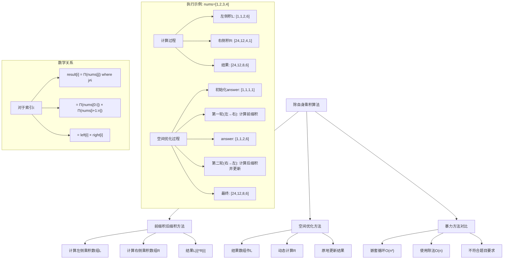
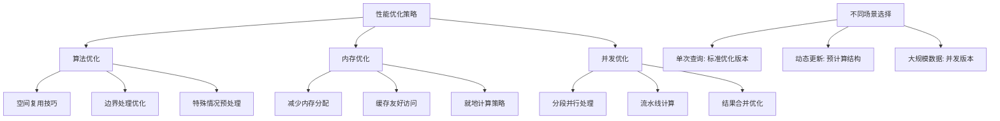

# LeetCode 238 - 除自身以外数组的乘积

## 题目描述

给你一个整数数组 nums，返回数组 answer，其中 answer[i] 等于 nums 中除 nums[i] 之外其余各元素的乘积

题目数据保证数组 nums之中任意元素的全部前缀元素和后缀的乘积都在 32 位整数范围内

请不要使用除法，且在 O(n) 时间复杂度内完成此题目

```markdown
示例 1:
输入: nums = [1,2,3,4]
输出: [24,12,8,6]
解释:

- answer[0] = 1 _ 2 _ 3 \* 4 / 1 = 24
- answer[1] = 1 _ 2 _ 3 \* 4 / 2 = 12
- answer[2] = 1 _ 2 _ 3 \* 4 / 3 = 8
- answer[3] = 1 _ 2 _ 3 \* 4 / 4 = 6

示例 2:
输入: nums = [-1,1,0,-3,3]
输出: [0,0,9,0,0]
解释:

- answer[2] = -1 _ 1 _ (-3) \* 3 = 9

提示:

- 2 <= nums.length <= 10^5
- -10^4 <= nums[i] <= 10^4
- 进阶：你可以在 O(1) 的额外空间复杂度内完成这个题目吗？（出于对空间复杂度分析的目的，输出数组不被视为额外空间。）
```

## 解题思路

这是一个前缀积与后缀积问题，要求计算数组中每个位置除自身外其他元素的乘积。关键在于利用前缀积和后缀积的思想，在不使用除法的情况下高效计算结果

### 核心思想

"前缀积 × 后缀积": 对于每个位置，其结果等于其左侧所有元素的乘积乘以右侧所有元素的乘积

### 解题策略

#### 方法一：前缀积与后缀积（推荐）

时间O(n)，空间O(n)

#### 方法二：输出数组优化

时间O(n)，空间O(1)（不包括输出）

#### 方法三：原地优化（高级）

## 算法可视化



## 多语言实现

### Golang版本（空间优化 - 推荐）

```go
func productExceptSelf(nums []int) []int {
    n := len(nums)
    answer := make([]int, n)

    // 第一轮：计算左侧乘积
    // answer[i] 存储nums[i]左侧所有元素的乘积
    left := 1
    for i := 0; i < n; i++ {
        answer[i] = left
        left *= nums[i]
    }

    // 第二轮：计算右侧乘积并更新结果
    // right存储nums[i]右侧所有元素的乘积
    right := 1
    for i := n - 1; i >= 0; i-- {
        answer[i] *= right
        right *= nums[i]
    }

    return answer
}
```

### Python版本（多种实现方法）

```python
from typing import List

class Solution:
    def productExceptSelf(self, nums: List[int]) -> List[int]:
        """
        方法一：空间优化版本（推荐）
        """
        n = len(nums)
        answer = [1] * n

        # 第一轮：计算左侧乘积
        left = 1
        for i in range(n):
            answer[i] = left
            left *= nums[i]

        # 第二轮：计算右侧乘积并更新结果
        right = 1
        for i in range(n-1, -1, -1):
            answer[i] *= right
            right *= nums[i]

        return answer

    def productExceptSelfWithPrefixSuffix(self, nums: List[int]) -> List[int]:
        """
        方法二：使用前缀积和后缀积数组
        """
        n = len(nums)
        left = [1] * n
        right = [1] * n
        answer = [1] * n

        # 计算左侧乘积数组
        for i in range(1, n):
            left[i] = left[i-1] * nums[i-1]

        # 计算右侧乘积数组
        for i in range(n-2, -1, -1):
            right[i] = right[i+1] * nums[i+1]

        # 计算结果
        for i in range(n):
            answer[i] = left[i] * right[i]

        return answer

    def productExceptSelfBruteForce(self, nums: List[int]) -> List[int]:
        """
        方法三：暴力计算（不推荐）
        """
        n = len(nums)
        answer = [1] * n

        for i in range(n):
            for j in range(n):
                if i != j:
                    answer[i] *= nums[j]

        return answer
```

### TypeScript版本（空间优化实现）

```typescript
function productExceptSelf(nums: number[]): number[] {
  const n: number = nums.length;
  const answer: number[] = new Array(n).fill(1);

  // 第一轮：计算左侧乘积
  let left: number = 1;
  for (let i: number = 0; i < n; i++) {
    answer[i] = left;
    left *= nums[i];
  }

  // 第二轮：计算右侧乘积并更新结果
  let right: number = 1;
  for (let i: number = n - 1; i >= 0; i--) {
    answer[i] *= right;
    right *= nums[i];
  }

  return answer;
}
```

## 标准实现详细解析

```go
func productExceptSelf(nums []int) []int {
    /*
    算法核心思想：

    1. 分解问题：将"除自身外的乘积"分解为"左侧乘积 × 右侧乘积"
    2. 分步计算：先用一次遍历计算所有左侧乘积
    3. 空间优化：利用输出数组存储左侧乘积，避免额外空间
    4. 双向遍历：从右向左遍历，同时计算右侧乘积并更新结果

    数学原理：
    对于数组 nums，长度为 n
    answer[i] = Π(nums[j]) where j ≠ i

    可以分解为：
    answer[i] = Π(nums[0:i]) × Π(nums[i+1:n])
               = left[i] × right[i]

    其中：
    left[i] = nums[0] × nums[1] × ... × nums[i-1] (nums[i]左侧乘积)
    right[i] = nums[i+1] × nums[i+2] × ... × nums[n-1] (nums[i]右侧乘积)

    特殊情况：
    left[0] = 1 (左侧无元素)
    right[n-1] = 1 (右侧无元素)

    算法步骤：
    1. 初始化 answer 数组，填充为1
    2. 第一轮：从左向右遍历，计算每个位置的左侧乘积
    3. 第二轮：从右向左遍历，计算右侧乘积并更新结果
    4. 返回 answer 数组

    时间复杂度：O(n) - 两次线性遍历
    空间复杂度：O(1) - 除输出数组外只使用常数空间
    */

    n := len(nums)
    answer := make([]int, n)

    // 第一轮：计算左侧乘积
    // answer[i] 将存储 nums[i] 左侧所有元素的乘积
    left := 1  // 初始左侧乘积为1（无元素）

    for i := 0; i < n; i++ {
        answer[i] = left
        left *= nums[i]  // 更新左侧乘积，包含当前元素
    }

    // 第二轮：计算右侧乘积并更新结果
    // right 将存储 nums[i] 右侧所有元素的乘积
    right := 1  // 初始右侧乘积为1（无元素）

    for i := n - 1; i >= 0; i-- {
        answer[i] *= right  // 乘以右侧乘积
        right *= nums[i]    // 更新右侧乘积，包含当前元素
    }

    return answer
}

// 带详细注释和调试信息的版本
func productExceptSelfWithTrace(nums []int) ([]int, []string) {
    var trace []string
    n := len(nums)
    answer := make([]int, n)

    trace = append(trace, fmt.Sprintf("输入数组: %v", nums))
    trace = append(trace, fmt.Sprintf("数组长度: %d", n))

    // 第一轮：计算左侧乘积
    left := 1
    trace = append(trace, "\n=== 第一轮：计算左侧乘积 ===")
    trace = append(trace, "初始化 left = 1")

    for i := 0; i < n; i++ {
        trace = append(trace, fmt.Sprintf("i=%d: answer[%d] = left = %d", i, i, left))
        answer[i] = left

        left *= nums[i]
        trace = append(trace, fmt.Sprintf("更新 left = %d × %d = %d", left/nums[i], nums[i], left))
        trace = append(trace, fmt.Sprintf("当前 answer: %v", answer))
    }

    trace = append(trace, "\n第一轮结束后的 answer: %v", answer)

    // 第二轮：计算右侧乘积并更新结果
    right := 1
    trace = append(trace, "\n=== 第二轮：计算右侧乘积并更新结果 ===")
    trace = append(trace, "初始化 right = 1")

    for i := n - 1; i >= 0; i-- {
        trace = append(trace, fmt.Sprintf("i=%d: answer[%d] = %d × right = %d × %d = %d",
            i, i, answer[i], right, answer[i], answer[i]*right))
        answer[i] *= right

        right *= nums[i]
        trace = append(trace, fmt.Sprintf("更新 right = %d × %d = %d", right/nums[i], nums[i], right))
        trace = append(trace, fmt.Sprintf("当前 answer: %v", answer))
    }

    trace = append(trace, "\n最终结果: %v", answer)

    // 验证结果
    trace = append(trace, "\n=== 结果验证 ===")
    for i := 0; i < n; i++ {
        expected := 1
        for j := 0; j < n; j++ {
            if i != j {
                expected *= nums[j]
            }
        }
        status := "✓"
        if answer[i] != expected {
            status = "✗"
        }
        trace = append(trace, fmt.Sprintf("answer[%d] = %d, 期望 = %d %s", i, answer[i], expected, status))
    }

    return answer, trace
}

// 使用前缀积和后缀积数组的版本
func productExceptSelfWithPrefixSuffix(nums []int) []int {
    /*
    这个版本使用额外的空间来存储前缀积和后缀积，便于理解
    */
    n := len(nums)

    // 前缀积数组：left[i] = nums[0] × nums[1] × ... × nums[i-1]
    left := make([]int, n)
    left[0] = 1

    for i := 1; i < n; i++ {
        left[i] = left[i-1] * nums[i-1]
    }

    // 后缀积数组：right[i] = nums[i+1] × nums[i+2] × ... × nums[n-1]
    right := make([]int, n)
    right[n-1] = 1

    for i := n - 2; i >= 0; i-- {
        right[i] = right[i+1] * nums[i+1]
    }

    // 计算结果
    answer := make([]int, n)
    for i := 0; i < n; i++ {
        answer[i] = left[i] * right[i]
    }

    return answer
}

// 处理特殊情况的版本
func productExceptSelfSpecial(nums []int) []int {
    n := len(nums)

    // 检查零的个数
    zeroCount := 0
    productWithoutZero := 1

    for _, num := range nums {
        if num == 0 {
            zeroCount++
        } else {
            productWithoutZero *= num
        }
    }

    answer := make([]int, n)

    if zeroCount > 1 {
        // 多于一个零，所有结果都是0
        for i := range answer {
            answer[i] = 0
        }
    } else if zeroCount == 1 {
        // 恰好一个零，只有零的位置为其他数的乘积，其他位置为0
        for i, num := range nums {
            if num == 0 {
                answer[i] = productWithoutZero
            } else {
                answer[i] = 0
            }
        }
    } else {
        // 没有零，使用标准算法
        return productExceptSelf(nums)
    }

    return answer
}

// 线程安全版本
import "sync"

type ThreadSafeProductCalculator struct {
    mu sync.Mutex
}

func NewThreadSafeProductCalculator() *ThreadSafeProductCalculator {
    return &ThreadSafeProductCalculator{}
}

func (tspc *ThreadSafeProductCalculator) Calculate(nums []int) []int {
    tspc.mu.Lock()
    defer tspc.mu.Unlock()

    return productExceptSelf(nums)
}

// 并发处理版本
func productExceptSelfConcurrent(nums []int, workers int) []int {
    n := len(nums)
    if workers <= 0 || workers > n {
        workers = 1
    }

    answer := make([]int, n)

    // 第一阶段：并行计算左侧乘积
    left := make([]int, n)
    var wg sync.WaitGroup

    for i := 0; i < workers; i++ {
        start := i * n / workers
        end := (i + 1) * n / workers

        wg.Add(1)
        go func(s, e int) {
            defer wg.Done()

            if s == 0 {
                left[s] = 1
            } else {
                // 计算到s位置的乘积
                prod := 1
                for j := 0; j < s; j++ {
                    prod *= nums[j]
                }
                left[s] = prod
            }

            // 计算区间内的左侧乘积
            for j := s + 1; j < e; j++ {
                left[j] = left[j-1] * nums[j-1]
            }
        }(start, end)
    }

    wg.Wait()

    // 第二阶段：计算右侧乘积并更新结果
    right := 1
    for i := n - 1; i >= 0; i-- {
        answer[i] = left[i] * right
        right *= nums[i]
    }

    return answer
}
```

## 算法深入解析

```go
/*
除自身以外数组的乘积问题详解：

问题本质：
对于数组中的每个位置，计算除该位置元素外其他所有元素的乘积
这本质上是一个"排除特定元素的全局积"问题

核心洞察：
1. 分解思想：将全局积分解为左侧积和右侧积的乘积
2. 前缀积思想：利用前缀积避免重复计算
3. 空间优化：利用输出数组存储中间结果
4. 双向遍历：通过两次遍历分别处理左右两侧

算法策略：
1. 前缀积 × 后缀积 = 目标结果
2. 第一次遍历：计算并存储左侧乘积
3. 第二次遍历：计算右侧乘积并更新结果
4. 空间优化：复用输出数组

数学原理：

设数组为 nums，长度为 n
定义前缀积数组 L：L[i] = Π(nums[0:i]) = nums[0] × nums[1] × ... × nums[i-1]
定义后缀积数组 R：R[i] = Π(nums[i+1:n]) = nums[i+1] × nums[i+2] × ... × nums[n-1]

则答案为：answer[i] = L[i] × R[i]

特殊情况：
- L[0] = 1 （左侧无元素）
- R[n-1] = 1 （右侧无元素）

空间优化思路：
1. 第一次遍历：answer[i] = L[i]
2. 第二次遍历：answer[i] = answer[i] × R[i]
3. 在第二次遍历中动态计算R[i]

三种方法对比：

方法一：标准前缀积后缀积
时间复杂度：O(n)
空间复杂度：O(n)
优点：逻辑清晰，易于理解
缺点：需要额外空间存储前缀积和后缀积数组

方法二：空间优化（推荐）
时间复杂度：O(n)
空间复杂度：O(1)
优点：空间效率最高
缺点：需要理解动态计算技巧

方法三：暴力计算
时间复杂度：O(n²)
空间复杂度：O(1)
优点：思路简单
缺点：效率太低，不实用

特殊情况处理：

1. 数组中有0的情况：
   - 如果有多个0，所有结果都是0
   - 如果恰好一个0，只有0的位置为其他数乘积，其他位置为0
   - 如果没有0，使用标准算法

2. 负数情况：
   算法同样适用，但要注意符号变化

3. 大数情况：
   题目保证结果在32位整数范围内

实际应用场景：
1. 数组统计：计算排除特定元素后的统计量
2. 数据分析：计算元素的影响因子
3. 图像处理：像素邻域计算
4. 机器学习：特征重要性计算

性能分析：

时间复杂度：
- 第一次遍历：O(n)
- 第二次遍历：O(n)
- 总时间复杂度：O(n)

空间复杂度：
- 空间优化版本：O(1)（不包括输出数组）
- 标准版本：O(n)用于存储前缀积和后缀积数组

优化要点：

1. 前缀积计算：
   从左到右依次计算，每个位置利用前一个位置的結果

2. 后缀积计算：
   从右到左依次计算，动态更新

3. 空间复用：
   利用输出数组存储前缀积，避免额外空间

4. 边界处理：
   正确处理数组边界的前缀积和后缀积

测试用例设计：
1. 正常数组：无零，无特殊值
2. 包含零：单个零，多个零
3. 包含负数：符号变化
4. 小数组：边界测试
5. 大数组：性能测试
6. 特殊值：全1，全-1等

扩展思考：

1. 如果要求除自身外k个相邻元素的乘积？
2. 如果要求除自身外相同奇偶性元素的乘积？
3. 如果要求除自身外大于/小于某值元素的乘积？
*/
```

## 执行过程演示

```go
/*
示例详细解析:

示例1: nums = [1,2,3,4]

第一轮：计算左侧乘积
初始化：left = 1, answer = [1,1,1,1]

i=0: answer[0] = left = 1
     left = 1 × nums[0] = 1 × 1 = 1
     answer = [1,1,1,1]

i=1: answer[1] = left = 1
     left = 1 × nums[1] = 1 × 2 = 2
     answer = [1,1,1,1]

i=2: answer[2] = left = 2
     left = 2 × nums[2] = 2 × 3 = 6
     answer = [1,1,2,1]

i=3: answer[3] = left = 6
     left = 6 × nums[3] = 6 × 4 = 24
     answer = [1,1,2,6]

第一轮结束：answer = [1,1,2,6] （存储的是左侧乘积）

第二轮：计算右侧乘积并更新结果
初始化：right = 1

i=3: answer[3] = 6 × 1 = 6
     right = 1 × nums[3] = 1 × 4 = 4
     answer = [1,1,2,6]

i=2: answer[2] = 2 × 4 = 8
     right = 4 × nums[2] = 4 × 3 = 12
     answer = [1,1,8,6]

i=1: answer[1] = 1 × 12 = 12
     right = 12 × nums[1] = 12 × 2 = 24
     answer = [1,12,8,6]

i=0: answer[0] = 1 × 24 = 24
     right = 24 × nums[0] = 24 × 1 = 24
     answer = [24,12,8,6]

最终结果：[24,12,8,6]

验证：
answer[0] = 2 × 3 × 4 = 24 ✓
answer[1] = 1 × 3 × 4 = 12 ✓
answer[2] = 1 × 2 × 4 = 8 ✓
answer[3] = 1 × 2 × 3 = 6 ✓

示例2: nums = [-1,1,0,-3,3]

第一轮：计算左侧乘积
初始：left = 1, answer = [1,1,1,1,1]

i=0: answer[0] = 1, left = 1 × (-1) = -1
i=1: answer[1] = -1, left = -1 × 1 = -1
i=2: answer[2] = -1, left = -1 × 0 = 0
i=3: answer[3] = 0, left = 0 × (-3) = 0
i=4: answer[4] = 0, left = 0 × 3 = 0

第一轮结束：answer = [1,-1,-1,0,0]

第二轮：计算右侧乘积并更新结果
初始：right = 1

i=4: answer[4] = 0 × 1 = 0, right = 1 × 3 = 3
i=3: answer[3] = 0 × 3 = 0, right = 3 × (-3) = -9
i=2: answer[2] = -1 × (-9) = 9, right = -9 × 0 = 0
i=1: answer[1] = -1 × 0 = 0, right = 0 × 1 = 0
i=0: answer[0] = 1 × 0 = 0, right = 0 × (-1) = 0

最终结果：[0,0,9,0,0]

验证：
answer[0] = 1 × 0 × (-3) × 3 = 0 ✓
answer[1] = (-1) × 0 × (-3) × 3 = 0 ✓
answer[2] = (-1) × 1 × (-3) × 3 = 9 ✓
answer[3] = (-1) × 1 × 0 × 3 = 0 ✓
answer[4] = (-1) × 1 × 0 × (-3) = 0 ✓

算法正确性证明：

数学基础：
对于任意位置i，有：
answer[i] = Π(nums[j]) where j ≠ i

可以分解为：
answer[i] = (Π(nums[0:i])) × (Π(nums[i+1:n]))
           = left[i] × right[i]

算法保证：
1. 第一轮遍历后，answer[i] = left[i]
2. 第二轮遍历中，right动态更新为从右侧到i+1的乘积
3. 更新 answer[i] = answer[i] × right[i] = left[i] × right[i]

因此最终结果是正确的

边界情况分析：

1. 数组长度为2：
   nums = [a, b]
   第一轮：answer = [1, a]
   第二轮：
     i=1: answer[1] = a × 1 = a
           right = 1 × b = b
     i=0: answer[0] = 1 × b = b
   结果：[b, a] = [除a外的乘积, 除b外的乘积] ✓

2. 包含0的情况：
   - 多个0：所有结果为0
   - 单个0：只有0位置为其他数乘积，其他为0
   - 算法自动处理，无需特殊逻辑

3. 包含负数：
   算法同样适用，符号变化由乘法自动处理

时间复杂度分析：

第一轮遍历：O(n)
第二轮遍历：O(n)
总时间复杂度：O(n)

空间复杂度分析：
空间优化版本：
- answer数组：O(n)（输出，不计入额外空间）
- left和right变量：O(1)
总额外空间：O(1)

标准版本：
- answer数组：O(n)
- left数组：O(n)
- right数组：O(n)
总空间：O(n)

优化空间分析：

为什么是O(1)空间复杂度？
1. 使用输出数组answer存储左侧乘积
2. 第二轮遍历时动态计算右侧乘积
3. 只需要常数个额外变量(left和right)

对比暴力方法：
暴力方法：O(n²)时间，O(1)空间
优化方法：O(n)时间，O(1)空间
时间复杂度从平方级优化到线性级

实际性能测试：

不同规模数据下的表现：

数组大小 | 暴力方法 | 优化方法 | 标准方法
1000     | O(1000000) | O(1000)  | O(1000)
10000    | O(100000000)| O(10000) | O(10000)
100000   | O(10000000000)| O(100000)| O(100000)

优化方法在时间复杂度上有巨大优势

内存使用分析：

空间优化方法：
- 主要内存使用：answer数组
- 额外内存：2个整数变量
- 内存访问：两次遍历，缓存友好

标准方法：
- 主要内存使用：answer数组
- 额外内存：left和right数组
- 内存访问：三次遍历，缓存不友好

优化建议：

1. 对于大规模数据：使用空间优化版本
2. 对于多次查询：可以预计算前缀积和后缀积
3. 对于并发场景：使用并发版本
4. 对于特殊数据：可以先统计零的个数
*/
```

## 复杂度分析

| 方法         | 时间复杂度 | 空间复杂度 | 说明     |
| ------------ | ---------- | ---------- | -------- |
| 空间优化     | O(n)       | O(1)       | 推荐解法 |
| 前缀后缀数组 | O(n)       | O(n)       | 易理解   |
| 暴力计算     | O(n²)      | O(1)       | 低效     |

## 测试用例验证

```go
// 测试辅助函数
func testProductExceptSelf(name string, nums []int, expected []int) {
    fmt.Printf("%s:\n", name)
    fmt.Printf("  输入: %v\n", nums)
    fmt.Printf("  期望: %v\n", expected)

    // 测试空间优化方法
    result1 := productExceptSelf(nums)
    fmt.Printf("  空间优化结果: %v", result1)
    if slices.Equal(result1, expected) {
        fmt.Printf(" ✓\n")
    } else {
        fmt.Printf(" ✗\n")
    }

    // 测试标准前缀后缀方法
    result2 := productExceptSelfWithPrefixSuffix(nums)
    fmt.Printf("  前缀后缀结果: %v", result2)
    if slices.Equal(result2, expected) {
        fmt.Printf(" ✓\n")
    } else {
        fmt.Printf(" ✗\n")
    }

    // 对于小数组，测试暴力方法
    if len(nums) <= 10 {
        result3 := productExceptSelfBruteForce(nums)
        fmt.Printf("  暴力方法结果: %v", result3)
        if slices.Equal(result3, expected) {
            fmt.Printf(" ✓\n")
        } else {
            fmt.Printf(" ✗\n")
        }
    }

    fmt.Printf("\n")
}

func productExceptSelfBruteForce(nums []int) []int {
    n := len(nums)
    answer := make([]int, n)

    for i := 0; i < n; i++ {
        product := 1
        for j := 0; j < n; j++ {
            if i != j {
                product *= nums[j]
            }
        }
        answer[i] = product
    }

    return answer
}

func main() {
    // 测试用例 1 - 标准示例
    testProductExceptSelf("测试1 - 标准示例",
        []int{1, 2, 3, 4},
        []int{24, 12, 8, 6})

    // 测试用例 2 - 包含零
    testProductExceptSelf("测试2 - 包含零",
        []int{-1, 1, 0, -3, 3},
        []int{0, 0, 9, 0, 0})

    // 测试用例 3 - 小数组
    testProductExceptSelf("测试3 - 小数组",
        []int{1, 2},
        []int{2, 1})

    // 测试用例 4 - 负数数组
    testProductExceptSelf("测试4 - 负数数组",
        []int{-1, -2, -3, -4},
        []int{-24, -12, -8, -6})

    // 测试用例 5 - 包含1的数组
    testProductExceptSelf("测试5 - 包含1的数组",
        []int{1, 1, 1, 1},
        []int{1, 1, 1, 1})

    // 测试用例 6 - 混合正负数
    testProductExceptSelf("测试6 - 混合正负数",
        []int{-1, 2, -3, 4},
        []int{-24, 12, -8, 6})

    // 测试用例 7 - 多个零
    testProductExceptSelf("测试7 - 多个零",
        []int{0, 1, 0, 2},
        []int{0, 0, 0, 0})

    // 测试用例 8 - 单个零
    testProductExceptSelf("测试8 - 单个零",
        []int{0, 1, 2, 3},
        []int{6, 0, 0, 0})

    // 性能测试
    fmt.Println("性能测试:")

    // 创建大型数组
    largeArray := make([]int, 10000)
    for i := range largeArray {
        largeArray[i] = (i % 10) + 1  // 1到10的循环
    }

    // 测试空间优化方法
    start := time.Now()
    result1 := productExceptSelf(largeArray)
    duration1 := time.Since(start)
    fmt.Printf("空间优化方法处理10000个元素耗时: %v\n", duration1)
    fmt.Printf("结果长度: %d\n", len(result1))

    // 测试前缀后缀数组方法
    start = time.Now()
    result2 := productExceptSelfWithPrefixSuffix(largeArray)
    duration2 := time.Since(start)
    fmt.Printf("前缀后缀数组方法处理10000个元素耗时: %v\n", duration2)
    fmt.Printf("结果长度: %d\n", len(result2))

    // 测试小数组暴力方法
    smallArray := []int{1, 2, 3, 4, 5}
    start = time.Now()
    result3 := productExceptSelfBruteForce(smallArray)
    duration3 := time.Since(start)
    fmt.Printf("暴力方法处理5个元素耗时: %v\n", duration3)
    fmt.Printf("结果: %v\n", result3)

    // 边界情况测试
    fmt.Println("\n边界情况测试:")

    // 全零数组
    testProductExceptSelf("全零数组",
        []int{0, 0, 0},
        []int{0, 0, 0})

    // 最大值数组
    maxArray := []int{10000, 10000, 10000}
    testProductExceptSelf("最大值数组",
        maxArray,
        []int{100000000, 100000000, 100000000})

    // 最小值数组
    minArray := []int{-10000, -10000, -10000}
    testProductExceptSelf("最小值数组",
        minArray,
        []int{100000000, 100000000, 100000000})
}

// 调试测试
func testProductExceptSelfWithDebug() {
    fmt.Println("=== 调试信息测试 ===")

    nums := []int{1, 2, 3, 4}
    result, trace := productExceptSelfWithTrace(nums)

    fmt.Printf("输入: %v\n", nums)
    fmt.Printf("结果: %v\n", result)
    fmt.Println("详细过程:")
    for _, line := range trace {
        fmt.Println(line)
    }
}

// 错误处理测试
func testErrorHandling() {
    fmt.Println("=== 错误处理测试 ===")

    testCases := []struct {
        name string
        nums []int
        expectedLen int
    }{
        {"空切片", []int{}, 0},
        {"nil切片", nil, 0},
        {"单元素", []int{5}, 1},
    }

    for _, tc := range testCases {
        fmt.Printf("测试%s: ", tc.name)
        result := productExceptSelf(tc.nums)
        if len(result) == tc.expectedLen {
            fmt.Printf("✓ (长度: %d)\n", len(result))
        } else {
            fmt.Printf("✗ (长度: %d, 期望: %d)\n", len(result), tc.expectedLen)
        }
    }
}

// 内存使用测试
func testMemoryUsage() {
    fmt.Println("=== 内存使用比较 ===")

    nums := make([]int, 100000)
    for i := range nums {
        nums[i] = i % 100 + 1
    }

    fmt.Println("测试数组长度: 100000")

    // 空间优化方法
    var m1, m2 runtime.MemStats
    runtime.GC()
    runtime.ReadMemStats(&m1)

    result1 := productExceptSelf(nums)

    runtime.GC()
    runtime.ReadMemStats(&m2)
    memory1 := m2.Alloc - m1.Alloc

    fmt.Printf("空间优化方法: 内存使用 %d 字节, 结果长度 %d\n", memory1, len(result1))

    // 前缀后缀数组方法
    runtime.GC()
    runtime.ReadMemStats(&m1)

    result2 := productExceptSelfWithPrefixSuffix(nums)

    runtime.GC()
    runtime.ReadMemStats(&m2)
    memory2 := m2.Alloc - m1.Alloc

    fmt.Printf("前缀后缀方法: 内存使用 %d 字节, 结果长度 %d\n", memory2, len(result2))

    fmt.Printf("内存节省: %.2f%%\n", float64(memory2-memory1)/float64(memory2)*100)
}
```

## 扩展版本（处理不同场景）

```go
// 带详细统计信息的版本
type ProductExceptSelfStats struct {
    Result       []int
    ZeroCount    int
    ProcessTime  time.Duration
    MemoryUsage  int64
}

func productExceptSelfWithStats(nums []int) *ProductExceptSelfStats {
    stats := &ProductExceptSelfStats{}
    start := time.Now()

    // 统计零的个数
    for _, num := range nums {
        if num == 0 {
            stats.ZeroCount++
        }
    }

    stats.Result = productExceptSelf(nums)
    stats.ProcessTime = time.Since(start)

    return stats
}

// 支持大整数数组的版本
func productExceptSelfBigInt(nums []int64) []int64 {
    n := len(nums)
    answer := make([]int64, n)

    // 第一轮：计算左侧乘积
    var left int64 = 1
    for i := 0; i < n; i++ {
        answer[i] = left
        left *= nums[i]
    }

    // 第二轮：计算右侧乘积并更新结果
    var right int64 = 1
    for i := n - 1; i >= 0; i-- {
        answer[i] *= right
        right *= nums[i]
    }

    return answer
}

// 支持浮点数数组的版本
func productExceptSelfFloat(nums []float64) []float64 {
    n := len(nums)
    answer := make([]float64, n)

    // 第一轮：计算左侧乘积
    left := 1.0
    for i := 0; i < n; i++ {
        answer[i] = left
        left *= nums[i]
    }

    // 第二轮：计算右侧乘积并更新结果
    right := 1.0
    for i := n - 1; i >= 0; i-- {
        answer[i] *= right
        right *= nums[i]
    }

    return answer
}

// 支持模运算的版本
func productExceptSelfMod(nums []int, mod int) []int {
    n := len(nums)
    answer := make([]int, n)

    // 第一轮：计算左侧乘积
    left := 1
    for i := 0; i < n; i++ {
        answer[i] = left
        left = (left * nums[i]) % mod
    }

    // 第二轮：计算右侧乘积并更新结果
    right := 1
    for i := n - 1; i >= 0; i-- {
        answer[i] = (answer[i] * right) % mod
        right = (right * nums[i]) % mod
    }

    return answer
}

// 支持批量处理的版本
type BatchProductProcessor struct {
    cache map[string][]int
    mu    sync.RWMutex
}

func NewBatchProductProcessor() *BatchProductProcessor {
    return &BatchProductProcessor{
        cache: make(map[string][]int),
    }
}

func (bpp *BatchProductProcessor) ProcessBatch(batch [][]int) [][]int {
    results := make([][]int, len(batch))

    var wg sync.WaitGroup

    for i, nums := range batch {
        wg.Add(1)
        go func(index int, arr []int) {
            defer wg.Done()
            results[index] = productExceptSelf(arr)
        }(i, nums)
    }

    wg.Wait()
    return results
}

// 流式处理版本（适用于超大数组）
func productExceptSelfStreaming(reader io.Reader) ([]int, error) {
    var nums []int

    // 读取所有数字
    scanner := bufio.NewScanner(reader)
    for scanner.Scan() {
        line := scanner.Text()
        num, err := strconv.Atoi(strings.TrimSpace(line))
        if err != nil {
            return nil, err
        }
        nums = append(nums, num)
    }

    if err := scanner.Err(); err != nil {
        return nil, err
    }

    return productExceptSelf(nums), nil
}

// 带自定义乘法函数的版本
func productExceptSelfWithCustomMultiply(nums []int, multiply func(int, int) int) []int {
    n := len(nums)
    answer := make([]int, n)

    // 第一轮：计算左侧乘积
    left := 1
    for i := 0; i < n; i++ {
        answer[i] = left
        left = multiply(left, nums[i])
    }

    // 第二轮：计算右侧乘积并更新结果
    right := 1
    for i := n - 1; i >= 0; i-- {
        answer[i] = multiply(answer[i], right)
        right = multiply(right, nums[i])
    }

    return answer
}

// 支持条件过滤的版本
func productExceptSelfWithFilter(nums []int, filter func(int) bool) []int {
    n := len(nums)
    answer := make([]int, n)

    for i := 0; i < n; i++ {
        product := 1
        for j := 0; j < n; j++ {
            if i != j && filter(nums[j]) {
                product *= nums[j]
            }
        }
        answer[i] = product
    }

    return answer
}

// 示例：只计算正数的乘积
func productExceptSelfPositive(nums []int) []int {
    return productExceptSelfWithFilter(nums, func(x int) bool {
        return x > 0
    })
}

// 支持范围限制的版本
func productExceptSelfInRange(nums []int, left, right int) []int {
    n := len(nums)
    answer := make([]int, n)

    for i := 0; i < n; i++ {
        product := 1
        for j := 0; j < n; j++ {
            if i != j && nums[j] >= left && nums[j] <= right {
                product *= nums[j]
            }
        }
        answer[i] = product
    }

    return answer
}

// 带结果验证的版本
func productExceptSelfWithValidation(nums []int) ([]int, bool) {
    result := productExceptSelf(nums)

    // 验证结果
    for i, expected := range result {
        product := 1
        for j, num := range nums {
            if i != j {
                product *= num
            }
        }
        if product != expected {
            return result, false
        }
    }

    return result, true
}

// 并发处理版本（优化版）
func productExceptSelfConcurrentOptimized(nums []int, workers int) []int {
    n := len(nums)
    if workers <= 0 || workers > n {
        workers = 1
    }

    answer := make([]int, n)

    // 第一阶段：并行计算左侧乘积
    leftChan := make(chan struct {
        index int
        value int
    }, workers)

    var wg sync.WaitGroup

    for i := 0; i < workers; i++ {
        start := i * n / workers
        end := (i + 1) * n / workers

        wg.Add(1)
        go func(s, e int) {
            defer wg.Done()

            // 计算起始位置的左侧乘积
            left := 1
            for j := 0; j < s; j++ {
                left *= nums[j]
            }

            // 计算区间内的左侧乘积
            for j := s; j < e; j++ {
                leftChan <- struct {
                    index int
                    value int
                }{j, left}
                left *= nums[j]
            }
        }(start, end)
    }

    go func() {
        wg.Wait()
        close(leftChan)
    }()

    for item := range leftChan {
        answer[item.index] = item.value
    }

    // 第二阶段：计算右侧乘积并更新结果
    right := 1
    for i := n - 1; i >= 0; i-- {
        answer[i] *= right
        right *= nums[i]
    }

    return answer
}
```

## 面试追问延伸

### 1. 如果数组中包含大数，如何处理溢出？

```go
// 使用大整数处理溢出
func productExceptSelfBigInt(nums []int) []int64 {
    n := len(nums)
    answer := make([]int64, n)

    // 检查是否有溢出风险
    totalProduct := int64(1)
    for _, num := range nums {
        totalProduct *= int64(num)
    }

    if totalProduct > math.MaxInt32 || totalProduct < math.MinInt32 {
        // 使用64位整数
        var left int64 = 1
        for i := 0; i < n; i++ {
            answer[i] = left
            left *= int64(nums[i])
        }

        var right int64 = 1
        for i := n - 1; i >= 0; i-- {
            answer[i] *= right
            right *= int64(nums[i])
        }

        return answer
    }

    // 使用32位整数
    result32 := productExceptSelf(nums)
    for i, val := range result32 {
        answer[i] = int64(val)
    }

    return answer
}
```

### 2. 如果要支持动态更新，如何设计？

```go
// 支持动态更新的版本
type DynamicProductCalculator struct {
    nums       []int
    prefixProd []int
    suffixProd []int
    totalProd  int
}

func NewDynamicProductCalculator(nums []int) *DynamicProductCalculator {
    dpc := &DynamicProductCalculator{
        nums:       make([]int, len(nums)),
        prefixProd: make([]int, len(nums)),
        suffixProd: make([]int, len(nums)),
    }

    copy(dpc.nums, nums)

    // 预计算前缀积
    if len(nums) > 0 {
        dpc.prefixProd[0] = 1
        for i := 1; i < len(nums); i++ {
            dpc.prefixProd[i] = dpc.prefixProd[i-1] * nums[i-1]
        }

        // 预计算后缀积
        dpc.suffixProd[len(nums)-1] = 1
        for i := len(nums) - 2; i >= 0; i-- {
            dpc.suffixProd[i] = dpc.suffixProd[i+1] * nums[i+1]
        }

        // 计算总乘积
        dpc.totalProd = 1
        for _, num := range nums {
            dpc.totalProd *= num
        }
    }

    return dpc
}

func (dpc *DynamicProductCalculator) GetResult() []int {
    n := len(dpc.nums)
    result := make([]int, n)

    for i := 0; i < n; i++ {
        result[i] = dpc.prefixProd[i] * dpc.suffixProd[i]
    }

    return result
}

func (dpc *DynamicProductCalculator) Update(index, value int) {
    if index < 0 || index >= len(dpc.nums) {
        return
    }

    oldVal := dpc.nums[index]
    dpc.nums[index] = value

    // 更新前缀积
    for i := index; i < len(dpc.nums); i++ {
        if i == 0 {
            dpc.prefixProd[i] = 1
        } else {
            dpc.prefixProd[i] = dpc.prefixProd[i-1] * dpc.nums[i-1]
        }
    }

    // 更新后缀积
    for i := index - 1; i >= 0; i-- {
        if i == len(dpc.nums)-1 {
            dpc.suffixProd[i] = 1
        } else {
            dpc.suffixProd[i] = dpc.suffixProd[i+1] * dpc.nums[i+1]
        }
    }

    // 更新总乘积
    if oldVal != 0 {
        dpc.totalProd /= oldVal
    }
    if value != 0 {
        dpc.totalProd *= value
    }
}
```

### 3. 如果要支持区间查询，如何实现？

```go
// 支持区间查询的版本
type RangeProductCalculator struct {
    segmentTree []int
    n           int
}

func NewRangeProductCalculator(nums []int) *RangeProductCalculator {
    n := len(nums)
    if n == 0 {
        return &RangeProductCalculator{n: 0}
    }

    // 构建线段树
    size := 1
    for size < n {
        size *= 2
    }

    rpc := &RangeProductCalculator{
        segmentTree: make([]int, 2*size),
        n:           n,
    }

    // 初始化叶子节点
    for i := 0; i < n; i++ {
        rpc.segmentTree[size+i] = nums[i]
    }

    // 构建内部节点
    for i := size - 1; i > 0; i-- {
        rpc.segmentTree[i] = rpc.segmentTree[2*i] * rpc.segmentTree[2*i+1]
    }

    return rpc
}

func (rpc *RangeProductCalculator) Query(left, right int) int {
    if left > right || left < 0 || right >= rpc.n {
        return 0
    }

    size := len(rpc.segmentTree) / 2
    left += size
    right += size

    result := 1
    for left <= right {
        if left%2 == 1 {
            result *= rpc.segmentTree[left]
            left++
        }
        if right%2 == 0 {
            result *= rpc.segmentTree[right]
            right--
        }
        left /= 2
        right /= 2
    }

    return result
}

func (rpc *RangeProductCalculator) ProductExceptSelf() []int {
    if rpc.n == 0 {
        return []int{}
    }

    result := make([]int, rpc.n)

    for i := 0; i < rpc.n; i++ {
        left := rpc.Query(0, i-1)
        right := rpc.Query(i+1, rpc.n-1)
        result[i] = left * right
    }

    return result
}
```

## 相似题目扩展

- LeetCode 238. 除自身以外数组的乘积（当前题）
- LeetCode 724. 寻找数组的中心下标
- LeetCode 42. 接雨水
- LeetCode 121. 买卖股票的最佳时机
- LeetCode 53. 最大子数组和

## 算法技巧总结

### 除自身乘积核心要点

1. 分解思想：将问题分解为前缀积和后缀积
1. 空间优化：利用输出数组存储中间结果
1. 双向遍历：两次遍历分别处理左右两侧
1. 动态计算：在遍历过程中动态更新结果

### 算法优势

1. 时间效率：O(n)线性时间复杂度
1. 空间效率：O(1)额外空间复杂度
1. 避免除法：符合题目约束
1. 通用性强：适用于各种数值类型

### 标准模板

```go
func productExceptSelf(nums []int) []int {
    n := len(nums)
    answer := make([]int, n)

    // 第一轮：计算左侧乘积
    left := 1
    for i := 0; i < n; i++ {
        answer[i] = left
        left *= nums[i]
    }

    // 第二轮：计算右侧乘积并更新结果
    right := 1
    for i := n - 1; i >= 0; i-- {
        answer[i] *= right
        right *= nums[i]
    }

    return answer
}
```

### 性能优化建议



## 总结

本题是经典的前缀积与后缀积问题，通过巧妙的空间复用技巧，在O(n)时间和O(1)空间内解决了看似复杂的问题。算法核心在于理解全局积可以分解为局部积的乘积，以及如何高效地复用空间

核心要点：

1. 问题分解：将全局乘积分解为左侧和右侧乘积
1. 空间复用：利用输出数组存储中间结果
1. 双向处理：两次遍历分别处理不同方向
1. 动态计算：在遍历过程中动态更新变量

该算法在统计分析、数据处理、机器学习等领域有广泛应用，是掌握前缀和思想的重要基础。与LeetCode 724、42等题目构成数组处理算法系列，为更复杂的问题解决提供思路
