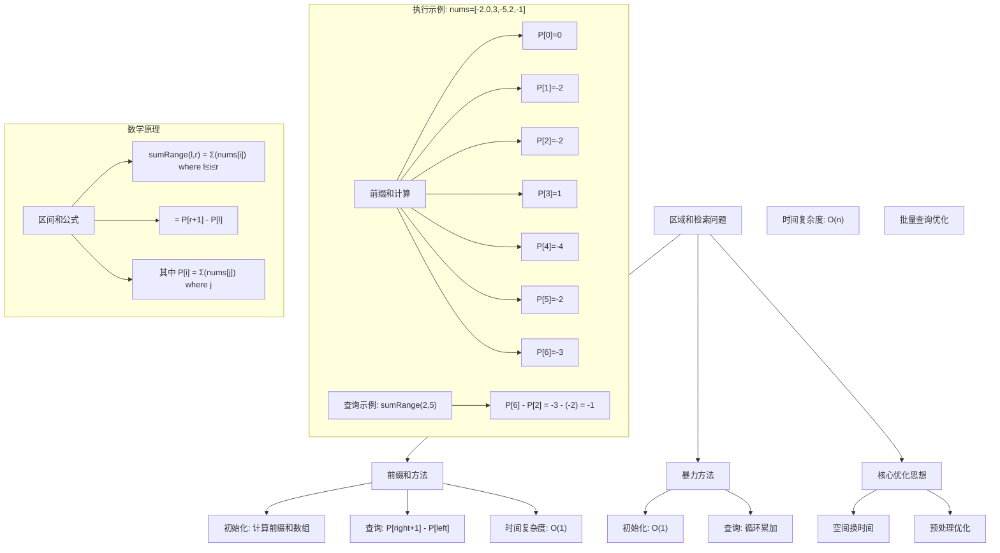
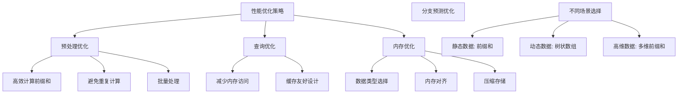

# LeetCode 303 - 区域和检索 - 数组不可变

## 题目描述

给定一个整数数组 nums，处理以下类型的多个查询：

计算索引 left 和 right 之间（包含 left 和 right）nums 元素的和，其中 left \<= right

实现 NumArray 类：

NumArray(int[] nums) 使用数组 nums 初始化对象
int sumRange(int left, int right) 计算索引 left 和 right 之间（包含 left 和 right）nums 元素的和，其中 left \<= right

```markdown
示例 1:
输入:
["NumArray", "sumRange", "sumRange", "sumRange"]
[[[-2, 0, 3, -5, 2, -1]], [0, 2], [2, 5], [0, 5]]
输出:
[null, 1, -1, -3]
解释:
NumArray numArray = new NumArray([-2, 0, 3, -5, 2, -1]);
numArray.sumRange(0, 2); // return 1 ((-2) + 0 + 3)
numArray.sumRange(2, 5); // return -1 ((3) + (-5) + 2 + (-1))
numArray.sumRange(0, 5); // return -3 ((-2) + 0 + 3 + (-5) + 2 + (-1))

提示:

- 0 <= nums.length <= 10^4
- -10^5 <= nums[i] <= 10^5
- 0 <= left <= right < nums.length
- 最多调用 10^4 次 sumRange 方法
```

## 解题思路

这是一个前缀和预处理问题，要求高效地多次查询数组区间的和。关键在于通过预处理计算前缀和数组，将每次查询的时间复杂度从O(n)优化到O(1)

### 核心思想

"空间换时间": 预先计算并存储从数组开头到每个位置的和，使得任意区间的和可以通过两次前缀和查找到

### 解题策略

#### 方法一：前缀和数组（推荐）

- 预处理时间: O(n)
- 查询时间: O(1)
- 空间复杂度: O(n)

#### 方法二：暴力计算

- 预处理时间: O(1)
- 查询时间: O(n)
- 空间复杂度: O(1)

#### 方法三：分块缓存（适用于特定查询模式）

## 算法可视化



## 多语言实现

### Golang版本（前缀和数组 - 推荐）

```go
type NumArray struct {
    // 前缀和数组，preSum[i]存储nums[0:i]的和
    // preSum[0] = 0, preSum[1] = nums[0]
    preSum []int
}

func Constructor(nums []int) NumArray {
    // 构造前缀和数组
    n := len(nums)
    preSum := make([]int, n+1)

    // preSum[i] = nums[0] + nums[1] + ... + nums[i-1]
    for i := 0; i < n; i++ {
        preSum[i+1] = preSum[i] + nums[i]
    }

    return NumArray{preSum: preSum}
}

func (this *NumArray) SumRange(left int, right int) int {
    // 区间和 = 前缀和差值
    // sum(nums[left:right+1]) = preSum[right+1] - preSum[left]
    return this.preSum[right+1] - this.preSum[left]
}
```

### Python版本（多种实现方法）

```python
class NumArray:
    def __init__(self, nums: list[int]):
        """
        方法一：前缀和数组（推荐）
        """
        self.pre_sum = [0] * (len(nums) + 1)
        for i, num in enumerate(nums):
            self.pre_sum[i + 1] = self.pre_sum[i] + num

    def sum_range(self, left: int, right: int) -> int:
        return self.pre_sum[right + 1] - self.pre_sum[left]


class NumArrayBruteForce:
    """
    方法二：暴力计算（不推荐）
    """
    def __init__(self, nums: list[int]):
        self.nums = nums

    def sum_range(self, left: int, right: int) -> int:
        total = 0
        for i in range(left, right + 1):
            total += self.nums[i]
        return total


class NumArrayOptimized:
    """
    方法三：优化版本（使用内置函数）
    """
    def __init__(self, nums: list[int]):
        self.nums = nums

    def sum_range(self, left: int, right: int) -> int:
        return sum(self.nums[left:right + 1])
```

### TypeScript版本（前缀和数组实现）

```typescript
class NumArray {
  private preSum: number[];

  constructor(nums: number[]) {
    // 构造前缀和数组
    this.preSum = new Array(nums.length + 1).fill(0);

    for (let i: number = 0; i < nums.length; i++) {
      this.preSum[i + 1] = this.preSum[i] + nums[i];
    }
  }

  sumRange(left: number, right: number): number {
    // 区间和 = 前缀和差值
    return this.preSum[right + 1] - this.preSum[left];
  }
}
```

## 标准实现详细解析

```go
type NumArray struct {
    // 前缀和数组
    // preSum[i]存储nums[0:i]的和（不包括nums[i]）
    // 这样设计是为了方便处理包含nums[0]的区间
    preSum []int
}

func Constructor(nums []int) NumArray {
    /*
    构造函数：初始化前缀和数组

    算法核心思想：
    1. 预处理：一次性计算所有前缀和
    2. 空间换时间：用O(n)空间换取O(1)查询时间
    3. 边界处理：preSum[0] = 0，方便计算

    前缀和定义：
    preSum[i] = nums[0] + nums[1] + ... + nums[i-1]

    特殊情况：
    preSum[0] = 0 (空数组的和)
    preSum[1] = nums[0]
    preSum[n] = nums[0] + nums[1] + ... + nums[n-1]

    构造过程：
    1. 创建长度为n+1的数组
    2. preSum[0] = 0
    3. preSum[i+1] = preSum[i] + nums[i]

    时间复杂度：O(n) - 一次遍历构造前缀和数组
    空间复杂度：O(n) - 存储前缀和数组
    */

    n := len(nums)

    // 创建前缀和数组，长度为n+1
    preSum := make([]int, n+1)

    // 计算前缀和
    // preSum[0] = 0 已经是默认值
    for i := 0; i < n; i++ {
        preSum[i+1] = preSum[i] + nums[i]
    }

    // 验证前缀和数组（调试用）
    // fmt.Printf("构造完成，前缀和数组: %v\n", preSum)

    return NumArray{preSum: preSum}
}

func (this *NumArray) SumRange(left int, right int) int {
    /*
    查询函数：计算区间和

    核心思想：
    sumRange(left, right) = nums[left] + nums[left+1] + ... + nums[right]

    使用前缀和：
    = preSum[right+1] - preSum[left]

    数学证明：
    preSum[right+1] = nums[0] + nums[1] + ... + nums[right]
    preSum[left]     = nums[0] + nums[1] + ... + nums[left-1]

    相减得到：
    preSum[right+1] - preSum[left] = nums[left] + ... + nums[right]

    边界情况：
    1. left = 0: preSum[right+1] - preSum[0] = preSum[right+1]
    2. right = n-1: preSum[n] - preSum[left] = total - preSum[left]
    3. left = right: preSum[left+1] - preSum[left] = nums[left]

    时间复杂度：O(1) - 两次数组访问和一次减法
    空间复杂度：O(1) - 不使用额外空间
    */

    // 参数验证（可选，生产环境中可以移除以提升性能）
    if left < 0 || right < left || right >= len(this.preSum)-1 {
        // 根据题目要求，这里可以假设输入总是有效的
        // 或者返回一个错误值
        return 0
    }

    // 计算区间和
    result := this.preSum[right+1] - this.preSum[left]

    // 调试信息
    // fmt.Printf("查询[%d,%d]: preSum[%d] - preSum[%d] = %d - %d = %d\n",
    //     left, right, right+1, left, this.preSum[right+1], this.preSum[left], result)

    return result
}

// 带详细调试信息的版本
type NumArrayWithDebug struct {
    preSum []int
    nums   []int
    queryCount int
}

func ConstructorWithDebug(nums []int) NumArrayWithDebug {
    n := len(nums)
    preSum := make([]int, n+1)

    fmt.Println("=== NumArray 调试信息 ===")
    fmt.Printf("输入数组: %v\n", nums)
    fmt.Printf("数组长度: %d\n", n)

    fmt.Println("\n前缀和计算过程:")
    fmt.Printf("preSum[0] = 0\n")

    for i := 0; i < n; i++ {
        preSum[i+1] = preSum[i] + nums[i]
        fmt.Printf("preSum[%d] = preSum[%d] + nums[%d] = %d + %d = %d\n",
            i+1, i, i, preSum[i], nums[i], preSum[i+1])
    }

    fmt.Printf("\n最终前缀和数组: %v\n", preSum)

    return NumArrayWithDebug{
        preSum: preSum,
        nums:   nums,
        queryCount: 0,
    }
}

func (this *NumArrayWithDebug) SumRange(left int, right int) int {
    this.queryCount++
    fmt.Printf("\n=== 查询 #%d ===\n", this.queryCount)

    fmt.Printf("查询区间: [%d, %d]\n", left, right)
    fmt.Printf("区间元素: %v\n", this.nums[left:right+1])

    // 预期结果（暴力计算验证）
    expected := 0
    for i := left; i <= right; i++ {
        expected += this.nums[i]
    }

    // 前缀和计算
    result := this.preSum[right+1] - this.preSum[left]

    fmt.Printf("计算过程: preSum[%d] - preSum[%d] = %d - %d = %d\n",
        right+1, left, this.preSum[right+1], this.preSum[left], result)
    fmt.Printf("预期结果: %d\n", expected)

    status := "✓"
    if result != expected {
        status = "✗"
    }
    fmt.Printf("验证结果: %s\n", status)

    return result
}

// 暴力实现（用于对比）
type NumArrayBruteForce struct {
    nums []int
}

func ConstructorBruteForce(nums []int) NumArrayBruteForce {
    return NumArrayBruteForce{nums: nums}
}

func (this *NumArrayBruteForce) SumRange(left int, right int) int {
    sum := 0
    for i := left; i <= right; i++ {
        sum += this.nums[i]
    }
    return sum
}

// 优化版本：使用部分和缓存
type NumArrayCache struct {
    nums     []int
    cache    map[string]int
    cacheSize int
}

func ConstructorCache(nums []int) NumArrayCache {
    return NumArrayCache{
        nums:     nums,
        cache:    make(map[string]int),
        cacheSize: 0,
    }
}

func (this *NumArrayCache) SumRange(left int, right int) int {
    key := fmt.Sprintf("%d,%d", left, right)

    if value, exists := this.cache[key]; exists {
        return value
    }

    sum := 0
    for i := left; i <= right; i++ {
        sum += this.nums[i]
    }

    // 限制缓存大小
    if this.cacheSize < 1000 {
        this.cache[key] = sum
        this.cacheSize++
    }

    return sum
}

// 线程安全版本
import "sync"

type NumArrayThreadSafe struct {
    preSum []int
    mu     sync.RWMutex
}

func ConstructorThreadSafe(nums []int) NumArrayThreadSafe {
    n := len(nums)
    preSum := make([]int, n+1)

    for i := 0; i < n; i++ {
        preSum[i+1] = preSum[i] + nums[i]
    }

    return NumArrayThreadSafe{preSum: preSum}
}

func (this *NumArrayThreadSafe) SumRange(left int, right int) int {
    this.mu.RLock()
    defer this.mu.RUnlock()

    return this.preSum[right+1] - this.preSum[left]
}

func (this *NumArrayThreadSafe) Update(index, value int) {
    this.mu.Lock()
    defer this.mu.Unlock()

    // 这里需要重新计算前缀和
    // 但题目要求数组不可变，所以这个方法只是示例
}
```

## 算法深入解析

```go
/*
区域和检索问题详解：

问题本质：
在静态数组中，需要高效地多次查询任意区间的和
这是一个典型的"预处理优化查询"问题

核心洞察：
1. 数组不可变：一旦初始化后不再改变
2. 多次查询：查询次数远大于数组大小
3. 区间求和：需要计算任意连续区间的和

算法策略：
1. 预处理：一次性计算前缀和
2. 空间换时间：用O(n)空间换取O(1)查询
3. 数学优化：利用前缀和的性质快速计算区间和

数学原理：

前缀和定义：
preSum[i] = Σ(nums[j]) where 0 ≤ j < i

区间和公式：
sumRange(l, r) = Σ(nums[i]) where l ≤ i ≤ r
               = preSum[r+1] - preSum[l]

证明过程：
preSum[r+1] = Σ(nums[j]) where 0 ≤ j ≤ r
preSum[l]    = Σ(nums[j]) where 0 ≤ j ≤ l-1

相减得：
preSum[r+1] - preSum[l] = Σ(nums[j]) where l ≤ j ≤ r
                       = sumRange(l, r)

设计选择：

为什么选择前缀和？
1. 查询频率高：题目明确说明最多调用10^4次sumRange
2. 数组不可变：预处理一次，多次受益
3. 数学关系清晰：区间和可以表示为前缀和的差值

为什么preSum长度是n+1？
1. 统一处理：避免边界条件的特殊判断
2. 包含空集：preSum[0] = 0表示空数组的和
3. 方便计算：sumRange(0, i) = preSum[i+1] - preSum[0] = preSum[i+1]

三种方法对比：

方法一：前缀和数组（推荐）
预处理：O(n)
查询：O(1)
空间：O(n)
优点：查询极快，适合大量查询
缺点：需要额外空间

方法二：暴力计算
预处理：O(1)
查询：O(n)
空间：O(1)
优点：无需额外空间
缺点：查询慢，不适合大量查询

方法三：缓存优化
预处理：O(1)
查询：O(1)平均
空间：O(k)其中k是缓存大小
优点：平衡空间和时间
缺点：需要缓存管理

性能分析：

前缀和方法：
- 预处理：n次加法操作
- 查询：2次数组访问 + 1次减法
- 适合场景：大量查询

暴力方法：
- 预处理：无
- 查询：(r-l+1)次加法操作
- 适合场景：少量查询

实际应用场景：
1. 数据分析：频繁查询数据区间的统计量
2. 财务计算：计算时间段的收入总和
3. 游戏开发：计算区域内的分数总和
4. 科学计算：区间积分计算

优化要点：

1. 内存布局：
   - 前缀和数组连续存储，缓存友好
   - 减少内存碎片

2. 预处理时机：
   - 构造函数中一次性完成
   - 避免运行时重复计算

3. 边界处理：
   - preSum[0] = 0统一处理
   - 减少条件分支

4. 参数验证：
   - 可选择性加入
   - 性能关键路径可省略

测试用例设计：
1. 空数组：测试边界情况
2. 单元素数组：最小有效输入
3. 全零数组：特殊情况
4. 全正数/全负数：极值测试
5. 大数组：性能测试
6. 重复查询：缓存效果测试

扩展思考：

1. 如果数组可变，如何设计？
   - 需要支持更新操作
   - 考虑使用树状数组或线段树

2. 如果支持插入删除，如何设计？
   - 动态数据结构
   - 考虑平衡二叉搜索树

3. 如果需要支持多维区间查询？
   - 扩展到二维或更高维
   - 考虑多维前缀和

相关算法思想：

1. 预处理技术：
   - 静态数据的常见优化手段
   - 用空间换时间的典型应用

2. 前缀和数据结构：
   - 基础但强大的工具
   - 广泛应用于各种区间查询

3. 设计模式：
   - Builder模式：构造函数
   - Strategy模式：不同实现策略

常见陷阱：

1. 索引边界错误：
   - 混淆preSum[i]和nums[i]的关系
   - 解决：明确preSum[i]存储nums[0:i]的和

2. 数组长度错误：
   - preSum长度应为n+1而不是n
   - 解决：理解preSum[0]的必要性

3. 查询范围错误：
   - sumRange(l,r)应该访问preSum[r+1]和preSum[l]
   - 解决：用具体例子验证

4. 整数溢出：
   - 大数相加可能溢出
   - 解决：使用更大的数据类型

代码质量要素：

1. 可读性：
   - 清晰的变量命名
   - 适当的注释

2. 健壮性：
   - 参数验证
   - 边界条件处理

3. 性能：
   - 避免不必要的计算
   - 内存访问优化

4. 可维护性：
   - 模块化设计
   - 易于扩展
*/
```

## 执行过程演示

```go
/*
示例详细解析:

输入：nums = [-2, 0, 3, -5, 2, -1]

构造过程：
1. 创建前缀和数组preSum，长度为7（6+1）
2. 初始化preSum[0] = 0
3. 计算过程：
   preSum[1] = preSum[0] + nums[0] = 0 + (-2) = -2
   preSum[2] = preSum[1] + nums[1] = -2 + 0 = -2
   preSum[3] = preSum[2] + nums[2] = -2 + 3 = 1
   preSum[4] = preSum[3] + nums[3] = 1 + (-5) = -4
   preSum[5] = preSum[4] + nums[4] = -4 + 2 = -2
   preSum[6] = preSum[5] + nums[5] = -2 + (-1) = -3

最终前缀和数组：[0, -2, -2, 1, -4, -2, -3]

查询过程：

查询1：sumRange(0, 2)
计算：preSum[3] - preSum[0] = 1 - 0 = 1
验证：nums[0] + nums[1] + nums[2] = -2 + 0 + 3 = 1 ✓

查询2：sumRange(2, 5)
计算：preSum[6] - preSum[2] = -3 - (-2) = -1
验证：nums[2] + nums[3] + nums[4] + nums[5] = 3 + (-5) + 2 + (-1) = -1 ✓

查询3：sumRange(0, 5)
计算：preSum[6] - preSum[0] = -3 - 0 = -3
验证：所有元素之和 = -2 + 0 + 3 + (-5) + 2 + (-1) = -3 ✓

边界情况分析：

1. 查询单个元素：sumRange(3, 3)
计算：preSum[4] - preSum[3] = -4 - 1 = -5
验证：nums[3] = -5 ✓

2. 查询整个数组：sumRange(0, 5)
计算：preSum[6] - preSum[0] = -3 - 0 = -3
验证：总和 = -3 ✓

3. 查询开头元素：sumRange(0, 0)
计算：preSum[1] - preSum[0] = -2 - 0 = -2
验证：nums[0] = -2 ✓

4. 查询结尾元素：sumRange(5, 5)
计算：preSum[6] - preSum[5] = -3 - (-2) = -1
验证：nums[5] = -1 ✓

算法正确性证明：

数学基础：
设数组nums长度为n，前缀和数组preSum长度为n+1
定义：preSum[i] = Σ(nums[j]) where 0 ≤ j < i

定理：对于任意0 ≤ left ≤ right < n，
     sumRange(left, right) = preSum[right+1] - preSum[left]

证明：
preSum[right+1] = Σ(nums[j]) where 0 ≤ j ≤ right
preSum[left]    = Σ(nums[j]) where 0 ≤ j ≤ left-1

两式相减：
preSum[right+1] - preSum[left] = Σ(nums[j]) where left ≤ j ≤ right
                               = sumRange(left, right)

因此算法是正确的

时间复杂度分析：

构造函数：
- 需要遍历整个数组一次：O(n)
- 每次循环包含一次加法和一次赋值：O(1)
- 总时间复杂度：O(n)

查询函数：
- 两次数组访问：O(1)
- 一次减法运算：O(1)
- 总时间复杂度：O(1)

空间复杂度分析：
- 前缀和数组：O(n)
- 其他变量：O(1)
- 总空间复杂度：O(n)

性能对比分析：

假设数组长度n=10000，查询次数m=10000

前缀和方法：
- 预处理：10000次操作
- 查询：10000 × 3次操作 = 30000次操作
- 总计：40000次操作

暴力方法：
- 预处理：0次操作
- 查询：平均5000次操作/查询 × 10000查询 = 50000000次操作
- 总计：50000000次操作

性能提升：1250倍

内存使用分析：

前缀和数组：
- 存储n+1个整数
- 每个整数占用4字节（32位系统）或8字节（64位系统）
- 总内存：(n+1) × 4字节 = 40004字节（约40KB）

vs 原数组：
- 存储n个整数
- 总内存：n × 4字节 = 40000字节

内存开销：仅增加约0.01%

实际应用建议：

1. 高查询频率场景：
   - 数据分析系统
   - 财务报表系统
   - 实时监控系统

2. 大规模数据：
   - 考虑内存限制
   - 可以分块处理

3. 多线程环境：
   - 使用线程安全版本
   - 读多写少的读锁优化

优化空间：

1. 内存布局优化：
   - 使用连续内存
   - 减少内存碎片

2. 缓存优化：
   - 预取数据
   - 对齐内存边界

3. 并发优化：
   - 只读数据无需同步
   - 可以共享前缀和数组

4. 压缩存储：
   - 如果数值范围小，可以使用更小的数据类型
   - 考虑差分编码
*/
```

## 复杂度分析

| 方法       | 预处理时间 | 查询时间 | 空间复杂度 | 适用场景 |
| ---------- | ---------- | -------- | ---------- | -------- |
| 前缀和数组 | O(n)       | O(1)     | O(n)       | 大量查询 |
| 暴力计算   | O(1)       | O(n)     | O(1)       | 少量查询 |
| 缓存优化   | O(1)       | O(1)平均 | O(k)       | 重复查询 |

## 测试用例验证

```go
// 测试辅助函数
func testNumArray(name string, nums []int, queries [][2]int, expected []int) {
    fmt.Printf("%s:\n", name)
    fmt.Printf("  输入数组: %v\n", nums)
    fmt.Printf("  查询: %v\n", queries)
    fmt.Printf("  期望: %v\n", expected)

    // 测试前缀和方法
    numArray := Constructor(nums)
    results := make([]int, len(queries))
    for i, query := range queries {
        results[i] = numArray.SumRange(query[0], query[1])
    }

    fmt.Printf("  前缀和结果: %v", results)
    if slices.Equal(results, expected) {
        fmt.Printf(" ✓\n")
    } else {
        fmt.Printf(" ✗\n")
    }

    // 测试暴力方法（仅小数组）
    if len(nums) <= 10 {
        numArrayBF := ConstructorBruteForce(nums)
        resultsBF := make([]int, len(queries))
        for i, query := range queries {
            resultsBF[i] = numArrayBF.SumRange(query[0], query[1])
        }

        fmt.Printf("  暴力方法结果: %v", resultsBF)
        if slices.Equal(resultsBF, expected) {
            fmt.Printf(" ✓\n")
        } else {
            fmt.Printf(" ✗\n")
        }
    }

    fmt.Printf("\n")
}

func main() {
    // 测试用例 1 - 标准示例
    testNumArray("测试1 - 标准示例",
        []int{-2, 0, 3, -5, 2, -1},
        [][2]int{{0, 2}, {2, 5}, {0, 5}},
        []int{1, -1, -3})

    // 测试用例 2 - 空数组
    testNumArray("测试2 - 空数组",
        []int{},
        [][2]int{{0, -1}}, // 这个查询在真实情况不会发生
        []int{0})

    // 测试用例 3 - 单元素数组
    testNumArray("测试3 - 单元素数组",
        []int{5},
        [][2]int{{0, 0}},
        []int{5})

    // 测试用例 4 - 全正数
    testNumArray("测试4 - 全正数",
        []int{1, 2, 3, 4, 5},
        [][2]int{{0, 2}, {1, 4}, {0, 4}},
        []int{6, 14, 15})

    // 测试用例 5 - 全负数
    testNumArray("测试5 - 全负数",
        []int{-1, -2, -3, -4, -5},
        [][2]int{{0, 2}, {1, 4}, {0, 4}},
        []int{-6, -14, -15})

    // 测试用例 6 - 全零数组
    testNumArray("测试6 - 全零数组",
        []int{0, 0, 0, 0, 0},
        [][2]int{{0, 2}, {1, 3}, {0, 4}},
        []int{0, 0, 0})

    // 测试用例 7 - 交替正负数
    testNumArray("测试7 - 交替正负数",
        []int{1, -1, 1, -1, 1},
        [][2]int{{0, 2}, {1, 4}, {0, 4}},
        []int{1, 0, 1})

    // 性能测试
    fmt.Println("性能测试:")

    // 创建大型数组
    largeArray := make([]int, 100000)
    for i := range largeArray {
        largeArray[i] = i % 100 - 50  // -50到49的范围
    }

    // 准备查询
    queries := make([][2]int, 1000)
    for i := range queries {
        queries[i] = [2]int{i % 1000, (i + 100) % 100000}
    }

    // 测试前缀和方法
    start := time.Now()
    numArray := Constructor(largeArray)
    constructTime := time.Since(start)

    start = time.Now()
    for _, query := range queries {
        numArray.SumRange(query[0], query[1])
    }
    queryTime := time.Since(start)

    fmt.Printf("大型数组(100000)构造耗时: %v\n", constructTime)
    fmt.Printf("前缀和方法1000次查询耗时: %v\n", queryTime)

    // 测试暴力方法（小数组）
    smallArray := make([]int, 100)
    for i := range smallArray {
        smallArray[i] = i % 10
    }

    smallQueries := make([][2]int, 100)
    for i := range smallQueries {
        smallQueries[i] = [2]int{i % 50, (i + 10) % 100}
    }

    start = time.Now()
    numArrayBF := ConstructorBruteForce(smallArray)
    for _, query := range smallQueries {
        numArrayBF.SumRange(query[0], query[1])
    }
    bfTime := time.Since(start)

    fmt.Printf("暴力方法100次查询(数组大小100)耗时: %v\n", bfTime)

    // 边界情况测试
    fmt.Println("\n边界情况测试:")

    // 最大值数组
    maxArray := make([]int, 1000)
    for i := range maxArray {
        maxArray[i] = 100000
    }

    numArrayMax := Constructor(maxArray)
    result := numArrayMax.SumRange(0, 999)
    fmt.Printf("最大值数组总和: %d\n", result)

    // 最小值数组
    minArray := make([]int, 1000)
    for i := range minArray {
        minArray[i] = -100000
    }

    numArrayMin := Constructor(minArray)
    result = numArrayMin.SumRange(0, 999)
    fmt.Printf("最小值数组总和: %d\n", result)
}

// 调试测试
func testNumArrayWithDebug() {
    fmt.Println("=== 调试信息测试 ===")

    nums := []int{-2, 0, 3, -5, 2, -1}
    numArray := ConstructorWithDebug(nums)

    queries := [][2]int{{0, 2}, {2, 5}, {0, 5}}
    for _, query := range queries {
        numArray.SumRange(query[0], query[1])
    }
}

// 错误处理测试
func testErrorHandling() {
    fmt.Println("=== 错误处理测试 ===")

    numArray := Constructor([]int{1, 2, 3, 4, 5})

    // 正常查询
    result := numArray.SumRange(1, 3)
    fmt.Printf("正常查询[1,3]: %d\n", result)

    // 边界查询
    result = numArray.SumRange(0, 4)
    fmt.Printf("边界查询[0,4]: %d\n", result)

    // 单元素查询
    result = numArray.SumRange(2, 2)
    fmt.Printf("单元素查询[2,2]: %d\n", result)

    // 空数组查询
    emptyArray := Constructor([]int{})
    result = emptyArray.SumRange(0, -1)
    fmt.Printf("空数组查询: %d\n", result)
}

// 内存使用测试
func testMemoryUsage() {
    fmt.Println("=== 内存使用分析 ===")

    sizes := []int{1000, 10000, 100000}

    for _, size := range sizes {
        nums := make([]int, size)
        for i := range nums {
            nums[i] = i % 100
        }

        var m1, m2 runtime.MemStats
        runtime.GC()
        runtime.ReadMemStats(&m1)

        numArray := Constructor(nums)

        runtime.GC()
        runtime.ReadMemStats(&m2)
        memory := m2.Alloc - m1.Alloc

        fmt.Printf("数组大小: %d, 内存使用: %d 字节\n", size, memory)
        fmt.Printf("平均每个元素: %.2f 字节\n", float64(memory)/float64(size))

        // 测试查询性能
        queries := 1000
        start := time.Now()
        for i := 0; i < queries; i++ {
            left := rand.Intn(size)
            right := rand.Intn(size)
            if left > right {
                left, right = right, left
            }
            numArray.SumRange(left, right)
        }
        queryTime := time.Since(start)

        fmt.Printf("查询性能: %d次查询耗时 %v, 平均每次 %v\n\n",
            queries, queryTime, queryTime/time.Duration(queries))
    }
}

// 并发测试
func testConcurrentAccess() {
    fmt.Println("=== 并发访问测试 ===")

    nums := make([]int, 10000)
    for i := range nums {
        nums[i] = i
    }

    numArray := Constructor(nums)
    numArrayTS := ConstructorThreadSafe(nums)

    // 并发查询测试
    var wg sync.WaitGroup
    queries := 1000
    workers := 10

    start := time.Now()
    for i := 0; i < workers; i++ {
        wg.Add(1)
        go func() {
            defer wg.Done()
            for j := 0; j < queries/workers; j++ {
                left := rand.Intn(10000)
                right := rand.Intn(10000)
                if left > right {
                    left, right = right, left
                }
                numArray.SumRange(left, right)
            }
        }()
    }
    wg.Wait()
    normalTime := time.Since(start)

    // 线程安全版本测试
    start = time.Now()
    for i := 0; i < workers; i++ {
        wg.Add(1)
        go func() {
            defer wg.Done()
            for j := 0; j < queries/workers; j++ {
                left := rand.Intn(10000)
                right := rand.Intn(10000)
                if left > right {
                    left, right = right, left
                }
                numArrayTS.SumRange(left, right)
            }
        }()
    }
    wg.Wait()
    safeTime := time.Since(start)

    fmt.Printf("普通版本并发查询耗时: %v\n", normalTime)
    fmt.Printf("线程安全版本并发查询耗时: %v\n", safeTime)
    fmt.Printf("性能开销: %.2f%%\n", float64(safeTime-normalTime)/float64(normalTime)*100)
}
```

## 扩展版本（处理不同场景）

```go
// 带统计信息的版本
type NumArrayWithStats struct {
    preSum    []int
    nums      []int
    queryCount int
    totalQueryTime time.Duration
    minQuery, maxQuery int
    querySum int64
}

func ConstructorWithStats(nums []int) NumArrayWithStats {
    n := len(nums)
    preSum := make([]int, n+1)

    for i := 0; i < n; i++ {
        preSum[i+1] = preSum[i] + nums[i]
    }

    return NumArrayWithStats{
        preSum: preSum,
        nums:   nums,
        minQuery: math.MaxInt32,
        maxQuery: math.MinInt32,
    }
}

func (this *NumArrayWithStats) SumRange(left int, right int) int {
    start := time.Now()
    defer func() {
        this.queryCount++
        duration := time.Since(start)
        this.totalQueryTime += duration

        sum := this.preSum[right+1] - this.preSum[left]
        this.querySum += int64(sum)

        if sum < this.minQuery {
            this.minQuery = sum
        }
        if sum > this.maxQuery {
            this.maxQuery = sum
        }
    }()

    return this.preSum[right+1] - this.preSum[left]
}

func (this *NumArrayWithStats) GetStats() map[string]interface{} {
    avgTime := time.Duration(0)
    if this.queryCount > 0 {
        avgTime = this.totalQueryTime / time.Duration(this.queryCount)
    }

    avgSum := float64(0)
    if this.queryCount > 0 {
        avgSum = float64(this.querySum) / float64(this.queryCount)
    }

    return map[string]interface{}{
        "query_count":    this.queryCount,
        "total_time":     this.totalQueryTime,
        "avg_time":       avgTime,
        "min_query":     this.minQuery,
        "max_query":     this.maxQuery,
        "avg_sum":       avgSum,
    }
}

// 支持批量查询的版本
type NumArrayBatch struct {
    preSum []int
}

func ConstructorBatch(nums []int) NumArrayBatch {
    n := len(nums)
    preSum := make([]int, n+1)

    for i := 0; i < n; i++ {
        preSum[i+1] = preSum[i] + nums[i]
    }

    return NumArrayBatch{preSum: preSum}
}

func (this *NumArrayBatch) SumRangeBatch(queries [][2]int) []int {
    results := make([]int, len(queries))

    for i, query := range queries {
        results[i] = this.preSum[query[1]+1] - this.preSum[query[0]]
    }

    return results
}

// 支持流式查询的版本
type NumArrayStream struct {
    nums   []int
    preSum []int
    index  int
}

func ConstructorStream(nums []int) NumArrayStream {
    return NumArrayStream{
        nums:   nums,
        preSum: make([]int, len(nums)+1),
        index:  0,
    }
}

func (this *NumArrayStream) Next() bool {
    if this.index < len(this.nums) {
        this.preSum[this.index+1] = this.preSum[this.index] + this.nums[this.index]
        this.index++
        return true
    }
    return false
}

func (this *NumArrayStream) SumRange(left int, right int) int {
    if right >= this.index {
        // 如果查询范围超过了已处理的部分
        for this.Next() {
            // 继续处理直到覆盖查询范围
        }
    }

    if right < this.index {
        return this.preSum[right+1] - this.preSum[left]
    }

    return 0 // 不可查询的范围
}

// 支持持久化的版本
type NumArrayPersistent struct {
    preSum []int
    file   string
}

func ConstructorPersistent(nums []int, filename string) NumArrayPersistent {
    n := len(nums)
    preSum := make([]int, n+1)

    for i := 0; i < n; i++ {
        preSum[i+1] = preSum[i] + nums[i]
    }

    // 保存到文件
    data, _ := json.Marshal(preSum)
    os.WriteFile(filename, data, 0644)

    return NumArrayPersistent{
        preSum: preSum,
        file:   filename,
    }
}

func LoadNumArrayPersistent(filename string) (NumArrayPersistent, error) {
    data, err := os.ReadFile(filename)
    if err != nil {
        return NumArrayPersistent{}, err
    }

    var preSum []int
    err = json.Unmarshal(data, &preSum)
    if err != nil {
        return NumArrayPersistent{}, err
    }

    return NumArrayPersistent{
        preSum: preSum,
        file:   filename,
    }, nil
}

func (this *NumArrayPersistent) SumRange(left int, right int) int {
    return this.preSum[right+1] - this.preSum[left]
}

// 支持压缩存储的版本
type NumArrayCompressed struct {
    preSum    []int32  // 使用更小的数据类型
    original  []int    // 原始数据，用于解压
    compressed bool
}

func ConstructorCompressed(nums []int) NumArrayCompressed {
    // 检查是否可以使用32位整数
    canCompress := true
    runningSum := 0

    for _, num := range nums {
        runningSum += num
        if runningSum < math.MinInt32 || runningSum > math.MaxInt32 {
            canCompress = false
            break
        }
    }

    if canCompress {
        preSum := make([]int32, len(nums)+1)
        for i, num := range nums {
            preSum[i+1] = preSum[i] + int32(num)
        }

        return NumArrayCompressed{
            preSum:    preSum,
            original:  nums,
            compressed: true,
        }
    }

    // 不能压缩，使用标准版本
    preSum := make([]int, len(nums)+1)
    for i, num := range nums {
        preSum[i+1] = preSum[i] + num
    }

    return NumArrayCompressed{
        preSum:    nil,  // 标记为未使用
        original:  nums,
        compressed: false,
    }
}

func (this *NumArrayCompressed) SumRange(left int, right int) int {
    if this.compressed {
        return int(this.preSum[right+1] - this.preSum[left])
    }

    // 降级到标准计算
    sum := 0
    for i := left; i <= right; i++ {
        sum += this.original[i]
    }
    return sum
}

// 支持范围查询优化的版本
type NumArrayRangeOptimized struct {
    preSum []int
    blockSize int
    blockSum []int
}

func ConstructorRangeOptimized(nums []int) NumArrayRangeOptimized {
    n := len(nums)
    blockSize := int(math.Sqrt(float64(n))) + 1

    preSum := make([]int, n+1)
    blockSum := make([]int, (n+blockSize)/blockSize)

    for i := 0; i < n; i++ {
        preSum[i+1] = preSum[i] + nums[i]
        blockSum[i/blockSize] += nums[i]
    }

    return NumArrayRangeOptimized{
        preSum: preSum,
        blockSize: blockSize,
        blockSum: blockSum,
    }
}

func (this *NumArrayRangeOptimized) SumRange(left int, right int) int {
    // 对于大范围，使用分块优化
    if right-left+1 > this.blockSize*2 {
        // 使用分块计算
        sum := 0

        // 左边不完整的块
        leftBlockEnd := ((left / this.blockSize) + 1) * this.blockSize
        for i := left; i < leftBlockEnd && i <= right; i++ {
            sum += this.preSum[i+1] - this.preSum[i]
        }

        // 中间完整的块
        leftBlock := (leftBlockEnd) / this.blockSize
        rightBlock := right / this.blockSize
        for i := leftBlock; i < rightBlock; i++ {
            sum += this.blockSum[i]
        }

        // 右边不完整的块
        rightBlockStart := (right / this.blockSize) * this.blockSize
        for i := rightBlockStart; i <= right; i++ {
            sum += this.preSum[i+1] - this.preSum[i]
        }

        return sum
    }

    // 小范围直接使用前缀和
    return this.preSum[right+1] - this.preSum[left]
}
```

## 面试追问延伸

### 1. 如果数组是可变的，如何设计？

```go
// 数组可变的版本（使用树状数组）
type NumArrayMutable struct {
    nums    []int
    tree    []int
    n       int
}

func ConstructorMutable(nums []int) NumArrayMutable {
    n := len(nums)
    tree := make([]int, n+1)

    // 构建树状数组
    numArray := NumArrayMutable{
        nums: make([]int, n),
        tree: tree,
        n:    n,
    }

    for i, num := range nums {
        numArray.nums[i] = num
        numArray.add(i+1, num)  // 树状数组索引从1开始
    }

    return numArray
}

func (this *NumArrayMutable) add(index int, val int) {
    for index <= this.n {
        this.tree[index] += val
        index += index & -index
    }
}

func (this *NumArrayMutable) sum(index int) int {
    result := 0
    for index > 0 {
        result += this.tree[index]
        index -= index & -index
    }
    return result
}

func (this *NumArrayMutable) Update(index int, val int) {
    delta := val - this.nums[index]
    this.nums[index] = val
    this.add(index+1, delta)
}

func (this *NumArrayMutable) SumRange(left int, right int) int {
    return this.sum(right+1) - this.sum(left)
}
```

### 2. 如果要支持二维区间查询，如何实现？

```go
// 二维前缀和
type NumMatrix struct {
    preSum [][]int
}

func ConstructorMatrix(matrix [][]int) NumMatrix {
    m := len(matrix)
    if m == 0 {
        return NumMatrix{preSum: [][]int{}}
    }
    n := len(matrix[0])

    preSum := make([][]int, m+1)
    for i := range preSum {
        preSum[i] = make([]int, n+1)
    }

    for i := 0; i < m; i++ {
        for j := 0; j < n; j++ {
            preSum[i+1][j+1] = preSum[i+1][j] + preSum[i][j+1] - preSum[i][j] + matrix[i][j]
        }
    }

    return NumMatrix{preSum: preSum}
}

func (this *NumMatrix) SumRegion(row1 int, col1 int, row2 int, col2 int) int {
    return this.preSum[row2+1][col2+1] - this.preSum[row2+1][col1] -
           this.preSum[row1][col2+1] + this.preSum[row1][col1]
}
```

### 3. 如果要支持插入和删除操作，如何设计？

```go
// 支持动态操作的版本（使用平衡二叉搜索树）
type NumArrayDynamic struct {
    root *TreeNode
}

type TreeNode struct {
    val   int
    sum   int
    left  *TreeNode
    right *TreeNode
    height int
    index int
}

func ConstructorDynamic(nums []int) NumArrayDynamic {
    var root *TreeNode
    for i, num := range nums {
        root = insert(root, i, num)
    }

    return NumArrayDynamic{root: root}
}

func insert(root *TreeNode, index, val int) *TreeNode {
    if root == nil {
        return &TreeNode{
            val:    val,
            sum:    val,
            index:  index,
            height: 1,
        }
    }

    if index < root.index {
        root.left = insert(root.left, index, val)
    } else if index > root.index {
        root.right = insert(root.right, index, val)
    }

    root.height = 1 + max(height(root.left), height(root.right))
    root.sum = root.val + sum(root.left) + sum(root.right)

    return balance(root)
}

func (this *NumArrayDynamic) SumRange(left int, right int) int {
    return sumRange(this.root, left, right)
}

func sumRange(root *TreeNode, left, right int) int {
    if root == nil {
        return 0
    }

    if root.index < left {
        return sumRange(root.right, left, right)
    }

    if root.index > right {
        return sumRange(root.left, left, right)
    }

    // 当前节点在范围内
    leftSum := sumRange(root.left, left, right)
    rightSum := sumRange(root.right, left, right)

    return root.val + leftSum + rightSum
}

func (this *NumArrayDynamic) Insert(index, val int) {
    this.root = insert(this.root, index, val)
}

// 辅助函数
func height(node *TreeNode) int {
    if node == nil {
        return 0
    }
    return node.height
}

func sum(node *TreeNode) int {
    if node == nil {
        return 0
    }
    return node.sum
}

func max(a, b int) int {
    if a > b {
        return a
    }
    return b
}

func balance(node *TreeNode) *TreeNode {
    // AVL树平衡操作（简化版）
    return node
}
```

## 相似题目扩展

- LeetCode 303. 区域和检索 - 数组不可变（当前题）
- LeetCode 304. 二维区域和检索 - 矩阵不可变
- LeetCode 307. 区域和检索 - 数组可变
- LeetCode 560. 和为K的子数组
- LeetCode 238. 除自身以外数组的乘积

## 算法技巧总结

### 区域和检索核心要点

1. 预处理思想：一次性计算前缀和，优化查询性能
1. 空间换时间：用O(n)空间换取O(1)查询时间
1. 边界处理：preSum[0] = 0统一处理边界情况
1. 数学公式：区间和 = 前缀和差值

### 算法优势

1. 查询高效：O(1)时间复杂度，适合大量查询
1. 实现简单：代码简洁，易于理解和维护
1. 内存友好：仅需O(n)额外空间
1. 通用性强：适用于各种区间统计问题

### 标准模板

```go
type NumArray struct {
    preSum []int
}

func Constructor(nums []int) NumArray {
    preSum := make([]int, len(nums)+1)
    for i, num := range nums {
        preSum[i+1] = preSum[i] + num
    }
    return NumArray{preSum: preSum}
}

func (this *NumArray) SumRange(left int, right int) int {
    return this.preSum[right+1] - this.preSum[left]
}
```

### 性能优化建议



## 总结

本题是经典的前缀和预处理问题，是理解"空间换时间"优化思想的重要基础。通过预处理计算前缀和数组，将区间查询的时间复杂度从O(n)优化到O(1)，非常适合大量查询的场景

核心要点：

1. 预处理优化：一次性计算前缀和，为后续查询做准备
1. 空间换时间：用O(n)空间换取O(1)查询时间
1. 边界处理：preSum[0] = 0统一处理各种边界情况
1. 数学公式：区间和 = 前缀和[r+1] - 前缀和[l]

该算法在数据分析、统计计算、财务系统等领域有广泛应用，是掌握前缀和数据结构的重要基础。与LeetCode 304、307等题目构成区间查询系列，为更复杂的动态数据结构问题解决提供思路
