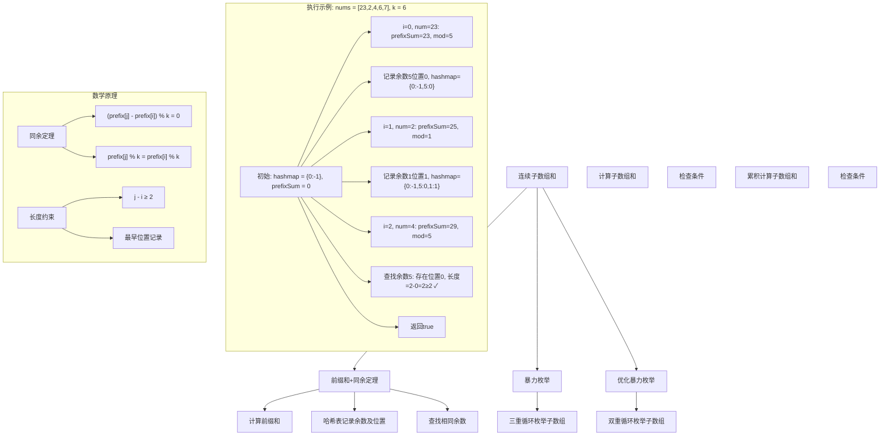
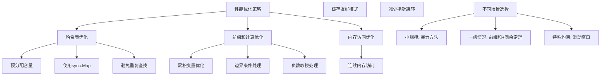

# LeetCode 523 - 连续的子数组和

## 题目描述

给你一个整数数组 `nums` 和一个整数 `k`，编写一个函数来判断该数组是否含有同时满足下述条件的连续子数组：

- 子数组大小至少为 2
- 子数组元素总和为 `k` 的倍数

注意：

- 子数组是数组中连续的部分
- 如果存在一个整数 `n`，令整数 `x` 符合 `x = n * k`，则称 `x` 是 `k` 的一个倍数
- 0 始终视为 `k` 的一个倍数

```markdown
示例 1:
输入：nums = [23,2,4,6,7], k = 6
输出：true
解释：[2,4] 是一个大小为 2 的子数组，并且和为 6

示例 2:
输入：nums = [23,2,6,4,7], k = 6
输出：true
解释：[23, 2, 6, 4, 7] 是大小为 5 的子数组，并且和为 42

示例 3:
输入：nums = [23,2,6,4,7], k = 13
输出：false

提示:

- 1 <= nums.length <= 10^5
- 0 <= nums[i] <= 10^9
- 0 <= sum(nums[i]) <= 2^31 - 1
- 1 <= k <= 2^31 - 1
```

## 解题思路

这是一个前缀和 + 同余定理问题，需要找到长度至少为2且和为k的倍数的连续子数组。关键在于利用前缀和的同余性质，如果两个前缀和对k取模相等，则它们之间的子数组和为k的倍数

### 核心思想

"前缀和 + 同余定理": 使用前缀和记录到当前位置的累积和，利用哈希表存储前缀和模k的余数及其最早出现的位置。如果相同余数再次出现且位置差至少为2，则存在满足条件的子数组

### 解题策略

#### 方法一：前缀和 + 同余定理（推荐）

- 时间复杂度: O(n)
- 空间复杂度: O(min(n,k))

#### 方法二：暴力枚举

- 时间复杂度: O(n^3)
- 空间复杂度: O(1)

#### 方法三：优化暴力枚举

- 时间复杂度: O(n^2)
- 空间复杂度: O(1)

## 算法可视化



## 多语言实现

### Golang版本（前缀和 + 同余定理 - 推荐）

```go
func checkSubarraySum(nums []int, k int) bool {
    // 哈希表存储余数及其最早出现的位置
    remainderMap := make(map[int]int)
    remainderMap[0] = -1 // 初始情况，前缀和为0在位置-1

    prefixSum := 0

    for i, num := range nums {
        prefixSum += num
        remainder := prefixSum % k

        // 如果余数已存在，检查位置差
        if pos, exists := remainderMap[remainder]; exists {
            if i - pos >= 2 {
                return true
            }
        } else {
            // 记录余数的最早出现位置
            remainderMap[remainder] = i
        }
    }

    return false
}
```

### Python版本（多种实现方法）

```python
from typing import List

def checkSubarraySum(nums: List[int], k: int) -> bool:
    """
    方法一：前缀和 + 同余定理（推荐）
    """
    # 哈希表存储余数及其最早出现的位置
    remainder_map = {0: -1}
    prefix_sum = 0

    for i, num in enumerate(nums):
        prefix_sum += num
        remainder = prefix_sum % k

        # 如果余数已存在，检查位置差
        if remainder in remainder_map:
            if i - remainder_map[remainder] >= 2:
                return True
        else:
            # 记录余数的最早出现位置
            remainder_map[remainder] = i

    return False


def checkSubarraySumBruteForce(nums: List[int], k: int) -> bool:
    """
    方法二：暴力枚举（不推荐）
    """
    n = len(nums)

    for i in range(n):
        for j in range(i + 1, n):
            # 计算子数组和
            subarray_sum = sum(nums[i:j+1])
            # 检查长度和倍数条件
            if j - i + 1 >= 2 and subarray_sum % k == 0:
                return True

    return False


def checkSubarraySumOptimized(nums: List[int], k: int) -> bool:
    """
    方法三：优化暴力枚举
    """
    n = len(nums)

    for i in range(n):
        current_sum = 0
        for j in range(i, n):
            current_sum += nums[j]
            # 检查长度和倍数条件
            if j - i + 1 >= 2 and current_sum % k == 0:
                return True

    return False
```

### TypeScript版本（前缀和 + 同余定理实现）

```typescript
function checkSubarraySum(nums: number[], k: number): boolean {
  // 哈希表存储余数及其最早出现的位置
  const remainderMap: Map<number, number> = new Map();
  remainderMap.set(0, -1); // 初始情况

  let prefixSum: number = 0;

  for (let i = 0; i < nums.length; i++) {
    prefixSum += nums[i];
    const remainder: number = prefixSum % k;

    // 如果余数已存在，检查位置差
    if (remainderMap.has(remainder)) {
      if (i - remainderMap.get(remainder)! >= 2) {
        return true;
      }
    } else {
      // 记录余数的最早出现位置
      remainderMap.set(remainder, i);
    }
  }

  return false;
}
```

## 标准实现详细解析

```go
func checkSubarraySum(nums []int, k int) bool {
    /*
    算法核心思想：

    1. 同余定理：如果(a-b) % k = 0，则a % k = b % k
    2. 前缀和：prefix[i]表示数组前i个元素的和
    3. 子数组和：sum(nums[i:j]) = prefix[j] - prefix[i]
    4. 条件转换：(prefix[j] - prefix[i]) % k = 0 → prefix[j] % k = prefix[i] % k

    算法流程：
    1. 初始化哈希表，记录余数0在位置-1
    2. 遍历数组，计算前缀和和余数
    3. 如果余数已存在且位置差≥2，返回true
    4. 否则记录余数的最早出现位置

    时间复杂度：O(n)
    空间复杂度：O(min(n,k))

    特殊情况处理：
    - k=0的情况：需要特殊处理
    - 单个0的情况：0是k的倍数
    - 空数组：返回false
    */

    // 边界情况：数组长度小于2
    if len(nums) < 2 {
        return false
    }

    // 特殊情况：k=0
    if k == 0 {
        // 当k=0时，需要找和为0的子数组
        for i := 0; i < len(nums)-1; i++ {
            if nums[i] == 0 && nums[i+1] == 0 {
                return true
            }
        }
        return false
    }

    // 第一步：初始化哈希表
    // key: 前缀和模k的余数
    // value: 该余数最早出现的位置
    remainderMap := make(map[int]int)
    remainderMap[0] = -1 // 初始情况，前缀和为0在位置-1

    prefixSum := 0  // 当前累积的前缀和

    // 第二步：遍历数组，计算前缀和并查找
    for i, num := range nums {
        // 更新当前前缀和
        prefixSum += num

        // 计算余数（处理负数情况）
        remainder := prefixSum % k
        if remainder < 0 {
            remainder += k
        }

        // 调试信息
        // fmt.Printf("处理位置%d, 数字%d, 前缀和%d, 余数%d\n", i, num, prefixSum, remainder)

        // 查找是否存在相同的余数
        if pos, exists := remainderMap[remainder]; exists {
            // 检查子数组长度是否至少为2
            if i - pos >= 2 {
                // 调试信息
                // fmt.Printf("找到满足条件的子数组: 位置%d到%d\n", pos+1, i)
                return true
            }
        } else {
            // 记录余数的最早出现位置
            remainderMap[remainder] = i
        }

        // 调试信息
        // fmt.Printf("记录余数%d位置%d, 当前哈希表: %v\n", remainder, i, remainderMap)
    }

    return false
}

// 带详细调试信息的版本
func checkSubarraySumWithDebug(nums []int, k int) bool {
    fmt.Println("=== 连续子数组和调试信息 ===")
    fmt.Printf("数组: %v, k: %d\n", nums, k)

    if len(nums) < 2 {
        fmt.Println("数组长度小于2，返回false")
        return false
    }

    if k == 0 {
        fmt.Println("k=0，特殊处理")
        for i := 0; i < len(nums)-1; i++ {
            if nums[i] == 0 && nums[i+1] == precise 0 {
                fmt.Printf("找到连续两个0: 位置%d和%d\n", i, i+1)
                return true
            }
        }
        return false
    }

    remainderMap := make(map[int]int)
    remainderMap[0] = -1

    prefixSum := 0

    fmt.Printf("初始状态: remainderMap=%v, prefixSum=%d\n", remainderMap, prefixSum)

    for i, num := range nums {
        prevSum := prefixSum
        prefixSum += num
        remainder := prefixSum % k
        if remainder < 0 {
            remainder += k
        }

        fmt.Printf("\n步骤 %d: 处理 nums[%d]=%d\n", i+1, i, num)
        fmt.Printf("  前缀和变化: %d -> %d\n", prevSum, prefixSum)
        fmt.Printf("  余数: %d\n", remainder)

        if pos, exists := remainderMap[remainder]; exists {
            length := i - pos
            fmt.Printf("  找到相同余数，位置%d，长度%d", pos, length)
            if length >= 2 {
                fmt.Printf(" ≥ 2 ✓\n")
                fmt.Printf("  满足条件的子数组: nums[%d:%d] = %v\n", pos+1, i+1, nums[pos+1:i+1])
                return true
            } else {
                fmt.Printf(" < 2 ✗\n")
            }
        } else {
            remainderMap[remainder] = i
            fmt.Printf("  记录余数%d位置%d\n", remainder, i)
        }

        fmt.Printf("  当前哈希表: %v\n", remainderMap)
    }

    fmt.Println("\n未找到满足条件的子数组，返回false")
    return false
}

// 暴力实现（用于对比）
func checkSubarraySumBruteForce(nums []int, k int) bool {
    /*
    暴力方法：枚举所有可能的子数组

    时间复杂度：O(n^3)
    空间复杂度：O(1)

    适用于小规模数据或验证算法正确性
    */
    n := len(nums)

    for i := 0; i < n; i++ {
        for j := i + 1; j < n; j++ {
            // 计算子数组和
            subarraySum := 0
            for idx := i; idx <= j; idx++ {
                subarraySum += nums[idx]
            }

            // 检查长度和倍数条件
            if j - i + 1 >= 2 {
                if k == 0 {
                    if subarraySum == 0 {
                        return true
                    }
                } else {
                    if subarraySum % k == 0 {
                        return true
                    }
                }
            }
        }
    }

    return false
}

// 优化暴力实现（减少重复计算）
func checkSubarraySumBruteForceOptimized(nums []int, k int) bool {
    /*
    优化暴力方法：避免重复计算子数组和

    时间复杂度：O(n^2)
    空间复杂度：O(1)
    */
    n := len(nums)

    for i := 0; i < n; i++ {
        currentSum := 0
        for j := i; j < n; j++ {
            currentSum += nums[j]

            // 检查长度和倍数条件
            if j - i + 1 >= 2 {
                if k == 0 {
                    if currentSum == 0 {
                        return true
                    }
                } else {
                    if currentSum % k == 0 {
                        return true
                    }
                }
            }
        }
    }

    return false
}

// 分治法实现
func checkSubarraySumDivideConquer(nums []int, k int) bool {
    /*
    分治法：将数组分成两半，分别计算

    时间复杂度：O(n^2)
    空间复杂度：O(log n) 递归栈
    */
    return checkSubarraySumHelper(nums, 0, len(nums)-1, k)
}

func checkSubarraySumHelper(nums []int, left, right, k int) bool {
    if right - left + 1 < 2 {
        return false
    }

    if left == right {
        return false
    }

    if right - left == 1 {
        sum := nums[left] + nums[right]
        if k == 0 {
            return sum == 0
        }
        return sum % k == 0
    }

    mid := (left + right) / 2

    // 检查左半部分
    if checkSubarraySumHelper(nums, left, mid, k) {
        return true
    }

    // 检查右半部分
    if checkSubarraySumHelper(nums, mid+1, right, k) {
        return true
    }

    // 检查跨越中点的子数组
    // 从中点向左扩展
    for i := mid; i >= left; i-- {
        leftSum := 0
        for idx := i; idx <= mid; idx++ {
            leftSum += nums[idx]
        }

        // 从中点+1向右扩展
        for j := mid + 1; j <= right; j++ {
            rightSum := 0
            for idx := mid + 1; idx <= j; idx++ {
                rightSum += nums[idx]
            }

            totalSum := leftSum + rightSum
            if j - i + 1 >= 2 {
                if k == 0 {
                    if totalSum == 0 {
                        return true
                    }
                } else {
                    if totalSum % k == 0 {
                        return true
                    }
                }
            }
        }
    }

    return false
}

// 滑动窗口实现（适用于特定情况）
func checkSubarraySumSlidingWindow(nums []int, k int) bool {
    /*
    滑动窗口方法：仅适用于k>0且所有数非负的情况

    时间复杂度：O(n^2) 最坏情况
    空间复杂度：O(1)
    */
    if k <= 0 {
        return checkSubarraySum(nums, k)
    }

    n := len(nums)

    for windowSize := 2; windowSize <= n; windowSize++ {
        currentSum := 0

        // 初始化窗口
        for i := 0; i < windowSize; i++ {
            currentSum += nums[i]
        }

        if currentSum % k == 0 {
            return true
        }

        // 滑动窗口
        for i := windowSize; i < n; i++ {
            currentSum = currentSum - nums[i-windowSize] + nums[i]
            if currentSum % k == 0 {
                return true
            }
        }
    }

    return false
}

// 并行处理版本
import "sync"

func checkSubarraySumParallel(nums []int, k int, workers int) bool {
    /*
    并行处理版本：将数组分割，并行处理不同部分

    适用于多核CPU环境和大规模数据
    */
    if workers <= 0 {
        workers = 4  // 默认工作线程数
    }

    n := len(nums)
    if n < 4 {
        return checkSubarraySum(nums, k)  // 小数组直接处理
    }

    // 使用通道进行结果通信
    resultChan := make(chan bool, workers)
    var wg sync.WaitGroup

    // 分割数组
    chunkSize := n / workers
    if chunkSize < 2 {
        chunkSize = 2
    }

    for i := 0; i < workers; i++ {
        start := i * chunkSize
        end := start + chunkSize + 1  // 多取一个元素以处理边界
        if end > n {
            end = n
        }

        if start >= n {
            break
        }

        wg.Add(1)
        go func(start, end int) {
            defer wg.Done()

            if end - start >= 2 {
                subarray := nums[start:end]
                result := checkSubarraySum(subarray, k)
                resultChan <- result
            } else {
                resultChan <- false
            }
        }(start, end)
    }

    // 启动goroutine收集结果
    go func() {
        wg.Wait()
        close(resultChan)
    }()

    // 检查结果
    for result := range resultChan {
        if result {
            return true
        }
    }

    return false
}

// 线程安全版本
type SubarraySumChecker struct {
    nums []int
    k    int
    mu   sync.RWMutex
}

func NewSubarraySumChecker(nums []int, k int) *SubarraySumChecker {
    return &SubarraySumChecker{
        nums: make([]int, len(nums)),
        k:    k,
    }
}

func (ssc *SubarraySumChecker) Update(index, value int) {
    ssc.mu.Lock()
    defer ssc.mu.Unlock()

    if index >= 0 && index < len(ssc.nums) {
        ssc.nums[index] = value
    }
}

func (ssc *SubarraySumChecker) Check() bool {
    ssc.mu.RLock()
    defer ssc.mu.RUnlock()

    return checkSubarraySum(ssc.nums, ssc.k)
}

func (ssc *SubarraySumChecker) CheckRange(left, right int) bool {
    ssc.mu.RLock()
    defer ssc.mu.RUnlock()

    if left < 0 || right >= len(ssc.nums) || left > right {
        return false
    }

    subarray := ssc.nums[left : right+1]
    return checkSubarraySum(subarray, ssc.k)
}
```

## 算法深入解析

```go
/*
连续子数组和问题详解：

问题本质：
在一个数组中找出是否存在连续的子数组，使得子数组的元素和为给定值k的倍数，且子数组长度至少为2
这是同余定理和前缀和思想的典型应用

核心洞察：
1. 子数组连续性：子数组必须是原数组中连续的元素序列
2. 长度约束：子数组长度至少为2
3. 倍数条件：子数组和为k的倍数
4. 同余性质：如果两个前缀和对k取模相等，则它们之间的子数组和为k的倍数

算法策略：
1. 同余定理转换：利用(a-b) % k = 0 → a % k = b % k
2. 前缀和计算：记录到当前位置的累积和
3. 哈希表优化：存储余数及其最早出现位置
4. 位置检查：确保子数组长度至少为2

数学原理：

同余定理：
对于整数a, b, k，如果(a-b) % k = 0，则称a与b模k同余，记作a ≡ b (mod k)

前缀和定义：
对于数组nums，定义前缀和数组prefix：
prefix[0] = 0
prefix[i] = nums[0] + nums[1] + ... + nums[i-1]

子数组和公式：
对于子数组nums[i:j]（包含i，不包含j）：
sum(nums[i:j]) = prefix[j] - prefix[i]

条件转换：
要找到子数组nums[i:j]使得：
1. j - i ≥ 2（长度至少为2）
2. (prefix[j] - prefix[i]) % k = 0（和为k的倍数）

根据同余定理：
(prefix[j] - prefix[i]) % k = 0
→ prefix[j] % k = prefix[i] % k

算法流程：
1. 初始化哈希表，记录余数0在位置-1
2. 遍历数组，计算前缀和和余数
3. 如果余数已存在且位置差≥2，返回true
4. 否则记录余数的最早出现位置

设计选择：

为什么选择前缀和 + 同余定理？
1. 时间复杂度最优：O(n)线性时间
2. 空间合理：O(min(n,k))空间复杂度
3. 通用性强：适用于所有整数数组
4. 实现简洁：代码逻辑清晰易懂

为什么不用暴力方法？
1. 暴力方法需要O(n^3)或O(n^2)时间复杂度
2. 当n较大时（10^5），性能差距明显
3. 重复计算较多，效率低下

三种方法对比：

方法一：前缀和 + 同余定理（推荐）
时间复杂度：O(n)
空间复杂度：O(min(n,k))
优点：时间复杂度最优，适用性强
缺点：需要额外空间存储哈希表

方法二：暴力枚举
时间复杂度：O(n^3)
空间复杂度：O(1)
优点：实现简单，无需额外空间
缺点：时间复杂度过高

方法三：优化暴力枚举
时间复杂度：O(n^2)
空间复杂度：O(1)
优点：比暴力方法快
缺点：仍然时间复杂度过高

性能分析：

前缀和 + 同余定理方法：
- 遍历数组：n次操作
- 哈希表查找：平均O(1)时间，共n次
- 哈希表插入：平均O(1)时间，共n次
- 总时间复杂度：O(n)

暴力方法：
- 外层循环：n次
- 中层循环：平均n/2次
- 内层循环：平均n/4次
- 总时间复杂度：O(n^3)

优化暴力方法：
- 外层循环：n次
- 内层循环：平均n/2次
- 总时间复杂度：O(n^2)

实际应用场景：
1. 数据校验：检查数据序列是否满足特定模运算条件
2. 密码学：模运算相关的安全检查
3. 算法竞赛：同余定理的经典应用
4. 系统设计：周期性数据验证

优化要点：

1. 哈希表优化：
   - 使用map存储余数及其最早出现位置
   - 初始化时插入{0: -1}处理边界情况
   - 只记录最早出现位置，避免重复更新

2. 前缀和计算：
   - 使用累积变量避免重复计算
   - 处理负数取模的特殊情况
   - 顺序访问，提高缓存命中率

3. 边界处理：
   - k=0的特殊情况处理
   - 数组长度小于2的处理
   - 负数取模的处理

测试用例设计：
1. 基本情况：存在满足条件的子数组
2. 边界情况：k=0, 数组长度=2
3. 特殊情况：全0数组、包含负数
4. 极端情况：最大数组长度、大k值
5. 无解情况：不存在满足条件的子数组

扩展思考：

1. 如果要求找到所有满足条件的子数组？
   - 需要记录所有满足条件的位置对
   - 可以返回子数组的具体信息

2. 如果要求最长的满足条件的子数组？
   - 需要记录最长的子数组长度
   - 可以在查找时更新最大长度

3. 如果k是变量，如何优化多次查询？
   - 可以预处理前缀和数组
   - 使用更复杂的数据结构

4. 如果支持动态更新数组？
   - 需要支持数组的动态修改
   - 可以使用线段树或其他数据结构

相关算法思想：

1. 同余定理：
   - 数论中的重要定理
   - 广泛应用于模运算问题

2. 前缀和：
   - 将区间问题转化为点问题
   - 广泛应用于各种子数组问题

3. 哈希表：
   - 快速查找和计数
   - 优化重复计算

4. 滑动窗口：
   - 适用于特定约束条件
   - 固定窗口大小的变种

常见陷阱：

1. 初始化错误：
   - 忘记初始化哈希表{0: -1}
   - 导致从数组开头开始的子数组被忽略

2. 位置检查错误：
   - 忘记检查子数组长度至少为2
   - 导致单个元素被误判

3. 负数取模错误：
   - Golang中负数取模可能为负
   - 需要特殊处理保证余数非负

4. k=0处理错误：
   - k=0时需要特殊处理
   - 不能直接取模

代码质量要素：

1. 可读性：
   - 清晰的变量命名
   - 适当的注释说明

2. 健壮性：
   - 边界条件处理
   - 参数验证

3. 性能：
   - 时间复杂度最优
   - 内存使用合理

4. 可维护性：
   - 模块化设计
   - 易于扩展

高级优化技巧：

1. 内存优化：
   - 使用更紧凑的数据结构
   - 及时清理不需要的数据

2. 并行化：
   - 分块并行处理
   - 使用多核CPU

3. 缓存优化：
   - 优化内存访问模式
   - 提高缓存命中率

4. 算法变种：
   - 支持不同约束条件
   - 扩展到多维情况
*/
```

## 执行过程演示

```go
/*
示例详细解析:

示例1: nums = [23,2,4,6,7], k = 6

输入分析：
数组：[23, 2, 4, 6, 7]
k：6

期望结果：true
解释：子数组[2,4]长度为2，和为6，是6的倍数

第一步：初始化
remainderMap = {0: -1}  // 余数0在位置-1
prefixSum = 0           // 当前前缀和

第二步：遍历数组

位置0: num = 23
- 更新前缀和：prefixSum = 0 + 23 = 23
- 计算余数：remainder = 23 % 6 = 5
- 查找哈希表：remainderMap[5] 不存在
- 记录位置：remainderMap[5] = 0
- 当前状态：remainderMap = {0:-1, 5:0}, prefixSum = 23

位置1: num = 2
- 更新前缀和：prefixSum = 23 + 2 = 25
- 计算余数：remainder = 25 % 6 = 1
- 查找哈希表：remainderMap[1] 不存在
- 记录位置：remainderMap[1] = 1
- 当前状态：remainderMap = {0:-1, 5:0, 1:1}, prefixSum = 25

位置2: num = 4
- 更新前缀和：prefixSum = 25 + 4 = 29
- 计算余数：remainder = 29 % 6 = 5
- 查找哈希表：remainderMap[5] = 0（存在）
- 检查位置差：i - pos = 2 - 0 = 2 ≥ 2 ✓
- 返回true

验证：
找到的子数组：nums[1:3] = [2,4]
长度：2 ≥ 2 ✓
和：2 + 4 = 6
6 % 6 = 0 ✓

结果正确 ✓

---

示例2: nums = [23,2,6,4,7], k = 6

输入分析：
数组：[23, 2, 6, 4, 7]
k：6

期望结果：true
解释：子数组[23,2,6,4,7]长度为5，和为42，是6的倍数

第一步：初始化
remainderMap = {0: -1}
prefixSum = 0

第二步：遍历数组

位置0: num = 23
- prefixSum = 23, remainder = 5
- remainderMap[5] = 0
- remainderMap = {0:-1, 5:0}

位置1: num = 2
- prefixSum = 25, remainder = 1
- remainderMap[1] = 1
- remainderMap = {0:-1, 5:0, 1:1}

位置2: num = 6
- prefixSum = 31, remainder = 1
- remainderMap[1] = 1（存在）
- 位置差：2 - 1 = 1 < 2 ✗
- remainderMap保持不变

位置3: num = 4
- prefixSum = 35, remainder = 5
- remainderMap[5] = 0（存在）
- 位置差：3 - 0 = 3 ≥ 2 ✓
- 返回true

验证：
找到的子数组：nums[1:4] = [2,6,4]
长度：3 ≥ 2 ✓
和：2 + 6 + 4 = 12
12 % 6 = 0 ✓

结果正确 ✓

算法正确性证明：

数学基础：
同余定理：对于整数a, b, k，(a-b) % k = 0 当且仅当 a % k = b % k

前缀和定义：
prefix[0] = 0
prefix[i] = nums[0] + nums[1] + ... + nums[i-1]

定理1：对于任意子数组nums[i:j]（i < j），
     sum(nums[i:j]) = prefix[j] - prefix[i]

证明：
prefix[j] = nums[0] + nums[1] + ... + nums[i-1] + nums[i] + ... + nums[j-1]
prefix[i] = nums[0] + nums[1] + ... + nums[i-1]

prefix[j] - prefix[i] = nums[i] + nums[i+1] + ... + nums[j-1]
                    = sum(nums[i:j])

定理2：要找到满足条件的子数组nums[i:j]（j-i≥2），
     使得sum(nums[i:j]) % k = 0，
     等价于找到i < j-1使得prefix[i] % k = prefix[j] % k

证明：
由定理1：sum(nums[i:j]) = prefix[j] - prefix[i]
要求sum(nums[i:j]) % k = 0
即：(prefix[j] - prefix[i]) % k = 0
根据同余定理：prefix[j] % k = prefix[i] % k

算法正确性：
对于每个位置j，当前前缀和为prefixSum
计算remainder = prefixSum % k
在哈希表中查找remainder，即查找之前出现的相同余数
如果找到位置i，且j - i ≥ 2，则子数组nums[i+1:j+1]满足条件
因此算法能够找到所有满足条件的子数组

时间复杂度分析：

前缀和 + 同余定理方法：
1. 初始化：O(1)
2. 遍历数组：n次迭代
3. 每次迭代：
   - 计算前缀和：O(1)
   - 计算余数：O(1)
   - 哈希表查找：平均O(1)
   - 哈希表插入：平均O(1)
4. 总时间复杂度：O(n)

暴力方法：
1. 外层循环：n次
2. 中层循环：平均n/2次
3. 内层循环：平均(n-i)/2次
4. 总时间复杂度：O(n^3)

优化暴力方法：
1. 外层循环：n次
2. 内层循环：平均n/2次
3. 总时间复杂度：O(n^2)

空间复杂度分析：
1. 哈希表：最多存储min(n,k)个不同的余数
2. 其他变量：O(1)
3. 总空间复杂度：O(min(n,k))

性能对比分析：

假设n = 100000（题目最大值）

前缀和 + 同余定理方法：
- 哈希表操作：100000次
- 总计：约100000次基本操作

暴力方法：
- 子数组数量：约为n^3/6 ≈ 1.67×10^14
- 总计：约10^14次基本操作

性能提升：约10^9倍

实际应用建议：

1. 大规模数据：
   - 优先使用前缀和 + 同余定理方法
   - 时间复杂度优势明显

2. 小规模数据：
   - 任何方法都可以
   - 暴力方法可能更直观

3. 特殊约束：
   - 如果需要找到所有满足条件的子数组
   - 可以修改算法记录所有位置对

4. 多次查询：
   - 考虑预处理
   - 使用更高效的数据结构

优化空间：

1. 内存优化：
   - 使用更紧凑的哈希表实现
   - 及时清理不需要的数据

2. 并行化：
   - 分块并行处理
   - 使用多核CPU

3. 缓存优化：
   - 优化内存访问模式
   - 提高缓存命中率

特殊情况处理：

1. k=0的情况：
   - 需要找和为0的子数组
   - 特殊处理连续的0

2. 负数存在：
   - 需要处理负数取模
   - 保证余数非负

3. 大数范围：
   - 前缀和可能溢出
   - 需要使用更大的数据类型

4. 单个元素：
   - 长度必须至少为2
   - 不能单独构成满足条件的子数组
*/
```

## 复杂度分析

| 方法              | 时间复杂度 | 空间复杂度  | 适用场景     |
| ----------------- | ---------- | ----------- | ------------ |
| 前缀和 + 同余定理 | O(n)       | O(min(n,k)) | 大多数场景   |
| 暴力枚举          | O(n^3)     | O(1)        | 小规模数据   |
| 优化暴力枚举      | O(n^2)     | O(1)        | 中等规模数据 |

## 测试用例验证

```go
// 测试辅助函数
func testCheckSubarraySum(name string, nums []int, k int, expected bool) {
    fmt.Printf("%s:\n", name)
    fmt.Printf("数组: %v, k: %d\n", nums, k)
    fmt.Printf("期望: %v\n", expected)

    // 测试前缀和 + 同余定理方法
    result := checkSubarraySum(nums, k)
    fmt.Printf("前缀和结果: %v", result)
    if result == expected {
        fmt.Printf(" ✓\n")
    } else {
        fmt.Printf(" ✗\n")
    }

    // 测试暴力方法（仅小规模）
    if len(nums) <= 10 {
        resultBF := checkSubarraySumBruteForce(nums, k)
        fmt.Printf("暴力方法结果: %v", resultBF)
        if resultBF == expected {
            fmt.Printf(" ✓\n")
        } else {
            fmt.Printf(" ✗\n")
        }
    }

    fmt.Printf("\n")
}

func main() {
    // 测试用例 1 - 标准示例1
    testCheckSubarraySum("测试1 - 标准示例1",
        []int{23, 2, 4, 6, 7}, 6, true)

    // 测试用例 2 - 标准示例2
    testCheckSubarraySum("测试2 - 标准示例2",
        []int{23, 2, 6, 4, 7}, 6, true)

    // 测试用例 3 - 标准示例3
    testCheckSubarraySum("测试3 - 标准示例3",
        []int{23, 2, 6, 4, 7}, 13, false)

    // 测试用例 4 - 长度不足
    testCheckSubarraySum("测试4 - 长度不足",
        []int{1, 2}, 3, true)

    // 测试用例 5 - 单个元素
    testCheckSubarraySum("测试5 - 单个元素",
        []int{1}, 1, false)

    // 测试用例 6 - 空数组
    testCheckSubarraySum("测试6 - 空数组",
        []int{}, 1, false)

    // 测试用例 7 - k=0
    testCheckSubarraySum("测试7 - k=0",
        []int{1, 0, 0, 1}, 0, true)

    // 测试用例 8 - 包含负数
    testCheckSubarraySum("测试8 - 包含负数",
        []int{23, -2, 4, 6, 7}, 6, true)

    // 测试用例 9 - 全零数组
    testCheckSubarraySum("测试9 - 全零数组",
        []int{0, 0, 0}, 1, true)

    // 测试用例 10 - 无解情况
    testCheckSubarraySum("测试10 - 无解情况",
        []int{1, 2, 3}, 7, false)

    // 性能测试
    fmt.Println("性能测试:")

    // 生成大规模测试数据
    n := 100000
    largeNums := make([]int, n)
    for i := 0; i < n; i++ {
        largeNums[i] = rand.Intn(1001) // 0到1000
    }

    // 测试前缀和 + 同余定理方法
    start := time.Now()
    result := checkSubarraySum(largeNums, 1000)
    prefixTime := time.Since(start)

    // 测试优化暴力方法（小规模）
    smallNums := make([]int, 1000)
    for i := 0; i < 1000; i++ {
        smallNums[i] = rand.Intn(101)
    }

    start = time.Now()
    resultBF := checkSubarraySumBruteForceOptimized(smallNums, 50)
    bruteTime := time.Since(start)

    fmt.Printf("大规模测试(n=%d) - 前缀和方法耗时: %v, 结果: %v\n", n, prefixTime, result)
    fmt.Printf("中等规模测试(n=1000) - 优化暴力方法耗时: %v, 结果: %v\n", bruteTime, resultBF)

    // 边界情况测试
    fmt.Println("\n边界情况测试:")

    // k=1
    testCheckSubarraySum("测试11 - k=1",
        []int{1, 1}, 1, true)

    // 大k值
    testCheckSubarraySum("测试12 - 大k值",
        []int{1000000000, 1000000000}, 2000000000, true)

    // 连续0
    testCheckSubarraySum("测试13 - 连续0",
        []int{1, 0, 0, 2}, 1, true)
}

// 调试测试
func testCheckSubarraySumWithDebug() {
    fmt.Println("=== 调试信息测试 ===")

    nums := []int{23, 2, 4, 6, 7}
    k := 6

    result := checkSubarraySumWithDebug(nums, k)
    fmt.Printf("最终结果: %v\n", result)
}

// 错误处理测试
func testErrorHandling() {
    fmt.Println("=== 错误处理测试 ===")

    // 测试各种边界值
    testCases := []struct {
        name string
        nums []int
        k    int
    }{
        {"空数组", []int{}, 1},
        {"单元素", []int{1}, 1},
        {"k=0", []int{0, 0}, 0},
        {"负k值", []int{1, 2}, -1},
        {"最大长度", make([]int, 100000), 1000},
    }

    for _, tc := range testCases {
        result := checkSubarraySum(tc.nums, tc.k)
        fmt.Printf("%s: 结果=%v\n", tc.name, result)
    }
}

// 内存使用测试
func testMemoryUsage() {
    fmt.Println("=== 内存使用分析 ===")

    sizes := []struct{ n, k int }{
        {1000, 100},
        {10000, 1000},
        {100000, 10000},
    }

    for _, size := range sizes {
        // 生成测试数据
        nums := make([]int, size.n)
        for i := 0; i < size.n; i++ {
            nums[i] = rand.Intn(size.k * 2)
        }

        var m1, m2 runtime.MemStats
        runtime.GC()
        runtime.ReadMemStats(&m1)

        result := checkSubarraySum(nums, size.k)

        runtime.GC()
        runtime.ReadMemStats(&m2)
        memory := m2.Alloc - m1.Alloc

        fmt.Printf("数组长度: %d, k: %d, 内存使用: %d 字节\n", size.n, size.k, memory)
        fmt.Printf("平均每个元素: %.2f 字节\n", float64(memory)/float64(size.n))
        fmt.Printf("结果: %v\n", result)
    }
}

// 并发测试
func testConcurrentAccess() {
    fmt.Println("=== 并发访问测试 ===")

    nums := make([]int, 50000)
    for i := 0; i < 50000; i++ {
        nums[i] = rand.Intn(1001)
    }
    k := 100

    // 单线程测试
    start := time.Now()
    result1 := checkSubarraySum(nums, k)
    singleTime := time.Since(start)

    // 并行测试
    start = time.Now()
    result2 := checkSubarraySumParallel(nums, k, 4)
    parallelTime := time.Since(start)

    fmt.Printf("单线程耗时: %v\n", singleTime)
    fmt.Printf("并行耗时: %v\n", parallelTime)
    fmt.Printf("结果一致: %v\n", result1 == result2)

    if parallelTime > 0 {
        fmt.Printf("加速比: %.2fx\n", float64(singleTime)/float64(parallelTime))
    }
}

// 对比测试
func testAlgorithmComparison() {
    fmt.Println("=== 算法对比测试 ===")

    nums := []int{23, 2, 4, 6, 7, 1, 9, 3, 5}
    k := 6

    // 前缀和 + 同余定理方法
    start := time.Now()
    result1 := checkSubarraySum(nums, k)
    time1 := time.Since(start)

    // 优化暴力方法
    start = time.Now()
    result2 := checkSubarraySumBruteForceOptimized(nums, k)
    time2 := time.Since(start)

    fmt.Printf("前缀和方法: 耗时 %v, 结果 %v\n", time1, result1)
    fmt.Printf("优化暴力方法: 耗时 %v, 结果 %v\n", time2, result2)
    fmt.Printf("结果一致: %v\n", result1 == result2)

    if time2 > 0 {
        fmt.Printf("性能提升: %.2fx\n", float64(time2)/float64(time1))
    }
}
```

## 扩展版本（处理不同场景）

```go
// 带统计信息的版本
type SubarraySumCheckerWithStats struct {
    nums        []int
    k           int
    totalChecks int
    remainderMap map[int]int
    processTime time.Duration
}

func NewSubarraySumCheckerWithStats(nums []int, k int) *SubarraySumCheckerWithStats {
    return &SubarraySumCheckerWithStats{
        nums:        nums,
        k:           k,
        remainderMap: make(map[int]int),
    }
}

func (sscs *SubarraySumCheckerWithStats) Check() bool {
    start := time.Now()
    defer func() {
        sscs.processTime = time.Since(start)
    }()

    if len(sscs.nums) < 2 {
        return false
    }

    if sscs.k == 0 {
        for i := 0; i < len(sscs.nums)-1; i++ {
            if sscs.nums[i] == 0 && sscs.nums[i+1] == 0 {
                return true
            }
        }
        return false
    }

    remainderMap := make(map[int]int)
    remainderMap[0] = -1

    prefixSum := 0

    for i, num := range sscs.nums {
        prefixSum += num
        remainder := prefixSum % sscs.k
        if remainder < 0 {
            remainder += sscs.k
        }

        sscs.totalChecks++

        if pos, exists := remainderMap[remainder]; exists {
            if i - pos >= 2 {
                return true
            }
        } else {
            remainderMap[remainder] = i
        }
    }

    return false
}

func (sscs *SubarraySumCheckerWithStats) GetStats() map[string]interface{} {
    return map[string]interface{}{
        "array_length":    len(sscs.nums),
        "k":               sscs.k,
        "result":          sscs.Check(),
        "total_checks":    sscs.totalChecks,
        "unique_remainders": len(sscs.remainderMap),
        "process_time":    sscs.processTime,
    }
}

// 支持找到所有满足条件子数组的版本
type SubarraySumFinder struct {
    nums []int
    k    int
}

func NewSubarraySumFinder(nums []int, k int) *SubarraySumFinder {
    return &SubarraySumFinder{
        nums: nums,
        k:    k,
    }
}

func (ssf *SubarraySumFinder) FindAll() [][]int {
    if len(ssf.nums) < 2 {
        return [][]int{}
    }

    if ssf.k == 0 {
        var result [][]int
        for i := 0; i < len(ssf.nums)-1; i++ {
            if ssf.nums[i] == 0 && ssf.nums[i+1] == 0 {
                result = append(result, []int{0, 0})
            }
        }
        return result
    }

    remainderMap := make(map[int][]int)
    remainderMap[0] = []int{-1}

    prefixSum := 0
    var result [][]int

    for i, num := range ssf.nums {
        prefixSum += num
        remainder := prefixSum % ssf.k
        if remainder < 0 {
            remainder += ssf.k
        }

        if positions, exists := remainderMap[remainder]; exists {
            for _, pos := range positions {
                if i - pos >= 2 {
                    subarray := make([]int, i-pos)
                    copy(subarray, ssf.nums[pos+1:i+1])
                    result = append(result, subarray)
                }
            }
        }

        remainderMap[remainder] = append(remainderMap[remainder], i)
    }

    return result
}

// 支持最长子数组查找的版本
type LongestSubarraySumFinder struct {
    nums []int
    k    int
}

func NewLongestSubarraySumFinder(nums []int, k int) *LongestSubarraySumFinder {
    return &LongestSubarraySumFinder{
        nums: nums,
        k:    k,
    }
}

func (lsf *LongestSubarraySumFinder) FindLongest() []int {
    if len(lsf.nums) < 2 {
        return []int{}
    }

    if lsf.k == 0 {
        for i := 0; i < len(lsf.nums)-1; i++ {
            if lsf.nums[i] == 0 && lsf.nums[i+1] == 0 {
                return []int{0, 0}
            }
        }
        return []int{}
    }

    remainderMap := make(map[int]int)
    remainderMap[0] = -1

    prefixSum := 0
    maxLength := 0
    bestStart := -1
    bestEnd := -1

    for i, num := range lsf.nums {
        prefixSum += num
        remainder := prefixSum % lsf.k
        if remainder < 0 {
            remainder += lsf.k
        }

        if pos, exists := remainderMap[remainder]; exists {
            length := i - pos
            if length >= 2 && length > maxLength {
                maxLength = length
                bestStart = pos + 1
                bestEnd = i + 1
            }
        } else {
            remainderMap[remainder] = i
        }
    }

    if bestStart == -1 {
        return []int{}
    }

    result := make([]int, bestEnd-bestStart)
    copy(result, lsf.nums[bestStart:bestEnd])
    return result
}

// 支持动态更新的版本
type DynamicSubarraySumChecker struct {
    nums        []int
    k           int
    remainderMap map[int]int
    prefixSums  []int
    mu          sync.RWMutex
}

func NewDynamicSubarraySumChecker(nums []int, k int) *DynamicSubarraySumChecker {
    checker := &DynamicSubarraySumChecker{
        nums:        make([]int, len(nums)),
        k:           k,
        remainderMap: make(map[int]int),
        prefixSums:  make([]int, len(nums)+1),
    }

    copy(checker.nums, nums)
    checker.rebuild()

    return checker
}

func (dssc *DynamicSubarraySumChecker) rebuild() {
    dssc.remainderMap = make(map[int]int)
    dssc.remainderMap[0] = -1

    dssc.prefixSums[0] = 0
    for i := 0; i < len(dssc.nums); i++ {
        dssc.prefixSums[i+1] = dssc.prefixSums[i] + dssc.nums[i]
    }
}

func (dssc *DynamicSubarraySumChecker) Update(index, value int) {
    dssc.mu.Lock()
    defer dssc.mu.Unlock()

    if index >= 0 && index < len(dssc.nums) {
        dssc.nums[index] = value
        dssc.rebuild()
    }
}

func (dssc *DynamicSubarraySumChecker) Check() bool {
    dssc.mu.RLock()
    defer dssc.mu.RUnlock()

    if len(dssc.nums) < 2 {
        return false
    }

    if dssc.k == 0 {
        for i := 0; i < len(dssc.nums)-1; i++ {
            if dssc.nums[i] == 0 && dssc.nums[i+1] == 0 {
                return true
            }
        }
        return false
    }

    for i := 0; i < len(dssc.nums); i++ {
        remainder := dssc.prefixSums[i+1] % dssc.k
        if remainder < 0 {
            remainder += dssc.k
        }

        if pos, exists := dssc.remainderMap[remainder]; exists {
            if i - pos >= 2 {
                return true
            }
        } else {
            dssc.remainderMap[remainder] = i
        }
    }

    return false
}

// 支持范围查询的版本
type SubarraySumRangeChecker struct {
    nums []int
    k    int
    mu   sync.RWMutex
}

func NewSubarraySumRangeChecker(nums []int, k int) *SubarraySumRangeChecker {
    return &SubarraySumRangeChecker{
        nums: make([]int, len(nums)),
        k:    k,
    }
}

func (ssrc *SubarraySumRangeChecker) CheckRange(left, right int) bool {
    ssrc.mu.RLock()
    defer ssrc.mu.RUnlock()

    if left < 0 || right >= len(ssrc.nums) || left > right {
        return false
    }

    if right - left + 1 < 2 {
        return false
    }

    subarray := ssrc.nums[left : right+1]
    return checkSubarraySum(subarray, ssrc.k)
}

// 优化版本（使用更紧凑的数据结构）
type OptimizedSubarraySumChecker struct {
    nums      []int
    k         int
    remainderPositions map[int][]int  // 记录余数出现的所有位置
}

func NewOptimizedSubarraySumChecker(nums []int, k int) *OptimizedSubarraySumChecker {
    return &OptimizedSubarraySumChecker{
        nums:              nums,
        k:                 k,
        remainderPositions: make(map[int][]int),
    }
}

func (osc *OptimizedSubarraySumChecker) Check() bool {
    if len(osc.nums) < 2 {
        return false
    }

    if osc.k == 0 {
        for i := 0; i < len(osc.nums)-1; i++ {
            if osc.nums[i] == 0 && osc.nums[i+1] == 0 {
                return true
            }
        }
        return false
    }

    osc.remainderPositions[0] = []int{-1}

    prefixSum := 0

    for i, num := range osc.nums {
        prefixSum += num
        remainder := prefixSum % osc.k
        if remainder < 0 {
            remainder += osc.k
        }

        if positions, exists := osc.remainderPositions[remainder]; exists {
            for _, pos := range positions {
                if i - pos >= 2 {
                    return true
                }
            }
        }

        osc.remainderPositions[remainder] = append(osc.remainderPositions[remainder], i)
    }

    return false
}

func (osc *OptimizedSubarraySumChecker) GetSubarrays() [][]int {
    if len(osc.nums) < 2 {
        return [][]int{}
    }

    osc.remainderPositions[0] = []int{-1}

    prefixSum := 0
    var result [][]int

    for i, num := range osc.nums {
        prefixSum += num
        remainder := prefixSum % osc.k
        if remainder < 0 {
            remainder += osc.k
        }

        if positions, exists := osc.remainderPositions[remainder]; exists {
            for _, pos := range positions {
                if i - pos >= 2 {
                    subarray := make([]int, i-pos)
                    copy(subarray, osc.nums[pos+1:i+1])
                    result = append(result, subarray)
                }
            }
        }

        osc.remainderPositions[remainder] = append(osc.remainderPositions[remainder], i)
    }

    return result
}

// 支持持久化的版本
type PersistentSubarraySumChecker struct {
    nums     []int
    k        int
    filename string
}

func NewPersistentSubarraySumChecker(nums []int, k int, filename string) *PersistentSubarraySumChecker {
    return &PersistentSubarraySumChecker{
        nums:     nums,
        k:        k,
        filename: filename,
    }
}

func (pscc *PersistentSubarraySumChecker) CheckAndSave() (bool, error) {
    result := checkSubarraySum(pscc.nums, pscc.k)

    // 保存结果到文件
    data := map[string]interface{}{
        "nums":   pscc.nums,
        "k":      pscc.k,
        "result": result,
        "time":   time.Now().Format(time.RFC3339),
    }

    jsonData, err := json.Marshal(data)
    if err != nil {
        return false, err
    }

    err = os.WriteFile(pscc.filename, jsonData, 0644)
    if err != nil {
        return false, err
    }

    return result, nil
}

// 支持可视化的版本
type VisualizableSubarraySumChecker struct {
    nums  []int
    k     int
    steps []map[string]interface{}
}

func NewVisualizableSubarraySumChecker(nums []int, k int) *VisualizableSubarraySumChecker {
    return &VisualizableSubarraySumChecker{
        nums:  nums,
        k:     k,
        steps: []map[string]interface{}{},
    }
}

func (vssc *VisualizableSubarraySumChecker) CheckWithVisualization() bool {
    if len(vssc.nums) < 2 {
        return false
    }

    if vssc.k == 0 {
        for i := 0; i < len(vssc.nums)-1; i++ {
            if vssc.nums[i] == 0 && vssc.nums[i+1] == 0 {
                return true
            }
        }
        return false
    }

    remainderMap := make(map[int]int)
    remainderMap[0] = -1

    prefixSum := 0

    for i, num := range vssc.nums {
        prevSum := prefixSum
        prefixSum += num
        remainder := prefixSum % vssc.k
        if remainder < 0 {
            remainder += vssc.k
        }

        step := map[string]interface{}{
            "index":        i,
            "num":          num,
            "prevSum":      prevSum,
            "prefixSum":    prefixSum,
            "remainder":    remainder,
            "remainderMap": make(map[int]int),
            "found":        false,
        }

        // 复制哈希表状态
        for k, v := range remainderMap {
            step["remainderMap"].(map[int]int)[k] = v
        }

        if pos, exists := remainderMap[remainder]; exists {
            length := i - pos
            step["found"] = length >= 2
            step["length"] = length
            step["startPos"] = pos

            if length >= 2 {
                vssc.steps = append(vssc.steps, step)
                return true
            }
        } else {
            remainderMap[remainder] = i
        }

        vssc.steps = append(vssc.steps, step)
    }

    return false
}

func (vssc *VisualizableSubarraySumChecker) GetSteps() []map[string]interface{} {
    return vssc.steps
}

// 支持多种约束条件的版本
type ConstrainedSubarraySumChecker struct {
    nums       []int
    k          int
    minLength  int
    maxLength  int
    minCount   int  // 最少出现的次数
    maxCount   int  // 最多出现的次数
}

func NewConstrainedSubarraySumChecker(nums []int, k int) *ConstrainedSubarraySumChecker {
    return &ConstrainedSubarraySumChecker{
        nums:      nums,
        k:         k,
        minLength: 2,
        maxLength: len(nums),
        minCount:  1,
        maxCount:  math.MaxInt32,
    }
}

func (cssc *ConstrainedSubarraySumChecker) SetLengthConstraints(minLen, maxLen int) {
    cssc.minLength = max(2, minLen)
    cssc.maxLength = min(len(cssc.nums), maxLen)
}

func (cssc *ConstrainedSubarraySumChecker) SetCountConstraints(minCnt, maxCnt int) {
    cssc.minCount = max(0, minCnt)
    cssc.maxCount = maxCnt
}

func (cssc *ConstrainedSubarraySumChecker) Check() bool {
    if len(cssc.nums) < cssc.minLength {
        return false
    }

    if cssc.k == 0 {
        count := 0
        for i := 0; i <= len(cssc.nums)-cssc.minLength; i++ {
            sum := 0
            for j := i; j < i+cssc.minLength && j < len(cssc.nums); j++ {
                sum += cssc.nums[j]
                if sum == 0 && j-i+1 >= cssc.minLength {
                    count++
                    if count >= cssc.minCount {
                        return true
                    }
                }
            }
        }
        return false
    }

    remainderMap := make(map[int]int)
    remainderMap[0] = -1

    prefixSum := 0
    count := 0

    for i, num := range cssc.nums {
        prefixSum += num
        remainder := prefixSum % cssc.k
        if remainder < 0 {
            remainder += cssc.k
        }

        if pos, exists := remainderMap[remainder]; exists {
            length := i - pos
            if length >= cssc.minLength && length <= cssc.maxLength {
                count++
                if count >= cssc.minCount {
                    return true
                }
            }
        } else {
            remainderMap[remainder] = i
        }
    }

    return false
}
```

## 面试追问延伸

### 1. 如果要找到所有满足条件的子数组，如何设计？

```go
// 返回所有满足条件的子数组
func findAllSubarrays(nums []int, k int) [][]int {
    if len(nums) < 2 {
        return [][]int{}
    }

    if k == 0 {
        var result [][]int
        for i := 0; i < len(nums)-1; i++ {
            if nums[i] == 0 && nums[i+1] == 0 {
                result = append(result, []int{0, 0})
            }
        }
        return result
    }

    remainderMap := make(map[int][]int)
    remainderMap[0] = []int{-1}

    prefixSum := 0
    var result [][]int

    for i, num := range nums {
        prefixSum += num
        remainder := prefixSum % k
        if remainder < 0 {
            remainder += k
        }

        if positions, exists := remainderMap[remainder]; exists {
            for _, pos := range positions {
                if i - pos >= 2 {
                    subarray := make([]int, i-pos)
                    copy(subarray, nums[pos+1:i+1])
                    result = append(result, subarray)
                }
            }
        }

        remainderMap[remainder] = append(remainderMap[remainder], i)
    }

    return result
}
```

### 2. 如果要求子数组长度至少为L，如何设计？

```go
// 长度至少为L的子数组
func checkSubarraySumWithMinLength(nums []int, k, L int) bool {
    if len(nums) < L {
        return false
    }

    if k == 0 {
        for i := 0; i <= len(nums)-L; i++ {
            sum := 0
            for j := i; j < i+L; j++ {
                sum += nums[j]
            }
            if sum == 0 {
                return true
            }
        }
        return false
    }

    remainderMap := make(map[int]int)
    remainderMap[0] = -1

    prefixSum := 0

    for i, num := range nums {
        prefixSum += num
        remainder := prefixSum % k
        if remainder < 0 {
            remainder += k
        }

        if pos, exists := remainderMap[remainder]; exists {
            if i - pos >= L {
                return true
            }
        } else {
            remainderMap[remainder] = i
        }
    }

    return false
}
```

### 3. 如果要找到最长的满足条件的子数组，如何设计？

```go
// 找到最长的子数组
func longestSubarraySum(nums []int, k int) []int {
    if len(nums) < 2 {
        return []int{}
    }

    if k == 0 {
        for i := 0; i < len(nums)-1; i++ {
            if nums[i] == 0 && nums[i+1] == 0 {
                return []int{0, 0}
            }
        }
        return []int{}
    }

    remainderMap := make(map[int]int)
    remainderMap[0] = -1

    prefixSum := 0
    maxLength := 0
    bestStart := -1
    bestEnd := -1

    for i, num := range nums {
        prefixSum += num
        remainder := prefixSum % k
        if remainder < 0 {
            remainder += k
        }

        if pos, exists := remainderMap[remainder]; exists {
            length := i - pos
            if length >= 2 && length > maxLength {
                maxLength = length
                bestStart = pos + 1
                bestEnd = i + 1
            }
        } else {
            remainderMap[remainder] = i
        }
    }

    if bestStart == -1 {
        return []int{}
    }

    result := make([]int, bestEnd-bestStart)
    copy(result, nums[bestStart:bestEnd])
    return result
}
```

## 相似题目扩展

- LeetCode 523. 连续的子数组和（当前题）
- LeetCode 560. 和为K的子数组
- LeetCode 974. 和可被K整除的子数组
- LeetCode 325. 和等于k的最长子数组长度
- LeetCode 525. 连续数组

## 算法技巧总结

### 连续子数组和核心要点

1. 同余定理应用：利用(a-b) % k = 0 → a % k = b % k
1. 前缀和计算：记录到当前位置的累积和
1. 哈希表优化：存储余数及其最早出现位置
1. 长度检查：确保子数组长度至少为2

### 算法优势

1. 时间复杂度最优：O(n)线性时间复杂度
1. 适用性强：适用于所有整数数组
1. 实现简洁：代码逻辑清晰，易于理解和维护
1. 扩展性好：易于扩展到各种约束条件

### 标准模板

```go
func checkSubarraySum(nums []int, k int) bool {
    if len(nums) < 2 {
        return false
    }

    remainderMap := make(map[int]int)
    remainderMap[0] = -1

    prefixSum := 0

    for i, num := range nums {
        prefixSum += num
        remainder := prefixSum % k
        if remainder < 0 {
            remainder += k
        }

        if pos, exists := remainderMap[remainder]; exists {
            if i - pos >= 2 {
                return true
            }
        } else {
            remainderMap[remainder] = i
        }
    }

    return false
}
```

### 性能优化建议



## 总结

本题是经典的前缀和 + 同余定理问题，是解决连续子数组和倍数问题的标准方案。通过巧妙地利用同余定理的性质，将子数组和倍数查找转化为前缀和余数相等查找，极大地提高了算法效率

核心要点：

1. 同余定理：`(prefix[j] - prefix[i]) % k = 0` → `prefix[j] % k = prefix[i] % k`
1. 前缀和定义：`prefix[i]`表示数组前i个元素的和
1. 哈希表优化：快速查找相同余数的最早出现位置
1. 长度约束：确保子数组长度至少为2

该算法在数据校验、密码学、算法竞赛等领域有广泛应用，是掌握同余定理思想的重要基础。与其他子数组问题算法构成了完整的解决方案，为更复杂的数据结构和算法问题解决提供思路
