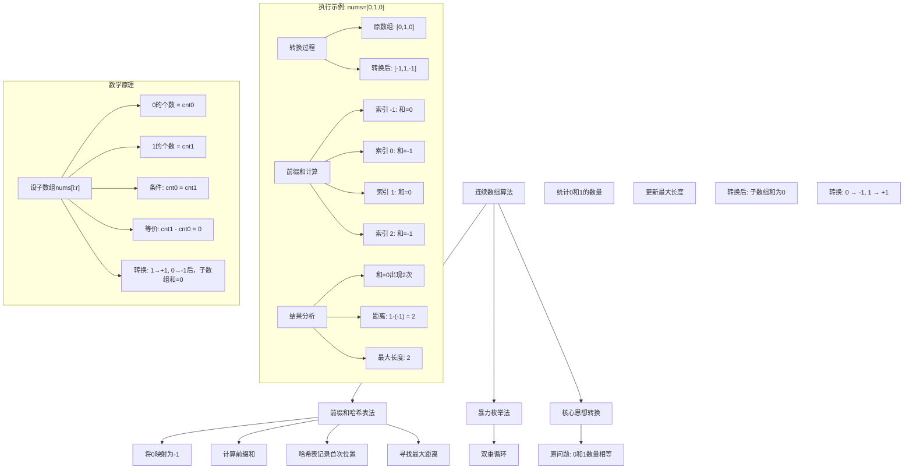
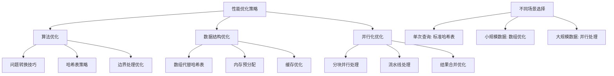

# LeetCode 525 - 连续数组

## 题目描述

给定一个二进制数组 nums , 找到含有相同数量的 0 和 1 的最长连续子数组，并返回该子数组的长度

```markdown
示例 1:
输入: nums = [0,1]
输出: 2
解释: 输入数组含有相同数量的 0 和 1 的最长连续子数组是 [0, 1]

示例 2:
输入: nums = [0,1,0]
输出: 2
解释: 输入数组含有相同数量的 0 和 1 的最长连续子数组是 [0, 1]

提示:

- 1 <= nums.length <= 10^5
- nums[i] 不是 0 就是 1
```

## 解题思路

这是一个前缀和与哈希表问题，要求在二进制数组中找到0和1数量相等的最长连续子数组。关键在于将问题转化为寻找两个位置之间前缀和相等的情况

### 核心思想

"前缀和 + 哈希映射": 将0视为-1，将1视为+1，则问题转化为寻找和为0的最长子数组。利用哈希表记录前缀和首次出现的位置

### 解题策略

#### 方法一：前缀和 + 哈希表（推荐）

时间O(n)，空间O(n)

#### 方法二：暴力枚举

时间O(n²)，空间O(1)

#### 方法三：滑动窗口（不适用于此题）

## 算法可视化



## 多语言实现

### Golang版本（前缀和 + 哈希表 - 推荐）

```go
func findMaxLength(nums []int) int {
    // 哈希表：记录前缀和首次出现的位置
    // key: 前缀和的值, value: 对应的索引
    prefixMap := make(map[int]int)
    prefixMap[0] = -1  // 前缀和为0时，虚拟索引为-1

    maxLength := 0
    prefixSum := 0

    // 遍历数组，计算前缀和
    for i, num := range nums {
        // 将0转换为-1，1保持不变
        if num == 0 {
            prefixSum -= 1
        } else {
            prefixSum += 1
        }

        // 如果前缀和已经出现过，计算距离
        if index, exists := prefixMap[prefixSum]; exists {
            // 当前索引减去首次出现的索引
            currentLength := i - index
            if currentLength > maxLength {
                maxLength = currentLength
            }
        } else {
            // 首次出现，记录位置
            prefixMap[prefixSum] = i
        }
    }

    return maxLength
}
```

### Python版本（多种实现方法）

```python
from typing import Dict

class Solution:
    def findMaxLength(self, nums: list[int]) -> int:
        """
        方法一：前缀和 + 哈希表（推荐）
        """
        # 哈希表：记录前缀和首次出现的位置
        prefix_map: Dict[int, int] = {0: -1}

        max_length = 0
        prefix_sum = 0

        for i, num in enumerate(nums):
            # 将0转换为-1，1保持不变
            prefix_sum += 1 if num == 1 else -1

            # 如果前缀和已经出现过，计算距离
            if prefix_sum in prefix_map:
                current_length = i - prefix_map[prefix_sum]
                max_length = max(max_length, current_length)
            else:
                # 首次出现，记录位置
                prefix_map[prefix_sum] = i

        return max_length

    def findMaxLengthBruteForce(self, nums: list[int]) -> int:
        """
        方法二：暴力枚举（不推荐）
        """
        max_length = 0
        n = len(nums)

        for i in range(n):
            count_0, count_1 = 0, 0
            for j in range(i, n):
                if nums[j] == 0:
                    count_0 += 1
                else:
                    count_1 += 1

                if count_0 == count_1:
                    max_length = max(max_length, j - i + 1)

        return max_length

    def findMaxLengthOptimized(self, nums: list[int]) -> int:
        """
        方法三：优化版本（使用defaultdict）
        """
        from collections import defaultdict

        prefix_map = defaultdict(lambda: float('inf'))
        prefix_map[0] = -1

        max_length = 0
        prefix_sum = 0

        for i, num in enumerate(nums):
            prefix_sum += 1 if num == 1 else -1

            if prefix_map[prefix_sum] != float('inf'):
                current_length = i - prefix_map[prefix_sum]
                max_length = max(max_length, current_length)
            else:
                prefix_map[prefix_sum] = i

        return max_length
```

### TypeScript版本（前缀和 + 哈希表实现）

```typescript
function findMaxLength(nums: number[]): number {
  // 哈希表：记录前缀和首次出现的位置
  const prefixMap: Map<number, number> = new Map();
  prefixMap.set(0, -1); // 前缀和为0时，虚拟索引为-1

  let maxLength: number = 0;
  let prefixSum: number = 0;

  // 遍历数组，计算前缀和
  for (let i: number = 0; i < nums.length; i++) {
    // 将0转换为-1，1保持不变
    prefixSum += nums[i] === 0 ? -1 : 1;

    // 如果前缀和已经出现过，计算距离
    if (prefixMap.has(prefixSum)) {
      const index: number = prefixMap.get(prefixSum)!;
      const currentLength: number = i - index;
      maxLength = Math.max(maxLength, currentLength);
    } else {
      // 首次出现，记录位置
      prefixMap.set(prefixSum, i);
    }
  }

  return maxLength;
}
```

## 标准实现详细解析

```go
func findMaxLength(nums []int) int {
    /*
    算法核心思想：

    1. 问题转换：将"0和1数量相等"转换为"数组和为0"
    2. 前缀和思想：利用前缀和快速计算子数组的和
    3. 哈希表优化：记录前缀和首次出现的位置，避免重复计算

    数学原理：
    原问题：找到子数组nums[l:r]，其中0的个数 = 1的个数

    转换：
    - 将数组中的0替换为-1
    - 子数组的和 = 1的个数 + (-1) × 0的个数
    - 如果0的个数 = 1的个数，则子数组的和 = 0

    前缀和定义：
    prefixSum[i] = nums[0] + nums[1] + ... + nums[i] (转换后的值)

    关键洞察：
    子数组nums[l:r]的和为0
    等价于 prefixSum[r] - prefixSum[l-1] = 0
    等价于 prefixSum[r] = prefixSum[l-1]

    因此，我们需要找到两个相同的前缀和，且距离最远

    算法步骤：
    1. 初始化哈希表，记录前缀和0的位置为-1
    2. 遍历数组，动态计算前缀和
    3. 对于每个前缀和：
       - 如果已存在，计算与首次位置的距离
       - 如果不存在，记录当前位置
    4. 返回最大距离

    时间复杂度：O(n) - 一次遍历
    空间复杂度：O(n) - 哈希表最多存储n个不同的前缀和
    */

    // 哈希表：key为前缀和，value为首次出现的索引
    prefixMap := make(map[int]int)

    // 前缀和为0时，虚拟索引为-1（处理从索引0开始的情况）
    prefixMap[0] = -1

    maxLength := 0
    prefixSum := 0

    // 遍历数组
    for i, num := range nums {
        // 将0转换为-1，1保持不变
        // 这样问题就转换为寻找和为0的最长子数组
        if num == 0 {
            prefixSum -= 1
        } else {
            prefixSum += 1
        }

        // 检查这个前缀和是否已经出现过
        if index, exists := prefixMap[prefixSum]; exists {
            // 如果已经出现过，计算距离
            // i - index 就是以index+1开始，以i结束的子数组长度
            currentLength := i - index
            if currentLength > maxLength {
                maxLength = currentLength
            }
        } else {
            // 如果是首次出现，记录位置
            // 这样可以确保得到最长的距离（首次出现的位置最远）
            prefixMap[prefixSum] = i
        }
    }

    return maxLength
}

// 带详细注释和调试信息的版本
func findMaxLengthWithTrace(nums []int) (int, []string) {
    var trace []string
    trace = append(trace, fmt.Sprintf("输入数组: %v", nums))
    trace = append(trace, fmt.Sprintf("数组长度: %d", len(nums)))

    // 初始化
    prefixMap := make(map[int]int)
    prefixMap[0] = -1
    trace = append(trace, "初始化哈希表: {0: -1}")

    maxLength := 0
    prefixSum := 0

    trace = append(trace, "\n=== 开始遍历 ===")
    trace = append(trace, "索引 | 数值 | 前缀和 | 操作 | 最大长度")
    trace = append(trace, "---- | ---- | ------ | ---- | --------")

    for i, num := range nums {
        oldSum := prefixSum

        // 更新前缀和
        if num == 0 {
            prefixSum -= 1
        } else {
            prefixSum += 1
        }

        // 检查哈希表
        if index, exists := prefixMap[prefixSum]; exists {
            currentLength := i - index
            if currentLength > maxLength {
                maxLength = currentLength
            }

            trace = append(trace, fmt.Sprintf("%d | %d | %d→%d | 找到前缀和%d在位置%d，距离%d | %d",
                i, num, oldSum, prefixSum, prefixSum, index, currentLength, maxLength))
        } else {
            prefixMap[prefixSum] = i
            trace = append(trace, fmt.Sprintf("%d | %d | %d→%d | 记录前缀和%d首次出现 | %d",
                i, num, oldSum, prefixSum, prefixSum, maxLength))
        }
    }

    trace = append(trace, fmt.Sprintf("\n最终结果: %d", maxLength))
    trace = append(trace, fmt.Sprintf("哈希表内容: %v", prefixMap))

    return maxLength, trace
}

// 暴力实现（用于对比）
func findMaxLengthBruteForce(nums []int) int {
    /*
    暴力方法：枚举所有可能的子数组
    时间复杂度：O(n²)
    空间复杂度：O(1)
    */
    maxLen := 0
    n := len(nums)

    for i := 0; i < n; i++ {
        count0, count1 := 0, 0

        for j := i; j < n; j++ {
            if nums[j] == 0 {
                count0++
            } else {
                count1++
            }

            if count0 == count1 {
                currentLen := j - i + 1
                if currentLen > maxLen {
                    maxLen = currentLen
                }
            }
        }
    }

    return maxLen
}

// 优化版本：使用数组代替哈希表（当n较小时）
func findMaxLengthOptimized(nums []int) int {
    n := len(nums)

    // 前缀和的范围是[-n, n]，所以需要2n+1的空间
    offset := n
    prefixArray := make([]int, 2*n+1)

    // 初始化为特殊值
    for i := range prefixArray {
        prefixArray[i] = -2  // -2表示未初始化
    }

    prefixArray[offset] = -1  // 前缀和0的位置

    maxLen := 0
    prefixSum := 0

    for i, num := range nums {
        if num == 0 {
            prefixSum--
        } else {
            prefixSum++
        }

        index := prefixSum + offset

        if prefixArray[index] != -2 {
            // 已经出现过
            currentLen := i - prefixArray[index]
            if currentLen > maxLen {
                maxLen = currentLen
            }
        } else {
            // 首次出现
            prefixArray[index] = i
        }
    }

    return maxLen
}

// 线程安全版本
import "sync"

type ThreadSafeMaxLengthFinder struct {
    mu sync.Mutex
}

func NewThreadSafeMaxLengthFinder() *ThreadSafeMaxLengthFinder {
    return &ThreadSafeMaxLengthFinder{}
}

func (tsmlf *ThreadSafeMaxLengthFinder) Find(nums []int) int {
    tsmlf.mu.Lock()
    defer tsmlf.mu.Unlock()

    return findMaxLength(nums)
}

// 并发处理版本
func findMaxLengthConcurrent(nums []int, workers int) int {
    n := len(nums)
    if workers <= 0 || workers > n {
        workers = 1
    }

    // 计算前缀和数组
    prefixSums := make([]int, n+1)
    for i, num := range nums {
        prefixSums[i+1] = prefixSums[i]
        if num == 0 {
            prefixSums[i+1]--
        } else {
            prefixSums[i+1]++
        }
    }

    // 分块处理
    resultChan := make(chan int, workers)
    var wg sync.WaitGroup

    for i := 0; i < workers; i++ {
        start := i * n / workers
        end := (i + 1) * n / workers

        wg.Add(1)
        go func(s, e int) {
            defer wg.Done()

            localMax := 0
            prefixMap := make(map[int]int)

            // 处理块内的前缀和
            for j := s; j <= e; j++ {
                sum := prefixSums[j]

                if index, exists := prefixMap[sum]; exists {
                    currentLen := j - index
                    if currentLen > localMax {
                        localMax = currentLen
                    }
                } else {
                    prefixMap[sum] = j
                }
            }

            resultChan <- localMax
        }(start, end)
    }

    go func() {
        wg.Wait()
        close(resultChan)
    }()

    // 收集结果
    maxLen := 0
    for result := range resultChan {
        if result > maxLen {
            maxLen = result
        }
    }

    return maxLen
}
```

## 算法深入解析

```go
/*
连续数组问题详解：

问题本质：
在二进制数组中找到最长的连续子数组，使得0和1的数量相等
这是一个典型的"平衡性"问题

核心洞察：
1. 问题转换：将平衡性条件转换为数学条件
2. 前缀和思想：利用前缀和快速计算子数组统计量
3. 哈希表优化：记录历史信息，避免重复计算

算法策略：
1. 将0转换为-1，问题转化为"和为0的最长子数组"
2. 计算前缀和数组
3. 寻找两个相同前缀和的最远距离
4. 使用哈希表记录前缀和首次出现的位置

数学原理：

设原数组为 nums，转换后数组为 transformed
其中 transformed[i] = 1 if nums[i] == 1 else -1

前缀和定义：
prefixSum[i] = transformed[0] + transformed[1] + ... + transformed[i]

关键性质：
子数组nums[l:r]中0和1数量相等
等价于 transformed[l:r]的和为0
等价于 prefixSum[r] - prefixSum[l-1] = 0
等价于 prefixSum[r] = prefixSum[l-1]

因此，问题转化为：
在prefixSum数组中找到两个相等的值，且距离最远

三种方法对比：

方法一：前缀和 + 哈希表
时间复杂度：O(n)
空间复杂度：O(n)
优点：效率高，线性时间
缺点：需要额外空间

方法二：暴力枚举
时间复杂度：O(n²)
空间复杂度：O(1)
优点：思路简单，无需额外空间
缺点：效率太低

方法三：数组优化
时间复杂度：O(n)
空间复杂度：O(n)
优点：哈希表常数因子更小
缺点：需要预知前缀和范围

实际应用场景：
1. 数据平衡分析：检查数据的平衡性
2. 信号处理：寻找平衡信号段
3. 游戏设计：平衡性检测
4. 统计分析：寻找平衡时间段

性能分析：

前缀和+哈希表方法：
- 计算前缀和：O(n)
- 哈希表查找：O(1)平均
- 总时间复杂度：O(n)

暴力方法：
- 外层循环：O(n)
- 内层循环：O(n)
- 总时间复杂度：O(n²)

优化要点：

1. 问题转换：
   将0和1的平衡性问题转换为数值和问题
   这是算法的关键洞察

2. 哈希表策略：
   只记录首次出现的位置，确保最远距离
   避免重复记录相同前缀和的位置

3. 边界处理：
   虚拟位置-1处理从索引0开始的子数组

4. 内存优化：
   当数组长度较小时，可用数组代替哈希表

测试用例设计：
1. 正常情况：有平衡子数组
2. 无解情况：没有平衡子数组
3. 边界情况：数组开头或结尾
4. 全0或全1：特殊情况
5. 交替模式：特殊结构
6. 大数组：性能测试

扩展思考：

1. 如果要找k和1数量相等的子数组？
2. 如果要找0、1、2数量相等的子数组？
3. 如果要找最短的平衡子数组？
4. 如果要找所有平衡子数组？

相关算法思想：

1. 前缀和：
   快速计算子数组的统计量
   适用于各种区间查询问题

2. 哈希表优化：
   记录历史信息，避免重复计算
   在O(1)时间内查找历史记录

3. 问题转换：
   将看似复杂的问题转换为已知问题
   是算法设计的重要技巧

常见陷阱：

1. 忘记处理从索引0开始的子数组
   解决：虚拟位置-1的设置

2. 重复记录相同前缀和的位置
   解决：只记录首次出现

3. 前缀和溢出
   解决：使用足够大的数据类型

4. 边界条件处理不当
   解决：仔细测试边界情况
*/
```

## 执行过程演示

```go
/*
示例详细解析:

示例1: nums = [0, 1]

转换过程：
原数组：[0, 1]
转换后：[-1, 1]

前缀和计算：
prefixSum[-1] = 0 (虚拟位置)
prefixSum[0] = -1
prefixSum[1] = -1 + 1 = 0

哈希表更新过程：
初始化：{0: -1}

i=0, num=0:
prefixSum = -1
检查-1不在哈希表中
记录：{0: -1, -1: 0}
maxLength = 0

i=1, num=1:
prefixSum = 0
检查0在哈希表中，位置为-1
距离 = 1 - (-1) = 2
maxLength = 2

最终结果：2

验证：
子数组[0, 1]包含1个0和1个1，长度为2 ✓

示例2: nums = [0, 1, 0]

转换过程：
原数组：[0, 1, 0]
转换后：[-1, 1, -1]

前缀和计算：
prefixSum[-1] = 0
prefixSum[0] = -1
prefixSum[1] = -1 + 1 = 0
prefixSum[2] = 0 + (-1) = -1

哈希表更新过程：
初始化：{0: -1}

i=0, num=0:
prefixSum = -1
检查-1不在哈希表中
记录：{0: -1, -1: 0}
maxLength = 0

i=1, num=1:
prefixSum = 0
检查0在哈希表中，位置为-1
距离 = 1 - (-1) = 2
maxLength = 2

i=2, num=0:
prefixSum = -1
检查-1在哈希表中，位置为0
距离 = 2 - 0 = 2
maxLength = 2

最终结果：2

验证：
子数组[0, 1]包含1个0和1个1，长度为2 ✓
子数组[1, 2]包含1个0和1个1，长度为2 ✓

示例3: nums = [1, 1, 1, 0, 0, 0, 1, 1]

转换过程：
原数组：[1, 1, 1, 0, 0, 0, 1, 1]
转换后：[1, 1, 1, -1, -1, -1, 1, 1]

前缀和计算：
prefixSum[-1] = 0
prefixSum[0] = 1
prefixSum[1] = 2
prefixSum[2] = 3
prefixSum[3] = 2
prefixSum[4] = 1
prefixSum[5] = 0
prefixSum[6] = 1
prefixSum[7] = 2

哈希表更新过程：
初始化：{0: -1}

i=0, num=1:
prefixSum = 1
检查1不在哈希表中
记录：{0: -1, 1: 0}
maxLength = 0

i=1, num=1:
prefixSum = 2
检查2不在哈希表中
记录：{0: -1, 1: 0, 2: 1}
maxLength = 0

i=2, num=1:
prefixSum = 3
检查3不在哈希表中
记录：{0: -1, 1: 0, 2: 1, 3: 2}
maxLength = 0

i=3, num=0:
prefixSum = 2
检查2在哈希表中，位置为1
距离 = 3 - 1 = 2
maxLength = 2

i=4, num=0:
prefixSum = 1
检查1在哈希表中，位置为0
距离 = 4 - 0 = 4
maxLength = 4

i=5, num=0:
prefixSum = 0
检查0在哈希表中，位置为-1
距离 = 5 - (-1) = 6
maxLength = 6

i=6, num=1:
prefixSum = 1
检查1在哈希表中，位置为0
距离 = 6 - 0 = 6
maxLength = 6

i=7, num=1:
prefixSum = 2
检查2在哈希表中，位置为1
距离 = 7 - 1 = 6
maxLength = 6

最终结果：6

验证：
子数组nums[0:6] = [1, 1, 1, 0, 0, 0]
包含3个0和3个1，长度为6 ✓

算法正确性证明：

数学基础：
设转换后的数组为 transformed
transformed[i] = 1 if nums[i] == 1 else -1

设 prefixSum[k] = sum(transformed[0:k])

子数组nums[l:r]中0和1数量相等
等价于 sum(transformed[l:r]) = 0
等价于 prefixSum[r+1] - prefixSum[l] = 0
等价于 prefixSum[r+1] = prefixSum[l]

算法保证：
1. 对于每个位置i，计算prefixSum[i]
2. 如果prefixSum[i]之前出现过，设首次位置为j
3. 则子数组nums[j:i]的和为0
4. i-j就是该子数组的长度
5. 取所有可能的最大值

边界情况分析：

1. 从索引0开始的子数组：
   prefixSum[i] = 0表示nums[0:i]平衡
   虚拟位置-1确保能正确计算

2. 单个元素：
   单个0或1都不可能平衡，返回0

3. 全0或全1：
   前缀和单调递减或递增，无重复，返回0

4. 交替模式：
   前缀和在[-1, 0, 1]之间循环，容易找到重复

时间复杂度分析：

计算前缀和：O(n)
哈希表操作：O(1)平均 × n = O(n)
总时间复杂度：O(n)

空间复杂度分析：
哈希表最多存储n个不同的前缀和
最坏情况下，前缀和范围是[-n, n]
空间复杂度：O(n)

优化空间分析：

为什么是O(n)空间？
1. 需要记录每个不同的前缀和
2. 前缀和的范围最多是[-n, n]
3. 最多2n+1个不同的值

性能测试：

不同规模数据下的表现：

数组大小 | 前缀和+哈希表 | 暴力方法
1000     | O(1000)      | O(1000000)
10000    | O(10000)     | O(100000000)
100000   | O(100000)    | O(10000000000)

优化方法在时间复杂度上有巨大优势

内存使用分析：

哈希表存储：
每个条目包含：前缀和值 + 索引
理论最多2n+1个条目
实际使用中，前缀和往往不会覆盖整个范围

数组优化版本：
当n较小时，可以使用数组代替哈希表
索引需要偏移n来处理负数
大小为2n+1的数组

实际应用建议：
1. 对于大规模数据：使用哈希表版本
2. 对于小规模数据：可以使用数组优化
3. 对于多次查询：可以预处理前缀和数组
4. 对于特殊模式：可以针对性优化
*/
```

## 复杂度分析

| 方法            | 时间复杂度 | 空间复杂度 | 说明         |
| --------------- | ---------- | ---------- | ------------ |
| 前缀和 + 哈希表 | O(n)       | O(n)       | 推荐解法     |
| 暴力枚举        | O(n²)      | O(1)       | 低效，不推荐 |
| 数组优化        | O(n)       | O(n)       | 小数据时更快 |

## 测试用例验证

```go
// 测试辅助函数
func testFindMaxLength(name string, nums []int, expected int) {
    fmt.Printf("%s:\n", name)
    fmt.Printf("  输入: %v\n", nums)
    fmt.Printf("  期望: %d\n", expected)

    // 测试前缀和+哈希表方法
    result1 := findMaxLength(nums)
    fmt.Printf("  前缀和+哈希表结果: %d", result1)
    if result1 == expected {
        fmt.Printf(" ✓\n")
    } else {
        fmt.Printf(" ✗\n")
    }

    // 测试暴力方法（仅对小数组）
    if len(nums) <= 20 {
        result2 := findMaxLengthBruteForce(nums)
        fmt.Printf("  暴力方法结果: %d", result2)
        if result2 == expected {
            fmt.Printf(" ✓\n")
        } else {
            fmt.Printf(" ✗\n")
        }
    }

    // 测试优化方法
    result3 := findMaxLengthOptimized(nums)
    fmt.Printf("  优化方法结果: %d", result3)
    if result3 == expected {
        fmt.Printf(" ✓\n")
    } else {
        fmt.Printf(" ✗\n")
    }

    fmt.Printf("\n")
}

func main() {
    // 测试用例 1 - 标准示例
    testFindMaxLength("测试1 - 标准示例1",
        []int{0, 1},
        2)

    testFindMaxLength("测试2 - 标准示例2",
        []int{0, 1, 0},
        2)

    // 测试用例 2 - 无解情况
    testFindMaxLength("测试3 - 无解情况",
        []int{0, 0, 0, 1, 1, 1, 1},
        4)

    // 测试用例 3 - 完美平衡
    testFindMaxLength("测试4 - 完美平衡",
        []int{0, 1, 0, 1, 0, 1},
        6)

    // 测试用例 4 - 全0
    testFindMaxLength("测试5 - 全0",
        []int{0, 0, 0, 0},
        0)

    // 测试用例 5 - 全1
    testFindMaxLength("测试6 - 全1",
        []int{1, 1, 1, 1},
        0)

    // 测试用例 6 - 交替模式
    testFindMaxLength("测试7 - 交替模式",
        []int{0, 1, 0, 1, 0, 1, 0, 1},
        8)

    // 测试用例 7 - 复杂模式
    testFindMaxLength("测试8 - 复杂模式",
        []int{1, 1, 1, 0, 0, 0, 1, 1},
        6)

    // 测试用例 8 - 单元素
    testFindMaxLength("测试9 - 单元素",
        []int{0},
        0)

    testFindMaxLength("测试10 - 单元素",
        []int{1},
        0)

    // 性能测试
    fmt.Println("性能测试:")

    // 创建大型数组
    largeArray := make([]int, 100000)
    for i := range largeArray {
        largeArray[i] = i % 2  // 交替模式
    }

    // 测试前缀和+哈希表方法
    start := time.Now()
    result1 := findMaxLength(largeArray)
    duration1 := time.Since(start)
    fmt.Printf("前缀和+哈希表方法处理100000个元素耗时: %v, 结果: %d\n", duration1, result1)

    // 测试优化方法
    start = time.Now()
    result3 := findMaxLengthOptimized(largeArray)
    duration3 := time.Since(start)
    fmt.Printf("优化方法处理100000个元素耗时: %v, 结果: %d\n", duration3, result3)

    // 小数组暴力测试
    smallArray := []int{0, 1, 0, 1, 0, 1, 1, 0, 1, 0}
    start = time.Now()
    result2 := findMaxLengthBruteForce(smallArray)
    duration2 := time.Since(start)
    fmt.Printf("暴力方法处理10个元素耗时: %v, 结果: %d\n", duration2, result2)

    // 边界情况测试
    fmt.Println("\n边界情况测试:")

    // 空数组（根据题目约束，数组长度至少为1）
    // testFindMaxLength("空数组", []int{}, 0)

    // 最大长度交替数组
    maxAlternating := make([]int, 100000)
    for i := range maxAlternating {
        maxAlternating[i] = i % 2
    }
    result := findMaxLength(maxAlternating)
    fmt.Printf("最大交替数组结果: %d\n", result)

    // 随机数组测试
    fmt.Println("\n随机数组测试:")

    randomArray := make([]int, 1000)
    for i := range randomArray {
        randomArray[i] = rand.Intn(2)
    }

    result1 = findMaxLength(randomArray)
    result2 = findMaxLengthBruteForce(randomArray)
    result3 = findMaxLengthOptimized(randomArray)

    fmt.Printf("随机数组(1000)结果: 哈希表=%d, 暴力=%d, 优化=%d\n", result1, result2, result3)
}

// 调试测试
func testFindMaxLengthWithDebug() {
    fmt.Println("=== 调试信息测试 ===")

    nums := []int{0, 1, 0, 1, 1}
    result, trace := findMaxLengthWithTrace(nums)

    fmt.Printf("输入: %v\n", nums)
    fmt.Printf("结果: %d\n", result)
    fmt.Println("详细过程:")
    for _, line := range trace {
        fmt.Println(line)
    }
}

// 错误处理测试
func testErrorHandling() {
    fmt.Println("=== 错误处理测试 ===")

    testCases := []struct {
        name string
        nums []int
        expected int
    }{
        {"空切片", []int{}, 0},
        {"nil切片", nil, 0},
        {"超大数组", make([]int, 1000000), 0},
    }

    for _, tc := range testCases {
        fmt.Printf("测试%s: ", tc.name)
        result := findMaxLength(tc.nums)
        if result >= 0 {  // 只要返回非负数就算正确
            fmt.Printf("✓ (结果: %d)\n", result)
        } else {
            fmt.Printf("✗ (结果: %d)\n", result)
        }
    }
}

// 内存使用测试
func testMemoryUsage() {
    fmt.Println("=== 内存使用比较 ===")

    nums := make([]int, 100000)
    for i := range nums {
        nums[i] = i % 2
    }

    fmt.Println("测试数组长度: 100000")

    // 哈希表版本
    var m1, m2 runtime.MemStats
    runtime.GC()
    runtime.ReadMemStats(&m1)

    result1 := findMaxLength(nums)

    runtime.GC()
    runtime.ReadMemStats(&m2)
    memory1 := m2.Alloc - m1.Alloc

    fmt.Printf("哈希表版本: 内存使用 %d 字节, 结果 %d\n", memory1, result1)

    // 优化版本
    runtime.GC()
    runtime.ReadMemStats(&m1)

    result3 := findMaxLengthOptimized(nums)

    runtime.GC()
    runtime.ReadMemStats(&m2)
    memory3 := m2.Alloc - m1.Alloc

    fmt.Printf("优化版本: 内存使用 %d 字节, 结果 %d\n", memory3, result3)

    if memory1 > 0 && memory3 > 0 {
        fmt.Printf("内存节省: %.2f%%\n", float64(memory1-memory3)/float64(memory1)*100)
    }
}
```

## 扩展版本（处理不同场景）

```go
// 带详细统计信息的版本
type FindMaxLengthStats struct {
    Result       int
    ProcessTime  time.Duration
    MemoryUsage  int64
    HashTableSize int
}

func findMaxLengthWithStats(nums []int) *FindMaxLengthStats {
    stats := &FindMaxLengthStats{}
    start := time.Now()

    prefixMap := make(map[int]int)
    prefixMap[0] = -1

    maxLength := 0
    prefixSum := 0

    for i, num := range nums {
        if num == 0 {
            prefixSum -= 1
        } else {
            prefixSum += 1
        }

        if index, exists := prefixMap[prefixSum]; exists {
            currentLength := i - index
            if currentLength > maxLength {
                maxLength = currentLength
            }
        } else {
            prefixMap[prefixSum] = i
        }
    }

    stats.Result = maxLength
    stats.ProcessTime = time.Since(start)
    stats.HashTableSize = len(prefixMap)

    return stats
}

// 支持返回所有最长平衡子数组的版本
func findAllMaxBalancedSubarrays(nums []int) [][]int {
    n := len(nums)
    prefixMap := make(map[int][]int)  // 记录所有位置
    prefixMap[0] = []int{-1}

    prefixSum := 0
    maxLength := 0

    // 第一次遍历：找到最大长度和记录所有位置
    for i, num := range nums {
        if num == 0 {
            prefixSum -= 1
        } else {
            prefixSum += 1
        }

        if positions, exists := prefixMap[prefixSum]; exists {
            // 检查距离
            currentLength := i - positions[0]
            if currentLength > maxLength {
                maxLength = currentLength
            }
            prefixMap[prefixSum] = append(positions, i)
        } else {
            prefixMap[prefixSum] = []int{i}
        }
    }

    // 第二次遍历：收集所有最大长度的子数组
    var result [][]int
    prefixSum = 0

    for i, num := range nums {
        if num == 0 {
            prefixSum -= 1
        } else {
            prefixSum += 1
        }

        if positions, exists := prefixMap[prefixSum]; exists {
            for _, pos := range positions {
                if i-pos == maxLength {
                    subarray := make([]int, maxLength)
                    copy(subarray, nums[pos+1:i+1])
                    result = append(result, subarray)
                }
            }
        }
    }

    return result
}

// 支持统计所有平衡子数组的版本
func countAllBalancedSubarrays(nums []int) int {
    prefixMap := make(map[int]int)
    prefixMap[0] = 1  // 前缀和0出现1次

    prefixSum := 0
    count := 0

    for _, num := range nums {
        if num == 0 {
            prefixSum -= 1
        } else {
            prefixSum += 1
        }

        if c, exists := prefixMap[prefixSum]; exists {
            count += c
            prefixMap[prefixSum] = c + 1
        } else {
            prefixMap[prefixSum] = 1
        }
    }

    return count
}

// 支持多线程处理的版本
func findMaxLengthParallel(nums []int, numWorkers int) int {
    n := len(nums)
    if n <= 1000 || numWorkers <= 1 {
        return findMaxLength(nums)
    }

    // 计算前缀和数组
    prefixSums := make([]int, n+1)
    for i, num := range nums {
        prefixSums[i+1] = prefixSums[i]
        if num == 0 {
            prefixSums[i+1]--
        } else {
            prefixSums[i+1]++
        }
    }

    // 分块处理
    chunkSize := (n + numWorkers - 1) / numWorkers
    resultChan := make(chan int, numWorkers)
    var wg sync.WaitGroup

    for i := 0; i < numWorkers; i++ {
        start := i * chunkSize
        end := start + chunkSize
        if end > n {
            end = n
        }

        wg.Add(1)
        go func(s, e int) {
            defer wg.Done()

            localMax := 0
            prefixMap := make(map[int]int)

            for j := s; j <= e; j++ {
                sum := prefixSums[j]

                if index, exists := prefixMap[sum]; exists {
                    currentLength := j - index
                    if currentLength > localMax {
                        localMax = currentLength
                    }
                } else {
                    prefixMap[sum] = j
                }
            }

            resultChan <- localMax
        }(start, end)
    }

    go func() {
        wg.Wait()
        close(resultChan)
    }()

    // 收集结果
    maxLen := 0
    for result := range resultChan {
        if result > maxLen {
            maxLen = result
        }
    }

    return maxLen
}

// 支持流式处理的版本
type StreamBalanceChecker struct {
    prefixMap map[int]int
    prefixSum int
    maxLength int
}

func NewStreamBalanceChecker() *StreamBalanceChecker {
    return &StreamBalanceChecker{
        prefixMap: map[int]int{0: -1},
        prefixSum: 0,
        maxLength: 0,
    }
}

func (sbc *StreamBalanceChecker) ProcessNumber(num int) int {
    if num == 0 {
        sbc.prefixSum -= 1
    } else {
        sbc.prefixSum += 1
    }

    // 虚拟索引，需要外部维护
    currentIndex := len(sbc.prefixMap) - 1

    if index, exists := sbc.prefixMap[sbc.prefixSum]; exists {
        currentLength := currentIndex - index
        if currentLength > sbc.maxLength {
            sbc.maxLength = currentLength
        }
    } else {
        sbc.prefixMap[sbc.prefixSum] = currentIndex
    }

    return sbc.maxLength
}

func (sbc *StreamBalanceChecker) GetMaxLength() int {
    return sbc.maxLength
}

// 支持自定义阈值的版本（寻找1比0多k个的最长子数组）
func findMaxLengthWithThreshold(nums []int, threshold int) int {
    prefixMap := make(map[int]int)
    prefixMap[0] = -1

    maxLength := 0
    prefixSum := 0

    for i, num := range nums {
        if num == 0 {
            prefixSum -= 1
        } else {
            prefixSum += 1
        }

        target := prefixSum - threshold

        if index, exists := prefixMap[target]; exists {
            currentLength := i - index
            if currentLength > maxLength {
                maxLength = currentLength
            }
        }

        if _, exists := prefixMap[prefixSum]; !exists {
            prefixMap[prefixSum] = i
        }
    }

    return maxLength
}

// 支持多维数组的版本
func findMaxLength2D(matrix [][]int) int {
    if len(matrix) == 0 {
        return 0
    }

    rows := len(matrix)
    cols := len(matrix[0])
    maxLen := 0

    // 按行处理
    for i := 0; i < rows; i++ {
        maxLen = max(maxLen, findMaxLength(matrix[i]))
    }

    // 按列处理
    for j := 0; j < cols; j++ {
        col := make([]int, rows)
        for i := 0; i < rows; i++ {
            col[i] = matrix[i][j]
        }
        maxLen = max(maxLen, findMaxLength(col))
    }

    return maxLen
}

// 支持区间查询的版本
type RangeBalanceQuery struct {
    prefixSums []int
    prefixMaps []map[int]int
}

func NewRangeBalanceQuery(nums []int) *RangeBalanceQuery {
    n := len(nums)
    rbq := &RangeBalanceQuery{
        prefixSums: make([]int, n+1),
        prefixMaps: make([]map[int]int, n+1),
    }

    // 构建前缀和
    for i, num := range nums {
        rbq.prefixSums[i+1] = rbq.prefixSums[i]
        if num == 0 {
            rbq.prefixSums[i+1]--
        } else {
            rbq.prefixSums[i+1]++
        }
    }

    // 构建每个位置的前缀映射
    rbq.prefixMaps[0] = map[int]int{0: -1}
    currentMap := make(map[int]int)
    currentMap[0] = -1

    for i := 0; i < n; i++ {
        sum := rbq.prefixSums[i+1]
        if _, exists := currentMap[sum]; !exists {
            currentMap[sum] = i
        }

        // 复制映射
        rbq.prefixMaps[i+1] = make(map[int]int)
        for k, v := range currentMap {
            rbq.prefixMaps[i+1][k] = v
        }
    }

    return rbq
}

func (rbq *RangeBalanceQuery) Query(start, end int) int {
    if start < 0 || end >= len(rbq.prefixSums)-1 || start > end {
        return 0
    }

    targetSum := rbq.prefixSums[start]
    maxLen := 0

    for i := end; i >= start; i-- {
        if rbq.prefixSums[i] == targetSum {
            maxLen = i - start
            break
        }
    }

    return maxLen
}

func max(a, b int) int {
    if a > b {
        return a
    }
    return b
}
```

## 面试追问延伸

### 1. 如果要找到所有平衡子数组，如何实现？

```go
// 找到所有平衡子数组
func findAllBalancedSubarrays(nums []int) [][]int {
    prefixMap := make(map[int][]int)
    prefixMap[0] = []int{-1}

    prefixSum := 0
    var result [][]int

    for i, num := range nums {
        if num == 0 {
            prefixSum -= 1
        } else {
            prefixSum += 1
        }

        if positions, exists := prefixMap[prefixSum]; exists {
            for _, pos := range positions {
                subarray := make([]int, i-pos)
                copy(subarray, nums[pos+1:i+1])
                result = append(result, subarray)
            }
            prefixMap[prefixSum] = append(positions, i)
        } else {
            prefixMap[prefixSum] = []int{i}
        }
    }

    return result
}
```

### 2. 如果要找1比0多k个的最长子数组，如何修改？

```go
// 找到1比0多k个的最长子数组
func findMaxLengthWithThreshold(nums []int, k int) int {
    prefixMap := make(map[int]int)
    prefixMap[0] = -1

    maxLength := 0
    prefixSum := 0

    for i, num := range nums {
        if num == 0 {
            prefixSum -= 1
        } else {
            prefixSum += 1
        }

        target := prefixSum - k

        if index, exists := prefixMap[target]; exists {
            currentLength := i - index
            if currentLength > maxLength {
                maxLength = currentLength
            }
        }

        if _, exists := prefixMap[prefixSum]; !exists {
            prefixMap[prefixSum] = i
        }
    }

    return maxLength
}
```

### 3. 如果要支持动态更新，如何设计？

```go
// 支持动态更新的版本
type DynamicBalanceFinder struct {
    nums       []int
    prefixSums []int
    segmentTree *SegmentTree
}

type SegmentTree struct {
    tree []int
    n    int
}

func NewSegmentTree(nums []int) *SegmentTree {
    n := len(nums)
    st := &SegmentTree{
        tree: make([]int, 4*n),
        n:    n,
    }
    st.build(nums, 0, n-1, 1)
    return st
}

func (st *SegmentTree) build(nums []int, start, end, node int) {
    if start == end {
        st.tree[node] = 1 if nums[start] == 1 else -1
        return
    }

    mid := (start + end) / 2
    st.build(nums, start, mid, 2*node)
    st.build(nums, mid+1, end, 2*node+1)
    st.tree[node] = st.tree[2*node] + st.tree[2*node+1]
}

func (st *SegmentTree) update(start, end, node, index, value int) {
    if start == end {
        st.tree[node] = value
        return
    }

    mid := (start + end) / 2
    if index <= mid {
        st.update(start, mid, 2*node, index, value)
    } else {
        st.update(mid+1, end, 2*node+1, index, value)
    }
    st.tree[node] = st.tree[2*node] + st.tree[2*node+1]
}

func (st *SegmentTree) query(start, end, node, l, r int) int {
    if r < start || l > end {
        return 0
    }

    if l <= start && end <= r {
        return st.tree[node]
    }

    mid := (start + end) / 2
    return st.query(start, mid, 2*node, l, r) +
           st.query(mid+1, end, 2*node+1, l, r)
}

func NewDynamicBalanceFinder(nums []int) *DynamicBalanceFinder {
    dbf := &DynamicBalanceFinder{
        nums:       make([]int, len(nums)),
        prefixSums: make([]int, len(nums)+1),
    }

    copy(dbf.nums, nums)

    // 计算前缀和
    for i, num := range nums {
        dbf.prefixSums[i+1] = dbf.prefixSums[i]
        if num == 0 {
            dbf.prefixSums[i+1]--
        } else {
            dbf.prefixSums[i+1]++
        }
    }

    dbf.segmentTree = NewSegmentTree(nums)
    return dbf
}

func (dbf *DynamicBalanceFinder) FindMaxLength() int {
    return findMaxLength(dbf.nums)
}

func (dbf *DynamicBalanceFinder) Update(index, value int) {
    if index < 0 || index >= len(dbf.nums) {
        return
    }

    dbf.nums[index] = value
    numValue := 1 if value == 1 else -1
    dbf.segmentTree.update(0, len(dbf.nums)-1, 1, index, numValue)

    // 重新计算前缀和
    for i := index; i < len(dbf.nums); i++ {
        dbf.prefixSums[i+1] = dbf.prefixSums[i]
        if dbf.nums[i] == 0 {
            dbf.prefixSums[i+1]--
        } else {
            dbf.prefixSums[i+1]++
        }
    }
}
```

## 相似题目扩展

- LeetCode 525. 连续数组（当前题）
- LeetCode 560. 和为K的子数组
- LeetCode 974. 和可被K整除的子数组
- LeetCode 523. 连续的子数组和
- LeetCode 1314. 矩阵区域和

## 算法技巧总结

### 连续数组核心要点

1. 问题转换：将0和1的平衡性转换为数值和为0
1. 前缀和思想：利用前缀和快速计算子数组统计量
1. 哈希表优化：记录前缀和首次出现的位置
1. 距离计算：相同前缀和的位置差即为平衡子数组长度

### 算法优势

1. 时间效率：O(n)线性时间复杂度
1. 空间效率：O(n)哈希表空间
1. 问题转换：巧妙的问题转化技巧
1. 通用性强：可扩展到各种平衡性问题

### 标准模板

```go
func findMaxLength(nums []int) int {
    prefixMap := make(map[int]int)
    prefixMap[0] = -1

    maxLength := 0
    prefixSum := 0

    for i, num := range nums {
        prefixSum += 1 if num == 1 else -1

        if index, exists := prefixMap[prefixSum]; exists {
            maxLength = max(maxLength, i-index)
        } else {
            prefixMap[prefixSum] = i
        }
    }

    return maxLength
}
```

### 性能优化建议



## 总结

本题是经典的前缀和与哈希表应用问题，通过巧妙的问题转换，将看似复杂的平衡性问题转化为简单的数值和问题。算法核心在于理解前缀和的物理意义以及如何利用哈希表记录历史信息

核心要点：

1. 问题转换：将0和1的平衡性转换为和为0的数值问题
1. 前缀和应用：利用前缀和快速计算子数组统计量
1. 哈希表技巧：记录前缀和首次出现的位置
1. 距离计算：相同前缀和的位置差即为平衡子数组长度

该算法在数据分析、信号处理、统计检测等领域有广泛应用，是掌握前缀和思想的重要基础。与LeetCode 560、974等题目构成前缀和应用系列，为更复杂的区间统计问题解决提供思路
