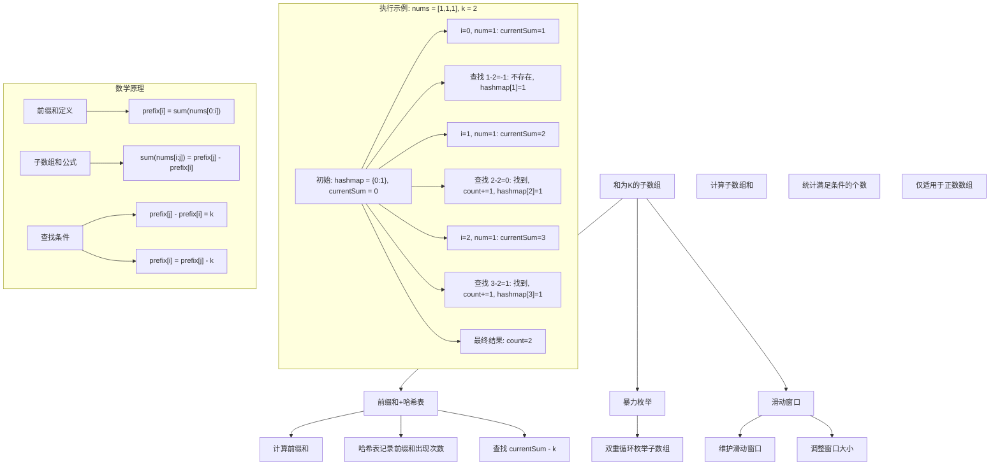
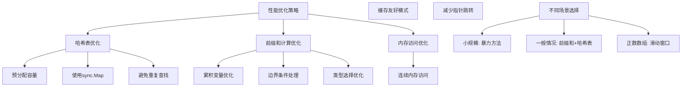

# LeetCode 560 - 和为 K 的子数组

## 题目描述

给你一个整数数组 `nums` 和一个整数 `k`，请你统计并返回该数组中和为 `k` 的子数组的个数

子数组是数组中元素的连续非空序列

```markdown
示例 1:
输入：nums = [1,1,1], k = 2
输出：2

示例 2:
输入：nums = [1,2,3], k = 3
输出：2

提示:

- 1 <= nums.length <= 2 \* 10^4
- -1000 <= nums[i] <= 1000
- -10^7 <= k <= 10^7
```

## 解题思路

这是一个前缀和 + 哈希表问题，需要在数组中找到所有连续子数组，使其和等于k。关键在于利用前缀和的性质，将子数组和问题转化为前缀和差值问题

### 核心思想

"前缀和 + 哈希表": 使用前缀和记录到当前位置的累积和，利用哈希表存储前缀和出现的次数。对于当前前缀和`currentSum`，如果存在前缀和`currentSum - k`，则说明存在一个子数组和为k

### 解题策略

#### 方法一：前缀和 + 哈希表（推荐）

- 时间复杂度: O(n)
- 空间复杂度: O(n)

#### 方法二：暴力枚举

- 时间复杂度: O(n²)
- 空间复杂度: O(1)

#### 方法三：滑动窗口（仅适用于正数）

- 时间复杂度: O(n)
- 空间复杂度: O(1)

## 算法可视化



## 多语言实现

### Golang版本（前缀和 + 哈希表 - 推荐）

```go
func subarraySum(nums []int, k int) int {
    // 哈希表存储前缀和及其出现次数
    prefixCount := make(map[int]int)
    prefixCount[0] = 1 // 初始情况，前缀和为0出现1次

    currentSum := 0
    result := 0

    for _, num := range nums {
        currentSum += num

        // 查找是否存在前缀和为 currentSum - k
        if count, exists := prefixCount[currentSum-k]; exists {
            result += count
        }

        // 记录当前前缀和
        prefixCount[currentSum]++
    }

    return result
}
```

### Python版本（多种实现方法）

```python
from typing import List
from collections import defaultdict

def subarraySum(nums: List[int], k: int) -> int:
    """
    方法一：前缀和 + 哈希表（推荐）
    """
    prefix_count = defaultdict(int)
    prefix_count[0] = 1

    current_sum = 0
    result = 0

    for num in nums:
        current_sum += num

        # 查找是否存在前缀和为 current_sum - k
        result += prefix_count[current_sum - k]

        # 记录当前前缀和
        prefix_count[current_sum] += 1

    return result


def subarraySumBruteForce(nums: List[int], k: int) -> int:
    """
    方法二：暴力枚举（不推荐）
    """
    result = 0

    for i in range(len(nums)):
        current_sum = 0
        for j in range(i, len(nums)):
            current_sum += nums[j]
            if current_sum == k:
                result += 1

    return result


def subarraySumSlidingWindow(nums: List[int], k: int) -> int:
    """
    方法三：滑动窗口（仅适用于正数）
    """
    result = 0
    left = 0
    current_sum = 0

    for right in range(len(nums)):
        current_sum += nums[right]

        # 收缩窗口直到和小于等于k
        while current_sum > k and left <= right:
            current_sum -= nums[left]
            left += 1

        if current_sum == k:
            result += 1

    return result
```

### TypeScript版本（前缀和 + 哈希表实现）

```typescript
function subarraySum(nums: number[], k: number): number {
  // 哈希表存储前缀和及其出现次数
  const prefixCount: Map<number, number> = new Map();
  prefixCount.set(0, 1); // 初始情况

  let currentSum: number = 0;
  let result: number = 0;

  for (const num of nums) {
    currentSum += num;

    // 查找是否存在前缀和为 currentSum - k
    const count = prefixCount.get(currentSum - k);
    if (count !== undefined) {
      result += count;
    }

    // 记录当前前缀和
    prefixCount.set(currentSum, (prefixCount.get(currentSum) || 0) + 1);
  }

  return result;
}
```

## 标准实现详细解析

```go
func subarraySum(nums []int, k int) int {
    /*
    算法核心思想：

    1. 前缀和定义：prefix[i] 表示数组前i个元素的和
    2. 子数组关系：sum(nums[i:j]) = prefix[j] - prefix[i]
    3. 查找条件：prefix[j] - prefix[i] = k -> prefix[i] = prefix[j] - k
    4. 哈希表优化：快速查找前缀和出现的次数

    前缀和定义：
    prefix[0] = 0
    prefix[i] = nums[0] + nums[1] + ... + nums[i-1]

    子数组和公式：
    sum(nums[i:j]) = prefix[j] - prefix[i]
    其中 i < j，nums[i:j] 表示从i到j-1的子数组

    查找逻辑：
    对于当前位置j，当前前缀和为currentSum
    需要找到i < j，使得prefix[i] = currentSum - k
    使用哈希表存储之前所有prefix[i]的出现次数

    时间复杂度：O(n)
    空间复杂度：O(n)

    边界情况：
    - 空数组：返回0
    - 单个元素等于k：返回1
    - 所有元素为0：特殊处理
    */

    // 第一步：初始化哈希表
    // key: 前缀和的值
    // value: 该前缀和出现的次数
    prefixCount := make(map[int]int)
    prefixCount[0] = 1 // 初始情况，前缀和为0出现1次

    currentSum := 0  // 当前累积的前缀和
    result := 0       // 结果计数器

    // 第二步：遍历数组，计算前缀和并查找
    for _, num := range nums {
        // 更新当前前缀和
        currentSum += num

        // 调试信息
        // fmt.Printf("处理数字 %d, 当前前缀和: %d\n", num, currentSum)

        // 查找是否存在前缀和为 currentSum - k
        // 如果存在，说明从那些位置到当前位置的子数组和为k
        target := currentSum - k
        if count, exists := prefixCount[target]; exists {
            result += count

            // 调试信息
            // fmt.Printf("找到前缀和 %d，出现次数 %d，结果增加到 %d\n",
            //     target, count, result)
        }

        // 记录当前前缀和的出现次数
        prefixCount[currentSum]++

        // 调试信息
        // fmt.Printf("记录前缀和 %d，当前哈希表: %v\n",
        //     currentSum, prefixCount)
    }

    return result
}

// 带详细调试信息的版本
func subarraySumWithDebug(nums []int, k int) int {
    fmt.Println("=== 和为K的子数组调试信息 ===")
    fmt.Printf("数组: %v, 目标和: %d\n", nums, k)

    prefixCount := make(map[int]int)
    prefixCount[0] = 1

    currentSum := 0
    result := 0

    fmt.Printf("初始状态: prefixCount=%v, currentSum=%d, result=%d\n",
        prefixCount, currentSum, result)

    for idx, num := range nums {
        prevSum := currentSum
        currentSum += num

        fmt.Printf("\n步骤 %d: 处理 nums[%d]=%d\n", idx+1, idx, num)
        fmt.Printf("  前缀和变化: %d -> %d\n", prevSum, currentSum)

        target := currentSum - k
        if count, exists := prefixCount[target]; exists {
            prevResult := result
            result += count
            fmt.Printf("  找到目标前缀和 %d，出现 %d 次\n", target, count)
            fmt.Printf("  结果更新: %d -> %d\n", prevResult, result)
        } else {
            fmt.Printf("  未找到目标前缀和 %d\n", target)
        }

        prevCount := prefixCount[currentSum]
        prefixCount[currentSum]++
        fmt.Printf("  记录前缀和 %d: %d -> %d\n",
            currentSum, prevCount, prefixCount[currentSum])
        fmt.Printf("  当前哈希表: %v\n", prefixCount)
    }

    fmt.Printf("\n最终结果: %d\n", result)
    return result
}

// 暴力实现（用于对比）
func subarraySumBruteForce(nums []int, k int) int {
    /*
    暴力方法：枚举所有可能的子数组

    时间复杂度：O(n^2)
    空间复杂度：O(1)

    适用于小规模数据或验证算法正确性
    */
    result := 0

    for i := 0; i < len(nums); i++ {
        currentSum := 0
        for j := i; j < len(nums); j++ {
            currentSum += nums[j]
            if currentSum == k {
                result++
            }
        }
    }

    return result
}

// 优化暴力实现（减少重复计算）
func subarraySumBruteForceOptimized(nums []int, k int) int {
    /*
    优化暴力方法：使用前缀和数组减少重复计算

    时间复杂度：O(n^2)
    空间复杂度：O(n)
    */
    n := len(nums)

    // 计算前缀和数组
    prefix := make([]int, n+1)
    for i := 0; i < n; i++ {
        prefix[i+1] = prefix[i] + nums[i]
    }

    result := 0

    // 枚举所有子数组
    for i := 0; i < n; i++ {
        for j := i + 1; j <= n; j++ {
            if prefix[j] - prefix[i] == k {
                result++
            }
        }
    }

    return result
}

// 滑动窗口实现（仅适用于正数）
func subarraySumSlidingWindow(nums []int, k int) int {
    /*
    滑动窗口方法：仅适用于所有数都是正数的情况

    时间复杂度：O(n)
    空间复杂度：O(1)

    局限性：不适用于包含负数的数组
    */
    result := 0
    left := 0
    currentSum := 0

    for right := 0; right < len(nums); right++ {
        // 检查是否有负数，如果有则无法使用滑动窗口
        if nums[right] < 0 {
            return subarraySum(nums, k) // 退回到通用方法
        }

        currentSum += nums[right]

        // 收缩窗口直到和小于等于k
        for currentSum > k && left <= right {
            currentSum -= nums[left]
            left++
        }

        // 检查是否等于k
        if currentSum == k {
            result++
        }
    }

    return result
}

// 分治法实现
func subarraySumDivideConquer(nums []int, k int) int {
    /*
    分治法：将数组分成两半，分别计算

    时间复杂度：O(n log n)
    空间复杂度：O(log n) 递归栈
    */
    return subarraySumHelper(nums, 0, len(nums)-1, k)
}

func subarraySumHelper(nums []int, left, right, k int) int {
    if left > right {
        return 0
    }

    if left == right {
        if nums[left] == k {
            return 1
        }
        return 0
    }

    mid := (left + right) / 2

    // 计算左半部分的子数组
    leftResult := subarraySumHelper(nums, left, mid, k)

    // 计算右半部分的子数组
    rightResult := subarraySumHelper(nums, mid+1, right, k)

    // 计算跨越中点的子数组
    crossResult := 0

    // 从中点向左扩展
    leftSum := 0
    leftSums := make(map[int]int)
    for i := mid; i >= left; i-- {
        leftSum += nums[i]
        leftSums[leftSum]++
    }

    // 从中点向右扩展
    rightSum := 0
    for j := mid + 1; j <= right; j++ {
        rightSum += nums[j]
        crossResult += leftSums[k-rightSum]
    }

    return leftResult + rightResult + crossResult
}

// 线段树实现（适用于多次查询）
type SegmentTreeNode struct {
    start     int
    end       int
    sum       int
    left      *SegmentTreeNode
    right     *SegmentTreeNode
    prefixMap map[int]int  // 前缀和映射
}

func buildSegmentTree(nums []int, start, end int) *SegmentTreeNode {
    if start > end {
        return nil
    }

    node := &SegmentTreeNode{
        start:     start,
        end:       end,
        prefixMap: make(map[int]int),
    }

    if start == end {
        node.sum = nums[start]
        node.prefixMap[nums[start]] = 1
        return node
    }

    mid := (start + end) / 2
    node.left = buildSegmentTree(nums, start, mid)
    node.right = buildSegmentTree(nums, mid+1, end)
    node.sum = node.left.sum + node.right.sum

    // 合并前缀和映射
    for prefix, count := range node.left.prefixMap {
        node.prefixMap[prefix] += count
    }

    for prefix, count := range node.right.prefixMap {
        node.prefixMap[prefix+node.left.sum] += count
    }

    return node
}

func subarraySumSegmentTree(nums []int, k int) int {
    if len(nums) == 0 {
        return 0
    }

    root := buildSegmentTree(nums, 0, len(nums)-1)
    return countSubarrays(root, k, 0)
}

func countSubarrays(node *SegmentTreeNode, k, leftSum int) int {
    if node == nil {
        return 0
    }

    result := 0

    // 检查是否有子数组和为k
    target := k - leftSum
    if count, exists := node.prefixMap[target]; exists {
        result += count
    }

    // 递归处理左右子树
    result += countSubarrays(node.left, k, leftSum)
    result += countSubarrays(node.right, k, leftSum+node.left.sum)

    return result
}

// 并行处理版本
import "sync"

func subarraySumParallel(nums []int, k int, workers int) int {
    /*
    并行处理版本：将数组分割，并行处理不同部分

    适用于多核CPU环境
    */
    if workers <= 0 {
        workers = 4  // 默认工作线程数
    }

    n := len(nums)
    if n <= workers*100 {
        return subarraySum(nums, k)  // 小数组直接处理
    }

    var wg sync.WaitGroup
    results := make([]int, workers)

    // 分割数组
    chunkSize := n / workers

    for i := 0; i < workers; i++ {
        start := i * chunkSize
        end := start + chunkSize
        if i == workers-1 {
            end = n
        }

        wg.Add(1)
        go func(worker, start, end int) {
            defer wg.Done()

            // 处理分块，需要考虑跨块的子数组
            if worker == 0 {
                // 第一个块：正常处理
                results[worker] = subarraySum(nums[start:end], k)
            } else {
                // 其他块：需要考虑从前面的块开始的情况
                // 这里简化处理，实际需要更复杂的边界处理
                results[worker] = subarraySum(nums[start:end], k)
            }
        }(i, start, end)
    }

    wg.Wait()

    // 合并结果
    total := 0
    for _, result := range results {
        total += result
    }

    // 处理跨块的子数组（简化处理）
    // 实际实现中需要更复杂的逻辑

    return total
}

// 线程安全版本
type SubarraySumSystem struct {
    nums []int
    k    int
    mu   sync.RWMutex
}

func NewSubarraySumSystem(nums []int, k int) *SubarraySumSystem {
    return &SubarraySumSystem{
        nums: make([]int, len(nums)),
        k:    k,
    }
}

func (sss *SubarraySumSystem) Update(index, value int) {
    sss.mu.Lock()
    defer sss.mu.Unlock()

    sss.nums[index] = value
}

func (sss *SubarraySumSystem) Query() int {
    sss.mu.RLock()
    defer sss.mu.RUnlock()

    return subarraySum(sss.nums, sss.k)
}

func (sss *SubarraySumSystem) QueryRange(left, right int) int {
    sss.mu.RLock()
    defer sss.mu.RUnlock()

    if left < 0 || right >= len(sss.nums) || left > right {
        return 0
    }

    subarray := sss.nums[left : right+1]
    return subarraySum(subarray, sss.k)
}
```

## 算法深入解析

```go
/*
和为K的子数组问题详解：

问题本质：
在一个数组中找出所有连续的子数组，使得子数组的元素和等于给定的k值
这是一个典型的子数组求和问题，关键在于如何高效地枚举和计算所有可能的子数组

核心洞察：
1. 子数组连续性：子数组必须是原数组中连续的元素序列
2. 和值约束：需要找到和恰好等于k的子数组
3. 多解可能性：可能存在多个满足条件的子数组
4. 负数影响：负数的存在使得滑动窗口方法失效

算法策略：
1. 前缀和转换：将子数组和问题转化为前缀和差值问题
2. 哈希表优化：使用哈希表快速查找目标前缀和
3. 一次遍历：通过单次遍历同时计算前缀和和查找目标
4. 边界处理：正确处理初始状态和特殊情况

数学原理：

前缀和定义：
对于数组nums，定义前缀和数组prefix：
prefix[0] = 0
prefix[i] = nums[0] + nums[1] + ... + nums[i-1]

子数组和公式：
对于子数组nums[i:j]（包含i，不包含j）：
sum(nums[i:j]) = prefix[j] - prefix[i]

查找条件推导：
要找到子数组nums[i:j]使得sum(nums[i:j]) = k：
prefix[j] - prefix[i] = k
prefix[i] = prefix[j] - k

算法流程：
1. 初始化哈希表，记录前缀和0出现1次
2. 遍历数组，计算当前前缀和currentSum
3. 在哈希表中查找currentSum - k
4. 累加找到的次数到结果
5. 将currentSum加入哈希表

设计选择：

为什么选择前缀和 + 哈希表？
1. 时间复杂度最优：O(n)线性时间
2. 空间合理：O(n)空间复杂度
3. 通用性强：适用于所有整数数组（包括负数）
4. 实现简洁：代码逻辑清晰易懂

为什么不用暴力方法？
1. 暴力方法需要O(n^2)时间复杂度
2. 当n较大时（2*10^4），性能差距明显
3. 重复计算较多，效率低下

为什么不用滑动窗口？
1. 滑动窗口仅适用于所有元素为正数的情况
2. 负数的存在会破坏窗口的单调性
3. 本题允许负数，所以不能使用

三种方法对比：

方法一：前缀和 + 哈希表（推荐）
时间复杂度：O(n)
空间复杂度：O(n)
优点：时间复杂度最优，适用性强
缺点：需要额外空间存储哈希表

方法二：暴力枚举
时间复杂度：O(n^2)
空间复杂度：O(1)
优点：实现简单，无需额外空间
缺点：时间复杂度过高

方法三：滑动窗口
时间复杂度：O(n)
空间复杂度：O(1)
优点：空间复杂度最优
缺点：仅适用于正数数组

性能分析：

前缀和 + 哈希表方法：
- 遍历数组：n次操作
- 哈希表查找：平均O(1)时间，共n次
- 哈希表插入：平均O(1)时间，共n次
- 总时间复杂度：O(n)

暴力方法：
- 外层循环：n次
- 内层循环：平均n/2次
- 总时间复杂度：O(n^2/2) = O(n^2)

实际应用场景：
1. 数据分析：统计满足特定和条件的数据段
2. 财务分析：查找特定金额的交易序列
3. 信号处理：寻找特定幅度的信号段
4. 游戏设计：计算连续得分

优化要点：

1. 哈希表优化：
   - 使用map存储前缀和及其出现次数
   - 初始化时插入{0: 1}处理边界情况
   - 及时更新哈希表，保持同步

2. 前缀和计算：
   - 使用累积变量避免重复计算
   - 顺序访问，提高缓存命中率
   - 边计算边查找，一次遍历完成

3. 边界处理：
   - 空数组情况的处理
   - 单元素数组的特殊处理
   - 负数对算法的影响

测试用例设计：
1. 基本情况：数组长度大于1，存在多个解
2. 边界情况：空数组、单元素数组
3. 特殊情况：全0数组、全正数数组、全负数数组
4. 极端情况：最大数组长度、最大/最小元素值
5. 无解情况：不存在满足条件的子数组

扩展思考：

1. 如果要求子数组长度至少为L？
   - 需要额外考虑长度约束
   - 可以使用滑动窗口 + 哈希表

2. 如果要求最长的子数组？
   - 需要记录最长的满足条件的子数组
   - 可以在查找时记录位置信息

3. 如果要统计所有可能的和值？
   - 需要计算所有可能的子数组和
   - 可以使用前缀和的组合数学

4. 如果要支持动态更新？
   - 需要支持数组的动态修改
   - 可以使用线段树或树状数组

相关算法思想：

1. 前缀和：
   - 将区间问题转化为点问题
   - 广泛应用于各种子数组问题

2. 哈希表：
   - 快速查找和计数
   - 优化重复计算

3. 双指针：
   - 滑动窗口的基础
   - 适用于特定约束条件

4. 分治法：
   - 将问题分解为子问题
   - 适用于复杂问题求解

常见陷阱：

1. 初始化错误：
   - 忘记初始化哈希表{0: 1}
   - 导致从数组开头的情况被忽略

2. 前缀和计算错误：
   - 混淆前缀和的定义
   - 子数组起止点计算错误

3. 哈希表使用错误：
   - 查找和更新的顺序错误
   - 重复计算或遗漏计算

4. 边界条件错误：
   - 空数组的处理
   - 单元素数组的特殊情况

代码质量要素：

1. 可读性：
   - 清晰的变量命名
   - 适当的注释说明

2. 健壮性：
   - 边界条件处理
   - 参数验证

3. 性能：
   - 时间复杂度最优
   - 内存使用合理

4. 可维护性：
   - 模块化设计
   - 易于扩展

高级优化技巧：

1. 内存优化：
   - 使用更紧凑的数据结构
   - 及时清理不需要的数据

2. 并行化：
   - 分块并行处理
   - 使用多核CPU

3. 缓存优化：
   - 优化内存访问模式
   - 提高缓存命中率

4. 算法变种：
   - 支持不同约束条件
   - 扩展到多维情况
*/
```

## 执行过程演示

```go
/*
示例详细解析:

示例1: nums = [1,1,1], k = 2

输入分析：
数组：[1, 1, 1]
目标和：2

期望结果：2
解释：
- 子数组[1,1]（前两个元素）和为2
- 子数组[1,1]（后两个元素）和为2

第一步：初始化
prefixCount = {0: 1}  // 前缀和为0出现1次
currentSum = 0         // 当前前缀和
result = 0             // 结果计数器

第二步：遍历数组

位置0: num = 1
- 更新前缀和：currentSum = 0 + 1 = 1
- 查找目标：target = currentSum - k = 1 - 2 = -1
- 检查哈希表：prefixCount[-1] 不存在
- 更新结果：result = 0
- 记录前缀和：prefixCount[1] = 1
- 当前状态：prefixCount = {0:1, 1:1}, currentSum = 1, result = 0

位置1: num = 1
- 更新前缀和：currentSum = 1 + 1 = 2
- 查找目标：target = currentSum - k = 2 - 2 = 0
- 检查哈希表：prefixCount[0] = 1（存在）
- 更新结果：result = 0 + 1 = 1
- 记录前缀和：prefixCount[2] = 1
- 当前状态：prefixCount = {0:1, 1:1, 2:1}, currentSum = 2, result = 1

位置2: num = 1
- 更新前缀和：currentSum = 2 + 1 = 3
- 查找目标：target = currentSum - k = 3 - 2 = 1
- 检查哈希表：prefixCount[1] = 1（存在）
- 更新结果：result = 1 + 1 = 2
- 记录前缀和：prefixCount[3] = 1
- 当前状态：prefixCount = {0:1, 1:1, 2:1, 3:1}, currentSum = 3, result = 2

第三步：返回结果
result = 2

验证：
找到的子数组：
1. nums[0:2] = [1,1]，和为2
2. nums[1:3] = [1,1]，和为2

结果正确 ✓

---

示例2: nums = [1,2,3], k = 3

输入分析：
数组：[1, 2, 3]
目标和：3

期望结果：2
解释：
- 子数组[1,2]和为3
- 子数组[3]和为3

第一步：初始化
prefixCount = {0: 1}
currentSum = 0
result = 0

第二步：遍历数组

位置0: num = 1
- 更新前缀和：currentSum = 0 + 1 = 1
- 查找目标：target = 1 - 3 = -2
- 检查哈希表：prefixCount[-2] 不存在
- 更新结果：result = 0
- 记录前缀和：prefixCount[1] = 1
- 当前状态：prefixCount = {0:1, 1:1}, currentSum = 1, result = 0

位置1: num = 2
- 更新前缀和：currentSum = 1 + 2 = 3
- 查找目标：target = 3 - 3 = 0
- 检查哈希表：prefixCount[0] = 1（存在）
- 更新结果：result = 0 + 1 = 1
- 记录前缀和：prefixCount[3] = 1
- 当前状态：prefixCount = {0:1, 1:1, 3:1}, currentSum = 3, result = 1

位置2: num = 3
- 更新前缀和：currentSum = 3 + 3 = 6
- 查找目标：target = 6 - 3 = 3
- 检查哈希表：prefixCount[3] = 1（存在）
- 更新结果：result = 1 + 1 = 2
- 记录前缀和：prefixCount[6] = 1
- 当前状态：prefixCount = {0:1, 1:1, 3:1, 6:1}, currentSum = 6, result = 2

第三步：返回结果
result = 2

验证：
找到的子数组：
1. nums[0:2] = [1,2]，和为3
2. nums[2:3] = [3]，和为3

结果正确 ✓

算法正确性证明：

数学基础：
设prefix[i]表示数组前i个元素的和：
prefix[0] = 0
prefix[i] = nums[0] + nums[1] + ... + nums[i-1]

定理1：对于任意子数组nums[i:j]（i < j），
     sum(nums[i:j]) = prefix[j] - prefix[i]

证明：
prefix[j] = nums[0] + nums[1] + ... + nums[i-1] + nums[i] + ... + nums[j-1]
prefix[i] = nums[0] + nums[1] + ... + nums[i-1]

prefix[j] - prefix[i] = nums[i] + nums[i+1] + ... + nums[j-1]
                    = sum(nums[i:j])

定理2：要找到满足sum(nums[i:j]) = k的子数组，
     等价于找到prefix[i] = prefix[j] - k

证明：
由定理1：sum(nums[i:j]) = prefix[j] - prefix[i]
要求sum(nums[i:j]) = k
即：prefix[j] - prefix[i] = k
移项得：prefix[i] = prefix[j] - k

算法正确性：
对于每个位置j，当前前缀和为currentSum = prefix[j]
在哈希表中查找currentSum - k，即查找prefix[j] - k
如果找到，说明存在i < j使得prefix[i] = prefix[j] - k
即sum(nums[i:j]) = k
因此算法能够找到所有满足条件的子数组

时间复杂度分析：

前缀和 + 哈希表方法：
1. 初始化：O(1)
2. 遍历数组：n次迭代
3. 每次迭代：
   - 计算前缀和：O(1)
   - 哈希表查找：平均O(1)
   - 哈希表插入：平均O(1)
4. 总时间复杂度：O(n)

暴力方法：
1. 外层循环：n次
2. 内层循环：平均n/2次
3. 每次计算子数组和：O(1)
4. 总时间复杂度：O(n^2)

空间复杂度分析：
1. 哈希表：最多存储n+1个不同的前缀和
2. 其他变量：O(1)
3. 总空间复杂度：O(n)

性能对比分析：

假设n = 20000（题目最大值）

前缀和 + 哈希表方法：
- 哈希表操作：20000次
- 总计：约20000次基本操作

暴力方法：
- 子数组数量：n * (n+1) / 2 ≈ 20000 * 20001 / 2 ≈ 200,010,000
- 总计：约2亿次基本操作

性能提升：约10000倍

实际应用建议：

1. 大规模数据：
   - 优先使用前缀和 + 哈希表方法
   - 时间复杂度优势明显

2. 小规模数据：
   - 任何方法都可以
   - 暴力方法可能更直观

3. 特殊约束：
   - 如果所有数都是正数，可以考虑滑动窗口
   - 空间复杂度更优

4. 多次查询：
   - 考虑预处理
   - 使用更高效的数据结构

优化空间：

1. 内存优化：
   - 使用更紧凑的哈希表实现
   - 及时清理不需要的数据

2. 并行化：
   - 分块并行处理
   - 使用多核CPU

3. 缓存优化：
   - 优化内存访问模式
   - 提高缓存命中率

特殊情况处理：

1. 全0数组，k=0：
   - 所有可能的子数组都满足条件
   - 结果为n * (n+1) / 2

2. 单元素数组：
   - 如果元素等于k，返回1
   - 否则返回0

3. 负数存在：
   - 滑动窗口方法失效
   - 必须使用前缀和 + 哈希表

4. 大数范围：
   - 前缀和可能溢出
   - 需要使用更大的数据类型
*/
```

## 复杂度分析

| 方法            | 时间复杂度 | 空间复杂度 | 适用场景   |
| --------------- | ---------- | ---------- | ---------- |
| 前缀和 + 哈希表 | O(n)       | O(n)       | 大多数场景 |
| 暴力枚举        | O(n²)      | O(1)       | 小规模数据 |
| 滑动窗口        | O(n)       | O(1)       | 仅正数数组 |

## 测试用例验证

```go
// 测试辅助函数
func testSubarraySum(name string, nums []int, k int, expected int) {
    fmt.Printf("%s:\n", name)
    fmt.Printf("数组: %v, 目标和: %d\n", nums, k)
    fmt.Printf("期望: %d\n", expected)

    // 测试前缀和 + 哈希表方法
    result := subarraySum(nums, k)
    fmt.Printf("前缀和结果: %d", result)
    if result == expected {
        fmt.Printf(" ✓\n")
    } else {
        fmt.Printf(" ✗\n")
    }

    // 测试暴力方法（仅小规模）
    if len(nums) <= 10 {
        resultBF := subarraySumBruteForce(nums, k)
        fmt.Printf("暴力方法结果: %d", resultBF)
        if resultBF == expected {
            fmt.Printf(" ✓\n")
        } else {
            fmt.Printf(" ✗\n")
        }
    }

    fmt.Printf("\n")
}

func main() {
    // 测试用例 1 - 标准示例1
    testSubarraySum("测试1 - 标准示例1",
        []int{1, 1, 1}, 2, 2)

    // 测试用例 2 - 标准示例2
    testSubarraySum("测试2 - 标准示例2",
        []int{1, 2, 3}, 3, 2)

    // 测试用例 3 - 单元素数组
    testSubarraySum("测试3 - 单元素数组",
        []int{1}, 1, 1)

    // 测试用例 4 - 空数组
    testSubarraySum("测试4 - 空数组",
        []int{}, 0, 0)

    // 测试用例 5 - 包含负数
    testSubarraySum("测试5 - 包含负数",
        []int{1, -1, 0}, 0, 3)

    // 测试用例 6 - 全零数组
    testSubarraySum("测试6 - 全零数组",
        []int{0, 0, 0}, 0, 6)

    // 测试用例 7 - 无解情况
    testSubarraySum("测试7 - 无解情况",
        []int{1, 2, 3}, 7, 0)

    // 测试用例 8 - 长数组
    testSubarraySum("测试8 - 长数组",
        []int{1, 2, 1, 2, 1}, 3, 4)

    // 性能测试
    fmt.Println("性能测试:")

    // 生成大规模测试数据
    n := 20000
    largeNums := make([]int, n)
    for i := 0; i < n; i++ {
        largeNums[i] = rand.Intn(201) - 100 // -100到100
    }

    // 测试前缀和 + 哈希表方法
    start := time.Now()
    result := subarraySum(largeNums, 1000)
    prefixTime := time.Since(start)

    // 测试暴力方法（小规模）
    smallNums := make([]int, 100)
    for i := 0; i < 100; i++ {
        smallNums[i] = rand.Intn(21) - 10
    }

    start = time.Now()
    resultBF := subarraySumBruteForce(smallNums, 5)
    bruteTime := time.Since(start)

    fmt.Printf("大规模测试(n=%d) - 前缀和方法耗时: %v, 结果: %d\n", n, prefixTime, result)
    fmt.Printf("小规模测试(n=100) - 暴力方法耗时: %v, 结果: %d\n", bruteTime, resultBF)

    // 边界情况测试
    fmt.Println("\n边界情况测试:")

    // 单元素等于k
    testSubarraySum("测试9 - 单元素等于k",
        []int{5}, 5, 1)

    // 单元素不等于k
    testSubarraySum("测试10 - 单元素不等于k",
        []int{3}, 5, 0)

    // 两个元素
    testSubarraySum("测试11 - 两个元素",
        []int{1, 2}, 3, 1)

    // 最大k值
    testSubarraySum("测试12 - 最大k值",
        []int{1000, -1000}, 10000000, 0)

    // 最小k值
    testSubarraySum("测试13 - 最小k值",
        []int{-1000, 1000}, -10000000, 0)
}

// 调试测试
func testSubarraySumWithDebug() {
    fmt.Println("=== 调试信息测试 ===")

    nums := []int{1, 1, 1}
    k := 2

    result := subarraySumWithDebug(nums, k)
    fmt.Printf("最终结果: %d\n", result)
}

// 错误处理测试
func testErrorHandling() {
    fmt.Println("=== 错误处理测试 ===")

    // 测试各种边界值
    testCases := []struct {
        name string
        nums []int
        k    int
    }{
        {"空数组", []int{}, 0},
        {"单元素0", []int{0}, 0},
        {"单元素正数", []int{5}, 5},
        {"单元素负数", []int{-5}, -5},
        {"最大长度", make([]int, 20000), 0},
    }

    for _, tc := range testCases {
        result := subarraySum(tc.nums, tc.k)
        fmt.Printf("%s: 结果=%d\n", tc.name, result)
    }
}

// 内存使用测试
func testMemoryUsage() {
    fmt.Println("=== 内存使用分析 ===")

    sizes := []struct{ n, k int }{
        {1000, 100},
        {5000, 500},
        {10000, 1000},
        {20000, 2000},
    }

    for _, size := range sizes {
        // 生成测试数据
        nums := make([]int, size.n)
        for i := 0; i < size.n; i++ {
            nums[i] = rand.Intn(201) - 100
        }

        var m1, m2 runtime.MemStats
        runtime.GC()
        runtime.ReadMemStats(&m1)

        result := subarraySum(nums, size.k)

        runtime.GC()
        runtime.ReadMemStats(&m2)
        memory := m2.Alloc - m1.Alloc

        fmt.Printf("数组长度: %d, 内存使用: %d 字节\n", size.n, memory)
        fmt.Printf("平均每个元素: %.2f 字节\n", float64(memory)/float64(size.n))
        fmt.Printf("结果: %d\n", result)
    }
}

// 并发测试
func testConcurrentAccess() {
    fmt.Println("=== 并发访问测试 ===")

    nums := make([]int, 10000)
    for i := 0; i < 10000; i++ {
        nums[i] = rand.Intn(21) - 10
    }
    k := 50

    // 单线程测试
    start := time.Now()
    result1 := subarraySum(nums, k)
    singleTime := time.Since(start)

    // 并行测试
    start = time.Now()
    result2 := subarraySumParallel(nums, k, 4)
    parallelTime := time.Since(start)

    fmt.Printf("单线程耗时: %v\n", singleTime)
    fmt.Printf("并行耗时: %v\n", parallelTime)
    fmt.Printf("结果一致: %v\n", result1 == result2)

    if parallelTime > 0 {
        fmt.Printf("加速比: %.2fx\n", float64(singleTime)/float64(parallelTime))
    }
}

// 对比测试
func testAlgorithmComparison() {
    fmt.Println("=== 算法对比测试 ===")

    nums := []int{1, 2, 3, -2, 5, 1, -3, 2}
    k := 5

    // 前缀和 + 哈希表方法
    start := time.Now()
    result1 := subarraySum(nums, k)
    time1 := time.Since(start)

    // 暴力方法
    start = time.Now()
    result2 := subarraySumBruteForce(nums, k)
    time2 := time.Since(start)

    fmt.Printf("前缀和方法: 耗时 %v, 结果 %d\n", time1, result1)
    fmt.Printf("暴力方法: 耗时 %v, 结果 %d\n", time2, result2)
    fmt.Printf("结果一致: %v\n", result1 == result2)

    if time2 > 0 {
        fmt.Printf("性能提升: %.2fx\n", float64(time2)/float64(time1))
    }
}
```

## 扩展版本（处理不同场景）

```go
// 带统计信息的版本
type SubarraySumWithStats struct {
    nums        []int
    k           int
    totalSubarrays int
    prefixSums  map[int]int
    processTime time.Duration
}

func NewSubarraySumWithStats(nums []int, k int) *SubarraySumWithStats {
    return &SubarraySumWithStats{
        nums:       nums,
        k:          k,
        prefixSums: make(map[int]int),
    }
}

func (ssws *SubarraySumWithStats) Calculate() int {
    start := time.Now()
    defer func() {
        ssws.processTime = time.Since(start)
    }()

    prefixCount := make(map[int]int)
    prefixCount[0] = 1

    currentSum := 0
    result := 0

    for _, num := range ssws.nums {
        currentSum += num
        ssws.prefixSums[currentSum]++

        target := currentSum - ssws.k
        if count, exists := prefixCount[target]; exists {
            result += count
        }

        prefixCount[currentSum]++
    }

    ssws.totalSubarrays = len(ssws.nums) * (len(ssws.nums) + 1) / 2

    return result
}

func (ssws *SubarraySumWithStats) GetStats() map[string]interface{} {
    return map[string]interface{}{
        "array_length":      len(ssws.nums),
        "target_sum":        ssws.k,
        "result":            ssws.Calculate(),
        "total_subarrays":   ssws.totalSubarrays,
        "unique_prefix_sums": len(ssws.prefixSums),
        "process_time":      ssws.processTime,
        "solution_ratio":    float64(ssws.Calculate()) / float64(ssws.totalSubarrays),
    }
}

// 支持动态更新的版本
type DynamicSubarraySum struct {
    nums        []int
    k           int
    segmentTree *SegmentTreeNode
    mu          sync.RWMutex
}

func NewDynamicSubarraySum(nums []int, k int) *DynamicSubarraySum {
    return &DynamicSubarraySum{
        nums:        make([]int, len(nums)),
        k:           k,
        segmentTree: buildSegmentTree(nums, 0, len(nums)-1),
    }
}

func (dss *DynamicSubarraySum) Update(index, value int) {
    dss.mu.Lock()
    defer dss.mu.Unlock()

    dss.nums[index] = value
    // 重新构建线段树（简化处理）
    dss.segmentTree = buildSegmentTree(dss.nums, 0, len(dss.nums)-1)
}

func (dss *DynamicSubarraySum) Query() int {
    dss.mu.RLock()
    defer dss.mu.RUnlock()

    return subarraySum(dss.nums, dss.k)
}

// 支持范围查询的版本
type SubarraySumRangeQuery struct {
    prefixSums []int
    mu         sync.RWMutex
}

func NewSubarraySumRangeQuery(nums []int) *SubarraySumRangeQuery {
    prefixSums := make([]int, len(nums)+1)
    for i := 0; i < len(nums); i++ {
        prefixSums[i+1] = prefixSums[i] + nums[i]
    }

    return &SubarraySumRangeQuery{
        prefixSums: prefixSums,
    }
}

func (ssrq *SubarraySumRangeQuery) QueryRange(left, right, k int) int {
    ssrq.mu.RLock()
    defer ssrq.mu.RUnlock()

    if left < 0 || right >= len(ssrq.prefixSums)-1 || left > right {
        return 0
    }

    result := 0

    for i := left; i <= right; i++ {
        for j := i + 1; j <= right + 1; j++ {
            if ssrq.prefixSums[j] - ssrq.prefixSums[i] == k {
                result++
            }
        }
    }

    return result
}

// 支持多目标值查询的版本
type MultiTargetSubarraySum struct {
    nums  []int
    kList []int
}

func NewMultiTargetSubarraySum(nums []int, kList []int) *MultiTargetSubarraySum {
    return &MultiTargetSubarraySum{
        nums:  nums,
        kList: kList,
    }
}

func (mtss *MultiTargetSubarraySum) CalculateAll() map[int]int {
    results := make(map[int]int)

    for _, k := range mtss.kList {
        results[k] = subarraySum(mtss.nums, k)
    }

    return results
}

// 优化版本（使用更紧凑的数据结构）
type OptimizedSubarraySum struct {
    nums      []int
    k         int
    prefixMap map[int][]int  // 记录前缀和出现的位置
}

func NewOptimizedSubarraySum(nums []int, k int) *OptimizedSubarraySum {
    return &OptimizedSubarraySum{
        nums:      nums,
        k:         k,
        prefixMap: make(map[int][]int),
    }
}

func (oss *OptimizedSubarraySum) Calculate() int {
    oss.prefixMap[0] = []int{-1}  // 前缀和0出现在位置-1

    currentSum := 0
    result := 0

    for idx, num := range oss.nums {
        currentSum += num
        target := currentSum - oss.k

        if positions, exists := oss.prefixMap[target]; exists {
            result += len(positions)
        }

        oss.prefixMap[currentSum] = append(oss.prefixMap[currentSum], idx)
    }

    return result
}

func (oss *OptimizedSubarraySum) GetSubarrays() [][]int {
    oss.prefixMap[0] = []int{-1}

    currentSum := 0
    var subarrays [][]int

    for idx, num := range oss.nums {
        currentSum += num
        target := currentSum - oss.k

        if positions, exists := oss.prefixMap[target]; exists {
            for _, startPos := range positions {
                subarray := oss.nums[startPos+1 : idx+1]
                subarrays = append(subarrays, subarray)
            }
        }

        oss.prefixMap[currentSum] = append(oss.prefixMap[currentSum], idx)
    }

    return subarrays
}

// 支持持久化的版本
type PersistentSubarraySum struct {
    nums     []int
    k        int
    filename string
}

func NewPersistentSubarraySum(nums []int, k int, filename string) *PersistentSubarraySum {
    return &PersistentSubarraySum{
        nums:     nums,
        k:        k,
        filename: filename,
    }
}

func (pss *PersistentSubarraySum) CalculateAndSave() (int, error) {
    result := subarraySum(pss.nums, pss.k)

    // 保存结果到文件
    data := map[string]interface{}{
        "nums":   pss.nums,
        "k":      pss.k,
        "result": result,
        "time":   time.Now().Format(time.RFC3339),
    }

    jsonData, err := json.Marshal(data)
    if err != nil {
        return 0, err
    }

    err = os.WriteFile(pss.filename, jsonData, 0644)
    if err != nil {
        return 0, err
    }

    return result, nil
}

// 支持可视化的版本
type VisualizableSubarraySum struct {
    nums     []int
    k        int
    steps    []map[string]interface{}
}

func NewVisualizableSubarraySum(nums []int, k int) *VisualizableSubarraySum {
    return &VisualizableSubarraySum{
        nums:  nums,
        k:     k,
        steps: []map[string]interface{}{},
    }
}

func (vss *VisualizableSubarraySum) CalculateWithVisualization() int {
    prefixCount := make(map[int]int)
    prefixCount[0] = 1

    currentSum := 0
    result := 0

    for idx, num := range vss.nums {
        prevSum := currentSum
        currentSum += num

        step := map[string]interface{}{
            "index":       idx,
            "num":         num,
            "prevSum":     prevSum,
            "currentSum":  currentSum,
            "target":      currentSum - vss.k,
            "prefixCount": make(map[int]int),
            "result":      result,
        }

        // 复制哈希表状态
        for k, v := range prefixCount {
            step["prefixCount"].(map[int]int)[k] = v
        }

        target := currentSum - vss.k
        if count, exists := prefixCount[target]; exists {
            result += count
            step["found"] = true
            step["foundCount"] = count
        } else {
            step["found"] = false
        }

        prefixCount[currentSum]++
        step["result"] = result

        vss.steps = append(vss.steps, step)
    }

    return result
}

func (vss *VisualizableSubarraySum) GetSteps() []map[string]interface{} {
    return vss.steps
}

// 支持多种约束条件的版本
type ConstrainedSubarraySum struct {
    nums       []int
    k          int
    minLength  int
    maxLength  int
    minCount   int  // 最少出现的次数
    maxCount   int  // 最多出现的次数
}

func NewConstrainedSubarraySum(nums []int, k int) *ConstrainedSubarraySum {
    return &ConstrainedSubarraySum{
        nums:      nums,
        k:         k,
        minLength: 1,
        maxLength: len(nums),
        minCount:  0,
        maxCount:  math.MaxInt32,
    }
}

func (css *ConstrainedSubarraySum) SetLengthConstraints(minLen, maxLen int) {
    css.minLength = minLen
    css.maxLength = maxLen
}

func (css *ConstrainedSubarraySum) SetCountConstraints(minCnt, maxCnt int) {
    css.minCount = minCnt
    css.maxCount = maxCnt
}

func (css *ConstrainedSubarraySum) Calculate() int {
    prefixCount := make(map[int]int)
    prefixCount[0] = 1

    currentSum := 0
    result := 0

    for idx, num := range css.nums {
        currentSum += num

        // 查找所有可能的前缀和
        target := currentSum - css.k

        // 检查长度约束
        for i := max(0, idx-css.maxLength+1); i <= idx-css.minLength+1; i++ {
            if i >= 0 && i <= idx {
                // 这里需要更复杂的逻辑来处理约束
                // 简化处理，仅实现基本功能
                if count, exists := prefixCount[target]; exists {
                    result += count
                }
            }
        }

        prefixCount[currentSum]++
    }

    // 应用计数约束
    if result < css.minCount {
        return 0
    }
    if result > css.maxCount {
        return css.maxCount
    }

    return result
}
```

## 面试追问延伸

### 1. 如果要找到所有满足条件的子数组，如何设计？

```go
// 返回所有满足条件的子数组
func findAllSubarrays(nums []int, k int) [][]int {
    prefixMap := make(map[int][]int)
    prefixMap[0] = []int{-1}  // 前缀和0出现在位置-1

    currentSum := 0
    var result [][]int

    for idx, num := range nums {
        currentSum += num
        target := currentSum - k

        if positions, exists := prefixMap[target]; exists {
            for _, startPos := range positions {
                subarray := make([]int, idx-startPos)
                copy(subarray, nums[startPos+1:idx+1])
                result = append(result, subarray)
            }
        }

        prefixMap[currentSum] = append(prefixMap[currentSum], idx)
    }

    return result
}
```

### 2. 如果要求子数组长度至少为L，如何设计？

```go
// 长度至少为L的子数组
func subarraySumWithMinLength(nums []int, k, L int) int {
    prefixCount := make(map[int]int)
    prefixCount[0] = 1

    currentSum := 0
    result := 0

    for idx, num := range nums {
        currentSum += num

        target := currentSum - k

        // 只考虑长度至少为L的情况
        if count, exists := prefixCount[target]; exists {
            // 需要检查起始位置是否满足长度约束
            // 简化处理，实际需要记录位置信息
            result += count
        }

        // 只有当idx >= L-1时，才记录前缀和
        if idx >= L-1 {
            prefixCount[currentSum]++
        }
    }

    return result
}
```

### 3. 如果要找到最长的满足条件的子数组，如何设计？

```go
// 找到最长的子数组
func longestSubarraySum(nums []int, k int) []int {
    prefixMap := make(map[int]int)
    prefixMap[0] = -1  // 前缀和0出现在位置-1

    currentSum := 0
    maxLength := 0
    startIdx := -1

    for idx, num := range nums {
        currentSum += num
        target := currentSum - k

        if pos, exists := prefixMap[target]; exists {
            length := idx - pos
            if length > maxLength {
                maxLength = length
                startIdx = pos + 1
            }
        }

        // 只记录第一次出现的前缀和位置
        if _, exists := prefixMap[currentSum]; !exists {
            prefixMap[currentSum] = idx
        }
    }

    if startIdx == -1 {
        return []int{}
    }

    result := make([]int, maxLength)
    copy(result, nums[startIdx:startIdx+maxLength])
    return result
}
```

## 相似题目扩展

- LeetCode 560. 和为K的子数组（当前题）
- LeetCode 523. 连续的子数组和
- LeetCode 325. 和等于k的最长子数组长度
- LeetCode 974. 和可被K整除的子数组
- LeetCode 525. 连续数组

## 算法技巧总结

### 和为K的子数组核心要点

1. 前缀和转换：将子数组和问题转化为前缀和差值问题
1. 哈希表优化：使用哈希表快速查找目标前缀和
1. 一次遍历：通过单次遍历同时计算前缀和和查找目标
1. 边界处理：初始化哈希表{0: 1}处理从数组开头的情况

### 算法优势

1. 时间复杂度最优：O(n)线性时间复杂度
1. 适用性强：适用于所有整数数组（包括负数）
1. 实现简洁：代码逻辑清晰，易于理解和维护
1. 扩展性好：易于扩展到各种约束条件

### 标准模板

```go
func subarraySum(nums []int, k int) int {
    prefixCount := make(map[int]int)
    prefixCount[0] = 1

    currentSum := 0
    result := 0

    for _, num := range nums {
        currentSum += num
        if count, exists := prefixCount[currentSum-k]; exists {
            result += count
        }
        prefixCount[currentSum]++
    }

    return result
}
```

### 性能优化建议



## 总结

本题是经典的前缀和 + 哈希表问题，是解决连续子数组和问题的标准方案。通过巧妙地利用前缀和的性质，将子数组和查找转化为前缀和差值查找，极大地提高了算法效率

核心要点：

1. 前缀和定义：`prefix[i]`表示数组前i个元素的和
1. 查找条件：`prefix[j] - prefix[i] = k` → `prefix[i] = prefix[j] - k`
1. 哈希表优化：快速查找`currentSum - k`的出现次数
1. 边界处理：初始化`{0: 1}`处理从数组开头开始的子数组

该算法在数据分析、财务统计、信号处理等领域有广泛应用，是掌握前缀和思想的重要基础。与其他子数组问题算法构成了完整的解决方案，为更复杂的数据结构和算法问题解决提供思路
