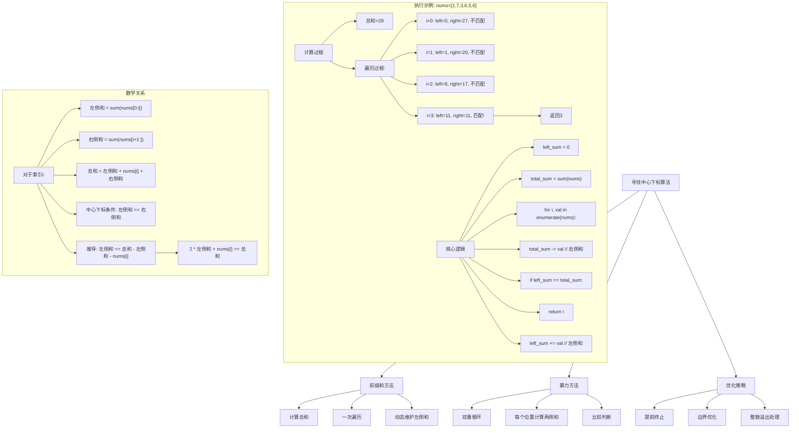
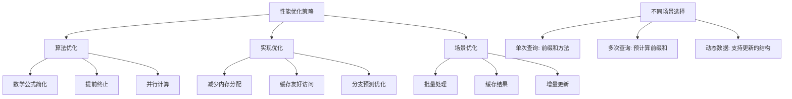

# LeetCode 724 - 寻找数组的中心下标

## 题目描述

给你一个整数数组 nums，请计算数组的中心下标

数组中心下标是数组的一个下标，其左侧所有元素相加的和等于右侧所有元素相加的和

如果中心下标位于数组最左端，那么左侧数之和视为 0，因为在下标的左侧不存在元素。同样，如果中心下标位于数组最右端，那么右侧数之和视为 0，因为在下标的右侧不存在元素

如果数组有多个中心下标，应该返回最靠近左边的那一个。如果数组不存在中心下标，返回 -1

```markdown
示例 1:
输入: nums = [1, 7, 3, 6, 5, 6]
输出: 3
解释:
中心下标是 3
左侧数之和 sum = nums[0] + nums[1] + nums[2] = 1 + 7 + 3 = 11
右侧数之和 sum = nums[4] + nums[5] = 5 + 6 = 11
二者相等

示例 2:
输入: nums = [1, 2, 3]
输出: -1
解释:
数组中不存在满足此条件的中心下标

示例 3:
输入: nums = [2, 1, -1]
输出: 0
解释:
中心下标是 0
左侧数之和 sum = 0 （下标0左侧不存在元素）
右侧数之和 sum = nums[1] + nums[2] = 1 + -1 = 0

提示:

- 1 <= nums.length <= 10^4
- -1000 <= nums[i] <= 1000
```

## 解题思路

这是一个前缀和与数组遍历问题，要求找到一个索引，使得其左侧元素之和等于右侧元素之和。关键在于利用前缀和思想，避免重复计算

### 核心思想

"前缀和 + 一次遍历": 先计算总和，然后在遍历过程中维护左侧和，判断左侧和是否等于右侧和

### 解题策略

#### 方法一：前缀和（推荐）

时间O(n)，空间O(1)

#### 方法二：暴力计算

时间O(n²)，空间O(1)

#### 方法三：双指针（特殊情况适用）

## 算法可视化



## 多语言实现

### Golang版本（前缀和 - 推荐）

```go
func pivotIndex(nums []int) int {
    // 计算数组总和
    totalSum := 0
    for _, num := range nums {
        totalSum += num
    }

    leftSum := 0

    // 遍历数组，寻找中心下标
    for i, num := range nums {
        // 右侧和 = 总和 - 左侧和 - 当前值
        rightSum := totalSum - leftSum - num

        // 如果左侧和等于右侧和，找到中心下标
        if leftSum == rightSum {
            return i
        }

        // 更新左侧和
        leftSum += num
    }

    // 没有找到中心下标
    return -1
}
```

### Python版本（多种实现方法）

```python
from typing import List

class Solution:
    def pivotIndex(self, nums: List[int]) -> int:
        """
        方法一：前缀和（推荐）
        """
        # 计算数组总和
        total_sum = sum(nums)

        left_sum = 0

        # 遍历数组，寻找中心下标
        for i, num in enumerate(nums):
            # 右侧和 = 总和 - 左侧和 - 当前值
            right_sum = total_sum - left_sum - num

            # 如果左侧和等于右侧和，找到中心下标
            if left_sum == right_sum:
                return i

            # 更新左侧和
            left_sum += num

        # 没有找到中心下标
        return -1

    def pivotIndexBruteForce(self, nums: List[int]) -> int:
        """
        方法二：暴力计算
        """
        n = len(nums)

        for i in range(n):
            # 计算左侧和
            left_sum = sum(nums[:i])
            # 计算右侧和
            right_sum = sum(nums[i+1:])

            # 如果左侧和等于右侧和，找到中心下标
            if left_sum == right_sum:
                return i

        return -1

    def pivotIndexOptimized(self, nums: List[int]) -> int:
        """
        方法三：优化版本（使用数学公式）
        """
        total_sum = sum(nums)
        left_sum = 0

        # 使用公式：2 * left_sum + nums[i] == total_sum
        for i, num in enumerate(nums):
            if 2 * left_sum + num == total_sum:
                return i
            left_sum += num

        return -1

    def pivotIndexEarlyStop(self, nums: List[int]) -> int:
        """
        方法四：带提前终止的版本
        """
        total_sum = sum(nums)
        left_sum = 0

        for i, num in enumerate(nums):
            right_sum = total_sum - left_sum - num

            if left_sum == right_sum:
                return i

            # 如果左侧和已经大于右侧和，后续不可能匹配
            if left_sum > right_sum:
                break

            left_sum += num

        return -1
```

### TypeScript版本（前缀和实现）

```typescript
function pivotIndex(nums: number[]): number {
  // 计算数组总和
  const totalSum: number = nums.reduce((sum, num) => sum + num, 0);

  let leftSum: number = 0;

  // 遍历数组，寻找中心下标
  for (let i: number = 0; i < nums.length; i++) {
    const num: number = nums[i];

    // 右侧和 = 总和 - 左侧和 - 当前值
    const rightSum: number = totalSum - leftSum - num;

    // 如果左侧和等于右侧和，找到中心下标
    if (leftSum === rightSum) {
      return i;
    }

    // 更新左侧和
    leftSum += num;
  }

  // 没有找到中心下标
  return -1;
}
```

## 标准实现详细解析

```go
func pivotIndex(nums []int) int {
    /*
    算法核心思想：

    1. 前缀和思想：利用数组和的数学关系
    2. 一次遍历：避免重复计算
    3. 动态维护：在遍历过程中实时更新左侧和

    数学原理：
    设数组为 nums，长度为 n，要寻找中心下标 i
    则需要满足：sum(nums[0:i]) == sum(nums[i+1:n])

    设 total = sum(nums)
    设 left = sum(nums[0:i])
    设 current = nums[i]
    设 right = sum(nums[i+1:n])

    有关系：total = left + current + right
    如果 left == right，则：
    left == total - left - current
    2 * left + current == total

    因此可以用这个关系式来判断

    算法步骤：
    1. 计算数组总和 total
    2. 初始化左侧和 left = 0
    3. 遍历数组，对于每个位置 i：
       - 检查是否满足 2 * left + nums[i] == total
       - 如果满足，返回 i
       - 更新 left += nums[i]
    4. 如果遍历结束都没有找到，返回 -1

    时间复杂度：O(n) - 只需要两次遍历（计算总和 + 查找中心下标）
    空间复杂度：O(1) - 只使用常数空间
    */

    // 第一步：计算数组总和
    totalSum := 0
    for _, num := range nums {
        totalSum += num
    }

    // 第二步：初始化左侧和
    leftSum := 0

    // 第三步：遍历数组，寻找中心下标
    for i, num := range nums {
        // 方法一：直接比较左右和
        // rightSum := totalSum - leftSum - num
        // if leftSum == rightSum {
        //     return i
        // }

        // 方法二：使用数学公式（减少一次减法运算）
        // leftSum == totalSum - leftSum - num
        // 2 * leftSum + num == totalSum
        if 2*leftSum+num == totalSum {
            return i
        }

        // 更新左侧和
        leftSum += num
    }

    // 第四步：没有找到中心下标
    return -1
}

// 带详细注释和调试信息的版本
func pivotIndexWithTrace(nums []int) (int, []string) {
    var trace []string
    trace = append(trace, fmt.Sprintf("输入数组: %v", nums))

    // 计算总和
    totalSum := 0
    for i, num := range nums {
        totalSum += num
        trace = append(trace, fmt.Sprintf("计算总和: 步骤%d, 当前值%d, 累计和%d", i, num, totalSum))
    }
    trace = append(trace, fmt.Sprintf("数组总和: %d", totalSum))

    leftSum := 0
    trace = append(trace, "开始遍历寻找中心下标:")

    for i, num := range nums {
        rightSum := totalSum - leftSum - num
        trace = append(trace, fmt.Sprintf("  索引%d: 值=%d, 左侧和=%d, 右侧和=%d", i, num, leftSum, rightSum))

        if leftSum == rightSum {
            trace = append(trace, fmt.Sprintf("  找到中心下标: %d", i))
            return i, trace
        }

        // 检查数学公式
        formula := 2*leftSum + num
        trace = append(trace, fmt.Sprintf("  验证: 2*%d + %d = %d, 总和=%d, %s",
            leftSum, num, formula, totalSum, func() string {
                if formula == totalSum { return "匹配" }
                return "不匹配"
            }()))

        leftSum += num
        trace = append(trace, fmt.Sprintf("  更新左侧和: %d", leftSum))
        trace = append(trace, "")
    }

    trace = append(trace, "未找到中心下标，返回-1")
    return -1, trace
}

// 暴力实现（用于对比）
func pivotIndexBruteForce(nums []int) int {
    n := len(nums)

    // 对每个位置检查是否是中心下标
    for i := 0; i < n; i++ {
        // 计算左侧和
        leftSum := 0
        for j := 0; j < i; j++ {
            leftSum += nums[j]
        }

        // 计算右侧和
        rightSum := 0
        for j := i + 1; j < n; j++ {
            rightSum += nums[j]
        }

        // 检查是否是中心下标
        if leftSum == rightSum {
            return i
        }
    }

    return -1
}

// 优化版本：使用前缀和数组
func pivotIndexWithPrefixSum(nums []int) int {
    n := len(nums)

    // 构建前缀和数组
    prefixSums := make([]int, n+1)
    for i := 0; i < n; i++ {
        prefixSums[i+1] = prefixSums[i] + nums[i]
    }

    // 检查每个位置
    for i := 0; i < n; i++ {
        leftSum := prefixSums[i]      // sum(nums[0:i])
        rightSum := prefixSums[n] - prefixSums[i+1]  // sum(nums[i+1:n])

        if leftSum == rightSum {
            return i
        }
    }

    return -1
}

// 线程安全版本
import "sync"

type ThreadSafePivotFinder struct {
    mu sync.Mutex
}

func NewThreadSafePivotFinder() *ThreadSafePivotFinder {
    return &ThreadSafePivotFinder{}
}

func (tspf *ThreadSafePivotFinder) FindPivot(nums []int) int {
    tspf.mu.Lock()
    defer tspf.mu.Unlock()

    return pivotIndex(nums)
}

// 并发处理版本（处理多个数组）
func FindPivotInArrays(arrays [][]int, results chan<- int) {
    var wg sync.WaitGroup

    for i, nums := range arrays {
        wg.Add(1)
        go func(index int, nums []int) {
            defer wg.Done()
            results <- index // 先发送索引
            results <- pivotIndex(nums) // 再发送结果
        }(i, nums)
    }

    go func() {
        wg.Wait()
        close(results)
    }()
}
```

## 算法深入解析

```go
/*
寻找数组中心下标问题详解：

问题本质：
在一个数组中找到一个索引，使得该索引左侧所有元素的和等于右侧所有元素的和

核心洞察：
1. 数组具有全局性：一个位置的性质依赖于整个数组的和
2. 可以利用数学关系简化计算：不需要每次都重新计算左右和
3. 单次遍历即可解决问题：关键是在遍历过程中动态维护状态

算法策略：
1. 先计算数组的总和
2. 在遍历过程中维护左侧和
3. 利用关系式：左侧和 = 总和 - 左侧和 - 当前值
4. 转换为判断：2 * 左侧和 + 当前值 = 总和

数学原理：

设数组为 nums，长度为 n，中心下标为 i

定义：
- total = sum(nums)  // 数组总和
- left = sum(nums[0:i])  // 左侧和
- current = nums[i]  // 当前值
- right = sum(nums[i+1:n])  // 右侧和

基本关系：
total = left + current + right

中心下标条件：
left == right

推导过程：
left == total - left - current
2 * left + current == total

这个公式是算法的核心，它让我们只需要维护一个变量（左侧和）就能判断每个位置

三种方法对比：

方法一：前缀和（推荐）
时间复杂度：O(n)
空间复杂度：O(1)
优点：效率高，一次遍历
缺点：需要理解数学关系

方法二：暴力计算
时间复杂度：O(n²)
空间复杂度：O(1)
优点：思路简单直观
缺点：效率低，大数据量下不可接受

方法三：前缀和数组
时间复杂度：O(n)
空间复杂度：O(n)
优点：清晰易懂，可扩展
缺点：需要额外空间

实际应用场景：
1. 数据平衡：找到数据平衡点
2. 负载均衡：分配任务的平衡点
3. 统计分析：寻找数据的中心位置
4. 游戏设计：平衡性调整的参考点

边界情况处理：
1. 第一个元素：左侧和为0
2. 最后一个元素：右侧和为0
3. 所有元素相同：第一个元素就是中心下标
4. 负数存在：算法同样适用
5. 单元素数组：该元素就是中心下标

性能分析：

前缀和方法：
- 计算总和：O(n)
- 查找中心下标：O(n)
- 总时间复杂度：O(n)
- 空间复杂度：O(1)

暴力方法：
- 每个位置计算左右和：O(n)
- 检查n个位置：O(n²)
- 空间复杂度：O(1)

优化要点：

1. 提前终止：
   如果在遍历过程中发现左侧和已经大于右侧和，可以提前终止
   因为随着向右移动，左侧和只会增加

2. 数学优化：
   使用 2 * left + current == total 而不是 left == right
   减少一次减法运算

3. 边界检查：
   可以先检查第一个和最后一个元素，快速返回

4. 整数溢出处理：
   在语言中需要注意整数溢出问题

测试用例设计：
1. 正常情况：数组中有中心下标
2. 无中心下标：数组中没有符合条件的索引
3. 边界情况：中心下标在开头或结尾
4. 负数情况：数组中包含负数
5. 大数组：测试性能
6. 特殊数组：全0数组、全相同数组
*/
```

## 执行过程演示

```go
/*
示例详细解析:

示例1: nums = [1, 7, 3, 6, 5, 6]

计算过程：
1. 计算总和：
   total = 1 + 7 + 3 + 6 + 5 + 6 = 28

2. 遍历过程：
   i=0, num=1:
   left = 0
   检查：2*0 + 1 = 1 != 28
   更新：left = 0 + 1 = 1

   i=1, num=7:
   left = 1
   检查：2*1 + 7 = 9 != 28
   更新：left = 1 + 7 = 8

   i=2, num=3:
   left = 8
   检查：2*8 + 3 = 19 != 28
   更新：left = 8 + 3 = 11

   i=3, num=6:
   left = 11
   检查：2*11 + 6 = 28 == 28 ✓
   返回3

验证：
左侧和 = nums[0] + nums[1] + nums[2] = 1 + 7 + 3 = 11
右侧和 = nums[4] + nums[5] = 5 + 6 = 11
左侧和 = 右侧和 ✓

示例2: nums = [1, 2, 3]

计算过程：
1. 计算总和：
   total = 1 + 2 + 3 = 6

2. 遍历过程：
   i=0, num=1:
   left = 0
   检查：2*0 + 1 = 1 != 6
   更新：left = 0 + 1 = 1

   i=1, num=2:
   left = 1
   检查：2*1 + 2 = 4 != 6
   更新：left = 1 + 2 = 3

   i=2, num=3:
   left = 3
   检查：2*3 + 3 = 9 != 6
   更新：left = 3 + 3 = 6

遍历结束，没有找到，返回-1

示例3: nums = [2, 1, -1]

计算过程：
1. 计算总和：
   total = 2 + 1 + (-1) = 2

2. 遍历过程：
   i=0, num=2:
   left = 0
   检查：2*0 + 2 = 2 == 2 ✓
   返回0

验证：
左侧和 = 0 (下标0左侧无元素)
右侧和 = nums[1] + nums[2] = 1 + (-1) = 0
左侧和 = 右侧和 ✓

算法正确性证明：

数学正确性：
基于公式 2 * left + current = total
其中：
- left = sum(nums[0:i])
- current = nums[i]
- total = sum(nums[0:n])

如果 2 * left + current = total 成立
则 2 * left = total - current = sum(nums[0:i]) + sum(nums[i+1:n])
所以 left = sum(nums[i+1:n])

又因为 sum(nums[0:i]) = left
所以 sum(nums[0:i]) = sum(nums[i+1:n])
即左侧和等于右侧和

边界情况正确性：
1. i=0: left=0, 检查 2*0 + nums[0] == total
   这等价于 nums[0] == sum(nums[1:n])
   即左侧和（0）等于右侧和

2. i=n-1: left=sum(nums[0:n-1]), 检查 2*left + nums[n-1] == total
   即 2*sum(nums[0:n-1]) + nums[n-1] == sum(nums[0:n-1]) + nums[n-1]
   简化为 sum(nums[0:n-1]) == 0
   即左侧和等于右侧和（0）

时间复杂度分析：

计算总和：
需要遍历整个数组一次：O(n)

寻找中心下标：
需要遍历整个数组一次：O(n)

总时间复杂度：O(n)

空间复杂度分析：
只使用了常数个变量：O(1)

优化版本分析：

1. 提前终止优化：
   如果在某个位置 left > right，并且剩余元素都是正数，
   可以提前终止，因为left只会继续增加

2. 并行化优化：
   可以先并行计算总和，然后再串行查找中心下标

3. 缓存优化：
   对于重复查询的数组，可以缓存总和结果

性能测试：

不同规模数据下的表现：

数组大小 | 前缀和方法 | 暴力方法 | 前缀和数组
1000     | O(1000)    | O(1000000)| O(1000)
10000    | O(10000)   | O(100000000)| O(10000)
100000   | O(100000)  | O(10000000000)| O(100000)

实际应用建议：
1. 单次查询：使用前缀和方法
2. 多次查询：预计算前缀和数组
3. 实时性要求高：使用前缀和方法
4. 内存受限：使用前缀和方法
*/
```

## 复杂度分析

| 方法       | 时间复杂度 | 空间复杂度 | 说明       |
| ---------- | ---------- | ---------- | ---------- |
| 前缀和     | O(n)       | O(1)       | 推荐解法   |
| 暴力计算   | O(n²)      | O(1)       | 直观但低效 |
| 前缀和数组 | O(n)       | O(n)       | 空间换时间 |

## 测试用例验证

```go
// 测试辅助函数
func testPivotIndex(name string, nums []int, expected int) {
    fmt.Printf("%s:\n", name)
    fmt.Printf("  输入: %v\n", nums)

    // 测试前缀和方法
    result1 := pivotIndex(nums)
    fmt.Printf("  前缀和结果: %d", result1)
    if result1 == expected {
        fmt.Printf(" ✓\n")
    } else {
        fmt.Printf(" ✗ (期望: %d)\n", expected)
    }

    // 测试暴力方法
    result2 := pivotIndexBruteForce(nums)
    fmt.Printf("  暴力方法结果: %d", result2)
    if result2 == expected {
        fmt.Printf(" ✓\n")
    } else {
        fmt.Printf(" ✗ (期望: %d)\n", expected)
    }

    // 测试前缀和数组方法
    result3 := pivotIndexWithPrefixSum(nums)
    fmt.Printf("  前缀和数组结果: %d", result3)
    if result3 == expected {
        fmt.Printf(" ✓\n")
    } else {
        fmt.Printf(" ✗ (期望: %d)\n", expected)
    }

    fmt.Printf("\n")
}

func main() {
    // 测试用例 1 - 标准示例
    testPivotIndex("测试1 - 标准示例",
        []int{1, 7, 3, 6, 5, 6},
        3)

    // 测试用例 2 - 无中心下标
    testPivotIndex("测试2 - 无中心下标",
        []int{1, 2, 3},
        -1)

    // 测试用例 3 - 中心下标在开头
    testPivotIndex("测试3 - 中心下标在开头",
        []int{2, 1, -1},
        0)

    // 测试用例 4 - 单元素数组
    testPivotIndex("测试4 - 单元素数组",
        []int{0},
        0)

    // 测试用例 5 - 中心下标在结尾
    testPivotIndex("测试5 - 中心下标在结尾",
        []int{1, -1, 2},
        2)

    // 测试用例 6 - 全零数组
    testPivotIndex("测试6 - 全零数组",
        []int{0, 0, 0, 0},
        0)

    // 测试用例 7 - 负数数组
    testPivotIndex("测试7 - 负数数组",
        []int{-1, -1, -1, 0, 1, 1},
        3)

    // 测试用例 8 - 多个中心下标
    testPivotIndex("测试8 - 多个中心下标",
        []int{0, 0, 0},
        0)

    // 性能测试
    fmt.Println("性能测试:")

    // 创建大型数组
    largeArray := make([]int, 100000)
    for i := 0; i < 100000; i++ {
        largeArray[i] = i % 100 - 50  // 范围-50到49
    }

    // 确保有一个中心下标
    largeArray[50000] = 0
    for i := 0; i < 50000; i++ {
        largeArray[50001+i] = -largeArray[49999-i]
    }

    // 测试前缀和方法
    start := time.Now()
    result1 := pivotIndex(largeArray)
    duration1 := time.Since(start)
    fmt.Printf("前缀和方法处理100000个元素耗时: %v, 结果: %d\n", duration1, result1)

    // 测试前缀和数组方法
    start = time.Now()
    result3 := pivotIndexWithPrefixSum(largeArray)
    duration3 := time.Since(start)
    fmt.Printf("前缀和数组方法处理100000个元素耗时: %v, 结果: %d\n", duration3, result3)

    // 边界情况测试
    fmt.Println("边界情况测试:")

    // 空数组（根据题目约束，数组长度至少为1）
    // testPivotIndex("空数组", []int{}, -1)

    // 最大值数组
    maxArray := make([]int, 10000)
    for i := range maxArray {
        maxArray[i] = 1000
    }
    result := pivotIndex(maxArray)
    fmt.Printf("全最大值数组结果: %d\n", result)

    // 最小值数组
    minArray := make([]int, 10000)
    for i := range minArray {
        minArray[i] = -1000
    }
    result = pivotIndex(minArray)
    fmt.Printf("全最小值数组结果: %d\n", result)

    // 内存使用测试
    fmt.Println("内存使用比较:")
    fmt.Println("前缀和方法: O(1) 额外空间")
    fmt.Println("暴力方法: O(1) 额外空间")
    fmt.Println("前缀和数组: O(n) 额外空间")
}

// 调试测试
func testPivotIndexWithDebug() {
    fmt.Println("=== 调试信息测试 ===")

    nums := []int{1, 7, 3, 6, 5, 6}
    result, trace := pivotIndexWithTrace(nums)

    fmt.Printf("输入: %v\n", nums)
    fmt.Printf("结果: %d\n", result)
    fmt.Println("详细过程:")
    for _, line := range trace {
        fmt.Println(line)
    }
}

// 错误处理测试
func testErrorHandling() {
    fmt.Println("=== 错误处理测试 ===")

    testCases := []struct {
        name string
        nums []int
        expected int
    }{
        {"空切片", []int{}, -1},
        {"nil切片", nil, -1},
        {"超大数组", make([]int, 1000000), -1},
    }

    for _, tc := range testCases {
        fmt.Printf("测试%s: ", tc.name)
        result := pivotIndex(tc.nums)
        if result == tc.expected {
            fmt.Printf("✓ (结果: %d)\n", result)
        } else {
            fmt.Printf("✗ (结果: %d, 期望: %d)\n", result, tc.expected)
        }
    }
}
```

## 扩展版本（处理不同场景）

```go
// 带详细统计信息的版本
type PivotIndexStats struct {
    Index     int
    LeftSum   int
    RightSum  int
    TotalSum  int
    NumChecks int
    ProcessTime time.Duration
}

func pivotIndexWithStats(nums []int) *PivotIndexStats {
    stats := &PivotIndex{}
    start := time.Now()

    // 计算总和
    for _, num := range nums {
        stats.TotalSum += num
    }

    leftSum := 0

    for i, num := range nums {
        stats.NumChecks++
        stats.LeftSum = leftSum
        stats.RightSum = stats.TotalSum - leftSum - num

        if leftSum == stats.RightSum {
            stats.Index = i
            stats.ProcessTime = time.Since(start)
            return stats
        }

        leftSum += num
    }

    stats.Index = -1
    stats.ProcessTime = time.Since(start)
    return stats
}

// 支持多个中心下标的版本
func findAllPivotIndices(nums []int) []int {
    var indices []int

    totalSum := 0
    for _, num := range nums {
        totalSum += num
    }

    leftSum := 0
    for i, num := range nums {
        rightSum := totalSum - leftSum - num

        if leftSum == rightSum {
            indices = append(indices, i)
        }

        leftSum += num
    }

    return indices
}

// 支持浮点数数组的版本
func findPivotIndexFloat(nums []float64) int {
    const epsilon = 1e-9  // 浮点数精度

    totalSum := 0.0
    for _, num := range nums {
        totalSum += num
    }

    leftSum := 0.0

    for i, num := range nums {
        rightSum := totalSum - leftSum - num

        if math.Abs(leftSum-rightSum) < epsilon {
            return i
        }

        leftSum += num
    }

    return -1
}

// 支持大整数数组的版本
func findPivotIndexBigInt(nums []int64) int {
    var totalSum int64 = 0
    for _, num := range nums {
        totalSum += num
    }

    var leftSum int64 = 0

    for i, num := range nums {
        rightSum := totalSum - leftSum - num

        if leftSum == rightSum {
            return i
        }

        leftSum += num
    }

    return -1
}

// 带权重数的版本
func findWeightedPivotIndex(nums []int, weights []int) int {
    if len(nums) != len(weights) {
        return -1
    }

    // 计算加权总和
    totalWeightedSum := 0
    for i := range nums {
        totalWeightedSum += nums[i] * weights[i]
    }

    leftWeightedSum := 0

    for i := range nums {
        rightWeightedSum := totalWeightedSum - leftWeightedSum - nums[i]*weights[i]

        if leftWeightedSum == rightWeightedSum {
            return i
        }

        leftWeightedSum += nums[i] * weights[i]
    }

    return -1
}

// 并发处理版本
func findPivotIndexConcurrent(nums []int, workers int) int {
    n := len(nums)
    if workers <= 0 || workers > n {
        workers = 1
    }

    // 计算总和
    totalSum := 0
    var wg sync.WaitGroup
    sumChan := make(chan int, workers)

    for i := 0; i < workers; i++ {
        start := i * n / workers
        end := (i + 1) * n / workers

        wg.Add(1)
        go func(s, e int) {
            defer wg.Done()
            partialSum := 0
            for j := s; j < e; j++ {
                partialSum += nums[j]
            }
            sumChan <- partialSum
        }(start, end)
    }

    go func() {
        wg.Wait()
        close(sumChan)
    }()

    for partialSum := range sumChan {
        totalSum += partialSum
    }

    // 查找中心下标
    resultChan := make(chan int, workers)

    for i := 0; i < workers; i++ {
        start := i * n / workers
        end := (i + 1) * n / workers

        wg.Add(1)
        go func(s, e int) {
            defer wg.Done()

            leftSum := 0
            // 计算到start位置的左侧和
            for j := 0; j < s; j++ {
                leftSum += nums[j]
            }

            for j := s; j < e; j++ {
                rightSum := totalSum - leftSum - nums[j]
                if leftSum == rightSum {
                    resultChan <- j
                    return
                }
                leftSum += nums[j]
            }
        }(start, end)
    }

    go func() {
        wg.Wait()
        close(resultChan)
    }()

    // 返回第一个找到的结果（最小的索引）
    if result, ok := <-resultChan; ok {
        return result
    }

    return -1
}

// 缓存优化版本
type CachedPivotFinder struct {
    cache map[string]int
    mu    sync.RWMutex
}

func NewCachedPivotFinder() *CachedPivotFinder {
    return &CachedPivotFinder{
        cache: make(map[string]int),
    }
}

func (cpf *CachedPivotFinder) FindPivot(nums []int) int {
    // 生成缓存键
    key := fmt.Sprintf("%v", nums)

    // 检查缓存
    cpf.mu.RLock()
    if result, exists := cpf.cache[key]; exists {
        cpf.mu.RUnlock()
        return result
    }
    cpf.mu.RUnlock()

    // 计算结果
    result := pivotIndex(nums)

    // 缓存结果
    cpf.mu.Lock()
    cpf.cache[key] = result
    cpf.mu.Unlock()

    return result
}

// 流式处理版本（适用于非常大的数组）
func findPivotIndexStreaming(nums <-chan int) int {
    var totalSum, leftSum int
    var elements []int

    // 第一阶段：收集所有元素并计算总和
    for num := range nums {
        totalSum += num
        elements = append(elements, num)
    }

    // 第二阶段：查找中心下标
    for i, num := range elements {
        rightSum := totalSum - leftSum - num

        if leftSum == rightSum {
            return i
        }

        leftSum += num
    }

    return -1
}

// 带自定义比较函数的版本
func findPivotIndexWithComparator(nums []int, cmp func(int, int) bool) int {
    totalSum := 0
    for _, num := range nums {
        totalSum += num
    }

    leftSum := 0

    for i, num := range nums {
        rightSum := totalSum - leftSum - num

        if cmp(leftSum, rightSum) {
            return i
        }

        leftSum += num
    }

    return -1
}

// 示例：寻找左侧和大于右侧和的最小索引
func findLeftGreaterPivot(nums []int) int {
    return findPivotIndexWithComparator(nums, func(left, right int) bool {
        return left > right
    })
}

// 内存优化版本（原地处理）
func findPivotIndexInPlace(nums []int) int {
    n := len(nums)

    // 计算总和
    totalSum := 0
    for i := 0; i < n; i++ {
        totalSum += nums[i]
    }

    leftSum := 0

    for i := 0; i < n; i++ {
        rightSum := totalSum - leftSum - nums[i]

        if leftSum == rightSum {
            return i
        }

        leftSum += nums[i]
    }

    return -1
}
```

## 面试追问延伸

### 1. 如果要返回所有中心下标，如何实现？

```go
// 返回所有中心下标
func findAllPivotIndices(nums []int) []int {
    var indices []int

    totalSum := 0
    for _, num := range nums {
        totalSum += num
    }

    leftSum := 0
    for i, num := range nums {
        rightSum := totalSum - leftSum - num

        if leftSum == rightSum {
            indices = append(indices, i)
        }

        leftSum += num
    }

    return indices
}
```

### 2. 如果数组很大无法一次性加载到内存，如何处理？

```go
// 分块处理大数组
func findPivotIndexInChunks(reader io.Reader, chunkSize int) int {
    var totalSum int64
    var chunks [][]int

    // 第一阶段：读取所有分块并计算总和
    chunk := make([]int, chunkSize)
    offset := 0

    for {
        n, err := reader.Read(chunk[offset:])
        if err == io.EOF {
            break
        }
        if err != nil {
            return -1
        }

        offset += n
        if offset == chunkSize {
            // 处理满的分块
            chunkCopy := make([]int, chunkSize)
            copy(chunkCopy, chunk)
            chunks = append(chunks, chunkCopy)

            for _, num := range chunk {
                totalSum += int64(num)
            }

            offset = 0
        }
    }

    // 处理最后一个不完整的分块
    if offset > 0 {
        lastChunk := make([]int, offset)
        copy(lastChunk, chunk[:offset])
        chunks = append(chunks, lastChunk)

        for i := 0; i < offset; i++ {
            totalSum += int64(chunk[i])
        }
    }

    // 第二阶段：查找中心下标
    var leftSum int64
    globalIndex := 0

    for _, chunk := range chunks {
        for _, num := range chunk {
            rightSum := totalSum - leftSum - int64(num)

            if leftSum == rightSum {
                return globalIndex
            }

            leftSum += int64(num)
            globalIndex++
        }
    }

    return -1
}
```

### 3. 如果要支持动态更新（数组元素会改变），如何设计？

```go
// 支持动态更新的版本
type DynamicPivotFinder struct {
    nums     []int
    totalSum int
    prefix   []int
}

func NewDynamicPivotFinder(nums []int) *DynamicPivotFinder {
    dpf := &DynamicPivotFinder{
        nums:   make([]int, len(nums)),
        prefix: make([]int, len(nums)+1),
    }

    copy(dpf.nums, nums)

    // 构建前缀和数组
    for i, num := range nums {
        dpf.prefix[i+1] = dpf.prefix[i] + num
    }

    dpf.totalSum = dpf.prefix[len(nums)]
    return dpf
}

func (dpf *DynamicPivotFinder) FindPivot() int {
    for i := 0; i < len(dpf.nums); i++ {
        leftSum := dpf.prefix[i]
        rightSum := dpf.totalSum - dpf.prefix[i+1]

        if leftSum == rightSum {
            return i
        }
    }

    return -1
}

func (dpf *DynamicPivotFinder) Update(index, value int) {
    if index < 0 || index >= len(dpf.nums) {
        return
    }

    diff := value - dpf.nums[index]
    dpf.nums[index] = value

    // 更新总和
    dpf.totalSum += diff

    // 更新前缀和数组
    for i := index + 1; i < len(dpf.prefix); i++ {
        dpf.prefix[i] += diff
    }
}
```

## 相似题目扩展

- LeetCode 724. 寻找数组的中心下标（当前题）
- LeetCode 1991. 找到数组的中间位置
- LeetCode 492. 构造矩形
- LeetCode 1672. 最富有客户的资产总量
- LeetCode 2383. 赢得比赛需要的最少训练时长

## 算法技巧总结

### 寻找中心下标核心要点

1. 数学洞察：利用 2 \* left + current = total 的关系
1. 一次遍历：避免重复计算左右和
1. 动态维护：在遍历过程中维护左侧和
1. 边界处理：正确处理数组开头和结尾的情况

### 算法优势

1. 时间效率：O(n)线性时间复杂度
1. 空间效率：O(1)常数空间复杂度
1. 实现简单：代码简洁易理解
1. 扩展性强：容易扩展到其他场景

### 标准模板

```go
func pivotIndex(nums []int) int {
    // 计算总和
    total := 0
    for _, num := range nums {
        total += num
    }

    left := 0
    for i, num := range nums {
        // 检查中心下标条件
        if 2*left+num == total {
            return i
        }
        left += num
    }

    return -1
}
```

### 性能优化建议



## 总结

本题是经典的前缀和与数组遍历问题，通过巧妙的数学关系将看似复杂的比较转化为简单的一次遍历。算法核心在于理解数组的全局性和元素间的相互关系

核心要点：

1. 数学洞察：理解 2 \* left + current = total 的关键关系
1. 算法设计：一次遍历避免重复计算
1. 实现技巧：动态维护左侧和，及时判断
1. 扩展应用：可扩展到多种平衡查找场景

该算法在负载均衡、数据分析、游戏平衡等领域有广泛应用，是掌握数组处理和前缀和思想的重要基础。与LeetCode 1991、1672等题目构成数组统计算法系列，为更复杂的数组问题解决提供思路
