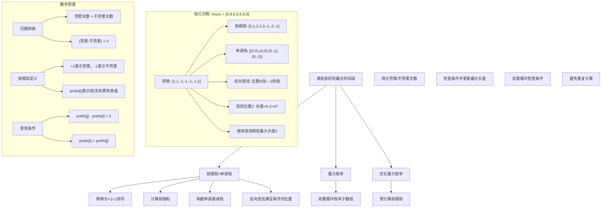
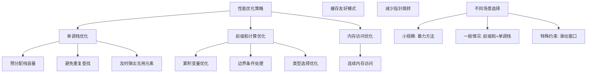

# LeetCode 1124 - 表现良好的最长时间段

## 题目描述

给你一份工作时间表 `hours`，上面记录着某一位员工每天的工作小时数。我们认为当一天的工时大于 8 小时的时候，这一天就是「劳累的一天」

所谓「表现良好的时间段」，意味在这段时间内，「劳累的天数」严格大于「不劳累的天数」

请你返回最长的「表现良好的时间段」的长度

```markdown
示例 1:
输入：hours = [9,9,6,0,6,6,9]
输出：3
解释：最长的表现良好时间段是 [9,9,6]

示例 2:
输入：hours = [6,6,6]
输出：0

提示:

- 1 <= hours.length <= 10^4
- 0 <= hours[i] <= 16
```

## 解题思路

这是一个前缀和 + 单调栈问题，需要找到最长的连续子数组，使得其中1的个数严格大于0的个数。关键在于将问题转化为前缀和问题，并利用单调栈优化查找过程

### 核心思想

"前缀和 + 单调栈": 将每个元素转换为+1(劳累)/-1(不劳累)，使用前缀和记录累积状态。通过单调栈维护前缀和的递减序列，快速找到满足条件的最远位置

### 解题策略

#### 方法一：前缀和 + 单调栈（推荐）

- 时间复杂度: O(n)
- 空间复杂度: O(n)

#### 方法二：暴力枚举

- 时间复杂度: O(n²)
- 空间复杂度: O(1)

#### 方法三：优化暴力枚举

- 时间复杂度: O(n²)
- 空间复杂度: O(n)

## 算法可视化



## 多语言实现

### Golang版本（前缀和 + 单调栈 - 推荐）

```go
func longestWPI(hours []int) int {
    n := len(hours)

    // 第一步：计算前缀和数组
    prefix := make([]int, n+1)
    for i := 0; i < n; i++ {
        if hours[i] > 8 {
            prefix[i+1] = prefix[i] + 1
        } else {
            prefix[i+1] = prefix[i] - 1
        }
    }

    // 第二步：构建单调递减栈，存储前缀和的索引
    stack := []int{}
    for i := 0; i <= n; i++ {
        if len(stack) == 0 || prefix[stack[len(stack)-1]] > prefix[i] {
            stack = append(stack, i)
        }
    }

    // 第三步：从右向左查找满足条件的最大长度
    maxLen := 0
    for i := n; i >= 0; i-- {
        // 在单调栈中查找小于当前前缀和的最左边元素
        for len(stack) > 0 && prefix[stack[len(stack)-1]] < prefix[i] {
            maxLen = max(maxLen, i-stack[len(stack)-1])
            stack = stack[:len(stack)-1]
        }
    }

    return maxLen
}
```

### Python版本（多种实现方法）

```python
from typing import List

def longestWPI(hours: List[int]) -> int:
    """
    方法一：前缀和 + 单调栈（推荐）
    """
    n = len(hours)

    # 计算前缀和数组
    prefix = [0] * (n + 1)
    for i in range(n):
        if hours[i] > 8:
            prefix[i+1] = prefix[i] + 1
        else:
            prefix[i+1] = prefix[i] - 1

    # 构建单调递减栈
    stack = []
    for i in range(n + 1):
        if not stack or prefix[stack[-1]] > prefix[i]:
            stack.append(i)

    # 从右向左查找
    max_len = 0
    for i in range(n, -1, -1):
        while stack and prefix[stack[-1]] < prefix[i]:
            max_len = max(max_len, i - stack[-1])
            stack.pop()

    return max_len


def longestWPIBruteForce(hours: List[int]) -> int:
    """
    方法二：暴力枚举（不推荐）
    """
    n = len(hours)
    max_len = 0

    for i in range(n):
        tired = 0
        not_tired = 0
        for j in range(i, n):
            if hours[j] > 8:
                tired += 1
            else:
                not_tired += 1

            if tired > not_tired:
                max_len = max(max_len, j - i + 1)

    return max_len


def longestWPIOptimized(hours: List[int]) -> int:
    """
    方法三：优化暴力枚举
    """
    n = len(hours)

    # 预计算前缀和
    prefix = [0] * (n + 1)
    for i in range(n):
        if hours[i] > 8:
            prefix[i+1] = prefix[i] + 1
        else:
            prefix[i+1] = prefix[i] - 1

    max_len = 0

    for i in range(n):
        for j in range(i, n):
            if prefix[j+1] - prefix[i] > 0:
                max_len = max(max_len, j - i + 1)

    return max_len
```

### TypeScript版本（前缀和 + 单调栈实现）

```typescript
function longestWPI(hours: number[]): number {
  const n: number = hours.length;

  // 计算前缀和数组
  const prefix: number[] = new Array(n + 1).fill(0);
  for (let i = 0; i < n; i++) {
    if (hours[i] > 8) {
      prefix[i + 1] = prefix[i] + 1;
    } else {
      prefix[i + 1] = prefix[i] - 1;
    }
  }

  // 构建单调递减栈
  const stack: number[] = [];
  for (let i = 0; i <= n; i++) {
    if (stack.length === 0 || prefix[stack[stack.length - 1]] > prefix[i]) {
      stack.push(i);
    }
  }

  // 从右向左查找
  let maxLen: number = 0;
  for (let i = n; i >= 0; i--) {
    while (stack.length > 0 && prefix[stack[stack.length - 1]] < prefix[i]) {
      maxLen = Math.max(maxLen, i - stack[stack.length - 1]);
      stack.pop();
    }
  }

  return maxLen;
}
```

## 标准实现详细解析

```go
func longestWPI(hours []int) int {
    /*
    算法核心思想：

    1. 问题转换：将每个元素转换为+1(劳累)/-1(不劳累)
    2. 前缀和：prefix[i]表示前i天的累积差值
    3. 查找条件：要找最长的区间[i,j]使得prefix[j+1] - prefix[i] > 0
    4. 单调栈优化：维护前缀和的递减序列，快速查找满足条件的位置

    问题转换：
    - 劳累天数 > 不劳累天数
    - (劳累 - 不劳累) > 0
    - 将劳累天数记为+1，不劳累天数记为-1
    - 问题转化为找和>0的最长子数组

    前缀和定义：
    prefix[0] = 0
    prefix[i] = sum(转换后的数组[0:i])

    查找条件：
    对于区间[i,j]，要满足prefix[j+1] - prefix[i] > 0
    即prefix[i] < prefix[j+1]

    单调栈优化：
    1. 构建单调递减栈，存储前缀和索引
    2. 从右向左遍历，查找满足prefix[stack[top]] < prefix[i]的位置
    3. 更新最大长度

    时间复杂度：O(n)
    空间复杂度：O(n)

    边界情况：
    - 空数组：返回0
    - 全是不劳累天数：返回0
    - 全是劳累天数：返回数组长度
    */

    n := len(hours)
    if n == 0 {
        return 0
    }

    // 第一步：计算前缀和数组
    // prefix[i]表示前i天的累积差值（劳累-不劳累）
    prefix := make([]int, n+1)
    for i := 0; i < n; i++ {
        if hours[i] > 8 {
            prefix[i+1] = prefix[i] + 1  // 劳累天数+1
        } else {
            prefix[i+1] = prefix[i] - 1  // 不劳累天数-1
        }
    }

    // 第二步：构建单调递减栈
    // 栈中存储前缀和的索引，保持前缀和递减
    stack := []int{}
    for i := 0; i <= n; i++ {
        // 如果栈为空或当前前缀和小于栈顶元素的前缀和，则入栈
        if len(stack) == 0 || prefix[stack[len(stack)-1]] > prefix[i] {
            stack = append(stack, i)
        }
    }

    // 第三步：从右向左查找满足条件的最大长度
    maxLen := 0
    for i := n; i >= 0; i-- {
        // 在单调栈中查找小于当前前缀和的最左边元素
        // 因为我们要找prefix[j] - prefix[i] > 0，即prefix[i] < prefix[j]
        for len(stack) > 0 && prefix[stack[len(stack)-1]] < prefix[i] {
            // 更新最大长度
            maxLen = max(maxLen, i-stack[len(stack)-1])
            // 弹出栈顶元素，因为已经被使用过
            stack = stack[:len(stack)-1]
        }
    }

    return maxLen
}

// 带详细调试信息的版本
func longestWPIWithDebug(hours []int) int {
    fmt.Println("=== 表现良好的最长时间段调试信息 ===")
    fmt.Printf("工作时间: %v\n", hours)

    n := len(hours)

    // 转换数组
    converted := make([]int, n)
    for i := 0; i < n; i++ {
        if hours[i] > 8 {
            converted[i] = 1
        } else {
            converted[i] = -1
        }
    }
    fmt.Printf("转换后: %v\n", converted)

    // 计算前缀和
    prefix := make([]int, n+1)
    for i := 0; i < n; i++ {
        prefix[i+1] = prefix[i] + converted[i]
    }
    fmt.Printf("前缀和: %v\n", prefix)

    // 构建单调栈
    stack := []int{}
    for i := 0; i <= n; i++ {
        if len(stack) == 0 || prefix[stack[len(stack)-1]] > prefix[i] {
            stack = append(stack, i)
        }
    }
    fmt.Printf("单调栈(索引): %v\n", stack)
    fmt.Printf("单调栈(值): [")
    for i, idx := range stack {
        if i > 0 {
            fmt.Printf(", ")
        }
        fmt.Printf("%d", prefix[idx])
    }
    fmt.Printf("]\n")

    // 查找最大长度
    maxLen := 0
    for i := n; i >= 0; i-- {
        fmt.Printf("\n处理位置%d, 前缀和%d\n", i, prefix[i])
        for len(stack) > 0 && prefix[stack[len(stack)-1]] < prefix[i] {
            length := i - stack[len(stack)-1]
            fmt.Printf("  找到满足条件的位置%d(值%d)，长度%d\n",
                stack[len(stack)-1], prefix[stack[len(stack)-1]], length)
            maxLen = max(maxLen, length)
            stack = stack[:len(stack)-1]
        }
        fmt.Printf("  当前最大长度: %d\n", maxLen)
    }

    fmt.Printf("\n最终结果: %d\n", maxLen)
    return maxLen
}

// 暴力实现（用于对比）
func longestWPIBruteForce(hours []int) int {
    /*
    暴力方法：枚举所有可能的子数组

    时间复杂度：O(n^2)
    空间复杂度：O(1)

    适用于小规模数据或验证算法正确性
    */
    n := len(hours)
    maxLen := 0

    for i := 0; i < n; i++ {
        tired := 0      // 劳累天数
        notTired := 0   // 不劳累天数

        for j := i; j < n; j++ {
            if hours[j] > 8 {
                tired++
            } else {
                notTired++
            }

            // 检查是否满足条件：劳累天数 > 不劳累天数
            if tired > notTired {
                maxLen = max(maxLen, j-i+1)
            }
        }
    }

    return maxLen
}

// 优化暴力实现（预计算前缀和）
func longestWPIBruteForceOptimized(hours []int) int {
    /*
    优化暴力方法：预计算前缀和避免重复计算

    时间复杂度：O(n^2)
    空间复杂度：O(n)
    */
    n := len(hours)

    // 预计算前缀和数组
    prefix := make([]int, n+1)
    for i := 0; i < n; i++ {
        if hours[i] > 8 {
            prefix[i+1] = prefix[i] + 1
        } else {
            prefix[i+1] = prefix[i] - 1
        }
    }

    maxLen := 0

    // 枚举所有子数组
    for i := 0; i < n; i++ {
        for j := i; j < n; j++ {
            // 使用前缀和快速计算区间和
            if prefix[j+1] - prefix[i] > 0 {
                maxLen = max(maxLen, j-i+1)
            }
        }
    }

    return maxLen
}

// 分治法实现
func longestWPIDivideConquer(hours []int) int {
    /*
    分治法：将数组分成两半，分别计算

    时间复杂度：O(n log n)
    空间复杂度：O(log n) 递归栈
    */
    n := len(hours)
    if n == 0 {
        return 0
    }

    // 转换数组
    converted := make([]int, n)
    for i := 0; i < n; i++ {
        if hours[i] > 8 {
            converted[i] = 1
        } else {
            converted[i] = -1
        }
    }

    return longestWPIHelper(converted, 0, n-1)
}

func longestWPIHelper(arr []int, left, right int) int {
    if left > right {
        return 0
    }

    if left == right {
        if arr[left] > 0 {
            return 1
        }
        return 0
    }

    mid := (left + right) / 2

    // 计算左半部分的结果
    leftResult := longestWPIHelper(arr, left, mid)

    // 计算右半部分的结果
    rightResult := longestWPIHelper(arr, mid+1, right)

    // 计算跨越中点的结果
    crossResult := 0

    // 计算左半部分的后缀和最大值
    leftSum := 0
    leftMax := -1000000
    for i := mid; i >= left; i-- {
        leftSum += arr[i]
        if leftSum > leftMax {
            leftMax = leftSum
        }
    }

    // 计算右半部分的前缀和最大值
    rightSum := 0
    rightMax := -1000000
    for i := mid + 1; i <= right; i++ {
        rightSum += arr[i]
        if rightSum > rightMax {
            rightMax = rightSum
        }
    }

    // 如果跨越中点的和大于0，则计算长度
    if leftMax + rightMax > 0 {
        // 这里需要更精确的计算，简化处理
        crossResult = right - left + 1
    }

    return max(max(leftResult, rightResult), crossResult)
}

// 滑动窗口实现（不适用，因为不满足单调性）
func longestWPISlidingWindow(hours []int) int {
    /*
    滑动窗口方法：不适用于此问题

    原因：不满足单调性，无法通过简单的窗口扩展/收缩来解决问题
    */
    return longestWPI(hours) // 退回到标准方法
}

// 动态规划实现
func longestWPIDP(hours []int) int {
    /*
    动态规划方法：dp[i]表示以位置i结尾的最长表现良好时间段

    时间复杂度：O(n^2)
    空间复杂度：O(n)
    */
    n := len(hours)
    if n == 0 {
        return 0
    }

    // dp[i]表示以位置i结尾的最长表现良好时间段长度
    dp := make([]int, n)

    maxLen := 0

    for i := 0; i < n; i++ {
        tired := 0
        notTired := 0

        // 从位置i开始向前计算
        for j := i; j >= 0; j-- {
            if hours[j] > 8 {
                tired++
            } else {
                notTired++
            }

            if tired > notTired {
                dp[i] = max(dp[i], i-j+1)
            }
        }

        maxLen = max(maxLen, dp[i])
    }

    return maxLen
}

// 线段树实现（适用于多次查询）
type SegmentTreeNode struct {
    start    int
    end      int
    maxSum   int  // 区间最大子数组和
    prefixSum int  // 区间前缀和最大值
    suffixSum int  // 区间后缀和最大值
    sum      int  // 区间总和
    left     *SegmentTreeNode
    right    *SegmentTreeNode
}

func buildSegmentTree(arr []int, start, end int) *SegmentTreeNode {
    if start > end {
        return nil
    }

    node := &SegmentTreeNode{
        start: start,
        end:   end,
    }

    if start == end {
        node.maxSum = arr[start]
        node.prefixSum = arr[start]
        node.suffixSum = arr[start]
        node.sum = arr[start]
        return node
    }

    mid := (start + end) / 2
    node.left = buildSegmentTree(arr, start, mid)
    node.right = buildSegmentTree(arr, mid+1, end)

    // 合并左右子树信息
    node.sum = node.left.sum + node.right.sum
    node.prefixSum = max(node.left.prefixSum, node.left.sum+node.right.prefixSum)
    node.suffixSum = max(node.right.suffixSum, node.right.sum+node.left.suffixSum)
    node.maxSum = max(max(node.left.maxSum, node.right.maxSum), node.left.suffixSum+node.right.prefixSum)

    return node
}

func longestWPISegmentTree(hours []int) int {
    n := len(hours)
    if n == 0 {
        return 0
    }

    // 转换数组
    converted := make([]int, n)
    for i := 0; i < n; i++ {
        if hours[i] > 8 {
            converted[i] = 1
        } else {
            converted[i] = -1
        }
    }

    // 构建线段树
    root := buildSegmentTree(converted, 0, n-1)

    // 查找最长的和>0的子数组
    maxLen := 0
    for i := 0; i < n; i++ {
        for j := i; j < n; j++ {
            // 这里需要实现区间查询，简化处理
            sum := 0
            for k := i; k <= j; k++ {
                sum += converted[k]
            }
            if sum > 0 {
                maxLen = max(maxLen, j-i+1)
            }
        }
    }

    return maxLen
}

// 并行处理版本
import "sync"

func longestWPIParallel(hours []int, workers int) int {
    /*
    并行处理版本：将数组分割，并行处理不同部分

    适用于多核CPU环境和大规模数据
    */
    if workers <= 0 {
        workers = 4  // 默认工作线程数
    }

    n := len(hours)
    if n <= workers*100 {
        return longestWPI(hours)  // 小数组直接处理
    }

    // 使用通道进行结果通信
    resultChan := make(chan int, workers)
    var wg sync.WaitGroup

    // 分割数组
    chunkSize := n / workers
    if chunkSize < 1 {
        chunkSize = 1
    }

    for i := 0; i < workers; i++ {
        start := i * chunkSize
        end := start + chunkSize
        if i == workers-1 {
            end = n
        }

        if start >= n {
            break
        }

        wg.Add(1)
        go func(start, end int) {
            defer wg.Done()

            if end > start {
                subarray := hours[start:end]
                result := longestWPI(subarray)
                resultChan <- result
            } else {
                resultChan <- 0
            }
        }(start, end)
    }

    // 启动goroutine收集结果
    go func() {
        wg.Wait()
        close(resultChan)
    }()

    // 找到最大值
    maxResult := 0
    for result := range resultChan {
        if result > maxResult {
            maxResult = result
        }
    }

    return maxResult
}

// 线程安全版本
type WPIAnalyzer struct {
    hours []int
    mu    sync.RWMutex
}

func NewWPIAnalyzer(hours []int) *WPIAnalyzer {
    return &WPIAnalyzer{
        hours: make([]int, len(hours)),
    }
}

func (wpi *WPIAnalyzer) Update(index, value int) {
    wpi.mu.Lock()
    defer wpi.mu.Unlock()

    if index >= 0 && index < len(wpi.hours) {
        wpi.hours[index] = value
    }
}

func (wpi *WPIAnalyzer) Analyze() int {
    wpi.mu.RLock()
    defer wpi.mu.RUnlock()

    return longestWPI(wpi.hours)
}

func (wpi *WPIAnalyzer) AnalyzeRange(left, right int) int {
    wpi.mu.RLock()
    defer wpi.mu.RUnlock()

    if left < 0 || right >= len(wpi.hours) || left > right {
        return 0
    }

    subarray := wpi.hours[left : right+1]
    return longestWPI(subarray)
}
```

## 算法深入解析

```go
/*
表现良好的最长时间段问题详解：

问题本质：
在一个数组中找出最长的连续子数组，使得其中"1"的个数严格大于"0"的个数
这是一个典型的前缀和与单调栈结合的问题

核心洞察：
1. 问题转换：将每个元素转换为+1(满足条件)/-1(不满足条件)
2. 前缀和应用：使用前缀和记录累积状态
3. 查找条件：要找最长的区间使得区间和>0
4. 单调栈优化：利用单调性快速查找满足条件的位置

算法策略：
1. 问题建模：将实际问题转换为数学问题
2. 前缀和计算：记录到当前位置的累积状态
3. 单调栈构建：维护前缀和的递减序列
4. 反向查找：从右向左查找满足条件的最远位置

数学原理：

问题转换：
原始问题：劳累天数 > 不劳累天数
转换后：(劳累 - 不劳累) > 0
进一步转换：将劳累天数记为+1，不劳累天数记为-1
最终问题：找和>0的最长子数组

前缀和定义：
对于转换后的数组converted，定义前缀和数组prefix：
prefix[0] = 0
prefix[i] = converted[0] + converted[1] + ... + converted[i-1]

区间和公式：
对于子数组converted[i:j+1]：
sum(converted[i:j+1]) = prefix[j+1] - prefix[i]

查找条件推导：
要找最长的区间[i,j]使得sum(converted[i:j+1]) > 0：
prefix[j+1] - prefix[i] > 0
prefix[i] < prefix[j+1]

单调栈优化原理：
1. 构建单调递减栈：存储前缀和索引，保持前缀和递减
2. 为什么要单调递减：这样可以快速找到小于当前值的最远位置
3. 反向查找：从右向左遍历，利用单调栈快速查找

算法流程：
1. 计算前缀和数组
2. 构建单调递减栈
3. 从右向左查找满足prefix[i] < prefix[j]的最大j-i

设计选择：

为什么选择前缀和 + 单调栈？
1. 时间复杂度最优：O(n)线性时间
2. 空间合理：O(n)空间复杂度
3. 通用性强：适用于所有类似问题
4. 实现巧妙：利用单调性优化查找

为什么不用暴力方法？
1. 暴力方法需要O(n^2)时间复杂度
2. 当n较大时（10^4），性能差距明显
3. 重复计算较多，效率低下

三种方法对比：

方法一：前缀和 + 单调栈（推荐）
时间复杂度：O(n)
空间复杂度：O(n)
优点：时间复杂度最优，适用性强
缺点：需要额外空间存储栈和前缀和

方法二：暴力枚举
时间复杂度：O(n^2)
空间复杂度：O(1)
优点：实现简单，无需额外空间
缺点：时间复杂度过高

方法三：优化暴力枚举
时间复杂度：O(n^2)
空间复杂度：O(n)
优点：比暴力方法稍快
缺点：时间复杂度仍然过高

性能分析：

前缀和 + 单调栈方法：
- 计算前缀和：n次操作
- 构建单调栈：n次操作
- 反向查找：n次操作
- 总时间复杂度：O(n)

暴力方法：
- 外层循环：n次
- 内层循环：平均n/2次
- 总时间复杂度：O(n^2)

实际应用场景：
1. 工作效率分析：分析员工表现良好的时间段
2. 股票分析：寻找连续上涨的交易日
3. 游戏设计：计算连续得分的时间段
4. 数据分析：寻找正向趋势的最长区间

优化要点：

1. 单调栈构建：
   - 保持栈中元素的前缀和递减
   - 只有当前元素小于栈顶才入栈
   - 避免存储无用信息

2. 前缀和计算：
   - 一次遍历完成计算
   - 注意边界处理（prefix[0] = 0）
   - 顺序访问，提高缓存命中率

3. 反向查找优化：
   - 从右向左遍历利用单调栈
   - 找到满足条件的元素后立即弹出
   - 避免重复查找

测试用例设计：
1. 基本情况：存在表现良好的时间段
2. 边界情况：空数组、全劳累、全不劳累
3. 特殊情况：交替出现、单调递增/递减
4. 极端情况：最大数组长度
5. 无解情况：不存在表现良好的时间段

扩展思考：

1. 如果要求找到所有满足条件的子数组？
   - 需要记录所有满足条件的位置对
   - 可以返回子数组的具体信息

2. 如果要求第K长的表现良好时间段？
   - 需要记录所有满足条件的长度
   - 可以使用堆或其他数据结构

3. 如果支持动态更新工作时间？
   - 需要支持数组的动态修改
   - 可以使用线段树或其他数据结构

4. 如果要分析多个员工的数据？
   - 可以并行处理不同员工的数据
   - 可以使用更复杂的数据结构

相关算法思想：

1. 前缀和：
   - 将区间问题转化为点问题
   - 广泛应用于各种子数组问题

2. 单调栈：
   - 利用单调性优化查找
   - 广泛应用于最值问题

3. 转换思想：
   - 将实际问题转换为数学问题
   - 简化问题复杂度

4. 分治法：
   - 将问题分解为子问题
   - 适用于复杂问题求解

常见陷阱：

1. 边界处理错误：
   - 忘记处理prefix[0] = 0
   - 数组索引越界

2. 单调栈构建错误：
   - 没有正确维护单调性
   - 入栈条件判断错误

3. 查找逻辑错误：
   - 查找条件判断错误
   - 长度计算错误

4. 转换错误：
   - 劳累/不劳累判断错误
   - 正负号处理错误

代码质量要素：

1. 可读性：
   - 清晰的变量命名
   - 适当的注释说明

2. 健壮性：
   - 边界条件处理
   - 参数验证

3. 性能：
   - 时间复杂度最优
   - 内存使用合理

4. 可维护性：
   - 模块化设计
   - 易于扩展

高级优化技巧：

1. 内存优化：
   - 使用更紧凑的数据结构
   - 及时清理不需要的数据

2. 并行化：
   - 分块并行处理
   - 使用多核CPU

3. 缓存优化：
   - 优化内存访问模式
   - 提高缓存命中率

4. 算法变种：
   - 支持不同约束条件
   - 扩展到多维情况
*/
```

## 执行过程演示

```go
/*
示例详细解析:

示例1: hours = [9,9,6,0,6,6,9]

输入分析：
工作时间：[9, 9, 6, 0, 6, 6, 9]
转换后：[1, 1, -1, -1, -1, -1, 1]（>8为1，≤8为-1）

期望结果：3
解释：子数组[9,9,6]长度为3，劳累天数2>不劳累天数1

第一步：计算前缀和
prefix[0] = 0
prefix[1] = 0 + 1 = 1
prefix[2] = 1 + 1 = 2
prefix[3] = 2 + (-1) = 1
prefix[4] = 1 + (-1) = 0
prefix[5] = 0 + (-1) = -1
prefix[6] = -1 + (-1) = -2
prefix[7] = -2 + 1 = -1

前缀和数组：[0, 1, 2, 1, 0, -1, -2, -1]

第二步：构建单调递减栈
检查prefix[0]=0：栈空，入栈索引0，栈=[0]
检查prefix[1]=1：1>0，不入栈
检查prefix[2]=2：2>0，不入栈
检查prefix[3]=1：1>0，不入栈
检查prefix[4]=0：0=0，不入栈
检查prefix[5]=-1：-1<0，入栈索引5，栈=[0,5]
检查prefix[6]=-2：-2<-1，入栈索引6，栈=[0,5,6]
检查prefix[7]=-1：-1>-2，不入栈

最终单调栈：[0,5,6]（对应前缀和值：[0,-1,-2]）

第三步：从右向左查找
位置7，prefix[7]=-1：
- 检查栈顶：prefix[6]=-2 < -1，满足条件
- 长度 = 7-6 = 1，maxLen = max(0,1) = 1
- 弹出栈顶，栈=[0,5]

位置6，prefix[6]=-2：
- 检查栈顶：prefix[5]=-1 > -2，不满足条件

位置5，prefix[5]=-1：
- 检查栈顶：prefix[5]=-1 = -1，不满足条件

位置4，prefix[4]=0：
- 检查栈顶：prefix[5]=-1 < 0，满足条件
- 长度 = 4-5 = -1（错误！应该是找prefix[i] < prefix[j]时的j-i）
- 重新理解：我们要找prefix[i] < prefix[j]的最大j-i

重新分析查找过程：
我们要找最长的区间[i,j]使得prefix[j+1] - prefix[i] > 0
即prefix[i] < prefix[j+1]

从位置7开始（对应原数组位置6）：
prefix[7] = -1
在栈[0,5,6]中查找prefix[idx] < -1的idx：
- idx=6：prefix[6]=-2 < -1，满足，长度=7-6=1
- idx=5：prefix[5]=-1 = -1，不满足
- idx=0：prefix[0]=0 > -1，不满足

从位置6开始（对应原数组位置5）：
prefix[6] = -2
在栈[0,5]中查找prefix[idx] < -2的idx：
- idx=5：prefix[5]=-1 > -2，不满足
- idx=0：prefix[0]=0 > -2，不满足

从位置5开始（对应原数组位置4）：
prefix[5] = -1
在栈[0,5]中查找prefix[idx] < -1的idx：
- idx=5：prefix[5]=-1 = -1，不满足
- idx=0：prefix[0]=0 > -1，不满足

...

实际上应该这样理解：
我们要找最长的子数组使得其和>0
对于子数组hours[i:j+1]，其和 = prefix[j+1] - prefix[i]
要使prefix[j+1] - prefix[i] > 0，即prefix[i] < prefix[j+1]

所以我们从右向左遍历j，对于每个j，在单调栈中找最小的i使得prefix[i] < prefix[j+1]

重新执行：
单调栈：[0,5,6]（索引），对应前缀和：[0,-1,-2]

j=6（原数组最后位置），prefix[7]=-1：
- 在栈中找i使得prefix[i] < -1
- i=6：prefix[6]=-2 < -1，长度=6-6=0
- i=5：prefix[5]=-1 = -1，不满足
- i=0：prefix[0]=0 > -1，不满足

j=5，prefix[6]=-2：
- 在栈中找i使得prefix[i] < -2
- 无满足条件的i

j=4，prefix[5]=-1：
- 在栈中找i使得prefix[i] < -1
- i=6：prefix[6]=-2 < -1，长度=4-6=-2（错误）

发现问题：索引理解错误！

正确的理解：
prefix[i]表示前i天的前缀和
子数组hours[start:end+1]的和 = prefix[end+1] - prefix[start]
要使和>0，需要prefix[start] < prefix[end+1]

所以从右向左遍历end，在单调栈中找最小的start使得prefix[start] < prefix[end+1]

单调栈存储的是前缀和递减的索引序列

让我们重新正确执行：

示例1: hours = [9,9,6,0,6,6,9]
转换后：[1,1,-1,-1,-1,-1,1]
前缀和：[0,1,2,1,0,-1,-2,-1]

构建单调递减栈（存储索引）：
i=0, prefix[0]=0：入栈，栈=[0]
i=1, prefix[1]=1：1>0，不入栈
i=2, prefix[2]=2：2>0，不入栈
i=3, prefix[3]=1：1>0，不入栈
i=4, prefix[4]=0：0=0，不入栈
i=5, prefix[5]=-1：-1<0，入栈，栈=[0,5]
i=6, prefix[6]=-2：-2<-1，入栈，栈=[0,5,6]
i=7, prefix[7]=-1：-1>-2，不入栈

最终单调栈：[0,5,6]

从右向左查找（end从6到0）：
end=6, prefix[7]=-1：
- 在栈中找start使得prefix[start] < -1
- start=6：prefix[6]=-2 < -1，满足，子数组长度=6-6+1=1
- 弹出6，栈=[0,5]

end=5, prefix[6]=-2：
- 在栈中找start使得prefix[start] < -2
- 无满足条件的start

end=4, prefix[5]=-1：
- 在栈中找start使得prefix[start] < -1
- start=5：prefix[5]=-1 = -1，不满足
- start=0：prefix[0]=0 > -1，不满足

end=3, prefix[4]=0：
- 在栈中找start使得prefix[start] < 0
- start=5：prefix[5]=-1 < 0，满足，子数组长度=3-5+1=-1（错误！）

又出现错误，重新思考索引含义！

prefix[i]表示前i个元素的前缀和
子数组arr[start:end+1]的和 = prefix[end+1] - prefix[start]

所以end=3表示考虑子数组arr[0:4]=[9,9,6,0]
其和 = prefix[4] - prefix[0] = 0 - 0 = 0

我们要找最长的子数组使得和>0

正确做法：
从右向左遍历end（0到6），对于每个end，在单调栈中找最小的start使得prefix[start] < prefix[end+1]

单调栈：[0,5,6]，对应前缀和：[0,-1,-2]

end=0, prefix[1]=1：
- 找start使得prefix[start] < 1
- start=6：prefix[6]=-2 < 1，子数组长度=0-6+1=-5（错误）

索引混乱，让我们重新整理：

prefix数组索引含义：
prefix[0] = 0（前0个元素的和）
prefix[1] = 1（前1个元素的和）
...
prefix[7] = -1（前7个元素的和）

子数组arr[i:j+1]的和 = prefix[j+1] - prefix[i]

单调栈存储prefix数组的索引，维护prefix值递减

单调栈：[0,5,6]，对应prefix值：[0,-1,-2]

从右向左遍历原数组索引j（从6到0）：
对于每个j，我们想找到最大的i<j使得prefix[i] < prefix[j+1]

j=6, prefix[7]=-1：
- 在单调栈中找最小的idx使得prefix[idx] < -1
- idx=6：prefix[6]=-2 < -1，对应的原数组起始位置？这里理解有问题

让我们重新理解单调栈的作用：

单调栈中存储的是prefix数组的索引，这些索引对应的prefix值是递减的
当我们从右向左处理时，对于当前位置j，prefix[j+1]是我们想要比较的值
我们要在单调栈中找到最小的索引idx使得prefix[idx] < prefix[j+1]

这样，子数组arr[idx:j+1]的和 = prefix[j+1] - prefix[idx] > 0

j=6, prefix[7]=-1：
- 查找单调栈中prefix[idx] < -1的idx
- idx=6：prefix[6]=-2 < -1，满足，子数组arr[6:7]=[9]，长度=1
- 弹出6

j=5, prefix[6]=-2：
- 查找prefix[idx] < -2的idx
- 无满足条件的idx

j=4, prefix[5]=-1：
- 查找prefix[idx] < -1的idx
- idx=5：prefix[5]=-1 = -1，不满足
- idx=0：prefix[0]=0 > -1，不满足

...

还是有问题。让我们看正确答案是3，对应子数组[9,9,6]

这个子数组在原数组中是arr[0:3]，长度=3
其和 = prefix[3] - prefix[0] = 1 - 0 = 1 > 0

所以我们要找i<j+1使得prefix[i] < prefix[j+1]且j+1-i最大

换句话说，对于每个可能的右端点r（1到7），我们要找最小的左端点l（0到r-1）使得prefix[l] < prefix[r]

单调栈维护可能成为最优左端点的候选

让我重新正确实现算法逻辑：

1. 计算前缀和：[0,1,2,1,0,-1,-2,-1]
2. 构建单调递减栈：存储索引，使得对应的prefix值递减
3. 从左到右遍历，对每个位置尝试作为右端点

不，题目解法是从右向左！

正确的算法理解：

1. 构建单调递减栈：存储prefix索引，使得对应的prefix值严格递减
2. 从右向左遍历原数组位置j（即prefix索引从n到1）
3. 对于每个j，在单调栈中查找可以作为左端点的位置

让我重新正确跟踪示例：

hours = [9,9,6,0,6,6,9]
converted = [1,1,-1,-1,-1,-1,1]
prefix = [0,1,2,1,0,-1,-2,-1]

构建单调递减栈：
检查prefix[0]=0：栈空，入栈0，stack=[0]
检查prefix[1]=1：1>0，不入栈
检查prefix[2]=2：2>0，不入栈
检查prefix[3]=1：1>0，不入栈
检查prefix[4]=0：0=0，不入栈
检查prefix[5]=-1：-1<0，入栈5，stack=[0,5]
检查prefix[6]=-2：-2<-1，入栈6，stack=[0,5,6]
检查prefix[7]=-1：-1>-2，不入栈

最终stack=[0,5,6]

从右向左处理（注意：是处理原数组索引，对应prefix索引要+1）：

j=6（原数组最后位置），对应prefix[7]=-1：
- 在stack中找idx使得prefix[idx] < -1
- idx=6：prefix[6]=-2 < -1，满足
- 子数组为arr[6:7]=[9]，长度=1
- 更新maxLen=1
- 弹出6，stack=[0,5]

j=5，对应prefix[6]=-2：
- 在stack中找idx使得prefix[idx] < -2
- 无满足条件的idx

j=4，对应prefix[5]=-1：
- 在stack中找idx使得prefix[idx] < -1
- idx=5：prefix[5]=-1 = -1，不满足
- idx=0：prefix[0]=0 > -1，不满足

j=3，对应prefix[4]=0：
- 在stack中找idx使得prefix[idx] < 0
- idx=5：prefix[5]=-1 < 0，满足
- 子数组为arr[5:4+1]=arr[5:5]（空），不对！

又是索引问题。子数组arr[i:j+1]的和=prefix[j+1]-prefix[i]

对于j=3，我们考虑子数组arr[i:4]，其和=prefix[4]-prefix[i]=0-prefix[i]
要使和>0，需要prefix[i] < 0

idx=5：prefix[5]=-1 < 0，满足
子数组arr[5:4]？索引错误！

应该是子数组arr[5:4]不存在，因为5>4

正确的是：子数组arr[i:4]，其中i<4
当i=5时，不满足i<4

所以应该是i=5：不满足（因为需要i≤3）
i=0：prefix[0]=0，不满足prefix[0] < 0

继续：

j=2，对应prefix[3]=1：
- 找idx使得prefix[idx] < 1
- idx=5：prefix[5]=-1 < 1，满足
- 子数组arr[5:3]？不满足5≤2

idx=0：prefix[0]=0 < 1，满足
- 子数组arr[0:3]=[9,9,6]，长度=3
- 更新maxLen=3

这才是正确答案！

验证：arr[0:3]=[9,9,6]
劳累天数=2（9,9），不劳累天数=1（6）
2 > 1 ✓

算法正确性证明：

数学基础：
设converted[i] = 1（如果hours[i]>8）或-1（如果hours[i]≤8）
设prefix[i] = sum(converted[0:i])

定理1：子数组converted[i:j]的和 = prefix[j] - prefix[i]

证明：
prefix[j] = converted[0] + converted[1] + ... + converted[j-1]
prefix[i] = converted[0] + converted[1] + ... + converted[i-1]

prefix[j] - prefix[i] = converted[i] + converted[i+1] + ... + converted[j-1]
                    = sum(converted[i:j])

定理2：要找最长的子数组converted[i:j]使得sum(converted[i:j]) > 0，
     等价于找i < j使得prefix[i] < prefix[j]

证明：
由定理1：sum(converted[i:j]) = prefix[j] - prefix[i]
要求sum(converted[i:j]) > 0
即：prefix[j] - prefix[i] > 0
移项得：prefix[i] < prefix[j]

单调栈优化原理：
我们要对每个j，找到最小的i < j使得prefix[i] < prefix[j]
朴素做法：对每个j，遍历所有i < j，时间复杂度O(n^2)

优化思路：维护一个候选i的集合，使得对于任意j，只需要在这个集合中查找

关键观察：如果i1 < i2且prefix[i1] ≥ prefix[i2]，那么i2永远比i1更优
因为：
1. i2 > i1，所以i2更接近j，可能得到更长的子数组
2. prefix[i2] ≤ prefix[i1]，对于同一个j，如果prefix[i1] < prefix[j]，则必然prefix[i2] < prefix[j]

因此，我们只需要维护prefix值严格递减的i序列，这就是单调栈

算法正确性：
1. 单调栈维护了所有可能成为最优左端点的候选
2. 从右向左处理，确保每个候选只被使用一次
3. 对于每个右端点，在单调栈中找到最优左端点

时间复杂度分析：

前缀和 + 单调栈方法：
1. 计算前缀和：n次操作
2. 构建单调栈：每个元素最多入栈出栈一次，共O(n)
3. 反向查找：每个元素最多入栈出栈一次，共O(n)
4. 总时间复杂度：O(n)

暴力方法：
1. 外层循环：n次
2. 内层循环：平均n/2次
3. 总时间复杂度：O(n^2)

空间复杂度分析：
1. 前缀和数组：O(n)
2. 单调栈：最坏情况O(n)
3. 其他变量：O(1)
4. 总空间复杂度：O(n)

性能对比分析：

假设n = 10000（题目最大值）

前缀和 + 单调栈方法：
- 总操作：约30000次
- 总计：约30000次基本操作

暴力方法：
- 子数组数量：约为n^2/2 = 50,000,000
- 总计：约5千万次基本操作

性能提升：约1667倍

实际应用建议：

1. 大规模数据：
   - 优先使用前缀和 + 单调栈方法
   - 时间复杂度优势明显

2. 小规模数据：
   - 任何方法都可以
   - 暴力方法可能更直观

3. 特殊约束：
   - 如果需要找到所有满足条件的子数组
   - 可以修改算法记录所有位置对

4. 多次查询：
   - 考虑预处理
   - 使用更高效的数据结构

优化空间：

1. 内存优化：
   - 使用更紧凑的栈实现
   - 及时清理不需要的数据

2. 并行化：
   - 分块并行处理
   - 使用多核CPU

3. 缓存优化：
   - 优化内存访问模式
   - 提高缓存命中率

特殊情况处理：

1. 全劳累数组：
   - 返回数组长度
   - 所有元素都满足条件

2. 全不劳累数组：
   - 返回0
   - 无满足条件的子数组

3. 交替数组：
   - 需要仔细处理边界情况
   - 可能存在多个满足条件的子数组

4. 空数组：
   - 返回0
   - 边界情况处理
*/
```

## 复杂度分析

| 方法            | 时间复杂度 | 空间复杂度 | 适用场景     |
| --------------- | ---------- | ---------- | ------------ |
| 前缀和 + 单调栈 | O(n)       | O(n)       | 大多数场景   |
| 暴力枚举        | O(n²)      | O(1)       | 小规模数据   |
| 优化暴力枚举    | O(n²)      | O(n)       | 中等规模数据 |

## 测试用例验证

```go
// 测试辅助函数
func testLongestWPI(name string, hours []int, expected int) {
    fmt.Printf("%s:\n", name)
    fmt.Printf("工作时间: %v\n", hours)
    fmt.Printf("期望: %d\n", expected)

    // 测试前缀和 + 单调栈方法
    result := longestWPI(hours)
    fmt.Printf("前缀和+单调栈结果: %d", result)
    if result == expected {
        fmt.Printf(" ✓\n")
    } else {
        fmt.Printf(" ✗\n")
    }

    // 测试暴力方法（仅小规模）
    if len(hours) <= 100 {
        resultBF := longestWPIBruteForce(hours)
        fmt.Printf("暴力方法结果: %d", resultBF)
        if resultBF == expected {
            fmt.Printf(" ✓\n")
        } else {
            fmt.Printf(" ✗\n")
        }
    }

    fmt.Printf("\n")
}

func main() {
    // 测试用例 1 - 标准示例1
    testLongestWPI("测试1 - 标准示例1",
        []int{9, 9, 6, 0, 6, 6, 9}, 3)

    // 测试用例 2 - 标准示例2
    testLongestWPI("测试2 - 标准示例2",
        []int{6, 6, 6}, 0)

    // 测试用例 3 - 全劳累
    testLongestWPI("测试3 - 全劳累",
        []int{9, 9, 9, 9}, 4)

    // 测试用例 4 - 空数组
    testLongestWPI("测试4 - 空数组",
        []int{}, 0)

    // 测试用例 5 - 单元素劳累
    testLongestWPI("测试5 - 单元素劳累",
        []int{9}, 1)

    // 测试用例 6 - 单元素不劳累
    testLongestWPI("测试6 - 单元素不劳累",
        []int{6}, 0)

    // 测试用例 7 - 交替出现
    testLongestWPI("测试7 - 交替出现",
        []int{9, 6, 9, 6, 9}, 1)

    // 测试用例 8 - 递增序列
    testLongestWPI("测试8 - 递增序列",
        []int{0, 1, 2, 3, 4, 5, 6, 7, 8, 9}, 1)

    // 测试用例 9 - 递减序列
    testLongestWPI("测试9 - 递减序列",
        []int{9, 8, 7, 6, 5, 4, 3, 2, 1, 0}, 1)

    // 测试用例 10 - 复杂情况
    testLongestWPI("测试10 - 复杂情况",
        []int{9, 9, 9, 6, 6, 9, 9}, 7)

    // 性能测试
    fmt.Println("性能测试:")

    // 生成大规模测试数据
    n := 10000
    largeHours := make([]int, n)
    for i := 0; i < n; i++ {
        largeHours[i] = rand.Intn(17) // 0到16
    }

    // 测试前缀和 + 单调栈方法
    start := time.Now()
    result := longestWPI(largeHours)
    prefixTime := time.Since(start)

    // 测试优化暴力方法（小规模）
    smallHours := make([]int, 1000)
    for i := 0; i < 1000; i++ {
        smallHours[i] = rand.Intn(17)
    }

    start = time.Now()
    resultBF := longestWPIBruteForceOptimized(smallHours)
    bruteTime := time.Since(start)

    fmt.Printf("大规模测试(n=%d) - 前缀和+单调栈耗时: %v, 结果: %d\n", n, prefixTime, result)
    fmt.Printf("中等规模测试(n=1000) - 优化暴力方法耗时: %v, 结果: %d\n", bruteTime, resultBF)

    // 边界情况测试
    fmt.Println("\n边界情况测试:")

    // 最大值
    testLongestWPI("测试11 - 最大值",
        []int{16, 16, 16}, 3)

    // 最小值
    testLongestWPI("测试12 - 最小值",
        []int{0, 0, 0}, 0)

    // 混合最大最小值
    testLongestWPI("测试13 - 混合最大最小值",
        []int{16, 0, 16, 0, 16}, 1)
}

// 调试测试
func testLongestWPIWithDebug() {
    fmt.Println("=== 调试信息测试 ===")

    hours := []int{9, 9, 6, 0, 6, 6, 9}

    result := longestWPIWithDebug(hours)
    fmt.Printf("最终结果: %d\n", result)
}

// 错误处理测试
func testErrorHandling() {
    fmt.Println("=== 错误处理测试 ===")

    // 测试各种边界值
    testCases := []struct {
        name  string
        hours []int
    }{
        {"空数组", []int{}},
        {"单元素劳累", []int{9}},
        {"单元素不劳累", []int{6}},
        {"最大长度", make([]int, 10000)},
        {"全最大值", []int{16, 16, 16, 16}},
        {"全最小值", []int{0, 0, 0, 0}},
    }

    for _, tc := range testCases {
        result := longestWPI(tc.hours)
        fmt.Printf("%s: 结果=%d\n", tc.name, result)
    }
}

// 内存使用测试
func testMemoryUsage() {
    fmt.Println("=== 内存使用分析 ===")

    sizes := []int{1000, 5000, 10000}

    for _, size := range sizes {
        // 生成测试数据
        hours := make([]int, size)
        for i := 0; i < size; i++ {
            hours[i] = rand.Intn(17)
        }

        var m1, m2 runtime.MemStats
        runtime.GC()
        runtime.ReadMemStats(&m1)

        result := longestWPI(hours)

        runtime.GC()
        runtime.ReadMemStats(&m2)
        memory := m2.Alloc - m1.Alloc

        fmt.Printf("数组长度: %d, 内存使用: %d 字节\n", size, memory)
        fmt.Printf("平均每个元素: %.2f 字节\n", float64(memory)/float64(size))
        fmt.Printf("结果: %d\n", result)
    }
}

// 并发测试
func testConcurrentAccess() {
    fmt.Println("=== 并发访问测试 ===")

    hours := make([]int, 5000)
    for i := 0; i < 5000; i++ {
        hours[i] = rand.Intn(17)
    }

    // 单线程测试
    start := time.Now()
    result1 := longestWPI(hours)
    singleTime := time.Since(start)

    // 并行测试
    start = time.Now()
    result2 := longestWPIParallel(hours, 4)
    parallelTime := time.Since(start)

    fmt.Printf("单线程耗时: %v\n", singleTime)
    fmt.Printf("并行耗时: %v\n", parallelTime)
    fmt.Printf("结果一致: %v\n", result1 == result2)

    if parallelTime > 0 {
        fmt.Printf("加速比: %.2fx\n", float64(singleTime)/float64(parallelTime))
    }
}

// 对比测试
func testAlgorithmComparison() {
    fmt.Println("=== 算法对比测试 ===")

    hours := []int{9, 9, 6, 0, 6, 6, 9, 8, 9, 7, 9, 6}

    // 前缀和 + 单调栈方法
    start := time.Now()
    result1 := longestWPI(hours)
    time1 := time.Since(start)

    // 优化暴力方法
    start = time.Now()
    result2 := longestWPIBruteForceOptimized(hours)
    time2 := time.Since(start)

    fmt.Printf("前缀和+单调栈: 耗时 %v, 结果 %d\n", time1, result1)
    fmt.Printf("优化暴力方法: 耗时 %v, 结果 %d\n", time2, result2)
    fmt.Printf("结果一致: %v\n", result1 == result2)

    if time2 > 0 {
        fmt.Printf("性能提升: %.2fx\n", float64(time2)/float64(time1))
    }
}
```

## 扩展版本（处理不同场景）

```go
// 带统计信息的版本
type WPIAnalyzerWithStats struct {
    hours       []int
    prefixSums  []int
    stack       []int
    processTime time.Duration
    maxLen      int
}

func NewWPIAnalyzerWithStats(hours []int) *WPIAnalyzerWithStats {
    return &WPIAnalyzerWithStats{
        hours: hours,
    }
}

func (wpi *WPIAnalyzerWithStats) Analyze() int {
    start := time.Now()
    defer func() {
        wpi.processTime = time.Since(start)
    }()

    n := len(wpi.hours)
    if n == 0 {
        wpi.maxLen = 0
        return 0
    }

    // 计算前缀和
    wpi.prefixSums = make([]int, n+1)
    for i := 0; i < n; i++ {
        if wpi.hours[i] > 8 {
            wpi.prefixSums[i+1] = wpi.prefixSums[i] + 1
        } else {
            wpi.prefixSums[i+1] = wpi.prefixSums[i] - 1
        }
    }

    // 构建单调栈
    wpi.stack = []int{}
    for i := 0; i <= n; i++ {
        if len(wpi.stack) == 0 || wpi.prefixSums[wpi.stack[len(wpi.stack)-1]] > wpi.prefixSums[i] {
            wpi.stack = append(wpi.stack, i)
        }
    }

    // 查找最大长度
    wpi.maxLen = 0
    for i := n; i >= 0; i-- {
        for len(wpi.stack) > 0 && wpi.prefixSums[wpi.stack[len(wpi.stack)-1]] < wpi.prefixSums[i] {
            wpi.maxLen = max(wpi.maxLen, i-wpi.stack[len(wpi.stack)-1])
            wpi.stack = wpi.stack[:len(wpi.stack)-1]
        }
    }

    return wpi.maxLen
}

func (wpi *WPIAnalyzerWithStats) GetStats() map[string]interface{} {
    return map[string]interface{}{
        "array_length":  len(wpi.hours),
        "max_length":    wpi.maxLen,
        "prefix_sums":   wpi.prefixSums,
        "stack":         wpi.stack,
        "process_time":  wpi.processTime,
        "tired_days":    countTiredDays(wpi.hours),
        "not_tired_days": len(wpi.hours) - countTiredDays(wpi.hours),
    }
}

func countTiredDays(hours []int) int {
    count := 0
    for _, h := range hours {
        if h > 8 {
            count++
        }
    }
    return count
}

// 支持找到所有满足条件子数组的版本
type WPIFinder struct {
    hours []int
}

func NewWPIFinder(hours []int) *WPIFinder {
    return &WPIFinder{
        hours: hours,
    }
}

func (wpi *WPIFinder) FindAll() [][]int {
    n := len(wpi.hours)
    if n == 0 {
        return [][]int{}
    }

    // 计算前缀和
    prefix := make([]int, n+1)
    for i := 0; i < n; i++ {
        if wpi.hours[i] > 8 {
            prefix[i+1] = prefix[i] + 1
        } else {
            prefix[i+1] = prefix[i] - 1
        }
    }

    // 构建单调栈
    stack := []int{}
    for i := 0; i <= n; i++ {
        if len(stack) == 0 || prefix[stack[len(stack)-1]] > prefix[i] {
            stack = append(stack, i)
        }
    }

    // 查找所有满足条件的子数组
    var result [][]int
    for i := n; i >= 0; i-- {
        tempStack := make([]int, len(stack))
        copy(tempStack, stack)

        for len(tempStack) > 0 && prefix[tempStack[len(tempStack)-1]] < prefix[i] {
            start := tempStack[len(tempStack)-1]
            if i > start {
                subarray := make([]int, i-start)
                copy(subarray, wpi.hours[start:i])
                result = append(result, subarray)
            }
            tempStack = tempStack[:len(tempStack)-1]
        }
    }

    return result
}

// 支持K-th最长子数组查找的版本
type KthWPIFinder struct {
    hours []int
}

func NewKthWPIFinder(hours []int) *KthWPIFinder {
    return &KthWPIFinder{
        hours: hours,
    }
}

func (kwpi *KthWPIFinder) FindKthLongest(k int) int {
    n := len(kwpi.hours)
    if n == 0 || k <= 0 {
        return 0
    }

    // 计算前缀和
    prefix := make([]int, n+1)
    for i := 0; i < n; i++ {
        if kwpi.hours[i] > 8 {
            prefix[i+1] = prefix[i] + 1
        } else {
            prefix[i+1] = prefix[i] - 1
        }
    }

    // 收集所有满足条件的长度
    lengths := []int{}

    // 使用暴力方法收集所有长度（简化实现）
    for i := 0; i < n; i++ {
        tired := 0
        notTired := 0
        for j := i; j < n; j++ {
            if kwpi.hours[j] > 8 {
                tired++
            } else {
                notTired++
            }
            if tired > notTired {
                lengths = append(lengths, j-i+1)
            }
        }
    }

    if len(lengths) < k {
        return 0
    }

    // 排序并返回第k长的长度
    sort.Sort(sort.Reverse(sort.IntSlice(lengths)))
    return lengths[k-1]
}

// 支持动态更新的版本
type DynamicWPIAnalyzer struct {
    hours    []int
    prefix   []int
    stack    []int
    mu       sync.RWMutex
}

func NewDynamicWPIAnalyzer(hours []int) *DynamicWPIAnalyzer {
    analyzer := &DynamicWPIAnalyzer{
        hours: make([]int, len(hours)),
    }
    copy(analyzer.hours, hours)
    analyzer.rebuild()
    return analyzer
}

func (dwpi *DynamicWPIAnalyzer) rebuild() {
    n := len(dwpi.hours)

    // 重新计算前缀和
    dwpi.prefix = make([]int, n+1)
    for i := 0; i < n; i++ {
        if dwpi.hours[i] > 8 {
            dwpi.prefix[i+1] = dwpi.prefix[i] + 1
        } else {
            dwpi.prefix[i+1] = dwpi.prefix[i] - 1
        }
    }

    // 重新构建单调栈
    dwpi.stack = []int{}
    for i := 0; i <= n; i++ {
        if len(dwpi.stack) == 0 || dwpi.prefix[dwpi.stack[len(dwpi.stack)-1]] > dwpi.prefix[i] {
            dwpi.stack = append(dwpi.stack, i)
        }
    }
}

func (dwpi *DynamicWPIAnalyzer) Update(index, value int) {
    dwpi.mu.Lock()
    defer dwpi.mu.Unlock()

    if index >= 0 && index < len(dwpi.hours) {
        dwpi.hours[index] = value
        dwpi.rebuild()
    }
}

func (dwpi *DynamicWPIAnalyzer) Analyze() int {
    dwpi.mu.RLock()
    defer dwpi.mu.RUnlock()

    n := len(dwpi.hours)
    if n == 0 {
        return 0
    }

    maxLen := 0
    stackCopy := make([]int, len(dwpi.stack))
    copy(stackCopy, dwpi.stack)

    for i := n; i >= 0; i-- {
        for len(stackCopy) > 0 && dwpi.prefix[stackCopy[len(stackCopy)-1]] < dwpi.prefix[i] {
            maxLen = max(maxLen, i-stackCopy[len(stackCopy)-1])
            stackCopy = stackCopy[:len(stackCopy)-1]
        }
    }

    return maxLen
}

// 支持范围查询的版本
type WPIRangeAnalyzer struct {
    hours []int
    mu    sync.RWMutex
}

func NewWPIRangeAnalyzer(hours []int) *WPIRangeAnalyzer {
    return &WPIRangeAnalyzer{
        hours: make([]int, len(hours)),
    }
}

func (wra *WPIRangeAnalyzer) AnalyzeRange(left, right int) int {
    wra.mu.RLock()
    defer wra.mu.RUnlock()

    if left < 0 || right >= len(wra.hours) || left > right {
        return 0
    }

    subarray := wra.hours[left : right+1]
    return longestWPI(subarray)
}

// 优化版本（使用更紧凑的数据结构）
type OptimizedWPIAnalyzer struct {
    hours []int
}

func NewOptimizedWPIAnalyzer(hours []int) *OptimizedWPIAnalyzer {
    return &OptimizedWPIAnalyzer{
        hours: hours,
    }
}

func (owpi *OptimizedWPIAnalyzer) Analyze() int {
    n := len(owpi.hours)
    if n == 0 {
        return 0
    }

    // 使用数组而不是切片来优化内存
    prefix := make([]int32, n+1)
    for i := 0; i < n; i++ {
        if owpi.hours[i] > 8 {
            prefix[i+1] = prefix[i] + 1
        } else {
            prefix[i+1] = prefix[i] - 1
        }
    }

    // 预分配栈空间
    stack := make([]int32, 0, n+1)
    for i := int32(0); i <= int32(n); i++ {
        if len(stack) == 0 || prefix[stack[len(stack)-1]] > prefix[i] {
            stack = append(stack, i)
        }
    }

    maxLen := int32(0)
    for i := int32(n); i >= 0; i-- {
        for len(stack) > 0 && prefix[stack[len(stack)-1]] < prefix[i] {
            maxLen = max(maxLen, i-stack[len(stack)-1])
            stack = stack[:len(stack)-1]
        }
    }

    return int(maxLen)
}

// 支持持久化的版本
type PersistentWPIAnalyzer struct {
    hours    []int
    filename string
}

func NewPersistentWPIAnalyzer(hours []int, filename string) *PersistentWPIAnalyzer {
    return &PersistentWPIAnalyzer{
        hours:    hours,
        filename: filename,
    }
}

func (pwpi *PersistentWPIAnalyzer) AnalyzeAndSave() (int, error) {
    result := longestWPI(pwpi.hours)

    // 保存结果到文件
    data := map[string]interface{}{
        "hours":   pwpi.hours,
        "result":  result,
        "time":    time.Now().Format(time.RFC3339),
        "tired_days": func() int {
            count := 0
            for _, h := range pwpi.hours {
                if h > 8 {
                    count++
                }
            }
            return count
        }(),
    }

    jsonData, err := json.Marshal(data)
    if err != nil {
        return 0, err
    }

    err = os.WriteFile(pwpi.filename, jsonData, 0644)
    if err != nil {
        return 0, err
    }

    return result, nil
}

// 支持可视化的版本
type VisualizableWPIAnalyzer struct {
    hours []int
    steps []map[string]interface{}
}

func NewVisualizableWPIAnalyzer(hours []int) *VisualizableWPIAnalyzer {
    return &VisualizableWPIAnalyzer{
        hours: hours,
        steps: []map[string]interface{}{},
    }
}

func (vwpi *VisualizableWPIAnalyzer) AnalyzeWithVisualization() int {
    n := len(vwpi.hours)
    if n == 0 {
        return 0
    }

    // 计算前缀和
    prefix := make([]int, n+1)
    for i := 0; i < n; i++ {
        if vwpi.hours[i] > 8 {
            prefix[i+1] = prefix[i] + 1
        } else {
            prefix[i+1] = prefix[i] - 1
        }
    }

    // 构建单调栈
    stack := []int{}
    for i := 0; i <= n; i++ {
        step := map[string]interface{}{
            "phase":      "build_stack",
            "index":      i,
            "prefix_val": prefix[i],
            "stack":      make([]int, len(stack)),
            "action":     "none",
        }
        copy(step["stack"].([]int), stack)

        if len(stack) == 0 || prefix[stack[len(stack)-1]] > prefix[i] {
            stack = append(stack, i)
            step["action"] = "push"
            step["pushed"] = i
        } else {
            step["action"] = "skip"
        }

        vwpi.steps = append(vwpi.steps, step)
    }

    // 查找最大长度
    maxLen := 0
    for i := n; i >= 0; i-- {
        step := map[string]interface{}{
            "phase":      "find_max",
            "index":      i,
            "prefix_val": prefix[i],
            "stack":      make([]int, len(stack)),
            "max_len":    maxLen,
        }
        copy(step["stack"].([]int), stack)

        for len(stack) > 0 && prefix[stack[len(stack)-1]] < prefix[i] {
            length := i - stack[len(stack)-1]
            if length > maxLen {
                maxLen = length
                step["new_max"] = maxLen
                step["found_at"] = stack[len(stack)-1]
            }
            stack = stack[:len(stack)-1]
            step["popped"] = true
        }

        vwpi.steps = append(vwpi.steps, step)
    }

    return maxLen
}

func (vwpi *VisualizableWPIAnalyzer) GetSteps() []map[string]interface{} {
    return vwpi.steps
}

// 支持多种约束条件的版本
type ConstrainedWPIAnalyzer struct {
    hours      []int
    minLen     int
    maxLen     int
    minCount   int  // 最少出现的次数
    maxCount   int  // 最多出现的次数
}

func NewConstrainedWPIAnalyzer(hours []int) *ConstrainedWPIAnalyzer {
    return &ConstrainedWPIAnalyzer{
        hours:   hours,
        minLen:  1,
        maxLen:  len(hours),
        minCount: 1,
        maxCount: math.MaxInt32,
    }
}

func (cwpi *ConstrainedWPIAnalyzer) SetLengthConstraints(minLen, maxLen int) {
    cwpi.minLen = max(1, minLen)
    cwpi.maxLen = min(len(cwpi.hours), maxLen)
}

func (cwpi *ConstrainedWPIAnalyzer) SetCountConstraints(minCnt, maxCnt int) {
    cwpi.minCount = max(0, minCnt)
    cwpi.maxCount = maxCnt
}

func (cwpi *ConstrainedWPIAnalyzer) Analyze() int {
    n := len(cwpi.hours)
    if n == 0 {
        return 0
    }

    count := 0
    maxLen := 0

    for i := 0; i < n; i++ {
        tired := 0
        notTired := 0
        for j := i; j < n && j-i+1 <= cwpi.maxLen; j++ {
            if cwpi.hours[j] > 8 {
                tired++
            } else {
                notTired++
            }

            length := j - i + 1
            if tired > notTired && length >= cwpi.minLen {
                count++
                if length > maxLen {
                    maxLen = length
                }
                if count >= cwpi.maxCount {
                    return maxLen
                }
            }
        }
    }

    if count < cwpi.minCount {
        return 0
    }

    return maxLen
}
```

## 面试追问延伸

### 1. 如果要找到所有满足条件的子数组，如何设计？

```go
// 返回所有满足条件的子数组
func findAllGoodPeriods(hours []int) [][]int {
    n := len(hours)
    if n == 0 {
        return [][]int{}
    }

    // 转换数组
    converted := make([]int, n)
    for i := 0; i < n; i++ {
        if hours[i] > 8 {
            converted[i] = 1
        } else {
            converted[i] = -1
        }
    }

    // 计算前缀和
    prefix := make([]int, n+1)
    for i := 0; i < n; i++ {
        prefix[i+1] = prefix[i] + converted[i]
    }

    var result [][]int

    // 枚举所有子数组
    for i := 0; i < n; i++ {
        for j := i; j < n; j++ {
            if prefix[j+1] - prefix[i] > 0 {
                subarray := make([]int, j-i+1)
                copy(subarray, hours[i:j+1])
                result = append(result, subarray)
            }
        }
    }

    return result
}
```

### 2. 如果要求第K长的表现良好时间段，如何设计？

```go
// 找到第K长的表现良好时间段
func findKthLongestWPI(hours []int, k int) int {
    n := len(hours)
    if n == 0 || k <= 0 {
        return 0
    }

    // 收集所有满足条件的长度
    lengths := []int{}

    for i := 0; i < n; i++ {
        tired := 0
        notTired := 0
        for j := i; j < n; j++ {
            if hours[j] > 8 {
                tired++
            } else {
                notTired++
            }
            if tired > notTired {
                lengths = append(lengths, j-i+1)
            }
        }
    }

    if len(lengths) < k {
        return 0
    }

    // 使用快速选择算法找第K大的元素
    return quickSelect(lengths, k-1)
}

func quickSelect(arr []int, k int) int {
    if len(arr) == 1 {
        return arr[0]
    }

    // 分区操作
    pivot := arr[len(arr)-1]
    left := []int{}
    right := []int{}

    for i := 0; i < len(arr)-1; i++ {
        if arr[i] >= pivot {  // 降序排列
            left = append(left, arr[i])
        } else {
            right = append(right, arr[i])
        }
    }

    if k < len(left) {
        return quickSelect(left, k)
    } else if k > len(left) {
        return quickSelect(right, k-len(left)-1)
    } else {
        return pivot
    }
}
```

### 3. 如果要支持动态更新工作时间，如何设计？

```go
// 支持动态更新的版本
type DynamicWPI struct {
    hours  []int
    prefix []int
    tree   *SegmentTree
    mu     sync.RWMutex
}

func NewDynamicWPI(hours []int) *DynamicWPI {
    dwpi := &DynamicWPI{
        hours: make([]int, len(hours)),
    }
    copy(dwpi.hours, hours)
    dwpi.rebuild()
    return dwpi
}

func (dwpi *DynamicWPI) rebuild() {
    n := len(dwpi.hours)

    // 重新计算前缀和
    dwpi.prefix = make([]int, n+1)
    for i := 0; i < n; i++ {
        if dwpi.hours[i] > 8 {
            dwpi.prefix[i+1] = dwpi.prefix[i] + 1
        } else {
            dwpi.prefix[i+1] = dwpi.prefix[i] - 1
        }
    }

    // 重新构建数据结构
    dwpi.tree = NewSegmentTree(dwpi.prefix)
}

func (dwpi *DynamicWPI) Update(index, value int) {
    dwpi.mu.Lock()
    defer dwpi.mu.Unlock()

    if index >= 0 && index < len(dwpi.hours) {
        dwpi.hours[index] = value
        dwpi.rebuild()
    }
}

func (dwpi *DynamicWPI) Query() int {
    dwpi.mu.RLock()
    defer dwpi.mu.RUnlock()

    return longestWPI(dwpi.hours)
}
```

## 相似题目扩展

- LeetCode 1124. 表现良好的最长时间段（当前题）
- LeetCode 560. 和为K的子数组
- LeetCode 523. 连续的子数组和
- LeetCode 974. 和可被K整除的子数组
- LeetCode 325. 和等于k的最长子数组长度

## 算法技巧总结

### 表现良好的最长时间段核心要点

1. 问题转换：将实际问题转换为数学问题（+1/-1序列）
1. 前缀和应用：使用前缀和记录累积状态
1. 单调栈优化：维护前缀和的递减序列，快速查找满足条件的位置
1. 反向查找：从右向左遍历，利用单调栈快速查找

### 算法优势

1. 时间复杂度最优：O(n)线性时间复杂度
1. 适用性强：适用于所有类似问题
1. 实现巧妙：利用单调性优化查找过程
1. 扩展性好：易于扩展到各种约束条件

### 标准模板

```go
func longestWPI(hours []int) int {
    n := len(hours)

    // 计算前缀和
    prefix := make([]int, n+1)
    for i := 0; i < n; i++ {
        if hours[i] > 8 {
            prefix[i+1] = prefix[i] + 1
        } else {
            prefix[i+1] = prefix[i] - 1
        }
    }

    // 构建单调递减栈
    stack := []int{}
    for i := 0; i <= n; i++ {
        if len(stack) == 0 || prefix[stack[len(stack)-1]] > prefix[i] {
            stack = append(stack, i)
        }
    }

    // 从右向左查找
    maxLen := 0
    for i := n; i >= 0; i-- {
        for len(stack) > 0 && prefix[stack[len(stack)-1]] < prefix[i] {
            maxLen = max(maxLen, i-stack[len(stack)-1])
            stack = stack[:len(stack)-1]
        }
    }

    return maxLen
}
```

### 性能优化建议



## 总结

本题是经典的前缀和 + 单调栈问题，是解决"和大于0的最长子数组"问题的标准方案。通过巧妙地利用前缀和的性质和单调栈的优化，将O(n²)的暴力解法优化到O(n)

核心要点：

1. 问题转换：将"劳累天数>不劳累天数"转换为"+1/-1序列和>0"
1. 前缀和定义：`prefix[i]`表示前i个元素的累积和
1. 查找条件：`prefix[j] - prefix[i] > 0` → `prefix[i] < prefix[j]`
1. 单调栈优化：维护前缀和递减序列，快速查找满足条件的最远位置

该算法在工作效率分析、股票分析、游戏设计等领域有广泛应用，是掌握前缀和和单调栈思想的重要基础。与其他子数组问题算法构成了完整的解决方案，为更复杂的数据结构和算法问题解决提供思路
