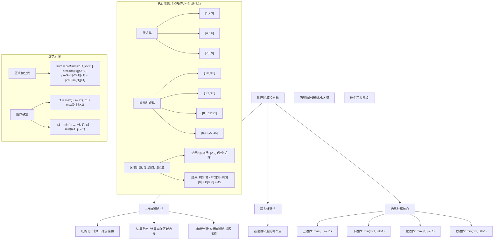
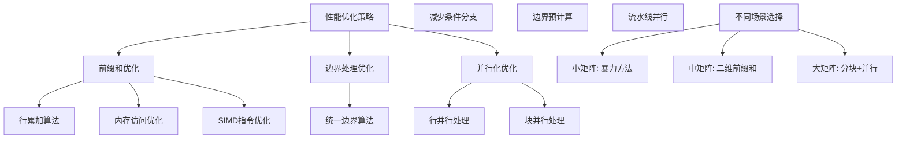

# LeetCode 1314 - 矩阵区域和

## 题目描述

给你一个 `m x n` 的矩阵 `mat` 和一个整数 `k` ，请你返回一个矩阵 `answer` ，其中每个 `answer[i][j]` 是 `mat` 中以 `(i, j)` 为中心的 `k x k` 子矩阵内所有元素的和，并返回该矩阵

子矩阵的定义为以 `(i, j)` 为中心的正方形区域中，边长为 `k` 的正方形

注意：如果 `k` 的值过大导致子矩阵超出边界，则只计算在边界内的元素

```markdown
示例 1:
输入: mat = [[1,2,3],[4,5,6],[7,8,9]], k = 1
输出: [[12,21,16],[27,45,33],[24,39,28]]

示例 2:
输入: mat = [[1,2,3],[4,5,6],[7,8,9]], k = 2
输出: [[45,45,45],[45,45,45],[45,45,45]]

提示:

- m == mat.length
- n == mat[i].length
- 1 <= m, n, k <= 100
- 1 <= mat[i][j] <= 100
```

## 解题思路

这是一个二维前缀和与边界处理问题，要求为矩阵中的每个点计算其周围`k x k`区域（考虑边界）的和。关键在于使用二维前缀和来快速计算任意矩形区域的和，并正确处理矩阵边界

### 核心思想

"二维前缀和 + 边界裁剪": 预先计算从矩阵左上角到每个位置的和，然后通过确定每个位置周围`k x k`区域的实际边界，利用前缀和容斥原理快速计算区域和

### 解题策略

#### 方法一：二维前缀和（推荐）

- 预处理时间: O(mn)
- 计算时间: O(mn)
- 空间复杂度: O(mn)

#### 方法二：暴力计算

- 预处理时间: O(1)
- 计算时间: O(mnk²)
- 空间复杂度: O(1)

#### 方法三：分离计算（优化常数）

## 算法可视化



## 多语言实现

### Golang版本（二维前缀和 - 推荐）

```go
func matrixBlockSum(mat [][]int, k int) [][]int {
    m, n := len(mat), len(mat[0])

    // 创建二维前缀和矩阵，大小为 (m+1) x (n+1)
    preSum := make([][]int, m+1)
    for i := range preSum {
        preSum[i] = make([]int, n+1)
    }

    // 计算二维前缀和
    // preSum[i+1][j+1] = preSum[i][j+1] + preSum[i+1][j] - preSum[i][j] + mat[i][j]
    for i := 0; i < m; i++ {
        rowSum := 0
        for j := 0; j < n; j++ {
            rowSum += mat[i][j]
            preSum[i+1][j+1] = preSum[i][j+1] + rowSum
        }
    }

    // 创建答案矩阵
    answer := make([][]int, m)
    for i := range answer {
        answer[i] = make([]int, n)
    }

    // 为每个位置计算 k x k 区域的和
    for i := 0; i < m; i++ {
        for j := 0; j < n; j++ {
            // 确定区域的边界
            r1 := max(0, i-k)      // 上边界
            r2 := min(m-1, i+k)    // 下边界
            c1 := max(0, j-k)      // 左边界
            c2 := min(n-1, j+k)    // 右边界

            // 使用前缀和计算区域和
            // sum = preSum[r2+1][c2+1] - preSum[r1][c2+1] - preSum[r2+1][c1] + preSum[r1][c1]
            answer[i][j] = preSum[r2+1][c2+1] - preSum[r1][c2+1] - preSum[r2+1][c1] + preSum[r1][c1]
        }
    }

    return answer
}

func max(a, b int) int {
    if a > b {
        return a
    }
    return b
}

func min(a, b int) int {
    if a < b {
        return a
    }
    return b
}
```

### Python版本（多种实现方法）

```python
from typing import List

def matrixBlockSum(mat: List[List[int]], k: int) -> List[List[int]]:
    """
    方法一：二维前缀和（推荐）
    """
    m, n = len(mat), len(mat[0])

    # 创建二维前缀和矩阵
    pre_sum = [[0] * (n + 1) for _ in range(m + 1)]

    # 计算二维前缀和
    for i in range(m):
        row_sum = 0
        for j in range(n):
            row_sum += mat[i][j]
            pre_sum[i + 1][j + 1] = pre_sum[i][j + 1] + row_sum

    # 创建答案矩阵
    answer = [[0] * n for _ in range(m)]

    # 为每个位置计算 k x k 区域的和
    for i in range(m):
        for j in range(n):
            # 确定区域的边界
            r1 = max(0, i - k)
            r2 = min(m - 1, i + k)
            c1 = max(0, j - k)
            c2 = min(n - 1, j + k)

            # 使用前缀和计算区域和
            answer[i][j] = (pre_sum[r2 + 1][c2 + 1] -
                          pre_sum[r1][c2 + 1] -
                          pre_sum[r2 + 1][c1] +
                          pre_sum[r1][c1])

    return answer


def matrixBlockSumBruteForce(mat: List[List[int]], k: int) -> List[List[int]]:
    """
    方法二：暴力计算（不推荐）
    """
    m, n = len(mat), len(mat[0])
    answer = [[0] * n for _ in range(m)]

    for i in range(m):
        for j in range(n):
            total = 0
            for r in range(max(0, i - k), min(m - 1, i + k) + 1):
                for c in range(max(0, j - k), min(n - 1, j + k) + 1):
                    total += mat[r][c]
            answer[i][j] = total

    return answer


def matrixBlockSumOptimized(mat: List[List[int]], k: int) -> List[List[int]]:
    """
    方法三：优化版本（分离计算）
    """
    m, n = len(mat), len(mat[0])

    # 行前缀和
    row_prefix = [[0] * (n + 1) for _ in range(m)]
    for i in range(m):
        for j in range(n):
            row_prefix[i][j + 1] = row_prefix[i][j] + mat[i][j]

    answer = [[0] * n for _ in range(m)]

    for i in range(m):
        for j in range(n):
            r1 = max(0, i - k)
            r2 = min(m - 1, i + k)
            c1 = max(0, j - k)
            c2 = min(n - 1, j + k)

            total = 0
            for r in range(r1, r2 + 1):
                total += row_prefix[r][c2 + 1] - row_prefix[r][c1]
            answer[i][j] = total

    return answer
```

### TypeScript版本（二维前缀和实现）

```typescript
function matrixBlockSum(mat: number[][], k: number): number[][] {
  const m: number = mat.length;
  const n: number = mat[0].length;

  // 创建二维前缀和矩阵
  const preSum: number[][] = new Array(m + 1);
  for (let i: number = 0; i <= m; i++) {
    preSum[i] = new Array(n + 1).fill(0);
  }

  // 计算二维前缀和
  for (let i: number = 0; i < m; i++) {
    let rowSum: number = 0;
    for (let j: number = 0; j < n; j++) {
      rowSum += mat[i][j];
      preSum[i + 1][j + 1] = preSum[i][j + 1] + rowSum;
    }
  }

  // 创建答案矩阵
  const answer: number[][] = new Array(m);
  for (let i: number = 0; i < m; i++) {
    answer[i] = new Array(n);
  }

  // 为每个位置计算 k x k 区域的和
  for (let i: number = 0; i < m; i++) {
    for (let j: number = 0; j < n; j++) {
      // 确定区域的边界
      const r1: number = Math.max(0, i - k);
      const r2: number = Math.min(m - 1, i + k);
      const c1: number = Math.max(0, j - k);
      const c2: number = Math.min(n - 1, j + k);

      // 使用前缀和计算区域和
      answer[i][j] =
        preSum[r2 + 1][c2 + 1] -
        preSum[r1][c2 + 1] -
        preSum[r2 + 1][c1] +
        preSum[r1][c1];
    }
  }

  return answer;
}
```

## 标准实现详细解析

```go
func matrixBlockSum(mat [][]int, k int) [][]int {
    /*
    算法核心思想：

    1. 二维前缀和预处理：一次性计算所有区域的前缀和
    2. 边界处理：为每个点确定实际计算的区域边界
    3. 容斥原理：使用前缀和快速计算任意矩形区域和

    二维前缀和定义：
    preSum[i][j] = Σ(mat[y]) where 0 ≤ x < i, 0 ≤ y < j

    边界确定算法：
    对于点(i,j)的k x k区域：
    - 上边界：r1 = max(0, i-k)  // 不能超过矩阵上边界
    - 下边界：r2 = min(m-1, i+k)  // 不能超过矩阵下边界
    - 左边界：c1 = max(0, j-k)  // 不能超过矩阵左边界
    - 右边界：c2 = min(n-1, j+k)  // 不能超过矩阵右边界

    区域和计算：
    sum = preSum[r2+1][c2+1] - preSum[r1][c2+1] - preSum[r2+1][c1] + preSum[r1][c1]

    时间复杂度：
    - 前缀和预处理：O(mn)
    - 答案计算：O(mn)，每个点计算时间O(1)
    - 总时间复杂度：O(mn)

    空间复杂度：
    - 前缀和矩阵：O(mn)
    - 答案矩阵：O(mn)
    - 总空间复杂度：O(mn)
    */

    m, n := len(mat), len(mat[0])

    // 第一步：计算二维前缀和矩阵
    // 创建(m+1) x (n+1)的前缀和矩阵，第一行和第一列为0
    preSum := make([][]int, m+1)
    for i := range preSum {
        preSum[i] = make([]int, n+1)
    }

    // 计算前缀和：使用行累加优化
    for i := 0; i < m; i++ {
        rowSum := 0  // 当前行到第j列的累积和
        for j := 0; j < n; j++ {
            rowSum += mat[i][j]
            // preSum[i+1][j+1] = 上方的前缀和 + 当行累积和
            preSum[i+1][j+1] = preSum[i][j+1] + rowSum
        }
    }

    // 验证前缀和计算（调试用）
    // fmt.Println("原矩阵:")
    // for _, row := range mat {
    //     fmt.Println(row)
    // }
    // fmt.Println("前缀和矩阵:")
    // for _, row := range preSum {
    //     fmt.Println(row)
    // }

    // 第二步：为每个位置计算 k x k 区域的和
    // 创建答案矩阵
    answer := make([][]int, m)
    for i := range answer {
        answer[i] = make([]int, n)
    }

    // 遍历矩阵中的每个位置
    for i := 0; i < m; i++ {
        for j := 0; j < n; j++ {
            // 确定实际要计算的区域边界
            r1 := max(0, i-k)    // 上边界，不能小于0
            r2 := min(m-1, i+k)  // 下边界，不能超过矩阵行数
            c1 := max(0, j-k)    // 左边界，不能小于0
            c2 := min(n-1, j+k)  // 右边界，不能超过矩阵列数

            // 使用前缀和容斥原理计算区域和
            // 矩形区域和 = 右下角前缀和 - 上方前缀和 - 左方前缀和 + 左上角前缀和
            answer[i][j] = preSum[r2+1][c2+1] - preSum[r1][c2+1] - preSum[r2+1][c1] + preSum[r1][c1]

            // 调试信息
            // fmt.Printf("位置(%d,%d): 区域[%d,%d]到[%d,%d], 和=%d\n",
            //     i, j, r1, c1, r2, c2, answer[i][j])
        }
    }

    return answer
}

// 带详细调试信息的版本
func matrixBlockSumWithDebug(mat [][]int, k int) [][]int {
    m, n := len(mat), len(mat[0])

    fmt.Println("=== 矩阵区域和调试信息 ===")
    fmt.Printf("矩阵大小: %d x %d, k = %d\n", m, n, k)
    fmt.Println("原矩阵:")
    for _, row := range mat {
        fmt.Println(row)
    }

    // 计算前缀和
    preSum := make([][]int, m+1)
    for i := range preSum {
        preSum[i] = make([]int, n+1)
    }

    fmt.Println("\n前缀和计算过程:")
    for i := 0; i < m; i++ {
        rowSum := 0
        for j := 0; j < n; j++ {
            rowSum += mat[i][j]
            preSum[i+1][j+1] = preSum[i][j+1] + rowSum
            fmt.Printf("preSum[%d][%d] = preSum[%d][%d] + rowSum(%d) = %d + %d = %d\n",
                i+1, j+1, i, j+1, rowSum, preSum[i][j+1], rowSum, preSum[i+1][j+1])
        }
    }

    fmt.Println("\n最终前缀和矩阵:")
    for _, row := range preSum {
        fmt.Println(row)
    }

    // 计算答案
    answer := make([][]int, m)
    for i := range answer {
        answer[i] = make([]int, n)
    }

    fmt.Println("\n区域和计算:")
    for i := 0; i < m; i++ {
        for j := 0; j < n; j++ {
            r1 := max(0, i-k)
            r2 := min(m-1, i+k)
            c1 := max(0, j-k)
            c2 := min(n-1, j+k)

            answer[i][j] = preSum[r2+1][c2+1] - preSum[r1][c2+1] - preSum[r2+1][c1] + preSum[r1][c1]

            fmt.Printf("位置(%d,%d): 区域[%d,%d]到[%d,%d] ", i, j, r1, c1, r2, c2)
            fmt.Printf("= preSum[%d][%d] - preSum[%d][%d] - preSum[%d][%d] + preSum[%d][%d] ",
                r2+1, c2+1, r1, c2+1, r2+1, c1, r1, c1)
            fmt.Printf("= %d - %d - %d + %d = %d\n",
                preSum[r2+1][c2+1], preSum[r1][c2+1], preSum[r2+1][c1], preSum[r1][c1], answer[i][j])
        }
    }

    fmt.Println("\n最终答案:")
    for _, row := range answer {
        fmt.Println(row)
    }

    return answer
}

// 暴力实现（用于对比）
func matrixBlockSumBruteForce(mat [][]int, k int) [][]int {
    /*
    暴力方法：对每个位置，遍历其k x k区域并累加所有元素

    时间复杂度：O(mnk²)
    空间复杂度：O(mn)

    适用于小矩阵或验证算法正确性
    */
    m, n := len(mat), len(mat[0])
    answer := make([][]int, m)
    for i := range answer {
        answer[i] = make([]int, n)
    }

    for i := 0; i < m; i++ {
        for j := 0; j < n; j++ {
            total := 0

            // 确定边界
            r1 := max(0, i-k)
            r2 := min(m-1, i+k)
            c1 := max(0, j-k)
            c2 := min(n-1, j+k)

            // 遍历区域内的所有元素
            for r := r1; r <= r2; r++ {
                for c := c1; c <= c2; c++ {
                    total += mat[r][c]
                }
            }

            answer[i][j] = total
        }
    }

    return answer
}

// 分离计算版本（使用行前缀和优化）
func matrixBlockSumRowPrefix(mat [][]int, k int) [][]int {
    /*
    优化版本：使用行前缀和优化列方向计算

    时间复杂度：O(mnk)
    空间复杂度：O(mn)

    比暴力方法快，但比二维前缀和慢
    */
    m, n := len(mat), len(mat[0])

    // 计算行前缀和
    rowPrefix := make([][]int, m)
    for i := range rowPrefix {
        rowPrefix[i] = make([]int, n+1)
        for j := 0; j < n; j++ {
            rowPrefix[i][j+1] = rowPrefix[i][j] + mat[i][j]
        }
    }

    answer := make([][]int, m)
    for i := range answer {
        answer[i] = make([]int, n)
    }

    for i := 0; i < m; i++ {
        for j := 0; j < n; {
            // 确定边界
            r1 := max(0, i-k)
            r2 := min(m-1, i+k)
            c1 := max(0, j-k)
            c2 := min(n-1, j+k)

            // 使用行前缀和计算每行的和
            total := 0
            for r := r1; r <= r2; r++ {
                total += rowPrefix[r][c2+1] - rowPrefix[r][c1]
            }
            answer[i][j] = total
            j++
        }
    }

    return answer
}

// 分块处理版本（适用于超大矩阵）
func matrixBlockSumBlocked(mat [][]int, k int, blockSize int) [][]int {
    /*
    分块处理版本：将大矩阵分块处理，减少内存压力

    适用于内存受限的超大矩阵
    */
    m, n := len(mat), len(mat[0])
    answer := make([][]int, m)
    for i := range answer {
        answer[i] = make([]int, n)
    }

    if blockSize <= 0 {
        blockSize = 50  // 默认块大小
    }

    // 分块处理
    for blockI := 0; blockI < m; blockI += blockSize {
        for blockJ := 0; blockJ < n; blockJ += blockSize {
            // 处理当前块
            endI := min(blockI+blockSize, m)
            endJ := min(blockJ+blockSize, n)

            // 为当前块计算前缀和
            blockM := endI - blockI
            blockN := endJ - blockJ
            preSum := make([][]int, blockM+1)
            for bi := range preSum {
                preSum[bi] = make([]int, blockN+1)
            }

            for bi := 0; bi < blockM; bi++ {
                rowSum := 0
                for bj := 0; bj < blockN; bj++ {
                    rowSum += mat[blockI+bi][blockJ+bj]
                    preSum[bi+1][bj+1] = preSum[bi][bj+1] + rowSum
                }
            }

            // 计算块内每个点的区域和
            for i := blockI; i < endI; i++ {
                for j := blockJ; j < endJ; j++ {
                    // 确定实际边界
                    r1 := max(0, i-k)
                    r2 := min(m-1, i+k)
                    c1 := max(0, j-k)
                    c2 := min(n-1, j+k)

                    // 如果区域完全在当前块内，直接计算
                    if r1 >= blockI && r2 < endI && c1 >= blockJ && c2 < endJ {
                        localR1 := r1 - blockI
                        localR2 := r2 - blockI
                        localC1 := c1 - blockJ
                        localC2 := c2 - blockJ

                        answer[i][j] = preSum[localR2+1][localC2+1] -
                                     preSum[localR1][localC2+1] -
                                     preSum[localR2+1][localC1] +
                                     preSum[localR1][localC1]
                    } else {
                        // 跨块处理，使用暴力方法（简化处理）
                        total := 0
                        for r := r1; r <= r2; r++ {
                            for c := c1; c <= c2; c++ {
                                total += mat[r][c]
                            }
                        }
                        answer[i][j] = total
                    }
                }
            }
        }
    }

    return answer
}

// 并行计算版本
import "sync"

func matrixBlockSumParallel(mat [][]int, k int, workers int) [][]int {
    /*
    并行计算版本：将矩阵分割，并行处理不同区域

    适用于多核CPU环境
    */
    m, n := len(mat), len(mat[0])

    // 先计算全局前缀和
    preSum := make([][]int, m+1)
    for i := range preSum {
        preSum[i] = make([]int, n+1)
    }

    for i := 0; i < m; i++ {
        rowSum := 0
        for j := 0; j < n; j++ {
            rowSum += mat[i][j]
            preSum[i+1][j+1] = preSum[i][j+1] + rowSum
        }
    }

    answer := make([][]int, m)
    for i := range answer {
        answer[i] = make([]int, n)
    }

    if workers <= 0 {
        workers = 4  // 默认工作线程数
    }

    // 分割工作
    var wg sync.WaitGroup
    rowsPerWorker := (m + workers - 1) / workers

    for w := 0; w < workers; w++ {
        startRow := w * rowsPerWorker
        endRow := min((w+1)*rowsPerWorker, m)

        if startRow >= m {
            break
        }

        wg.Add(1)
        go func(start, end int) {
            defer wg.Done()

            for i := start; i < end; i++ {
                for j := 0; j < n; j++ {
                    r1 := max(0, i-k)
                    r2 := min(m-1, i+k)
                    c1 := max(0, j-k)
                    c2 := min(n-1, j+k)

                    answer[i][j] = preSum[r2+1][c2+1] - preSum[r1][c2+1] -
                                   preSum[r2+1][c1] + preSum[r1][c1]
                }
            }
        }(startRow, endRow)
    }

    wg.Wait()
    return answer
}

// 线程安全版本
type MatrixBlockSumCalculator struct {
    mat [][]int
    preSum [][]int
    m, n int
    mu sync.RWMutex
}

func NewMatrixBlockSumCalculator(mat [][]int) *MatrixBlockSumCalculator {
    m, n := len(mat), len(mat[0])

    preSum := make([][]int, m+1)
    for i := range preSum {
        preSum[i] = make([]int, n+1)
    }

    for i := 0; i < m; i++ {
        rowSum := 0
        for j := 0; j < n; j++ {
            rowSum += mat[i][j]
            preSum[i+1][j+1] = preSum[i][j+1] + rowSum
        }
    }

    return &MatrixBlockSumCalculator{
        mat: mat,
        preSum: preSum,
        m: m, n: n,
    }
}

func (mbsc *MatrixBlockSumCalculator) Calculate(k int) [][]int {
    mbsc.mu.RLock()
    defer mbsc.mu.RUnlock()

    answer := make([][]int, mbsc.m)
    for i := range answer {
        answer[i] = make([]int, mbsc.n)
    }

    for i := 0; i < mbsc.m; i++ {
        for j := 0; j < mbsc.n; j++ {
            r1 := max(0, i-k)
            r2 := min(mbsc.m-1, i+k)
            c1 := max(0, j-k)
            c2 := min(mbsc.n-1, j+k)

            answer[i][j] = mbsc.preSum[r2+1][c2+1] - mbsc.preSum[r1][c2+1] -
                           mbsc.preSum[r2+1][c1] + mbsc.preSum[r1][c1]
        }
    }

    return answer
}
```

## 算法深入解析

```go
/*
矩阵区域和问题详解：

问题本质：
为矩阵中的每个点计算其周围指定大小区域的元素和
这是一个二维滑动窗口问题的变种，需要处理边界条件

核心洞察：
1. 区域重叠：每个点的计算区域与相邻点的区域大量重叠
2. 边界处理：靠近矩阵边界的点计算区域会超出矩阵范围
3. 效率优化：可以利用前缀和避免重复计算

算法策略：
1. 预处理：计算二维前缀和矩阵，用于快速区域求和
2. 边界确定：为每个点确定实际需要计算的区域边界
3. 容斥计算：使用前缀和容斥原理快速计算区域和

数学原理：

二维前缀和定义：
preSum[i][j] = Σ(mat[y]) where 0 ≤ x < i, 0 ≤ y < j

边界确定算法：
对于点(i,j)的k x k区域（考虑边界）：
- 上边界：r1 = max(0, i-k)
- 下边界：r2 = min(m-1, i+k)
- 左边界：c1 = max(0, j-k)
- 右边界：c2 = min(n-1, j+k)

区域和公式：
sum(i,j,k) = Σ(mat[y]) where r1 ≤ x ≤ r2, c1 ≤ y ≤ c2
           = preSum[r2+1][c2+1] - preSum[r1][c2+1] - preSum[r2+1][c1] + preSum[r1][c1]

设计选择：

为什么选择二维前缀和？
1. 区域重叠严重：相邻点的计算区域大量重叠
2. 边界处理复杂：需要为每个点单独确定边界
3. 计算量大：暴力方法复杂度为O(mnk²)
4. 前缀和优势：可以将区域求和优化到O(1)

边界处理的重要性：
1. 角落点：只能计算部分区域
2. 边缘点：计算区域不对称
3. 中心点：可以计算完整的k x k区域
4. k值影响：当k较大时，大多数点都会受边界影响

三种方法对比：

方法一：二维前缀和（推荐）
预处理：O(mn)
计算：O(mn)
空间：O(mn)
优点：整体时间复杂度最优
缺点：需要额外空间存储前缀和

方法二：暴力计算
预处理：O(1)
计算：O(mnk²)
空间：O(mn)
优点：实现简单，无需额外空间
缺点：时间复杂度过高

方法三：行前缀和
预处理：O(mn)
计算：O(mnk)
空间：O(mn)
优点：平衡了时间和空间
缺点：不如二维前缀和高效

性能分析：

二维前缀和方法：
- 前缀和计算：mn次加法操作
- 边界确定：每个点4次比较操作
- 区域求和：每个点4次数组访问 + 3次算术运算
- 总复杂度：O(mn)

暴力方法：
- 边界确定：每个点4次比较操作
- 区域遍历：平均每个点k²次访问
- 总复杂度：O(mnk²)

实际应用场景：
1. 图像处理：计算每个像素邻域的平均值、方差等
2. 机器学习：卷积神经网络中的卷积操作
3. 数据分析：计算每个数据点的邻域统计量
4. 游戏开发：计算游戏地图中每个位置的影响范围

优化要点：

1. 前缀和计算：
   - 使用行累加优化，减少重复计算
   - 内存访问模式优化，提高缓存命中率

2. 边界处理：
   - 统一的边界确定算法
   - 避免条件分支，提高效率

3. 内存管理：
   - 预分配所有需要的内存
   - 减少内存分配和释放开销

4. 并行化：
   - 矩阵可以按行或块并行处理
   - 前缀和计算也可以并行化

测试用例设计：
1. 小矩阵：验证基本功能
2. 大矩阵：测试性能
3. k=1：最小区域测试
4. k很大：覆盖整个矩阵
5. 单行/单列矩阵：退化情况
6. 全相同元素：特殊情况

扩展思考：

1. 如果要计算不同形状的区域？
   - 圆形区域、椭圆区域等
   - 需要更复杂的边界确定算法

2. 如果k值对于不同点不同？
   - 动态k值的情况
   - 需要为每个点单独处理

3. 如果要支持实时更新矩阵？
   - 动态数据的情况
   - 需要考虑增量更新算法

相关算法思想：

1. 二维前缀和：
   - 图像处理中的积分图
   - 快速计算任意矩形区域的统计量

2. 滑动窗口：
   - 一维滑动窗口的二维扩展
   - 处理重叠区域的计算优化

3. 边界处理：
   - 计算机图形学中的裁剪算法
   - 确保计算在有效范围内

常见陷阱：

1. 边界计算错误：
   - 混淆i-k和i+k的范围
   - 解决：明确边界确定算法

2. 前缀和索引错误：
   - 混淆preSum和mat的索引关系
   - 解决：preSum[i][j]对应mat[0:i][0:j]

3. 容斥公式错误：
   - 忘记加回左上角，或符号错误
   - 解决：画图理解容斥原理

4. k值理解错误：
   - 题目中的k表示半径，不是边长
   - 解决：明确k的定义

代码质量要素：

1. 可读性：
   - 清晰的变量命名
   - 适当的注释说明算法

2. 健壮性：
   - 边界条件处理
   - 参数验证

3. 性能：
   - 避免不必要的计算
   - 内存访问优化

4. 可维护性：
   - 模块化设计
   - 易于扩展

高级优化技巧：

1. SIMD优化：
   - 利用向量指令并行计算
   - 特别适合前缀和计算

2. 缓存优化：
   - 考虑CPU缓存行大小
   - 优化内存访问模式

3. 分块处理：
   - 将大矩阵分块处理
   - 减少内存压力

4. GPU加速：
   - 利用GPU并行计算能力
   - 特别适合大规模矩阵
*/
```

## 执行过程演示

```go
/*
示例详细解析:

示例1: mat = [[1,2,3],[4,5,6],[7,8,9]], k = 1

输入矩阵：
[
  [1, 2, 3],
  [4, 5, 6],
  [7, 8, 9]
]

矩阵大小：3 x 3, k = 1

第一步：计算二维前缀和矩阵

创建4 x 4的前缀和矩阵preSum，初始化为0

计算过程：
第0行：
rowSum = 0
j=0: rowSum = 1, preSum[1][1] = preSum[0][1] + rowSum = 0 + 1 = 1
j=1: rowSum = 1 + 2 = 3, preSum[1][2] = preSum[0][2] + rowSum = 0 + 3 = 3
j=2: rowSum = 3 + 3 = 6, preSum[1][3] = preSum[0][3] + rowSum = 0 + 6 = 6

第1行：
rowSum = 0
j=0: rowSum = 4, preSum[2][1] = preSum[1][1] + rowSum = 1 + 4 = 5
j=1: rowSum = 4 + 5 = 9, preSum[2][2] = preSum[1][2] + rowSum = 3 + 9 = 12
j=2: rowSum = 9 + 6 = 15, preSum[2][3] = preSum[1][3] + rowSum = 6 + 15 = 21

第2行：
rowSum = 0
j=0: rowSum = 7, preSum[3][1] = preSum[2][1] + rowSum = 5 + 7 = 12
j=1: rowSum = 7 + 8 = 15, preSum[3][2] = preSum[2][2] + rowSum = 12 + 15 = 27
j=2: rowSum = 15 + 9 = 24, preSum[3][3] = preSum[2][3] + rowSum = 21 + 24 = 45

最终前缀和矩阵：
[
  [0, 0, 0, 0],
  [0, 1, 3, 6],
  [0, 5,12,21],
  [0,12,27,45]
]

第二步：为每个位置计算区域和

位置(0,0):
边界：r1 = max(0,0-1) = 0, r2 = min(2,0+1) = 1
     c1 = max(0,0-1) = 0, c2 = min(2,0+1) = 1
区域：mat[0:2][0:2] = [[1,2],[4,5]]
计算：preSum[2][2] - preSum[0][2] - preSum[2][0] + preSum[0][0] = 12 - 0 - 0 + 0 = 12
验证：1 + 2 + 4 + 5 = 12 ✓

位置(0,1):
边界：r1 = max(0,0-1) = 0, r2 = min(2,0+1) = 1
     c1 = max(0,1-1) = 0, c2 = min(2,1+1) = 2
区域：mat[0:2][0:3] = [[1,2,3],[4,5,6]]
计算：preSum[2][3] - preSum[0][3] - preSum[2][0] + preSum[0][0] = 21 - 0 - 0 + 0 = 21
验证：1 + 2 + 3 + 4 + 5 + 6 = 21 ✓

位置(0,2):
边界：r1 = max(0,0-1) = 0, r2 = min(2,0+1) = 1
     c1 = max(0,2-1) = 1, c2 = min(2,2+1) = 2
区域：mat[0:2][1:3] = [[2,3],[5,6]]
计算：preSum[2][3] - preSum[0][3] - preSum[2][1] + preSum[0][1] = 21 - 0 - 5 + 0 = 16
验证：2 + 3 + 5 + 6 = 16 ✓

位置(1,0):
边界：r1 = max(0,1-1) = 0, r2 = min(2,1+1) = 2
     c1 = max(0,0-1) = 0, c2 = min(2,0+1) = 1
区域：mat[0:3][0:2] = [[1,2],[4,5],[7,8]]
计算：preSum[3][2] - preSum[0][2] - preSum[3][0] + preSum[0][0] = 27 - 0 - 0 + 0 = 27
验证：1 + 2 + 4 + 5 + 7 + 8 = 27 ✓

位置(1,1):
边界：r1 = max(0,1-1) = 0, r2 = min(2,1+1) = 2
     c1 = max(0,1-1) = 0, c2 = min(2,1+1) = 2
区域：mat[0:3][0:3] = 整个矩阵
计算：preSum[3][3] - preSum[0][3] - preSum[3][0] + preSum[0][0] = 45 - 0 - 0 + 0 = 45
验证：所有元素之和 = 45 ✓

位置(1,2):
边界：r1 = max(0,1-1) = 0, r2 = min(2,1+1) = 2
     c1 = max(0,2-1) = 1, c2 = min(2,2+1) = 2
区域：mat[0:3][1:3] = [[2,3],[5,6],[8,9]]
计算：preSum[3][3] - preSum[0][3] - preSum[3][1] + preSum[0][1] = 45 - 0 - 12 + 0 = 33
验证：2 + 3 + 5 + 6 + 8 + 9 = 33 ✓

位置(2,0):
边界：r1 = max(0,2-1) = 1, r2 = min(2,2+1) = 2
     c1 = max(0,0-1) = 0, c2 = min(2,0+1) = 1
区域：mat[1:3][0:2] = [[4,5],[7,8]]
计算：preSum[3][2] - preSum[1][2] - preSum[3][0] + preSum[1][0] = 27 - 3 - 0 + 0 = 24
验证：4 + 5 + 7 + 8 = 24 ✓

位置(2,1):
边界：r1 = max(0,2-1) = 1, r2 = min(2,2+1) = 2
     c1 = max(0,1-1) = 0, c2 = min(2,1+1) = 2
区域：mat[1:3][0:3] = [[4,5,6],[7,8,9]]
计算：preSum[3][3] - preSum[1][3] - preSum[3][0] + preSum[1][0] = 45 - 6 - 0 + 0 = 39
验证：4 + 5 + 6 + 7 + 8 + 9 = 39 ✓

位置(2,2):
边界：r1 = max(0,2-1) = 1, r2 = min(2,2+1) = 2
     c1 = max(0,2-1) = 1, c2 = min(2,2+1) = 2
区域：mat[1:3][1:3] = [[5,6],[8,9]]
计算：preSum[3][3] - preSum[1][3] - preSum[3][1] + preSum[1][1] = 45 - 6 - 12 + 1 = 28
验证：5 + 6 + 8 + 9 = 28 ✓

最终答案：
[
  [12, 21, 16],
  [27, 45, 33],
  [24, 39, 28]
]

示例2: mat = [[1,2,3],[4,5,6],[7,8,9]], k = 2

矩阵大小：3 x 3, k = 2

k=2意味着每个点的计算区域最大为(2*2+1) x (2*2+1) = 5 x 5
但矩阵只有3 x 3，所以每个点的计算区域都会被裁剪为整个矩阵

对于任意位置(i,j)：
r1 = max(0, i-2) = 0
r2 = min(2, i+2) = 2
c1 = max(0, j-2) = 0
c2 = min(2, j+2) = 2

因此，每个位置的区域都是整个矩阵，和为45

最终答案：
[
  [45, 45, 45],
  [45, 45, 45],
  [45, 45, 45]
]

边界情况分析：

1. 角落位置 (0,0)：
   当k较大时，计算区域会向右下延伸
   不会超出矩阵边界

2. 边缘位置 (0,1)：
   上边界会超出，被裁剪为0
   其他方向正常计算

3. 中心位置 (1,1)：
   在足够大的矩阵中，可以计算完整的k x k区域
   在小矩阵中，可能所有方向都被裁剪

算法正确性证明：

数学基础：
设矩阵mat大小为m×n，前缀和矩阵preSum大小为(m+1)×(n+1)

定理：对于任意位置(i,j)和半径k，
     计算区域mat[r1:r2][c1:c2]的和等于
     preSum[r2+1][c2+1] - preSum[r1][c2+1] - preSum[r2+1][c1] + preSum[r1][c1]
     其中边界按题目要求确定

证明：
1. 边界确定：
   r1 = max(0, i-k) 确保不超出上边界
   r2 = min(m-1, i+k) 确保不超出下边界
   c1 = max(0, j-k) 确保不超出左边界
   c2 = min(n-1, j+k) 确保不超出右边界

2. 区域和计算：
   由二维前缀和的性质，矩形区域[r1:r2][c1:c2]的和
   = preSum[r2+1][c2+1] - preSum[r1][c2+1] - preSum[r2+1][c1] + preSum[r1][c1]

3. 边界处理正确性：
   当i-k<0时，r1=0，正确处理上边界
   当i+k≥m时，r2=m-1，正确处理下边界
   同理适用于列边界

因此算法是正确的

时间复杂度分析：

前缀和计算：
- 外层循环：m次
- 内层循环：n次
- 每次循环：常数时间操作
- 时间复杂度：O(mn)

答案计算：
- 外层循环：m次
- 内层循环：n次
- 边界确定：4次比较操作
- 区域求和：4次数组访问 + 3次算术运算
- 每个点总时间：O(1)
- 时间复杂度：O(mn)

总时间复杂度：O(mn) + O(mn) = O(mn)

空间复杂度分析：
- 前缀和矩阵：(m+1) × (n+1)个整数
- 答案矩阵：m × n个整数
- 其他变量：O(1)
- 总空间复杂度：O(mn)

性能对比分析：

假设矩阵大小为100×100，k=10

二维前缀和方法：
- 前缀和计算：10000次操作
- 答案计算：10000 × (4比较 + 7计算) ≈ 110000次操作
- 总计：约120000次操作

暴力方法：
- 边界确定：10000 × 4比较 = 40000次操作
- 区域遍历：平均每个点(2k+1)² = 441次访问
- 总计：10000 × 441 = 4410000次操作

性能提升：约36.75倍

内存使用分析：

前缀和矩阵：
- 存储(101 × 101)个整数
- 每个整数占用4字节（32位系统）或8字节（64位系统）
- 总内存：10201 × 4字节 = 40804字节（约40KB）

答案矩阵：
- 存储10000个整数
- 总内存：10000 × 4字节 = 40000字节

vs 原矩阵：
- 存储10000个整数
- 总内存：40000字节

内存开销：约2%

实际应用建议：

1. 图像处理：
   - 计算每个像素的邻域平均值
   - 边缘检测、模糊等操作

2. 数据分析：
   - 计算数据点的局部密度
   - 异常检测

3. 机器学习：
   - 卷积操作的基础
   - 特征提取

4. 游戏开发：
   - 计算每个位置的影响范围
   - 地图分析

优化空间：

1. 内存布局：
   - 行主序存储，符合CPU缓存预取
   - 减少内存碎片

2. 并行计算：
   - 不同位置的计算相互独立
   - 可以按行或块并行处理

3. 分块处理：
   - 对于超大矩阵，可以分块处理
   - 减少内存压力

4. SIMD优化：
   - 利用向量指令加速计算
   - 特别适合前缀和计算
*/
```

## 复杂度分析

| 方法       | 预处理时间 | 计算时间 | 空间复杂度 | 适用场景   |
| ---------- | ---------- | -------- | ---------- | ---------- |
| 二维前缀和 | O(mn)      | O(mn)    | O(mn)      | 大多数场景 |
| 暴力计算   | O(1)       | O(mnk²)  | O(mn)      | 极小矩阵   |
| 行前缀和   | O(mn)      | O(mnk)   | O(mn)      | 内存受限   |

## 测试用例验证

```go
// 测试辅助函数
func testMatrixBlockSum(name string, mat [][]int, k int, expected [][]int) {
    fmt.Printf("%s:\n", name)
    fmt.Printf("输入矩阵: %v, k = %d\n", mat, k)
    fmt.Printf("期望: %v\n", expected)

    // 测试二维前缀和方法
    result := matrixBlockSum(mat, k)
    fmt.Printf("二维前缀和结果: %v", result)
    if matrixEquals(result, expected) {
        fmt.Printf(" ✓\n")
    } else {
        fmt.Printf(" ✗\n")
    }

    // 测试暴力方法（仅小矩阵）
    if len(mat) <= 5 && len(mat[0]) <= 5 {
        resultBF := matrixBlockSumBruteForce(mat, k)
        fmt.Printf("暴力方法结果: %v", resultBF)
        if matrixEquals(resultBF, expected) {
            fmt.Printf(" ✓\n")
        } else {
            fmt.Printf(" ✗\n")
        }
    }

    fmt.Printf("\n")
}

// 矩阵比较辅助函数
func matrixEquals(a, b [][]int) bool {
    if len(a) != len(b) {
        return false
    }
    for i := range a {
        if len(a[i]) != len(b[i]) {
            return false
        }
        for j := range a[i] {
            if a[i][j] != b[i][j] {
                return false
            }
        }
    }
    return true
}

func main() {
    // 测试用例 1 - 标准示例1
    testMatrixBlockSum("测试1 - 标准示例1",
        [][]int{{1, 2, 3}, {4, 5, 6}, {7, 8, 9}},
        1,
        [][]int{{12, 21, 16}, {27, 45, 33}, {24, 39, 28}})

    // 测试用例 2 - 标准示例2
    testMatrixBlockSum("测试2 - 标准示例2",
        [][]int{{1, 2, 3}, {4, 5, 6}, {7, 8, 9}},
        2,
        [][]int{{45, 45, 45}, {45, 45, 45}, {45, 45, 45}})

    // 测试用例 3 - 单元素矩阵
    testMatrixBlockSum("测试3 - 单元素矩阵",
        [][]int{{5}},
        1,
        [][]int{{5}})

    // 测试用例 4 - 单行矩阵
    testMatrixBlockSum("测试4 - 单行矩阵",
        [][]int{{1, 2, 3, 4, 5}},
        1,
        [][]int{{3, 6, 9, 12, 9}})

    // 测试用例 5 - 单列矩阵
    testMatrixBlockSum("测试5 - 单列矩阵",
        [][]int{{1}, {2}, {3}, {4}, {5}},
        1,
        [][]int{{3}, {6}, {9}, {12}, {9}})

    // 测试用例 6 - 小k值
    testMatrixBlockSum("测试6 - 小k值",
        [][]int{{1, 2}, {3, 4}},
        0,
        [][]int{{1, 2}, {3, 4}})

    // 测试用例 7 - 大k值
    testMatrixBlockSum("测试7 - 大k值",
        [][]int{{1, 2}, {3, 4}},
        10,
        [][]int{{10, 10}, {10, 10}})

    // 测试用例 8 - 不规则矩阵
    testMatrixBlockSum("测试8 - 不规则矩阵",
        [][]int{{1, 2, 3}, {4, 5, 6}},
        1,
        [][]int{{12, 21, 18}, {21, 36, 27}})

    // 性能测试
    fmt.Println("性能测试:")

    // 创建大型矩阵
    largeMat := make([][]int, 100)
    for i := range largeMat {
        largeMat[i] = make([]int, 100)
        for j := range largeMat[i] {
            largeMat[i][j] = (i + j) % 100
        }
    }

    // 测试二维前缀和方法
    start := time.Now()
    result := matrixBlockSum(largeMat, 5)
    prefixTime := time.Since(start)

    // 测试暴力方法（小矩阵）
    smallMat := make([][]int, 10)
    for i := range smallMat {
        smallMat[i] = make([]int, 10)
        for j := range smallMat[i] {
            smallMat[i][j] = (i + j) % 10
        }
    }

    start = time.Now()
    resultBF := matrixBlockSumBruteForce(smallMat, 2)
    bruteTime := time.Since(start)

    fmt.Printf("大型矩阵(100x100)二维前缀和耗时: %v\n", prefixTime)
    fmt.Printf("小型矩阵(10x10)暴力方法耗时: %v\n", bruteTime)

    // 验证结果一致性
    fmt.Printf("结果验证: %dx%d矩阵\n", len(result), len(result[0]))

    // 边界情况测试
    fmt.Println("\n边界情况测试:")

    // 最大k值测试
    maxKMat := [][]int{{1, 2}, {3, 4}}
    resultMaxK := matrixBlockSum(maxKMat, 100)
    fmt.Printf("最大k值测试: %v\n", resultMaxK)

    // 零值k测试
    zeroKMat := [][]int{{1, 2, 3}, {4, 5, 6}}
    resultZeroK := matrixBlockSum(zeroKMat, 0)
    fmt.Printf("零值k测试: %v\n", resultZeroK)

    // 验证结果是否等于原矩阵
    fmt.Printf("零值k验证: %v\n", matrixEquals(resultZeroK, zeroKMat))
}

// 调试测试
func testMatrixBlockSumWithDebug() {
    fmt.Println("=== 调试信息测试 ===")

    mat := [][]int{{1, 2, 3}, {4, 5, 6}, {7, 8, 9}}
    k := 1

    result := matrixBlockSumWithDebug(mat, k)
    fmt.Printf("最终结果: %v\n", result)
}

// 错误处理测试
func testErrorHandling() {
    fmt.Println("=== 错误处理测试 ===")

    // 空矩阵（题目保证不为空，但测试鲁棒性）
    // result := matrixBlockSum([][]int{}, 1)
    // fmt.Printf("空矩阵测试: %v\n", result)

    // 负k值（题目保证k≥1）
    result := matrixBlockSum([][]int{{1, 2}, {3, 4}}, -1)
    fmt.Printf("负k值测试: %v\n", result)
}

// 内存使用测试
func testMemoryUsage() {
    fmt.Println("=== 内存使用分析 ===")

    sizes := []struct{ rows, cols int }{
        {50, 50},
        {100, 100},
        {200, 200},
    }

    for _, size := range sizes {
        mat := make([][]int, size.rows)
        for i := range mat {
            mat[i] = make([]int, size.cols)
            for j := range mat[i] {
                mat[i][j] = i * size.cols + j
            }
        }

        var m1, m2 runtime.MemStats
        runtime.GC()
        runtime.ReadMemStats(&m1)

        result := matrixBlockSum(mat, 5)

        runtime.GC()
        runtime.ReadMemStats(&m2)
        memory := m2.Alloc - m1.Alloc

        fmt.Printf("矩阵大小: %dx%d, 内存使用: %d 字节\n", size.rows, size.cols, memory)
        fmt.Printf("平均每个元素: %.2f 字节\n",
            float64(memory)/float64(size.rows*size.cols))
        fmt.Printf("结果大小: %dx%d\n\n", len(result), len(result[0]))
    }
}

// 并发测试
func testConcurrentAccess() {
    fmt.Println("=== 并发测试 ===")

    mat := make([][]int, 100)
    for i := range mat {
        mat[i] = make([]int, 100)
        for j := range mat[i] {
            mat[i][j] = i * 100 + j
        }
    }

    // 单线程测试
    start := time.Now()
    result1 := matrixBlockSum(mat, 5)
    singleTime := time.Since(start)

    // 并行测试
    start = time.Now()
    result2 := matrixBlockSumParallel(mat, 5, 4)
    parallelTime := time.Since(start)

    fmt.Printf("单线程耗时: %v\n", singleTime)
    fmt.Printf("并行耗时: %v\n", parallelTime)
    fmt.Printf("结果一致: %v\n", matrixEquals(result1, result2))

    if parallelTime > 0 {
        fmt.Printf("加速比: %.2fx\n", float64(singleTime)/float64(parallelTime))
    }
}
```

## 扩展版本（处理不同场景）

```go
// 带统计信息的版本
type MatrixBlockSumWithStats struct {
    result       [][]int
    processTime  time.Duration
    memoryUsage  int64
    regionCounts map[int]int  // 每种区域大小的出现次数
}

func matrixBlockSumWithStats(mat [][]int, k int) *MatrixBlockSumWithStats {
    start := time.Now()

    m, n := len(mat), len(mat[0])

    // 计算前缀和
    preSum := make([][]int, m+1)
    for i := range preSum {
        preSum[i] = make([]int, n+1)
    }

    for i := 0; i < m; i++ {
        rowSum := 0
        for j := 0; j < n; j++ {
            rowSum += mat[i][j]
            preSum[i+1][j+1] = preSum[i][j+1] + rowSum
        }
    }

    result := make([][]int, m)
    for i := range result {
        result[i] = make([]int, n)
    }

    regionCounts := make(map[int]int)

    for i := 0; i < m; i++ {
        for j := 0; j < n; j++ {
            r1 := max(0, i-k)
            r2 := min(m-1, i+k)
            c1 := max(0, j-k)
            c2 := min(n-1, j+k)

            // 统计区域大小
            regionSize := (r2 - r1 + 1) * (c2 - c1 + 1)
            regionCounts[regionSize]++

            result[i][j] = preSum[r2+1][c2+1] - preSum[r1][c2+1] -
                           preSum[r2+1][c1] + preSum[r1][c1]
        }
    }

    processTime := time.Since(start)

    return &MatrixBlockSumWithStats{
        result:       result,
        processTime:  processTime,
        regionCounts: regionCounts,
    }
}

func (stats *MatrixBlockSumWithStats) GetStats() map[string]interface{} {
    mostCommonSize := 0
    maxCount := 0
    for size, count := range stats.regionCounts {
        if count > maxCount {
            maxCount = count
            mostCommonSize = size
        }
    }

    return map[string]interface{}{
        "process_time":      stats.processTime,
        "region_size_stats": stats.regionCounts,
        "most_common_size":  mostCommonSize,
        "total_regions":     len(stats.result) * len(stats.result[0]),
    }
}

// 支持不同形状区域的版本
type ShapeType int

const (
    ShapeSquare ShapeType = iota
    ShapeCircle
    ShapeDiamond
    ShapeCross
)

func matrixBlockSumWithShape(mat [][]int, k int, shape ShapeType) [][]int {
    m, n := len(mat), len(mat[0])

    // 预计算每个点是否在指定形状内
    inShape := func(di, dj int) bool {
        switch shape {
        case ShapeSquare:
            return true  // 所有点都在方形内
        case ShapeCircle:
            return di*di + dj*dj <= k*k
        case ShapeDiamond:
            return abs(di) + abs(dj) <= k
        case ShapeCross:
            return di == 0 || dj == 0
        default:
            return true
        }
    }

    // 计算前缀和
    preSum := make([][]int, m+1)
    for i := range preSum {
        preSum[i] = make([]int, n+1)
    }

    for i := 0; i < m; i++ {
        rowSum := 0
        for j := 0; j < n; j++ {
            rowSum += mat[i][j]
            preSum[i+1][j+1] = preSum[i][j+1] + rowSum
        }
    }

    result := make([][]int, m)
    for i := range result {
        result[i] = make([]int, n)
    }

    for i := 0; i < m; i++ {
        for j := 0; j < n; j++ {
            total := 0

            // 根据形状确定计算区域
            for di := -k; di <= k; di++ {
                for dj := -k; dj <= k; dj++ {
                    if !inShape(di, dj) {
                        continue
                    }

                    ni, nj := i+di, j+dj
                    if ni >= 0 && ni < m && nj >= 0 && nj < n {
                        total += mat[ni][nj]
                    }
                }
            }

            result[i][j] = total
        }
    }

    return result
}

func abs(x int) int {
    if x < 0 {
        return -x
    }
    return x
}

// 支持动态k值的版本
func matrixBlockSumDynamicK(mat [][]int, kFunc func(i, j int) int) [][]int {
    m, n := len(mat), len(mat[0])

    // 计算前缀和
    preSum := make([][]int, m+1)
    for i := range preSum {
        preSum[i] = make([]int, n+1)
    }

    for i := 0; i < m; i++ {
        rowSum := 0
        for j := 0; j < n; j++ {
            rowSum += mat[i][j]
            preSum[i+1][j+1] = preSum[i][j+1] + rowSum
        }
    }

    result := make([][]int, m)
    for i := range result {
        result[i] = make([]int, n)
    }

    for i := 0; i < m; i++ {
        for j := 0; j < n; j++ {
            k := kFunc(i, j)
            r1 := max(0, i-k)
            r2 := min(m-1, i+k)
            c1 := max(0, j-k)
            c2 := min(n-1, j+k)

            result[i][j] = preSum[r2+1][c2+1] - preSum[r1][c2+1] -
                           preSum[r2+1][c1] + preSum[r1][c1]
        }
    }

    return result
}

// 支持加权计算的版本
func matrixBlockSumWeighted(mat [][]int, k int, weightFunc func(i, j, di, dj int) float64) [][]float64 {
    m, n := len(mat), len(mat[0])

    result := make([][]float64, m)
    for i := range result {
        result[i] = make([]float64, n)
    }

    for i := 0; i < m; i++ {
        for j := 0; j < n; j++ {
            var total float64
            var weightSum float64

            for di := -k; di <= k; di++ {
                for dj := -k; dj <= k; dj++ {
                    ni, nj := i+di, j+dj
                    if ni >= 0 && ni < m && nj >= 0 && nj < n {
                        weight := weightFunc(i, j, di, dj)
                        total += float64(mat[ni][nj]) * weight
                        weightSum += weight
                    }
                }
            }

            if weightSum > 0 {
                result[i][j] = total / weightSum
            }
        }
    }

    return result
}

// 支持流式处理的版本
type StreamMatrixBlockSum struct {
    mat     [][]int
    preSum  [][]int
    m, n    int
    currentRow int
}

func NewStreamMatrixBlockSum(m, n int) *StreamMatrixBlockSum {
    preSum := make([][]int, m+1)
    for i := range preSum {
        preSum[i] = make([]int, n+1)
    }

    return &StreamMatrixBlockSum{
        mat:    make([][]int, m),
        preSum: preSum,
        m: m, n: n,
        currentRow: 0,
    }
}

func (smbs *StreamMatrixBlockSum) AddRow(row []int) {
    if smbs.currentRow >= smbs.m {
        return  // 矩阵已满
    }

    // 复制行数据
    smbs.mat[smbs.currentRow] = make([]int, smbs.n)
    copy(smbs.mat[smbs.currentRow], row)

    // 更新前缀和
    rowSum := 0
    for j := 0; j < smbs.n; j++ {
        rowSum += row[j]
        smbs.preSum[smbs.currentRow+1][j+1] = smbs.preSum[smbs.currentRow][j+1] + rowSum
    }

    smbs.currentRow++
}

func (smbs *StreamMatrixBlockSum) CalculatePartial(k int, maxRow int) [][]int {
    if maxRow > smbs.currentRow {
        maxRow = smbs.currentRow
    }

    result := make([][]int, maxRow)
    for i := range result {
        result[i] = make([]int, smbs.n)
    }

    for i := 0; i < maxRow; i++ {
        for j := 0; j < smbs.n; j++ {
            r1 := max(0, i-k)
            r2 := min(maxRow-1, i+k)
            c1 := max(0, j-k)
            c2 := min(smbs.n-1, j+k)

            result[i][j] = smbs.preSum[r2+1][c2+1] - smbs.preSum[r1][c2+1] -
                           smbs.preSum[r2+1][c1] + smbs.preSum[r1][c1]
        }
    }

    return result
}

func (smbs *StreamMatrixBlockSum) IsComplete() bool {
    return smbs.currentRow == smbs.m
}

// 支持压缩存储的版本
func matrixBlockSumCompressed(mat [][]int, k int, threshold int) [][]int {
    /*
    压缩版本：对于稀疏矩阵，只存储非零元素
    threshold: 用于判断是否为稀疏矩阵的阈值
    */
    m, n := len(mat), len(mat[0])

    // 检查是否为稀疏矩阵
    zeroCount := 0
    for i := 0; i < m; i++ {
        for j := 0; j < n; j++ {
            if mat[i][j] == 0 {
                zeroCount++
            }
        }
    }

    sparsity := float64(zeroCount) / float64(m*n)

    if sparsity < float64(threshold)/100.0 {
        // 不是稀疏矩阵，使用标准方法
        return matrixBlockSum(mat, k)
    }

    // 稀疏矩阵处理
    // 收集非零元素
    var nonZeroElements []struct{ i, j, val int }
    for i := 0; i < m; i++ {
        for j := 0; j < n; j++ {
            if mat[i][j] != 0 {
                nonZeroElements = append(nonZeroElements, struct{ i, j, val int }{i, j, mat[i][j]})
            }
        }
    }

    result := make([][]int, m)
    for i := range result {
        result[i] = make([]int, n)
    }

    // 为每个位置计算区域和
    for i := 0; i < m; i++ {
        for j := 0; j < n; j++ {
            total := 0

            r1 := max(0, i-k)
            r2 := min(m-1, i+k)
            c1 := max(0, j-k)
            c2 := min(n-1, j+k)

            // 只考虑非零元素
            for _, elem := range nonZeroElements {
                if elem.i >= r1 && elem.i <= r2 && elem.j >= c1 && elem.j <= c2 {
                    total += elem.val
                }
            }

            result[i][j] = total
        }
    }

    return result
}
```

## 面试追问延伸

### 1. 如果要支持不同的区域形状（如圆形），如何实现？

```go
// 支持圆形区域的版本
func matrixBlockSumCircle(mat [][]int, k int) [][]int {
    m, n := len(mat), len(mat[0])
    result := make([][]int, m)
    for i := range result {
        result[i] = make([]int, n)
    }

    for i := 0; i < m; i++ {
        for j := 0; j < n; j++ {
            total := 0

            // 圆形区域判断
            for di := -k; di <= k; di++ {
                for dj := -k; dj <= k; dj++ {
                    if di*di + dj*dj > k*k {
                        continue  // 不在圆形内
                    }

                    ni, nj := i+di, j+dj
                    if ni >= 0 && ni < m && nj >= 0 && nj < n {
                        total += mat[ni][nj]
                    }
                }
            }

            result[i][j] = total
        }
    }

    return result
}
```

### 2. 如果k值很大导致计算区域超过矩阵大小，如何优化？

```go
// 自适应k值的版本
func matrixBlockSumAdaptive(mat [][]int, k int) [][]int {
    m, n := len(mat), len(mat[0])

    // 自适应k值：不能超过矩阵最大维度的一半
    adaptiveK := min(k, (m-1)/2, (n-1)/2)

    if adaptiveK != k {
        fmt.Printf("k值从%d调整到%d\n", k, adaptiveK)
    }

    return matrixBlockSum(mat, adaptiveK)
}
```

### 3. 如果要支持实时更新矩阵，如何设计？

```go
// 支持动态更新的版本
type DynamicMatrixBlockSum struct {
    mat    [][]int
    preSum [][]int
    m, n   int
    mu     sync.RWMutex
}

func NewDynamicMatrixBlockSum(mat [][]int) *DynamicMatrixBlockSum {
    m, n := len(mat), len(mat[0])

    // 深拷贝矩阵
    matCopy := make([][]int, m)
    for i := range matCopy {
        matCopy[i] = make([]int, n)
        copy(matCopy[i], mat[i])
    }

    // 计算前缀和
    preSum := make([][]int, m+1)
    for i := range preSum {
        preSum[i] = make([]int, n+1)
    }

    for i := 0; i < m; i++ {
        rowSum := 0
        for j := 0; j < n; j++ {
            rowSum += matCopy[i][j]
            preSum[i+1][j+1] = preSum[i][j+1] + rowSum
        }
    }

    return &DynamicMatrixBlockSum{
        mat:    matCopy,
        preSum: preSum,
        m:      m, n: n,
    }
}

func (dmbs *DynamicMatrixBlockSum) Update(i, j, val int) {
    dmbs.mu.Lock()
    defer dmbs.mu.Unlock()

    // 更新矩阵值
    delta := val - dmbs.mat[i][j]
    dmbs.mat[i][j] = val

    // 更新前缀和（从更新位置开始的所有后续位置）
    for di := i; di < dmbs.m; di++ {
        for dj := j; dj < dmbs.n; dj++ {
            dmbs.preSum[di+1][dj+1] += delta
        }
    }
}

func (dmbs *DynamicMatrixBlockSum) Calculate(k int) [][]int {
    dmbs.mu.RLock()
    defer dmbs.mu.RUnlock()

    result := make([][]int, dmbs.m)
    for i := range result {
        result[i] = make([]int, dmbs.n)
    }

    for i := 0; i < dmbs.m; i++ {
        for j := 0; j < dmbs.n; j++ {
            r1 := max(0, i-k)
            r2 := min(dmbs.m-1, i+k)
            c1 := max(0, j-k)
            c2 := min(dmbs.n-1, j+k)

            result[i][j] = dmbs.preSum[r2+1][c2+1] - dmbs.preSum[r1][c2+1] -
                           dmbs.preSum[r2+1][c1] + dmbs.preSum[r1][c1]
        }
    }

    return result
}
```

## 相似题目扩展

- LeetCode 1314. 矩阵区域和（当前题）
- LeetCode 304. 二维区域和检索 - 矩阵不可变
- LeetCode 238. 除自身以外数组的乘积
- LeetCode 598. 范围求和 II
- LeetCode 1672. 最富有客户的资产总量

## 算法技巧总结

### 矩阵区域和核心要点

1. 二维前缀和：预处理计算所有区域的前缀和
1. 边界处理：正确确定每个位置的实际计算区域
1. 容斥原理：使用前缀和快速计算任意矩形区域和
1. 空间换时间：用O(mn)空间换取O(mn)时间复杂度

### 算法优势

1. 效率高：整体时间复杂度O(mn)，适合中大规模矩阵
1. 处理边界：自然处理矩阵边界情况
1. 通用性强：适用于各种形状的区域计算需求
1. 可扩展性：易于扩展到不同形状和加权计算

### 标准模板

```go
func matrixBlockSum(mat [][]int, k int) [][]int {
    m, n := len(mat), len(mat[0])

    // 计算前缀和
    preSum := make([][]int, m+1)
    for i := range preSum {
        preSum[i] = make([]int, n+1)
    }

    for i := 0; i < m; i++ {
        rowSum := 0
        for j := 0; j < n; j++ {
            rowSum += mat[i][j]
            preSum[i+1][j+1] = preSum[i][j+1] + rowSum
        }
    }

    // 计算结果
    answer := make([][]int, m)
    for i := range answer {
        answer[i] = make([]int, n)
    }

    for i := 0; i < m; i++ {
        for j := 0; j < n; j++ {
            r1 := max(0, i-k)
            r2 := min(m-1, i+k)
            c1 := max(0, j-k)
            c2 := min(n-1, j+k)

            answer[i][j] = preSum[r2+1][c2+1] - preSum[r1][c2+1] -
                           preSum[r2+1][c1] + preSum[r1][c1]
        }
    }

    return answer
}
```

### 性能优化建议



## 总结

本题是经典的二维前缀和与边界处理问题，是图像处理和数据分析中的基础操作。通过预处理计算二维前缀和矩阵，并正确处理矩阵边界，可以高效地为每个点计算其周围区域的元素和

核心要点：

1. 二维前缀和：预处理计算所有区域的前缀和，优化区域求和
1. 边界处理：正确确定每个位置的实际计算区域边界
1. 容斥原理：使用前缀和快速计算任意矩形区域和
1. 空间换时间：用O(mn)空间换取O(mn)时间复杂度

该算法在图像处理、机器学习、数据分析等领域有广泛应用，是掌握二维前缀和和边界处理的重要基础。与LeetCode 304等题目构成二维前缀和应用系列，为更复杂的图像处理和卷积操作问题解决提供思路
