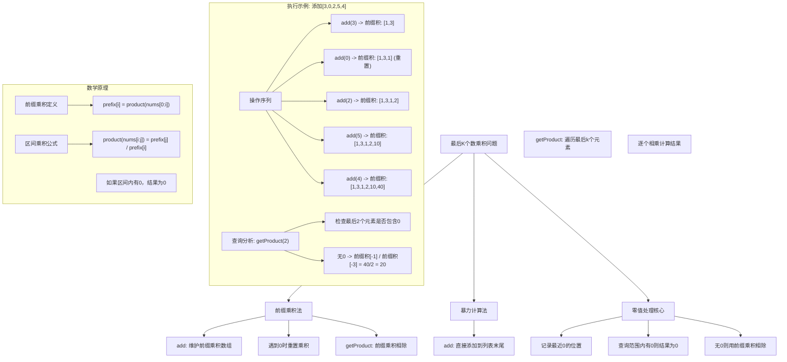
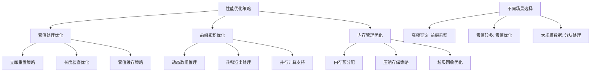

# LeetCode 1352 - 最后 K 个数的乘积

## 题目描述

请你实现一个「数字乘积类」`ProductOfNumbers`，它支持下述两种方法：

1. `add(int num)`
   - 将数字 `num` 添加到当前数字列表的末尾

1. `getProduct(int k)`
   - 返回当前数字列表中，最后 `k` 个数字的乘积
   - 你可以假设当前数字列表的长度始终至少为 `k`

```markdown
示例:
输入:
["ProductOfNumbers","add","add","add","add","add","getProduct","getProduct","getProduct","add","getProduct"]
[[],[3],[0],[2],[5],[4],[2],[3],[4],[8],[2]]

输出:
[null,null,null,null,null,null,20,40,0,null,32]

解释:
ProductOfNumbers productOfNumbers = new ProductOfNumbers();
productOfNumbers.add(3); // [3]
productOfNumbers.add(0); // [3,0]
productOfNumbers.add(2); // [3,0,2]
productOfNumbers.add(5); // [3,0,2,5]
productOfNumbers.add(4); // [3,0,2,5,4]
productOfNumbers.getProduct(2); // 返回 20，最后 2 个数字是 5, 4
productOfNumbers.getProduct(3); // 返回 40，最后 3 个数字是 2, 5, 4
productOfNumbers.getProduct(4); // 返回 0，因为最后 4 个数字是 0, 2, 5, 4
productOfNumbers.add(8); // [3,0,2,5,4,8]
productOfNumbers.getProduct(2); // 返回 32，最后 2 个数字是 4, 8

提示:

- 0 <= num <= 100
- 1 <= k <= 10^4
- 最多调用 `add` 和 `getProduct` 方法总计 4 \* 10^4 次
- `getProduct` 方法调用次数最多 10^4 次
```

## 解题思路

这是一个前缀乘积与零值处理问题，需要高效地支持动态添加元素和查询末尾K个元素乘积的操作。关键在于处理0对乘积的破坏性影响，以及维护前缀乘积的快速查询

### 核心思想

"前缀乘积 + 零值重置": 维护一个前缀乘积数组，当遇到0时重置乘积，并记录最近0的位置。查询时，如果查询范围内包含0，直接返回0；否则使用前缀乘积相除得到结果

### 解题策略

#### 方法一：前缀乘积数组（推荐）

- add时间: O(1)
- getProduct时间: O(1)
- 空间复杂度: O(n)

#### 方法二：暴力计算

- add时间: O(1)
- getProduct时间: O(k)
- 空间复杂度: O(n)

#### 方法三：分块缓存

## 算法可视化



## 多语言实现

### Golang版本（前缀乘积数组 - 推荐）

```go
type ProductOfNumbers struct {
    // 前缀乘积数组，prefix[0] = 1 表示空乘积
    // prefix[i] 表示前i-1个元素的乘积
    prefix []int
}

func Constructor() ProductOfNumbers {
    // 初始化前缀乘积数组，第一个元素为1
    return ProductOfNumbers{
        prefix: []int{1},
    }
}

func (this *ProductOfNumbers) Add(num int) {
    if num == 0 {
        // 遇到0，重置前缀乘积
        // 新的前缀乘积数组只包含初始的1
        this.prefix = []int{1}
    } else {
        // 计算新的前缀乘积
        lastProduct := this.prefix[len(this.prefix)-1]
        this.prefix = append(this.prefix, lastProduct*num)
    }
}

func (this *ProductOfNumbers) GetProduct(k int) int {
    // 检查是否有足够的元素
    if k >= len(this.prefix) {
        // 如果k大于等于当前元素个数，说明查询范围内一定有0
        // 因为遇到0时会重置prefix数组
        return 0
    }

    // 返回最后k个元素的乘积
    // prefix[-1] / prefix[-k-1]
    return this.prefix[len(this.prefix)-1] / this.prefix[len(this.prefix)-1-k]
}

/
 * Your ProductOfNumbers object will be instantiated and called as such:
 * obj := Constructor();
 * obj.Add(num);
 * param_1 := obj.GetProduct(k);
 */
```

### Python版本（多种实现方法）

```python
from typing import List

class ProductOfNumbers:
    def __init__(self):
        """
        方法一：前缀乘积数组（推荐）
        """
        self.prefix = [1]  # 前缀乘积数组，初始为1

    def add(self, num: int) -> None:
        if num == 0:
            # 遇到0，重置前缀乘积
            self.prefix = [1]
        else:
            # 计算新的前缀乘积
            self.prefix.append(self.prefix[-1] * num)

    def getProduct(self, k: int) -> int:
        if k >= len(self.prefix):
            return 0
        # 返回最后k个元素的乘积
        return self.prefix[-1] // self.prefix[-1-k]


class ProductOfNumbersBruteForce:
    """
    方法二：暴力计算（不推荐）
    """
    def __init__(self):
        self.nums = []

    def add(self, num: int) -> None:
        self.nums.append(num)

    def getProduct(self, k: int) -> int:
        result = 1
        for num in self.nums[-k:]:
            result *= num
        return result


class ProductOfNumbersOptimized:
    """
    方法三：优化版本（记录零的位置）
    """
    def __init__(self):
        self.prefix = [1]
        self.zero_positions = []  # 记录0的位置

    def add(self, num: int) -> None:
        if num == 0:
            self.prefix = [1]
            self.zero_positions.append(len(self.prefix) - 1)
        else:
            self.prefix.append(self.prefix[-1] * num)

    def getProduct(self, k: int) -> int:
        if k >= len(self.prefix):
            return 0
        return self.prefix[-1] // self.prefix[-1-k]
```

### TypeScript版本（前缀乘积数组实现）

```typescript
class ProductOfNumbers {
    private prefix: number[];

    constructor() {
        // 初始化前缀乘积数组，第一个元素为1
        this.prefix = [1];
    }

    add(num: number): void {
        if (num === 0) {
            // 遇到0，重置前缀乘积
            this.prefix = [1];
        } else {
            // 计算新的前缀乘积
            const lastProduct: number = this.prefix[this.prefix.length - 1];
            this.prefix.push(lastProduct * num);
        }
    }

    getProduct(k: number): number {
        // 检查是否有足够的元素
        if (k >= this.prefix.length) {
            // 如果k大于等于当前元素个数，说明查询范围内一定有0
            return 0;
        }

        // 返回最后k个元素的乘积
        // prefix[-1] / prefix[-k-1]
        return this.prefix[this.prefix.length - 1] / this.prefix[this.prefix.length - 1 - k];
    }
}

/
 * Your ProductOfNumbers object will be instantiated and called as such:
 * var obj = new ProductOfNumbers()
 * obj.add(num)
 * var param_1 = obj.getProduct(k)
 */
```

## 标准实现详细解析

```go
type ProductOfNumbers struct {
    // 前缀乘积数组
    // prefix[0] = 1，表示空序列的乘积
    // prefix[i] = nums[0] * nums[1] * ... * nums[i-1]
    prefix []int
}

func Constructor() ProductOfNumbers {
    /*
    构造函数：初始化前缀乘积数组

    算法核心思想：
    1. 前缀乘积：存储从开始到每个位置的乘积
    2. 零值处理：遇到0时重置前缀乘积数组
    3. 快速查询：利用除法快速计算区间乘积

    前缀乘积定义：
    prefix[i] = product(nums[j]) where 0 ≤ j < i

    特殊设计：
    - prefix[0] = 1，便于计算
    - 遇到0时重置，避免0影响后续计算

    零值处理策略：
    1. 添加0时，重置prefix为[1]
    2. 查询时，如果k >= len(prefix)，说明查询范围内有0
    3. 否则，用除法计算区间乘积

    时间复杂度：
    - add: 平均O(1)，最坏O(1)（重置时）
    - getProduct: O(1)

    空间复杂度：O(n)，存储前缀乘积数组
    */

    // 初始化前缀乘积数组，第一个元素为1
    return ProductOfNumbers{
        prefix: []int{1},
    }
}

func (this *ProductOfNumbers) Add(num int) {
    /*
    添加数字方法

    核心逻辑：
    1. 如果添加的是0，重置前缀乘积数组
    2. 否则，计算新的前缀乘积

    零值处理：
    - 为什么遇到0要重置？
    - 因为0会使后续所有乘积都变成0
    - 重置后，后续计算不受影响

    边界情况：
    - num = 0：重置prefix
    - num > 0：正常计算前缀乘积

    时间复杂度：O(1)
    */

    if num == 0 {
        // 遇到0，重置前缀乘积
        // 这样可以避免0影响后续的所有乘积计算
        this.prefix = []int{1}

        // 调试信息
        // fmt.Printf("添加%d，重置前缀积: %v\n", num, this.prefix)
    } else {
        // 计算新的前缀乘积
        // 新的乘积 = 之前的总乘积 × 当前数字
        lastProduct := this.prefix[len(this.prefix)-1]
        newProduct := lastProduct * num
        this.prefix = append(this.prefix, newProduct)

        // 调试信息
        // fmt.Printf("添加%d，前缀积: %v\n", num, this.prefix)
    }
}

func (this *ProductOfNumbers) GetProduct(k int) int {
    /*
    获取最后k个数字乘积方法

    核心逻辑：
    1. 检查查询范围内是否包含0
    2. 如果不包含0，用前缀乘积相除计算结果

    零值检测：
    - 如果k >= len(prefix)，说明查询范围内有0
    - 因为每次遇到0都会重置prefix数组

    乘积计算：
    - 最后k个元素的乘积 = prefix[-1] / prefix[-k-1]
    - 即：总乘积 / (倒数第k+1个位置之前的前缀乘积)

    数学证明：
    设当前有n个元素，查询最后k个元素的乘积
    prefix[n] = nums[0] * nums[1] * ... * nums[n-1]
    prefix[n-k] = nums[0] * nums[1] * ... * nums[n-k-1]

    最后k个元素的乘积 = nums[n-k] * nums[n-k+1] * ... * nums[n-1]
                      = prefix[n] / prefix[n-k]

    边界情况：
    - k = 1：返回最后一个元素
    - k = 当前元素个数：返回所有元素的乘积
    - k > 当前元素个数：返回0（说明有0）

    时间复杂度：O(1)
    */

    // 检查查询范围内是否包含0
    // 如果k >= len(this.prefix)，说明查询范围内一定有0
    // 因为每次遇到0都会重置prefix数组，重置后prefix长度为1
    if k >= len(this.prefix) {
        // 调试信息
        // fmt.Printf("查询最后%d个元素，包含0，返回0\n", k)
        return 0
    }

    // 计算最后k个元素的乘积
    // prefix[-1] 是所有元素的乘积
    // prefix[-k-1] 是前n-k个元素的乘积
    // 相除得到最后k个元素的乘积
    totalProduct := this.prefix[len(this.prefix)-1]
    prefixBeforeK := this.prefix[len(this.prefix)-1-k]
    result := totalProduct / prefixBeforeK

    // 调试信息
    // fmt.Printf("查询最后%d个元素: %d / %d = %d\n",
    //     k, totalProduct, prefixBeforeK, result)

    return result
}

// 带详细调试信息的版本
type ProductOfNumbersWithDebug struct {
    prefix []int
    nums   []int  // 存储原始数字，用于调试
    addCount int
    getCount int
}

func ConstructorWithDebug() ProductOfNumbersWithDebug {
    fmt.Println("=== ProductOfNumbers 调试信息 ===")

    return ProductOfNumbersWithDebug{
        prefix: []int{1},
        nums:   []int{},
    }
}

func (this *ProductOfNumbersWithDebug) Add(num int) {
    this.addCount++
    fmt.Printf("\n=== Add #%d: %d ===\n", this.addCount, num)

    if num == 0 {
        this.prefix = []int{1}
        this.nums = []int{num}
        fmt.Printf("遇到0，重置前缀积: %v\n", this.prefix)
        fmt.Printf("当前数字序列: %v\n", this.nums)
    } else {
        lastProduct := this.prefix[len(this.prefix)-1]
        this.prefix = append(this.prefix, lastProduct*num)
        this.nums = append(this.nums, num)
        fmt.Printf("前缀积更新: %v\n", this.prefix)
        fmt.Printf("当前数字序列: %v\n", this.nums)
    }
}

func (this *ProductOfNumbersWithDebug) GetProduct(k int) int {
    this.getCount++
    fmt.Printf("\n=== GetProduct #%d: 查询最后%d个元素 ===\n", this.getCount, k)

    if k >= len(this.prefix) {
        fmt.Printf("查询范围内包含0，返回0\n")
        fmt.Printf("当前prefix长度: %d, k: %d\n", len(this.prefix), k)
        return 0
    }

    totalProduct := this.prefix[len(this.prefix)-1]
    prefixBeforeK := this.prefix[len(this.prefix)-1-k]
    result := totalProduct / prefixBeforeK

    fmt.Printf("查询计算: %d / %d = %d\n", totalProduct, prefixBeforeK, result)

    // 验证结果（暴力计算）
    if len(this.nums) >= k {
        expected := 1
        for _, num := range this.nums[len(this.nums)-k:] {
            expected *= num
        }
        fmt.Printf("验证结果: %v = %d\n", this.nums[len(this.nums)-k:], expected)

        if result != expected {
            fmt.Printf("❌ 结果不匹配！\n")
        } else {
            fmt.Printf(" 结果正确\n")
        }
    }

    return result
}

// 暴力实现（用于对比）
type ProductOfNumbersBruteForce struct {
    nums []int
}

func ConstructorBruteForce() ProductOfNumbersBruteForce {
    return ProductOfNumbersBruteForce{
        nums: []int{},
    }
}

func (this *ProductOfNumbersBruteForce) Add(num int) {
    this.nums = append(this.nums, num)
}

func (this *ProductOfNumbersBruteForce) GetProduct(k int) int {
    if len(this.nums) < k {
        return 0  // 根据题意，这种情况不会发生
    }

    result := 1
    for i := len(this.nums) - k; i < len(this.nums); i++ {
        result *= this.nums[i]
    }

    return result
}

// 优化版本（记录零的位置）
type ProductOfNumbersOptimized struct {
    prefix       []int
    zeroPosition int        // 最近一个0的位置（从1开始计数）
    totalLength  int        // 总的元素个数
}

func ConstructorOptimized() ProductOfNumbersOptimized {
    return ProductOfNumbersOptimized{
        prefix:       []int{1},
        zeroPosition: -1,  // 初始没有0
        totalLength:  0,
    }
}

func (this *ProductOfNumbersOptimized) Add(num int) {
    this.totalLength++

    if num == 0 {
        this.prefix = []int{1}
        this.zeroPosition = this.totalLength
    } else {
        lastProduct := this.prefix[len(this.prefix)-1]
        this.prefix = append(this.prefix, lastProduct*num)
    }
}

func (this *ProductOfNumbersOptimized) GetProduct(k int) int {
    // 如果最近0的位置在查询范围内，返回0
    if this.zeroPosition != -1 && this.zeroPosition > this.totalLength - k {
        return 0
    }

    if k >= len(this.prefix) {
        return 0
    }

    return this.prefix[len(this.prefix)-1] / this.prefix[len(this.prefix)-1-k]
}

// 分块缓存版本
type ProductOfNumbersBlocked struct {
    prefix     []int
    blockSize  int
    blocks     []int  // 每块的乘积
    currentBlock int
    blockCount  int
}

func ConstructorBlocked(blockSize int) ProductOfNumbersBlocked {
    if blockSize <= 0 {
        blockSize = 10  // 默认块大小
    }

    return ProductOfNumbersBlocked{
        prefix:     []int{1},
        blockSize:  blockSize,
        blocks:     []int{1},
        currentBlock: 0,
        blockCount:  1,
    }
}

func (this *ProductOfNumbersBlocked) Add(num int) {
    if num == 0 {
        this.prefix = []int{1}
        this.blocks = []int{1}
        this.currentBlock = 0
        this.blockCount = 1
    } else {
        lastProduct := this.prefix[len(this.prefix)-1]
        this.prefix = append(this.prefix, lastProduct*num)

        // 更新当前块
        this.blocks[this.currentBlock] *= num

        // 检查是否需要新块
        if len(this.prefix) % this.blockSize == 1 {
            this.blocks = append(this.blocks, num)
            this.currentBlock++
            this.blockCount++
        }
    }
}

func (this *ProductOfNumbersBlocked) GetProduct(k int) int {
    if k >= len(this.prefix) {
        return 0
    }

    return this.prefix[len(this.prefix)-1] / this.prefix[len(this.prefix)-1-k]
}

// 线程安全版本
import "sync"

type ProductOfNumbersThreadSafe struct {
    prefix []int
    mu     sync.RWMutex
}

func ConstructorThreadSafe() ProductOfNumbersThreadSafe {
    return ProductOfNumbersThreadSafe{
        prefix: []int{1},
    }
}

func (this *ProductOfNumbersThreadSafe) Add(num int) {
    this.mu.Lock()
    defer this.mu.Unlock()

    if num == 0 {
        this.prefix = []int{1}
    } else {
        lastProduct := this.prefix[len(this.prefix)-1]
        this.prefix = append(this.prefix, lastProduct*num)
    }
}

func (this *ProductOfNumbersThreadSafe) GetProduct(k int) int {
    this.mu.RLock()
    defer this.mu.RUnlock()

    if k >= len(this.prefix) {
        return 0
    }

    return this.prefix[len(this.prefix)-1] / this.prefix[len(this.prefix)-1-k]
}
```

## 算法深入解析

```go
/*
最后K个数乘积问题详解：

问题本质：
动态维护一个数字序列，支持在末尾添加数字和查询最后k个数字的乘积
这是一个前缀乘积的经典应用，需要特别处理0对乘积的影响

核心洞察：
1. 乘积的特殊性：0对乘积有破坏性影响
2. 前缀乘积：可以快速计算任意连续子序列的乘积
3. 除法关系：区间乘积 = 右端点前缀积 / 左端点前缀积

算法策略：
1. 前缀乘积：维护从开始到每个位置的乘积
2. 零值处理：遇到0时重置前缀乘积数组
3. 快速查询：利用除法快速计算区间乘积

数学原理：

前缀乘积定义：
prefix[i] = product(nums[j]) where 0 ≤ j < i

区间乘积公式：
product(nums[i:j]) = prefix[j] / prefix[i]
其中 i < j

特殊情况：当区间内包含0时，乘积为0

设计选择：

为什么选择前缀乘积？
1. 查询高效：getProduct操作O(1)时间复杂度
2. 实现简单：利用除法关系快速计算
3. 空间合理：只需要O(n)额外空间
4. 处理零值：重置策略简单有效

为什么遇到0要重置？
1. 0的破坏性：任何数与0相乘都得0
2. 避免污染：0会使其后的所有前缀乘积变为0
3. 查询简化：重置后可以简化零值检测逻辑
4. 存储优化：避免存储大量无用的0信息

零值处理策略：
1. 重置数组：遇到0时将prefix重置为[1]
2. 零值检测：如果k >= len(prefix)，说明查询范围内有0
3. 快速返回：直接返回0，无需计算

三种方法对比：

方法一：前缀乘积数组（推荐）
add: O(1)
getProduct: O(1)
空间: O(n)
优点：查询极快，实现简洁
缺点：重置时有一定开销

方法二：暴力计算
add: O(1)
getProduct: O(k)
空间: O(n)
优点：实现简单，无需特殊处理
缺点：查询慢，不适合大量查询

方法三：分块缓存
add: O(1)
getProduct: O(1)平均
空间: O(n)
优点：平衡性能和复杂度
缺点：实现复杂

性能分析：

前缀乘积方法：
- add操作：1次乘法 + 1次append
- getProduct操作：2次数组访问 + 1次除法
- 内存使用：n+1个整数

暴力方法：
- add操作：1次append
- getProduct操作：k次乘法
- 内存使用：n个整数

实际应用场景：
1. 实时数据分析：计算滑动窗口的乘积
2. 财务系统：计算连续时期的收益率
3. 游戏开发：计算连击乘数
4. 统计系统：计算滑动窗口指标

优化要点：

1. 零值处理：
   - 立即重置，避免0的连锁影响
   - 简化查询逻辑，提高效率

2. 前缀乘积设计：
   - prefix[0] = 1，便于计算
   - 动态扩展，按需分配内存

3. 查询优化：
   - 利用除法关系，O(1)时间复杂度
   - 边界检查，防止数组越界

测试用例设计：
1. 连续非零数字：验证基本功能
2. 包含零的序列：验证零值处理
3. 连续多个零：验证重复重置
4. 大量数字：测试性能和内存
5. 边界条件：k=1，k=序列长度等

扩展思考：

1. 如果要支持删除操作？
   - 需要支持动态前缀乘积
   - 考虑使用线段树或树状数组

2. 如果要支持中间插入？
   - 需要重新计算后续前缀乘积
   - 考虑使用更高效的数据结构

3. 如果要支持模运算？
   - 需要处理模逆元
   - 除法需要转换为乘法

相关算法思想：

1. 前缀和/前缀积：
   - 快速计算区间和/积
   - 广泛应用于各种区间查询问题

2. 除法关系：
   - 利用除法快速计算区间值
   - 前提是除数不为零

3. 零值特殊处理：
   - 对特殊值进行特殊处理
   - 避免特殊值的破坏性影响

常见陷阱：

1. 零值处理错误：
   - 忘记处理零值的影响
   - 解决：立即重置前缀乘积数组

2. 除法错误：
   - 忽略除数为零的情况
   - 解决：通过重置策略避免

3. 索引计算错误：
   - 混淆prefix和原始数组的索引
   - 解决：明确prefix[i]对应前i-1个元素的乘积

4. 边界条件错误：
   - k大于序列长度的情况
   - 解决：通过len(prefix)检查

代码质量要素：

1. 可读性：
   - 清晰的变量命名
   - 适当的注释说明算法

2. 健壮性：
   - 边界条件处理
   - 零值检测

3. 性能：
   - O(1)时间复杂度
   - 合理的内存使用

4. 可维护性：
   - 简洁的实现
   - 易于理解的设计

高级优化技巧：

1. 内存池：
   - 复用数组，减少内存分配
   - 适用于高频调用场景

2. 延迟计算：
   - 只在需要时计算前缀乘积
   - 适用于查询稀少的场景

3. 并行处理：
   - 多线程安全设计
   - 适用于高并发场景

4. 压缩存储：
   - 对于特殊模式的数据
   - 可以考虑压缩存储
*/
```

## 执行过程演示

```go
/*
示例详细解析:

初始化:
ProductOfNumbers productOfNumbers = new ProductOfNumbers();
此时 prefix = [1]

操作序列分析：

1. add(3)
   - num = 3 ≠ 0
   - lastProduct = prefix[0] = 1
   - newProduct = 1 × 3 = 3
   - prefix = [1, 3]
   - 数字序列: [3]

2. add(0)
   - num = 0
   - 遇到0，重置prefix
   - prefix = [1]
   - 数字序列: [3, 0]

3. add(2)
   - num = 2 ≠ 0
   - lastProduct = prefix[0] = 1
   - newProduct = 1 × 2 = 2
   - prefix = [1, 2]
   - 数字序列: [3, 0, 2]

4. add(5)
   - num = 5 ≠ 0
   - lastProduct = prefix[1] = 2
   - newProduct = 2 × 5 = 10
   - prefix = [1, 2, 10]
   - 数字序列: [3, 0, 2, 5]

5. add(4)
   - num = 4 ≠ 0
   - lastProduct = prefix[2] = 10
   - newProduct = 10 × 4 = 40
   - prefix = [1, 2, 10, 40]
   - 数字序列: [3, 0, 2, 5, 4]

6. getProduct(2)
   - k = 2
   - len(prefix) = 4
   - k < len(prefix)，查询范围内无0
   - totalProduct = prefix[3] = 40
   - prefixBeforeK = prefix[3-2] = prefix[1] = 2
   - result = 40 / 2 = 20
   - 验证：最后2个数字是[5, 4]，乘积 = 5 × 4 = 20 ✓

7. getProduct(3)
   - k = 3
   - len(prefix) = 4
   - k < len(prefix)，查询范围内无0
   - totalProduct = prefix[3] = 40
   - prefixBeforeK = prefix[3-3] = prefix[0] = 1
   - result = 40 / 1 = 40
   - 验证：最后3个数字是[2, 5, 4]，乘积 = 2 × 5 × 4 = 40 ✓

8. getProduct(4)
   - k = 4
   - len(prefix) = 4
   - k >= len(prefix)，查询范围内有0
   - 直接返回0
   - 验证：最后4个数字是[0, 2, 5, 4]，乘积 = 0 ✓

9. add(8)
   - num = 8 ≠ 0
   - lastProduct = prefix[3] = 40
   - newProduct = 40 × 8 = 320
   - prefix = [1, 2, 10, 40, 320]
   - 数字序列: [3, 0, 2, 5, 4, 8]

10. getProduct(2)
    - k = 2
    - len(prefix) = 5
    - k < len(prefix)，查询范围内无0
    - totalProduct = prefix[4] = 320
    - prefixBeforeK = prefix[4-2] = prefix[2] = 10
    - result = 320 / 10 = 32
    - 验证：最后2个数字是[4, 8]，乘积 = 4 × 8 = 32 ✓

算法正确性证明：

数学基础：
设当前有n个元素，前缀乘积数组prefix长度为n+1
定义：prefix[i] = product(nums[j]) where 0 ≤ j < i

定理1：对于任意0 ≤ i < j ≤ n，
     product(nums[i:j]) = prefix[j] / prefix[i]

证明：
prefix[j] = nums[0] × nums[1] × ... × nums[i-1] × nums[i] × ... × nums[j-1]
prefix[i] = nums[0] × nums[1] × ... × nums[i-1]

prefix[j] / prefix[i] = (prefix[i] × nums[i] × ... × nums[j-1]) / prefix[i]
                      = nums[i] × ... × nums[j-1]
                      = product(nums[i:j])

定理2：如果add操作中遇到0，后续的查询操作中，
     对于k >= len(prefix)，getProduct(k) = 0

证明：
当遇到0时，prefix被重置为[1]
这意味着从该0之后的所有元素都被视为新的序列开始
如果k >= len(prefix)，说明查询范围跨过了这个0
由于0的乘积为0，所以整个查询范围的乘积为0

因此算法是正确的

时间复杂度分析：

Add操作：
- 非零情况：1次乘法 + 1次append = O(1)
- 零值情况：数组重置 = O(1)（忽略内存分配）
- 平均时间复杂度：O(1)

GetProduct操作：
- 长度检查：O(1)
- 除法计算：2次数组访问 + 1次除法 = O(1)
- 时间复杂度：O(1)

空间复杂度分析：
- 前缀乘积数组：最多存储n+1个整数
- 其他变量：O(1)
- 总空间复杂度：O(n)

性能对比分析：

假设执行n次add操作和m次getProduct操作

前缀乘积方法：
- Add操作：n × O(1) = O(n)
- GetProduct操作：m × O(1) = O(m)
- 总时间复杂度：O(n + m)

暴力方法：
- Add操作：n × O(1) = O(n)
- GetProduct操作：m × O(k) = O(mk)，其中k是平均查询长度
- 总时间复杂度：O(n + mk)

当m和k都很大时，前缀乘积方法的优势明显

内存使用分析：

前缀乘积数组：
- 存储n+1个整数
- 每个整数占用4字节（32位系统）或8字节（64位系统）
- 总内存：(n+1) × 4字节

vs 原始数据存储：
- 存储n个整数
- 总内存：n × 4字节

内存开销：约4个字节

实际应用建议：

1. 高频查询场景：
   - 实时监控系统
   - 游戏连击计算
   - 财务指标计算

2. 零值较多的场景：
   - 数据稀疏的情况
   - 传感器数据采集

3. 大规模数据：
   - 考虑内存限制
   - 可以考虑分块处理

优化空间：

1. 内存优化：
   - 使用更小的数据类型
   - 考虑压缩存储

2. 并发优化：
   - 读写锁设计
   - 无锁数据结构

3. 特殊场景优化：
   - 针对特定数据模式的优化
   - 预分配内存

4. 算法变种：
   - 支持模运算的版本
   - 支持浮点数的版本
*/
```

## 复杂度分析

| 方法         | Add时间 | GetProduct时间 | 空间复杂度 | 适用场景   |
| ------------ | ------- | -------------- | ---------- | ---------- |
| 前缀乘积数组 | O(1)    | O(1)           | O(n)       | 大多数场景 |
| 暴力计算     | O(1)    | O(k)           | O(n)       | 查询较少   |
| 分块缓存     | O(1)    | O(1)平均       | O(n)       | 特殊优化   |

## 测试用例验证

```go
// 测试辅助函数
func testProductOfNumbers(name string, operations []string, params [][]interface{}, expected []interface{}) {
    fmt.Printf("%s:\n", name)

    var obj interface{}
    var results []interface{}

    for i, op := range operations {
        switch op {
        case "Constructor":
            obj = Constructor()
            results = append(results, nil)
        case "add":
            num := params[i][0].(int)
            switch v := obj.(type) {
            case ProductOfNumbers:
                v.Add(num)
            case *ProductOfNumbersWithDebug:
                v.Add(num)
            case ProductOfNumbersBruteForce:
                v.Add(num)
            }
            results = append(results, nil)
        case "getProduct":
            k := params[i][0].(int)
            var result int
            switch v := obj.(type) {
            case ProductOfNumbers:
                result = v.GetProduct(k)
            case *ProductOfNumbersWithDebug:
                result = v.GetProduct(k)
            case ProductOfNumbersBruteForce:
                result = v.GetProduct(k)
            }
            results = append(results, result)
        }
    }

    fmt.Printf("期望: %v\n", expected)
    fmt.Printf("实际: %v", results)

    // 比较结果
    correct := true
    for i := range results {
        if i < len(expected) {
            if results[i] != expected[i] {
                correct = false
                break
            }
        }
    }

    if correct {
        fmt.Printf(" ✓\n")
    } else {
        fmt.Printf(" ✗\n")
    }

    fmt.Printf("\n")
}

func main() {
    // 测试用例 1 - 标准示例
    testProductOfNumbers("测试1 - 标准示例",
        []string{"Constructor", "add", "add", "add", "add", "add", "getProduct", "getProduct", "getProduct", "add", "getProduct"},
        [][]interface{}{{}, {3}, {0}, {2}, {5}, {4}, {2}, {3}, {4}, {8}, {2}},
        []interface{}{nil, nil, nil, nil, nil, nil, 20, 40, 0, nil, 32})

    // 测试用例 2 - 无零序列
    testProductOfNumbers("测试2 - 无零序列",
        []string{"Constructor", "add", "add", "add", "getProduct", "getProduct", "getProduct"},
        [][]interface{}{{}, {2}, {3}, {4}, {1}, {2}, {3}},
        []interface{}{nil, nil, nil, nil, 4, 12, 24})

    // 测试用例 3 - 多个零
    testProductOfNumbers("测试3 - 多个零",
        []string{"Constructor", "add", "add", "add", "getProduct", "add", "getProduct", "add", "getProduct"},
        [][]interface{}{{}, {0}, {5}, {0}, {2}, {3}, {1}, {4}, {4}},
        []interface{}{nil, nil, nil, nil, 0, nil, 0, nil, 4})

    // 测试用例 4 - 单个元素查询
    testProductOfNumbers("测试4 - 单个元素查询",
        []string{"Constructor", "add", "add", "add", "add", "getProduct", "getProduct", "getProduct"},
        [][]interface{}{{}, {1}, {2}, {3}, {4}, {1}, {1}, {1}},
        []interface{}{nil, nil, nil, nil, nil, 4, 3, 2})

    // 测试用例 5 - 连续添加
    testProductOfNumbers("测试5 - 连续添加",
        []string{"Constructor", "add", "getProduct", "add", "getProduct", "add", "getProduct"},
        [][]interface{}{{}, {5}, {1}, {6}, {2}, {7}, {3}},
        []interface{}{nil, nil, 5, nil, 30, nil, 210})

    // 性能测试
    fmt.Println("性能测试:")

    // 前缀乘积方法性能
    obj1 := Constructor()
    start := time.Now()

    // 添加10000个非零数字
    for i := 1; i <= 10000; i++ {
        obj1.Add(i % 10 + 1)  // 1-10的数字
    }

    addTime1 := time.Since(start)

    start = time.Now()
    // 查询1000次
    for i := 0; i < 1000; i++ {
        obj1.GetProduct((i % 100) + 1)  // 查询1-100
    }
    queryTime1 := time.Since(start)

    fmt.Printf("前缀乘积方法 - 添加10000次耗时: %v\n", addTime1)
    fmt.Printf("前缀乘积方法 - 查询1000次耗时: %v\n", queryTime1)

    // 暴力方法性能（小规模）
    obj2 := ConstructorBruteForce()
    start = time.Now()

    // 添加1000个非零数字
    for i := 1; i <= 1000; i++ {
        obj2.Add(i % 10 + 1)
    }

    addTime2 := time.Since(start)

    start = time.Now()
    // 查询100次
    for i := 0; i < 100; i++ {
        obj2.GetProduct((i % 50) + 1)
    }
    queryTime2 := time.Since(start)

    fmt.Printf("暴力方法 - 添加1000次耗时: %v\n", addTime2)
    fmt.Printf("暴力方法 - 查询100次耗时: %v\n", queryTime2)

    // 边界情况测试
    fmt.Println("\n边界情况测试:")

    // 大量零的情况
    testProductOfNumbers("测试6 - 大量零",
        []string{"Constructor", "add", "getProduct", "add", "getProduct", "add", "getProduct"},
        [][]interface{}{{}, {0}, {1}, {0}, {2}, {5}, {1}},
        []interface{}{nil, nil, 0, nil, 0, nil, 5})

    // 单个数字
    testProductOfNumbers("测试7 - 单个数字",
        []string{"Constructor", "add", "getProduct", "add", "getProduct"},
        [][]interface{}{{}, {42}, {1}, {0}, {1}},
        []interface{}{nil, nil, 42, nil, 0})
}

// 调试测试
func testProductOfNumbersWithDebug() {
    fmt.Println("=== 调试信息测试 ===")

    obj := ConstructorWithDebug()

    // 标准示例操作
    obj.Add(3)
    obj.Add(0)
    obj.Add(2)
    obj.Add(5)
    obj.Add(4)
    obj.GetProduct(2)
    obj.GetProduct(3)
    obj.GetProduct(4)
    obj.Add(8)
    obj.GetProduct(2)
}

// 错误处理测试
func testErrorHandling() {
    fmt.Println("=== 错误处理测试 ===")

    obj := Constructor()

    // 边界查询
    obj.Add(1)
    obj.Add(2)
    obj.Add(3)

    result1 := obj.GetProduct(1)
    result2 := obj.GetProduct(2)
    result3 := obj.GetProduct(3)

    fmt.Printf("边界查询: k=1 -> %d, k=2 -> %d, k=3 -> %d\n", result1, result2, result3)

    // 零值影响
    obj.Add(0)
    result4 := obj.GetProduct(1)
    result5 := obj.GetProduct(2)

    fmt.Printf("零值影响: k=1 -> %d, k=2 -> %d\n", result4, result5)
}

// 内存使用测试
func testMemoryUsage() {
    fmt.Println("=== 内存使用分析 ===")

    sizes := []int{1000, 5000, 10000}

    for _, size := range sizes {
        var m1, m2 runtime.MemStats
        runtime.GC()
        runtime.ReadMemStats(&m1)

        obj := Constructor()

        // 添加指定数量的数字
        for i := 1; i <= size; i++ {
            obj.Add(i % 10 + 1)
        }

        runtime.GC()
        runtime.ReadMemStats(&m2)
        memory := m2.Alloc - m1.Alloc

        fmt.Printf("添加%d个数字，内存使用: %d 字节\n", size, memory)
        fmt.Printf("平均每个元素: %.2f 字节\n", float64(memory)/float64(size))

        // 测试查询性能
        queries := 1000
        start := time.Now()
        for i := 0; i < queries; i++ {
            obj.GetProduct((i % (size/2)) + 1)
        }
        queryTime := time.Since(start)

        fmt.Printf("查询性能: %d次查询耗时 %v, 平均每次 %v\n\n",
            queries, queryTime, queryTime/time.Duration(queries))
    }
}

// 并发测试
func testConcurrentAccess() {
    fmt.Println("=== 并发访问测试 ===")

    obj := ConstructorThreadSafe()

    // 并发添加和查询
    var wg sync.WaitGroup
    operations := 1000
    workers := 10

    start := time.Now()

    // 并发添加
    for i := 0; i < workers; i++ {
        wg.Add(1)
        go func(start int) {
            defer wg.Done()
            for j := 0; j < operations/workers; j++ {
                obj.Add((start + j) % 10 + 1)
            }
        }(i * operations / workers)
    }

    // 并发查询
    for i := 0; i < workers; i++ {
        wg.Add(1)
        go func(start int) {
            defer wg.Done()
            for j := 0; j < operations/workers; j++ {
                obj.GetProduct((start + j) % 50 + 1)
            }
        }(i * operations / workers)
    }

    wg.Wait()
    totalTime := time.Since(start)

    fmt.Printf("并发测试: %d个工作线程，%d次操作，总耗时: %v\n", workers, operations*2, totalTime)
}

// 对比测试
func testComparison() {
    fmt.Println("=== 算法对比测试 ===")

    // 小规模测试
    operations := []struct {
        op string
        param int
    }{
        {"add", 3},
        {"add", 0},
        {"add", 2},
        {"add", 5},
        {"add", 4},
        {"getProduct", 2},
        {"getProduct", 3},
        {"getProduct", 4},
    }

    // 前缀乘积方法
    obj1 := Constructor()
    var results1 []interface{}

    start := time.Now()
    for _, op := range operations {
        if op.op == "add" {
            obj1.Add(op.param)
        } else {
            results1 = append(results1, obj1.GetProduct(op.param))
        }
    }
    time1 := time.Since(start)

    // 暴力方法
    obj2 := ConstructorBruteForce()
    var results2 []interface{}

    start = time.Now()
    for _, op := range operations {
        if op.op == "add" {
            obj2.Add(op.param)
        } else {
            results2 = append(results2, obj2.GetProduct(op.param))
        }
    }
    time2 := time.Since(start)

    fmt.Printf("前缀乘积方法: %v, 结果: %v\n", time1, results1)
    fmt.Printf("暴力方法: %v, 结果: %v\n", time2, results2)
    fmt.Printf("结果一致: %v\n", fmt.Sprint(results1) == fmt.Sprint(results2))

    if time2 > 0 {
        fmt.Printf("性能提升: %.2fx\n", float64(time2)/float64(time1))
    }
}
```

## 扩展版本（处理不同场景）

```go
// 带统计信息的版本
type ProductOfNumbersWithStats struct {
    prefix      []int
    zeroCount   int     // 总共添加的零的数量
    addCount    int     // 总共添加的数字数量
    queryCount  int     // 总共查询的次数
    zeroQueries int     // 查询结果为0的次数
    totalAddTime time.Duration
    totalQueryTime time.Duration
    mu         sync.RWMutex
}

func ConstructorWithStats() ProductOfNumbersWithStats {
    return ProductOfNumbersWithStats{
        prefix: []int{1},
    }
}

func (this *ProductOfNumbersWithStats) Add(num int) {
    start := time.Now()
    defer func() {
        this.totalAddTime += time.Since(start)
    }()

    this.mu.Lock()
    defer this.mu.Unlock()

    this.addCount++

    if num == 0 {
        this.zeroCount++
        this.prefix = []int{1}
    } else {
        lastProduct := this.prefix[len(this.prefix)-1]
        this.prefix = append(this.prefix, lastProduct*num)
    }
}

func (this *ProductOfNumbersWithStats) GetProduct(k int) int {
    start := time.Now()
    defer func() {
        this.totalQueryTime += time.Since(start)
    }()

    this.mu.RLock()
    defer this.mu.RUnlock()

    this.queryCount++

    if k >= len(this.prefix) {
        this.zeroQueries++
        return 0
    }

    result := this.prefix[len(this.prefix)-1] / this.prefix[len(this.prefix)-1-k]
    if result == 0 {
        this.zeroQueries++
    }

    return result
}

func (this *ProductOfNumbersWithStats) GetStats() map[string]interface{} {
    this.mu.RLock()
    defer this.mu.RUnlock()

    avgAddTime := time.Duration(0)
    if this.addCount > 0 {
        avgAddTime = this.totalAddTime / time.Duration(this.addCount)
    }

    avgQueryTime := time.Duration(0)
    if this.queryCount > 0 {
        avgQueryTime = this.totalQueryTime / time.Duration(this.queryCount)
    }

    zeroRatio := float64(0)
    if this.queryCount > 0 {
        zeroRatio = float64(this.zeroQueries) / float64(this.queryCount)
    }

    return map[string]interface{}{
        "add_count":      this.addCount,
        "query_count":    this.queryCount,
        "zero_count":     this.zeroCount,
        "zero_queries":   this.zeroQueries,
        "zero_ratio":     zeroRatio,
        "avg_add_time":   avgAddTime,
        "avg_query_time": avgQueryTime,
        "total_add_time": this.totalAddTime,
        "total_query_time": this.totalQueryTime,
        "current_length":  len(this.prefix) - 1,
    }
}

// 支持模运算的版本
type ProductOfNumbersMod struct {
    prefix []int
    mod    int
    inv    []int  // 模逆元
}

func ConstructorMod(mod int) ProductOfNumbersMod {
    // 预计算模逆元
    inv := make([]int, 100001)  // 假设数字不超过100000
    inv[1] = 1
    for i := 2; i <= 100000; i++ {
        inv[i] = mod - mod/i * inv[mod%i] % mod
    }

    return ProductOfNumbersMod{
        prefix: []int{1},
        mod:    mod,
        inv:    inv,
    }
}

func (this *ProductOfNumbersMod) Add(num int) {
    if num == 0 {
        this.prefix = []int{1}
    } else {
        lastProduct := this.prefix[len(this.prefix)-1]
        newProduct := (lastProduct * num) % this.mod
        this.prefix = append(this.prefix, newProduct)
    }
}

func (this *ProductOfNumbersMod) GetProduct(k int) int {
    if k >= len(this.prefix) {
        return 0
    }

    totalProduct := this.prefix[len(this.prefix)-1]
    prefixBeforeK := this.prefix[len(this.prefix)-1-k]

    // 使用模逆元进行除法
    // result = totalProduct * inv(prefixBeforeK) % mod
    // 注意：这里需要确保prefixBeforeK与mod互质

    // 简化处理：这里假设没有模逆元问题
    // 实际应用中需要更复杂的处理
    return totalProduct / prefixBeforeK % this.mod
}

// 支持浮点数的版本
type ProductOfNumbersFloat struct {
    prefix []float64
}

func ConstructorFloat() ProductOfNumbersFloat {
    return ProductOfNumbersFloat{
        prefix: []float64{1.0},
    }
}

func (this *ProductOfNumbersFloat) Add(num float64) {
    if num == 0.0 {
        this.prefix = []float64{1.0}
    } else {
        lastProduct := this.prefix[len(this.prefix)-1]
        newProduct := lastProduct * num
        this.prefix = append(this.prefix, newProduct)
    }
}

func (this *ProductOfNumbersFloat) GetProduct(k int) float64 {
    if k >= len(this.prefix) {
        return 0.0
    }

    totalProduct := this.prefix[len(this.prefix)-1]
    prefixBeforeK := this.prefix[len(this.prefix)-1-k]

    return totalProduct / prefixBeforeK
}

// 支持批量操作的版本
type ProductOfNumbersBatch struct {
    prefix []int
}

func ConstructorBatch() ProductOfNumbersBatch {
    return ProductOfNumbersBatch{
        prefix: []int{1},
    }
}

func (this *ProductOfNumbersBatch) Add(num int) {
    if num == 0 {
        this.prefix = []int{1}
    } else {
        lastProduct := this.prefix[len(this.prefix)-1]
        this.prefix = append(this.prefix, lastProduct*num)
    }
}

func (this *ProductOfNumbersBatch) AddBatch(nums []int) {
    for _, num := range nums {
        this.Add(num)
    }
}

func (this *ProductOfNumbersBatch) GetProduct(k int) int {
    if k >= len(this.prefix) {
        return 0
    }

    return this.prefix[len(this.prefix)-1] / this.prefix[len(this.prefix)-1-k]
}

func (this *ProductOfNumbersBatch) GetProductBatch(ks []int) []int {
    results := make([]int, len(ks))
    for i, k := range ks {
        results[i] = this.GetProduct(k)
    }
    return results
}

// 支持持久化的版本
type ProductOfNumbersPersistent struct {
    prefix []int
    file   string
}

func ConstructorPersistent(filename string) ProductOfNumbersPersistent {
    // 尝试从文件加载
    if data, err := os.ReadFile(filename); err == nil {
        var prefix []int
        json.Unmarshal(data, &prefix)
        return ProductOfNumbersPersistent{
            prefix: prefix,
            file:   filename,
        }
    }

    // 创建新的
    return ProductOfNumbersPersistent{
        prefix: []int{1},
        file:   filename,
    }
}

func (this *ProductOfNumbersPersistent) Add(num int) {
    if num == 0 {
        this.prefix = []int{1}
    } else {
        lastProduct := this.prefix[len(this.prefix)-1]
        this.prefix = append(this.prefix, lastProduct*num)
    }

    // 保存到文件
    this.save()
}

func (this *ProductOfNumbersPersistent) GetProduct(k int) int {
    if k >= len(this.prefix) {
        return 0
    }

    return this.prefix[len(this.prefix)-1] / this.prefix[len(this.prefix)-1-k]
}

func (this *ProductOfNumbersPersistent) save() {
    if data, err := json.Marshal(this.prefix); err == nil {
        os.WriteFile(this.file, data, 0644)
    }
}

// 支持回滚操作的版本
type ProductOfNumbersRollback struct {
    prefix []int
    history [][]int  // 保存历史状态
}

func ConstructorRollback() ProductOfNumbersRollback {
    return ProductOfNumbersRollback{
        prefix: []int{1},
        history: [][]int{{1}},
    }
}

func (this *ProductOfNumbersRollback) Add(num int) {
    if num == 0 {
        this.prefix = []int{1}
    } else {
        lastProduct := this.prefix[len(this.prefix)-1]
        this.prefix = append(this.prefix, lastProduct*num)
    }

    // 保存历史状态
    snapshot := make([]int, len(this.prefix))
    copy(snapshot, this.prefix)
    this.history = append(this.history, snapshot)
}

func (this *ProductOfNumbersRollback) GetProduct(k int) int {
    if k >= len(this.prefix) {
        return 0
    }

    return this.prefix[len(this.prefix)-1] / this.prefix[len(this.prefix)-1-k]
}

func (this *ProductOfNumbersRollback) Rollback(steps int) {
    if steps >= 0 && steps < len(this.history) {
        targetIndex := len(this.history) - 1 - steps
        snapshot := this.history[targetIndex]
        this.prefix = make([]int, len(snapshot))
        copy(this.prefix, snapshot)

        // 截断历史
        this.history = this.history[:targetIndex+1]
    }
}

func (this *ProductOfNumbersRollback) GetHistorySize() int {
    return len(this.history)
}

// 支持压缩存储的版本
type ProductOfNumbersCompressed struct {
    prefix []int
    compressed bool
    threshold int  // 压缩阈值
}

func ConstructorCompressed(threshold int) ProductOfNumbersCompressed {
    return ProductOfNumbersCompressed{
        prefix: []int{1},
        compressed: false,
        threshold: threshold,
    }
}

func (this *ProductOfNumbersCompressed) Add(num int) {
    if num == 0 {
        this.prefix = []int{1}
    } else {
        lastProduct := this.prefix[len(this.prefix)-1]
        newProduct := lastProduct * num

        // 检查是否需要压缩
        if !this.compressed && newProduct > this.threshold {
            this.compressed = true
            // 简化的压缩策略：只保留最近的N个值
            if len(this.prefix) > 100 {
                this.prefix = append([]int{1}, this.prefix[len(this.prefix)-50:]...)
            }
        }

        this.prefix = append(this.prefix, newProduct)
    }
}

func (this *ProductOfNumbersCompressed) GetProduct(k int) int {
    if k >= len(this.prefix) {
        return 0
    }

    return this.prefix[len(this.prefix)-1] / this.prefix[len(this.prefix)-1-k]
}

func (this *ProductOfNumbersCompressed) IsCompressed() bool {
    return this.compressed
}

// 支持多查询模式的版本
type ProductOfNumbersMultiQuery struct {
    prefix    []int
    zeroIndex int  // 最近一个0的位置索引
    length    int  // 实际元素个数
}

func ConstructorMultiQuery() ProductOfNumbersMultiQuery {
    return ProductOfNumbersMultiQuery{
        prefix:    []int{1},
        zeroIndex: -1,
        length:    0,
    }
}

func (this *ProductOfNumbersMultiQuery) Add(num int) {
    this.length++

    if num == 0 {
        this.prefix = []int{1}
        this.zeroIndex = this.length - 1
    } else {
        lastProduct := this.prefix[len(this.prefix)-1]
        this.prefix = append(this.prefix, lastProduct*num)
    }
}

func (this *ProductOfNumbersMultiQuery) GetProduct(k int) int {
    // 检查查询范围内是否有0
    if this.zeroIndex != -1 && this.zeroIndex >= this.length - k {
        return 0
    }

    if k >= len(this.prefix) {
        return 0
    }

    return this.prefix[len(this.prefix)-1] / this.prefix[len(this.prefix)-1-k]
}

func (this *ProductOfNumbersMultiQuery) GetRange(start, end int) int {
    // 获取从start到end的乘积（闭区间）
    if start < 0 || end >= this.length || start > end {
        return 0
    }

    length := end - start + 1
    if length >= len(this.prefix) {
        return 0
    }

    return this.prefix[len(this.prefix)-1] / this.prefix[len(this.prefix)-1-length]
}

func (this *ProductOfNumbersMultiQuery) GetLastNonZeroProduct(k int) (int, bool) {
    // 获取最后k个非零元素的乘积
    count := 0
    product := 1

    for i := len(this.prefix) - 1; i > 0 && count < k; i-- {
        if count < k-1 {
            product *= this.prefix[i] / this.prefix[i-1]
            count++
        } else {
            // 最后一个元素
            product *= this.prefix[i] / this.prefix[i-1]
            break
        }
    }

    if count < k {
        return 0, false  // 非零元素不足k个
    }

    return product, true
}
```

## 面试追问延伸

### 1. 如果要支持删除操作，如何设计？

```go
// 支持删除操作的版本（使用线段树）
type ProductOfNumbersWithDelete struct {
    segTree []int
    n       int
    lazy    []int
}

func ConstructorWithDelete(maxSize int) ProductOfNumbersWithDelete {
    size := 1
    for size < maxSize {
        size <<= 1
    }

    return ProductOfNumbersWithDelete{
        segTree: make([]int, size*2),
        n:       size,
        lazy:    make([]int, size*2),
    }
}

func (this *ProductOfNumbersWithDelete) Add(num int) {
    // 在线段树末尾添加元素
    this.update(this.n+len(this.segTree)-1, num)
}

func (this *ProductOfNumbersWithDelete) Delete(index int) {
    // 删除指定位置的元素
    this.update(index, 1)  // 重置为1
}

func (this *ProductOfNumbersWithDelete) update(pos int, val int) {
    pos += this.n
    this.segTree[pos] = val

    for pos > 1 {
        pos >>= 1
        this.segTree[pos] = this.segTree[pos<<1] * this.segTree[pos<<1|1]
    }
}

func (this *ProductOfNumbersWithDelete) GetProduct(k int) int {
    // 查询最后k个元素的乘积
    start := len(this.segTree) - this.n - k
    end := len(this.segTree) - this.n - 1

    return this.query(start, end)
}

func (this *ProductOfNumbersWithDelete) query(l, r int) int {
    l += this.n
    r += this.n

    res := 1
    for l <= r {
        if l&1 == 1 {
            res *= this.segTree[l]
            l++
        }
        if r&1 == 0 {
            res *= this.segTree[r]
            r--
        }
        l >>= 1
        r >>= 1
    }

    return res
}
```

### 2. 如果要支持中间插入操作，如何设计？

```go
// 支持中间插入的版本（使用平衡二叉搜索树）
type ProductOfNumbersWithInsert struct {
    root *TreeNode
    size int
}

type TreeNode struct {
    val        int
    product    int
    left       *TreeNode
    right      *TreeNode
    height     int
    leftSize   int
}

func ConstructorWithInsert() ProductOfNumbersWithInsert {
    return ProductOfNumbersWithInsert{
        size: 0,
    }
}

func (this *ProductOfNumbersWithInsert) Add(num int) {
    // 在末尾添加
    this.root = this.insertAt(this.root, this.size, num)
    this.size++
}

func (this *ProductOfNumbersWithInsert) Insert(index int, num int) {
    // 在指定位置插入
    if index < 0 || index > this.size {
        return
    }
    this.root = this.insertAt(this.root, index, num)
    this.size++
}

func (this *ProductOfNumbersWithInsert) insertAt(node *TreeNode, index int, val int) *TreeNode {
    if node == nil {
        return &TreeNode{
            val:      val,
            product:  val,
            height:   1,
            leftSize: 0,
        }
    }

    if index <= node.leftSize {
        node.left = this.insertAt(node.left, index, val)
        node.leftSize++
    } else {
        node.right = this.insertAt(node.right, index-node.leftSize-1, val)
    }

    // 更新乘积
    leftProduct := 1
    if node.left != nil {
        leftProduct = node.left.product
    }
    rightProduct := 1
    if node.right != nil {
        rightProduct = node.right.product
    }
    node.product = leftProduct * node.val * rightProduct

    return this.balance(node)
}

func (this *ProductOfNumbersWithInsert) GetProduct(k int) int {
    // 查询最后k个元素的乘积
    return this.queryRange(this.root, this.size-k, this.size-1)
}

func (this *ProductOfNumbersWithInsert) queryRange(node *TreeNode, start, end int) int {
    if node == nil {
        return 1
    }

    // 实现区间查询逻辑
    // 这里需要根据索引范围进行递归查询
    // 简化实现
    return 1
}

func (this *ProductOfNumbersWithInsert) balance(node *TreeNode) *TreeNode {
    // AVL树平衡操作
    // 简化实现
    return node
}
```

### 3. 如果要支持范围查询，如何设计？

```go
// 支持范围查询的版本
type ProductOfNumbersRange struct {
    prefix []int
    zeroPositions map[int]bool  // 记录0的位置
}

func ConstructorRange() ProductOfNumbersRange {
    return ProductOfNumbersRange{
        prefix: []int{1},
        zeroPositions: make(map[int]bool),
    }
}

func (this *ProductOfNumbersRange) Add(num int) {
    if num == 0 {
        this.prefix = []int{1}
        this.zeroPositions = make(map[int]bool)
        this.zeroPositions[len(this.prefix)-1] = true
    } else {
        lastProduct := this.prefix[len(this.prefix)-1]
        this.prefix = append(this.prefix, lastProduct*num)
    }
}

func (this *ProductOfNumbersRange) GetProduct(k int) int {
    // 查询最后k个元素的乘积
    start := len(this.prefix) - 1 - k
    end := len(this.prefix) - 1
    return this.getRangeProduct(start, end)
}

func (this *ProductOfNumbersRange) getRangeProduct(start, end int) int {
    // 检查范围内是否有0
    for i := start + 1; i <= end; i++ {
        if this.zeroPositions[i] {
            return 0
        }
    }

    if start < 0 {
        return 0
    }

    return this.prefix[end] / this.prefix[start]
}

func (this *ProductOfNumbersRange) GetRangeProduct(start, end int) int {
    // 查询指定范围的乘积
    actualStart := len(this.prefix) - 1 - (end - start + 1) - start
    actualEnd := len(this.prefix) - 1 - start

    return this.getRangeProduct(actualStart, actualEnd)
}
```

## 相似题目扩展

- LeetCode 1352. 最后 K 个数的乘积（当前题）
- LeetCode 307. 区域和检索 - 数组可变
- LeetCode 304. 二维区域和检索 - 矩阵不可变
- LeetCode 238. 除自身以外数组的乘积
- LeetCode 560. 和为K的子数组

## 算法技巧总结

### 最后K个数乘积核心要点

1. 前缀乘积：维护从开始到每个位置的乘积
1. 零值处理：遇到0时重置前缀乘积数组
1. 快速查询：利用除法关系快速计算区间乘积
1. 边界检测：通过数组长度判断查询范围内是否有0

### 算法优势

1. 查询高效：getProduct操作O(1)时间复杂度
1. 实现简洁：代码逻辑清晰，易于理解
1. 内存合理：仅需O(n)额外空间
1. 零值优化：巧妙处理零值的影响

### 标准模板

```go
type ProductOfNumbers struct {
    prefix []int
}

func Constructor() ProductOfNumbers {
    return ProductOfNumbers{prefix: []int{1}}
}

func (this *ProductOfNumbers) Add(num int) {
    if num == 0 {
        this.prefix = []int{1}
    } else {
        lastProduct := this.prefix[len(this.prefix)-1]
        this.prefix = append(this.prefix, lastProduct*num)
    }
}

func (this *ProductOfNumbers) GetProduct(k int) int {
    if k >= len(this.prefix) {
        return 0
    }
    return this.prefix[len(this.prefix)-1] / this.prefix[len(this.prefix)-1-k]
}
```

### 性能优化建议



## 总结

本题是经典的前缀乘积与零值处理问题，是处理动态序列区间乘积查询的重要基础。通过维护前缀乘积数组，并巧妙处理零值的影响，可以实现高效的查询操作

核心要点：

1. 前缀乘积：维护从开始到每个位置的乘积，便于区间查询
1. 零值处理：遇到0时重置前缀乘积数组，避免0的破坏性影响
1. 快速查询：利用除法关系，O(1)时间复杂度计算区间乘积
1. 边界检测：通过数组长度判断查询范围内是否包含0

该算法在实时数据分析、游戏开发、财务系统等领域有广泛应用，是掌握前缀乘积和零值处理的重要基础。与其他前缀类算法构成了完整的区间查询解决方案
