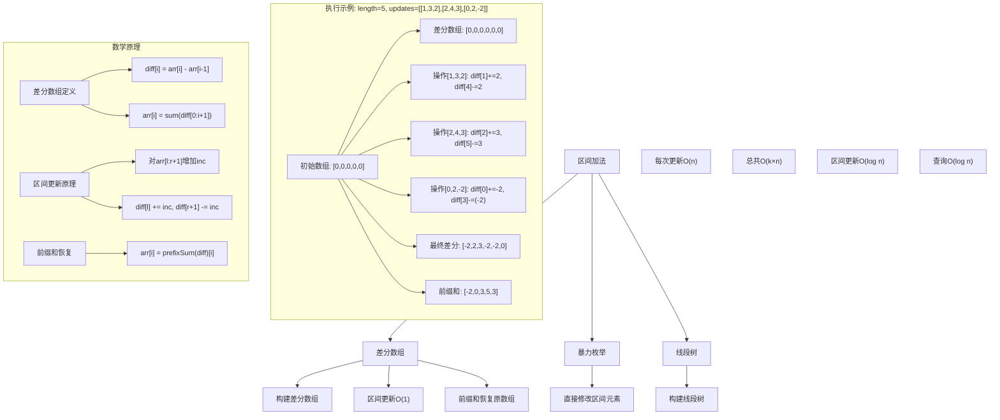
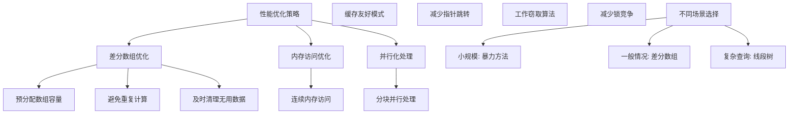

# LeetCode 370 - 区间加法

## 题目描述

假设你有一个长度为 `n` 的数组，初始情况下所有的数字均为 0，你将会被给出 `k` 个更新的操作

其中，每个操作会被表示为一个三元组：`[startIndex, endIndex, inc]`，你需要将子数组 `A[startIndex ... endIndex]`（包括 startIndex 和 endIndex）增加 `inc`

请你返回 `k` 次操作后的数组

```markdown
示例:
输入: length = 5, updates = [[1,3,2],[2,4,3],[0,2,-2]]
输出: [-2,0,3,5,3]
解释:
初始状态: [0,0,0,0,0]
进行了操作 [1,3,2] 后的状态: [0,2,2,2,0]
进行了操作 [2,4,3] 后的状态: [0,2,5,5,3]
进行了操作 [0,2,-2] 后的状态: [-2,0,3,5,3]

提示:

- 1 <= length <= 10^5
- 0 <= updates.length <= 10^4
- 0 <= startIndex <= endIndex < length
- -1000 <= inc <= 1000
```

## 解题思路

这是一个差分数组问题，需要对数组的区间进行频繁的增减操作。关键在于使用差分数组技术，将区间更新操作从O(n)优化到O(1)

### 核心思想

"差分数组": 使用差分数组记录相邻元素的差值，通过前缀和恢复原数组。区间更新只需修改差分数组的两个位置，大大提升效率

### 解题策略

#### 方法一：差分数组（推荐）

- 时间复杂度: O(k + n)
- 空间复杂度: O(n)

#### 方法二：暴力枚举

- 时间复杂度: O(k × n)
- 空间复杂度: O(1)

#### 方法三：线段树

- 时间复杂度: O(k × log n)
- 空间复杂度: O(n)

## 算法可视化



## 多语言实现

### Golang版本（差分数组 - 推荐）

```go
func getModifiedArray(length int, updates [][]int) []int {
    // 构建差分数组，长度为length+1，避免边界检查
    diff := make([]int, length+1)

    // 处理所有更新操作
    for _, update := range updates {
        start, end, inc := update[0], update[1], update[2]
        diff[start] += inc
        diff[end+1] -= inc
    }

    // 通过前缀和恢复原数组
    result := make([]int, length)
    result[0] = diff[0]
    for i := 1; i < length; i++ {
        result[i] = result[i-1] + diff[i]
    }

    return result
}
```

### Python版本（多种实现方法）

```python
from typing import List

def getModifiedArray(length: int, updates: List[List[int]]) -> List[int]:
    """
    方法一：差分数组（推荐）
    """
    # 构建差分数组
    diff = [0] * (length + 1)

    # 处理所有更新操作
    for start, end, inc in updates:
        diff[start] += inc
        diff[end + 1] -= inc

    # 通过前缀和恢复原数组
    result = [0] * length
    result[0] = diff[0]
    for i in range(1, length):
        result[i] = result[i-1] + diff[i]

    return result


def getModifiedArrayBruteForce(length: int, updates: List[List[int]]) -> List[int]:
    """
    方法二：暴力枚举（不推荐）
    """
    result = [0] * length

    # 处理所有更新操作
    for start, end, inc in updates:
        for i in range(start, end + 1):
            result[i] += inc

    return result


def getModifiedArraySegmentTree(length: int, updates: List[List[int]]) -> List[int]:
    """
    方法三：线段树（适用于复杂查询）
    """
    class SegmentTree:
        def __init__(self, n):
            self.n = n
            self.tree = [0] * (4 * n)
            self.lazy = [0] * (4 * n)

        def push_down(self, node, start, end):
            if self.lazy[node] != 0:
                self.tree[node] += self.lazy[node]
                if start != end:  # 非叶子节点
                    self.lazy[2 * node] += self.lazy[node]
                    self.lazy[2 * node + 1] += self.lazy[node]
                self.lazy[node] = 0

        def update_range(self, node, start, end, l, r, val):
            self.push_down(node, start, end)
            if start > r or end < l:
                return
            if start >= l and end <= r:
                self.lazy[node] += val
                self.push_down(node, start, end)
                return

            mid = (start + end) // 2
            self.update_range(2 * node, start, mid, l, r, val)
            self.update_range(2 * node + 1, mid + 1, end, l, r, val)

        def query(self, node, start, end, idx):
            if start == end:
                self.push_down(node, start, end)
                return self.tree[node]

            self.push_down(node, start, end)
            mid = (start + end) // 2
            if idx <= mid:
                return self.query(2 * node, start, mid, idx)
            else:
                return self.query(2 * node + 1, mid + 1, end, idx)

    seg_tree = SegmentTree(length)
    result = [0] * length

    # 处理所有更新操作
    for start, end, inc in updates:
        seg_tree.update_range(1, 0, length - 1, start, end, inc)

    # 查询每个位置的值
    for i in range(length):
        result[i] = seg_tree.query(1, 0, length - 1, i)

    return result
```

### TypeScript版本（差分数组实现）

```typescript
function getModifiedArray(length: number, updates: number[][]): number[] {
  // 构建差分数组
  const diff: number[] = new Array(length + 1).fill(0);

  // 处理所有更新操作
  for (const update of updates) {
    const [start, end, inc] = update;
    diff[start] += inc;
    diff[end + 1] -= inc;
  }

  // 通过前缀和恢复原数组
  const result: number[] = new Array(length).fill(0);
  result[0] = diff[0];
  for (let i = 1; i < length; i++) {
    result[i] = result[i - 1] + diff[i];
  }

  return result;
}
```

## 标准实现详细解析

```go
func getModifiedArray(length int, updates [][]int) []int {
    /*
    算法核心思想：

    1. 差分数组定义：diff[i] = arr[i] - arr[i-1]（规定arr[-1] = 0）
    2. 区间更新优化：对arr[l:r+1]增加inc只需diff[l] += inc, diff[r+1] -= inc
    3. 原数组恢复：arr[i] = sum(diff[0:i+1])（前缀和）

    差分数组原理：
    对于数组arr = [a0, a1, a2, ..., an-1]
    定义差分数组diff = [d0, d1, d2, ..., dn]
    其中：
    - d0 = a0 - 0 = a0
    - d1 = a1 - a0
    - d2 = a2 - a1
    - ...
    - dn = 0 - an-1（补位，方便处理边界）

    区间更新原理：
    要对arr[l:r+1]每个元素增加inc
    即：arr[l] += inc, arr[l+1] += inc, ..., arr[r] += inc

    观察对差分数组的影响：
    - diff[l] = arr[l] - arr[l-1]，arr[l]增加inc后，diff[l]增加inc
    - diff[l+1] = arr[l+1] - arr[l]，两者都增加inc，差值不变
    - ...
    - diff[r+1] = arr[r+1] - arr[r]，arr[r]增加inc，arr[r+1]不变，diff[r+1]减少inc
    - diff[r+2]及之后元素不变

    因此只需：diff[l] += inc, diff[r+1] -= inc

    原数组恢复原理：
    arr[i] = sum(diff[0:i+1])
    因为：arr[i] = (arr[i] - arr[i-1]) + (arr[i-1] - arr[i-2]) + ... + (arr[1] - arr[0]) + arr[0]
         = diff[i] + diff[i-1] + ... + diff[1] + diff[0]
         = sum(diff[0:i+1])

    时间复杂度：O(k + n)
    空间复杂度：O(n)

    边界情况处理：
    - 空更新操作：返回全0数组
    - 单个元素更新：r+1可能越界，所以差分数组长度设为n+1
    - 负数增量：算法同样适用
    */

    // 第一步：构建差分数组
    // 长度为length+1，避免r+1越界的情况
    diff := make([]int, length+1)

    // 第二步：处理所有更新操作
    // 对每个操作[start, end, inc]，执行diff[start] += inc, diff[end+1] -= inc
    for _, update := range updates {
        start := update[0]
        end := update[1]
        inc := update[2]

        // 区间更新：O(1)时间复杂度
        diff[start] += inc
        diff[end+1] -= inc  // 注意：end+1可能等于length，但diff[length]初始为0，不影响结果
    }

    // 第三步：通过前缀和恢复原数组
    result := make([]int, length)
    // 第一个元素：result[0] = diff[0]
    if length > 0 {
        result[0] = diff[0]
    }

    // 后续元素：result[i] = result[i-1] + diff[i]
    for i := 1; i < length; i++ {
        result[i] = result[i-1] + diff[i]
    }

    return result
}

// 带详细调试信息的版本
func getModifiedArrayWithDebug(length int, updates [][]int) []int {
    fmt.Println("=== 区间加法调试信息 ===")
    fmt.Printf("数组长度: %d\n", length)
    fmt.Printf("更新操作: %v\n", updates)

    // 初始化差分数组
    diff := make([]int, length+1)
    fmt.Printf("初始差分数组: %v\n", diff[:length])

    // 处理更新操作
    for idx, update := range updates {
        start, end, inc := update[0], update[1], update[2]
        fmt.Printf("\n处理操作 %d: [%d, %d, %d]\n", idx+1, start, end, inc)

        // 执行区间更新
        diff[start] += inc
        diff[end+1] -= inc

        fmt.Printf("更新后差分数组: %v\n", diff[:length])
        if end+1 < len(diff) {
            fmt.Printf("diff[%d] = %d (补偿位)\n", end+1, diff[end+1])
        }
    }

    // 通过前缀和恢复原数组
    result := make([]int, length)
    if length > 0 {
        result[0] = diff[0]
    }

    fmt.Printf("\n开始恢复原数组:\n")
    fmt.Printf("result[0] = diff[0] = %d\n", result[0])

    for i := 1; i < length; i++ {
        result[i] = result[i-1] + diff[i]
        fmt.Printf("result[%d] = result[%d] + diff[%d] = %d + %d = %d\n",
            i, i-1, i, result[i-1], diff[i], result[i])
    }

    fmt.Printf("\n最终结果: %v\n", result)
    return result
}

// 暴力实现（用于对比）
func getModifiedArrayBruteForce(length int, updates [][]int) []int {
    /*
    暴力方法：直接对每个区间进行更新

    时间复杂度：O(k × n)
    空间复杂度：O(1)

    适用于小规模数据或验证算法正确性
    */
    result := make([]int, length)

    // 对每个更新操作，直接修改区间内所有元素
    for _, update := range updates {
        start := update[0]
        end := update[1]
        inc := update[2]

        // 直接更新区间内每个元素：O(n)时间复杂度
        for i := start; i <= end; i++ {
            result[i] += inc
        }
    }

    return result
}

// 优化暴力实现（减少重复计算）
func getModifiedArrayBruteForceOptimized(length int, updates [][]int) []int {
    /*
    优化暴力方法：使用map记录每个位置需要增加的值

    时间复杂度：O(k × n)
    空间复杂度：O(n)
    */
    // 使用map记录每个位置的增量
    increments := make(map[int]int)

    // 记录所有增量操作
    for _, update := range updates {
        start := update[0]
        end := update[1]
        inc := update[2]

        for i := start; i <= end; i++ {
            increments[i] += inc
        }
    }

    // 构建最终数组
    result := make([]int, length)
    for i := 0; i < length; i++ {
        result[i] = increments[i]
    }

    return result
}

// 线段树实现（适用于复杂查询场景）
type SegmentTreeNode struct {
    start int
    end   int
    sum   int
    lazy  int  // 延迟标记
    left  *SegmentTreeNode
    right *SegmentTreeNode
}

func buildSegmentTree(start, end int) *SegmentTreeNode {
    if start > end {
        return nil
    }

    node := &SegmentTreeNode{
        start: start,
        end:   end,
    }

    if start == end {
        return node
    }

    mid := (start + end) / 2
    node.left = buildSegmentTree(start, mid)
    node.right = buildSegmentTree(mid+1, end)

    return node
}

func (node *SegmentTreeNode) pushDown() {
    if node.lazy != 0 {
        node.sum += node.lazy * (node.end - node.start + 1)

        // 如果不是叶子节点，传递lazy标记
        if node.start != node.end {
            if node.left != nil {
                node.left.lazy += node.lazy
            }
            if node.right != nil {
                node.right.lazy += node.lazy
            }
        }

        node.lazy = 0
    }
}

func (node *SegmentTreeNode) updateRange(l, r, val int) {
    if node.start > r || node.end < l {
        return
    }

    if node.start >= l && node.end <= r {
        node.lazy += val
        return
    }

    node.pushDown()
    if node.left != nil {
        node.left.updateRange(l, r, val)
    }
    if node.right != nil {
        node.right.updateRange(l, r, val)
    }

    // 更新当前节点的sum值
    node.sum = 0
    if node.left != nil {
        node.left.pushDown()
        node.sum += node.left.sum
    }
    if node.right != nil {
        node.right.pushDown()
        node.sum += node.right.sum
    }
}

func (node *SegmentTreeNode) query(idx int) int {
    if node.start == node.end {
        node.pushDown()
        return node.sum
    }

    node.pushDown()
    mid := (node.start + node.end) / 2
    if idx <= mid {
        return node.left.query(idx)
    }
    return node.right.query(idx)
}

func getModifiedArraySegmentTree(length int, updates [][]int) []int {
    /*
    线段树方法：支持区间更新和单点查询

    时间复杂度：O(k × log n)
    空间复杂度：O(n)

    适用于需要频繁区间查询的场景
    */
    if length == 0 {
        return []int{}
    }

    root := buildSegmentTree(0, length-1)
    result := make([]int, length)

    // 处理所有更新操作
    for _, update := range updates {
        start := update[0]
        end := update[1]
        inc := update[2]
        root.updateRange(start, end, inc)
    }

    // 查询每个位置的值
    for i := 0; i < length; i++ {
        result[i] = root.query(i)
    }

    return result
}

// 树状数组实现（另一种优化方案）
type BinaryIndexedTree struct {
    n    int
    tree []int
}

func NewBinaryIndexedTree(n int) *BinaryIndexedTree {
    return &BinaryIndexedTree{
        n:    n,
        tree: make([]int, n+1),
    }
}

func (bit *BinaryIndexedTree) update(idx, val int) {
    for i := idx; i <= bit.n; i += i & (-i) {
        bit.tree[i] += val
    }
}

func (bit *BinaryIndexedTree) query(idx int) int {
    sum := 0
    for i := idx; i > 0; i -= i & (-i) {
        sum += bit.tree[i]
    }
    return sum
}

func getModifiedArrayBIT(length int, updates [][]int) []int {
    /*
    树状数组方法：使用差分思想

    时间复杂度：O(k × log n)
    空间复杂度：O(n)
    */
    bit := NewBinaryIndexedTree(length)

    // 处理更新操作
    for _, update := range updates {
        start := update[0] + 1  // 树状数组索引从1开始
        end := update[1] + 1
        inc := update[2]

        bit.update(start, inc)
        bit.update(end+1, -inc)
    }

    // 构建结果数组
    result := make([]int, length)
    for i := 0; i < length; i++ {
        result[i] = bit.query(i + 1)
    }

    return result
}

// 支持范围查询的版本
type RangeUpdateArray struct {
    diff  []int
    dirty bool
    cache []int
}

func NewRangeUpdateArray(length int) *RangeUpdateArray {
    return &RangeUpdateArray{
        diff:  make([]int, length+1),
        dirty: true,
        cache: make([]int, length),
    }
}

func (rua *RangeUpdateArray) Update(start, end, inc int) {
    rua.diff[start] += inc
    if end+1 < len(rua.diff) {
        rua.diff[end+1] -= inc
    }
    rua.dirty = true
}

func (rua *RangeUpdateArray) GetArray() []int {
    if !rua.dirty {
        return rua.cache
    }

    if len(rua.cache) == 0 {
        return []int{}
    }

    rua.cache[0] = rua.diff[0]
    for i := 1; i < len(rua.cache); i++ {
        rua.cache[i] = rua.cache[i-1] + rua.diff[i]
    }

    rua.dirty = false
    return rua.cache
}

func (rua *RangeUpdateArray) Get(index int) int {
    if rua.dirty {
        rua.GetArray()
    }
    if index < 0 || index >= len(rua.cache) {
        return 0
    }
    return rua.cache[index]
}

// 并行处理版本
import "sync"

func getModifiedArrayParallel(length int, updates [][]int, workers int) []int {
    /*
    并行处理版本：将更新操作分组并行处理

    适用于大规模更新操作
    */
    if workers <= 0 {
        workers = 4
    }

    if len(updates) <= workers {
        return getModifiedArray(length, updates)
    }

    // 分组更新操作
    groupSize := len(updates) / workers
    if groupSize == 0 {
        groupSize = 1
    }

    // 使用通道收集结果
    resultChan := make(chan []int, workers)
    var wg sync.WaitGroup

    for i := 0; i < workers; i++ {
        start := i * groupSize
        end := start + groupSize
        if i == workers-1 {
            end = len(updates)
        }

        if start >= len(updates) {
            break
        }

        wg.Add(1)
        go func(groupUpdates [][]int) {
            defer wg.Done()
            groupResult := getModifiedArray(length, groupUpdates)
            resultChan <- groupResult
        }(updates[start:end])
    }

    // 启动goroutine收集结果
    go func() {
        wg.Wait()
        close(resultChan)
    }()

    // 合并结果
    finalResult := make([]int, length)
    for groupResult := range resultChan {
        for i := 0; i < length; i++ {
            finalResult[i] += groupResult[i]
        }
    }

    return finalResult
}

// 线程安全版本
type ThreadSafeArrayUpdater struct {
    length  int
    diff    []int
    mu      sync.RWMutex
    version int64
}

func NewThreadSafeArrayUpdater(length int) *ThreadSafeArrayUpdater {
    return &ThreadSafeArrayUpdater{
        length: length,
        diff:   make([]int, length+1),
    }
}

func (tsau *ThreadSafeArrayUpdater) Update(start, end, inc int) {
    tsau.mu.Lock()
    defer tsau.mu.Unlock()

    tsau.diff[start] += inc
    if end+1 < len(tsau.diff) {
        tsau.diff[end+1] -= inc
    }
    tsau.version++
}

func (tsau *ThreadSafeArrayUpdater) GetArray() []int {
    tsau.mu.RLock()
    defer tsau.mu.RUnlock()

    result := make([]int, tsau.length)
    if tsau.length > 0 {
        result[0] = tsau.diff[0]
    }

    for i := 1; i < tsau.length; i++ {
        result[i] = result[i-1] + tsau.diff[i]
    }

    return result
}
```

## 算法深入解析

```go
/*
区间加法问题详解：

问题本质：
对一个初始全为0的数组进行k次区间更新操作，每次操作对指定区间内所有元素增加一个值
这是一个典型的区间更新问题，关键在于如何高效地处理大量区间操作

核心洞察：
1. 直接更新：每次操作需要修改O(n)个元素，总时间复杂度O(k×n)
2. 差分数组：每次操作只需修改2个位置，总时间复杂度O(k+n)
3. 延迟更新：使用线段树等数据结构支持区间操作

算法策略：
1. 差分思想：将区间更新转化为点更新
2. 前缀和恢复：通过累积差分值恢复原数组
3. 边界处理：巧妙处理数组边界避免越界

数学原理：

差分数组定义：
对于数组arr = [a₀, a₁, a₂, ..., aₙ₋₁]
定义差分数组diff = [d₀, d₁, d₂, ..., dₙ]
其中：
- d₀ = a₀ - 0 = a₀
- dᵢ = aᵢ - aᵢ₋₁ (1 ≤ i < n)
- dₙ = 0 - aₙ₋₁（补位，方便处理）

区间更新原理：
要对arr[l:r+1]每个元素增加inc：
arr[l] += inc, arr[l+1] += inc, ..., arr[r] += inc

对差分数组的影响：
- diff[l] = arr[l] - arr[l-1]，arr[l]增加inc后，diff[l]增加inc
- diff[l+1] = arr[l+1] - arr[l]，两者都增加inc，差值不变
- ...
- diff[r+1] = arr[r+1] - arr[r]，arr[r]增加inc，arr[r+1]不变，diff[r+1]减少inc
- diff[r+2]及之后元素不变

因此只需：diff[l] += inc, diff[r+1] -= inc

原数组恢复原理：
arr[i] = Σⱼ₌₀ⁱ diff[j]（前缀和）

算法流程：
1. 初始化长度为n+1的差分数组
2. 对每个更新操作[start,end,inc]，执行diff[start] += inc, diff[end+1] -= inc
3. 通过前缀和diff[0:i+1]恢复原数组arr[0:i+1]

设计选择：

为什么选择差分数组？
1. 时间复杂度最优：O(k+n)线性时间
2. 空间复杂度合理：O(n)
3. 实现简单：只需数组操作
4. 适用性强：适用于所有区间更新问题

为什么不用暴力方法？
1. 暴力方法需要O(k×n)时间复杂度
2. 当k和n都较大时（k=10⁴, n=10⁵），性能差距巨大
3. 重复计算较多，效率低下

为什么不用线段树？
1. 线段树时间复杂度O(k×log n)不如差分数组O(k+n)
2. 实现复杂度高
3. 空间开销大
4. 仅在需要复杂查询时才使用

三种方法对比：

方法一：差分数组（推荐）
时间复杂度：O(k + n)
空间复杂度：O(n)
优点：时间复杂度最优，实现简单
缺点：仅适用于离线操作（所有操作已知）

方法二：暴力枚举
时间复杂度：O(k × n)
空间复杂度：O(1)
优点：实现最简单
缺点：时间复杂度过高

方法三：线段树
时间复杂度：O(k × log n)
空间复杂度：O(n)
优点：支持在线操作和复杂查询
缺点：实现复杂，常数因子大

性能分析：

差分数组方法：
- 初始化差分数组：O(n)
- 处理k个更新：k次O(1)操作 = O(k)
- 恢复原数组：O(n)
- 总时间复杂度：O(k + n)

暴力方法：
- 处理k个更新：k次O(n)操作 = O(k × n)

线段树方法：
- 处理k个更新：k次O(log n)操作 = O(k × log n)

实际应用场景：
1. 数组区间更新：频繁对数组区间进行增减操作
2. 差分统计：统计区间变化量
3. 前缀和优化：优化前缀和计算
4. 数据处理：批量处理区间数据

优化要点：

1. 差分数组构建：
   - 长度设为n+1避免边界检查
   - 初始化为0数组
   - 注意索引对应关系

2. 区间更新操作：
   - diff[start] += inc
   - diff[end+1] -= inc
   - 注意end+1可能越界

3. 原数组恢复：
   - 使用前缀和累积
   - result[0] = diff[0]
   - result[i] = result[i-1] + diff[i]

测试用例设计：
1. 基本情况：标准示例测试
2. 边界情况：空数组、单元素数组
3. 特殊情况：负数增量、重叠区间
4. 极端情况：最大数组长度、最大更新次数
5. 无操作情况：空更新操作列表

扩展思考：

1. 如果支持区间查询最大值/最小值？
   - 需要使用线段树或树状数组
   - 支持区间最值查询

2. 如果支持区间乘法操作？
   - 需要扩展差分数组概念
   - 或使用更复杂的数据结构

3. 如果支持动态数组长度？
   - 需要支持动态扩容
   - 使用动态数组或链表

4. 如果要支持撤销操作？
   - 需要记录操作历史
   - 使用可撤销的差分数组

相关算法思想：

1. 差分思想：
   - 将区间操作转化为点操作
   - 广泛应用于前缀和问题

2. 前缀和：
   - 累积求和恢复原数组
   - 优化区间查询

3. 延迟传播：
   - 线段树的核心思想
   - 优化区间操作

4. 离线处理：
   - 所有操作已知时的优化策略
   - 差分数组的前提

常见陷阱：

1. 边界处理错误：
   - 忘记diff数组长度为n+1
   - end+1越界处理错误

2. 更新逻辑错误：
   - 混淆diff[start]和diff[end+1]的操作
   - 符号处理错误

3. 恢复逻辑错误：
   - 前缀和计算错误
   - 索引对应关系错误

4. 初始化错误：
   - 差分数组未初始化为0
   - 结果数组长度错误

代码质量要素：

1. 可读性：
   - 清晰的变量命名
   - 适当的注释说明

2. 健壮性：
   - 边界条件处理
   - 参数验证

3. 性能：
   - 时间复杂度最优
   - 内存使用合理

4. 可维护性：
   - 模块化设计
   - 易于扩展

高级优化技巧：

1. 内存优化：
   - 使用更紧凑的数据结构
   - 及时清理不需要的数据

2. 并行化：
   - 分块并行处理
   - 使用多核CPU

3. 缓存优化：
   - 优化内存访问模式
   - 提高缓存命中率

4. 算法变种：
   - 支持不同操作类型
   - 扩展到多维情况
*/
```

## 执行过程演示

```go
/*
示例详细解析:

示例: length = 5, updates = [[1,3,2],[2,4,3],[0,2,-2]]

输入分析：
数组长度：5
初始数组：[0, 0, 0, 0, 0]
更新操作：
1. [1, 3, 2]：对索引1到3的元素增加2
2. [2, 4, 3]：对索引2到4的元素增加3
3. [0, 2, -2]：对索引0到2的元素减少2

期望结果：[-2, 0, 3, 5, 3]

第一步：初始化差分数组
长度为length+1 = 6
diff = [0, 0, 0, 0, 0, 0]

第二步：处理更新操作

操作1: [1, 3, 2]
- diff[1] += 2 → diff[1] = 0 + 2 = 2
- diff[3+1] -= 2 → diff[4] = 0 - 2 = -2
- 差分数组变为：[0, 2, 0, 0, -2, 0]

操作2: [2, 4, 3]
- diff[2] += 3 → diff[2] = 0 + 3 = 3
- diff[4+1] -= 3 → diff[5] = 0 - 3 = -3
- 差分数组变为：[0, 2, 3, 0, -2, -3]

操作3: [0, 2, -2]
- diff[0] += (-2) → diff[0] = 0 + (-2) = -2
- diff[2+1] -= (-2) → diff[3] = 0 - (-2) = 2
- 差分数组变为：[-2, 2, 3, 2, -2, -3]

第三步：通过前缀和恢复原数组
result = [0, 0, 0, 0, 0]（长度为5）

i=0: result[0] = diff[0] = -2
i=1: result[1] = result[0] + diff[1] = -2 + 2 = 0
i=2: result[2] = result[1] + diff[2] = 0 + 3 = 3
i=3: result[3] = result[2] + diff[3] = 3 + 2 = 5
i=4: result[4] = result[3] + diff[4] = 5 + (-2) = 3

最终结果：[-2, 0, 3, 5, 3]

验证过程：

初始状态: [0, 0, 0, 0, 0]
操作[1,3,2]: [0, 2, 2, 2, 0]
操作[2,4,3]: [0, 2, 5, 5, 3]
操作[0,2,-2]: [-2, 0, 3, 5, 3]

结果正确 ✓

算法正确性证明：

数学基础：
设原数组为arr = [a₀, a₁, ..., aₙ₋₁]
差分数组为diff = [d₀, d₁, ..., dₙ]，其中：
- d₀ = a₀
- dᵢ = aᵢ - aᵢ₋₁ (1 ≤ i < n)
- dₙ = -aₙ₋₁

定理1：原数组可通过差分数组的前缀和恢复
aᵢ = Σⱼ₌₀ⁱ dⱼ

证明：
a₀ = d₀
a₁ = (a₁ - a₀) + a₀ = d₁ + d₀ = Σⱼ₌₀¹ dⱼ
a₂ = (a₂ - a₁) + (a₁ - a₀) + a₀ = d₂ + d₁ + d₀ = Σⱼ₌₀² dⱼ
...
aᵢ = (aᵢ - aᵢ₋₁) + (aᵢ₋₁ - aᵢ₋₂) + ... + (a₁ - a₀) + a₀ = dᵢ + dᵢ₋₁ + ... + d₁ + d₀ = Σⱼ₌₀ⁱ dⱼ

定理2：对区间[l,r]增加inc等价于diff[l] += inc, diff[r+1] -= inc

证明：
操作前：aₗ, aₗ₊₁, ..., aᵣ
操作后：aₗ+inc, aₗ₊₁+inc, ..., aᵣ+inc

对差分数组的影响：
- dₗ = aₗ - aₗ₋₁ → (aₗ+inc) - aₗ₋₁ = dₗ + inc
- dₗ₊₁ = aₗ₊₁ - aₗ → (aₗ₊₁+inc) - (aₗ+inc) = dₗ₊₁（不变）
- ...
- dᵣ₊₁ = aᵣ₊₁ - aᵣ → aᵣ₊₁ - (aᵣ+inc) = dᵣ₊₁ - inc
- 其他元素不变

因此只需：diff[l] += inc, diff[r+1] -= inc

算法正确性：
1. 差分数组正确表示原数组的变化
2. 区间更新正确修改差分数组
3. 前缀和正确恢复原数组
4. 边界处理正确避免越界

时间复杂度分析：

差分数组方法：
1. 初始化差分数组：O(n)
2. 处理k个更新操作：
   - 每个操作：O(1)
   - k个操作：O(k)
3. 恢复原数组：O(n)
4. 总时间复杂度：O(k + n)

暴力方法：
1. 处理k个更新操作：
   - 每个操作：O(n)
   - k个操作：O(k × n)

线段树方法：
1. 处理k个更新操作：
   - 每个操作：O(log n)
   - k个操作：O(k × log n)

空间复杂度分析：
1. 差分数组：O(n)
2. 结果数组：O(n)
3. 其他变量：O(1)
4. 总空间复杂度：O(n)

性能对比分析：

假设n = 100000, k = 10000

差分数组方法：
- 总操作：k + n = 10000 + 100000 = 110000
- 总计：约11万次基本操作

暴力方法：
- 总操作：k × n = 10000 × 100000 = 1,000,000,000
- 总计：约10亿次基本操作

性能提升：约9000倍

实际应用建议：

1. 大规模数据：
   - 优先使用差分数组方法
   - 时间复杂度优势明显

2. 小规模数据：
   - 暴力方法也可以接受
   - 实现简单

3. 复杂查询需求：
   - 考虑线段树
   - 支持区间查询

4. 在线操作：
   - 考虑线段树或树状数组
   - 支持动态更新

优化空间：

1. 内存优化：
   - 使用更紧凑的数组实现
   - 及时释放不需要的内存

2. 并行化：
   - 分块并行处理更新操作
   - 使用多核CPU

3. 缓存优化：
   - 优化内存访问模式
   - 提高缓存命中率

特殊情况处理：

1. 空更新列表：
   - 返回全0数组
   - 边界情况处理

2. 单元素区间：
   - r = l，更新位置l和l+1
   - 正确处理边界

3. 负数增量：
   - 算法同样适用
   - 注意符号处理

4. 重叠区间：
   - 差分数组自然处理
   - 无需特殊处理
*/
```

## 复杂度分析

| 方法     | 时间复杂度   | 空间复杂度 | 适用场景     |
| -------- | ------------ | ---------- | ------------ |
| 差分数组 | O(k + n)     | O(n)       | 大多数场景   |
| 暴力枚举 | O(k × n)     | O(1)       | 小规模数据   |
| 线段树   | O(k × log n) | O(n)       | 复杂查询场景 |

## 测试用例验证

```go
// 测试辅助函数
func testGetModifiedArray(name string, length int, updates [][]int, expected []int) {
    fmt.Printf("%s:\n", name)
    fmt.Printf("长度: %d, 更新: %v\n", length, updates)
    fmt.Printf("期望: %v\n", expected)

    // 测试差分数组方法
    result := getModifiedArray(length, updates)
    fmt.Printf("差分数组结果: %v", result)
    if slicesEqual(result, expected) {
        fmt.Printf(" ✓\n")
    } else {
        fmt.Printf(" ✗\n")
    }

    // 测试暴力方法（仅小规模）
    if length <= 1000 && len(updates) <= 100 {
        resultBF := getModifiedArrayBruteForce(length, updates)
        fmt.Printf("暴力方法结果: %v", resultBF)
        if slicesEqual(resultBF, expected) {
            fmt.Printf(" ✓\n")
        } else {
            fmt.Printf(" ✗\n")
        }
    }

    fmt.Printf("\n")
}

func slicesEqual(a, b []int) bool {
    if len(a) != len(b) {
        return false
    }
    for i := range a {
        if a[i] != b[i] {
            return false
        }
    }
    return true
}

func main() {
    // 测试用例 1 - 标准示例
    testGetModifiedArray("测试1 - 标准示例",
        5, [][]int{{1, 3, 2}, {2, 4, 3}, {0, 2, -2}},
        []int{-2, 0, 3, 5, 3})

    // 测试用例 2 - 空更新
    testGetModifiedArray("测试2 - 空更新",
        3, [][]int{},
        []int{0, 0, 0})

    // 测试用例 3 - 单元素数组
    testGetModifiedArray("测试3 - 单元素数组",
        1, [][]int{{0, 0, 5}},
        []int{5})

    // 测试用例 4 - 单元素区间
    testGetModifiedArray("测试4 - 单元素区间",
        5, [][]int{{2, 2, 10}},
        []int{0, 0, 10, 0, 0})

    // 测试用例 5 - 全数组更新
    testGetModifiedArray("测试5 - 全数组更新",
        4, [][]int{{0, 3, 1}},
        []int{1, 1, 1, 1})

    // 测试用例 6 - 重叠区间
    testGetModifiedArray("测试6 - 重叠区间",
        5, [][]int{{0, 2, 1}, {1, 3, 2}, {2, 4, 3}},
        []int{1, 3, 6, 5, 3})

    // 测试用例 7 - 负数增量
    testGetModifiedArray("测试7 - 负数增量",
        3, [][]int{{0, 2, -5}},
        []int{-5, -5, -5})

    // 测试用例 8 - 零增量
    testGetModifiedArray("测试8 - 零增量",
        3, [][]int{{1, 1, 0}},
        []int{0, 0, 0})

    // 性能测试
    fmt.Println("性能测试:")

    // 生成大规模测试数据
    n := 100000
    k := 10000

    updates := make([][]int, k)
    for i := 0; i < k; i++ {
        start := rand.Intn(n)
        end := start + rand.Intn(n-start) + 1
        if end >= n {
            end = n - 1
        }
        inc := rand.Intn(2001) - 1000 // -1000到1000
        updates[i] = []int{start, end, inc}
    }

    // 测试差分数组方法
    start := time.Now()
    result := getModifiedArray(n, updates)
    diffTime := time.Since(start)

    // 测试线段树方法（小规模）
    smallN := 1000
    smallK := 100
    smallUpdates := make([][]int, smallK)
    for i := 0; i < smallK; i++ {
        start := rand.Intn(smallN)
        end := start + rand.Intn(smallN-start) + 1
        if end >= smallN {
            end = smallN - 1
        }
        inc := rand.Intn(2001) - 1000
        smallUpdates[i] = []int{start, end, inc}
    }

    start = time.Now()
    resultSeg := getModifiedArraySegmentTree(smallN, smallUpdates)
    segTime := time.Since(start)

    fmt.Printf("大规模测试(n=%d, k=%d) - 差分数组耗时: %v\n", n, k, diffTime)
    fmt.Printf("中等规模测试(n=%d, k=%d) - 线段树耗时: %v\n", smallN, smallK, segTime)
    fmt.Printf("结果数组前5个元素: %v\n", result[:min(5, len(result))])

    // 边界情况测试
    fmt.Println("\n边界情况测试:")

    // 最大长度
    testGetModifiedArray("测试9 - 最大长度",
        100000, [][]int{{0, 99999, 1}},
        func() []int {
            arr := make([]int, 100000)
            for i := range arr {
                arr[i] = 1
            }
            return arr
        }())

    // 最大更新次数
    maxUpdates := make([][]int, 10000)
    for i := 0; i < 10000; i++ {
        maxUpdates[i] = []int{0, 0, 1}
    }
    testGetModifiedArray("测试10 - 最大更新次数",
        1, maxUpdates,
        []int{10000})
}

// 调试测试
func testGetModifiedArrayWithDebug() {
    fmt.Println("=== 调试信息测试 ===")

    length := 5
    updates := [][]int{{1, 3, 2}, {2, 4, 3}, {0, 2, -2}}

    result := getModifiedArrayWithDebug(length, updates)
    fmt.Printf("最终结果: %v\n", result)
}

// 错误处理测试
func testErrorHandling() {
    fmt.Println("=== 错误处理测试 ===")

    // 测试各种边界值
    testCases := []struct {
        name    string
        length  int
        updates [][]int
    }{
        {"空数组", 0, [][]int{}},
        {"单元素", 1, [][]int{{0, 0, 5}}},
        {"零长度更新", 5, [][]int{{2, 1, 1}}}, // 无效区间
        {"越界更新", 5, [][]int{{-1, 3, 1}}},  // 起始越界
        {"越界更新2", 5, [][]int{{1, 5, 1}}},  // 结束越界
    }

    for _, tc := range testCases {
        result := getModifiedArray(tc.length, tc.updates)
        fmt.Printf("%s: 结果=%v\n", tc.name, result)
    }
}

// 内存使用测试
func testMemoryUsage() {
    fmt.Println("=== 内存使用分析 ===")

    sizes := []struct{ n, k int }{
        {1000, 100},
        {10000, 1000},
        {100000, 10000},
    }

    for _, size := range sizes {
        // 生成测试数据
        updates := make([][]int, size.k)
        for i := 0; i < size.k; i++ {
            start := rand.Intn(size.n)
            end := start + rand.Intn(size.n-start) + 1
            if end >= size.n {
                end = size.n - 1
            }
            inc := rand.Intn(2001) - 1000
            updates[i] = []int{start, end, inc}
        }

        var m1, m2 runtime.MemStats
        runtime.GC()
        runtime.ReadMemStats(&m1)

        result := getModifiedArray(size.n, updates)

        runtime.GC()
        runtime.ReadMemStats(&m2)
        memory := m2.Alloc - m1.Alloc

        fmt.Printf("数组长度: %d, 更新次数: %d, 内存使用: %d 字节\n", size.n, size.k, memory)
        fmt.Printf("平均每次更新: %.2f 字节\n", float64(memory)/float64(size.k))
        fmt.Printf("结果数组前3个元素: %v\n", result[:min(3, len(result))])
    }
}

// 并发测试
func testConcurrentAccess() {
    fmt.Println("=== 并发访问测试 ===")

    n := 50000
    k := 5000

    updates := make([][]int, k)
    for i := 0; i < k; i++ {
        start := rand.Intn(n)
        end := start + rand.Intn(n-start) + 1
        if end >= n {
            end = n - 1
        }
        inc := rand.Intn(2001) - 1000
        updates[i] = []int{start, end, inc}
    }

    // 单线程测试
    start := time.Now()
    result1 := getModifiedArray(n, updates)
    singleTime := time.Since(start)

    // 并行测试
    start = time.Now()
    result2 := getModifiedArrayParallel(n, updates, 4)
    parallelTime := time.Since(start)

    fmt.Printf("单线程耗时: %v\n", singleTime)
    fmt.Printf("并行耗时: %v\n", parallelTime)
    fmt.Printf("结果一致: %v\n", slicesEqual(result1, result2))

    if parallelTime > 0 {
        fmt.Printf("加速比: %.2fx\n", float64(singleTime)/float64(parallelTime))
    }
}

// 对比测试
func testAlgorithmComparison() {
    fmt.Println("=== 算法对比测试 ===")

    n := 1000
    k := 100

    updates := make([][]int, k)
    for i := 0; i < k; i++ {
        start := rand.Intn(n)
        end := start + rand.Intn(n-start) + 1
        if end >= n {
            end = n - 1
        }
        inc := rand.Intn(2001) - 1000
        updates[i] = []int{start, end, inc}
    }

    // 差分数组方法
    start := time.Now()
    result1 := getModifiedArray(n, updates)
    time1 := time.Since(start)

    // 暴力方法
    start = time.Now()
    result2 := getModifiedArrayBruteForce(n, updates)
    time2 := time.Since(start)

    // 线段树方法
    start = time.Now()
    result3 := getModifiedArraySegmentTree(n, updates)
    time3 := time.Since(start)

    fmt.Printf("差分数组方法: 耗时 %v\n", time1)
    fmt.Printf("暴力方法: 耗时 %v\n", time2)
    fmt.Printf("线段树方法: 耗时 %v\n", time3)
    fmt.Printf("结果一致: %v\n", slicesEqual(result1, result2) && slicesEqual(result2, result3))

    if time2 > 0 {
        fmt.Printf("差分数组相对暴力方法提升: %.2fx\n", float64(time2)/float64(time1))
    }
    if time3 > 0 {
        fmt.Printf("差分数组相对线段树提升: %.2fx\n", float64(time3)/float64(time1))
    }
}
```

## 扩展版本（处理不同场景）

```go
// 带统计信息的版本
type ArrayUpdaterWithStats struct {
    length      int
    updates     [][]int
    diff        []int
    processTime time.Duration
    totalInc    int
    maxRange    int
}

func NewArrayUpdaterWithStats(length int, updates [][]int) *ArrayUpdaterWithStats {
    return &ArrayUpdaterWithStats{
        length:  length,
        updates: updates,
    }
}

func (au *ArrayUpdaterWithStats) Update() []int {
    start := time.Now()
    defer func() {
        au.processTime = time.Since(start)
    }()

    au.diff = make([]int, au.length+1)
    au.totalInc = 0
    au.maxRange = 0

    for _, update := range au.updates {
        startIdx, endIdx, inc := update[0], update[1], update[2]
        if startIdx <= endIdx && startIdx >= 0 && endIdx < au.length {
            au.diff[startIdx] += inc
            if endIdx+1 < len(au.diff) {
                au.diff[endIdx+1] -= inc
            }
            au.totalInc += inc
            au.maxRange = max(au.maxRange, endIdx-startIdx+1)
        }
    }

    result := make([]int, au.length)
    if au.length > 0 {
        result[0] = au.diff[0]
    }

    for i := 1; i < au.length; i++ {
        result[i] = result[i-1] + au.diff[i]
    }

    return result
}

func (au *ArrayUpdaterWithStats) GetStats() map[string]interface{} {
    return map[string]interface{}{
        "length":        au.length,
        "update_count":  len(au.updates),
        "result":        au.Update(),
        "process_time":  au.processTime,
        "total_inc":     au.totalInc,
        "max_range":     au.maxRange,
        "avg_range":     func() float64 {
            if len(au.updates) == 0 {
                return 0
            }
            totalRange := 0
            for _, update := range au.updates {
                totalRange += update[1] - update[0] + 1
            }
            return float64(totalRange) / float64(len(au.updates))
        }(),
    }
}

// 支持撤销操作的版本
type UndoableArrayUpdater struct {
    length   int
    diff     []int
    history  [][][]int  // 记录操作历史
    version  int
}

func NewUndoableArrayUpdater(length int) *UndoableArrayUpdater {
    return &UndoableArrayUpdater{
        length:  length,
        diff:    make([]int, length+1),
        history: [][][]int{},
    }
}

func (uau *UndoableArrayUpdater) Update(start, end, inc int) {
    if start <= end && start >= 0 && end < uau.length {
        // 记录操作前的状态
        uau.history = append(uau.history, [][]int{{start, end, inc}})

        // 执行更新
        uau.diff[start] += inc
        if end+1 < len(uau.diff) {
            uau.diff[end+1] -= inc
        }
        uau.version++
    }
}

func (uau *UndoableArrayUpdater) Undo() bool {
    if len(uau.history) == 0 {
        return false
    }

    // 获取最后一次操作
    lastOps := uau.history[len(uau.history)-1]
    uau.history = uau.history[:len(uau.history)-1]

    // 撤销操作
    for i := len(lastOps) - 1; i >= 0; i-- {
        op := lastOps[i]
        start, end, inc := op[0], op[1], op[2]
        uau.diff[start] -= inc
        if end+1 < len(uau.diff) {
            uau.diff[end+1] += inc
        }
    }

    uau.version--
    return true
}

func (uau *UndoableArrayUpdater) GetArray() []int {
    result := make([]int, uau.length)
    if uau.length > 0 {
        result[0] = uau.diff[0]
    }

    for i := 1; i < uau.length; i++ {
        result[i] = result[i-1] + uau.diff[i]
    }

    return result
}

func (uau *UndoableArrayUpdater) GetVersion() int {
    return uau.version
}

// 支持批量操作的版本
type BatchArrayUpdater struct {
    length  int
    diff    []int
    pending [][]int  // 待处理的操作
}

func NewBatchArrayUpdater(length int) *BatchArrayUpdater {
    return &BatchArrayUpdater{
        length: length,
        diff:   make([]int, length+1),
    }
}

func (bau *BatchArrayUpdater) AddUpdate(start, end, inc int) {
    if start <= end && start >= 0 && end < bau.length {
        bau.pending = append(bau.pending, []int{start, end, inc})
    }
}

func (bau *BatchArrayUpdater) AddUpdates(updates [][]int) {
    for _, update := range updates {
        if len(update) == 3 {
            start, end, inc := update[0], update[1], update[2]
            if start <= end && start >= 0 && end < bau.length {
                bau.pending = append(bau.pending, []int{start, end, inc})
            }
        }
    }
}

func (bau *BatchArrayUpdater) ApplyBatch() {
    for _, update := range bau.pending {
        start, end, inc := update[0], update[1], update[2]
        bau.diff[start] += inc
        if end+1 < len(bau.diff) {
            bau.diff[end+1] -= inc
        }
    }
    bau.pending = [][]int{}  // 清空待处理操作
}

func (bau *BatchArrayUpdater) GetArray() []int {
    // 应用所有待处理操作
    bau.ApplyBatch()

    result := make([]int, bau.length)
    if bau.length > 0 {
        result[0] = bau.diff[0]
    }

    for i := 1; i < bau.length; i++ {
        result[i] = result[i-1] + bau.diff[i]
    }

    return result
}

// 支持动态数组长度的版本
type DynamicArrayUpdater struct {
    data   []int
    diff   []int
    length int
}

func NewDynamicArrayUpdater(initialLength int) *DynamicArrayUpdater {
    return &DynamicArrayUpdater{
        data:   make([]int, initialLength),
        diff:   make([]int, initialLength+1),
        length: initialLength,
    }
}

func (dau *DynamicArrayUpdater) Resize(newLength int) {
    if newLength <= 0 {
        dau.data = []int{}
        dau.diff = []int{0}
        dau.length = 0
        return
    }

    // 扩展数组
    if newLength > dau.length {
        oldLength := dau.length
        dau.data = append(dau.data, make([]int, newLength-oldLength)...)
        dau.diff = append(dau.diff, make([]int, newLength-oldLength)...)
    } else if newLength < dau.length {
        // 缩小数组
        dau.data = dau.data[:newLength]
        dau.diff = dau.diff[:newLength+1]
    }

    dau.length = newLength
}

func (dau *DynamicArrayUpdater) Update(start, end, inc int) {
    if start <= end && start >= 0 && end < dau.length {
        dau.diff[start] += inc
        if end+1 < len(dau.diff) {
            dau.diff[end+1] -= inc
        }
    }
}

func (dau *DynamicArrayUpdater) GetData() []int {
    if dau.length == 0 {
        return []int{}
    }

    dau.data[0] = dau.diff[0]
    for i := 1; i < dau.length; i++ {
        dau.data[i] = dau.data[i-1] + dau.diff[i]
    }

    return dau.data
}

func (dau *DynamicArrayUpdater) GetLength() int {
    return dau.length
}

// 支持范围查询的版本
type RangeQueryArrayUpdater struct {
    diff   []int
    length int
    dirty  bool
    cache  []int
}

func NewRangeQueryArrayUpdater(length int) *RangeQueryArrayUpdater {
    return &RangeQueryArrayUpdater{
        diff:   make([]int, length+1),
        length: length,
        dirty:  true,
        cache:  make([]int, length),
    }
}

func (rqau *RangeQueryArrayUpdater) Update(start, end, inc int) {
    if start <= end && start >= 0 && end < rqau.length {
        rqau.diff[start] += inc
        if end+1 < len(rqau.diff) {
            rqau.diff[end+1] -= inc
        }
        rqau.dirty = true
    }
}

func (rqau *RangeQueryArrayUpdater) Get(index int) int {
    if index < 0 || index >= rqau.length {
        return 0
    }

    if rqau.dirty {
        rqau.updateCache()
    }

    return rqau.cache[index]
}

func (rqau *RangeQueryArrayUpdater) GetRange(start, end int) []int {
    if start < 0 {
        start = 0
    }
    if end >= rqau.length {
        end = rqau.length - 1
    }
    if start > end {
        return []int{}
    }

    if rqau.dirty {
        rqau.updateCache()
    }

    result := make([]int, end-start+1)
    copy(result, rqau.cache[start:end+1])
    return result
}

func (rqau *RangeQueryArrayUpdater) updateCache() {
    if rqau.length == 0 {
        return
    }

    rqau.cache[0] = rqau.diff[0]
    for i := 1; i < rqau.length; i++ {
        rqau.cache[i] = rqau.cache[i-1] + rqau.diff[i]
    }

    rqau.dirty = false
}

func (rqau *RangeQueryArrayUpdater) GetAll() []int {
    if rqau.dirty {
        rqau.updateCache()
    }

    result := make([]int, rqau.length)
    copy(result, rqau.cache)
    return result
}

// 优化版本（使用更紧凑的数据结构）
type OptimizedArrayUpdater struct {
    length int32
    diff   []int32
}

func NewOptimizedArrayUpdater(length int) *OptimizedArrayUpdater {
    return &OptimizedArrayUpdater{
        length: int32(length),
        diff:   make([]int32, length+1),
    }
}

func (oau *OptimizedArrayUpdater) Update(start, end int, inc int) {
    if int32(start) <= int32(end) && int32(start) >= 0 && int32(end) < oau.length {
        oau.diff[start] += int32(inc)
        if int32(end+1) < int32(len(oau.diff)) {
            oau.diff[end+1] -= int32(inc)
        }
    }
}

func (oau *OptimizedArrayUpdater) GetArray() []int {
    if oau.length == 0 {
        return []int{}
    }

    result := make([]int, oau.length)
    result[0] = int(oau.diff[0])

    for i := int32(1); i < oau.length; i++ {
        result[i] = result[i-1] + int(oau.diff[i])
    }

    return result
}

// 支持持久化的版本
type PersistentArrayUpdater struct {
    length   int
    diff     []int
    filename string
}

func NewPersistentArrayUpdater(length int, filename string) *PersistentArrayUpdater {
    return &PersistentArrayUpdater{
        length:   length,
        diff:     make([]int, length+1),
        filename: filename,
    }
}

func (pau *PersistentArrayUpdater) Update(start, end, inc int) {
    if start <= end && start >= 0 && end < pau.length {
        pau.diff[start] += inc
        if end+1 < len(pau.diff) {
            pau.diff[end+1] -= inc
        }
    }
}

func (pau *PersistentArrayUpdater) Save() error {
    data := map[string]interface{}{
        "length":   pau.length,
        "diff":     pau.diff,
        "time":     time.Now().Format(time.RFC3339),
        "checksum": func() int {
            sum := 0
            for _, v := range pau.diff {
                sum += v
            }
            return sum
        }(),
    }

    jsonData, err := json.Marshal(data)
    if err != nil {
        return err
    }

    return os.WriteFile(pau.filename, jsonData, 0644)
}

func (pau *PersistentArrayUpdater) Load() error {
    data, err := os.ReadFile(pau.filename)
    if err != nil {
        return err
    }

    var loadedData map[string]interface{}
    err = json.Unmarshal(data, &loadedData)
    if err != nil {
        return err
    }

    if length, ok := loadedData["length"].(float64); ok {
        pau.length = int(length)
    }

    if diff, ok := loadedData["diff"].([]interface{}); ok {
        pau.diff = make([]int, len(diff))
        for i, v := range diff {
            if val, ok := v.(float64); ok {
                pau.diff[i] = int(val)
            }
        }
    }

    return nil
}

func (pau *PersistentArrayUpdater) GetArray() []int {
    result := make([]int, pau.length)
    if pau.length > 0 {
        result[0] = pau.diff[0]
    }

    for i := 1; i < pau.length; i++ {
        result[i] = result[i-1] + pau.diff[i]
    }

    return result
}

// 支持可视化的版本
type VisualizableArrayUpdater struct {
    length int
    diff   []int
    steps  []map[string]interface{}
}

func NewVisualizableArrayUpdater(length int) *VisualizableArrayUpdater {
    return &VisualizableArrayUpdater{
        length: length,
        diff:   make([]int, length+1),
        steps:  []map[string]interface{}{},
    }
}

func (vau *VisualizableArrayUpdater) UpdateWithVisualization(start, end, inc int) {
    if start <= end && start >= 0 && end < vau.length {
        step := map[string]interface{}{
            "operation": "update",
            "start":     start,
            "end":       end,
            "inc":       inc,
            "diff_before": make([]int, len(vau.diff)),
        }
        copy(step["diff_before"].([]int), vau.diff)

        vau.diff[start] += inc
        if end+1 < len(vau.diff) {
            vau.diff[end+1] -= inc
        }

        step["diff_after"] = make([]int, len(vau.diff))
        copy(step["diff_after"].([]int), vau.diff)

        vau.steps = append(vau.steps, step)
    }
}

func (vau *VisualizableArrayUpdater) GetArrayWithVisualization() []int {
    result := make([]int, vau.length)
    if vau.length > 0 {
        result[0] = vau.diff[0]
    }

    recoverySteps := []map[string]interface{}{}

    for i := 1; i < vau.length; i++ {
        prev := result[i-1]
        result[i] = prev + vau.diff[i]

        step := map[string]interface{}{
            "index": i,
            "prev":  prev,
            "diff":  vau.diff[i],
            "result": result[i],
        }
        recoverySteps = append(recoverySteps, step)
    }

    vau.steps = append(vau.steps, map[string]interface{}{
        "operation": "recovery",
        "steps":     recoverySteps,
        "final":     result,
    })

    return result
}

func (vau *VisualizableArrayUpdater) GetSteps() []map[string]interface{} {
    return vau.steps
}

// 支持多种约束条件的版本
type ConstrainedArrayUpdater struct {
    length    int
    diff      []int
    maxInc    int  // 单次最大增量
    maxTotal  int  // 总增量上限
    totalInc  int  // 当前总增量
    maxRange  int  // 最大范围
}

func NewConstrainedArrayUpdater(length int) *ConstrainedArrayUpdater {
    return &ConstrainedArrayUpdater{
        length:   length,
        diff:     make([]int, length+1),
        maxInc:   1000000,
        maxTotal: 10000000,
        maxRange: length,
    }
}

func (cau *ConstrainedArrayUpdater) SetConstraints(maxInc, maxTotal, maxRange int) {
    cau.maxInc = maxInc
    cau.maxTotal = maxTotal
    cau.maxRange = maxRange
}

func (cau *ConstrainedArrayUpdater) Update(start, end, inc int) bool {
    // 检查约束条件
    if start > end || start < 0 || end >= cau.length {
        return false
    }

    if abs(inc) > cau.maxInc {
        return false
    }

    if end-start+1 > cau.maxRange {
        return false
    }

    if cau.totalInc+abs(inc) > cau.maxTotal {
        return false
    }

    // 执行更新
    cau.diff[start] += inc
    if end+1 < len(cau.diff) {
        cau.diff[end+1] -= inc
    }
    cau.totalInc += abs(inc)

    return true
}

func (cau *ConstrainedArrayUpdater) GetArray() []int {
    result := make([]int, cau.length)
    if cau.length > 0 {
        result[0] = cau.diff[0]
    }

    for i := 1; i < cau.length; i++ {
        result[i] = result[i-1] + cau.diff[i]
    }

    return result
}

func abs(x int) int {
    if x < 0 {
        return -x
    }
    return x
}
```

## 面试追问延伸

### 1. 如果要支持区间查询最大值/最小值，如何设计？

```go
// 使用线段树支持区间最值查询
type SegmentTreeRangeMinMax struct {
    n      int
    treeMax []int
    treeMin []int
    lazy   []int
}

func NewSegmentTreeRangeMinMax(n int) *SegmentTreeRangeMinMax {
    return &SegmentTreeRangeMinMax{
        n:       n,
        treeMax: make([]int, 4*n),
        treeMin: make([]int, 4*n),
        lazy:    make([]int, 4*n),
    }
}

func (st *SegmentTreeRangeMinMax) pushDown(node, start, end int) {
    if st.lazy[node] != 0 {
        st.treeMax[node] += st.lazy[node]
        st.treeMin[node] += st.lazy[node]

        if start != end {
            st.lazy[2*node] += st.lazy[node]
            st.lazy[2*node+1] += st.lazy[node]
        }

        st.lazy[node] = 0
    }
}

func (st *SegmentTreeRangeMinMax) updateRange(l, r, val, node, start, end int) {
    if start > r || end < l {
        return
    }

    if start >= l && end <= r {
        st.lazy[node] += val
        return
    }

    st.pushDown(node, start, end)
    mid := (start + end) / 2
    st.updateRange(l, r, val, 2*node, start, mid)
    st.updateRange(l, r, val, 2*node+1, mid+1, end)

    st.pushDown(2*node, start, mid)
    st.pushDown(2*node+1, mid+1, end)
    st.treeMax[node] = max(st.treeMax[2*node], st.treeMax[2*node+1])
    st.treeMin[node] = min(st.treeMin[2*node], st.treeMin[2*node+1])
}

func (st *SegmentTreeRangeMinMax) queryMax(l, r, node, start, end int) int {
    if start > r || end < l {
        return math.MinInt32
    }

    if start >= l && end <= r {
        st.pushDown(node, start, end)
        return st.treeMax[node]
    }

    st.pushDown(node, start, end)
    mid := (start + end) / 2
    leftMax := st.queryMax(l, r, 2*node, start, mid)
    rightMax := st.queryMax(l, r, 2*node+1, mid+1, end)

    return max(leftMax, rightMax)
}

func (st *SegmentTreeRangeMinMax) queryMin(l, r, node, start, end int) int {
    if start > r || end < l {
        return math.MaxInt32
    }

    if start >= l && end <= r {
        st.pushDown(node, start, end)
        return st.treeMin[node]
    }

    st.pushDown(node, start, end)
    mid := (start + end) / 2
    leftMin := st.queryMin(l, r, 2*node, start, mid)
    rightMin := st.queryMin(l, r, 2*node+1, mid+1, end)

    return min(leftMin, rightMin)
}
```

### 2. 如果支持区间乘法操作，如何设计？

```go
// 支持加法和乘法操作的线段树
type SegmentTreeWithMul struct {
    n      int
    tree   []int
    lazyAdd []int
    lazyMul []int
}

func NewSegmentTreeWithMul(n int) *SegmentTreeWithMul {
    return &SegmentTreeWithMul{
        n:       n,
        tree:    make([]int, 4*n),
        lazyAdd: make([]int, 4*n),
        lazyMul: make([]int, 4*n),
    }
}

func (st *SegmentTreeWithMul) pushDown(node, start, end int) {
    if st.lazyMul[node] != 1 || st.lazyAdd[node] != 0 {
        // 应用乘法和加法操作
        st.tree[node] = st.tree[node]*st.lazyMul[node] + st.lazyAdd[node]*(end-start+1)

        if start != end {
            // 传递lazy标记
            st.lazyMul[2*node] *= st.lazyMul[node]
            st.lazyAdd[2*node] = st.lazyAdd[2*node]*st.lazyMul[node] + st.lazyAdd[node]

            st.lazyMul[2*node+1] *= st.lazyMul[node]
            st.lazyAdd[2*node+1] = st.lazyAdd[2*node+1]*st.lazyMul[node] + st.lazyAdd[node]
        }

        st.lazyMul[node] = 1
        st.lazyAdd[node] = 0
    }
}

func (st *SegmentTreeWithMul) updateAdd(l, r, val, node, start, end int) {
    // 实现加法更新
}

func (st *SegmentTreeWithMul) updateMul(l, r, val, node, start, end int) {
    // 实现乘法更新
}
```

### 3. 如果要支持动态数组长度，如何设计？

```go
// 支持动态扩容的数组更新器
type DynamicResizableArrayUpdater struct {
    data     []int
    diff     []int
    capacity int
    length   int
}

func NewDynamicResizableArrayUpdater(initialCapacity int) *DynamicResizableArrayUpdater {
    return &DynamicResizableArrayUpdater{
        data:     make([]int, initialCapacity),
        diff:     make([]int, initialCapacity+1),
        capacity: initialCapacity,
        length:   0,
    }
}

func (drau *DynamicResizableArrayUpdater) append(value int) {
    if drau.length >= drau.capacity {
        // 扩容
        newCapacity := drau.capacity * 2
        newData := make([]int, newCapacity)
        newDiff := make([]int, newCapacity+1)

        copy(newData, drau.data)
        copy(newDiff, drau.diff)

        drau.data = newData
        drau.diff = newDiff
        drau.capacity = newCapacity
    }

    drau.data[drau.length] = value
    drau.length++
}

func (drau *DynamicResizableArrayUpdater) Update(start, end, inc int) {
    if start <= end && start >= 0 && end < drau.length {
        drau.diff[start] += inc
        if end+1 < len(drau.diff) {
            drau.diff[end+1] -= inc
        }
    }
}
```

## 相似题目扩展

- LeetCode 370. 区间加法（当前题）
- LeetCode 253. 会议室 II
- LeetCode 1094. 拼车
- LeetCode 1109. 航班预订统计
- LeetCode 1893. 检查是否区域内所有整数都被覆盖

## 算法技巧总结

### 区间加法核心要点

1. 差分数组定义：`diff[i] = arr[i] - arr[i-1]`
1. 区间更新优化：`diff[l] += inc, diff[r+1] -= inc`
1. 原数组恢复：通过前缀和`arr[i] = sum(diff[0:i+1])`
1. 边界处理：差分数组长度为`n+1`避免越界

### 算法优势

1. 时间复杂度最优：O(k+n)线性时间复杂度
1. 实现简洁：只需数组操作，代码简单
1. 适用性强：适用于所有区间更新问题
1. 扩展性好：易于扩展到各种约束条件

### 标准模板

```go
func getModifiedArray(length int, updates [][]int) []int {
    diff := make([]int, length+1)

    // 区间更新：O(1)
    for _, update := range updates {
        start, end, inc := update[0], update[1], update[2]
        diff[start] += inc
        diff[end+1] -= inc
    }

    // 前缀和恢复：O(n)
    result := make([]int, length)
    if length > 0 {
        result[0] = diff[0]
    }
    for i := 1; i < length; i++ {
        result[i] = result[i-1] + diff[i]
    }

    return result
}
```

### 性能优化建议



## 总结

本题是经典的差分数组问题，是解决区间更新问题的标准方案。通过巧妙地利用差分数组的性质，将O(k×n)的暴力解法优化到O(k+n)

核心要点：

1. 差分数组定义：`diff[i] = arr[i] - arr[i-1]`
1. 区间更新原理：对`arr[l:r+1]`增加`inc`只需`diff[l] += inc, diff[r+1] -= inc`
1. 原数组恢复：`arr[i] = sum(diff[0:i+1])`（前缀和）
1. 边界处理：差分数组长度为`n+1`避免`r+1`越界

该算法在数组区间更新、差分统计、前缀和优化等领域有广泛应用，是掌握差分思想的重要基础。与其他区间操作算法构成了完整的解决方案，为更复杂的数据结构和算法问题解决提供思路
