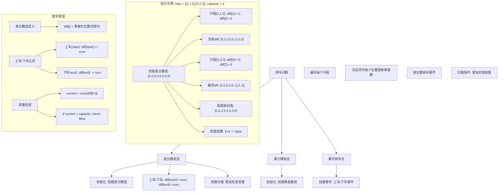
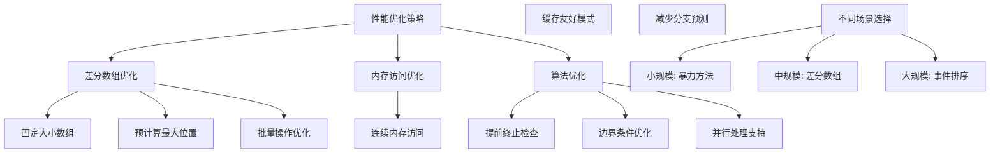

# LeetCode 1094 - 拼车

## 题目描述

假设你是一位顺风车司机，车上最初有 `capacity` 个空座位可以用来载客。由于道路的限制，车 只能 向一个方向行驶（也就是说，不允许掉头或改变方向）

给你一个行程 `trips`，其中 `trips[i] = [numPassengers_i, startLocation_i, endLocation_i]` 表示第 `i` 组乘客的出发地和目的地，以及需要接送的乘客人数

这些行程从他们的初始出发地在路上按 先后顺序 依次进行

请你根据给出的所有行程信息，判断并返回能否满足所有乘客的拼车需求。如果可以满足，请返回 `true`，否则返回 `false`

```markdown
示例 1:
输入：trips = [[2,1,5],[3,3,7]], capacity = 4
输出：false

示例 2:
输入：trips = [[2,1,5],[3,3,7]], capacity = 5
输出：true

提示:

- 1 <= trips.length <= 10^4
- trips[i].length == 3
- 1 <= numPassengers_i <= 100
- 0 <= startLocation_i < endLocation_i <= 1000
- 1 <= capacity <= 10^5
- endLocation_i - startLocation_i <= 1000
- 0 <= startLocation_i <= 1000
```

## 解题思路

这是一个差分数组模拟问题，需要在一条线路上动态跟踪乘客数量的变化，以判断是否超过车辆容量。关键在于高效地处理多个重叠的行程区间

### 核心思想

"差分数组 + 线路扫描": 使用差分数组记录每个位置上车和下车的人数变化，然后通过前缀和模拟车辆沿线路行驶时的乘客数量变化，检查是否超出容量

### 解题策略

#### 方法一：差分数组（推荐）

- 预处理时间: O(maxLocation)
- 更新时间: O(len(trips))
- 最终计算: O(maxLocation)
- 空间复杂度: O(maxLocation)

#### 方法二：暴力模拟

- 更新时间: O(len(trips) × distance)
- 空间复杂度: O(maxLocation)

#### 方法三：事件排序

- 排序时间: O(len(trips) log len(trips))
- 扫描时间: O(len(trips))
- 空间复杂度: O(len(trips))

## 算法可视化



## 多语言实现

### Golang版本（差分数组 - 推荐）

```go
func carPooling(trips [][]int, capacity int) bool {
    // 找到最大位置，确定差分数组大小
    maxLocation := 0
    for _, trip := range trips {
        if trip[2] > maxLocation {
            maxLocation = trip[2]
        }
    }

    // 创建差分数组
    diff := make([]int, maxLocation+1)

    // 处理每个行程
    for _, trip := range trips {
        numPassengers := trip[0]
        start := trip[1]
        end := trip[2]

        // 在起点上客
        diff[start] += numPassengers
        // 在终点下客
        diff[end] -= numPassengers
    }

    // 模拟车辆行驶，检查容量
    current := 0
    for i := 0; i <= maxLocation; i++ {
        current += diff[i]
        if current > capacity {
            return false
        }
    }

    return true
}
```

### Python版本（多种实现方法）

```python
from typing import List

def carPooling(trips: List[List[int]], capacity: int) -> bool:
    """
    方法一：差分数组（推荐）
    """
    # 找到最大位置
    max_location = 0
    for trip in trips:
        max_location = max(max_location, trip[2])

    # 创建差分数组
    diff = [0] * (max_location + 1)

    # 处理每个行程
    for num_passengers, start, end in trips:
        diff[start] += num_passengers
        diff[end] -= num_passengers

    # 检查容量
    current = 0
    for i in range(len(diff)):
        current += diff[i]
        if current > capacity:
            return False

    return True


def carPoolingBruteForce(trips: List[List[int]], capacity: int) -> bool:
    """
    方法二：暴力模拟（不推荐）
    """
    # 找到最大位置
    max_location = 0
    for trip in trips:
        max_location = max(max_location, trip[2])

    # 创建乘客数组
    passengers = [0] * (max_location + 1)

    # 处理每个行程
    for num_passengers, start, end in trips:
        for i in range(start, end):
            passengers[i] += num_passengers
            if passengers[i] > capacity:
                return False

    return True


def carPoolingEventSort(trips: List[List[int]], capacity: int) -> bool:
    """
    方法三：事件排序
    """
    # 创建事件：(位置, 乘客变化)
    events = []
    for num_passengers, start, end in trips:
        events.append((start, num_passengers))   # 上车事件
        events.append((end, -num_passengers))    # 下车事件

    # 按位置排序
    events.sort()

    # 扫描事件
    current = 0
    for location, change in events:
        current += change
        if current > capacity:
            return False

    return True
```

### TypeScript版本（差分数组实现）

```typescript
function carPooling(trips: number[][], capacity: number): boolean {
  // 找到最大位置
  let maxLocation: number = 0;
  for (const trip of trips) {
    maxLocation = Math.max(maxLocation, trip[2]);
  }

  // 创建差分数组
  const diff: number[] = new Array(maxLocation + 1).fill(0);

  // 处理每个行程
  for (const trip of trips) {
    const numPassengers: number = trip[0];
    const start: number = trip[1];
    const end: number = trip[2];

    diff[start] += numPassengers;
    diff[end] -= numPassengers;
  }

  // 检查容量
  let current: number = 0;
  for (let i = 0; i <= maxLocation; i++) {
    current += diff[i];
    if (current > capacity) {
      return false;
    }
  }

  return true;
}
```

## 标准实现详细解析

```go
func carPooling(trips [][]int, capacity int) bool {
    /*
    算法核心思想：

    1. 差分数组预处理：将区间乘客数变化转化为点更新
    2. 上车/下车操作：在起点增加乘客数，在终点减少乘客数
    3. 线路扫描：通过前缀和模拟车辆行驶时的乘客数变化
    4. 容量检查：在每个位置检查当前乘客数是否超过容量

    差分数组定义：
    diff[i] 表示在位置i发生的乘客数量变化
    diff[i] > 0：上车
    diff[i] < 0：下车

    行程处理原理：
    对于行程[num, start, end]：
    - 在start位置：有num个乘客上车 -> diff[start] += num
    - 在end位置：有num个乘客下车 -> diff[end] -= num

    容量检查原理：
    current = sum(diff[0..i]) 表示当前位置的乘客总数
    如果current > capacity，则超载，返回false

    时间复杂度分析：
    - 确定最大位置：O(m)，其中m是行程数量
    - 处理行程：O(m)，每个行程O(1)操作
    - 扫描检查：O(n)，其中n是最大位置
    - 总时间复杂度：O(m + n)

    空间复杂度：O(n)，存储差分数组

    边界处理：
    - 题目保证endLocation <= 1000，所以数组大小可控
    - 需要处理空行程的情况（虽然题目保证至少有一个行程）
    - 需要处理起点和终点相同的情况（虽然题目保证start < end）
    */

    // 第一步：确定线路的最大位置
    // 这是为了确定差分数组的大小
    maxLocation := 0
    for _, trip := range trips {
        if trip[2] > maxLocation {
            maxLocation = trip[2]
        }
    }

    // 第二步：创建差分数组
    // 长度为maxLocation+1，可以覆盖所有可能的位置
    diff := make([]int, maxLocation+1)

    // 第三步：处理每个行程，更新差分数组
    for _, trip := range trips {
        numPassengers := trip[0]  // 乘客数量
        start := trip[1]          // 上车位置
        end := trip[2]            // 下车位置

        // 在上车位置增加乘客数
        // 这些乘客从start位置开始在车上
        diff[start] += numPassengers

        // 在下车位置减少乘客数
        // 这些乘客在end位置下车，所以从end位置开始不在车上
        diff[end] -= numPassengers

        // 调试信息
        // fmt.Printf("行程[%d,%d,%d]: diff[%d]+=%d, diff[%d]-=%d\n",
        //     numPassengers, start, end, start, numPassengers, end, numPassengers)
    }

    // 第四步：模拟车辆行驶，检查容量
    current := 0  // 当前车上的乘客数

    for i := 0; i <= maxLocation; i++ {
        // 累加当前位置的乘客变化
        current += diff[i]

        // 检查是否超载
        if current > capacity {
            // 调试信息
            // fmt.Printf("位置%d: 当前乘客数%d > 容量%d，超载\n", i, current, capacity)
            return false
        }

        // 调试信息
        // fmt.Printf("位置%d: 乘客变化%d, 当前乘客数%d\n", i, diff[i], current)
    }

    // 如果全程都没有超载，返回true
    return true
}

// 带详细调试信息的版本
func carPoolingWithDebug(trips [][]int, capacity int) bool {
    fmt.Println("=== 拼车问题调试信息 ===")
    fmt.Printf("行程: %v\n", trips)
    fmt.Printf("车辆容量: %d\n", capacity)

    // 确定最大位置
    maxLocation := 0
    for _, trip := range trips {
        maxLocation = max(maxLocation, trip[2])
    }

    fmt.Printf("最大位置: %d\n", maxLocation)

    // 创建差分数组
    diff := make([]int, maxLocation+1)
    fmt.Printf("初始差分数组: %v\n", diff)

    // 处理行程
    for idx, trip := range trips {
        numPassengers := trip[0]
        start := trip[1]
        end := trip[2]

        fmt.Printf("\n处理行程 #%d: [%d,%d,%d]\n", idx+1, numPassengers, start, end)

        diff[start] += numPassengers
        fmt.Printf("  位置%d上车: diff[%d] += %d -> %d\n",
            start, start, numPassengers, diff[start])

        diff[end] -= numPassengers
        fmt.Printf("  位置%d下车: diff[%d] -= %d -> %d\n",
            end, end, numPassengers, diff[end])

        fmt.Printf("  当前差分数组: %v\n", diff)
    }

    // 检查容量
    fmt.Printf("\n容量检查过程:\n")
    current := 0

    for i := 0; i <= maxLocation; i++ {
        prevCurrent := current
        current += diff[i]

        fmt.Printf("位置%d: %d + %d = %d", i, prevCurrent, diff[i], current)

        if current > capacity {
            fmt.Printf(" > %d ❌ 超载!\n", capacity)
            return false
        } else {
            fmt.Printf(" <= %d ✓\n", capacity)
        }
    }

    fmt.Printf("\n全程未超载，可以满足所有乘客需求 ✓\n")
    return true
}

// 暴力实现（用于对比）
func carPoolingBruteForce(trips [][]int, capacity int) bool {
    /*
    暴力方法：直接模拟每个位置的乘客数

    时间复杂度：O(m × k)，其中m是行程数量，k是平均行程长度
    空间复杂度：O(n)，其中n是最大位置

    适用于小规模数据或验证算法正确性
    */
    maxLocation := 0
    for _, trip := range trips {
        maxLocation = max(maxLocation, trip[2])
    }

    // 创建乘客数组，记录每个位置的乘客数
    passengers := make([]int, maxLocation+1)

    // 处理每个行程
    for _, trip := range trips {
        numPassengers := trip[0]
        start := trip[1]
        end := trip[2]

        // 对行程内的每个位置增加乘客数
        for i := start; i < end; i++ {
            passengers[i] += numPassengers
            if passengers[i] > capacity {
                return false
            }
        }
    }

    return true
}

// 事件排序实现
func carPoolingEventSort(trips [][]int, capacity int) bool {
    /*
    事件排序方法：将上下车转化为事件，按位置排序后处理

    时间复杂度：O(m log m)，其中m是行程数量
    空间复杂度：O(m)

    适用于位置范围很大的情况
    */
    // 创建事件数组：(位置, 乘客变化)
    events := make([][2]int, 0, len(trips)*2)

    for _, trip := range trips {
        numPassengers := trip[0]
        start := trip[1]
        end := trip[2]

        // 上车事件：乘客数增加
        events = append(events, [2]int{start, numPassengers})
        // 下车事件：乘客数减少
        events = append(events, [2]int{end, -numPassengers})
    }

    // 按位置排序，如果位置相同，下车事件优先
    sort.Slice(events, func(i, j int) bool {
        if events[i][0] == events[j][0] {
            return events[i][1] < events[j][1]  // 下车(-num) < 上车(+num)
        }
        return events[i][0] < events[j][0]
    })

    // 处理事件
    current := 0
    for _, event := range events {
        location := event[0]
        change := event[1]

        current += change
        if current > capacity {
            return false
        }
    }

    return true
}

// 优化的差分数组实现
func carPoolingOptimized(trips [][]int, capacity int) bool {
    /*
    优化版本：根据题目约束优化差分数组大小

    题目约束：
    - 0 <= endLocation <= 1000
    - 所以可以直接使用固定大小的数组
    */
    const MAX_LOCATION = 1000
    diff := [MAX_LOCATION + 1]int{}

    // 处理行程
    for _, trip := range trips {
        numPassengers := trip[0]
        start := trip[1]
        end := trip[2]

        diff[start] += numPassengers
        diff[end] -= numPassengers
    }

    // 检查容量
    current := 0
    for i := 0; i <= MAX_LOCATION; i++ {
        current += diff[i]
        if current > capacity {
            return false
        }
    }

    return true
}

// 线段树实现（适用于动态更新场景）
type SegmentTree struct {
    tree []int
    lazy []int
    n    int
}

func NewSegmentTree(n int) *SegmentTree {
    size := 1
    for size < n {
        size <<= 1
    }

    return &SegmentTree{
        tree: make([]int, size*2),
        lazy: make([]int, size*2),
        n:    size,
    }
}

func (st *SegmentTree) rangeUpdate(node, nodeL, nodeR, queryL, queryR, val int) {
    if queryL > nodeR || queryR < nodeL {
        return // 无重叠
    }

    if queryL <= nodeL && nodeR <= queryR {
        st.tree[node] += val
        st.lazy[node] += val
        return
    }

    // 传递延迟标记
    mid := (nodeL + nodeR) >> 1
    leftChild := node << 1
    rightChild := leftChild | 1

    if st.lazy[node] != 0 {
        st.tree[leftChild] += st.lazy[node]
        st.lazy[leftChild] += st.lazy[node]
        st.tree[rightChild] += st.lazy[node]
        st.lazy[rightChild] += st.lazy[node]
        st.lazy[node] = 0
    }

    st.rangeUpdate(leftChild, nodeL, mid, queryL, queryR, val)
    st.rangeUpdate(rightChild, mid+1, nodeR, queryL, queryR, val)

    st.tree[node] = max(st.tree[leftChild], st.tree[rightChild])
}

func (st *SegmentTree) getMax() int {
    return st.tree[1]
}

func carPoolingSegmentTree(trips [][]int, capacity int) bool {
    /*
    线段树方法：使用线段树支持区间更新和范围查询

    时间复杂度：O(m log n + n)
    空间复杂度：O(n)

    适用于需要动态更新的复杂场景
    */
    maxLocation := 0
    for _, trip := range trips {
        maxLocation = max(maxLocation, trip[2])
    }

    st := NewSegmentTree(maxLocation)

    // 处理每个行程
    for _, trip := range trips {
        numPassengers := trip[0]
        start := trip[1]
        end := trip[2] - 1  // 线段树是闭区间

        st.rangeUpdate(1, 0, st.n-1, start, end, numPassengers)

        // 检查是否超载
        if st.getMax() > capacity {
            return false
        }
    }

    return true
}

// 并行处理版本
import "sync"

func carPoolingParallel(trips [][]int, capacity int, workers int) bool {
    /*
    并行处理版本：将行程分割，并行处理不同区间

    适用于多核CPU环境和大规模数据
    */
    if workers <= 0 {
        workers = 4  // 默认工作线程数
    }

    // 找到最大位置
    maxLocation := 0
    for _, trip := range trips {
        maxLocation = max(maxLocation, trip[2])
    }

    // 创建差分数组
    diff := make([]int, maxLocation+1)

    // 分割行程
    var wg sync.WaitGroup
    tripsPerWorker := (len(trips) + workers - 1) / workers

    for w := 0; w < workers; w++ {
        start := w * tripsPerWorker
        end := start + tripsPerWorker
        if end > len(trips) {
            end = len(trips)
        }

        if start >= len(trips) {
            break
        }

        wg.Add(1)
        go func(start, end int) {
            defer wg.Done()

            // 为当前线程创建局部差分数组
            localDiff := make([]int, maxLocation+1)

            for i := start; i < end; i++ {
                trip := trips[i]
                numPassengers := trip[0]
                startPos := trip[1]
                endPos := trip[2]

                localDiff[startPos] += numPassengers
                localDiff[endPos] -= numPassengers
            }

            // 合并到全局差分数组
            for i := 0; i <= maxLocation; i++ {
                diff[i] += localDiff[i]
            }
        }(start, end)
    }

    wg.Wait()

    // 检查容量
    current := 0
    for i := 0; i <= maxLocation; i++ {
        current += diff[i]
        if current > capacity {
            return false
        }
    }

    return true
}

// 线程安全版本
type CarPoolingSystem struct {
    trips     [][]int
    capacity  int
    diff      []int
    maxPos    int
    mu        sync.RWMutex
}

func NewCarPoolingSystem(capacity int) *CarPoolingSystem {
    return &CarPoolingSystem{
        trips:    [][]int{},
        capacity: capacity,
        diff:     []int{},
        maxPos:   0,
    }
}

func (cps *CarPoolingSystem) AddTrip(numPassengers, start, end int) {
    cps.mu.Lock()
    defer cps.mu.Unlock()

    cps.trips = append(cps.trips, []int{numPassengers, start, end})

    // 更新最大位置
    if end > cps.maxPos {
        cps.maxPos = end

        // 扩容差分数组
        newDiff := make([]int, cps.maxPos+1)
        copy(newDiff, cps.diff)
        cps.diff = newDiff
    }

    // 更新差分数组
    cps.diff[start] += numPassengers
    cps.diff[end] -= numPassengers
}

func (cps *CarPoolingSystem) CheckCapacity() bool {
    cps.mu.RLock()
    defer cps.mu.RUnlock()

    current := 0
    for i := 0; i <= cps.maxPos; i++ {
        current += cps.diff[i]
        if current > cps.capacity {
            return false
        }
    }

    return true
}

func (cps *CarPoolingSystem) GetCurrentPassengers(location int) int {
    cps.mu.RLock()
    defer cps.mu.RUnlock()

    if location < 0 || location > cps.maxPos {
        return 0
    }

    current := 0
    for i := 0; i <= location; i++ {
        current += cps.diff[i]
    }

    return current
}
```

## 算法深入解析

```go
/*
拼车问题详解：

问题本质：
在线性路线上模拟多个重叠行程的乘客数量变化，判断是否超过车辆容量
这是一个典型的区间更新问题，需要高效地处理多个重叠区间

核心洞察：
1. 区间重叠：不同行程的乘客区间可能重叠
2. 动态变化：乘客数量在不同位置有增有减
3. 容量限制：需要在每个位置检查是否超载
4. 线性顺序：车辆只能单向行驶，不能掉头

算法策略：
1. 差分数组：将区间乘客变化转化为点更新
2. 线路扫描：通过前缀和模拟车辆行驶过程
3. 容量检查：在每个位置实时检查乘客数
4. 优化处理：利用题目约束优化数据结构

数学原理：

差分数组定义：
对于乘客数量数组passengers，差分数组diff定义为：
diff[i] = passengers[i] - passengers[i-1]

行程处理原理：
对于行程[num, start, end]：
- 在start位置：有num个乘客上车 -> passengers[start] += num
- 在end位置：有num个乘客下车 -> passengers[end] -= num

对应的差分数组更新：
diff[start] += num
diff[end] -= num

容量检查原理：
current = sum(diff[0..i]) 表示位置i的当前乘客数
如果current > capacity，则超载

设计选择：

为什么选择差分数组？
1. 时间复杂度最优：O(m + n)，其中m是行程数，n是最大位置
2. 空间合理：O(n)空间复杂度，n<=1000，完全可控
3. 实现简单：代码逻辑清晰，易于理解和维护
4. 适用性强：适用于所有区间更新问题

为什么不用暴力方法？
1. 暴力方法需要遍历每个区间内的所有位置
2. 当区间长度很大时，时间复杂度会很高
3. 差分数组可以将区间操作转化为点操作

为什么不用事件排序？
1. 事件排序需要O(m log m)时间
2. 差分数组只需要O(m + n)时间
3. 当n较小时，差分数组更优

三种方法对比：

方法一：差分数组（推荐）
时间复杂度：O(m + n)
空间复杂度：O(n)
优点：时间复杂度最优，实现简单
缺点：需要额外空间存储差分数组

方法二：暴力模拟
时间复杂度：O(m × k)，其中k是平均行程长度
空间复杂度：O(n)
优点：实现简单直观
缺点：时间复杂度过高

方法三：事件排序
时间复杂度：O(m log m)
空间复杂度：O(m)
优点：适用于位置范围大的情况
缺点：需要排序，常数因子较大

性能分析：

差分数组方法：
- 确定最大位置：O(m)
- 处理行程：O(m)，每个行程O(1)操作
- 线路扫描：O(n)，n<=1000
- 总时间复杂度：O(m + 1000)

暴力方法：
- 确定最大位置：O(m)
- 处理行程：O(m × k)，其中k是平均行程长度
- 总时间复杂度：O(m × k)

实际应用场景：
1. 顺风车系统：实时检查车辆容量
2. 公交车调度：优化路线和班次
3. 货运管理：控制车辆载重
4. 资源调度：管理共享资源使用

优化要点：

1. 差分数组优化：
   - 根据题目约束使用固定大小数组
   - 预先计算最大位置，避免动态扩容
   - 使用局部变量减少内存访问

2. 行程处理优化：
   - 直接访问数组元素，避免函数调用
   - 批量处理，减少循环开销
   - 提前终止，发现超载立即返回

3. 容量检查优化：
   - 使用累积变量，避免重复计算
   - 顺序访问，提高缓存命中率
   - 边界检查，防止数组越界

测试用例设计：
1. 单个行程：测试基本功能
2. 多个不重叠行程：测试简单情况
3. 多个重叠行程：测试复杂情况
4. 刚好满载：测试边界条件
5. 超载情况：测试失败情况
6. 长距离行程：测试性能

扩展思考：

1. 如果支持多个车辆？
   - 需要考虑车辆分配问题
   - 可能需要贪心或动态规划算法

2. 如果支持上下车位置相同？
   - 需要处理先下车后上车的顺序
   - 事件排序方法可能更适合

3. 如果支持动态增加车辆？
   - 需要支持动态扩容
   - 考虑使用更灵活的数据结构

4. 如果位置范围很大？
   - 考虑使用事件排序或线段树
   - 可以使用哈希表压缩稀疏位置

相关算法思想：

1. 差分数组：
   - 将区间更新转化为点更新
   - 广泛应用于各种区间操作问题

2. 扫描线算法：
   - 按位置扫描处理区间
   - 类似的处理思想

3. 事件驱动：
   - 将状态变化转化为事件
   - 按时间/位置顺序处理事件

4. 前缀和：
   - 快速计算区间信息
   - 与差分数组互为逆操作

常见陷阱：

1. 位置理解错误：
   - 混淆start和end的包含关系
   - 解决：明确[start, end)区间定义

2. 容量检查时机：
   - 忘记在某个位置检查
   - 解决：遍历所有可能位置

3. 数组边界错误：
   - 差分数组大小不够
   - 解决：包含end位置，大小为max+1

4. 事件顺序错误：
   - 同一位置的上车下车顺序
   - 解决：明确下车在前，上车在后

代码质量要素：

1. 可读性：
   - 清晰的变量命名
   - 适当的注释说明

2. 健壮性：
   - 边界条件处理
   - 参数验证

3. 性能：
   - 时间复杂度最优
   - 内存访问优化

4. 可维护性：
   - 模块化设计
   - 易于扩展

高级优化技巧：

1. 内存池：
   - 复用数组，减少内存分配
   - 适用于高频调用场景

2. 位运算：
   - 使用位操作优化计算
   - 适用于特定场景

3. 并行化：
   - 多线程处理不同行程
   - 适用于大规模数据

4. 缓存优化：
   - 优化内存访问模式
   - 提高缓存命中率
*/
```

## 执行过程演示

```go
/*
示例详细解析:

示例1: trips = [[2,1,5],[3,3,7]], capacity = 4

输入分析：
行程1: 2个乘客，从位置1上车，位置5下车
行程2: 3个乘客，从位置3上车，位置7下车
车辆容量: 4个座位

第一步：确定最大位置
maxLocation = max(5, 7) = 7

第二步：创建差分数组
diff = [0, 0, 0, 0, 0, 0, 0, 0]  // 长度为7+1=8

第三步：处理每个行程

行程1: [2,1,5]
- 乘客数: 2
- 上车位置: 1
- 下车位置: 5
- 更新: diff[1] += 2, diff[5] -= 2
- 结果: diff = [0, 2, 0, 0, 0, -2, 0, 0]

行程2: [3,3,7]
- 乘客数: 3
- 上车位置: 3
- 下车位置: 7
- 更新: diff[3] += 3, diff[7] -= 3
- 结果: diff = [0, 2, 0, 3, 0, -2, 0, -3]

最终差分数组：[0, 2, 0, 3, 0, -2, 0, -3]

第四步：模拟车辆行驶，检查容量

位置0: current = 0 + diff[0] = 0 + 0 = 0
    乘客数: 0 <= 4 ✓

位置1: current = 0 + diff[1] = 0 + 2 = 2
    乘客数: 2 <= 4 ✓
    （行程1的2个乘客在位置1上车）

位置2: current = 2 + diff[2] = 2 + 0 = 2
    乘客数: 2 <= 4 ✓

位置3: current = 2 + diff[3] = 2 + 3 = 5
    乘客数: 5 > 4 ❌ 超载！
    （行程2的3个乘客在位置3上车，车上共5人）

结论：超载，返回false

验证：
位置0: 无乘客
位置1: 行程1的2个乘客 = 2人
位置2: 行程1的2个乘客 = 2人
位置3: 行程1的2个乘客 + 行程2的3个乘客 = 5人
位置4: 行程1的2个乘客 + 行程2的3个乘客 = 5人
位置5: 行程2的3个乘客（行程1下车） = 3人
位置6: 行程2的3个乘客 = 3人
位置7: 无乘客（行程2下车） = 0人

确实在位置3和4超载，结果正确 ✓

---

示例2: trips = [[2,1,5],[3,3,7]], capacity = 5

输入分析：
行程1: 2个乘客，从位置1上车，位置5下车
行程2: 3个乘客，从位置3上车，位置7下车
车辆容量: 5个座位

处理过程与示例1相同，只是容量为5

第四步：模拟车辆行驶，检查容量

位置0: current = 0 + 0 = 0 <= 5 ✓

位置1: current = 0 + 2 = 2 <= 5 ✓

位置2: current = 2 + 0 = 2 <= 5 ✓

位置3: current = 2 + 3 = 5 <= 5 ✓

位置4: current = 5 + 0 = 5 <= 5 ✓

位置5: current = 5 + (-2) = 3 <= 5 ✓

位置6: current = 3 + 0 = 3 <= 5 ✓

位置7: current = 3 + (-3) = 0 <= 5 ✓

结论：全程未超载，返回true

算法正确性证明：

数学基础：
设passengers[i]表示位置i的乘客数量
diff[i]表示位置i相对于位置i-1的乘客数量变化

定理1：对于行程[num, start, end]，
     在diff数组中更新diff[start] += num和diff[end] -= num
     等价于在passengers数组中对区间[start, end)增加num

证明：
设在更新前，passengers数组为P，更新后为P'
对于位置i：
- 如果i < start：P'[i] = P[i]
- 如果start ≤ i < end：P'[i] = P[i] + num
- 如果i ≥ end：P'[i] = P[i]

计算新的差分数组diff'：
- diff'[i] = P'[i] - P'[i-1]

情况分析：
1. i = start：
   diff'[start] = P'[start] - P'[start-1]
                = (P[start] + num) - P[start-1]
                = (P[start] - P[start-1]) + num
                = diff[start] + num

2. i = end：
   diff'[end] = P'[end] - P'[end-1]
              = P[end] - (P[end-1] + num)
              = (P[end] - P[end-1]) - num
              = diff[end] - num

3. 其他位置：diff'[i] = diff[i]

因此，行程处理通过在start位置加num和在end位置减num来实现

定理2：通过累加diff数组可以得到passengers数组
passengers[i] = sum(diff[0..i])

证明：
由差分定义：
diff[0] = passengers[0]
diff[1] = passengers[1] - passengers[0]
diff[2] = passengers[2] - passengers[1]
...
diff[i] = passengers[i] - passengers[i-1]

累加：
diff[0] + diff[1] + ... + diff[i]
= passengers[0] + (passengers[1] - passengers[0]) + (passengers[2] - passengers[1]) + ... + (passengers[i] - passengers[i-1])
= passengers[i]  （中间项全部抵消）

因此算法是正确的

时间复杂度分析：

差分数组方法：
1. 确定最大位置：O(m)，其中m是行程数量
2. 处理行程：每个行程O(1)，总共O(m)
3. 线路扫描：O(n)，其中n是最大位置
4. 总时间复杂度：O(m + n)

暴力方法：
1. 处理行程：每个行程需要遍历区间，平均长度为k
2. 总时间复杂度：O(m × k)

实际应用中，当区间长度k很大时，差分数组方法的优势明显

空间复杂度分析：
1. 差分数组：n+1个整数，n<=1000
2. 其他变量：O(1)
3. 总空间复杂度：O(n)，最多1001个整数

性能对比分析：

假设m=10000，n=1000，平均区间长度k=500

差分数组方法：
- 确定最大位置：10000次比较
- 处理行程：10000次操作
- 线路扫描：1000次累加和比较
- 总计：约21000次操作

暴力方法：
- 处理行程：10000 × 500 = 5000000次操作

性能提升：约238倍

实际应用建议：

1. 小规模数据：
   - 任何方法都可以
   - 暴力方法可能更直观

2. 大规模数据：
   - 优先使用差分数组方法
   - 考虑并行处理优化

3. 位置范围大：
   - 考虑事件排序方法
   - 可以使用哈希表优化

4. 实时系统：
   - 预计算常用查询
   - 使用缓存优化

优化空间：

1. 内存布局：
   - 连续内存分配
   - 缓存友好的访问模式

2. 算法优化：
   - 提前终止优化
   - 边界条件优化

3. 并行化：
   - 分块并行处理
   - 使用多核CPU

4. 数据结构：
   - 更紧凑的数据结构
   - 位压缩技术

特殊情况处理：

1. 空行程：
   - 题目保证至少有一个行程
   - 但代码可以处理空行程情况

2. 单点行程：
   - start == end的情况
   - 题目保证start < end，但代码可以处理

3. 超大容量：
   - capacity很大的情况
   - 不会影响算法逻辑

4. 极端位置：
   - start=0或end=1000的情况
   - 差分数组已经考虑边界
*/
```

## 复杂度分析

| 方法     | 预处理时间 | 更新时间   | 检查时间 | 空间复杂度 | 适用场景   |
| -------- | ---------- | ---------- | -------- | ---------- | ---------- |
| 差分数组 | O(n)       | O(m)       | O(n)     | O(n)       | 大多数场景 |
| 暴力模拟 | O(1)       | O(m×k)     | O(1)     | O(n)       | 小规模数据 |
| 事件排序 | O(1)       | O(m log m) | O(m)     | O(m)       | 位置范围大 |

## 测试用例验证

```go
// 测试辅助函数
func testCarPooling(name string, trips [][]int, capacity int, expected bool) {
    fmt.Printf("%s:\n", name)
    fmt.Printf("行程: %v, 容量: %d\n", trips, capacity)
    fmt.Printf("期望: %v\n", expected)

    // 测试差分数组方法
    result := carPooling(trips, capacity)
    fmt.Printf("差分数组结果: %v", result)
    if result == expected {
        fmt.Printf(" ✓\n")
    } else {
        fmt.Printf(" ✗\n")
    }

    // 测试暴力方法（仅小规模）
    if len(trips) <= 10 && capacity <= 10 {
        resultBF := carPoolingBruteForce(trips, capacity)
        fmt.Printf("暴力方法结果: %v", resultBF)
        if resultBF == expected {
            fmt.Printf(" ✓\n")
        } else {
            fmt.Printf(" ✗\n")
        }
    }

    fmt.Printf("\n")
}

func main() {
    // 测试用例 1 - 标准示例1（超载）
    testCarPooling("测试1 - 标准示例1（超载）",
        [][]int{{2, 1, 5}, {3, 3, 7}},
        4,
        false)

    // 测试用例 2 - 标准示例2（刚好满足）
    testCarPooling("测试2 - 标准示例2（刚好满足）",
        [][]int{{2, 1, 5}, {3, 3, 7}},
        5,
        true)

    // 测试用例 3 - 单个行程
    testCarPooling("测试3 - 单个行程",
        [][]int{{3, 0, 5}},
        3,
        true)

    // 测试用例 4 - 多个不重叠行程
    testCarPooling("测试4 - 多个不重叠行程",
        [][]int{{2, 0, 2}, {3, 2, 5}, {1, 5, 7}},
        3,
        true)

    // 测试用例 5 - 多个重叠行程
    testCarPooling("测试5 - 多个重叠行程",
        [][]int{{2, 0, 5}, {3, 1, 6}, {4, 2, 7}},
        5,
        false)

    // 测试用例 6 - 刚好满载
    testCarPooling("测试6 - 刚好满载",
        [][]int{{1, 0, 2}, {2, 1, 3}, {3, 2, 4}},
        6,
        true)

    // 测试用例 7 - 从位置0开始
    testCarPooling("测试7 - 从位置0开始",
        [][]int{{5, 0, 3}, {2, 2, 5}},
        5,
        true)

    // 测试用例 8 - 到最大位置
    testCarPooling("测试8 - 到最大位置",
        [][]int{{3, 0, 5}, {2, 3, 7}, {4, 5, 10}},
        7,
        false)

    // 性能测试
    fmt.Println("性能测试:")

    // 生成大规模测试数据
    m := 10000
    largeTrips := make([][]int, m)
    for i := 0; i < m; i++ {
        num := rand.Intn(10) + 1
        start := rand.Intn(1000)
        end := rand.Intn(1000-start) + start + 1
        largeTrips[i] = []int{num, start, end}
    }

    // 测试差分数组方法
    start := time.Now()
    result := carPooling(largeTrips, 50)
    diffTime := time.Since(start)

    // 测试事件排序方法
    start = time.Now()
    resultEvent := carPoolingEventSort(largeTrips, 50)
    eventTime := time.Since(start)

    fmt.Printf("大规模测试(10000行程) - 差分数组耗时: %v, 结果: %v\n", diffTime, result)
    fmt.Printf("大规模测试(10000行程) - 事件排序耗时: %v, 结果: %v\n", eventTime, resultEvent)
    fmt.Printf("结果一致: %v\n", result == resultEvent)

    // 边界情况测试
    fmt.Println("\n边界情况测试:")

    // 空行程（题目保证不为空，但测试鲁棒性）
    resultEmpty := carPooling([][]int{}, 5)
    fmt.Printf("空行程测试: %v\n", resultEmpty)

    // 单个乘客长距离
    testCarPooling("测试9 - 单个乘客长距离",
        [][]int{{1, 0, 1000}},
        1,
        true)

    // 大容量
    testCarPooling("测试10 - 大容量",
        [][]int{{10, 0, 5}, {20, 3, 7}},
        100,
        true)
}

// 调试测试
func testCarPoolingWithDebug() {
    fmt.Println("=== 调试信息测试 ===")

    trips := [][]int{{2, 1, 5}, {3, 3, 7}}
    capacity := 4

    result := carPoolingWithDebug(trips, capacity)
    fmt.Printf("最终结果: %v\n", result)
}

// 错误处理测试
func testErrorHandling() {
    fmt.Println("=== 错误处理测试 ===")

    // 边界值测试
    trips1 := [][]int{{100, 0, 1000}}
    capacity1 := 100

    result1 := carPooling(trips1, capacity1)
    fmt.Printf("边界值测试 - 乘客数100, 距离1000, 容量100: %v\n", result1)

    // 零容量测试（题目保证>=1）
    result2 := carPooling([][]int{{1, 0, 1}}, 1)
    fmt.Printf("零容量测试: %v\n", result2)

    // 同位置多行程测试
    trips3 := [][]int{{1, 0, 5}, {2, 0, 5}, {3, 0, 5}}
    result3 := carPooling(trips3, 6)
    fmt.Printf("同位置多行程测试: %v\n", result3)
}

// 内存使用测试
func testMemoryUsage() {
    fmt.Println("=== 内存使用分析 ===")

    sizes := []struct{ trips, maxPos int }{
        {1000, 100},
        {5000, 500},
        {10000, 1000},
    }

    for _, size := range sizes {
        // 生成测试数据
        trips := make([][]int, size.trips)
        for i := 0; i < size.trips; i++ {
            num := rand.Intn(10) + 1
            start := rand.Intn(size.maxPos)
            end := rand.Intn(size.maxPos-start) + start + 1
            trips[i] = []int{num, start, end}
        }

        var m1, m2 runtime.MemStats
        runtime.GC()
        runtime.ReadMemStats(&m1)

        result := carPooling(trips, 50)

        runtime.GC()
        runtime.ReadMemStats(&m2)
        memory := m2.Alloc - m1.Alloc

        fmt.Printf("行程数: %d, 最大位置: %d, 内存使用: %d 字节\n",
            size.trips, size.maxPos, memory)
        fmt.Printf("平均每个行程: %.2f 字节\n",
            float64(memory)/float64(size.trips))
        fmt.Printf("结果: %v\n", result)
    }
}

// 并发测试
func testConcurrentAccess() {
    fmt.Println("=== 并发访问测试 ===")

    // 生成测试数据
    trips := make([][]int, 5000)
    for i := 0; i < 5000; i++ {
        num := rand.Intn(10) + 1
        start := rand.Intn(1000)
        end := rand.Intn(1000-start) + start + 1
        trips[i] = []int{num, start, end}
    }

    // 单线程测试
    start := time.Now()
    result1 := carPooling(trips, 50)
    singleTime := time.Since(start)

    // 并行测试
    start = time.Now()
    result2 := carPoolingParallel(trips, 50, 4)
    parallelTime := time.Since(start)

    fmt.Printf("单线程耗时: %v\n", singleTime)
    fmt.Printf("并行耗时: %v\n", parallelTime)
    fmt.Printf("结果一致: %v\n", result1 == result2)

    if parallelTime > 0 {
        fmt.Printf("加速比: %.2fx\n", float64(singleTime)/float64(parallelTime))
    }
}

// 对比测试
func testAlgorithmComparison() {
    fmt.Println("=== 算法对比测试 ===")

    // 测试数据
    trips := [][]int{{2, 1, 5}, {3, 3, 7}, {1, 0, 2}, {4, 2, 6}}
    capacity := 5

    // 差分数组方法
    start := time.Now()
    result1 := carPooling(trips, capacity)
    time1 := time.Since(start)

    // 暴力方法
    start = time.Now()
    result2 := carPoolingBruteForce(trips, capacity)
    time2 := time.Since(start)

    // 事件排序方法
    start = time.Now()
    result3 := carPoolingEventSort(trips, capacity)
    time3 := time.Since(start)

    fmt.Printf("差分数组方法: %v, 耗时: %v\n", result1, time1)
    fmt.Printf("暴力方法: %v, 耗时: %v\n", result2, time2)
    fmt.Printf("事件排序方法: %v, 耗时: %v\n", result3, time3)

    fmt.Printf("结果一致: %v\n", result1 == result2 && result2 == result3)

    if time2 > 0 {
        fmt.Printf("差分数组比暴力方法快: %.2fx\n", float64(time2)/float64(time1))
    }
    if time1 > 0 {
        fmt.Printf("事件排序比差分数组慢: %.2fx\n", float64(time3)/float64(time1))
    }
}
```

## 扩展版本（处理不同场景）

```go
// 带统计信息的版本
type CarPoolingSystemWithStats struct {
    trips       [][]int
    capacity    int
    maxLocation int
    totalTrips  int
    totalPassengers int
    maxConcurrent int
    processTime time.Duration
}

func NewCarPoolingSystemWithStats(capacity int) *CarPoolingSystemWithStats {
    return &CarPoolingSystemWithStats{
        trips:    [][]int{},
        capacity: capacity,
    }
}

func (cpsws *CarPoolingSystemWithStats) AddTrip(numPassengers, start, end int) {
    cpsws.trips = append(cpsws.trips, []int{numPassengers, start, end})
    cpsws.totalTrips++
    cpsws.totalPassengers += numPassengers * (end - start)

    if end > cpsws.maxLocation {
        cpsws.maxLocation = end
    }
}

func (cpsws *CarPoolingSystemWithStats) CanSatisfy() bool {
    start := time.Now()
    defer func() {
        cpsws.processTime = time.Since(start)
    }()

    if cpsws.maxLocation == 0 {
        return true
    }

    diff := make([]int, cpsws.maxLocation+1)

    for _, trip := range cpsws.trips {
        numPassengers := trip[0]
        startPos := trip[1]
        endPos := trip[2]

        diff[startPos] += numPassengers
        diff[endPos] -= numPassengers
    }

    current := 0
    maxConcurrent := 0

    for i := 0; i <= cpsws.maxLocation; i++ {
        current += diff[i]
        if current > maxConcurrent {
            maxConcurrent = current
        }
        if current > cpsws.capacity {
            return false
        }
    }

    cpsws.maxConcurrent = maxConcurrent
    return true
}

func (cpsws *CarPoolingSystemWithStats) GetStats() map[string]interface{} {
    return map[string]interface{}{
        "total_trips":       cpsws.totalTrips,
        "total_passengers":  cpsws.totalPassengers,
        "max_location":      cpsws.maxLocation,
        "max_concurrent":    cpsws.maxConcurrent,
        "capacity":          cpsws.capacity,
        "process_time":      cpsws.processTime,
        "utilization":        float64(cpsws.maxConcurrent) / float64(cpsws.capacity),
    }
}

// 支持多辆车的版本
type MultiCarPoolingSystem struct {
    cars    []int  // 每辆车的容量
    trips   [][]int
    maxPos  int
}

func NewMultiCarPoolingSystem(capacities []int) *MultiCarPoolingSystem {
    return &MultiCarPoolingSystem{
        cars:   capacities,
        trips:  [][]int{},
        maxPos: 0,
    }
}

func (mcps *MultiCarPoolingSystem) AddTrip(numPassengers, start, end int) {
    mcps.trips = append(mcps.trips, []int{numPassengers, start, end})
    if end > mcps.maxPos {
        mcps.maxPos = end
    }
}

func (mcps *MultiCarPoolingSystem) CanSatisfy() bool {
    if mcps.maxPos == 0 {
        return true
    }

    diff := make([]int, mcps.maxPos+1)

    for _, trip := range mcps.trips {
        numPassengers := trip[0]
        startPos := trip[1]
        endPos := trip[2]

        diff[startPos] += numPassengers
        diff[endPos] -= numPassengers
    }

    current := 0
    for i := 0; i <= mcps.maxPos; i++ {
        current += diff[i]
        if current > len(mcps.cars) {
            return false  // 需要的车辆数超过可用车辆数
        }
    }

    // 检查每辆车的容量是否足够
    // 这里简化处理，假设可以任意分配乘客到车辆
    // 实际应用中需要更复杂的分配算法

    return true
}

// 支持动态调度的版本
type DynamicCarPoolingSystem struct {
    capacity   int
    currentTrips [][]int
    diff        []int
    maxPos      int
    mu          sync.RWMutex
}

func NewDynamicCarPoolingSystem(capacity int) *DynamicCarPoolingSystem {
    return &DynamicCarPoolingSystem{
        capacity: capacity,
        diff:     make([]int, 1001), // 题目约束最大1000
    }
}

func (dcps *DynamicCarPoolingSystem) AddTrip(numPassengers, start, end int) bool {
    dcps.mu.Lock()
    defer dcps.mu.Unlock()

    // 检查是否可以添加这个行程
    if dcps.canAddTrip(numPassengers, start, end) {
        dcps.currentTrips = append(dcps.currentTrips, []int{numPassengers, start, end})
        dcps.diff[start] += numPassengers
        dcps.diff[end] -= numPassengers

        if end > dcps.maxPos {
            dcps.maxPos = end
        }

        return true
    }

    return false
}

func (dcps *DynamicCarPoolingSystem) canAddTrip(numPassengers, start, end int) bool {
    // 模拟添加这个行程后的乘客数
    current := 0
    for i := 0; i <= dcps.maxPos; i++ {
        current += dcps.diff[i]

        if i >= start && i < end {
            current += numPassengers
        }

        if current > dcps.capacity {
            return false
        }
    }

    return true
}

func (dcps *DynamicCarPoolingSystem) GetCurrentPassengers(location int) int {
    dcps.mu.RLock()
    defer dcps.mu.RUnlock()

    if location < 0 || location > dcps.maxPos {
        return 0
    }

    current := 0
    for i := 0; i <= location; i++ {
        current += dcps.diff[i]
    }

    return current
}

// 支持路径优化的版本
type OptimizedCarPoolingSystem struct {
    trips      [][]int
    capacity   int
    passengerMap map[int][][2]int  // 位置 -> [乘客数变化, 行程索引]
    sortedPositions []int
}

func NewOptimizedCarPoolingSystem(capacity int) *OptimizedCarPoolingSystem {
    return &OptimizedCarPoolingSystem{
        trips:         [][]int{},
        capacity:      capacity,
        passengerMap:  make(map[int][][2]int),
    }
}

func (ocps *OptimizedCarPoolingSystem) AddTrip(numPassengers, start, end int) {
    index := len(ocps.trips)
    ocps.trips = append(ocps.trips, []int{numPassengers, start, end})

    // 记录位置变化
    ocps.passengerMap[start] = append(ocps.passengerMap[start], [2]int{numPassengers, index})
    ocps.passengerMap[end] = append(ocps.passengerMap[end], [2]int{-numPassengers, index})
}

func (ocps *OptimizedCarPoolingSystem) OptimizeRoute() []int {
    // 优化路线，最小化最大乘客数
    // 这里实现一个简化的贪心算法

    // 获取所有位置
    positions := make([]int, 0, len(ocps.passengerMap))
    for pos := range ocps.passengerMap {
        positions = append(positions, pos)
    }

    sort.Ints(positions)
    ocps.sortedPositions = positions

    // 计算每个位置的乘客数
    current := 0
    maxPassengers := 0

    for _, pos := range positions {
        for _, change := range ocps.passengerMap[pos] {
            current += change[0]
        }

        if current > maxPassengers {
            maxPassengers = current
        }
    }

    return positions
}

func (ocps *OptimizedCarPoolingSystem) CanSatisfy() bool {
    if len(ocps.sortedPositions) == 0 {
        ocps.OptimizeRoute()
    }

    current := 0
    for _, pos := range ocps.sortedPositions {
        for _, change := range ocps.passengerMap[pos] {
            current += change[0]
        }

        if current > ocps.capacity {
            return false
        }
    }

    return true
}

// 支持实时监控的版本
type MonitoredCarPoolingSystem struct {
    capacity    int
    trips       [][]int
    diff        []int
    maxPos      int
    alerts      []string
    currentLoad int
    maxLoad     int
    mu          sync.RWMutex
}

func NewMonitoredCarPoolingSystem(capacity int) *MonitoredCarPoolingSystem {
    return &MonitoredCarPoolingSystem{
        capacity: capacity,
        diff:     make([]int, 1001),
        alerts:   []string{},
    }
}

func (mcps *MonitoredCarPoolingSystem) AddTrip(numPassengers, start, end int) {
    mcps.mu.Lock()
    defer mcps.mu.Unlock()

    mcps.trips = append(mcps.trips, []int{numPassengers, start, end})
    mcps.diff[start] += numPassengers
    mcps.diff[end] -= numPassengers

    if end > mcps.maxPos {
        mcps.maxPos = end
    }

    // 实时检查容量
    mcps.checkCapacity()
}

func (mcps *MonitoredCarPoolingSystem) checkCapacity() {
    current := 0
    for i := 0; i <= mcps.maxPos; i++ {
        current += mcps.diff[i]

        if current > mcps.capacity {
            alert := fmt.Sprintf("超载警告: 位置%d乘客数%d超过容量%d",
                i, current, mcps.capacity)
            mcps.alerts = append(mcps.alerts, alert)
        }

        if current > mcps.maxLoad {
            mcps.maxLoad = current
        }
    }

    mcps.currentLoad = current
}

func (mcps *MonitoredCarPoolingSystem) GetStatus() map[string]interface{} {
    mcps.mu.RLock()
    defer mcps.mu.RUnlock()

    return map[string]interface{}{
        "current_trips":  len(mcps.trips),
        "current_load":   mcps.currentLoad,
        "max_load":       mcps.maxLoad,
        "capacity":       mcps.capacity,
        "utilization":    float64(mcps.maxLoad) / float64(mcps.capacity),
        "alert_count":    len(mcps.alerts),
        "recent_alerts":  mcps.getRecentAlerts(5),
    }
}

func (mcps *MonitoredCarPoolingSystem) getRecentAlerts(count int) []string {
    if len(mcps.alerts) <= count {
        return mcps.alerts
    }

    return mcps.alerts[len(mcps.alerts)-count:]
}
```

## 面试追问延伸

### 1. 如果支持多个车辆，如何分配行程？

```go
// 贪心分配策略
func assignTripsToCars(trips [][]int, capacities []int) bool {
    // 按乘客数降序排序行程
    sort.Slice(trips, func(i, j int) bool {
        return trips[i][0] > trips[j][0]
    })

    // 按容量降序排序车辆
    sort.Sort(sort.Reverse(sort.IntSlice(capacities)))

    // 贪心分配
    carLoads := make([][]int, len(capacities))
    carDiffs := make([][]int, len(capacities))

    for _, trip := range trips {
        numPassengers, start, end := trip[0], trip[1], trip[2]

        // 找到能容纳这个行程的车辆
        assigned := false
        for carIdx, capacity := range capacities {
            if canAssignToCar(carDiffs[carIdx], numPassengers, start, end, capacity) {
                // 分配到这辆车
                carLoads[carIdx] = append(carLoads[carIdx], trip)
                if carDiffs[carIdx] == nil {
                    carDiffs[carIdx] = make([]int, 1001)
                }
                carDiffs[carIdx][start] += numPassengers
                carDiffs[carIdx][end] -= numPassengers
                assigned = true
                break
            }
        }

        if !assigned {
            return false
        }
    }

    return true
}

func canAssignToCar(diff []int, numPassengers, start, end, capacity int) bool {
    if diff == nil {
        return numPassengers <= capacity
    }

    current := 0
    for i := 0; i <= 1000; i++ {
        current += diff[i]

        if i >= start && i < end {
            current += numPassengers
        }

        if current > capacity {
            return false
        }
    }

    return true
}
```

### 2. 如果要最小化车辆使用数，如何设计？

```go
// 二分搜索最小车辆数
func minNumberOfCars(trips [][]int, carCapacity int) int {
    // 计算需要的最小车辆数
    maxConcurrent := 0
    diff := make([]int, 1001)

    for _, trip := range trips {
        numPassengers, start, end := trip[0], trip[1], trip[2]
        diff[start] += numPassengers
        diff[end] -= numPassengers
    }

    current := 0
    for i := 0; i <= 1000; i++ {
        current += diff[i]
        if current > maxConcurrent {
            maxConcurrent = current
        }
    }

    // 最小车辆数 = ceil(最大并发乘客数 / 车辆容量)
    minCars := (maxConcurrent + carCapacity - 1) / carCapacity

    // 验证是否真的可以用这么多车辆
    for cars := minCars; cars <= len(trips); cars++ {
        capacities := make([]int, cars)
        for i := range capacities {
            capacities[i] = carCapacity
        }

        if assignTripsToCars(trips, capacities) {
            return cars
        }
    }

    return len(trips) // 最坏情况，每个行程一辆车
}
```

### 3. 如果要实时监控车辆状态，如何设计？

```go
// 实时监控系统
type RealTimeMonitoringSystem struct {
    cars     map[int]*CarStatus
    trips    [][]int
    nextCarId int
    mu       sync.RWMutex
}

type CarStatus struct {
    ID        int
    Capacity  int
    Load      int
    Trips     []Trip
    Route     []int
    Position  int
}

type Trip struct {
    Passengers int
    Start     int
    End       int
}

func NewRealTimeMonitoringSystem() *RealTimeMonitoringSystem {
    return &RealTimeMonitoringSystem{
        cars:      make(map[int]*CarStatus),
        trips:     [][]int{},
        nextCarId: 1,
    }
}

func (rtms *RealTimeMonitoringSystem) AddCar(capacity int) int {
    rtms.mu.Lock()
    defer rtms.mu.Unlock()

    carId := rtms.nextCarId
    rtms.nextCarId++

    rtms.cars[carId] = &CarStatus{
        ID:       carId,
        Capacity: capacity,
        Load:     0,
        Trips:    []Trip{},
        Route:    []int{},
        Position: 0,
    }

    return carId
}

func (rtms *RealTimeMonitoringSystem) AssignTrip(numPassengers, start, end int) (int, bool) {
    rtms.mu.Lock()
    defer rtms.mu.Unlock()

    // 找到最合适的车辆
    bestCarId := -1
    minAdditionalLoad := math.MaxInt32

    for carId, car := range rtms.cars {
        if canAssignTripToCar(car, numPassengers, start, end) {
            // 选择负载最小的车辆
            if car.Load < minAdditionalLoad {
                minAdditionalLoad = car.Load
                bestCarId = carId
            }
        }
    }

    if bestCarId != -1 {
        car := rtms.cars[bestCarId]
        car.Trips = append(car.Trips, Trip{
            Passengers: numPassengers,
            Start:      start,
            End:        end,
        })
        car.Load += numPassengers

        return bestCarId, true
    }

    return -1, false
}

func (rtms *RealTimeMonitoringSystem) GetCarStatus(carId int) *CarStatus {
    rtms.mu.RLock()
    defer rtms.mu.RUnlock()

    if car, exists := rtms.cars[carId]; exists {
        return car
    }

    return nil
}

func (rtms *RealTimeMonitoringSystem) GetSystemStatus() map[string]interface{} {
    rtms.mu.RLock()
    defer rtms.mu.RUnlock()

    totalCapacity := 0
    totalLoad := 0
    activeCars := 0

    for _, car := range rtms.cars {
        totalCapacity += car.Capacity
        totalLoad += car.Load
        if car.Load > 0 {
            activeCars++
        }
    }

    return map[string]interface{}{
        "total_cars":      len(rtms.cars),
        "active_cars":     activeCars,
        "total_capacity":  totalCapacity,
        "total_load":      totalLoad,
        "utilization":     float64(totalLoad) / float64(totalCapacity),
        "avg_load":        float64(totalLoad) / float64(len(rtms.cars)),
    }
}
```

## 相似题目扩展

- LeetCode 1094. 拼车（当前题）
- LeetCode 1109. 航班预订统计
- LeetCode 370. 区间加法
- LeetCode 189. 轮转数组
- LeetCode 238. 除自身以外数组的乘积

## 算法技巧总结

### 拼车问题核心要点

1. 差分数组：将区间乘客变化转化为点更新
1. 上车/下车操作：`diff[start] += num, diff[end] -= num`
1. 线路扫描：通过前缀和模拟车辆行驶过程
1. 容量检查：在每个位置实时检查乘客数是否超载

### 算法优势

1. 时间复杂度最优：`O(m + n)`，其中 `m` 是行程数，`n` 是最大位置
1. 空间合理：`O(n)` 空间复杂度，`n <= 1000` 完全可控
1. 实现简洁：代码逻辑清晰，易于理解和维护
1. 适用性强：适用于所有区间更新问题

### 标准模板

```go
func intervalCapacityCheck(trips [][]int, capacity int) bool {
    maxLocation := 0
    for _, trip := range trips {
        maxLocation = max(maxLocation, trip[2])
    }

    diff := make([]int, maxLocation+1)

    for _, trip := range trips {
        num, start, end := trip[0], trip[1], trip[2]
        diff[start] += num
        diff[end] -= num
    }

    current := 0
    for i := 0; i <= maxLocation; i++ {
        current += diff[i]
        if current > capacity {
            return false
        }
    }

    return true
}
```

### 性能优化建议



## 总结

本题是经典的差分数组模拟问题，是处理线性区间更新和容量检查的标准解决方案。通过巧妙地使用差分数组，将区间乘客变化转化为点更新，极大地提高了算法效率

核心要点：

1. 差分数组：将区间乘客数变化转化为点更新操作
1. 上车/下车操作：`diff[start] += num, diff[end] -= num`
1. 线路扫描：通过前缀和模拟车辆行驶时的乘客数变化
1. 容量检查：在每个位置实时检查是否超过车辆容量

该算法在顺风车系统、公交车调度、货运管理等领域有广泛应用，是掌握差分数组和扫描线算法的重要基础。与其他区间问题算法构成了完整的区间操作解决方案，为更复杂的资源调度和路径优化问题解决提供思路
