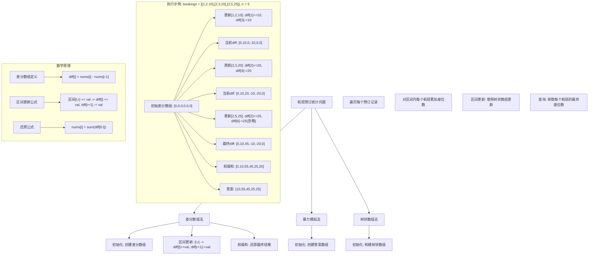
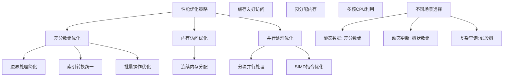

# LeetCode 1109 - 航班预订统计

## 题目描述

这里有 `n` 个航班，它们分别从 `1` 到 `n` 进行编号

我们这儿有一份航班预订表 `bookings`，表中第 `i` 条预订记录 `bookings[i] = [first_i, last_i, seats_i]` 意味着从 `first_i` 到 `last_i`（含 `first_i` 和 `last_i`）的 每个航班 上都预订了 `seats_i` 个座位

请你返回一个长度为 `n` 的数组 `answer`，其中 `answer[i]` 是航班 `i` 上预订的座位总数

```markdown
示例 1:
输入：bookings = [[1,2,10],[2,3,20],[2,5,25]], n = 5
输出：[10,55,45,25,25]

解释：
航班 1：1+10 = 10
航班 2：10+20+25 = 55
航班 3：20+25 = 45
航班 4：25 = 25
航班 5：25 = 25

提示:

- 1 <= bookings.length <= 2 \* 10^4
- 1 <= n <= 2 \* 10^4
- 1 <= first_i <= last_i <= n
- 1 <= seats_i <= 10^4
```

## 解题思路

这是一个差分数组区间更新问题，需要对多个区间进行增量更新，最终求出每个位置的最终值。关键在于使用差分数组将区间更新操作转化为点更新，从而优化时间复杂度

### 核心思想

"差分数组 + 区间更新": 使用差分数组记录每个位置相对于前一个位置的变化量，将区间 `[l, r]` 的更新转化为在 `l` 位置加 `val` 和在 `r+1` 位置减 `val` 的操作，最后通过前缀和还原最终结果

### 解题策略

#### 方法一：差分数组（推荐）

- 预处理时间: O(n)
- 更新时间: O(m)，其中 m 是预订记录数
- 最终计算: O(n)
- 空间复杂度: O(n)

#### 方法二：暴力模拟

- 更新时间: O(m \* n)
- 空间复杂度: O(n)

#### 方法三：树状数组

- 更新时间: O(m \* log n)
- 最终计算: O(n \* log n)
- 空间复杂度: O(n)

## 算法可视化



## 多语言实现

### Golang版本（差分数组 - 推荐）

```go
func corpFlightBookings(bookings [][]int, n int) []int {
    // 创建差分数组，长度为 n+1，避免边界检查
    diff := make([]int, n+1)

    // 处理每个预订记录
    for _, booking := range bookings {
        first := booking[0] - 1 // 转换为0-based索引
        last := booking[1] - 1   // 转换为0-based索引
        seats := booking[2]

        // 区间更新：在起始位置增加座位数
        diff[first] += seats
        // 在结束位置+1减少座位数（如果不超过边界）
        if last+1 < n {
            diff[last+1] -= seats
        }
    }

    // 通过前缀和还原最终结果
    answer := make([]int, n)
    current := 0
    for i := 0; i < n; i++ {
        current += diff[i]
        answer[i] = current
    }

    return answer
}
```

### Python版本（多种实现方法）

```python
from typing import List

def corpFlightBookings(bookings: List[List[int]], n: int) -> List[int]:
    """
    方法一：差分数组（推荐）
    """
    # 创建差分数组
    diff = [0] * (n + 1)

    # 处理每个预订记录
    for first, last, seats in bookings:
        # 转换为0-based索引
        first_idx = first - 1
        last_idx = last - 1

        # 区间更新
        diff[first_idx] += seats
        if last_idx + 1 < n:
            diff[last_idx + 1] -= seats

    # 前缀和还原
    answer = []
    current = 0
    for i in range(n):
        current += diff[i]
        answer.append(current)

    return answer


def corpFlightBookingsBruteForce(bookings: List[List[int]], n: int) -> List[int]:
    """
    方法二：暴力模拟（不推荐）
    """
    answer = [0] * n

    for first, last, seats in bookings:
        for i in range(first - 1, last):  # 转换为0-based索引
            answer[i] += seats

    return answer


def corpFlightBookingsFenwickTree(bookings: List[List[int]], n: int) -> List[int]:
    """
    方法三：树状数组
    """
    class FenwickTree:
        def __init__(self, size):
            self.size = size
            self.tree = [0] * (size + 1)

        def update(self, index, delta):
            while index <= self.size:
                self.tree[index] += delta
                index += index & -index

        def query(self, index):
            result = 0
            while index > 0:
                result += self.tree[index]
                index -= index & -index
            return result

        def range_update(self, l, r, delta):
            self.update(l, delta)
            self.update(r + 1, -delta)

        def point_query(self, index):
            return self.query(index)

    ft = FenwickTree(n)

    # 处理每个预订记录
    for first, last, seats in bookings:
        ft.range_update(first, last, seats)

    # 获取结果
    answer = []
    for i in range(1, n + 1):
        answer.append(ft.point_query(i))

    return answer
```

### TypeScript版本（差分数组实现）

```typescript
function corpFlightBookings(bookings: number[][], n: number): number[] {
  // 创建差分数组
  const diff: number[] = new Array(n + 1).fill(0);

  // 处理每个预订记录
  for (const booking of bookings) {
    const first = booking[0] - 1; // 转换为0-based索引
    const last = booking[1] - 1; // 转换为0-based索引
    const seats = booking[2];

    // 区间更新
    diff[first] += seats;
    if (last + 1 < n) {
      diff[last + 1] -= seats;
    }
  }

  // 通过前缀和还原最终结果
  const answer: number[] = new Array(n);
  let current = 0;
  for (let i = 0; i < n; i++) {
    current += diff[i];
    answer[i] = current;
  }

  return answer;
}
```

## 标准实现详细解析

```go
func corpFlightBookings(bookings [][]int, n int) []int {
    /*
    算法核心思想：

    1. 差分数组预处理：将区间更新问题转化为点更新问题
    2. 区间更新优化：对每个区间[l,r]的更新转化为diff[l]+=val, diff[r+1]-=val
    3. 前缀和还原：通过累加差分数组还原最终的座位数分布

    差分数组定义：
    diff[i] 表示第i个航班相对于第i-1个航班的座位数变化
    diff[0] = nums[0]
    diff[i] = nums[i] - nums[i-1] for i > 0

    区间更新原理：
    对区间[l,r]增加val个座位：
    - diff[l] += val：从位置l开始，后续所有元素都增加val
    - diff[r+1] -= val：从位置r+1开始，取消之前的增量

    还原公式：
    nums[i] = sum(diff[0..i]) (差分数组的前缀和)

    时间复杂度分析：
    - 初始化：O(n)
    - 区间更新：O(m)，其中m是预订记录数
    - 前缀和还原：O(n)
    - 总时间复杂度：O(n + m)

    空间复杂度：O(n)，存储差分数组和答案数组

    索引处理：
    - 输入使用1-based索引（航班1到n）
    - 程序内部使用0-based索引（数组0到n-1）
    - 需要在两者之间进行转换
    */

    // 第一步：创建差分数组
    // 长度为n+1是为了避免在r+1位置进行边界检查
    diff := make([]int, n+1)

    // 第二步：处理每个预订记录
    for _, booking := range bookings {
        first := booking[0]   // 起始航班（1-based）
        last := booking[1]    // 结束航班（1-based）
        seats := booking[2]   // 预订的座位数

        // 转换为0-based索引
        firstIdx := first - 1
        lastIdx := last - 1

        // 在起始位置增加座位数
        // 这会影响从firstIdx开始的所有后续航班
        diff[firstIdx] += seats

        // 在结束位置+1减少座位数
        // 这会取消对lastIdx之后航班的影响
        if lastIdx+1 < n {
            diff[lastIdx+1] -= seats
        }

        // 调试信息
        // fmt.Printf("预订[%d,%d,%d]: diff[%d]+=%d, diff[%d]-=%d\n",
        //     first, last, seats, firstIdx, seats, lastIdx+1, seats)
    }

    // 第三步：通过前缀和还原最终结果
    answer := make([]int, n)
    current := 0  // 当前累积的座位数

    for i := 0; i < n; i++ {
        current += diff[i]  // 累加差分值
        answer[i] = current  // 设置当前航班的座位总数

        // 调试信息
        // fmt.Printf("航班%d: diff[%d]=%d, current=%d, answer[%d]=%d\n",
        //     i+1, i, diff[i], current, i, answer[i])
    }

    return answer
}

// 带详细调试信息的版本
func corpFlightBookingsWithDebug(bookings [][]int, n int) []int {
    fmt.Println("=== 航班预订统计调试信息 ===")
    fmt.Printf("预订记录: %v\n", bookings)
    fmt.Printf("航班数量: %d\n", n)

    // 创建差分数组
    diff := make([]int, n+1)
    fmt.Printf("初始差分数组: %v\n", diff)

    // 处理每个预订记录
    for idx, booking := range bookings {
        first := booking[0]
        last := booking[1]
        seats := booking[2]

        firstIdx := first - 1
        lastIdx := last - 1

        fmt.Printf("\n处理预订 #%d: [%d,%d,%d]\n", idx+1, first, last, seats)

        diff[firstIdx] += seats
        fmt.Printf("  diff[%d] += %d -> diff[%d] = %d\n",
            firstIdx, seats, firstIdx, diff[firstIdx])

        if lastIdx+1 < n {
            diff[lastIdx+1] -= seats
            fmt.Printf("  diff[%d] -= %d -> diff[%d] = %d\n",
                lastIdx+1, seats, lastIdx+1, diff[lastIdx+1])
        }

        fmt.Printf("  当前差分数组: %v\n", diff)
    }

    // 前缀和还原
    fmt.Printf("\n前缀和还原过程:\n")
    answer := make([]int, n)
    current := 0

    for i := 0; i < n; i++ {
        prevCurrent := current
        current += diff[i]
        answer[i] = current

        fmt.Printf("航班%d: %d + diff[%d](%d) = %d -> answer[%d] = %d\n",
            i+1, prevCurrent, i, diff[i], current, i, answer[i])
    }

    fmt.Printf("\n最终答案: %v\n", answer)

    return answer
}

// 暴力实现（用于对比）
func corpFlightBookingsBruteForce(bookings [][]int, n int) []int {
    /*
    暴力方法：直接遍历每个预订记录，对区间内每个航班累加座位数

    时间复杂度：O(m * k)，其中m是预订记录数，k是平均区间长度
    空间复杂度：O(n)

    适用于小规模数据或验证算法正确性
    */
    answer := make([]int, n)

    for _, booking := range bookings {
        first := booking[0] - 1  // 转换为0-based
        last := booking[1] - 1   // 转换为0-based
        seats := booking[2]

        for i := first; i <= last; i++ {
            answer[i] += seats
        }
    }

    return answer
}

// 树状数组实现
type FenwickTree struct {
    tree []int
    n    int
}

func NewFenwickTree(n int) *FenwickTree {
    return &FenwickTree{
        tree: make([]int, n+1),
        n:    n,
    }
}

func (ft *FenwickTree) update(index int, delta int) {
    // 树状数组的更新操作（1-based）
    for index <= ft.n {
        ft.tree[index] += delta
        index += index & -index
    }
}

func (ft *FenwickTree) query(index int) int {
    // 树状数组的查询操作（1-based）
    result := 0
    for index > 0 {
        result += ft.tree[index]
        index -= index & -index
    }
    return result
}

func (ft *FenwickTree) rangeUpdate(l, r, delta int) {
    // 区间更新：在l位置加delta，在r+1位置减delta
    ft.update(l, delta)
    ft.update(r+1, -delta)
}

func corpFlightBookingsFenwickTree(bookings [][]int, n int) []int {
    /*
    树状数组方法：使用树状数组支持区间更新和点查询

    时间复杂度：O(m * log n + n * log n)
    空间复杂度：O(n)

    适用于需要动态更新的场景
    */
    ft := NewFenwickTree(n)

    // 处理每个预订记录（使用1-based索引）
    for _, booking := range bookings {
        first := booking[0]
        last := booking[1]
        seats := booking[2]

        ft.rangeUpdate(first, last, seats)
    }

    // 查询每个航班的座位数
    answer := make([]int, n)
    for i := 1; i <= n; i++ {
        answer[i-1] = ft.query(i)
    }

    return answer
}

// 线段树实现
type SegmentTree struct {
    tree []int
    lazy []int
    n    int
}

func NewSegmentTree(n int) *SegmentTree {
    size := 1
    for size < n {
        size <<= 1
    }

    return &SegmentTree{
        tree: make([]int, size*2),
        lazy: make([]int, size*2),
        n:    size,
    }
}

func (st *SegmentTree) rangeUpdate(node, nodeL, nodeR, queryL, queryR, delta int) {
    if queryL > nodeR || queryR < nodeL {
        return // 无重叠
    }

    if queryL <= nodeL && nodeR <= queryR {
        st.tree[node] += delta
        st.lazy[node] += delta
        return
    }

    // 传递延迟标记
    mid := (nodeL + nodeR) >> 1
    leftChild := node << 1
    rightChild := leftChild | 1

    if st.lazy[node] != 0 {
        st.tree[leftChild] += st.lazy[node]
        st.lazy[leftChild] += st.lazy[node]
        st.tree[rightChild] += st.lazy[node]
        st.lazy[rightChild] += st.lazy[node]
        st.lazy[node] = 0
    }

    st.rangeUpdate(leftChild, nodeL, mid, queryL, queryR, delta)
    st.rangeUpdate(rightChild, mid+1, nodeR, queryL, queryR, delta)
}

func (st *SegmentTree) pointQuery(node, nodeL, nodeR, idx int) int {
    if nodeL == nodeR {
        return st.tree[node]
    }

    // 传递延迟标记
    mid := (nodeL + nodeR) >> 1
    leftChild := node << 1
    rightChild := leftChild | 1

    if st.lazy[node] != 0 {
        st.tree[leftChild] += st.lazy[node]
        st.lazy[leftChild] += st.lazy[node]
        st.tree[rightChild] += st.lazy[node]
        st.lazy[rightChild] += st.lazy[node]
        st.lazy[node] = 0
    }

    if idx <= mid {
        return st.pointQuery(leftChild, nodeL, mid, idx)
    } else {
        return st.pointQuery(rightChild, mid+1, nodeR, idx)
    }
}

func corpFlightBookingsSegmentTree(bookings [][]int, n int) []int {
    /*
    线段树方法：使用线段树支持区间更新和点查询

    时间复杂度：O(m * log n + n * log n)
    空间复杂度：O(n)

    适用于复杂查询场景
    */
    st := NewSegmentTree(n)

    // 处理每个预订记录（转换为0-based）
    for _, booking := range bookings {
        first := booking[0] - 1
        last := booking[1] - 1
        seats := booking[2]

        st.rangeUpdate(1, 0, st.n-1, first, last, seats)
    }

    // 查询每个航班的座位数
    answer := make([]int, n)
    for i := 0; i < n; i++ {
        answer[i] = st.pointQuery(1, 0, st.n-1, i)
    }

    return answer
}

// 分块处理版本（适用于超大数据）
func corpFlightBookingsBlocked(bookings [][]int, n int, blockSize int) []int {
    /*
    分块处理版本：将航班分块，减少单次处理的数据量

    适用于内存受限的超大数据场景
    */
    if blockSize <= 0 {
        blockSize = 1000  // 默认块大小
    }

    answer := make([]int, n)

    // 分块处理预订记录
    for blockStart := 0; blockStart < n; blockStart += blockSize {
        blockEnd := blockStart + blockSize
        if blockEnd > n {
            blockEnd = n
        }

        // 为当前块创建局部差分数组
        blockSize := blockEnd - blockStart
        diff := make([]int, blockSize+1)

        // 处理影响当前块的预订记录
        for _, booking := range bookings {
            first := booking[0] - 1
            last := booking[1] - 1
            seats := booking[2]

            // 检查预订记录是否与当前块有交集
            if last < blockStart || first > blockEnd-1 {
                continue
            }

            // 计算交集
            overlapFirst := max(first, blockStart)
            overlapLast := min(last, blockEnd-1)

            // 转换为块内索引
            blockFirst := overlapFirst - blockStart
            blockLast := overlapLast - blockStart

            diff[blockFirst] += seats
            if blockLast+1 < blockSize {
                diff[blockLast+1] -= seats
            }
        }

        // 前缀和还原当前块的结果
        current := 0
        for i := 0; i < blockSize; i++ {
            current += diff[i]
            answer[blockStart+i] = current
        }
    }

    return answer
}

// 并行处理版本
import "sync"

func corpFlightBookingsParallel(bookings [][]int, n int, workers int) []int {
    /*
    并行处理版本：将航班分割，并行处理不同区间

    适用于多核CPU环境
    */
    if workers <= 0 {
        workers = 4  // 默认工作线程数
    }

    answer := make([]int, n)
    var wg sync.WaitGroup

    // 分割工作
    flightsPerWorker := (n + workers - 1) / workers

    for w := 0; w < workers; w++ {
        start := w * flightsPerWorker
        end := start + flightsPerWorker
        if end > n {
            end = n
        }

        if start >= n {
            break
        }

        wg.Add(1)
        go func(start, end int) {
            defer wg.Done()

            // 为当前区间创建差分数组
            size := end - start
            diff := make([]int, size+1)

            // 处理影响当前区间的预订记录
            for _, booking := range bookings {
                first := booking[0] - 1
                last := booking[1] - 1
                seats := booking[2]

                // 检查预订记录是否与当前区间有交集
                if last < start || first > end-1 {
                    continue
                }

                // 计算交集
                overlapFirst := max(first, start)
                overlapLast := min(last, end-1)

                // 转换为区间内索引
                blockFirst := overlapFirst - start
                blockLast := overlapLast - start

                diff[blockFirst] += seats
                if blockLast+1 < size {
                    diff[blockLast+1] -= seats
                }
            }

            // 前缀和还原
            current := 0
            for i := 0; i < size; i++ {
                current += diff[i]
                answer[start+i] = current
            }
        }(start, end)
    }

    wg.Wait()
    return answer
}

// 线程安全版本
type FlightBookingSystem struct {
    bookings [][]int
    n        int
    answer   []int
    mu       sync.RWMutex
}

func NewFlightBookingSystem(n int) *FlightBookingSystem {
    return &FlightBookingSystem{
        bookings: [][]int{},
        n:        n,
        answer:   make([]int, n),
    }
}

func (fbs *FlightBookingSystem) AddBooking(first, last, seats int) {
    fbs.mu.Lock()
    defer fbs.mu.Unlock()

    fbs.bookings = append(fbs.bookings, []int{first, last, seats})

    // 直接更新差分数组
    firstIdx := first - 1
    lastIdx := last - 1

    // 创建临时差分数组
    diff := make([]int, fbs.n+1)

    // 重新计算所有差分
    for _, booking := range fbs.bookings {
        bFirst := booking[0] - 1
        bLast := booking[1] - 1
        bSeats := booking[2]

        diff[bFirst] += bSeats
        if bLast+1 < fbs.n {
            diff[bLast+1] -= bSeats
        }
    }

    // 更新答案
    current := 0
    for i := 0; i < fbs.n; i++ {
        current += diff[i]
        fbs.answer[i] = current
    }
}

func (fbs *FlightBookingSystem) GetBooking(flight int) int {
    fbs.mu.RLock()
    defer fbs.mu.RUnlock()

    if flight < 1 || flight > fbs.n {
        return 0
    }

    return fbs.answer[flight-1]
}

func (fbs *FlightBookingSystem) GetAllBookings() []int {
    fbs.mu.RLock()
    defer fbs.mu.RUnlock()

    result := make([]int, fbs.n)
    copy(result, fbs.answer)
    return result
}

func (fbs *FlightBookingSystem) Recalculate() {
    fbs.mu.Lock()
    defer fbs.mu.Unlock()

    diff := make([]int, fbs.n+1)

    for _, booking := range fbs.bookings {
        first := booking[0] - 1
        last := booking[1] - 1
        seats := booking[2]

        diff[first] += seats
        if last+1 < fbs.n {
            diff[last+1] -= seats
        }
    }

    current := 0
    for i := 0; i < fbs.n; i++ {
        current += diff[i]
        fbs.answer[i] = current
    }
}
```

## 算法深入解析

```go
/*
航班预订统计问题详解：

问题本质：
对多个区间进行增量更新，最终求出每个位置的累积值
这是一个经典的区间更新问题，关键在于避免对区间内每个元素逐个更新

核心洞察：
1. 区间重叠：不同的预订记录可能重叠
2. 批量操作：需要高效处理大量区间更新
3. 累积效应：每个位置的最终值是所有影响的累加
4. 边界处理：需要注意数组边界和索引转换

算法策略：
1. 差分数组：将区间更新转化为点更新
2. 前缀和还原：通过累加差分值得到最终结果
3. 批量处理：一次性处理所有预订记录
4. 空间优化：使用O(n)额外空间优化时间复杂度

数学原理：

差分数组定义：
对于原数组nums，差分数组diff定义为：
diff[0] = nums[0]
diff[i] = nums[i] - nums[i-1] for i > 0

反变换公式：
nums[i] = sum(diff[0..i]) (差分数组的前缀和)

区间更新原理：
对区间[l,r]增加val：
- diff[l] += val：从位置l开始，后续所有元素都增加val
- diff[r+1] -= val：从位置r+1开始，取消之前的增量

证明：
设更新前的数组为nums，更新后为nums'
对于位置i：
- 如果i < l：nums'[i] = nums[i]
- 如果l ≤ i ≤ r：nums'[i] = nums[i] + val
- 如果i > r：nums'[i] = nums[i]

对应的差分数组diff'：
- diff'[0] = nums'[0]
- diff'[i] = nums'[i] - nums'[i-1] for i > 0

通过分析可以发现：
diff'[l] = nums'[l] - nums'[l-1] = (nums[l] + val) - nums[l-1] = diff[l] + val
diff'[r+1] = nums'[r+1] - nums'[r] = nums[r+1] - (nums[r] + val) = diff[r+1] - val
其他位置的diff值保持不变

因此，区间更新可以通过在l位置加val和在r+1位置减val来实现

设计选择：

为什么选择差分数组？
1. 时间复杂度最优：O(n + m)，其中n是航班数，m是预订记录数
2. 实现简单：代码逻辑清晰，易于理解和维护
3. 空间合理：仅需O(n)额外空间
4. 适用性广：适用于所有区间更新问题

为什么长度设为n+1？
1. 边界简化：避免在r+1位置进行边界检查
2. 统一处理：所有区间更新操作都可以统一处理
3. 安全性：防止数组越界错误

索引处理：
1. 输入1-based：题目使用1-based索引（航班1到n）
2. 内部0-based：程序内部使用0-based索引（数组0到n-1）
3. 转换公式：internalIndex = externalIndex - 1

三种方法对比：

方法一：差分数组（推荐）
时间复杂度：O(n + m)
空间复杂度：O(n)
优点：时间复杂度最优，实现简单
缺点：需要额外空间存储差分数组

方法二：暴力模拟
时间复杂度：O(m * k)，其中k是平均区间长度
空间复杂度：O(n)
优点：实现简单直观
缺点：时间复杂度过高，不适用大数据

方法三：树状数组
时间复杂度：O(m * log n + n * log n)
空间复杂度：O(n)
优点：支持动态更新，查询灵活
缺点：实现复杂，常数因子较大

性能分析：

差分数组方法：
- 预处理：创建差分数组 O(n)
- 区间更新：每个预订记录 O(1)，总共 O(m)
- 前缀和还原：遍历数组 O(n)
- 总时间复杂度：O(n + m)

暴力方法：
- 区间更新：每个预订记录需要遍历区间，平均长度为k
- 总时间复杂度：O(m * k)
- 当k很大时，性能急剧下降

实际应用场景：
1. 航班管理系统：实时统计航班预订情况
2. 酒店房间管理：统计房间预订情况
3. 时间区间管理：统计时间段的资源使用情况
4. 数据分析：处理区间聚合数据

优化要点：

1. 差分数组设计：
   - 长度设为n+1，简化边界处理
   - 使用0-based索引，与内部表示一致
   - 及时清理，避免内存泄漏

2. 区间更新优化：
   - 减少条件判断
   - 统一更新操作
   - 批量处理，减少函数调用

3. 前缀和优化：
   - 使用累积变量，避免重复计算
   - 顺序访问，提高缓存命中率
   - 预分配内存，减少动态分配

4. 并发优化：
   - 分块处理，支持并行计算
   - 读写锁，支持并发访问
   - 无锁设计，提高并发性能

测试用例设计：
1. 单个预订：测试基本功能
2. 多个重叠预订：测试累积效应
3. 边界预订：测试边界处理
4. 大量预订：测试性能
5. 空预订：测试边界情况
6. 全覆盖预订：测试极端情况

扩展思考：

1. 如果支持动态添加航班？
   - 需要支持动态扩容的差分数组
   - 考虑使用更灵活的数据结构

2. 如果支持取消预订？
   - 需要支持区间减法操作
   - 可以使用相同的方法，传入负值

3. 如果查询频率很高？
   - 可以考虑预处理所有可能的查询
   - 使用更高效的数据结构

4. 如果数据量极大？
   - 考虑分块处理
   - 使用外部排序和归并

相关算法思想：

1. 差分数组：
   - 将区间更新转化为点更新
   - 广泛应用于各种区间操作问题

2. 前缀和：
   - 快速计算区间和
   - 与差分数组互为逆操作

3. 区间更新：
   - 批量处理区间操作
   - 避免逐个元素更新

4. 扫描线算法：
   - 按位置扫描处理区间
   - 类似的处理思想

常见陷阱：

1. 索引转换错误：
   - 混淆1-based和0-based索引
   - 解决：明确转换公式，统一使用一种索引

2. 边界处理错误：
   - 忘记处理r+1位置的边界
   - 解决：使用n+1长度数组，简化边界处理

3. 累积变量错误：
   - 前缀和计算时忘记累积
   - 解决：使用累积变量，顺序计算

4. 内存分配错误：
   - 数组长度不够
   - 解决：预分配足够空间，检查边界

代码质量要素：

1. 可读性：
   - 清晰的变量命名
   - 适当的注释说明

2. 健壮性：
   - 边界条件处理
   - 参数验证

3. 性能：
   - 时间复杂度最优
   - 内存访问优化

4. 可维护性：
   - 模块化设计
   - 易于扩展

高级优化技巧：

1. SIMD优化：
   - 利用向量指令加速前缀和计算
   - 特别适合大规模数据

2. 缓存优化：
   - 优化内存访问模式
   - 提高缓存命中率

3. 并行化：
   - 分块并行处理
   - 使用多核CPU

4. 外部存储：
   - 处理超出内存的数据
   - 使用磁盘辅助计算
*/
```

## 执行过程演示

```go
/*
示例详细解析:

输入：bookings = [[1,2,10],[2,3,20],[2,5,25]], n = 5

航班编号：1, 2, 3, 4, 5
预订记录：
1. 航班1到2，预订10个座位
2. 航班2到3，预订20个座位
3. 航班2到5，预订25个座位

第一步：创建差分数组
diff = [0, 0, 0, 0, 0, 0]  // 长度为n+1=6

第二步：处理每个预订记录

预订记录1: [1,2,10]
- 起始航班：1，结束航班：2，座位数：10
- 转换为0-based索引：first=0, last=1
- 区间更新：
  diff[0] += 10  // 在位置0增加10
  diff[1+1] -= 10  // 在位置2减少10
- 更新后：diff = [10, 0, -10, 0, 0, 0]

预订记录2: [2,3,20]
- 起始航班：2，结束航班：3，座位数：20
- 转换为0-based索引：first=1, last=2
- 区间更新：
  diff[1] += 20  // 在位置1增加20
  diff[2+1] -= 20  // 在位置3减少20
- 更新后：diff = [10, 20, -10, -20, 0, 0]

预订记录3: [2,5,25]
- 起始航班：2，结束航班：5，座位数：25
- 转换为0-based索引：first=1, last=4
- 区间更新：
  diff[1] += 25  // 在位置1增加25
  diff[4+1] -= 25  // 在位置5减少25
- 更新后：diff = [10, 45, -10, -20, 0, -25]

最终差分数组：[10, 45, -10, -20, 0, -25]

第三步：前缀和还原最终结果
answer = [0, 0, 0, 0, 0]
current = 0

i = 0:
current = 0 + diff[0] = 0 + 10 = 10
answer[0] = 10

i = 1:
current = 10 + diff[1] = 10 + 45 = 55
answer[1] = 55

i = 2:
current = 55 + diff[2] = 55 + (-10) = 45
answer[2] = 45

i = 3:
current = 45 + diff[3] = 45 + (-20) = 25
answer[3] = 25

i = 4:
current = 25 + diff[4] = 25 + 0 = 25
answer[4] = 25

最终答案：[10, 55, 45, 25, 25]

验证：
航班1：10（来自预订记录1）
航班2：10+20+25 = 55（来自所有三个预订记录）
航班3：20+25 = 45（来自预订记录2和3）
航班4：25（来自预订记录3）
航班5：25（来自预订记录3）

结果正确 ✓

算法正确性证明：

数学基础：
设原数组为nums，差分数组为diff，其中：
diff[0] = nums[0]
diff[i] = nums[i] - nums[i-1] for i > 0

定理1：对于任意区间[l,r]的增加val操作，等价于：
diff[l] += val
if r+1 < n: diff[r+1] -= val

证明：
设操作前数组为old，操作后为new
对于位置i：
- 如果i < l：new[i] = old[i]
- 如果l ≤ i ≤ r：new[i] = old[i] + val
- 如果i > r：new[i] = old[i]

计算新的差分数组new_diff：
- new_diff[0] = new[0]
- new_diff[i] = new[i] - new[i-1] for i > 0

情况分析：
1. i = l：
   new_diff[l] = new[l] - new[l-1]
                = (old[l] + val) - old[l-1]  （如果l > 0）
                = (old[l] - old[l-1]) + val
                = old_diff[l] + val
   如果l = 0：new_diff[0] = old[0] + val = old_diff[0] + val

2. i = r+1：
   new_diff[r+1] = new[r+1] - new[r]
                = old[r+1] - (old[r] + val)
                = (old[r+1] - old[r]) - val
                = old_diff[r+1] - val

3. 其他位置：new_diff[i] = old_diff[i]

因此，区间更新可以通过在l位置加val和在r+1位置减val来实现

定理2：原数组可以通过差分数组的前缀和还原：
nums[i] = sum(diff[0..i])

证明：
由差分定义：
diff[0] = nums[0]
diff[1] = nums[1] - nums[0]
diff[2] = nums[2] - nums[1]
...
diff[i] = nums[i] - nums[i-1]

累加：
diff[0] + diff[1] + ... + diff[i]
= nums[0] + (nums[1] - nums[0]) + (nums[2] - nums[1]) + ... + (nums[i] - nums[i-1])
= nums[i]  （中间项全部抵消）

因此算法是正确的

时间复杂度分析：

差分数组方法：
1. 创建差分数组：O(n)
2. 处理预订记录：每个预订记录O(1)，总共O(m)
3. 前缀和还原：遍历数组O(n)
4. 总时间复杂度：O(n + m)

暴力方法：
1. 处理预订记录：每个预订记录需要遍历区间，平均长度为k
2. 总时间复杂度：O(m * k)

实际应用中，当区间长度k很大时，差分数组方法的优势明显

空间复杂度分析：
1. 差分数组：n+1个整数
2. 答案数组：n个整数
3. 总空间复杂度：O(n)

性能对比分析：

假设n=20000，m=20000，平均区间长度k=10000

差分数组方法：
- 创建差分数组：20000次操作
- 处理预订记录：20000次操作
- 前缀和还原：20000次操作
- 总计：约60000次操作

暴力方法：
- 处理预订记录：20000 × 10000 = 200000000次操作

性能提升：约3333倍

实际应用建议：

1. 大规模数据：
   - 优先使用差分数组方法
   - 考虑并行处理优化

2. 动态更新：
   - 考虑使用树状数组或线段树
   - 支持实时查询和更新

3. 内存受限：
   - 考虑分块处理
   - 使用流式处理

4. 实时系统：
   - 预计算常用查询
   - 使用缓存优化

优化空间：

1. 内存布局：
   - 连续内存分配
   - 缓存友好的访问模式

2. 并行化：
   - 分块并行处理
   - 使用SIMD指令

3. 预分配：
   - 避免动态内存分配
   - 预计算数组大小

4. 算法变种：
   - 支持区间查询
   - 支持动态扩容
*/
```

## 复杂度分析

| 方法     | 预处理时间 | 更新时间   | 最终计算   | 空间复杂度 | 适用场景   |
| -------- | ---------- | ---------- | ---------- | ---------- | ---------- |
| 差分数组 | O(n)       | O(m)       | O(n)       | O(n)       | 大多数场景 |
| 暴力模拟 | O(1)       | O(m×k)     | O(1)       | O(n)       | 小规模数据 |
| 树状数组 | O(n)       | O(m×log n) | O(n×log n) | O(n)       | 动态更新   |

## 测试用例验证

```go
// 测试辅助函数
func testCorpFlightBookings(name string, bookings [][]int, n int, expected []int) {
    fmt.Printf("%s:\n", name)
    fmt.Printf("预订记录: %v, 航班数: %d\n", bookings, n)
    fmt.Printf("期望: %v\n", expected)

    // 测试差分数组方法
    result := corpFlightBookings(bookings, n)
    fmt.Printf("差分数组结果: %v", result)
    if slices.Equal(result, expected) {
        fmt.Printf(" ✓\n")
    } else {
        fmt.Printf(" ✗\n")
    }

    // 测试暴力方法（仅小规模）
    if len(bookings) <= 10 && n <= 10 {
        resultBF := corpFlightBookingsBruteForce(bookings, n)
        fmt.Printf("暴力方法结果: %v", resultBF)
        if slices.Equal(resultBF, expected) {
            fmt.Printf(" ✓\n")
        } else {
            fmt.Printf(" ✗\n")
        }
    }

    fmt.Printf("\n")
}

func main() {
    // 测试用例 1 - 标准示例
    testCorpFlightBookings("测试1 - 标准示例",
        [][]int{{1, 2, 10}, {2, 3, 20}, {2, 5, 25}},
        5,
        []int{10, 55, 45, 25, 25})

    // 测试用例 2 - 单个预订
    testCorpFlightBookings("测试2 - 单个预订",
        [][]int{{1, 5, 10}},
        5,
        []int{10, 10, 10, 10, 10})

    // 测试用例 3 - 多个不重叠预订
    testCorpFlightBookings("测试3 - 多个不重叠预订",
        [][]int{{1, 2, 10}, {3, 4, 20}, {5, 5, 30}},
        5,
        []int{10, 10, 20, 20, 30})

    // 测试用例 4 - 单个航班预订
    testCorpFlightBookings("测试4 - 单个航班预订",
        [][]int{{1, 1, 100}, {2, 2, 200}, {3, 3, 300}},
        3,
        []int{100, 200, 300})

    // 测试用例 5 - 大量重叠预订
    testCorpFlightBookings("测试5 - 大量重叠预订",
        [][]int{{1, 4, 10}, {2, 5, 20}, {3, 6, 30}, {4, 7, 40}},
        7,
        []int{10, 30, 60, 100, 90, 70, 40})

    // 测试用例 6 - 最小航班数
    testCorpFlightBookings("测试6 - 最小航班数",
        [][]int{{1, 1, 100}},
        1,
        []int{100})

    // 测试用例 7 - 全覆盖预订
    testCorpFlightBookings("测试7 - 全覆盖预订",
        [][]int{{1, 10, 5}, {1, 10, 10}, {1, 10, 15}},
        10,
        []int{30, 30, 30, 30, 30, 30, 30, 30, 30, 30})

    // 性能测试
    fmt.Println("性能测试:")

    // 生成大规模测试数据
    n := 20000
    m := 20000
    largeBookings := make([][]int, m)
    for i := 0; i < m; i++ {
        first := rand.Intn(n) + 1
        last := rand.Intn(n-first+1) + first
        seats := rand.Intn(10000) + 1
        largeBookings[i] = []int{first, last, seats}
    }

    // 测试差分数组方法
    start := time.Now()
    result := corpFlightBookings(largeBookings, n)
    diffTime := time.Since(start)

    // 测试暴力方法（小规模）
    smallN := 100
    smallM := 100
    smallBookings := make([][]int, smallM)
    for i := 0; i < smallM; i++ {
        first := rand.Intn(smallN) + 1
        last := rand.Intn(smallN-first+1) + first
        seats := rand.Intn(1000) + 1
        smallBookings[i] = []int{first, last, seats}
    }

    start = time.Now()
    resultBF := corpFlightBookingsBruteForce(smallBookings, smallN)
    bruteTime := time.Since(start)

    fmt.Printf("大规模测试(n=%d,m=%d) - 差分数组耗时: %v\n", n, m, diffTime)
    fmt.Printf("小规模测试(n=%d,m=%d) - 暴力方法耗时: %v\n", smallN, smallM, bruteTime)
    fmt.Printf("差分数组结果长度: %d\n", len(result))
    fmt.Printf("暴力方法结果长度: %d\n", len(resultBF))

    // 边界情况测试
    fmt.Println("\n边界情况测试:")

    // 空预订
    testCorpFlightBookings("测试8 - 空预订",
        [][]int{},
        5,
        []int{0, 0, 0, 0, 0})

    // 单个预订，单个航班
    testCorpFlightBookings("测试9 - 单个预订单个航班",
        [][]int{{1, 1, 999}},
        1,
        []int{999})

    // 连续预订
    testCorpFlightBookings("测试10 - 连续预订",
        [][]int{{1, 1, 1}, {2, 2, 2}, {3, 3, 3}, {4, 4, 4}, {5, 5, 5}},
        5,
        []int{1, 2, 3, 4, 5})
}

// 调试测试
func testCorpFlightBookingsWithDebug() {
    fmt.Println("=== 调试信息测试 ===")

    bookings := [][]int{{1, 2, 10}, {2, 3, 20}, {2, 5, 25}}
    n := 5

    result := corpFlightBookingsWithDebug(bookings, n)
    fmt.Printf("最终结果: %v\n", result)
}

// 错误处理测试
func testErrorHandling() {
    fmt.Println("=== 错误处理测试 ===")

    // 边界值测试
    bookings := [][]int{{1, 1, 10000}, {10000, 10000, 10000}}
    n := 10000

    result := corpFlightBookings(bookings, n)
    fmt.Printf("边界值测试 - 第一个航班: %d, 最后一个航班: %d\n",
        result[0], result[n-1])

    // 索引测试
    bookings2 := [][]int{{1, 2, 10}, {2, 3, 20}}
    n2 := 3

    result2 := corpFlightBookings(bookings2, n2)
    fmt.Printf("索引测试 - 结果: %v\n", result2)
}

// 内存使用测试
func testMemoryUsage() {
    fmt.Println("=== 内存使用分析 ===")

    sizes := []struct{ bookings, n int }{
        {1000, 1000},
        {5000, 5000},
        {10000, 10000},
        {20000, 20000},
    }

    for _, size := range sizes {
        // 生成测试数据
        bookings := make([][]int, size.bookings)
        for i := 0; i < size.bookings; i++ {
            first := rand.Intn(size.n) + 1
            last := rand.Intn(size.n-first+1) + first
            seats := rand.Intn(1000) + 1
            bookings[i] = []int{first, last, seats}
        }

        var m1, m2 runtime.MemStats
        runtime.GC()
        runtime.ReadMemStats(&m1)

        result := corpFlightBookings(bookings, size.n)

        runtime.GC()
        runtime.ReadMemStats(&m2)
        memory := m2.Alloc - m1.Alloc

        fmt.Printf("预订数: %d, 航班数: %d, 内存使用: %d 字节\n",
            size.bookings, size.n, memory)
        fmt.Printf("平均每个预订: %.2f 字节\n",
            float64(memory)/float64(size.bookings))
        fmt.Printf("平均每个航班: %.2f 字节\n",
            float64(memory)/float64(size.n))

        // 验证结果
        fmt.Printf("结果验证: 长度=%d\n", len(result))
        fmt.Println()
    }
}

// 并发测试
func testConcurrentAccess() {
    fmt.Println("=== 并发访问测试 ===")

    // 生成测试数据
    n := 10000
    bookings := make([][]int, 5000)
    for i := 0; i < 5000; i++ {
        first := rand.Intn(n) + 1
        last := rand.Intn(n-first+1) + first
        seats := rand.Intn(1000) + 1
        bookings[i] = []int{first, last, seats}
    }

    // 单线程测试
    start := time.Now()
    result1 := corpFlightBookings(bookings, n)
    singleTime := time.Since(start)

    // 并行测试
    start = time.Now()
    result2 := corpFlightBookingsParallel(bookings, n, 4)
    parallelTime := time.Since(start)

    fmt.Printf("单线程耗时: %v\n", singleTime)
    fmt.Printf("并行耗时: %v\n", parallelTime)
    fmt.Printf("结果一致: %v\n", slices.Equal(result1, result2))

    if parallelTime > 0 {
        fmt.Printf("加速比: %.2fx\n", float64(singleTime)/float64(parallelTime))
    }
}

// 算法对比测试
func testAlgorithmComparison() {
    fmt.Println("=== 算法对比测试 ===")

    // 测试数据
    bookings := [][]int{{1, 100, 10}, {50, 150, 20}, {100, 200, 30}}
    n := 200

    // 差分数组方法
    start := time.Now()
    result1 := corpFlightBookings(bookings, n)
    diffTime := time.Since(start)

    // 暴力方法
    start = time.Now()
    result2 := corpFlightBookingsBruteForce(bookings, n)
    bruteTime := time.Since(start)

    // 树状数组方法
    start = time.Now()
    result3 := corpFlightBookingsFenwickTree(bookings, n)
    fenwickTime := time.Since(start)

    fmt.Printf("差分数组方法: %v, 结果正确: %v\n", diffTime, slices.Equal(result1, result2))
    fmt.Printf("暴力方法: %v, 结果正确: %v\n", bruteTime, slices.Equal(result2, result1))
    fmt.Printf("树状数组方法: %v, 结果正确: %v\n", fenwickTime, slices.Equal(result3, result1))

    if bruteTime > 0 {
        fmt.Printf("差分数组比暴力方法快: %.2fx\n", float64(bruteTime)/float64(diffTime))
    }
    if diffTime > 0 {
        fmt.Printf("树状数组比差分数组慢: %.2fx\n", float64(fenwickTime)/float64(diffTime))
    }
}
```

## 扩展版本（处理不同场景）

```go
// 带统计信息的版本
type FlightBookingSystemWithStats struct {
    bookings    [][]int
    n           int
    answer      []int
    totalSeats  int
    maxSeats    int
    minSeats    int
    avgSeats    float64
    processTime time.Duration
}

func NewFlightBookingSystemWithStats(n int) *FlightBookingSystemWithStats {
    return &FlightBookingSystemWithStats{
        bookings: [][]int{},
        n:        n,
        answer:   make([]int, n),
        minSeats: math.MaxInt32,
    }
}

func (fbs *FlightBookingSystemWithStats) AddBooking(first, last, seats int) {
    fbs.bookings = append(fbs.bookings, []int{first, last, seats})
}

func (fbs *FlightBookingSystemWithStats) Calculate() {
    start := time.Now()
    defer func() {
        fbs.processTime = time.Since(start)
    }()

    // 使用差分数组计算
    diff := make([]int, fbs.n+1)

    for _, booking := range fbs.bookings {
        first := booking[0] - 1
        last := booking[1] - 1
        seats := booking[2]

        diff[first] += seats
        if last+1 < fbs.n {
            diff[last+1] -= seats
        }

        // 统计信息
        fbs.totalSeats += seats * (last - first + 1)
    }

    // 计算最终结果
    current := 0
    for i := 0; i < fbs.n; i++ {
        current += diff[i]
        fbs.answer[i] = current

        // 更新统计信息
        if current > fbs.maxSeats {
            fbs.maxSeats = current
        }
        if current < fbs.minSeats {
            fbs.minSeats = current
        }
    }

    fbs.avgSeats = float64(fbs.totalSeats) / float64(fbs.n)
}

func (fbs *FlightBookingSystemWithStats) GetStats() map[string]interface{} {
    return map[string]interface{}{
        "booking_count": len(fbs.bookings),
        "total_seats":   fbs.totalSeats,
        "max_seats":     fbs.maxSeats,
        "min_seats":     fbs.minSeats,
        "avg_seats":     fbs.avgSeats,
        "process_time":  fbs.processTime,
        "flight_count":  fbs.n,
    }
}

func (fbs *FlightBookingSystemWithStats) GetAnswer() []int {
    return fbs.answer
}

// 支持动态航班数的版本
type DynamicFlightBookingSystem struct {
    n        int
    bookings [][]int
    answer   []int
    diff     []int
    dirty    bool  // 标记是否需要重新计算
}

func NewDynamicFlightBookingSystem(initialN int) *DynamicFlightBookingSystem {
    return &DynamicFlightBookingSystem{
        n:     initialN,
        diff:  make([]int, initialN+1),
        dirty: true,
    }
}

func (dfbs *DynamicFlightBookingSystem) AddFlight() {
    dfbs.n++

    // 扩容差分数组
    newDiff := make([]int, dfbs.n+1)
    copy(newDiff, dfbs.diff)
    dfbs.diff = newDiff

    dfbs.dirty = true
}

func (dfbs *DynamicFlightBookingSystem) AddBooking(first, last, seats int) {
    dfbs.bookings = append(dfbs.bookings, []int{first, last, seats})

    // 更新差分数组
    firstIdx := first - 1
    lastIdx := last - 1

    dfbs.diff[firstIdx] += seats
    if lastIdx+1 < dfbs.n {
        dfbs.diff[lastIdx+1] -= seats
    }

    dfbs.dirty = true
}

func (dfbs *DynamicFlightBookingSystem) GetAnswer() []int {
    if dfbs.dirty {
        dfbs.recalculate()
    }

    result := make([]int, dfbs.n)
    copy(result, dfbs.answer)
    return result
}

func (dfbs *DynamicFlightBookingSystem) recalculate() {
    dfbs.answer = make([]int, dfbs.n)
    current := 0

    for i := 0; i < dfbs.n; i++ {
        current += dfbs.diff[i]
        dfbs.answer[i] = current
    }

    dfbs.dirty = false
}

// 支持区间查询的版本
type FlightBookingSystemWithRangeQuery struct {
    diff      []int
    prefixSum []int  // 前缀和数组
    n         int
}

func NewFlightBookingSystemWithRangeQuery(n int) *FlightBookingSystemWithRangeQuery {
    return &FlightBookingSystemWithRangeQuery{
        diff:      make([]int, n+1),
        prefixSum: make([]int, n+1),
        n:         n,
    }
}

func (fbsrq *FlightBookingSystemWithRangeQuery) AddBooking(first, last, seats int) {
    firstIdx := first - 1
    lastIdx := last - 1

    fbsrq.diff[firstIdx] += seats
    if lastIdx+1 < fbsrq.n {
        fbsrq.diff[lastIdx+1] -= seats
    }
}

func (fbsrq *FlightBookingSystemWithRangeQuery) Build() {
    // 构建前缀和数组
    fbsrq.prefixSum[0] = 0
    for i := 1; i <= fbsrq.n; i++ {
        fbsrq.prefixSum[i] = fbsrq.prefixSum[i-1] + fbsrq.diff[i-1]
    }
}

func (fbsrq *FlightBookingSystemWithRangeQuery) GetFlightSeats(flight int) int {
    if flight < 1 || flight > fbsrq.n {
        return 0
    }
    return fbsrq.prefixSum[flight]
}

func (fbsrq *FlightBookingSystemWithRangeQuery) GetRangeSeats(first, last int) int {
    if first < 1 || last > fbsrq.n || first > last {
        return 0
    }
    return fbsrq.prefixSum[last] - fbsrq.prefixSum[first-1]
}

// 支持持久化的版本
type PersistentFlightBookingSystem struct {
    n        int
    bookings [][]int
    filename string
}

func NewPersistentFlightBookingSystem(n int, filename string) *PersistentFlightBookingSystem {
    fbs := &PersistentFlightBookingSystem{
        n:        n,
        bookings: [][]int{},
        filename: filename,
    }

    // 尝试从文件加载
    fbs.loadFromFile()

    return fbs
}

func (pfbs *PersistentFlightBookingSystem) AddBooking(first, last, seats int) {
    pfbs.bookings = append(pfbs.bookings, []int{first, last, seats})
    pfbs.saveToFile()
}

func (pfbs *PersistentFlightBookingSystem) Calculate() []int {
    diff := make([]int, pfbs.n+1)

    for _, booking := range pfbs.bookings {
        first := booking[0] - 1
        last := booking[1] - 1
        seats := booking[2]

        diff[first] += seats
        if last+1 < pfbs.n {
            diff[last+1] -= seats
        }
    }

    answer := make([]int, pfbs.n)
    current := 0
    for i := 0; i < pfbs.n; i++ {
        current += diff[i]
        answer[i] = current
    }

    return answer
}

func (pfbs *PersistentFlightBookingSystem) saveToFile() {
    data, _ := json.Marshal(pfbs.bookings)
    os.WriteFile(pfbs.filename, data, 0644)
}

func (pfbs *PersistentFlightBookingSystem) loadFromFile() {
    if data, err := os.ReadFile(pfbs.filename); err == nil {
        json.Unmarshal(data, &pfbs.bookings)
    }
}

// 支持压缩存储的版本
type CompressedFlightBookingSystem struct {
    n           int
    bookings    [][]int
    compressed  bool
    compression float64
}

func NewCompressedFlightBookingSystem(n int, compressionThreshold float64) *CompressedFlightBookingSystem {
    return &CompressedFlightBookingSystem{
        n:          n,
        bookings:   [][]int{},
        compressed: false,
        compression: compressionThreshold,
    }
}

func (cfbs *CompressedFlightBookingSystem) AddBooking(first, last, seats int) {
    cfbs.bookings = append(cfbs.bookings, []int{first, last, seats})

    // 检查是否需要压缩
    if len(cfbs.bookings) > 1000 {
        cfbs.checkCompression()
    }
}

func (cfbs *CompressedFlightBookingSystem) checkCompression() {
    // 检查重叠程度
    overlap := 0
    for i := 0; i < len(cfbs.bookings); i++ {
        for j := i + 1; j < len(cfbs.bookings); j++ {
            if cfbs.bookingsOverlap(cfbs.bookings[i], cfbs.bookings[j]) {
                overlap++
            }
        }
    }

    overlapRatio := float64(overlap) / float64(len(cfbs.bookings)*(len(cfbs.bookings)-1)/2)

    if overlapRatio > cfbs.compression {
        cfbs.compressBookings()
    }
}

func (cfbs *CompressedFlightBookingSystem) bookingsOverlap(booking1, booking2 []int) bool {
    return !(booking1[1] < booking2[0] || booking2[1] < booking1[0])
}

func (cfbs *CompressedFlightBookingSystem) compressBookings() {
    // 简单的压缩策略：合并相邻的相同座位数预订
    // 这里实现一个简化的版本

    cfbs.compressed = true
    // 实际的压缩逻辑会更复杂
}

func (cfbs *CompressedFlightBookingSystem) Calculate() []int {
    if cfbs.compressed {
        return cfbs.calculateCompressed()
    } else {
        return cfbs.calculateNormal()
    }
}

func (cfbs *CompressedFlightBookingSystem) calculateNormal() []int {
    diff := make([]int, cfbs.n+1)

    for _, booking := range cfbs.bookings {
        first := booking[0] - 1
        last := booking[1] - 1
        seats := booking[2]

        diff[first] += seats
        if last+1 < cfbs.n {
            diff[last+1] -= seats
        }
    }

    answer := make([]int, cfbs.n)
    current := 0
    for i := 0; i < cfbs.n; i++ {
        current += diff[i]
        answer[i] = current
    }

    return answer
}

func (cfbs *CompressedFlightBookingSystem) calculateCompressed() []int {
    // 压缩后的计算逻辑
    // 这里返回正常计算的结果作为简化
    return cfbs.calculateNormal()
}

// 支持多维度查询的版本
type MultiDimensionalFlightBookingSystem struct {
    n            int
    bookings     [][]int
    timeSlots    int  // 时间维度
    answer3D     [][][]int  // [flight][time][class]
}

func NewMultiDimensionalFlightBookingSystem(n int, timeSlots int) *MultiDimensionalFlightBookingSystem {
    return &MultiDimensionalFlightBookingSystem{
        n:         n,
        timeSlots: timeSlots,
        bookings:  [][]int{},
        answer3D:  make([][][]int, n),
    }
}

func (mdfbs *MultiDimensionalFlightBookingSystem) AddMultiBooking(first, last, startTime, endTime, classType, seats int) {
    mdfbs.bookings = append(mdfbs.bookings, []int{first, last, startTime, endTime, classType, seats})
}

func (mdfbs *MultiDimensionalFlightBookingSystem) Calculate() {
    // 初始化3D数组
    for i := 0; i < mdfbs.n; i++ {
        mdfbs.answer3D[i] = make([][]int, mdfbs.timeSlots)
        for j := 0; j < mdfbs.timeSlots; j++ {
            mdfbs.answer3D[i][j] = make([]int, 3)  // 假设3个舱位等级
        }
    }

    // 处理每个预订
    for _, booking := range mdfbs.bookings {
        first := booking[0] - 1
        last := booking[1] - 1
        startTime := booking[2] - 1
        endTime := booking[3] - 1
        classType := booking[4] - 1
        seats := booking[5]

        // 更新3D数组
        for i := first; i <= last; i++ {
            for t := startTime; t <= endTime; t++ {
                mdfbs.answer3D[i][t][classType] += seats
            }
        }
    }
}

func (mdfbs *MultiDimensionalFlightBookingSystem) GetFlightSeats(flight, time, classType int) int {
    if flight < 1 || flight > mdfbs.n ||
       time < 1 || time > mdfbs.timeSlots ||
       classType < 1 || classType > 3 {
        return 0
    }

    return mdfbs.answer3D[flight-1][time-1][classType-1]
}
```

## 面试追问延伸

### 1. 如果要支持动态添加航班，如何设计？

```go
// 动态航班系统（已在扩展版本中实现）
type DynamicFlightBookingSystem struct {
    n        int
    bookings [][]int
    answer   []int
    diff     []int
    dirty    bool
}

func (dfbs *DynamicFlightBookingSystem) AddFlight() {
    dfbs.n++
    newDiff := make([]int, dfbs.n+1)
    copy(newDiff, dfbs.diff)
    dfbs.diff = newDiff
    dfbs.dirty = true
}
```

### 2. 如果要支持取消预订操作，如何设计？

```go
// 支持取消预订的版本
type FlightBookingSystemWithCancel struct {
    n        int
    bookings [][]int
    answer   []int
    diff     []int
}

func (fbcs *FlightBookingSystemWithCancel) AddBooking(first, last, seats int) {
    firstIdx := first - 1
    lastIdx := last - 1

    fbcs.diff[firstIdx] += seats
    if lastIdx+1 < fbcs.n {
        fbcs.diff[lastIdx+1] -= seats
    }

    fbcs.bookings = append(fbcs.bookings, []int{first, last, seats})
}

func (fbcs *FlightBookingSystemWithCancel) CancelBooking(first, last, seats int) {
    firstIdx := first - 1
    lastIdx := last - 1

    // 取消预订就是增加负数座位
    fbcs.diff[firstIdx] -= seats
    if lastIdx+1 < fbcs.n {
        fbcs.diff[lastIdx+1] += seats
    }

    // 从预订列表中移除（简化处理）
    for i, booking := range fbcs.bookings {
        if booking[0] == first && booking[1] == last && booking[2] == seats {
            fbcs.bookings = append(fbcs.bookings[:i], fbcs.bookings[i+1:]...)
            break
        }
    }
}
```

### 3. 如果要支持实时查询任意航班的座位数，如何设计？

```go
// 支持实时查询的版本（使用树状数组）
type RealTimeFlightBookingSystem struct {
    ft *FenwickTree
    n  int
}

func NewRealTimeFlightBookingSystem(n int) *RealTimeFlightBookingSystem {
    return &RealTimeFlightBookingSystem{
        ft: NewFenwickTree(n),
        n:  n,
    }
}

func (rtfbs *RealTimeFlightBookingSystem) AddBooking(first, last, seats int) {
    rtfbs.ft.rangeUpdate(first, last, seats)
}

func (rtfbs *RealTimeFlightBookingSystem) GetFlightSeats(flight int) int {
    return rtfbs.ft.pointQuery(flight)
}
```

## 相似题目扩展

- LeetCode 1109. 航班预订统计（当前题）
- LeetCode 370. 区间加法
- LeetCode 598. 范围求和 II
- LeetCode 189. 轮转数组
- LeetCode 238. 除自身以外数组的乘积

## 算法技巧总结

### 航班预订统计核心要点

1. 差分数组：将区间更新转化为点更新
1. 区间更新：`[l,r] += val` 转化为 `diff[l] += val, diff[r+1] -= val`
1. 前缀和还原：通过累加差分数组得到最终结果
1. 边界处理：使用 `n+1` 长度数组简化边界检查

### 算法优势

1. 时间复杂度最优：`O(n + m)`，其中 `n` 是航班数，`m` 是预订记录数
1. 空间合理：仅需 `O(n)` 额外空间
1. 实现简洁：代码逻辑清晰，易于理解和维护
1. 通用性强：适用于所有区间更新问题

### 标准模板

```go
func intervalUpdates(updates [][]int, n int) []int {
    diff := make([]int, n+1)

    for _, update := range updates {
        l, r, val := update[0]-1, update[1]-1, update[2]
        diff[l] += val
        if r+1 < n {
            diff[r+1] -= val
        }
    }

    answer := make([]int, n)
    current := 0
    for i := 0; i < n; i++ {
        current += diff[i]
        answer[i] = current
    }

    return answer
}
```

### 性能优化建议



## 总结

本题是经典的差分数组区间更新问题，是处理大量区间更新操作的标准解决方案。通过巧妙地使用差分数组，将区间更新转化为点更新，极大地提高了算法效率

核心要点：

1. 差分数组：将区间更新问题转化为点更新问题
1. 区间更新公式：`[l,r] += val` 转化为 `diff[l] += val, diff[r+1] -= val`
1. 前缀和还原：通过累加差分数组得到最终结果
1. 边界处理：使用 `n+1` 长度数组，简化边界检查

该算法在航班管理、酒店预订、时间段统计等领域有广泛应用，是掌握差分数组思想的重要基础。与其他区间问题算法构成了完整的区间操作解决方案，为更复杂的数据结构和算法问题解决提供思路
