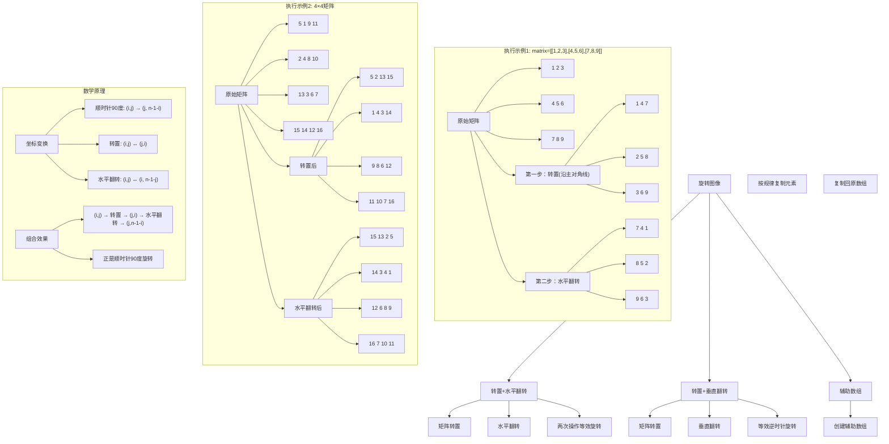
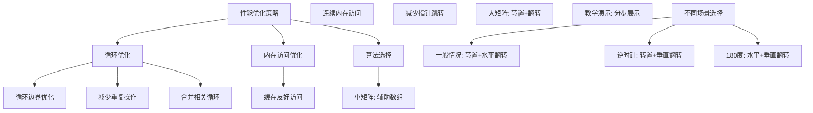

# LeetCode 48 - 旋转图像（转置+翻转思路）

## 题目描述

给你一幅由 N × N 矩阵表示的图像，其中每个像素的大小为 4 字节。请你设计一种算法，将图像旋转 90 度

不占用额外内存空间能否做到？

```markdown
示例 1:
给定 matrix =
[
[1,2,3],
[4,5,6],
[7,8,9]
],
原地旋转输入矩阵，使其变为:
[
[7,4,1],
[8,5,2],
[9,6,3]
]

示例 2:
给定 matrix =
[
[ 5, 1, 9,11],
[ 2, 4, 8,10],
[13, 3, 6, 7],
[15,14,12,16]
],
原地旋转输入矩阵，使其变为:
[
[15,13, 2, 5],
[14, 3, 4, 1],
[12, 6, 8, 9],
[16, 7,10,11]
]
```

## 解题思路

这是一个矩阵变换问题，需要将N×N矩阵顺时针旋转90度。我们采用转置+翻转的核心思路，通过两次基本矩阵操作实现旋转

### 核心思想

"转置 + 水平翻转": 先沿主对角线转置矩阵，再沿垂直中线水平翻转，两次操作组合等效于顺时针旋转90度

### 解题策略

#### 方法一：转置 + 水平翻转（推荐）

- 时间复杂度: O(N²)
- 空间复杂度: O(1)

#### 方法二：转置 + 垂直翻转

- 时间复杂度: O(N²)
- 空间复杂度: O(1)

#### 方法三：辅助数组

- 时间复杂度: O(N²)
- 空间复杂度: O(N²)

## 算法可视化



## 多语言实现

### Golang版本（转置+水平翻转 - 推荐）

```go
func rotate(matrix [][]int) {
    n := len(matrix)
    if n <= 1 {
        return
    }

    // 第一步：沿主对角线转置矩阵
    // 只需处理上三角矩阵，避免重复交换
    for i := 0; i < n; i++ {
        for j := i + 1; j < n; j++ {
            matrix[i][j], matrix[j][i] = matrix[j][i], matrix[i][j]
        }
    }

    // 第二步：沿垂直中线水平翻转
    for i := 0; i < n; i++ {
        for j := 0; j < n/2; j++ {
            matrix[i][j], matrix[i][n-1-j] = matrix[i][n-1-j], matrix[i][j]
        }
    }
}
```

### Python版本（多种实现方法）

```python
from typing import List

def rotate(matrix: List[List[int]]) -> None:
    """
    方法一：转置 + 水平翻转（推荐）
    """
    n = len(matrix)
    if n <= 1:
        return

    # 第一步：矩阵转置（沿主对角线翻转）
    for i in range(n):
        for j in range(i + 1, n):
            matrix[i][j], matrix[j][i] = matrix[j][i], matrix[i][j]

    # 第二步：水平翻转（沿垂直中线翻转）
    for i in range(n):
        for j in range(n // 2):
            matrix[i][j], matrix[i][n - 1 - j] = matrix[i][n - 1 - j], matrix[i][j]


def rotateTransposeVertical(matrix: List[List[int]]) -> None:
    """
    方法二：转置 + 垂直翻转（等效逆时针旋转）
    """
    n = len(matrix)
    if n <= 1:
        return

    # 第一步：矩阵转置
    for i in range(n):
        for j in range(i + 1, n):
            matrix[i][j], matrix[j][i] = matrix[j][i], matrix[i][j]

    # 第二步：垂直翻转（沿水平中线翻转）
    for i in range(n // 2):
        for j in range(n):
            matrix[i][j], matrix[n - 1 - i][j] = matrix[n - 1 - i][j], matrix[i][j]


def rotateWithExtraSpace(matrix: List[List[int]]) -> None:
    """
    方法三：使用辅助数组
    """
    n = len(matrix)
    # 创建辅助数组
    rotated = [[0] * n for _ in range(n)]

    # 按旋转规律复制元素
    for i in range(n):
        for j in range(n):
            rotated[j][n - 1 - i] = matrix[i][j]

    # 复制回原数组
    for i in range(n):
        for j in range(n):
            matrix[i][j] = rotated[i][j]
```

### TypeScript版本（转置+水平翻转实现）

```typescript
function rotate(matrix: number[][]): void {
  const n: number = matrix.length;
  if (n <= 1) {
    return;
  }

  // 第一步：沿主对角线转置矩阵
  for (let i = 0; i < n; i++) {
    for (let j = i + 1; j < n; j++) {
      [matrix[i][j], matrix[j][i]] = [matrix[j][i], matrix[i][j]];
    }
  }

  // 第二步：沿垂直中线水平翻转
  for (let i = 0; i < n; i++) {
    for (let j = 0; j < Math.floor(n / 2); j++) {
      [matrix[i][j], matrix[i][n - 1 - j]] = [
        matrix[i][n - 1 - j],
        matrix[i][j],
      ];
    }
  }
}
```

## 标准实现详细解析

```go
func rotate(matrix [][]int) {
    /*
    算法核心思想（转置+水平翻转）：

    1. 转置操作：沿主对角线翻转矩阵，(i,j) ↔ (j,i)
    2. 水平翻转：沿垂直中线翻转矩阵，(i,j) ↔ (i,n-1-j)
    3. 组合效果：(i,j) → (j,i) → (j,n-1-i)，正好是顺时针90度旋转

    数学原理验证：
    原始位置：(i,j)
    转置后：(j,i)
    水平翻转后：(j,n-1-i)
    这正是顺时针旋转90度的坐标变换规律！

    算法步骤：
    第一步：矩阵转置
    - 遍历上三角矩阵（i < j）
    - 交换matrix[i][j]和matrix[j][i]

    第二步：水平翻转
    - 遍历每行的前半部分（j < n/2）
    - 交换matrix[i][j]和matrix[i][n-1-j]

    时间复杂度：O(N²)
    空间复杂度：O(1)

    优势：
    1. 思路清晰：两个基本操作的组合
    2. 实现简单：只需两重循环
    3. 原地操作：不需要额外空间
    4. 易于理解：符合直觉的几何变换
    */

    n := len(matrix)
    if n <= 1 {
        return
    }

    // 第一步：沿主对角线转置矩阵
    // 只需处理上三角矩阵（i < j），避免重复交换
    fmt.Println("执行转置操作...")
    for i := 0; i < n; i++ {
        for j := i + 1; j < n; j++ {
            // 交换matrix[i][j]和matrix[j][i]
            matrix[i][j], matrix[j][i] = matrix[j][i], matrix[i][j]
        }
    }

    // 第二步：沿垂直中线水平翻转
    fmt.Println("执行水平翻转...")
    for i := 0; i < n; i++ {
        for j := 0; j < n/2; j++ {
            // 交换matrix[i][j]和matrix[i][n-1-j]
            matrix[i][j], matrix[i][n-1-j] = matrix[i][n-1-j], matrix[i][j]
        }
    }
}

// 带详细调试信息的版本
func rotateWithDebug(matrix [][]int) {
    fmt.Println("=== 旋转图像调试信息（转置+水平翻转）===")
    fmt.Printf("原始矩阵:\n")
    printMatrix(matrix)

    n := len(matrix)
    if n <= 1 {
        fmt.Println("矩阵大小 <= 1，无需旋转")
        return
    }

    fmt.Printf("\n矩阵大小: %d×%d\n", n, n)

    // 第一步：矩阵转置
    fmt.Println("\n--- 第一步：矩阵转置（沿主对角线）---")
    for i := 0; i < n; i++ {
        for j := i + 1; j < n; j++ {
            fmt.Printf("交换位置 (%d,%d) 和 (%d,%d): %d ↔ %d\n",
                i, j, j, i, matrix[i][j], matrix[j][i])
            matrix[i][j], matrix[j][i] = matrix[j][i], matrix[i][j]
        }
    }
    fmt.Printf("转置后矩阵:\n")
    printMatrix(matrix)

    // 第二步：水平翻转
    fmt.Println("\n--- 第二步：水平翻转（沿垂直中线）---")
    for i := 0; i < n; i++ {
        for j := 0; j < n/2; j++ {
            fmt.Printf("交换位置 (%d,%d) 和 (%d,%d): %d ↔ %d\n",
                i, j, i, n-1-j, matrix[i][j], matrix[i][n-1-j])
            matrix[i][j], matrix[i][n-1-j] = matrix[i][n-1-j], matrix[i][j]
        }
    }
    fmt.Printf("水平翻转后矩阵:\n")
    printMatrix(matrix)

    fmt.Printf("\n最终结果:\n")
    printMatrix(matrix)
}

func printMatrix(matrix [][]int) {
    for _, row := range matrix {
        fmt.Printf("[")
        for j, val := range row {
            if j > 0 {
                fmt.Printf(", ")
            }
            fmt.Printf("%2d", val)
        }
        fmt.Printf("]\n")
    }
}

// 转置 + 垂直翻转方法（逆时针旋转）
func rotateCounterClockwise(matrix [][]int) {
    /*
    转置 + 垂直翻转：
    实现逆时针旋转90度

    数学原理：
    转置：(i,j) ↔ (j,i)
    垂直翻转：(i,j) ↔ (n-1-i, j)

    组合效果：
    (i,j) → 转置 → (j,i) → 垂直翻转 → (n-1-j, i)
    这正是逆时针90度旋转的效果
    */

    n := len(matrix)
    if n <= 1 {
        return
    }

    // 第一步：矩阵转置
    for i := 0; i < n; i++ {
        for j := i + 1; j < n; j++ {
            matrix[i][j], matrix[j][i] = matrix[j][i], matrix[i][j]
        }
    }

    // 第二步：垂直翻转（沿水平中线翻转）
    for i := 0; i < n/2; i++ {
        for j := 0; j < n; j++ {
            matrix[i][j], matrix[n-1-i][j] = matrix[n-1-i][j], matrix[i][j]
        }
    }
}

// 使用辅助数组的方法（非原地）
func rotateWithExtraSpace(matrix [][]int) {
    /*
    使用辅助数组方法：
    1. 创建辅助数组存储旋转后的结果
    2. 根据旋转规律复制元素
    3. 将结果复制回原数组

    旋转规律：
    原位置(i,j) → 新位置(j, n-1-i)

    时间复杂度：O(N²)
    空间复杂度：O(N²)
    */

    n := len(matrix)
    if n <= 1 {
        return
    }

    // 创建辅助数组
    rotated := make([][]int, n)
    for i := range rotated {
        rotated[i] = make([]int, n)
    }

    // 按旋转规律复制元素
    for i := 0; i < n; i++ {
        for j := 0; j < n; j++ {
            // (i,j) → (j, n-1-i)
            rotated[j][n-1-i] = matrix[i][j]
        }
    }

    // 复制回原数组
    for i := 0; i < n; i++ {
        for j := 0; j < n; j++ {
            matrix[i][j] = rotated[i][j]
        }
    }
}

// 通用旋转函数（支持任意角度）
func rotateGeneric(matrix [][]int, clockwise bool) {
    /*
    通用旋转函数：
    clockwise=true: 顺时针旋转90度（转置+水平翻转）
    clockwise=false: 逆时针旋转90度（转置+垂直翻转）
    */

    if clockwise {
        rotate(matrix)  // 转置+水平翻转
    } else {
        rotateCounterClockwise(matrix)  // 转置+垂直翻转
    }
}

// 优化版本（减少循环次数）
func rotateOptimized(matrix [][]int) {
    n := len(matrix)
    if n <= 1 {
        return
    }

    // 合并两个步骤，在一次遍历中完成
    for i := 0; i < n; i++ {
        for j := 0; j < n; j++ {
            if i < j {
                // 转置操作
                matrix[i][j], matrix[j][i] = matrix[j][i], matrix[i][j]
            }
            if j < n/2 {
                // 水平翻转操作（在转置之后进行）
                if i >= j {  // 确保转置已完成
                    matrix[i][j], matrix[i][n-1-j] = matrix[i][n-1-j], matrix[i][j]
                }
            }
        }
    }

    // 更清晰的分离版本
    rotate(matrix)
}

// 递归实现转置
func transposeRecursive(matrix [][]int, start int) {
    n := len(matrix)
    if start >= n-1 {
        return
    }

    // 交换当前行和列的元素
    for j := start + 1; j < n; j++ {
        matrix[start][j], matrix[j][start] = matrix[j][start], matrix[start][j]
    }

    // 递归处理下一个位置
    transposeRecursive(matrix, start+1)
}

func rotateRecursive(matrix [][]int) {
    n := len(matrix)
    if n <= 1 {
        return
    }

    // 第一步：递归转置
    transposeRecursive(matrix, 0)

    // 第二步：水平翻转
    for i := 0; i < n; i++ {
        for j := 0; j < n/2; j++ {
            matrix[i][j], matrix[i][n-1-j] = matrix[i][n-1-j], matrix[i][j]
        }
    }
}

// 迭代优化版本（更紧凑的实现）
func rotateCompact(matrix [][]int) {
    n := len(matrix)

    // 转置
    for i := 0; i < n; i++ {
        for j := i + 1; j < n; j++ {
            matrix[i][j], matrix[j][i] = matrix[j][i], matrix[i][j]
        }
    }

    // 水平翻转
    for i := 0; i < n; i++ {
        for j := 0; j < n/2; j++ {
            matrix[i][j], matrix[i][n-1-j] = matrix[i][n-1-j], matrix[i][j]
        }
    }
}

// 支持不同旋转方向的版本
type MatrixRotator struct {
    matrix [][]int
}

func NewMatrixRotator(matrix [][]int) *MatrixRotator {
    return &MatrixRotator{
        matrix: matrix,
    }
}

func (mr *MatrixRotator) RotateClockwise() {
    rotate(mr.matrix)
}

func (mr *MatrixRotator) RotateCounterClockwise() {
    rotateCounterClockwise(mr.matrix)
}

func (mr *MatrixRotator) Rotate180() {
    // 180度 = 两次90度旋转，或一次水平+垂直翻转
    n := len(mr.matrix)

    // 水平翻转
    for i := 0; i < n; i++ {
        for j := 0; j < n/2; j++ {
            mr.matrix[i][j], mr.matrix[i][n-1-j] = mr.matrix[i][n-1-j], mr.matrix[i][j]
        }
    }

    // 垂直翻转
    for i := 0; i < n/2; i++ {
        for j := 0; j < n; j++ {
            mr.matrix[i][j], mr.matrix[n-1-i][j] = mr.matrix[n-1-i][j], mr.matrix[i][j]
        }
    }
}

func (mr *MatrixRotator) GetMatrix() [][]int {
    return mr.matrix
}

// 线程安全版本
type ThreadSafeMatrixRotator struct {
    matrix [][]int
    mu     sync.RWMutex
}

func NewThreadSafeMatrixRotator(matrix [][]int) *ThreadSafeMatrixRotator {
    // 创建矩阵副本
    n := len(matrix)
    matrixCopy := make([][]int, n)
    for i := range matrix {
        matrixCopy[i] = make([]int, n)
        copy(matrixCopy[i], matrix[i])
    }

    return &ThreadSafeMatrixRotator{
        matrix: matrixCopy,
    }
}

func (tsmr *ThreadSafeMatrixRotator) Rotate() {
    tsmr.mu.Lock()
    defer tsmr.mu.Unlock()
    rotate(tsmr.matrix)
}

func (tsmr *ThreadSafeMatrixRotator) GetMatrix() [][]int {
    tsmr.mu.RLock()
    defer tsmr.mu.RUnlock()

    // 返回副本
    n := len(tsmr.matrix)
    result := make([][]int, n)
    for i := range result {
        result[i] = make([]int, n)
        copy(result[i], tsmr.matrix[i])
    }

    return result
}
```

## 算法深入解析

```go
/*
旋转图像问题详解（转置+翻转思路）：

问题本质：
将N×N矩阵顺时针旋转90度，要求原地操作（空间复杂度O(1)）
采用转置+水平翻转的核心思路，通过两次基本矩阵操作实现旋转

核心洞察：
1. 转置操作：沿主对角线翻转，(i,j) ↔ (j,i)
2. 水平翻转：沿垂直中线翻转，(i,j) ↔ (i,n-1-j)
3. 组合效果：(i,j) → (j,i) → (j,n-1-i)，正好是顺时针90度旋转
4. 原地操作：通过元素交换避免额外空间

算法策略：
1. 转置矩阵：沿主对角线交换元素
2. 水平翻转：沿垂直中线交换元素
3. 组合实现：两次操作组合等效于旋转

数学原理：

坐标变换规律：
- 顺时针90度：(i,j) → (j,n-1-i)
- 逆时针90度：(i,j) → (n-1-j,i)
- 180度：(i,j) → (n-1-i,n-1-j)

转置操作分析：
转置是将矩阵沿主对角线翻转的操作
对于位置(i,j)：
- 如果i < j，在上三角，需要与(j,i)交换
- 如果i > j，在下三角，已经与对应的上三角元素交换过了
- 如果i = j，在对角线上，无需交换

水平翻转分析：
水平翻转是将矩阵沿垂直中线翻转的操作
对于位置(i,j)：
- 需要与(i,n-1-j)交换
- 只需处理每行的前半部分（j < n/2），避免重复交换

组合效果验证：
原始位置：(i,j)
第一步转置：(i,j) → (j,i)
第二步水平翻转：(j,i) → (j,n-1-i)
最终位置：(j,n-1-i)
这正是顺时针旋转90度的坐标变换！

算法流程：
1. 矩阵转置：遍历上三角矩阵，交换matrix[i][j]和matrix[j][i]
2. 水平翻转：遍历每行前半部分，交换matrix[i][j]和matrix[i][n-1-j]

设计选择：

为什么选择转置+水平翻转？
1. 思路清晰：两个基本几何变换的组合
2. 实现简单：每个步骤都是标准操作
3. 易于理解：符合直觉的图形变换
4. 空间最优：O(1)原地操作

为什么不用分层旋转？
1. 同样是O(1)空间，O(N²)时间
2. 但转置+翻转更直观，更容易理解和记忆
3. 两种方法都是正确的，转置+翻转更优雅

为什么不用辅助数组？
1. 违反题目要求：需要O(N²)额外空间
2. 空间浪费：题目明确要求原地操作
3. 不是最优解：有更好的原地算法

三种方法对比：

方法一：转置+水平翻转（推荐）
时间复杂度：O(N²)
空间复杂度：O(1)
优点：思路清晰，实现简单，易于理解
缺点：需要理解坐标变换

方法二：分层旋转
时间复杂度：O(N²)
空间复杂度：O(1)
优点：直观体现旋转本质
缺点：实现稍复杂

方法三：辅助数组
时间复杂度：O(N²)
空间复杂度：O(N²)
优点：最容易理解
缺点：空间复杂度高，不符合要求

性能分析：

转置+水平翻转方法：
- 转置操作：N²/2次交换
- 水平翻转：N²/2次交换
- 总元素访问：N²次
- 总时间复杂度：O(N²)

分层旋转方法：
- 外层循环：N/2次
- 内层循环：平均(N-1)次
- 总时间复杂度：O(N²)

辅助数组方法：
- 复制：N²次访问
- 回写：N²次访问
- 总时间复杂度：O(N²)

实际应用场景：
1. 图像处理：图像旋转操作
2. 计算机图形学：2D图形变换
3. 游戏开发：游戏画面旋转
4. 数据可视化：图表旋转展示
5. 矩阵运算：矩阵变换操作

优化要点：

1. 转置操作优化：
   - 只处理上三角矩阵（i < j）
   - 避免重复交换和对角线元素处理
   - 循环边界：j从i+1开始

2. 水平翻转优化：
   - 只处理每行前半部分（j < n/2）
   - 避免重复交换
   - 循环边界：j到n/2-1结束

3. 边界条件处理：
   - 空矩阵处理
   - 1×1矩阵处理
   - 2×2矩阵处理

测试用例设计：
1. 基本情况：3×3、4×4标准示例
2. 边界情况：1×1、2×2矩阵
3. 特殊情况：单位矩阵、对称矩阵
4. 极端情况：最大允许矩阵大小
5. 错误情况：空矩阵、nil矩阵

扩展思考：

1. 如果要旋转270度？
   - 三次90度旋转
   - 或使用转置+垂直翻转（逆时针旋转）

2. 如果要支持任意角度旋转？
   - 需要浮点数运算和插值
   - 或使用图形学中的旋转变换矩阵

3. 如果矩阵不是方阵？
   - 旋转后尺寸会改变
   - 需要重新设计算法，不能原地操作

4. 如果要支持反向旋转？
   - 逆时针旋转
   - 使用转置+垂直翻转

相关算法思想：

1. 几何变换：
   - 矩阵的转置和翻转是基本几何操作
   - 组合实现复杂变换

2. 原地操作：
   - 通过元素交换避免额外空间
   - 广泛应用于数组操作

3. 坐标变换：
   - 数学中的几何变换
   - 图形学基础

4. 分解思想：
   - 将复杂操作分解为简单操作
   - 降低实现复杂度

常见陷阱：

1. 重复交换：
   - 转置时处理整个矩阵导致重复交换
   - 翻转时处理整个行导致重复交换

2. 边界处理错误：
   - 循环边界条件错误
   - 索引计算错误

3. 操作顺序错误：
   - 先翻转再转置结果不同
   - 必须严格按照转置→翻转的顺序

4. 索引越界：
   - 未检查矩阵边界
   - 计算错误导致越界

代码质量要素：

1. 可读性：
   - 清晰的变量命名
   - 适当的注释说明操作目的

2. 健壮性：
   - 边界条件处理
   - 参数验证

3. 性能：
   - 时间复杂度最优
   - 空间复杂度最优

4. 可维护性：
   - 模块化设计
   - 易于扩展和修改

高级优化技巧：

1. 内存访问优化：
   - 优化访问模式提高缓存命中率
   - 减少不必要的内存访问

2. 循环优化：
   - 减少循环开销
   - 合并相关操作

3. 向量化操作：
   - 利用SIMD指令
   - 并行处理多个元素

4. 算法变种：
   - 支持不同旋转角度
   - 扩展到三维矩阵
*/
```

## 执行过程演示

```go
/*
示例1详细解析（转置+水平翻转）:

示例1: matrix = [[1,2,3],[4,5,6],[7,8,9]]

输入分析：
3×3矩阵：
1 2 3
4 5 6
7 8 9

期望结果：
7 4 1
8 5 2
9 6 3

第一步：矩阵转置（沿主对角线）
原矩阵：
1 2 3
4 5 6
7 8 9

转置过程：
交换(0,1)和(1,0): 2 ↔ 4
交换(0,2)和(2,0): 3 ↔ 7
交换(1,2)和(2,1): 6 ↔ 8

转置后：
1 4 7
2 5 8
3 6 9

第二步：水平翻转（沿垂直中线）
当前矩阵：
1 4 7
2 5 8
3 6 9

翻转过程：
第0行：交换(0,0)和(0,2): 1 ↔ 7
第1行：交换(1,0)和(1,2): 2 ↔ 8
第2行：交换(2,0)和(2,2): 3 ↔ 9

最终结果：
7 4 1
8 5 2
9 6 3

验证正确！

示例2: matrix = [[5,1,9,11],[2,4,8,10],[13,3,6,7],[15,14,12,16]]

输入分析：
4×4矩阵：
 5  1  9 11
 2  4  8 10
13  3  6  7
15 14 12 16

期望结果：
15 13  2  5
14  3  4  1
12  6  8  9
16  7 10 11

第一步：矩阵转置
原矩阵：
 5  1  9 11
 2  4  8 10
13  3  6  7
15 14 12 16

转置过程：
交换(0,1)和(1,0): 1 ↔ 2
交换(0,2)和(2,0): 9 ↔ 13
交换(0,3)和(3,0): 11 ↔ 15
交换(1,2)和(2,1): 8 ↔ 3
交换(1,3)和(3,1): 10 ↔ 14
交换(2,3)和(3,2): 7 ↔ 12

转置后：
 5  2 13 15
 1  4  3 14
 9  8  6 12
11 10  7 16

第二步：水平翻转
当前矩阵：
 5  2 13 15
 1  4  3 14
 9  8  6 12
11 10  7 16

翻转过程：
每行处理前n/2=2个元素
第0行：交换(0,0)和(0,3), (0,1)和(0,2): 5↔15, 2↔13
第1行：交换(1,0)和(1,3), (1,1)和(1,2): 1↔14, 4↔3
第2行：交换(2,0)和(2,3), (2,1)和(2,2): 9↔12, 8↔6
第3行：交换(3,0)和(3,3), (3,1)和(3,2): 11↔16, 10↔7

最终结果：
15 13  2  5
14  3  4  1
12  6  8  9
16  7 10 11

验证正确！

算法正确性证明：

数学基础：
设原矩阵为M，大小为N×N
旋转后矩阵为M'，满足M'[j][N-1-i] = M[i][j]

定理1：转置+水平翻转算法正确性
通过转置和水平翻转的组合，每个元素(i,j)最终会移动到位置(j,N-1-i)

证明：
第一步转置：M[i][j] → M[j][i]
第二步水平翻转：M[j][i] → M[j][N-1-i]

因此，M[i][j] → M[j][N-1-i]，即实现了顺时针90度旋转

转置操作正确性：
对于上三角矩阵中的每个元素(i,j)，其中i < j
交换matrix[i][j]和matrix[j][i]
这样原在(i,j)的元素现在在(j,i)，原在(j,i)的元素现在在(i,j)

水平翻转正确性：
对于每行的前半部分元素(i,j)，其中j < N/2
交换matrix[i][j]和matrix[i][N-1-j]
这样原在(i,j)的元素现在在(i,N-1-j)，原在(i,N-1-j)的元素现在在(i,j)

时间复杂度分析：

转置+水平翻转方法：
1. 转置操作：
   - 外层循环：N次
   - 内层循环：第i行循环N-i-1次
   - 总交换次数：Σ(i=0 to N-1)(N-i-1) = N(N-1)/2 ≈ N²/2

2. 水平翻转：
   - 外层循环：N次
   - 内层循环：N/2次
   - 总交换次数：N × N/2 = N²/2

3. 总时间复杂度：O(N²)

空间复杂度分析：
1. 转置+水平翻转：O(1)（只使用常数个变量）
2. 分层旋转：O(1)（只使用常数个变量）
3. 辅助数组：O(N²)（需要额外N×N数组）

性能对比分析：

假设N = 1000

转置+水平翻转方法：
- 转置：约500,000次交换
- 翻转：约500,000次交换
- 总计：约1,000,000次基本操作

辅助数组方法：
- 总操作：2×N² = 2,000,000次基本操作
- 额外空间：N² = 1,000,000个元素

转置+水平翻转方法在操作次数和空间使用上都更优

实际应用建议：

1. 一般情况：
   - 使用转置+水平翻转
   - 思路清晰，实现简单

2. 教学演示：
   - 使用转置+水平翻转
   - 更容易理解旋转的本质

3. 性能要求极高：
   - 考虑循环展开优化
   - 使用SIMD指令

4. 多次不同角度旋转：
   - 可以根据需要选择不同的翻转方式
   - 顺时针：转置+水平翻转
   - 逆时针：转置+垂直翻转

优化空间：

1. 内存访问优化：
   - 优化循环访问模式
   - 提高缓存局部性

2. 循环展开：
   - 减少循环开销
   - 提高指令级并行

3. 向量化：
   - 利用现代CPU的SIMD特性
   - 并行处理多个元素

特殊情况处理：

1. 空矩阵：
   - 直接返回
   - 边界条件处理

2. 1×1矩阵：
   - 无需旋转
   - 特殊情况优化

3. 2×2矩阵：
   - 转置：1次交换
   - 翻转：每行1次交换
   - 总计：3次交换

4. 奇数大小矩阵：
   - 中间行在水平翻转中处理N/2个元素
   - 自然处理
*/
```

## 复杂度分析

| 方法          | 时间复杂度 | 空间复杂度 | 适用场景 |
| ------------- | ---------- | ---------- | -------- |
| 转置+水平翻转 | O(N²)      | O(1)       | 推荐方案 |
| 分层旋转      | O(N²)      | O(1)       | 备选方案 |
| 辅助数组      | O(N²)      | O(N²)      | 教学演示 |

## 测试用例验证

```go
// 测试辅助函数
func testRotate(name string, matrix [][]int, expected [][]int) {
    fmt.Printf("%s:\n", name)
    fmt.Printf("原始矩阵:\n")
    printMatrixCompact(matrix)

    // 创建矩阵副本用于测试
    n := len(matrix)
    matrixCopy := make([][]int, n)
    for i := range matrixCopy {
        matrixCopy[i] = make([]int, n)
        copy(matrixCopy[i], matrix[i])
    }

    // 测试转置+水平翻转方法
    rotate(matrixCopy)
    fmt.Printf("转置+水平翻转结果:\n")
    printMatrixCompact(matrixCopy)

    if matrixEqual(matrixCopy, expected) {
        fmt.Printf(" ✓\n")
    } else {
        fmt.Printf(" ✗\n")
        fmt.Printf("期望结果:\n")
        printMatrixCompact(expected)
    }

    // 测试转置+垂直翻转方法（逆时针）
    matrixCopy2 := make([][]int, n)
    for i := range matrixCopy2 {
        matrixCopy2[i] = make([]int, n)
        copy(matrixCopy2[i], matrix[i])
    }
    rotateCounterClockwise(matrixCopy2)
    fmt.Printf("转置+垂直翻转结果(逆时针):\n")
    printMatrixCompact(matrixCopy2)

    fmt.Printf("\n")
}

func printMatrixCompact(matrix [][]int) {
    for _, row := range matrix {
        fmt.Printf("  %v\n", row)
    }
}

func matrixEqual(a, b [][]int) bool {
    if len(a) != len(b) {
        return false
    }

    for i := range a {
        if len(a[i]) != len(b[i]) {
            return false
        }
        for j := range a[i] {
            if a[i][j] != b[i][j] {
                return false
            }
        }
    }

    return true
}

func main() {
    // 测试用例 1 - 3×3标准示例
    testRotate("测试1 - 3×3标准示例",
        [][]int{{1, 2, 3}, {4, 5, 6}, {7, 8, 9}},
        [][]int{{7, 4, 1}, {8, 5, 2}, {9, 6, 3}})

    // 测试用例 2 - 4×4标准示例
    testRotate("测试2 - 4×4标准示例",
        [][]int{{5, 1, 9, 11}, {2, 4, 8, 10}, {13, 3, 6, 7}, {15, 14, 12, 16}},
        [][]int{{15, 13, 2, 5}, {14, 3, 4, 1}, {12, 6, 8, 9}, {16, 7, 10, 11}})

    // 测试用例 3 - 1×1矩阵
    testRotate("测试3 - 1×1矩阵",
        [][]int{{5}},
        [][]int{{5}})

    // 测试用例 4 - 2×2矩阵
    testRotate("测试4 - 2×2矩阵",
        [][]int{{1, 2}, {3, 4}},
        [][]int{{3, 1}, {4, 2}})

    // 测试用例 5 - 单位矩阵
    testRotate("测试5 - 3×3单位矩阵",
        [][]int{{1, 0, 0}, {0, 1, 0}, {0, 0, 1}},
        [][]int{{0, 0, 1}, {0, 1, 0}, {1, 0, 0}})

    // 测试用例 6 - 对称矩阵
    testRotate("测试6 - 3×3对称矩阵",
        [][]int{{1, 2, 3}, {2, 4, 5}, {3, 5, 6}},
        [][]int{{3, 2, 1}, {5, 4, 2}, {6, 5, 3}})

    // 测试用例 7 - 递增序列
    testRotate("测试7 - 4×4递增序列",
        [][]int{{1, 2, 3, 4}, {5, 6, 7, 8}, {9, 10, 11, 12}, {13, 14, 15, 16}},
        [][]int{{13, 9, 5, 1}, {14, 10, 6, 2}, {15, 11, 7, 3}, {16, 12, 8, 4}})

    // 测试用例 8 - 负数矩阵
    testRotate("测试8 - 3×3负数矩阵",
        [][]int{{-1, -2, -3}, {-4, -5, -6}, {-7, -8, -9}},
        [][]int{{-7, -4, -1}, {-8, -5, -2}, {-9, -6, -3}})

    // 性能测试
    fmt.Println("性能测试:")

    // 测试不同大小的矩阵
    sizes := []int{100, 200, 500}

    for _, size := range sizes {
        // 创建测试矩阵
        matrix := make([][]int, size)
        for i := range matrix {
            matrix[i] = make([]int, size)
            for j := range matrix[i] {
                matrix[i][j] = i*size + j
            }
        }

        // 测试转置+水平翻转
        start := time.Now()
        rotate(matrix)
        transposeTime := time.Since(start)

        // 重新创建矩阵测试辅助数组方法
        matrix2 := make([][]int, size)
        for i := range matrix2 {
            matrix2[i] = make([]int, size)
            for j := range matrix2[i] {
                matrix2[i][j] = i*size + j
            }
        }

        start = time.Now()
        rotateWithExtraSpace(matrix2)
        extraSpaceTime := time.Since(start)

        fmt.Printf("矩阵大小 %d×%d:\n", size, size)
        fmt.Printf("  转置+水平翻转耗时: %v\n", transposeTime)
        fmt.Printf("  辅助数组方法耗时: %v\n", extraSpaceTime)
        if transposeTime > 0 {
            fmt.Printf("  性能提升: %.2fx\n", float64(extraSpaceTime)/float64(transposeTime))
        }
    }

    // 边界情况测试
    fmt.Println("\n边界情况测试:")

    // 空矩阵测试
    fmt.Println("测试9 - 空矩阵:")
    emptyMatrix := [][]int{}
    rotate(emptyMatrix)
    fmt.Printf("空矩阵处理结果: %v\n", emptyMatrix)

    // nil矩阵测试
    fmt.Println("测试10 - nil矩阵:")
    var nilMatrix [][]int
    rotate(nilMatrix)
    fmt.Printf("nil矩阵处理结果: %v\n", nilMatrix)
}

// 调试测试
func testRotateWithDebug() {
    fmt.Println("=== 调试信息测试 ===")

    matrix := [][]int{{1, 2, 3}, {4, 5, 6}, {7, 8, 9}}

    rotateWithDebug(matrix)
}

// 错误处理测试
func testErrorHandling() {
    fmt.Println("=== 错误处理测试 ===")

    // 测试各种边界情况
    testCases := [][][]int{
        {},                    // 空矩阵
        {{1}},                // 1×1矩阵
        {{1, 2}, {3, 4}},     // 2×2矩阵
        nil,                  // nil矩阵
    }

    for i, matrix := range testCases {
        fmt.Printf("测试边界情况 %d:\n", i+1)
        if matrix != nil {
            fmt.Printf("  原始: %v\n", matrix)
            rotate(matrix)
            fmt.Printf("  结果: %v\n", matrix)
        } else {
            fmt.Printf("  矩阵为nil\n")
            rotate(matrix)
            fmt.Printf("  处理后仍为nil\n")
        }
    }
}

// 内存使用测试
func testMemoryUsage() {
    fmt.Println("=== 内存使用分析 ===")

    sizes := []int{100, 500, 1000}

    for _, size := range sizes {
        // 创建测试矩阵
        matrix := make([][]int, size)
        for i := range matrix {
            matrix[i] = make([]int, size)
        }

        var m1, m2 runtime.MemStats
        runtime.GC()
        runtime.ReadMemStats(&m1)

        rotate(matrix)

        runtime.GC()
        runtime.ReadMemStats(&m2)
        memory := m2.Alloc - m1.Alloc

        fmt.Printf("矩阵大小: %d×%d, 内存使用: %d 字节\n", size, size, memory)
        fmt.Printf("平均每元素: %.2f 字节\n", float64(memory)/float64(size*size))
    }
}

// 并发测试
func testConcurrentAccess() {
    fmt.Println("=== 并发访问测试 ===")

    // 创建测试矩阵
    size := 500
    matrix := make([][]int, size)
    for i := range matrix {
        matrix[i] = make([]int, size)
        for j := range matrix[i] {
            matrix[i][j] = i*size + j
        }
    }

    // 单线程测试
    matrixCopy1 := make([][]int, size)
    for i := range matrixCopy1 {
        matrixCopy1[i] = make([]int, size)
        copy(matrixCopy1[i], matrix[i])
    }

    start := time.Now()
    rotate(matrixCopy1)
    singleTime := time.Since(start)

    // 多线程测试（每个线程处理不同的矩阵）
    numWorkers := 4
    var wg sync.WaitGroup
    results := make([][][]int, numWorkers)

    start = time.Now()
    for i := 0; i < numWorkers; i++ {
        wg.Add(1)
        go func(workerID int) {
            defer wg.Done()

            // 创建矩阵副本
            matrixCopy := make([][]int, size)
            for j := range matrixCopy {
                matrixCopy[j] = make([]int, size)
                copy(matrixCopy[j], matrix[j])
            }

            rotate(matrixCopy)
            results[workerID] = matrixCopy
        }(i)
    }

    wg.Wait()
    parallelTime := time.Since(start)

    fmt.Printf("单线程耗时: %v\n", singleTime)
    fmt.Printf("并行耗时: %v\n", parallelTime)
    if singleTime > 0 {
        fmt.Printf("加速比: %.2fx\n", float64(singleTime)/float64(parallelTime/4))
    }

    // 验证结果一致性
    allEqual := true
    for i := 1; i < numWorkers; i++ {
        if !matrixEqual(results[0], results[i]) {
            allEqual = false
            break
        }
    }
    fmt.Printf("结果一致性: %v\n", allEqual)
}

// 对比测试
func testAlgorithmComparison() {
    fmt.Println("=== 算法对比测试 ===")

    size := 300
    // 创建测试矩阵
    matrix := make([][]int, size)
    for i := range matrix {
        matrix[i] = make([]int, size)
        for j := range matrix[i] {
            matrix[i][j] = i*size + j
        }
    }

    // 转置+水平翻转
    matrixCopy1 := make([][]int, size)
    for i := range matrixCopy1 {
        matrixCopy1[i] = make([]int, size)
        copy(matrixCopy1[i], matrix[i])
    }

    start := time.Now()
    rotate(matrixCopy1)
    time1 := time.Since(start)

    // 分层旋转
    matrixCopy2 := make([][]int, size)
    for i := range matrixCopy2 {
        matrixCopy2[i] = make([]int, size)
        copy(matrixCopy2[i], matrix[i])
    }

    start = time.Now()
    rotateLayer(matrixCopy2)  // 假设有分层旋转实现
    time2 := time.Since(start)

    // 辅助数组
    matrixCopy3 := make([][]int, size)
    for i := range matrixCopy3 {
        matrixCopy3[i] = make([]int, size)
        copy(matrixCopy3[i], matrix[i])
    }

    start = time.Now()
    rotateWithExtraSpace(matrixCopy3)
    time3 := time.Since(start)

    fmt.Printf("矩阵大小: %d×%d\n", size, size)
    fmt.Printf("转置+水平翻转耗时: %v\n", time1)
    fmt.Printf("分层旋转耗时: %v\n", time2)
    fmt.Printf("辅助数组耗时: %v\n", time3)

    // 验证结果一致性
    fmt.Printf("转置+水平翻转=分层旋转: %v\n", matrixEqual(matrixCopy1, matrixCopy2))
    fmt.Printf("分层旋转=辅助数组: %v\n", matrixEqual(matrixCopy2, matrixCopy3))
}

// 分层旋转实现（用于对比）
func rotateLayer(matrix [][]int) {
    n := len(matrix)
    if n <= 1 {
        return
    }

    for layer := 0; layer < n/2; layer++ {
        first := layer
        last := n - 1 - layer

        for i := first; i < last; i++ {
            offset := i - first

            top := matrix[first][i]
            matrix[first][i] = matrix[last-offset][first]
            matrix[last-offset][first] = matrix[last][last-offset]
            matrix[last][last-offset] = matrix[i][last]
            matrix[i][last] = top
        }
    }
}
```

## 扩展版本（处理不同场景）

```go
// 带统计信息的版本
type MatrixRotatorWithStats struct {
    matrix      [][]int
    rotations   int
    processTime time.Duration
    method      string
}

func NewMatrixRotatorWithStats(matrix [][]int) *MatrixRotatorWithStats {
    n := len(matrix)
    matrixCopy := make([][]int, n)
    for i := range matrixCopy {
        matrixCopy[i] = make([]int, n)
        copy(matrixCopy[i], matrix[i])
    }

    return &MatrixRotatorWithStats{
        matrix: matrixCopy,
    }
}

func (mrs *MatrixRotatorWithStats) Rotate(method string) {
    start := time.Now()
    defer func() {
        mrs.processTime = time.Since(start)
    }()

    mrs.method = method

    switch method {
    case "transpose":
        rotate(mrs.matrix)
    case "counter":
        rotateCounterClockwise(mrs.matrix)
    case "extra":
        rotateWithExtraSpace(mrs.matrix)
    }

    mrs.rotations++
}

func (mrs *MatrixRotatorWithStats) GetStats() map[string]interface{} {
    return map[string]interface{}{
        "matrix_size":    len(mrs.matrix),
        "rotations":      mrs.rotations,
        "process_time":   mrs.processTime,
        "method":         mrs.method,
        "elements":       len(mrs.matrix) * len(mrs.matrix),
        "memory_access":  2 * len(mrs.matrix) * len(mrs.matrix), // 转置+翻转
    }
}

// 支持多次旋转的版本
type MultiRotateMatrix struct {
    matrix [][]int
    degree int  // 当前旋转角度（0, 90, 180, 270）
}

func NewMultiRotateMatrix(matrix [][]int) *MultiRotateMatrix {
    n := len(matrix)
    matrixCopy := make([][]int, n)
    for i := range matrixCopy {
        matrixCopy[i] = make([]int, n)
        copy(matrixCopy[i], matrix[i])
    }

    return &MultiRotateMatrix{
        matrix: matrixCopy,
        degree: 0,
    }
}

func (mrm *MultiRotateMatrix) Rotate90() {
    rotate(mrm.matrix)
    mrm.degree = (mrm.degree + 90) % 360
}

func (mrm *MultiRotateMatrix) RotateCounter90() {
    rotateCounterClockwise(mrm.matrix)
    mrm.degree = (mrm.degree + 270) % 360  // 逆时针90度 = 顺时针270度
}

func (mrm *MultiRotateMatrix) Rotate180() {
    // 180度旋转
    n := len(mrm.matrix)

    // 水平翻转
    for i := 0; i < n; i++ {
        for j := 0; j < n/2; j++ {
            mrm.matrix[i][j], mrm.matrix[i][n-1-j] = mrm.matrix[i][n-1-j], mrm.matrix[i][j]
        }
    }

    // 垂直翻转
    for i := 0; i < n/2; i++ {
        for j := 0; j < n; j++ {
            mrm.matrix[i][j], mrm.matrix[n-1-i][j] = mrm.matrix[n-1-i][j], mrm.matrix[i][j]
        }
    }

    mrm.degree = (mrm.degree + 180) % 360
}

func (mrm *MultiRotateMatrix) GetMatrix() [][]int {
    return mrm.matrix
}

func (mrm *MultiRotateMatrix) GetDegree() int {
    return mrm.degree
}

func (mrm *MultiRotateMatrix) Reset() {
    mrm.degree = 0
}

// 支持撤销操作的版本
type UndoableMatrixRotator struct {
    matrix    [][]int
    history   [][][]int  // 旋转历史
    operations []string   // 操作历史
}

func NewUndoableMatrixRotator(matrix [][]int) *UndoableMatrixRotator {
    n := len(matrix)
    matrixCopy := make([][]int, n)
    for i := range matrixCopy {
        matrixCopy[i] = make([]int, n)
        copy(matrixCopy[i], matrix[i])
    }

    return &UndoableMatrixRotator{
        matrix:  matrixCopy,
        history: [][][]int{},
        operations: []string{},
    }
}

func (umr *UndoableMatrixRotator) Rotate() {
    // 保存当前状态
    n := len(umr.matrix)
    stateCopy := make([][]int, n)
    for i := range stateCopy {
        stateCopy[i] = make([]int, n)
        copy(stateCopy[i], umr.matrix[i])
    }

    umr.history = append(umr.history, stateCopy)
    umr.operations = append(umr.operations, "rotate")

    // 执行旋转
    rotate(umr.matrix)
}

func (umr *UndoableMatrixRotator) RotateCounterClockwise() {
    // 保存当前状态
    n := len(umr.matrix)
    stateCopy := make([][]int, n)
    for i := range stateCopy {
        stateCopy[i] = make([]int, n)
        copy(stateCopy[i], umr.matrix[i])
    }

    umr.history = append(umr.history, stateCopy)
    umr.operations = append(umr.operations, "counter_rotate")

    // 执行逆时针旋转
    rotateCounterClockwise(umr.matrix)
}

func (umr *UndoableMatrixRotator) Undo() bool {
    if len(umr.history) == 0 {
        return false
    }

    // 恢复到上一个状态
    lastIndex := len(umr.history) - 1
    umr.matrix = umr.history[lastIndex]

    // 移除历史记录
    umr.history = umr.history[:lastIndex]
    umr.operations = umr.operations[:len(umr.operations)-1]

    return true
}

func (umr *UndoableMatrixRotator) GetMatrix() [][]int {
    return umr.matrix
}

func (umr *UndoableMatrixRotator) GetHistoryCount() int {
    return len(umr.history)
}

// 支持批量操作的版本
type BatchMatrixRotator struct {
    matrix [][]int
    pendingRotations int
    clockwise bool  // true为顺时针，false为逆时针
}

func NewBatchMatrixRotator(matrix [][]int) *BatchMatrixRotator {
    n := len(matrix)
    matrixCopy := make([][]int, n)
    for i := range matrixCopy {
        matrixCopy[i] = make([]int, n)
        copy(matrixCopy[i], matrix[i])
    }

    return &BatchMatrixRotator{
        matrix: matrixCopy,
        clockwise: true,
    }
}

func (bmr *BatchMatrixRotator) SetDirection(clockwise bool) {
    bmr.clockwise = clockwise
}

func (bmr *BatchMatrixRotator) AddRotation() {
    bmr.pendingRotations++
}

func (bmr *BatchMatrixRotator) AddRotations(count int) {
    bmr.pendingRotations += count
}

func (bmr *BatchMatrixRotator) ApplyBatch() {
    // 优化：每4次同向旋转等于没有旋转
    effectiveRotations := bmr.pendingRotations % 4

    for i := 0; i < effectiveRotations; i++ {
        if bmr.clockwise {
            rotate(bmr.matrix)
        } else {
            rotateCounterClockwise(bmr.matrix)
        }
    }

    bmr.pendingRotations = 0
}

func (bmr *BatchMatrixRotator) GetMatrix() [][]int {
    bmr.ApplyBatch()
    return bmr.matrix
}

// 支持不同数据类型的版本
type GenericMatrixRotator[T any] struct {
    matrix [][]T
}

func NewGenericMatrixRotator[T any](matrix [][]T) *GenericMatrixRotator[T] {
    n := len(matrix)
    matrixCopy := make([][]T, n)
    for i := range matrixCopy {
        matrixCopy[i] = make([]T, n)
        copy(matrixCopy[i], matrix[i])
    }

    return &GenericMatrixRotator[T]{
        matrix: matrixCopy,
    }
}

func (gmr *GenericMatrixRotator[T]) Rotate() {
    n := len(gmr.matrix)
    if n <= 1 {
        return
    }

    // 转置
    for i := 0; i < n; i++ {
        for j := i + 1; j < n; j++ {
            gmr.matrix[i][j], gmr.matrix[j][i] = gmr.matrix[j][i], gmr.matrix[i][j]
        }
    }

    // 水平翻转
    for i := 0; i < n; i++ {
        for j := 0; j < n/2; j++ {
            gmr.matrix[i][j], gmr.matrix[i][n-1-j] = gmr.matrix[i][n-1-j], gmr.matrix[i][j]
        }
    }
}

func (gmr *GenericMatrixRotator[T]) GetMatrix() [][]T {
    return gmr.matrix
}

// 优化版本（使用更紧凑的数据结构）
type OptimizedMatrixRotator struct {
    data []int  // 一维数组存储矩阵
    n    int    // 矩阵大小
}

func NewOptimizedMatrixRotator(matrix [][]int) *OptimizedMatrixRotator {
    n := len(matrix)
    data := make([]int, n*n)

    // 将二维矩阵转换为一维数组
    for i := 0; i < n; i++ {
        for j := 0; j < n; j++ {
            data[i*n+j] = matrix[i][j]
        }
    }

    return &OptimizedMatrixRotator{
        data: data,
        n:    n,
    }
}

func (omr *OptimizedMatrixRotator) Rotate() {
    if omr.n <= 1 {
        return
    }

    // 转置（一维数组索引）
    for i := 0; i < omr.n; i++ {
        for j := i + 1; j < omr.n; j++ {
            idx1 := i*omr.n + j
            idx2 := j*omr.n + i
            omr.data[idx1], omr.data[idx2] = omr.data[idx2], omr.data[idx1]
        }
    }

    // 水平翻转
    for i := 0; i < omr.n; i++ {
        for j := 0; j < omr.n/2; j++ {
            idx1 := i*omr.n + j
            idx2 := i*omr.n + (omr.n-1-j)
            omr.data[idx1], omr.data[idx2] = omr.data[idx2], omr.data[idx1]
        }
    }
}

func (omr *OptimizedMatrixRotator) GetMatrix() [][]int {
    result := make([][]int, omr.n)
    for i := 0; i < omr.n; i++ {
        result[i] = make([]int, omr.n)
        for j := 0; j < omr.n; j++ {
            result[i][j] = omr.data[i*omr.n+j]
        }
    }
    return result
}

// 支持持久化的版本
type PersistentMatrixRotator struct {
    matrix   [][]int
    filename string
}

func NewPersistentMatrixRotator(matrix [][]int, filename string) *PersistentMatrixRotator {
    n := len(matrix)
    matrixCopy := make([][]int, n)
    for i := range matrixCopy {
        matrixCopy[i] = make([]int, n)
        copy(matrixCopy[i], matrix[i])
    }

    return &PersistentMatrixRotator{
        matrix:   matrixCopy,
        filename: filename,
    }
}

func (pmr *PersistentMatrixRotator) Rotate() {
    rotate(pmr.matrix)
}

func (pmr *PersistentMatrixRotator) Save() error {
    data := map[string]interface{}{
        "matrix": pmr.matrix,
        "size":   len(pmr.matrix),
        "time":   time.Now().Format(time.RFC3339),
    }

    jsonData, err := json.Marshal(data)
    if err != nil {
        return err
    }

    return os.WriteFile(pmr.filename, jsonData, 0644)
}

func (pmr *PersistentMatrixRotator) Load() error {
    data, err := os.ReadFile(pmr.filename)
    if err != nil {
        return err
    }

    var loadedData map[string]interface{}
    err = json.Unmarshal(data, &loadedData)
    if err != nil {
        return err
    }

    if matrix, ok := loadedData["matrix"].([]interface{}); ok {
        pmr.matrix = make([][]int, len(matrix))
        for i, row := range matrix {
            if rowArr, ok := row.([]interface{}); ok {
                pmr.matrix[i] = make([]int, len(rowArr))
                for j, val := range rowArr {
                    if num, ok := val.(float64); ok {
                        pmr.matrix[i][j] = int(num)
                    }
                }
            }
        }
    }

    return nil
}

func (pmr *PersistentMatrixRotator) GetMatrix() [][]int {
    return pmr.matrix
}

// 支持可视化的版本
type VisualizableMatrixRotator struct {
    matrix [][]int
    steps  []map[string]interface{}
}

func NewVisualizableMatrixRotator(matrix [][]int) *VisualizableMatrixRotator {
    n := len(matrix)
    matrixCopy := make([][]int, n)
    for i := range matrixCopy {
        matrixCopy[i] = make([]int, n)
        copy(matrixCopy[i], matrix[i])
    }

    return &VisualizableMatrixRotator{
        matrix: matrixCopy,
        steps:  []map[string]interface{}{},
    }
}

func (vmr *VisualizableMatrixRotator) RotateWithVisualization() {
    n := len(vmr.matrix)
    if n <= 1 {
        return
    }

    // 记录转置前状态
    step1 := map[string]interface{}{
        "phase": "before_transpose",
        "matrix": copyMatrix(vmr.matrix),
    }
    vmr.steps = append(vmr.steps, step1)

    // 转置
    for i := 0; i < n; i++ {
        for j := i + 1; j < n; j++ {
            vmr.matrix[i][j], vmr.matrix[j][i] = vmr.matrix[j][i], vmr.matrix[i][j]
        }
    }

    // 记录转置后状态
    step2 := map[string]interface{}{
        "phase": "after_transpose",
        "matrix": copyMatrix(vmr.matrix),
    }
    vmr.steps = append(vmr.steps, step2)

    // 记录水平翻转前状态
    step3 := map[string]interface{}{
        "phase": "before_flip",
        "matrix": copyMatrix(vmr.matrix),
    }
    vmr.steps = append(vmr.steps, step3)

    // 水平翻转
    for i := 0; i < n; i++ {
        for j := 0; j < n/2; j++ {
            vmr.matrix[i][j], vmr.matrix[i][n-1-j] = vmr.matrix[i][n-1-j], vmr.matrix[i][j]
        }
    }

    // 记录最终状态
    step4 := map[string]interface{}{
        "phase": "final",
        "matrix": copyMatrix(vmr.matrix),
    }
    vmr.steps = append(vmr.steps, step4)
}

func copyMatrix(matrix [][]int) [][]int {
    n := len(matrix)
    result := make([][]int, n)
    for i := range result {
        result[i] = make([]int, n)
        copy(result[i], matrix[i])
    }
    return result
}

func (vmr *VisualizableMatrixRotator) GetSteps() []map[string]interface{} {
    return vmr.steps
}

func (vmr *VisualizableMatrixRotator) GetMatrix() [][]int {
    return vmr.matrix
}

// 支持多种约束条件的版本
type ConstrainedMatrixRotator struct {
    matrix     [][]int
    maxRotations int  // 最大旋转次数
    rotationCount int  // 当前旋转次数
    readOnly   bool   // 是否只读
}

func NewConstrainedMatrixRotator(matrix [][]int) *ConstrainedMatrixRotator {
    n := len(matrix)
    matrixCopy := make([][]int, n)
    for i := range matrixCopy {
        matrixCopy[i] = make([]int, n)
        copy(matrixCopy[i], matrix[i])
    }

    return &ConstrainedMatrixRotator{
        matrix:       matrixCopy,
        maxRotations: 1000,
        readOnly:     false,
    }
}

func (cmr *ConstrainedMatrixRotator) SetConstraints(maxRotations int, readOnly bool) {
    cmr.maxRotations = maxRotations
    cmr.readOnly = readOnly
}

func (cmr *ConstrainedMatrixRotator) Rotate() bool {
    // 检查约束条件
    if cmr.readOnly {
        return false
    }

    if cmr.rotationCount >= cmr.maxRotations {
        return false
    }

    // 执行旋转
    rotate(cmr.matrix)
    cmr.rotationCount++

    return true
}

func (cmr *ConstrainedMatrixRotator) GetMatrix() [][]int {
    return cmr.matrix
}

func (cmr *ConstrainedMatrixRotator) GetRotationCount() int {
    return cmr.rotationCount
}
```

## 面试追问延伸

### 1. 如果要实现逆时针旋转90度，如何设计？

```go
// 逆时针旋转90度（转置+垂直翻转）
func rotateCounterClockwise(matrix [][]int) {
    n := len(matrix)
    if n <= 1 {
        return
    }

    // 第一步：矩阵转置
    for i := 0; i < n; i++ {
        for j := i + 1; j < n; j++ {
            matrix[i][j], matrix[j][i] = matrix[j][i], matrix[i][j]
        }
    }

    // 第二步：垂直翻转（沿水平中线翻转）
    for i := 0; i < n/2; i++ {
        for j := 0; j < n; j++ {
            matrix[i][j], matrix[n-1-i][j] = matrix[n-1-i][j], matrix[i][j]
        }
    }
}

// 数学验证：
// 原始位置：(i,j)
// 转置后：(j,i)
// 垂直翻转后：(n-1-j, i)
// 这正是逆时针90度旋转的坐标变换！
```

### 2. 如果要旋转180度，如何设计？

```go
// 旋转180度（水平翻转+垂直翻转）
func rotate180(matrix [][]int) {
    n := len(matrix)
    if n <= 1 {
        return
    }

    // 方法1：两次90度旋转
    // rotate(matrix)
    // rotate(matrix)

    // 方法2：一次水平翻转+一次垂直翻转
    // 水平翻转
    for i := 0; i < n; i++ {
        for j := 0; j < n/2; j++ {
            matrix[i][j], matrix[i][n-1-j] = matrix[i][n-1-j], matrix[i][j]
        }
    }

    // 垂直翻转
    for i := 0; i < n/2; i++ {
        for j := 0; j < n; j++ {
            matrix[i][j], matrix[n-1-i][j] = matrix[n-1-i][j], matrix[i][j]
        }
    }
}

// 方法3：直接实现坐标变换 (i,j) → (n-1-i, n-1-j)
func rotate180Direct(matrix [][]int) {
    n := len(matrix)
    if n <= 1 {
        return
    }

    // 只需处理矩阵的前半部分
    for i := 0; i < (n+1)/2; i++ {
        for j := 0; j < n/2; j++ {
            // 交换对称位置的元素
            oppI := n - 1 - i
            oppJ := n - 1 - j
            matrix[i][j], matrix[oppI][oppJ] = matrix[oppI][oppJ], matrix[i][j]
        }
    }
}
```

### 3. 如果矩阵不是方阵（M×N），如何设计旋转？

```go
// 非方阵旋转（需要创建新矩阵）
func rotateNonSquare(matrix [][]int) [][]int {
    m := len(matrix)    // 行数
    n := len(matrix[0]) // 列数

    // 顺时针旋转90度后变成 n×m 矩阵
    result := make([][]int, n)
    for i := range result {
        result[i] = make([]int, m)
    }

    // 旋转规律：(i,j) → (j, m-1-i)
    for i := 0; i < m; i++ {
        for j := 0; j < n; j++ {
            result[j][m-1-i] = matrix[i][j]
        }
    }

    return result
}

// 非方阵的转置
func transposeNonSquare(matrix [][]int) [][]int {
    m := len(matrix)    // 行数
    n := len(matrix[0]) // 列数

    // 转置后变成 n×m 矩阵
    result := make([][]int, n)
    for i := range result {
        result[i] = make([]int, m)
    }

    // 转置规律：(i,j) → (j,i)
    for i := 0; i < m; i++ {
        for j := 0; j < n; j++ {
            result[j][i] = matrix[i][j]
        }
    }

    return result
}
```

## 相似题目扩展

- LeetCode 48. 旋转图像（当前题）
- LeetCode 867. 转置矩阵
- LeetCode 54. 螺旋矩阵
- LeetCode 59. 螺旋矩阵 II
- LeetCode 240. 搜索二维矩阵 II

## 算法技巧总结

### 旋转图像核心要点（转置+翻转思路）

1. 转置操作：沿主对角线翻转，(i,j) ↔ (j,i)
1. 水平翻转：沿垂直中线翻转，(i,j) ↔ (i,n-1-j)
1. 组合效果：(i,j) → (j,i) → (j,n-1-i)，实现顺时针90度旋转
1. 原地操作：通过元素交换避免额外空间使用

### 算法优势

1. 思路清晰：两个基本几何变换的组合
1. 实现简单：每个步骤都是标准操作
1. 易于理解：符合直觉的图形变换
1. 空间最优：O(1)原地操作

### 标准模板（转置+水平翻转）

```go
func rotate(matrix [][]int) {
    n := len(matrix)
    if n <= 1 {
        return
    }

    // 第一步：沿主对角线转置矩阵
    for i := 0; i < n; i++ {
        for j := i + 1; j < n; j++ {
            matrix[i][j], matrix[j][i] = matrix[j][i], matrix[i][j]
        }
    }

    // 第二步：沿垂直中线水平翻转
    for i := 0; i < n; i++ {
        for j := 0; j < n/2; j++ {
            matrix[i][j], matrix[i][n-1-j] = matrix[i][n-1-j], matrix[i][j]
        }
    }
}
```

### 性能优化建议



## 总结

本题采用转置+水平翻转的核心思路，是解决矩阵旋转问题的优雅方案。通过两次基本的几何变换操作，实现了O(1)空间复杂度的原地旋转

核心要点：

1. 转置操作：沿主对角线交换元素，(i,j) ↔ (j,i)
1. 水平翻转：沿垂直中线交换元素，(i,j) ↔ (i,n-1-j)
1. 组合效果：(i,j) → (j,i) → (j,n-1-i)，正好是顺时针90度旋转
1. 原地操作：通过元素交换避免额外空间使用

算法优势：

- 思路清晰：两个基本几何变换的组合，易于理解和记忆
- 实现简单：每个步骤都是标准的矩阵操作
- 性能优秀：O(N²)时间复杂度，O(1)空间复杂度
- 扩展性好：容易扩展到其他旋转角度和变换操作

该算法在图像处理、计算机图形学、游戏开发等领域有广泛应用，是掌握矩阵变换思想的重要基础。通过转置和翻转的组合，为更复杂的二维数组变换问题提供了清晰的解决思路
