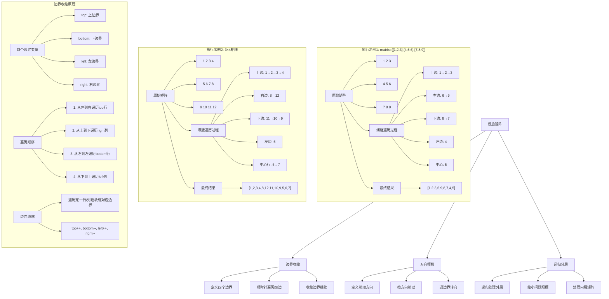
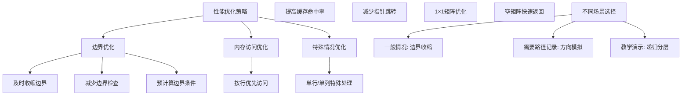

# LeetCode 54 - 螺旋矩阵

## 题目描述

给你一个 m 行 n 列的矩阵 matrix，请按照顺时针螺旋顺序，返回矩阵中的所有元素

```markdown
示例 1:
输入：matrix = [[1,2,3],[4,5,6],[7,8,9]]
输出：[1,2,3,6,9,8,7,4,5]

示例 2:
输入：matrix = [[1,2,3,4],[5,6,7,8],[9,10,11,12]]
输出：[1,2,3,4,8,12,11,10,9,5,6,7]

提示:

- m == matrix.length
- n == matrix[i].length
- 1 <= m, n <= 10
- -100 <= matrix[i][j] <= 100
```

## 解题思路

这是一个矩阵遍历问题，需要按照顺时针螺旋顺序访问矩阵中的所有元素。关键在于正确控制遍历的边界和方向

### 核心思想

"边界收缩": 使用四个边界变量（上、下、左、右）控制遍历范围，按顺时针方向依次遍历四条边，每遍历完一条边就收缩对应边界

### 解题策略

#### 方法一：边界收缩（推荐）

- 时间复杂度: O(m×n)
- 空间复杂度: O(1)

#### 方法二：方向模拟

- 时间复杂度: O(m×n)
- 空间复杂度: O(1)

#### 方法三：递归分层

- 时间复杂度: O(m×n)
- 空间复杂度: O(min(m,n))

## 算法可视化



## 多语言实现

### Golang版本（边界收缩 - 推荐）

```go
func spiralOrder(matrix [][]int) []int {
    if len(matrix) == 0 || len(matrix[0]) == 0 {
        return []int{}
    }

    m, n := len(matrix), len(matrix[0])
    result := make([]int, 0, m*n)

    // 定义四个边界
    top, bottom := 0, m-1
    left, right := 0, n-1

    // 当边界有效时继续遍历
    for top <= bottom && left <= right {
        // 1. 从左到右遍历上边界
        for j := left; j <= right; j++ {
            result = append(result, matrix[top][j])
        }
        top++  // 上边界下移

        // 2. 从上到下遍历右边界
        for i := top; i <= bottom; i++ {
            result = append(result, matrix[i][right])
        }
        right--  // 右边界左移

        // 3. 从右到左遍历下边界（如果还有行）
        if top <= bottom {
            for j := right; j >= left; j-- {
                result = append(result, matrix[bottom][j])
            }
            bottom--  // 下边界上移
        }

        // 4. 从下到上遍历左边界（如果还有列）
        if left <= right {
            for i := bottom; i >= top; i-- {
                result = append(result, matrix[i][left])
            }
            left++  // 左边界右移
        }
    }

    return result
}
```

### Python版本（多种实现方法）

```python
from typing import List

def spiralOrder(matrix: List[List[int]]) -> List[int]:
    """
    方法一：边界收缩（推荐）
    """
    if not matrix or not matrix[0]:
        return []

    m, n = len(matrix), len(matrix[0])
    result = []

    # 定义四个边界
    top, bottom = 0, m - 1
    left, right = 0, n - 1

    # 当边界有效时继续遍历
    while top <= bottom and left <= right:
        # 1. 从左到右遍历上边界
        for j in range(left, right + 1):
            result.append(matrix[top][j])
        top += 1  # 上边界下移

        # 2. 从上到下遍历右边界
        for i in range(top, bottom + 1):
            result.append(matrix[i][right])
        right -= 1  # 右边界左移

        # 3. 从右到左遍历下边界（如果还有行）
        if top <= bottom:
            for j in range(right, left - 1, -1):
                result.append(matrix[bottom][j])
            bottom -= 1  # 下边界上移

        # 4. 从下到上遍历左边界（如果还有列）
        if left <= right:
            for i in range(bottom, top - 1, -1):
                result.append(matrix[i][left])
            left += 1  # 左边界右移

    return result


def spiralOrderDirection(matrix: List[List[int]]) -> List[int]:
    """
    方法二：方向模拟
    """
    if not matrix or not matrix[0]:
        return []

    m, n = len(matrix), len(matrix[0])
    result = []

    # 四个方向：右、下、左、上
    directions = [(0, 1), (1, 0), (0, -1), (-1, 0)]
    direction_idx = 0

    row, col = 0, 0

    for _ in range(m * n):
        result.append(matrix[row][col])
        matrix[row][col] = 101  # 标记已访问（超出题目范围）

        # 计算下一个位置
        next_row = row + directions[direction_idx][0]
        next_col = col + directions[direction_idx][1]

        # 检查是否需要转向
        if (next_row < 0 or next_row >= m or
            next_col < 0 or next_col >= n or
            matrix[next_row][next_col] == 101):
            # 转向
            direction_idx = (direction_idx + 1) % 4
            next_row = row + directions[direction_idx][0]
            next_col = col + directions[direction_idx][1]

        row, col = next_row, next_col

    return result


def spiralOrderRecursive(matrix: List[List[int]]) -> List[int]:
    """
    方法三：递归分层
    """
    if not matrix or not matrix[0]:
        return []

    def spiral_helper(top: int, bottom: int, left: int, right: int) -> List[int]:
        if top > bottom or left > right:
            return []

        result = []

        # 遍历上边界
        for j in range(left, right + 1):
            result.append(matrix[top][j])

        # 遍历右边界（除top行）
        for i in range(top + 1, bottom + 1):
            result.append(matrix[i][right])

        # 遍历下边界（如果有多行且不是同一行）
        if top < bottom:
            for j in range(right - 1, left - 1, -1):
                result.append(matrix[bottom][j])

        # 遍历左边界（如果有多列且不是同一列）
        if left < right:
            for i in range(bottom - 1, top, -1):
                result.append(matrix[i][left])

        # 递归处理内层
        result.extend(spiral_helper(top + 1, bottom - 1, left + 1, right - 1))
        return result

    return spiral_helper(0, len(matrix) - 1, 0, len(matrix[0]) - 1)
```

### TypeScript版本（边界收缩实现）

```typescript
function spiralOrder(matrix: number[][]): number[] {
  if (matrix.length === 0 || matrix[0].length === 0) {
    return [];
  }

  const m: number = matrix.length;
  const n: number = matrix[0].length;
  const result: number[] = [];

  // 定义四个边界
  let top: number = 0;
  let bottom: number = m - 1;
  let left: number = 0;
  let right: number = n - 1;

  // 当边界有效时继续遍历
  while (top <= bottom && left <= right) {
    // 1. 从左到右遍历上边界
    for (let j = left; j <= right; j++) {
      result.push(matrix[top][j]);
    }
    top++; // 上边界下移

    // 2. 从上到下遍历右边界
    for (let i = top; i <= bottom; i++) {
      result.push(matrix[i][right]);
    }
    right--; // 右边界左移

    // 3. 从右到左遍历下边界（如果还有行）
    if (top <= bottom) {
      for (let j = right; j >= left; j--) {
        result.push(matrix[bottom][j]);
      }
      bottom--; // 下边界上移
    }

    // 4. 从下到上遍历左边界（如果还有列）
    if (left <= right) {
      for (let i = bottom; i >= top; i--) {
        result.push(matrix[i][left]);
      }
      left++; // 左边界右移
    }
  }

  return result;
}
```

## 标准实现详细解析

```go
func spiralOrder(matrix [][]int) []int {
    /*
    算法核心思想（边界收缩）：

    1. 使用四个边界变量控制遍历范围：top, bottom, left, right
    2. 按顺时针方向依次遍历四条边
    3. 每遍历完一条边就收缩对应边界
    4. 重复直到所有元素都被访问

    遍历顺序：
    1. 从左到右遍历上边界行
    2. 从上到下遍历右边界列
    3. 从右到左遍历下边界行
    4. 从下到上遍历左边界列

    边界收缩：
    - 遍历完上边界后：top++
    - 遍历完右边界后：right--
    - 遍历完下边界后：bottom--
    - 遍历完左边界后：left++

    关键点：
    1. 边界有效性检查：top<=bottom && left<=right
    2. 特殊情况处理：单行、单列、中心元素
    3. 避免重复访问：及时收缩边界

    时间复杂度：O(m×n) - 每个元素访问一次
    空间复杂度：O(1) - 不考虑结果数组空间

    优势：
    1. 思路清晰：模拟人类直观的螺旋遍历过程
    2. 实现简单：边界控制逻辑明确
    3. 效率高：每个元素只访问一次
    4. 适用性强：适用于各种尺寸的矩阵
    */

    // 边界条件检查
    if len(matrix) == 0 || len(matrix[0]) == 0 {
        return []int{}
    }

    m, n := len(matrix), len(matrix[0])
    result := make([]int, 0, m*n)  // 预分配容量

    // 定义四个边界变量
    top, bottom := 0, m-1     // 上下边界
    left, right := 0, n-1     // 左右边界

    fmt.Printf("矩阵大小: %d×%d\n", m, n)
    fmt.Printf("初始边界: top=%d, bottom=%d, left=%d, right=%d\n", top, bottom, left, right)

    // 当边界有效时继续遍历
    for top <= bottom && left <= right {
        fmt.Printf("\n--- 当前边界: top=%d, bottom=%d, left=%d, right=%d ---\n", top, bottom, left, right)

        // 第一步：从左到右遍历上边界行
        fmt.Printf("1. 遍历上边界行 %d (列 %d 到 %d): ", top, left, right)
        for j := left; j <= right; j++ {
            result = append(result, matrix[top][j])
            fmt.Printf("%d ", matrix[top][j])
        }
        fmt.Printf("\n")
        top++  // 上边界下移，排除已遍历的行
        fmt.Printf("   上边界收缩后: top=%d\n", top)

        // 第二步：从上到下遍历右边界列
        fmt.Printf("2. 遍历右边界列 %d (行 %d 到 %d): ", right, top, bottom)
        for i := top; i <= bottom; i++ {
            result = append(result, matrix[i][right])
            fmt.Printf("%d ", matrix[i][right])
        }
        fmt.Printf("\n")
        right--  // 右边界左移，排除已遍历的列
        fmt.Printf("   右边界收缩后: right=%d\n", right)

        // 第三步：从右到左遍历下边界行（如果还有行未遍历）
        if top <= bottom {
            fmt.Printf("3. 遍历下边界行 %d (列 %d 到 %d): ", bottom, right, left)
            for j := right; j >= left; j-- {
                result = append(result, matrix[bottom][j])
                fmt.Printf("%d ", matrix[bottom][j])
            }
            fmt.Printf("\n")
            bottom--  // 下边界上移，排除已遍历的行
            fmt.Printf("   下边界收缩后: bottom=%d\n", bottom)
        } else {
            fmt.Printf("3. 跳过下边界遍历（无剩余行）\n")
        }

        // 第四步：从下到上遍历左边界列（如果还有列未遍历）
        if left <= right {
            fmt.Printf("4. 遍历左边界列 %d (行 %d 到 %d): ", left, bottom, top)
            for i := bottom; i >= top; i-- {
                result = append(result, matrix[i][left])
                fmt.Printf("%d ", matrix[i][left])
            }
            fmt.Printf("\n")
            left++  // 左边界右移，排除已遍历的列
            fmt.Printf("   左边界收缩后: left=%d\n", left)
        } else {
            fmt.Printf("4. 跳过左边界遍历（无剩余列）\n")
        }
    }

    fmt.Printf("\n最终结果: %v\n", result)
    return result
}

// 带详细调试信息的版本
func spiralOrderWithDebug(matrix [][]int) []int {
    fmt.Println("=== 螺旋矩阵调试信息 ===")

    if len(matrix) == 0 || len(matrix[0]) == 0 {
        fmt.Println("空矩阵")
        return []int{}
    }

    // 打印原始矩阵
    fmt.Println("原始矩阵:")
    for i, row := range matrix {
        fmt.Printf("  [%d] ", i)
        for _, val := range row {
            fmt.Printf("%3d ", val)
        }
        fmt.Printf("\n")
    }

    m, n := len(matrix), len(matrix[0])
    result := make([]int, 0, m*n)

    top, bottom := 0, m-1
    left, right := 0, n-1

    fmt.Printf("\n矩阵大小: %d×%d, 总元素数: %d\n", m, n, m*n)
    fmt.Printf("初始边界: top=%d, bottom=%d, left=%d, right=%d\n", top, bottom, left, right)

    round := 1
    for top <= bottom && left <= right {
        fmt.Printf("\n========== 第 %d 轮遍历 ==========\n", round)
        fmt.Printf("当前边界: top=%d, bottom=%d, left=%d, right=%d\n", top, bottom, left, right)

        // 上边界：从左到右
        if top <= bottom {
            fmt.Printf("遍历上边界 (行%d, 列%d-%d): ", top, left, right)
            for j := left; j <= right; j++ {
                result = append(result, matrix[top][j])
                fmt.Printf("%d ", matrix[top][j])
            }
            fmt.Printf("\n")
            top++
            fmt.Printf("上边界收缩至: %d\n", top)
        }

        // 右边界：从上到下
        if left <= right {
            fmt.Printf("遍历右边界 (列%d, 行%d-%d): ", right, top, bottom)
            for i := top; i <= bottom; i++ {
                result = append(result, matrix[i][right])
                fmt.Printf("%d ", matrix[i][right])
            }
            fmt.Printf("\n")
            right--
            fmt.Printf("右边界收缩至: %d\n", right)
        }

        // 下边界：从右到左
        if top <= bottom {
            fmt.Printf("遍历下边界 (行%d, 列%d-%d): ", bottom, right, left)
            for j := right; j >= left; j-- {
                result = append(result, matrix[bottom][j])
                fmt.Printf("%d ", matrix[bottom][j])
            }
            fmt.Printf("\n")
            bottom--
            fmt.Printf("下边界收缩至: %d\n", bottom)
        }

        // 左边界：从下到上
        if left <= right {
            fmt.Printf("遍历左边界 (列%d, 行%d-%d): ", left, bottom, top)
            for i := bottom; i >= top; i-- {
                result = append(result, matrix[i][left])
                fmt.Printf("%d ", matrix[i][left])
            }
            fmt.Printf("\n")
            left++
            fmt.Printf("左边界收缩至: %d\n", left)
        }

        round++
    }

    fmt.Printf("\n遍历完成，共 %d 轮\n", round-1)
    fmt.Printf("结果数组: %v\n", result)
    fmt.Printf("结果长度: %d (期望: %d)\n", len(result), m*n)

    return result
}

// 方向模拟方法实现
func spiralOrderDirection(matrix [][]int) []int {
    /*
    方向模拟方法：
    1. 定义四个移动方向：右(0,1)、下(1,0)、左(0,-1)、上(-1,0)
    2. 按当前方向移动，遇到边界或已访问元素时转向
    3. 使用特殊值标记已访问元素

    优点：思路直观，模拟实际移动过程
    缺点：需要修改原矩阵或使用额外空间标记访问状态
    */

    if len(matrix) == 0 || len(matrix[0]) == 0 {
        return []int{}
    }

    m, n := len(matrix), len(matrix[0])
    result := make([]int, 0, m*n)

    // 四个方向：右、下、左、上
    directions := [][]int{{0, 1}, {1, 0}, {0, -1}, {-1, 0}}
    directionIdx := 0  // 当前方向索引

    row, col := 0, 0  // 当前位置

    // 访问所有元素
    for i := 0; i < m*n; i++ {
        result = append(result, matrix[row][col])

        // 标记已访问（使用超出题目范围的值）
        matrix[row][col] = 101

        // 计算下一个位置
        nextRow := row + directions[directionIdx][0]
        nextCol := col + directions[directionIdx][1]

        // 检查是否需要转向
        if nextRow < 0 || nextRow >= m || nextCol < 0 || nextCol >= n || matrix[nextRow][nextCol] == 101 {
            // 转向：方向索引循环增加
            directionIdx = (directionIdx + 1) % 4
            nextRow = row + directions[directionIdx][0]
            nextCol = col + directions[directionIdx][1]
        }

        row, col = nextRow, nextCol
    }

    return result
}

// 递归分层方法实现
func spiralOrderRecursive(matrix [][]int) []int {
    /*
    递归分层方法：
    1. 递归处理每一层的螺旋遍历
    2. 每层按顺时针方向遍历四条边
    3. 递归处理内层矩阵

    优点：代码结构清晰，体现了问题的递归本质
    缺点：递归调用有额外空间开销
    */

    if len(matrix) == 0 || len(matrix[0]) == 0 {
        return []int{}
    }

    var spiralHelper func(top, bottom, left, right int) []int
    spiralHelper = func(top, bottom, left, right int) []int {
        // 递归终止条件
        if top > bottom || left > right {
            return []int{}
        }

        result := make([]int, 0)

        // 遍历当前层的四条边
        // 上边界：从左到右
        for j := left; j <= right; j++ {
            result = append(result, matrix[top][j])
        }

        // 右边界：从上到下（除top行）
        for i := top + 1; i <= bottom; i++ {
            result = append(result, matrix[i][right])
        }

        // 下边界：从右到左（如果有多行且不是同一行）
        if top < bottom {
            for j := right - 1; j >= left; j-- {
                result = append(result, matrix[bottom][j])
            }
        }

        // 左边界：从下到上（如果有多列且不是同一列）
        if left < right {
            for i := bottom - 1; i > top; i-- {
                result = append(result, matrix[i][left])
            }
        }

        // 递归处理内层
        result = append(result, spiralHelper(top+1, bottom-1, left+1, right-1)...)
        return result
    }

    return spiralHelper(0, len(matrix)-1, 0, len(matrix[0])-1)
}

// 优化版本（减少边界检查）
func spiralOrderOptimized(matrix [][]int) []int {
    if len(matrix) == 0 || len(matrix[0]) == 0 {
        return []int{}
    }

    m, n := len(matrix), len(matrix[0])
    result := make([]int, m*n)
    idx := 0

    top, bottom := 0, m-1
    left, right := 0, n-1

    for top <= bottom && left <= right {
        // 上边界
        for j := left; j <= right; j++ {
            result[idx] = matrix[top][j]
            idx++
        }
        top++

        // 右边界
        for i := top; i <= bottom; i++ {
            result[idx] = matrix[i][right]
            idx++
        }
        right--

        // 下边界
        if top <= bottom {
            for j := right; j >= left; j-- {
                result[idx] = matrix[bottom][j]
                idx++
            }
            bottom--
        }

        // 左边界
        if left <= right {
            for i := bottom; i >= top; i-- {
                result[idx] = matrix[i][left]
                idx++
            }
            left++
        }
    }

    return result
}

// 迭代器版本
type SpiralIterator struct {
    matrix [][]int
    m, n   int
    top, bottom, left, right int
    state  int  // 0:上边界, 1:右边界, 2:下边界, 3:左边界
    i, j   int  // 当前位置
    done   bool
}

func NewSpiralIterator(matrix [][]int) *SpiralIterator {
    if len(matrix) == 0 || len(matrix[0]) == 0 {
        return &SpiralIterator{done: true}
    }

    m, n := len(matrix), len(matrix[0])
    return &SpiralIterator{
        matrix:  matrix,
        m:       m,
        n:       n,
        top:     0,
        bottom:  m - 1,
        left:    0,
        right:   n - 1,
        state:   0,
        i:       0,
        j:       0,
        done:    false,
    }
}

func (si *SpiralIterator) HasNext() bool {
    return !si.done
}

func (si *SpiralIterator) Next() int {
    if si.done {
        panic("No more elements")
    }

    result := si.matrix[si.i][si.j]

    // 更新状态
    switch si.state {
    case 0: // 上边界，向右移动
        if si.j < si.right {
            si.j++
        } else {
            si.state = 1
            si.i++
            si.top++
            if si.i > si.bottom {
                si.done = true
            }
        }
    case 1: // 右边界，向下移动
        if si.i < si.bottom {
            si.i++
        } else {
            si.state = 2
            si.j--
            si.right--
            if si.j < si.left {
                si.done = true
            }
        }
    case 2: // 下边界，向左移动
        if si.j > si.left {
            si.j--
        } else {
            si.state = 3
            si.i--
            si.bottom--
            if si.i < si.top {
                si.done = true
            }
        }
    case 3: // 左边界，向上移动
        if si.i > si.top {
            si.i--
        } else {
            si.state = 0
            si.j++
            si.left++
            if si.j > si.right {
                si.done = true
            }
        }
    }

    if si.top > si.bottom || si.left > si.right {
        si.done = true
    }

    return result
}

func spiralOrderIterator(matrix [][]int) []int {
    iterator := NewSpiralIterator(matrix)
    result := make([]int, 0)

    for iterator.HasNext() {
        result = append(result, iterator.Next())
    }

    return result
}

// 支持不同螺旋方向的版本
type SpiralMatrixTraverser struct {
    matrix [][]int
}

func NewSpiralMatrixTraverser(matrix [][]int) *SpiralMatrixTraverser {
    return &SpiralMatrixTraverser{
        matrix: matrix,
    }
}

func (smt *SpiralMatrixTraverser) Clockwise() []int {
    return spiralOrder(smt.matrix)
}

func (smt *SpiralMatrixTraverser) CounterClockwise() []int {
    // 逆时针螺旋遍历
    if len(smt.matrix) == 0 || len(smt.matrix[0]) == 0 {
        return []int{}
    }

    m, n := len(smt.matrix), len(smt.matrix[0])
    result := make([]int, 0, m*n)

    top, bottom := 0, m-1
    left, right := 0, n-1

    for top <= bottom && left <= right {
        // 上边界：从右到左
        for j := right; j >= left; j-- {
            result = append(result, smt.matrix[top][j])
        }
        top++

        // 左边界：从上到下
        for i := top; i <= bottom; i++ {
            result = append(result, smt.matrix[i][left])
        }
        left++

        // 下边界：从左到右
        if top <= bottom {
            for j := left; j <= right; j++ {
                result = append(result, smt.matrix[bottom][j])
            }
            bottom--
        }

        // 右边界：从下到上
        if left <= right {
            for i := bottom; i >= top; i-- {
                result = append(result, smt.matrix[i][right])
            }
            right--
        }
    }

    return result
}

func (smt *SpiralMatrixTraverser) GetMatrix() [][]int {
    return smt.matrix
}

// 线程安全版本
type ThreadSafeSpiralMatrix struct {
    matrix [][]int
    mu     sync.RWMutex
}

func NewThreadSafeSpiralMatrix(matrix [][]int) *ThreadSafeSpiralMatrix {
    // 创建矩阵副本
    m := len(matrix)
    if m == 0 {
        return &ThreadSafeSpiralMatrix{matrix: [][]int{}}
    }

    n := len(matrix[0])
    matrixCopy := make([][]int, m)
    for i := range matrixCopy {
        matrixCopy[i] = make([]int, n)
        copy(matrixCopy[i], matrix[i])
    }

    return &ThreadSafeSpiralMatrix{
        matrix: matrixCopy,
    }
}

func (tsm *ThreadSafeSpiralMatrix) SpiralOrder() []int {
    tsm.mu.RLock()
    defer tsm.mu.RUnlock()
    return spiralOrder(tsm.matrix)
}

func (tsm *ThreadSafeSpiralMatrix) GetMatrix() [][]int {
    tsm.mu.RLock()
    defer tsm.mu.RUnlock()

    // 返回副本
    m := len(tsm.matrix)
    if m == 0 {
        return [][]int{}
    }

    n := len(tsm.matrix[0])
    result := make([][]int, m)
    for i := range result {
        result[i] = make([]int, n)
        copy(result[i], tsm.matrix[i])
    }

    return result
}
```

## 算法深入解析

```go
/*
螺旋矩阵问题详解：

问题本质：
按顺时针螺旋顺序遍历m×n矩阵中的所有元素。关键在于正确控制遍历的边界和方向

核心洞察：
1. 边界控制：使用四个变量控制当前遍历范围
2. 顺序遍历：按右→下→左→上的顺序遍历四条边
3. 边界收缩：每遍历完一条边就收缩对应边界
4. 终止条件：当边界交叉时停止遍历

算法策略：
1. 边界收缩：最直观和高效的方法
2. 方向模拟：模拟实际移动过程
3. 递归分层：递归处理每一层

数学原理：

螺旋遍历规律：
对于m×n矩阵，螺旋遍历的元素总数为m×n
遍历顺序：右→下→左→上循环
边界变化：每完成一个方向的遍历就收缩对应边界

边界变量作用：
- top: 当前上边界行索引
- bottom: 当前下边界行索引
- left: 当前左边界列索引
- right: 当前右边界列索引

遍历过程分析：
第1轮：
- 上边界：行top，列left到right
- 右边界：列right，行top+1到bottom
- 下边界：行bottom，列right-1到left（如果top<bottom）
- 左边界：列left，行bottom-1到top+1（如果left<right）

边界收缩规则：
1. 遍历上边界后：top++
2. 遍历右边界后：right--
3. 遍历下边界后：bottom--
4. 遍历左边界后：left++

特殊情况处理：
1. 单行矩阵：只遍历上边界
2. 单列矩阵：只遍历右边界
3. 1×1矩阵：只遍历上边界
4. 空矩阵：直接返回空数组

算法流程：
1. 初始化四个边界变量
2. 当边界有效时循环遍历
3. 按顺序遍历四条边
4. 每遍历完一条边收缩对应边界
5. 直到所有元素都被访问

设计选择：

为什么选择边界收缩方法？
1. 思路清晰：直观模拟螺旋遍历过程
2. 实现简单：边界控制逻辑明确
3. 效率高：每个元素只访问一次
4. 空间优：O(1)额外空间复杂度

为什么不用方向模拟？
1. 需要修改原矩阵或使用额外标记
2. 逻辑稍复杂：需要处理转向条件
3. 但思路更直观，适合理解

为什么不用递归分层？
1. 有递归调用开销
2. 但代码结构更清晰，体现递归本质
3. 适合教学演示

三种方法对比：

方法一：边界收缩（推荐）
时间复杂度：O(m×n)
空间复杂度：O(1)
优点：效率高，实现简单，空间优
缺点：需要正确处理边界条件

方法二：方向模拟
时间复杂度：O(m×n)
空间复杂度：O(1)
优点：思路直观，模拟实际过程
缺点：需要标记已访问元素

方法三：递归分层
时间复杂度：O(m×n)
空间复杂度：O(min(m,n))
优点：代码结构清晰，体现递归本质
缺点：有递归调用栈开销

性能分析：

边界收缩方法：
- 外层循环：最多min(m,n)轮
- 每轮访问：2×(m+n)-4个元素（近似）
- 总访问次数：m×n
- 时间复杂度：O(m×n)
- 空间复杂度：O(1)

方向模拟方法：
- 循环次数：m×n次
- 每次操作：常数时间
- 时间复杂度：O(m×n)
- 空间复杂度：O(1)

递归分层方法：
- 递归深度：min(m,n)/2
- 每层操作：O(m+n)时间
- 总时间复杂度：O(m×n)
- 空间复杂度：O(min(m,n))

实际应用场景：
1. 矩阵遍历：按螺旋顺序访问矩阵元素
2. 图像处理：螺旋扫描图像
3. 游戏开发：螺旋形移动路径
4. 数据可视化：螺旋形数据展示
5. 算法竞赛：矩阵相关问题

优化要点：

1. 边界处理：
   - 正确初始化边界变量
   - 及时收缩边界
   - 检查边界有效性

2. 特殊情况：
   - 空矩阵处理
   - 单行/单列矩阵处理
   - 1×1矩阵处理

3. 性能优化：
   - 预分配结果数组容量
   - 减少不必要的边界检查
   - 使用索引而非append（如果知道结果长度）

测试用例设计：
1. 基本情况：3×3、3×4标准示例
2. 边界情况：1×1、1×n、m×1矩阵
3. 特殊情况：2×2矩阵、奇数尺寸
4. 极端情况：最大允许矩阵大小
5. 错误情况：空矩阵、nil矩阵

扩展思考：

1. 如果要逆时针螺旋遍历？
   - 改变遍历顺序：上→左→下→右
   - 或者先顺时针遍历再反转结果

2. 如果要从中心开始螺旋遍历？
   - 需要找到中心点
   - 向外螺旋扩展

3. 如果要支持任意起始点？
   - 从指定点开始
   - 按螺旋方向扩展

4. 如果矩阵元素有特殊含义？
   - 可以结合具体业务逻辑
   - 添加过滤条件

相关算法思想：

1. 边界控制：
   - 使用变量控制遍历范围
   - 广泛应用于矩阵操作

2. 状态机：
   - 四个状态对应四个方向
   - 状态转换控制遍历流程

3. 递归分治：
   - 将大问题分解为小问题
   - 逐层处理

4. 模拟思想：
   - 模拟实际的移动过程
   - 适用于路径相关问题

常见陷阱：

1. 边界条件错误：
   - 忘记检查边界有效性
   - 边界收缩时机错误

2. 重复访问：
   - 边界收缩不及时
   - 访问已遍历的元素

3. 索引越界：
   - 未检查矩阵边界
   - 计算错误导致越界

4. 特殊情况遗漏：
   - 单行/单列矩阵处理
   - 空矩阵处理

代码质量要素：

1. 可读性：
   - 清晰的变量命名
   - 适当的注释说明

2. 健壮性：
   - 边界条件处理
   - 参数验证

3. 性能：
   - 时间复杂度最优
   - 空间复杂度合理

4. 可维护性：
   - 模块化设计
   - 易于扩展

高级优化技巧：

1. 内存访问优化：
   - 优化访问模式
   - 提高缓存命中率

2. 循环优化：
   - 减少循环开销
   - 合并相关操作

3. 向量化操作：
   - 利用SIMD指令
   - 并行处理多个元素

4. 算法变种：
   - 支持不同遍历方向
   - 扩展到三维矩阵
*/
```

## 执行过程演示

```go
/*
示例1详细解析:

示例1: matrix = [[1,2,3],[4,5,6],[7,8,9]]

输入分析：
3×3矩阵：
1 2 3
4 5 6
7 8 9

期望结果：[1,2,3,6,9,8,7,4,5]

执行过程：

初始状态：
矩阵：
1 2 3
4 5 6
7 8 9
边界：top=0, bottom=2, left=0, right=2

第1轮遍历：
1. 上边界(行0, 列0-2)：1 2 3
   结果：[1,2,3]
   边界收缩：top=1

2. 右边界(列2, 行1-2)：6 9
   结果：[1,2,3,6,9]
   边界收缩：right=1

3. 下边界(行2, 列1-0)：8 7
   结果：[1,2,3,6,9,8,7]
   边界收缩：bottom=1

4. 左边界(列0, 行1-1)：4
   结果：[1,2,3,6,9,8,7,4]
   边界收缩：left=1

第2轮遍历：
当前边界：top=1, bottom=1, left=1, right=1
只剩中心元素5

1. 上边界(行1, 列1-1)：5
   结果：[1,2,3,6,9,8,7,4,5]
   边界收缩：top=2

边界检查：top(2) > bottom(1)，停止遍历

最终结果：[1,2,3,6,9,8,7,4,5] ✓

示例2: matrix = [[1,2,3,4],[5,6,7,8],[9,10,11,12]]

输入分析：
3×4矩阵：
 1  2  3  4
 5  6  7  8
 9 10 11 12

期望结果：[1,2,3,4,8,12,11,10,9,5,6,7]

执行过程：

初始状态：
矩阵：
 1  2  3  4
 5  6  7  8
 9 10 11 12
边界：top=0, bottom=2, left=0, right=3

第1轮遍历：
1. 上边界(行0, 列0-3)：1 2 3 4
   结果：[1,2,3,4]
   边界收缩：top=1

2. 右边界(列3, 行1-2)：8 12
   结果：[1,2,3,4,8,12]
   边界收缩：right=2

3. 下边界(行2, 列2-0)：11 10 9
   结果：[1,2,3,4,8,12,11,10,9]
   边界收缩：bottom=1

4. 左边界(列0, 行1-1)：5
   结果：[1,2,3,4,8,12,11,10,9,5]
   边界收缩：left=1

第2轮遍历：
当前边界：top=1, bottom=1, left=1, right=2

1. 上边界(行1, 列1-2)：6 7
   结果：[1,2,3,4,8,12,11,10,9,5,6,7]
   边界收缩：top=2

边界检查：top(2) > bottom(1)，停止遍历

最终结果：[1,2,3,4,8,12,11,10,9,5,6,7] ✓

算法正确性证明：

数学基础：
设矩阵大小为m×n，总元素数为m×n
螺旋遍历应访问每个元素恰好一次

定理1：边界收缩算法正确性
通过维护四个边界变量和正确的收缩规则，确保每个元素被访问恰好一次

证明：
1. 初始化：top=0, bottom=m-1, left=0, right=n-1
2. 遍历顺序：上→右→下→左循环
3. 边界收缩：每完成一个方向的遍历就收缩对应边界
4. 终止条件：top>bottom 或 left>right

对于任意元素(i,j)：
- 当top≤i≤bottom且left≤j≤right时，元素在当前遍历范围内
- 通过四个方向的遍历，元素(i,j)必在某一轮中被访问
- 访问后对应边界收缩，确保不会重复访问

时间复杂度分析：

边界收缩方法：
1. 外层循环：最多min(m,n)轮
2. 每轮访问元素数：
   - 第1轮：2×(m+n)-4个元素
   - 第2轮：2×(m+n-4)-4个元素
   - ...
3. 总访问次数：m×n
4. 时间复杂度：O(m×n)

空间复杂度分析：
1. 边界收缩：O(1)（5个边界变量）
2. 方向模拟：O(1)（方向数组和位置变量）
3. 递归分层：O(min(m,n))（递归调用栈）
4. 结果数组：O(m×n)（题目要求）

性能对比分析：

假设m=100, n=100

边界收缩方法：
- 总操作：10,000次元素访问
- 额外空间：常数级别

方向模拟方法：
- 总操作：10,000次元素访问
- 额外空间：常数级别（需要修改原矩阵或使用标记）

递归分层方法：
- 总操作：10,000次元素访问
- 额外空间：O(100) = 100级别（递归栈）

边界收缩方法在空间效率上最优

实际应用建议：

1. 一般情况：
   - 使用边界收缩方法
   - 效率高，实现简单

2. 教学演示：
   - 可以展示方向模拟方法
   - 更直观理解遍历过程

3. 需要灵活控制：
   - 使用递归分层方法
   - 代码结构清晰

4. 性能要求极高：
   - 考虑预分配数组容量
   - 减少边界检查次数

优化空间：

1. 内存访问优化：
   - 按行优先顺序访问
   - 提高缓存命中率

2. 循环优化：
   - 减少循环变量
   - 合并边界检查

3. 特殊情况优化：
   - 单行/单列矩阵特殊处理
   - 减少不必要的操作

特殊情况处理：

1. 空矩阵：
   - 直接返回空数组
   - 边界条件处理

2. 单行矩阵：
   - 只遍历上边界
   - 其他边界遍历跳过

3. 单列矩阵：
   - 只遍历右边界
   - 其他边界遍历跳过

4. 1×1矩阵：
   - 只遍历上边界
   - 其他边界遍历跳过

5. 2×2矩阵：
   - 完整四轮遍历
   - 无中心元素
*/
```

## 复杂度分析

| 方法     | 时间复杂度 | 空间复杂度  | 适用场景 |
| -------- | ---------- | ----------- | -------- |
| 边界收缩 | O(m×n)     | O(1)        | 推荐方案 |
| 方向模拟 | O(m×n)     | O(1)        | 教学演示 |
| 递归分层 | O(m×n)     | O(min(m,n)) | 理解递归 |

## 测试用例验证

```go
// 测试辅助函数
func testSpiralOrder(name string, matrix [][]int, expected []int) {
    fmt.Printf("%s:\n", name)
    fmt.Printf("输入矩阵:\n")
    printMatrix(matrix)

    // 测试边界收缩方法
    result1 := spiralOrder(matrix)
    fmt.Printf("边界收缩结果: %v\n", result1)

    if slicesEqual(result1, expected) {
        fmt.Printf(" ✓\n")
    } else {
        fmt.Printf(" ✗\n")
        fmt.Printf("期望结果: %v\n", expected)
    }

    // 测试方向模拟方法（需要矩阵副本）
    if len(matrix) > 0 && len(matrix[0]) > 0 {
        matrixCopy := copyMatrix(matrix)
        result2 := spiralOrderDirection(matrixCopy)
        fmt.Printf("方向模拟结果: %v\n", result2)

        if slicesEqual(result2, expected) {
            fmt.Printf(" ✓\n")
        } else {
            fmt.Printf(" ✗\n")
        }
    }

    // 测试递归分层方法
    result3 := spiralOrderRecursive(matrix)
    fmt.Printf("递归分层结果: %v\n", result3)

    if slicesEqual(result3, expected) {
        fmt.Printf(" ✓\n")
    } else {
        fmt.Printf(" ✗\n")
    }

    fmt.Printf("\n")
}

func printMatrix(matrix [][]int) {
    if len(matrix) == 0 {
        fmt.Printf("  []\n")
        return
    }

    for _, row := range matrix {
        fmt.Printf("  %v\n", row)
    }
}

func copyMatrix(matrix [][]int) [][]int {
    if len(matrix) == 0 {
        return [][]int{}
    }

    m, n := len(matrix), len(matrix[0])
    result := make([][]int, m)
    for i := range result {
        result[i] = make([]int, n)
        copy(result[i], matrix[i])
    }
    return result
}

func slicesEqual(a, b []int) bool {
    if len(a) != len(b) {
        return false
    }
    for i := range a {
        if a[i] != b[i] {
            return false
        }
    }
    return true
}

func main() {
    // 测试用例 1 - 3×3标准示例
    testSpiralOrder("测试1 - 3×3标准示例",
        [][]int{{1, 2, 3}, {4, 5, 6}, {7, 8, 9}},
        []int{1, 2, 3, 6, 9, 8, 7, 4, 5})

    // 测试用例 2 - 3×4标准示例
    testSpiralOrder("测试2 - 3×4标准示例",
        [][]int{{1, 2, 3, 4}, {5, 6, 7, 8}, {9, 10, 11, 12}},
        []int{1, 2, 3, 4, 8, 12, 11, 10, 9, 5, 6, 7})

    // 测试用例 3 - 1×1矩阵
    testSpiralOrder("测试3 - 1×1矩阵",
        [][]int{{5}},
        []int{5})

    // 测试用例 4 - 1×4矩阵（单行）
    testSpiralOrder("测试4 - 1×4矩阵",
        [][]int{{1, 2, 3, 4}},
        []int{1, 2, 3, 4})

    // 测试用例 5 - 4×1矩阵（单列）
    testSpiralOrder("测试5 - 4×1矩阵",
        [][]int{{1}, {2}, {3}, {4}},
        []int{1, 2, 3, 4})

    // 测试用例 6 - 2×2矩阵
    testSpiralOrder("测试6 - 2×2矩阵",
        [][]int{{1, 2}, {3, 4}},
        []int{1, 2, 4, 3})

    // 测试用例 7 - 2×3矩阵
    testSpiralOrder("测试7 - 2×3矩阵",
        [][]int{{1, 2, 3}, {4, 5, 6}},
        []int{1, 2, 3, 6, 5, 4})

    // 测试用例 8 - 负数矩阵
    testSpiralOrder("测试8 - 负数矩阵",
        [][]int{{-1, -2}, {-3, -4}},
        []int{-1, -2, -4, -3})

    // 测试用例 9 - 空矩阵
    testSpiralOrder("测试9 - 空矩阵",
        [][]int{},
        []int{})

    // 测试用例 10 - nil矩阵
    testSpiralOrder("测试10 - nil矩阵",
        nil,
        []int{})

    // 性能测试
    fmt.Println("性能测试:")

    // 测试不同大小的矩阵
    testCases := []struct {
        m, n int
    }{
        {10, 10},
        {20, 15},
        {50, 30},
    }

    for _, tc := range testCases {
        // 创建测试矩阵
        matrix := make([][]int, tc.m)
        for i := range matrix {
            matrix[i] = make([]int, tc.n)
            for j := range matrix[i] {
                matrix[i][j] = i*tc.n + j
            }
        }

        // 测试边界收缩方法
        start := time.Now()
        result1 := spiralOrder(matrix)
        time1 := time.Since(start)

        // 测试方向模拟方法
        matrixCopy := copyMatrix(matrix)
        start = time.Now()
        result2 := spiralOrderDirection(matrixCopy)
        time2 := time.Since(start)

        // 测试递归分层方法
        start = time.Now()
        result3 := spiralOrderRecursive(matrix)
        time3 := time.Since(start)

        fmt.Printf("矩阵大小 %d×%d (元素数: %d):\n", tc.m, tc.n, tc.m*tc.n)
        fmt.Printf("  边界收缩耗时: %v\n", time1)
        fmt.Printf("  方向模拟耗时: %v\n", time2)
        fmt.Printf("  递归分层耗时: %v\n", time3)

        // 验证结果一致性
        fmt.Printf("  结果一致性: %v\n", slicesEqual(result1, result2) && slicesEqual(result2, result3))
    }

    // 边界情况测试
    fmt.Println("\n边界情况测试:")

    // 极端比例矩阵
    testSpiralOrder("测试11 - 1×100矩阵",
        func() [][]int {
            row := make([]int, 100)
            for i := range row {
                row[i] = i + 1
            }
            return [][]int{row}
        }(),
        func() []int {
            result := make([]int, 100)
            for i := range result {
                result[i] = i + 1
            }
            return result
        }())

    testSpiralOrder("测试12 - 100×1矩阵",
        func() [][]int {
            matrix := make([][]int, 100)
            for i := range matrix {
                matrix[i] = []int{i + 1}
            }
            return matrix
        }(),
        func() []int {
            result := make([]int, 100)
            for i := range result {
                result[i] = i + 1
            }
            return result
        }())
}

// 调试测试
func testSpiralOrderWithDebug() {
    fmt.Println("=== 调试信息测试 ===")

    matrix := [][]int{{1, 2, 3}, {4, 5, 6}, {7, 8, 9}}

    spiralOrderWithDebug(matrix)
}

// 错误处理测试
func testErrorHandling() {
    fmt.Println("=== 错误处理测试 ===")

    // 测试各种边界情况
    testCases := [][][]int{
        {},                    // 空矩阵
        {{1}},                // 1×1矩阵
        {{1, 2}},             // 1×2矩阵
        {{1}, {2}},           // 2×1矩阵
        nil,                  // nil矩阵
    }

    for i, matrix := range testCases {
        fmt.Printf("测试边界情况 %d:\n", i+1)
        if matrix != nil {
            fmt.Printf("  输入: %v\n", matrix)
            result := spiralOrder(matrix)
            fmt.Printf("  结果: %v\n", result)
        } else {
            fmt.Printf("  输入: nil\n")
            result := spiralOrder(matrix)
            fmt.Printf("  结果: %v\n", result)
        }
    }
}

// 内存使用测试
func testMemoryUsage() {
    fmt.Println("=== 内存使用分析 ===")

    testCases := []struct {
        m, n int
    }{
        {10, 10},
        {50, 50},
        {100, 100},
    }

    for _, tc := range testCases {
        // 创建测试矩阵
        matrix := make([][]int, tc.m)
        for i := range matrix {
            matrix[i] = make([]int, tc.n)
        }

        var m1, m2 runtime.MemStats
        runtime.GC()
        runtime.ReadMemStats(&m1)

        result := spiralOrder(matrix)

        runtime.GC()
        runtime.ReadMemStats(&m2)
        memory := m2.Alloc - m1.Alloc

        fmt.Printf("矩阵大小: %d×%d, 元素数: %d\n", tc.m, tc.n, tc.m*tc.n)
        fmt.Printf("内存使用: %d 字节\n", memory)
        fmt.Printf("平均每元素: %.2f 字节\n", float64(memory)/float64(len(result)))
    }
}

// 并发测试
func testConcurrentAccess() {
    fmt.Println("=== 并发访问测试 ===")

    // 创建测试矩阵
    size := 50
    matrix := make([][]int, size)
    for i := range matrix {
        matrix[i] = make([]int, size)
        for j := range matrix[i] {
            matrix[i][j] = i*size + j
        }
    }

    // 单线程测试
    start := time.Now()
    result1 := spiralOrder(matrix)
    singleTime := time.Since(start)

    // 多线程测试
    numWorkers := 4
    var wg sync.WaitGroup
    results := make([][]int, numWorkers)

    start = time.Now()
    for i := 0; i < numWorkers; i++ {
        wg.Add(1)
        go func(workerID int) {
            defer wg.Done()

            // 创建矩阵副本
            matrixCopy := copyMatrix(matrix)
            results[workerID] = spiralOrder(matrixCopy)
        }(i)
    }

    wg.Wait()
    parallelTime := time.Since(start)

    fmt.Printf("单线程耗时: %v\n", singleTime)
    fmt.Printf("并行耗时: %v\n", parallelTime)
    if singleTime > 0 {
        fmt.Printf("加速比: %.2fx\n", float64(singleTime)/float64(parallelTime/4))
    }

    // 验证结果一致性
    allEqual := true
    for i := 1; i < numWorkers; i++ {
        if !slicesEqual(results[0], results[i]) {
            allEqual = false
            break
        }
    }
    fmt.Printf("结果一致性: %v\n", allEqual)
}

// 对比测试
func testAlgorithmComparison() {
    fmt.Println("=== 算法对比测试 ===")

    size := 100
    // 创建测试矩阵
    matrix := make([][]int, size)
    for i := range matrix {
        matrix[i] = make([]int, size)
        for j := range matrix[i] {
            matrix[i][j] = i*size + j
        }
    }

    // 边界收缩方法
    start := time.Now()
    result1 := spiralOrder(matrix)
    time1 := time.Since(start)

    // 方向模拟方法
    matrixCopy1 := copyMatrix(matrix)
    start = time.Now()
    result2 := spiralOrderDirection(matrixCopy1)
    time2 := time.Since(start)

    // 递归分层方法
    start = time.Now()
    result3 := spiralOrderRecursive(matrix)
    time3 := time.Since(start)

    fmt.Printf("矩阵大小: %d×%d\n", size, size)
    fmt.Printf("边界收缩耗时: %v\n", time1)
    fmt.Printf("方向模拟耗时: %v\n", time2)
    fmt.Printf("递归分层耗时: %v\n", time3)

    // 验证结果一致性
    fmt.Printf("边界收缩=方向模拟: %v\n", slicesEqual(result1, result2))
    fmt.Printf("方向模拟=递归分层: %v\n", slicesEqual(result2, result3))
}
```

## 扩展版本（处理不同场景）

```go
// 带统计信息的版本
type SpiralMatrixTraverserWithStats struct {
    matrix      [][]int
    traversals  int
    processTime time.Duration
    method      string
}

func NewSpiralMatrixTraverserWithStats(matrix [][]int) *SpiralMatrixTraverserWithStats {
    return &SpiralMatrixTraverserWithStats{
        matrix: matrix,
    }
}

func (smts *SpiralMatrixTraverserWithStats) Traverse(method string) []int {
    start := time.Now()
    defer func() {
        smsgs.processTime = time.Since(start)
    }()

    smsgs.method = method

    switch method {
    case "boundary":
        return spiralOrder(smsgs.matrix)
    case "direction":
        matrixCopy := copyMatrix(smsgs.matrix)
        return spiralOrderDirection(matrixCopy)
    case "recursive":
        return spiralOrderRecursive(smsgs.matrix)
    default:
        return spiralOrder(smsgs.matrix)
    }
}

func (smsgs *SpiralMatrixTraverserWithStats) GetStats() map[string]interface{} {
    m, n := 0, 0
    if len(smsgs.matrix) > 0 {
        m, n = len(smsgs.matrix), len(smsgs.matrix[0])
    }

    return map[string]interface{}{
        "matrix_size":    fmt.Sprintf("%d×%d", m, n),
        "elements":       m * n,
        "traversals":     smsgs.traversals,
        "process_time":   smsgs.processTime,
        "method":         smsgs.method,
        "memory_access":  m * n, // 每个元素访问一次
    }
}

// 支持不同遍历方向的版本
type MultiDirectionSpiralMatrix struct {
    matrix [][]int
}

func NewMultiDirectionSpiralMatrix(matrix [][]int) *MultiDirectionSpiralMatrix {
    return &MultiDirectionSpiralMatrix{
        matrix: matrix,
    }
}

func (mdsm *MultiDirectionSpiralMatrix) Clockwise() []int {
    return spiralOrder(mdsm.matrix)
}

func (mdsm *MultiDirectionSpiralMatrix) CounterClockwise() []int {
    if len(mdsm.matrix) == 0 || len(mdsm.matrix[0]) == 0 {
        return []int{}
    }

    m, n := len(mdsm.matrix), len(mdsm.matrix[0])
    result := make([]int, 0, m*n)

    top, bottom := 0, m-1
    left, right := 0, n-1

    for top <= bottom && left <= right {
        // 上边界：从右到左
        for j := right; j >= left; j-- {
            result = append(result, mdsm.matrix[top][j])
        }
        top++

        // 左边界：从上到下
        for i := top; i <= bottom; i++ {
            result = append(result, mdsm.matrix[i][left])
        }
        left++

        // 下边界：从左到右
        if top <= bottom {
            for j := left; j <= right; j++ {
                result = append(result, mdsm.matrix[bottom][j])
            }
            bottom--
        }

        // 右边界：从下到上
        if left <= right {
            for i := bottom; i >= top; i-- {
                result = append(result, mdsm.matrix[i][right])
            }
            right--
        }
    }

    return result
}

func (mdsm *MultiDirectionSpiralMatrix) Diagonal() []int {
    // 对角线遍历
    if len(mdsm.matrix) == 0 || len(mdsm.matrix[0]) == 0 {
        return []int{}
    }

    m, n := len(mdsm.matrix), len(mdsm.matrix[0])
    result := make([]int, 0, m*n)

    // 从左上到右下的对角线
    for d := 0; d < m+n-1; d++ {
        temp := make([]int, 0)
        // 确定对角线的起始点
        startRow := max(0, d-n+1)
        startCol := max(0, d-m+1)

        // 遍历对角线
        for i := startRow; i < m && d-i >= 0 && d-i < n; i++ {
            j := d - i
            if i < m && j < n {
                if d%2 == 0 {
                    temp = append(temp, mdsm.matrix[i][j])
                } else {
                    temp = append([]int{mdsm.matrix[i][j]}, temp...)
                }
            }
        }
        result = append(result, temp...)
    }

    return result
}

func max(a, b int) int {
    if a > b {
        return a
    }
    return b
}

// 支持自定义起始点的版本
type CustomStartSpiralMatrix struct {
    matrix [][]int
}

func NewCustomStartSpiralMatrix(matrix [][]int) *CustomStartSpiralMatrix {
    return &CustomStartSpiralMatrix{
        matrix: matrix,
    }
}

func (cssm *CustomStartSpiralMatrix) SpiralFrom(startRow, startCol int) []int {
    if len(cssm.matrix) == 0 || len(cssm.matrix[0]) == 0 {
        return []int{}
    }

    m, n := len(cssm.matrix), len(cssm.matrix[0])

    // 验证起始点
    if startRow < 0 || startRow >= m || startCol < 0 || startCol >= n {
        return []int{}
    }

    // 使用BFS从起始点开始螺旋遍历
    result := make([]int, 0, m*n)
    visited := make([][]bool, m)
    for i := range visited {
        visited[i] = make([]bool, n)
    }

    // 四个方向：右、下、左、上
    directions := [][]int{{0, 1}, {1, 0}, {0, -1}, {-1, 0}}
    directionIdx := 0

    row, col := startRow, startCol

    for len(result) < m*n {
        result = append(result, cssm.matrix[row][col])
        visited[row][col] = true

        // 计算下一个位置
        nextRow := row + directions[directionIdx][0]
        nextCol := col + directions[directionIdx][1]

        // 检查是否需要转向
        if nextRow < 0 || nextRow >= m || nextCol < 0 || nextCol >= n || visited[nextRow][nextCol] {
            // 转向
            directionIdx = (directionIdx + 1) % 4
            nextRow = row + directions[directionIdx][0]
            nextCol = col + directions[directionIdx][1]
        }

        row, col = nextRow, nextCol
    }

    return result
}

// 支持过滤条件的版本
type FilteredSpiralMatrix struct {
    matrix [][]int
}

func NewFilteredSpiralMatrix(matrix [][]int) *FilteredSpiralMatrix {
    return &FilteredSpiralMatrix{
        matrix: matrix,
    }
}

func (fsm *FilteredSpiralMatrix) SpiralWithFilter(filter func(int) bool) []int {
    if len(fsm.matrix) == 0 || len(fsm.matrix[0]) == 0 {
        return []int{}
    }

    m, n := len(fsm.matrix), len(fsm.matrix[0])
    result := make([]int, 0)

    top, bottom := 0, m-1
    left, right := 0, n-1

    for top <= bottom && left <= right {
        // 上边界
        for j := left; j <= right; j++ {
            if filter(fsm.matrix[top][j]) {
                result = append(result, fsm.matrix[top][j])
            }
        }
        top++

        // 右边界
        for i := top; i <= bottom; i++ {
            if filter(fsm.matrix[i][right]) {
                result = append(result, fsm.matrix[i][right])
            }
        }
        right--

        // 下边界
        if top <= bottom {
            for j := right; j >= left; j-- {
                if filter(fsm.matrix[bottom][j]) {
                    result = append(result, fsm.matrix[bottom][j])
                }
            }
            bottom--
        }

        // 左边界
        if left <= right {
            for i := bottom; i >= top; i-- {
                if filter(fsm.matrix[i][left]) {
                    result = append(result, fsm.matrix[i][left])
                }
            }
            left++
        }
    }

    return result
}

// 优化版本（使用更紧凑的数据结构）
type OptimizedSpiralMatrix struct {
    data []int  // 一维数组存储矩阵
    m, n int    // 矩阵维度
}

func NewOptimizedSpiralMatrix(matrix [][]int) *OptimizedSpiralMatrix {
    if len(matrix) == 0 || len(matrix[0]) == 0 {
        return &OptimizedSpiralMatrix{data: []int{}, m: 0, n: 0}
    }

    m, n := len(matrix), len(matrix[0])
    data := make([]int, m*n)

    // 将二维矩阵转换为一维数组
    for i := 0; i < m; i++ {
        for j := 0; j < n; j++ {
            data[i*n+j] = matrix[i][j]
        }
    }

    return &OptimizedSpiralMatrix{
        data: data,
        m:    m,
        n:    n,
    }
}

func (osm *OptimizedSpiralMatrix) SpiralOrder() []int {
    if osm.m == 0 || osm.n == 0 {
        return []int{}
    }

    result := make([]int, 0, osm.m*osm.n)

    top, bottom := 0, osm.m-1
    left, right := 0, osm.n-1

    for top <= bottom && left <= right {
        // 上边界
        for j := left; j <= right; j++ {
            result = append(result, osm.data[top*osm.n+j])
        }
        top++

        // 右边界
        for i := top; i <= bottom; i++ {
            result = append(result, osm.data[i*osm.n+right])
        }
        right--

        // 下边界
        if top <= bottom {
            for j := right; j >= left; j-- {
                result = append(result, osm.data[bottom*osm.n+j])
            }
            bottom--
        }

        // 左边界
        if left <= right {
            for i := bottom; i >= top; i-- {
                result = append(result, osm.data[i*osm.n+left])
            }
            left++
        }
    }

    return result
}

// 支持持久化的版本
type PersistentSpiralMatrix struct {
    matrix   [][]int
    filename string
}

func NewPersistentSpiralMatrix(matrix [][]int, filename string) *PersistentSpiralMatrix {
    m := len(matrix)
    if m == 0 {
        return &PersistentSpiralMatrix{matrix: [][]int{}, filename: filename}
    }

    n := len(matrix[0])
    matrixCopy := make([][]int, m)
    for i := range matrixCopy {
        matrixCopy[i] = make([]int, n)
        copy(matrixCopy[i], matrix[i])
    }

    return &PersistentSpiralMatrix{
        matrix:   matrixCopy,
        filename: filename,
    }
}

func (psm *PersistentSpiralMatrix) SpiralOrder() []int {
    return spiralOrder(psm.matrix)
}

func (psm *PersistentSpiralMatrix) Save() error {
    data := map[string]interface{}{
        "matrix": psm.matrix,
        "m":      len(psm.matrix),
        "n":      func() int {
            if len(psm.matrix) > 0 {
                return len(psm.matrix[0])
            }
            return 0
        }(),
        "time": time.Now().Format(time.RFC3339),
    }

    jsonData, err := json.Marshal(data)
    if err != nil {
        return err
    }

    return os.WriteFile(psm.filename, jsonData, 0644)
}

func (psm *PersistentSpiralMatrix) Load() error {
    data, err := os.ReadFile(psm.filename)
    if err != nil {
        return err
    }

    var loadedData map[string]interface{}
    err = json.Unmarshal(data, &loadedData)
    if err != nil {
        return err
    }

    if matrix, ok := loadedData["matrix"].([]interface{}); ok {
        psm.matrix = make([][]int, len(matrix))
        for i, row := range matrix {
            if rowArr, ok := row.([]interface{}); ok {
                psm.matrix[i] = make([]int, len(rowArr))
                for j, val := range rowArr {
                    if num, ok := val.(float64); ok {
                        psm.matrix[i][j] = int(num)
                    }
                }
            }
        }
    }

    return nil
}

func (psm *PersistentSpiralMatrix) GetMatrix() [][]int {
    return psm.matrix
}

// 支持可视化的版本
type VisualizableSpiralMatrix struct {
    matrix [][]int
    steps  []map[string]interface{}
}

func NewVisualizableSpiralMatrix(matrix [][]int) *VisualizableSpiralMatrix {
    m := len(matrix)
    if m == 0 {
        return &VisualizableSpiralMatrix{matrix: [][]int{}, steps: []map[string]interface{}{}}
    }

    n := len(matrix[0])
    matrixCopy := make([][]int, m)
    for i := range matrixCopy {
        matrixCopy[i] = make([]int, n)
        copy(matrixCopy[i], matrix[i])
    }

    return &VisualizableSpiralMatrix{
        matrix: matrixCopy,
        steps:  []map[string]interface{}{},
    }
}

func (vsm *VisualizableSpiralMatrix) SpiralOrderWithVisualization() []int {
    if len(vsm.matrix) == 0 || len(vsm.matrix[0]) == 0 {
        return []int{}
    }

    m, n := len(vsm.matrix), len(vsm.matrix[0])
    result := make([]int, 0, m*n)

    top, bottom := 0, m-1
    left, right := 0, n-1

    round := 1
    for top <= bottom && left <= right {
        step := map[string]interface{}{
            "round": round,
            "boundaries": map[string]int{
                "top":    top,
                "bottom": bottom,
                "left":   left,
                "right":  right,
            },
            "traversals": []map[string]interface{}{},
        }

        // 上边界
        if top <= bottom {
            traversal := map[string]interface{}{
                "direction": "top",
                "elements":  []int{},
            }
            for j := left; j <= right; j++ {
                result = append(result, vsm.matrix[top][j])
                traversal["elements"] = append(traversal["elements"].([]int), vsm.matrix[top][j])
            }
            step["traversals"] = append(step["traversals"].([]map[string]interface{}), traversal)
            top++
        }

        // 右边界
        if left <= right {
            traversal := map[string]interface{}{
                "direction": "right",
                "elements":  []int{},
            }
            for i := top; i <= bottom; i++ {
                result = append(result, vsm.matrix[i][right])
                traversal["elements"] = append(traversal["elements"].([]int), vsm.matrix[i][right])
            }
            step["traversals"] = append(step["traversals"].([]map[string]interface{}), traversal)
            right--
        }

        // 下边界
        if top <= bottom {
            traversal := map[string]interface{}{
                "direction": "bottom",
                "elements":  []int{},
            }
            for j := right; j >= left; j-- {
                result = append(result, vsm.matrix[bottom][j])
                traversal["elements"] = append(traversal["elements"].([]int), vsm.matrix[bottom][j])
            }
            step["traversals"] = append(step["traversals"].([]map[string]interface{}), traversal)
            bottom--
        }

        // 左边界
        if left <= right {
            traversal := map[string]interface{}{
                "direction": "left",
                "elements":  []int{},
            }
            for i := bottom; i >= top; i-- {
                result = append(result, vsm.matrix[i][left])
                traversal["elements"] = append(traversal["elements"].([]int), vsm.matrix[i][left])
            }
            step["traversals"] = append(step["traversals"].([]map[string]interface{}), traversal)
            left++
        }

        vsm.steps = append(vsm.steps, step)
        round++
    }

    return result
}

func (vsm *VisualizableSpiralMatrix) GetSteps() []map[string]interface{} {
    return vsm.steps
}

func (vsm *VisualizableSpiralMatrix) GetMatrix() [][]int {
    return vsm.matrix
}

// 支持多种约束条件的版本
type ConstrainedSpiralMatrix struct {
    matrix     [][]int
    maxSize    int  // 最大遍历元素数
    elementCount int  // 当前已遍历元素数
    filter     func(int) bool  // 过滤函数
}

func NewConstrainedSpiralMatrix(matrix [][]int) *ConstrainedSpiralMatrix {
    return &ConstrainedSpiralMatrix{
        matrix:  matrix,
        maxSize: 10000,  // 默认最大遍历元素数
        filter:  func(x int) bool { return true },  // 默认不过滤
    }
}

func (csm *ConstrainedSpiralMatrix) SetConstraints(maxSize int, filter func(int) bool) {
    csm.maxSize = maxSize
    if filter != nil {
        csm.filter = filter
    }
}

func (csm *ConstrainedSpiralMatrix) SpiralOrder() []int {
    if len(csm.matrix) == 0 || len(csm.matrix[0]) == 0 {
        return []int{}
    }

    m, n := len(csm.matrix), len(csm.matrix[0])
    result := make([]int, 0, min(m*n, csm.maxSize))

    top, bottom := 0, m-1
    left, right := 0, n-1

    for top <= bottom && left <= right && csm.elementCount < csm.maxSize {
        // 上边界
        for j := left; j <= right && csm.elementCount < csm.maxSize; j++ {
            if csm.filter(csm.matrix[top][j]) {
                result = append(result, csm.matrix[top][j])
                csm.elementCount++
            }
        }
        top++

        // 右边界
        for i := top; i <= bottom && csm.elementCount < csm.maxSize; i++ {
            if csm.filter(csm.matrix[i][right]) {
                result = append(result, csm.matrix[i][right])
                csm.elementCount++
            }
        }
        right--

        // 下边界
        if top <= bottom {
            for j := right; j >= left && csm.elementCount < csm.maxSize; j-- {
                if csm.filter(csm.matrix[bottom][j]) {
                    result = append(result, csm.matrix[bottom][j])
                    csm.elementCount++
                }
            }
            bottom--
        }

        // 左边界
        if left <= right {
            for i := bottom; i >= top && csm.elementCount < csm.maxSize; i-- {
                if csm.filter(csm.matrix[i][left]) {
                    result = append(result, csm.matrix[i][left])
                    csm.elementCount++
                }
            }
            left++
        }
    }

    return result
}

func min(a, b int) int {
    if a < b {
        return a
    }
    return b
}
```

## 面试追问延伸

### 1. 如果要实现逆时针螺旋遍历，如何设计？

```go
// 逆时针螺旋遍历
func spiralOrderCounterClockwise(matrix [][]int) []int {
    if len(matrix) == 0 || len(matrix[0]) == 0 {
        return []int{}
    }

    m, n := len(matrix), len(matrix[0])
    result := make([]int, 0, m*n)

    top, bottom := 0, m-1
    left, right := 0, n-1

    for top <= bottom && left <= right {
        // 上边界：从右到左
        for j := right; j >= left; j-- {
            result = append(result, matrix[top][j])
        }
        top++

        // 左边界：从上到下
        for i := top; i <= bottom; i++ {
            result = append(result, matrix[i][left])
        }
        left++

        // 下边界：从左到右
        if top <= bottom {
            for j := left; j <= right; j++ {
                result = append(result, matrix[bottom][j])
            }
            bottom--
        }

        // 右边界：从下到上
        if left <= right {
            for i := bottom; i >= top; i-- {
                result = append(result, matrix[i][right])
            }
            right--
        }
    }

    return result
}

// 或者先顺时针遍历再反转结果
func spiralOrderCounterClockwiseReverse(matrix [][]int) []int {
    result := spiralOrder(matrix)
    // 反转数组
    for i, j := 0, len(result)-1; i < j; i, j = i+1, j-1 {
        result[i], result[j] = result[j], result[i]
    }
    return result
}
```

### 2. 如果要支持从任意点开始螺旋遍历，如何设计？

```go
// 从指定点开始螺旋遍历
func spiralOrderFromPoint(matrix [][]int, startRow, startCol int) []int {
    if len(matrix) == 0 || len(matrix[0]) == 0 {
        return []int{}
    }

    m, n := len(matrix), len(matrix[0])

    // 验证起始点
    if startRow < 0 || startRow >= m || startCol < 0 || startCol >= n {
        return []int{}
    }

    result := make([]int, 0, m*n)
    visited := make([][]bool, m)
    for i := range visited {
        visited[i] = make([]bool, n)
    }

    // 四个方向：右、下、左、上
    directions := [][]int{{0, 1}, {1, 0}, {0, -1}, {-1, 0}}
    directionIdx := 0

    row, col := startRow, startCol

    for len(result) < m*n {
        result = append(result, matrix[row][col])
        visited[row][col] = true

        // 计算下一个位置
        nextRow := row + directions[directionIdx][0]
        nextCol := col + directions[directionIdx][1]

        // 检查是否需要转向
        if nextRow < 0 || nextRow >= m || nextCol < 0 || nextCol >= n || visited[nextRow][nextCol] {
            // 转向
            directionIdx = (directionIdx + 1) % 4
            nextRow = row + directions[directionIdx][0]
            nextCol = col + directions[directionIdx][1]
        }

        row, col = nextRow, nextCol
    }

    return result
}
```

### 3. 如果要实现对角线遍历，如何设计？

```go
// 对角线遍历（锯齿形）
func diagonalOrder(matrix [][]int) []int {
    if len(matrix) == 0 || len(matrix[0]) == 0 {
        return []int{}
    }

    m, n := len(matrix), len(matrix[0])
    result := make([]int, 0, m*n)

    // 遍历每条对角线
    for d := 0; d < m+n-1; d++ {
        temp := make([]int, 0)

        // 确定对角线的起始点
        var startRow, startCol int
        if d < n {
            startRow = 0
            startCol = d
        } else {
            startRow = d - n + 1
            startCol = n - 1
        }

        // 遍历对角线
        for i, j := startRow, startCol; i < m && j >= 0; i, j = i+1, j-1 {
            if d%2 == 0 {
                // 偶数对角线：从上到下
                temp = append(temp, matrix[i][j])
            } else {
                // 奇数对角线：从下到上（插入到开头）
                temp = append([]int{matrix[i][j]}, temp...)
            }
        }

        result = append(result, temp...)
    }

    return result
}
```

## 相似题目扩展

- LeetCode 54. 螺旋矩阵（当前题）
- LeetCode 59. 螺旋矩阵 II
- LeetCode 48. 旋转图像
- LeetCode 867. 转置矩阵
- LeetCode 1329. 将矩阵按对角线排序

## 算法技巧总结

### 螺旋矩阵核心要点

1. 边界控制：使用四个变量(top, bottom, left, right)控制遍历范围
1. 顺序遍历：按右→下→左→上的顺序遍历四条边
1. 边界收缩：每遍历完一条边就收缩对应边界
1. 终止条件：当边界交叉时停止遍历

### 算法优势

1. 思路清晰：直观模拟螺旋遍历过程
1. 实现简单：边界控制逻辑明确
1. 效率高：每个元素只访问一次
1. 空间优：O(1)额外空间复杂度

### 标准模板（边界收缩）

```go
func spiralOrder(matrix [][]int) []int {
    if len(matrix) == 0 || len(matrix[0]) == 0 {
        return []int{}
    }

    m, n := len(matrix), len(matrix[0])
    result := make([]int, 0, m*n)

    top, bottom := 0, m-1
    left, right := 0, n-1

    for top <= bottom && left <= right {
        // 上边界：从左到右
        for j := left; j <= right; j++ {
            result = append(result, matrix[top][j])
        }
        top++

        // 右边界：从上到下
        for i := top; i <= bottom; i++ {
            result = append(result, matrix[i][right])
        }
        right--

        // 下边界：从右到左
        if top <= bottom {
            for j := right; j >= left; j-- {
                result = append(result, matrix[bottom][j])
            }
            bottom--
        }

        // 左边界：从下到上
        if left <= right {
            for i := bottom; i >= top; i-- {
                result = append(result, matrix[i][left])
            }
            left++
        }
    }

    return result
}
```

### 性能优化建议



## 总结

本题采用边界收缩的核心思路，是解决螺旋矩阵遍历问题的标准方案。通过维护四个边界变量并按顺时针方向依次遍历四条边，实现了O(m×n)时间复杂度和O(1)空间复杂度的高效算法

核心要点：

1. 边界控制：使用top, bottom, left, right四个变量控制当前遍历范围
1. 顺序遍历：按右→下→左→上的顺序遍历四条边
1. 边界收缩：每遍历完一条边就收缩对应边界
1. 终止条件：当边界交叉时停止遍历

算法优势：

- 思路清晰：直观模拟人类螺旋遍历过程
- 实现简单：边界控制逻辑明确，代码易懂
- 效率高：每个元素只访问一次，无重复操作
- 空间优：只需常数个额外变量，空间复杂度O(1)

该算法在矩阵遍历、图像处理、游戏开发等领域有广泛应用，是掌握矩阵操作思想的重要基础。通过边界收缩的思想，为更复杂的二维数组遍历问题提供了清晰的解决思路
