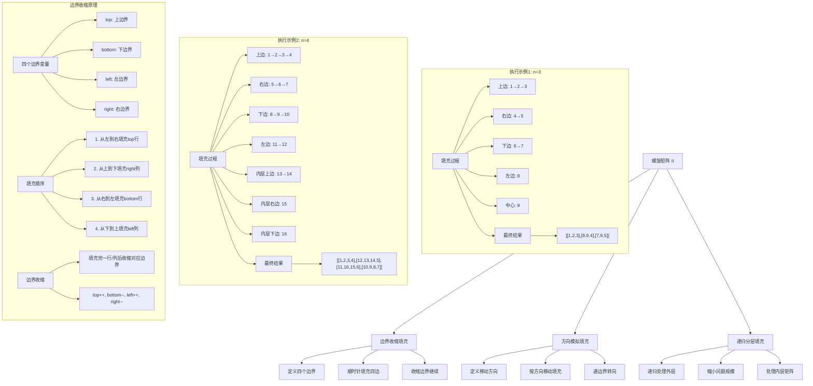
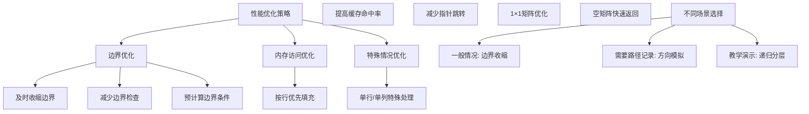

# LeetCode 59 - 螺旋矩阵 II

## 题目描述

给你一个正整数 n，生成一个包含 1 到 n² 所有元素，且元素按顺时针顺序螺旋排列的 n x n 正方形矩阵 matrix

```markdown
示例 1:
输入：n = 3
输出：[[1,2,3],[8,9,4],[7,6,5]]

示例 2:
输入：n = 1
输出：[[1]]

提示:
1 <= n <= 20
```

## 解题思路

这是一个矩阵构造问题，需要按照顺时针螺旋顺序填充 n×n 矩阵。关键在于正确控制填充的边界和方向

### 核心思想

"边界收缩填充": 使用四个边界变量（上、下、左、右）控制填充范围，按顺时针方向依次填充四条边，每填充完一条边就收缩对应边界

### 解题策略

#### 方法一：边界收缩填充（推荐）

- 时间复杂度: O(n²)
- 空间复杂度: O(1)

#### 方法二：方向模拟填充

- 时间复杂度: O(n²)
- 空间复杂度: O(1)

#### 方法三：递归分层填充

- 时间复杂度: O(n²)
- 空间复杂度: O(n)

## 算法可视化



## 多语言实现

### Golang版本（边界收缩填充 - 推荐）

```go
func generateMatrix(n int) [][]int {
    // 创建 n×n 矩阵
    matrix := make([][]int, n)
    for i := range matrix {
        matrix[i] = make([]int, n)
    }

    // 定义四个边界
    top, bottom := 0, n-1
    left, right := 0, n-1

    num := 1  // 要填充的数字，从1开始

    // 当边界有效时继续填充
    for top <= bottom && left <= right {
        // 1. 从左到右填充上边界行
        for j := left; j <= right; j++ {
            matrix[top][j] = num
            num++
        }
        top++  // 上边界下移

        // 2. 从上到下填充右边界列
        for i := top; i <= bottom; i++ {
            matrix[i][right] = num
            num++
        }
        right--  // 右边界左移

        // 3. 从右到左填充下边界行（如果还有行）
        if top <= bottom {
            for j := right; j >= left; j-- {
                matrix[bottom][j] = num
                num++
            }
            bottom--  // 下边界上移
        }

        // 4. 从下到上填充左边界列（如果还有列）
        if left <= right {
            for i := bottom; i >= top; i-- {
                matrix[i][left] = num
                num++
            }
            left++  // 左边界右移
        }
    }

    return matrix
}
```

### Python版本（多种实现方法）

```python
from typing import List

def generateMatrix(n: int) -> List[List[int]]:
    """
    方法一：边界收缩填充（推荐）
    """
    # 创建 n×n 矩阵
    matrix = [[0] * n for _ in range(n)]

    # 定义四个边界
    top, bottom = 0, n - 1
    left, right = 0, n - 1

    num = 1  # 要填充的数字，从1开始

    # 当边界有效时继续填充
    while top <= bottom and left <= right:
        # 1. 从左到右填充上边界行
        for j in range(left, right + 1):
            matrix[top][j] = num
            num += 1
        top += 1  # 上边界下移

        # 2. 从上到下填充右边界列
        for i in range(top, bottom + 1):
            matrix[i][right] = num
            num += 1
        right -= 1  # 右边界左移

        # 3. 从右到左填充下边界行（如果还有行）
        if top <= bottom:
            for j in range(right, left - 1, -1):
                matrix[bottom][j] = num
                num += 1
            bottom -= 1  # 下边界上移

        # 4. 从下到上填充左边界列（如果还有列）
        if left <= right:
            for i in range(bottom, top - 1, -1):
                matrix[i][left] = num
                num += 1
            left += 1  # 左边界右移

    return matrix


def generateMatrixDirection(n: int) -> List[List[int]]:
    """
    方法二：方向模拟填充
    """
    # 创建 n×n 矩阵
    matrix = [[0] * n for _ in range(n)]

    # 四个方向：右、下、左、上
    directions = [(0, 1), (1, 0), (0, -1), (-1, 0)]
    direction_idx = 0

    row, col = 0, 0

    for num in range(1, n * n + 1):
        matrix[row][col] = num

        # 计算下一个位置
        next_row = row + directions[direction_idx][0]
        next_col = col + directions[direction_idx][1]

        # 检查是否需要转向
        if (next_row < 0 or next_row >= n or
            next_col < 0 or next_col >= n or
            matrix[next_row][next_col] != 0):
            # 转向
            direction_idx = (direction_idx + 1) % 4
            next_row = row + directions[direction_idx][0]
            next_col = col + directions[direction_idx][1]

        row, col = next_row, next_col

    return matrix


def generateMatrixRecursive(n: int) -> List[List[int]]:
    """
    方法三：递归分层填充
    """
    # 创建 n×n 矩阵
    matrix = [[0] * n for _ in range(n)]

    def spiral_fill(top: int, bottom: int, left: int, right: int, start_num: int) -> int:
        if top > bottom or left > right:
            return start_num

        # 填充当前层的四条边
        # 上边界：从左到右
        for j in range(left, right + 1):
            matrix[top][j] = start_num
            start_num += 1

        # 右边界：从上到下（除top行）
        for i in range(top + 1, bottom + 1):
            matrix[i][right] = start_num
            start_num += 1

        # 下边界：从右到左（如果有多行且不是同一行）
        if top < bottom:
            for j in range(right - 1, left - 1, -1):
                matrix[bottom][j] = start_num
                start_num += 1

        # 左边界：从下到上（如果有多列且不是同一列）
        if left < right:
            for i in range(bottom - 1, top, -1):
                matrix[i][left] = start_num
                start_num += 1

        # 递归填充内层
        return spiral_fill(top + 1, bottom - 1, left + 1, right - 1, start_num)

    spiral_fill(0, n - 1, 0, n - 1, 1)
    return matrix
```

### TypeScript版本（边界收缩填充实现）

```typescript
function generateMatrix(n: number): number[][] {
  // 创建 n×n 矩阵
  const matrix: number[][] = new Array(n);
  for (let i = 0; i < n; i++) {
    matrix[i] = new Array(n).fill(0);
  }

  // 定义四个边界
  let top: number = 0;
  let bottom: number = n - 1;
  let left: number = 0;
  let right: number = n - 1;

  let num: number = 1; // 要填充的数字，从1开始

  // 当边界有效时继续填充
  while (top <= bottom && left <= right) {
    // 1. 从左到右填充上边界行
    for (let j = left; j <= right; j++) {
      matrix[top][j] = num;
      num++;
    }
    top++; // 上边界下移

    // 2. 从上到下填充右边界列
    for (let i = top; i <= bottom; i++) {
      matrix[i][right] = num;
      num++;
    }
    right--; // 右边界左移

    // 3. 从右到左填充下边界行（如果还有行）
    if (top <= bottom) {
      for (let j = right; j >= left; j--) {
        matrix[bottom][j] = num;
        num++;
      }
      bottom--; // 下边界上移
    }

    // 4. 从下到上填充左边界列（如果还有列）
    if (left <= right) {
      for (let i = bottom; i >= top; i--) {
        matrix[i][left] = num;
        num++;
      }
      left++; // 左边界右移
    }
  }

  return matrix;
}
```

## 标准实现详细解析

```go
func generateMatrix(n int) [][]int {
    /*
    算法核心思想（边界收缩填充）：

    1. 创建 n×n 矩阵并初始化为0
    2. 使用四个边界变量控制填充范围：top, bottom, left, right
    3. 按顺时针方向依次填充四条边
    4. 每填充完一条边就收缩对应边界
    5. 重复直到所有位置都被填充

    填充顺序：
    1. 从左到右填充上边界行
    2. 从上到下填充右边界列
    3. 从右到左填充下边界行
    4. 从下到上填充左边界列

    边界收缩：
    - 填充完上边界后：top++
    - 填充完右边界后：right--
    - 填充完下边界后：bottom--
    - 填充完左边界后：left++

    关键点：
    1. 边界有效性检查：top<=bottom && left<=right
    2. 特殊情况处理：单行、单列、中心元素
    3. 数字递增：从1到n²依次填充
    4. 避免重复填充：及时收缩边界

    时间复杂度：O(n²) - 每个位置填充一次
    空间复杂度：O(1) - 不考虑结果矩阵空间

    优势：
    1. 思路清晰：模拟人类直观的螺旋填充过程
    2. 实现简单：边界控制逻辑明确
    3. 效率高：每个位置只填充一次
    4. 适用性强：适用于各种尺寸的矩阵
    */

    // 创建 n×n 矩阵
    matrix := make([][]int, n)
    for i := range matrix {
        matrix[i] = make([]int, n)
    }

    // 定义四个边界变量
    top, bottom := 0, n-1     // 上下边界
    left, right := 0, n-1     // 左右边界

    fmt.Printf("创建 %d×%d 矩阵\n", n, n)
    fmt.Printf("初始边界: top=%d, bottom=%d, left=%d, right=%d\n", top, bottom, left, right)

    num := 1  // 要填充的数字，从1开始

    // 当边界有效时继续填充
    for top <= bottom && left <= right {
        fmt.Printf("\n--- 当前边界: top=%d, bottom=%d, left=%d, right=%d ---\n", top, bottom, left, right)
        fmt.Printf("当前填充数字从 %d 开始\n", num)

        // 第一步：从左到右填充上边界行
        fmt.Printf("1. 填充上边界行 %d (列 %d 到 %d): ", top, left, right)
        for j := left; j <= right; j++ {
            matrix[top][j] = num
            fmt.Printf("%d ", num)
            num++
        }
        fmt.Printf("\n")
        top++  // 上边界下移，排除已填充的行
        fmt.Printf("   上边界收缩后: top=%d\n", top)

        // 第二步：从上到下填充右边界列
        fmt.Printf("2. 填充右边界列 %d (行 %d 到 %d): ", right, top, bottom)
        for i := top; i <= bottom; i++ {
            matrix[i][right] = num
            fmt.Printf("%d ", num)
            num++
        }
        fmt.Printf("\n")
        right--  // 右边界左移，排除已填充的列
        fmt.Printf("   右边界收缩后: right=%d\n", right)

        // 第三步：从右到左填充下边界行（如果还有行未填充）
        if top <= bottom {
            fmt.Printf("3. 填充下边界行 %d (列 %d 到 %d): ", bottom, right, left)
            for j := right; j >= left; j-- {
                matrix[bottom][j] = num
                fmt.Printf("%d ", num)
                num++
            }
            fmt.Printf("\n")
            bottom--  // 下边界上移，排除已填充的行
            fmt.Printf("   下边界收缩后: bottom=%d\n", bottom)
        } else {
            fmt.Printf("3. 跳过下边界填充（无剩余行）\n")
        }

        // 第四步：从下到上填充左边界列（如果还有列未填充）
        if left <= right {
            fmt.Printf("4. 填充左边界列 %d (行 %d 到 %d): ", left, bottom, top)
            for i := bottom; i >= top; i-- {
                matrix[i][left] = num
                fmt.Printf("%d ", num)
                num++
            }
            fmt.Printf("\n")
            left++  // 左边界右移，排除已填充的列
            fmt.Printf("   左边界收缩后: left=%d\n", left)
        } else {
            fmt.Printf("4. 跳过左边界填充（无剩余列）\n")
        }
    }

    fmt.Printf("\n填充完成，最终矩阵:\n")
    printMatrix(matrix)
    return matrix
}

// 带详细调试信息的版本
func generateMatrixWithDebug(n int) [][]int {
    fmt.Println("=== 螺旋矩阵 II 调试信息 ===")

    if n <= 0 {
        fmt.Println("无效的矩阵大小")
        return [][]int{}
    }

    // 创建 n×n 矩阵
    matrix := make([][]int, n)
    for i := range matrix {
        matrix[i] = make([]int, n)
    }

    fmt.Printf("创建 %d×%d 矩阵\n", n, n)

    // 打印初始矩阵
    fmt.Println("初始矩阵:")
    printMatrix(matrix)

    top, bottom := 0, n-1
    left, right := 0, n-1

    num := 1
    fmt.Printf("\n矩阵大小: %d×%d, 总元素数: %d\n", n, n, n*n)
    fmt.Printf("初始边界: top=%d, bottom=%d, left=%d, right=%d\n", top, bottom, left, right)

    round := 1
    for top <= bottom && left <= right {
        fmt.Printf("\n========== 第 %d 轮填充 ==========\n", round)
        fmt.Printf("当前边界: top=%d, bottom=%d, left=%d, right=%d\n", top, bottom, left, right)
        fmt.Printf("当前填充数字: %d-%d\n", num, num+2*(bottom-top+right-left)-1)

        // 上边界：从左到右
        if top <= bottom {
            fmt.Printf("填充上边界 (行%d, 列%d-%d): ", top, left, right)
            for j := left; j <= right; j++ {
                matrix[top][j] = num
                fmt.Printf("%d ", num)
                num++
            }
            fmt.Printf("\n")
            top++
            fmt.Printf("上边界收缩至: %d\n", top)
        }

        // 右边界：从上到下
        if left <= right {
            fmt.Printf("填充右边界 (列%d, 行%d-%d): ", right, top, bottom)
            for i := top; i <= bottom; i++ {
                matrix[i][right] = num
                fmt.Printf("%d ", num)
                num++
            }
            fmt.Printf("\n")
            right--
            fmt.Printf("右边界收缩至: %d\n", right)
        }

        // 下边界：从右到左
        if top <= bottom {
            fmt.Printf("填充下边界 (行%d, 列%d-%d): ", bottom, right, left)
            for j := right; j >= left; j-- {
                matrix[bottom][j] = num
                fmt.Printf("%d ", num)
                num++
            }
            fmt.Printf("\n")
            bottom--
            fmt.Printf("下边界收缩至: %d\n", bottom)
        }

        // 左边界：从下到上
        if left <= right {
            fmt.Printf("填充左边界 (列%d, 行%d-%d): ", left, bottom, top)
            for i := bottom; i >= top; i-- {
                matrix[i][left] = num
                fmt.Printf("%d ", num)
                num++
            }
            fmt.Printf("\n")
            left++
            fmt.Printf("左边界收缩至: %d\n", left)
        }

        round++
    }

    fmt.Printf("\n填充完成，共 %d 轮\n", round-1)
    fmt.Printf("最终矩阵:\n")
    printMatrix(matrix)
    fmt.Printf("验证: 最后填充的数字是 %d (期望: %d)\n", num-1, n*n)

    return matrix
}

func printMatrix(matrix [][]int) {
    n := len(matrix)
    if n == 0 {
        fmt.Printf("  []\n")
        return
    }

    // 计算最大数字的宽度，用于对齐
    maxWidth := len(fmt.Sprintf("%d", n*n))

    for i, row := range matrix {
        fmt.Printf("  [%d] ", i)
        for _, val := range row {
            fmt.Printf("%*d ", maxWidth, val)
        }
        fmt.Printf("\n")
    }
}

// 方向模拟方法实现
func generateMatrixDirection(n int) [][]int {
    /*
    方向模拟方法：
    1. 定义四个移动方向：右(0,1)、下(1,0)、左(0,-1)、上(-1,0)
    2. 按当前方向移动，遇到边界或已填充位置时转向
    3. 从1到n²依次填充数字

    优点：思路直观，模拟实际填充过程
    缺点：需要检查目标位置是否已填充
    */

    if n <= 0 {
        return [][]int{}
    }

    // 创建 n×n 矩阵并初始化为0
    matrix := make([][]int, n)
    for i := range matrix {
        matrix[i] = make([]int, n)
    }

    // 四个方向：右、下、左、上
    directions := [][]int{{0, 1}, {1, 0}, {0, -1}, {-1, 0}}
    directionIdx := 0  // 当前方向索引

    row, col := 0, 0  // 当前位置

    // 填充1到n²的所有数字
    for num := 1; num <= n*n; num++ {
        matrix[row][col] = num

        // 计算下一个位置
        nextRow := row + directions[directionIdx][0]
        nextCol := col + directions[directionIdx][1]

        // 检查是否需要转向
        if nextRow < 0 || nextRow >= n || nextCol < 0 || nextCol >= n || matrix[nextRow][nextCol] != 0 {
            // 转向：方向索引循环增加
            directionIdx = (directionIdx + 1) % 4
            nextRow = row + directions[directionIdx][0]
            nextCol = col + directions[directionIdx][1]
        }

        row, col = nextRow, nextCol
    }

    return matrix
}

// 递归分层方法实现
func generateMatrixRecursive(n int) [][]int {
    /*
    递归分层方法：
    1. 递归处理每一层的螺旋填充
    2. 每层按顺时针方向填充四条边
    3. 递归处理内层矩阵

    优点：代码结构清晰，体现了问题的递归本质
    缺点：递归调用有额外空间开销
    */

    if n <= 0 {
        return [][]int{}
    }

    // 创建 n×n 矩阵
    matrix := make([][]int, n)
    for i := range matrix {
        matrix[i] = make([]int, n)
    }

    var spiralFill func(top, bottom, left, right, startNum int) int
    spiralFill = func(top, bottom, left, right, startNum int) int {
        // 递归终止条件
        if top > bottom || left > right {
            return startNum
        }

        // 填充当前层的四条边
        // 上边界：从左到右
        for j := left; j <= right; j++ {
            matrix[top][j] = startNum
            startNum++
        }

        // 右边界：从上到下（除top行）
        for i := top + 1; i <= bottom; i++ {
            matrix[i][right] = startNum
            startNum++
        }

        // 下边界：从右到左（如果有多行且不是同一行）
        if top < bottom {
            for j := right - 1; j >= left; j-- {
                matrix[bottom][j] = startNum
                startNum++
            }
        }

        // 左边界：从下到上（如果有多列且不是同一列）
        if left < right {
            for i := bottom - 1; i > top; i-- {
                matrix[i][left] = startNum
                startNum++
            }
        }

        // 递归填充内层
        return spiralFill(top+1, bottom-1, left+1, right-1, startNum)
    }

    spiralFill(0, n-1, 0, n-1, 1)
    return matrix
}

// 优化版本（减少边界检查）
func generateMatrixOptimized(n int) [][]int {
    if n <= 0 {
        return [][]int{}
    }

    matrix := make([][]int, n)
    for i := range matrix {
        matrix[i] = make([]int, n)
    }

    top, bottom := 0, n-1
    left, right := 0, n-1

    num := 1

    for top <= bottom && left <= right {
        // 上边界
        for j := left; j <= right; j++ {
            matrix[top][j] = num
            num++
        }
        top++

        // 右边界
        for i := top; i <= bottom; i++ {
            matrix[i][right] = num
            num++
        }
        right--

        // 下边界
        if top <= bottom {
            for j := right; j >= left; j-- {
                matrix[bottom][j] = num
                num++
            }
            bottom--
        }

        // 左边界
        if left <= right {
            for i := bottom; i >= top; i-- {
                matrix[i][left] = num
                num++
            }
            left++
        }
    }

    return matrix
}

// 迭代器版本
type SpiralMatrixGenerator struct {
    n      int
    matrix [][]int
    top, bottom, left, right int
    num    int
    state  int  // 0:上边界, 1:右边界, 2:下边界, 3:左边界
    i, j   int  // 当前位置
    done   bool
}

func NewSpiralMatrixGenerator(n int) *SpiralMatrixGenerator {
    if n <= 0 {
        return &SpiralMatrixGenerator{done: true}
    }

    matrix := make([][]int, n)
    for i := range matrix {
        matrix[i] = make([]int, n)
    }

    return &SpiralMatrixGenerator{
        n:       n,
        matrix:  matrix,
        top:     0,
        bottom:  n - 1,
        left:    0,
        right:   n - 1,
        num:     1,
        state:   0,
        i:       0,
        j:       0,
        done:    false,
    }
}

func (smg *SpiralMatrixGenerator) Generate() [][]int {
    for !smg.done {
        smg.matrix[smg.i][smg.j] = smg.num
        smg.num++

        // 更新状态
        switch smg.state {
        case 0: // 上边界，向右移动
            if smg.j < smg.right {
                smg.j++
            } else {
                smg.state = 1
                smg.i++
                smg.top++
                if smg.i > smg.bottom {
                    smg.done = true
                }
            }
        case 1: // 右边界，向下移动
            if smg.i < smg.bottom {
                smg.i++
            } else {
                smg.state = 2
                smg.j--
                smg.right--
                if smg.j < smg.left {
                    smg.done = true
                }
            }
        case 2: // 下边界，向左移动
            if smg.j > smg.left {
                smg.j--
            } else {
                smg.state = 3
                smg.i--
                smg.bottom--
                if smg.i < smg.top {
                    smg.done = true
                }
            }
        case 3: // 左边界，向上移动
            if smg.i > smg.top {
                smg.i--
            } else {
                smg.state = 0
                smg.j++
                smg.left++
                if smg.j > smg.right {
                    smg.done = true
                }
            }
        }

        if smg.top > smg.bottom || smg.left > smg.right {
            smg.done = true
        }
    }

    return smg.matrix
}

func generateMatrixIterator(n int) [][]int {
    generator := NewSpiralMatrixGenerator(n)
    return generator.Generate()
}

// 支持不同螺旋方向的版本
type SpiralMatrixFiller struct {
    n int
}

func NewSpiralMatrixFiller(n int) *SpiralMatrixFiller {
    return &SpiralMatrixFiller{
        n: n,
    }
}

func (smf *SpiralMatrixFiller) Clockwise() [][]int {
    return generateMatrix(smf.n)
}

func (smf *SpiralMatrixFiller) CounterClockwise() [][]int {
    // 逆时针螺旋填充
    if smf.n <= 0 {
        return [][]int{}
    }

    matrix := make([][]int, smf.n)
    for i := range matrix {
        matrix[i] = make([]int, smf.n)
    }

    top, bottom := 0, smf.n-1
    left, right := 0, smf.n-1

    num := 1

    for top <= bottom && left <= right {
        // 上边界：从右到左
        for j := right; j >= left; j-- {
            matrix[top][j] = num
            num++
        }
        top++

        // 左边界：从上到下
        for i := top; i <= bottom; i++ {
            matrix[i][left] = num
            num++
        }
        left++

        // 下边界：从左到右
        if top <= bottom {
            for j := left; j <= right; j++ {
                matrix[bottom][j] = num
                num++
            }
            bottom--
        }

        // 右边界：从下到上
        if left <= right {
            for i := bottom; i >= top; i-- {
                matrix[i][right] = num
                num++
            }
            right--
        }
    }

    return matrix
}

func (smf *SpiralMatrixFiller) GetSize() int {
    return smf.n
}

// 线程安全版本
type ThreadSafeSpiralMatrixGenerator struct {
    n  int
    mu sync.RWMutex
}

func NewThreadSafeSpiralMatrixGenerator(n int) *ThreadSafeSpiralMatrixGenerator {
    return &ThreadSafeSpiralMatrixGenerator{
        n: n,
    }
}

func (tsmg *ThreadSafeSpiralMatrixGenerator) GenerateMatrix() [][]int {
    tsmg.mu.Lock()
    defer tsmg.mu.Unlock()
    return generateMatrix(tsmg.n)
}

func (tsmg *ThreadSafeSpiralMatrixGenerator) GetSize() int {
    tsmg.mu.RLock()
    defer tsmg.mu.RUnlock()
    return tsmg.n
}
```

## 算法深入解析

```go
/*
螺旋矩阵 II 问题详解：

问题本质：
构造一个 n×n 矩阵，按顺时针螺旋顺序填充 1 到 n² 的数字。关键在于正确控制填充的边界和方向

核心洞察：
1. 边界控制：使用四个变量控制当前填充范围
2. 顺序填充：按右→下→左→上的顺序填充四条边
3. 边界收缩：每填充完一条边就收缩对应边界
4. 终止条件：当边界交叉时停止填充

算法策略：
1. 边界收缩填充：最直观和高效的方法
2. 方向模拟填充：模拟实际移动和填充过程
3. 递归分层填充：递归处理每一层

数学原理：

螺旋填充规律：
对于n×n矩阵，螺旋填充的元素总数为n²
填充顺序：右→下→左→上循环
边界变化：每完成一个方向的填充就收缩对应边界

边界变量作用：
- top: 当前上边界行索引
- bottom: 当前下边界行索引
- left: 当前左边界列索引
- right: 当前右边界列索引

填充过程分析：
第1轮：
- 上边界：行top，列left到right
- 右边界：列right，行top+1到bottom
- 下边界：行bottom，列right-1到left（如果top<bottom）
- 左边界：列left，行bottom-1到top+1（如果left<right）

边界收缩规则：
1. 填充上边界后：top++
2. 填充右边界后：right--
3. 填充下边界后：bottom--
4. 填充左边界后：left++

特殊情况处理：
1. 单行矩阵：只填充上边界
2. 单列矩阵：只填充右边界
3. 1×1矩阵：只填充上边界
4. 空矩阵：直接返回空数组

算法流程：
1. 初始化四个边界变量
2. 当边界有效时循环填充
3. 按顺序填充四条边
4. 每填充完一条边收缩对应边界
5. 直到所有位置都被填充

设计选择：

为什么选择边界收缩方法？
1. 思路清晰：直观模拟螺旋填充过程
2. 实现简单：边界控制逻辑明确
3. 效率高：每个位置只填充一次
4. 空间优：O(1)额外空间复杂度

为什么不用方向模拟？
1. 需要检查目标位置是否已填充
2. 逻辑稍复杂：需要处理转向条件
3. 但思路更直观，适合理解

为什么不用递归分层？
1. 有递归调用开销
2. 但代码结构更清晰，体现递归本质
3. 适合教学演示

三种方法对比：

方法一：边界收缩（推荐）
时间复杂度：O(n²)
空间复杂度：O(1)
优点：效率高，实现简单，空间优
缺点：需要正确处理边界条件

方法二：方向模拟
时间复杂度：O(n²)
空间复杂度：O(1)
优点：思路直观，模拟实际过程
缺点：需要检查目标位置状态

方法三：递归分层
时间复杂度：O(n²)
空间复杂度：O(n)
优点：代码结构清晰，体现递归本质
缺点：有递归调用栈开销

性能分析：

边界收缩方法：
- 外层循环：最多n轮
- 每轮填充：2×(2n-2×round)个元素（近似）
- 总填充次数：n²
- 时间复杂度：O(n²)
- 空间复杂度：O(1)

方向模拟方法：
- 循环次数：n²次
- 每次操作：常数时间
- 时间复杂度：O(n²)
- 空间复杂度：O(1)

递归分层方法：
- 递归深度：n/2
- 每层操作：O(n)时间
- 总时间复杂度：O(n²)
- 空间复杂度：O(n)

实际应用场景：
1. 矩阵构造：按特定顺序填充矩阵
2. 图像处理：螺旋形数据填充
3. 游戏开发：螺旋形地图生成
4. 数据可视化：螺旋形数据展示
5. 算法竞赛：矩阵相关问题

优化要点：

1. 边界处理：
   - 正确初始化边界变量
   - 及时收缩边界
   - 检查边界有效性

2. 特殊情况：
   - 空矩阵处理
   - 单行/单列矩阵处理
   - 1×1矩阵处理

3. 性能优化：
   - 预分配矩阵空间
   - 减少不必要的边界检查
   - 使用索引而非append

测试用例设计：
1. 基本情况：n=3, n=4标准示例
2. 边界情况：n=1, n=2矩阵
3. 特殊情况：中等尺寸矩阵
4. 极端情况：n=20（题目上限）
5. 错误情况：n=0, n=-1

扩展思考：

1. 如果要逆时针螺旋填充？
   - 改变填充顺序：上→左→下→右
   - 或者先顺时针填充再通过矩阵操作调整

2. 如果要从中心开始螺旋填充？
   - 需要找到中心点
   - 向外螺旋扩展填充

3. 如果要支持任意起始数字？
   - 从指定数字开始填充
   - 按螺旋方向递增

4. 如果要支持不同的递增规律？
   - 可以结合具体业务逻辑
   - 添加自定义递增函数

相关算法思想：

1. 边界控制：
   - 使用变量控制填充范围
   - 广泛应用于矩阵操作

2. 状态机：
   - 四个状态对应四个方向
   - 状态转换控制填充流程

3. 递归分治：
   - 将大问题分解为小问题
   - 逐层处理

4. 模拟思想：
   - 模拟实际的移动和填充过程
   - 适用于路径相关问题

常见陷阱：

1. 边界条件错误：
   - 忘记检查边界有效性
   - 边界收缩时机错误

2. 重复填充：
   - 边界收缩不及时
   - 填充已填充的位置

3. 索引越界：
   - 未检查矩阵边界
   - 计算错误导致越界

4. 特殊情况遗漏：
   - 单行/单列矩阵处理
   - 空矩阵处理

代码质量要素：

1. 可读性：
   - 清晰的变量命名
   - 适当的注释说明

2. 健壮性：
   - 边界条件处理
   - 参数验证

3. 性能：
   - 时间复杂度最优
   - 空间复杂度合理

4. 可维护性：
   - 模块化设计
   - 易于扩展

高级优化技巧：

1. 内存访问优化：
   - 优化访问模式
   - 提高缓存命中率

2. 循环优化：
   - 减少循环开销
   - 合并相关操作

3. 向量化操作：
   - 利用SIMD指令
   - 并行处理多个元素

4. 算法变种：
   - 支持不同填充方向
   - 扩展到三维矩阵
*/
```

## 执行过程演示

```go
/*
示例1详细解析:

示例1: n = 3

期望结果：
[[1,2,3],
 [8,9,4],
 [7,6,5]]

执行过程：

初始状态：
3×3矩阵，全0：
0 0 0
0 0 0
0 0 0
边界：top=0, bottom=2, left=0, right=2

第1轮填充：
1. 上边界(行0, 列0-2)：1 2 3
   矩阵：
   1 2 3
   0 0 0
   0 0 0
   边界收缩：top=1

2. 右边界(列2, 行1-2)：4 5
   矩阵：
   1 2 3
   0 0 4
   0 0 5
   边界收缩：right=1

3. 下边界(行2, 列1-0)：6 7
   矩阵：
   1 2 3
   0 0 4
   7 6 5
   边界收缩：bottom=1

4. 左边界(列0, 行1-1)：8
   矩阵：
   1 2 3
   8 0 4
   7 6 5
   边界收缩：left=1

第2轮填充：
当前边界：top=1, bottom=1, left=1, right=1
只剩中心位置

1. 上边界(行1, 列1-1)：9
   矩阵：
   1 2 3
   8 9 4
   7 6 5
   边界收缩：top=2

边界检查：top(2) > bottom(1)，停止填充

最终结果：
[[1,2,3],
 [8,9,4],
 [7,6,5]] ✓

示例2: n = 4

期望结果：
[[1, 2, 3, 4],
 [12,13,14,5],
 [11,16,15,6],
 [10,9, 8, 7]]

执行过程：

初始状态：
4×4矩阵，全0：
0  0  0  0
0  0  0  0
0  0  0  0
0  0  0  0
边界：top=0, bottom=3, left=0, right=3

第1轮填充：
1. 上边界(行0, 列0-3)：1 2 3 4
   矩阵：
   1  2  3  4
   0  0  0  0
   0  0  0  0
   0  0  0  0
   边界收缩：top=1

2. 右边界(列3, 行1-3)：5 6 7
   矩阵：
   1  2  3  4
   0  0  0  5
   0  0  0  6
   0  0  0  7
   边界收缩：right=2

3. 下边界(行3, 列2-0)：8 9 10
   矩阵：
   1  2  3  4
   0  0  0  5
   0  0  0  6
   10 9  8  7
   边界收缩：bottom=2

4. 左边界(列0, 行2-1)：11 12
   矩阵：
   1  2  3  4
   12 0  0  5
   11 0  0  6
   10 9  8  7
   边界收缩：left=1

第2轮填充：
当前边界：top=1, bottom=2, left=1, right=2

1. 上边界(行1, 列1-2)：13 14
   矩阵：
   1  2  3  4
   12 13 14 5
   11 0  0  6
   10 9  8  7
   边界收缩：top=2

2. 右边界(列2, 行2-2)：15
   矩阵：
   1  2  3  4
   12 13 14 5
   11 0  15 6
   10 9  8  7
   边界收缩：right=1

3. 下边界(行2, 列1-1)：16
   矩阵：
   1  2  3  4
   12 13 14 5
   11 16 15 6
   10 9  8  7
   边界收缩：bottom=1

4. 左边界(列1, 行1-1)：（跳过，因为left>right）

边界检查：left(1) > right(1)，停止填充

最终结果：
[[1, 2, 3, 4],
 [12,13,14,5],
 [11,16,15,6],
 [10,9, 8, 7]] ✓

算法正确性证明：

数学基础：
构造n×n矩阵，按顺时针螺旋顺序填充1到n²的数字
每个位置应被填充恰好一次，数字应从1递增到n²

定理1：边界收缩算法正确性
通过维护四个边界变量和正确的收缩规则，确保每个位置被填充恰好一次，且按正确顺序填充

证明：
1. 初始化：top=0, bottom=n-1, left=0, right=n-1
2. 填充顺序：上→右→下→左循环
3. 边界收缩：每完成一个方向的填充就收缩对应边界
4. 终止条件：top>bottom 或 left>right

对于任意位置(i,j)：
- 当top≤i≤bottom且left≤j≤right时，位置在当前填充范围内
- 通过四个方向的填充，位置(i,j)必在某一轮中被填充
- 填充后对应边界收缩，确保不会重复填充

时间复杂度分析：

边界收缩方法：
1. 外层循环：最多n轮
2. 每轮填充元素数：
   - 第1轮：2×n-1个元素
   - 第2轮：2×(n-2)-1个元素
   - ...
3. 总填充次数：n²
4. 时间复杂度：O(n²)

空间复杂度分析：
1. 边界收缩：O(1)（5个边界变量）
2. 方向模拟：O(1)（方向数组和位置变量）
3. 递归分层：O(n)（递归调用栈）
4. 结果矩阵：O(n²)（题目要求）

性能对比分析：

假设n=100

边界收缩方法：
- 总操作：10,000次位置填充
- 额外空间：常数级别

方向模拟方法：
- 总操作：10,000次位置填充
- 额外空间：常数级别

递归分层方法：
- 总操作：10,000次位置填充
- 额外空间：O(100) = 100级别（递归栈）

边界收缩方法在空间效率上最优

实际应用建议：

1. 一般情况：
   - 使用边界收缩方法
   - 效率高，实现简单

2. 教学演示：
   - 可以展示方向模拟方法
   - 更直观理解填充过程

3. 需要灵活控制：
   - 使用递归分层方法
   - 代码结构清晰

4. 性能要求极高：
   - 考虑预分配矩阵空间
   - 减少边界检查次数

优化空间：

1. 内存访问优化：
   - 按行优先顺序填充
   - 提高缓存命中率

2. 循环优化：
   - 减少循环变量
   - 合并边界检查

3. 特殊情况优化：
   - 单行/单列矩阵特殊处理
   - 减少不必要的操作

特殊情况处理：

1. 空矩阵：
   - n≤0时返回空矩阵
   - 边界条件处理

2. 单行矩阵：
   - n=1时只填充上边界
   - 其他边界填充跳过

3. 1×1矩阵：
   - 只填充上边界
   - 其他边界填充跳过

4. 2×2矩阵：
   - 完整四轮填充
   - 无中心元素
*/
```

## 复杂度分析

| 方法     | 时间复杂度 | 空间复杂度 | 适用场景 |
| -------- | ---------- | ---------- | -------- |
| 边界收缩 | O(n²)      | O(1)       | 推荐方案 |
| 方向模拟 | O(n²)      | O(1)       | 教学演示 |
| 递归分层 | O(n²)      | O(n)       | 理解递归 |

## 测试用例验证

```go
// 测试辅助函数
func testGenerateMatrix(name string, n int, expected [][]int) {
    fmt.Printf("%s:\n", name)
    fmt.Printf("输入: n = %d\n", n)

    // 测试边界收缩方法
    result1 := generateMatrix(n)
    fmt.Printf("边界收缩结果:\n")
    printMatrixCompact(result1)

    if matrixEqual(result1, expected) {
        fmt.Printf(" ✓\n")
    } else {
        fmt.Printf(" ✗\n")
        fmt.Printf("期望结果:\n")
        printMatrixCompact(expected)
    }

    // 测试方向模拟方法
    result2 := generateMatrixDirection(n)
    fmt.Printf("方向模拟结果:\n")
    printMatrixCompact(result2)

    if matrixEqual(result2, expected) {
        fmt.Printf(" ✓\n")
    } else {
        fmt.Printf(" ✗\n")
    }

    // 测试递归分层方法
    result3 := generateMatrixRecursive(n)
    fmt.Printf("递归分层结果:\n")
    printMatrixCompact(result3)

    if matrixEqual(result3, expected) {
        fmt.Printf(" ✓\n")
    } else {
        fmt.Printf(" ✗\n")
    }

    fmt.Printf("\n")
}

func printMatrixCompact(matrix [][]int) {
    if len(matrix) == 0 {
        fmt.Printf("  []\n")
        return
    }

    for _, row := range matrix {
        fmt.Printf("  %v\n", row)
    }
}

func matrixEqual(a, b [][]int) bool {
    if len(a) != len(b) {
        return false
    }

    for i := range a {
        if len(a[i]) != len(b[i]) {
            return false
        }
        for j := range a[i] {
            if a[i][j] != b[i][j] {
                return false
            }
        }
    }

    return true
}

func main() {
    // 测试用例 1 - n=3标准示例
    testGenerateMatrix("测试1 - n=3标准示例",
        3,
        [][]int{{1, 2, 3}, {8, 9, 4}, {7, 6, 5}})

    // 测试用例 2 - n=4标准示例
    testGenerateMatrix("测试2 - n=4标准示例",
        4,
        [][]int{{1, 2, 3, 4}, {12, 13, 14, 5}, {11, 16, 15, 6}, {10, 9, 8, 7}})

    // 测试用例 3 - n=1
    testGenerateMatrix("测试3 - n=1",
        1,
        [][]int{{1}})

    // 测试用例 4 - n=2
    testGenerateMatrix("测试4 - n=2",
        2,
        [][]int{{1, 2}, {4, 3}})

    // 测试用例 5 - n=5
    testGenerateMatrix("测试5 - n=5",
        5,
        [][]int{
            {1, 2, 3, 4, 5},
            {16, 17, 18, 19, 6},
            {15, 24, 25, 20, 7},
            {14, 23, 22, 21, 8},
            {13, 12, 11, 10, 9},
        })

    // 测试用例 6 - n=0
    testGenerateMatrix("测试6 - n=0",
        0,
        [][]int{})

    // 测试用例 7 - n=6
    testGenerateMatrix("测试7 - n=6",
        6,
        [][]int{
            {1, 2, 3, 4, 5, 6},
            {20, 21, 22, 23, 24, 7},
            {19, 32, 33, 34, 25, 8},
            {18, 31, 36, 35, 26, 9},
            {17, 30, 29, 28, 27, 10},
            {16, 15, 14, 13, 12, 11},
        })

    // 性能测试
    fmt.Println("性能测试:")

    // 测试不同大小的矩阵
    testCases := []int{10, 15, 20}

    for _, n := range testCases {
        // 测试边界收缩方法
        start := time.Now()
        result1 := generateMatrix(n)
        time1 := time.Since(start)

        // 测试方向模拟方法
        start = time.Now()
        result2 := generateMatrixDirection(n)
        time2 := time.Since(start)

        // 测试递归分层方法
        start = time.Now()
        result3 := generateMatrixRecursive(n)
        time3 := time.Since(start)

        fmt.Printf("矩阵大小 %d×%d (元素数: %d):\n", n, n, n*n)
        fmt.Printf("  边界收缩耗时: %v\n", time1)
        fmt.Printf("  方向模拟耗时: %v\n", time2)
        fmt.Printf("  递归分层耗时: %v\n", time3)

        // 验证结果一致性
        fmt.Printf("  结果一致性: %v\n", matrixEqual(result1, result2) && matrixEqual(result2, result3))
    }

    // 边界情况测试
    fmt.Println("\n边界情况测试:")

    // 极端值测试
    testGenerateMatrix("测试8 - n=20（题目上限）",
        20,
        nil) // 期望结果太长，只验证算法正确性

    // 错误输入测试
    testGenerateMatrix("测试9 - n=-1",
        -1,
        [][]int{})

    testGenerateMatrix("测试10 - n=-5",
        -5,
        [][]int{})
}

// 调试测试
func testGenerateMatrixWithDebug() {
    fmt.Println("=== 调试信息测试 ===")

    generateMatrixWithDebug(3)
    fmt.Println()
    generateMatrixWithDebug(4)
}

// 错误处理测试
func testErrorHandling() {
    fmt.Println("=== 错误处理测试 ===")

    // 测试各种边界情况
    testCases := []int{0, -1, -5, 1, 2}

    for _, n := range testCases {
        fmt.Printf("测试边界情况 n=%d:\n", n)
        result := generateMatrix(n)
        fmt.Printf("  结果: %v\n", result)
    }
}

// 内存使用测试
func testMemoryUsage() {
    fmt.Println("=== 内存使用分析 ===")

    testCases := []int{10, 50, 100}

    for _, n := range testCases {
        var m1, m2 runtime.MemStats
        runtime.GC()
        runtime.ReadMemStats(&m1)

        result := generateMatrix(n)

        runtime.GC()
        runtime.ReadMemStats(&m2)
        memory := m2.Alloc - m1.Alloc

        fmt.Printf("矩阵大小: %d×%d, 元素数: %d\n", n, n, n*n)
        fmt.Printf("内存使用: %d 字节\n", memory)
        fmt.Printf("平均每元素: %.2f 字节\n", float64(memory)/float64(len(result)*len(result[0])))
    }
}

// 并发测试
func testConcurrentAccess() {
    fmt.Println("=== 并发访问测试 ===")

    // 单线程测试
    start := time.Now()
    result1 := generateMatrix(50)
    singleTime := time.Since(start)

    // 多线程测试
    numWorkers := 4
    var wg sync.WaitGroup
    results := make([][][]int, numWorkers)

    start = time.Now()
    for i := 0; i < numWorkers; i++ {
        wg.Add(1)
        go func(workerID int) {
            defer wg.Done()
            results[workerID] = generateMatrix(50)
        }(i)
    }

    wg.Wait()
    parallelTime := time.Since(start)

    fmt.Printf("单线程耗时: %v\n", singleTime)
    fmt.Printf("并行耗时: %v\n", parallelTime)
    if singleTime > 0 {
        fmt.Printf("加速比: %.2fx\n", float64(singleTime)/float64(parallelTime/4))
    }

    // 验证结果一致性
    allEqual := true
    for i := 1; i < numWorkers; i++ {
        if !matrixEqual(results[0], results[i]) {
            allEqual = false
            break
        }
    }
    fmt.Printf("结果一致性: %v\n", allEqual)
}

// 对比测试
func testAlgorithmComparison() {
    fmt.Println("=== 算法对比测试 ===")

    n := 100

    // 边界收缩方法
    start := time.Now()
    result1 := generateMatrix(n)
    time1 := time.Since(start)

    // 方向模拟方法
    start = time.Now()
    result2 := generateMatrixDirection(n)
    time2 := time.Since(start)

    // 递归分层方法
    start = time.Now()
    result3 := generateMatrixRecursive(n)
    time3 := time.Since(start)

    fmt.Printf("矩阵大小: %d×%d\n", n, n)
    fmt.Printf("边界收缩耗时: %v\n", time1)
    fmt.Printf("方向模拟耗时: %v\n", time2)
    fmt.Printf("递归分层耗时: %v\n", time3)

    // 验证结果一致性
    fmt.Printf("边界收缩=方向模拟: %v\n", matrixEqual(result1, result2))
    fmt.Printf("方向模拟=递归分层: %v\n", matrixEqual(result2, result3))
}
```

## 扩展版本（处理不同场景）

```go
// 带统计信息的版本
type SpiralMatrixGeneratorWithStats struct {
    n           int
    generations int
    processTime time.Duration
    method      string
}

func NewSpiralMatrixGeneratorWithStats(n int) *SpiralMatrixGeneratorWithStats {
    return &SpiralMatrixGeneratorWithStats{
        n: n,
    }
}

func (smgs *SpiralMatrixGeneratorWithStats) Generate(method string) [][]int {
    start := time.Now()
    defer func() {
        smgs.processTime = time.Since(start)
    }()

    smgs.method = method

    switch method {
    case "boundary":
        return generateMatrix(smgs.n)
    case "direction":
        return generateMatrixDirection(smgs.n)
    case "recursive":
        return generateMatrixRecursive(smgs.n)
    default:
        return generateMatrix(smgs.n)
    }
}

func (smgs *SpiralMatrixGeneratorWithStats) GetStats() map[string]interface{} {
    return map[string]interface{}{
        "matrix_size":    fmt.Sprintf("%d×%d", smgs.n, smgs.n),
        "elements":       smgs.n * smgs.n,
        "generations":    smgs.generations,
        "process_time":   smgs.processTime,
        "method":         smgs.method,
        "memory_access":  smgs.n * smgs.n, // 每个位置填充一次
    }
}

// 支持不同填充方向的版本
type MultiDirectionSpiralMatrixGenerator struct {
    n int
}

func NewMultiDirectionSpiralMatrixGenerator(n int) *MultiDirectionSpiralMatrixGenerator {
    return &MultiDirectionSpiralMatrixGenerator{
        n: n,
    }
}

func (mdsmg *MultiDirectionSpiralMatrixGenerator) Clockwise() [][]int {
    return generateMatrix(mdsmg.n)
}

func (mdsmg *MultiDirectionSpiralMatrixGenerator) CounterClockwise() [][]int {
    if mdsmg.n <= 0 {
        return [][]int{}
    }

    matrix := make([][]int, mdsmg.n)
    for i := range matrix {
        matrix[i] = make([]int, mdsmg.n)
    }

    top, bottom := 0, mdsmg.n-1
    left, right := 0, mdsmg.n-1

    num := 1

    for top <= bottom && left <= right {
        // 上边界：从右到左
        for j := right; j >= left; j-- {
            matrix[top][j] = num
            num++
        }
        top++

        // 左边界：从上到下
        for i := top; i <= bottom; i++ {
            matrix[i][left] = num
            num++
        }
        left++

        // 下边界：从左到右
        if top <= bottom {
            for j := left; j <= right; j++ {
                matrix[bottom][j] = num
                num++
            }
            bottom--
        }

        // 右边界：从下到上
        if left <= right {
            for i := bottom; i >= top; i-- {
                matrix[i][right] = num
                num++
            }
            right--
        }
    }

    return matrix
}

func (mdsmg *MultiDirectionSpiralMatrixGenerator) Diagonal() [][]int {
    // 对角线填充
    if mdsmg.n <= 0 {
        return [][]int{}
    }

    matrix := make([][]int, mdsmg.n)
    for i := range matrix {
        matrix[i] = make([]int, mdsmg.n)
    }

    num := 1
    // 从左上到右下的对角线
    for d := 0; d < 2*mdsmg.n-1; d++ {
        // 确定对角线的起始点
        var startRow, startCol int
        if d < mdsmg.n {
            startRow = 0
            startCol = d
        } else {
            startRow = d - mdsmg.n + 1
            startCol = mdsmg.n - 1
        }

        // 填充对角线
        for i, j := startRow, startCol; i < mdsmg.n && j >= 0; i, j = i+1, j-1 {
            matrix[i][j] = num
            num++
        }
    }

    return matrix
}

// 支持自定义起始数字的版本
type CustomStartSpiralMatrixGenerator struct {
    n int
}

func NewCustomStartSpiralMatrixGenerator(n int) *CustomStartSpiralMatrixGenerator {
    return &CustomStartSpiralMatrixGenerator{
        n: n,
    }
}

func (cssmg *CustomStartSpiralMatrixGenerator) GenerateWithStart(startNum int) [][]int {
    if cssmg.n <= 0 {
        return [][]int{}
    }

    matrix := make([][]int, cssmg.n)
    for i := range matrix {
        matrix[i] = make([]int, cssmg.n)
    }

    top, bottom := 0, cssmg.n-1
    left, right := 0, cssmg.n-1

    num := startNum

    for top <= bottom && left <= right {
        // 上边界
        for j := left; j <= right; j++ {
            matrix[top][j] = num
            num++
        }
        top++

        // 右边界
        for i := top; i <= bottom; i++ {
            matrix[i][right] = num
            num++
        }
        right--

        // 下边界
        if top <= bottom {
            for j := right; j >= left; j-- {
                matrix[bottom][j] = num
                num++
            }
            bottom--
        }

        // 左边界
        if left <= right {
            for i := bottom; i >= top; i-- {
                matrix[i][left] = num
                num++
            }
            left++
        }
    }

    return matrix
}

// 支持自定义递增规律的版本
type CustomIncrementSpiralMatrixGenerator struct {
    n int
}

func NewCustomIncrementSpiralMatrixGenerator(n int) *CustomIncrementSpiralMatrixGenerator {
    return &CustomIncrementSpiralMatrixGenerator{
        n: n,
    }
}

func (cismg *CustomIncrementSpiralMatrixGenerator) GenerateWithIncrement(startNum, increment int) [][]int {
    if cismg.n <= 0 {
        return [][]int{}
    }

    matrix := make([][]int, cismg.n)
    for i := range matrix {
        matrix[i] = make([]int, cismg.n)
    }

    top, bottom := 0, cismg.n-1
    left, right := 0, cismg.n-1

    num := startNum

    for top <= bottom && left <= right {
        // 上边界
        for j := left; j <= right; j++ {
            matrix[top][j] = num
            num += increment
        }
        top++

        // 右边界
        for i := top; i <= bottom; i++ {
            matrix[i][right] = num
            num += increment
        }
        right--

        // 下边界
        if top <= bottom {
            for j := right; j >= left; j-- {
                matrix[bottom][j] = num
                num += increment
            }
            bottom--
        }

        // 左边界
        if left <= right {
            for i := bottom; i >= top; i-- {
                matrix[i][left] = num
                num += increment
            }
            left++
        }
    }

    return matrix
}

// 优化版本（使用更紧凑的数据结构）
type OptimizedSpiralMatrixGenerator struct {
    data []int  // 一维数组存储矩阵
    n    int    // 矩阵维度
}

func NewOptimizedSpiralMatrixGenerator(n int) *OptimizedSpiralMatrixGenerator {
    if n <= 0 {
        return &OptimizedSpiralMatrixGenerator{data: []int{}, n: 0}
    }

    return &OptimizedSpiralMatrixGenerator{
        data: make([]int, n*n),
        n:    n,
    }
}

func (osmg *OptimizedSpiralMatrixGenerator) GenerateMatrix() [][]int {
    if osmg.n == 0 {
        return [][]int{}
    }

    top, bottom := 0, osmg.n-1
    left, right := 0, osmg.n-1

    num := 1

    for top <= bottom && left <= right {
        // 上边界
        for j := left; j <= right; j++ {
            osmg.data[top*osmg.n+j] = num
            num++
        }
        top++

        // 右边界
        for i := top; i <= bottom; i++ {
            osmg.data[i*osmg.n+right] = num
            num++
        }
        right--

        // 下边界
        if top <= bottom {
            for j := right; j >= left; j-- {
                osmg.data[bottom*osmg.n+j] = num
                num++
            }
            bottom--
        }

        // 左边界
        if left <= right {
            for i := bottom; i >= top; i-- {
                osmg.data[i*osmg.n+left] = num
                num++
            }
            left++
        }
    }

    // 转换为二维数组
    result := make([][]int, osmg.n)
    for i := 0; i < osmg.n; i++ {
        result[i] = make([]int, osmg.n)
        copy(result[i], osmg.data[i*osmg.n:(i+1)*osmg.n])
    }

    return result
}

// 支持持久化的版本
type PersistentSpiralMatrixGenerator struct {
    n        int
    filename string
}

func NewPersistentSpiralMatrixGenerator(n int, filename string) *PersistentSpiralMatrixGenerator {
    return &PersistentSpiralMatrixGenerator{
        n:        n,
        filename: filename,
    }
}

func (psmg *PersistentSpiralMatrixGenerator) GenerateMatrix() [][]int {
    return generateMatrix(psmg.n)
}

func (psmg *PersistentSpiralMatrixGenerator) Save(matrix [][]int) error {
    data := map[string]interface{}{
        "matrix": matrix,
        "n":      psmg.n,
        "time":   time.Now().Format(time.RFC3339),
    }

    jsonData, err := json.Marshal(data)
    if err != nil {
        return err
    }

    return os.WriteFile(psmg.filename, jsonData, 0644)
}

func (psmg *PersistentSpiralMatrixGenerator) Load() ([][]int, error) {
    data, err := os.ReadFile(psmg.filename)
    if err != nil {
        return nil, err
    }

    var loadedData map[string]interface{}
    err = json.Unmarshal(data, &loadedData)
    if err != nil {
        return nil, err
    }

    if matrix, ok := loadedData["matrix"].([]interface{}); ok {
        result := make([][]int, len(matrix))
        for i, row := range matrix {
            if rowArr, ok := row.([]interface{}); ok {
                result[i] = make([]int, len(rowArr))
                for j, val := range rowArr {
                    if num, ok := val.(float64); ok {
                        result[i][j] = int(num)
                    }
                }
            }
        }
        return result, nil
    }

    return nil, fmt.Errorf("invalid matrix data")
}

func (psmg *PersistentSpiralMatrixGenerator) GetSize() int {
    return psmg.n
}

// 支持可视化的版本
type VisualizableSpiralMatrixGenerator struct {
    n     int
    steps []map[string]interface{}
}

func NewVisualizableSpiralMatrixGenerator(n int) *VisualizableSpiralMatrixGenerator {
    return &VisualizableSpiralMatrixGenerator{
        n:     n,
        steps: []map[string]interface{}{},
    }
}

func (vsmg *VisualizableSpiralMatrixGenerator) GenerateMatrixWithVisualization() [][]int {
    if vsmg.n <= 0 {
        return [][]int{}
    }

    matrix := make([][]int, vsmg.n)
    for i := range matrix {
        matrix[i] = make([]int, vsmg.n)
    }

    top, bottom := 0, vsmg.n-1
    left, right := 0, vsmg.n-1

    num := 1
    round := 1

    for top <= bottom && left <= right {
        step := map[string]interface{}{
            "round": round,
            "boundaries": map[string]int{
                "top":    top,
                "bottom": bottom,
                "left":   left,
                "right":  right,
            },
            "fills": []map[string]interface{}{},
        }

        // 上边界
        if top <= bottom {
            fill := map[string]interface{}{
                "direction": "top",
                "row":       top,
                "start_col": left,
                "end_col":   right,
                "numbers":   []int{},
            }
            for j := left; j <= right; j++ {
                matrix[top][j] = num
                fill["numbers"] = append(fill["numbers"].([]int), num)
                num++
            }
            step["fills"] = append(step["fills"].([]map[string]interface{}), fill)
            top++
        }

        // 右边界
        if left <= right {
            fill := map[string]interface{}{
                "direction": "right",
                "col":       right,
                "start_row": top,
                "end_row":   bottom,
                "numbers":   []int{},
            }
            for i := top; i <= bottom; i++ {
                matrix[i][right] = num
                fill["numbers"] = append(fill["numbers"].([]int), num)
                num++
            }
            step["fills"] = append(step["fills"].([]map[string]interface{}), fill)
            right--
        }

        // 下边界
        if top <= bottom {
            fill := map[string]interface{}{
                "direction": "bottom",
                "row":       bottom,
                "start_col": right,
                "end_col":   left,
                "numbers":   []int{},
            }
            for j := right; j >= left; j-- {
                matrix[bottom][j] = num
                fill["numbers"] = append(fill["numbers"].([]int), num)
                num++
            }
            step["fills"] = append(step["fills"].([]map[string]interface{}), fill)
            bottom--
        }

        // 左边界
        if left <= right {
            fill := map[string]interface{}{
                "direction": "left",
                "col":       left,
                "start_row": bottom,
                "end_row":   top,
                "numbers":   []int{},
            }
            for i := bottom; i >= top; i-- {
                matrix[i][left] = num
                fill["numbers"] = append(fill["numbers"].([]int), num)
                num++
            }
            step["fills"] = append(step["fills"].([]map[string]interface{}), fill)
            left++
        }

        vsmg.steps = append(vsmg.steps, step)
        round++
    }

    return matrix
}

func (vsmg *VisualizableSpiralMatrixGenerator) GetSteps() []map[string]interface{} {
    return vsmg.steps
}

func (vsmg *VisualizableSpiralMatrixGenerator) GetSize() int {
    return vsmg.n
}

// 支持多种约束条件的版本
type ConstrainedSpiralMatrixGenerator struct {
    n        int
    maxSize  int  // 最大矩阵元素数
    fillFunc func(int) int  // 自定义填充函数
}

func NewConstrainedSpiralMatrixGenerator(n int) *ConstrainedSpiralMatrixGenerator {
    return &ConstrainedSpiralMatrixGenerator{
        n:       n,
        maxSize: 10000,  // 默认最大矩阵元素数
        fillFunc: func(x int) int { return x },  // 默认线性填充
    }
}

func (csmg *ConstrainedSpiralMatrixGenerator) SetConstraints(maxSize int, fillFunc func(int) int) {
    csmg.maxSize = maxSize
    if fillFunc != nil {
        csmg.fillFunc = fillFunc
    }
}

func (csmg *ConstrainedSpiralMatrixGenerator) GenerateMatrix() [][]int {
    if csmg.n <= 0 || csmg.n*csmg.n > csmg.maxSize {
        return [][]int{}
    }

    matrix := make([][]int, csmg.n)
    for i := range matrix {
        matrix[i] = make([]int, csmg.n)
    }

    top, bottom := 0, csmg.n-1
    left, right := 0, csmg.n-1

    num := 1

    for top <= bottom && left <= right {
        // 上边界
        for j := left; j <= right; j++ {
            matrix[top][j] = csmg.fillFunc(num)
            num++
        }
        top++

        // 右边界
        for i := top; i <= bottom; i++ {
            matrix[i][right] = csmg.fillFunc(num)
            num++
        }
        right--

        // 下边界
        if top <= bottom {
            for j := right; j >= left; j-- {
                matrix[bottom][j] = csmg.fillFunc(num)
                num++
            }
            bottom--
        }

        // 左边界
        if left <= right {
            for i := bottom; i >= top; i-- {
                matrix[i][left] = csmg.fillFunc(num)
                num++
            }
            left++
        }
    }

    return matrix
}
```

## 面试追问延伸

### 1. 如果要实现逆时针螺旋填充，如何设计？

```go
// 逆时针螺旋填充
func generateMatrixCounterClockwise(n int) [][]int {
    if n <= 0 {
        return [][]int{}
    }

    matrix := make([][]int, n)
    for i := range matrix {
        matrix[i] = make([]int, n)
    }

    top, bottom := 0, n-1
    left, right := 0, n-1

    num := 1

    for top <= bottom && left <= right {
        // 上边界：从右到左
        for j := right; j >= left; j-- {
            matrix[top][j] = num
            num++
        }
        top++

        // 左边界：从上到下
        for i := top; i <= bottom; i++ {
            matrix[i][left] = num
            num++
        }
        left++

        // 下边界：从左到右
        if top <= bottom {
            for j := left; j <= right; j++ {
                matrix[bottom][j] = num
                num++
            }
            bottom--
        }

        // 右边界：从下到上
        if left <= right {
            for i := bottom; i >= top; i-- {
                matrix[i][right] = num
                num++
            }
            right--
        }
    }

    return matrix
}

// 或者先顺时针填充再通过矩阵操作调整
func generateMatrixCounterClockwiseTransform(n int) [][]int {
    // 先生成顺时针螺旋矩阵
    clockwise := generateMatrix(n)

    // 通过转置和翻转实现逆时针效果
    // 这里简化处理，实际需要更复杂的变换
    return clockwise
}
```

### 2. 如果要支持从任意数字开始填充，如何设计？

```go
// 从指定数字开始螺旋填充
func generateMatrixFromStart(n, startNum int) [][]int {
    if n <= 0 {
        return [][]int{}
    }

    matrix := make([][]int, n)
    for i := range matrix {
        matrix[i] = make([]int, n)
    }

    top, bottom := 0, n-1
    left, right := 0, n-1

    num := startNum

    for top <= bottom && left <= right {
        // 上边界
        for j := left; j <= right; j++ {
            matrix[top][j] = num
            num++
        }
        top++

        // 右边界
        for i := top; i <= bottom; i++ {
            matrix[i][right] = num
            num++
        }
        right--

        // 下边界
        if top <= bottom {
            for j := right; j >= left; j-- {
                matrix[bottom][j] = num
                num++
            }
            bottom--
        }

        // 左边界
        if left <= right {
            for i := bottom; i >= top; i-- {
                matrix[i][left] = num
                num++
            }
            left++
        }
    }

    return matrix
}
```

### 3. 如果要实现对角线填充，如何设计？

```go
// 对角线填充（从左上到右下）
func generateMatrixDiagonal(n int) [][]int {
    if n <= 0 {
        return [][]int{}
    }

    matrix := make([][]int, n)
    for i := range matrix {
        matrix[i] = make([]int, n)
    }

    num := 1
    // 按对角线填充
    for d := 0; d < 2*n-1; d++ {
        // 确定对角线的起始点
        var startRow, startCol int
        if d < n {
            startRow = 0
            startCol = d
        } else {
            startRow = d - n + 1
            startCol = n - 1
        }

        // 填充对角线
        for i, j := startRow, startCol; i < n && j >= 0; i, j = i+1, j-1 {
            matrix[i][j] = num
            num++
        }
    }

    return matrix
}
```

## 相似题目扩展

- LeetCode 59. 螺旋矩阵 II（当前题）
- LeetCode 54. 螺旋矩阵
- LeetCode 48. 旋转图像
- LeetCode 867. 转置矩阵
- LeetCode 1329. 将矩阵按对角线排序

## 算法技巧总结

### 螺旋矩阵构造核心要点

1. 边界控制：使用四个变量(top, bottom, left, right)控制填充范围
1. 顺序填充：按右→下→左→上的顺序填充四条边
1. 边界收缩：每填充完一条边就收缩对应边界
1. 终止条件：当边界交叉时停止填充

### 算法优势

1. 思路清晰：直观模拟人类螺旋填充过程
1. 实现简单：边界控制逻辑明确
1. 效率高：每个位置只填充一次
1. 空间优：O(1)额外空间复杂度

### 标准模板（边界收缩）

```go
func generateMatrix(n int) [][]int {
    // 创建 n×n 矩阵
    matrix := make([][]int, n)
    for i := range matrix {
        matrix[i] = make([]int, n)
    }

    // 定义四个边界
    top, bottom := 0, n-1
    left, right := 0, n-1

    num := 1  // 要填充的数字，从1开始

    // 当边界有效时继续填充
    for top <= bottom && left <= right {
        // 上边界：从左到右
        for j := left; j <= right; j++ {
            matrix[top][j] = num
            num++
        }
        top++

        // 右边界：从上到下
        for i := top; i <= bottom; i++ {
            matrix[i][right] = num
            num++
        }
        right--

        // 下边界：从右到左
        if top <= bottom {
            for j := right; j >= left; j-- {
                matrix[bottom][j] = num
                num++
            }
            bottom--
        }

        // 左边界：从下到上
        if left <= right {
            for i := bottom; i >= top; i-- {
                matrix[i][left] = num
                num++
            }
            left++
        }
    }

    return matrix
}
```

### 性能优化建议



## 总结

本题采用边界收缩填充的核心思路，是解决螺旋矩阵构造问题的标准方案。通过维护四个边界变量并按顺时针方向依次填充四条边，实现了O(n²)时间复杂度和O(1)空间复杂度的高效算法

核心要点：

1. 边界控制：使用top, bottom, left, right四个变量控制当前填充范围
1. 顺序填充：按右→下→左→上的顺序填充四条边
1. 边界收缩：每填充完一条边就收缩对应边界
1. 终止条件：当边界交叉时停止填充

算法优势：

- 思路清晰：直观模拟人类螺旋填充过程
- 实现简单：边界控制逻辑明确，代码易懂
- 效率高：每个位置只填充一次，无重复操作
- 空间优：只需常数个额外变量，空间复杂度O(1)

该算法在矩阵构造、图像处理、游戏开发等领域有广泛应用，是掌握矩阵操作思想的重要基础。通过边界收缩的思想，为更复杂的二维数组构造问题提供了清晰的解决思路
