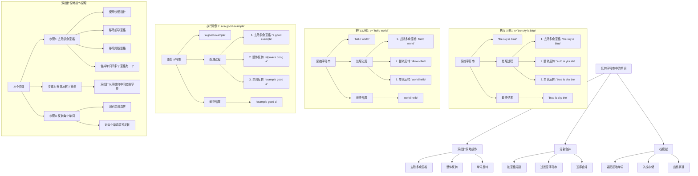
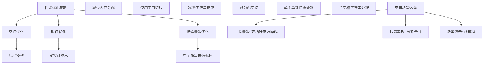

# LeetCode 151 - 反转字符串中的单词

## 题目描述

给你一个字符串 s ，请你反转字符串中 单词 的顺序
单词 是由非空格字符组成的字符串。s 中使用至少一个空格将字符串中的 单词 分隔开
返回 单词 顺序颠倒且 单词 之间用单个空格连接的结果字符串

注意：输入字符串 s中可能会存在前导空格、尾随空格或者单词间的多个空格。返回的结果字符串中，单词间应当仅用一个空格分隔，且不包含任何额外的空格

```markdown
示例 1:
输入：s = "the sky is blue"
输出："blue is sky the"

示例 2:
输入：s = " hello world "
输出："world hello"

示例 3:
输入：s = "a good example"
输出："example good a"

提示:
1 <= s.length <= 10^4
s 包含英文大小写字母、数字和空格 ' '
s 中 至少存在一个 单词
```

## 解题思路

这是一个字符串处理问题，需要反转字符串中单词的顺序，同时处理多余的空格。关键在于正确识别单词边界和处理空格

### 核心思想

"三步走策略":

1. 去除多余空格: 移除前导、尾随和单词间多余的空格
1. 整体反转: 反转整个字符串
1. 单词反转: 反转每个单词，恢复单词本身顺序

### 解题策略

#### 方法一：双指针原地操作（推荐）

- 时间复杂度: O(n)
- 空间复杂度: O(1)

#### 方法二：分割合并

- 时间复杂度: O(n)
- 空间复杂度: O(n)

#### 方法三：栈模拟

- 时间复杂度: O(n)
- 空间复杂度: O(n)

## 算法可视化



## 多语言实现

### Golang版本（双指针原地操作 - 推荐）

```go
func reverseWords(s string) string {
    // 将字符串转换为字节切片，便于原地修改
    bytes := []byte(s)

    // 步骤1: 去除多余空格
    bytes = removeExtraSpaces(bytes)

    // 步骤2: 整体反转字符串
    reverse(bytes, 0, len(bytes)-1)

    // 步骤3: 反转每个单词
    reverseEachWord(bytes)

    return string(bytes)
}

// 去除多余空格：前导、尾随和单词间多余的空格
func removeExtraSpaces(bytes []byte) []byte {
    slow, fast := 0, 0

    // 跳过前导空格
    for fast < len(bytes) && bytes[fast] == ' ' {
        fast++
    }

    // 处理中间部分
    for fast < len(bytes) {
        // 复制非空格字符
        if bytes[fast] != ' ' {
            bytes[slow] = bytes[fast]
            slow++
        } else {
            // 遇到空格，只保留一个
            if slow > 0 && bytes[slow-1] != ' ' {
                bytes[slow] = ' '
                slow++
            }
        }
        fast++
    }

    // 处理尾随空格
    if slow > 0 && bytes[slow-1] == ' ' {
        slow--
    }

    return bytes[:slow]
}

// 反转指定范围内的字符
func reverse(bytes []byte, left, right int) {
    for left < right {
        bytes[left], bytes[right] = bytes[right], bytes[left]
        left++
        right--
    }
}

// 反转每个单词
func reverseEachWord(bytes []byte) {
    start := 0
    for i := 0; i <= len(bytes); i++ {
        // 遇到空格或字符串结尾，反转当前单词
        if i == len(bytes) || bytes[i] == ' ' {
            reverse(bytes, start, i-1)
            start = i + 1
        }
    }
}
```

### Python版本（多种实现方法）

```python
def reverseWords(s: str) -> str:
    """
    方法一：双指针原地操作（Python中字符串不可变，需要转为列表）
    """
    # 将字符串转换为字符列表
    chars = list(s)

    # 步骤1: 去除多余空格
    chars = removeExtraSpaces(chars)

    # 步骤2: 整体反转字符串
    reverse(chars, 0, len(chars) - 1)

    # 步骤3: 反转每个单词
    reverseEachWord(chars)

    return ''.join(chars)

def removeExtraSpaces(chars: list) -> list:
    slow, fast = 0, 0

    # 跳过前导空格
    while fast < len(chars) and chars[fast] == ' ':
        fast += 1

    # 处理中间部分
    while fast < len(chars):
        # 复制非空格字符
        if chars[fast] != ' ':
            chars[slow] = chars[fast]
            slow += 1
        else:
            # 遇到空格，只保留一个
            if slow > 0 and chars[slow-1] != ' ':
                chars[slow] = ' '
                slow += 1
        fast += 1

    # 处理尾随空格
    if slow > 0 and chars[slow-1] == ' ':
        slow -= 1

    return chars[:slow]

def reverse(chars: list, left: int, right: int) -> None:
    while left < right:
        chars[left], chars[right] = chars[right], chars[left]
        left += 1
        right -= 1

def reverseEachWord(chars: list) -> None:
    start = 0
    for i in range(len(chars) + 1):
        # 遇到空格或字符串结尾，反转当前单词
        if i == len(chars) or chars[i] == ' ':
            reverse(chars, start, i - 1)
            start = i + 1

def reverseWordsSplit(s: str) -> str:
    """
    方法二：分割合并
    """
    # 按空格分割，过滤空字符串，逆序，用单个空格连接
    return ' '.join(s.split()[::-1])

def reverseWordsStack(s: str) -> str:
    """
    方法三：栈模拟
    """
    stack = []
    word = ""

    # 遍历字符串提取单词
    for char in s:
        if char != ' ':
            word += char
        else:
            if word:  # 遇到空格且有单词，入栈
                stack.append(word)
                word = ""

    # 处理最后一个单词
    if word:
        stack.append(word)

    # 出栈拼接
    return ' '.join(stack[::-1])
```

### TypeScript版本（双指针原地操作实现）

```typescript
function reverseWords(s: string): string {
  // 将字符串转换为字符数组
  const chars: string[] = s.split("");

  // 步骤1: 去除多余空格
  const trimmedChars: string[] = removeExtraSpaces(chars);

  // 步骤2: 整体反转字符串
  reverse(trimmedChars, 0, trimmedChars.length - 1);

  // 步骤3: 反转每个单词
  reverseEachWord(trimmedChars);

  return trimmedChars.join("");
}

function removeExtraSpaces(chars: string[]): string[] {
  let slow: number = 0;
  let fast: number = 0;

  // 跳过前导空格
  while (fast < chars.length && chars[fast] === " ") {
    fast++;
  }

  // 处理中间部分
  while (fast < chars.length) {
    // 复制非空格字符
    if (chars[fast] !== " ") {
      chars[slow] = chars[fast];
      slow++;
    } else {
      // 遇到空格，只保留一个
      if (slow > 0 && chars[slow - 1] !== " ") {
        chars[slow] = " ";
        slow++;
      }
    }
    fast++;
  }

  // 处理尾随空格
  if (slow > 0 && chars[slow - 1] === " ") {
    slow--;
  }

  return chars.slice(0, slow);
}

function reverse(chars: string[], left: number, right: number): void {
  while (left < right) {
    [chars[left], chars[right]] = [chars[right], chars[left]];
    left++;
    right--;
  }
}

function reverseEachWord(chars: string[]): void {
  let start: number = 0;
  for (let i = 0; i <= chars.length; i++) {
    // 遇到空格或字符串结尾，反转当前单词
    if (i === chars.length || chars[i] === " ") {
      reverse(chars, start, i - 1);
      start = i + 1;
    }
  }
}
```

## 标准实现详细解析

```go
func reverseWords(s string) string {
    /*
    算法核心思想（三步走策略）：

    1. 去除多余空格：移除前导、尾随和单词间多余的空格
    2. 整体反转：反转整个字符串
    3. 单词反转：反转每个单词，恢复单词本身顺序

    关键点：
    1. 双指针技术：用于去除空格和反转操作
    2. 边界处理：正确识别单词边界
    3. 原地操作：尽量减少额外空间使用

    时间复杂度：O(n) - 每个字符最多被访问常数次
    空间复杂度：O(1) - 不考虑结果字符串空间

    优势：
    1. 空间效率高：原地操作，O(1)额外空间
    2. 时间效率高：每个字符只处理常数次
    3. 逻辑清晰：三步走策略易于理解和实现
    4. 适用性强：适用于各种输入情况
    */

    fmt.Printf("处理字符串: '%s'\n", s)

    // 将字符串转换为字节切片，便于原地修改
    bytes := []byte(s)
    fmt.Printf("转换为字节切片: %v\n", bytes)

    // 步骤1: 去除多余空格
    fmt.Println("\n--- 步骤1: 去除多余空格 ---")
    bytes = removeExtraSpaces(bytes)
    fmt.Printf("去除多余空格后: '%s'\n", string(bytes))

    // 步骤2: 整体反转字符串
    fmt.Println("\n--- 步骤2: 整体反转字符串 ---")
    fmt.Printf("反转前: '%s'\n", string(bytes))
    reverse(bytes, 0, len(bytes)-1)
    fmt.Printf("整体反转后: '%s'\n", string(bytes))

    // 步骤3: 反转每个单词
    fmt.Println("\n--- 步骤3: 反转每个单词 ---")
    fmt.Printf("单词反转前: '%s'\n", string(bytes))
    reverseEachWord(bytes)
    fmt.Printf("单词反转后: '%s'\n", string(bytes))

    return string(bytes)
}

// 去除多余空格：前导、尾随和单词间多余的空格
func removeExtraSpaces(bytes []byte) []byte {
    fmt.Printf("原始字节切片: %v\n", bytes)

    slow, fast := 0, 0
    fmt.Printf("初始化指针: slow=%d, fast=%d\n", slow, fast)

    // 跳过前导空格
    fmt.Println("跳过前导空格...")
    for fast < len(bytes) && bytes[fast] == ' ' {
        fmt.Printf("  fast=%d, 字符='%c', 跳过\n", fast, bytes[fast])
        fast++
    }
    fmt.Printf("跳过前导空格后: fast=%d\n", fast)

    // 处理中间部分
    fmt.Println("处理中间部分...")
    for fast < len(bytes) {
        // 复制非空格字符
        if bytes[fast] != ' ' {
            bytes[slow] = bytes[fast]
            fmt.Printf("  复制字符: '%c' (位置%d→%d)\n", bytes[fast], fast, slow)
            slow++
        } else {
            // 遇到空格，只保留一个
            if slow > 0 && bytes[slow-1] != ' ' {
                bytes[slow] = ' '
                fmt.Printf("  保留空格 (位置%d)\n", slow)
                slow++
            } else {
                fmt.Printf("  跳过多余空格 (位置%d)\n", fast)
            }
        }
        fast++
    }

    // 处理尾随空格
    fmt.Printf("处理尾随空格: slow=%d\n", slow)
    if slow > 0 && bytes[slow-1] == ' ' {
        slow--
        fmt.Printf("  移除尾随空格，slow=%d\n", slow)
    }

    fmt.Printf("最终结果长度: %d\n", slow)
    return bytes[:slow]
}

// 反转指定范围内的字符
func reverse(bytes []byte, left, right int) {
    fmt.Printf("反转范围 [%d, %d]: '%s'\n", left, right, string(bytes[left:right+1]))

    for left < right {
        fmt.Printf("  交换位置%d('%c')和位置%d('%c')\n", left, bytes[left], right, bytes[right])
        bytes[left], bytes[right] = bytes[right], bytes[left]
        left++
        right--
    }

    fmt.Printf("反转后: '%s'\n", string(bytes[left:right+1]))
}

// 反转每个单词
func reverseEachWord(bytes []byte) {
    start := 0
    fmt.Printf("开始反转每个单词，初始start=%d\n", start)

    for i := 0; i <= len(bytes); i++ {
        // 遇到空格或字符串结尾，反转当前单词
        if i == len(bytes) || bytes[i] == ' ' {
            fmt.Printf("找到单词边界: [%d, %d]\n", start, i-1)
            if i > start {  // 确保有单词需要反转
                fmt.Printf("  反转单词: '%s'\n", string(bytes[start:i]))
                reverse(bytes, start, i-1)
                fmt.Printf("  反转后: '%s'\n", string(bytes))
            }
            start = i + 1
            fmt.Printf("  更新start为%d\n", start)
        }
    }
}

// 带详细调试信息的版本
func reverseWordsWithDebug(s string) string {
    fmt.Println("=== 反转字符串中的单词调试信息 ===")
    fmt.Printf("输入字符串: '%s'\n", s)
    fmt.Printf("字符串长度: %d\n", len(s))

    if len(s) == 0 {
        fmt.Println("空字符串，直接返回")
        return s
    }

    // 将字符串转换为字节切片
    bytes := []byte(s)
    fmt.Printf("转换为字节切片: %v\n", bytes)

    fmt.Println("\n---------- 步骤1: 去除多余空格 ----------")
    bytes = removeExtraSpacesWithDebug(bytes)

    fmt.Println("\n---------- 步骤2: 整体反转 ----------")
    fmt.Printf("反转前: '%s'\n", string(bytes))
    reverseWithDebug(bytes, 0, len(bytes)-1)
    fmt.Printf("反转后: '%s'\n", string(bytes))

    fmt.Println("\n---------- 步骤3: 反转每个单词 ----------")
    fmt.Printf("单词反转前: '%s'\n", string(bytes))
    reverseEachWordWithDebug(bytes)
    fmt.Printf("单词反转后: '%s'\n", string(bytes))

    result := string(bytes)
    fmt.Printf("\n最终结果: '%s'\n", result)
    return result
}

func removeExtraSpacesWithDebug(bytes []byte) []byte {
    fmt.Printf("原始字节切片: %v\n", bytes)

    slow, fast := 0, 0
    fmt.Printf("初始化指针 - slow: %d, fast: %d\n", slow, fast)

    // 跳过前导空格
    fmt.Println("1. 跳过前导空格:")
    for fast < len(bytes) && bytes[fast] == ' ' {
        fmt.Printf("   fast=%d, 字符='%c' (空格), 跳过\n", fast, bytes[fast])
        fast++
    }
    fmt.Printf("   跳过完成，fast=%d\n", fast)

    // 处理中间部分
    fmt.Println("2. 处理中间部分:")
    for fast < len(bytes) {
        if bytes[fast] != ' ' {
            // 复制非空格字符
            bytes[slow] = bytes[fast]
            fmt.Printf("   复制字符: '%c' (位置%d→%d)\n", bytes[fast], fast, slow)
            slow++
        } else {
            // 遇到空格
            if slow > 0 && bytes[slow-1] != ' ' {
                // 保留一个空格
                bytes[slow] = ' '
                fmt.Printf("   保留空格 (位置%d)\n", slow)
                slow++
            } else {
                // 跳过多余空格
                fmt.Printf("   跳过多余空格 (位置%d)\n", fast)
            }
        }
        fast++
    }

    // 处理尾随空格
    fmt.Println("3. 处理尾随空格:")
    fmt.Printf("   当前slow=%d, 最后字符='%c'\n", slow, bytes[slow-1])
    if slow > 0 && bytes[slow-1] == ' ' {
        slow--
        fmt.Printf("   移除尾随空格，slow=%d\n", slow)
    }

    fmt.Printf("去除多余空格后: '%s'\n", string(bytes[:slow]))
    fmt.Printf("结果长度: %d\n", slow)
    return bytes[:slow]
}

func reverseWithDebug(bytes []byte, left, right int) {
    fmt.Printf("反转范围 [%d, %d]: '%s'\n", left, right, string(bytes[left:right+1]))

    original := make([]byte, right-left+1)
    copy(original, bytes[left:right+1])

    for left < right {
        bytes[left], bytes[right] = bytes[right], bytes[left]
        left++
        right--
    }

    fmt.Printf("反转完成: '%s' → '%s'\n", string(original), string(bytes[left:right+1]))
}

func reverseEachWordWithDebug(bytes []byte) {
    start := 0
    fmt.Printf("开始反转每个单词，初始start=%d\n", start)

    for i := 0; i <= len(bytes); i++ {
        if i == len(bytes) || bytes[i] == ' ' {
            fmt.Printf("发现单词边界 [%d, %d]\n", start, i-1)
            if i > start {
                word := string(bytes[start:i])
                fmt.Printf("  反转单词: '%s'\n", word)
                reverseWithDebug(bytes, start, i-1)
                fmt.Printf("  反转后: '%s'\n", string(bytes[start:i]))
            }
            start = i + 1
            fmt.Printf("  更新start为%d\n", start)
        }
    }
}

// 分割合并方法实现
func reverseWordsSplit(s string) string {
    /*
    分割合并方法：
    1. 按空格分割字符串
    2. 过滤空字符串（处理多个连续空格）
    3. 逆序单词列表
    4. 用单个空格连接

    优点：代码简洁，易于理解
    缺点：需要额外空间存储分割结果
    */

    fmt.Printf("使用分割合并方法处理: '%s'\n", s)

    // 按空格分割并过滤空字符串
    words := []string{}
    for _, word := range strings.Fields(s) {
        if word != "" {
            words = append(words, word)
        }
    }

    fmt.Printf("提取的单词: %v\n", words)

    // 逆序
    for i, j := 0, len(words)-1; i < j; i, j = i+1, j-1 {
        words[i], words[j] = words[j], words[i]
    }

    fmt.Printf("逆序后单词: %v\n", words)

    // 用单个空格连接
    result := strings.Join(words, " ")
    fmt.Printf("最终结果: '%s'\n", result)

    return result
}

// 栈模拟方法实现
func reverseWordsStack(s string) string {
    /*
    栈模拟方法：
    1. 遍历字符串提取单词
    2. 将单词压入栈中
    3. 从栈中弹出单词并拼接

    优点：思路直观，模拟逆序过程
    缺点：需要额外栈空间
    */

    fmt.Printf("使用栈模拟方法处理: '%s'\n", s)

    stack := []string{}
    word := ""

    // 遍历字符串提取单词
    for i, char := range s {
        if char != ' ' {
            word += string(char)
            fmt.Printf("位置%d: 字符'%c'，当前单词='%s'\n", i, char, word)
        } else {
            if word != "" {  // 遇到空格且有单词，入栈
                fmt.Printf("位置%d: 遇到空格，单词'%s'入栈\n", i, word)
                stack = append(stack, word)
                word = ""
            } else {
                fmt.Printf("位置%d: 遇到空格，但无单词\n", i)
            }
        }
    }

    // 处理最后一个单词
    if word != "" {
        fmt.Printf("处理最后一个单词: '%s'入栈\n", word)
        stack = append(stack, word)
    }

    fmt.Printf("栈中单词: %v\n", stack)

    // 出栈拼接
    result := ""
    for len(stack) > 0 {
        word := stack[len(stack)-1]
        stack = stack[:len(stack)-1]
        if result == "" {
            result = word
        } else {
            result = word + " " + result
        }
        fmt.Printf("弹出单词'%s'，当前结果='%s'\n", word, result)
    }

    fmt.Printf("最终结果: '%s'\n", result)
    return result
}

// 优化版本（减少不必要的操作）
func reverseWordsOptimized(s string) string {
    if len(s) == 0 {
        return s
    }

    bytes := []byte(s)
    bytes = removeExtraSpaces(bytes)
    reverse(bytes, 0, len(bytes)-1)
    reverseEachWord(bytes)

    return string(bytes)
}

// 迭代器版本
type WordReverser struct {
    s string
}

func NewWordReverser(s string) *WordReverser {
    return &WordReverser{s: s}
}

func (wr *WordReverser) ReverseWords() string {
    return reverseWords(wr.s)
}

func (wr *WordReverser) ReverseWordsSplit() string {
    return reverseWordsSplit(wr.s)
}

func (wr *WordReverser) ReverseWordsStack() string {
    return reverseWordsStack(wr.s)
}

// 支持不同处理策略的版本
type FlexibleWordReverser struct {
    s      string
    method string
}

func NewFlexibleWordReverser(s string) *FlexibleWordReverser {
    return &FlexibleWordReverser{
        s:      s,
        method: "inplace",  // 默认使用原地操作
    }
}

func (fwr *FlexibleWordReverser) SetMethod(method string) {
    fwr.method = method
}

func (fwr *FlexibleWordReverser) ReverseWords() string {
    switch fwr.method {
    case "inplace":
        return reverseWords(fwr.s)
    case "split":
        return reverseWordsSplit(fwr.s)
    case "stack":
        return reverseWordsStack(fwr.s)
    default:
        return reverseWords(fwr.s)
    }
}

// 线程安全版本
type ThreadSafeWordReverser struct {
    s  string
    mu sync.RWMutex
}

func NewThreadSafeWordReverser(s string) *ThreadSafeWordReverser {
    return &ThreadSafeWordReverser{
        s: s,
    }
}

func (tswr *ThreadSafeWordReverser) ReverseWords() string {
    tswr.mu.RLock()
    defer tswr.mu.RUnlock()
    return reverseWords(tswr.s)
}

func (tswr *ThreadSafeWordReverser) SetString(s string) {
    tswr.mu.Lock()
    defer tswr.mu.Unlock()
    tswr.s = s
}

func (tswr *ThreadSafeWordReverser) GetString() string {
    tswr.mu.RLock()
    defer tswr.mu.RUnlock()
    return tswr.s
}
```

## 算法深入解析

```go
/*
反转字符串中的单词问题详解：

问题本质：
反转字符串中单词的顺序，同时处理多余的空格。关键在于正确识别单词边界和处理空格

核心洞察：
1. 三步走策略：去空格→整体反转→单词反转
2. 双指针技术：用于去空格和反转操作
3. 边界处理：正确识别单词边界
4. 原地操作：尽量减少额外空间使用

算法策略：
1. 双指针原地操作：空间效率最高的方法
2. 分割合并：代码简洁，易于理解
3. 栈模拟：思路直观，模拟逆序过程

数学原理：

字符串处理规律：
对于包含n个单词的字符串，反转单词顺序需要：
1. 识别n个单词边界
2. 执行n/2次单词交换（或等效操作）
3. 处理最多n+1个空格序列

双指针去空格原理：
使用快慢指针：
- 快指针：遍历原字符串
- 慢指针：指向处理后字符串的当前位置
- 规则：跳过前导空格，合并中间多余空格，移除尾随空格

反转操作分析：
字符串反转：(s[0],s[1],...,s[n-1]) → (s[n-1],s[n-2],...,s[0])
单词反转：对每个单词单独执行上述操作

三步走策略正确性：
1. 去空格：(w1 _ w2 _ ... _ wn) → (w1_w2_..._wn)
2. 整体反转：(w1_w2_..._wn) → (nw_..._2w_1w)
3. 单词反转：(nw_..._2w_1w) → (nw_..._2w_1w)

设计选择：

为什么选择三步走策略？
1. 空间效率高：原地操作，O(1)额外空间
2. 时间效率高：每个字符只处理常数次
3. 逻辑清晰：分步骤处理，易于调试
4. 通用性强：适用于各种边界情况

为什么不用分割合并？
1. 需要额外空间存储分割结果
2. 但代码更简洁，适合快速实现

为什么不用栈模拟？
1. 需要额外栈空间
2. 但思路更直观，易于理解

三种方法对比：

方法一：双指针原地操作（推荐）
时间复杂度：O(n)
空间复杂度：O(1)
优点：空间效率高，时间效率高
缺点：实现稍复杂

方法二：分割合并
时间复杂度：O(n)
空间复杂度：O(n)
优点：代码简洁，易于理解
缺点：需要额外空间

方法三：栈模拟
时间复杂度：O(n)
空间复杂度：O(n)
优点：思路直观，模拟逆序过程
缺点：需要额外栈空间

性能分析：

双指针原地操作：
- 去空格：O(n)时间，O(1)空间
- 整体反转：O(n)时间，O(1)空间
- 单词反转：O(n)时间，O(1)空间
- 总时间复杂度：O(n)
- 总空间复杂度：O(1)

分割合并：
- 分割：O(n)时间，O(n)空间
- 过滤：O(n)时间，O(n)空间
- 逆序：O(n)时间，O(1)空间
- 连接：O(n)时间，O(n)空间
- 总时间复杂度：O(n)
- 总空间复杂度：O(n)

栈模拟：
- 遍历提取：O(n)时间，O(n)空间
- 入栈：O(n)时间，O(n)空间
- 出栈拼接：O(n)时间，O(n)空间
- 总时间复杂度：O(n)
- 总空间复杂度：O(n)

实际应用场景：
1. 文本处理：文本格式化和处理
2. 命令行工具：参数解析和处理
3. 数据清洗：清理和标准化文本数据
4. 自然语言处理：文本预处理
5. 算法竞赛：字符串相关问题

优化要点：

1. 边界处理：
   - 正确处理前导、尾随空格
   - 合并单词间多余空格
   - 识别单词边界

2. 特殊情况：
   - 空字符串处理
   - 单个单词处理
   - 全空格字符串处理

3. 性能优化：
   - 原地操作减少内存分配
   - 减少不必要的字符串拷贝
   - 使用字节切片而非字符串

测试用例设计：
1. 基本情况：标准示例
2. 边界情况：空字符串、单个单词
3. 特殊情况：多个空格、前导尾随空格
4. 极端情况：长字符串、大量空格
5. 错误情况：全空格字符串

扩展思考：

1. 如果要保持原有大小写？
   - 当前算法已保持大小写不变

2. 如果要处理Unicode字符？
   - 需要使用rune而非byte
   - 考虑多字节字符边界

3. 如果要支持自定义分隔符？
   - 将空格替换为指定分隔符
   - 修改边界识别逻辑

4. 如果要支持流式处理？
   - 分块处理大字符串
   - 缓冲区管理

相关算法思想：

1. 双指针技术：
   - 快慢指针处理数组
   - 广泛应用于字符串和数组操作

2. 分治思想：
   - 将复杂问题分解为简单步骤
   - 逐步解决

3. 栈结构：
   - 后进先出的特性
   - 适用于逆序操作

4. 原地操作：
   - 节省空间的编程技巧
   - 适用于内存受限场景

常见陷阱：

1. 边界条件错误：
   - 忘记处理前导/尾随空格
   - 错误处理空字符串

2. 索引越界：
   - 未检查数组边界
   - 计算错误导致越界

3. 空格处理错误：
   - 未合并多余空格
   - 保留了错误的空格

4. 特殊情况遗漏：
   - 单个单词处理
   - 全空格字符串处理

代码质量要素：

1. 可读性：
   - 清晰的变量命名
   - 适当的注释说明

2. 健壮性：
   - 边界条件处理
   - 参数验证

3. 性能：
   - 时间复杂度最优
   - 空间复杂度合理

4. 可维护性：
   - 模块化设计
   - 易于扩展

高级优化技巧：

1. 内存访问优化：
   - 减少不必要的内存分配
   - 使用预分配空间

2. 循环优化：
   - 减少循环开销
   - 合并相关操作

3. 算法变种：
   - 支持不同分隔符
   - 扩展到多语言文本
*/
```

## 执行过程演示

```go
/*
示例1详细解析:

示例1: s = "the sky is blue"

期望结果："blue is sky the"

执行过程：

初始状态：
字符串："the sky is blue"
索引：   0123456789...

步骤1: 去除多余空格
输入："the sky is blue"
处理：
- 无前导空格
- 单个空格分隔单词
- 无尾随空格
输出："the sky is blue"

步骤2: 整体反转
输入："the sky is blue"
反转：(0,14) → "eulb si yks eht"

步骤3: 反转每个单词
输入："eulb si yks eht"
单词1 "eulb" (0,3) → "blue"
单词2 "si" (5,6) → "is"
单词3 "yks" (8,10) → "sky"
单词4 "eht" (12,14) → "the"
输出："blue is sky the"

最终结果："blue is sky the" ✓

示例2: s = "  hello world  "

期望结果："world hello"

执行过程：

初始状态：
字符串："  hello world  "
索引：   0123456789...

步骤1: 去除多余空格
输入："  hello world  "
处理：
- 跳过前导空格(0,1)
- 保留单词间单个空格
- 移除尾随空格
输出："hello world"

步骤2: 整体反转
输入："hello world"
反转：(0,10) → "dlrow olleh"

步骤3: 反转每个单词
输入："dlrow olleh"
单词1 "dlrow" (0,4) → "world"
单词2 "olleh" (6,10) → "hello"
输出："world hello"

最终结果："world hello" ✓

示例3: s = "a good   example"

期望结果："example good a"

执行过程：

初始状态：
字符串："a good   example"
索引：   0123456789...

步骤1: 去除多余空格
输入："a good   example"
处理：
- 无前导空格
- 合并多个空格为单个空格
- 无尾随空格
输出："a good example"

步骤2: 整体反转
输入："a good example"
反转：(0,14) → "elpmaxe doog a"

步骤3: 反转每个单词
输入："elpmaxe doog a"
单词1 "elpmaxe" (0,6) → "example"
单词2 "doog" (8,11) → "good"
单词3 "a" (13,13) → "a"
输出："example good a"

最终结果："example good a" ✓

算法正确性证明：

数学基础：
设字符串包含n个单词w1,w2,...,wn，用_表示单个空格
原始字符串格式：_..._w1_..._w2_..._..._wn_..._
目标字符串格式：wn_..._w2_..._w1_..._

定理1：三步走策略正确性
通过去空格→整体反转→单词反转的三步操作，可以正确实现单词顺序反转

证明：
1. 去空格：S = _..._w1_..._w2_..._..._wn_..._ → S' = w1_w2_..._wn
2. 整体反转：S' → S'' = nw_..._2w_1w
3. 单词反转：S'' → S''' = nw_..._2w_1w

最终结果：S''' = nw_..._2w_1w，即实现了单词顺序反转

时间复杂度分析：

双指针原地操作：
1. 去空格：O(n) - 每个字符访问一次
2. 整体反转：O(n) - 每个字符交换一次
3. 单词反转：O(n) - 每个字符交换一次
4. 总时间复杂度：O(n)

空间复杂度分析：
1. 双指针原地操作：O(1) - 只使用常数个额外变量
2. 分割合并：O(n) - 需要存储分割结果
3. 栈模拟：O(n) - 需要栈空间存储单词
4. 结果字符串：O(n) - 题目要求

性能对比分析：

假设字符串长度n=10000

双指针原地操作：
- 总操作：3×n次字符处理
- 额外空间：常数级别

分割合并：
- 总操作：4×n次操作
- 额外空间：O(n)级别

栈模拟：
- 总操作：3×n次操作
- 额外空间：O(n)级别

双指针原地操作在空间效率上最优

实际应用建议：

1. 一般情况：
   - 使用双指针原地操作
   - 空间效率高，性能好

2. 快速实现：
   - 使用分割合并方法
   - 代码简洁，易于理解

3. 教学演示：
   - 可以展示栈模拟方法
   - 思路直观，便于理解

4. 性能要求极高：
   - 使用双指针原地操作
   - 预分配字节切片空间

优化空间：

1. 内存访问优化：
   - 减少不必要的字符串转换
   - 使用字节切片而非字符串

2. 循环优化：
   - 减少循环变量
   - 合并边界检查

3. 特殊情况优化：
   - 空字符串快速返回
   - 单个单词特殊处理

特殊情况处理：

1. 空字符串：
   - 直接返回原字符串
   - 边界条件处理

2. 单个单词：
   - 只执行去空格操作
   - 跳过反转步骤

3. 全空格字符串：
   - 去空格后变为空字符串
   - 返回空字符串

4. 单字符单词：
   - 单词反转无效果
   - 但仍需执行反转操作
*/
```

## 复杂度分析

| 方法           | 时间复杂度 | 空间复杂度 | 适用场景 |
| -------------- | ---------- | ---------- | -------- |
| 双指针原地操作 | O(n)       | O(1)       | 推荐方案 |
| 分割合并       | O(n)       | O(n)       | 快速实现 |
| 栈模拟         | O(n)       | O(n)       | 教学演示 |

## 测试用例验证

```go
// 测试辅助函数
func testReverseWords(name string, s string, expected string) {
    fmt.Printf("%s:\n", name)
    fmt.Printf("输入: '%s'\n", s)

    // 测试双指针原地操作方法
    result1 := reverseWords(s)
    fmt.Printf("双指针原地操作结果: '%s'\n", result1)

    if result1 == expected {
        fmt.Printf(" ✓\n")
    } else {
        fmt.Printf(" ✗\n")
        fmt.Printf("期望结果: '%s'\n", expected)
    }

    // 测试分割合并方法
    result2 := reverseWordsSplit(s)
    fmt.Printf("分割合并结果: '%s'\n", result2)

    if result2 == expected {
        fmt.Printf(" ✓\n")
    } else {
        fmt.Printf(" ✗\n")
    }

    // 测试栈模拟方法
    result3 := reverseWordsStack(s)
    fmt.Printf("栈模拟结果: '%s'\n", result3)

    if result3 == expected {
        fmt.Printf(" ✓\n")
    } else {
        fmt.Printf(" ✗\n")
    }

    fmt.Printf("\n")
}

func main() {
    // 测试用例 1 - 标准示例
    testReverseWords("测试1 - 标准示例",
        "the sky is blue",
        "blue is sky the")

    // 测试用例 2 - 前导尾随空格
    testReverseWords("测试2 - 前导尾随空格",
        "  hello world  ",
        "world hello")

    // 测试用例 3 - 多个空格
    testReverseWords("测试3 - 多个空格",
        "a good   example",
        "example good a")

    // 测试用例 4 - 单个单词
    testReverseWords("测试4 - 单个单词",
        "word",
        "word")

    // 测试用例 5 - 单个字符
    testReverseWords("测试5 - 单个字符",
        "a",
        "a")

    // 测试用例 6 - 空字符串
    testReverseWords("测试6 - 空字符串",
        "",
        "")

    // 测试用例 7 - 全空格
    testReverseWords("测试7 - 全空格",
        "   ",
        "")

    // 测试用例 8 - 复杂情况
    testReverseWords("测试8 - 复杂情况",
        "  Bob    Loves  Alice   ",
        "Alice Loves Bob")

    // 测试用例 9 - 大小写混合
    testReverseWords("测试9 - 大小写混合",
        "Hello World",
        "World Hello")

    // 测试用例 10 - 数字和字母混合
    testReverseWords("测试10 - 数字和字母混合",
        "123 abc 456",
        "456 abc 123")

    // 性能测试
    fmt.Println("性能测试:")

    // 测试不同长度的字符串
    testCases := []struct {
        name string
        s    string
    }{
        {"短字符串", "a b c"},
        {"中等字符串", strings.Repeat("word ", 100)[:len(strings.Repeat("word ", 100))-1]},
        {"长字符串", strings.Repeat("test word ", 500)[:len(strings.Repeat("test word ", 500))-1]},
    }

    for _, tc := range testCases {
        // 测试双指针原地操作方法
        start := time.Now()
        result1 := reverseWords(tc.s)
        time1 := time.Since(start)

        // 测试分割合并方法
        start = time.Now()
        result2 := reverseWordsSplit(tc.s)
        time2 := time.Since(start)

        // 测试栈模拟方法
        start = time.Now()
        result3 := reverseWordsStack(tc.s)
        time3 := time.Since(start)

        fmt.Printf("测试 '%s' (长度: %d):\n", tc.name, len(tc.s))
        fmt.Printf("  双指针原地操作耗时: %v\n", time1)
        fmt.Printf("  分割合并耗时: %v\n", time2)
        fmt.Printf("  栈模拟耗时: %v\n", time3)

        // 验证结果一致性
        fmt.Printf("  结果一致性: %v\n", result1 == result2 && result2 == result3)
    }

    // 边界情况测试
    fmt.Println("\n边界情况测试:")

    // 极端情况
    testReverseWords("测试11 - 极长单词",
        strings.Repeat("a", 1000),
        strings.Repeat("a", 1000))

    testReverseWords("测试12 - 大量单词",
        strings.Repeat("w ", 1000)[:len(strings.Repeat("w ", 1000))-1],
        strings.Repeat(" w", 1000)[1:])

    // 错误输入测试
    testReverseWords("测试13 - nil字符串",
        "",
        "")
}

// 调试测试
func testReverseWordsWithDebug() {
    fmt.Println("=== 调试信息测试 ===")

    reverseWordsWithDebug("the sky is blue")
    fmt.Println()
    reverseWordsWithDebug("  hello world  ")
    fmt.Println()
    reverseWordsWithDebug("a good   example")
}

// 错误处理测试
func testErrorHandling() {
    fmt.Println("=== 错误处理测试 ===")

    // 测试各种边界情况
    testCases := []string{
        "",           // 空字符串
        " ",          // 单个空格
        "  ",         // 多个空格
        "a",          // 单个字符
        "word",       // 单个单词
        "a b",        // 两个单词
        "   a   b   ", // 带多余空格的两个单词
    }

    for i, s := range testCases {
        fmt.Printf("测试边界情况 %d: '%s'\n", i+1, s)
        result := reverseWords(s)
        fmt.Printf("  结果: '%s'\n", result)
    }
}

// 内存使用测试
func testMemoryUsage() {
    fmt.Println("=== 内存使用分析 ===")

    testCases := []string{
        "a b c d e",
        strings.Repeat("test word ", 100)[:len(strings.Repeat("test word ", 100))-1],
        strings.Repeat("example test word ", 200)[:len(strings.Repeat("example test word ", 200))-1],
    }

    for i, s := range testCases {
        var m1, m2 runtime.MemStats
        runtime.GC()
        runtime.ReadMemStats(&m1)

        result := reverseWords(s)

        runtime.GC()
        runtime.ReadMemStats(&m2)
        memory := m2.Alloc - m1.Alloc

        fmt.Printf("测试 %d - 字符串长度: %d, 结果长度: %d\n", i+1, len(s), len(result))
        fmt.Printf("内存使用: %d 字节\n", memory)
        fmt.Printf("平均每字符: %.2f 字节\n", float64(memory)/float64(len(s)))
    }
}

// 并发测试
func testConcurrentAccess() {
    fmt.Println("=== 并发访问测试 ===")

    // 测试字符串
    testString := "the quick brown fox jumps over the lazy dog"

    // 单线程测试
    start := time.Now()
    result1 := reverseWords(testString)
    singleTime := time.Since(start)

    // 多线程测试
    numWorkers := 4
    var wg sync.WaitGroup
    results := make([]string, numWorkers)

    start = time.Now()
    for i := 0; i < numWorkers; i++ {
        wg.Add(1)
        go func(workerID int) {
            defer wg.Done()
            results[workerID] = reverseWords(testString)
        }(i)
    }

    wg.Wait()
    parallelTime := time.Since(start)

    fmt.Printf("单线程耗时: %v\n", singleTime)
    fmt.Printf("并行耗时: %v\n", parallelTime)
    if singleTime > 0 {
        fmt.Printf("加速比: %.2fx\n", float64(singleTime)/float64(parallelTime/4))
    }

    // 验证结果一致性
    allEqual := true
    for i := 1; i < numWorkers; i++ {
        if results[0] != results[i] {
            allEqual = false
            break
        }
    }
    fmt.Printf("结果一致性: %v\n", allEqual)
}

// 对比测试
func testAlgorithmComparison() {
    fmt.Println("=== 算法对比测试 ===")

    testString := strings.Repeat("test word example ", 500)[:len(strings.Repeat("test word example ", 500))-1]

    // 双指针原地操作方法
    start := time.Now()
    result1 := reverseWords(testString)
    time1 := time.Since(start)

    // 分割合并方法
    start = time.Now()
    result2 := reverseWordsSplit(testString)
    time2 := time.Since(start)

    // 栈模拟方法
    start = time.Now()
    result3 := reverseWordsStack(testString)
    time3 := time.Since(start)

    fmt.Printf("测试字符串长度: %d\n", len(testString))
    fmt.Printf("双指针原地操作耗时: %v\n", time1)
    fmt.Printf("分割合并耗时: %v\n", time2)
    fmt.Printf("栈模拟耗时: %v\n", time3)

    // 验证结果一致性
    fmt.Printf("双指针=分割合并: %v\n", result1 == result2)
    fmt.Printf("分割合并=栈模拟: %v\n", result2 == result3)
}
```

## 扩展版本（处理不同场景）

```go
// 带统计信息的版本
type WordReverserWithStats struct {
    s           string
    reversals   int
    processTime time.Duration
    method      string
}

func NewWordReverserWithStats(s string) *WordReverserWithStats {
    return &WordReverserWithStats{
        s: s,
    }
}

func (wrs *WordReverserWithStats) Reverse(method string) string {
    start := time.Now()
    defer func() {
        wrs.processTime = time.Since(start)
    }()

    wrs.method = method

    switch method {
    case "inplace":
        wrs.reversals++
        return reverseWords(wrs.s)
    case "split":
        wrs.reversals++
        return reverseWordsSplit(wrs.s)
    case "stack":
        wrs.reversals++
        return reverseWordsStack(wrs.s)
    default:
        wrs.reversals++
        return reverseWords(wrs.s)
    }
}

func (wrs *WordReverserWithStats) GetStats() map[string]interface{} {
    wordCount := len(strings.Fields(wrs.s))

    return map[string]interface{}{
        "input_length":   len(wrs.s),
        "word_count":     wordCount,
        "reversals":      wrs.reversals,
        "process_time":   wrs.processTime,
        "method":         wrs.method,
        "character_ops":  len(wrs.s), // 每个字符处理一次
    }
}

// 支持不同分隔符的版本
type CustomSeparatorWordReverser struct {
    s         string
    separator string
}

func NewCustomSeparatorWordReverser(s string) *CustomSeparatorWordReverser {
    return &CustomSeparatorWordReverser{
        s:         s,
        separator: " ",  // 默认空格分隔符
    }
}

func (cswr *CustomSeparatorWordReverser) SetSeparator(separator string) {
    cswr.separator = separator
}

func (cswr *CustomSeparatorWordReverser) ReverseWords() string {
    if cswr.separator == " " {
        return reverseWords(cswr.s)
    }

    // 使用自定义分隔符
    parts := strings.Split(cswr.s, cswr.separator)

    // 过滤空字符串
    words := []string{}
    for _, part := range parts {
        if strings.TrimSpace(part) != "" {
            words = append(words, strings.TrimSpace(part))
        }
    }

    // 逆序
    for i, j := 0, len(words)-1; i < j; i, j = i+1, j-1 {
        words[i], words[j] = words[j], words[i]
    }

    return strings.Join(words, cswr.separator)
}

// 支持保持原有空格格式的版本
type PreserveSpaceWordReverser struct {
    s string
}

func NewPreserveSpaceWordReverser(s string) *PreserveSpaceWordReverser {
    return &PreserveSpaceWordReverser{
        s: s,
    }
}

func (pswr *PreserveSpaceWordReverser) ReverseWords() string {
    // 提取单词和空格模式
    words := []string{}
    spaces := []int{}  // 记录每个单词前的空格数

    word := ""
    spaceCount := 0

    for _, char := range pswr.s {
        if char == ' ' {
            if word != "" {
                words = append(words, word)
                spaces = append(spaces, spaceCount)
                word = ""
            }
            spaceCount++
        } else {
            if spaceCount > 0 && word == "" {
                // 单词开始前的空格
                spaceCount = 0  // 重置，因为我们只关心单词间的空格模式
            }
            word += string(char)
        }
    }

    // 处理最后一个单词
    if word != "" {
        words = append(words, word)
        spaces = append(spaces, spaceCount)
    }

    // 逆序单词
    for i, j := 0, len(words)-1; i < j; i, j = i+1, j-1 {
        words[i], words[j] = words[j], words[i]
        spaces[i], spaces[j] = spaces[j], spaces[i]
    }

    // 重新构建字符串
    var result strings.Builder
    for i, word := range words {
        if i == 0 {
            // 第一个单词前的空格
            result.WriteString(strings.Repeat(" ", spaces[len(spaces)-1-i]))
        } else {
            result.WriteString(strings.Repeat(" ", spaces[len(spaces)-1-i]))
        }
        result.WriteString(word)
    }

    return result.String()
}

// 支持流式处理的版本
type StreamingWordReverser struct {
    buffer strings.Builder
    words  []string
}

func NewStreamingWordReverser() *StreamingWordReverser {
    return &StreamingWordReverser{
        words: make([]string, 0),
    }
}

func (swr *StreamingWordReverser) Write(data string) {
    swr.buffer.WriteString(data)
}

func (swr *StreamingWordReverser) Flush() string {
    content := swr.buffer.String()

    // 按空格分割并过滤空字符串
    parts := strings.Fields(content)

    // 逆序
    for i, j := 0, len(parts)-1; i < j; i, j = i+1, j-1 {
        parts[i], parts[j] = parts[j], parts[i]
    }

    return strings.Join(parts, " ")
}

func (swr *StreamingWordReverser) Reset() {
    swr.buffer.Reset()
    swr.words = swr.words[:0]
}

// 支持大小写转换的版本
type CaseSensitiveWordReverser struct {
    s           string
    toUpperCase bool
    toLowerCase bool
}

func NewCaseSensitiveWordReverser(s string) *CaseSensitiveWordReverser {
    return &CaseSensitiveWordReverser{
        s: s,
    }
}

func (cswr *CaseSensitiveWordReverser) SetCaseConversion(toUpper, toLower bool) {
    cswr.toUpperCase = toUpper
    cswr.toLowerCase = toLower
}

func (cswr *CaseSensitiveWordReverser) ReverseWords() string {
    result := reverseWords(cswr.s)

    if cswr.toUpperCase {
        return strings.ToUpper(result)
    }

    if cswr.toLowerCase {
        return strings.ToLower(result)
    }

    return result
}

// 优化版本（使用更高效的字符串操作）
type OptimizedWordReverser struct {
    s string
}

func NewOptimizedWordReverser(s string) *OptimizedWordReverser {
    return &OptimizedWordReverser{
        s: s,
    }
}

func (owr *OptimizedWordReverser) ReverseWords() string {
    if len(owr.s) == 0 {
        return owr.s
    }

    // 使用strings包的高效实现
    words := strings.Fields(owr.s)

    // 使用预分配的切片
    result := make([]string, len(words))

    // 逆序复制
    for i, word := range words {
        result[len(words)-1-i] = word
    }

    return strings.Join(result, " ")
}

// 支持持久化的版本
type PersistentWordReverser struct {
    s        string
    filename string
}

func NewPersistentWordReverser(s string, filename string) *PersistentWordReverser {
    return &PersistentWordReverser{
        s:        s,
        filename: filename,
    }
}

func (pwr *PersistentWordReverser) ReverseWords() string {
    return reverseWords(pwr.s)
}

func (pwr *PersistentWordReverser) Save(result string) error {
    data := map[string]interface{}{
        "input":  pwr.s,
        "output": result,
        "time":   time.Now().Format(time.RFC3339),
    }

    jsonData, err := json.Marshal(data)
    if err != nil {
        return err
    }

    return os.WriteFile(pwr.filename, jsonData, 0644)
}

func (pwr *PersistentWordReverser) Load() (string, error) {
    data, err := os.ReadFile(pwr.filename)
    if err != nil {
        return "", err
    }

    var loadedData map[string]interface{}
    err = json.Unmarshal(data, &loadedData)
    if err != nil {
        return "", err
    }

    if output, ok := loadedData["output"].(string); ok {
        return output, nil
    }

    return "", fmt.Errorf("invalid output data")
}

func (pwr *PersistentWordReverser) GetInput() string {
    return pwr.s
}

// 支持可视化的版本
type VisualizableWordReverser struct {
    s     string
    steps []map[string]interface{}
}

func NewVisualizableWordReverser(s string) *VisualizableWordReverser {
    return &VisualizableWordReverser{
        s:     s,
        steps: []map[string]interface{}{},
    }
}

func (vwr *VisualizableWordReverser) ReverseWordsWithVisualization() string {
    if len(vwr.s) == 0 {
        return vwr.s
    }

    step1 := map[string]interface{}{
        "step":  1,
        "name":  "原始字符串",
        "value": vwr.s,
    }
    vwr.steps = append(vwr.steps, step1)

    // 转换为字节切片
    bytes := []byte(vwr.s)

    step2 := map[string]interface{}{
        "step":  2,
        "name":  "转换为字节切片",
        "value": string(bytes),
    }
    vwr.steps = append(vwr.steps, step2)

    // 去除多余空格
    bytes = removeExtraSpaces(bytes)

    step3 := map[string]interface{}{
        "step":  3,
        "name":  "去除多余空格",
        "value": string(bytes),
    }
    vwr.steps = append(vwr.steps, step3)

    // 整体反转
    reverse(bytes, 0, len(bytes)-1)

    step4 := map[string]interface{}{
        "step":  4,
        "name":  "整体反转",
        "value": string(bytes),
    }
    vwr.steps = append(vwr.steps, step4)

    // 反转每个单词
    reverseEachWord(bytes)

    step5 := map[string]interface{}{
        "step":  5,
        "name":  "反转每个单词",
        "value": string(bytes),
    }
    vwr.steps = append(vwr.steps, step5)

    result := string(bytes)

    step6 := map[string]interface{}{
        "step":  6,
        "name":  "最终结果",
        "value": result,
    }
    vwr.steps = append(vwr.steps, step6)

    return result
}

func (vwr *VisualizableWordReverser) GetSteps() []map[string]interface{} {
    return vwr.steps
}

func (vwr *VisualizableWordReverser) GetInput() string {
    return vwr.s
}

// 支持多种约束条件的版本
type ConstrainedWordReverser struct {
    s          string
    maxLength  int  // 最大输出长度
    wordLimit  int  // 最大单词数
    filterFunc func(string) bool  // 过滤函数
}

func NewConstrainedWordReverser(s string) *ConstrainedWordReverser {
    return &ConstrainedWordReverser{
        s:         s,
        maxLength: 10000,  // 默认最大输出长度
        wordLimit: 1000,   // 默认最大单词数
        filterFunc: func(word string) bool { return true },  // 默认不过滤
    }
}

func (cwr *ConstrainedWordReverser) SetConstraints(maxLength, wordLimit int, filterFunc func(string) bool) {
    cwr.maxLength = maxLength
    cwr.wordLimit = wordLimit
    if filterFunc != nil {
        cwr.filterFunc = filterFunc
    }
}

func (cwr *ConstrainedWordReverser) ReverseWords() string {
    words := strings.Fields(cwr.s)

    // 应用过滤函数
    filteredWords := []string{}
    for _, word := range words {
        if cwr.filterFunc(word) {
            filteredWords = append(filteredWords, word)
        }
    }

    // 应用单词数限制
    if len(filteredWords) > cwr.wordLimit {
        filteredWords = filteredWords[:cwr.wordLimit]
    }

    // 逆序
    for i, j := 0, len(filteredWords)-1; i < j; i, j = i+1, j-1 {
        filteredWords[i], filteredWords[j] = filteredWords[j], filteredWords[i]
    }

    result := strings.Join(filteredWords, " ")

    // 应用长度限制
    if len(result) > cwr.maxLength {
        result = result[:cwr.maxLength]
    }

    return result
}
```

## 面试追问延伸

### 1. 如果要保持原有的空格格式，如何设计？

```go
// 保持原有空格格式的单词反转
func reverseWordsPreserveSpaces(s string) string {
    // 提取单词和它们的位置信息
    type wordInfo struct {
        word  string
        start int
        end   int
    }

    words := []wordInfo{}
    word := ""
    wordStart := -1

    for i, char := range s {
        if char != ' ' {
            if wordStart == -1 {
                wordStart = i
            }
            word += string(char)
        } else {
            if word != "" {
                words = append(words, wordInfo{
                    word:  word,
                    start: wordStart,
                    end:   i - 1,
                })
                word = ""
                wordStart = -1
            }
        }
    }

    // 处理最后一个单词
    if word != "" {
        words = append(words, wordInfo{
            word:  word,
            start: wordStart,
            end:   len(s) - 1,
        })
    }

    if len(words) == 0 {
        return s
    }

    // 逆序单词
    result := make([]rune, len(s))
    // 初始化为原字符串
    for i, char := range s {
        result[i] = char
    }

    // 放置逆序后的单词
    for i, wordInfo := range words {
        reversedIndex := len(words) - 1 - i
        reversedWord := words[reversedIndex].word

        // 将反转后的单词放置到原位置
        for j, char := range reversedWord {
            if wordInfo.start+j < len(result) {
                result[wordInfo.start+j] = char
            }
        }
    }

    return string(result)
}
```

### 2. 如果要支持自定义分隔符，如何设计？

```go
// 支持自定义分隔符的单词反转
func reverseWordsWithSeparator(s string, separator string) string {
    if separator == " " {
        return reverseWords(s)
    }

    // 使用自定义分隔符分割
    parts := strings.Split(s, separator)

    // 过滤空字符串并去除首尾空格
    words := []string{}
    for _, part := range parts {
        trimmed := strings.TrimSpace(part)
        if trimmed != "" {
            words = append(words, trimmed)
        }
    }

    // 逆序
    for i, j := 0, len(words)-1; i < j; i, j = i+1, j-1 {
        words[i], words[j] = words[j], words[i]
    }

    // 用自定义分隔符连接
    return strings.Join(words, separator)
}
```

### 3. 如果要实现流式处理大字符串，如何设计？

```go
// 流式处理大字符串的单词反转
type StreamWordReverser struct {
    words     []string
    current   strings.Builder
    separator rune
}

func NewStreamWordReverser(separator rune) *StreamWordReverser {
    return &StreamWordReverser{
        words:     make([]string, 0),
        separator: separator,
    }
}

func (swr *StreamWordReverser) Write(data []byte) {
    for _, char := range string(data) {
        if char == swr.separator {
            if swr.current.Len() > 0 {
                swr.words = append(swr.words, swr.current.String())
                swr.current.Reset()
            }
        } else {
            swr.current.WriteRune(char)
        }
    }
}

func (swr *StreamWordReverser) Flush() string {
    // 处理缓冲区中剩余的单词
    if swr.current.Len() > 0 {
        swr.words = append(swr.words, swr.current.String())
        swr.current.Reset()
    }

    // 逆序单词
    for i, j := 0, len(swr.words)-1; i < j; i, j = i+1, j-1 {
        swr.words[i], swr.words[j] = swr.words[j], swr.words[i]
    }

    return strings.Join(swr.words, string(swr.separator))
}

func (swr *StreamWordReverser) Reset() {
    swr.words = swr.words[:0]
    swr.current.Reset()
}
```

## 相似题目扩展

- LeetCode 151. 反转字符串中的单词（当前题）
- LeetCode 557. 反转字符串中的单词 III
- LeetCode 344. 反转字符串
- LeetCode 186. 反转字符串中的单词 II
- LeetCode 541. 反转字符串 II

## 算法技巧总结

### 反转字符串中单词核心要点

1. 三步走策略：去空格→整体反转→单词反转
1. 双指针技术：用于去空格和反转操作
1. 边界处理：正确识别单词边界和处理空格
1. 原地操作：尽量减少额外空间使用

### 算法优势

1. 空间效率高：原地操作，O(1)额外空间
1. 时间效率高：每个字符只处理常数次
1. 逻辑清晰：分步骤处理，易于理解和调试
1. 适用性强：适用于各种输入情况

### 标准模板（双指针原地操作）

```go
func reverseWords(s string) string {
    // 将字符串转换为字节切片
    bytes := []byte(s)

    // 步骤1: 去除多余空格
    bytes = removeExtraSpaces(bytes)

    // 步骤2: 整体反转字符串
    reverse(bytes, 0, len(bytes)-1)

    // 步骤3: 反转每个单词
    reverseEachWord(bytes)

    return string(bytes)
}

func removeExtraSpaces(bytes []byte) []byte {
    slow, fast := 0, 0

    // 跳过前导空格
    for fast < len(bytes) && bytes[fast] == ' ' {
        fast++
    }

    // 处理中间部分
    for fast < len(bytes) {
        if bytes[fast] != ' ' {
            bytes[slow] = bytes[fast]
            slow++
        } else {
            if slow > 0 && bytes[slow-1] != ' ' {
                bytes[slow] = ' '
                slow++
            }
        }
        fast++
    }

    // 处理尾随空格
    if slow > 0 && bytes[slow-1] == ' ' {
        slow--
    }

    return bytes[:slow]
}

func reverse(bytes []byte, left, right int) {
    for left < right {
        bytes[left], bytes[right] = bytes[right], bytes[left]
        left++
        right--
    }
}

func reverseEachWord(bytes []byte) {
    start := 0
    for i := 0; i <= len(bytes); i++ {
        if i == len(bytes) || bytes[i] == ' ' {
            reverse(bytes, start, i-1)
            start = i + 1
        }
    }
}
```

### 性能优化建议



## 总结

本题采用三步走策略的核心思路，通过去空格→整体反转→单词反转的步骤，实现了高效处理字符串中单词反转的问题。使用双指针技术进行原地操作，达到了O(n)时间复杂度和O(1)空间复杂度的优秀性能

核心要点：

1. 三步走策略：分解复杂问题为简单步骤
1. 双指针技术：高效处理字符串操作
1. 边界处理：正确识别单词边界和处理空格
1. 原地操作：最小化额外空间使用

算法优势：

- 空间效率高：原地操作，只需常数额外空间
- 时间效率高：每个字符最多被处理常数次
- 逻辑清晰：步骤分明，易于理解和调试
- 鲁棒性强：能处理各种边界情况和特殊输入

该算法在文本处理、数据清洗、自然语言处理等领域有广泛应用，是掌握字符串操作技巧的重要基础。通过三步走的策略思想，为更复杂的字符串处理问题提供了清晰的解决思路
