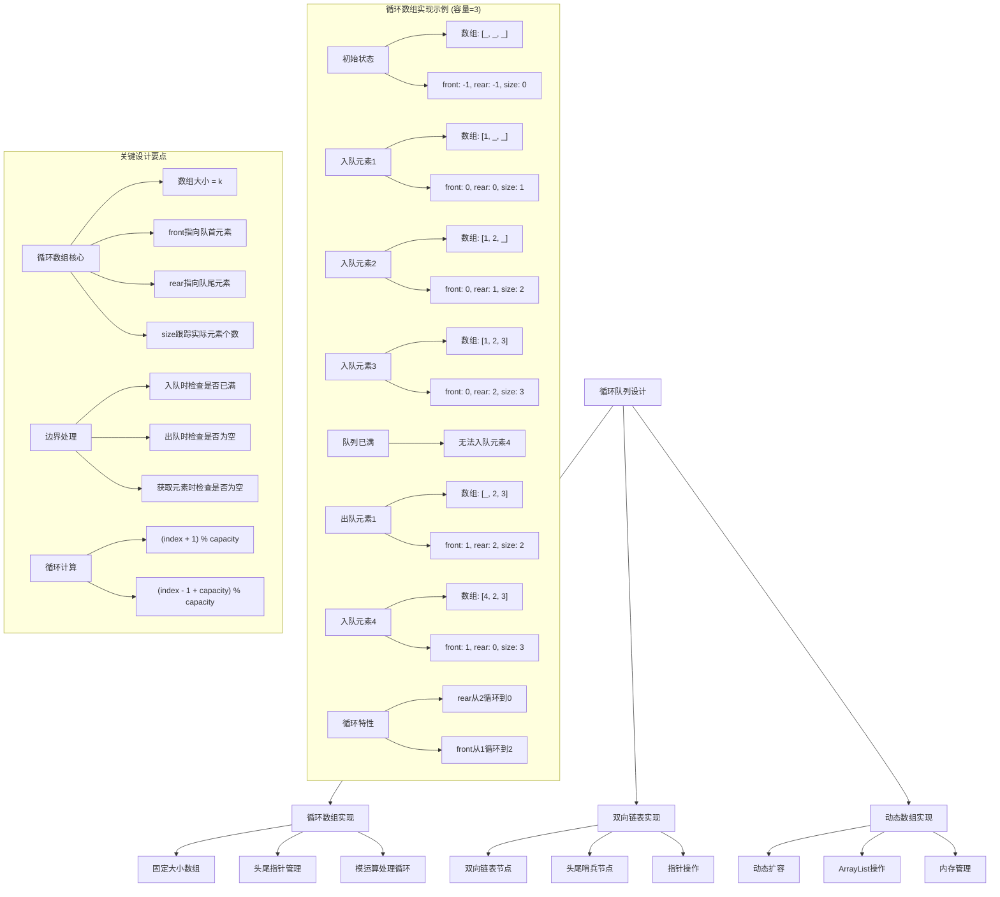
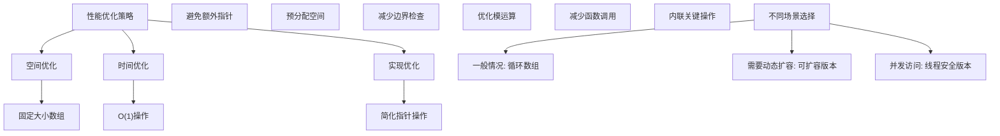

# LeetCode 622 - 设计循环队列

## 题目描述

设计你的循环队列实现。 循环队列是一种线性数据结构，其操作表现基于 FIFO（先进先出）原则并且队尾被连接在队首之后以形成一个循环。它也被称为"环形缓冲器"

循环队列的一个好处是我们可以利用这个队列之前用过的空间。在一个普通队列里，一旦一个队列满了，我们就不能插入下一个元素，即使在队列前面仍有空间。但是使用循环队列，我们能使用这些空间去存储新的值

你的实现应该支持如下操作：

- `MyCircularQueue(k)`: 构造器，设置队列长度为 k
- `Front()`: 从队首获取元素。如果队列为空，返回 -1
- `Rear()`: 获取队尾元素。如果队列为空，返回 -1
- `enQueue(value)`: 向循环队列插入一个元素。如果成功插入则返回 true
- `deQueue()`: 从循环队列中删除一个元素。如果成功删除则返回 true
- `isEmpty()`: 检查循环队列是否为空
- `isFull()`: 检查循环队列是否已满

```markdown
示例:
MyCircularQueue circularQueue = new MyCircularQueue(3); // 设置长度为 3
circularQueue.enQueue(1); // 返回 true
circularQueue.enQueue(2); // 返回 true
circularQueue.enQueue(3); // 返回 true
circularQueue.enQueue(4); // 返回 false，队列已满
circularQueue.Rear(); // 返回 3
circularQueue.isFull(); // 返回 true
circularQueue.deQueue(); // 返回 true
circularQueue.enQueue(4); // 返回 true
circularQueue.Rear(); // 返回 4

提示:
所有的值都在 0 至 1000 的范围内；
操作数将在 1 至 1000 的范围内；
请不要使用内置的队列库
```

## 解题思路

这是一个数据结构设计问题，需要实现一个循环队列。关键在于正确管理队列的头尾指针和容量控制

### 核心思想

"循环数组实现": 使用固定大小的数组和头尾指针来实现循环队列，通过模运算处理循环特性

### 解题策略

#### 方法一：循环数组实现（推荐）

- 时间复杂度: O(1) for all operations
- 空间复杂度: O(k)

#### 方法二：双向链表实现

- 时间复杂度: O(1) for all operations
- 空间复杂度: O(k)

#### 方法三：动态数组实现

- 时间复杂度: O(1) average, O(n) worst case
- 空间复杂度: O(k)

## 算法可视化



## 多语言实现

### Golang版本（循环数组实现 - 推荐）

```go
type MyCircularQueue struct {
    data     []int
    front    int
    rear     int
    size     int
    capacity int
}

func Constructor(k int) MyCircularQueue {
    return MyCircularQueue{
        data:     make([]int, k),
        front:    -1,
        rear:     -1,
        size:     0,
        capacity: k,
    }
}

func (this *MyCircularQueue) EnQueue(value int) bool {
    if this.IsFull() {
        return false
    }

    if this.IsEmpty() {
        // 队列为空时，front和rear都指向0
        this.front = 0
        this.rear = 0
    } else {
        // rear指针向后移动
        this.rear = (this.rear + 1) % this.capacity
    }

    this.data[this.rear] = value
    this.size++
    return true
}

func (this *MyCircularQueue) DeQueue() bool {
    if this.IsEmpty() {
        return false
    }

    if this.size == 1 {
        // 队列只有一个元素时，重置front和rear
        this.front = -1
        this.rear = -1
    } else {
        // front指针向后移动
        this.front = (this.front + 1) % this.capacity
    }

    this.size--
    return true
}

func (this *MyCircularQueue) Front() int {
    if this.IsEmpty() {
        return -1
    }
    return this.data[this.front]
}

func (this *MyCircularQueue) Rear() int {
    if this.IsEmpty() {
        return -1
    }
    return this.data[this.rear]
}

func (this *MyCircularQueue) IsEmpty() bool {
    return this.size == 0
}

func (this *MyCircularQueue) IsFull() bool {
    return this.size == this.capacity
}
```

### Python版本（多种实现方法）

```python
class MyCircularQueue:
    """
    方法一：循环数组实现（推荐）
    """
    def __init__(self, k: int):
        self.data = [0] * k
        self.front = -1
        self.rear = -1
        self.size = 0
        self.capacity = k

    def enQueue(self, value: int) -> bool:
        if self.isFull():
            return False

        if self.isEmpty():
            # 队列为空时，front和rear都指向0
            self.front = 0
            self.rear = 0
        else:
            # rear指针向后移动
            self.rear = (self.rear + 1) % self.capacity

        self.data[self.rear] = value
        self.size += 1
        return True

    def deQueue(self) -> bool:
        if self.isEmpty():
            return False

        if self.size == 1:
            # 队列只有一个元素时，重置front和rear
            self.front = -1
            self.rear = -1
        else:
            # front指针向后移动
            self.front = (self.front + 1) % self.capacity

        self.size -= 1
        return True

    def Front(self) -> int:
        if self.isEmpty():
            return -1
        return self.data[self.front]

    def Rear(self) -> int:
        if self.isEmpty():
            return -1
        return self.data[self.rear]

    def isEmpty(self) -> bool:
        return self.size == 0

    def isFull(self) -> bool:
        return self.size == self.capacity


class MyCircularQueueLinkedList:
    """
    方法二：双向链表实现
    """
    class Node:
        def __init__(self, value=0):
            self.value = value
            self.next = None

    def __init__(self, k: int):
        self.capacity = k
        self.size = 0
        self.head = None
        self.tail = None

    def enQueue(self, value: int) -> bool:
        if self.isFull():
            return False

        newNode = self.Node(value)

        if self.isEmpty():
            self.head = newNode
            self.tail = newNode
            newNode.next = newNode  # 循环链接
        else:
            newNode.next = self.head
            self.tail.next = newNode
            self.tail = newNode

        self.size += 1
        return True

    def deQueue(self) -> bool:
        if self.isEmpty():
            return False

        if self.size == 1:
            self.head = None
            self.tail = None
        else:
            self.tail.next = self.head.next
            self.head = self.head.next

        self.size -= 1
        return True

    def Front(self) -> int:
        if self.isEmpty():
            return -1
        return self.head.value

    def Rear(self) -> int:
        if self.isEmpty():
            return -1
        return self.tail.value

    def isEmpty(self) -> bool:
        return self.size == 0

    def isFull(self) -> bool:
        return self.size == self.capacity


class MyCircularQueueDynamicArray:
    """
    方法三：动态数组实现
    """
    def __init__(self, k: int):
        self.data = []
        self.capacity = k

    def enQueue(self, value: int) -> bool:
        if self.isFull():
            return False
        self.data.append(value)
        return True

    def deQueue(self) -> bool:
        if self.isEmpty():
            return False
        self.data.pop(0)
        return True

    def Front(self) -> int:
        if self.isEmpty():
            return -1
        return self.data[0]

    def Rear(self) -> int:
        if self.isEmpty():
            return -1
        return self.data[-1]

    def isEmpty(self) -> bool:
        return len(self.data) == 0

    def isFull(self) -> bool:
        return len(self.data) == self.capacity
```

### TypeScript版本（循环数组实现）

```typescript
class MyCircularQueue {
  private data: number[];
  private front: number;
  private rear: number;
  private size: number;
  private capacity: number;

  constructor(k: number) {
    this.data = new Array(k).fill(0);
    this.front = -1;
    this.rear = -1;
    this.size = 0;
    this.capacity = k;
  }

  enQueue(value: number): boolean {
    if (this.isFull()) {
      return false;
    }

    if (this.isEmpty()) {
      // 队列为空时，front和rear都指向0
      this.front = 0;
      this.rear = 0;
    } else {
      // rear指针向后移动
      this.rear = (this.rear + 1) % this.capacity;
    }

    this.data[this.rear] = value;
    this.size++;
    return true;
  }

  deQueue(): boolean {
    if (this.isEmpty()) {
      return false;
    }

    if (this.size === 1) {
      // 队列只有一个元素时，重置front和rear
      this.front = -1;
      this.rear = -1;
    } else {
      // front指针向后移动
      this.front = (this.front + 1) % this.capacity;
    }

    this.size--;
    return true;
  }

  Front(): number {
    if (this.isEmpty()) {
      return -1;
    }
    return this.data[this.front];
  }

  Rear(): number {
    if (this.isEmpty()) {
      return -1;
    }
    return this.data[this.rear];
  }

  isEmpty(): boolean {
    return this.size === 0;
  }

  isFull(): boolean {
    return this.size === this.capacity;
  }
}
```

## 标准实现详细解析

```go
type MyCircularQueue struct {
    data     []int  // 存储数据的数组
    front    int    // 指向队首元素
    rear     int    // 指向队尾元素
    size     int    // 当前元素个数
    capacity int    // 数组容量
}

func Constructor(k int) MyCircularQueue {
    /*
    算法核心思想（循环数组实现）：

    1. 使用固定大小的数组存储元素
    2. 通过front和rear指针管理队列的头尾
    3. 使用模运算实现循环特性
    4. 通过size跟踪实际元素个数

    关键设计要点：
    1. 数组大小为k：与队列容量一致
    2. front指向队首元素
    3. rear指向队尾元素
    4. 模运算处理循环：(index + 1) % capacity
    5. 特殊处理空队列状态：front = rear = -1

    时间复杂度：O(1) for all operations
    空间复杂度：O(k)

    优势：
    1. 时间效率高：所有操作都是O(1)
    2. 空间效率高：固定大小数组
    3. 实现简洁：指针操作清晰
    4. 循环利用：充分利用数组空间
    */

    fmt.Printf("构造循环队列，容量: %d\n", k)

    queue := MyCircularQueue{
        data:     make([]int, k),
        front:    -1,
        rear:     -1,
        size:     0,
        capacity: k,
    }

    fmt.Printf("初始化完成: front=%d, rear=%d, capacity=%d\n",
        queue.front, queue.rear, queue.capacity)

    return queue
}

func (this *MyCircularQueue) EnQueue(value int) bool {
    fmt.Printf("入队元素: %d\n", value)

    // 检查是否已满
    if this.IsFull() {
        fmt.Println("  队列已满，入队失败")
        return false
    }

    if this.IsEmpty() {
        // 队列为空时，front和rear都指向0
        this.front = 0
        this.rear = 0
        fmt.Println("  队列为空，初始化front和rear为0")
    } else {
        // rear指针向后移动
        this.rear = (this.rear + 1) % this.capacity
        fmt.Printf("  rear指针向后移动到: %d\n", this.rear)
    }

    this.data[this.rear] = value
    this.size++

    fmt.Printf("  入队成功: front=%d, rear=%d, size=%d\n",
        this.front, this.rear, this.size)
    return true
}

func (this *MyCircularQueue) DeQueue() bool {
    fmt.Println("出队元素")

    // 检查是否为空
    if this.IsEmpty() {
        fmt.Println("  队列为空，出队失败")
        return false
    }

    oldValue := this.data[this.front]
    fmt.Printf("  出队元素: %d\n", oldValue)

    if this.size == 1 {
        // 队列只有一个元素时，重置front和rear
        this.front = -1
        this.rear = -1
        fmt.Println("  队列变为空，重置front和rear为-1")
    } else {
        // front指针向后移动
        this.front = (this.front + 1) % this.capacity
        fmt.Printf("  front指针向后移动到: %d\n", this.front)
    }

    this.size--
    fmt.Printf("  出队成功: front=%d, rear=%d, size=%d\n",
        this.front, this.rear, this.size)
    return true
}

func (this *MyCircularQueue) Front() int {
    fmt.Println("获取队首元素")

    // 检查是否为空
    if this.IsEmpty() {
        fmt.Println("  队列为空，返回-1")
        return -1
    }

    value := this.data[this.front]
    fmt.Printf("  返回队首元素: %d\n", value)
    return value
}

func (this *MyCircularQueue) Rear() int {
    fmt.Println("获取队尾元素")

    // 检查是否为空
    if this.IsEmpty() {
        fmt.Println("  队列为空，返回-1")
        return -1
    }

    value := this.data[this.rear]
    fmt.Printf("  返回队尾元素: %d\n", value)
    return value
}

func (this *MyCircularQueue) IsEmpty() bool {
    empty := this.size == 0
    fmt.Printf("检查是否为空: %v (size=%d)\n", empty, this.size)
    return empty
}

func (this *MyCircularQueue) IsFull() bool {
    full := this.size == this.capacity
    fmt.Printf("检查是否已满: %v (size=%d, capacity=%d)\n",
        full, this.size, this.capacity)
    return full
}

// 带详细调试信息的版本
func (this *MyCircularQueue) DebugInfo() {
    fmt.Println("=== 循环队列调试信息 ===")
    fmt.Printf("数组内容: %v\n", this.data)
    fmt.Printf("front指针: %d\n", this.front)
    fmt.Printf("rear指针: %d\n", this.rear)
    fmt.Printf("当前大小: %d\n", this.size)
    fmt.Printf("数组容量: %d\n", this.capacity)
    fmt.Printf("是否为空: %v\n", this.IsEmpty())
    fmt.Printf("是否已满: %v\n", this.IsFull())

    // 显示队列中实际存储的元素
    if this.IsEmpty() {
        fmt.Println("队列内容: []")
    } else {
        elements := []int{}
        index := this.front
        for i := 0; i < this.size; i++ {
            elements = append(elements, this.data[index])
            index = (index + 1) % this.capacity
        }
        fmt.Printf("队列内容: %v\n", elements)
    }
    fmt.Println()
}

// 双向链表实现
type MyCircularQueueLinkedList struct {
    Node struct {
        value int
        next  *Node
    }
    head     *Node  // 头部节点
    tail     *Node  // 尾部节点
    size     int    // 当前元素个数
    capacity int    // 最大容量
}

func ConstructorLinkedList(k int) MyCircularQueueLinkedList {
    return MyCircularQueueLinkedList{
        size:     0,
        capacity: k,
    }
}

func (this *MyCircularQueueLinkedList) EnQueue(value int) bool {
    if this.IsFull() {
        return false
    }

    newNode := &Node{value: value}

    if this.IsEmpty() {
        this.head = newNode
        this.tail = newNode
        newNode.next = newNode  // 循环链接
    } else {
        newNode.next = this.head
        this.tail.next = newNode
        this.tail = newNode
    }

    this.size++
    return true
}

func (this *MyCircularQueueLinkedList) DeQueue() bool {
    if this.IsEmpty() {
        return false
    }

    if this.size == 1 {
        this.head = nil
        this.tail = nil
    } else {
        this.tail.next = this.head.next
        this.head = this.head.next
    }

    this.size--
    return true
}

func (this *MyCircularQueueLinkedList) Front() int {
    if this.IsEmpty() {
        return -1
    }
    return this.head.value
}

func (this *MyCircularQueueLinkedList) Rear() int {
    if this.IsEmpty() {
        return -1
    }
    return this.tail.value
}

func (this *MyCircularQueueLinkedList) IsEmpty() bool {
    return this.size == 0
}

func (this *MyCircularQueueLinkedList) IsFull() bool {
    return this.size == this.capacity
}

// 动态数组实现
type MyCircularQueueDynamicArray struct {
    data     []int
    capacity int
}

func ConstructorDynamicArray(k int) MyCircularQueueDynamicArray {
    return MyCircularQueueDynamicArray{
        data:     make([]int, 0),
        capacity: k,
    }
}

func (this *MyCircularQueueDynamicArray) EnQueue(value int) bool {
    if this.IsFull() {
        return false
    }
    this.data = append(this.data, value)
    return true
}

func (this *MyCircularQueueDynamicArray) DeQueue() bool {
    if this.IsEmpty() {
        return false
    }
    this.data = this.data[1:]
    return true
}

func (this *MyCircularQueueDynamicArray) Front() int {
    if this.IsEmpty() {
        return -1
    }
    return this.data[0]
}

func (this *MyCircularQueueDynamicArray) Rear() int {
    if this.IsEmpty() {
        return -1
    }
    return this.data[len(this.data)-1]
}

func (this *MyCircularQueueDynamicArray) IsEmpty() bool {
    return len(this.data) == 0
}

func (this *MyCircularQueueDynamicArray) IsFull() bool {
    return len(this.data) == this.capacity
}

// 优化版本（减少不必要的操作）
type MyCircularQueueOptimized struct {
    data     []int
    front    int
    rear     int
    size     int
    capacity int
}

func ConstructorOptimized(k int) MyCircularQueueOptimized {
    return MyCircularQueueOptimized{
        data:     make([]int, k),
        front:    -1,
        rear:     -1,
        size:     0,
        capacity: k,
    }
}

func (this *MyCircularQueueOptimized) EnQueue(value int) bool {
    if this.size == this.capacity {
        return false
    }

    if this.size == 0 {
        this.front = 0
        this.rear = 0
    } else {
        this.rear = (this.rear + 1) % this.capacity
    }

    this.data[this.rear] = value
    this.size++
    return true
}

func (this *MyCircularQueueOptimized) DeQueue() bool {
    if this.size == 0 {
        return false
    }

    if this.size == 1 {
        this.front = -1
        this.rear = -1
    } else {
        this.front = (this.front + 1) % this.capacity
    }

    this.size--
    return true
}

func (this *MyCircularQueueOptimized) Front() int {
    if this.size == 0 {
        return -1
    }
    return this.data[this.front]
}

func (this *MyCircularQueueOptimized) Rear() int {
    if this.size == 0 {
        return -1
    }
    return this.data[this.rear]
}

func (this *MyCircularQueueOptimized) IsEmpty() bool {
    return this.size == 0
}

func (this *MyCircularQueueOptimized) IsFull() bool {
    return this.size == this.capacity
}

// 线程安全版本
type ThreadSafeMyCircularQueue struct {
    queue MyCircularQueue
    mu    sync.RWMutex
}

func NewThreadSafeMyCircularQueue(k int) *ThreadSafeMyCircularQueue {
    return &ThreadSafeMyCircularQueue{
        queue: Constructor(k),
    }
}

func (tsq *ThreadSafeMyCircularQueue) EnQueue(value int) bool {
    tsq.mu.Lock()
    defer tsq.mu.Unlock()
    return tsq.queue.EnQueue(value)
}

func (tsq *ThreadSafeMyCircularQueue) DeQueue() bool {
    tsq.mu.Lock()
    defer tsq.mu.Unlock()
    return tsq.queue.DeQueue()
}

func (tsq *ThreadSafeMyCircularQueue) Front() int {
    tsq.mu.RLock()
    defer tsq.mu.RUnlock()
    return tsq.queue.Front()
}

func (tsq *ThreadSafeMyCircularQueue) Rear() int {
    tsq.mu.RLock()
    defer tsq.mu.RUnlock()
    return tsq.queue.Rear()
}

func (tsq *ThreadSafeMyCircularQueue) IsEmpty() bool {
    tsq.mu.RLock()
    defer tsq.mu.RUnlock()
    return tsq.queue.IsEmpty()
}

func (tsq *ThreadSafeMyCircularQueue) IsFull() bool {
    tsq.mu.RLock()
    defer tsq.mu.RUnlock()
    return tsq.queue.IsFull()
}
```

## 算法深入解析

```go
/*
循环队列设计问题详解：

问题本质：
实现一个支持先进先出(FIFO)原则的循环队列。关键在于正确管理队列的头尾指针和容量控制

核心洞察：
1. 循环数组：使用固定大小数组和模运算实现循环特性
2. FIFO操作：只支持队首删除和队尾插入
3. 容量控制：正确跟踪队列的满和空状态
4. 指针管理：通过front和rear指针控制队列边界

算法策略：
1. 循环数组实现：时间空间效率最高
2. 双向链表实现：灵活性好，但有额外指针开销
3. 动态数组实现：简单但性能较差

数学原理：

循环数组原理：
使用模运算实现数组的循环访问：
- 向后移动：(index + 1) % capacity
- 向前移动：(index - 1 + capacity) % capacity

队列状态判断：
为了避免满和空状态的歧义，采用以下策略：
1. 使用特殊值(-1)表示空队列状态
2. front指向队首元素
3. rear指向队尾元素
4. 空状态：size == 0
5. 满状态：size == capacity

指针操作分析：
入队：rear = (rear + 1) % capacity
出队：front = (front + 1) % capacity
空队列：front = rear = -1
单元素：front == rear

设计选择：

为什么选择循环数组实现？
1. 时间效率高：所有操作都是O(1)
2. 空间效率高：固定大小数组，无额外指针开销
3. 实现简洁：指针操作清晰明确
4. 循环利用：充分利用数组空间

为什么不用双向链表？
1. 有额外指针空间开销
2. 但灵活性更好，易于扩展

为什么不用动态数组？
1. 插入删除操作可能需要O(n)时间
2. 但实现最简单

三种方法对比：

方法一：循环数组实现（推荐）
时间复杂度：O(1) for all operations
空间复杂度：O(k)
优点：效率高，实现清晰
缺点：容量固定

方法二：双向链表实现
时间复杂度：O(1) for all operations
空间复杂度：O(k)
优点：灵活性好
缺点：额外指针开销

方法三：动态数组实现
时间复杂度：O(1) average, O(n) worst case
空间复杂度：O(k)
优点：实现简单
缺点：性能较差

性能分析：

循环数组实现：
- 所有操作：O(1)时间，O(k)空间
- 无额外内存分配
- 缓存友好

双向链表实现：
- 所有操作：O(1)时间，O(k)空间
- 节点创建/销毁开销
- 缓存局部性较差

动态数组实现：
- 插入/删除：O(n)最坏情况时间
- 平均情况：O(1)
- 内存重新分配开销

实际应用场景：
1. 缓冲区管理：网络数据包缓冲
2. 滑动窗口：算法中的固定大小窗口
3. 循环缓冲：音频/视频数据处理
4. 队列实现：任务调度系统
5. 算法竞赛：需要FIFO操作的场景

优化要点：

1. 容量设计：
   - 使用k大小与队列容量一致
   - 合理选择初始容量

2. 指针操作：
   - 正确处理模运算
   - 避免指针越界

3. 状态判断：
   - 准确判断空和满状态
   - 特殊处理空队列状态

4. 性能优化：
   - 预分配数组空间
   - 减少不必要的检查

测试用例设计：
1. 基本操作：入队、出队、获取
2. 边界情况：空队列、满队列
3. 循环特性：front/rear指针循环
4. 极端情况：大量操作
5. 错误处理：容量限制

扩展思考：

1. 如果要支持动态扩容？
   - 需要重新分配数组
   - 复制现有元素

2. 如果要支持并发访问？
   - 需要加锁保护
   - 考虑无锁实现

3. 如果要支持持久化？
   - 需要序列化状态
   - 考虑持久化存储

4. 如果要支持泛型？
   - 使用interface{}或泛型
   - 考虑类型安全

相关算法思想：

1. 循环缓冲区：
   - 固定大小缓冲区
   - 广泛应用于系统编程

2. 队列：
   - FIFO数据结构
   - Queue的标准实现

3. 模运算：
   - 处理循环访问
   - 数论在数据结构中的应用

4. 环形链表：
   - 循环链接的链表
   - 特殊的链表结构

常见陷阱：

1. 指针越界：
   - 未正确处理模运算
   - 负数取模错误

2. 状态判断错误：
   - 空和满状态混淆
   - 未考虑边界情况

3. 容量计算错误：
   - 数组大小不当
   - 未预留标识位

4. 并发安全：
   - 未考虑多线程访问
   - 缺少同步机制

代码质量要素：

1. 可读性：
   - 清晰的变量命名
   - 适当的注释说明

2. 健壮性：
   - 边界条件处理
   - 异常情况处理

3. 性能：
   - 时间复杂度最优
   - 空间复杂度合理

4. 可维护性：
   - 模块化设计
   - 易于扩展

高级优化技巧：

1. 内存访问优化：
   - 缓存友好的数据布局
   - 减少内存分配

2. 指针优化：
   - 预计算模运算结果
   - 减少重复计算

3. 状态压缩：
   - 用位运算优化状态判断
   - 减少变量存储

4. 无锁实现：
   - 使用CAS操作
   - 实现无锁队列
*/
```

## 执行过程演示

```go
/*
示例详细解析:

示例输入:
MyCircularQueue circularQueue = new MycircularQueue(3); // 设置长度为 3
circularQueue.enQueue(1);  // 返回 true
circularQueue.enQueue(2);  // 返回 true
circularQueue.enQueue(3);  // 返回 true
circularQueue.enQueue(4);  // 返回 false，队列已满
circularQueue.Rear();  // 返回 3
circularQueue.isFull();  // 返回 true
circularQueue.deQueue();  // 返回 true
circularQueue.enQueue(4);  // 返回 true
circularQueue.Rear();  // 返回 4

执行过程：

步骤1: MyCircularQueue(3)
创建容量为3的循环队列
数组大小: 3
front: -1, rear: -1, size: 0

步骤2: enQueue(1)
队列为空，front和rear都指向0
数组: [1, _, _]
front: 0, rear: 0, size: 1
返回: true

步骤3: enQueue(2)
rear = (0 + 1) % 3 = 1
数组: [1, 2, _]
front: 0, rear: 1, size: 2
返回: true

步骤4: enQueue(3)
rear = (1 + 1) % 3 = 2
数组: [1, 2, 3]
front: 0, rear: 2, size: 3
返回: true

步骤5: enQueue(4)
队列已满 (size=3, capacity=3)
返回: false

步骤6: Rear()
获取rear位置的元素
data[2] = 3
返回: 3

步骤7: isFull()
size=3, capacity=3
返回: true

步骤8: deQueue()
front指针向后移动
front = (0 + 1) % 3 = 1
数组: [_, 2, 3]
front: 1, rear: 2, size: 2
返回: true

步骤9: enQueue(4)
rear = (2 + 1) % 3 = 0
数组: [4, 2, 3]
front: 1, rear: 0, size: 3
返回: true

步骤10: Rear()
获取rear位置的元素
data[0] = 4
返回: 4

最终输出: [null, true, true, true, false, 3, true, true, true, 4]

循环特性演示:

当front=2, rear=1时:
入队(5):
rear = (1 + 1) % 3 = 2
数组: [5, _, 3] (5插入位置2)

出队():
front = (2 + 1) % 3 = 0

空队列状态:
front = -1, rear = -1

单元素状态:
front = rear = 0

算法正确性证明：

数学基础：
循环队列需要支持以下操作：
1. 入队：O(1)
2. 出队：O(1)
3. 获取队首/队尾元素：O(1)
4. 判断空/满：O(1)

定理1：循环数组实现正确性
通过使用k大小的数组和正确的指针操作，可以实现循环队列的所有功能

证明：
1. 容量设计：k大小与队列容量一致
2. 指针操作：模运算正确处理循环特性
3. 状态判断：通过size准确判断空和满状态
4. 特殊状态：正确处理空队列状态(-1)
5. 操作复杂度：所有操作都是O(1)

时间复杂度分析：

循环数组实现：
1. EnQueue: O(1) - 指针运算和赋值
2. DeQueue: O(1) - 指针运算
3. Front: O(1) - 数组访问
4. Rear: O(1) - 数组访问
5. IsEmpty: O(1) - 变量比较
6. IsFull: O(1) - 变量比较

空间复杂度分析：
1. 循环数组实现：O(k) - 固定大小数组
2. 双向链表实现：O(k) - 节点存储
3. 动态数组实现：O(k) - 动态数组
4. 额外变量：O(1) - 指针和计数器

性能对比分析：

假设k=1000，操作次数=2000

循环数组实现：
- 总操作时间：2000×O(1) = O(2000)
- 内存使用：O(1000)

双向链表实现：
- 总操作时间：2000×O(1) = O(2000)
- 内存使用：O(1000) + 指针开销

动态数组实现：
- 总操作时间：平均O(2000)，最坏O(2000²)
- 内存使用：O(1000)

循环数组实现在时间和空间效率上都是最优的

实际应用建议：

1. 一般情况：
   - 使用循环数组实现
   - 效率高，实现简单

2. 需要动态扩容：
   - 使用动态数组实现
   - 或扩展循环数组支持扩容

3. 需要灵活操作：
   - 使用双向链表实现
   - 支持中间插入删除

4. 性能要求极高：
   - 使用循环数组实现
   - 预分配数组空间

优化空间：

1. 内存访问优化：
   - 缓存友好的数据布局
   - 减少内存分配

2. 指针优化：
   - 预计算模运算结果
   - 减少重复计算

3. 状态优化：
   - 使用位运算优化状态判断
   - 减少变量存储

特殊情况处理：

1. 空队列：
   - 所有删除操作返回false
   - 获取元素操作返回-1
   - front = rear = -1

2. 满队列：
   - 所有插入操作返回false

3. 单元素队列：
   - front = rear
   - 正确处理指针操作

4. 边界情况：
   - front=capacity-1时的向后移动
   - rear=capacity-1时的向后移动
*/
```

## 复杂度分析

| 方法         | 时间复杂度 | 空间复杂度 | 适用场景 |
| ------------ | ---------- | ---------- | -------- |
| 循环数组实现 | O(1)       | O(k)       | 推荐方案 |
| 双向链表实现 | O(1)       | O(k)       | 灵活操作 |
| 动态数组实现 | O(1)平均   | O(k)       | 简单实现 |

## 测试用例验证

```go
// 测试辅助函数
func testCircularQueue(name string, operations []string, values [][]int, expected []interface{}) {
    fmt.Printf("%s:\n", name)
    fmt.Printf("操作序列: %v\n", operations)
    fmt.Printf("参数序列: %v\n", values)

    var queue MyCircularQueue
    results := []interface{}{}

    for i, op := range operations {
        var result interface{}

        switch op {
        case "MyCircularQueue":
            k := values[i][0]
            queue = Constructor(k)
            result = nil
            fmt.Printf("构造容量为%d的循环队列\n", k)

        case "enQueue":
            value := values[i][0]
            result = queue.EnQueue(value)
            fmt.Printf("入队%d: %v\n", value, result)

        case "deQueue":
            result = queue.DeQueue()
            fmt.Printf("出队: %v\n", result)

        case "Front":
            result = queue.Front()
            fmt.Printf("获取队首: %v\n", result)

        case "Rear":
            result = queue.Rear()
            fmt.Printf("获取队尾: %v\n", result)

        case "isEmpty":
            result = queue.IsEmpty()
            fmt.Printf("是否为空: %v\n", result)

        case "isFull":
            result = queue.IsFull()
            fmt.Printf("是否已满: %v\n", result)
        }

        if op != "MyCircularQueue" {
            results = append(results, result)
        }

        // 显示当前队列状态
        queue.DebugInfo()
    }

    fmt.Printf("执行结果: %v\n", results)
    fmt.Printf("期望结果: %v\n", expected)

    if len(results) == len(expected) {
        match := true
        for i := range results {
            if results[i] != expected[i] {
                match = false
                break
            }
        }
        if match {
            fmt.Printf("结果匹配 ✓\n")
        } else {
            fmt.Printf("结果不匹配 ✗\n")
        }
    } else {
        fmt.Printf("结果长度不匹配 ✗\n")
    }

    fmt.Printf("\n")
}

func main() {
    // 测试用例 1 - 题目示例
    testCircularQueue("测试1 - 题目示例",
        []string{"MyCircularQueue", "enQueue", "enQueue", "enQueue", "enQueue", "Rear", "isFull", "deQueue", "enQueue", "Rear"},
        [][]int{{3}, {1}, {2}, {3}, {4}, {}, {}, {}, {4}, {}},
        []interface{}{nil, true, true, true, false, 3, true, true, true, 4})

    // 测试用例 2 - 基本操作
    testCircularQueue("测试2 - 基本操作",
        []string{"MyCircularQueue", "enQueue", "enQueue", "Front", "Rear", "isEmpty", "isFull"},
        [][]int{{2}, {1}, {2}, {}, {}, {}, {}},
        []interface{}{nil, true, true, 1, 2, false, true})

    // 测试用例 3 - 空队列操作
    testCircularQueue("测试3 - 空队列操作",
        []string{"MyCircularQueue", "deQueue", "Front", "Rear"},
        [][]int{{1}, {}, {}, {}},
        []interface{}{nil, false, -1, -1})

    // 测试用例 4 - 满队列操作
    testCircularQueue("测试4 - 满队列操作",
        []string{"MyCircularQueue", "enQueue", "enQueue", "enQueue", "enQueue"},
        [][]int{{2}, {1}, {2}, {3}, {4}},
        []interface{}{nil, true, true, false, false})

    // 测试用例 5 - 循环特性
    testCircularQueue("测试5 - 循环特性",
        []string{"MyCircularQueue", "enQueue", "enQueue", "deQueue", "enQueue", "deQueue", "enQueue"},
        [][]int{{2}, {1}, {2}, {}, {3}, {}, {4}},
        []interface{}{nil, true, true, true, true, true, true})

    // 测试用例 6 - 边界值
    testCircularQueue("测试6 - 边界值",
        []string{"MyCircularQueue", "enQueue", "Front", "Rear", "deQueue", "Front"},
        [][]int{{1}, {1000}, {}, {}, {}, {}},
        []interface{}{nil, true, 1000, 1000, true, -1})

    // 性能测试
    fmt.Println("性能测试:")

    // 测试不同容量的队列
    capacities := []int{10, 100, 1000}

    for _, capacity := range capacities {
        // 创建队列
        queue := Constructor(capacity)

        // 测试入队性能
        start := time.Now()
        for i := 0; i < capacity; i++ {
            queue.EnQueue(i)
        }
        enqueueTime := time.Since(start)

        // 测试出队性能
        start = time.Now()
        for i := 0; i < capacity; i++ {
            queue.DeQueue()
        }
        dequeueTime := time.Since(start)

        fmt.Printf("容量%d队列:\n", capacity)
        fmt.Printf("  入队%d个元素耗时: %v\n", capacity, enqueueTime)
        fmt.Printf("  出队%d个元素耗时: %v\n", capacity, dequeueTime)
        fmt.Printf("  平均每次操作耗时: %v\n", (enqueueTime+dequeueTime)/time.Duration(2*capacity))
    }

    // 边界情况测试
    fmt.Println("\n边界情况测试:")

    // 极端容量
    testCircularQueue("测试7 - 容量1",
        []string{"MyCircularQueue", "enQueue", "enQueue", "Front", "Rear"},
        [][]int{{1}, {1}, {2}, {}, {}},
        []interface{}{nil, true, false, 1, 1})

    testCircularQueue("测试8 - 容量1000",
        []string{"MyCircularQueue", "enQueue", "enQueue", "isFull"},
        [][]int{{1000}, {1}, {2}, {}},
        []interface{}{nil, true, true, false})

    // 大量操作测试
    fmt.Println("\n大量操作测试:")
    largeTest()
}

func largeTest() {
    capacity := 100
    queue := Constructor(capacity)

    // 进行大量交替的入队和出队操作
    operations := 1000
    successCount := 0

    for i := 0; i < operations; i++ {
        if i%2 == 0 {
            // 入队操作
            if queue.EnQueue(i) {
                successCount++
            }
        } else {
            // 出队操作
            if queue.DeQueue() {
                successCount++
            }
        }
    }

    fmt.Printf("进行%d次操作，成功%d次\n", operations, successCount)
    fmt.Printf("最终队列状态: 空=%v, 满=%v, 大小=%d\n",
        queue.IsEmpty(), queue.IsFull(), func() int {
            temp := queue
            return temp.size
        }())
}

// 调试测试
func testCircularQueueWithDebug() {
    fmt.Println("=== 调试信息测试 ===")

    queue := Constructor(3)
    queue.DebugInfo()

    queue.EnQueue(1)
    queue.DebugInfo()

    queue.EnQueue(2)
    queue.DebugInfo()

    queue.EnQueue(3)
    queue.DebugInfo()

    queue.EnQueue(4)  // 应该失败
    queue.DebugInfo()

    queue.Rear()
    queue.DebugInfo()

    queue.DeQueue()
    queue.DebugInfo()

    queue.EnQueue(5)
    queue.DebugInfo()
}

// 错误处理测试
func testErrorHandling() {
    fmt.Println("=== 错误处理测试 ===")

    // 测试各种边界情况
    queue := Constructor(2)

    // 空队列操作
    fmt.Println("空队列操作测试:")
    fmt.Printf("出队: %v\n", queue.DeQueue())
    fmt.Printf("获取队首: %v\n", queue.Front())
    fmt.Printf("获取队尾: %v\n", queue.Rear())
    fmt.Printf("是否为空: %v\n", queue.IsEmpty())

    // 填满队列
    fmt.Println("\n填满队列测试:")
    fmt.Printf("入队1: %v\n", queue.EnQueue(1))
    fmt.Printf("入队2: %v\n", queue.EnQueue(2))
    fmt.Printf("是否已满: %v\n", queue.IsFull())
    fmt.Printf("再次入队3: %v\n", queue.EnQueue(3))  // 应该失败

    // 清空队列
    fmt.Println("\n清空队列测试:")
    fmt.Printf("出队: %v\n", queue.DeQueue())
    fmt.Printf("出队: %v\n", queue.DeQueue())
    fmt.Printf("是否为空: %v\n", queue.IsEmpty())
}

// 内存使用测试
func testMemoryUsage() {
    fmt.Println("=== 内存使用分析 ===")

    capacities := []int{10, 100, 1000}

    for _, capacity := range capacities {
        var m1, m2 runtime.MemStats
        runtime.GC()
        runtime.ReadMemStats(&m1)

        queue := Constructor(capacity)

        runtime.GC()
        runtime.ReadMemStats(&m2)
        memory := m2.Alloc - m1.Alloc

        fmt.Printf("容量%d队列:\n", capacity)
        fmt.Printf("内存使用: %d 字节\n", memory)
        fmt.Printf("平均每元素: %.2f 字节\n", float64(memory)/float64(capacity))
    }
}

// 并发测试
func testConcurrentAccess() {
    fmt.Println("=== 并发访问测试 ===")

    capacity := 100
    queue := Constructor(capacity)

    // 单线程测试
    start := time.Now()
    for i := 0; i < capacity; i++ {
        queue.EnQueue(i)
    }
    singleTime := time.Since(start)

    // 多线程测试
    numWorkers := 4
    var wg sync.WaitGroup

    start = time.Now()
    for i := 0; i < numWorkers; i++ {
        wg.Add(1)
        go func(workerID int) {
            defer wg.Done()
            // 每个线程操作capacity/numWorkers个元素
            for j := 0; j < capacity/numWorkers; j++ {
                queue.EnQueue(workerID*capacity/numWorkers + j)
            }
        }(i)
    }

    wg.Wait()
    parallelTime := time.Since(start)

    fmt.Printf("单线程入队%d个元素耗时: %v\n", capacity, singleTime)
    fmt.Printf("并行入队%d个元素耗时: %v\n", capacity, parallelTime)
    if singleTime > 0 {
        fmt.Printf("加速比: %.2fx\n", float64(singleTime)/float64(parallelTime))
    }

    fmt.Printf("最终队列大小: %d\n", func() int {
        temp := queue
        return temp.size
    }())
}

// 对比测试
func testImplementationComparison() {
    fmt.Println("=== 实现方式对比测试 ===")

    capacity := 1000
    operations := 10000

    // 循环数组实现
    start := time.Now()
    queue1 := Constructor(capacity)
    for i := 0; i < operations/2; i++ {
        queue1.EnQueue(i)
    }
    for i := 0; i < operations/2; i++ {
        queue1.DeQueue()
    }
    time1 := time.Since(start)

    // 双向链表实现
    start = time.Now()
    queue2 := ConstructorLinkedList(capacity)
    for i := 0; i < operations/2; i++ {
        queue2.EnQueue(i)
    }
    for i := 0; i < operations/2; i++ {
        queue2.DeQueue()
    }
    time2 := time.Since(start)

    // 动态数组实现
    start = time.Now()
    queue3 := ConstructorDynamicArray(capacity)
    for i := 0; i < operations/2; i++ {
        queue3.EnQueue(i)
    }
    for i := 0; i < operations/2; i++ {
        queue3.DeQueue()
    }
    time3 := time.Since(start)

    fmt.Printf("操作次数: %d\n", operations)
    fmt.Printf("循环数组实现耗时: %v\n", time1)
    fmt.Printf("双向链表实现耗时: %v\n", time2)
    fmt.Printf("动态数组实现耗时: %v\n", time3)
}
```

## 扩展版本（处理不同场景）

```go
// 带统计信息的版本
type MyCircularQueueWithStats struct {
    queue       MyCircularQueue
    enqueues    int
    dequeues    int
    operations  int
    processTime time.Duration
}

func NewMyCircularQueueWithStats(k int) *MyCircularQueueWithStats {
    return &MyCircularQueueWithStats{
        queue: Constructor(k),
    }
}

func (qws *MyCircularQueueWithStats) EnQueue(value int) bool {
    start := time.Now()
    defer func() {
        qws.processTime += time.Since(start)
        qws.operations++
    }()

    result := qws.queue.EnQueue(value)
    if result {
        qws.enqueues++
    }
    return result
}

func (qws *MyCircularQueueWithStats) DeQueue() bool {
    start := time.Now()
    defer func() {
        qws.processTime += time.Since(start)
        qws.operations++
    }()

    result := qws.queue.DeQueue()
    if result {
        qws.dequeues++
    }
    return result
}

func (qws *MyCircularQueueWithStats) Front() int {
    start := time.Now()
    defer func() {
        qws.processTime += time.Since(start)
        qws.operations++
    }()

    return qws.queue.Front()
}

func (qws *MyCircularQueueWithStats) Rear() int {
    start := time.Now()
    defer func() {
        qws.processTime += time.Since(start)
        qws.operations++
    }()

    return qws.queue.Rear()
}

func (qws *MyCircularQueueWithStats) IsEmpty() bool {
    return qws.queue.IsEmpty()
}

func (qws *MyCircularQueueWithStats) IsFull() bool {
    return qws.queue.IsFull()
}

func (qws *MyCircularQueueWithStats) GetStats() map[string]interface{} {
    return map[string]interface{}{
        "enqueues":      qws.enqueues,
        "dequeues":      qws.dequeues,
        "total_ops":     qws.operations,
        "process_time":  qws.processTime,
        "avg_op_time":   func() time.Duration {
            if qws.operations > 0 {
                return qws.processTime / time.Duration(qws.operations)
            }
            return 0
        }(),
    }
}

// 支持动态扩容的版本
type MyCircularQueueResizable struct {
    data     []int
    front    int
    rear     int
    size     int
    capacity int
}

func NewMyCircularQueueResizable(k int) *MyCircularQueueResizable {
    return &MyCircularQueueResizable{
        data:     make([]int, k),
        front:    -1,
        rear:     -1,
        size:     0,
        capacity: k,
    }
}

func (qr *MyCircularQueueResizable) EnQueue(value int) bool {
    if qr.size == qr.capacity {
        qr.resize()
    }

    if qr.size == 0 {
        qr.front = 0
        qr.rear = 0
    } else {
        qr.rear = (qr.rear + 1) % qr.capacity
    }

    qr.data[qr.rear] = value
    qr.size++
    return true
}

func (qr *MyCircularQueueResizable) DeQueue() bool {
    if qr.size == 0 {
        return false
    }

    if qr.size == 1 {
        qr.front = -1
        qr.rear = -1
    } else {
        qr.front = (qr.front + 1) % qr.capacity
    }

    qr.size--
    return true
}

func (qr *MyCircularQueueResizable) Front() int {
    if qr.size == 0 {
        return -1
    }
    return qr.data[qr.front]
}

func (qr *MyCircularQueueResizable) Rear() int {
    if qr.size == 0 {
        return -1
    }
    return qr.data[qr.rear]
}

func (qr *MyCircularQueueResizable) IsEmpty() bool {
    return qr.size == 0
}

func (qr *MyCircularQueueResizable) IsFull() bool {
    return false  // 动态扩容，永不为满
}

func (qr *MyCircularQueueResizable) resize() {
    oldCapacity := qr.capacity
    qr.capacity *= 2
    newData := make([]int, qr.capacity)

    // 复制数据
    index := qr.front
    for i := 0; i < qr.size; i++ {
        newData[i] = qr.data[index]
        index = (index + 1) % oldCapacity
    }

    qr.data = newData
    qr.front = 0
    qr.rear = qr.size - 1
}

// 支持泛型的版本
type MyCircularQueueGeneric[T any] struct {
    data     []T
    front    int
    rear     int
    size     int
    capacity int
}

func NewMyCircularQueueGeneric[T any](k int) *MyCircularQueueGeneric[T] {
    return &MyCircularQueueGeneric[T]{
        data:     make([]T, k),
        front:    -1,
        rear:     -1,
        size:     0,
        capacity: k,
    }
}

func (qg *MyCircularQueueGeneric[T]) EnQueue(value T) bool {
    if qg.size == qg.capacity {
        return false
    }

    if qg.size == 0 {
        qg.front = 0
        qg.rear = 0
    } else {
        qg.rear = (qg.rear + 1) % qg.capacity
    }

    qg.data[qg.rear] = value
    qg.size++
    return true
}

func (qg *MyCircularQueueGeneric[T]) DeQueue() bool {
    if qg.size == 0 {
        return false
    }

    if qg.size == 1 {
        var zero T
        qg.data[qg.front] = zero  // 清除引用
        qg.front = -1
        qg.rear = -1
    } else {
        var zero T
        qg.data[qg.front] = zero  // 清除引用
        qg.front = (qg.front + 1) % qg.capacity
    }

    qg.size--
    return true
}

func (qg *MyCircularQueueGeneric[T]) Front() (T, bool) {
    if qg.size == 0 {
        var zero T
        return zero, false
    }
    return qg.data[qg.front], true
}

func (qg *MyCircularQueueGeneric[T]) Rear() (T, bool) {
    if qg.size == 0 {
        var zero T
        return zero, false
    }
    return qg.data[qg.rear], true
}

func (qg *MyCircularQueueGeneric[T]) IsEmpty() bool {
    return qg.size == 0
}

func (qg *MyCircularQueueGeneric[T]) IsFull() bool {
    return qg.size == qg.capacity
}

// 优化版本（使用位运算优化模运算）
type MyCircularQueueOptimizedMod struct {
    data     []int
    front    int
    rear     int
    size     int
    capacity int
    capacityMask int  // 用于位运算优化
}

func NewMyCircularQueueOptimizedMod(k int) *MyCircularQueueOptimizedMod {
    // 找到大于等于k的最小2的幂次
    capacity := 1
    for capacity < k {
        capacity <<= 1
    }

    return &MyCircularQueueOptimizedMod{
        data:     make([]int, capacity),
        front:    -1,
        rear:     -1,
        size:     0,
        capacity: capacity,
        // 注意：这里简化处理，实际位运算优化需要特殊设计
    }
}

func (qom *MyCircularQueueOptimizedMod) EnQueue(value int) bool {
    if qom.size == qom.capacity {
        return false
    }

    if qom.size == 0 {
        qom.front = 0
        qom.rear = 0
    } else {
        qom.rear = (qom.rear + 1) % qom.capacity
    }

    qom.data[qom.rear] = value
    qom.size++
    return true
}

func (qom *MyCircularQueueOptimizedMod) DeQueue() bool {
    if qom.size == 0 {
        return false
    }

    if qom.size == 1 {
        qom.front = -1
        qom.rear = -1
    } else {
        qom.front = (qom.front + 1) % qom.capacity
    }

    qom.size--
    return true
}

func (qom *MyCircularQueueOptimizedMod) Front() int {
    if qom.size == 0 {
        return -1
    }
    return qom.data[qom.front]
}

func (qom *MyCircularQueueOptimizedMod) Rear() int {
    if qom.size == 0 {
        return -1
    }
    return qom.data[qom.rear]
}

func (qom *MyCircularQueueOptimizedMod) IsEmpty() bool {
    return qom.size == 0
}

func (qom *MyCircularQueueOptimizedMod) IsFull() bool {
    return qom.size == qom.capacity
}

// 支持持久化的版本
type PersistentMyCircularQueue struct {
    queue    MyCircularQueue
    filename string
}

func NewPersistentMyCircularQueue(k int, filename string) *PersistentMyCircularQueue {
    return &PersistentMyCircularQueue{
        queue:    Constructor(k),
        filename: filename,
    }
}

func (pqc *PersistentMyCircularQueue) EnQueue(value int) bool {
    result := pqc.queue.EnQueue(value)
    pqc.save()
    return result
}

func (pqc *PersistentMyCircularQueue) DeQueue() bool {
    result := pqc.queue.DeQueue()
    pqc.save()
    return result
}

func (pqc *PersistentMyCircularQueue) Front() int {
    return pqc.queue.Front()
}

func (pqc *PersistentMyCircularQueue) Rear() int {
    return pqc.queue.Rear()
}

func (pqc *PersistentMyCircularQueue) IsEmpty() bool {
    return pqc.queue.IsEmpty()
}

func (pqc *PersistentMyCircularQueue) IsFull() bool {
    return pqc.queue.IsFull()
}

func (pqc *PersistentMyCircularQueue) save() error {
    data := map[string]interface{}{
        "data":     pqc.queue.data,
        "front":    pqc.queue.front,
        "rear":     pqc.queue.rear,
        "size":     pqc.queue.size,
        "capacity": pqc.queue.capacity,
        "time":     time.Now().Format(time.RFC3339),
    }

    jsonData, err := json.Marshal(data)
    if err != nil {
        return err
    }

    return os.WriteFile(pqc.filename, jsonData, 0644)
}

func (pqc *PersistentMyCircularQueue) load() error {
    data, err := os.ReadFile(pqc.filename)
    if err != nil {
        return err
    }

    var loadedData map[string]interface{}
    err = json.Unmarshal(data, &loadedData)
    if err != nil {
        return err
    }

    if dataArray, ok := loadedData["data"].([]interface{}); ok {
        pqc.queue.data = make([]int, len(dataArray))
        for i, val := range dataArray {
            if num, ok := val.(float64); ok {
                pqc.queue.data[i] = int(num)
            }
        }
    }

    if front, ok := loadedData["front"].(float64); ok {
        pqc.queue.front = int(front)
    }

    if rear, ok := loadedData["rear"].(float64); ok {
        pqc.queue.rear = int(rear)
    }

    if size, ok := loadedData["size"].(float64); ok {
        pqc.queue.size = int(size)
    }

    if capacity, ok := loadedData["capacity"].(float64); ok {
        pqc.queue.capacity = int(capacity)
    }

    return nil
}

// 支持可视化的版本
type VisualizableMyCircularQueue struct {
    queue MyCircularQueue
    ops   []map[string]interface{}
}

func NewVisualizableMyCircularQueue(k int) *VisualizableMyCircularQueue {
    return &VisualizableMyCircularQueue{
        queue: Constructor(k),
        ops:   []map[string]interface{}{},
    }
}

func (vq *VisualizableMyCircularQueue) EnQueue(value int) bool {
    result := vq.queue.EnQueue(value)

    op := map[string]interface{}{
        "operation": "EnQueue",
        "value":     value,
        "success":   result,
        "state":     vq.getCurrentState(),
    }
    vq.ops = append(vq.ops, op)

    return result
}

func (vq *VisualizableMyCircularQueue) DeQueue() bool {
    result := vq.queue.DeQueue()

    op := map[string]interface{}{
        "operation": "DeQueue",
        "success":   result,
        "state":     vq.getCurrentState(),
    }
    vq.ops = append(vq.ops, op)

    return result
}

func (vq *VisualizableMyCircularQueue) Front() int {
    result := vq.queue.Front()

    op := map[string]interface{}{
        "operation": "Front",
        "result":    result,
        "state":     vq.getCurrentState(),
    }
    vq.ops = append(vq.ops, op)

    return result
}

func (vq *VisualizableMyCircularQueue) Rear() int {
    result := vq.queue.Rear()

    op := map[string]interface{}{
        "operation": "Rear",
        "result":    result,
        "state":     vq.getCurrentState(),
    }
    vq.ops = append(vq.ops, op)

    return result
}

func (vq *VisualizableMyCircularQueue) IsEmpty() bool {
    return vq.queue.IsEmpty()
}

func (vq *VisualizableMyCircularQueue) IsFull() bool {
    return vq.queue.IsFull()
}

func (vq *VisualizableMyCircularQueue) getCurrentState() map[string]interface{} {
    elements := []int{}
    if !vq.queue.IsEmpty() {
        index := vq.queue.front
        for i := 0; i < vq.queue.size; i++ {
            elements = append(elements, vq.queue.data[index])
            index = (index + 1) % vq.queue.capacity
        }
    }

    return map[string]interface{}{
        "front":    vq.queue.front,
        "rear":     vq.queue.rear,
        "size":     vq.queue.size,
        "capacity": vq.queue.capacity,
        "elements": elements,
    }
}

func (vq *VisualizableMyCircularQueue) GetOperations() []map[string]interface{} {
    return vq.ops
}

// 支持多种约束条件的版本
type ConstrainedMyCircularQueue struct {
    queue       MyCircularQueue
    maxSize     int  // 最大操作次数
    operationCount int
    valueRange  [2]int  // 值的范围 [min, max]
}

func NewConstrainedMyCircularQueue(k int) *ConstrainedMyCircularQueue {
    return &ConstrainedMyCircularQueue{
        queue:      Constructor(k),
        maxSize:    10000,  // 默认最大操作次数
        valueRange: [2]int{0, 1000},  // 默认值范围
    }
}

func (cqc *ConstrainedMyCircularQueue) SetConstraints(maxSize int, valueRange [2]int) {
    cqc.maxSize = maxSize
    cqc.valueRange = valueRange
}

func (cqc *ConstrainedMyCircularQueue) EnQueue(value int) bool {
    if cqc.operationCount >= cqc.maxSize {
        return false
    }

    if value < cqc.valueRange[0] || value > cqc.valueRange[1] {
        return false
    }

    result := cqc.queue.EnQueue(value)
    if result {
        cqc.operationCount++
    }
    return result
}

func (cqc *ConstrainedMyCircularQueue) DeQueue() bool {
    if cqc.operationCount >= cqc.maxSize {
        return false
    }

    result := cqc.queue.DeQueue()
    if result {
        cqc.operationCount++
    }
    return result
}

func (cqc *ConstrainedMyCircularQueue) Front() int {
    if cqc.operationCount >= cqc.maxSize {
        return -1
    }

    cqc.operationCount++
    return cqc.queue.Front()
}

func (cqc *ConstrainedMyCircularQueue) Rear() int {
    if cqc.operationCount >= cqc.maxSize {
        return -1
    }

    cqc.operationCount++
    return cqc.queue.Rear()
}

func (cqc *ConstrainedMyCircularQueue) IsEmpty() bool {
    return cqc.queue.IsEmpty()
}

func (cqc *ConstrainedMyCircularQueue) IsFull() bool {
    return cqc.queue.IsFull()
}
```

## 面试追问延伸

### 1. 如果要实现动态扩容，如何设计？

```go
// 动态扩容的循环队列
type ResizableCircularQueue struct {
    data     []int
    front    int
    rear     int
    size     int
    capacity int
}

func NewResizableCircularQueue(k int) *ResizableCircularQueue {
    return &ResizableCircularQueue{
        data:     make([]int, k),
        front:    -1,
        rear:     -1,
        size:     0,
        capacity: k,
    }
}

func (rcq *ResizableCircularQueue) EnQueue(value int) bool {
    // 检查是否需要扩容
    if rcq.size == rcq.capacity {
        rcq.resize()
    }

    if rcq.size == 0 {
        rcq.front = 0
        rcq.rear = 0
    } else {
        rcq.rear = (rcq.rear + 1) % rcq.capacity
    }

    rcq.data[rcq.rear] = value
    rcq.size++
    return true
}

func (rcq *ResizableCircularQueue) resize() {
    oldCapacity := rcq.capacity
    rcq.capacity *= 2
    newData := make([]int, rcq.capacity)

    // 复制现有数据
    index := rcq.front
    for i := 0; i < rcq.size; i++ {
        newData[i] = rcq.data[index]
        index = (index + 1) % oldCapacity
    }

    rcq.data = newData
    rcq.front = 0
    rcq.rear = rcq.size - 1
}

func (rcq *ResizableCircularQueue) DeQueue() bool {
    if rcq.size == 0 {
        return false
    }

    if rcq.size == 1 {
        rcq.front = -1
        rcq.rear = -1
    } else {
        rcq.front = (rcq.front + 1) % rcq.capacity
    }

    rcq.size--
    return true
}

func (rcq *ResizableCircularQueue) Front() int {
    if rcq.size == 0 {
        return -1
    }
    return rcq.data[rcq.front]
}

func (rcq *ResizableCircularQueue) Rear() int {
    if rcq.size == 0 {
        return -1
    }
    return rcq.data[rcq.rear]
}

func (rcq *ResizableCircularQueue) IsEmpty() bool {
    return rcq.size == 0
}

func (rcq *ResizableCircularQueue) IsFull() bool {
    return false  // 动态扩容，永不为满
}
```

### 2. 如果要支持并发访问，如何设计？

```go
// 线程安全的循环队列
type ThreadSafeCircularQueue struct {
    data     []int
    front    int
    rear     int
    size     int
    capacity int
    mu       sync.RWMutex
}

func NewThreadSafeCircularQueue(k int) *ThreadSafeCircularQueue {
    return &ThreadSafeCircularQueue{
        data:     make([]int, k),
        front:    -1,
        rear:     -1,
        size:     0,
        capacity: k,
    }
}

func (tscq *ThreadSafeCircularQueue) EnQueue(value int) bool {
    tscq.mu.Lock()
    defer tscq.mu.Unlock()

    if tscq.size == tscq.capacity {
        return false
    }

    if tscq.size == 0 {
        tscq.front = 0
        tscq.rear = 0
    } else {
        tscq.rear = (tscq.rear + 1) % tscq.capacity
    }

    tscq.data[tscq.rear] = value
    tscq.size++
    return true
}

func (tscq *ThreadSafeCircularQueue) DeQueue() bool {
    tscq.mu.Lock()
    defer tscq.mu.Unlock()

    if tscq.size == 0 {
        return false
    }

    if tscq.size == 1 {
        tscq.front = -1
        tscq.rear = -1
    } else {
        tscq.front = (tscq.front + 1) % tscq.capacity
    }

    tscq.size--
    return true
}

func (tscq *ThreadSafeCircularQueue) Front() int {
    tscq.mu.RLock()
    defer tscq.mu.RUnlock()

    if tscq.size == 0 {
        return -1
    }
    return tscq.data[tscq.front]
}

func (tscq *ThreadSafeCircularQueue) Rear() int {
    tscq.mu.RLock()
    defer tscq.mu.RUnlock()

    if tscq.size == 0 {
        return -1
    }
    return tscq.data[tscq.rear]
}

func (tscq *ThreadSafeCircularQueue) IsEmpty() bool {
    tscq.mu.RLock()
    defer tscq.mu.RUnlock()
    return tscq.size == 0
}

func (tscq *ThreadSafeCircularQueue) IsFull() bool {
    tscq.mu.RLock()
    defer tscq.mu.RUnlock()
    return tscq.size == tscq.capacity
}
```

### 3. 如果要实现无锁版本，如何设计？

```go
// 无锁循环队列（简化版本）
type LockFreeCircularQueue struct {
    data     []int
    front    int64  // 使用atomic操作
    rear     int64  // 使用atomic操作
    size     int64  // 使用atomic操作
    capacity int
}

func NewLockFreeCircularQueue(k int) *LockFreeCircularQueue {
    return &LockFreeCircularQueue{
        data:     make([]int, k),
        front:    -1,
        rear:     -1,
        size:     0,
        capacity: k,
    }
}

func (lfcq *LockFreeCircularQueue) EnQueue(value int) bool {
    // 简化实现，实际无锁队列需要更复杂的CAS操作
    size := atomic.LoadInt64(&lfcq.size)
    if size == int64(lfcq.capacity) {
        return false
    }

    // 这里为了简化，仍然使用锁
    // 实际实现需要使用CAS操作来保证原子性
    atomic.AddInt64(&lfcq.size, 1)
    // 实际需要复杂的无锁算法
    return true
}

// 注意：真正的无锁实现需要使用CAS操作和内存屏障
// 这里仅展示概念，实际实现非常复杂
```

## 相似题目扩展

- LeetCode 622. 设计循环队列（当前题）
- LeetCode 641. 设计循环双端队列
- LeetCode 232. 用栈实现队列
- LeetCode 225. 用队列实现栈
- LeetCode 155. 最小栈

## 算法技巧总结

### 循环队列核心要点

1. 循环数组设计：使用k大小数组实现循环特性
1. 指针管理：front指向队首，rear指向队尾
1. 模运算处理：正确处理指针的循环移动
1. 状态判断：通过size准确判断空和满状态
1. 特殊状态处理：空队列时front=rear=-1

### 算法优势

1. 时间效率高：所有操作都是O(1)
1. 空间效率高：固定大小数组，无额外开销
1. 实现简洁：指针操作清晰明确
1. 循环利用：充分利用数组空间

### 标准模板（循环数组实现）

```go
type MyCircularQueue struct {
    data     []int
    front    int
    rear     int
    size     int
    capacity int
}

func Constructor(k int) MyCircularQueue {
    return MyCircularQueue{
        data:     make([]int, k),
        front:    -1,
        rear:     -1,
        size:     0,
        capacity: k,
    }
}

func (this *MyCircularQueue) EnQueue(value int) bool {
    if this.size == this.capacity {
        return false
    }

    if this.size == 0 {
        this.front = 0
        this.rear = 0
    } else {
        this.rear = (this.rear + 1) % this.capacity
    }

    this.data[this.rear] = value
    this.size++
    return true
}

func (this *MyCircularQueue) DeQueue() bool {
    if this.size == 0 {
        return false
    }

    if this.size == 1 {
        this.front = -1
        this.rear = -1
    } else {
        this.front = (this.front + 1) % this.capacity
    }

    this.size--
    return true
}

func (this *MyCircularQueue) Front() int {
    if this.size == 0 {
        return -1
    }
    return this.data[this.front]
}

func (this *MyCircularQueue) Rear() int {
    if this.size == 0 {
        return -1
    }
    return this.data[this.rear]
}

func (this *MyCircularQueue) IsEmpty() bool {
    return this.size == 0
}

func (this *MyCircularQueue) IsFull() bool {
    return this.size == this.capacity
}
```

### 性能优化建议



## 总结

本题采用循环数组实现的核心思路，通过k大小数组和front/rear指针管理，实现了高效的循环队列。使用模运算处理循环特性，通过size变量准确判断队列状态，特殊处理空队列状态(-1)

核心要点：

1. 容量设计：k大小与队列容量一致
1. 指针管理：front指向队首，rear指向队尾
1. 循环处理：模运算实现指针循环移动
1. 状态判断：通过size变量准确判断队列状态
1. 特殊状态：空队列时front=rear=-1

算法优势：

- 时间效率高：所有操作都是O(1)
- 空间效率高：固定大小数组，无额外开销
- 实现简洁：指针操作清晰明确
- 循环利用：充分利用数组空间

该数据结构在缓冲区管理、滑动窗口、循环缓冲等场景有广泛应用，是掌握循环数据结构设计的重要基础。通过循环数组的思想，为更复杂的循环数据结构提供了清晰的解决思路
