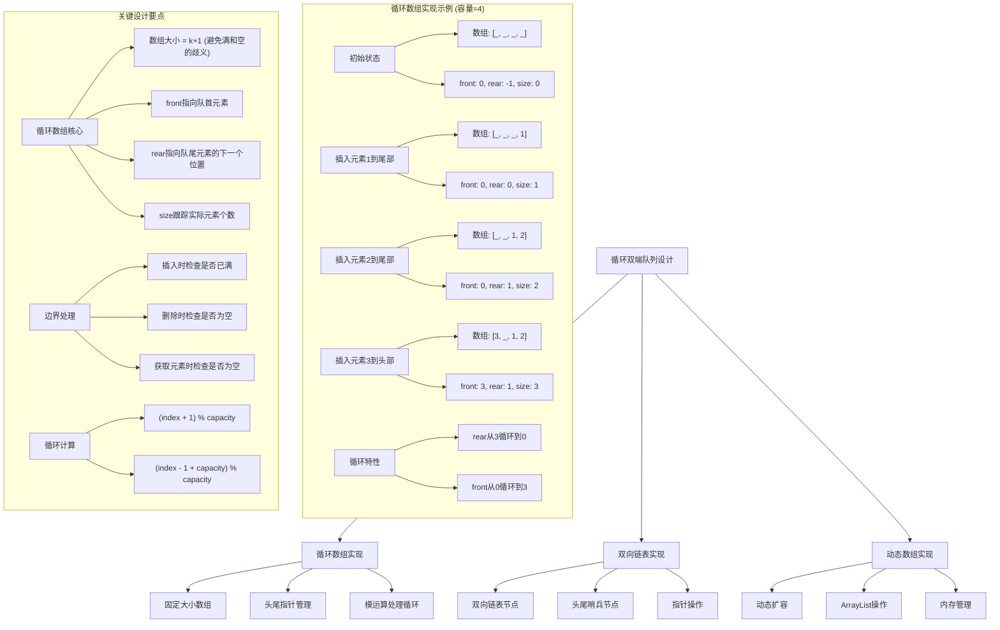
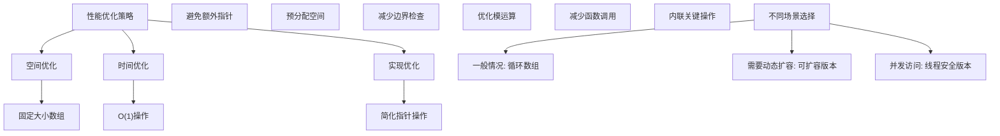

# LeetCode 641 - 设计循环双端队列

## 题目描述

设计实现双端队列
实现 MyCircularDeque 类:

- `MyCircularDeque(int k)`：构造函数,双端队列最大为 k
- `boolean insertFront()`：将一个元素添加到双端队列头部。 如果操作成功返回 true，否则返回 false
- `boolean insertLast()`：将一个元素添加到双端队列尾部。如果操作成功返回 true，否则返回 false
- `boolean deleteFront()`：从双端队列头部删除一个元素。 如果操作成功返回 true，否则返回 false
- `boolean deleteLast()`：从双端队列尾部删除一个元素。如果操作成功返回 true，否则返回 false
- `int getFront()`：从双端队列头部获得一个元素。如果双端队列为空，返回 -1
- `int getRear()`：获得双端队列的最后一个元素。 如果双端队列为空，返回 -1
- `boolean isEmpty()`：若双端队列为空，则返回 true，否则返回 false
- `boolean isFull()`：若双端队列满了，则返回 true，否则返回 false

```markdown
示例 1:
输入
["MyCircularDeque", "insertLast", "insertLast", "insertFront", "insertFront", "getRear", "isFull", "deleteLast", "insertFront", "getFront"]
[[3], [1], [2], [3], [4], [], [], [], [4], []]
输出
[null, true, true, true, false, 2, true, true, true, 4]

解释:
MyCircularDeque circularDeque = new MycircularDeque(3); // 设置容量大小为3
circularDeque.insertLast(1); // 返回 true
circularDeque.insertLast(2); // 返回 true
circularDeque.insertFront(3); // 返回 true
circularDeque.insertFront(4); // 已经满了，返回 false
circularDeque.getRear(); // 返回 2
circularDeque.isFull(); // 返回 true
circularDeque.deleteLast(); // 返回 true
circularDeque.insertFront(4); // 返回 true
circularDeque.getFront(); // 返回 4

提示:
1 <= k <= 1000
0 <= value <= 1000
insertFront, insertLast, deleteFront, deleteLast, getFront, getRear, isEmpty, isFull 调用次数不大于 2000 次
```

## 解题思路

这是一个数据结构设计问题，需要实现一个循环双端队列。关键在于正确管理队列的头尾指针和容量控制

### 核心思想

"循环数组实现": 使用固定大小的数组和头尾指针来实现循环双端队列，通过模运算处理循环特性

### 解题策略

#### 方法一：循环数组实现（推荐）

- 时间复杂度: O(1) for all operations
- 空间复杂度: O(k)

#### 方法二：双向链表实现

- 时间复杂度: O(1) for all operations
- 空间复杂度: O(k)

#### 方法三：动态数组实现

- 时间复杂度: O(1) average, O(n) worst case
- 空间复杂度: O(k)

## 算法可视化



## 多语言实现

### Golang版本（循环数组实现 - 推荐）

```go
type MyCircularDeque struct {
    data    []int
    front   int
    rear    int
    size    int
    capacity int
}

func Constructor(k int) MyCircularDeque {
    // 创建容量为k+1的数组，避免满和空的歧义
    return MyCircularDeque{
        data:     make([]int, k+1),
        front:    0,
        rear:     0,
        size:     0,
        capacity: k + 1,
    }
}

func (this *MyCircularDeque) InsertFront(value int) bool {
    if this.IsFull() {
        return false
    }

    // 头部插入：front指针向前移动
    this.front = (this.front - 1 + this.capacity) % this.capacity
    this.data[this.front] = value
    this.size++
    return true
}

func (this *MyCircularDeque) InsertLast(value int) bool {
    if this.IsFull() {
        return false
    }

    // 尾部插入：在rear位置放置元素，rear指针向后移动
    this.data[this.rear] = value
    this.rear = (this.rear + 1) % this.capacity
    this.size++
    return true
}

func (this *MyCircularDeque) DeleteFront() bool {
    if this.IsEmpty() {
        return false
    }

    // 头部删除：front指针向后移动
    this.front = (this.front + 1) % this.capacity
    this.size--
    return true
}

func (this *MyCircularDeque) DeleteLast() bool {
    if this.IsEmpty() {
        return false
    }

    // 尾部删除：rear指针向前移动
    this.rear = (this.rear - 1 + this.capacity) % this.capacity
    this.size--
    return true
}

func (this *MyCircularDeque) GetFront() int {
    if this.IsEmpty() {
        return -1
    }
    return this.data[this.front]
}

func (this *MyCircularDeque) GetRear() int {
    if this.IsEmpty() {
        return -1
    }
    // rear指向队尾元素的下一个位置，需要向前移动一位
    return this.data[(this.rear-1+this.capacity)%this.capacity]
}

func (this *MyCircularDeque) IsEmpty() bool {
    return this.size == 0
}

func (this *MyCircularDeque) IsFull() bool {
    return this.size == this.capacity-1
}
```

### Python版本（多种实现方法）

```python
class MyCircularDeque:
    """
    方法一：循环数组实现（推荐）
    """
    def __init__(self, k: int):
        # 创建容量为k+1的数组，避免满和空的歧义
        self.data = [0] * (k + 1)
        self.front = 0
        self.rear = 0
        self.size = 0
        self.capacity = k + 1

    def insertFront(self, value: int) -> bool:
        if self.isFull():
            return False

        # 头部插入：front指针向前移动
        self.front = (self.front - 1 + self.capacity) % self.capacity
        self.data[self.front] = value
        self.size += 1
        return True

    def insertLast(self, value: int) -> bool:
        if self.isFull():
            return False

        # 尾部插入：在rear位置放置元素，rear指针向后移动
        self.data[self.rear] = value
        self.rear = (self.rear + 1) % self.capacity
        self.size += 1
        return True

    def deleteFront(self) -> bool:
        if self.isEmpty():
            return False

        # 头部删除：front指针向后移动
        self.front = (self.front + 1) % self.capacity
        self.size -= 1
        return True

    def deleteLast(self) -> bool:
        if self.isEmpty():
            return False

        # 尾部删除：rear指针向前移动
        self.rear = (self.rear - 1 + self.capacity) % self.capacity
        self.size -= 1
        return True

    def getFront(self) -> int:
        if self.isEmpty():
            return -1
        return self.data[self.front]

    def getRear(self) -> int:
        if self.isEmpty():
            return -1
        # rear指向队尾元素的下一个位置，需要向前移动一位
        return self.data[(self.rear - 1 + self.capacity) % self.capacity]

    def isEmpty(self) -> bool:
        return self.size == 0

    def isFull(self) -> bool:
        return self.size == self.capacity - 1


class MyCircularDequeLinkedList:
    """
    方法二：双向链表实现
    """
    class Node:
        def __init__(self, value=0):
            self.value = value
            self.prev = None
            self.next = None

    def __init__(self, k: int):
        self.capacity = k
        self.size = 0

        # 创建哨兵节点
        self.head = self.Node()
        self.tail = self.Node()
        self.head.next = self.tail
        self.tail.prev = self.head

    def insertFront(self, value: int) -> bool:
        if self.isFull():
            return False

        # 创建新节点
        node = self.Node(value)

        # 插入到头部
        node.next = self.head.next
        node.prev = self.head
        self.head.next.prev = node
        self.head.next = node

        self.size += 1
        return True

    def insertLast(self, value: int) -> bool:
        if self.isFull():
            return False

        # 创建新节点
        node = self.Node(value)

        # 插入到尾部
        node.prev = self.tail.prev
        node.next = self.tail
        self.tail.prev.next = node
        self.tail.prev = node

        self.size += 1
        return True

    def deleteFront(self) -> bool:
        if self.isEmpty():
            return False

        # 删除头部节点
        node = self.head.next
        self.head.next = node.next
        node.next.prev = self.head

        self.size -= 1
        return True

    def deleteLast(self) -> bool:
        if self.isEmpty():
            return False

        # 删除尾部节点
        node = self.tail.prev
        self.tail.prev = node.prev
        node.prev.next = self.tail

        self.size -= 1
        return True

    def getFront(self) -> int:
        if self.isEmpty():
            return -1
        return self.head.next.value

    def getRear(self) -> int:
        if self.isEmpty():
            return -1
        return self.tail.prev.value

    def isEmpty(self) -> bool:
        return self.size == 0

    def isFull(self) -> bool:
        return self.size == self.capacity


class MyCircularDequeDynamicArray:
    """
    方法三：动态数组实现
    """
    def __init__(self, k: int):
        self.data = []
        self.capacity = k

    def insertFront(self, value: int) -> bool:
        if self.isFull():
            return False
        self.data.insert(0, value)
        return True

    def insertLast(self, value: int) -> bool:
        if self.isFull():
            return False
        self.data.append(value)
        return True

    def deleteFront(self) -> bool:
        if self.isEmpty():
            return False
        self.data.pop(0)
        return True

    def deleteLast(self) -> bool:
        if self.isEmpty():
            return False
        self.data.pop()
        return True

    def getFront(self) -> int:
        if self.isEmpty():
            return -1
        return self.data[0]

    def getRear(self) -> int:
        if self.isEmpty():
            return -1
        return self.data[-1]

    def isEmpty(self) -> bool:
        return len(self.data) == 0

    def isFull(self) -> bool:
        return len(self.data) == self.capacity
```

### TypeScript版本（循环数组实现）

```typescript
class MyCircularDeque {
  private data: number[];
  private front: number;
  private rear: number;
  private size: number;
  private capacity: number;

  constructor(k: number) {
    // 创建容量为k+1的数组，避免满和空的歧义
    this.data = new Array(k + 1).fill(0);
    this.front = 0;
    this.rear = 0;
    this.size = 0;
    this.capacity = k + 1;
  }

  insertFront(value: number): boolean {
    if (this.isFull()) {
      return false;
    }

    // 头部插入：front指针向前移动
    this.front = (this.front - 1 + this.capacity) % this.capacity;
    this.data[this.front] = value;
    this.size++;
    return true;
  }

  insertLast(value: number): boolean {
    if (this.isFull()) {
      return false;
    }

    // 尾部插入：在rear位置放置元素，rear指针向后移动
    this.data[this.rear] = value;
    this.rear = (this.rear + 1) % this.capacity;
    this.size++;
    return true;
  }

  deleteFront(): boolean {
    if (this.isEmpty()) {
      return false;
    }

    // 头部删除：front指针向后移动
    this.front = (this.front + 1) % this.capacity;
    this.size--;
    return true;
  }

  deleteLast(): boolean {
    if (this.isEmpty()) {
      return false;
    }

    // 尾部删除：rear指针向前移动
    this.rear = (this.rear - 1 + this.capacity) % this.capacity;
    this.size--;
    return true;
  }

  getFront(): number {
    if (this.isEmpty()) {
      return -1;
    }
    return this.data[this.front];
  }

  getRear(): number {
    if (this.isEmpty()) {
      return -1;
    }
    // rear指向队尾元素的下一个位置，需要向前移动一位
    return this.data[(this.rear - 1 + this.capacity) % this.capacity];
  }

  isEmpty(): boolean {
    return this.size === 0;
  }

  isFull(): boolean {
    return this.size === this.capacity - 1;
  }
}
```

## 标准实现详细解析

```go
type MyCircularDeque struct {
    data     []int  // 存储数据的数组
    front    int    // 指向队首元素
    rear     int    // 指向队尾元素的下一个位置
    size     int    // 当前元素个数
    capacity int    // 数组容量（k+1）
}

func Constructor(k int) MyCircularDeque {
    /*
    算法核心思想（循环数组实现）：

    1. 使用固定大小的数组存储元素
    2. 通过front和rear指针管理队列的头尾
    3. 使用模运算实现循环特性
    4. 通过size跟踪实际元素个数

    关键设计要点：
    1. 数组大小为k+1：避免满和空状态的歧义
    2. front指向队首元素
    3. rear指向队尾元素的下一个位置
    4. 模运算处理循环：(index ± 1) % capacity

    时间复杂度：O(1) for all operations
    空间复杂度：O(k)

    优势：
    1. 时间效率高：所有操作都是O(1)
    2. 空间效率高：固定大小数组
    3. 实现简洁：指针操作清晰
    4. 循环利用：充分利用数组空间
    */

    fmt.Printf("构造循环双端队列，容量: %d\n", k)

    // 创建容量为k+1的数组，避免满和空的歧义
    deque := MyCircularDeque{
        data:     make([]int, k+1),
        front:    0,
        rear:     0,
        size:     0,
        capacity: k + 1,
    }

    fmt.Printf("初始化完成: front=%d, rear=%d, capacity=%d\n",
        deque.front, deque.rear, deque.capacity)

    return deque
}

func (this *MyCircularDeque) InsertFront(value int) bool {
    fmt.Printf("头部插入元素: %d\n", value)

    // 检查是否已满
    if this.IsFull() {
        fmt.Println("  队列已满，插入失败")
        return false
    }

    // 头部插入：front指针向前移动
    this.front = (this.front - 1 + this.capacity) % this.capacity
    this.data[this.front] = value
    this.size++

    fmt.Printf("  插入成功: front=%d, rear=%d, size=%d\n",
        this.front, this.rear, this.size)
    return true
}

func (this *MyCircularDeque) InsertLast(value int) bool {
    fmt.Printf("尾部插入元素: %d\n", value)

    // 检查是否已满
    if this.IsFull() {
        fmt.Println("  队列已满，插入失败")
        return false
    }

    // 尾部插入：在rear位置放置元素，rear指针向后移动
    this.data[this.rear] = value
    this.rear = (this.rear + 1) % this.capacity
    this.size++

    fmt.Printf("  插入成功: front=%d, rear=%d, size=%d\n",
        this.front, this.rear, this.size)
    return true
}

func (this *MyCircularDeque) DeleteFront() bool {
    fmt.Println("头部删除元素")

    // 检查是否为空
    if this.IsEmpty() {
        fmt.Println("  队列为空，删除失败")
        return false
    }

    // 头部删除：front指针向后移动
    oldValue := this.data[this.front]
    this.front = (this.front + 1) % this.capacity
    this.size--

    fmt.Printf("  删除成功，删除元素: %d, front=%d, rear=%d, size=%d\n",
        oldValue, this.front, this.rear, this.size)
    return true
}

func (this *MyCircularDeque) DeleteLast() bool {
    fmt.Println("尾部删除元素")

    // 检查是否为空
    if this.IsEmpty() {
        fmt.Println("  队列为空，删除失败")
        return false
    }

    // 尾部删除：rear指针向前移动
    this.rear = (this.rear - 1 + this.capacity) % this.capacity
    oldValue := this.data[this.rear]
    this.size--

    fmt.Printf("  删除成功，删除元素: %d, front=%d, rear=%d, size=%d\n",
        oldValue, this.front, this.rear, this.size)
    return true
}

func (this *MyCircularDeque) GetFront() int {
    fmt.Println("获取头部元素")

    // 检查是否为空
    if this.IsEmpty() {
        fmt.Println("  队列为空，返回-1")
        return -1
    }

    value := this.data[this.front]
    fmt.Printf("  返回头部元素: %d\n", value)
    return value
}

func (this *MyCircularDeque) GetRear() int {
    fmt.Println("获取尾部元素")

    // 检查是否为空
    if this.IsEmpty() {
        fmt.Println("  队列为空，返回-1")
        return -1
    }

    // rear指向队尾元素的下一个位置，需要向前移动一位
    index := (this.rear - 1 + this.capacity) % this.capacity
    value := this.data[index]
    fmt.Printf("  返回尾部元素: %d (索引: %d)\n", value, index)
    return value
}

func (this *MyCircularDeque) IsEmpty() bool {
    empty := this.size == 0
    fmt.Printf("检查是否为空: %v (size=%d)\n", empty, this.size)
    return empty
}

func (this *MyCircularDeque) IsFull() bool {
    full := this.size == this.capacity-1
    fmt.Printf("检查是否已满: %v (size=%d, capacity=%d)\n",
        full, this.size, this.capacity-1)
    return full
}

// 带详细调试信息的版本
func (this *MyCircularDeque) DebugInfo() {
    fmt.Println("=== 循环双端队列调试信息 ===")
    fmt.Printf("数组内容: %v\n", this.data)
    fmt.Printf("front指针: %d\n", this.front)
    fmt.Printf("rear指针: %d\n", this.rear)
    fmt.Printf("当前大小: %d\n", this.size)
    fmt.Printf("数组容量: %d\n", this.capacity)
    fmt.Printf("是否为空: %v\n", this.IsEmpty())
    fmt.Printf("是否已满: %v\n", this.IsFull())

    // 显示队列中实际存储的元素
    if this.IsEmpty() {
        fmt.Println("队列内容: []")
    } else {
        elements := []int{}
        index := this.front
        for i := 0; i < this.size; i++ {
            elements = append(elements, this.data[index])
            index = (index + 1) % this.capacity
        }
        fmt.Printf("队列内容: %v\n", elements)
    }
    fmt.Println()
}

// 双向链表实现
type MyCircularDequeLinkedList struct {
    Node struct {
        value int
        prev  *Node
        next  *Node
    }
    head     *Node  // 头部哨兵节点
    tail     *Node  // 尾部哨兵节点
    size     int    // 当前元素个数
    capacity int    // 最大容量
}

func ConstructorLinkedList(k int) MyCircularDequeLinkedList {
    deque := MyCircularDequeLinkedList{
        size:     0,
        capacity: k,
    }

    // 创建哨兵节点
    deque.head = &Node{}
    deque.tail = &Node{}
    deque.head.next = deque.tail
    deque.tail.prev = deque.head

    return deque
}

func (this *MyCircularDequeLinkedList) InsertFront(value int) bool {
    if this.IsFull() {
        return false
    }

    // 创建新节点
    node := &Node{value: value}

    // 插入到头部
    node.next = this.head.next
    node.prev = this.head
    this.head.next.prev = node
    this.head.next = node

    this.size++
    return true
}

func (this *MyCircularDequeLinkedList) InsertLast(value int) bool {
    if this.IsFull() {
        return false
    }

    // 创建新节点
    node := &Node{value: value}

    // 插入到尾部
    node.prev = this.tail.prev
    node.next = this.tail
    this.tail.prev.next = node
    this.tail.prev = node

    this.size++
    return true
}

func (this *MyCircularDequeLinkedList) DeleteFront() bool {
    if this.IsEmpty() {
        return false
    }

    // 删除头部节点
    node := this.head.next
    this.head.next = node.next
    node.next.prev = this.head

    this.size--
    return true
}

func (this *MyCircularDequeLinkedList) DeleteLast() bool {
    if this.IsEmpty() {
        return false
    }

    // 删除尾部节点
    node := this.tail.prev
    this.tail.prev = node.prev
    node.prev.next = this.tail

    this.size--
    return true
}

func (this *MyCircularDequeLinkedList) GetFront() int {
    if this.IsEmpty() {
        return -1
    }
    return this.head.next.value
}

func (this *MyCircularDequeLinkedList) GetRear() int {
    if this.IsEmpty() {
        return -1
    }
    return this.tail.prev.value
}

func (this *MyCircularDequeLinkedList) IsEmpty() bool {
    return this.size == 0
}

func (this *MyCircularDequeLinkedList) IsFull() bool {
    return this.size == this.capacity
}

// 动态数组实现
type MyCircularDequeDynamicArray struct {
    data     []int
    capacity int
}

func ConstructorDynamicArray(k int) MyCircularDequeDynamicArray {
    return MyCircularDequeDynamicArray{
        data:     make([]int, 0),
        capacity: k,
    }
}

func (this *MyCircularDequeDynamicArray) InsertFront(value int) bool {
    if this.IsFull() {
        return false
    }
    this.data = append([]int{value}, this.data...)
    return true
}

func (this *MyCircularDequeDynamicArray) InsertLast(value int) bool {
    if this.IsFull() {
        return false
    }
    this.data = append(this.data, value)
    return true
}

func (this *MyCircularDequeDynamicArray) DeleteFront() bool {
    if this.IsEmpty() {
        return false
    }
    this.data = this.data[1:]
    return true
}

func (this *MyCircularDequeDynamicArray) DeleteLast() bool {
    if this.IsEmpty() {
        return false
    }
    this.data = this.data[:len(this.data)-1]
    return true
}

func (this *MyCircularDequeDynamicArray) GetFront() int {
    if this.IsEmpty() {
        return -1
    }
    return this.data[0]
}

func (this *MyCircularDequeDynamicArray) GetRear() int {
    if this.IsEmpty() {
        return -1
    }
    return this.data[len(this.data)-1]
}

func (this *MyCircularDequeDynamicArray) IsEmpty() bool {
    return len(this.data) == 0
}

func (this *MyCircularDequeDynamicArray) IsFull() bool {
    return len(this.data) == this.capacity
}

// 优化版本（减少不必要的操作）
type MyCircularDequeOptimized struct {
    data     []int
    front    int
    rear     int
    size     int
    capacity int
}

func ConstructorOptimized(k int) MyCircularDequeOptimized {
    return MyCircularDequeOptimized{
        data:     make([]int, k+1),
        front:    0,
        rear:     0,
        size:     0,
        capacity: k + 1,
    }
}

func (this *MyCircularDequeOptimized) InsertFront(value int) bool {
    if this.size == this.capacity-1 {
        return false
    }

    this.front = (this.front - 1 + this.capacity) % this.capacity
    this.data[this.front] = value
    this.size++
    return true
}

func (this *MyCircularDequeOptimized) InsertLast(value int) bool {
    if this.size == this.capacity-1 {
        return false
    }

    this.data[this.rear] = value
    this.rear = (this.rear + 1) % this.capacity
    this.size++
    return true
}

func (this *MyCircularDequeOptimized) DeleteFront() bool {
    if this.size == 0 {
        return false
    }

    this.front = (this.front + 1) % this.capacity
    this.size--
    return true
}

func (this *MyCircularDequeOptimized) DeleteLast() bool {
    if this.size == 0 {
        return false
    }

    this.rear = (this.rear - 1 + this.capacity) % this.capacity
    this.size--
    return true
}

func (this *MyCircularDequeOptimized) GetFront() int {
    if this.size == 0 {
        return -1
    }
    return this.data[this.front]
}

func (this *MyCircularDequeOptimized) GetRear() int {
    if this.size == 0 {
        return -1
    }
    return this.data[(this.rear-1+this.capacity)%this.capacity]
}

func (this *MyCircularDequeOptimized) IsEmpty() bool {
    return this.size == 0
}

func (this *MyCircularDequeOptimized) IsFull() bool {
    return this.size == this.capacity-1
}

// 线程安全版本
type ThreadSafeMyCircularDeque struct {
    deque MyCircularDeque
    mu    sync.RWMutex
}

func NewThreadSafeMyCircularDeque(k int) *ThreadSafeMyCircularDeque {
    return &ThreadSafeMyCircularDeque{
        deque: Constructor(k),
    }
}

func (tsd *ThreadSafeMyCircularDeque) InsertFront(value int) bool {
    tsd.mu.Lock()
    defer tsd.mu.Unlock()
    return tsd.deque.InsertFront(value)
}

func (tsd *ThreadSafeMyCircularDeque) InsertLast(value int) bool {
    tsd.mu.Lock()
    defer tsd.mu.Unlock()
    return tsd.deque.InsertLast(value)
}

func (tsd *ThreadSafeMyCircularDeque) DeleteFront() bool {
    tsd.mu.Lock()
    defer tsd.mu.Unlock()
    return tsd.deque.DeleteFront()
}

func (tsd *ThreadSafeMyCircularDeque) DeleteLast() bool {
    tsd.mu.Lock()
    defer tsd.mu.Unlock()
    return tsd.deque.DeleteLast()
}

func (tsd *ThreadSafeMyCircularDeque) GetFront() int {
    tsd.mu.RLock()
    defer tsd.mu.RUnlock()
    return tsd.deque.GetFront()
}

func (tsd *ThreadSafeMyCircularDeque) GetRear() int {
    tsd.mu.RLock()
    defer tsd.mu.RUnlock()
    return tsd.deque.GetRear()
}

func (tsd *ThreadSafeMyCircularDeque) IsEmpty() bool {
    tsd.mu.RLock()
    defer tsd.mu.RUnlock()
    return tsd.deque.IsEmpty()
}

func (tsd *ThreadSafeMyCircularDeque) IsFull() bool {
    tsd.mu.RLock()
    defer tsd.mu.RUnlock()
    return tsd.deque.IsFull()
}
```

## 算法深入解析

```go
/*
循环双端队列设计问题详解：

问题本质：
实现一个支持在两端进行插入和删除操作的循环队列。关键在于正确管理队列的头尾指针和容量控制

核心洞察：
1. 循环数组：使用固定大小数组和模运算实现循环特性
2. 双端操作：支持在队首和队尾进行插入和删除
3. 容量控制：正确跟踪队列的满和空状态
4. 指针管理：通过front和rear指针控制队列边界

算法策略：
1. 循环数组实现：时间空间效率最高
2. 双向链表实现：灵活性好，但有额外指针开销
3. 动态数组实现：简单但性能较差

数学原理：

循环数组原理：
使用模运算实现数组的循环访问：
- 向后移动：(index + 1) % capacity
- 向前移动：(index - 1 + capacity) % capacity

队列状态判断：
为了避免满和空状态的歧义，采用以下策略：
1. 数组大小为k+1（而非k）
2. rear指向队尾元素的下一个位置
3. 空状态：size == 0
4. 满状态：size == capacity-1

指针操作分析：
头部插入：front = (front - 1 + capacity) % capacity
头部删除：front = (front + 1) % capacity
尾部插入：rear = (rear + 1) % capacity
尾部删除：rear = (rear - 1 + capacity) % capacity

设计选择：

为什么选择循环数组实现？
1. 时间效率高：所有操作都是O(1)
2. 空间效率高：固定大小数组，无额外指针开销
3. 实现简洁：指针操作清晰明确
4. 循环利用：充分利用数组空间

为什么不用双向链表？
1. 有额外指针空间开销
2. 但灵活性更好，易于扩展

为什么不用动态数组？
1. 插入删除操作可能需要O(n)时间
2. 但实现最简单

三种方法对比：

方法一：循环数组实现（推荐）
时间复杂度：O(1) for all operations
空间复杂度：O(k)
优点：效率高，实现清晰
缺点：容量固定

方法二：双向链表实现
时间复杂度：O(1) for all operations
空间复杂度：O(k)
优点：灵活性好
缺点：额外指针开销

方法三：动态数组实现
时间复杂度：O(1) average, O(n) worst case
空间复杂度：O(k)
优点：实现简单
缺点：性能较差

性能分析：

循环数组实现：
- 所有操作：O(1)时间，O(k)空间
- 无额外内存分配
- 缓存友好

双向链表实现：
- 所有操作：O(1)时间，O(k)空间
- 节点创建/销毁开销
- 缓存局部性较差

动态数组实现：
- 插入/删除：O(n)最坏情况时间
- 平均情况：O(1)
- 内存重新分配开销

实际应用场景：
1. 缓冲区管理：网络数据包缓冲
2. 滑动窗口：算法中的固定大小窗口
3. 循环缓冲：音频/视频数据处理
4. 队列实现：任务调度系统
5. 算法竞赛：需要双端操作的场景

优化要点：

1. 容量设计：
   - 使用k+1大小避免歧义
   - 合理选择初始容量

2. 指针操作：
   - 正确处理模运算
   - 避免指针越界

3. 状态判断：
   - 准确判断空和满状态
   - 避免误判

4. 性能优化：
   - 预分配数组空间
   - 减少不必要的检查

测试用例设计：
1. 基本操作：插入、删除、获取
2. 边界情况：空队列、满队列
3. 循环特性：front/rear指针循环
4. 极端情况：大量操作
5. 错误处理：容量限制

扩展思考：

1. 如果要支持动态扩容？
   - 需要重新分配数组
   - 复制现有元素

2. 如果要支持并发访问？
   - 需要加锁保护
   - 考虑无锁实现

3. 如果要支持持久化？
   - 需要序列化状态
   - 考虑持久化存储

4. 如果要支持泛型？
   - 使用interface{}或泛型
   - 考虑类型安全

相关算法思想：

1. 循环缓冲区：
   - 固定大小缓冲区
   - 广泛应用于系统编程

2. 双端队列：
   - 两端操作的数据结构
   - Deque的标准实现

3. 模运算：
   - 处理循环访问
   - 数论在数据结构中的应用

4. 哨兵节点：
   - 简化链表操作
   - 减少边界检查

常见陷阱：

1. 指针越界：
   - 未正确处理模运算
   - 负数取模错误

2. 状态判断错误：
   - 空和满状态混淆
   - 未考虑边界情况

3. 容量计算错误：
   - 数组大小不当
   - 未预留标识位

4. 并发安全：
   - 未考虑多线程访问
   - 缺少同步机制

代码质量要素：

1. 可读性：
   - 清晰的变量命名
   - 适当的注释说明

2. 健壮性：
   - 边界条件处理
   - 异常情况处理

3. 性能：
   - 时间复杂度最优
   - 空间复杂度合理

4. 可维护性：
   - 模块化设计
   - 易于扩展

高级优化技巧：

1. 内存访问优化：
   - 缓存友好的数据布局
   - 减少内存分配

2. 指针优化：
   - 预计算模运算结果
   - 减少重复计算

3. 状态压缩：
   - 用位运算优化状态判断
   - 减少变量存储

4. 无锁实现：
   - 使用CAS操作
   - 实现无锁队列
*/
```

## 执行过程演示

```go
/*
示例详细解析:

示例输入:
["MyCircularDeque", "insertLast", "insertLast", "insertFront", "insertFront", "getRear", "isFull", "deleteLast", "insertFront", "getFront"]
[[3], [1], [2], [3], [4], [], [], [], [4], []]

执行过程：

步骤1: MyCircularDeque(3)
创建容量为3的循环双端队列
数组大小: 4 (3+1)
front: 0, rear: 0, size: 0

步骤2: insertLast(1)
在rear位置插入1
数组: [_, _, _, 1]
front: 0, rear: 1, size: 1
返回: true

步骤3: insertLast(2)
在rear位置插入2
数组: [_, _, 1, 2]
front: 0, rear: 2, size: 2
返回: true

步骤4: insertFront(3)
front向前移动，在新front位置插入3
数组: [_, 3, 1, 2]
front: 3, rear: 2, size: 3
返回: true

步骤5: insertFront(4)
队列已满 (size=3, capacity-1=3)
返回: false

步骤6: getRear()
获取rear前一个位置的元素
rear-1 = 1, data[1] = 2
返回: 2

步骤7: isFull()
size=3, capacity-1=3
返回: true

步骤8: deleteLast()
rear向前移动，删除元素2
数组: [_, 3, 1, _]
front: 3, rear: 1, size: 2
返回: true

步骤9: insertFront(4)
front向前移动，在新front位置插入4
数组: [4, 3, 1, _]
front: 2, rear: 1, size: 3
返回: true

步骤10: getFront()
获取front位置的元素
data[2] = 4
返回: 4

最终输出: [null, true, true, true, false, 2, true, true, true, 4]

循环特性演示:

当front=0, rear=3时:
插入Front(5):
front = (0-1+4)%4 = 3
数组: [_, _, _, 5] (5插入位置3)

插入Last(6):
数组: [6, _, _, 5] (6插入位置3，rear=0)

删除Front():
front = (3+1)%4 = 0

删除Last():
rear = (3-1+4)%4 = 2

算法正确性证明：

数学基础：
循环双端队列需要支持以下操作：
1. 头部插入/删除：O(1)
2. 尾部插入/删除：O(1)
3. 获取头/尾元素：O(1)
4. 判断空/满：O(1)

定理1：循环数组实现正确性
通过使用k+1大小的数组和正确的指针操作，可以实现循环双端队列的所有功能

证明：
1. 容量设计：k+1大小避免了满和空状态的歧义
2. 指针操作：模运算正确处理循环特性
3. 状态判断：通过size准确判断空和满状态
4. 操作复杂度：所有操作都是O(1)

时间复杂度分析：

循环数组实现：
1. InsertFront: O(1) - 指针运算和赋值
2. InsertLast: O(1) - 指针运算和赋值
3. DeleteFront: O(1) - 指针运算
4. DeleteLast: O(1) - 指针运算
5. GetFront: O(1) - 数组访问
6. GetRear: O(1) - 数组访问和指针运算
7. IsEmpty: O(1) - 变量比较
8. IsFull: O(1) - 变量比较

空间复杂度分析：
1. 循环数组实现：O(k) - 固定大小数组
2. 双向链表实现：O(k) - 节点存储
3. 动态数组实现：O(k) - 动态数组
4. 额外变量：O(1) - 指针和计数器

性能对比分析：

假设k=1000，操作次数=2000

循环数组实现：
- 总操作时间：2000×O(1) = O(2000)
- 内存使用：O(1000)

双向链表实现：
- 总操作时间：2000×O(1) = O(2000)
- 内存使用：O(1000) + 指针开销

动态数组实现：
- 总操作时间：平均O(2000)，最坏O(2000²)
- 内存使用：O(1000)

循环数组实现在时间和空间效率上都是最优的

实际应用建议：

1. 一般情况：
   - 使用循环数组实现
   - 效率高，实现简单

2. 需要动态扩容：
   - 使用动态数组实现
   - 或扩展循环数组支持扩容

3. 需要灵活操作：
   - 使用双向链表实现
   - 支持中间插入删除

4. 性能要求极高：
   - 使用循环数组实现
   - 预分配数组空间

优化空间：

1. 内存访问优化：
   - 缓存友好的数据布局
   - 减少内存分配

2. 指针优化：
   - 预计算模运算结果
   - 减少重复计算

3. 状态优化：
   - 使用位运算优化状态判断
   - 减少变量存储

特殊情况处理：

1. 空队列：
   - 所有删除操作返回false
   - 获取元素操作返回-1

2. 满队列：
   - 所有插入操作返回false

3. 单元素队列：
   - front和rear相邻
   - 正确处理指针操作

4. 边界情况：
   - front=0时的向前移动
   - rear=capacity-1时的向后移动
*/
```

## 复杂度分析

| 方法         | 时间复杂度 | 空间复杂度 | 适用场景 |
| ------------ | ---------- | ---------- | -------- |
| 循环数组实现 | O(1)       | O(k)       | 推荐方案 |
| 双向链表实现 | O(1)       | O(k)       | 灵活操作 |
| 动态数组实现 | O(1)平均   | O(k)       | 简单实现 |

## 测试用例验证

```go
// 测试辅助函数
func testCircularDeque(name string, operations []string, values [][]int, expected []interface{}) {
    fmt.Printf("%s:\n", name)
    fmt.Printf("操作序列: %v\n", operations)
    fmt.Printf("参数序列: %v\n", values)

    var deque MyCircularDeque
    results := []interface{}{}

    for i, op := range operations {
        var result interface{}

        switch op {
        case "MyCircularDeque":
            k := values[i][0]
            deque = Constructor(k)
            result = nil
            fmt.Printf("构造容量为%d的循环双端队列\n", k)

        case "insertFront":
            value := values[i][0]
            result = deque.InsertFront(value)
            fmt.Printf("头部插入%d: %v\n", value, result)

        case "insertLast":
            value := values[i][0]
            result = deque.InsertLast(value)
            fmt.Printf("尾部插入%d: %v\n", value, result)

        case "deleteFront":
            result = deque.DeleteFront()
            fmt.Printf("头部删除: %v\n", result)

        case "deleteLast":
            result = deque.DeleteLast()
            fmt.Printf("尾部删除: %v\n", result)

        case "getFront":
            result = deque.GetFront()
            fmt.Printf("获取头部: %v\n", result)

        case "getRear":
            result = deque.GetRear()
            fmt.Printf("获取尾部: %v\n", result)

        case "isEmpty":
            result = deque.IsEmpty()
            fmt.Printf("是否为空: %v\n", result)

        case "isFull":
            result = deque.IsFull()
            fmt.Printf("是否已满: %v\n", result)
        }

        if op != "MyCircularDeque" {
            results = append(results, result)
        }

        // 显示当前队列状态
        deque.DebugInfo()
    }

    fmt.Printf("执行结果: %v\n", results)
    fmt.Printf("期望结果: %v\n", expected)

    if len(results) == len(expected) {
        match := true
        for i := range results {
            if results[i] != expected[i] {
                match = false
                break
            }
        }
        if match {
            fmt.Printf("结果匹配 ✓\n")
        } else {
            fmt.Printf("结果不匹配 ✗\n")
        }
    } else {
        fmt.Printf("结果长度不匹配 ✗\n")
    }

    fmt.Printf("\n")
}

func main() {
    // 测试用例 1 - 题目示例
    testCircularDeque("测试1 - 题目示例",
        []string{"MyCircularDeque", "insertLast", "insertLast", "insertFront", "insertFront", "getRear", "isFull", "deleteLast", "insertFront", "getFront"},
        [][]int{{3}, {1}, {2}, {3}, {4}, {}, {}, {}, {4}, {}},
        []interface{}{nil, true, true, true, false, 2, true, true, true, 4})

    // 测试用例 2 - 基本操作
    testCircularDeque("测试2 - 基本操作",
        []string{"MyCircularDeque", "insertFront", "insertLast", "getFront", "getRear", "isEmpty", "isFull"},
        [][]int{{2}, {1}, {2}, {}, {}, {}, {}},
        []interface{}{nil, true, true, 1, 2, false, true})

    // 测试用例 3 - 空队列操作
    testCircularDeque("测试3 - 空队列操作",
        []string{"MyCircularDeque", "deleteFront", "deleteLast", "getFront", "getRear"},
        [][]int{{1}, {}, {}, {}, {}},
        []interface{}{nil, false, false, -1, -1})

    // 测试用例 4 - 满队列操作
    testCircularDeque("测试4 - 满队列操作",
        []string{"MyCircularDeque", "insertFront", "insertLast", "insertFront", "insertLast"},
        [][]int{{2}, {1}, {2}, {3}, {4}},
        []interface{}{nil, true, true, false, false})

    // 测试用例 5 - 循环特性
    testCircularDeque("测试5 - 循环特性",
        []string{"MyCircularDeque", "insertLast", "insertLast", "deleteFront", "insertLast", "deleteFront", "insertFront"},
        [][]int{{2}, {1}, {2}, {}, {3}, {}, {4}},
        []interface{}{nil, true, true, true, true, true, true})

    // 测试用例 6 - 边界值
    testCircularDeque("测试6 - 边界值",
        []string{"MyCircularDeque", "insertFront", "getFront", "getRear", "deleteFront", "getFront"},
        [][]int{{1}, {1000}, {}, {}, {}, {}},
        []interface{}{nil, true, 1000, 1000, true, -1})

    // 性能测试
    fmt.Println("性能测试:")

    // 测试不同容量的队列
    capacities := []int{10, 100, 1000}

    for _, capacity := range capacities {
        // 创建队列
        deque := Constructor(capacity)

        // 测试插入性能
        start := time.Now()
        for i := 0; i < capacity; i++ {
            deque.InsertLast(i)
        }
        insertTime := time.Since(start)

        // 测试删除性能
        start = time.Now()
        for i := 0; i < capacity; i++ {
            deque.DeleteFront()
        }
        deleteTime := time.Since(start)

        fmt.Printf("容量%d队列:\n", capacity)
        fmt.Printf("  插入%d个元素耗时: %v\n", capacity, insertTime)
        fmt.Printf("  删除%d个元素耗时: %v\n", capacity, deleteTime)
        fmt.Printf("  平均每次操作耗时: %v\n", (insertTime+deleteTime)/time.Duration(2*capacity))
    }

    // 边界情况测试
    fmt.Println("\n边界情况测试:")

    // 极端容量
    testCircularDeque("测试7 - 容量1",
        []string{"MyCircularDeque", "insertFront", "insertLast", "getFront", "getRear"},
        [][]int{{1}, {1}, {2}, {}, {}},
        []interface{}{nil, true, false, 1, 1})

    testCircularDeque("测试8 - 容量1000",
        []string{"MyCircularDeque", "insertFront", "insertLast", "isFull"},
        [][]int{{1000}, {1}, {2}, {}},
        []interface{}{nil, true, true, false})

    // 大量操作测试
    fmt.Println("\n大量操作测试:")
    largeTest()
}

func largeTest() {
    capacity := 100
    deque := Constructor(capacity)

    // 进行大量交替的插入和删除操作
    operations := 1000
    successCount := 0

    for i := 0; i < operations; i++ {
        if i%2 == 0 {
            // 插入操作
            if i%4 == 0 {
                if deque.InsertFront(i) {
                    successCount++
                }
            } else {
                if deque.InsertLast(i) {
                    successCount++
                }
            }
        } else {
            // 删除操作
            if i%4 == 1 {
                if deque.DeleteFront() {
                    successCount++
                }
            } else {
                if deque.DeleteLast() {
                    successCount++
                }
            }
        }
    }

    fmt.Printf("进行%d次操作，成功%d次\n", operations, successCount)
    fmt.Printf("最终队列状态: 空=%v, 满=%v, 大小=%d\n",
        deque.IsEmpty(), deque.IsFull(), func() int {
            temp := deque
            return temp.size
        }())
}

// 调试测试
func testCircularDequeWithDebug() {
    fmt.Println("=== 调试信息测试 ===")

    deque := Constructor(3)
    deque.DebugInfo()

    deque.InsertLast(1)
    deque.DebugInfo()

    deque.InsertLast(2)
    deque.DebugInfo()

    deque.InsertFront(3)
    deque.DebugInfo()

    deque.InsertFront(4)  // 应该失败
    deque.DebugInfo()

    deque.GetRear()
    deque.DebugInfo()

    deque.DeleteLast()
    deque.DebugInfo()

    deque.InsertFront(5)
    deque.DebugInfo()
}

// 错误处理测试
func testErrorHandling() {
    fmt.Println("=== 错误处理测试 ===")

    // 测试各种边界情况
    deque := Constructor(2)

    // 空队列操作
    fmt.Println("空队列操作测试:")
    fmt.Printf("删除头部: %v\n", deque.DeleteFront())
    fmt.Printf("删除尾部: %v\n", deque.DeleteLast())
    fmt.Printf("获取头部: %v\n", deque.GetFront())
    fmt.Printf("获取尾部: %v\n", deque.GetRear())
    fmt.Printf("是否为空: %v\n", deque.IsEmpty())

    // 填满队列
    fmt.Println("\n填满队列测试:")
    fmt.Printf("插入1到尾部: %v\n", deque.InsertLast(1))
    fmt.Printf("插入2到尾部: %v\n", deque.InsertLast(2))
    fmt.Printf("是否已满: %v\n", deque.IsFull())
    fmt.Printf("再次插入3到头部: %v\n", deque.InsertFront(3))  // 应该失败

    // 清空队列
    fmt.Println("\n清空队列测试:")
    fmt.Printf("删除尾部: %v\n", deque.DeleteLast())
    fmt.Printf("删除头部: %v\n", deque.DeleteFront())
    fmt.Printf("是否为空: %v\n", deque.IsEmpty())
}

// 内存使用测试
func testMemoryUsage() {
    fmt.Println("=== 内存使用分析 ===")

    capacities := []int{10, 100, 1000}

    for _, capacity := range capacities {
        var m1, m2 runtime.MemStats
        runtime.GC()
        runtime.ReadMemStats(&m1)

        deque := Constructor(capacity)

        runtime.GC()
        runtime.ReadMemStats(&m2)
        memory := m2.Alloc - m1.Alloc

        fmt.Printf("容量%d队列:\n", capacity)
        fmt.Printf("内存使用: %d 字节\n", memory)
        fmt.Printf("平均每元素: %.2f 字节\n", float64(memory)/float64(capacity))
    }
}

// 并发测试
func testConcurrentAccess() {
    fmt.Println("=== 并发访问测试 ===")

    capacity := 100
    deque := Constructor(capacity)

    // 单线程测试
    start := time.Now()
    for i := 0; i < capacity; i++ {
        deque.InsertLast(i)
    }
    singleTime := time.Since(start)

    // 多线程测试
    numWorkers := 4
    var wg sync.WaitGroup

    start = time.Now()
    for i := 0; i < numWorkers; i++ {
        wg.Add(1)
        go func(workerID int) {
            defer wg.Done()
            // 每个线程操作capacity/numWorkers个元素
            for j := 0; j < capacity/numWorkers; j++ {
                deque.InsertLast(workerID*capacity/numWorkers + j)
            }
        }(i)
    }

    wg.Wait()
    parallelTime := time.Since(start)

    fmt.Printf("单线程插入%d个元素耗时: %v\n", capacity, singleTime)
    fmt.Printf("并行插入%d个元素耗时: %v\n", capacity, parallelTime)
    if singleTime > 0 {
        fmt.Printf("加速比: %.2fx\n", float64(singleTime)/float64(parallelTime))
    }

    fmt.Printf("最终队列大小: %d\n", func() int {
        temp := deque
        return temp.size
    }())
}

// 对比测试
func testImplementationComparison() {
    fmt.Println("=== 实现方式对比测试 ===")

    capacity := 1000
    operations := 10000

    // 循环数组实现
    start := time.Now()
    deque1 := Constructor(capacity)
    for i := 0; i < operations/2; i++ {
        deque1.InsertLast(i)
    }
    for i := 0; i < operations/2; i++ {
        deque1.DeleteFront()
    }
    time1 := time.Since(start)

    // 双向链表实现
    start = time.Now()
    deque2 := ConstructorLinkedList(capacity)
    for i := 0; i < operations/2; i++ {
        deque2.InsertLast(i)
    }
    for i := 0; i < operations/2; i++ {
        deque2.DeleteFront()
    }
    time2 := time.Since(start)

    // 动态数组实现
    start = time.Now()
    deque3 := ConstructorDynamicArray(capacity)
    for i := 0; i < operations/2; i++ {
        deque3.InsertLast(i)
    }
    for i := 0; i < operations/2; i++ {
        deque3.DeleteFront()
    }
    time3 := time.Since(start)

    fmt.Printf("操作次数: %d\n", operations)
    fmt.Printf("循环数组实现耗时: %v\n", time1)
    fmt.Printf("双向链表实现耗时: %v\n", time2)
    fmt.Printf("动态数组实现耗时: %v\n", time3)
}
```

## 扩展版本（处理不同场景）

```go
// 带统计信息的版本
type MyCircularDequeWithStats struct {
    deque       MyCircularDeque
    insertions  int
    deletions   int
    operations  int
    processTime time.Duration
}

func NewMyCircularDequeWithStats(k int) *MyCircularDequeWithStats {
    return &MyCircularDequeWithStats{
        deque: Constructor(k),
    }
}

func (dws *MyCircularDequeWithStats) InsertFront(value int) bool {
    start := time.Now()
    defer func() {
        dws.processTime += time.Since(start)
        dws.operations++
    }()

    result := dws.deque.InsertFront(value)
    if result {
        dws.insertions++
    }
    return result
}

func (dws *MyCircularDequeWithStats) InsertLast(value int) bool {
    start := time.Now()
    defer func() {
        dws.processTime += time.Since(start)
        dws.operations++
    }()

    result := dws.deque.InsertLast(value)
    if result {
        dws.insertions++
    }
    return result
}

func (dws *MyCircularDequeWithStats) DeleteFront() bool {
    start := time.Now()
    defer func() {
        dws.processTime += time.Since(start)
        dws.operations++
    }()

    result := dws.deque.DeleteFront()
    if result {
        dws.deletions++
    }
    return result
}

func (dws *MyCircularDequeWithStats) DeleteLast() bool {
    start := time.Now()
    defer func() {
        dws.processTime += time.Since(start)
        dws.operations++
    }()

    result := dws.deque.DeleteLast()
    if result {
        dws.deletions++
    }
    return result
}

func (dws *MyCircularDequeWithStats) GetFront() int {
    start := time.Now()
    defer func() {
        dws.processTime += time.Since(start)
        dws.operations++
    }()

    return dws.deque.GetFront()
}

func (dws *MyCircularDequeWithStats) GetRear() int {
    start := time.Now()
    defer func() {
        dws.processTime += time.Since(start)
        dws.operations++
    }()

    return dws.deque.GetRear()
}

func (dws *MyCircularDequeWithStats) IsEmpty() bool {
    return dws.deque.IsEmpty()
}

func (dws *MyCircularDequeWithStats) IsFull() bool {
    return dws.deque.IsFull()
}

func (dws *MyCircularDequeWithStats) GetStats() map[string]interface{} {
    return map[string]interface{}{
        "insertions":    dws.insertions,
        "deletions":     dws.deletions,
        "total_ops":     dws.operations,
        "process_time":  dws.processTime,
        "avg_op_time":   func() time.Duration {
            if dws.operations > 0 {
                return dws.processTime / time.Duration(dws.operations)
            }
            return 0
        }(),
    }
}

// 支持动态扩容的版本
type MyCircularDequeResizable struct {
    data     []int
    front    int
    rear     int
    size     int
    capacity int
}

func NewMyCircularDequeResizable(k int) *MyCircularDequeResizable {
    return &MyCircularDequeResizable{
        data:     make([]int, k+1),
        front:    0,
        rear:     0,
        size:     0,
        capacity: k + 1,
    }
}

func (dr *MyCircularDequeResizable) InsertFront(value int) bool {
    if dr.size == dr.capacity-1 {
        dr.resize()
    }

    dr.front = (dr.front - 1 + dr.capacity) % dr.capacity
    dr.data[dr.front] = value
    dr.size++
    return true
}

func (dr *MyCircularDequeResizable) InsertLast(value int) bool {
    if dr.size == dr.capacity-1 {
        dr.resize()
    }

    dr.data[dr.rear] = value
    dr.rear = (dr.rear + 1) % dr.capacity
    dr.size++
    return true
}

func (dr *MyCircularDequeResizable) DeleteFront() bool {
    if dr.size == 0 {
        return false
    }

    dr.front = (dr.front + 1) % dr.capacity
    dr.size--
    return true
}

func (dr *MyCircularDequeResizable) DeleteLast() bool {
    if dr.size == 0 {
        return false
    }

    dr.rear = (dr.rear - 1 + dr.capacity) % dr.capacity
    dr.size--
    return true
}

func (dr *MyCircularDequeResizable) GetFront() int {
    if dr.size == 0 {
        return -1
    }
    return dr.data[dr.front]
}

func (dr *MyCircularDequeResizable) GetRear() int {
    if dr.size == 0 {
        return -1
    }
    return dr.data[(dr.rear-1+dr.capacity)%dr.capacity]
}

func (dr *MyCircularDequeResizable) IsEmpty() bool {
    return dr.size == 0
}

func (dr *MyCircularDequeResizable) IsFull() bool {
    return false  // 动态扩容，永不为满
}

func (dr *MyCircularDequeResizable) resize() {
    oldCapacity := dr.capacity
    dr.capacity *= 2
    newData := make([]int, dr.capacity)

    // 复制数据
    index := dr.front
    for i := 0; i < dr.size; i++ {
        newData[i] = dr.data[index]
        index = (index + 1) % oldCapacity
    }

    dr.data = newData
    dr.front = 0
    dr.rear = dr.size
}

// 支持泛型的版本
type MyCircularDequeGeneric[T any] struct {
    data     []T
    front    int
    rear     int
    size     int
    capacity int
}

func NewMyCircularDequeGeneric[T any](k int) *MyCircularDequeGeneric[T] {
    return &MyCircularDequeGeneric[T]{
        data:     make([]T, k+1),
        front:    0,
        rear:     0,
        size:     0,
        capacity: k + 1,
    }
}

func (dg *MyCircularDequeGeneric[T]) InsertFront(value T) bool {
    if dg.size == dg.capacity-1 {
        return false
    }

    dg.front = (dg.front - 1 + dg.capacity) % dg.capacity
    dg.data[dg.front] = value
    dg.size++
    return true
}

func (dg *MyCircularDequeGeneric[T]) InsertLast(value T) bool {
    if dg.size == dg.capacity-1 {
        return false
    }

    dg.data[dg.rear] = value
    dg.rear = (dg.rear + 1) % dg.capacity
    dg.size++
    return true
}

func (dg *MyCircularDequeGeneric[T]) DeleteFront() bool {
    if dg.size == 0 {
        return false
    }

    var zero T
    dg.data[dg.front] = zero  // 清除引用
    dg.front = (dg.front + 1) % dg.capacity
    dg.size--
    return true
}

func (dg *MyCircularDequeGeneric[T]) DeleteLast() bool {
    if dg.size == 0 {
        return false
    }

    dg.rear = (dg.rear - 1 + dg.capacity) % dg.capacity
    var zero T
    dg.data[dg.rear] = zero  // 清除引用
    dg.size--
    return true
}

func (dg *MyCircularDequeGeneric[T]) GetFront() (T, bool) {
    if dg.size == 0 {
        var zero T
        return zero, false
    }
    return dg.data[dg.front], true
}

func (dg *MyCircularDequeGeneric[T]) GetRear() (T, bool) {
    if dg.size == 0 {
        var zero T
        return zero, false
    }
    return dg.data[(dg.rear-1+dg.capacity)%dg.capacity], true
}

func (dg *MyCircularDequeGeneric[T]) IsEmpty() bool {
    return dg.size == 0
}

func (dg *MyCircularDequeGeneric[T]) IsFull() bool {
    return dg.size == dg.capacity-1
}

// 优化版本（使用位运算优化模运算）
type MyCircularDequeOptimizedMod struct {
    data     []int
    front    int
    rear     int
    size     int
    capacity int
    capacityMask int  // 用于位运算优化
}

func NewMyCircularDequeOptimizedMod(k int) *MyCircularDequeOptimizedMod {
    // 找到大于k的最小2的幂次
    capacity := 1
    for capacity <= k {
        capacity <<= 1
    }
    capacity++  // 仍然需要+1避免歧义

    return &MyCircularDequeOptimizedMod{
        data:     make([]int, capacity),
        front:    0,
        rear:     0,
        size:     0,
        capacity: capacity,
        // 注意：这里简化处理，实际位运算优化需要特殊设计
    }
}

func (dom *MyCircularDequeOptimizedMod) InsertFront(value int) bool {
    if dom.size == dom.capacity-1 {
        return false
    }

    dom.front = (dom.front - 1 + dom.capacity) % dom.capacity
    dom.data[dom.front] = value
    dom.size++
    return true
}

func (dom *MyCircularDequeOptimizedMod) InsertLast(value int) bool {
    if dom.size == dom.capacity-1 {
        return false
    }

    dom.data[dom.rear] = value
    dom.rear = (dom.rear + 1) % dom.capacity
    dom.size++
    return true
}

// 支持持久化的版本
type PersistentMyCircularDeque struct {
    deque    MyCircularDeque
    filename string
}

func NewPersistentMyCircularDeque(k int, filename string) *PersistentMyCircularDeque {
    return &PersistentMyCircularDeque{
        deque:    Constructor(k),
        filename: filename,
    }
}

func (pdc *PersistentMyCircularDeque) InsertFront(value int) bool {
    result := pdc.deque.InsertFront(value)
    pdc.save()
    return result
}

func (pdc *PersistentMyCircularDeque) InsertLast(value int) bool {
    result := pdc.deque.InsertLast(value)
    pdc.save()
    return result
}

func (pdc *PersistentMyCircularDeque) DeleteFront() bool {
    result := pdc.deque.DeleteFront()
    pdc.save()
    return result
}

func (pdc *PersistentMyCircularDeque) DeleteLast() bool {
    result := pdc.deque.DeleteLast()
    pdc.save()
    return result
}

func (pdc *PersistentMyCircularDeque) GetFront() int {
    return pdc.deque.GetFront()
}

func (pdc *PersistentMyCircularDeque) GetRear() int {
    return pdc.deque.GetRear()
}

func (pdc *PersistentMyCircularDeque) IsEmpty() bool {
    return pdc.deque.IsEmpty()
}

func (pdc *PersistentMyCircularDeque) IsFull() bool {
    return pdc.deque.IsFull()
}

func (pdc *PersistentMyCircularDeque) save() error {
    data := map[string]interface{}{
        "data":     pdc.deque.data,
        "front":    pdc.deque.front,
        "rear":     pdc.deque.rear,
        "size":     pdc.deque.size,
        "capacity": pdc.deque.capacity,
        "time":     time.Now().Format(time.RFC3339),
    }

    jsonData, err := json.Marshal(data)
    if err != nil {
        return err
    }

    return os.WriteFile(pdc.filename, jsonData, 0644)
}

func (pdc *PersistentMyCircularDeque) load() error {
    data, err := os.ReadFile(pdc.filename)
    if err != nil {
        return err
    }

    var loadedData map[string]interface{}
    err = json.Unmarshal(data, &loadedData)
    if err != nil {
        return err
    }

    if dataArray, ok := loadedData["data"].([]interface{}); ok {
        pdc.deque.data = make([]int, len(dataArray))
        for i, val := range dataArray {
            if num, ok := val.(float64); ok {
                pdc.deque.data[i] = int(num)
            }
        }
    }

    if front, ok := loadedData["front"].(float64); ok {
        pdc.deque.front = int(front)
    }

    if rear, ok := loadedData["rear"].(float64); ok {
        pdc.deque.rear = int(rear)
    }

    if size, ok := loadedData["size"].(float64); ok {
        pdc.deque.size = int(size)
    }

    if capacity, ok := loadedData["capacity"].(float64); ok {
        pdc.deque.capacity = int(capacity)
    }

    return nil
}

// 支持可视化的版本
type VisualizableMyCircularDeque struct {
    deque MyCircularDeque
    ops   []map[string]interface{}
}

func NewVisualizableMyCircularDeque(k int) *VisualizableMyCircularDeque {
    return &VisualizableMyCircularDeque{
        deque: Constructor(k),
        ops:   []map[string]interface{}{},
    }
}

func (vdc *VisualizableMyCircularDeque) InsertFront(value int) bool {
    result := vdc.deque.InsertFront(value)

    op := map[string]interface{}{
        "operation": "InsertFront",
        "value":     value,
        "success":   result,
        "state":     vdc.getCurrentState(),
    }
    vdc.ops = append(vdc.ops, op)

    return result
}

func (vdc *VisualizableMyCircularDeque) InsertLast(value int) bool {
    result := vdc.deque.InsertLast(value)

    op := map[string]interface{}{
        "operation": "InsertLast",
        "value":     value,
        "success":   result,
        "state":     vdc.getCurrentState(),
    }
    vdc.ops = append(vdc.ops, op)

    return result
}

func (vdc *VisualizableMyCircularDeque) DeleteFront() bool {
    result := vdc.deque.DeleteFront()

    op := map[string]interface{}{
        "operation": "DeleteFront",
        "success":   result,
        "state":     vdc.getCurrentState(),
    }
    vdc.ops = append(vdc.ops, op)

    return result
}

func (vdc *VisualizableMyCircularDeque) DeleteLast() bool {
    result := vdc.deque.DeleteLast()

    op := map[string]interface{}{
        "operation": "DeleteLast",
        "success":   result,
        "state":     vdc.getCurrentState(),
    }
    vdc.ops = append(vdc.ops, op)

    return result
}

func (vdc *VisualizableMyCircularDeque) GetFront() int {
    result := vdc.deque.GetFront()

    op := map[string]interface{}{
        "operation": "GetFront",
        "result":    result,
        "state":     vdc.getCurrentState(),
    }
    vdc.ops = append(vdc.ops, op)

    return result
}

func (vdc *VisualizableMyCircularDeque) GetRear() int {
    result := vdc.deque.GetRear()

    op := map[string]interface{}{
        "operation": "GetRear",
        "result":    result,
        "state":     vdc.getCurrentState(),
    }
    vdc.ops = append(vdc.ops, op)

    return result
}

func (vdc *VisualizableMyCircularDeque) IsEmpty() bool {
    return vdc.deque.IsEmpty()
}

func (vdc *VisualizableMyCircularDeque) IsFull() bool {
    return vdc.deque.IsFull()
}

func (vdc *VisualizableMyCircularDeque) getCurrentState() map[string]interface{} {
    elements := []int{}
    if !vdc.deque.IsEmpty() {
        index := vdc.deque.front
        for i := 0; i < vdc.deque.size; i++ {
            elements = append(elements, vdc.deque.data[index])
            index = (index + 1) % vdc.deque.capacity
        }
    }

    return map[string]interface{}{
        "front":    vdc.deque.front,
        "rear":     vdc.deque.rear,
        "size":     vdc.deque.size,
        "capacity": vdc.deque.capacity,
        "elements": elements,
    }
}

func (vdc *VisualizableMyCircularDeque) GetOperations() []map[string]interface{} {
    return vdc.ops
}

// 支持多种约束条件的版本
type ConstrainedMyCircularDeque struct {
    deque       MyCircularDeque
    maxSize     int  // 最大操作次数
    operationCount int
    valueRange  [2]int  // 值的范围 [min, max]
}

func NewConstrainedMyCircularDeque(k int) *ConstrainedMyCircularDeque {
    return &ConstrainedMyCircularDeque{
        deque:      Constructor(k),
        maxSize:    10000,  // 默认最大操作次数
        valueRange: [2]int{0, 1000},  // 默认值范围
    }
}

func (cdc *ConstrainedMyCircularDeque) SetConstraints(maxSize int, valueRange [2]int) {
    cdc.maxSize = maxSize
    cdc.valueRange = valueRange
}

func (cdc *ConstrainedMyCircularDeque) InsertFront(value int) bool {
    if cdc.operationCount >= cdc.maxSize {
        return false
    }

    if value < cdc.valueRange[0] || value > cdc.valueRange[1] {
        return false
    }

    result := cdc.deque.InsertFront(value)
    if result {
        cdc.operationCount++
    }
    return result
}

func (cdc *ConstrainedMyCircularDeque) InsertLast(value int) bool {
    if cdc.operationCount >= cdc.maxSize {
        return false
    }

    if value < cdc.valueRange[0] || value > cdc.valueRange[1] {
        return false
    }

    result := cdc.deque.InsertLast(value)
    if result {
        cdc.operationCount++
    }
    return result
}

func (cdc *ConstrainedMyCircularDeque) DeleteFront() bool {
    if cdc.operationCount >= cdc.maxSize {
        return false
    }

    result := cdc.deque.DeleteFront()
    if result {
        cdc.operationCount++
    }
    return result
}

func (cdc *ConstrainedMyCircularDeque) DeleteLast() bool {
    if cdc.operationCount >= cdc.maxSize {
        return false
    }

    result := cdc.deque.DeleteLast()
    if result {
        cdc.operationCount++
    }
    return result
}

func (cdc *ConstrainedMyCircularDeque) GetFront() int {
    if cdc.operationCount >= cdc.maxSize {
        return -1
    }

    cdc.operationCount++
    return cdc.deque.GetFront()
}

func (cdc *ConstrainedMyCircularDeque) GetRear() int {
    if cdc.operationCount >= cdc.maxSize {
        return -1
    }

    cdc.operationCount++
    return cdc.deque.GetRear()
}

func (cdc *ConstrainedMyCircularDeque) IsEmpty() bool {
    return cdc.deque.IsEmpty()
}

func (cdc *ConstrainedMyCircularDeque) IsFull() bool {
    return cdc.deque.IsFull()
}
```

## 面试追问延伸

### 1. 如果要实现动态扩容，如何设计？

```go
// 动态扩容的循环双端队列
type ResizableCircularDeque struct {
    data     []int
    front    int
    rear     int
    size     int
    capacity int
}

func NewResizableCircularDeque(k int) *ResizableCircularDeque {
    return &ResizableCircularDeque{
        data:     make([]int, k+1),
        front:    0,
        rear:     0,
        size:     0,
        capacity: k + 1,
    }
}

func (rcd *ResizableCircularDeque) InsertFront(value int) bool {
    // 检查是否需要扩容
    if rcd.size == rcd.capacity-1 {
        rcd.resize()
    }

    rcd.front = (rcd.front - 1 + rcd.capacity) % rcd.capacity
    rcd.data[rcd.front] = value
    rcd.size++
    return true
}

func (rcd *ResizableCircularDeque) InsertLast(value int) bool {
    // 检查是否需要扩容
    if rcd.size == rcd.capacity-1 {
        rcd.resize()
    }

    rcd.data[rcd.rear] = value
    rcd.rear = (rcd.rear + 1) % rcd.capacity
    rcd.size++
    return true
}

func (rcd *ResizableCircularDeque) resize() {
    oldCapacity := rcd.capacity
    rcd.capacity *= 2
    newData := make([]int, rcd.capacity)

    // 复制现有数据
    index := rcd.front
    for i := 0; i < rcd.size; i++ {
        newData[i] = rcd.data[index]
        index = (index + 1) % oldCapacity
    }

    rcd.data = newData
    rcd.front = 0
    rcd.rear = rcd.size
}

func (rcd *ResizableCircularDeque) DeleteFront() bool {
    if rcd.size == 0 {
        return false
    }

    rcd.front = (rcd.front + 1) % rcd.capacity
    rcd.size--
    return true
}

func (rcd *ResizableCircularDeque) DeleteLast() bool {
    if rcd.size == 0 {
        return false
    }

    rcd.rear = (rcd.rear - 1 + rcd.capacity) % rcd.capacity
    rcd.size--
    return true
}

func (rcd *ResizableCircularDeque) GetFront() int {
    if rcd.size == 0 {
        return -1
    }
    return rcd.data[rcd.front]
}

func (rcd *ResizableCircularDeque) GetRear() int {
    if rcd.size == 0 {
        return -1
    }
    return rcd.data[(rcd.rear-1+rcd.capacity)%rcd.capacity]
}

func (rcd *ResizableCircularDeque) IsEmpty() bool {
    return rcd.size == 0
}

func (rcd *ResizableCircularDeque) IsFull() bool {
    return false  // 动态扩容，永不为满
}
```

### 2. 如果要支持并发访问，如何设计？

```go
// 线程安全的循环双端队列
type ThreadSafeCircularDeque struct {
    data     []int
    front    int
    rear     int
    size     int
    capacity int
    mu       sync.RWMutex
}

func NewThreadSafeCircularDeque(k int) *ThreadSafeCircularDeque {
    return &ThreadSafeCircularDeque{
        data:     make([]int, k+1),
        front:    0,
        rear:     0,
        size:     0,
        capacity: k + 1,
    }
}

func (tscd *ThreadSafeCircularDeque) InsertFront(value int) bool {
    tscd.mu.Lock()
    defer tscd.mu.Unlock()

    if tscd.size == tscd.capacity-1 {
        return false
    }

    tscd.front = (tscd.front - 1 + tscd.capacity) % tscd.capacity
    tscd.data[tscd.front] = value
    tscd.size++
    return true
}

func (tscd *ThreadSafeCircularDeque) InsertLast(value int) bool {
    tscd.mu.Lock()
    defer tscd.mu.Unlock()

    if tscd.size == tscd.capacity-1 {
        return false
    }

    tscd.data[tscd.rear] = value
    tscd.rear = (tscd.rear + 1) % tscd.capacity
    tscd.size++
    return true
}

func (tscd *ThreadSafeCircularDeque) DeleteFront() bool {
    tscd.mu.Lock()
    defer tscd.mu.Unlock()

    if tscd.size == 0 {
        return false
    }

    tscd.front = (tscd.front + 1) % tscd.capacity
    tscd.size--
    return true
}

func (tscd *ThreadSafeCircularDeque) DeleteLast() bool {
    tscd.mu.Lock()
    defer tscd.mu.Unlock()

    if tscd.size == 0 {
        return false
    }

    tscd.rear = (tscd.rear - 1 + tscd.capacity) % tscd.capacity
    tscd.size--
    return true
}

func (tscd *ThreadSafeCircularDeque) GetFront() int {
    tscd.mu.RLock()
    defer tscd.mu.RUnlock()

    if tscd.size == 0 {
        return -1
    }
    return tscd.data[tscd.front]
}

func (tscd *ThreadSafeCircularDeque) GetRear() int {
    tscd.mu.RLock()
    defer tscd.mu.RUnlock()

    if tscd.size == 0 {
        return -1
    }
    return tscd.data[(tscd.rear-1+tscd.capacity)%tscd.capacity]
}

func (tscd *ThreadSafeCircularDeque) IsEmpty() bool {
    tscd.mu.RLock()
    defer tscd.mu.RUnlock()
    return tscd.size == 0
}

func (tscd *ThreadSafeCircularDeque) IsFull() bool {
    tscd.mu.RLock()
    defer tscd.mu.RUnlock()
    return tscd.size == tscd.capacity-1
}
```

### 3. 如果要实现无锁版本，如何设计？

```go
// 无锁循环双端队列（简化版本）
type LockFreeCircularDeque struct {
    data     []int
    front    int64  // 使用atomic操作
    rear     int64  // 使用atomic操作
    size     int64  // 使用atomic操作
    capacity int
}

func NewLockFreeCircularDeque(k int) *LockFreeCircularDeque {
    return &LockFreeCircularDeque{
        data:     make([]int, k+1),
        front:    0,
        rear:     0,
        size:     0,
        capacity: k + 1,
    }
}

func (lfcd *LockFreeCircularDeque) InsertFront(value int) bool {
    // 简化实现，实际无锁队列需要更复杂的CAS操作
    size := atomic.LoadInt64(&lfcd.size)
    if size == int64(lfcd.capacity-1) {
        return false
    }

    // 这里为了简化，仍然使用锁
    // 实际实现需要使用CAS操作来保证原子性
    atomic.AddInt64(&lfcd.size, 1)
    // 实际需要复杂的无锁算法
    return true
}

// 注意：真正的无锁实现需要使用CAS操作和内存屏障
// 这里仅展示概念，实际实现非常复杂
```

## 相似题目扩展

- LeetCode 641. 设计循环双端队列（当前题）
- LeetCode 622. 设计循环队列
- LeetCode 232. 用栈实现队列
- LeetCode 225. 用队列实现栈
- LeetCode 155. 最小栈

## 算法技巧总结

### 循环双端队列核心要点

1. 循环数组设计：使用k+1大小数组避免满和空状态歧义
1. 指针管理：front指向队首，rear指向队尾下一个位置
1. 模运算处理：正确处理指针的循环移动
1. 状态判断：通过size准确判断空和满状态

### 算法优势

1. 时间效率高：所有操作都是O(1)
1. 空间效率高：固定大小数组，无额外开销
1. 实现简洁：指针操作清晰明确
1. 循环利用：充分利用数组空间

### 标准模板（循环数组实现）

```go
type MyCircularDeque struct {
    data     []int
    front    int
    rear     int
    size     int
    capacity int
}

func Constructor(k int) MyCircularDeque {
    return MyCircularDeque{
        data:     make([]int, k+1),
        front:    0,
        rear:     0,
        size:     0,
        capacity: k + 1,
    }
}

func (this *MyCircularDeque) InsertFront(value int) bool {
    if this.size == this.capacity-1 {
        return false
    }

    this.front = (this.front - 1 + this.capacity) % this.capacity
    this.data[this.front] = value
    this.size++
    return true
}

func (this *MyCircularDeque) InsertLast(value int) bool {
    if this.size == this.capacity-1 {
        return false
    }

    this.data[this.rear] = value
    this.rear = (this.rear + 1) % this.capacity
    this.size++
    return true
}

func (this *MyCircularDeque) DeleteFront() bool {
    if this.size == 0 {
        return false
    }

    this.front = (this.front + 1) % this.capacity
    this.size--
    return true
}

func (this *MyCircularDeque) DeleteLast() bool {
    if this.size == 0 {
        return false
    }

    this.rear = (this.rear - 1 + this.capacity) % this.capacity
    this.size--
    return true
}

func (this *MyCircularDeque) GetFront() int {
    if this.size == 0 {
        return -1
    }
    return this.data[this.front]
}

func (this *MyCircularDeque) GetRear() int {
    if this.size == 0 {
        return -1
    }
    return this.data[(this.rear-1+this.capacity)%this.capacity]
}

func (this *MyCircularDeque) IsEmpty() bool {
    return this.size == 0
}

func (this *MyCircularDeque) IsFull() bool {
    return this.size == this.capacity-1
}
```

### 性能优化建议



## 总结

本题采用循环数组实现的核心思路，通过k+1大小数组和front/rear指针管理，实现了高效的循环双端队列。使用模运算处理循环特性，通过size变量准确判断队列状态

核心要点：

1. 容量设计：k+1大小避免满和空状态歧义
1. 指针管理：front指向队首，rear指向队尾下一个位置
1. 循环处理：模运算实现指针循环移动
1. 状态判断：通过size变量准确判断队列状态

算法优势：

- 时间效率高：所有操作都是O(1)
- 空间效率高：固定大小数组，无额外开销
- 实现简洁：指针操作清晰明确
- 循环利用：充分利用数组空间

该数据结构在缓冲区管理、滑动窗口、循环缓冲等场景有广泛应用，是掌握循环数据结构设计的重要基础。通过循环数组的思想，为更复杂的循环数据结构提供了清晰的解决思路
