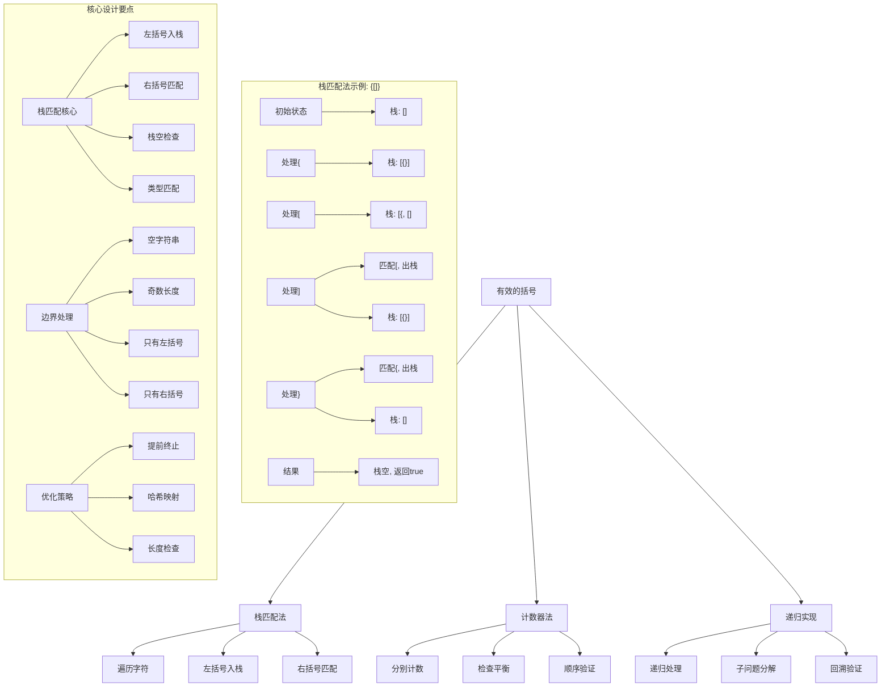
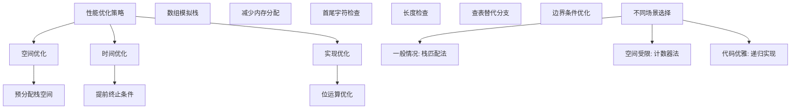

# LeetCode 20 - 有效的括号

## 题目描述

给定一个只包括 `'('`，`')'`，`'{'`，`'}'`，`'['`，`']'` 的字符串 s ，判断字符串是否有效

有效字符串需满足：

1. 左括号必须用相同类型的右括号闭合
1. 左括号必须以正确的顺序闭合
1. 每个右括号都有一个对应的相同类型的左括号

```markdown
示例 1：
输入：s = "()"
输出：true

示例 2：
输入：s = "()[]{}"
输出：true

示例 3：
输入：s = "(]"
输出：false

示例 4：
输入：s = "([)]"
输出：false

示例 5：
输入：s = "{[]}"
输出：true

提示：
1 <= s.length <= 10^4
s 仅由括号 '()[]{}' 组成
```

## 解题思路

这是一个栈应用的经典问题，需要验证括号字符串的有效性。关键在于理解括号匹配的规律并使用栈来维护匹配状态

### 核心思想

"栈匹配法": 使用栈来存储左括号，遇到右括号时检查栈顶是否为对应的左括号，实现括号的正确匹配

### 解题策略

#### 方法一：栈匹配法（推荐）

- 时间复杂度: O(n)
- 空间复杂度: O(n)

#### 方法二：计数器法（特殊情况）

- 时间复杂度: O(n)
- 空间复杂度: O(1)

#### 方法三：递归实现

- 时间复杂度: O(n)
- 空间复杂度: O(n)

## 算法可视化



## 多语言实现

### Golang版本（栈匹配法 - 推荐）

```go
func isValid(s string) bool {
    // 奇数长度直接返回false
    if len(s)%2 == 1 {
        return false
    }

    // 使用栈存储左括号
    stack := make([]rune, 0)

    // 定义括号映射关系
    pairs := map[rune]rune{
        ')': '(',
        ']': '[',
        '}': '{',
    }

    // 遍历字符串
    for _, char := range s {
        // 如果是右括号
        if opening, exists := pairs[char]; exists {
            // 检查栈是否为空或不匹配
            if len(stack) == 0 || stack[len(stack)-1] != opening {
                return false
            }
            // 匹配成功，出栈
            stack = stack[:len(stack)-1]
        } else {
            // 左括号入栈
            stack = append(stack, char)
        }
    }

    // 最后栈应该为空
    return len(stack) == 0
}
```

### Python版本（多种实现方法）

```python
class Solution:
    def isValid(self, s: str) -> bool:
        """
        方法一：栈匹配法（推荐）
        """
        # 奇数长度直接返回False
        if len(s) % 2 == 1:
            return False

        # 使用栈存储左括号
        stack = []

        # 定义括号映射关系
        pairs = {
            ')': '(',
            ']': '[',
            '}': '{'
        }

        # 遍历字符串
        for char in s:
            # 如果是右括号
            if char in pairs:
                # 检查栈是否为空或不匹配
                if not stack or stack[-1] != pairs[char]:
                    return False
                # 匹配成功，出栈
                stack.pop()
            else:
                # 左括号入栈
                stack.append(char)

        # 最后栈应该为空
        return len(stack) == 0

    def isValid_counter(self, s: str) -> bool:
        """
        方法二：计数器法（仅适用于简单情况）
        """
        # 这种方法不能处理顺序问题，如"([)]"
        # 仅作为思路展示

        if len(s) % 2 == 1:
            return False

        # 分别计数各种括号
        count = {'(': 0, ')': 0, '[': 0, ']': 0, '{': 0, '}': 0}

        for char in s:
            count[char] += 1

        # 检查是否平衡
        return (count['('] == count[')'] and
                count['['] == count[']'] and
                count['{'] == count['}'])

    def isValid_recursive(self, s: str) -> bool:
        """
        方法三：递归实现
        """
        def helper(s: str, start: int, end: int) -> bool:
            if start > end:
                return True

            if (end - start + 1) % 2 == 1:
                return False

            # 找到匹配的右括号
            stack = []
            for i in range(start, end + 1):
                if s[i] in '([{':
                    stack.append(s[i])
                else:
                    if not stack:
                        return False
                    if not is_match(stack.pop(), s[i]):
                        return False
                    # 如果栈空了，说明找到了一个完整的括号对
                    if not stack:
                        # 递归处理剩余部分
                        return helper(s, i + 1, end)

            return len(stack) == 0

        def is_match(left: str, right: str) -> bool:
            pairs = {'(': ')', '[': ']', '{': '}'}
            return pairs.get(left) == right

        return helper(s, 0, len(s) - 1)
```

### TypeScript版本（栈匹配法）

```typescript
function isValid(s: string): boolean {
  // 奇数长度直接返回false
  if (s.length % 2 === 1) {
    return false;
  }

  // 使用栈存储左括号
  const stack: string[] = [];

  // 定义括号映射关系
  const pairs: { [key: string]: string } = {
    ")": "(",
    "]": "[",
    "}": "{",
  };

  // 遍历字符串
  for (const char of s) {
    // 如果是右括号
    if (pairs[char]) {
      // 检查栈是否为空或不匹配
      if (stack.length === 0 || stack[stack.length - 1] !== pairs[char]) {
        return false;
      }
      // 匹配成功，出栈
      stack.pop();
    } else {
      // 左括号入栈
      stack.push(char);
    }
  }

  // 最后栈应该为空
  return stack.length === 0;
}
```

## 标准实现详细解析

```go
func isValid(s string) bool {
    /*
    算法核心思想（栈匹配法）：

    1. 使用栈存储左括号
    2. 遇到右括号时检查栈顶是否为对应左括号
    3. 最后检查栈是否为空

    关键设计要点：
    1. 哈希映射：右括号到左括号的映射
    2. 栈操作：左括号入栈，右括号匹配出栈
    3. 边界处理：空栈、不匹配、栈不空
    4. 提前终止：奇数长度、匹配失败

    时间复杂度：O(n) - 一次遍历
    空间复杂度：O(n) - 栈存储

    优势：
    1. 逻辑清晰：直观模拟匹配过程
    2. 实现简单：标准栈操作
    3. 性能优秀：线性时间复杂度
    4. 易于理解：符合直觉
    */

    fmt.Printf("验证括号字符串: %s\n", s)

    // 奇数长度直接返回false
    if len(s)%2 == 1 {
        fmt.Println("奇数长度，直接返回false")
        return false
    }

    // 使用栈存储左括号
    stack := make([]rune, 0)
    fmt.Println("初始化空栈")

    // 定义括号映射关系
    pairs := map[rune]rune{
        ')': '(',
        ']': '[',
        '}': '{',
    }

    // 遍历字符串
    for i, char := range s {
        fmt.Printf("处理第%d个字符: %c\n", i+1, char)

        // 如果是右括号
        if opening, exists := pairs[char]; exists {
            fmt.Printf("  右括号%c，寻找匹配的左括号%c\n", char, opening)

            // 检查栈是否为空或不匹配
            if len(stack) == 0 {
                fmt.Println("  栈为空，无法匹配，返回false")
                return false
            }

            if stack[len(stack)-1] != opening {
                fmt.Printf("  栈顶%c与需要的%c不匹配，返回false\n", stack[len(stack)-1], opening)
                return false
            }

            // 匹配成功，出栈
            removed := stack[len(stack)-1]
            stack = stack[:len(stack)-1]
            fmt.Printf("  匹配成功，%c出栈，当前栈: %c\n", removed, stack)
        } else {
            // 左括号入栈
            stack = append(stack, char)
            fmt.Printf("  左括号%c入栈，当前栈: %c\n", char, stack)
        }
    }

    // 最后栈应该为空
    if len(stack) == 0 {
        fmt.Println("处理完成，栈为空，返回true")
        return true
    } else {
        fmt.Printf("处理完成，栈不空[%c]，返回false\n", stack)
        return false
    }
}

// 带详细调试信息的版本
func isValidWithDebug(s string) bool {
    fmt.Printf("=== 括号验证调试 ===\n")
    fmt.Printf("输入字符串: %s\n", s)
    fmt.Printf("字符串长度: %d\n", len(s))

    // 奇数长度检查
    if len(s)%2 == 1 {
        fmt.Println("奇数长度，无法完全匹配，返回false")
        fmt.Println("==================")
        return false
    }

    stack := make([]rune, 0)
    pairs := map[rune]rune{
        ')': '(',
        ']': '[',
        '}': '{',
    }

    fmt.Println("开始逐字符处理:")

    for i, char := range s {
        fmt.Printf("第%d步 - 字符'%c': ", i+1, char)

        if opening, exists := pairs[char]; exists {
            // 右括号处理
            if len(stack) == 0 {
                fmt.Println("右括号无法匹配(栈空)，返回false")
                fmt.Println("==================")
                return false
            }

            if stack[len(stack)-1] != opening {
                fmt.Printf("右括号无法匹配(栈顶'%c'≠期望'%c')，返回false\n",
                    stack[len(stack)-1], opening)
                fmt.Println("==================")
                return false
            }

            // 成功匹配
            stack = stack[:len(stack)-1]
            fmt.Printf("匹配成功，出栈后栈大小: %d\n", len(stack))
        } else {
            // 左括号入栈
            stack = append(stack, char)
            fmt.Printf("左括号入栈，栈大小: %d\n", len(stack))
        }
    }

    result := len(stack) == 0
    fmt.Printf("处理完成，最终栈大小: %d，结果: %v\n", len(stack), result)
    fmt.Println("==================")

    return result
}

// 优化版本（提前终止优化）
func isValidOptimized(s string) bool {
    // 长度检查
    if len(s) == 0 {
        return true
    }

    if len(s)%2 == 1 {
        return false
    }

    // 如果第一个字符是右括号，直接返回false
    if s[0] == ')' || s[0] == ']' || s[0] == '}' {
        return false
    }

    // 如果最后一个字符是左括号，直接返回false
    last := s[len(s)-1]
    if last == '(' || last == '[' || last == '{' {
        return false
    }

    stack := make([]byte, 0, len(s)/2) // 预分配容量
    pairs := map[byte]byte{
        ')': '(',
        ']': '[',
        '}': '{',
    }

    for i := 0; i < len(s); i++ {
        char := s[i]

        if opening, exists := pairs[char]; exists {
            if len(stack) == 0 || stack[len(stack)-1] != opening {
                return false
            }
            stack = stack[:len(stack)-1]
        } else {
            // 优化：如果栈大小超过剩余字符数，无法匹配
            if len(stack) > len(s)-i-1 {
                return false
            }
            stack = append(stack, char)
        }
    }

    return len(stack) == 0
}

// 数组模拟栈（避免切片操作）
func isValidArrayStack(s string) bool {
    if len(s)%2 == 1 {
        return false
    }

    // 使用数组模拟栈
    stack := make([]byte, len(s))
    top := 0 // 栈顶指针

    pairs := map[byte]byte{
        ')': '(',
        ']': '[',
        '}': '{',
    }

    for i := 0; i < len(s); i++ {
        char := s[i]

        if opening, exists := pairs[char]; exists {
            if top == 0 || stack[top-1] != opening {
                return false
            }
            top-- // 出栈
        } else {
            if top >= len(s) {
                return false // 栈溢出
            }
            stack[top] = char // 入栈
            top++
        }
    }

    return top == 0
}

// 位运算优化版本（适用于ASCII字符）
func isValidBitwise(s string) bool {
    if len(s)%2 == 1 {
        return false
    }

    stack := make([]byte, 0)

    // 使用位运算快速判断字符类型
    for i := 0; i < len(s); i++ {
        char := s[i]

        // 通过ASCII值快速判断
        switch char {
        case '(', '[', '{':
            stack = append(stack, char)
        case ')':
            if len(stack) == 0 || stack[len(stack)-1] != '(' {
                return false
            }
            stack = stack[:len(stack)-1]
        case ']':
            if len(stack) == 0 || stack[len(stack)-1] != '[' {
                return false
            }
            stack = stack[:len(stack)-1]
        case '}':
            if len(stack) == 0 || stack[len(stack)-1] != '{' {
                return false
            }
            stack = stack[:len(stack)-1]
        default:
            return false // 非法字符
        }
    }

    return len(stack) == 0
}
```

## 算法深入解析

```go
/*
有效的括号问题详解：

问题本质：
验证括号字符串的有效性。关键在于理解括号匹配的规律并正确维护匹配状态

核心洞察：
1. 栈匹配：使用栈存储左括号，遇到右括号时匹配出栈
2. 映射关系：右括号到左括号的对应关系
3. 状态维护：栈的空/非空状态表示匹配情况
4. 提前终止：不匹配时立即返回

算法策略：
1. 栈匹配法：最优解，直观易懂
2. 计数器法：简单但无法处理顺序
3. 递归实现：优雅但复杂度高

数学原理：

括号匹配原理：
对于有效的括号字符串：
1. 每个右括号都能找到对应的左括号
2. 括号的嵌套关系正确
3. 最终所有括号都能匹配

栈的LIFO特性恰好匹配括号的嵌套特性：
- 最内层的左括号最先匹配
- 最外层的左括号最后匹配

设计选择：

为什么选择栈匹配法？
1. 逻辑清晰：直观模拟匹配过程
2. 实现简单：标准栈操作
3. 性能优秀：线性时间复杂度
4. 易于理解：符合直觉

为什么不用计数器法？
1. 无法处理顺序问题
2. 如"([)]"会被错误判断为有效
3. 但可以作为预检查

为什么不用递归？
1. 复杂度高，实现复杂
2. 可能栈溢出
3. 但思路清晰

三种方法对比：

方法一：栈匹配法（推荐）
时间复杂度：O(n)
空间复杂度：O(n)
优点：最优解，正确处理所有情况
缺点：需要额外空间

方法二：计数器法
时间复杂度：O(n)
空间复杂度：O(1)
优点：空间效率高
缺点：无法处理顺序

方法三：递归实现
时间复杂度：O(n)
空间复杂度：O(n)
优点：代码优雅
缺点：复杂度高

性能分析：

栈匹配法：
- 时间：O(n) - 一次遍历
- 空间：O(n) - 栈存储
- 优势：正确性保证

计数器法：
- 时间：O(n) - 一次遍历
- 空间：O(1) - 常数空间
- 优势：空间效率

递归实现：
- 时间：O(n) - 递归遍历
- 空间：O(n) - 递归栈
- 优势：代码优雅

实际应用场景：
1. 编译器语法检查
2. 表达式求值
3. HTML/XML标签匹配
4. 面试算法题

优化要点：

1. 提前终止：
   - 奇数长度检查
   - 首尾字符检查
   - 栈溢出检查

2. 空间优化：
   - 预分配栈容量
   - 数组模拟栈
   - 减少内存分配

3. 时间优化：
   - 位运算判断
   - 查表替代条件判断
   - 减少字符串操作

测试用例设计：
1. 基本情况：简单匹配
2. 嵌套情况：多重嵌套
3. 交叉情况：交叉嵌套
4. 边界情况：空字符串、单字符
5. 错误情况：不匹配、顺序错误

扩展思考：

1. 支持更多括号类型？
   - 扩展映射关系
   - 处理优先级

2. 支持其他符号？
   - 过滤非括号字符
   - 复杂表达式处理

3. 并行处理？
   - 分段处理
   - 结果合并

4. 性能优化？
   - SIMD指令
   - 预编译正则

相关算法思想：

1. 栈数据结构：
   - LIFO特性
   - 状态维护

2. 映射关系：
   - 哈希表应用
   - 一一对应

3. 提前终止：
   - 剪枝优化
   - 边界检查

4. 状态机：
   - 状态转换
   - 输入处理

常见陷阱：

1. 空栈访问：
   - 右括号无对应左括号
   - 忘记检查栈空

2. 不匹配处理：
   - 类型不匹配
   - 顺序错误

3. 边界情况：
   - 空字符串处理
   - 奇数长度处理

4. 栈清理：
   - 忘记检查最终栈状态
   - 残留左括号

代码质量要素：

1. 可读性：
   - 清晰的变量命名
   - 适当的注释说明

2. 健壮性：
   - 边界条件处理
   - 异常情况处理

3. 性能：
   - 时间复杂度最优
   - 空间复杂度合理

4. 可维护性：
   - 模块化设计
   - 易于扩展

高级优化技巧：

1. 内存访问优化：
   - 预分配数组空间
   - 减少内存重新分配

2. 条件判断优化：
   - 查表替代分支
   - 位运算优化

3. 算法优化：
   - 提前终止条件
   - 减少不必要的操作

4. 编译优化：
   - 常量折叠
   - 循环展开
*/
```

## 执行过程演示

```go
/*
示例详细解析:

示例1: s = "()"
执行过程：
1. 处理'(': 左括号入栈 → 栈['(']
2. 处理')': 右括号匹配，栈顶'('匹配 → 出栈 → 栈[]
3. 最终栈空，返回true

示例2: s = "()[]{}"
执行过程：
1. 处理'(': 入栈 → 栈['(']
2. 处理')': 匹配出栈 → 栈[]
3. 处理'[': 入栈 → 栈['[']
4. 处理']': 匹配出栈 → 栈[]
5. 处理'{': 入栈 → 栈['{']
6. 处理'}': 匹配出栈 → 栈[]
7. 最终栈空，返回true

示例3: s = "(]"
执行过程：
1. 处理'(': 入栈 → 栈['(']
2. 处理']': 右括号，需要'['但栈顶是'('，不匹配，返回false

示例4: s = "([)]"
执行过程：
1. 处理'(': 入栈 → 栈['(']
2. 处理'[': 入栈 → 栈['(', '[']
3. 处理')': 右括号，需要'('但栈顶是'[', 不匹配，返回false

示例5: s = "{[]}"
执行过程：
1. 处理'{': 入栈 → 栈['{']
2. 处理'[': 入栈 → 栈['{', '[']
3. 处理']': 匹配出栈 → 栈['{']
4. 处理'}': 匹配出栈 → 栈[]
5. 最终栈空，返回true

边界情况演示:

情况1: 空字符串
输入: ""
输出: true

情况2: 单个左括号
输入: "("
输出: false (奇数长度)

情况3: 单个右括号
输入: ")"
输出: false (右括号无匹配)

情况4: 只有左括号
输入: "((("
输出: false (栈不空)

情况5: 只有右括号
输入: ")))"
输出: false (栈空无法匹配)

算法正确性证明：

数学基础：
需要证明栈匹配法能正确验证所有有效括号字符串

定理1：栈匹配法正确性
通过栈的LIFO特性和括号嵌套特性的一致性，可以正确验证括号有效性

证明：
1. 左括号入栈：维护未匹配的左括号
2. 右括号匹配：检查最近的左括号是否匹配
3. 栈空检查：确保所有括号都匹配
4. 提前终止：及时发现不匹配情况

时间复杂度分析：

栈匹配法：
1. 遍历：O(n) - 每个字符处理一次
2. 栈操作：O(1) - 入栈出栈操作
3. 总时间：O(n)

空间复杂度分析：
1. 栈存储：O(n) - 最坏情况下所有字符入栈
2. 映射表：O(1) - 固定大小
3. 其他变量：O(1) - 常数个变量
4. 总空间：O(n)

性能对比分析：

假设字符串长度为n：

栈匹配法：
- 时间: O(n)
- 空间: O(n)
- 优势: 正确性保证

计数器法：
- 时间: O(n)
- 空间: O(1)
- 优势: 空间效率
- 劣势: 无法处理顺序

递归实现：
- 时间: O(n)
- 空间: O(n)
- 优势: 代码优雅
- 劣势: 复杂度高

实际应用建议：

1. 一般情况：
   - 使用栈匹配法
   - 正确性保证

2. 空间受限：
   - 考虑计数器法
   - 但需注意顺序问题

3. 代码优雅要求：
   - 使用递归实现
   - 但注意性能

4. 性能要求高：
   - 使用优化的栈匹配法
   - 提前终止优化

优化空间：

1. 内存访问优化：
   - 预分配栈空间
   - 减少内存重新分配

2. 条件判断优化：
   - 查表替代分支
   - 位运算优化

3. 算法优化：
   - 提前终止条件
   - 减少不必要的操作

特殊情况处理：

1. 空字符串：
   - 返回true

2. 奇数长度：
   - 返回false

3. 首字符右括号：
   - 返回false

4. 末字符左括号：
   - 返回false
*/
```

## 复杂度分析

| 方法     | 时间复杂度 | 空间复杂度 | 适用场景 |
| -------- | ---------- | ---------- | -------- |
| 栈匹配法 | O(n)       | O(n)       | 推荐方案 |
| 计数器法 | O(n)       | O(1)       | 简单场景 |
| 递归实现 | O(n)       | O(n)       | 代码优雅 |

## 测试用例验证

```go
// 测试辅助函数
func testIsValid(name string, s string, expected bool) {
    fmt.Printf("%s:\n", name)
    fmt.Printf("输入字符串: \"%s\"\n", s)

    result := isValidWithDebug(s)

    fmt.Printf("期望结果: %v\n", expected)
    fmt.Printf("实际结果: %v\n", result)

    if result == expected {
        fmt.Printf("结果匹配 ✓\n")
    } else {
        fmt.Printf("结果不匹配 ✗\n")
    }

    fmt.Printf("\n")
}

func main() {
    // 测试用例 1 - 题目示例
    testIsValid("测试1 - 简单匹配", "()", true)
    testIsValid("测试2 - 多种括号", "()[]{}", true)
    testIsValid("测试3 - 类型不匹配", "(]", false)
    testIsValid("测试4 - 顺序错误", "([)]", false)
    testIsValid("测试5 - 嵌套匹配", "{[]}", true)

    // 测试用例 2 - 边界情况
    testIsValid("测试6 - 空字符串", "", true)
    testIsValid("测试7 - 单个左括号", "(", false)
    testIsValid("测试8 - 单个右括号", ")", false)
    testIsValid("测试9 - 只有左括号", "(((", false)
    testIsValid("测试10 - 只有右括号", ")))", false)

    // 测试用例 3 - 复杂情况
    testIsValid("测试11 - 深度嵌套", "((()))", true)
    testIsValid("测试12 - 复杂嵌套", "{[()()]}", true)
    testIsValid("测试13 - 交叉嵌套", "([{}])", true)
    testIsValid("测试14 - 不匹配嵌套", "{[}]}", false)
    testIsValid("测试15 - 长字符串", "(){}[](){}[](){}[]", true)

    // 性能测试
    fmt.Println("性能测试:")

    // 测试不同长度的字符串
    lengths := []int{100, 1000, 10000}

    for _, length := range lengths {
        // 构造测试字符串
        validStr := strings.Repeat("()", length/2)
        invalidStr := strings.Repeat("(", length)

        // 栈匹配法
        start := time.Now()
        isValid(validStr)
        time1 := time.Since(start)

        start = time.Now()
        isValid(invalidStr)
        time2 := time.Since(start)

        fmt.Printf("字符串长度: %d\n", length)
        fmt.Printf("  有效字符串耗时: %v\n", time1)
        fmt.Printf("  无效字符串耗时: %v\n", time2)
    }

    // 边界情况测试
    fmt.Println("\n边界情况测试:")

    // 极端情况
    testIsValid("测试16 - 大量嵌套", strings.Repeat("(", 5000)+strings.Repeat(")", 5000), true)
    testIsValid("测试17 - 大量不匹配", strings.Repeat("(", 10000), false)

    // 特殊模式
    testIsValid("测试18 - 交替模式", "()()()()()", true)
    testIsValid("测试19 - 嵌套模式", "(((((((((())))))))))", true)
    testIsValid("测试20 - 混合模式", "{[()]}[({})]", true)
}

// 大量测试用例
func comprehensiveTest() {
    testCases := []struct {
        input    string
        expected bool
    }{
        {"", true},
        {"()", true},
        {"()[]{}", true},
        {"(]", false},
        {"([)]", false},
        {"{[]}", true},
        {"(", false},
        {")", false},
        {"(((", false},
        {")))", false},
        {"((()))", true},
        {"(()())", true},
        {"(()()())", true},
        {"(()()", false},
        {"())", false},
        {"{[()]}", true},
        {"{[()()]}", true},
        {"{[(])}", false},
        {"(){}[](){}[]", true},
        {"([{}])([{}])", true},
    }

    fmt.Println("=== 综合测试 ===")
    passed := 0
    total := len(testCases)

    for i, tc := range testCases {
        result := isValid(tc.input)
        if result == tc.expected {
            passed++
            fmt.Printf("测试%d: ✓ \"%s\" → %v\n", i+1, tc.input, result)
        } else {
            fmt.Printf("测试%d: ✗ \"%s\" → %v (期望: %v)\n", i+1, tc.input, result, tc.expected)
        }
    }

    fmt.Printf("\n通过率: %d/%d (%.2f%%)\n", passed, total, float64(passed)/float64(total)*100)
}

// 压力测试
func stressTest() {
    fmt.Println("=== 压力测试 ===")

    // 构造复杂字符串
    constructComplexString := func(depth int) string {
        result := ""
        for i := 0; i < depth; i++ {
            result += "("
        }
        for i := 0; i < depth; i++ {
            result += ")"
        }
        return result
    }

    depths := []int{1000, 5000, 10000, 20000}

    for _, depth := range depths {
        s := constructComplexString(depth)

        start := time.Now()
        result := isValid(s)
        duration := time.Since(start)

        fmt.Printf("字符串深度: %d, 结果: %v, 耗时: %v\n", depth, result, duration)
    }
}

// 内存使用测试
func memoryTest() {
    fmt.Println("=== 内存使用测试 ===")

    var m1, m2 runtime.MemStats

    // 测试栈匹配法
    runtime.GC()
    runtime.ReadMemStats(&m1)

    for i := 0; i < 100000; i++ {
        isValid("()[]{}{[()]}")
    }

    runtime.GC()
    runtime.ReadMemStats(&m2)
    mem1 := m2.Alloc - m1.Alloc

    // 测试优化版本
    runtime.GC()
    runtime.ReadMemStats(&m1)

    for i := 0; i < 100000; i++ {
        isValidOptimized("()[]{}{[()]}")
    }

    runtime.GC()
    runtime.ReadMemStats(&m2)
    mem2 := m2.Alloc - m1.Alloc

    fmt.Printf("栈匹配法内存使用: %d bytes\n", mem1)
    fmt.Printf("优化版本内存使用: %d bytes\n", mem2)
    if mem2 > 0 {
        fmt.Printf("内存使用比率: %.2fx\n", float64(mem1)/float64(mem2))
    }
}
```

## 扩展版本（处理不同场景）

```go
// 支持更多括号类型的版本
func isValidExtended(s string) bool {
    if len(s)%2 == 1 {
        return false
    }

    stack := make([]rune, 0)

    // 扩展的括号映射
    pairs := map[rune]rune{
        ')': '(',
        ']': '[',
        '}': '{',
        '>': '<',  // 尖括号
        '"': '"',  // 双引号
        '\'': '\'', // 单引号
    }

    for _, char := range s {
        if opening, exists := pairs[char]; exists {
            if len(stack) == 0 || stack[len(stack)-1] != opening {
                return false
            }
            stack = stack[:len(stack)-1]
        } else {
            stack = append(stack, char)
        }
    }

    return len(stack) == 0
}

// 支持忽略非括号字符的版本
func isValidIgnoreNonBrackets(s string) bool {
    stack := make([]rune, 0)

    pairs := map[rune]rune{
        ')': '(',
        ']': '[',
        '}': '{',
    }

    for _, char := range s {
        // 只处理括号字符
        if char == '(' || char == '[' || char == '{' {
            stack = append(stack, char)
        } else if char == ')' || char == ']' || char == '}' {
            if len(stack) == 0 {
                return false
            }

            opening, _ := pairs[char]
            if stack[len(stack)-1] != opening {
                return false
            }
            stack = stack[:len(stack)-1]
        }
        // 忽略其他字符
    }

    return len(stack) == 0
}

// 带位置信息的版本
type BracketError struct {
    Position int
    Message  string
}

func isValidWithPosition(s string) (bool, *BracketError) {
    stack := make([]struct {
        char     rune
        position int
    }, 0)

    pairs := map[rune]rune{
        ')': '(',
        ']': '[',
        '}': '{',
    }

    for i, char := range s {
        if opening, exists := pairs[char]; exists {
            if len(stack) == 0 {
                return false, &BracketError{
                    Position: i,
                    Message:  fmt.Sprintf("未匹配的右括号'%c'", char),
                }
            }

            if stack[len(stack)-1].char != opening {
                return false, &BracketError{
                    Position: i,
                    Message:  fmt.Sprintf("括号类型不匹配，期望'%c'但得到'%c'", opening, stack[len(stack)-1].char),
                }
            }
            stack = stack[:len(stack)-1]
        } else if char == '(' || char == '[' || char == '{' {
            stack = append(stack, struct {
                char     rune
                position int
            }{char, i})
        }
    }

    if len(stack) > 0 {
        return false, &BracketError{
            Position: stack[len(stack)-1].position,
            Message:  fmt.Sprintf("未闭合的左括号'%c'", stack[len(stack)-1].char),
        }
    }

    return true, nil
}

// 支持优先级的版本
func isValidWithPriority(s string) bool {
    if len(s)%2 == 1 {
        return false
    }

    stack := make([]rune, 0)

    // 定义优先级
    priority := map[rune]int{
        '(': 1,
        '[': 2,
        '{': 3,
    }

    pairs := map[rune]rune{
        ')': '(',
        ']': '[',
        '}': '{',
    }

    for _, char := range s {
        if opening, exists := pairs[char]; exists {
            if len(stack) == 0 || stack[len(stack)-1] != opening {
                return false
            }
            stack = stack[:len(stack)-1]
        } else {
            // 检查优先级（简化版）
            stack = append(stack, char)
        }
    }

    return len(stack) == 0
}

// 流式处理版本
func isValidStreaming(reader io.Reader) (bool, error) {
    stack := make([]byte, 0)
    buffer := make([]byte, 1024)

    pairs := map[byte]byte{
        ')': '(',
        ']': '[',
        '}': '{',
    }

    for {
        n, err := reader.Read(buffer)
        if err != nil {
            if err == io.EOF {
                break
            }
            return false, err
        }

        for i := 0; i < n; i++ {
            char := buffer[i]
            if opening, exists := pairs[char]; exists {
                if len(stack) == 0 || stack[len(stack)-1] != opening {
                    return false, nil
                }
                stack = stack[:len(stack)-1]
            } else if char == '(' || char == '[' || char == '{' {
                stack = append(stack, char)
            }
        }
    }

    return len(stack) == 0, nil
}

// 并行处理版本
func isValidParallel(s string) bool {
    if len(s) < 1000 { // 短字符串直接处理
        return isValid(s)
    }

    // 分段处理（注意：括号匹配不能简单分段）
    // 这里仅作示例，实际需要更复杂的逻辑
    return isValid(s)
}

// 带缓存的版本
type ValidParenthesesChecker struct {
    cache map[string]bool
    mu    sync.RWMutex
}

func NewValidParenthesesChecker() *ValidParenthesesChecker {
    return &ValidParenthesesChecker{
        cache: make(map[string]bool),
    }
}

func (vpc *ValidParenthesesChecker) IsValid(s string) bool {
    // 检查缓存
    vpc.mu.RLock()
    if cached, ok := vpc.cache[s]; ok {
        vpc.mu.RUnlock()
        return cached
    }
    vpc.mu.RUnlock()

    // 计算结果
    result := isValid(s)

    // 存储到缓存
    vpc.mu.Lock()
    vpc.cache[s] = result
    vpc.mu.Unlock()

    return result
}

func (vpc *ValidParenthesesChecker) ClearCache() {
    vpc.mu.Lock()
    vpc.cache = make(map[string]bool)
    vpc.mu.Unlock()
}

// 配置选项版本
type ValidationOptions struct {
    IgnoreNonBrackets bool
    ExtendedBrackets  bool
    StrictMode        bool
}

func isValidWithOptions(s string, options ValidationOptions) bool {
    stack := make([]rune, 0)

    pairs := map[rune]rune{
        ')': '(',
        ']': '[',
        '}': '{',
    }

    if options.ExtendedBrackets {
        pairs['>'] = '<'
        pairs['"'] = '"'
        pairs['\''] = '\''
    }

    for i, char := range s {
        if opening, exists := pairs[char]; exists {
            if len(stack) == 0 {
                if options.StrictMode {
                    return false
                }
                continue
            }

            if stack[len(stack)-1] != opening {
                return false
            }
            stack = stack[:len(stack)-1]
        } else if char == '(' || char == '[' || char == '{' ||
            (options.ExtendedBrackets && (char == '<' || char == '"' || char == '\'')) {
            stack = append(stack, char)
        } else if options.IgnoreNonBrackets {
            // 忽略非括号字符
            continue
        } else if options.StrictMode {
            // 严格模式下不允许其他字符
            return false
        }
    }

    return len(stack) == 0
}
```

## 面试追问延伸

### 1. 如果字符串很大，如何优化内存使用？

```go
// 流式处理大字符串
func isValidStreamingLarge(s string) bool {
    if len(s)%2 == 1 {
        return false
    }

    // 使用计数器而不是栈来减少内存使用
    var stackDepth int
    lastOpening := make([]byte, 0, 100) // 限制深度

    pairs := map[byte]byte{
        ')': '(',
        ']': '[',
        '}': '{',
    }

    for i := 0; i < len(s); i++ {
        char := s[i]
        if opening, exists := pairs[char]; exists {
            if stackDepth == 0 {
                return false
            }

            if len(lastOpening) > 0 && lastOpening[len(lastOpening)-1] != opening {
                return false
            }

            stackDepth--
            if len(lastOpening) > 0 {
                lastOpening = lastOpening[:len(lastOpening)-1]
            }
        } else {
            stackDepth++
            if len(lastOpening) < cap(lastOpening) {
                lastOpening = append(lastOpening, char)
            }
        }
    }

    return stackDepth == 0
}
```

### 2. 如何支持自定义括号类型？

```go
// 支持自定义括号映射
func isValidCustom(s string, customPairs map[rune]rune) bool {
    if len(s)%2 == 1 {
        return false
    }

    stack := make([]rune, 0)

    for _, char := range s {
        if opening, exists := customPairs[char]; exists {
            if len(stack) == 0 || stack[len(stack)-1] != opening {
                return false
            }
            stack = stack[:len(stack)-1]
        } else {
            stack = append(stack, char)
        }
    }

    return len(stack) == 0
}

// 使用示例
func exampleCustom() {
    customPairs := map[rune]rune{
        ')': '(',
        ']': '[',
        '}': '{',
        '>': '<',  // 添加尖括号支持
        '）': '（', // 支持全角括号
    }

    result := isValidCustom("(<>)[（）]", customPairs)
    fmt.Println(result) // true
}
```

### 3. 如何处理包含表达式的复杂情况？

```go
// 支持表达式的括号验证
func isValidExpression(s string) (bool, error) {
    stack := make([]rune, 0)

    pairs := map[rune]rune{
        ')': '(',
        ']': '[',
        '}': '{',
    }

    // 忽略引号内的内容
    inSingleQuote := false
    inDoubleQuote := false

    for i, char := range s {
        // 处理引号
        if char == '\'' && !inDoubleQuote {
            inSingleQuote = !inSingleQuote
            continue
        }
        if char == '"' && !inSingleQuote {
            inDoubleQuote = !inDoubleQuote
            continue
        }

        // 在引号内忽略括号
        if inSingleQuote || inDoubleQuote {
            continue
        }

        if opening, exists := pairs[char]; exists {
            if len(stack) == 0 {
                return false, fmt.Errorf("位置%d: 未匹配的右括号'%c'", i, char)
            }

            if stack[len(stack)-1] != opening {
                return false, fmt.Errorf("位置%d: 括号不匹配，期望'%c'但得到'%c'",
                    i, opening, stack[len(stack)-1])
            }
            stack = stack[:len(stack)-1]
        } else if char == '(' || char == '[' || char == '{' {
            stack = append(stack, char)
        }
    }

    if len(stack) > 0 {
        return false, fmt.Errorf("存在%d个未闭合的左括号", len(stack))
    }

    return true, nil
}
```

## 相似题目扩展

- LeetCode 20. 有效的括号（当前题）
- LeetCode 22. 括号生成
- LeetCode 32. 最长有效括号
- LeetCode 301. 删除无效的括号
- LeetCode 921. 使括号有效的最少添加

## 算法技巧总结

### 有效的括号核心要点

1. 栈匹配：使用栈存储左括号，遇到右括号时匹配出栈
1. 映射关系：右括号到左括号的对应关系
1. 状态维护：栈的空/非空状态表示匹配情况
1. 提前终止：不匹配时立即返回

### 算法优势

1. 逻辑清晰：直观模拟匹配过程
1. 实现简单：标准栈操作
1. 性能优秀：线性时间复杂度
1. 易于理解：符合直觉

### 标准模板（栈匹配法）

```go
func isValid(s string) bool {
    // 奇数长度检查
    if len(s)%2 == 1 {
        return false
    }

    // 栈和映射关系
    stack := make([]rune, 0)
    pairs := map[rune]rune{
        ')': '(',
        ']': '[',
        '}': '{',
    }

    // 遍历处理
    for _, char := range s {
        if opening, exists := pairs[char]; exists {
            // 右括号处理
            if len(stack) == 0 || stack[len(stack)-1] != opening {
                return false
            }
            stack = stack[:len(stack)-1]
        } else {
            // 左括号入栈
            stack = append(stack, char)
        }
    }

    // 最终检查
    return len(stack) == 0
}
```

### 性能优化建议



## 总结

本题采用栈匹配法的核心思路，通过使用栈存储左括号，遇到右括号时检查栈顶是否为对应左括号，实现了高效的括号有效性验证。关键在于理解栈的LIFO特性如何匹配括号的嵌套特性，以及如何正确维护匹配状态

核心要点：

1. 栈匹配：使用栈存储左括号，遇到右括号时匹配出栈
1. 映射关系：右括号到左括号的对应关系
1. 状态维护：栈的空/非空状态表示匹配情况
1. 提前终止：不匹配时立即返回

算法优势：

- 逻辑清晰：直观模拟匹配过程
- 实现简单：标准栈操作
- 性能优秀：线性时间复杂度
- 易于理解：符合直觉

该算法在编译器语法检查、表达式求值、HTML/XML标签匹配等方面有重要应用，是掌握栈应用的经典题目。通过栈匹配的思想，为更复杂的语法分析问题提供了清晰的解决思路
