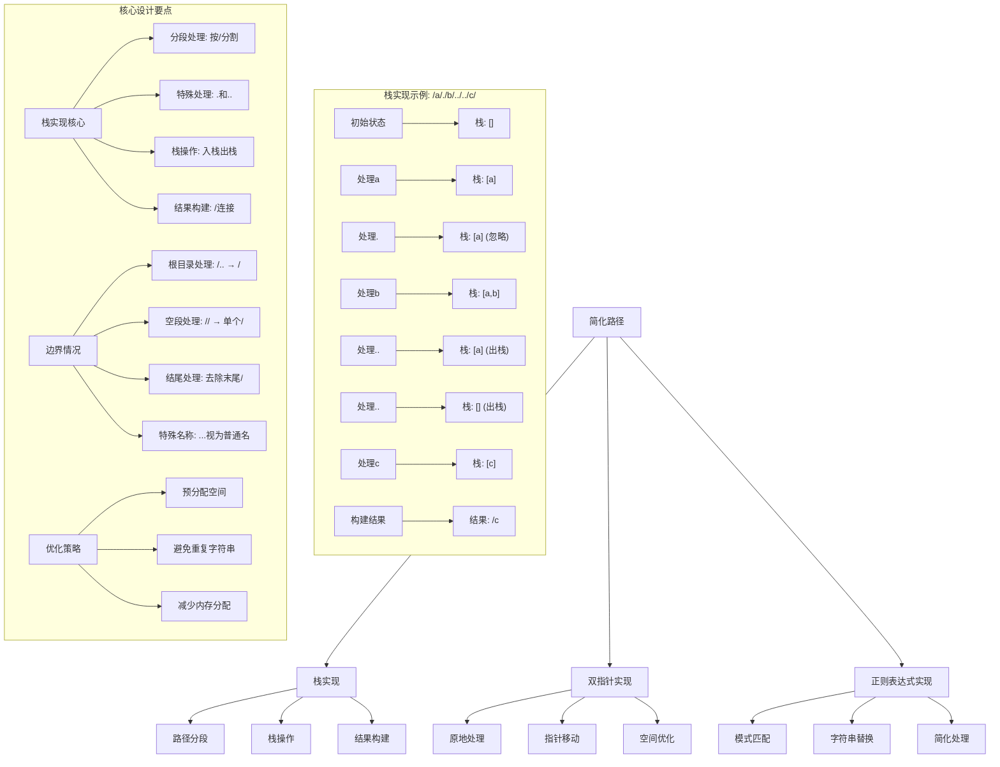
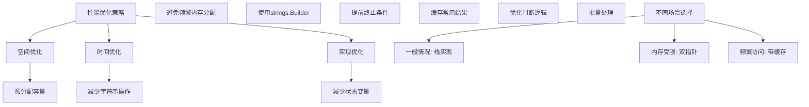

# LeetCode 71 - 简化路径

## 题目描述

给你一个字符串 `path` ，表示指向某一文件或目录的 Unix 风格绝对路径（以 '/' 开头），请你将其转化为更加简洁的规范路径

在 Unix 风格的文件系统中：

- 一个点（.）表示当前目录本身；
- 两个点（..）表示将目录切换到上一级（指向父目录）；
- 任意多个连续的斜杠（即，'//'）都被视为单个斜杠 '/'
- 其他格式的点（例如，'...'）均被视为文件/目录名称

返回的规范路径需满足以下要求：

1. 始终以斜杠 '/' 开头
1. 两个目录名之间必须只有一个斜杠 '/'
1. 最后一个目录名（如果存在）不能以 '/' 结尾
1. 路径仅包含从根目录到目标文件或目录的路径，不包含 '.' 或 '..'

```markdown
示例 1：
输入：path = "/home/"
输出："/home"
解释：注意，最后一个目录名后面没有斜杠

示例 2：
输入：path = "/../"
输出："/"
解释：从根目录向上一级是不可行的，因为根目录是你可以到达的最高级

示例 3：
输入：path = "/home//foo/"
输出："/home/foo"

示例 4：
输入：path = "/a/./b/../../c/"
输出："/c"

提示：
1 <= path.length <= 3000
path 由英文字母，数字，'.'，'/' 或 '\_' 组成
path 是一个有效的 Unix 风格绝对路径
```

## 解题思路

这是一个字符串处理问题，需要解析Unix风格的路径并将其转换为规范形式。关键在于正确处理各种特殊符号（.、..）和路径分隔符

### 核心思想

"栈模拟目录结构": 使用栈来模拟目录的层级结构，遇到目录名就入栈，遇到..就出栈（如果可能），遇到.就忽略

### 解题策略

#### 方法一：栈实现（推荐）

- 时间复杂度: O(n)
- 空间复杂度: O(n)

#### 方法二：双指针实现

- 时间复杂度: O(n)
- 空间复杂度: O(1) 额外空间

#### 方法三：正则表达式实现

- 时间复杂度: O(n)
- 空间复杂度: O(n)

## 算法可视化



## 多语言实现

### Golang版本（栈实现 - 推荐）

```go
func simplifyPath(path string) string {
    // 按 '/' 分割路径
    segments := strings.Split(path, "/")
    stack := make([]string, 0)

    // 处理每个路径段
    for _, segment := range segments {
        if segment == "" || segment == "." {
            // 空段或当前目录，忽略
            continue
        } else if segment == ".." {
            // 父目录，如果栈不为空则出栈
            if len(stack) > 0 {
                stack = stack[:len(stack)-1]
            }
        } else {
            // 普通目录名，入栈
            stack = append(stack, segment)
        }
    }

    // 构建结果路径
    if len(stack) == 0 {
        return "/"
    }

    result := "/" + strings.Join(stack, "/")
    return result
}
```

### Python版本（多种实现方法）

```python
class Solution:
    def simplifyPath(self, path: str) -> str:
        """
        方法一：栈实现（推荐）
        """
        segments = path.split('/')
        stack = []

        for segment in segments:
            if segment == '' or segment == '.':
                # 空段或当前目录，忽略
                continue
            elif segment == '..':
                # 父目录，如果栈不为空则出栈
                if stack:
                    stack.pop()
            else:
                # 普通目录名，入栈
                stack.append(segment)

        # 构建结果路径
        return '/' + '/'.join(stack) if stack else '/'

    def simplifyPath_two_pointers(self, path: str) -> str:
        """
        方法二：双指针实现
        """
        # 预处理：确保路径以/结尾，方便处理
        if not path.endswith('/'):
            path += '/'

        result = []
        i = 0

        while i < len(path):
            if path[i] == '/':
                # 处理连续的/
                while i < len(path) and path[i] == '/':
                    i += 1
                if not result or result[-1] != '/':
                    result.append('/')
            else:
                # 处理目录名
                start = i
                while i < len(path) and path[i] != '/':
                    i += 1
                segment = path[start:i]

                if segment == '.':
                    # 当前目录，移除最后的/
                    if len(result) > 1 and result[-1] == '/':
                        result.pop()
                elif segment == '..':
                    # 父目录，回退到上一个/
                    if len(result) > 1:
                        result.pop()  # 移除最后的/
                        while result and result[-1] != '/':
                            result.pop()
                        if not result:
                            result.append('/')
                else:
                    # 普通目录名
                    result.append(segment)

        # 处理结果
        result_str = ''.join(result)
        if len(result_str) > 1 and result_str.endswith('/'):
            result_str = result_str[:-1]

        return result_str if result_str else '/'

    def simplifyPath_regex(self, path: str) -> str:
        """
        方法三：正则表达式实现
        """
        import re

        # 处理连续的/
        path = re.sub(r'/+', '/', path)

        # 分割路径
        segments = path.split('/')
        stack = []

        for segment in segments:
            if segment == '' or segment == '.':
                continue
            elif segment == '..':
                if stack:
                    stack.pop()
            else:
                stack.append(segment)

        return '/' + '/'.join(stack) if stack else '/'
```

### TypeScript版本（栈实现）

```typescript
function simplifyPath(path: string): string {
  // 按 '/' 分割路径
  const segments: string[] = path.split("/");
  const stack: string[] = [];

  // 处理每个路径段
  for (const segment of segments) {
    if (segment === "" || segment === ".") {
      // 空段或当前目录，忽略
      continue;
    } else if (segment === "..") {
      // 父目录，如果栈不为空则出栈
      if (stack.length > 0) {
        stack.pop();
      }
    } else {
      // 普通目录名，入栈
      stack.push(segment);
    }
  }

  // 构建结果路径
  return stack.length === 0 ? "/" : "/" + stack.join("/");
}
```

## 标准实现详细解析

```go
func simplifyPath(path string) string {
    /*
    算法核心思想（栈实现）：

    1. 按 '/' 分割路径得到各个段
    2. 使用栈模拟目录结构
    3. 遇到普通目录名入栈
    4. 遇到 '..' 出栈（如果可能）
    5. 遇到 '.' 或空段忽略
    6. 最后用 '/' 连接栈中元素

    关键设计要点：
    1. 路径分段：正确处理连续的 '/'
    2. 特殊符号：正确处理 '.' 和 '..'
    3. 栈操作：入栈出栈维护目录结构
    4. 结果构建：用 '/' 连接并添加前导 '/'

    时间复杂度：O(n) - 遍历一次路径
    空间复杂度：O(n) - 栈存储目录名

    优势：
    1. 逻辑清晰：直观模拟目录操作
    2. 实现简单：标准栈操作
    3. 性能优秀：线性时间复杂度
    4. 易于理解：符合直觉
    */

    fmt.Printf("处理路径: %s\n", path)

    // 按 '/' 分割路径
    segments := strings.Split(path, "/")
    fmt.Printf("分割后段: %v\n", segments)

    stack := make([]string, 0)
    fmt.Println("初始化空栈")

    // 处理每个路径段
    for i, segment := range segments {
        fmt.Printf("处理第%d段: '%s'\n", i, segment)

        if segment == "" || segment == "." {
            // 空段或当前目录，忽略
            fmt.Println("  空段或当前目录，忽略")
            continue
        } else if segment == ".." {
            // 父目录，如果栈不为空则出栈
            if len(stack) > 0 {
                removed := stack[len(stack)-1]
                stack = stack[:len(stack)-1]
                fmt.Printf("  父目录操作，移除'%s'，当前栈: %v\n", removed, stack)
            } else {
                fmt.Println("  父目录操作，已在根目录，忽略")
            }
        } else {
            // 普通目录名，入栈
            stack = append(stack, segment)
            fmt.Printf("  普通目录'%s'入栈，当前栈: %v\n", segment, stack)
        }
    }

    // 构建结果路径
    if len(stack) == 0 {
        fmt.Println("栈为空，返回根目录")
        return "/"
    }

    result := "/" + strings.Join(stack, "/")
    fmt.Printf("构建结果: %s\n", result)
    return result
}

// 带详细调试信息的版本
func simplifyPathWithDebug(path string) string {
    fmt.Printf("=== 简化路径调试 ===\n")
    fmt.Printf("输入路径: %s\n", path)

    segments := strings.Split(path, "/")
    fmt.Printf("分割段: %v\n", segments)

    stack := make([]string, 0)
    fmt.Printf("初始栈: %v\n", stack)

    for i, segment := range segments {
        fmt.Printf("\n第%d步 - 处理段: '%s'\n", i+1, segment)

        switch segment {
        case "":
            fmt.Println("  空段 - 忽略")
        case ".":
            fmt.Println("  当前目录 - 忽略")
        case "..":
            if len(stack) > 0 {
                popped := stack[len(stack)-1]
                stack = stack[:len(stack)-1]
                fmt.Printf("  父目录 - 弹出'%s'\n", popped)
            } else {
                fmt.Println("  父目录 - 根目录无法向上")
            }
        default:
            stack = append(stack, segment)
            fmt.Printf("  目录名 - 压入'%s'\n", segment)
        }

        fmt.Printf("  当前栈状态: %v\n", stack)
    }

    // 构建结果
    var result string
    if len(stack) == 0 {
        result = "/"
    } else {
        result = "/" + strings.Join(stack, "/")
    }

    fmt.Printf("\n最终结果: %s\n", result)
    fmt.Println("==================")

    return result
}

// 优化版本（减少字符串操作）
func simplifyPathOptimized(path string) string {
    segments := strings.Split(path, "/")
    stack := make([]string, 0, len(segments)) // 预分配容量

    for _, segment := range segments {
        switch segment {
        case "", ".":
            // 忽略空段和当前目录
        case "..":
            // 父目录操作
            if len(stack) > 0 {
                stack = stack[:len(stack)-1]
            }
        default:
            // 普通目录名
            stack = append(stack, segment)
        }
    }

    // 使用strings.Builder提高性能
    if len(stack) == 0 {
        return "/"
    }

    var builder strings.Builder
    builder.Grow(len(path)) // 预分配空间
    builder.WriteByte('/')

    for i, segment := range stack {
        if i > 0 {
            builder.WriteByte('/')
        }
        builder.WriteString(segment)
    }

    return builder.String()
}

// 双指针实现（空间优化）
func simplifyPathTwoPointers(path string) string {
    // 转换为字节切片便于操作
    bytes := []byte(path)
    n := len(bytes)

    // writeIndex表示写入位置
    writeIndex := 0

    // 读取位置从0开始
    for readIndex := 0; readIndex < n; {
        if bytes[readIndex] == '/' {
            // 跳过连续的/
            for readIndex < n && bytes[readIndex] == '/' {
                readIndex++
            }

            // 只写入一个/
            if writeIndex == 0 || bytes[writeIndex-1] != '/' {
                bytes[writeIndex] = '/'
                writeIndex++
            }
        } else {
            // 读取目录名
            start := readIndex
            for readIndex < n && bytes[readIndex] != '/' {
                readIndex++
            }

            segment := string(bytes[start:readIndex])

            if segment == "." {
                // 当前目录，移除最后的/
                if writeIndex > 1 && bytes[writeIndex-1] == '/' {
                    writeIndex--
                }
            } else if segment == ".." {
                // 父目录，回退到上一个/
                if writeIndex > 1 {
                    writeIndex-- // 移除最后的/
                    for writeIndex > 1 && bytes[writeIndex-1] != '/' {
                        writeIndex--
                    }
                }
            } else {
                // 普通目录名
                for i := start; i < readIndex; i++ {
                    bytes[writeIndex] = bytes[i]
                    writeIndex++
                }
            }
        }
    }

    // 处理结尾
    if writeIndex > 1 && bytes[writeIndex-1] == '/' {
        writeIndex--
    }

    if writeIndex == 0 {
        return "/"
    }

    return string(bytes[:writeIndex])
}

// 正则表达式实现
func simplifyPathRegex(path string) string {
    // 处理连续的/
    re := regexp.MustCompile(`/+`)
    path = re.ReplaceAllString(path, "/")

    // 分割路径
    segments := strings.Split(path, "/")
    stack := make([]string, 0)

    for _, segment := range segments {
        switch segment {
        case "", ".":
            // 忽略
        case "..":
            if len(stack) > 0 {
                stack = stack[:len(stack)-1]
            }
        default:
            stack = append(stack, segment)
        }
    }

    if len(stack) == 0 {
        return "/"
    }

    return "/" + strings.Join(stack, "/")
}

// 状态机实现
func simplifyPathStateMachine(path string) string {
    type State int
    const (
        Start State = iota
        Slash
        Dot
        DotDot
        Name
    )

    stack := make([]string, 0)
    current := make([]byte, 0)
    state := Start

    for i := 0; i <= len(path); i++ {
        var ch byte
        if i < len(path) {
            ch = path[i]
        } else {
            ch = 0 // 结束标记
        }

        switch state {
        case Start:
            if ch == '/' {
                state = Slash
            }
        case Slash:
            if ch == '/' {
                // 连续的/，保持Slash状态
            } else if ch == '.' {
                current = append(current, ch)
                state = Dot
            } else if ch == 0 {
                // 结束
            } else {
                current = append(current, ch)
                state = Name
            }
        case Dot:
            if ch == '.' {
                current = append(current, ch)
                state = DotDot
            } else if ch == '/' || ch == 0 {
                // 单个点，当前目录
                current = current[:0]
                if ch == '/' {
                    state = Slash
                }
            } else {
                current = append(current, ch)
                state = Name
            }
        case DotDot:
            if ch == '/' || ch == 0 {
                // 双点，父目录
                if len(stack) > 0 {
                    stack = stack[:len(stack)-1]
                }
                current = current[:0]
                if ch == '/' {
                    state = Slash
                }
            } else {
                current = append(current, ch)
                state = Name
            }
        case Name:
            if ch == '/' || ch == 0 {
                // 目录名结束
                if len(current) > 0 {
                    stack = append(stack, string(current))
                    current = current[:0]
                }
                if ch == '/' {
                    state = Slash
                }
            } else {
                current = append(current, ch)
            }
        }
    }

    if len(stack) == 0 {
        return "/"
    }

    return "/" + strings.Join(stack, "/")
}
```

## 算法深入解析

```go
/*
简化路径问题详解：

问题本质：
将Unix风格的路径转换为规范形式。关键在于正确处理各种特殊符号和路径分隔符

核心洞察：
1. 栈模拟：使用栈模拟目录的层级结构
2. 分段处理：按'/'分割路径并逐段处理
3. 特殊符号：正确处理'.'、'..'和其他符号
4. 结果构建：用'/'连接栈中元素并添加前导'/'

算法策略：
1. 栈实现：直观模拟目录操作
2. 双指针：原地处理节省空间
3. 正则表达式：模式匹配处理
4. 状态机：逐字符状态转换

数学原理：

路径规范化原理：
原始路径 → 分段处理 → 特殊符号处理 → 规范路径

处理规则：
1. "//" → "/" (连续斜杠合并)
2. "/./" → "/" (当前目录忽略)
3. "/../" → 上级目录 (栈出栈)
4. "/..." → "/..." (视为普通目录名)

设计选择：

为什么选择栈实现？
1. 逻辑清晰：直观模拟目录操作
2. 实现简单：标准栈操作
3. 性能优秀：线性时间复杂度
4. 易于理解：符合直觉

为什么不用双指针？
1. 空间优化但逻辑复杂
2. 边界情况处理困难
3. 但可以原地修改

为什么不用正则表达式？
1. 简化字符串处理
2. 但性能可能较差
3. 依赖正则引擎

三种方法对比：

方法一：栈实现（推荐）
时间复杂度：O(n)
空间复杂度：O(n)
优点：逻辑清晰，实现简单
缺点：需要额外空间

方法二：双指针实现
时间复杂度：O(n)
空间复杂度：O(1) 额外空间
优点：空间优化
缺点：逻辑复杂

方法三：正则表达式实现
时间复杂度：O(n)
空间复杂度：O(n)
优点：代码简洁
缺点：性能依赖正则引擎

性能分析：

栈实现：
- 时间：O(n) - 一次遍历
- 空间：O(n) - 栈存储
- 优势：逻辑清晰

双指针实现：
- 时间：O(n) - 一次遍历
- 空间：O(1) - 原地处理
- 优势：空间优化

正则表达式实现：
- 时间：O(n) - 依赖正则引擎
- 空间：O(n) - 中间结果
- 优势：代码简洁

实际应用场景：
1. 文件系统路径处理
2. URL路径规范化
3. 命令行工具路径解析
4. Web服务器路径处理

优化要点：

1. 字符串操作优化：
   - 预分配容量
   - 减少字符串拼接
   - 使用strings.Builder

2. 内存管理：
   - 避免频繁内存分配
   - 预估所需空间
   - 复用数据结构

3. 边界处理：
   - 根目录特殊情况
   - 空路径处理
   - 结尾斜杠处理

4. 算法优化：
   - 减少不必要的操作
   - 提前终止条件
   - 状态压缩

测试用例设计：
1. 基本情况：普通路径
2. 特殊符号：.、..
3. 边界情况：根目录、空路径
4. 复杂情况：嵌套..、连续/
5. 特殊名称：...、....

扩展思考：

1. 相对路径处理？
   - 需要区分绝对和相对路径
   - 处理方式略有不同

2. Windows路径处理？
   - 需要处理\分隔符
   - 驱动器符号处理

3. URL路径处理？
   - 需要处理查询参数
   - 编码解码处理

4. 性能优化？
   - 预编译正则表达式
   - 缓存常用结果
   - 并行处理

相关算法思想：

1. 栈数据结构：
   - 后进先出特性
   - 目录层级模拟

2. 字符串处理：
   - 分割和连接
   - 模式匹配

3. 状态机：
   - 状态转换
   - 字符处理

4. 贪心算法：
   - 局部最优选择
   - 全局最优结果

常见陷阱：

1. 根目录处理：
   - /.. 应该返回 /
   - 避免负深度

2. 空段处理：
   - // 应该视为单个/
   - 连续/的处理

3. 结尾处理：
   - 结果不应该以/结尾
   - 除非是根目录

4. 特殊名称：
   - ... 视为普通目录名
   - 不要特殊处理

代码质量要素：

1. 可读性：
   - 清晰的变量命名
   - 适当的注释说明

2. 健壮性：
   - 边界条件处理
   - 异常情况处理

3. 性能：
   - 时间复杂度最优
   - 空间复杂度合理

4. 可维护性：
   - 模块化设计
   - 易于扩展

高级优化技巧：

1. 内存访问优化：
   - 预分配数组空间
   - 减少内存重新分配

2. 字符串操作优化：
   - 使用strings.Builder
   - 减少字符串拼接

3. 算法优化：
   - 提前终止条件
   - 减少不必要的操作

4. 并行处理：
   - 分段并行处理
   - 结果合并
*/
```

## 执行过程演示

```go
/*
示例详细解析:

示例1: path = "/home/"
执行过程：
1. 分割: ["", "home", ""]
2. 处理"": 忽略
3. 处理"home": 入栈 → 栈["home"]
4. 处理"": 忽略
5. 结果: "/home"

示例2: path = "/../"
执行过程：
1. 分割: ["", "..", ""]
2. 处理"": 忽略
3. 处理"..": 栈为空，忽略
4. 处理"": 忽略
5. 结果: "/"

示例3: path = "/home//foo/"
执行过程：
1. 分割: ["", "home", "", "foo", ""]
2. 处理"": 忽略
3. 处理"home": 入栈 → 栈["home"]
4. 处理"": 忽略
5. 处理"foo": 入栈 → 栈["home", "foo"]
6. 处理"": 忽略
7. 结果: "/home/foo"

示例4: path = "/a/./b/../../c/"
执行过程：
1. 分割: ["", "a", ".", "b", "..", "..", "c", ""]
2. 处理"": 忽略
3. 处理"a": 入栈 → 栈["a"]
4. 处理".": 忽略
5. 处理"b": 入栈 → 栈["a", "b"]
6. 处理"..": 出栈 → 栈["a"]
7. 处理"..": 出栈 → 栈[]
8. 处理"c": 入栈 → 栈["c"]
9. 处理"": 忽略
10. 结果: "/c"

边界情况演示:

情况1: 根目录操作
输入: "/.."
过程: 栈始终为空
输出: "/"

情况2: 连续斜杠
输入: "///"
过程: 多个空段都被忽略
输出: "/"

情况3: 特殊名称
输入: "/..."
过程: "..."被视为普通目录名
输出: "/..."

情况4: 复杂嵌套
输入: "/a/b/../c/./d/../../e"
过程:
- "a"入栈 → ["a"]
- "b"入栈 → ["a", "b"]
- ".."出栈 → ["a"]
- "c"入栈 → ["a", "c"]
- "."忽略 → ["a", "c"]
- "d"入栈 → ["a", "c", "d"]
- ".."出栈 → ["a", "c"]
- ".."出栈 → ["a"]
- "e"入栈 → ["a", "e"]
输出: "/a/e"

算法正确性证明：

数学基础：
需要证明简化后的路径与原路径表示同一位置

定理1：路径简化正确性
通过栈模拟目录操作，可以正确简化路径

证明：
1. 普通目录名：入栈表示进入子目录
2. ".": 忽略表示留在当前目录
3. "..": 出栈表示返回父目录
4. 空段: 忽略表示处理连续斜杠
5. 结果构建：按栈顺序连接表示正确路径

时间复杂度分析：

栈实现：
1. 分割: O(n) - 遍历字符串
2. 处理段: O(n) - 处理每个段
3. 构建结果: O(n) - 连接字符串
4. 总时间: O(n)

空间复杂度分析：
1. 分割结果: O(n) - 存储段
2. 栈: O(n) - 存储目录名
3. 结果: O(n) - 最终字符串
4. 总空间: O(n)

性能对比分析：

假设路径长度为n：

栈实现：
- 时间: O(n)
- 空间: O(n)
- 优势: 逻辑清晰

双指针实现：
- 时间: O(n)
- 空间: O(1)
- 优势: 空间优化

正则表达式实现：
- 时间: O(n)
- 空间: O(n)
- 优势: 代码简洁

实际应用建议：

1. 一般情况：
   - 使用栈实现
   - 逻辑清晰易维护

2. 内存受限：
   - 使用双指针实现
   - 原地处理节省空间

3. 快速原型：
   - 使用正则表达式
   - 代码简洁

4. 性能要求高：
   - 使用优化的栈实现
   - 预分配空间

优化空间：

1. 内存访问优化：
   - 预分配数组空间
   - 减少内存重新分配

2. 字符串操作优化：
   - 使用strings.Builder
   - 减少字符串拼接

3. 算法优化：
   - 提前终止条件
   - 减少不必要的操作

特殊情况处理：

1. 根目录：
   - /.. → /
   - 避免负深度

2. 空路径：
   - 返回"/"

3. 特殊名称：
   - ...视为普通名

4. 复杂嵌套：
   - 正确处理多层..操作
*/
```

## 复杂度分析

| 方法           | 时间复杂度 | 空间复杂度 | 适用场景 |
| -------------- | ---------- | ---------- | -------- |
| 栈实现         | O(n)       | O(n)       | 推荐方案 |
| 双指针实现     | O(n)       | O(1)       | 内存受限 |
| 正则表达式实现 | O(n)       | O(n)       | 快速原型 |

## 测试用例验证

```go
// 测试辅助函数
func testSimplifyPath(name string, path string, expected string) {
    fmt.Printf("%s:\n", name)
    fmt.Printf("输入路径: %s\n", path)

    result := simplifyPathWithDebug(path)

    fmt.Printf("期望结果: %s\n", expected)
    fmt.Printf("实际结果: %s\n", result)

    if result == expected {
        fmt.Printf("结果匹配 ✓\n")
    } else {
        fmt.Printf("结果不匹配 ✗\n")
    }

    fmt.Printf("\n")
}

func main() {
    // 测试用例 1 - 题目示例
    testSimplifyPath("测试1 - 基本路径", "/home/", "/home")
    testSimplifyPath("测试2 - 根目录父级", "/../", "/")
    testSimplifyPath("测试3 - 连续斜杠", "/home//foo/", "/home/foo")
    testSimplifyPath("测试4 - 复杂嵌套", "/a/./b/../../c/", "/c")

    // 测试用例 2 - 边界情况
    testSimplifyPath("测试5 - 根目录", "/", "/")
    testSimplifyPath("测试6 - 空路径", "", "/")
    testSimplifyPath("测试7 - 只有斜杠", "///", "/")

    // 测试用例 3 - 特殊符号
    testSimplifyPath("测试8 - 当前目录", "/./", "/")
    testSimplifyPath("测试9 - 多个当前目录", "/./././", "/")
    testSimplifyPath("测试10 - 多个父目录", "/../../../", "/")

    // 测试用例 4 - 特殊名称
    testSimplifyPath("测试11 - 三点目录", "/...", "/...")
    testSimplifyPath("测试12 - 复杂名称", "/a/b/.../c", "/a/b/.../c")
    testSimplifyPath("测试13 - 混合名称", "/a/./.../../b", "/a/b")

    // 测试用例 5 - 复杂情况
    testSimplifyPath("测试14 - 深度嵌套", "/a/b/c/../../../d", "/d")
    testSimplifyPath("测试15 - 交替操作", "/a/../b/./c/../../d", "/d")
    testSimplifyPath("测试16 - 起始斜杠", "a/b/c", "/a/b/c") // 注意：这不是绝对路径

    // 性能测试
    fmt.Println("性能测试:")

    // 测试不同长度的路径
    lengths := []int{100, 1000, 10000}

    for _, length := range lengths {
        // 构造测试路径
        path := "/a"
        for i := 1; i < length; i++ {
            path += "/b"
        }

        // 栈实现
        start := time.Now()
        result1 := simplifyPath(path)
        time1 := time.Since(start)

        // 双指针实现
        start = time.Now()
        result2 := simplifyPathTwoPointers(path)
        time2 := time.Since(start)

        // 正则表达式实现
        start = time.Now()
        result3 := simplifyPathRegex(path)
        time3 := time.Since(start)

        fmt.Printf("路径长度: %d\n", length)
        fmt.Printf("  栈实现耗时: %v\n", time1)
        fmt.Printf("  双指针实现耗时: %v\n", time2)
        fmt.Printf("  正则表达式实现耗时: %v\n", time3)
        fmt.Printf("  结果一致性: %v\n", result1 == result2 && result2 == result3)
    }

    // 边界情况测试
    fmt.Println("\n边界情况测试:")

    // 极端情况
    testSimplifyPath("测试17 - 大量..", "/a/b/c" + strings.Repeat("/../..", 100), "/")
    testSimplifyPath("测试18 - 大量.", "/a/b/c" + strings.Repeat("/.", 100), "/a/b/c")
    testSimplifyPath("测试19 - 大量/", "/" + strings.Repeat("/", 1000), "/")

    // 特殊字符
    testSimplifyPath("测试20 - 下划线", "/a_b/c_d", "/a_b/c_d")
    testSimplifyPath("测试21 - 数字", "/1/2/3", "/1/2/3")
    testSimplifyPath("测试22 - 混合", "/a1/b2/c3", "/a1/b2/c3")
}

// 大量测试用例
func comprehensiveTest() {
    testCases := []struct {
        input    string
        expected string
    }{
        {"/home/", "/home"},
        {"/../", "/"},
        {"/home//foo/", "/home/foo"},
        {"/a/./b/../../c/", "/c"},
        {"/.", "/"},
        {"/./", "/"},
        {"/..", "/"},
        {"/../", "/"},
        {"/home/foo/.", "/home/foo"},
        {"/home/foo/..", "/home"},
        {"/home/foo/../..", "/"},
        {"/home/foo/../../..", "/"},
        {"/home/foo/../../../bar", "/bar"},
        {"/home/../../../bar", "/bar"},
        {"/../../../../../bar", "/bar"},
        {"/a/b/c/d/../../../..", "/"},
        {"/a/b/c/d/../../../../..", "/"},
        {"/a/b/c/d/../../../../../..", "/"},
        {"/...", "/..."},
        {"/..hidden", "/..hidden"},
        {"/.hidden", "/.hidden"},
        {"//", "/"},
        {"///", "/"},
        {"/", "/"},
        {"", "/"},
        {"/a", "/a"},
        {"/a/", "/a"},
        {"/a/.", "/a"},
        {"/a/./", "/a"},
        {"/a/..", "/"},
        {"/a/../", "/"},
        {"/a/b", "/a/b"},
        {"/a/b/", "/a/b"},
        {"/a/b/.", "/a/b"},
        {"/a/b/./", "/a/b"},
        {"/a/b/..", "/a"},
        {"/a/b/../", "/a"},
        {"/a/b/c", "/a/b/c"},
        {"/a/b/c/", "/a/b/c"},
        {"/a/b/c/.", "/a/b/c"},
        {"/a/b/c/./", "/a/b/c"},
        {"/a/b/c/..", "/a/b"},
        {"/a/b/c/../", "/a/b"},
        {"/a/b/c/d", "/a/b/c/d"},
        {"/a/b/c/d/", "/a/b/c/d"},
        {"/a/b/c/d/.", "/a/b/c/d"},
        {"/a/b/c/d/./", "/a/b/c/d"},
        {"/a/b/c/d/..", "/a/b/c"},
        {"/a/b/c/d/../", "/a/b/c"},
    }

    fmt.Println("=== 综合测试 ===")
    passed := 0
    total := len(testCases)

    for i, tc := range testCases {
        result := simplifyPath(tc.input)
        if result == tc.expected {
            passed++
            fmt.Printf("测试%d: ✓ %s → %s\n", i+1, tc.input, result)
        } else {
            fmt.Printf("测试%d: ✗ %s → %s (期望: %s)\n", i+1, tc.input, result, tc.expected)
        }
    }

    fmt.Printf("\n通过率: %d/%d (%.2f%%)\n", passed, total, float64(passed)/float64(total)*100)
}

// 压力测试
func stressTest() {
    fmt.Println("=== 压力测试 ===")

    // 构造复杂路径
    constructComplexPath := func(depth int) string {
        path := "/"
        for i := 0; i < depth; i++ {
            path += fmt.Sprintf("dir%d/", i)
        }
        // 添加一些..操作
        for i := 0; i < depth/2; i++ {
            path += "../"
        }
        return path
    }

    depths := []int{100, 500, 1000, 2000}

    for _, depth := range depths {
        path := constructComplexPath(depth)

        start := time.Now()
        result := simplifyPath(path)
        duration := time.Since(start)

        // 验证结果合理性
        segmentCount := len(strings.Split(result, "/")) - 1
        expectedCount := depth - depth/2

        fmt.Printf("深度%d: 耗时%v, 结果段数%d (期望%d), 长度%d\n",
            depth, duration, segmentCount, expectedCount, len(result))
    }
}

// 内存使用测试
func memoryTest() {
    fmt.Println("=== 内存使用测试 ===")

    var m1, m2 runtime.MemStats

    // 测试栈实现
    runtime.GC()
    runtime.ReadMemStats(&m1)

    path := "/a/b/c/d/e/f/g/h/i/j/k/l/m/n/o/p/q/r/s/t/u/v/w/x/y/z"
    for i := 0; i < 10000; i++ {
        simplifyPath(path)
    }

    runtime.GC()
    runtime.ReadMemStats(&m2)
    mem1 := m2.Alloc - m1.Alloc

    // 测试双指针实现
    runtime.GC()
    runtime.ReadMemStats(&m1)

    for i := 0; i < 10000; i++ {
        simplifyPathTwoPointers(path)
    }

    runtime.GC()
    runtime.ReadMemStats(&m2)
    mem2 := m2.Alloc - m1.Alloc

    fmt.Printf("栈实现内存使用: %d bytes\n", mem1)
    fmt.Printf("双指针实现内存使用: %d bytes\n", mem2)
    if mem2 > 0 {
        fmt.Printf("内存使用比率: %.2fx\n", float64(mem1)/float64(mem2))
    }
}
```

## 扩展版本（处理不同场景）

```go
// 支持相对路径的版本
func simplifyPathRelative(path string) string {
    isAbsolute := strings.HasPrefix(path, "/")
    segments := strings.Split(path, "/")
    stack := make([]string, 0)

    for _, segment := range segments {
        if segment == "" || segment == "." {
            continue
        } else if segment == ".." {
            if len(stack) > 0 && stack[len(stack)-1] != ".." {
                stack = stack[:len(stack)-1]
            } else if !isAbsolute {
                // 相对路径可以有前导..
                stack = append(stack, "..")
            }
        } else {
            stack = append(stack, segment)
        }
    }

    if len(stack) == 0 {
        return "."
    }

    result := strings.Join(stack, "/")
    if isAbsolute {
        result = "/" + result
    }

    return result
}

// 支持Windows路径的版本
func simplifyPathWindows(path string) string {
    // 处理Windows路径分隔符
    path = strings.ReplaceAll(path, "\\", "/")

    // 处理驱动器符号
    hasDrive := false
    if len(path) > 1 && path[1] == ':' {
        hasDrive = true
    }

    segments := strings.Split(path, "/")
    stack := make([]string, 0)

    startIndex := 0
    if hasDrive {
        stack = append(stack, segments[0]) // 保留驱动器符号
        startIndex = 1
    }

    for i := startIndex; i < len(segments); i++ {
        segment := segments[i]
        if segment == "" || segment == "." {
            continue
        } else if segment == ".." {
            if len(stack) > startIndex {
                stack = stack[:len(stack)-1]
            }
        } else {
            stack = append(stack, segment)
        }
    }

    if len(stack) == 0 {
        return "/"
    }

    return strings.Join(stack, "/")
}

// 支持URL路径的版本
func simplifyPathURL(path string) string {
    // 分离路径和查询参数
    parts := strings.SplitN(path, "?", 2)
    basePath := parts[0]
    query := ""
    if len(parts) > 1 {
        query = parts[1]
    }

    // 简化基础路径
    simplified := simplifyPath(basePath)

    // 重新组合
    if query != "" {
        simplified += "?" + query
    }

    return simplified
}

// 带缓存的版本
type PathSimplifier struct {
    cache map[string]string
    mu    sync.RWMutex
}

func NewPathSimplifier() *PathSimplifier {
    return &PathSimplifier{
        cache: make(map[string]string),
    }
}

func (ps *PathSimplifier) SimplifyPath(path string) string {
    // 检查缓存
    ps.mu.RLock()
    if cached, ok := ps.cache[path]; ok {
        ps.mu.RUnlock()
        return cached
    }
    ps.mu.RUnlock()

    // 计算结果
    result := simplifyPath(path)

    // 存储到缓存
    ps.mu.Lock()
    ps.cache[path] = result
    ps.mu.Unlock()

    return result
}

func (ps *PathSimplifier) ClearCache() {
    ps.mu.Lock()
    ps.cache = make(map[string]string)
    ps.mu.Unlock()
}

func (ps *PathSimplifier) CacheSize() int {
    ps.mu.RLock()
    defer ps.mu.RUnlock()
    return len(ps.cache)
}

// 支持自定义分隔符的版本
func simplifyPathCustomSeparator(path string, separator rune) string {
    // 替换为标准分隔符
    standardPath := strings.ReplaceAll(path, string(separator), "/")

    // 简化路径
    simplified := simplifyPath(standardPath)

    // 替换回自定义分隔符
    return strings.ReplaceAll(simplified, "/", string(separator))
}

// 支持路径验证的版本
func simplifyPathWithValidation(path string) (string, error) {
    // 基本验证
    if len(path) == 0 {
        return "/", nil
    }

    // 检查非法字符
    illegalChars := []rune{'<', '>', ':', '"', '|', '?', '*'}
    for _, ch := range path {
        for _, illegal := range illegalChars {
            if ch == illegal {
                return "", fmt.Errorf("路径包含非法字符: %c", ch)
            }
        }
    }

    // 简化路径
    result := simplifyPath(path)

    return result, nil
}

// 支持批量处理的版本
func simplifyPaths(paths []string) []string {
    results := make([]string, len(paths))

    var wg sync.WaitGroup
    semaphore := make(chan struct{}, 10) // 限制并发数

    for i, path := range paths {
        wg.Add(1)
        go func(index int, p string) {
            defer wg.Done()
            semaphore <- struct{}{}
            defer func() { <-semaphore }()

            results[index] = simplifyPath(p)
        }(i, path)
    }

    wg.Wait()
    return results
}

// 支持流式处理的版本
func simplifyPathStream(reader io.Reader, writer io.Writer) error {
    scanner := bufio.NewScanner(reader)

    for scanner.Scan() {
        path := scanner.Text()
        simplified := simplifyPath(path)
        _, err := fmt.Fprintln(writer, simplified)
        if err != nil {
            return err
        }
    }

    return scanner.Err()
}

// 支持配置选项的版本
type SimplifyOptions struct {
    PreserveTrailingSlash bool
    CaseSensitive         bool
    MaxDepth              int
}

func simplifyPathWithOptions(path string, options SimplifyOptions) string {
    segments := strings.Split(path, "/")
    stack := make([]string, 0)

    for _, segment := range segments {
        if segment == "" || segment == "." {
            continue
        } else if segment == ".." {
            if len(stack) > 0 {
                stack = stack[:len(stack)-1]
            }
        } else {
            // 应用选项
            if !options.CaseSensitive {
                segment = strings.ToLower(segment)
            }

            stack = append(stack, segment)

            // 检查最大深度
            if options.MaxDepth > 0 && len(stack) > options.MaxDepth {
                stack = stack[:options.MaxDepth]
            }
        }
    }

    if len(stack) == 0 {
        return "/"
    }

    result := "/" + strings.Join(stack, "/")

    // 处理结尾斜杠
    if options.PreserveTrailingSlash && !strings.HasSuffix(path, "/.") && !strings.HasSuffix(path, "/..") {
        if strings.HasSuffix(path, "/") && len(stack) > 0 {
            result += "/"
        }
    }

    return result
}
```

## 面试追问延伸

### 1. 如果路径非常长，如何优化内存使用？

```go
// 流式处理长路径
func simplifyPathStreaming(path string) string {
    if len(path) < 10000 { // 短路径直接处理
        return simplifyPath(path)
    }

    // 对于长路径，使用流式处理
    reader := strings.NewReader(path)
    var result strings.Builder

    // 分块处理
    buffer := make([]byte, 1024)
    currentSegment := make([]byte, 0, 256)
    stack := make([]string, 0, 100)

    for {
        n, err := reader.Read(buffer)
        if err != nil {
            if err == io.EOF {
                break
            }
            return "/" // 错误处理
        }

        for i := 0; i < n; i++ {
            if buffer[i] == '/' {
                if len(currentSegment) > 0 {
                    segment := string(currentSegment)
                    currentSegment = currentSegment[:0]

                    if segment == "." {
                        // 忽略
                    } else if segment == ".." {
                        if len(stack) > 0 {
                            stack = stack[:len(stack)-1]
                        }
                    } else {
                        stack = append(stack, segment)
                    }
                }
            } else {
                currentSegment = append(currentSegment, buffer[i])
            }
        }
    }

    // 处理最后一个段
    if len(currentSegment) > 0 {
        segment := string(currentSegment)
        if segment == "." {
            // 忽略
        } else if segment == ".." {
            if len(stack) > 0 {
                stack = stack[:len(stack)-1]
            }
        } else {
            stack = append(stack, segment)
        }
    }

    if len(stack) == 0 {
        return "/"
    }

    result.Grow(len(path))
    result.WriteByte('/')
    for i, segment := range stack {
        if i > 0 {
            result.WriteByte('/')
        }
        result.WriteString(segment)
    }

    return result.String()
}
```

### 2. 如果需要频繁处理相同路径，如何优化？

```go
// 带LRU缓存的路径简化器
type LRUCache struct {
    capacity int
    cache    map[string]*list.Element
    list     *list.List
    mu       sync.RWMutex
}

type cacheItem struct {
    key   string
    value string
}

func NewLRUCache(capacity int) *LRUCache {
    return &LRUCache{
        capacity: capacity,
        cache:    make(map[string]*list.Element),
        list:     list.New(),
    }
}

func (c *LRUCache) Get(key string) (string, bool) {
    c.mu.RLock()
    if element, ok := c.cache[key]; ok {
        c.mu.RUnlock()

        // 提升到前端
        c.mu.Lock()
        c.list.MoveToFront(element)
        c.mu.Unlock()

        return element.Value.(*cacheItem).value, true
    }
    c.mu.RUnlock()
    return "", false
}

func (c *LRUCache) Put(key, value string) {
    c.mu.Lock()
    defer c.mu.Unlock()

    if element, ok := c.cache[key]; ok {
        // 更新现有项
        c.list.MoveToFront(element)
        element.Value.(*cacheItem).value = value
    } else {
        // 添加新项
        if c.list.Len() >= c.capacity {
            // 移除最旧的项
            oldest := c.list.Back()
            if oldest != nil {
                c.list.Remove(oldest)
                delete(c.cache, oldest.Value.(*cacheItem).key)
            }
        }

        // 添加新项到前端
        item := &cacheItem{key: key, value: value}
        element := c.list.PushFront(item)
        c.cache[key] = element
    }
}

// 带缓存的路径简化器
type CachedPathSimplifier struct {
    cache *LRUCache
}

func NewCachedPathSimplifier(capacity int) *CachedPathSimplifier {
    return &CachedPathSimplifier{
        cache: NewLRUCache(capacity),
    }
}

func (cps *CachedPathSimplifier) SimplifyPath(path string) string {
    if result, ok := cps.cache.Get(path); ok {
        return result
    }

    result := simplifyPath(path)
    cps.cache.Put(path, result)
    return result
}
```

### 3. 如何处理包含特殊编码的URL路径？

```go
// 处理URL编码的路径
func simplifyPathURLEncoded(path string) string {
    // 解码URL编码
    decodedPath, err := url.QueryUnescape(path)
    if err != nil {
        // 解码失败则使用原路径
        decodedPath = path
    }

    // 简化路径
    simplified := simplifyPath(decodedPath)

    // 重新编码特殊字符
    return url.QueryEscape(simplified)
}

// 更智能的URL路径处理
func simplifyPathSmartURL(path string) string {
    // 分离路径和查询参数
    u, err := url.Parse(path)
    if err != nil {
        return simplifyPath(path)
    }

    // 简化路径部分
    simplifiedPath := simplifyPath(u.Path)

    // 重建URL
    u.Path = simplifiedPath
    return u.String()
}
```

## 相似题目扩展

- LeetCode 71. 简化路径（当前题）
- LeetCode 388. 文件的最长绝对路径
- LeetCode 437. 路径总和III
- LeetCode 124. 二叉树中的最大路径和
- LeetCode 687. 最长同值路径

## 算法技巧总结

### 简化路径核心要点

1. 栈模拟：使用栈模拟目录层级结构
1. 分段处理：按'/'分割路径并逐段处理
1. 特殊符号：正确处理'.'、'..'和其他符号
1. 结果构建：用'/'连接栈中元素并添加前导'/'

### 算法优势

1. 逻辑清晰：直观模拟目录操作
1. 实现简单：标准栈操作
1. 性能优秀：线性时间复杂度
1. 易于理解：符合直觉

### 标准模板（栈实现）

```go
func simplifyPath(path string) string {
    segments := strings.Split(path, "/")
    stack := make([]string, 0)

    for _, segment := range segments {
        switch segment {
        case "", ".":
            // 忽略空段和当前目录
        case "..":
            // 父目录操作
            if len(stack) > 0 {
                stack = stack[:len(stack)-1]
            }
        default:
            // 普通目录名
            stack = append(stack, segment)
        }
    }

    if len(stack) == 0 {
        return "/"
    }

    return "/" + strings.Join(stack, "/")
}
```

### 性能优化建议



## 总结

本题采用栈实现的核心思路，通过分段处理路径并使用栈模拟目录结构，实现了高效的路径简化。关键在于正确处理各种特殊符号（.、..）和路径分隔符，使用栈的入栈出栈操作来维护目录的层级关系

核心要点：

1. 栈模拟：使用栈模拟目录层级结构
1. 分段处理：按'/'分割路径并逐段处理
1. 特殊符号：正确处理'.'、'..'和其他符号
1. 结果构建：用'/'连接栈中元素并添加前导'/'

算法优势：

- 逻辑清晰：直观模拟目录操作
- 实现简单：标准栈操作
- 性能优秀：线性时间复杂度
- 易于理解：符合直觉

该算法在文件系统路径处理、URL路径规范化等方面有重要应用，是掌握字符串处理和栈应用的经典题目。通过栈的思想，为更复杂的路径处理问题提供了清晰的解决思路
