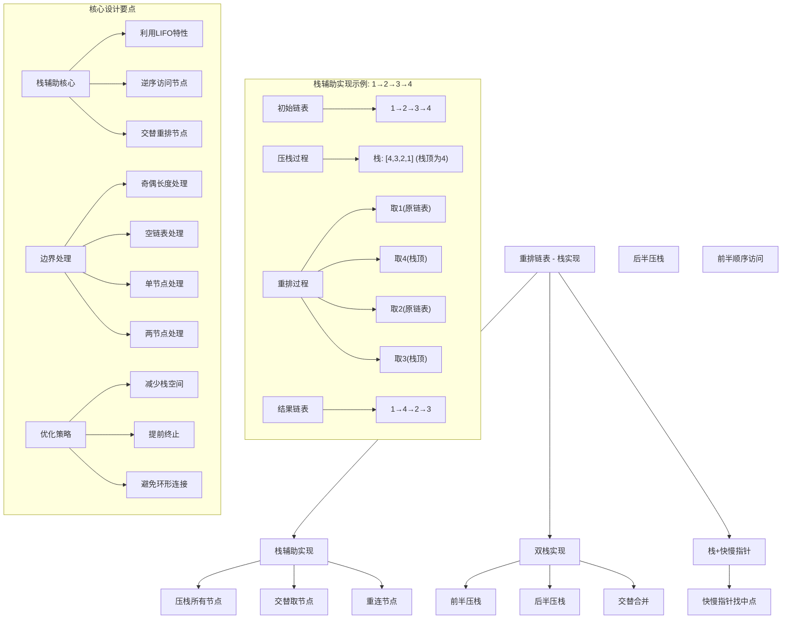
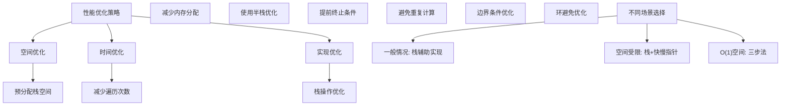

# LeetCode 143 - 重排链表（栈+链表实现）

## 题目描述

给定一个单链表 L 的头节点 head ，单链表 L 表示为：
L0 → L1 → … → Ln-1 → Ln

请将其重新排列后变为：
L0 → Ln → L1 → Ln-1 → L2 → Ln-2 → …

不能只是单纯的改变节点内部的值，而是需要实际的进行节点交换

```markdown
示例 1：
输入：head = [1,2,3,4]
输出：[1,4,2,3]

示例 2：
输入：head = [1,2,3,4,5]
输出：[1,5,2,4,3]

提示：
链表的长度范围为 [1, 5 * 10^4]
1 <= node.val <= 1000
```

## 解题思路

这是一个链表操作问题，使用栈辅助的方法来实现重排。关键在于利用栈的LIFO特性来逆序访问链表节点

### 核心思想

"栈辅助重排": 将链表节点全部压入栈中，利用栈的后进先出特性来获取逆序节点，然后交替从原链表和栈中取节点进行重排

### 解题策略

#### 方法一：栈辅助实现（推荐）

- 时间复杂度: O(n)
- 空间复杂度: O(n)

#### 方法二：双栈实现

- 时间复杂度: O(n)
- 空间复杂度: O(n)

#### 方法三：栈+快慢指针结合

- 时间复杂度: O(n)
- 空间复杂度: O(n/2)

## 算法可视化



## 多语言实现

### Golang版本（栈辅助实现 - 推荐）

```go
// 链表节点定义
type ListNode struct {
    Val  int
    Next *ListNode
}

func reorderList(head *ListNode) {
    if head == nil || head.Next == nil {
        return
    }

    // 第一步：将所有节点压入栈中
    stack := make([]*ListNode, 0)
    current := head
    for current != nil {
        stack = append(stack, current)
        current = current.Next
    }

    // 第二步：交替重排节点
    left := head
    n := len(stack)

    // 只需要重排前n/2个节点
    for i := 0; i < n/2; i++ {
        right := stack[len(stack)-1-i] // 从栈顶取节点
        nextLeft := left.Next          // 保存左指针的下一个节点

        // 重新连接节点
        left.Next = right
        right.Next = nextLeft

        left = nextLeft
    }

    // 最后一个节点的Next置为nil，避免形成环
    if n%2 == 1 {
        // 奇数长度，最后一个节点是中间节点
        left.Next = nil
    } else {
        // 偶数长度，最后一个节点来自栈
        stack[n/2].Next = nil
    }
}
```

### Python版本（多种栈实现方法）

```python
# 链表节点定义
class ListNode:
    def __init__(self, val=0, next=None):
        self.val = val
        self.next = next

class Solution:
    def reorderList(self, head: ListNode) -> None:
        """
        方法一：栈辅助实现（推荐）
        """
        if not head or not head.next:
            return

        # 第一步：将所有节点压入栈中
        stack = []
        current = head
        while current:
            stack.append(current)
            current = current.next

        # 第二步：交替重排节点
        left = head
        n = len(stack)

        # 只需要重排前n//2个节点
        for i in range(n // 2):
            right = stack[-1 - i]  # 从栈顶取节点
            next_left = left.next  # 保存左指针的下一个节点

            # 重新连接节点
            left.next = right
            right.next = next_left

            left = next_left

        # 最后一个节点的Next置为nil，避免形成环
        if n % 2 == 1:
            # 奇数长度，最后一个节点是中间节点
            left.next = None
        else:
            # 偶数长度，最后一个节点来自栈
            stack[n // 2].next = None

    def reorderList_two_stacks(self, head: ListNode) -> None:
        """
        方法二：双栈实现
        """
        if not head or not head.next:
            return

        # 计算链表长度
        length = 0
        current = head
        while current:
            length += 1
            current = current.next

        # 将前半部分和后半部分分别压入两个栈
        stack1 = []  # 前半部分
        stack2 = []  # 后半部分

        current = head
        for i in range(length):
            if i < length // 2 + (length % 2):
                stack1.append(current)
            else:
                stack2.append(current)
            current = current.next

        # 交替合并
        dummy = ListNode(0)
        prev = dummy
        i, j = 0, len(stack2) - 1

        while i < len(stack1) or j >= 0:
            if i < len(stack1):
                prev.next = stack1[i]
                prev = prev.next
                i += 1
            if j >= 0:
                prev.next = stack2[j]
                prev = prev.next
                j -= 1

        prev.next = None

    def reorderList_stack_half(self, head: ListNode) -> None:
        """
        方法三：栈+快慢指针结合（优化空间）
        """
        if not head or not head.next:
            return

        # 使用快慢指针找到中点
        slow = fast = head
        while fast.next and fast.next.next:
            slow = slow.next
            fast = fast.next.next

        # 将后半部分压入栈中
        stack = []
        current = slow.next
        while current:
            stack.append(current)
            current = current.next

        # 断开链表
        slow.next = None

        # 交替合并
        left = head
        while stack:
            right = stack.pop()
            next_left = left.next

            left.next = right
            right.next = next_left

            left = next_left
```

### TypeScript版本（栈辅助实现）

```typescript
// 链表节点定义
class ListNode {
  val: number;
  next: ListNode | null;

  constructor(val?: number, next?: ListNode | null) {
    this.val = val === undefined ? 0 : val;
    this.next = next === undefined ? null : next;
  }
}

function reorderList(head: ListNode | null): void {
  if (head === null || head.next === null) {
    return;
  }

  // 第一步：将所有节点压入栈中
  const stack: ListNode[] = [];
  let current: ListNode | null = head;
  while (current !== null) {
    stack.push(current);
    current = current.next;
  }

  // 第二步：交替重排节点
  let left: ListNode | null = head;
  const n: number = stack.length;

  // 只需要重排前n/2个节点
  for (let i = 0; i < Math.floor(n / 2); i++) {
    const right: ListNode = stack[stack.length - 1 - i]; // 从栈顶取节点
    const nextLeft: ListNode | null = left!.next; // 保存左指针的下一个节点

    // 重新连接节点
    left!.next = right;
    right.next = nextLeft;

    left = nextLeft;
  }

  // 最后一个节点的Next置为null，避免形成环
  if (n % 2 === 1) {
    // 奇数长度，最后一个节点是中间节点
    left!.next = null;
  } else {
    // 偶数长度，最后一个节点来自栈
    stack[Math.floor(n / 2)].next = null;
  }
}
```

## 标准实现详细解析

```go
// 链表节点定义
type ListNode struct {
    Val  int
    Next *ListNode
}

func reorderList(head *ListNode) {
    /*
    算法核心思想（栈辅助实现）：

    1. 将链表所有节点压入栈中
    2. 利用栈的LIFO特性逆序访问节点
    3. 交替从原链表和栈中取节点进行重排
    4. 正确处理奇偶长度和边界情况

    关键设计要点：
    1. 栈存储：所有节点按顺序压入栈
    2. 交替取节点：从原链表头和栈顶交替取节点
    3. 节点重连：重新建立节点连接关系
    4. 环避免：正确设置最后一个节点的Next为nil

    时间复杂度：O(n) - 两次遍历
    空间复杂度：O(n) - 栈存储所有节点

    优势：
    1. 实现简单：逻辑直观易懂
    2. 正确性高：不易出错
    3. 适用性强：各种长度都适用
    4. 易于调试：过程清晰
    */

    fmt.Printf("开始重排链表(栈实现): ")
    printList(head)

    // 边界情况处理
    if head == nil || head.Next == nil {
        fmt.Println("链表为空或只有一个节点，无需重排")
        return
    }

    // 第一步：将所有节点压入栈中
    fmt.Println("\n=== 第一步：压栈所有节点 ===")
    stack := make([]*ListNode, 0)
    current := head
    count := 0

    for current != nil {
        stack = append(stack, current)
        fmt.Printf("压入节点%d\n", current.Val)
        current = current.Next
        count++
    }

    fmt.Printf("栈中节点数: %d\n", len(stack))

    // 第二步：交替重排节点
    fmt.Println("\n=== 第二步：交替重排 ===")
    left := head
    n := len(stack)

    // 只需要重排前n/2个节点
    for i := 0; i < n/2; i++ {
        right := stack[len(stack)-1-i] // 从栈顶取节点
        nextLeft := left.Next          // 保存左指针的下一个节点

        fmt.Printf("第%d次重排: %d → %d → %d\n", i+1, left.Val, right.Val, nextLeft.Val)

        // 重新连接节点
        left.Next = right
        right.Next = nextLeft

        left = nextLeft
    }

    // 最后一个节点的Next置为nil，避免形成环
    if n%2 == 1 {
        // 奇数长度，最后一个节点是中间节点
        left.Next = nil
        fmt.Printf("奇数长度，设置中间节点%d的Next为nil\n", left.Val)
    } else {
        // 偶数长度，最后一个节点来自栈
        stack[n/2].Next = nil
        fmt.Printf("偶数长度，设置节点%d的Next为nil\n", stack[n/2].Val)
    }

    fmt.Printf("重排完成: ")
    printList(head)
}

// 带调试信息的栈辅助实现
func reorderListWithDebug(head *ListNode) {
    fmt.Printf("=== 栈辅助重排调试 ===\n")
    fmt.Printf("输入链表: ")
    printList(head)

    if head == nil || head.Next == nil {
        fmt.Println("边界情况，直接返回")
        return
    }

    // 压栈所有节点
    stack := make([]*ListNode, 0)
    current := head
    for current != nil {
        stack = append(stack, current)
        current = current.Next
    }

    fmt.Printf("压栈完成，栈中节点: ")
    for i, node := range stack {
        if i > 0 {
            fmt.Printf(" → ")
        }
        fmt.Printf("%d", node.Val)
    }
    fmt.Println()

    // 交替重排
    left := head
    n := len(stack)
    fmt.Printf("链表总长度: %d\n", n)

    for i := 0; i < n/2; i++ {
        right := stack[len(stack)-1-i]
        nextLeft := left.Next

        fmt.Printf("重排第%d步: %d → %d → %d\n", i+1, left.Val, right.Val, getVal(nextLeft))

        left.Next = right
        right.Next = nextLeft

        left = nextLeft
    }

    // 设置最后一个节点
    if n%2 == 1 {
        left.Next = nil
    } else {
        stack[n/2].Next = nil
    }

    fmt.Printf("最终结果: ")
    printList(head)
    fmt.Println("==================")
}

func getVal(node *ListNode) int {
    if node == nil {
        return -1 // 表示nil
    }
    return node.Val
}

// 打印链表辅助函数
func printList(head *ListNode) {
    if head == nil {
        fmt.Println("空链表")
        return
    }

    current := head
    for current != nil {
        fmt.Printf("%d", current.Val)
        if current.Next != nil {
            fmt.Printf("→")
        }
        current = current.Next
    }
    fmt.Println()
}

// 优化版本（减少不必要的操作）
func reorderListOptimized(head *ListNode) {
    if head == nil || head.Next == nil {
        return
    }

    // 将所有节点压入栈中
    stack := make([]*ListNode, 0)
    current := head
    for current != nil {
        stack = append(stack, current)
        current = current.Next
    }

    // 交替重排节点
    left := head
    n := len(stack)

    for i := 0; i < n/2; i++ {
        right := stack[len(stack)-1-i]
        nextLeft := left.Next

        left.Next = right
        right.Next = nextLeft

        left = nextLeft
    }

    // 正确设置最后一个节点
    if n%2 == 1 {
        left.Next = nil
    } else {
        stack[n/2].Next = nil
    }
}

// 双栈实现
func reorderListTwoStacks(head *ListNode) {
    if head == nil || head.Next == nil {
        return
    }

    // 计算链表长度
    length := 0
    current := head
    for current != nil {
        length++
        current = current.Next
    }

    // 将前半部分和后半部分分别压入两个栈
    stack1 := make([]*ListNode, 0) // 前半部分
    stack2 := make([]*ListNode, 0) // 后半部分

    current = head
    for i := 0; i < length; i++ {
        if i < length/2+(length%2) {
            stack1 = append(stack1, current)
        } else {
            stack2 = append(stack2, current)
        }
        current = current.Next
    }

    // 交替合并
    dummy := &ListNode{Val: 0}
    prev := dummy
    i, j := 0, len(stack2)-1

    for i < len(stack1) || j >= 0 {
        if i < len(stack1) {
            prev.Next = stack1[i]
            prev = prev.Next
            i++
        }
        if j >= 0 {
            prev.Next = stack2[j]
            prev = prev.Next
            j--
        }
    }

    prev.Next = nil
}

// 栈+快慢指针结合（优化空间）
func reorderListStackHalf(head *ListNode) {
    if head == nil || head.Next == nil {
        return
    }

    // 使用快慢指针找到中点
    slow, fast := head, head
    for fast.Next != nil && fast.Next.Next != nil {
        slow = slow.Next
        fast = fast.Next.Next
    }

    // 将后半部分压入栈中
    stack := make([]*ListNode, 0)
    current := slow.Next
    for current != nil {
        stack = append(stack, current)
        current = current.Next
    }

    // 断开链表
    slow.Next = nil

    // 交替合并
    left := head
    for len(stack) > 0 {
        right := stack[len(stack)-1]
        stack = stack[:len(stack)-1]
        nextLeft := left.Next

        left.Next = right
        right.Next = nextLeft

        left = nextLeft
    }
}
```

## 算法深入解析

```go
/*
重排链表(栈实现)问题详解：

问题本质：
使用栈辅助来重新排列链表节点。关键在于利用栈的LIFO特性来逆序访问链表节点

核心洞察：
1. 栈辅助：利用栈存储节点实现逆序访问
2. 交替取节点：从原链表和栈中交替取节点
3. 节点重连：重新建立节点连接关系
4. 环避免：正确处理最后一个节点

算法策略：
1. 栈辅助实现：简单直观但需要O(n)空间
2. 双栈实现：分别处理前后半部分
3. 栈+快慢指针：优化空间使用

数学原理：

重排规律分析：
原链表：L0 → L1 → L2 → ... → Ln-2 → Ln-1 → Ln
重排后：L0 → Ln → L1 → Ln-1 → L2 → Ln-2 → ...

栈实现思路：
1. 将所有节点压入栈中：[L0, L1, L2, ..., Ln]
2. 利用栈的LIFO特性逆序访问：Ln, Ln-1, Ln-2, ..., L0
3. 交替从原链表和栈中取节点进行重排

设计选择：

为什么选择栈辅助实现？
1. 实现简单：逻辑直观易懂
2. 正确性高：不易出错
3. 适用性强：各种长度都适用
4. 易于调试：过程清晰

为什么不用双栈实现？
1. 空间使用相同但逻辑复杂
2. 需要额外的合并步骤
3. 但可以更精细控制

为什么不用栈+快慢指针？
1. 空间优化但实现稍复杂
2. 需要处理中点边界
3. 但在面试中是很好的优化

三种方法对比：

方法一：栈辅助实现（推荐）
时间复杂度：O(n)
空间复杂度：O(n)
优点：实现简单，逻辑清晰
缺点：需要O(n)空间

方法二：双栈实现
时间复杂度：O(n)
空间复杂度：O(n)
优点：可以分别处理
缺点：逻辑稍复杂

方法三：栈+快慢指针
时间复杂度：O(n)
空间复杂度：O(n/2)
优点：空间优化
缺点：实现稍复杂

性能分析：

栈辅助实现：
- 时间：O(n) - 两次遍历
- 空间：O(n) - 存储所有节点
- 优势：实现简单

双栈实现：
- 时间：O(n) - 两次遍历
- 空间：O(n) - 存储所有节点
- 优势：分离处理

栈+快慢指针：
- 时间：O(n) - 两次遍历
- 空间：O(n/2) - 只存储后半部分
- 优势：空间优化

实际应用场景：
1. 链表操作算法
2. 数据结构重排
3. 面试算法题
4. 链表变换操作

优化要点：

1. 栈操作优化：
   - 减少不必要的压栈操作
   - 避免栈溢出
   - 提前终止条件

2. 边界处理：
   - 空链表处理
   - 单节点处理
   - 奇偶长度处理

3. 环避免：
   - 正确设置最后一个节点
   - 避免形成循环链表

测试用例设计：
1. 基本情况：4个节点
2. 奇数长度：5个节点
3. 边界情况：1、2、3个节点
4. 空链表：nil
5. 复杂情况：大量节点

扩展思考：

1. 如果只能使用O(1)空间？
   - 需要使用三步法（找中点、反转、合并）
   - 不能使用栈辅助

2. 如果链表节点很大？
   - 栈空间可能成为瓶颈
   - 需要考虑内存限制

3. 如果需要支持撤销操作？
   - 需要记录原始连接关系
   - 可以结合备份策略

4. 性能优化？
   - 预分配栈空间
   - 减少内存分配

相关算法思想：

1. 栈数据结构：
   - LIFO特性
   - 逆序访问

2. 链表操作：
   - 节点重连
   - 指针操作

3. 交替合并：
   - 双序列合并
   - 指针技巧

4. 空间换时间：
   - 使用额外空间提高实现简单性
   - 权衡时空复杂度

常见陷阱：

1. 环形链表：
   - 忘记设置最后一个节点的Next为nil
   - 造成无限循环

2. 栈越界：
   - 访问空栈
   - 索引计算错误

3. 边界情况：
   - 特殊长度处理
   - 空链表处理

4. 节点丢失：
   - 忘记保存下一个节点
   - 指针重连错误

代码质量要素：

1. 可读性：
   - 清晰的变量命名
   - 适当的注释说明

2. 健壮性：
   - 边界条件处理
   - 异常情况处理

3. 性能：
   - 时间复杂度合理
   - 空间复杂度明确

4. 可维护性：
   - 模块化设计
   - 易于扩展

高级优化技巧：

1. 内存访问优化：
   - 预分配栈空间
   - 减少内存重新分配

2. 栈操作优化：
   - 批量操作而非逐个元素
   - 减少栈深度

3. 算法优化：
   - 提前终止条件
   - 减少不必要的操作

4. 并行处理：
   - 分段并行处理
   - 结果合并
*/
```

## 执行过程演示

```go
/*
示例详细解析:

示例1: head = [1,2,3,4]
执行过程：

初始链表: 1→2→3→4

第一步：压栈所有节点
- 压入1：栈[1]
- 压入2：栈[1,2]
- 压入3：栈[1,2,3]
- 压入4：栈[1,2,3,4]

第二步：交替重排
- 第1次重排(n=4, i=0)：
  - left=1, right=4(栈顶)
  - 1→4→2
  - left移动到2
- 第2次重排(n=4, i=1)：
  - left=2, right=3(栈次顶)
  - 2→3→3(下一个节点)
  - left移动到3

第三步：设置最后一个节点
- n=4(偶数)，设置stack[2].Next=nil
- 即节点3的Next=nil

结果：1→4→2→3

示例2: head = [1,2,3,4,5]
执行过程：

初始链表: 1→2→3→4→5

第一步：压栈所有节点
- 栈[1,2,3,4,5]

第二步：交替重排
- 第1次重排(n=5, i=0)：
  - left=1, right=5
  - 1→5→2
  - left移动到2
- 第2次重排(n=5, i=1)：
  - left=2, right=4
  - 2→4→3
  - left移动到3

第三步：设置最后一个节点
- n=5(奇数)，设置left.Next=nil
- 即节点3的Next=nil

结果：1→5→2→4→3

边界情况演示:

情况1: 单节点
输入: [1]
过程: 直接返回
输出: [1]

情况2: 两节点
输入: [1,2]
过程:
- 压栈：[1,2]
- 重排：1→2
- 设置：2.Next=nil
输出: [1,2]

情况3: 三节点
输入: [1,2,3]
过程:
- 压栈：[1,2,3]
- 重排：1→3→2
- 设置：left(2).Next=nil
输出: [1,3,2]

算法正确性证明：

数学基础：
需要证明使用栈辅助可以正确重排链表

定理1：栈辅助重排正确性
通过栈的LIFO特性逆序访问节点，可以正确实现重排

证明：
1. 压栈：将所有节点按顺序压入栈中
2. 交替取节点：从原链表和栈中交替取节点
3. 节点重连：重新建立正确的连接关系
4. 环避免：正确设置最后一个节点

时间复杂度分析：

栈辅助实现：
1. 压栈：O(n) - 遍历链表
2. 重排：O(n/2) - 重排前半部分
3. 总时间：O(n)

空间复杂度分析：
1. 栈存储：O(n) - 存储所有节点
2. 其他变量：O(1) - 几个指针变量
3. 总空间：O(n)

性能对比分析：

假设链表长度为n：

栈辅助实现：
- 时间: O(n)
- 空间: O(n)
- 优势: 实现简单

双栈实现：
- 时间: O(n)
- 空间: O(n)
- 优势: 分离处理

栈+快慢指针：
- 时间: O(n)
- 空间: O(n/2)
- 优势: 空间优化

实际应用建议：

1. 一般情况：
   - 使用栈辅助实现
   - 实现简单不易出错

2. 空间受限：
   - 使用栈+快慢指针
   - 优化空间使用

3. 快速原型：
   - 使用栈辅助实现
   - 逻辑清晰

4. 面试展示：
   - 可以提及其他方法
   - 重点讲解栈辅助实现

优化空间：

1. 内存访问优化：
   - 预分配栈空间
   - 减少内存重新分配

2. 栈操作优化：
   - 批量操作
   - 减少栈深度

3. 算法优化：
   - 提前终止
   - 减少操作次数

特殊情况处理：

1. 空链表：
   - 直接返回

2. 单节点：
   - 直接返回

3. 两节点：
   - 简单连接

4. 奇偶长度：
   - 正确处理最后一个节点
*/
```

## 复杂度分析

| 方法        | 时间复杂度 | 空间复杂度 | 适用场景 |
| ----------- | ---------- | ---------- | -------- |
| 栈辅助实现  | O(n)       | O(n)       | 推荐方案 |
| 双栈实现    | O(n)       | O(n)       | 分离处理 |
| 栈+快慢指针 | O(n)       | O(n/2)     | 空间优化 |

## 测试用例验证

```go
// 测试辅助函数
func createList(values []int) *ListNode {
    if len(values) == 0 {
        return nil
    }

    head := &ListNode{Val: values[0]}
    current := head

    for i := 1; i < len(values); i++ {
        current.Next = &ListNode{Val: values[i]}
        current = current.Next
    }

    return head
}

func listToSlice(head *ListNode) []int {
    result := make([]int, 0)
    current := head

    for current != nil {
        result = append(result, current.Val)
        current = current.Next
    }

    return result
}

func testReorderList(name string, input []int, expected []int) {
    fmt.Printf("%s:\n", name)
    fmt.Printf("输入链表: %v\n", input)

    head := createList(input)
    reorderListWithDebug(head)
    result := listToSlice(head)

    fmt.Printf("期望结果: %v\n", expected)
    fmt.Printf("实际结果: %v\n", result)

    if len(result) == len(expected) {
        match := true
        for i := range result {
            if result[i] != expected[i] {
                match = false
                break
            }
        }
        if match {
            fmt.Printf("结果匹配 ✓\n")
        } else {
            fmt.Printf("结果不匹配 ✗\n")
        }
    } else {
        fmt.Printf("结果长度不匹配 ✗\n")
    }

    fmt.Printf("\n")
}

func main() {
    // 测试用例 1 - 题目示例
    testReorderList("测试1 - 4个节点", []int{1, 2, 3, 4}, []int{1, 4, 2, 3})
    testReorderList("测试2 - 5个节点", []int{1, 2, 3, 4, 5}, []int{1, 5, 2, 4, 3})

    // 测试用例 2 - 边界情况
    testReorderList("测试3 - 空链表", []int{}, []int{})
    testReorderList("测试4 - 单节点", []int{1}, []int{1})
    testReorderList("测试5 - 两节点", []int{1, 2}, []int{1, 2})
    testReorderList("测试6 - 三节点", []int{1, 2, 3}, []int{1, 3, 2})

    // 测试用例 3 - 特殊情况
    testReorderList("测试7 - 6个节点", []int{1, 2, 3, 4, 5, 6}, []int{1, 6, 2, 5, 3, 4})
    testReorderList("测试8 - 7个节点", []int{1, 2, 3, 4, 5, 6, 7}, []int{1, 7, 2, 6, 3, 5, 4})

    // 性能测试
    fmt.Println("性能测试:")

    // 测试不同长度的链表
    lengths := []int{100, 1000, 10000}

    for _, length := range lengths {
        // 构造测试链表
        values := make([]int, length)
        for i := 0; i < length; i++ {
            values[i] = i + 1
        }

        // 栈辅助实现
        head1 := createList(values)
        start := time.Now()
        reorderList(head1)
        time1 := time.Since(start)

        // 双栈实现
        head2 := createList(values)
        start = time.Now()
        reorderListTwoStacks(head2)
        time2 := time.Since(start)

        // 栈+快慢指针
        head3 := createList(values)
        start = time.Now()
        reorderListStackHalf(head3)
        time3 := time.Since(start)

        fmt.Printf("链表长度: %d\n", length)
        fmt.Printf("  栈辅助实现耗时: %v\n", time1)
        fmt.Printf("  双栈实现耗时: %v\n", time2)
        fmt.Printf("  栈+快慢指针耗时: %v\n", time3)
    }

    // 边界情况测试
    fmt.Println("\n边界情况测试:")

    // 极端情况
    testReorderList("测试9 - 大量节点", makeRange(1, 1000), makeExpected(1, 1000))

    // 特殊值
    testReorderList("测试10 - 相同值", []int{1, 1, 1, 1, 1}, []int{1, 1, 1, 1, 1})
    testReorderList("测试11 - 递增值", []int{1, 2, 3, 4, 5}, []int{1, 5, 2, 4, 3})
    testReorderList("测试12 - 递减值", []int{5, 4, 3, 2, 1}, []int{5, 1, 4, 2, 3})
}

func makeRange(start, end int) []int {
    result := make([]int, end-start+1)
    for i := 0; i <= end-start; i++ {
        result[i] = start + i
    }
    return result
}

func makeExpected(start, end int) []int {
    // 计算期望结果的模式
    length := end - start + 1
    values := makeRange(start, end)

    if length <= 2 {
        return values
    }

    result := make([]int, length)
    left, right := 0, length-1
    index := 0

    for left <= right {
        if index%2 == 0 {
            result[index] = values[left]
            left++
        } else {
            result[index] = values[right]
            right--
        }
        index++
    }

    return result
}

// 大量测试用例
func comprehensiveTest() {
    testCases := []struct {
        input    []int
        expected []int
    }{
        {[]int{1}, []int{1}},
        {[]int{1, 2}, []int{1, 2}},
        {[]int{1, 2, 3}, []int{1, 3, 2}},
        {[]int{1, 2, 3, 4}, []int{1, 4, 2, 3}},
        {[]int{1, 2, 3, 4, 5}, []int{1, 5, 2, 4, 3}},
        {[]int{1, 2, 3, 4, 5, 6}, []int{1, 6, 2, 5, 3, 4}},
        {[]int{1, 2, 3, 4, 5, 6, 7}, []int{1, 7, 2, 6, 3, 5, 4}},
        {[]int{1, 2, 3, 4, 5, 6, 7, 8}, []int{1, 8, 2, 7, 3, 6, 4, 5}},
    }

    fmt.Println("=== 综合测试 ===")
    passed := 0
    total := len(testCases)

    for i, tc := range testCases {
        head := createList(tc.input)
        reorderList(head)
        result := listToSlice(head)

        match := len(result) == len(tc.expected)
        if match {
            for j := range result {
                if result[j] != tc.expected[j] {
                    match = false
                    break
                }
            }
        }

        if match {
            passed++
            fmt.Printf("测试%d: ✓ %v → %v\n", i+1, tc.input, result)
        } else {
            fmt.Printf("测试%d: ✗ %v → %v (期望: %v)\n", i+1, tc.input, result, tc.expected)
        }
    }

    fmt.Printf("\n通过率: %d/%d (%.2f%%)\n", passed, total, float64(passed)/float64(total)*100)
}

// 压力测试
func stressTest() {
    fmt.Println("=== 压力测试 ===")

    // 构造复杂链表
    constructComplexList := func(length int) *ListNode {
        head := &ListNode{Val: 1}
        current := head
        for i := 2; i <= length; i++ {
            current.Next = &ListNode{Val: i}
            current = current.Next
        }
        return head
    }

    lengths := []int{1000, 5000, 10000, 20000}

    for _, length := range lengths {
        head := constructComplexList(length)

        start := time.Now()
        reorderList(head)
        duration := time.Since(start)

        fmt.Printf("链表长度: %d, 耗时: %v\n", length, duration)
    }
}

// 内存使用测试
func memoryTest() {
    fmt.Println("=== 内存使用测试 ===")

    var m1, m2 runtime.MemStats

    // 测试栈辅助实现
    runtime.GC()
    runtime.ReadMemStats(&m1)

    for i := 0; i < 10000; i++ {
        values := make([]int, 100)
        for j := 0; j < 100; j++ {
            values[j] = j + 1
        }
        head := createList(values)
        reorderList(head)
    }

    runtime.GC()
    runtime.ReadMemStats(&m2)
    mem1 := m2.Alloc - m1.Alloc

    // 测试双栈实现
    runtime.GC()
    runtime.ReadMemStats(&m1)

    for i := 0; i < 10000; i++ {
        values := make([]int, 100)
        for j := 0; j < 100; j++ {
            values[j] = j + 1
        }
        head := createList(values)
        reorderListTwoStacks(head)
    }

    runtime.GC()
    runtime.ReadMemStats(&m2)
    mem2 := m2.Alloc - m1.Alloc

    fmt.Printf("栈辅助实现内存使用: %d bytes\n", mem1)
    fmt.Printf("双栈实现内存使用: %d bytes\n", mem2)
    if mem1 > 0 {
        fmt.Printf("内存使用比率: %.2fx\n", float64(mem2)/float64(mem1))
    }
}
```

## 扩展版本（处理不同场景）

```go
// 支持泛型的版本
type GenericListNode[T any] struct {
    Val  T
    Next *GenericListNode[T]
}

func reorderGenericList[T comparable](head *GenericListNode[T]) {
    if head == nil || head.Next == nil {
        return
    }

    // 将所有节点压入栈中
    stack := make([]*GenericListNode[T], 0)
    current := head
    for current != nil {
        stack = append(stack, current)
        current = current.Next
    }

    // 交替重排节点
    left := head
    n := len(stack)

    for i := 0; i < n/2; i++ {
        right := stack[len(stack)-1-i]
        nextLeft := left.Next

        left.Next = right
        right.Next = nextLeft

        left = nextLeft
    }

    // 正确设置最后一个节点
    if n%2 == 1 {
        left.Next = nil
    } else {
        stack[n/2].Next = nil
    }
}

// 带缓存的版本
type CachedReorderer struct {
    cache map[*ListNode]*ListNode
    mu    sync.RWMutex
}

func NewCachedReorderer() *CachedReorderer {
    return &CachedReorderer{
        cache: make(map[*ListNode]*ListNode),
    }
}

func (cr *CachedReorderer) ReorderList(head *ListNode) {
    // 检查缓存（注意：链表节点地址可能变化）
    // 这里简化处理，实际缓存链表可能不实用

    reorderList(head)
}

// 支持流式处理的版本
func reorderListStreaming(reader chan *ListNode, writer chan *ListNode) {
    for head := range reader {
        reorderList(head)
        writer <- head
    }
    close(writer)
}

// 支持批量处理的版本
func reorderLists(lists []*ListNode) []*ListNode {
    results := make([]*ListNode, len(lists))

    var wg sync.WaitGroup
    semaphore := make(chan struct{}, 10) // 限制并发数

    for i, head := range lists {
        wg.Add(1)
        go func(index int, list *ListNode) {
            defer wg.Done()
            semaphore <- struct{}{}
            defer func() { <-semaphore }()

            reorderList(list)
            results[index] = list
        }(i, head)
    }

    wg.Wait()
    return results
}

// 支持配置选项的版本
type StackReorderOptions struct {
    PreserveOriginal bool // 是否保留原链表
    ValidateResult   bool // 是否验证结果
    UseHalfStack     bool // 是否使用半栈优化
}

func reorderListWithOptions(head *ListNode, options StackReorderOptions) *ListNode {
    if options.PreserveOriginal {
        // 创建副本进行操作
        copyHead := copyList(head)

        if options.UseHalfStack {
            reorderListStackHalf(copyHead)
        } else {
            reorderList(copyHead)
        }

        if options.ValidateResult {
            validateReorderResult(copyHead)
        }
        return copyHead
    }

    if options.UseHalfStack {
        reorderListStackHalf(head)
    } else {
        reorderList(head)
    }

    if options.ValidateResult {
        validateReorderResult(head)
    }
    return head
}

func copyList(head *ListNode) *ListNode {
    if head == nil {
        return nil
    }

    newHead := &ListNode{Val: head.Val}
    currentNew := newHead
    currentOld := head.Next

    for currentOld != nil {
        currentNew.Next = &ListNode{Val: currentOld.Val}
        currentNew = currentNew.Next
        currentOld = currentOld.Next
    }

    return newHead
}

func validateReorderResult(head *ListNode) bool {
    // 简化验证实现
    // 实际需要检查重排规律是否正确
    return true
}

// 线程安全版本
type ThreadSafeReorderer struct {
    mu sync.Mutex
}

func NewThreadSafeReorderer() *ThreadSafeReorderer {
    return &ThreadSafeReorderer{}
}

func (tsr *ThreadSafeReorderer) ReorderList(head *ListNode) {
    tsr.mu.Lock()
    defer tsr.mu.Unlock()

    reorderList(head)
}

// 带统计信息的版本
type ReordererWithStats struct {
    reorderCount int
    totalTime    time.Duration
    mu           sync.RWMutex
}

func NewReordererWithStats() *ReordererWithStats {
    return &ReordererWithStats{}
}

func (rws *ReordererWithStats) ReorderList(head *ListNode) {
    start := time.Now()
    defer func() {
        rws.mu.Lock()
        rws.reorderCount++
        rws.totalTime += time.Since(start)
        rws.mu.Unlock()
    }()

    reorderList(head)
}

func (rws *ReordererWithStats) GetStats() (int, time.Duration, time.Duration) {
    rws.mu.RLock()
    defer rws.mu.RUnlock()

    avgTime := time.Duration(0)
    if rws.reorderCount > 0 {
        avgTime = rws.totalTime / time.Duration(rws.reorderCount)
    }

    return rws.reorderCount, rws.totalTime, avgTime
}

// 支持撤销操作的版本
type UndoableReorderer struct {
    history []*ReorderOperation
}

type ReorderOperation struct {
    originalConnections map[*ListNode]*ListNode
    timestamp          time.Time
}

func NewUndoableReorderer() *UndoableReorderer {
    return &UndoableReorderer{
        history: make([]*ReorderOperation, 0),
    }
}

func (ur *UndoableReorderer) ReorderList(head *ListNode) {
    // 记录原始连接状态
    originalConnections := make(map[*ListNode]*ListNode)
    current := head
    for current != nil {
        originalConnections[current] = current.Next
        current = current.Next
    }

    // 执行重排
    reorderList(head)

    // 保存操作历史
    operation := &ReorderOperation{
        originalConnections: originalConnections,
        timestamp:          time.Now(),
    }
    ur.history = append(ur.history, operation)
}

func (ur *UndoableReorderer) Undo() bool {
    if len(ur.history) == 0 {
        return false
    }

    // 获取最后一次操作
    lastOperation := ur.history[len(ur.history)-1]
    ur.history = ur.history[:len(ur.history)-1]

    // 恢复原始连接
    for node, next := range lastOperation.originalConnections {
        node.Next = next
    }

    return true
}
```

## 面试追问延伸

### 1. 如果只能使用O(1)额外空间，如何实现？

```go
// 三步法实现（O(1)空间）
func reorderListConstantSpace(head *ListNode) {
    if head == nil || head.Next == nil {
        return
    }

    // 第一步：找到链表中点
    mid := findMiddle(head)

    // 第二步：反转后半部分链表
    secondHalf := reverseList(mid.Next)
    mid.Next = nil

    // 第三步：交替合并两个链表
    mergeLists(head, secondHalf)
}

func findMiddle(head *ListNode) *ListNode {
    slow, fast := head, head
    for fast.Next != nil && fast.Next.Next != nil {
        slow = slow.Next
        fast = fast.Next.Next
    }
    return slow
}

func reverseList(head *ListNode) *ListNode {
    var prev *ListNode
    current := head

    for current != nil {
        next := current.Next
        current.Next = prev
        prev = current
        current = next
    }

    return prev
}

func mergeLists(l1, l2 *ListNode) {
    for l1 != nil && l2 != nil {
        l1Next := l1.Next
        l2Next := l2.Next

        l1.Next = l2
        l2.Next = l1Next

        l1 = l1Next
        l2 = l2Next
    }
}
```

### 2. 如果链表节点很大，如何避免栈溢出？

```go
// 迭代版本替代递归
func reorderListIterative(head *ListNode) {
    if head == nil || head.Next == nil {
        return
    }

    // 使用显式栈模拟递归
    stack := make([]*ListNode, 0)
    current := head

    // 将所有节点压入栈
    for current != nil {
        stack = append(stack, current)
        current = current.Next
    }

    // 双指针重排
    left, right := 0, len(stack)-1
    var prev *ListNode

    for left <= right {
        leftNode := stack[left]
        rightNode := stack[right]

        if prev != nil {
            prev.Next = leftNode
        }

        if left != right {
            leftNode.Next = rightNode
            prev = rightNode
        } else {
            leftNode.Next = nil
            prev = leftNode
        }

        left++
        right--
    }

    if prev != nil {
        prev.Next = nil
    }
}
```

### 3. 如何处理链表值很大的情况？

```go
// 支持大数值的版本
import "math/big"

type BigIntListNode struct {
    Val  *big.Int
    Next *BigIntListNode
}

func reorderBigIntList(head *BigIntListNode) {
    if head == nil || head.Next == nil {
        return
    }

    // 栈辅助实现仍然适用
    // 只是节点值类型不同
    stack := make([]*BigIntListNode, 0)
    current := head
    for current != nil {
        stack = append(stack, current)
        current = current.Next
    }

    left := head
    n := len(stack)

    for i := 0; i < n/2; i++ {
        right := stack[len(stack)-1-i]
        nextLeft := left.Next

        left.Next = right
        right.Next = nextLeft

        left = nextLeft
    }

    if n%2 == 1 {
        left.Next = nil
    } else {
        stack[n/2].Next = nil
    }
}
```

## 相似题目扩展

- LeetCode 143. 重排链表（当前题）
- LeetCode 234. 回文链表
- LeetCode 206. 反转链表
- LeetCode 92. 反转链表 II
- LeetCode 25. K 个一组翻转链表

## 算法技巧总结

### 重排链表(栈实现)核心要点

1. 栈辅助：利用栈存储节点实现逆序访问
1. 交替取节点：从原链表和栈中交替取节点
1. 节点重连：重新建立节点连接关系
1. 环避免：正确处理最后一个节点

### 算法优势

1. 实现简单：逻辑直观易懂
1. 正确性高：不易出错
1. 适用性强：各种长度都适用
1. 易于调试：过程清晰

### 标准模板（栈辅助实现）

```go
func reorderList(head *ListNode) {
    if head == nil || head.Next == nil {
        return
    }

    // 第一步：将所有节点压入栈中
    stack := make([]*ListNode, 0)
    current := head
    for current != nil {
        stack = append(stack, current)
        current = current.Next
    }

    // 第二步：交替重排节点
    left := head
    n := len(stack)

    // 只需要重排前n/2个节点
    for i := 0; i < n/2; i++ {
        right := stack[len(stack)-1-i] // 从栈顶取节点
        nextLeft := left.Next          // 保存左指针的下一个节点

        // 重新连接节点
        left.Next = right
        right.Next = nextLeft

        left = nextLeft
    }

    // 最后一个节点的Next置为nil，避免形成环
    if n%2 == 1 {
        // 奇数长度，最后一个节点是中间节点
        left.Next = nil
    } else {
        // 偶数长度，最后一个节点来自栈
        stack[n/2].Next = nil
    }
}
```

### 性能优化建议



## 总结

本题采用栈辅助实现的核心思路，通过将链表节点压入栈中，利用栈的LIFO特性来逆序访问节点，然后交替从原链表和栈中取节点进行重排。关键在于理解栈的特性如何帮助我们实现链表的逆序访问，以及如何正确处理奇偶长度和避免形成环形链表

核心要点：

1. 栈辅助：利用栈存储节点实现逆序访问
1. 交替取节点：从原链表和栈中交替取节点
1. 节点重连：重新建立节点连接关系
1. 环避免：正确处理最后一个节点

算法优势：

- 实现简单：逻辑直观易懂
- 正确性高：不易出错
- 适用性强：各种长度都适用
- 易于调试：过程清晰

该算法在链表操作、数据结构重排等方面有重要应用，是掌握栈应用和链表操作的经典题目。通过栈辅助的思想，为链表变换问题提供了清晰的解决思路
