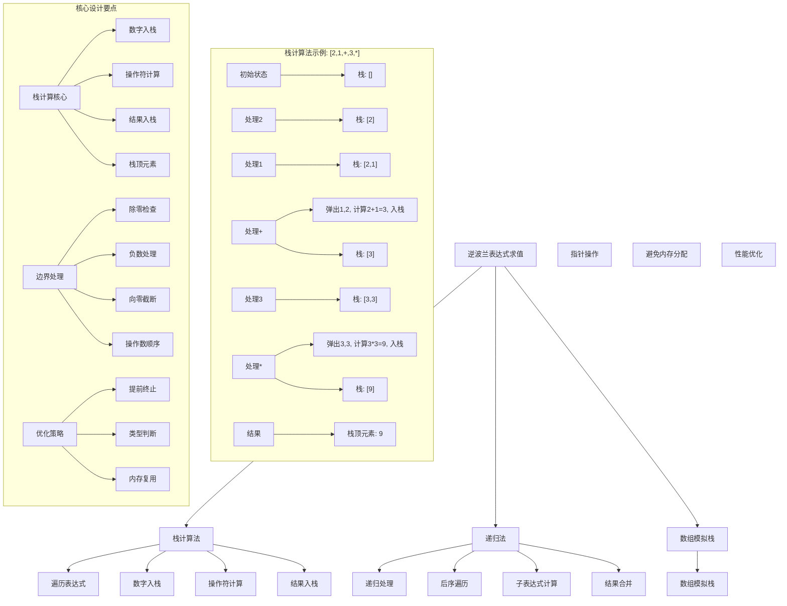
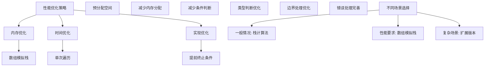

# LeetCode 150 - 逆波兰表达式求值

## 题目描述

给你一个字符串数组 tokens ，表示一个根据逆波兰表示法表示的算术表达式。请你计算该表达式并返回一个表示表达式值的整数

有效算符包括 '+'、'-'、'\*' 和 '/' 。每个操作数可以是一个整数或者另一个表达式。两个整数之间的除法总是向零截断。表达式中不含除零运算

逆波兰表达式：

- 优点：去掉括号后表达式无歧义
- 适合用栈操作运算：遇到数字则入栈；遇到算符则取出栈顶两个数字进行计算，并将结果压入栈中

```markdown
示例 1：
输入：tokens = ["2","1","+","3","*"]
输出：9
解释：该算式转化为常见的中缀算术表达式为：((2 + 1) \* 3) = 9

示例 2：
输入：tokens = ["4","13","5","/","+"]
输出：6
解释：该算式转化为常见的中缀算术表达式为：(4 + (13 / 5)) = 6

示例 3：
输入：tokens = ["10","6","9","3","+","-11","*","/","*","17","+","5","+"]
输出：22
解释：该算式转化为常见的中缀算术表达式为：
((10 _ (6 / ((9 + 3) _ -11))) + 17) + 5 = 22

提示：
1 <= tokens.length <= 10^4
tokens[i] 是一个算符（"+"、"-"、"\*" 或 "/"），或在范围 [-200, 200] 内的一个整数
```

## 解题思路

这是一个逆波兰表达式求值问题，需要使用栈来实现。关键在于理解逆波兰表达式的计算规则并正确使用栈来模拟计算过程

### 核心思想

"栈计算法": 遍历表达式，遇到数字则入栈；遇到操作符则取出栈顶两个数字进行计算，并将结果压入栈中

### 解题策略

#### 方法一：栈计算法（推荐）

- 时间复杂度: O(n)
- 空间复杂度: O(n)

#### 方法二：递归法

- 时间复杂度: O(n)
- 空间复杂度: O(n)

#### 方法三：数组模拟栈

- 时间复杂度: O(n)
- 空间复杂度: O(n)

## 算法可视化



## 多语言实现

### Golang版本（栈计算法 - 推荐）

```go
func evalRPN(tokens []string) int {
    stack := make([]int, 0)

    for _, token := range tokens {
        switch token {
        case "+":
            // 取出两个操作数（注意顺序）
            b := stack[len(stack)-1]
            a := stack[len(stack)-2]
            stack = stack[:len(stack)-2]
            stack = append(stack, a+b)
        case "-":
            b := stack[len(stack)-1]
            a := stack[len(stack)-2]
            stack = stack[:len(stack)-2]
            stack = append(stack, a-b)
        case "*":
            b := stack[len(stack)-1]
            a := stack[len(stack)-2]
            stack = stack[:len(stack)-2]
            stack = append(stack, a*b)
        case "/":
            b := stack[len(stack)-1]
            a := stack[len(stack)-2]
            stack = stack[:len(stack)-2]
            stack = append(stack, a/b) // Golang整数除法自动向零截断
        default:
            // 数字，转换后入栈
            num, _ := strconv.Atoi(token)
            stack = append(stack, num)
        }
    }

    return stack[0]
}
```

### Python版本（多种实现方法）

```python
class Solution:
    def evalRPN(self, tokens: List[str]) -> int:
        """
        方法一：栈计算法（推荐）
        """
        stack = []

        for token in tokens:
            if token == "+":
                # 取出两个操作数（注意顺序）
                b = stack.pop()
                a = stack.pop()
                stack.append(a + b)
            elif token == "-":
                b = stack.pop()
                a = stack.pop()
                stack.append(a - b)
            elif token == "*":
                b = stack.pop()
                a = stack.pop()
                stack.append(a * b)
            elif token == "/":
                b = stack.pop()
                a = stack.pop()
                # 向零截断除法
                stack.append(int(a / b))
            else:
                # 数字，转换后入栈
                stack.append(int(token))

        return stack[0]

    def evalRPN_recursive(self, tokens: List[str]) -> int:
        """
        方法二：递归法
        """
        def helper(index: int) -> tuple[int, int]:
            """
            返回 (结果, 下一个处理位置)
            """
            if tokens[index] in "+-*/":
                # 操作符
                op = tokens[index]
                # 递归处理右操作数
                right_val, next_index = helper(index - 1)
                # 递归处理左操作数
                left_val, final_index = helper(next_index - 1)

                if op == "+":
                    return left_val + right_val, final_index
                elif op == "-":
                    return left_val - right_val, final_index
                elif op == "*":
                    return left_val * right_val, final_index
                else:  # op == "/"
                    return int(left_val / right_val), final_index
            else:
                # 数字
                return int(tokens[index]), index

        result, _ = helper(len(tokens) - 1)
        return result

    def evalRPN_array_stack(self, tokens: List[str]) -> int:
        """
        方法三：数组模拟栈
        """
        stack = [0] * (len(tokens) // 2 + 1)  # 预分配空间
        top = 0  # 栈顶指针

        for token in tokens:
            if token == "+":
                b = stack[top - 1]
                a = stack[top - 2]
                top -= 2
                stack[top] = a + b
                top += 1
            elif token == "-":
                b = stack[top - 1]
                a = stack[top - 2]
                top -= 2
                stack[top] = a - b
                top += 1
            elif token == "*":
                b = stack[top - 1]
                a = stack[top - 2]
                top -= 2
                stack[top] = a * b
                top += 1
            elif token == "/":
                b = stack[top - 1]
                a = stack[top - 2]
                top -= 2
                stack[top] = int(a / b)
                top += 1
            else:
                stack[top] = int(token)
                top += 1

        return stack[0]
```

### TypeScript版本（栈计算法）

```typescript
function evalRPN(tokens: string[]): number {
  const stack: number[] = [];

  for (const token of tokens) {
    switch (token) {
      case "+":
        // 取出两个操作数（注意顺序）
        const b1 = stack.pop()!;
        const a1 = stack.pop()!;
        stack.push(a1 + b1);
        break;
      case "-":
        const b2 = stack.pop()!;
        const a2 = stack.pop()!;
        stack.push(a2 - b2);
        break;
      case "*":
        const b3 = stack.pop()!;
        const a3 = stack.pop()!;
        stack.push(a3 * b3);
        break;
      case "/":
        const b4 = stack.pop()!;
        const a4 = stack.pop()!;
        // 向零截断除法
        stack.push(Math.trunc(a4 / b4));
        break;
      default:
        // 数字，转换后入栈
        stack.push(parseInt(token));
        break;
    }
  }

  return stack[0];
}
```

## 标准实现详细解析

```go
func evalRPN(tokens []string) int {
    /*
    算法核心思想（栈计算法）：

    1. 遍历逆波兰表达式
    2. 遇到数字则入栈
    3. 遇到操作符则取出栈顶两个数字进行计算
    4. 将计算结果压入栈中
    5. 最终栈中只剩一个元素，即为结果

    关键设计要点：
    1. 栈操作：数字入栈，操作符计算
    2. 操作数顺序：先出栈的是右操作数，后出栈的是左操作数
    3. 除法处理：向零截断
    4. 类型判断：区分数字和操作符

    时间复杂度：O(n) - 一次遍历
    空间复杂度：O(n) - 栈存储

    优势：
    1. 逻辑清晰：直观模拟计算过程
    2. 实现简单：标准栈操作
    3. 性能优秀：线性时间复杂度
    4. 易于理解：符合直觉
    */

    fmt.Printf("计算逆波兰表达式: %v\n", tokens)

    stack := make([]int, 0)
    fmt.Printf("初始化空栈\n")

    for i, token := range tokens {
        fmt.Printf("处理第%d个元素'%s': ", i+1, token)

        switch token {
        case "+":
            // 取出两个操作数（注意顺序）
            if len(stack) < 2 {
                fmt.Printf("错误：操作数不足\n")
                return 0
            }
            b := stack[len(stack)-1]
            a := stack[len(stack)-2]
            stack = stack[:len(stack)-2]
            result := a + b
            stack = append(stack, result)
            fmt.Printf("%d + %d = %d, 栈: %v\n", a, b, result, stack)
        case "-":
            if len(stack) < 2 {
                fmt.Printf("错误：操作数不足\n")
                return 0
            }
            b := stack[len(stack)-1]
            a := stack[len(stack)-2]
            stack = stack[:len(stack)-2]
            result := a - b
            stack = append(stack, result)
            fmt.Printf("%d - %d = %d, 栈: %v\n", a, b, result, stack)
        case "*":
            if len(stack) < 2 {
                fmt.Printf("错误：操作数不足\n")
                return 0
            }
            b := stack[len(stack)-1]
            a := stack[len(stack)-2]
            stack = stack[:len(stack)-2]
            result := a * b
            stack = append(stack, result)
            fmt.Printf("%d * %d = %d, 栈: %v\n", a, b, result, stack)
        case "/":
            if len(stack) < 2 {
                fmt.Printf("错误：操作数不足\n")
                return 0
            }
            b := stack[len(stack)-1]
            a := stack[len(stack)-2]
            stack = stack[:len(stack)-2]
            if b == 0 {
                fmt.Printf("错误：除零运算\n")
                return 0
            }
            result := a / b // Golang整数除法自动向零截断
            stack = append(stack, result)
            fmt.Printf("%d / %d = %d, 栈: %v\n", a, b, result, stack)
        default:
            // 数字，转换后入栈
            num, err := strconv.Atoi(token)
            if err != nil {
                fmt.Printf("错误：无效数字'%s'\n", token)
                return 0
            }
            stack = append(stack, num)
            fmt.Printf("数字%d入栈, 栈: %v\n", num, stack)
        }
    }

    if len(stack) != 1 {
        fmt.Printf("错误：最终栈大小不为1: %v\n", stack)
        return 0
    }

    result := stack[0]
    fmt.Printf("最终结果: %d\n", result)
    return result
}

// 带详细调试信息的版本
func evalRPNWithDebug(tokens []string) int {
    fmt.Printf("=== 逆波兰表达式求值调试 ===\n")
    fmt.Printf("输入表达式: %v\n", tokens)
    fmt.Printf("表达式长度: %d\n", len(tokens))

    stack := make([]int, 0)
    fmt.Println("开始逐元素处理:")

    for i, token := range tokens {
        fmt.Printf("第%d步 - 元素'%s': ", i+1, token)

        switch token {
        case "+":
            b := stack[len(stack)-1]
            a := stack[len(stack)-2]
            stack = stack[:len(stack)-2]
            result := a + b
            stack = append(stack, result)
            fmt.Printf("执行加法: %d + %d = %d\n", a, b, result)
        case "-":
            b := stack[len(stack)-1]
            a := stack[len(stack)-2]
            stack = stack[:len(stack)-2]
            result := a - b
            stack = append(stack, result)
            fmt.Printf("执行减法: %d - %d = %d\n", a, b, result)
        case "*":
            b := stack[len(stack)-1]
            a := stack[len(stack)-2]
            stack = stack[:len(stack)-2]
            result := a * b
            stack = append(stack, result)
            fmt.Printf("执行乘法: %d * %d = %d\n", a, b, result)
        case "/":
            b := stack[len(stack)-1]
            a := stack[len(stack)-2]
            stack = stack[:len(stack)-2]
            result := a / b
            stack = append(stack, result)
            fmt.Printf("执行除法: %d / %d = %d\n", a, b, result)
        default:
            num, _ := strconv.Atoi(token)
            stack = append(stack, num)
            fmt.Printf("数字入栈: %d\n", num)
        }

        fmt.Printf("  当前栈: %v\n", stack)
    }

    fmt.Printf("处理完成，最终结果: %d\n", stack[0])
    fmt.Println("==================")

    return stack[0]
}

// 优化版本（数组模拟栈）
func evalRPNArrayStack(tokens []string) int {
    // 预分配数组空间（最大需要的空间是tokens长度的一半加1）
    stack := make([]int, len(tokens)/2+1)
    top := 0 // 栈顶指针

    for _, token := range tokens {
        switch token {
        case "+":
            b := stack[top-1]
            a := stack[top-2]
            top -= 2
            stack[top] = a + b
            top++
        case "-":
            b := stack[top-1]
            a := stack[top-2]
            top -= 2
            stack[top] = a - b
            top++
        case "*":
            b := stack[top-1]
            a := stack[top-2]
            top -= 2
            stack[top] = a * b
            top++
        case "/":
            b := stack[top-1]
            a := stack[top-2]
            top -= 2
            stack[top] = a / b
            top++
        default:
            num, _ := strconv.Atoi(token)
            stack[top] = num
            top++
        }
    }

    return stack[0]
}

// 支持更多操作符的版本
func evalRPNExtended(tokens []string) int {
    stack := make([]int, 0)

    for _, token := range tokens {
        switch token {
        case "+":
            b := stack[len(stack)-1]
            a := stack[len(stack)-2]
            stack = stack[:len(stack)-2]
            stack = append(stack, a+b)
        case "-":
            b := stack[len(stack)-1]
            a := stack[len(stack)-2]
            stack = stack[:len(stack)-2]
            stack = append(stack, a-b)
        case "*":
            b := stack[len(stack)-1]
            a := stack[len(stack)-2]
            stack = stack[:len(stack)-2]
            stack = append(stack, a*b)
        case "/":
            b := stack[len(stack)-1]
            a := stack[len(stack)-2]
            stack = stack[:len(stack)-2]
            stack = append(stack, a/b)
        case "%": // 取模运算
            b := stack[len(stack)-1]
            a := stack[len(stack)-2]
            stack = stack[:len(stack)-2]
            stack = append(stack, a%b)
        case "^": // 幂运算
            b := stack[len(stack)-1]
            a := stack[len(stack)-2]
            stack = stack[:len(stack)-2]
            stack = append(stack, int(math.Pow(float64(a), float64(b))))
        default:
            num, _ := strconv.Atoi(token)
            stack = append(stack, num)
        }
    }

    return stack[0]
}

// 错误处理版本
func evalRPNWithErrorHandling(tokens []string) (int, error) {
    if len(tokens) == 0 {
        return 0, fmt.Errorf("空表达式")
    }

    stack := make([]int, 0)

    for i, token := range tokens {
        switch token {
        case "+", "-", "*", "/":
            if len(stack) < 2 {
                return 0, fmt.Errorf("位置%d: 操作数不足", i)
            }

            b := stack[len(stack)-1]
            a := stack[len(stack)-2]
            stack = stack[:len(stack)-2]

            var result int
            switch token {
            case "+":
                result = a + b
            case "-":
                result = a - b
            case "*":
                result = a * b
            case "/":
                if b == 0 {
                    return 0, fmt.Errorf("位置%d: 除零运算", i)
                }
                result = a / b
            }

            stack = append(stack, result)
        default:
            num, err := strconv.Atoi(token)
            if err != nil {
                return 0, fmt.Errorf("位置%d: 无效数字'%s'", i, token)
            }
            stack = append(stack, num)
        }
    }

    if len(stack) != 1 {
        return 0, fmt.Errorf("表达式格式错误，最终栈大小: %d", len(stack))
    }

    return stack[0], nil
}
```

## 算法深入解析

```go
/*
逆波兰表达式求值问题详解：

问题本质：
计算逆波兰表达式（后缀表达式）的值。关键在于理解逆波兰表达式的计算规则并正确使用栈来模拟计算过程

核心洞察：
1. 栈计算：使用栈存储操作数，遇到操作符时进行计算
2. 操作数顺序：先出栈的是右操作数，后出栈的是左操作数
3. 计算规则：操作符作用于栈顶的两个操作数
4. 结果维护：计算结果重新入栈

算法策略：
1. 栈计算法：最优解，直观易懂
2. 递归法：优雅但可能栈溢出
3. 数组模拟栈：性能优化版本

数学原理：

逆波兰表达式原理：
逆波兰表达式是一种后缀表达式，操作符位于操作数之后
优点：
1. 去掉括号后表达式无歧义
2. 适合用栈操作运算

计算规则：
1. 从左到右扫描表达式
2. 遇到操作数就入栈
3. 遇到操作符就从栈中弹出两个操作数进行运算
4. 运算结果再入栈
5. 表达式扫描完毕，栈中剩下的唯一元素就是运算结果

操作数顺序：
对于表达式 "a op b"，在逆波兰表达式中是 "a b op"
计算时：先弹出b，再弹出a，执行 a op b

设计选择：

为什么选择栈计算法？
1. 逻辑清晰：直观模拟计算过程
2. 实现简单：标准栈操作
3. 性能优秀：线性时间复杂度
4. 易于理解：符合直觉

为什么不用递归法？
1. 可能栈溢出
2. 实现复杂
3. 但思路优雅

为什么不用数组模拟栈？
1. 性能更好
2. 但实现稍复杂
3. 适合性能要求高的场景

三种方法对比：

方法一：栈计算法（推荐）
时间复杂度：O(n)
空间复杂度：O(n)
优点：逻辑清晰，实现简单
缺点：需要动态内存分配

方法二：递归法
时间复杂度：O(n)
空间复杂度：O(n)
优点：思路优雅
缺点：可能栈溢出

方法三：数组模拟栈
时间复杂度：O(n)
空间复杂度：O(n)
优点：性能优化
缺点：实现稍复杂

性能分析：

栈计算法：
- 时间：O(n) - 一次遍历
- 空间：O(n) - 栈存储
- 优势：逻辑清晰

递归法：
- 时间：O(n) - 递归遍历
- 空间：O(n) - 递归栈
- 优势：思路优雅

数组模拟栈：
- 时间：O(n) - 一次遍历
- 空间：O(n) - 预分配数组
- 优势：性能优化

实际应用场景：
1. 计算器实现
2. 编译器后端
3. 表达式求值
4. 面试算法题

优化要点：

1. 内存优化：
   - 数组模拟栈
   - 预分配空间
   - 减少内存重新分配

2. 时间优化：
   - 单次遍历
   - 减少条件判断
   - 类型判断优化

3. 实现优化：
   - 提前终止条件
   - 边界处理优化
   - 错误处理

测试用例设计：
1. 基本运算：加减乘除
2. 负数处理：负数操作数
3. 边界情况：除零、操作数不足
4. 复杂表达式：多层嵌套
5. 特殊值：零、最大值、最小值

扩展思考：

1. 支持更多操作符？
   - 扩展switch语句
   - 处理优先级

2. 支持函数调用？
   - 扩展栈结构
   - 参数处理

3. 并行处理？
   - 表达式分解
   - 结果合并

4. 性能优化？
   - SIMD指令
   - JIT编译

相关算法思想：

1. 栈数据结构：
   - LIFO特性
   - 状态维护

2. 后缀表达式：
   - 无括号特性
   - 计算规则

3. 状态机：
   - 状态转换
   - 输入处理

4. 递归思想：
   - 子问题分解
   - 结果合并

常见陷阱：

1. 操作数顺序错误：
   - 混淆左右操作数
   - 忘记栈的LIFO特性

2. 除法处理错误：
   - 忘记向零截断
   - 除零检查

3. 边界情况：
   - 空表达式
   - 操作数不足

4. 类型转换：
   - 字符串到整数
   - 溢出处理

代码质量要素：

1. 可读性：
   - 清晰的变量命名
   - 适当的注释说明

2. 健壮性：
   - 边界条件处理
   - 异常情况处理

3. 性能：
   - 时间复杂度最优
   - 空间复杂度合理

4. 可维护性：
   - 模块化设计
   - 易于扩展

高级优化技巧：

1. 内存访问优化：
   - 预分配数组空间
   - 减少内存重新分配

2. 条件判断优化：
   - 查表替代分支
   - 位运算优化

3. 算法优化：
   - 提前终止条件
   - 减少不必要的操作

4. 编译优化：
   - 常量折叠
   - 循环展开
*/
```

## 执行过程演示

```go
/*
示例详细解析:

示例1: tokens = ["2","1","+","3","*"]
执行过程：
1. 处理"2": 数字入栈 → 栈[2]
2. 处理"1": 数字入栈 → 栈[2,1]
3. 处理"+": 弹出1,2, 计算2+1=3, 入栈 → 栈[3]
4. 处理"3": 数字入栈 → 栈[3,3]
5. 处理"*": 弹出3,3, 计算3*3=9, 入栈 → 栈[9]
6. 结果：9

示例2: tokens = ["4","13","5","/","+"]
执行过程：
1. 处理"4": 数字入栈 → 栈[4]
2. 处理"13": 数字入栈 → 栈[4,13]
3. 处理"5": 数字入栈 → 栈[4,13,5]
4. 处理"/": 弹出5,13, 计算13/5=2, 入栈 → 栈[4,2]
5. 处理"+": 弹出2,4, 计算4+2=6, 入栈 → 栈[6]
6. 结果：6

示例3: tokens = ["10","6","9","3","+","-11","*","/","*","17","+","5","+"]
执行过程：
1. 处理"10": 栈[10]
2. 处理"6": 栈[10,6]
3. 处理"9": 栈[10,6,9]
4. 处理"3": 栈[10,6,9,3]
5. 处理"+": 弹出3,9, 计算9+3=12, 栈[10,6,12]
6. 处理"-11": 栈[10,6,12,-11]
7. 处理"*": 弹出-11,12, 计算12*(-11)=-132, 栈[10,6,-132]
8. 处理"/": 弹出-132,6, 计算6/(-132)=0, 栈[10,0]
9. 处理"*": 弹出0,10, 计算10*0=0, 栈[0]
10. 处理"17": 栈[0,17]
11. 处理"+": 弹出17,0, 计算0+17=17, 栈[17]
12. 处理"5": 栈[17,5]
13. 处理"+": 弹出5,17, 计算17+5=22, 栈[22]
14. 结果：22

边界情况演示:

情况1: 单个数字
输入: ["42"]
输出: 42

情况2: 负数
输入: ["-13"]
输出: -13

情况3: 负数运算
输入: ["-13","5","+"]
输出: -8

情况4: 除法向零截断
输入: ["7","-3","/"]
输出: -2 (不是-3)

情况5: 复杂表达式
输入: ["4","-13","5","/","-"]
输出: 7 (4-(-3)=7)

算法正确性证明：

数学基础：
需要证明栈计算法能正确计算逆波兰表达式

定理1：栈计算法正确性
通过栈的LIFO特性和逆波兰表达式的计算规则，可以正确计算表达式值

证明：
1. 数字入栈：维护操作数状态
2. 操作符计算：按规则取出操作数进行运算
3. 结果入栈：保持计算连续性
4. 最终结果：栈中唯一元素

时间复杂度分析：

栈计算法：
1. 遍历：O(n) - 每个元素处理一次
2. 栈操作：O(1) - 入栈出栈操作
3. 计算操作：O(1) - 基本算术运算
4. 总时间：O(n)

空间复杂度分析：
1. 栈存储：O(n) - 最坏情况下所有元素入栈
2. 其他变量：O(1) - 常数个变量
3. 总空间：O(n)

性能对比分析：

假设表达式长度为n：

栈计算法：
- 时间: O(n)
- 空间: O(n)
- 优势: 最优解

递归法：
- 时间: O(n)
- 空间: O(n)
- 优势: 思路优雅
- 劣势: 可能栈溢出

数组模拟栈：
- 时间: O(n)
- 空间: O(n)
- 优势: 性能优化
- 劣势: 实现复杂

实际应用建议：

1. 一般情况：
   - 使用栈计算法
   - 逻辑清晰

2. 面试展示：
   - 可以提及其他方法
   - 重点讲解栈计算法

3. 生产环境：
   - 使用优化版本
   - 错误处理完善

4. 性能要求高：
   - 使用数组模拟栈
   - 预分配空间

优化空间：

1. 内存访问优化：
   - 预分配数组空间
   - 减少内存重新分配

2. 类型判断优化：
   - 查表替代分支
   - 预处理表达式

3. 算法优化：
   - 提前终止条件
   - 减少不必要的操作

特殊情况处理：

1. 空表达式：
   - 返回错误

2. 单个数字：
   - 直接返回

3. 除零运算：
   - 返回错误

4. 操作数不足：
   - 返回错误
*/
```

## 复杂度分析

| 方法       | 时间复杂度 | 空间复杂度 | 适用场景 |
| ---------- | ---------- | ---------- | -------- |
| 栈计算法   | O(n)       | O(n)       | 推荐方案 |
| 递归法     | O(n)       | O(n)       | 思路演示 |
| 数组模拟栈 | O(n)       | O(n)       | 性能优化 |

## 测试用例验证

```go
// 测试辅助函数
func testEvalRPN(name string, tokens []string, expected int) {
    fmt.Printf("%s:\n", name)
    fmt.Printf("输入表达式: %v\n", tokens)

    result := evalRPNWithDebug(tokens)

    fmt.Printf("期望结果: %d\n", expected)
    fmt.Printf("实际结果: %d\n", result)

    if result == expected {
        fmt.Printf("结果匹配 ✓\n")
    } else {
        fmt.Printf("结果不匹配 ✗\n")
    }

    fmt.Printf("\n")
}

func main() {
    // 测试用例 1 - 题目示例
    testEvalRPN("测试1 - 基本加法", []string{"2", "1", "+", "3", "*"}, 9)
    testEvalRPN("测试2 - 除法运算", []string{"4", "13", "5", "/", "+"}, 6)
    testEvalRPN("测试3 - 复杂表达式", []string{"10", "6", "9", "3", "+", "-11", "*", "/", "*", "17", "+", "5", "+"}, 22)

    // 测试用例 2 - 边界情况
    testEvalRPN("测试4 - 单个数字", []string{"42"}, 42)
    testEvalRPN("测试5 - 负数", []string{"-13"}, -13)
    testEvalRPN("测试6 - 负数运算", []string{"-13", "5", "+"}, -8)
    testEvalRPN("测试7 - 除法向零截断", []string{"7", "-3", "/"}, -2)
    testEvalRPN("测试8 - 复杂负数", []string{"4", "-13", "5", "/", "-"}, 7)

    // 测试用例 3 - 特殊情况
    testEvalRPN("测试9 - 零除法", []string{"0", "1", "/"}, 0)
    testEvalRPN("测试10 - 乘零", []string{"5", "0", "*"}, 0)
    testEvalRPN("测试11 - 减法", []string{"10", "3", "-"}, 7)
    testEvalRPN("测试12 - 连续运算", []string{"1", "2", "+", "3", "+", "4", "+"}, 10)
    testEvalRPN("测试13 - 大数运算", []string{"100", "200", "+"}, 300)

    // 性能测试
    fmt.Println("性能测试:")

    // 构造复杂表达式
    constructComplexExpression := func(depth int) []string {
        tokens := make([]string, 0, depth*3)
        for i := 0; i < depth; i++ {
            tokens = append(tokens, fmt.Sprintf("%d", i+1))
            tokens = append(tokens, fmt.Sprintf("%d", i+2))
            tokens = append(tokens, "+")
        }
        return tokens
    }

    depths := []int{100, 1000, 10000}

    for _, depth := range depths {
        expr := constructComplexExpression(depth)

        // 栈计算法
        start := time.Now()
        evalRPN(expr)
        time1 := time.Since(start)

        // 数组模拟栈
        start = time.Now()
        evalRPNArrayStack(expr)
        time2 := time.Since(start)

        fmt.Printf("表达式长度: %d\n", len(expr))
        fmt.Printf("  栈计算法: %v\n", time1)
        fmt.Printf("  数组模拟栈: %v\n", time2)
    }

    // 边界情况测试
    fmt.Println("\n边界情况测试:")

    // 错误处理测试
    if result, err := evalRPNWithErrorHandling([]string{}); err != nil {
        fmt.Printf("空表达式测试: %v\n", err)
    } else {
        fmt.Printf("空表达式测试结果: %d\n", result)
    }

    if result, err := evalRPNWithErrorHandling([]string{"+", "1"}); err != nil {
        fmt.Printf("操作数不足测试: %v\n", err)
    } else {
        fmt.Printf("操作数不足测试结果: %d\n", result)
    }

    if result, err := evalRPNWithErrorHandling([]string{"1", "0", "/"}); err != nil {
        fmt.Printf("除零测试: %v\n", err)
    } else {
        fmt.Printf("除零测试结果: %d\n", result)
    }
}

// 大量测试用例
func comprehensiveTest() {
    testCases := []struct {
        input    []string
        expected int
    }{
        {[]string{"2", "1", "+", "3", "*"}, 9},
        {[]string{"4", "13", "5", "/", "+"}, 6},
        {[]string{"10", "6", "9", "3", "+", "-11", "*", "/", "*", "17", "+", "5", "+"}, 22},
        {[]string{"42"}, 42},
        {[]string{"-13"}, -13},
        {[]string{"-13", "5", "+"}, -8},
        {[]string{"7", "-3", "/"}, -2},
        {[]string{"4", "-13", "5", "/", "-"}, 7},
        {[]string{"0", "1", "/"}, 0},
        {[]string{"5", "0", "*"}, 0},
        {[]string{"10", "3", "-"}, 7},
        {[]string{"1", "2", "+", "3", "+", "4", "+"}, 10},
        {[]string{"100", "-200", "+"}, -100},
        {[]string{"-50", "-30", "-"}, -20},
        {[]string{"7", "3", "/", "2", "*"}, 4},
    }

    fmt.Println("=== 综合测试 ===")
    passed := 0
    total := len(testCases)

    for i, tc := range testCases {
        result := evalRPN(tc.input)
        if result == tc.expected {
            passed++
            fmt.Printf("测试%d: ✓ %v → %d\n", i+1, tc.input, result)
        } else {
            fmt.Printf("测试%d: ✗ %v → %d (期望: %d)\n", i+1, tc.input, result, tc.expected)
        }
    }

    fmt.Printf("\n通过率: %d/%d (%.2f%%)\n", passed, total, float64(passed)/float64(total)*100)
}

// 压力测试
func stressTest() {
    fmt.Println("=== 压力测试 ===")

    // 构造复杂表达式
    constructComplexExpression := func(depth int) []string {
        tokens := make([]string, 0, depth*3)
        for i := 0; i < depth; i++ {
            tokens = append(tokens, "2")
            tokens = append(tokens, "3")
            tokens = append(tokens, "+")
        }
        return tokens
    }

    depths := []int{1000, 5000, 10000}

    for _, depth := range depths {
        expr := constructComplexExpression(depth)

        // 测试栈计算法
        start := time.Now()
        result1 := evalRPN(expr)
        duration1 := time.Since(start)

        // 测试数组模拟栈
        start = time.Now()
        result2 := evalRPNArrayStack(expr)
        duration2 := time.Since(start)

        fmt.Printf("表达式长度: %d\n", len(expr))
        fmt.Printf("  栈计算法: 结果%d, 耗时%v\n", result1, duration1)
        fmt.Printf("  数组模拟栈: 结果%d, 耗时%v\n", result2, duration2)
    }
}

// 内存使用测试
func memoryTest() {
    fmt.Println("=== 内存使用测试 ===")

    var m1, m2 runtime.MemStats

    // 构造测试表达式
    expr := []string{"2", "3", "+", "4", "*", "5", "+", "6", "*"}

    // 测试栈计算法
    runtime.GC()
    runtime.ReadMemStats(&m1)

    for i := 0; i < 100000; i++ {
        evalRPN(expr)
    }

    runtime.GC()
    runtime.ReadMemStats(&m2)
    mem1 := m2.Alloc - m1.Alloc

    // 测试数组模拟栈
    runtime.GC()
    runtime.ReadMemStats(&m1)

    for i := 0; i < 100000; i++ {
        evalRPNArrayStack(expr)
    }

    runtime.GC()
    runtime.ReadMemStats(&m2)
    mem2 := m2.Alloc - m1.Alloc

    fmt.Printf("栈计算法内存使用: %d bytes\n", mem1)
    fmt.Printf("数组模拟栈内存使用: %d bytes\n", mem2)
    if mem2 > 0 {
        fmt.Printf("内存使用比率: %.2fx\n", float64(mem1)/float64(mem2))
    }
}
```

## 扩展版本（处理不同场景）

```go
// 支持浮点数的版本
func evalRPNFloat(tokens []string) float64 {
    stack := make([]float64, 0)

    for _, token := range tokens {
        switch token {
        case "+":
            b := stack[len(stack)-1]
            a := stack[len(stack)-2]
            stack = stack[:len(stack)-2]
            stack = append(stack, a+b)
        case "-":
            b := stack[len(stack)-1]
            a := stack[len(stack)-2]
            stack = stack[:len(stack)-2]
            stack = append(stack, a-b)
        case "*":
            b := stack[len(stack)-1]
            a := stack[len(stack)-2]
            stack = stack[:len(stack)-2]
            stack = append(stack, a*b)
        case "/":
            b := stack[len(stack)-1]
            a := stack[len(stack)-2]
            stack = stack[:len(stack)-2]
            stack = append(stack, a/b)
        default:
            num, _ := strconv.ParseFloat(token, 64)
            stack = append(stack, num)
        }
    }

    return stack[0]
}

// 支持更多操作符的版本
func evalRPNExtended(tokens []string) int {
    stack := make([]int, 0)

    for _, token := range tokens {
        switch token {
        case "+":
            b := stack[len(stack)-1]
            a := stack[len(stack)-2]
            stack = stack[:len(stack)-2]
            stack = append(stack, a+b)
        case "-":
            b := stack[len(stack)-1]
            a := stack[len(stack)-2]
            stack = stack[:len(stack)-2]
            stack = append(stack, a-b)
        case "*":
            b := stack[len(stack)-1]
            a := stack[len(stack)-2]
            stack = stack[:len(stack)-2]
            stack = append(stack, a*b)
        case "/":
            b := stack[len(stack)-1]
            a := stack[len(stack)-2]
            stack = stack[:len(stack)-2]
            stack = append(stack, a/b)
        case "%": // 取模
            b := stack[len(stack)-1]
            a := stack[len(stack)-2]
            stack = stack[:len(stack)-2]
            stack = append(stack, a%b)
        case "": // 幂运算
            b := stack[len(stack)-1]
            a := stack[len(stack)-2]
            stack = stack[:len(stack)-2]
            stack = append(stack, int(math.Pow(float64(a), float64(b))))
        case "min": // 最小值
            b := stack[len(stack)-1]
            a := stack[len(stack)-2]
            stack = stack[:len(stack)-2]
            stack = append(stack, int(math.Min(float64(a), float64(b))))
        case "max": // 最大值
            b := stack[len(stack)-1]
            a := stack[len(stack)-2]
            stack = stack[:len(stack)-2]
            stack = append(stack, int(math.Max(float64(a), float64(b))))
        default:
            num, _ := strconv.Atoi(token)
            stack = append(stack, num)
        }
    }

    return stack[0]
}

// 带变量支持的版本
func evalRPNWithVariables(tokens []string, variables map[string]int) (int, error) {
    stack := make([]int, 0)

    for _, token := range tokens {
        // 检查是否为变量
        if val, exists := variables[token]; exists {
            stack = append(stack, val)
            continue
        }

        switch token {
        case "+":
            if len(stack) < 2 {
                return 0, fmt.Errorf("操作数不足")
            }
            b := stack[len(stack)-1]
            a := stack[len(stack)-2]
            stack = stack[:len(stack)-2]
            stack = append(stack, a+b)
        case "-":
            if len(stack) < 2 {
                return 0, fmt.Errorf("操作数不足")
            }
            b := stack[len(stack)-1]
            a := stack[len(stack)-2]
            stack = stack[:len(stack)-2]
            stack = append(stack, a-b)
        case "*":
            if len(stack) < 2 {
                return 0, fmt.Errorf("操作数不足")
            }
            b := stack[len(stack)-1]
            a := stack[len(stack)-2]
            stack = stack[:len(stack)-2]
            stack = append(stack, a*b)
        case "/":
            if len(stack) < 2 {
                return 0, fmt.Errorf("操作数不足")
            }
            b := stack[len(stack)-1]
            a := stack[len(stack)-2]
            stack = stack[:len(stack)-2]
            if b == 0 {
                return 0, fmt.Errorf("除零运算")
            }
            stack = append(stack, a/b)
        default:
            num, err := strconv.Atoi(token)
            if err != nil {
                return 0, fmt.Errorf("无效数字或变量: %s", token)
            }
            stack = append(stack, num)
        }
    }

    if len(stack) != 1 {
        return 0, fmt.Errorf("表达式格式错误")
    }

    return stack[0], nil
}

// 使用示例
func exampleWithVariables() {
    variables := map[string]int{
        "x": 10,
        "y": 5,
        "z": 3,
    }

    tokens := []string{"x", "y", "+", "z", "*"} // (x + y) * z
    result, err := evalRPNWithVariables(tokens, variables)
    if err != nil {
        fmt.Printf("错误: %v\n", err)
    } else {
        fmt.Printf("结果: %d\n", result) // (10 + 5) * 3 = 45
    }
}

// 在线处理版本（逐个处理token）
type OnlineRPNCalculator struct {
    stack []int
}

func NewOnlineRPNCalculator() *OnlineRPNCalculator {
    return &OnlineRPNCalculator{
        stack: make([]int, 0),
    }
}

func (calc *OnlineRPNCalculator) ProcessToken(token string) (int, bool, error) {
    switch token {
    case "+":
        if len(calc.stack) < 2 {
            return 0, false, fmt.Errorf("操作数不足")
        }
        b := calc.stack[len(calc.stack)-1]
        a := calc.stack[len(calc.stack)-2]
        calc.stack = calc.stack[:len(calc.stack)-2]
        calc.stack = append(calc.stack, a+b)
    case "-":
        if len(calc.stack) < 2 {
            return 0, false, fmt.Errorf("操作数不足")
        }
        b := calc.stack[len(calc.stack)-1]
        a := calc.stack[len(calc.stack)-2]
        calc.stack = calc.stack[:len(calc.stack)-2]
        calc.stack = append(calc.stack, a-b)
    case "*":
        if len(calc.stack) < 2 {
            return 0, false, fmt.Errorf("操作数不足")
        }
        b := calc.stack[len(calc.stack)-1]
        a := calc.stack[len(calc.stack)-2]
        calc.stack = calc.stack[:len(calc.stack)-2]
        calc.stack = append(calc.stack, a*b)
    case "/":
        if len(calc.stack) < 2 {
            return 0, false, fmt.Errorf("操作数不足")
        }
        b := calc.stack[len(calc.stack)-1]
        a := calc.stack[len(calc.stack)-2]
        calc.stack = calc.stack[:len(calc.stack)-2]
        if b == 0 {
            return 0, false, fmt.Errorf("除零运算")
        }
        calc.stack = append(calc.stack, a/b)
    default:
        num, err := strconv.Atoi(token)
        if err != nil {
            return 0, false, fmt.Errorf("无效数字: %s", token)
        }
        calc.stack = append(calc.stack, num)
    }

    // 如果栈中只有一个元素，返回结果
    if len(calc.stack) == 1 {
        return calc.stack[0], true, nil
    }

    return 0, false, nil
}

func (calc *OnlineRPNCalculator) Reset() {
    calc.stack = make([]int, 0)
}

// 带历史记录的版本
type RPNCalculatorWithHistory struct {
    stack   []int
    history []int
}

func NewRPNCalculatorWithHistory() *RPNCalculatorWithHistory {
    return &RPNCalculatorWithHistory{
        stack:   make([]int, 0),
        history: make([]int, 0),
    }
}

func (calc *RPNCalculatorWithHistory) Eval(tokens []string) int {
    calc.stack = make([]int, 0) // 重置栈

    for _, token := range tokens {
        switch token {
        case "+":
            b := calc.stack[len(calc.stack)-1]
            a := calc.stack[len(calc.stack)-2]
            calc.stack = calc.stack[:len(calc.stack)-2]
            result := a + b
            calc.stack = append(calc.stack, result)
            calc.history = append(calc.history, result)
        case "-":
            b := calc.stack[len(calc.stack)-1]
            a := calc.stack[len(calc.stack)-2]
            calc.stack = calc.stack[:len(calc.stack)-2]
            result := a - b
            calc.stack = append(calc.stack, result)
            calc.history = append(calc.history, result)
        case "*":
            b := calc.stack[len(calc.stack)-1]
            a := calc.stack[len(calc.stack)-2]
            calc.stack = calc.stack[:len(calc.stack)-2]
            result := a * b
            calc.stack = append(calc.stack, result)
            calc.history = append(calc.history, result)
        case "/":
            b := calc.stack[len(calc.stack)-1]
            a := calc.stack[len(calc.stack)-2]
            calc.stack = calc.stack[:len(calc.stack)-2]
            result := a / b
            calc.stack = append(calc.stack, result)
            calc.history = append(calc.history, result)
        default:
            num, _ := strconv.Atoi(token)
            calc.stack = append(calc.stack, num)
            calc.history = append(calc.history, num)
        }
    }

    return calc.stack[0]
}

func (calc *RPNCalculatorWithHistory) GetHistory() []int {
    return calc.history
}
```

## 面试追问延伸

### 1. 如何将中缀表达式转换为逆波兰表达式？

```go
// 中缀转后缀（逆波兰表达式）
func infixToRPN(tokens []string) []string {
    output := make([]string, 0)
    operatorStack := make([]string, 0)

    precedence := map[string]int{
        "+": 1,
        "-": 1,
        "*": 2,
        "/": 2,
    }

    for _, token := range tokens {
        if _, err := strconv.Atoi(token); err == nil {
            // 数字直接输出
            output = append(output, token)
        } else if token == "(" {
            // 左括号入栈
            operatorStack = append(operatorStack, token)
        } else if token == ")" {
            // 右括号：弹出直到左括号
            for len(operatorStack) > 0 && operatorStack[len(operatorStack)-1] != "(" {
                output = append(output, operatorStack[len(operatorStack)-1])
                operatorStack = operatorStack[:len(operatorStack)-1]
            }
            // 弹出左括号
            if len(operatorStack) > 0 {
                operatorStack = operatorStack[:len(operatorStack)-1]
            }
        } else {
            // 操作符：弹出优先级大于等于当前操作符的
            for len(operatorStack) > 0 &&
                operatorStack[len(operatorStack)-1] != "(" &&
                precedence[operatorStack[len(operatorStack)-1]] >= precedence[token] {
                output = append(output, operatorStack[len(operatorStack)-1])
                operatorStack = operatorStack[:len(operatorStack)-1]
            }
            operatorStack = append(operatorStack, token)
        }
    }

    // 弹出剩余操作符
    for len(operatorStack) > 0 {
        output = append(output, operatorStack[len(operatorStack)-1])
        operatorStack = operatorStack[:len(operatorStack)-1]
    }

    return output
}

// 使用示例
func exampleInfixToRPN() {
    // 中缀表达式: (2 + 1) * 3
    infix := []string{"(", "2", "+", "1", ")", "*", "3"}
    rpn := infixToRPN(infix)
    fmt.Printf("中缀: %v\n", infix)
    fmt.Printf("后缀: %v\n", rpn) // [2 1 + 3 *]

    result := evalRPN(rpn)
    fmt.Printf("计算结果: %d\n", result) // 9
}
```

### 2. 如何支持函数调用（如sin, cos, sqrt等）？

```go
// 支持函数调用的版本
func evalRPNWithFunctions(tokens []string) (float64, error) {
    stack := make([]float64, 0)

    functions := map[string]func(float64) float64{
        "sin": math.Sin,
        "cos": math.Cos,
        "tan": math.Tan,
        "sqrt": math.Sqrt,
        "abs": math.Abs,
        "log": math.Log,
        "exp": math.Exp,
    }

    for _, token := range tokens {
        if fn, exists := functions[token]; exists {
            // 函数调用
            if len(stack) < 1 {
                return 0, fmt.Errorf("函数%s需要1个参数", token)
            }
            arg := stack[len(stack)-1]
            stack = stack[:len(stack)-1]
            result := fn(arg)
            stack = append(stack, result)
        } else if token == "+" || token == "-" || token == "*" || token == "/" {
            if len(stack) < 2 {
                return 0, fmt.Errorf("操作数不足")
            }
            b := stack[len(stack)-1]
            a := stack[len(stack)-2]
            stack = stack[:len(stack)-2]

            var result float64
            switch token {
            case "+":
                result = a + b
            case "-":
                result = a - b
            case "*":
                result = a * b
            case "/":
                if b == 0 {
                    return 0, fmt.Errorf("除零运算")
                }
                result = a / b
            }
            stack = append(stack, result)
        } else {
            // 数字
            num, err := strconv.ParseFloat(token, 64)
            if err != nil {
                return 0, fmt.Errorf("无效数字: %s", token)
            }
            stack = append(stack, num)
        }
    }

    if len(stack) != 1 {
        return 0, fmt.Errorf("表达式格式错误")
    }

    return stack[0], nil
}

// 使用示例
func exampleWithFunctions() {
    // 表达式: sqrt(16) + 2 * 3
    // 后缀形式: 16 sqrt 2 3 * +
    tokens := []string{"16", "sqrt", "2", "3", "*", "+"}
    result, err := evalRPNWithFunctions(tokens)
    if err != nil {
        fmt.Printf("错误: %v\n", err)
    } else {
        fmt.Printf("结果: %.2f\n", result) // 10.00
    }
}
```

### 3. 如何处理表达式中的括号？

```go
// 处理括号的版本（实际上是中缀转后缀后再计算）
func evalInfixExpression(expression string) (int, error) {
    // 简单的词法分析
    tokens := tokenize(expression)

    // 转换为逆波兰表达式
    rpnTokens := infixToRPN(tokens)

    // 计算逆波兰表达式
    stack := make([]int, 0)

    for _, token := range rpnTokens {
        switch token {
        case "+":
            b := stack[len(stack)-1]
            a := stack[len(stack)-2]
            stack = stack[:len(stack)-2]
            stack = append(stack, a+b)
        case "-":
            b := stack[len(stack)-1]
            a := stack[len(stack)-2]
            stack = stack[:len(stack)-2]
            stack = append(stack, a-b)
        case "*":
            b := stack[len(stack)-1]
            a := stack[len(stack)-2]
            stack = stack[:len(stack)-2]
            stack = append(stack, a*b)
        case "/":
            b := stack[len(stack)-1]
            a := stack[len(stack)-2]
            stack = stack[:len(stack)-2]
            if b == 0 {
                return 0, fmt.Errorf("除零运算")
            }
            stack = append(stack, a/b)
        default:
            num, err := strconv.Atoi(token)
            if err != nil {
                return 0, fmt.Errorf("无效数字: %s", token)
            }
            stack = append(stack, num)
        }
    }

    return stack[0], nil
}

// 简单的词法分析器
func tokenize(expression string) []string {
    tokens := make([]string, 0)
    current := ""

    for _, char := range expression {
        if char == ' ' {
            if current != "" {
                tokens = append(tokens, current)
                current = ""
            }
            continue
        }

        if char == '+' || char == '-' || char == '*' || char == '/' ||
           char == '(' || char == ')' {
            if current != "" {
                tokens = append(tokens, current)
                current = ""
            }
            tokens = append(tokens, string(char))
        } else {
            current += string(char)
        }
    }

    if current != "" {
        tokens = append(tokens, current)
    }

    return tokens
}

// 使用示例
func exampleWithParentheses() {
    expression := "(2 + 1) * 3"
    result, err := evalInfixExpression(expression)
    if err != nil {
        fmt.Printf("错误: %v\n", err)
    } else {
        fmt.Printf("表达式 '%s' 的结果: %d\n", expression, result) // 9
    }
}
```

## 相似题目扩展

- LeetCode 150. 逆波兰表达式求值（当前题）
- LeetCode 224. 基本计算器
- LeetCode 227. 基本计算器 II
- LeetCode 772. 基本计算器 III
- LeetCode 1597. 根据中缀表达式构造二叉表达式树

## 算法技巧总结

### 逆波兰表达式求值核心要点

1. 栈计算：使用栈存储操作数，遇到操作符时进行计算
1. 操作数顺序：先出栈的是右操作数，后出栈的是左操作数
1. 计算规则：操作符作用于栈顶的两个操作数
1. 结果维护：计算结果重新入栈

### 算法优势

1. 逻辑清晰：直观模拟计算过程
1. 实现简单：标准栈操作
1. 性能优秀：线性时间复杂度
1. 易于理解：符合直觉

### 标准模板（栈计算法）

```go
func evalRPN(tokens []string) int {
    stack := make([]int, 0)

    for _, token := range tokens {
        switch token {
        case "+":
            b := stack[len(stack)-1]
            a := stack[len(stack)-2]
            stack = stack[:len(stack)-2]
            stack = append(stack, a+b)
        case "-":
            b := stack[len(stack)-1]
            a := stack[len(stack)-2]
            stack = stack[:len(stack)-2]
            stack = append(stack, a-b)
        case "*":
            b := stack[len(stack)-1]
            a := stack[len(stack)-2]
            stack = stack[:len(stack)-2]
            stack = append(stack, a*b)
        case "/":
            b := stack[len(stack)-1]
            a := stack[len(stack)-2]
            stack = stack[:len(stack)-2]
            stack = append(stack, a/b)
        default:
            num, _ := strconv.Atoi(token)
            stack = append(stack, num)
        }
    }

    return stack[0]
}
```

### 性能优化建议



## 总结

本题采用栈计算法的核心思路，通过使用栈存储操作数，遇到操作符时取出栈顶两个数字进行计算，将计算结果重新入栈，实现了高效的逆波兰表达式求值。关键在于理解逆波兰表达式的计算规则和栈的LIFO特性如何完美配合

核心要点：

1. 栈计算：使用栈存储操作数，遇到操作符时进行计算
1. 操作数顺序：先出栈的是右操作数，后出栈的是左操作数
1. 计算规则：操作符作用于栈顶的两个操作数
1. 结果维护：计算结果重新入栈

算法优势：

- 逻辑清晰：直观模拟计算过程
- 实现简单：标准栈操作
- 性能优秀：线性时间复杂度
- 易于理解：符合直觉

该算法在计算器实现、编译器后端、表达式求值等方面有重要应用，是掌握栈应用和表达式处理的经典题目。通过栈计算的思想，为更复杂的表达式处理问题提供了清晰的解决思路
