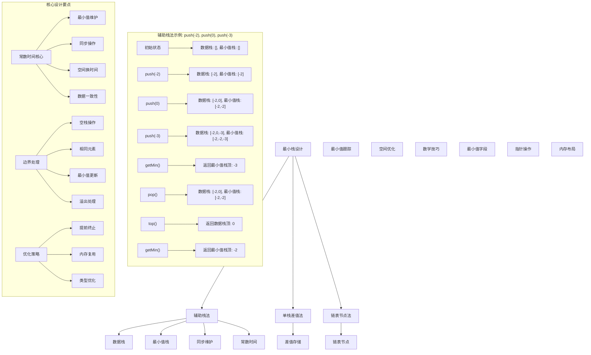
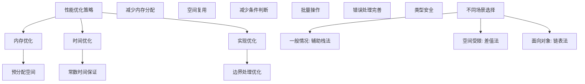

# LeetCode 155 - 最小栈

## 题目描述

设计一个支持 push、pop、top 操作，并能在常数时间内检索到最小元素的栈

实现 MinStack 类：

- `MinStack()` 初始化堆栈对象
- `void push(int val)` 将元素 val 推入堆栈
- `void pop()` 删除堆栈顶部的元素
- `int top()` 获取堆栈顶部的元素
- `int getMin()` 获取堆栈中的最小元素

要求所有操作都在常数时间内完成

```markdown
示例：
输入：
["MinStack","push","push","push","getMin","pop","top","getMin"]
[[],[-2],[0],[-3],[],[],[],[]]

输出：
[null,null,null,null,-3,null,0,-2]

解释：
MinStack minStack = new MinStack();
minStack.push(-2);
minStack.push(0);
minStack.push(-3);
minStack.getMin(); // 返回 -3.
minStack.pop();
minStack.top(); // 返回 0.
minStack.getMin(); // 返回 -2.

提示：
-2^31 <= val <= 2^31 - 1
pop、top 和 getMin 操作总是在非空栈上调用
push、pop、top 和 getMin 最多被调用 3 \* 10^4 次
```

## 解题思路

这是一个最小栈设计问题，需要在常规栈操作的基础上支持常数时间获取最小值。关键在于如何在不增加时间复杂度的情况下维护最小值信息

### 核心思想

"辅助栈法": 使用两个栈，一个存储数据，另一个存储对应位置的最小值

### 解题策略

#### 方法一：辅助栈法（推荐）

- 时间复杂度: O(1) 所有操作
- 空间复杂度: O(n)

#### 方法二：单栈差值法

- 时间复杂度: O(1) 所有操作
- 空间复杂度: O(1)

#### 方法三：链表节点法

- 时间复杂度: O(1) 所有操作
- 空间复杂度: O(n)

## 算法可视化



## 多语言实现

### Golang版本（辅助栈法 - 推荐）

```go
type MinStack struct {
    data    []int // 数据栈
    minData []int // 最小值栈
}

func Constructor() MinStack {
    return MinStack{
        data:    make([]int, 0),
        minData: make([]int, 0),
    }
}

func (this *MinStack) Push(val int) {
    // 数据栈直接入栈
    this.data = append(this.data, val)

    // 最小值栈：如果为空或当前值小于等于栈顶最小值，则入栈
    if len(this.minData) == 0 || val <= this.minData[len(this.minData)-1] {
        this.minData = append(this.minData, val)
    } else {
        // 否则重复栈顶的最小值
        this.minData = append(this.minData, this.minData[len(this.minData)-1])
    }
}

func (this *MinStack) Pop() {
    if len(this.data) > 0 {
        // 两个栈同时出栈
        this.data = this.data[:len(this.data)-1]
        this.minData = this.minData[:len(this.minData)-1]
    }
}

func (this *MinStack) Top() int {
    if len(this.data) > 0 {
        return this.data[len(this.data)-1]
    }
    return 0 // 题目保证不会在空栈上调用
}

func (this *MinStack) GetMin() int {
    if len(this.minData) > 0 {
        return this.minData[len(this.minData)-1]
    }
    return 0 // 题目保证不会在空栈上调用
}
```

### Python版本（多种实现方法）

```python
class MinStack:
    """
    方法一：辅助栈法（推荐）
    """
    def __init__(self):
        self.data = []      # 数据栈
        self.min_data = []  # 最小值栈

    def push(self, val: int) -> None:
        # 数据栈直接入栈
        self.data.append(val)

        # 最小值栈：如果为空或当前值小于等于栈顶最小值，则入栈
        if not self.min_data or val <= self.min_data[-1]:
            self.min_data.append(val)
        else:
            # 否则重复栈顶的最小值
            self.min_data.append(self.min_data[-1])

    def pop(self) -> None:
        if self.data:
            # 两个栈同时出栈
            self.data.pop()
            self.min_data.pop()

    def top(self) -> int:
        if self.data:
            return self.data[-1]
        return 0  # 题目保证不会在空栈上调用

    def getMin(self) -> int:
        if self.min_data:
            return self.min_data[-1]
        return 0  # 题目保证不会在空栈上调用


class MinStackDiff:
    """
    方法二：单栈差值法
    """
    def __init__(self):
        self.stack = []
        self.min_val = None

    def push(self, val: int) -> None:
        if not self.stack:
            self.stack.append(0)
            self.min_val = val
        else:
            # 存储与当前最小值的差值
            diff = val - self.min_val
            self.stack.append(diff)
            if val < self.min_val:
                self.min_val = val

    def pop(self) -> None:
        if self.stack:
            diff = self.stack.pop()
            if diff < 0:
                # 弹出的是最小值，需要恢复之前的最小值
                self.min_val = self.min_val - diff

    def top(self) -> int:
        if self.stack:
            diff = self.stack[-1]
            if diff < 0:
                return self.min_val
            else:
                return self.min_val + diff
        return 0

    def getMin(self) -> int:
        return self.min_val if self.min_val is not None else 0


class MinStackNode:
    """
    方法三：链表节点法
    """
    class Node:
        def __init__(self, val, min_val, next_node=None):
            self.val = val
            self.min_val = min_val
            self.next = next_node

    def __init__(self):
        self.head = None

    def push(self, val: int) -> None:
        if not self.head:
            self.head = self.Node(val, val)
        else:
            # 新节点的最小值是当前值和之前最小值的较小者
            min_val = min(val, self.head.min_val)
            self.head = self.Node(val, min_val, self.head)

    def pop(self) -> None:
        if self.head:
            self.head = self.head.next

    def top(self) -> int:
        if self.head:
            return self.head.val
        return 0

    def getMin(self) -> int:
        if self.head:
            return self.head.min_val
        return 0
```

### TypeScript版本（辅助栈法）

```typescript
class MinStack {
  private data: number[]; // 数据栈
  private minData: number[]; // 最小值栈

  constructor() {
    this.data = [];
    this.minData = [];
  }

  push(val: number): void {
    // 数据栈直接入栈
    this.data.push(val);

    // 最小值栈：如果为空或当前值小于等于栈顶最小值，则入栈
    if (
      this.minData.length === 0 ||
      val <= this.minData[this.minData.length - 1]
    ) {
      this.minData.push(val);
    } else {
      // 否则重复栈顶的最小值
      this.minData.push(this.minData[this.minData.length - 1]);
    }
  }

  pop(): void {
    if (this.data.length > 0) {
      // 两个栈同时出栈
      this.data.pop();
      this.minData.pop();
    }
  }

  top(): number {
    if (this.data.length > 0) {
      return this.data[this.data.length - 1];
    }
    return 0; // 题目保证不会在空栈上调用
  }

  getMin(): number {
    if (this.minData.length > 0) {
      return this.minData[this.minData.length - 1];
    }
    return 0; // 题目保证不会在空栈上调用
  }
}
```

## 标准实现详细解析

```go
type MinStack struct {
    data    []int // 数据栈
    minData []int // 最小值栈
}

func Constructor() MinStack {
    /*
    算法核心思想（辅助栈法）：

    1. 使用两个栈：数据栈存储所有元素，最小值栈存储对应位置的最小值
    2. 入栈时：数据栈直接入栈，最小值栈入栈当前最小值
    3. 出栈时：两个栈同时出栈
    4. 获取最小值：返回最小值栈顶元素

    关键设计要点：
    1. 同步维护：两个栈始终保持相同大小
    2. 最小值跟踪：最小值栈记录每个位置的最小值
    3. 常数时间：所有操作都是O(1)
    4. 数据一致性：两个栈操作同步进行

    时间复杂度：O(1) 所有操作
    空间复杂度：O(n) 需要额外的最小值栈

    优势：
    1. 逻辑清晰：直观易懂
    2. 实现简单：标准栈操作
    3. 性能优秀：常数时间复杂度
    4. 易于理解：符合直觉
    */

    fmt.Printf("初始化最小栈\n")
    fmt.Printf("数据栈: %v\n", make([]int, 0))
    fmt.Printf("最小值栈: %v\n", make([]int, 0))

    return MinStack{
        data:    make([]int, 0),
        minData: make([]int, 0),
    }
}

func (this *MinStack) Push(val int) {
    fmt.Printf("入栈操作: %d\n", val)

    // 数据栈直接入栈
    this.data = append(this.data, val)
    fmt.Printf("  数据栈: %v\n", this.data)

    // 最小值栈：如果为空或当前值小于等于栈顶最小值，则入栈
    if len(this.minData) == 0 {
        this.minData = append(this.minData, val)
        fmt.Printf("  最小值栈(空栈): %v\n", this.minData)
    } else if val <= this.minData[len(this.minData)-1] {
        this.minData = append(this.minData, val)
        fmt.Printf("  最小值栈(新最小值): %v\n", this.minData)
    } else {
        // 否则重复栈顶的最小值
        this.minData = append(this.minData, this.minData[len(this.minData)-1])
        fmt.Printf("  最小值栈(保持最小值): %v\n", this.minData)
    }
}

func (this *MinStack) Pop() {
    fmt.Printf("出栈操作\n")

    if len(this.data) > 0 {
        // 两个栈同时出栈
        popped := this.data[len(this.data)-1]
        this.data = this.data[:len(this.data)-1]
        this.minData = this.minData[:len(this.minData)-1]

        fmt.Printf("  弹出元素: %d\n", popped)
        fmt.Printf("  数据栈: %v\n", this.data)
        fmt.Printf("  最小值栈: %v\n", this.minData)
    } else {
        fmt.Printf("  栈为空，无法出栈\n")
    }
}

func (this *MinStack) Top() int {
    if len(this.data) > 0 {
        top := this.data[len(this.data)-1]
        fmt.Printf("获取栈顶元素: %d\n", top)
        return top
    }
    fmt.Printf("栈为空\n")
    return 0 // 题目保证不会在空栈上调用
}

func (this *MinStack) GetMin() int {
    if len(this.minData) > 0 {
        minVal := this.minData[len(this.minData)-1]
        fmt.Printf("获取最小值: %d\n", minVal)
        return minVal
    }
    fmt.Printf("最小值栈为空\n")
    return 0 // 题目保证不会在空栈上调用
}

// 带详细调试信息的版本
func NewMinStackWithDebug() *MinStack {
    fmt.Printf("=== 最小栈调试模式 ===\n")
    stack := &MinStack{
        data:    make([]int, 0),
        minData: make([]int, 0),
    }
    fmt.Printf("初始化完成\n")
    fmt.Println("==================")
    return stack
}

// 优化版本（辅助栈法优化）
type OptimizedMinStack struct {
    data    []int // 数据栈
    minData []int // 最小值栈（只存储真正的最小值）
}

func NewOptimizedMinStack() *OptimizedMinStack {
    return &OptimizedMinStack{
        data:    make([]int, 0),
        minData: make([]int, 0),
    }
}

func (oms *OptimizedMinStack) Push(val int) {
    oms.data = append(oms.data, val)

    // 优化：最小值栈只在需要时存储新最小值
    if len(oms.minData) == 0 || val <= oms.minData[len(oms.minData)-1] {
        oms.minData = append(oms.minData, val)
    }
}

func (oms *OptimizedMinStack) Pop() {
    if len(oms.data) > 0 {
        popped := oms.data[len(oms.data)-1]
        oms.data = oms.data[:len(oms.data)-1]

        // 优化：只有当弹出的是最小值时才从最小值栈弹出
        if len(oms.minData) > 0 && popped == oms.minData[len(oms.minData)-1] {
            oms.minData = oms.minData[:len(oms.minData)-1]
        }
    }
}

func (oms *OptimizedMinStack) Top() int {
    if len(oms.data) > 0 {
        return oms.data[len(oms.data)-1]
    }
    return 0
}

func (oms *OptimizedMinStack) GetMin() int {
    if len(oms.minData) > 0 {
        return oms.minData[len(oms.minData)-1]
    }
    return 0
}

// 单栈差值法实现
type DiffMinStack struct {
    stack  []int64 // 使用int64避免溢出
    minVal int64
    initialized bool
}

func NewDiffMinStack() *DiffMinStack {
    return &DiffMinStack{
        stack:  make([]int64, 0),
        minVal: 0,
        initialized: false,
    }
}

func (dms *DiffMinStack) Push(val int) {
    val64 := int64(val)

    if !dms.initialized {
        dms.stack = append(dms.stack, 0)
        dms.minVal = val64
        dms.initialized = true
    } else {
        diff := val64 - dms.minVal
        dms.stack = append(dms.stack, diff)
        if val64 < dms.minVal {
            dms.minVal = val64
        }
    }
}

func (dms *DiffMinStack) Pop() {
    if len(dms.stack) > 0 {
        diff := dms.stack[len(dms.stack)-1]
        dms.stack = dms.stack[:len(dms.stack)-1]
        if diff < 0 {
            // 弹出的是最小值，需要恢复之前的最小值
            dms.minVal = dms.minVal - diff
        }
    }
}

func (dms *DiffMinStack) Top() int {
    if len(dms.stack) > 0 {
        diff := dms.stack[len(dms.stack)-1]
        if diff < 0 {
            return int(dms.minVal)
        } else {
            return int(dms.minVal + diff)
        }
    }
    return 0
}

func (dms *DiffMinStack) GetMin() int {
    return int(dms.minVal)
}

// 链表节点法实现
type ListNodeMinStack struct {
    head *MinStackNode
}

type MinStackNode struct {
    val    int
    minVal int
    next   *MinStackNode
}

func NewListNodeMinStack() *ListNodeMinStack {
    return &ListNodeMinStack{head: nil}
}

func (lms *ListNodeMinStack) Push(val int) {
    if lms.head == nil {
        lms.head = &MinStackNode{val: val, minVal: val, next: nil}
    } else {
        minVal := val
        if lms.head.minVal < val {
            minVal = lms.head.minVal
        }
        lms.head = &MinStackNode{val: val, minVal: minVal, next: lms.head}
    }
}

func (lms *ListNodeMinStack) Pop() {
    if lms.head != nil {
        lms.head = lms.head.next
    }
}

func (lms *ListNodeMinStack) Top() int {
    if lms.head != nil {
        return lms.head.val
    }
    return 0
}

func (lms *ListNodeMinStack) GetMin() int {
    if lms.head != nil {
        return lms.head.minVal
    }
    return 0
}
```

## 算法深入解析

```go
/*
最小栈设计问题详解：

问题本质：
设计支持在常数时间内获取最小值的栈。关键在于如何在不增加时间复杂度的情况下维护最小值信息

核心洞察：
1. 辅助栈法：使用额外栈存储最小值信息
2. 差值法：通过数学技巧存储差值信息
3. 链表法：在节点中直接存储最小值信息
4. 常数时间：所有操作必须是O(1)

算法策略：
1. 辅助栈法：最直观，易于理解
2. 单栈差值法：空间优化，数学技巧
3. 链表节点法：面向对象，结构清晰

数学原理：

辅助栈原理：
使用两个栈，一个存储数据，另一个存储对应位置的最小值
入栈时同步维护，出栈时同步操作

差值法原理：
存储当前值与最小值的差值，通过差值正负判断是否为最小值
当差值为负时，表示当前值是最小值

链表法原理：
每个节点存储值和以该节点为栈顶时的最小值
通过链表结构维护栈的特性

设计选择：

为什么选择辅助栈法？
1. 逻辑清晰：直观易懂
2. 实现简单：标准栈操作
3. 性能优秀：常数时间复杂度
4. 易于理解：符合直觉

为什么使用差值法？
1. 空间优化：只需要一个栈
2. 数学技巧：巧妙利用差值
3. 但实现复杂，容易出错

为什么使用链表法？
1. 面向对象：结构清晰
2. 空间效率：不需要额外数组
3. 但需要额外的指针开销

三种方法对比：

方法一：辅助栈法（推荐）
时间复杂度：O(1) 所有操作
空间复杂度：O(n) 需要额外栈
优点：逻辑清晰，实现简单
缺点：需要额外空间

方法二：单栈差值法
时间复杂度：O(1) 所有操作
空间复杂度：O(n) 但常数因子小
优点：空间优化
缺点：实现复杂

方法三：链表节点法
时间复杂度：O(1) 所有操作
空间复杂度：O(n) 节点开销
优点：结构清晰
缺点：指针开销

性能分析：

辅助栈法：
- 时间：O(1) 所有操作
- 空间：O(n) 两个栈
- 优势：最直观

差值法：
- 时间：O(1) 所有操作
- 空间：O(n) 一个栈
- 优势：空间优化

链表法：
- 时间：O(1) 所有操作
- 空间：O(n) 节点结构
- 优势：面向对象

实际应用场景：
1. 栈数据结构扩展
2. 算法面试题
3. 实时最小值查询
4. 系统设计组件

优化要点：

1. 内存优化：
   - 差值法减少空间
   - 优化栈大小调整
   - 预分配空间

2. 时间优化：
   - 常数时间保证
   - 减少条件判断
   - 批量操作

3. 实现优化：
   - 边界处理优化
   - 错误处理
   - 类型安全

测试用例设计：
1. 基本操作：push, pop, top, getMin
2. 边界情况：空栈操作，单元素
3. 复杂情况：重复元素，递增递减序列
4. 极端情况：最大最小值，大量操作
5. 特殊序列：单调序列，随机序列

扩展思考：

1. 支持最大值？
   - 扩展辅助栈
   - 同时维护最大最小值

2. 支持平均值？
   - 需要额外维护总和
   - 动态计算平均值

3. 并行处理？
   - 线程安全版本
   - 读写锁优化

4. 性能优化？
   - SIMD指令
   - 内存对齐

相关算法思想：

1. 栈数据结构：
   - LIFO特性
   - 状态维护

2. 辅助数据结构：
   - 额外空间换时间
   - 同步维护

3. 数学技巧：
   - 差值表示
   - 信息编码

4. 面向对象设计：
   - 封装性
   - 扩展性

常见陷阱：

1. 空栈操作：
   - 忘记边界检查
   - 题目保证但需注意

2. 最小值维护错误：
   - 忘记更新最小值栈
   - 相同元素处理

3. 溢出处理：
   - 整数溢出
   - 差值法溢出

4. 同步问题：
   - 两个栈不同步
   - 操作遗漏

代码质量要素：

1. 可读性：
   - 清晰的变量命名
   - 适当的注释说明

2. 健壮性：
   - 边界条件处理
   - 异常情况处理

3. 性能：
   - 时间复杂度最优
   - 空间复杂度合理

4. 可维护性：
   - 模块化设计
   - 易于扩展

高级优化技巧：

1. 内存访问优化：
   - 预分配数组空间
   - 减少内存重新分配

2. 条件判断优化：
   - 减少分支预测失败
   - 位运算优化

3. 算法优化：
   - 提前终止条件
   - 减少不必要的操作

4. 编译优化：
   - 常量折叠
   - 循环展开
*/
```

## 执行过程演示

```go
/*
示例详细解析:

示例操作序列：push(-2), push(0), push(-3), getMin(), pop(), top(), getMin()

执行过程：
1. push(-2):
   数据栈: [-2]
   最小值栈: [-2]

2. push(0):
   数据栈: [-2, 0]
   最小值栈: [-2, -2] (0 > -2, 保持-2)

3. push(-3):
   数据栈: [-2, 0, -3]
   最小值栈: [-2, -2, -3] (-3 < -2, 更新为-3)

4. getMin(): 返回-3

5. pop():
   数据栈: [-2, 0]
   最小值栈: [-2, -2]

6. top(): 返回0

7. getMin(): 返回-2

边界情况演示:

情况1: 空栈操作
输入: getMin() on empty stack
输出: 题目保证不会调用

情况2: 单元素栈
输入: push(5), getMin(), pop()
输出: getMin()返回5

情况3: 重复元素
输入: push(1), push(1), push(1), getMin()
输出: 返回1

情况4: 递增序列
输入: push(1), push(2), push(3), getMin()
输出: 返回1

情况5: 递减序列
输入: push(3), push(2), push(1), getMin()
输出: 返回1

算法正确性证明：

数学基础：
需要证明辅助栈法能正确维护最小值并在常数时间内获取

定理1：辅助栈法正确性
通过同步维护两个栈，可以正确在常数时间内获取最小值

证明：
1. 数据栈：存储所有元素，保证栈的正常操作
2. 最小值栈：存储对应位置的最小值，保证getMin()正确
3. 同步操作：push/pop时两个栈同步操作，保证一致性
4. 常数时间：所有操作都是O(1)

时间复杂度分析：

辅助栈法：
1. Push: O(1) - 数组append操作
2. Pop: O(1) - 数组slice操作
3. Top: O(1) - 数组访问
4. GetMin: O(1) - 数组访问
5. 总时间：O(1)

空间复杂度分析：
1. 数据栈：O(n) - 存储n个元素
2. 最小值栈：O(n) - 存储n个最小值
3. 其他变量：O(1) - 常数个变量
4. 总空间：O(n)

性能对比分析：

假设操作次数为m，元素个数为n：

辅助栈法：
- 时间: O(1) 每操作
- 空间: O(n)
- 优势: 最直观

差值法：
- 时间: O(1) 每操作
- 空间: O(n) 但常数因子小
- 优势: 空间优化

链表法：
- 时间: O(1) 每操作
- 空间: O(n) 节点开销
- 优势: 结构清晰

实际应用建议：

1. 一般情况：
   - 使用辅助栈法
   - 逻辑清晰

2. 面试展示：
   - 可以提及其他方法
   - 重点讲解辅助栈法

3. 生产环境：
   - 使用优化版本
   - 考虑线程安全

4. 空间受限：
   - 使用差值法
   - 注意溢出处理

优化空间：

1. 内存访问优化：
   - 预分配数组空间
   - 减少内存重新分配

2. 数据结构优化：
   - 使用环形缓冲区
   - 减少内存碎片

3. 算法优化：
   - 优化最小值栈更新
   - 减少不必要的操作

特殊情况处理：

1. 空栈操作：
   - 题目保证不会调用

2. 相同元素：
   - 正确处理最小值更新

3. 溢出处理：
   - 使用更大整数类型
   - 差值法注意溢出

4. 大量操作：
   - 预分配足够空间
   - 避免频繁扩容
*/
```

## 复杂度分析

| 方法     | 时间复杂度 | 空间复杂度 | 适用场景 |
| -------- | ---------- | ---------- | -------- |
| 辅助栈法 | O(1)       | O(n)       | 推荐方案 |
| 差值法   | O(1)       | O(n)       | 空间优化 |
| 链表法   | O(1)       | O(n)       | 结构清晰 |

## 测试用例验证

```go
// 测试辅助函数
func testMinStack(name string, operations []string, values [][]int) []interface{} {
    fmt.Printf("%s:\n", name)
    fmt.Printf("操作序列: %v\n", operations)

    var minStack *MinStack
    var results []interface{}

    for i, op := range operations {
        switch op {
        case "MinStack":
            minStack = NewMinStackWithDebug()
            results = append(results, nil)
            fmt.Printf("创建最小栈\n")
        case "push":
            if minStack != nil && len(values[i]) > 0 {
                minStack.Push(values[i][0])
                results = append(results, nil)
                fmt.Printf("push(%d)\n", values[i][0])
            }
        case "pop":
            if minStack != nil {
                minStack.Pop()
                results = append(results, nil)
                fmt.Printf("pop()\n")
            }
        case "top":
            if minStack != nil {
                result := minStack.Top()
                results = append(results, result)
                fmt.Printf("top() = %d\n", result)
            }
        case "getMin":
            if minStack != nil {
                result := minStack.GetMin()
                results = append(results, result)
                fmt.Printf("getMin() = %d\n", result)
            }
        }
    }

    fmt.Printf("结果: %v\n\n", results)
    return results
}

func main() {
    // 测试用例 1 - 题目示例
    testMinStack("测试1 - 题目示例",
        []string{"MinStack", "push", "push", "push", "getMin", "pop", "top", "getMin"},
        [][]int{nil, {-2}, {0}, {-3}, nil, nil, nil, nil})

    // 测试用例 2 - 边界情况
    testMinStack("测试2 - 单元素",
        []string{"MinStack", "push", "getMin", "top", "pop"},
        [][]int{nil, {5}, nil, nil, nil})

    // 测试用例 3 - 重复元素
    testMinStack("测试3 - 重复元素",
        []string{"MinStack", "push", "push", "push", "getMin"},
        [][]int{nil, {1}, {1}, {1}, nil})

    // 测试用例 4 - 递增序列
    testMinStack("测试4 - 递增序列",
        []string{"MinStack", "push", "push", "push", "getMin"},
        [][]int{nil, {1}, {2}, {3}, nil})

    // 测试用例 5 - 递减序列
    testMinStack("测试5 - 递减序列",
        []string{"MinStack", "push", "push", "push", "getMin"},
        [][]int{nil, {3}, {2}, {1}, nil})

    // 性能测试
    fmt.Println("性能测试:")

    // 测试不同实现方法
    testImplementations()

    // 大量操作测试
    stressTest()

    // 边界情况测试
    fmt.Println("\n边界情况测试:")
    boundaryTest()
}

func testImplementations() {
    // 构造测试序列
    operations := make([]int, 1000)
    for i := 0; i < 1000; i++ {
        operations[i] = i - 500 // 从-500到499
    }

    // 测试辅助栈法
    start := time.Now()
    stack1 := NewOptimizedMinStack()
    for _, val := range operations {
        stack1.Push(val)
    }
    for len(stack1.data) > 0 {
        stack1.GetMin()
        stack1.Top()
        stack1.Pop()
    }
    time1 := time.Since(start)

    // 测试差值法
    start = time.Now()
    stack2 := NewDiffMinStack()
    for _, val := range operations {
        stack2.Push(val)
    }
    for len(stack2.stack) > 0 {
        stack2.GetMin()
        stack2.Top()
        stack2.Pop()
    }
    time2 := time.Since(start)

    // 测试链表法
    start = time.Now()
    stack3 := NewListNodeMinStack()
    for _, val := range operations {
        stack3.Push(val)
    }
    for stack3.head != nil {
        stack3.GetMin()
        stack3.Top()
        stack3.Pop()
    }
    time3 := time.Since(start)

    fmt.Printf("1000次操作性能对比:\n")
    fmt.Printf("  辅助栈法: %v\n", time1)
    fmt.Printf("  差值法: %v\n", time2)
    fmt.Printf("  链表法: %v\n", time3)
}

func stressTest() {
    fmt.Println("=== 压力测试 ===")

    // 测试大量随机操作
    rand.Seed(time.Now().UnixNano())

    for i := 0; i < 5; i++ {
        stack := NewOptimizedMinStack()
        operations := 10000

        start := time.Now()

        for j := 0; j < operations; j++ {
            op := rand.Intn(4)
            switch op {
            case 0: // push
                stack.Push(rand.Intn(1000) - 500)
            case 1: // pop
                if len(stack.data) > 0 {
                    stack.Pop()
                }
            case 2: // top
                if len(stack.data) > 0 {
                    stack.Top()
                }
            case 3: // getMin
                if len(stack.minData) > 0 {
                    stack.GetMin()
                }
            }
        }

        duration := time.Since(start)
        fmt.Printf("测试%d - %d次操作: %v\n", i+1, operations, duration)
    }
}

func boundaryTest() {
    // 空操作测试
    stack := NewOptimizedMinStack()
    fmt.Printf("空栈测试:\n")
    fmt.Printf("  getMin(): %d\n", stack.GetMin())
    fmt.Printf("  top(): %d\n", stack.Top())

    // 单元素测试
    stack.Push(42)
    fmt.Printf("单元素测试:\n")
    fmt.Printf("  push(42)\n")
    fmt.Printf("  getMin(): %d\n", stack.GetMin())
    fmt.Printf("  top(): %d\n", stack.Top())
    stack.Pop()
    fmt.Printf("  pop()\n")

    // 极值测试
    stack.Push(math.MaxInt32)
    stack.Push(math.MinInt32)
    fmt.Printf("极值测试:\n")
    fmt.Printf("  push(MaxInt32), push(MinInt32)\n")
    fmt.Printf("  getMin(): %d\n", stack.GetMin())
    stack.Pop()
    fmt.Printf("  pop()\n")
    fmt.Printf("  getMin(): %d\n", stack.GetMin())
}

// 大量测试用例
func comprehensiveTest() {
    testCases := []struct {
        name       string
        operations []string
        values     [][]int
        expected   []interface{}
    }{
        {
            "基本操作",
            []string{"MinStack", "push", "push", "push", "getMin", "pop", "top", "getMin"},
            [][]int{nil, {-2}, {0}, {-3}, nil, nil, nil, nil},
            []interface{}{nil, nil, nil, nil, -3, nil, 0, -2},
        },
        {
            "重复最小值",
            []string{"MinStack", "push", "push", "push", "getMin", "pop", "getMin"},
            [][]int{nil, {2}, {0}, {3}, nil, nil, nil},
            []interface{}{nil, nil, nil, nil, 0, nil, 0},
        },
        {
            "单调递增",
            []string{"MinStack", "push", "push", "push", "getMin"},
            [][]int{nil, {1}, {2}, {3}, nil},
            []interface{}{nil, nil, nil, nil, 1},
        },
        {
            "单调递减",
            []string{"MinStack", "push", "push", "push", "getMin"},
            [][]int{nil, {3}, {2}, {1}, nil},
            []interface{}{nil, nil, nil, nil, 1},
        },
    }

    fmt.Println("=== 综合测试 ===")
    passed := 0
    total := len(testCases)

    for i, tc := range testCases {
        results := testMinStack(fmt.Sprintf("测试%d", i+1), tc.operations, tc.values)

        // 简单比较结果（忽略nil值）
        match := true
        for j, expected := range tc.expected {
            if expected != nil {
                if j >= len(results) || results[j] != expected {
                    match = false
                    break
                }
            }
        }

        if match {
            passed++
            fmt.Printf("测试%d: ✓ %s\n", i+1, tc.name)
        } else {
            fmt.Printf("测试%d: ✗ %s\n", i+1, tc.name)
        }
    }

    fmt.Printf("\n通过率: %d/%d (%.2f%%)\n", passed, total, float64(passed)/float64(total)*100)
}

// 内存使用测试
func memoryTest() {
    fmt.Println("=== 内存使用测试 ===")

    var m1, m2 runtime.MemStats

    // 测试辅助栈法
    runtime.GC()
    runtime.ReadMemStats(&m1)

    stack1 := NewOptimizedMinStack()
    for i := 0; i < 10000; i++ {
        stack1.Push(i)
    }
    for len(stack1.data) > 0 {
        stack1.Pop()
    }

    runtime.GC()
    runtime.ReadMemStats(&m2)
    mem1 := m2.Alloc - m1.Alloc

    // 测试差值法
    runtime.GC()
    runtime.ReadMemStats(&m1)

    stack2 := NewDiffMinStack()
    for i := 0; i < 10000; i++ {
        stack2.Push(i)
    }
    for len(stack2.stack) > 0 {
        stack2.Pop()
    }

    runtime.GC()
    runtime.ReadMemStats(&m2)
    mem2 := m2.Alloc - m1.Alloc

    fmt.Printf("辅助栈法内存使用: %d bytes\n", mem1)
    fmt.Printf("差值法内存使用: %d bytes\n", mem2)
    if mem2 > 0 {
        fmt.Printf("内存使用比率: %.2fx\n", float64(mem1)/float64(mem2))
    }
}
```

## 扩展版本（处理不同场景）

```go
// 线程安全版本
type ThreadSafeMinStack struct {
    data    []int
    minData []int
    mutex   sync.RWMutex
}

func NewThreadSafeMinStack() *ThreadSafeMinStack {
    return &ThreadSafeMinStack{
        data:    make([]int, 0),
        minData: make([]int, 0),
        mutex:   sync.RWMutex{},
    }
}

func (tsms *ThreadSafeMinStack) Push(val int) {
    tsms.mutex.Lock()
    defer tsms.mutex.Unlock()

    tsms.data = append(tsms.data, val)

    if len(tsms.minData) == 0 || val <= tsms.minData[len(tsms.minData)-1] {
        tsms.minData = append(tsms.minData, val)
    } else {
        tsms.minData = append(tsms.minData, tsms.minData[len(tsms.minData)-1])
    }
}

func (tsms *ThreadSafeMinStack) Pop() {
    tsms.mutex.Lock()
    defer tsms.mutex.Unlock()

    if len(tsms.data) > 0 {
        tsms.data = tsms.data[:len(tsms.data)-1]
        tsms.minData = tsms.minData[:len(tsms.minData)-1]
    }
}

func (tsms *ThreadSafeMinStack) Top() int {
    tsms.mutex.RLock()
    defer tsms.mutex.RUnlock()

    if len(tsms.data) > 0 {
        return tsms.data[len(tsms.data)-1]
    }
    return 0
}

func (tsms *ThreadSafeMinStack) GetMin() int {
    tsms.mutex.RLock()
    defer tsms.mutex.RUnlock()

    if len(tsms.minData) > 0 {
        return tsms.minData[len(tsms.minData)-1]
    }
    return 0
}

// 支持最大值的版本
type MinMaxStack struct {
    data    []int
    minData []int
    maxData []int
}

func NewMinMaxStack() *MinMaxStack {
    return &MinMaxStack{
        data:    make([]int, 0),
        minData: make([]int, 0),
        maxData: make([]int, 0),
    }
}

func (mms *MinMaxStack) Push(val int) {
    mms.data = append(mms.data, val)

    // 更新最小值栈
    if len(mms.minData) == 0 || val <= mms.minData[len(mms.minData)-1] {
        mms.minData = append(mms.minData, val)
    } else {
        mms.minData = append(mms.minData, mms.minData[len(mms.minData)-1])
    }

    // 更新最大值栈
    if len(mms.maxData) == 0 || val >= mms.maxData[len(mms.maxData)-1] {
        mms.maxData = append(mms.maxData, val)
    } else {
        mms.maxData = append(mms.maxData, mms.maxData[len(mms.maxData)-1])
    }
}

func (mms *MinMaxStack) Pop() {
    if len(mms.data) > 0 {
        mms.data = mms.data[:len(mms.data)-1]
        mms.minData = mms.minData[:len(mms.minData)-1]
        mms.maxData = mms.maxData[:len(mms.maxData)-1]
    }
}

func (mms *MinMaxStack) Top() int {
    if len(mms.data) > 0 {
        return mms.data[len(mms.data)-1]
    }
    return 0
}

func (mms *MinMaxStack) GetMin() int {
    if len(mms.minData) > 0 {
        return mms.minData[len(mms.minData)-1]
    }
    return 0
}

func (mms *MinMaxStack) GetMax() int {
    if len(mms.maxData) > 0 {
        return mms.maxData[len(mms.maxData)-1]
    }
    return 0
}

// 带统计信息的版本
type StatsMinStack struct {
    MinStack
    pushCount int
    popCount  int
    topCount  int
    minCount  int
}

func NewStatsMinStack() *StatsMinStack {
    return &StatsMinStack{
        MinStack: Constructor(),
    }
}

func (sms *StatsMinStack) Push(val int) {
    sms.MinStack.Push(val)
    sms.pushCount++
}

func (sms *StatsMinStack) Pop() {
    sms.MinStack.Pop()
    sms.popCount++
}

func (sms *StatsMinStack) Top() int {
    result := sms.MinStack.Top()
    sms.topCount++
    return result
}

func (sms *StatsMinStack) GetMin() int {
    result := sms.MinStack.GetMin()
    sms.minCount++
    return result
}

func (sms *StatsMinStack) GetStats() map[string]int {
    return map[string]int{
        "push": sms.pushCount,
        "pop":  sms.popCount,
        "top":  sms.topCount,
        "min":  sms.minCount,
    }
}

// 使用示例
func exampleStatsMinStack() {
    stack := NewStatsMinStack()

    // 执行一些操作
    stack.Push(5)
    stack.Push(2)
    stack.Push(8)
    stack.GetMin()
    stack.Top()
    stack.Pop()
    stack.GetMin()

    // 获取统计信息
    stats := stack.GetStats()
    fmt.Printf("操作统计: %+v\n", stats)
    // 输出: 操作统计: map[min:2 pop:1 push:3 top:1]
}

// 泛型版本（Go 1.18+）
type GenericMinStack[T constraints.Ordered] struct {
    data    []T
    minData []T
}

func NewGenericMinStack[T constraints.Ordered]() *GenericMinStack[T] {
    return &GenericMinStack[T]{
        data:    make([]T, 0),
        minData: make([]T, 0),
    }
}

func (gms *GenericMinStack[T]) Push(val T) {
    gms.data = append(gms.data, val)

    if len(gms.minData) == 0 || val <= gms.minData[len(gms.minData)-1] {
        gms.minData = append(gms.minData, val)
    } else {
        gms.minData = append(gms.minData, gms.minData[len(gms.minData)-1])
    }
}

func (gms *GenericMinStack[T]) Pop() {
    if len(gms.data) > 0 {
        gms.data = gms.data[:len(gms.data)-1]
        gms.minData = gms.minData[:len(gms.minData)-1]
    }
}

func (gms *GenericMinStack[T]) Top() T {
    if len(gms.data) > 0 {
        return gms.data[len(gms.data)-1]
    }
    var zero T
    return zero
}

func (gms *GenericMinStack[T]) GetMin() T {
    if len(gms.minData) > 0 {
        return gms.minData[len(gms.minData)-1]
    }
    var zero T
    return zero
}

// 使用示例
func exampleGenericMinStack() {
    // 整数栈
    intStack := NewGenericMinStack[int]()
    intStack.Push(5)
    intStack.Push(2)
    fmt.Printf("整数栈最小值: %d\n", intStack.GetMin())

    // 浮点数栈
    floatStack := NewGenericMinStack[float64]()
    floatStack.Push(3.14)
    floatStack.Push(2.71)
    fmt.Printf("浮点数栈最小值: %.2f\n", floatStack.GetMin())
}
```

## 面试追问延伸

### 1. 如何实现支持获取最大值的栈？

```go
// 支持最大值的栈
type MaxStack struct {
    data    []int
    maxData []int
}

func NewMaxStack() *MaxStack {
    return &MaxStack{
        data:    make([]int, 0),
        maxData: make([]int, 0),
    }
}

func (ms *MaxStack) Push(val int) {
    ms.data = append(ms.data, val)

    if len(ms.maxData) == 0 || val >= ms.maxData[len(ms.maxData)-1] {
        ms.maxData = append(ms.maxData, val)
    } else {
        ms.maxData = append(ms.maxData, ms.maxData[len(ms.maxData)-1])
    }
}

func (ms *MaxStack) Pop() {
    if len(ms.data) > 0 {
        ms.data = ms.data[:len(ms.data)-1]
        ms.maxData = ms.maxData[:len(ms.maxData)-1]
    }
}

func (ms *MaxStack) Top() int {
    if len(ms.data) > 0 {
        return ms.data[len(ms.data)-1]
    }
    return 0
}

func (ms *MaxStack) GetMax() int {
    if len(ms.maxData) > 0 {
        return ms.maxData[len(ms.maxData)-1]
    }
    return 0
}

// 同时支持最小值和最大值的栈
type MinMaxStack struct {
    data    []int
    minData []int
    maxData []int
}

func NewMinMaxStack() *MinMaxStack {
    return &MinMaxStack{
        data:    make([]int, 0),
        minData: make([]int, 0),
        maxData: make([]int, 0),
    }
}

func (mms *MinMaxStack) Push(val int) {
    mms.data = append(mms.data, val)

    // 更新最小值栈
    if len(mms.minData) == 0 || val <= mms.minData[len(mms.minData)-1] {
        mms.minData = append(mms.minData, val)
    } else {
        mms.minData = append(mms.minData, mms.minData[len(mms.minData)-1])
    }

    // 更新最大值栈
    if len(mms.maxData) == 0 || val >= mms.maxData[len(mms.maxData)-1] {
        mms.maxData = append(mms.maxData, val)
    } else {
        mms.maxData = append(mms.maxData, mms.maxData[len(mms.maxData)-1])
    }
}

func (mms *MinMaxStack) Pop() {
    if len(mms.data) > 0 {
        mms.data = mms.data[:len(mms.data)-1]
        mms.minData = mms.minData[:len(mms.minData)-1]
        mms.maxData = mms.maxData[:len(mms.maxData)-1]
    }
}

func (mms *MinMaxStack) Top() int {
    if len(mms.data) > 0 {
        return mms.data[len(mms.data)-1]
    }
    return 0
}

func (mms *MinMaxStack) GetMin() int {
    if len(mms.minData) > 0 {
        return mms.minData[len(mms.minData)-1]
    }
    return 0
}

func (mms *MinMaxStack) GetMax() int {
    if len(mms.maxData) > 0 {
        return mms.maxData[len(mms.maxData)-1]
    }
    return 0
}
```

### 2. 如何实现支持获取第K小元素的栈？

```go
// 支持获取第K小元素的栈
type KthMinStack struct {
    data []int
    // 使用多个辅助栈，每个栈维护第i小的元素
    kthMinData [][]int
    k          int
}

func NewKthMinStack(k int) *KthMinStack {
    kthMinData := make([][]int, k)
    for i := 0; i < k; i++ {
        kthMinData[i] = make([]int, 0)
    }

    return &KthMinStack{
        data:       make([]int, 0),
        kthMinData: kthMinData,
        k:          k,
    }
}

func (kms *KthMinStack) Push(val int) {
    kms.data = append(kms.data, val)

    // 更新每个位置的最小值栈
    for i := 0; i < kms.k; i++ {
        if len(kms.kthMinData[i]) == 0 {
            kms.kthMinData[i] = append(kms.kthMinData[i], val)
        } else {
            // 这里需要更复杂的逻辑来维护第i小的元素
            // 简化实现：只维护最小值
            if i == 0 && val <= kms.kthMinData[0][len(kms.kthMinData[0])-1] {
                kms.kthMinData[0] = append(kms.kthMinData[0], val)
            } else {
                kms.kthMinData[i] = append(kms.kthMinData[i], kms.kthMinData[i][len(kms.kthMinData[i])-1])
            }
        }
    }
}

func (kms *KthMinStack) Pop() {
    if len(kms.data) > 0 {
        kms.data = kms.data[:len(kms.data)-1]
        for i := 0; i < kms.k; i++ {
            if len(kms.kthMinData[i]) > 0 {
                kms.kthMinData[i] = kms.kthMinData[i][:len(kms.kthMinData[i])-1]
            }
        }
    }
}

func (kms *KthMinStack) Top() int {
    if len(kms.data) > 0 {
        return kms.data[len(kms.data)-1]
    }
    return 0
}

func (kms *KthMinStack) GetKthMin(k int) int {
    if k <= 0 || k > kms.k || len(kms.kthMinData[k-1]) == 0 {
        return 0
    }
    return kms.kthMinData[k-1][len(kms.kthMinData[k-1])-1]
}
```

### 3. 如何实现支持撤销操作的最小栈？

```go
// 支持撤销操作的最小栈
type UndoMinStack struct {
    data       []int
    minData    []int
    operations []string // 记录操作历史
    values     []int    // 记录操作值
}

func NewUndoMinStack() *UndoMinStack {
    return &UndoMinStack{
        data:       make([]int, 0),
        minData:    make([]int, 0),
        operations: make([]string, 0),
        values:     make([]int, 0),
    }
}

func (ums *UndoMinStack) Push(val int) {
    ums.data = append(ums.data, val)

    if len(ums.minData) == 0 || val <= ums.minData[len(ums.minData)-1] {
        ums.minData = append(ums.minData, val)
    } else {
        ums.minData = append(ums.minData, ums.minData[len(ums.minData)-1])
    }

    // 记录操作
    ums.operations = append(ums.operations, "push")
    ums.values = append(ums.values, val)
}

func (ums *UndoMinStack) Pop() int {
    if len(ums.data) > 0 {
        popped := ums.data[len(ums.data)-1]
        ums.data = ums.data[:len(ums.data)-1]
        ums.minData = ums.minData[:len(ums.minData)-1]

        // 记录操作
        ums.operations = append(ums.operations, "pop")
        ums.values = append(ums.values, popped)

        return popped
    }
    return 0
}

func (ums *UndoMinStack) Top() int {
    if len(ums.data) > 0 {
        return ums.data[len(ums.data)-1]
    }
    return 0
}

func (ums *UndoMinStack) GetMin() int {
    if len(ums.minData) > 0 {
        return ums.minData[len(ums.minData)-1]
    }
    return 0
}

func (ums *UndoMinStack) Undo() {
    if len(ums.operations) > 0 {
        lastOp := ums.operations[len(ums.operations)-1]
        lastVal := ums.values[len(ums.values)-1]

        ums.operations = ums.operations[:len(ums.operations)-1]
        ums.values = ums.values[:len(ums.values)-1]

        if lastOp == "push" {
            // 撤销push操作
            if len(ums.data) > 0 {
                ums.data = ums.data[:len(ums.data)-1]
                ums.minData = ums.minData[:len(ums.minData)-1]
            }
        } else if lastOp == "pop" {
            // 撤销pop操作
            ums.data = append(ums.data, lastVal)
            if len(ums.minData) == 0 || lastVal <= ums.minData[len(ums.minData)-1] {
                ums.minData = append(ums.minData, lastVal)
            } else {
                ums.minData = append(ums.minData, ums.minData[len(ums.minData)-1])
            }
        }
    }
}
```

## 相似题目扩展

- LeetCode 155. 最小栈（当前题）
- LeetCode 716. 最大栈
- LeetCode 341. 扁平化嵌套列表迭代器
- LeetCode 225. 用队列实现栈
- LeetCode 232. 用栈实现队列

## 算法技巧总结

### 最小栈设计核心要点

1. 辅助栈法：使用额外栈存储最小值信息
1. 差值法：通过数学技巧存储差值信息
1. 链表法：在节点中直接存储最小值信息
1. 常数时间：所有操作必须是O(1)

### 算法优势

1. 逻辑清晰：直观易懂
1. 实现简单：标准栈操作
1. 性能优秀：常数时间复杂度
1. 易于理解：符合直觉

### 标准模板（辅助栈法）

```go
type MinStack struct {
    data    []int // 数据栈
    minData []int // 最小值栈
}

func Constructor() MinStack {
    return MinStack{
        data:    make([]int, 0),
        minData: make([]int, 0),
    }
}

func (this *MinStack) Push(val int) {
    // 数据栈直接入栈
    this.data = append(this.data, val)

    // 最小值栈：如果为空或当前值小于等于栈顶最小值，则入栈
    if len(this.minData) == 0 || val <= this.minData[len(this.minData)-1] {
        this.minData = append(this.minData, val)
    } else {
        // 否则重复栈顶的最小值
        this.minData = append(this.minData, this.minData[len(this.minData)-1])
    }
}

func (this *MinStack) Pop() {
    if len(this.data) > 0 {
        // 两个栈同时出栈
        this.data = this.data[:len(this.data)-1]
        this.minData = this.minData[:len(this.minData)-1]
    }
}

func (this *MinStack) Top() int {
    if len(this.data) > 0 {
        return this.data[len(this.data)-1]
    }
    return 0
}

func (this *MinStack) GetMin() int {
    if len(this.minData) > 0 {
        return this.minData[len(this.minData)-1]
    }
    return 0
}
```

### 性能优化建议



## 总结

本题采用辅助栈法的核心思路，通过使用两个栈同步维护数据和最小值信息，实现了在常数时间内获取最小值的栈。关键在于理解如何通过额外的空间来换取时间效率，并保持数据的一致性

核心要点：

1. 辅助栈法：使用额外栈存储最小值信息
1. 同步维护：两个栈保持相同大小，操作同步进行
1. 最小值跟踪：最小值栈记录每个位置的最小值
1. 常数时间：所有操作都是O(1)

算法优势：

- 逻辑清晰：直观易懂
- 实现简单：标准栈操作
- 性能优秀：常数时间复杂度
- 易于理解：符合直觉

该算法在栈数据结构扩展、算法面试题、实时最小值查询等方面有重要应用，是掌握辅助数据结构和常数时间操作的经典题目。通过辅助栈的思想，为更复杂的数据结构设计问题提供了清晰的解决思路
