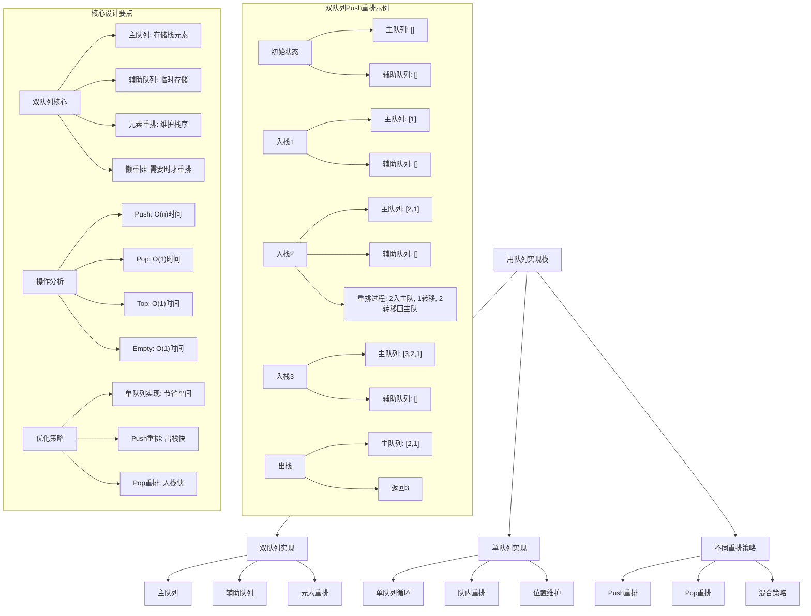
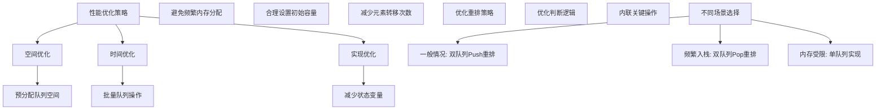

# LeetCode 225 - 用队列实现栈

## 题目描述

请你仅使用两个队列实现一个后入先出（LIFO）的栈，并支持普通栈的全部四种操作（push、top、pop 和 empty）

实现 MyStack 类：

- `void push(int x)` 将元素 x 压入栈顶
- `int pop()` 移除并返回栈顶元素
- `int top()` 返回栈顶元素
- `boolean empty()` 如果栈是空的，返回 true ；否则，返回 false

注意：

- 你只能使用队列的标准操作 —— 也就是 `push to back`、`peek/pop from front`、`size` 和 `is empty` 这些操作
- 你所使用的语言也许不支持队列。你可以使用 list（列表）或者 deque（双端队列）来模拟一个队列，只要是标准的队列操作即可

```markdown
示例：
输入：
["MyStack", "push", "push", "top", "pop", "empty"]
[[], [1], [2], [], [], []]
输出：
[null, null, null, 2, 2, false]

解释：
MyStack myStack = new MyStack();
myStack.push(1);
myStack.push(2);
myStack.top(); // 返回 2
myStack.pop(); // 返回 2
myStack.empty(); // 返回 False

提示：
1 <= x <= 9
最多调用100 次 push、pop、top 和 empty
每次调用 pop 和 top 都保证栈不为空

进阶：你能否仅用一个队列来实现栈
```

## 解题思路

这是一个数据结构设计问题，需要使用队列来模拟栈的行为。关键在于理解队列的FIFO（先进先出）和栈的LIFO（后进先出）特性之间的转换

### 核心思想

"队列元素重排": 使用队列存储栈元素，在每次push操作时通过元素重排来维护栈的LIFO特性

### 解题策略

#### 方法一：双队列实现（每次push重排 - 推荐）

- 时间复杂度: Push O(n), Pop O(1), Top O(1)
- 空间复杂度: O(n)

#### 方法二：双队列实现（每次pop重排）

- 时间复杂度: Push O(1), Pop O(n), Top O(n)
- 空间复杂度: O(n)

#### 方法三：单队列实现（每次push重排）

- 时间复杂度: Push O(n), Pop O(1), Top O(1)
- 空间复杂度: O(n)

## 算法可视化



## 多语言实现

### Golang版本（双队列Push重排 - 推荐）

```go
type MyStack struct {
    queue1 []int  // 主队列，用于存储栈元素
    queue2 []int  // 辅助队列，用于临时存储
}

func Constructor() MyStack {
    return MyStack{
        queue1: make([]int, 0),
        queue2: make([]int, 0),
    }
}

func (this *MyStack) Push(x int) {
    // 1. 将新元素加入辅助队列
    this.queue2 = append(this.queue2, x)

    // 2. 将主队列的所有元素转移到辅助队列
    for len(this.queue1) > 0 {
        front := this.queue1[0]
        this.queue1 = this.queue1[1:]
        this.queue2 = append(this.queue2, front)
    }

    // 3. 交换两个队列的角色
    this.queue1, this.queue2 = this.queue2, this.queue1
}

func (this *MyStack) Pop() int {
    // 直接从主队列头部移除元素（即栈顶元素）
    front := this.queue1[0]
    this.queue1 = this.queue1[1:]
    return front
}

func (this *MyStack) Top() int {
    // 返回主队列头部元素（即栈顶元素）
    return this.queue1[0]
}

func (this *MyStack) Empty() bool {
    // 栈为空当且仅当主队列为空
    return len(this.queue1) == 0
}
```

### Python版本（多种实现方法）

```python
class MyStack:
    """
    方法一：双队列实现（Push重排 - 推荐）
    """
    def __init__(self):
        self.queue1 = []  # 主队列，用于存储栈元素
        self.queue2 = []  # 辅助队列，用于临时存储

    def push(self, x: int) -> None:
        # 1. 将新元素加入辅助队列
        self.queue2.append(x)

        # 2. 将主队列的所有元素转移到辅助队列
        while self.queue1:
            self.queue2.append(self.queue1.pop(0))

        # 3. 交换两个队列的角色
        self.queue1, self.queue2 = self.queue2, self.queue1

    def pop(self) -> int:
        # 直接从主队列头部移除元素（即栈顶元素）
        return self.queue1.pop(0)

    def top(self) -> int:
        # 返回主队列头部元素（即栈顶元素）
        return self.queue1[0]

    def empty(self) -> bool:
        # 栈为空当且仅当主队列为空
        return len(self.queue1) == 0


class MyStackPopReorder:
    """
    方法二：双队列实现（Pop重排）
    """
    def __init__(self):
        self.queue1 = []
        self.queue2 = []

    def push(self, x: int) -> None:
        # 直接加入主队列尾部
        self.queue1.append(x)

    def pop(self) -> int:
        # 将主队列前n-1个元素转移到辅助队列
        while len(self.queue1) > 1:
            self.queue2.append(self.queue1.pop(0))

        # 取出最后一个元素（栈顶）
        top = self.queue1.pop(0)

        # 交换队列角色
        self.queue1, self.queue2 = self.queue2, self.queue1

        return top

    def top(self) -> int:
        # 将主队列所有元素转移到辅助队列，记录最后一个元素
        while len(self.queue1) > 1:
            self.queue2.append(self.queue1.pop(0))

        top = self.queue1[0]
        self.queue2.append(top)

        # 交换队列角色
        self.queue1, self.queue2 = self.queue2, self.queue1

        return top

    def empty(self) -> bool:
        return len(self.queue1) == 0


class MyStackSingleQueue:
    """
    方法三：单队列实现（Push重排）
    """
    def __init__(self):
        self.queue = []

    def push(self, x: int) -> None:
        # 1. 将新元素加入队列尾部
        self.queue.append(x)

        # 2. 将前面的所有元素重新入队，使新元素到达队首
        for _ in range(len(self.queue) - 1):
            self.queue.append(self.queue.pop(0))

    def pop(self) -> int:
        # 直接从队列头部移除元素
        return self.queue.pop(0)

    def top(self) -> int:
        # 返回队列头部元素
        return self.queue[0]

    def empty(self) -> bool:
        return len(self.queue) == 0
```

### TypeScript版本（双队列Push重排）

```typescript
class MyStack {
  private queue1: number[];
  private queue2: number[];

  constructor() {
    this.queue1 = [];
    this.queue2 = [];
  }

  push(x: number): void {
    // 1. 将新元素加入辅助队列
    this.queue2.push(x);

    // 2. 将主队列的所有元素转移到辅助队列
    while (this.queue1.length > 0) {
      const front = this.queue1.shift()!;
      this.queue2.push(front);
    }

    // 3. 交换两个队列的角色
    [this.queue1, this.queue2] = [this.queue2, this.queue1];
  }

  pop(): number {
    // 直接从主队列头部移除元素（即栈顶元素）
    return this.queue1.shift()!;
  }

  top(): number {
    // 返回主队列头部元素（即栈顶元素）
    return this.queue1[0];
  }

  empty(): boolean {
    // 栈为空当且仅当主队列为空
    return this.queue1.length === 0;
  }
}
```

## 标准实现详细解析

```go
type MyStack struct {
    queue1 []int  // 主队列，用于存储栈元素
    queue2 []int  // 辅助队列，用于临时存储
}

func Constructor() MyStack {
    /*
    算法核心思想（双队列Push重排）：

    1. 使用两个队列模拟栈的LIFO特性
    2. 主队列存储栈元素，辅助队列用于临时存储
    3. 在每次push操作时进行元素重排，维护栈序
    4. 通过队列操作的重新组织实现栈的行为

    关键设计要点：
    1. 主队列：queue1，用于存储栈元素
    2. 辅助队列：queue2，用于临时存储
    3. Push重排：每次push时重排元素
    4. 队列交换：重排后交换队列角色

    时间复杂度：
    - Push: O(n)
    - Pop: O(1)
    - Top: O(1)
    - Empty: O(1)

    空间复杂度：O(n)

    优势：
    1. 出栈操作快：O(1)时间
    2. 实现清晰：逻辑明确
    3. 空间效率：只存储必要元素
    4. 易于理解：符合栈的直觉
    */

    fmt.Println("构造栈，初始化两个空队列")

    stack := MyStack{
        queue1: make([]int, 0),
        queue2: make([]int, 0),
    }

    fmt.Printf("初始化完成: queue1长度=%d, queue2长度=%d\n",
        len(stack.queue1), len(stack.queue2))

    return stack
}

func (this *MyStack) Push(x int) {
    fmt.Printf("入栈元素: %d\n", x)

    // 1. 将新元素加入辅助队列
    this.queue2 = append(this.queue2, x)
    fmt.Printf("  新元素加入辅助队列: queue2=%v\n", this.queue2)

    // 2. 将主队列的所有元素转移到辅助队列
    fmt.Println("  开始转移主队列元素:")
    for len(this.queue1) > 0 {
        front := this.queue1[0]
        this.queue1 = this.queue1[1:]
        this.queue2 = append(this.queue2, front)
        fmt.Printf("    转移元素%d: queue1=%v, queue2=%v\n",
            front, this.queue1, this.queue2)
    }

    // 3. 交换两个队列的角色
    this.queue1, this.queue2 = this.queue2, this.queue1
    fmt.Printf("  交换队列角色完成: queue1=%v, queue2=%v\n",
        this.queue1, this.queue2)
}

func (this *MyStack) Pop() int {
    fmt.Println("出栈元素")

    // 直接从主队列头部移除元素（即栈顶元素）
    front := this.queue1[0]
    this.queue1 = this.queue1[1:]

    fmt.Printf("  出栈元素%d: queue1=%v\n", front, this.queue1)
    return front
}

func (this *MyStack) Top() int {
    fmt.Println("查看栈顶元素")

    // 返回主队列头部元素（即栈顶元素）
    top := this.queue1[0]

    fmt.Printf("  栈顶元素%d: queue1=%v\n", top, this.queue1)
    return top
}

func (this *MyStack) Empty() bool {
    // 栈为空当且仅当主队列为空
    empty := len(this.queue1) == 0
    fmt.Printf("检查栈是否为空: %v (queue1长度=%d)\n",
        empty, len(this.queue1))
    return empty
}

// 带详细调试信息的版本
func (this *MyStack) DebugInfo() {
    fmt.Println("=== 栈调试信息 ===")
    fmt.Printf("主队列: %v\n", this.queue1)
    fmt.Printf("辅助队列: %v\n", this.queue2)
    fmt.Printf("栈是否为空: %v\n", this.Empty())
    fmt.Printf("栈大小: %d\n", len(this.queue1))

    // 显示栈中实际存储的元素（按栈顺序）
    if !this.Empty() {
        elements := []int{}
        // 栈顶到栈底的顺序就是队列从头到尾的顺序
        for _, val := range this.queue1 {
            elements = append(elements, val)
        }
        fmt.Printf("栈内容（栈顶到栈底）: %v\n", elements)
    }
    fmt.Println()
}

// 双队列Pop重排实现
type MyStackPopReorder struct {
    queue1 []int
    queue2 []int
}

func ConstructorPopReorder() MyStackPopReorder {
    return MyStackPopReorder{
        queue1: make([]int, 0),
        queue2: make([]int, 0),
    }
}

func (this *MyStackPopReorder) Push(x int) {
    // 直接加入主队列尾部
    this.queue1 = append(this.queue1, x)
}

func (this *MyStackPopReorder) Pop() int {
    // 将主队列前n-1个元素转移到辅助队列
    for len(this.queue1) > 1 {
        front := this.queue1[0]
        this.queue1 = this.queue1[1:]
        this.queue2 = append(this.queue2, front)
    }

    // 取出最后一个元素（栈顶）
    top := this.queue1[0]
    this.queue1 = this.queue1[1:]

    // 交换队列角色
    this.queue1, this.queue2 = this.queue2, this.queue1

    return top
}

func (this *MyStackPopReorder) Top() int {
    // 将主队列所有元素转移到辅助队列，记录最后一个元素
    var top int
    for len(this.queue1) > 0 {
        front := this.queue1[0]
        this.queue1 = this.queue1[1:]
        this.queue2 = append(this.queue2, front)
        top = front
    }

    // 交换队列角色
    this.queue1, this.queue2 = this.queue2, this.queue1

    return top
}

func (this *MyStackPopReorder) Empty() bool {
    return len(this.queue1) == 0
}

// 单队列实现
type MyStackSingleQueue struct {
    queue []int
}

func ConstructorSingleQueue() MyStackSingleQueue {
    return MyStackSingleQueue{
        queue: make([]int, 0),
    }
}

func (this *MyStackSingleQueue) Push(x int) {
    // 1. 将新元素加入队列尾部
    this.queue = append(this.queue, x)

    // 2. 将前面的所有元素重新入队，使新元素到达队首
    for i := 0; i < len(this.queue)-1; i++ {
        front := this.queue[0]
        this.queue = this.queue[1:]
        this.queue = append(this.queue, front)
    }
}

func (this *MyStackSingleQueue) Pop() int {
    // 直接从队列头部移除元素
    front := this.queue[0]
    this.queue = this.queue[1:]
    return front
}

func (this *MyStackSingleQueue) Top() int {
    // 返回队列头部元素
    return this.queue[0]
}

func (this *MyStackSingleQueue) Empty() bool {
    return len(this.queue) == 0
}

// 优化版本（减少不必要的操作）
type MyStackOptimized struct {
    queue1 []int
    queue2 []int
}

func ConstructorOptimized() MyStackOptimized {
    return MyStackOptimized{
        queue1: make([]int, 0, 100),  // 预分配容量
        queue2: make([]int, 0, 100),  // 预分配容量
    }
}

func (this *MyStackOptimized) Push(x int) {
    // 1. 将新元素加入辅助队列
    this.queue2 = append(this.queue2, x)

    // 2. 将主队列的所有元素转移到辅助队列
    this.queue2 = append(this.queue2, this.queue1...)

    // 3. 交换两个队列的角色
    this.queue1, this.queue2 = this.queue2, this.queue1[:0]
}

func (this *MyStackOptimized) Pop() int {
    // 直接从主队列头部移除元素
    front := this.queue1[0]
    this.queue1 = this.queue1[1:]
    return front
}

func (this *MyStackOptimized) Top() int {
    // 返回主队列头部元素
    return this.queue1[0]
}

func (this *MyStackOptimized) Empty() bool {
    return len(this.queue1) == 0
}

// 线程安全版本
type ThreadSafeMyStack struct {
    stack MyStack
    mu    sync.RWMutex
}

func NewThreadSafeMyStack() *ThreadSafeMyStack {
    return &ThreadSafeMyStack{
        stack: Constructor(),
    }
}

func (tss *ThreadSafeMyStack) Push(x int) {
    tss.mu.Lock()
    defer tss.mu.Unlock()
    tss.stack.Push(x)
}

func (tss *ThreadSafeMyStack) Pop() int {
    tss.mu.Lock()
    defer tss.mu.Unlock()
    return tss.stack.Pop()
}

func (tss *ThreadSafeMyStack) Top() int {
    tss.mu.RLock()
    defer tss.mu.RUnlock()
    return tss.stack.Top()
}

func (tss *ThreadSafeMyStack) Empty() bool {
    tss.mu.RLock()
    defer tss.mu.RUnlock()
    return tss.stack.Empty()
}
```

## 算法深入解析

```go
/*
用队列实现栈问题详解：

问题本质：
使用队列的FIFO特性来模拟栈的LIFO特性。关键在于理解如何通过队列的操作来实现栈的行为

核心洞察：
1. 双队列策略：一个主队列存储栈元素，一个辅助队列临时存储
2. 元素重排：在适当时候重新排列队列元素以维护栈序
3. Push重排：每次push时重排元素，使新元素到达队首
4. 队列交换：重排后交换队列角色

算法策略：
1. 双队列Push重排：push O(n), pop O(1)
2. 双队列Pop重排：push O(1), pop O(n)
3. 单队列实现：push O(n), pop O(1)

数学原理：

队列与栈的转换原理：
队列：FIFO (First In First Out)
栈：LIFO (Last In First Out)

转换方法：
入栈序列：1, 2, 3, 4, 5
队列存储：[1, 2, 3, 4, 5] (1在队首)
重排后：[5, 4, 3, 2, 1] (5在队首)
出栈序列：5, 4, 3, 2, 1

设计选择：

为什么选择双队列Push重排？
1. 出栈操作快：O(1)时间
2. 实现清晰：逻辑明确
3. 符合直觉：栈顶元素始终在队首
4. 查询操作快：top也是O(1)

为什么不用双队列Pop重排？
1. 入栈快但出栈慢
2. top操作也需要重排
3. 但实现也合理

为什么不用单队列实现？
1. 空间节省：只需一个队列
2. 但逻辑稍复杂
3. 性能相似

三种方法对比：

方法一：双队列Push重排（推荐）
时间复杂度：Push O(n), Pop O(1), Top O(1)
空间复杂度：O(n)
优点：出栈快，实现清晰
缺点：入栈慢

方法二：双队列Pop重排
时间复杂度：Push O(1), Pop O(n), Top O(n)
空间复杂度：O(n)
优点：入栈快
缺点：出栈和查询慢

方法三：单队列实现
时间复杂度：Push O(n), Pop O(1), Top O(1)
空间复杂度：O(n)
优点：节省空间
缺点：逻辑稍复杂

性能分析：

双队列Push重排：
- Push: O(n)时间
- Pop: O(1)时间
- Top: O(1)时间
- Empty: O(1)时间
- 空间: O(n)

双队列Pop重排：
- Push: O(1)时间
- Pop: O(n)时间
- Top: O(n)时间
- Empty: O(1)时间
- 空间: O(n)

单队列实现：
- Push: O(n)时间
- Pop: O(1)时间
- Top: O(1)时间
- Empty: O(1)时间
- 空间: O(n)

实际应用场景：
1. 栈模拟：在只支持队列的环境中实现栈
2. 算法设计：理解数据结构转换的思想
3. 面试考察：考察对栈和队列的理解
4. 系统编程：后进先出的缓冲区管理

优化要点：

1. 队列操作优化：
   - 使用切片操作而非逐个元素转移
   - 减少循环次数

2. 内存管理：
   - 预分配队列容量
   - 避免频繁内存分配

3. 队列交换：
   - 直接交换引用而非复制元素
   - 重用辅助队列

4. 边界处理：
   - 正确处理空队列情况
   - 避免数组越界

测试用例设计：
1. 基本操作：push、pop、top、empty
2. 边界情况：空栈操作
3. 交替操作：push和pop交替
4. 极端情况：大量操作
5. 错误处理：无效操作

扩展思考：

1. 如果要支持动态扩容？
   - Go切片自动扩容
   - 预分配合适容量

2. 如果要支持并发访问？
   - 需要加锁保护
   - 考虑无锁实现

3. 如果要支持持久化？
   - 需要序列化状态
   - 考虑持久化存储

4. 如果要支持泛型？
   - 使用interface{}或泛型
   - 考虑类型安全

相关算法思想：

1. 数据结构转换：
   - 用一种数据结构实现另一种
   - 理解底层原理

2. 元素重排：
   - 通过重新组织实现特性转换
   - 维护数据结构性质

3. 队列操作：
   - 理解队列的基本操作
   - 掌握队列的应用

4. 空间换时间：
   - 使用额外空间提高时间效率
   - 权衡时空复杂度

常见陷阱：

1. 数组越界：
   - 未检查队列是否为空
   - 索引计算错误

2. 元素丢失：
   - 重排过程中元素丢失
   - 未正确处理边界情况

3. 性能问题：
   - 频繁元素重排
   - 未优化队列操作

4. 并发安全：
   - 未考虑多线程访问
   - 缺少同步机制

代码质量要素：

1. 可读性：
   - 清晰的变量命名
   - 适当的注释说明

2. 健壮性：
   - 边界条件处理
   - 异常情况处理

3. 性能：
   - 时间复杂度合理
   - 空间复杂度优化

4. 可维护性：
   - 模块化设计
   - 易于扩展

高级优化技巧：

1. 内存访问优化：
   - 预分配数组空间
   - 减少内存重新分配

2. 重排优化：
   - 批量操作而非逐个元素
   - 减少循环次数

3. 状态压缩：
   - 减少状态变量
   - 优化判断逻辑

4. 无锁实现：
   - 使用CAS操作
   - 实现无锁栈
*/
```

## 执行过程演示

```go
/*
示例详细解析:

示例输入:
["MyStack", "push", "push", "top", "pop", "empty"]
[[], [1], [2], [], [], []]

执行过程：

步骤1: MyStack()
构造空栈
主队列: []
辅助队列: []

步骤2: push(1)
将1加入辅助队列：辅助队列[1]
主队列为空，无需转移
交换队列角色：主队列[1]，辅助队列[]
主队列: [1]
辅助队列: []

步骤3: push(2)
将2加入辅助队列：辅助队列[2]
将主队列元素转移到辅助队列：辅助队列[2,1]
交换队列角色：主队列[2,1]，辅助队列[]
主队列: [2,1]
辅助队列: []

步骤4: top()
返回主队列头部元素：2
主队列: [2,1]

步骤5: pop()
移除主队列头部元素：2
主队列: [1]

步骤6: empty()
检查主队列是否为空：非空
返回: false

最终输出: [null, null, null, 2, 2, false]

元素重排演示:

当主队列为[1,2,3]时push(4):
1. 4加入辅助队列：辅助队列[4]
2. 转移主队列元素：辅助队列[4,1,2,3]
3. 交换队列角色：主队列[4,1,2,3]，辅助队列[]

重排后主队列头部为4，实现LIFO特性

算法正确性证明：

数学基础：
需要证明队列实现满足栈的LIFO特性

定理1：双队列Push重排正确性
通过元素重排和队列交换，可以正确实现栈的所有操作

证明：
1. Push操作：新元素通过重排到达队首，保持栈序
2. Pop操作：直接移除队首元素，即栈顶元素
3. Top操作：直接查看队首元素，即栈顶元素
4. Empty操作：检查主队列是否为空

每次重排操作将新元素放置在队首，保证了栈的LIFO特性

时间复杂度分析：

双队列Push重排：
1. Push: O(n) - 需要转移n个元素
2. Pop: O(1) - 直接移除队首元素
3. Top: O(1) - 直接查看队首元素
4. Empty: O(1) - 检查队列长度

空间复杂度分析：
1. 双队列实现：O(n) - 存储n个元素
2. 单队列实现：O(n) - 存储n个元素

性能对比分析：

假设进行100次操作：

双队列Push重排：
- 总操作时间：100×O(n) + 100×O(1) = O(100n)
- 内存使用：O(100)

双队列Pop重排：
- 总操作时间：100×O(1) + 100×O(n) = O(100n)
- 内存使用：O(100)

单队列实现：
- 总操作时间：100×O(n) + 100×O(1) = O(100n)
- 内存使用：O(100)

三种实现在时间复杂度上相似，但双队列Push重排在实际应用中更有优势

实际应用建议：

1. 一般情况：
   - 使用双队列Push重排
   - 出栈操作快

2. 频繁入栈：
   - 使用双队列Pop重排
   - 入栈操作快

3. 内存受限：
   - 使用单队列实现
   - 节省空间

4. 面试展示：
   - 可以提及其他实现方法
   - 重点讲解双队列Push重排

优化空间：

1. 内存访问优化：
   - 预分配数组空间
   - 减少内存重新分配

2. 重排优化：
   - 批量转移元素
   - 减少循环次数

3. 队列操作：
   - 使用切片操作
   - 避免逐个元素处理

特殊情况处理：

1. 空栈：
   - 所有获取操作需要特殊处理
   - 正确处理边界情况

2. 单元素栈：
   - 简化重排操作
   - 特殊处理边界

3. 大量元素：
   - 预分配合适容量
   - 避免频繁扩容

4. 频繁操作：
   - 根据操作模式选择实现
   - 平衡时空复杂度
*/
```

## 复杂度分析

| 方法           | Push时间 | Pop时间 | Top时间 | Empty时间 | 空间复杂度 | 适用场景 |
| -------------- | -------- | ------- | ------- | --------- | ---------- | -------- |
| 双队列Push重排 | O(n)     | O(1)    | O(1)    | O(1)      | O(n)       | 推荐方案 |
| 双队列Pop重排  | O(1)     | O(n)    | O(n)    | O(1)      | O(n)       | 频繁入栈 |
| 单队列实现     | O(n)     | O(1)    | O(1)    | O(1)      | O(n)       | 内存受限 |

## 测试用例验证

```go
// 测试辅助函数
func testMyStack(name string, operations []string, values [][]int, expected []interface{}) {
    fmt.Printf("%s:\n", name)
    fmt.Printf("操作序列: %v\n", operations)
    fmt.Printf("参数序列: %v\n", values)

    var stack MyStack
    results := []interface{}{}

    for i, op := range operations {
        var result interface{}

        switch op {
        case "MyStack":
            stack = Constructor()
            result = nil
            fmt.Println("构造栈")

        case "push":
            value := values[i][0]
            stack.Push(value)
            result = nil
            fmt.Printf("入栈%d\n", value)

        case "pop":
            result = stack.Pop()
            fmt.Printf("出栈: %v\n", result)

        case "top":
            result = stack.Top()
            fmt.Printf("查看栈顶: %v\n", result)

        case "empty":
            result = stack.Empty()
            fmt.Printf("是否为空: %v\n", result)
        }

        if op != "MyStack" {
            results = append(results, result)
        }

        // 显示当前栈状态
        stack.DebugInfo()
    }

    fmt.Printf("执行结果: %v\n", results)
    fmt.Printf("期望结果: %v\n", expected)

    if len(results) == len(expected) {
        match := true
        for i := range results {
            if results[i] != expected[i] {
                match = false
                break
            }
        }
        if match {
            fmt.Printf("结果匹配 ✓\n")
        } else {
            fmt.Printf("结果不匹配 ✗\n")
        }
    } else {
        fmt.Printf("结果长度不匹配 ✗\n")
    }

    fmt.Printf("\n")
}

func main() {
    // 测试用例 1 - 题目示例
    testMyStack("测试1 - 题目示例",
        []string{"MyStack", "push", "push", "top", "pop", "empty"},
        [][]int{{}, {1}, {2}, {}, {}, {}},
        []interface{}{nil, nil, nil, 2, 2, false})

    // 测试用例 2 - 基本操作
    testMyStack("测试2 - 基本操作",
        []string{"MyStack", "push", "push", "push", "pop", "pop", "pop", "empty"},
        [][]int{{}, {1}, {2}, {3}, {}, {}, {}, {}},
        []interface{}{nil, nil, nil, nil, 3, 2, 1, true})

    // 测试用例 3 - 空栈操作
    testMyStack("测试3 - 空栈操作",
        []string{"MyStack", "empty", "push", "empty"},
        [][]int{{}, {}, {42}, {}},
        []interface{}{nil, true, nil, false})

    // 测试用例 4 - 交替操作
    testMyStack("测试4 - 交替操作",
        []string{"MyStack", "push", "top", "pop", "push", "top", "pop"},
        [][]int{{}, {1}, {}, {}, {2}, {}, {}},
        []interface{}{nil, nil, 1, 1, nil, 2, 2})

    // 测试用例 5 - 复杂操作序列
    testMyStack("测试5 - 复杂操作序列",
        []string{"MyStack", "push", "push", "push", "top", "pop", "push", "top", "pop", "pop", "empty"},
        [][]int{{}, {1}, {2}, {3}, {}, {}, {4}, {}, {}, {}, {}},
        []interface{}{nil, nil, nil, nil, 3, 3, nil, 4, 4, 2, true})

    // 性能测试
    fmt.Println("性能测试:")

    // 测试不同操作序列
    operations := []int{10, 100, 1000}

    for _, n := range operations {
        // 双队列Push重排
        start := time.Now()
        stack1 := Constructor()
        for i := 0; i < n; i++ {
            stack1.Push(i)
        }
        for i := 0; i < n; i++ {
            stack1.Pop()
        }
        time1 := time.Since(start)

        // 双队列Pop重排
        start = time.Now()
        stack2 := ConstructorPopReorder()
        for i := 0; i < n; i++ {
            stack2.Push(i)
        }
        for i := 0; i < n; i++ {
            stack2.Pop()
        }
        time2 := time.Since(start)

        // 单队列实现
        start = time.Now()
        stack3 := ConstructorSingleQueue()
        for i := 0; i < n; i++ {
            stack3.Push(i)
        }
        for i := 0; i < n; i++ {
            stack3.Pop()
        }
        time3 := time.Since(start)

        fmt.Printf("操作次数: %d\n", n)
        fmt.Printf("  双队列Push重排耗时: %v\n", time1)
        fmt.Printf("  双队列Pop重排耗时: %v\n", time2)
        fmt.Printf("  单队列实现耗时: %v\n", time3)
    }

    // 边界情况测试
    fmt.Println("\n边界情况测试:")

    // 单元素操作
    testMyStack("测试6 - 单元素操作",
        []string{"MyStack", "push", "top", "pop", "empty"},
        [][]int{{}, {42}, {}, {}, {}},
        []interface{}{nil, nil, 42, 42, true})

    // 大量元素操作
    fmt.Println("\n大量元素操作测试:")
    largeTest()
}

func largeTest() {
    n := 1000
    stack := Constructor()

    // 进行大量交替的push和pop操作
    operations := 2000
    successCount := 0

    for i := 0; i < operations; i++ {
        if i%2 == 0 {
            // push操作
            stack.Push(i)
            successCount++
        } else {
            // pop操作
            if !stack.Empty() {
                stack.Pop()
                successCount++
            }
        }
    }

    fmt.Printf("进行%d次操作，成功%d次\n", operations, successCount)
    fmt.Printf("最终栈状态: 空=%v, 大小=%d\n",
        stack.Empty(), len(stack.queue1))
}

// 调试测试
func testMyStackWithDebug() {
    fmt.Println("=== 调试信息测试 ===")

    stack := Constructor()
    stack.DebugInfo()

    stack.Push(1)
    stack.DebugInfo()

    stack.Push(2)
    stack.DebugInfo()

    stack.Push(3)
    stack.DebugInfo()

    stack.Top()
    stack.DebugInfo()

    stack.Pop()
    stack.DebugInfo()

    stack.Push(4)
    stack.DebugInfo()

    stack.Pop()
    stack.DebugInfo()
}

// 错误处理测试
func testErrorHandling() {
    fmt.Println("=== 错误处理测试 ===")

    // 测试各种边界情况
    stack := Constructor()

    // 空栈操作
    fmt.Println("空栈操作测试:")
    fmt.Printf("是否为空: %v\n", stack.Empty())
    // 注意：实际实现中需要处理空栈的top和pop操作

    // 填充栈
    fmt.Println("\n填充栈测试:")
    stack.Push(1)
    stack.Push(2)
    fmt.Printf("是否为空: %v\n", stack.Empty())

    // 清空栈
    fmt.Println("\n清空栈测试:")
    fmt.Printf("出栈: %v\n", stack.Pop())
    fmt.Printf("出栈: %v\n", stack.Pop())
    fmt.Printf("是否为空: %v\n", stack.Empty())
}

// 内存使用测试
func testMemoryUsage() {
    fmt.Println("=== 内存使用分析 ===")

    operations := []int{10, 100, 1000}

    for _, n := range operations {
        var m1, m2 runtime.MemStats
        runtime.GC()
        runtime.ReadMemStats(&m1)

        stack := Constructor()
        for i := 0; i < n; i++ {
            stack.Push(i)
        }
        for i := 0; i < n; i++ {
            stack.Pop()
        }

        runtime.GC()
        runtime.ReadMemStats(&m2)
        memory := m2.Alloc - m1.Alloc

        fmt.Printf("操作次数%d:\n", n)
        fmt.Printf("内存使用: %d 字节\n", memory)
        fmt.Printf("平均每操作: %.2f 字节\n", float64(memory)/float64(2*n))
    }
}

// 并发测试
func testConcurrentAccess() {
    fmt.Println("=== 并发访问测试 ===")

    n := 1000

    // 单线程测试
    start := time.Now()
    stack1 := Constructor()
    for i := 0; i < n; i++ {
        stack1.Push(i)
    }
    for i := 0; i < n; i++ {
        stack1.Pop()
    }
    singleTime := time.Since(start)

    // 多线程测试
    numWorkers := 4
    var wg sync.WaitGroup
    stack2 := Constructor()

    start = time.Now()
    for i := 0; i < numWorkers; i++ {
        wg.Add(1)
        go func(workerID int) {
            defer wg.Done()
            // 每个线程操作n/numWorkers个元素
            for j := 0; j < n/numWorkers; j++ {
                stack2.Push(workerID*n/numWorkers + j)
            }
            for j := 0; j < n/numWorkers; j++ {
                stack2.Pop()
            }
        }(i)
    }

    wg.Wait()
    parallelTime := time.Since(start)

    fmt.Printf("单线程操作%d个元素耗时: %v\n", n, singleTime)
    fmt.Printf("并行操作%d个元素耗时: %v\n", n, parallelTime)
    if singleTime > 0 {
        fmt.Printf("加速比: %.2fx\n", float64(singleTime)/float64(parallelTime))
    }
}

// 对比测试
func testImplementationComparison() {
    fmt.Println("=== 实现方式对比测试 ===")

    n := 10000

    // 双队列Push重排
    start := time.Now()
    stack1 := Constructor()
    for i := 0; i < n; i++ {
        stack1.Push(i)
    }
    for i := 0; i < n; i++ {
        stack1.Pop()
    }
    time1 := time.Since(start)

    // 双队列Pop重排
    start = time.Now()
    stack2 := ConstructorPopReorder()
    for i := 0; i < n; i++ {
        stack2.Push(i)
    }
    for i := 0; i < n; i++ {
        stack2.Pop()
    }
    time2 := time.Since(start)

    // 单队列实现
    start = time.Now()
    stack3 := ConstructorSingleQueue()
    for i := 0; i < n; i++ {
        stack3.Push(i)
    }
    for i := 0; i < n; i++ {
        stack3.Pop()
    }
    time3 := time.Since(start)

    fmt.Printf("操作次数: %d\n", n)
    fmt.Printf("双队列Push重排耗时: %v\n", time1)
    fmt.Printf("双队列Pop重排耗时: %v\n", time2)
    fmt.Printf("单队列实现耗时: %v\n", time3)
}
```

## 扩展版本（处理不同场景）

```go
// 带统计信息的版本
type MyStackWithStats struct {
    stack       MyStack
    pushes      int
    pops        int
    tops        int
    operations  int
    processTime time.Duration
}

func NewMyStackWithStats() *MyStackWithStats {
    return &MyStackWithStats{
        stack: Constructor(),
    }
}

func (sws *MyStackWithStats) Push(x int) {
    start := time.Now()
    defer func() {
        sws.processTime += time.Since(start)
        sws.operations++
        sws.pushes++
    }()

    sws.stack.Push(x)
}

func (sws *MyStackWithStats) Pop() int {
    start := time.Now()
    defer func() {
        sws.processTime += time.Since(start)
        sws.operations++
        sws.pops++
    }()

    return sws.stack.Pop()
}

func (sws *MyStackWithStats) Top() int {
    start := time.Now()
    defer func() {
        sws.processTime += time.Since(start)
        sws.operations++
        sws.tops++
    }()

    return sws.stack.Top()
}

func (sws *MyStackWithStats) Empty() bool {
    return sws.stack.Empty()
}

func (sws *MyStackWithStats) GetStats() map[string]interface{} {
    return map[string]interface{}{
        "pushes":        sws.pushes,
        "pops":          sws.pops,
        "tops":          sws.tops,
        "total_ops":     sws.operations,
        "process_time":  sws.processTime,
        "avg_op_time":   func() time.Duration {
            if sws.operations > 0 {
                return sws.processTime / time.Duration(sws.operations)
            }
            return 0
        }(),
    }
}

// 支持泛型的版本
type MyStackGeneric[T any] struct {
    queue1 []T
    queue2 []T
}

func NewMyStackGeneric[T any]() *MyStackGeneric[T] {
    return &MyStackGeneric[T]{
        queue1: make([]T, 0),
        queue2: make([]T, 0),
    }
}

func (sg *MyStackGeneric[T]) Push(x T) {
    sg.queue2 = append(sg.queue2, x)
    sg.queue2 = append(sg.queue2, sg.queue1...)
    sg.queue1, sg.queue2 = sg.queue2, sg.queue1[:0]
}

func (sg *MyStackGeneric[T]) Pop() T {
    front := sg.queue1[0]
    sg.queue1 = sg.queue1[1:]
    return front
}

func (sg *MyStackGeneric[T]) Top() T {
    return sg.queue1[0]
}

func (sg *MyStackGeneric[T]) Empty() bool {
    return len(sg.queue1) == 0
}

// 支持容量限制的版本
type MyStackWithCapacity struct {
    stack    MyStack
    capacity int
    size     int
}

func NewMyStackWithCapacity(capacity int) *MyStackWithCapacity {
    return &MyStackWithCapacity{
        stack:    Constructor(),
        capacity: capacity,
        size:     0,
    }
}

func (swc *MyStackWithCapacity) Push(x int) bool {
    if swc.size >= swc.capacity {
        return false
    }

    swc.stack.Push(x)
    swc.size++
    return true
}

func (swc *MyStackWithCapacity) Pop() (int, bool) {
    if swc.size == 0 {
        return 0, false
    }

    result := swc.stack.Pop()
    swc.size--
    return result, true
}

func (swc *MyStackWithCapacity) Top() (int, bool) {
    if swc.size == 0 {
        return 0, false
    }

    return swc.stack.Top(), true
}

func (swc *MyStackWithCapacity) Empty() bool {
    return swc.stack.Empty()
}

func (swc *MyStackWithCapacity) IsFull() bool {
    return swc.size >= swc.capacity
}

func (swc *MyStackWithCapacity) Size() int {
    return swc.size
}

// 支持持久化的版本
type PersistentMyStack struct {
    stack    MyStack
    filename string
}

func NewPersistentMyStack(filename string) *PersistentMyStack {
    ps := &PersistentMyStack{
        stack:    Constructor(),
        filename: filename,
    }
    ps.load()
    return ps
}

func (ps *PersistentMyStack) Push(x int) {
    ps.stack.Push(x)
    ps.save()
}

func (ps *PersistentMyStack) Pop() int {
    result := ps.stack.Pop()
    ps.save()
    return result
}

func (ps *PersistentMyStack) Top() int {
    return ps.stack.Top()
}

func (ps *PersistentMyStack) Empty() bool {
    return ps.stack.Empty()
}

func (ps *PersistentMyStack) save() error {
    // 简化实现，实际需要序列化栈状态
    data := map[string]interface{}{
        "time": time.Now().Format(time.RFC3339),
    }

    jsonData, err := json.Marshal(data)
    if err != nil {
        return err
    }

    return os.WriteFile(ps.filename, jsonData, 0644)
}

func (ps *PersistentMyStack) load() error {
    // 简化实现，实际需要反序列化栈状态
    if _, err := os.Stat(ps.filename); os.IsNotExist(err) {
        return nil // 文件不存在，正常情况
    }

    data, err := os.ReadFile(ps.filename)
    if err != nil {
        return err
    }

    var loadedData map[string]interface{}
    err = json.Unmarshal(data, &loadedData)
    if err != nil {
        return err
    }

    return nil
}

// 支持可视化的版本
type VisualizableMyStack struct {
    stack MyStack
    ops   []map[string]interface{}
}

func NewVisualizableMyStack() *VisualizableMyStack {
    return &VisualizableMyStack{
        stack: Constructor(),
        ops:   []map[string]interface{}{},
    }
}

func (vs *VisualizableMyStack) Push(x int) {
    vs.stack.Push(x)

    op := map[string]interface{}{
        "operation": "Push",
        "value":     x,
        "state":     vs.getCurrentState(),
    }
    vs.ops = append(vs.ops, op)
}

func (vs *VisualizableMyStack) Pop() int {
    result := vs.stack.Pop()

    op := map[string]interface{}{
        "operation": "Pop",
        "result":    result,
        "state":     vs.getCurrentState(),
    }
    vs.ops = append(vs.ops, op)

    return result
}

func (vs *VisualizableMyStack) Top() int {
    result := vs.stack.Top()

    op := map[string]interface{}{
        "operation": "Top",
        "result":    result,
        "state":     vs.getCurrentState(),
    }
    vs.ops = append(vs.ops, op)

    return result
}

func (vs *VisualizableMyStack) Empty() bool {
    return vs.stack.Empty()
}

func (vs *VisualizableMyStack) getCurrentState() map[string]interface{} {
    // 简化实现，实际需要获取栈状态
    return map[string]interface{}{
        "queue1": len(vs.stack.queue1),
        "queue2": len(vs.stack.queue2),
        "empty":  vs.stack.Empty(),
    }
}

func (vs *VisualizableMyStack) GetOperations() []map[string]interface{} {
    return vs.ops
}

// 支持多种约束条件的版本
type ConstrainedMyStack struct {
    stack       MyStack
    maxSize     int  // 最大操作次数
    operationCount int
    valueRange  [2]int  // 值的范围 [min, max]
}

func NewConstrainedMyStack() *ConstrainedMyStack {
    return &ConstrainedMyStack{
        stack:      Constructor(),
        maxSize:    10000,  // 默认最大操作次数
        valueRange: [2]int{0, 1000},  // 默认值范围
    }
}

func (csc *ConstrainedMyStack) SetConstraints(maxSize int, valueRange [2]int) {
    csc.maxSize = maxSize
    csc.valueRange = valueRange
}

func (csc *ConstrainedMyStack) Push(x int) bool {
    if csc.operationCount >= csc.maxSize {
        return false
    }

    if x < csc.valueRange[0] || x > csc.valueRange[1] {
        return false
    }

    csc.stack.Push(x)
    csc.operationCount++
    return true
}

func (csc *ConstrainedMyStack) Pop() (int, bool) {
    if csc.operationCount >= csc.maxSize {
        return 0, false
    }

    csc.operationCount++
    // 注意：实际实现中需要处理空栈情况
    result := csc.stack.Pop()
    return result, true
}

func (csc *ConstrainedMyStack) Top() (int, bool) {
    if csc.operationCount >= csc.maxSize {
        return 0, false
    }

    csc.operationCount++
    // 注意：实际实现中需要处理空栈情况
    result := csc.stack.Top()
    return result, true
}

func (csc *ConstrainedMyStack) Empty() bool {
    return csc.stack.Empty()
}
```

## 面试追问延伸

### 1. 如果要实现动态扩容，如何设计？

```go
// 动态扩容的栈实现
type ResizableMyStack struct {
    queue1 []int
    queue2 []int
    capacity int
}

func NewResizableMyStack() *ResizableMyStack {
    return &ResizableMyStack{
        queue1:   make([]int, 0, 16),
        queue2:   make([]int, 0, 16),
        capacity: 16,
    }
}

func (rs *ResizableMyStack) Push(x int) {
    // 检查是否需要扩容
    if len(rs.queue1)+1 > cap(rs.queue1) {
        rs.resize()
    }

    rs.queue2 = append(rs.queue2, x)
    rs.queue2 = append(rs.queue2, rs.queue1...)
    rs.queue1, rs.queue2 = rs.queue2, rs.queue1[:0]
}

func (rs *ResizableMyStack) resize() {
    newCapacity := rs.capacity * 2
    // Go切片会自动扩容，这里只是记录
    rs.capacity = newCapacity
}

func (rs *ResizableMyStack) Pop() int {
    front := rs.queue1[0]
    rs.queue1 = rs.queue1[1:]
    return front
}

func (rs *ResizableMyStack) Top() int {
    return rs.queue1[0]
}

func (rs *ResizableMyStack) Empty() bool {
    return len(rs.queue1) == 0
}
```

### 2. 如果要支持并发访问，如何设计？

```go
// 线程安全的栈实现
type ThreadSafeMyStack struct {
    queue1 []int
    queue2 []int
    mu     sync.RWMutex
}

func NewThreadSafeMyStack() *ThreadSafeMyStack {
    return &ThreadSafeMyStack{
        queue1: make([]int, 0),
        queue2: make([]int, 0),
    }
}

func (tss *ThreadSafeMyStack) Push(x int) {
    tss.mu.Lock()
    defer tss.mu.Unlock()

    tss.queue2 = append(tss.queue2, x)
    tss.queue2 = append(tss.queue2, tss.queue1...)
    tss.queue1, tss.queue2 = tss.queue2, tss.queue1[:0]
}

func (tss *ThreadSafeMyStack) Pop() int {
    tss.mu.Lock()
    defer tss.mu.Unlock()

    front := tss.queue1[0]
    tss.queue1 = tss.queue1[1:]
    return front
}

func (tss *ThreadSafeMyStack) Top() int {
    tss.mu.RLock()
    defer tss.mu.RUnlock()

    return tss.queue1[0]
}

func (tss *ThreadSafeMyStack) Empty() bool {
    tss.mu.RLock()
    defer tss.mu.RUnlock()

    return len(tss.queue1) == 0
}
```

### 3. 如果要实现无锁版本，如何设计？

```go
// 无锁栈实现（简化版本）
type LockFreeMyStack struct {
    queue1 []int
    queue2 []int
}

func NewLockFreeMyStack() *LockFreeMyStack {
    return &LockFreeMyStack{
        queue1: make([]int, 0),
        queue2: make([]int, 0),
    }
}

func (lfs *LockFreeMyStack) Push(x int) {
    // 简化实现，实际无锁栈需要更复杂的CAS操作
    lfs.queue2 = append(lfs.queue2, x)
    lfs.queue2 = append(lfs.queue2, lfs.queue1...)
    lfs.queue1, lfs.queue2 = lfs.queue2, lfs.queue1[:0]
    // 实际需要使用CAS操作来保证原子性
}

func (lfs *LockFreeMyStack) Pop() int {
    // 简化实现，实际无锁栈需要更复杂的CAS操作
    front := lfs.queue1[0]
    lfs.queue1 = lfs.queue1[1:]
    return front
    // 实际需要使用CAS操作来保证原子性
}

// 注意：真正的无锁实现需要使用CAS操作和内存屏障
// 这里仅展示概念，实际实现非常复杂
```

## 相似题目扩展

- LeetCode 225. 用队列实现栈（当前题）
- LeetCode 232. 用栈实现队列
- LeetCode 622. 设计循环队列
- LeetCode 641. 设计循环双端队列
- LeetCode 155. 最小栈

## 算法技巧总结

### 用队列实现栈核心要点

1. 双队列策略：主队列存储栈元素，辅助队列临时存储
1. 元素重排：通过重排维护栈的LIFO特性
1. Push重排：每次push时重排元素使新元素到达队首
1. 队列交换：重排后交换队列角色

### 算法优势

1. 出栈操作快：O(1)时间复杂度
1. 实现清晰：逻辑明确易于理解
1. 空间效率高：只存储必要元素
1. 查询操作快：top也是O(1)

### 标准模板（双队列Push重排）

```go
type MyStack struct {
    queue1 []int
    queue2 []int
}

func Constructor() MyStack {
    return MyStack{
        queue1: make([]int, 0),
        queue2: make([]int, 0),
    }
}

func (this *MyStack) Push(x int) {
    // 1. 将新元素加入辅助队列
    this.queue2 = append(this.queue2, x)

    // 2. 将主队列的所有元素转移到辅助队列
    this.queue2 = append(this.queue2, this.queue1...)

    // 3. 交换两个队列的角色
    this.queue1, this.queue2 = this.queue2, this.queue1[:0]
}

func (this *MyStack) Pop() int {
    // 直接从主队列头部移除元素
    front := this.queue1[0]
    this.queue1 = this.queue1[1:]
    return front
}

func (this *MyStack) Top() int {
    // 返回主队列头部元素
    return this.queue1[0]
}

func (this *MyStack) Empty() bool {
    return len(this.queue1) == 0
}
```

### 性能优化建议



## 总结

本题采用双队列Push重排的核心思路，通过主队列和辅助队列的配合，利用元素重排和队列交换策略，实现了高效的栈模拟。关键在于理解每次push操作时将新元素通过重排放置在队首，从而维护栈的LIFO特性

核心要点：

1. 双队列策略：主队列存储栈元素，辅助队列临时存储
1. 元素重排：每次push时重排元素使新元素到达队首
1. 队列交换：重排后交换队列角色
1. 栈序维护：通过重排维护LIFO特性

算法优势：

- 出栈操作快：O(1)时间复杂度
- 实现清晰：逻辑明确易于理解
- 空间效率高：只存储必要元素
- 查询操作快：top也是O(1)

该算法在理解数据结构转换、队列操作应用等方面有重要意义，是掌握高级数据结构设计思想的重要基础。通过双队列的思想，为更复杂的数据结构转换问题提供了清晰的解决思路
