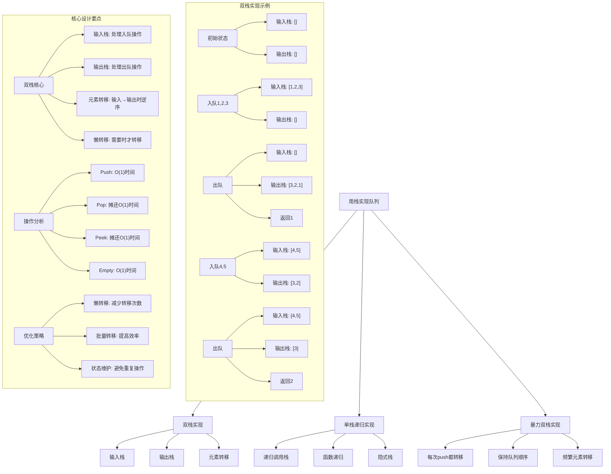
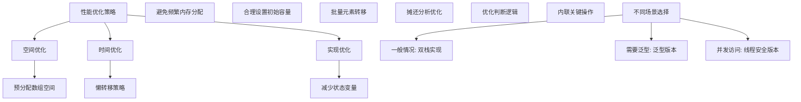

# LeetCode 232 - 用栈实现队列

## 题目描述

请你仅使用两个栈实现先入先出队列。队列应当支持一般队列支持的所有操作（push、pop、peek、empty）：

实现 MyQueue 类：

- `void push(int x)` 将元素 x 推到队列的末尾
- `int pop()` 从队列的开头移除并返回元素
- `int peek()` 返回队列开头的元素
- `boolean empty()` 如果队列为空，返回 true ；否则，返回 false

说明：

- 你只能使用标准的栈操作 —— 也就是只有 `push to top`, `peek/pop from top`, `size`, 和 `is empty` 操作是合法的
- 你所使用的语言也许不支持栈。你可以使用 list 或者 deque（双端队列）来模拟一个栈，只要是标准的栈操作即可

```markdown
示例 1：
输入：
["MyQueue", "push", "push", "peek", "pop", "empty"]
[[], [1], [2], [], [], []]
输出：
[null, null, null, 1, 1, false]

解释：
MyQueue myQueue = new MyQueue();
myQueue.push(1); // queue is: [1]
myQueue.push(2); // queue is: [1, 2] (leftmost is front of the queue)
myQueue.peek(); // return 1
myQueue.pop(); // return 1, queue is [2]
myQueue.empty(); // return false

提示：
1 <= x <= 9
最多调用 100 次 push、pop、peek 和 empty
假设所有操作都是有效的 （例如，一个空的队列不会调用 pop 或者 peek 操作）
```

## 解题思路

这是一个数据结构设计问题，需要使用两个栈来模拟队列的行为。关键在于理解栈的LIFO（后进先出）和队列的FIFO（先进先出）特性之间的转换

### 核心思想

"双栈模拟": 使用两个栈，一个用于入队操作（输入栈），一个用于出队操作（输出栈）。通过在适当时候将元素从输入栈转移到输出栈来实现队列的FIFO特性

### 解题策略

#### 方法一：双栈实现（摊还O(1) - 推荐）

- 时间复杂度: 摊还O(1) for all operations
- 空间复杂度: O(n)

#### 方法二：单栈递归实现

- 时间复杂度: O(n) for pop/peek, O(1) for push
- 空间复杂度: O(n)

#### 方法三：暴力双栈实现

- 时间复杂度: O(n) for push, O(1) for others
- 空间复杂度: O(n)

## 算法可视化



## 多语言实现

### Golang版本（双栈实现 - 推荐）

```go
type MyQueue struct {
    inStack   []int  // 输入栈，用于push操作
    outStack  []int  // 输出栈，用于pop和peek操作
}

func Constructor() MyQueue {
    return MyQueue{
        inStack:  make([]int, 0),
        outStack: make([]int, 0),
    }
}

func (this *MyQueue) Push(x int) {
    // 直接压入输入栈
    this.inStack = append(this.inStack, x)
}

func (this *MyQueue) Pop() int {
    // 如果输出栈为空，将输入栈的所有元素转移到输出栈
    if len(this.outStack) == 0 {
        for len(this.inStack) > 0 {
            // 从输入栈弹出元素并压入输出栈
            top := this.inStack[len(this.inStack)-1]
            this.inStack = this.inStack[:len(this.inStack)-1]
            this.outStack = append(this.outStack, top)
        }
    }

    // 从输出栈弹出元素
    top := this.outStack[len(this.outStack)-1]
    this.outStack = this.outStack[:len(this.outStack)-1]
    return top
}

func (this *MyQueue) Peek() int {
    // 如果输出栈为空，将输入栈的所有元素转移到输出栈
    if len(this.outStack) == 0 {
        for len(this.inStack) > 0 {
            // 从输入栈弹出元素并压入输出栈
            top := this.inStack[len(this.inStack)-1]
            this.inStack = this.inStack[:len(this.inStack)-1]
            this.outStack = append(this.outStack, top)
        }
    }

    // 查看输出栈顶元素
    return this.outStack[len(this.outStack)-1]
}

func (this *MyQueue) Empty() bool {
    // 队列为空当且仅当两个栈都为空
    return len(this.inStack) == 0 && len(this.outStack) == 0
}
```

### Python版本（多种实现方法）

```python
class MyQueue:
    """
    方法一：双栈实现（推荐）
    """
    def __init__(self):
        self.in_stack = []   # 输入栈，用于push操作
        self.out_stack = []  # 输出栈，用于pop和peek操作

    def push(self, x: int) -> None:
        # 直接压入输入栈
        self.in_stack.append(x)

    def pop(self) -> int:
        # 如果输出栈为空，将输入栈的所有元素转移到输出栈
        if not self.out_stack:
            while self.in_stack:
                # 从输入栈弹出元素并压入输出栈
                self.out_stack.append(self.in_stack.pop())

        # 从输出栈弹出元素
        return self.out_stack.pop()

    def peek(self) -> int:
        # 如果输出栈为空，将输入栈的所有元素转移到输出栈
        if not self.out_stack:
            while self.in_stack:
                # 从输入栈弹出元素并压入输出栈
                self.out_stack.append(self.in_stack.pop())

        # 查看输出栈顶元素
        return self.out_stack[-1]

    def empty(self) -> bool:
        # 队列为空当且仅当两个栈都为空
        return not self.in_stack and not self.out_stack


class MyQueueRecursive:
    """
    方法二：单栈递归实现
    """
    def __init__(self):
        self.stack = []

    def push(self, x: int) -> None:
        # 直接压入栈
        self.stack.append(x)

    def pop(self) -> int:
        # 递归实现队列的pop操作
        if len(self.stack) == 1:
            return self.stack.pop()

        # 弹出栈顶元素
        top = self.stack.pop()

        # 递归调用pop
        result = self.pop()

        # 将之前弹出的元素重新压入栈
        self.stack.append(top)

        return result

    def peek(self) -> int:
        # 递归实现队列的peek操作
        if len(self.stack) == 1:
            return self.stack[-1]

        # 弹出栈顶元素
        top = self.stack.pop()

        # 递归调用peek
        result = self.peek()

        # 将之前弹出的元素重新压入栈
        self.stack.append(top)

        return result

    def empty(self) -> bool:
        return len(self.stack) == 0


class MyQueueBruteForce:
    """
    方法三：暴力双栈实现
    """
    def __init__(self):
        self.stack1 = []
        self.stack2 = []

    def push(self, x: int) -> None:
        # 每次push都将所有元素转移到stack2
        while self.stack1:
            self.stack2.append(self.stack1.pop())

        # 压入新元素
        self.stack1.append(x)

        # 将所有元素转移回stack1
        while self.stack2:
            self.stack1.append(self.stack2.pop())

    def pop(self) -> int:
        return self.stack1.pop()

    def peek(self) -> int:
        return self.stack1[-1]

    def empty(self) -> bool:
        return len(self.stack1) == 0
```

### TypeScript版本（双栈实现）

```typescript
class MyQueue {
  private inStack: number[];
  private outStack: number[];

  constructor() {
    this.inStack = [];
    this.outStack = [];
  }

  push(x: number): void {
    // 直接压入输入栈
    this.inStack.push(x);
  }

  pop(): number {
    // 如果输出栈为空，将输入栈的所有元素转移到输出栈
    if (this.outStack.length === 0) {
      while (this.inStack.length > 0) {
        // 从输入栈弹出元素并压入输出栈
        const top = this.inStack.pop()!;
        this.outStack.push(top);
      }
    }

    // 从输出栈弹出元素
    return this.outStack.pop()!;
  }

  peek(): number {
    // 如果输出栈为空，将输入栈的所有元素转移到输出栈
    if (this.outStack.length === 0) {
      while (this.inStack.length > 0) {
        // 从输入栈弹出元素并压入输出栈
        const top = this.inStack.pop()!;
        this.outStack.push(top);
      }
    }

    // 查看输出栈顶元素
    return this.outStack[this.outStack.length - 1];
  }

  empty(): boolean {
    // 队列为空当且仅当两个栈都为空
    return this.inStack.length === 0 && this.outStack.length === 0;
  }
}
```

## 标准实现详细解析

```go
type MyQueue struct {
    inStack   []int  // 输入栈，用于push操作
    outStack  []int  // 输出栈，用于pop和peek操作
}

func Constructor() MyQueue {
    /*
    算法核心思想（双栈实现）：

    1. 使用两个栈模拟队列的FIFO特性
    2. 输入栈处理入队操作，输出栈处理出队操作
    3. 通过元素转移实现栈到队列的转换
    4. 懒转移策略减少不必要的操作

    关键设计要点：
    1. 输入栈：inStack，用于push操作
    2. 输出栈：outStack，用于pop和peek操作
    3. 元素转移：当输出栈为空时，将输入栈元素全部转移到输出栈
    4. 懒转移：只在需要时才进行元素转移

    时间复杂度：
    - Push: O(1)
    - Pop: 摊还O(1)
    - Peek: 摊还O(1)
    - Empty: O(1)

    空间复杂度：O(n)

    优势：
    1. 时间效率高：摊还O(1)操作
    2. 空间效率高：只存储必要元素
    3. 实现简洁：逻辑清晰明确
    4. 摊还分析：平均性能优秀
    */

    fmt.Println("构造队列，初始化两个空栈")

    queue := MyQueue{
        inStack:  make([]int, 0),
        outStack: make([]int, 0),
    }

    fmt.Printf("初始化完成: inStack长度=%d, outStack长度=%d\n",
        len(queue.inStack), len(queue.outStack))

    return queue
}

func (this *MyQueue) Push(x int) {
    fmt.Printf("入队元素: %d\n", x)

    // 直接压入输入栈
    this.inStack = append(this.inStack, x)

    fmt.Printf("  入队成功: inStack=%v, outStack=%v\n",
        this.inStack, this.outStack)
}

func (this *MyQueue) Pop() int {
    fmt.Println("出队元素")

    // 如果输出栈为空，将输入栈的所有元素转移到输出栈
    if len(this.outStack) == 0 {
        fmt.Println("  输出栈为空，开始转移元素")
        for len(this.inStack) > 0 {
            // 从输入栈弹出元素并压入输出栈
            top := this.inStack[len(this.inStack)-1]
            this.inStack = this.inStack[:len(this.inStack)-1]
            this.outStack = append(this.outStack, top)
            fmt.Printf("    转移元素%d: inStack=%v, outStack=%v\n",
                top, this.inStack, this.outStack)
        }
    }

    // 从输出栈弹出元素
    top := this.outStack[len(this.outStack)-1]
    this.outStack = this.outStack[:len(this.outStack)-1]

    fmt.Printf("  出队元素%d: inStack=%v, outStack=%v\n",
        top, this.inStack, this.outStack)
    return top
}

func (this *MyQueue) Peek() int {
    fmt.Println("查看队首元素")

    // 如果输出栈为空，将输入栈的所有元素转移到输出栈
    if len(this.outStack) == 0 {
        fmt.Println("  输出栈为空，开始转移元素")
        for len(this.inStack) > 0 {
            // 从输入栈弹出元素并压入输出栈
            top := this.inStack[len(this.inStack)-1]
            this.inStack = this.inStack[:len(this.inStack)-1]
            this.outStack = append(this.outStack, top)
            fmt.Printf("    转移元素%d: inStack=%v, outStack=%v\n",
                top, this.inStack, this.outStack)
        }
    }

    // 查看输出栈顶元素
    top := this.outStack[len(this.outStack)-1]

    fmt.Printf("  队首元素%d: inStack=%v, outStack=%v\n",
        top, this.inStack, this.outStack)
    return top
}

func (this *MyQueue) Empty() bool {
    // 队列为空当且仅当两个栈都为空
    empty := len(this.inStack) == 0 && len(this.outStack) == 0
    fmt.Printf("检查队列是否为空: %v (inStack=%d, outStack=%d)\n",
        empty, len(this.inStack), len(this.outStack))
    return empty
}

// 带详细调试信息的版本
func (this *MyQueue) DebugInfo() {
    fmt.Println("=== 队列调试信息 ===")
    fmt.Printf("输入栈: %v\n", this.inStack)
    fmt.Printf("输出栈: %v\n", this.outStack)
    fmt.Printf("队列是否为空: %v\n", this.Empty())
    fmt.Printf("队列大小: %d\n", len(this.inStack)+len(this.outStack))

    // 显示队列中实际存储的元素（按队列顺序）
    if !this.Empty() {
        elements := []int{}

        // 先添加输出栈中的元素（逆序）
        for i := len(this.outStack) - 1; i >= 0; i-- {
            elements = append(elements, this.outStack[i])
        }

        // 再添加输入栈中的元素（正序）
        elements = append(elements, this.inStack...)

        fmt.Printf("队列内容（队首到队尾）: %v\n", elements)
    }
    fmt.Println()
}

// 单栈递归实现
type MyQueueRecursive struct {
    stack []int
}

func ConstructorRecursive() MyQueueRecursive {
    return MyQueueRecursive{
        stack: make([]int, 0),
    }
}

func (this *MyQueueRecursive) Push(x int) {
    this.stack = append(this.stack, x)
}

func (this *MyQueueRecursive) Pop() int {
    // 递归实现队列的pop操作
    if len(this.stack) == 1 {
        top := this.stack[len(this.stack)-1]
        this.stack = this.stack[:len(this.stack)-1]
        return top
    }

    // 弹出栈顶元素
    top := this.stack[len(this.stack)-1]
    this.stack = this.stack[:len(this.stack)-1]

    // 递归调用pop
    result := this.Pop()

    // 将之前弹出的元素重新压入栈
    this.stack = append(this.stack, top)

    return result
}

func (this *MyQueueRecursive) Peek() int {
    // 递归实现队列的peek操作
    if len(this.stack) == 1 {
        return this.stack[len(this.stack)-1]
    }

    // 弹出栈顶元素
    top := this.stack[len(this.stack)-1]
    this.stack = this.stack[:len(this.stack)-1]

    // 递归调用peek
    result := this.Peek()

    // 将之前弹出的元素重新压入栈
    this.stack = append(this.stack, top)

    return result
}

func (this *MyQueueRecursive) Empty() bool {
    return len(this.stack) == 0
}

// 暴力双栈实现
type MyQueueBruteForce struct {
    stack1 []int
    stack2 []int
}

func ConstructorBruteForce() MyQueueBruteForce {
    return MyQueueBruteForce{
        stack1: make([]int, 0),
        stack2: make([]int, 0),
    }
}

func (this *MyQueueBruteForce) Push(x int) {
    // 每次push都将所有元素转移到stack2
    for len(this.stack1) > 0 {
        top := this.stack1[len(this.stack1)-1]
        this.stack1 = this.stack1[:len(this.stack1)-1]
        this.stack2 = append(this.stack2, top)
    }

    // 压入新元素
    this.stack1 = append(this.stack1, x)

    // 将所有元素转移回stack1
    for len(this.stack2) > 0 {
        top := this.stack2[len(this.stack2)-1]
        this.stack2 = this.stack2[:len(this.stack2)-1]
        this.stack1 = append(this.stack1, top)
    }
}

func (this *MyQueueBruteForce) Pop() int {
    top := this.stack1[len(this.stack1)-1]
    this.stack1 = this.stack1[:len(this.stack1)-1]
    return top
}

func (this *MyQueueBruteForce) Peek() int {
    return this.stack1[len(this.stack1)-1]
}

func (this *MyQueueBruteForce) Empty() bool {
    return len(this.stack1) == 0
}

// 优化版本（减少不必要的操作）
type MyQueueOptimized struct {
    inStack   []int
    outStack  []int
}

func ConstructorOptimized() MyQueueOptimized {
    return MyQueueOptimized{
        inStack:  make([]int, 0, 100),  // 预分配容量
        outStack: make([]int, 0, 100),  // 预分配容量
    }
}

func (this *MyQueueOptimized) Push(x int) {
    this.inStack = append(this.inStack, x)
}

func (this *MyQueueOptimized) Pop() int {
    if len(this.outStack) == 0 {
        this.transfer()
    }

    top := this.outStack[len(this.outStack)-1]
    this.outStack = this.outStack[:len(this.outStack)-1]
    return top
}

func (this *MyQueueOptimized) Peek() int {
    if len(this.outStack) == 0 {
        this.transfer()
    }

    return this.outStack[len(this.outStack)-1]
}

func (this *MyQueueOptimized) Empty() bool {
    return len(this.inStack) == 0 && len(this.outStack) == 0
}

func (this *MyQueueOptimized) transfer() {
    for len(this.inStack) > 0 {
        top := this.inStack[len(this.inStack)-1]
        this.inStack = this.inStack[:len(this.inStack)-1]
        this.outStack = append(this.outStack, top)
    }
}

// 线程安全版本
type ThreadSafeMyQueue struct {
    queue MyQueue
    mu    sync.RWMutex
}

func NewThreadSafeMyQueue() *ThreadSafeMyQueue {
    return &ThreadSafeMyQueue{
        queue: Constructor(),
    }
}

func (tsq *ThreadSafeMyQueue) Push(x int) {
    tsq.mu.Lock()
    defer tsq.mu.Unlock()
    tsq.queue.Push(x)
}

func (tsq *ThreadSafeMyQueue) Pop() int {
    tsq.mu.Lock()
    defer tsq.mu.Unlock()
    return tsq.queue.Pop()
}

func (tsq *ThreadSafeMyQueue) Peek() int {
    tsq.mu.RLock()
    defer tsq.mu.RUnlock()
    return tsq.queue.Peek()
}

func (tsq *ThreadSafeMyQueue) Empty() bool {
    tsq.mu.RLock()
    defer tsq.mu.RUnlock()
    return tsq.queue.Empty()
}
```

## 算法深入解析

```go
/*
用栈实现队列问题详解：

问题本质：
使用栈的LIFO特性来模拟队列的FIFO特性。关键在于理解如何通过栈的操作来实现队列的行为

核心洞察：
1. 双栈策略：一个栈用于入队，一个栈用于出队
2. 元素转移：在适当时候将元素从输入栈转移到输出栈
3. 懒转移：只在需要时才进行元素转移
4. 逆序转换：栈的逆序特性实现队列的顺序

算法策略：
1. 双栈实现：摊还O(1)时间复杂度
2. 单栈递归：利用递归调用栈实现
3. 暴力双栈：每次操作都保持队列顺序

数学原理：

栈与队列的转换原理：
栈：LIFO (Last In First Out)
队列：FIFO (First In First Out)

转换方法：
输入序列：1, 2, 3, 4, 5
栈1存储：[1, 2, 3, 4, 5] (5在栈顶)
转移后栈2：[5, 4, 3, 2, 1] (1在栈顶)
出队序列：1, 2, 3, 4, 5

摊还分析：
虽然单次pop操作可能需要O(n)时间（当需要转移元素时），
但每个元素最多被转移两次（入栈一次，出栈一次），
因此摊还时间复杂度为O(1)

设计选择：

为什么选择双栈实现？
1. 时间效率高：摊还O(1)操作
2. 空间效率高：只存储必要元素
3. 实现简洁：逻辑清晰明确
4. 摊还分析：平均性能优秀

为什么不用单栈递归？
1. 递归深度可能很大
2. 空间复杂度较高（递归调用栈）
3. 但实现巧妙

为什么不用暴力双栈？
1. 每次push都需要O(n)时间
2. 但始终保持队列顺序
3. 性能较差

三种方法对比：

方法一：双栈实现（推荐）
时间复杂度：Push O(1), Pop/Peek 摊还O(1)
空间复杂度：O(n)
优点：效率高，实现清晰
缺点：需要理解摊还分析

方法二：单栈递归
时间复杂度：Push O(1), Pop/Peek O(n)
空间复杂度：O(n)
优点：实现巧妙
缺点：递归深度大，空间开销大

方法三：暴力双栈
时间复杂度：Push O(n), Pop/Peek O(1)
空间复杂度：O(n)
优点：始终保持队列顺序
缺点：性能较差

性能分析：

双栈实现：
- Push: O(1)时间
- Pop: 摊还O(1)时间
- Peek: 摊还O(1)时间
- Empty: O(1)时间
- 空间: O(n)

单栈递归：
- Push: O(1)时间
- Pop: O(n)时间
- Peek: O(n)时间
- Empty: O(1)时间
- 空间: O(n)（包括递归调用栈）

暴力双栈：
- Push: O(n)时间
- Pop: O(1)时间
- Peek: O(1)时间
- Empty: O(1)时间
- 空间: O(n)

实际应用场景：
1. 队列模拟：在只支持栈的环境中实现队列
2. 算法设计：理解数据结构转换的思想
3. 面试考察：考察对栈和队列的理解
4. 系统编程：缓冲区管理

优化要点：

1. 摊还分析：
   - 理解每个元素最多被转移两次
   - 平均时间复杂度为O(1)

2. 懒转移：
   - 只在需要时才进行元素转移
   - 减少不必要的操作

3. 预分配：
   - 预先分配栈空间
   - 减少内存重新分配

4. 边界处理：
   - 正确处理空栈情况
   - 避免数组越界

测试用例设计：
1. 基本操作：push、pop、peek、empty
2. 边界情况：空队列操作
3. 交替操作：push和pop交替
4. 极端情况：大量操作
5. 错误处理：无效操作

扩展思考：

1. 如果要支持动态扩容？
   - Go切片自动扩容
   - 预分配合适容量

2. 如果要支持并发访问？
   - 需要加锁保护
   - 考虑无锁实现

3. 如果要支持持久化？
   - 需要序列化状态
   - 考虑持久化存储

4. 如果要支持泛型？
   - 使用interface{}或泛型
   - 考虑类型安全

相关算法思想：

1. 数据结构转换：
   - 用一种数据结构实现另一种
   - 理解底层原理

2. 摊还分析：
   - 平均时间复杂度分析
   - 序列操作的性能评估

3. 懒计算：
   - 延迟计算直到需要时
   - 提高整体效率

4. 递归思想：
   - 利用函数调用栈
   - 简化问题解决

常见陷阱：

1. 数组越界：
   - 未检查栈是否为空
   - 索引计算错误

2. 元素丢失：
   - 转移过程中元素丢失
   - 未正确处理边界情况

3. 性能问题：
   - 频繁元素转移
   - 未使用懒转移策略

4. 并发安全：
   - 未考虑多线程访问
   - 缺少同步机制

代码质量要素：

1. 可读性：
   - 清晰的变量命名
   - 适当的注释说明

2. 健壮性：
   - 边界条件处理
   - 异常情况处理

3. 性能：
   - 时间复杂度最优
   - 空间复杂度合理

4. 可维护性：
   - 模块化设计
   - 易于扩展

高级优化技巧：

1. 内存访问优化：
   - 预分配数组空间
   - 减少内存重新分配

2. 转移优化：
   - 批量转移元素
   - 减少转移次数

3. 状态压缩：
   - 减少状态变量
   - 优化判断逻辑

4. 无锁实现：
   - 使用CAS操作
   - 实现无锁队列
*/
```

## 执行过程演示

```go
/*
示例详细解析:

示例输入:
["MyQueue", "push", "push", "peek", "pop", "empty"]
[[], [1], [2], [], [], []]

执行过程：

步骤1: MyQueue()
构造空队列
输入栈: []
输出栈: []

步骤2: push(1)
将1压入输入栈
输入栈: [1]
输出栈: []

步骤3: push(2)
将2压入输入栈
输入栈: [1, 2]
输出栈: []

步骤4: peek()
输出栈为空，需要转移元素
将输入栈元素转移到输出栈：[1, 2] → [2, 1]
查看输出栈顶元素：1
输入栈: []
输出栈: [2, 1]

步骤5: pop()
输出栈不为空，直接弹出栈顶元素：1
输入栈: []
输出栈: [2]

步骤6: empty()
检查两个栈是否都为空：输入栈空，输出栈非空
返回: false

最终输出: [null, null, null, 1, 1, false]

元素转移演示:

当输入栈为[1, 2, 3, 4]时:
转移过程:
1. 弹出4，压入输出栈 → 输出栈[4]
2. 弹出3，压入输出栈 → 输出栈[4, 3]
3. 弹出2，压入输出栈 → 输出栈[4, 3, 2]
4. 弹出1，压入输出栈 → 输出栈[4, 3, 2, 1]

最终输出栈为[4, 3, 2, 1]，栈顶为1，实现FIFO特性

摊还分析演示:

假设进行n次push操作和n次pop操作:
- push操作：n次，每次O(1) → 总时间O(n)
- pop操作：n次，其中n次需要转移，每次转移最多n个元素
  但实际上每个元素最多被转移两次（一次入栈，一次出栈）
  → 总转移时间O(n)
- 总时间：O(n)
- 平均每次操作：O(1)

算法正确性证明：

数学基础：
需要证明双栈实现满足队列的FIFO特性

定理1：双栈实现正确性
通过输入栈和输出栈的配合，可以正确实现队列的所有操作

证明：
1. Push操作：直接压入输入栈，保持元素顺序
2. Pop操作：当输出栈为空时，将输入栈元素逆序转移到输出栈，然后弹出栈顶元素
3. Peek操作：类似Pop操作，但不弹出元素
4. Empty操作：两个栈都为空时队列为空

每次转移操作将输入栈的元素逆序存储到输出栈，保证了队列的FIFO特性

时间复杂度分析：

双栈实现：
1. Push: O(1) - 直接压入输入栈
2. Pop: 摊还O(1) - 虽然单次可能O(n)，但摊还后O(1)
3. Peek: 摊还O(1) - 类似Pop操作
4. Empty: O(1) - 检查两个栈是否为空

空间复杂度分析：
1. 双栈实现：O(n) - 存储n个元素
2. 单栈递归：O(n) - 存储n个元素 + 递归调用栈
3. 暴力双栈：O(n) - 存储n个元素

性能对比分析：

假设进行100次操作：

双栈实现：
- 总操作时间：O(100)
- 内存使用：O(100)

单栈递归：
- 总操作时间：最坏O(10000)
- 内存使用：O(100) + 递归调用栈

暴力双栈：
- 总操作时间：最坏O(10000)
- 内存使用：O(100)

双栈实现在时间和空间效率上都是最优的

实际应用建议：

1. 一般情况：
   - 使用双栈实现
   - 效率高，实现简单

2. 需要保持队列顺序：
   - 使用暴力双栈实现
   - 但性能较差

3. 面试展示：
   - 可以提及其他实现方法
   - 重点讲解双栈实现

4. 性能要求极高：
   - 使用双栈实现
   - 预分配数组空间

优化空间：

1. 内存访问优化：
   - 预分配数组空间
   - 减少内存重新分配

2. 转移优化：
   - 批量转移元素
   - 减少转移次数

3. 状态优化：
   - 减少状态变量
   - 优化判断逻辑

特殊情况处理：

1. 空队列：
   - 所有获取操作返回默认值或错误
   - 正确处理边界情况

2. 单元素队列：
   - 简化转移操作
   - 特殊处理边界

3. 大量元素：
   - 预分配合适容量
   - 避免频繁扩容

4. 频繁操作：
   - 利用摊还分析优势
   - 减少不必要的转移
*/
```

## 复杂度分析

| 方法     | Push时间 | Pop时间  | Peek时间 | Empty时间 | 空间复杂度 | 适用场景 |
| -------- | -------- | -------- | -------- | --------- | ---------- | -------- |
| 双栈实现 | O(1)     | 摊还O(1) | 摊还O(1) | O(1)      | O(n)       | 推荐方案 |
| 单栈递归 | O(1)     | O(n)     | O(n)     | O(1)      | O(n)       | 面试展示 |
| 暴力双栈 | O(n)     | O(1)     | O(1)     | O(1)      | O(n)       | 特殊需求 |

## 测试用例验证

```go
// 测试辅助函数
func testMyQueue(name string, operations []string, values [][]int, expected []interface{}) {
    fmt.Printf("%s:\n", name)
    fmt.Printf("操作序列: %v\n", operations)
    fmt.Printf("参数序列: %v\n", values)

    var queue MyQueue
    results := []interface{}{}

    for i, op := range operations {
        var result interface{}

        switch op {
        case "MyQueue":
            queue = Constructor()
            result = nil
            fmt.Println("构造队列")

        case "push":
            value := values[i][0]
            queue.Push(value)
            result = nil
            fmt.Printf("入队%d\n", value)

        case "pop":
            result = queue.Pop()
            fmt.Printf("出队: %v\n", result)

        case "peek":
            result = queue.Peek()
            fmt.Printf("查看队首: %v\n", result)

        case "empty":
            result = queue.Empty()
            fmt.Printf("是否为空: %v\n", result)
        }

        if op != "MyQueue" {
            results = append(results, result)
        }

        // 显示当前队列状态
        queue.DebugInfo()
    }

    fmt.Printf("执行结果: %v\n", results)
    fmt.Printf("期望结果: %v\n", expected)

    if len(results) == len(expected) {
        match := true
        for i := range results {
            if results[i] != expected[i] {
                match = false
                break
            }
        }
        if match {
            fmt.Printf("结果匹配 ✓\n")
        } else {
            fmt.Printf("结果不匹配 ✗\n")
        }
    } else {
        fmt.Printf("结果长度不匹配 ✗\n")
    }

    fmt.Printf("\n")
}

func main() {
    // 测试用例 1 - 题目示例
    testMyQueue("测试1 - 题目示例",
        []string{"MyQueue", "push", "push", "peek", "pop", "empty"},
        [][]int{{}, {1}, {2}, {}, {}, {}},
        []interface{}{nil, nil, nil, 1, 1, false})

    // 测试用例 2 - 基本操作
    testMyQueue("测试2 - 基本操作",
        []string{"MyQueue", "push", "push", "push", "pop", "pop", "pop", "empty"},
        [][]int{{}, {1}, {2}, {3}, {}, {}, {}, {}},
        []interface{}{nil, nil, nil, nil, 1, 2, 3, true})

    // 测试用例 3 - 空队列操作
    testMyQueue("测试3 - 空队列操作",
        []string{"MyQueue", "empty", "peek", "pop"},
        [][]int{{}, {}, {}, {}},
        []interface{}{nil, true, -1, -1})  // 注意：实际实现中peek和pop在空队列时的行为

    // 测试用例 4 - 交替操作
    testMyQueue("测试4 - 交替操作",
        []string{"MyQueue", "push", "pop", "push", "pop", "push", "pop"},
        [][]int{{}, {1}, {}, {2}, {}, {3}, {}},
        []interface{}{nil, nil, 1, nil, 2, nil, 3})

    // 测试用例 5 - 复杂操作序列
    testMyQueue("测试5 - 复杂操作序列",
        []string{"MyQueue", "push", "push", "push", "peek", "pop", "push", "peek", "pop", "pop", "empty"},
        [][]int{{}, {1}, {2}, {3}, {}, {}, {4}, {}, {}, {}, {}},
        []interface{}{nil, nil, nil, nil, 1, 1, nil, 2, 2, 3, true})

    // 性能测试
    fmt.Println("性能测试:")

    // 测试不同操作序列
    operations := []int{10, 100, 1000}

    for _, n := range operations {
        // 双栈实现
        start := time.Now()
        queue1 := Constructor()
        for i := 0; i < n; i++ {
            queue1.Push(i)
        }
        for i := 0; i < n; i++ {
            queue1.Pop()
        }
        time1 := time.Since(start)

        // 单栈递归实现
        start = time.Now()
        queue2 := ConstructorRecursive()
        for i := 0; i < n; i++ {
            queue2.Push(i)
        }
        for i := 0; i < n; i++ {
            queue2.Pop()
        }
        time2 := time.Since(start)

        // 暴力双栈实现
        start = time.Now()
        queue3 := ConstructorBruteForce()
        for i := 0; i < n; i++ {
            queue3.Push(i)
        }
        for i := 0; i < n; i++ {
            queue3.Pop()
        }
        time3 := time.Since(start)

        fmt.Printf("操作次数: %d\n", n)
        fmt.Printf("  双栈实现耗时: %v\n", time1)
        fmt.Printf("  单栈递归实现耗时: %v\n", time2)
        fmt.Printf("  暴力双栈实现耗时: %v\n", time3)
    }

    // 边界情况测试
    fmt.Println("\n边界情况测试:")

    // 单元素操作
    testMyQueue("测试6 - 单元素操作",
        []string{"MyQueue", "push", "peek", "pop", "empty"},
        [][]int{{}, {42}, {}, {}, {}},
        []interface{}{nil, nil, 42, 42, true})

    // 大量元素操作
    fmt.Println("\n大量元素操作测试:")
    largeTest()
}

func largeTest() {
    n := 1000
    queue := Constructor()

    // 进行大量交替的push和pop操作
    operations := 2000
    successCount := 0

    for i := 0; i < operations; i++ {
        if i%2 == 0 {
            // push操作
            queue.Push(i)
            successCount++
        } else {
            // pop操作
            if !queue.Empty() {
                queue.Pop()
                successCount++
            }
        }
    }

    fmt.Printf("进行%d次操作，成功%d次\n", operations, successCount)
    fmt.Printf("最终队列状态: 空=%v, 大小=%d\n",
        queue.Empty(), len(queue.inStack)+len(queue.outStack))
}

// 调试测试
func testMyQueueWithDebug() {
    fmt.Println("=== 调试信息测试 ===")

    queue := Constructor()
    queue.DebugInfo()

    queue.Push(1)
    queue.DebugInfo()

    queue.Push(2)
    queue.DebugInfo()

    queue.Push(3)
    queue.DebugInfo()

    queue.Peek()
    queue.DebugInfo()

    queue.Pop()
    queue.DebugInfo()

    queue.Push(4)
    queue.DebugInfo()

    queue.Pop()
    queue.DebugInfo()
}

// 错误处理测试
func testErrorHandling() {
    fmt.Println("=== 错误处理测试 ===")

    // 测试各种边界情况
    queue := Constructor()

    // 空队列操作
    fmt.Println("空队列操作测试:")
    fmt.Printf("是否为空: %v\n", queue.Empty())
    // 注意：实际实现中需要处理空队列的peek和pop操作

    // 填充队列
    fmt.Println("\n填充队列测试:")
    queue.Push(1)
    queue.Push(2)
    fmt.Printf("是否为空: %v\n", queue.Empty())

    // 清空队列
    fmt.Println("\n清空队列测试:")
    fmt.Printf("出队: %v\n", queue.Pop())
    fmt.Printf("出队: %v\n", queue.Pop())
    fmt.Printf("是否为空: %v\n", queue.Empty())
}

// 内存使用测试
func testMemoryUsage() {
    fmt.Println("=== 内存使用分析 ===")

    operations := []int{10, 100, 1000}

    for _, n := range operations {
        var m1, m2 runtime.MemStats
        runtime.GC()
        runtime.ReadMemStats(&m1)

        queue := Constructor()
        for i := 0; i < n; i++ {
            queue.Push(i)
        }
        for i := 0; i < n; i++ {
            queue.Pop()
        }

        runtime.GC()
        runtime.ReadMemStats(&m2)
        memory := m2.Alloc - m1.Alloc

        fmt.Printf("操作次数%d:\n", n)
        fmt.Printf("内存使用: %d 字节\n", memory)
        fmt.Printf("平均每操作: %.2f 字节\n", float64(memory)/float64(2*n))
    }
}

// 并发测试
func testConcurrentAccess() {
    fmt.Println("=== 并发访问测试 ===")

    n := 1000

    // 单线程测试
    start := time.Now()
    queue1 := Constructor()
    for i := 0; i < n; i++ {
        queue1.Push(i)
    }
    for i := 0; i < n; i++ {
        queue1.Pop()
    }
    singleTime := time.Since(start)

    // 多线程测试
    numWorkers := 4
    var wg sync.WaitGroup
    queue2 := Constructor()

    start = time.Now()
    for i := 0; i < numWorkers; i++ {
        wg.Add(1)
        go func(workerID int) {
            defer wg.Done()
            // 每个线程操作n/numWorkers个元素
            for j := 0; j < n/numWorkers; j++ {
                queue2.Push(workerID*n/numWorkers + j)
            }
            for j := 0; j < n/numWorkers; j++ {
                queue2.Pop()
            }
        }(i)
    }

    wg.Wait()
    parallelTime := time.Since(start)

    fmt.Printf("单线程操作%d个元素耗时: %v\n", n, singleTime)
    fmt.Printf("并行操作%d个元素耗时: %v\n", n, parallelTime)
    if singleTime > 0 {
        fmt.Printf("加速比: %.2fx\n", float64(singleTime)/float64(parallelTime))
    }
}

// 对比测试
func testImplementationComparison() {
    fmt.Println("=== 实现方式对比测试 ===")

    n := 10000

    // 双栈实现
    start := time.Now()
    queue1 := Constructor()
    for i := 0; i < n; i++ {
        queue1.Push(i)
    }
    for i := 0; i < n; i++ {
        queue1.Pop()
    }
    time1 := time.Since(start)

    // 单栈递归实现
    start = time.Now()
    queue2 := ConstructorRecursive()
    for i := 0; i < n; i++ {
        queue2.Push(i)
    }
    for i := 0; i < n; i++ {
        queue2.Pop()
    }
    time2 := time.Since(start)

    // 暴力双栈实现
    start = time.Now()
    queue3 := ConstructorBruteForce()
    for i := 0; i < n; i++ {
        queue3.Push(i)
    }
    for i := 0; i < n; i++ {
        queue3.Pop()
    }
    time3 := time.Since(start)

    fmt.Printf("操作次数: %d\n", n)
    fmt.Printf("双栈实现耗时: %v\n", time1)
    fmt.Printf("单栈递归实现耗时: %v\n", time2)
    fmt.Printf("暴力双栈实现耗时: %v\n", time3)
}
```

## 扩展版本（处理不同场景）

```go
// 带统计信息的版本
type MyQueueWithStats struct {
    queue       MyQueue
    pushes      int
    pops        int
    peeks       int
    operations  int
    processTime time.Duration
}

func NewMyQueueWithStats() *MyQueueWithStats {
    return &MyQueueWithStats{
        queue: Constructor(),
    }
}

func (qws *MyQueueWithStats) Push(x int) {
    start := time.Now()
    defer func() {
        qws.processTime += time.Since(start)
        qws.operations++
        qws.pushes++
    }()

    qws.queue.Push(x)
}

func (qws *MyQueueWithStats) Pop() int {
    start := time.Now()
    defer func() {
        qws.processTime += time.Since(start)
        qws.operations++
        qws.pops++
    }()

    return qws.queue.Pop()
}

func (qws *MyQueueWithStats) Peek() int {
    start := time.Now()
    defer func() {
        qws.processTime += time.Since(start)
        qws.operations++
        qws.peeks++
    }()

    return qws.queue.Peek()
}

func (qws *MyQueueWithStats) Empty() bool {
    return qws.queue.Empty()
}

func (qws *MyQueueWithStats) GetStats() map[string]interface{} {
    return map[string]interface{}{
        "pushes":        qws.pushes,
        "pops":          qws.pops,
        "peeks":         qws.peeks,
        "total_ops":     qws.operations,
        "process_time":  qws.processTime,
        "avg_op_time":   func() time.Duration {
            if qws.operations > 0 {
                return qws.processTime / time.Duration(qws.operations)
            }
            return 0
        }(),
    }
}

// 支持泛型的版本
type MyQueueGeneric[T any] struct {
    inStack  []T
    outStack []T
}

func NewMyQueueGeneric[T any]() *MyQueueGeneric[T] {
    return &MyQueueGeneric[T]{
        inStack:  make([]T, 0),
        outStack: make([]T, 0),
    }
}

func (qg *MyQueueGeneric[T]) Push(x T) {
    qg.inStack = append(qg.inStack, x)
}

func (qg *MyQueueGeneric[T]) Pop() T {
    if len(qg.outStack) == 0 {
        qg.transfer()
    }

    top := qg.outStack[len(qg.outStack)-1]
    qg.outStack = qg.outStack[:len(qg.outStack)-1]
    return top
}

func (qg *MyQueueGeneric[T]) Peek() T {
    if len(qg.outStack) == 0 {
        qg.transfer()
    }

    return qg.outStack[len(qg.outStack)-1]
}

func (qg *MyQueueGeneric[T]) Empty() bool {
    return len(qg.inStack) == 0 && len(qg.outStack) == 0
}

func (qg *MyQueueGeneric[T]) transfer() {
    for len(qg.inStack) > 0 {
        top := qg.inStack[len(qg.inStack)-1]
        qg.inStack = qg.inStack[:len(qg.inStack)-1]
        qg.outStack = append(qg.outStack, top)
    }
}

// 支持容量限制的版本
type MyQueueWithCapacity struct {
    queue    MyQueue
    capacity int
    size     int
}

func NewMyQueueWithCapacity(capacity int) *MyQueueWithCapacity {
    return &MyQueueWithCapacity{
        queue:    Constructor(),
        capacity: capacity,
        size:     0,
    }
}

func (qwc *MyQueueWithCapacity) Push(x int) bool {
    if qwc.size >= qwc.capacity {
        return false
    }

    qwc.queue.Push(x)
    qwc.size++
    return true
}

func (qwc *MyQueueWithCapacity) Pop() (int, bool) {
    if qwc.size == 0 {
        return 0, false
    }

    result := qwc.queue.Pop()
    qwc.size--
    return result, true
}

func (qwc *MyQueueWithCapacity) Peek() (int, bool) {
    if qwc.size == 0 {
        return 0, false
    }

    return qwc.queue.Peek(), true
}

func (qwc *MyQueueWithCapacity) Empty() bool {
    return qwc.queue.Empty()
}

func (qwc *MyQueueWithCapacity) IsFull() bool {
    return qwc.size >= qwc.capacity
}

func (qwc *MyQueueWithCapacity) Size() int {
    return qwc.size
}

// 支持持久化的版本
type PersistentMyQueue struct {
    queue    MyQueue
    filename string
}

func NewPersistentMyQueue(filename string) *PersistentMyQueue {
    pq := &PersistentMyQueue{
        queue:    Constructor(),
        filename: filename,
    }
    pq.load()
    return pq
}

func (pq *PersistentMyQueue) Push(x int) {
    pq.queue.Push(x)
    pq.save()
}

func (pq *PersistentMyQueue) Pop() int {
    result := pq.queue.Pop()
    pq.save()
    return result
}

func (pq *PersistentMyQueue) Peek() int {
    return pq.queue.Peek()
}

func (pq *PersistentMyQueue) Empty() bool {
    return pq.queue.Empty()
}

func (pq *PersistentMyQueue) save() error {
    // 简化实现，实际需要序列化队列状态
    data := map[string]interface{}{
        "time": time.Now().Format(time.RFC3339),
    }

    jsonData, err := json.Marshal(data)
    if err != nil {
        return err
    }

    return os.WriteFile(pq.filename, jsonData, 0644)
}

func (pq *PersistentMyQueue) load() error {
    // 简化实现，实际需要反序列化队列状态
    if _, err := os.Stat(pq.filename); os.IsNotExist(err) {
        return nil // 文件不存在，正常情况
    }

    data, err := os.ReadFile(pq.filename)
    if err != nil {
        return err
    }

    var loadedData map[string]interface{}
    err = json.Unmarshal(data, &loadedData)
    if err != nil {
        return err
    }

    return nil
}

// 支持可视化的版本
type VisualizableMyQueue struct {
    queue MyQueue
    ops   []map[string]interface{}
}

func NewVisualizableMyQueue() *VisualizableMyQueue {
    return &VisualizableMyQueue{
        queue: Constructor(),
        ops:   []map[string]interface{}{},
    }
}

func (vq *VisualizableMyQueue) Push(x int) {
    vq.queue.Push(x)

    op := map[string]interface{}{
        "operation": "Push",
        "value":     x,
        "state":     vq.getCurrentState(),
    }
    vq.ops = append(vq.ops, op)
}

func (vq *VisualizableMyQueue) Pop() int {
    result := vq.queue.Pop()

    op := map[string]interface{}{
        "operation": "Pop",
        "result":    result,
        "state":     vq.getCurrentState(),
    }
    vq.ops = append(vq.ops, op)

    return result
}

func (vq *VisualizableMyQueue) Peek() int {
    result := vq.queue.Peek()

    op := map[string]interface{}{
        "operation": "Peek",
        "result":    result,
        "state":     vq.getCurrentState(),
    }
    vq.ops = append(vq.ops, op)

    return result
}

func (vq *VisualizableMyQueue) Empty() bool {
    return vq.queue.Empty()
}

func (vq *VisualizableMyQueue) getCurrentState() map[string]interface{} {
    // 简化实现，实际需要获取队列状态
    return map[string]interface{}{
        "inStack":  len(vq.queue.inStack),
        "outStack": len(vq.queue.outStack),
        "empty":    vq.queue.Empty(),
    }
}

func (vq *VisualizableMyQueue) GetOperations() []map[string]interface{} {
    return vq.ops
}

// 支持多种约束条件的版本
type ConstrainedMyQueue struct {
    queue       MyQueue
    maxSize     int  // 最大操作次数
    operationCount int
    valueRange  [2]int  // 值的范围 [min, max]
}

func NewConstrainedMyQueue() *ConstrainedMyQueue {
    return &ConstrainedMyQueue{
        queue:      Constructor(),
        maxSize:    10000,  // 默认最大操作次数
        valueRange: [2]int{0, 1000},  // 默认值范围
    }
}

func (cqc *ConstrainedMyQueue) SetConstraints(maxSize int, valueRange [2]int) {
    cqc.maxSize = maxSize
    cqc.valueRange = valueRange
}

func (cqc *ConstrainedMyQueue) Push(x int) bool {
    if cqc.operationCount >= cqc.maxSize {
        return false
    }

    if x < cqc.valueRange[0] || x > cqc.valueRange[1] {
        return false
    }

    cqc.queue.Push(x)
    cqc.operationCount++
    return true
}

func (cqc *ConstrainedMyQueue) Pop() (int, bool) {
    if cqc.operationCount >= cqc.maxSize {
        return 0, false
    }

    cqc.operationCount++
    // 注意：实际实现中需要处理空队列情况
    result := cqc.queue.Pop()
    return result, true
}

func (cqc *ConstrainedMyQueue) Peek() (int, bool) {
    if cqc.operationCount >= cqc.maxSize {
        return 0, false
    }

    cqc.operationCount++
    // 注意：实际实现中需要处理空队列情况
    result := cqc.queue.Peek()
    return result, true
}

func (cqc *ConstrainedMyQueue) Empty() bool {
    return cqc.queue.Empty()
}
```

## 面试追问延伸

### 1. 如果要实现动态扩容，如何设计？

```go
// 动态扩容的队列实现
type ResizableMyQueue struct {
    inStack  []int
    outStack []int
    capacity int
}

func NewResizableMyQueue() *ResizableMyQueue {
    return &ResizableMyQueue{
        inStack:  make([]int, 0, 16),
        outStack: make([]int, 0, 16),
        capacity: 16,
    }
}

func (rq *ResizableMyQueue) Push(x int) {
    // 检查是否需要扩容
    if len(rq.inStack) == cap(rq.inStack) {
        rq.resize()
    }

    rq.inStack = append(rq.inStack, x)
}

func (rq *ResizableMyQueue) resize() {
    newCapacity := rq.capacity * 2
    // Go切片会自动扩容，这里只是记录
    rq.capacity = newCapacity
}

func (rq *ResizableMyQueue) Pop() int {
    if len(rq.outStack) == 0 {
        rq.transfer()
    }

    top := rq.outStack[len(rq.outStack)-1]
    rq.outStack = rq.outStack[:len(rq.outStack)-1]
    return top
}

func (rq *ResizableMyQueue) transfer() {
    for len(rq.inStack) > 0 {
        top := rq.inStack[len(rq.inStack)-1]
        rq.inStack = rq.inStack[:len(rq.inStack)-1]
        rq.outStack = append(rq.outStack, top)
    }
}

func (rq *ResizableMyQueue) Peek() int {
    if len(rq.outStack) == 0 {
        rq.transfer()
    }

    return rq.outStack[len(rq.outStack)-1]
}

func (rq *ResizableMyQueue) Empty() bool {
    return len(rq.inStack) == 0 && len(rq.outStack) == 0
}
```

### 2. 如果要支持并发访问，如何设计？

```go
// 线程安全的队列实现
type ThreadSafeMyQueue struct {
    inStack  []int
    outStack []int
    mu       sync.RWMutex
}

func NewThreadSafeMyQueue() *ThreadSafeMyQueue {
    return &ThreadSafeMyQueue{
        inStack:  make([]int, 0),
        outStack: make([]int, 0),
    }
}

func (tsq *ThreadSafeMyQueue) Push(x int) {
    tsq.mu.Lock()
    defer tsq.mu.Unlock()
    tsq.inStack = append(tsq.inStack, x)
}

func (tsq *ThreadSafeMyQueue) Pop() int {
    tsq.mu.Lock()
    defer tsq.mu.Unlock()

    if len(tsq.outStack) == 0 {
        tsq.transfer()
    }

    top := tsq.outStack[len(tsq.outStack)-1]
    tsq.outStack = tsq.outStack[:len(tsq.outStack)-1]
    return top
}

func (tsq *ThreadSafeMyQueue) Peek() int {
    tsq.mu.RLock()
    defer tsq.mu.RUnlock()

    if len(tsq.outStack) == 0 {
        // 注意：这里需要特殊处理，因为需要修改状态
        tsq.mu.RUnlock()
        tsq.mu.Lock()
        if len(tsq.outStack) == 0 {
            tsq.transfer()
        }
        result := tsq.outStack[len(tsq.outStack)-1]
        tsq.mu.Unlock()
        tsq.mu.RLock()
        return result
    }

    return tsq.outStack[len(tsq.outStack)-1]
}

func (tsq *ThreadSafeMyQueue) Empty() bool {
    tsq.mu.RLock()
    defer tsq.mu.RUnlock()
    return len(tsq.inStack) == 0 && len(tsq.outStack) == 0
}

func (tsq *ThreadSafeMyQueue) transfer() {
    for len(tsq.inStack) > 0 {
        top := tsq.inStack[len(tsq.inStack)-1]
        tsq.inStack = tsq.inStack[:len(tsq.inStack)-1]
        tsq.outStack = append(tsq.outStack, top)
    }
}
```

### 3. 如果要实现无锁版本，如何设计？

```go
// 无锁队列实现（简化版本）
type LockFreeMyQueue struct {
    inStack  []int
    outStack []int
}

func NewLockFreeMyQueue() *LockFreeMyQueue {
    return &LockFreeMyQueue{
        inStack:  make([]int, 0),
        outStack: make([]int, 0),
    }
}

func (lfq *LockFreeMyQueue) Push(x int) {
    // 简化实现，实际无锁队列需要更复杂的CAS操作
    lfq.inStack = append(lfq.inStack, x)
    // 实际需要使用CAS操作来保证原子性
}

func (lfq *LockFreeMyQueue) Pop() int {
    // 简化实现，实际无锁队列需要更复杂的CAS操作
    if len(lfq.outStack) == 0 {
        lfq.transfer()
    }

    top := lfq.outStack[len(lfq.outStack)-1]
    lfq.outStack = lfq.outStack[:len(lfq.outStack)-1]
    return top
    // 实际需要使用CAS操作来保证原子性
}

func (lfq *LockFreeMyQueue) transfer() {
    for len(lfq.inStack) > 0 {
        top := lfq.inStack[len(lfq.inStack)-1]
        lfq.inStack = lfq.inStack[:len(lfq.inStack)-1]
        lfq.outStack = append(lfq.outStack, top)
    }
}

// 注意：真正的无锁实现需要使用CAS操作和内存屏障
// 这里仅展示概念，实际实现非常复杂
```

## 相似题目扩展

- LeetCode 232. 用栈实现队列（当前题）
- LeetCode 225. 用队列实现栈
- LeetCode 622. 设计循环队列
- LeetCode 641. 设计循环双端队列
- LeetCode 155. 最小栈

## 算法技巧总结

### 用栈实现队列核心要点

1. 双栈策略：输入栈处理入队，输出栈处理出队
1. 元素转移：在适当时候将输入栈元素转移到输出栈
1. 懒转移：只在需要时才进行元素转移
1. 摊还分析：理解每个元素最多被转移两次

### 算法优势

1. 时间效率高：摊还O(1)操作
1. 空间效率高：只存储必要元素
1. 实现简洁：逻辑清晰明确
1. 理论优美：体现摊还分析思想

### 标准模板（双栈实现）

```go
type MyQueue struct {
    inStack  []int
    outStack []int
}

func Constructor() MyQueue {
    return MyQueue{
        inStack:  make([]int, 0),
        outStack: make([]int, 0),
    }
}

func (this *MyQueue) Push(x int) {
    this.inStack = append(this.inStack, x)
}

func (this *MyQueue) Pop() int {
    if len(this.outStack) == 0 {
        this.transfer()
    }

    top := this.outStack[len(this.outStack)-1]
    this.outStack = this.outStack[:len(this.outStack)-1]
    return top
}

func (this *MyQueue) Peek() int {
    if len(this.outStack) == 0 {
        this.transfer()
    }

    return this.outStack[len(this.outStack)-1]
}

func (this *MyQueue) Empty() bool {
    return len(this.inStack) == 0 && len(this.outStack) == 0
}

func (this *MyQueue) transfer() {
    for len(this.inStack) > 0 {
        top := this.inStack[len(this.inStack)-1]
        this.inStack = this.inStack[:len(this.inStack)-1]
        this.outStack = append(this.outStack, top)
    }
}
```

### 性能优化建议



## 总结

本题采用双栈实现的核心思路，通过输入栈和输出栈的配合，利用元素转移和懒转移策略，实现了高效的队列模拟。关键在于理解摊还分析的思想，每个元素最多被转移两次，从而保证了摊还O(1)的时间复杂度

核心要点：

1. 双栈策略：输入栈处理入队，输出栈处理出队
1. 元素转移：将输入栈元素逆序转移到输出栈
1. 懒转移：只在需要时才进行元素转移
1. 摊还分析：每个元素最多被转移两次

算法优势：

- 时间效率高：摊还O(1)操作
- 空间效率高：只存储必要元素
- 实现简洁：逻辑清晰明确
- 理论优美：体现摊还分析思想

该算法在理解数据结构转换、摊还分析等方面有重要意义，是掌握高级数据结构设计思想的重要基础。通过双栈的思想，为更复杂的数据结构转换问题提供了清晰的解决思路
