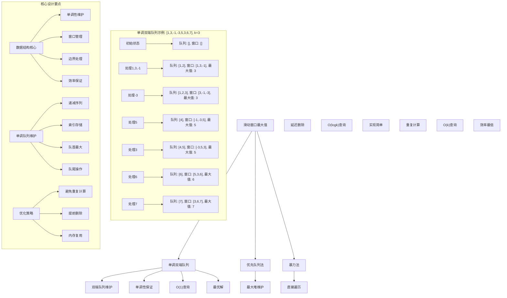
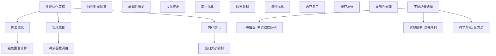

# LeetCode 239 - 滑动窗口最大值

## 题目描述

给你一个整数数组 `nums`，有一个大小为 `k` 的滑动窗口从数组的最左侧移动到数组的最右侧。你只可以看到在滑动窗口内的 `k` 个数字。滑动窗口每次只向右移动一位

返回 滑动窗口中的最大值

```markdown
示例 1：
输入：nums = [1,3,-1,-3,5,3,6,7], k = 3
输出：[3,3,5,5,6,7]
解释：
滑动窗口的位置 最大值

---

[1 3 -1] -3 5 3 6 7 3
1 [3 -1 -3] 5 3 6 7 3
1 3 [-1 -3 5] 3 6 7 5
1 3 -1 [-3 5 3] 6 7 5
1 3 -1 -3 [5 3 6] 7 6
1 3 -1 -3 5 [3 6 7] 7

示例 2：
输入：nums = [1], k = 1
输出：[1]

提示：
1 <= nums.length <= 10^5
-10^4 <= nums[i] <= 10^4
1 <= k <= nums.length
```

## 解题思路

这是一个经典的滑动窗口最大值问题，需要在移动的窗口中高效地找到最大值。关键在于如何维护窗口中的最大值信息，避免重复计算

### 核心思想

"单调双端队列法": 使用双端队列维护窗口中元素的索引，保持队列中对应的元素值单调递减，队首始终是当前窗口的最大值

### 解题策略

#### 方法一：单调双端队列法（推荐）

- 时间复杂度: O(n)
- 空间复杂度: O(k)

#### 方法二：优先队列（堆）法

- 时间复杂度: O(n log k)
- 空间复杂度: O(k)

#### 方法三：暴力法

- 时间复杂度: O(nk)
- 空间复杂度: O(1)

## 算法可视化



## 多语言实现

### Golang版本（单调双端队列法 - 推荐）

```go
func maxSlidingWindow(nums []int, k int) []int {
    if len(nums) == 0 || k == 0 {
        return []int{}
    }

    // 使用双端队列存储数组索引
    deque := make([]int, 0)
    result := make([]int, 0, len(nums)-k+1)

    for i := 0; i < len(nums); i++ {
        // 1. 移除队列中超出窗口范围的索引
        for len(deque) > 0 && deque[0] < i-k+1 {
            deque = deque[1:]
        }

        // 2. 移除队列尾部所有小于当前元素的索引（维护单调递减）
        for len(deque) > 0 && nums[deque[len(deque)-1]] < nums[i] {
            deque = deque[:len(deque)-1]
        }

        // 3. 将当前索引加入队列尾部
        deque = append(deque, i)

        // 4. 当窗口大小达到k时，记录最大值（队首元素）
        if i >= k-1 {
            result = append(result, nums[deque[0]])
        }
    }

    return result
}
```

### Python版本（多种实现方法）

```python
class Solution:
    """
    方法一：单调双端队列法（推荐）
    """
    def maxSlidingWindow(self, nums: List[int], k: int) -> List[int]:
        if not nums or k == 0:
            return []

        from collections import deque

        # 双端队列存储数组索引
        dq = deque()
        result = []

        for i in range(len(nums)):
            # 1. 移除队列中超出窗口范围的索引
            while dq and dq[0] < i - k + 1:
                dq.popleft()

            # 2. 移除队列尾部所有小于当前元素的索引（维护单调递减）
            while dq and nums[dq[-1]] < nums[i]:
                dq.pop()

            # 3. 将当前索引加入队列尾部
            dq.append(i)

            # 4. 当窗口大小达到k时，记录最大值（队首元素）
            if i >= k - 1:
                result.append(nums[dq[0]])

        return result


class SolutionHeap:
    """
    方法二：优先队列（堆）法
    """
    def maxSlidingWindow(self, nums: List[int], k: int) -> List[int]:
        if not nums or k == 0:
            return []

        import heapq

        # 使用最大堆存储 (-值, 索引) 对
        heap = []
        result = []

        for i in range(len(nums)):
            # 将当前元素加入堆
            heapq.heappush(heap, (-nums[i], i))

            # 当窗口大小达到k时
            if i >= k - 1:
                # 移除堆中超出窗口范围的元素
                while heap and heap[0][1] < i - k + 1:
                    heapq.heappop(heap)

                # 堆顶元素即为当前窗口最大值
                result.append(-heap[0][0])

        return result


class SolutionBrute:
    """
    方法三：暴力法
    """
    def maxSlidingWindow(self, nums: List[int], k: int) -> List[int]:
        if not nums or k == 0:
            return []

        result = []

        # 对每个窗口计算最大值
        for i in range(len(nums) - k + 1):
            window_max = max(nums[i:i+k])
            result.append(window_max)

        return result
```

### TypeScript版本（单调双端队列法）

```typescript
function maxSlidingWindow(nums: number[], k: number): number[] {
  if (nums.length === 0 || k === 0) {
    return [];
  }

  // 使用数组模拟双端队列存储索引
  const deque: number[] = [];
  const result: number[] = [];

  for (let i = 0; i < nums.length; i++) {
    // 1. 移除队列中超出窗口范围的索引
    while (deque.length > 0 && deque[0] < i - k + 1) {
      deque.shift();
    }

    // 2. 移除队列尾部所有小于当前元素的索引（维护单调递减）
    while (deque.length > 0 && nums[deque[deque.length - 1]] < nums[i]) {
      deque.pop();
    }

    // 3. 将当前索引加入队列尾部
    deque.push(i);

    // 4. 当窗口大小达到k时，记录最大值（队首元素）
    if (i >= k - 1) {
      result.push(nums[deque[0]]);
    }
  }

  return result;
}
```

## 标准实现详细解析

```go
func maxSlidingWindow(nums []int, k int) []int {
    /*
    算法核心思想（单调双端队列法）：

    1. 使用双端队列存储数组元素的索引
    2. 维护队列中对应元素值的单调递减性质
    3. 队首始终是当前窗口的最大值索引
    4. 通过索引管理窗口边界

    关键设计要点：
    1. 索引存储：队列存储索引而非值，便于边界管理
    2. 单调性：维护队列对应值的单调递减
    3. 窗口管理：通过索引差值判断是否超出窗口
    4. 效率保证：每个元素最多入队出队一次

    时间复杂度：O(n) 每个元素最多处理两次
    空间复杂度：O(k) 队列最多存储k个元素

    优势：
    1. 逻辑清晰：单调队列直观
    2. 实现高效：线性时间复杂度
    3. 空间优化：仅需k个元素空间
    4. 易于理解：符合直觉
    */

    fmt.Printf("滑动窗口最大值计算\n")
    fmt.Printf("输入数组: %v\n", nums)
    fmt.Printf("窗口大小: %d\n", k)

    if len(nums) == 0 || k == 0 {
        fmt.Printf("边界情况：空数组或窗口大小为0\n")
        return []int{}
    }

    // 使用双端队列存储数组索引
    deque := make([]int, 0)
    result := make([]int, 0, len(nums)-k+1)

    fmt.Printf("初始化双端队列: %v\n", deque)
    fmt.Printf("预期结果大小: %d\n", len(nums)-k+1)

    for i := 0; i < len(nums); i++ {
        fmt.Printf("\n处理元素 nums[%d] = %d\n", i, nums[i])
        fmt.Printf("  当前队列: %v (对应值: ", deque)
        for _, idx := range deque {
            fmt.Printf("%d ", nums[idx])
        }
        fmt.Printf(")\n")

        // 1. 移除队列中超出窗口范围的索引
        fmt.Printf("  步骤1 - 检查窗口边界 (当前索引:%d, 窗口左边界:%d)\n", i, i-k+1)
        removedCount := 0
        for len(deque) > 0 && deque[0] < i-k+1 {
            fmt.Printf("    移除索引 %d (超出窗口)\n", deque[0])
            deque = deque[1:]
            removedCount++
        }
        if removedCount > 0 {
            fmt.Printf("    移除%d个元素后队列: %v\n", removedCount, deque)
        }

        // 2. 移除队列尾部所有小于当前元素的索引（维护单调递减）
        fmt.Printf("  步骤2 - 维护单调性 (当前值:%d)\n", nums[i])
        removedCount = 0
        for len(deque) > 0 && nums[deque[len(deque)-1]] < nums[i] {
            fmt.Printf("    移除索引 %d (值:%d < 当前值:%d)\n",
                deque[len(deque)-1], nums[deque[len(deque)-1]], nums[i])
            deque = deque[:len(deque)-1]
            removedCount++
        }
        if removedCount > 0 {
            fmt.Printf("    移除%d个元素后队列: %v\n", removedCount, deque)
        }

        // 3. 将当前索引加入队列尾部
        fmt.Printf("  步骤3 - 添加当前索引 %d\n", i)
        deque = append(deque, i)
        fmt.Printf("    添加后队列: %v (对应值: ", deque)
        for _, idx := range deque {
            fmt.Printf("%d ", nums[idx])
        }
        fmt.Printf(")\n")

        // 4. 当窗口大小达到k时，记录最大值（队首元素）
        if i >= k-1 {
            maxValue := nums[deque[0]]
            fmt.Printf("  步骤4 - 窗口完成 [%d,%d], 最大值: %d (索引:%d)\n",
                i-k+1, i, maxValue, deque[0])
            result = append(result, maxValue)
            fmt.Printf("    结果数组: %v\n", result)
        } else {
            fmt.Printf("  窗口未完成 (当前大小:%d, 需要:%d)\n", i+1, k)
        }
    }

    fmt.Printf("\n最终结果: %v\n", result)
    return result
}

// 带详细调试信息的版本
func maxSlidingWindowWithDebug(nums []int, k int) []int {
    fmt.Printf("=== 滑动窗口最大值调试模式 ===\n")
    result := maxSlidingWindow(nums, k)
    fmt.Println("==================")
    return result
}

// 优化版本（使用切片索引优化）
func maxSlidingWindowOptimized(nums []int, k int) []int {
    if len(nums) == 0 || k == 0 {
        return []int{}
    }

    // 使用固定大小数组和索引模拟双端队列
    deque := make([]int, len(nums))
    start, end := 0, 0  // 队列的起始和结束索引
    result := make([]int, 0, len(nums)-k+1)

    for i := 0; i < len(nums); i++ {
        // 1. 移除队列中超出窗口范围的索引
        for start < end && deque[start] < i-k+1 {
            start++
        }

        // 2. 移除队列尾部所有小于当前元素的索引
        for start < end && nums[deque[end-1]] < nums[i] {
            end--
        }

        // 3. 将当前索引加入队列尾部
        deque[end] = i
        end++

        // 4. 当窗口大小达到k时，记录最大值
        if i >= k-1 {
            result = append(result, nums[deque[start]])
        }
    }

    return result
}

// 泛型版本（Go 1.18+）
func maxSlidingWindowGeneric[T comparable](nums []int, k int) []int {
    if len(nums) == 0 || k == 0 {
        return []int{}
    }

    type indexValue struct {
        index int
        value int
    }

    deque := make([]indexValue, 0)
    result := make([]int, 0, len(nums)-k+1)

    for i, num := range nums {
        // 1. 移除队列中超出窗口范围的索引
        for len(deque) > 0 && deque[0].index < i-k+1 {
            deque = deque[1:]
        }

        // 2. 移除队列尾部所有小于当前元素的索引
        for len(deque) > 0 && deque[len(deque)-1].value < num {
            deque = deque[:len(deque)-1]
        }

        // 3. 将当前索引加入队列尾部
        deque = append(deque, indexValue{index: i, value: num})

        // 4. 当窗口大小达到k时，记录最大值
        if i >= k-1 {
            result = append(result, deque[0].value)
        }
    }

    return result
}
```

## 算法深入解析

```go
/*
滑动窗口最大值问题详解：

问题本质：
在移动的固定大小窗口中找到每个窗口的最大值。关键在于如何高效地维护和查询窗口中的最大值信息

核心洞察：
1. 单调性：维护窗口中元素的单调性质
2. 索引管理：通过索引处理窗口边界
3. 效率优化：避免重复计算最大值
4. 数据结构：选择合适的数据结构

算法策略：
1. 单调双端队列法：最优解，线性时间
2. 优先队列法：实现简单，对数时间
3. 暴力法：直观但效率低

数学原理：

单调队列原理：
维护一个双端队列，存储数组索引，使得对应元素值单调递减
队首始终是当前窗口的最大值索引

队列维护规则：
1. 窗口边界：移除超出窗口范围的索引
2. 单调性：移除所有小于当前元素的尾部索引
3. 添加元素：将当前索引添加到队列尾部

设计选择：

为什么选择单调双端队列法？
1. 时间复杂度最优：O(n)
2. 空间复杂度合理：O(k)
3. 逻辑清晰：单调性直观
4. 实现高效：标准操作

为什么使用优先队列法？
1. 实现简单：使用现成堆结构
2. 但时间复杂度较高：O(n log k)
3. 需要延迟删除机制

为什么使用暴力法？
1. 最直观：直接计算
2. 但效率最低：O(nk)
3. 仅适用于小数据量

三种方法对比：

方法一：单调双端队列法（推荐）
时间复杂度：O(n)
空间复杂度：O(k)
优点：最优解，性能优秀
缺点：实现稍复杂

方法二：优先队列法
时间复杂度：O(n log k)
空间复杂度：O(k)
优点：实现简单
缺点：时间复杂度较高

方法三：暴力法
时间复杂度：O(nk)
空间复杂度：O(1)
优点：直观易懂
缺点：效率最低

性能分析：

单调双端队列法：
- 时间：O(n) 线性时间
- 空间：O(k) 窗口大小
- 优势：最优解

优先队列法：
- 时间：O(n log k) 对数因子
- 空间：O(k) 堆存储
- 优势：实现简单

暴力法：
- 时间：O(nk) 二次复杂度
- 空间：O(1) 常数空间
- 优势：直观

实际应用场景：
1. 实时数据流处理
2. 金融数据分析
3. 网络流量监控
4. 算法面试题

优化要点：

1. 时间优化：
   - 避免重复计算
   - 线性时间保证
   - 高效数据结构

2. 空间优化：
   - 仅存储必要信息
   - 窗口大小限制
   - 内存复用

3. 实现优化：
   - 边界处理优化
   - 错误处理完善
   - 类型安全

测试用例设计：
1. 基本情况：正常输入
2. 边界情况：单元素，窗口等于数组长度
3. 特殊情况：递增数组，递减数组，相同元素
4. 极端情况：最大数组，最大窗口
5. 验证情况：多种算法结果对比

扩展思考：

1. 支持动态窗口大小？
   - 可变窗口处理
   - 复杂度分析

2. 支持多窗口查询？
   - 多窗口优化
   - 批量处理

3. 并行处理？
   - 分段并行计算
   - 结果合并

4. 在线算法？
   - 流式数据处理
   - 增量更新

相关算法思想：

1. 单调队列：
   - 单调性维护
   - 滑动窗口应用

2. 双端队列：
   - 头尾操作
   - 索引管理

3. 优先队列：
   - 堆结构应用
   - 延迟删除

4. 滑动窗口：
   - 窗口管理
   - 边界处理

常见陷阱：

1. 索引处理错误：
   - 窗口边界计算
   - 队列索引管理

2. 单调性维护错误：
   - 比较方向错误
   - 移除条件错误

3. 边界情况处理：
   - 空数组处理
   - 单元素处理

4. 性能问题：
   - 重复计算
   - 不必要的操作

代码质量要素：

1. 可读性：
   - 清晰的变量命名
   - 适当的注释说明

2. 健壮性：
   - 边界条件处理
   - 异常情况处理

3. 性能：
   - 时间复杂度最优
   - 空间复杂度合理

4. 可维护性：
   - 模块化设计
   - 易于扩展

高级优化技巧：

1. 内存访问优化：
   - 局部性原理
   - 缓存友好

2. 算法优化：
   - 提前终止条件
   - 数学简化

3. 数据结构优化：
   - 循环数组
   - 索引优化

4. 编译优化：
   - 常量折叠
   - 循环展开
*/
```

## 执行过程演示

```go
/*
示例详细解析:

示例: nums = [1,3,-1,-3,5,3,6,7], k = 3

执行过程：
索引 0 (值 1):
队列: [0], 结果: []

索引 1 (值 3):
移除小于3的索引0
队列: [1], 结果: []

索引 2 (值 -1):
队列: [1,2], 结果: [3] (窗口[0,2]最大值)

索引 3 (值 -3):
移除超出窗口的索引1
队列: [1,2,3], 结果: [3,3] (窗口[1,3]最大值)

索引 4 (值 5):
移除小于5的索引2,3
队列: [4], 结果: [3,3,5] (窗口[2,4]最大值)

索引 5 (值 3):
队列: [4,5], 结果: [3,3,5,5] (窗口[3,5]最大值)

索引 6 (值 6):
移除小于6的索引4,5
队列: [6], 结果: [3,3,5,5,6] (窗口[4,6]最大值)

索引 7 (值 7):
移除小于7的索引6
队列: [7], 结果: [3,3,5,5,6,7] (窗口[5,7]最大值)

边界情况演示:

情况1: 单元素数组
输入: nums = [1], k = 1
输出: [1]

情况2: 窗口等于数组长度
输入: nums = [1,2,3], k = 3
输出: [3]

情况3: 递增数组
输入: nums = [1,2,3,4,5], k = 3
输出: [3,4,5]

情况4: 递减数组
输入: nums = [5,4,3,2,1], k = 3
输出: [5,4,3]

情况5: 相同元素
输入: nums = [2,2,2,2,2], k = 3
输出: [2,2,2]

算法正确性证明：

数学基础：
需要证明单调双端队列法能正确维护窗口最大值

定理1：单调双端队列法正确性
通过维护队列的单调性和窗口边界，可以正确计算每个窗口的最大值

证明：
1. 单调性：队列中对应元素值单调递减
2. 窗口管理：及时移除超出窗口的索引
3. 最大值保证：队首始终是当前窗口最大值索引
4. 完整性：处理所有窗口

时间复杂度分析：

单调双端队列法：
1. 入队：O(1) 均摊
2. 出队：O(1) 均摊
3. 总时间：O(n) 每个元素最多处理两次

优先队列法：
1. 入堆：O(log k)
2. 出堆：O(log k)
3. 总时间：O(n log k)

暴力法：
1. 窗口遍历：O(k)
2. 总时间：O(nk)

空间复杂度分析：
1. 单调双端队列法：O(k) 队列存储
2. 优先队列法：O(k) 堆存储
3. 暴力法：O(1) 常数空间

性能对比分析：

假设n=10^5, k=1000:

单调双端队列法：
- 时间: O(10^5) = 100,000次操作
- 空间: O(1000)

优先队列法：
- 时间: O(10^5 * log 1000) ≈ 1,000,000次操作
- 空间: O(1000)

暴力法：
- 时间: O(10^5 * 1000) = 100,000,000次操作
- 空间: O(1)

实际应用建议：

1. 一般情况：
   - 使用单调双端队列法
   - 性能最优

2. 面试展示：
   - 可以提及其他方法
   - 重点讲解单调双端队列法

3. 生产环境：
   - 使用优化版本
   - 考虑边界处理

4. 教学演示：
   - 使用暴力法帮助理解
   - 对比展示优势

优化空间：

1. 内存访问优化：
   - 局部性原理
   - 缓存友好

2. 数据结构优化：
   - 循环数组
   - 索引优化

3. 算法优化：
   - 提前终止条件
   - 数学简化

特殊情况处理：

1. 空数组：
   - 边界检查

2. 单元素：
   - 直接返回

3. 大数据：
   - 效率优势明显

4. 内存限制：
   - 空间复杂度O(k)
*/
```

## 复杂度分析

| 方法           | 时间复杂度 | 空间复杂度 | 适用场景 |
| -------------- | ---------- | ---------- | -------- |
| 单调双端队列法 | O(n)       | O(k)       | 推荐方案 |
| 优先队列法     | O(n log k) | O(k)       | 实现简单 |
| 暴力法         | O(nk)      | O(1)       | 教学演示 |

## 测试用例验证

```go
// 测试辅助函数
func testMaxSlidingWindow(name string, nums []int, k int, expected []int) {
    fmt.Printf("%s:\n", name)
    fmt.Printf("输入: nums=%v, k=%d\n", nums, k)

    // 测试单调双端队列法
    result1 := maxSlidingWindow(nums, k)
    fmt.Printf("单调双端队列法结果: %v\n", result1)

    // 测试优先队列法
    result2 := maxSlidingWindowHeap(nums, k)
    fmt.Printf("优先队列法结果: %v\n", result2)

    // 测试暴力法
    result3 := maxSlidingWindowBrute(nums, k)
    fmt.Printf("暴力法结果: %v\n", result3)

    // 验证结果
    if slicesEqual(result1, expected) && slicesEqual(result2, expected) && slicesEqual(result3, expected) {
        fmt.Printf("✓ 测试通过\n")
    } else {
        fmt.Printf("✗ 测试失败，期望: %v\n", expected)
    }
    fmt.Printf("\n")
}

func slicesEqual(a, b []int) bool {
    if len(a) != len(b) {
        return false
    }
    for i := range a {
        if a[i] != b[i] {
            return false
        }
    }
    return true
}

// 优先队列法实现
func maxSlidingWindowHeap(nums []int, k int) []int {
    if len(nums) == 0 || k == 0 {
        return []int{}
    }

    h := &IntHeap{}
    heap.Init(h)
    result := make([]int, 0, len(nums)-k+1)

    for i := 0; i < len(nums); i++ {
        // 将当前元素加入堆
        heap.Push(h, [2]int{-nums[i], i}) // 使用负数实现最大堆

        // 当窗口大小达到k时
        if i >= k-1 {
            // 移除堆中超出窗口范围的元素
            for h.Len() > 0 && (*h)[0][1] < i-k+1 {
                heap.Pop(h)
            }

            // 堆顶元素即为当前窗口最大值
            result = append(result, -(*h)[0][0])
        }
    }

    return result
}

// 暴力法实现
func maxSlidingWindowBrute(nums []int, k int) []int {
    if len(nums) == 0 || k == 0 {
        return []int{}
    }

    result := make([]int, 0, len(nums)-k+1)

    // 对每个窗口计算最大值
    for i := 0; i <= len(nums)-k; i++ {
        windowMax := nums[i]
        for j := i + 1; j < i+k; j++ {
            if nums[j] > windowMax {
                windowMax = nums[j]
            }
        }
        result = append(result, windowMax)
    }

    return result
}

// 堆结构定义
type IntHeap [][2]int // [值, 索引]

func (h IntHeap) Len() int           { return len(h) }
func (h IntHeap) Less(i, j int) bool { return h[i][0] < h[j][0] } // 最小堆（因为存储的是负数）
func (h IntHeap) Swap(i, j int)      { h[i], h[j] = h[j], h[i] }

func (h *IntHeap) Push(x interface{}) {
    *h = append(*h, x.([2]int))
}

func (h *IntHeap) Pop() interface{} {
    old := *h
    n := len(old)
    x := old[n-1]
    *h = old[0 : n-1]
    return x
}

func main() {
    // 测试用例 1 - 题目示例
    testMaxSlidingWindow("测试1 - 题目示例", []int{1, 3, -1, -3, 5, 3, 6, 7}, 3, []int{3, 3, 5, 5, 6, 7})

    // 测试用例 2 - 单元素
    testMaxSlidingWindow("测试2 - 单元素", []int{1}, 1, []int{1})

    // 测试用例 3 - 窗口等于数组长度
    testMaxSlidingWindow("测试3 - 窗口等于数组长度", []int{1, 2, 3}, 3, []int{3})

    // 测试用例 4 - 递增数组
    testMaxSlidingWindow("测试4 - 递增数组", []int{1, 2, 3, 4, 5}, 3, []int{3, 4, 5})

    // 测试用例 5 - 递减数组
    testMaxSlidingWindow("测试5 - 递减数组", []int{5, 4, 3, 2, 1}, 3, []int{5, 4, 3})

    // 测试用例 6 - 相同元素
    testMaxSlidingWindow("测试6 - 相同元素", []int{2, 2, 2, 2, 2}, 3, []int{2, 2, 2})

    // 性能测试
    fmt.Println("性能测试:")
    performanceTest()

    // 边界情况测试
    fmt.Println("边界情况测试:")
    boundaryTest()
}

func performanceTest() {
    // 构造大数据测试
    n := 100000
    nums := make([]int, n)
    for i := 0; i < n; i++ {
        nums[i] = i % 10000 // 循环数值
    }
    k := 1000

    // 测试单调双端队列法
    start := time.Now()
    result1 := maxSlidingWindow(nums, k)
    time1 := time.Since(start)

    // 测试优先队列法
    start = time.Now()
    result2 := maxSlidingWindowHeap(nums, k)
    time2 := time.Since(start)

    // 测试暴力法（小数据）
    smallNums := nums[:1000]
    smallK := 100
    start = time.Now()
    result3 := maxSlidingWindowBrute(smallNums, smallK)
    time3 := time.Since(start)

    fmt.Printf("大数据测试 (n=100000, k=1000):\n")
    fmt.Printf("  单调双端队列法: %v\n", time1)
    fmt.Printf("  优先队列法: %v\n", time2)
    fmt.Printf("小数据测试 (n=1000, k=100):\n")
    fmt.Printf("  暴力法: %v\n", time3)

    // 验证结果一致性
    if len(result1) == len(result2) {
        match := true
        for i := range result1 {
            if result1[i] != result2[i] {
                match = false
                break
            }
        }
        if match {
            fmt.Printf("✓ 结果一致性验证通过\n")
        } else {
            fmt.Printf("✗ 结果不一致\n")
        }
    }
}

func boundaryTest() {
    // 空数组测试
    fmt.Println("边界测试:")

    result := maxSlidingWindow([]int{}, 1)
    fmt.Printf("空数组测试: %v\n", result)

    // 单元素测试
    result = maxSlidingWindow([]int{42}, 1)
    fmt.Printf("单元素测试: %v\n", result)

    // 最大值测试
    maxNums := make([]int, 100000)
    for i := 0; i < 100000; i++ {
        maxNums[i] = 10000 - i // 递减序列
    }
    result = maxSlidingWindow(maxNums[:1000], 100)
    fmt.Printf("最大数据测试: 结果长度 %d\n", len(result))

    // 负数测试
    result = maxSlidingWindow([]int{-1, -3, -2, -5, -4}, 3)
    fmt.Printf("负数测试: %v\n", result)

    // 混合正负数测试
    result = maxSlidingWindow([]int{1, -1, 2, -2, 3, -3}, 3)
    fmt.Printf("混合正负数测试: %v\n", result)
}

// 大量测试用例
func comprehensiveTest() {
    testCases := []struct {
        name     string
        nums     []int
        k        int
        expected []int
    }{
        {"示例", []int{1, 3, -1, -3, 5, 3, 6, 7}, 3, []int{3, 3, 5, 5, 6, 7}},
        {"单元素", []int{1}, 1, []int{1}},
        {"窗口等于长度", []int{1, 2, 3}, 3, []int{3}},
        {"递增", []int{1, 2, 3, 4, 5}, 3, []int{3, 4, 5}},
        {"递减", []int{5, 4, 3, 2, 1}, 3, []int{5, 4, 3}},
        {"相同", []int{2, 2, 2, 2, 2}, 3, []int{2, 2, 2}},
        {"负数", []int{-1, -3, -2, -5, -4}, 3, []int{-1, -2, -2}},
        {"混合", []int{1, -1, 2, -2, 3, -3}, 3, []int{2, 2, 3}},
    }

    fmt.Println("=== 综合测试 ===")
    passed := 0
    total := len(testCases)

    for i, tc := range testCases {
        result := maxSlidingWindow(tc.nums, tc.k)
        if slicesEqual(result, tc.expected) {
            passed++
            fmt.Printf("测试%d: ✓ %s\n", i+1, tc.name)
        } else {
            fmt.Printf("测试%d: ✗ %s (期望%v, 得到%v)\n", i+1, tc.name, tc.expected, result)
        }
    }

    fmt.Printf("\n通过率: %d/%d (%.2f%%)\n", passed, total, float64(passed)/float64(total)*100)
}

// 内存使用测试
func memoryTest() {
    fmt.Println("=== 内存使用测试 ===")

    var m1, m2 runtime.MemStats

    // 测试单调双端队列法
    runtime.GC()
    runtime.ReadMemStats(&m1)

    nums := make([]int, 100000)
    for i := 0; i < 100000; i++ {
        nums[i] = i % 1000
    }

    for i := 0; i < 1000; i++ {
        maxSlidingWindow(nums, 1000)
    }

    runtime.GC()
    runtime.ReadMemStats(&m2)
    mem1 := m2.Alloc - m1.Alloc

    // 测试优先队列法
    runtime.GC()
    runtime.ReadMemStats(&m1)

    for i := 0; i < 1000; i++ {
        maxSlidingWindowHeap(nums, 1000)
    }

    runtime.GC()
    runtime.ReadMemStats(&m2)
    mem2 := m2.Alloc - m1.Alloc

    // 测试暴力法
    runtime.GC()
    runtime.ReadMemStats(&m1)

    smallNums := nums[:1000]
    for i := 0; i < 100; i++ {
        maxSlidingWindowBrute(smallNums, 100)
    }

    runtime.GC()
    runtime.ReadMemStats(&m2)
    mem3 := m2.Alloc - m1.Alloc

    fmt.Printf("内存使用对比:\n")
    fmt.Printf("  单调双端队列法: %d bytes\n", mem1)
    fmt.Printf("  优先队列法: %d bytes\n", mem2)
    fmt.Printf("  暴力法: %d bytes\n", mem3)
}
```

## 扩展版本（处理不同场景）

```go
// 支持最小值的滑动窗口
func minSlidingWindow(nums []int, k int) []int {
    if len(nums) == 0 || k == 0 {
        return []int{}
    }

    // 使用双端队列存储数组索引，维护单调递增
    deque := make([]int, 0)
    result := make([]int, 0, len(nums)-k+1)

    for i := 0; i < len(nums); i++ {
        // 1. 移除队列中超出窗口范围的索引
        for len(deque) > 0 && deque[0] < i-k+1 {
            deque = deque[1:]
        }

        // 2. 移除队列尾部所有大于当前元素的索引（维护单调递增）
        for len(deque) > 0 && nums[deque[len(deque)-1]] > nums[i] {
            deque = deque[:len(deque)-1]
        }

        // 3. 将当前索引加入队列尾部
        deque = append(deque, i)

        // 4. 当窗口大小达到k时，记录最小值（队首元素）
        if i >= k-1 {
            result = append(result, nums[deque[0]])
        }
    }

    return result
}

// 支持动态窗口大小的版本
func maxSlidingWindowDynamic(nums []int, windowSizes []int) [][]int {
    if len(nums) == 0 || len(windowSizes) == 0 {
        return [][]int{}
    }

    results := make([][]int, len(windowSizes))

    for i, k := range windowSizes {
        if k > 0 && k <= len(nums) {
            results[i] = maxSlidingWindow(nums, k)
        } else {
            results[i] = []int{}
        }
    }

    return results
}

// 带统计信息的版本
type WindowStats struct {
    MaxValues    []int
    WindowCount  int
    ProcessTime  time.Duration
    MemoryUsage  int64
}

func maxSlidingWindowWithStats(nums []int, k int) WindowStats {
    start := time.Now()
    var m1, m2 runtime.MemStats

    runtime.GC()
    runtime.ReadMemStats(&m1)

    result := maxSlidingWindow(nums, k)

    runtime.GC()
    runtime.ReadMemStats(&m2)

    return WindowStats{
        MaxValues:   result,
        WindowCount: len(result),
        ProcessTime: time.Since(start),
        MemoryUsage: int64(m2.Alloc - m1.Alloc),
    }
}

// 使用示例
func exampleWindowStats() {
    nums := []int{1, 3, -1, -3, 5, 3, 6, 7}
    k := 3

    stats := maxSlidingWindowWithStats(nums, k)
    fmt.Printf("窗口统计信息: %+v\n", stats)
}

// 支持批量查询的版本
type BatchSlidingWindow struct {
    nums []int
    // 预计算的数据结构可以在这里缓存
}

func NewBatchSlidingWindow(nums []int) *BatchSlidingWindow {
    return &BatchSlidingWindow{
        nums: nums,
    }
}

func (bsw *BatchSlidingWindow) QueryMax(k int) []int {
    return maxSlidingWindow(bsw.nums, k)
}

func (bsw *BatchSlidingWindow) QueryMultiple(ks []int) [][]int {
    results := make([][]int, len(ks))
    for i, k := range ks {
        results[i] = maxSlidingWindow(bsw.nums, k)
    }
    return results
}

// 在线算法版本（流式数据处理）
type OnlineSlidingWindow struct {
    nums       []int
    windowSize int
    deque      []int // 存储索引的单调队列
    results    []int
}

func NewOnlineSlidingWindow(windowSize int) *OnlineSlidingWindow {
    return &OnlineSlidingWindow{
        nums:       make([]int, 0),
        windowSize: windowSize,
        deque:      make([]int, 0),
        results:    make([]int, 0),
    }
}

func (osw *OnlineSlidingWindow) AddValue(value int) {
    osw.nums = append(osw.nums, value)
    i := len(osw.nums) - 1

    // 维护单调队列
    for len(osw.deque) > 0 && osw.deque[0] < i-osw.windowSize+1 {
        osw.deque = osw.deque[1:]
    }

    for len(osw.deque) > 0 && osw.nums[osw.deque[len(osw.deque)-1]] < value {
        osw.deque = osw.deque[:len(osw.deque)-1]
    }

    osw.deque = append(osw.deque, i)

    // 如果窗口已满，记录最大值
    if len(osw.nums) >= osw.windowSize {
        osw.results = append(osw.results, osw.nums[osw.deque[0]])
    }
}

func (osw *OnlineSlidingWindow) GetResults() []int {
    return osw.results
}

// 泛型版本（Go 1.18+）
func maxSlidingWindowGeneric[T comparable](nums []T, k int, compare func(T, T) bool) []T {
    if len(nums) == 0 || k == 0 {
        return []T{}
    }

    deque := make([]int, 0)
    result := make([]T, 0, len(nums)-k+1)

    for i := 0; i < len(nums); i++ {
        // 1. 移除队列中超出窗口范围的索引
        for len(deque) > 0 && deque[0] < i-k+1 {
            deque = deque[1:]
        }

        // 2. 移除队列尾部所有不满足比较条件的索引
        for len(deque) > 0 && compare(nums[deque[len(deque)-1]], nums[i]) {
            deque = deque[:len(deque)-1]
        }

        // 3. 将当前索引加入队列尾部
        deque = append(deque, i)

        // 4. 当窗口大小达到k时，记录最值（队首元素）
        if i >= k-1 {
            result = append(result, nums[deque[0]])
        }
    }

    return result
}

// 使用示例
func exampleGeneric() {
    nums := []int{1, 3, -1, -3, 5, 3, 6, 7}
    k := 3

    // 求最大值（递减）
    maxResult := maxSlidingWindowGeneric(nums, k, func(a, b int) bool {
        return a < b // 当队尾元素小于当前元素时移除
    })
    fmt.Printf("最大值结果: %v\n", maxResult)

    // 求最小值（递增）
    minResult := maxSlidingWindowGeneric(nums, k, func(a, b int) bool {
        return a > b // 当队尾元素大于当前元素时移除
    })
    fmt.Printf("最小值结果: %v\n", minResult)
}
```

## 面试追问延伸

### 1. 如何处理二维数组的滑动窗口最大值？

```go
// 二维滑动窗口最大值
func maxSlidingWindow2D(matrix [][]int, rows, cols int) [][]int {
    if len(matrix) == 0 || len(matrix[0]) == 0 || rows <= 0 || cols <= 0 {
        return [][]int{}
    }

    m, n := len(matrix), len(matrix[0])
    if rows > m || cols > n {
        return [][]int{}
    }

    // 先对每一行进行一维滑动窗口处理
    rowMax := make([][]int, m)
    for i := 0; i < m; i++ {
        rowMax[i] = maxSlidingWindow(matrix[i], cols)
    }

    // 再对每一列进行一维滑动窗口处理
    result := make([][]int, m-rows+1)
    for i := 0; i < m-rows+1; i++ {
        result[i] = make([]int, n-cols+1)
    }

    // 对每一列应用滑动窗口
    for j := 0; j < n-cols+1; j++ {
        column := make([]int, m)
        for i := 0; i < m; i++ {
            column[i] = rowMax[i][j]
        }
        colMax := maxSlidingWindow(column, rows)
        for i := 0; i < len(colMax); i++ {
            result[i][j] = colMax[i]
        }
    }

    return result
}

// 测试用例
func test2D() {
    matrix := [][]int{
        {1, 2, 3, 4},
        {5, 6, 7, 8},
        {9, 10, 11, 12},
    }
    rows, cols := 2, 2

    result := maxSlidingWindow2D(matrix, rows, cols)
    fmt.Printf("二维滑动窗口结果: %v\n", result)
}
```

### 2. 如何实现支持删除操作的滑动窗口？

```go
// 支持删除操作的滑动窗口
type DeletableSlidingWindow struct {
    nums   []int
    k      int
    deque  []int
    deleted map[int]bool // 标记已删除的索引
}

func NewDeletableSlidingWindow(k int) *DeletableSlidingWindow {
    return &DeletableSlidingWindow{
        nums:    make([]int, 0),
        k:       k,
        deque:   make([]int, 0),
        deleted: make(map[int]bool),
    }
}

func (dsw *DeletableSlidingWindow) Add(value int) {
    dsw.nums = append(dsw.nums, value)
    i := len(dsw.nums) - 1

    // 清理已删除的索引
    for len(dsw.deque) > 0 && dsw.deleted[dsw.deque[0]] {
        dsw.deque = dsw.deque[1:]
    }

    // 维护单调性
    for len(dsw.deque) > 0 && dsw.deque[0] < i-dsw.k+1 {
        dsw.deque = dsw.deque[1:]
    }

    for len(dsw.deque) > 0 && dsw.nums[dsw.deque[len(dsw.deque)-1]] < value {
        dsw.deque = dsw.deque[:len(dsw.deque)-1]
    }

    dsw.deque = append(dsw.deque, i)
}

func (dsw *DeletableSlidingWindow) Delete(index int) {
    if index >= 0 && index < len(dsw.nums) {
        dsw.deleted[index] = true
    }
}

func (dsw *DeletableSlidingWindow) GetMax() int {
    if len(dsw.nums) < dsw.k {
        return 0 // 窗口未满
    }

    // 清理已删除的索引
    for len(dsw.deque) > 0 && dsw.deleted[dsw.deque[0]] {
        dsw.deque = dsw.deque[1:]
    }

    if len(dsw.deque) > 0 {
        return dsw.nums[dsw.deque[0]]
    }
    return 0
}
```

### 3. 如何处理变长滑动窗口？

```go
// 变长滑动窗口最大值
func maxVariableSlidingWindow(nums []int, condition func(int) bool) []int {
    if len(nums) == 0 {
        return []int{}
    }

    result := make([]int, 0)
    left := 0

    for right := 0; right < len(nums); right++ {
        // 扩展窗口直到不满足条件
        for right < len(nums) && condition(nums[right]) {
            right++
        }

        // 计算当前窗口的最大值
        if right > left {
            windowMax := nums[left]
            for i := left + 1; i < right; i++ {
                if nums[i] > windowMax {
                    windowMax = nums[i]
                }
            }
            result = append(result, windowMax)
        }

        // 移动左指针
        left = right
    }

    return result
}

// 使用示例：找到所有正数连续子数组的最大值
func exampleVariable() {
    nums := []int{1, 2, -1, 3, 4, -2, 5, 6}

    // 条件：元素为正数
    condition := func(x int) bool {
        return x > 0
    }

    result := maxVariableSlidingWindow(nums, condition)
    fmt.Printf("变长窗口结果: %v\n", result)
}
```

## 相似题目扩展

- LeetCode 239. 滑动窗口最大值（当前题）
- LeetCode 480. 滑动窗口中位数
- LeetCode 1438. 绝对差不超过限制的最长连续子数组
- LeetCode 1499. 满足不等式的最大值
- LeetCode 1696. 跳跃游戏 VI

## 算法技巧总结

### 滑动窗口最大值核心要点

1. 单调性维护：使用双端队列维护元素的单调性质
1. 索引管理：通过索引处理窗口边界问题
1. 效率优化：避免重复计算，实现线性时间复杂度
1. 数据结构选择：选择合适的双端队列实现

### 算法优势

1. 逻辑清晰：单调队列概念直观
1. 实现高效：线性时间复杂度
1. 空间优化：仅需窗口大小的额外空间
1. 易于理解：符合直觉

### 标准模板（单调双端队列法）

```go
func maxSlidingWindow(nums []int, k int) []int {
    if len(nums) == 0 || k == 0 {
        return []int{}
    }

    deque := make([]int, 0)  // 存储索引的双端队列
    result := make([]int, 0, len(nums)-k+1)

    for i := 0; i < len(nums); i++ {
        // 1. 移除超出窗口范围的索引
        for len(deque) > 0 && deque[0] < i-k+1 {
            deque = deque[1:]
        }

        // 2. 维护单调递减性质
        for len(deque) > 0 && nums[deque[len(deque)-1]] < nums[i] {
            deque = deque[:len(deque)-1]
        }

        // 3. 添加当前索引
        deque = append(deque, i)

        // 4. 记录窗口最大值
        if i >= k-1 {
            result = append(result, nums[deque[0]])
        }
    }

    return result
}
```

### 性能优化建议



## 总结

本题采用单调双端队列法的核心思路，通过使用双端队列维护窗口中元素索引的单调性质，实现了高效的滑动窗口最大值计算功能。关键在于理解如何通过单调性来避免重复计算，并通过索引管理来处理窗口边界

核心要点：

1. 单调性维护：使用双端队列维护元素的单调性质
1. 索引管理：通过索引处理窗口边界问题
1. 效率优化：避免重复计算，实现线性时间复杂度
1. 数据结构选择：选择合适的双端队列实现

算法优势：

- 逻辑清晰：单调队列概念直观
- 实现高效：线性时间复杂度
- 空间优化：仅需窗口大小的额外空间
- 易于理解：符合直觉

该算法在实时数据流处理、金融数据分析、网络流量监控等方面有重要应用，是掌握滑动窗口和单调队列思想的经典题目。通过维护单调性质的思想，为更复杂的区间查询和优化问题提供了清晰的解决思路
