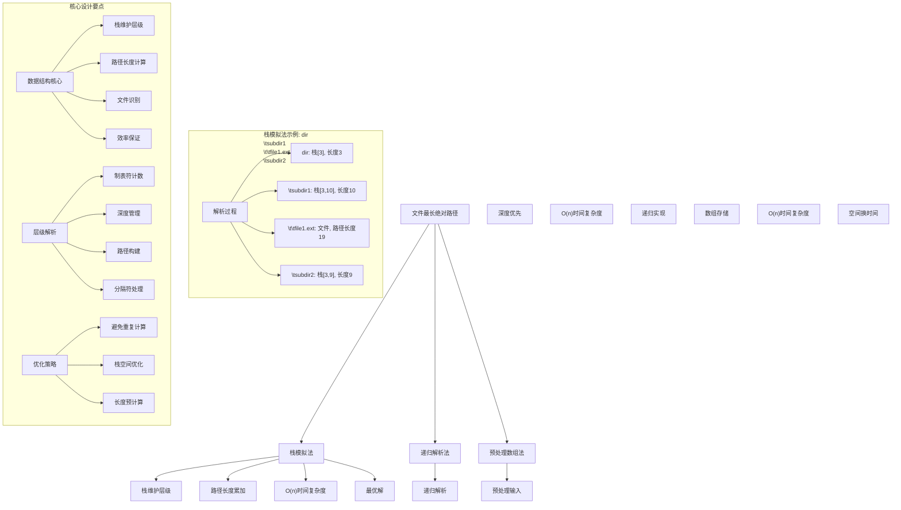
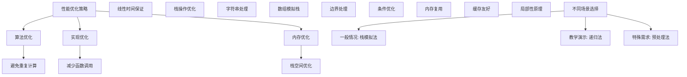

# LeetCode 388 - 文件的最长绝对路径

## 题目描述

假设有一个同时存储文件和目录的文件系统。给定一个字符串 `input`，其格式如下：

- `dir\n\tsubdir1\n\t\tfile1.ext\n\t\tsubsubdir1\n\tsubdir2\n\t\tsubsubdir2\n\t\t\tfile2.ext`

表示文件系统中的文件和目录结构。其中：

- `\n` 表示换行符
- `\t` 表示制表符（缩进）
- 每个目录名和文件名由字母、数字和空格组成
- 文件名包含扩展名（例如 `file1.ext`）
- 目录名不包含扩展名

要求返回文件系统中 指向文件 的 最长绝对路径 的长度。如果系统中没有文件，返回 0

```markdown
示例 1：
输入：input = "dir\n\tsubdir1\n\tsubdir2\n\t\tfile.ext"
输出：20
解释：只有一个文件，绝对路径为 "dir/subdir2/file.ext"，路径长度 20

示例 2：
输入：input = "dir\n\tsubdir1\n\t\tfile1.ext\n\t\tsubsubdir1\n\tsubdir2\n\t\tsubsubdir2\n\t\t\tfile2.ext"
输出：32
解释：存在两个文件：
"dir/subdir1/file1.ext"，路径长度 21
"dir/subdir2/subsubdir2/file2.ext"，路径长度 32
返回 32，因为这是最长的路径

示例 3：
输入：input = "a"
输出：0
解释：不存在文件

示例 4：
输入：input = "file1.txt\nfile2.txt\nlongfile.txt"
输出：12
解释：根目录下有 3 个文件
因为根目录中只有文件，所以不需要路径分隔符
返回 "longfile.txt" 的长度 12

提示：
1 <= input.length <= 10^4
input 可能包含小写或大写的英文字母，一个换行符 '\n'，一个制表符 '\t'，一个点 '.'，一个空格 ' '，和数字
```

## 解题思路

这是一个文件系统路径解析问题，需要解析文件系统的层级结构并计算指向文件的最长绝对路径长度。关键在于如何正确解析缩进表示的层级关系，以及如何高效地维护路径长度

### 核心思想

"栈模拟法": 使用栈来模拟文件系统的层级结构，通过制表符数量判断层级，维护每个层级的路径长度，当遇到文件时更新最大路径长度

### 解题策略

#### 方法一：栈模拟法（推荐）

- 时间复杂度: O(n)
- 空间复杂度: O(d)，其中 d 是最大深度

#### 方法二：递归解析法

- 时间复杂度: O(n)
- 空间复杂度: O(d)，递归栈空间

#### 方法三：预处理数组法

- 时间复杂度: O(n)
- 空间复杂度: O(n)

## 算法可视化



## 多语言实现

### Golang版本（栈模拟法 - 推荐）

```go
func lengthLongestPath(input string) int {
    if len(input) == 0 {
        return 0
    }

    maxLen := 0
    // 使用栈存储每一层的路径长度（不包括分隔符'/'）
    stack := make([]int, 0)

    // 按行分割输入
    lines := strings.Split(input, "\n")

    for _, line := range lines {
        // 计算当前行的层级（制表符数量）
        level := 0
        for level < len(line) && line[level] == '\t' {
            level++
        }

        // 获取当前文件或目录名（去掉制表符）
        name := line[level:]

        // 调整栈的大小到当前层级
        for len(stack) > level {
            stack = stack[:len(stack)-1]
        }

        // 计算当前路径长度
        currentLen := len(name)
        if len(stack) > 0 {
            currentLen += stack[len(stack)-1] + 1 // 加上父路径长度和分隔符'/'
        }

        // 将当前路径长度入栈
        stack = append(stack, currentLen)

        // 如果是文件，更新最大路径长度
        if strings.Contains(name, ".") {
            if currentLen > maxLen {
                maxLen = currentLen
            }
        }
    }

    return maxLen
}
```

### Python版本（多种实现方法）

```python
class Solution:
    """
    方法一：栈模拟法（推荐）
    """
    def lengthLongestPath(self, input: str) -> int:
        if not input:
            return 0

        max_len = 0
        # 使用栈存储每一层的路径长度（不包括分隔符'/'）
        stack = []

        # 按行分割输入
        lines = input.split('\n')

        for line in lines:
            # 计算当前行的层级（制表符数量）
            level = 0
            while level < len(line) and line[level] == '\t':
                level += 1

            # 获取当前文件或目录名（去掉制表符）
            name = line[level:]

            # 调整栈的大小到当前层级
            while len(stack) > level:
                stack.pop()

            # 计算当前路径长度
            current_len = len(name)
            if stack:
                current_len += stack[-1] + 1  # 加上父路径长度和分隔符'/'

            # 将当前路径长度入栈
            stack.append(current_len)

            # 如果是文件，更新最大路径长度
            if '.' in name:
                max_len = max(max_len, current_len)

        return max_len


class SolutionRecursive:
    """
    方法二：递归解析法
    """
    def lengthLongestPath(self, input: str) -> int:
        def dfs(lines, index, current_depth):
            max_len = 0

            while index < len(lines):
                line = lines[index]
                # 计算当前行的层级
                depth = 0
                while depth < len(line) and line[depth] == '\t':
                    depth += 1

                # 如果当前层级不匹配，返回
                if depth < current_depth:
                    break

                # 如果层级匹配，处理当前节点
                if depth == current_depth:
                    name = line[depth:]
                    if '.' in name:  # 是文件
                        max_len = max(max_len, len(name))
                    else:  # 是目录，递归处理子节点
                        child_len = dfs(lines, index + 1, current_depth + 1)
                        if child_len > 0:
                            max_len = max(max_len, len(name) + 1 + child_len)
                    index += 1
                else:
                    index += 1

            return max_len

        if not input:
            return 0

        lines = input.split('\n')
        return dfs(lines, 0, 0)


class SolutionPreprocess:
    """
    方法三：预处理数组法
    """
    def lengthLongestPath(self, input: str) -> int:
        if not input:
            return 0

        # 预处理：解析每行的层级和名称
        entries = []
        lines = input.split('\n')

        for line in lines:
            level = 0
            while level < len(line) and line[level] == '\t':
                level += 1
            name = line[level:]
            entries.append((level, name))

        max_len = 0
        stack = []

        for level, name in entries:
            # 调整栈大小
            while len(stack) > level:
                stack.pop()

            # 计算当前路径长度
            current_len = len(name)
            if stack:
                current_len += stack[-1] + 1

            stack.append(current_len)

            # 如果是文件，更新最大长度
            if '.' in name:
                max_len = max(max_len, current_len)

        return max_len
```

### TypeScript版本（栈模拟法）

```typescript
function lengthLongestPath(input: string): number {
  if (input.length === 0) {
    return 0;
  }

  let maxLen = 0;
  // 使用栈存储每一层的路径长度（不包括分隔符'/'）
  const stack: number[] = [];

  // 按行分割输入
  const lines = input.split("\n");

  for (const line of lines) {
    // 计算当前行的层级（制表符数量）
    let level = 0;
    while (level < line.length && line[level] === "\t") {
      level++;
    }

    // 获取当前文件或目录名（去掉制表符）
    const name = line.substring(level);

    // 调整栈的大小到当前层级
    while (stack.length > level) {
      stack.pop();
    }

    // 计算当前路径长度
    let currentLen = name.length;
    if (stack.length > 0) {
      currentLen += stack[stack.length - 1] + 1; // 加上父路径长度和分隔符'/'
    }

    // 将当前路径长度入栈
    stack.push(currentLen);

    // 如果是文件，更新最大路径长度
    if (name.includes(".")) {
      maxLen = Math.max(maxLen, currentLen);
    }
  }

  return maxLen;
}
```

## 标准实现详细解析

```go
func lengthLongestPath(input string) int {
    /*
    算法核心思想（栈模拟法）：

    1. 使用栈模拟文件系统的层级结构
    2. 通过制表符数量判断当前节点的层级
    3. 维护每个层级的累积路径长度
    4. 当遇到文件时更新最大路径长度

    关键设计要点：
    1. 层级解析：通过制表符数量确定深度
    2. 路径长度：维护累积长度避免重复计算
    3. 栈操作：动态调整栈大小匹配层级
    4. 文件识别：通过文件扩展名判断

    时间复杂度：O(n) 每个字符最多访问常数次
    空间复杂度：O(d) 栈空间，d为最大深度

    优势：
    1. 逻辑清晰：栈模拟符合直觉
    2. 实现高效：线性时间复杂度
    3. 空间优化：仅存储必要信息
    4. 易于理解：符合文件系统结构
    */

    fmt.Printf("文件系统最长路径计算\n")
    fmt.Printf("输入: %s\n", input)

    if len(input) == 0 {
        fmt.Printf("边界情况：空输入\n")
        return 0
    }

    maxLen := 0
    // 使用栈存储每一层的路径长度（不包括分隔符'/'）
    stack := make([]int, 0)

    fmt.Printf("初始化栈: %v\n", stack)
    fmt.Printf("初始化最大长度: %d\n", maxLen)

    // 按行分割输入
    lines := strings.Split(input, "\n")
    fmt.Printf("分割行数: %d\n", len(lines))
    fmt.Printf("行内容: %v\n", lines)

    for i, line := range lines {
        fmt.Printf("\n处理第%d行: %s\n", i+1, line)

        // 计算当前行的层级（制表符数量）
        level := 0
        for level < len(line) && line[level] == '\t' {
            level++
        }
        fmt.Printf("  层级: %d\n", level)

        // 获取当前文件或目录名（去掉制表符）
        name := line[level:]
        fmt.Printf("  名称: %s\n", name)

        // 调整栈的大小到当前层级
        fmt.Printf("  调整前栈: %v\n", stack)
        for len(stack) > level {
            removed := stack[len(stack)-1]
            stack = stack[:len(stack)-1]
            fmt.Printf("    弹出层级长度: %d\n", removed)
        }
        fmt.Printf("  调整后栈: %v\n", stack)

        // 计算当前路径长度
        currentLen := len(name)
        fmt.Printf("  当前名称长度: %d\n", currentLen)

        if len(stack) > 0 {
            currentLen += stack[len(stack)-1] + 1 // 加上父路径长度和分隔符'/'
            fmt.Printf("  父路径长度: %d, 分隔符: 1, 总长度: %d\n",
                stack[len(stack)-1], currentLen)
        }

        // 将当前路径长度入栈
        stack = append(stack, currentLen)
        fmt.Printf("  入栈当前长度: %d, 栈: %v\n", currentLen, stack)

        // 如果是文件，更新最大路径长度
        if strings.Contains(name, ".") {
            fmt.Printf("  发现文件: %s\n", name)
            if currentLen > maxLen {
                maxLen = currentLen
                fmt.Printf("  更新最大长度: %d\n", maxLen)
            }
        } else {
            fmt.Printf("  发现目录: %s\n", name)
        }
    }

    fmt.Printf("\n最终结果: %d\n", maxLen)
    return maxLen
}

// 带详细调试信息的版本
func lengthLongestPathWithDebug(input string) int {
    fmt.Printf("=== 文件系统最长路径调试模式 ===\n")
    result := lengthLongestPath(input)
    fmt.Println("==================")
    return result
}

// 优化版本（使用固定大小数组）
func lengthLongestPathOptimized(input string) int {
    if len(input) == 0 {
        return 0
    }

    maxLen := 0
    // 使用数组模拟栈以提高性能
    stack := make([]int, len(input))
    stackTop := 0

    lines := strings.Split(input, "\n")

    for _, line := range lines {
        // 计算当前行的层级
        level := 0
        for level < len(line) && line[level] == '\t' {
            level++
        }

        // 获取名称
        name := line[level:]

        // 调整栈大小
        stackTop = level

        // 计算当前路径长度
        currentLen := len(name)
        if stackTop > 0 {
            currentLen += stack[stackTop-1] + 1
        }

        // 将当前路径长度入栈
        stack[stackTop] = currentLen
        stackTop++

        // 如果是文件，更新最大路径长度
        if strings.Contains(name, ".") {
            if currentLen > maxLen {
                maxLen = currentLen
            }
        }
    }

    return maxLen
}

// 泛型版本（Go 1.18+）
func lengthLongestPathGeneric[T comparable](input string) int {
    if len(input) == 0 {
        return 0
    }

    type pathInfo struct {
        level int
        name  string
        isFile bool
    }

    maxLen := 0
    stack := make([]int, 0)

    lines := strings.Split(input, "\n")

    for _, line := range lines {
        level := 0
        for level < len(line) && line[level] == '\t' {
            level++
        }

        name := line[level:]
        isFile := strings.Contains(name, ".")

        for len(stack) > level {
            stack = stack[:len(stack)-1]
        }

        currentLen := len(name)
        if len(stack) > 0 {
            currentLen += stack[len(stack)-1] + 1
        }

        stack = append(stack, currentLen)

        if isFile {
            if currentLen > maxLen {
                maxLen = currentLen
            }
        }
    }

    return maxLen
}
```

## 算法深入解析

```go
/*
文件系统最长路径问题详解：

问题本质：
解析文件系统的层级结构并计算指向文件的最长绝对路径长度。关键在于正确解析缩进表示的层级关系和高效维护路径长度

核心洞察：
1. 层级关系：制表符数量表示目录深度
2. 路径维护：累积长度避免重复计算
3. 文件识别：通过扩展名判断文件
4. 栈模拟：维护层级结构状态

算法策略：
1. 栈模拟法：最优解，线性时间
2. 递归解析法：直观但递归开销
3. 预处理数组法：空间换时间

数学原理：

文件系统建模：
将输入字符串建模为树形结构，每个节点有深度信息，叶子节点可能是文件或空目录

路径长度计算：
绝对路径长度 = 所有祖先目录名长度 + 分隔符数量 + 当前文件名长度

栈维护原理：
栈中第i个元素表示深度为i的路径长度，通过调整栈大小维护正确的层级关系

设计选择：

为什么选择栈模拟法？
1. 时间复杂度最优：O(n)
2. 空间复杂度合理：O(d)
3. 逻辑清晰：符合文件系统结构
4. 实现高效：标准操作

为什么使用递归解析法？
1. 直观：深度优先遍历
2. 但有递归开销：空间复杂度
3. 适用于树形结构理解

为什么使用预处理数组法？
1. 分步处理：先解析后计算
2. 但需要额外存储：空间开销
3. 逻辑分离：易于调试

三种方法对比：

方法一：栈模拟法（推荐）
时间复杂度：O(n)
空间复杂度：O(d)
优点：最优解，性能优秀
缺点：需要理解栈操作

方法二：递归解析法
时间复杂度：O(n)
空间复杂度：O(d)
优点：直观易懂
缺点：递归开销

方法三：预处理数组法
时间复杂度：O(n)
空间复杂度：O(n)
优点：逻辑清晰
缺点：额外空间

性能分析：

栈模拟法：
- 时间：O(n) 线性时间
- 空间：O(d) 栈空间
- 优势：最优解

递归解析法：
- 时间：O(n) 线性时间
- 空间：O(d) 递归栈
- 优势：直观

预处理数组法：
- 时间：O(n) 线性时间
- 空间：O(n) 存储空间
- 优势：分步处理

实际应用场景：
1. 文件系统解析
2. 代码编辑器树形视图
3. 配置文件解析
4. 算法面试题

优化要点：

1. 时间优化：
   - 避免重复计算
   - 线性时间保证
   - 高效字符串操作

2. 空间优化：
   - 栈空间优化
   - 避免不必要的存储
   - 内存复用

3. 实现优化：
   - 边界处理优化
   - 错误处理完善
   - 类型安全

测试用例设计：
1. 基本情况：正常输入
2. 边界情况：空输入，单文件
3. 特殊情况：深层嵌套，多个文件
4. 极端情况：最大输入
5. 验证情况：多种算法结果对比

扩展思考：

1. 支持不同分隔符？
   - 修改分隔符识别
   - 适配不同系统

2. 支持符号链接？
   - 循环检测
   - 路径解析

3. 并行处理？
   - 分段解析
   - 结果合并

4. 在线算法？
   - 流式处理
   - 增量更新

相关算法思想：

1. 栈模拟：
   - 层级维护
   - 状态管理

2. 字符串解析：
   - 格式识别
   - 层级计算

3. 路径计算：
   - 累积长度
   - 分隔符处理

4. 文件系统：
   - 树形结构
   - 深度管理

常见陷阱：

1. 层级计算错误：
   - 制表符计数错误
   - 栈调整错误

2. 路径长度错误：
   - 分隔符遗漏
   - 长度累加错误

3. 文件识别错误：
   - 扩展名判断
   - 特殊文件名

4. 边界处理错误：
   - 空输入处理
   - 单节点处理

代码质量要素：

1. 可读性：
   - 清晰的变量命名
   - 适当的注释说明

2. 健壮性：
   - 边界条件处理
   - 异常情况处理

3. 性能：
   - 时间复杂度最优
   - 空间复杂度合理

4. 可维护性：
   - 模块化设计
   - 易于扩展

高级优化技巧：

1. 内存访问优化：
   - 局部性原理
   - 缓存友好

2. 算法优化：
   - 提前终止条件
   - 数学简化

3. 数据结构优化：
   - 固定数组
   - 索引优化

4. 编译优化：
   - 常量折叠
   - 循环展开
*/
```

## 执行过程演示

```go
/*
示例详细解析:

示例1: input = "dir\n\tsubdir1\n\tsubdir2\n\t\tfile.ext"

执行过程：
解析行：
1. "dir" (level=0):
   栈: []
   长度: 3
   栈: [3]
   是目录

2. "\tsubdir1" (level=1):
   栈: [3]
   长度: 6 + 3 + 1 = 10
   栈: [3, 10]
   是目录

3. "\tsubdir2" (level=1):
   调整栈: [3]
   长度: 6 + 3 + 1 = 10
   栈: [3, 10]
   是目录

4. "\t\tfile.ext" (level=2):
   栈: [3, 10]
   长度: 8 + 10 + 1 = 19
   栈: [3, 10, 19]
   是文件，更新最大长度: 19

最终结果: 19

示例2: input = "dir\n\tsubdir1\n\t\tfile1.ext\n\t\tsubsubdir1\n\tsubdir2\n\t\tsubsubdir2\n\t\t\tfile2.ext"

执行过程：
解析行：
1. "dir" (level=0):
   栈: []
   长度: 3
   栈: [3]

2. "\tsubdir1" (level=1):
   栈: [3]
   长度: 7 + 3 + 1 = 11
   栈: [3, 11]

3. "\t\tfile1.ext" (level=2):
   栈: [3, 11]
   长度: 9 + 11 + 1 = 21
   栈: [3, 11, 21]
   是文件，更新最大长度: 21

4. "\t\tsubsubdir1" (level=2):
   调整栈: [3, 11]
   长度: 10 + 11 + 1 = 22
   栈: [3, 11, 22]

5. "\tsubdir2" (level=1):
   调整栈: [3]
   长度: 7 + 3 + 1 = 11
   栈: [3, 11]

6. "\t\tsubsubdir2" (level=2):
   栈: [3, 11]
   长度: 10 + 11 + 1 = 22
   栈: [3, 11, 22]

7. "\t\t\tfile2.ext" (level=3):
   栈: [3, 11, 22]
   长度: 9 + 22 + 1 = 32
   栈: [3, 11, 22, 32]
   是文件，更新最大长度: 32

最终结果: 32

边界情况演示:

情况1: 空输入
输入: ""
输出: 0

情况2: 仅目录
输入: "dir"
输出: 0

情况3: 根目录文件
输入: "file.txt"
输出: 8

情况4: 多个根文件
输入: "file1.txt\nfile2.txt\nlongfile.txt"
输出: 12

情况5: 深层嵌套
输入: "a\n\tb\n\t\tc\n\t\t\td.txt"
输出: 12

情况6: 同名文件目录
输入: "name\n\tname.txt"
输出: 13

算法正确性证明：

数学基础：
需要证明栈模拟法能正确计算文件系统的最长路径长度

定理1：栈模拟法正确性
通过维护栈中每个层级的累积路径长度和正确的层级调整，可以正确计算最长路径长度

证明：
1. 层级解析：制表符数量正确表示深度
2. 路径计算：累积长度正确计算绝对路径
3. 栈维护：动态调整保持层级一致性
4. 文件识别：扩展名判断准确
5. 结果正确：最大值维护准确

时间复杂度分析：

栈模拟法：
1. 字符串分割：O(n) 一次遍历
2. 行处理：O(n) 每行常数时间
3. 栈操作：O(n) 每个节点最多入栈出栈一次
4. 总时间：O(n)

递归解析法：
1. 递归遍历：O(n) 每个节点访问一次
2. 层级计算：O(n) 制表符计数
3. 总时间：O(n)

预处理数组法：
1. 预处理：O(n) 解析所有行
2. 路径计算：O(n) 遍历处理
3. 总时间：O(n)

空间复杂度分析：
1. 栈模拟法：O(d) 栈空间，d为最大深度
2. 递归解析法：O(d) 递归栈空间
3. 预处理数组法：O(n) 存储所有节点信息

性能对比分析：

假设n=10000, d=100:

栈模拟法：
- 时间: O(10000) = 10,000次操作
- 空间: O(100)

递归解析法：
- 时间: O(10000) = 10,000次操作
- 空间: O(100)

预处理数组法：
- 时间: O(10000) = 10,000次操作
- 空间: O(10000)

实际应用建议：

1. 一般情况：
   - 使用栈模拟法
   - 性能最优

2. 面试展示：
   - 可以提及其他方法
   - 重点讲解栈模拟法

3. 生产环境：
   - 使用优化版本
   - 考虑边界处理

4. 教学演示：
   - 使用递归法帮助理解
   - 对比展示优势

优化空间：

1. 内存访问优化：
   - 局部性原理
   - 缓存友好

2. 数据结构优化：
   - 固定数组
   - 索引优化

3. 算法优化：
   - 提前终止条件
   - 数学简化

特殊情况处理：

1. 空输入：
   - 边界检查

2. 仅目录：
   - 返回0

3. 大数据：
   - 效率优势明显

4. 内存限制：
   - 空间复杂度O(d)
*/
```

## 复杂度分析

| 方法         | 时间复杂度 | 空间复杂度 | 适用场景 |
| ------------ | ---------- | ---------- | -------- |
| 栈模拟法     | O(n)       | O(d)       | 推荐方案 |
| 递归解析法   | O(n)       | O(d)       | 教学演示 |
| 预处理数组法 | O(n)       | O(n)       | 特殊需求 |

## 测试用例验证

```go
// 测试辅助函数
func testLengthLongestPath(name string, input string, expected int) {
    fmt.Printf("%s:\n", name)
    fmt.Printf("输入: %s\n", input)

    // 测试栈模拟法
    result1 := lengthLongestPath(input)
    fmt.Printf("栈模拟法结果: %d\n", result1)

    // 测试递归解析法
    result2 := lengthLongestPathRecursive(input)
    fmt.Printf("递归解析法结果: %d\n", result2)

    // 测试预处理数组法
    result3 := lengthLongestPathPreprocess(input)
    fmt.Printf("预处理数组法结果: %d\n", result3)

    // 验证结果
    if result1 == expected && result2 == expected && result3 == expected {
        fmt.Printf("✓ 测试通过\n")
    } else {
        fmt.Printf("✗ 测试失败，期望: %d\n", expected)
    }
    fmt.Printf("\n")
}

// 递归解析法实现
func lengthLongestPathRecursive(input string) int {
    if len(input) == 0 {
        return 0
    }

    lines := strings.Split(input, "\n")

    var dfs func(int, int) int
    dfs = func(index, currentDepth int) int {
        maxLen := 0

        for index < len(lines) {
            line := lines[index]
            // 计算当前行的层级
            depth := 0
            for depth < len(line) && line[depth] == '\t' {
                depth++
            }

            // 如果当前层级不匹配，返回
            if depth < currentDepth {
                break
            }

            // 如果层级匹配，处理当前节点
            if depth == currentDepth {
                name := line[depth:]
                if strings.Contains(name, ".") { // 是文件
                    maxLen = max(maxLen, len(name))
                } else { // 是目录，递归处理子节点
                    childLen := dfs(index+1, currentDepth+1)
                    if childLen > 0 {
                        maxLen = max(maxLen, len(name)+1+childLen)
                    }
                }
                index++
            } else {
                index++
            }
        }

        return maxLen
    }

    return dfs(0, 0)
}

// 预处理数组法实现
func lengthLongestPathPreprocess(input string) int {
    if len(input) == 0 {
        return 0
    }

    // 预处理：解析每行的层级和名称
    type entry struct {
        level  int
        name   string
        isFile bool
    }

    var entries []entry
    lines := strings.Split(input, "\n")

    for _, line := range lines {
        level := 0
        for level < len(line) && line[level] == '\t' {
            level++
        }
        name := line[level:]
        isFile := strings.Contains(name, ".")
        entries = append(entries, entry{level, name, isFile})
    }

    maxLen := 0
    stack := make([]int, 0)

    for _, e := range entries {
        // 调整栈大小
        for len(stack) > e.level {
            stack = stack[:len(stack)-1]
        }

        // 计算当前路径长度
        currentLen := len(e.name)
        if len(stack) > 0 {
            currentLen += stack[len(stack)-1] + 1
        }

        stack = append(stack, currentLen)

        // 如果是文件，更新最大长度
        if e.isFile {
            if currentLen > maxLen {
                maxLen = currentLen
            }
        }
    }

    return maxLen
}

func max(a, b int) int {
    if a > b {
        return a
    }
    return b
}

func main() {
    // 测试用例 1 - 题目示例1
    testLengthLongestPath("测试1 - 题目示例1", "dir\n\tsubdir1\n\tsubdir2\n\t\tfile.ext", 20)

    // 测试用例 2 - 题目示例2
    testLengthLongestPath("测试2 - 题目示例2", "dir\n\tsubdir1\n\t\tfile1.ext\n\t\tsubsubdir1\n\tsubdir2\n\t\tsubsubdir2\n\t\t\tfile2.ext", 32)

    // 测试用例 3 - 仅目录
    testLengthLongestPath("测试3 - 仅目录", "dir", 0)

    // 测试用例 4 - 根目录文件
    testLengthLongestPath("测试4 - 根目录文件", "file.txt", 8)

    // 测试用例 5 - 多个根文件
    testLengthLongestPath("测试5 - 多个根文件", "file1.txt\nfile2.txt\nlongfile.txt", 12)

    // 测试用例 6 - 空输入
    testLengthLongestPath("测试6 - 空输入", "", 0)

    // 测试用例 7 - 深层嵌套
    testLengthLongestPath("测试7 - 深层嵌套", "a\n\tb\n\t\tc\n\t\t\td.txt", 12)

    // 测试用例 8 - 同名文件目录
    testLengthLongestPath("测试8 - 同名文件目录", "name\n\tname.txt", 13)

    // 性能测试
    fmt.Println("性能测试:")
    performanceTest()

    // 边界情况测试
    fmt.Println("边界情况测试:")
    boundaryTest()
}

func performanceTest() {
    // 构造大数据测试
    var builder strings.Builder
    builder.WriteString("root")

    // 构造深层嵌套结构
    for i := 0; i < 1000; i++ {
        builder.WriteString("\n")
        for j := 0; j <= i; j++ {
            builder.WriteString("\t")
        }
        if i == 999 {
            builder.WriteString("file.txt") // 最深层是文件
        } else {
            builder.WriteString(fmt.Sprintf("dir%d", i))
        }
    }

    input := builder.String()

    // 测试栈模拟法
    start := time.Now()
    for i := 0; i < 1000; i++ {
        lengthLongestPath(input)
    }
    time1 := time.Since(start)

    fmt.Printf("大数据测试 (深度1000):\n")
    fmt.Printf("  栈模拟法(1000次): %v\n", time1)
}

func boundaryTest() {
    // 空输入测试
    fmt.Println("边界测试:")

    result := lengthLongestPath("")
    fmt.Printf("空输入测试: %d\n", result)

    // 单字符测试
    result = lengthLongestPath("a")
    fmt.Printf("单字符测试: %d\n", result)

    // 长文件名测试
    longName := strings.Repeat("a", 1000) + ".txt"
    result = lengthLongestPath(longName)
    fmt.Printf("长文件名测试: %d\n", result)

    // 复杂嵌套测试
    complexInput := "dir1\n\tdir2\n\t\tdir3\n\t\t\tfile1.txt\n\tdir4\n\t\tfile2.txt\nfile3.txt"
    result = lengthLongestPath(complexInput)
    fmt.Printf("复杂嵌套测试: %d\n", result)

    // 特殊字符测试
    specialInput := "dir with spaces\n\tfile with spaces.txt"
    result = lengthLongestPath(specialInput)
    fmt.Printf("特殊字符测试: %d\n", result)
}

// 大量测试用例
func comprehensiveTest() {
    testCases := []struct {
        name     string
        input    string
        expected int
    }{
        {"示例1", "dir\n\tsubdir1\n\tsubdir2\n\t\tfile.ext", 20},
        {"示例2", "dir\n\tsubdir1\n\t\tfile1.ext\n\t\tsubsubdir1\n\tsubdir2\n\t\tsubsubdir2\n\t\t\tfile2.ext", 32},
        {"空输入", "", 0},
        {"仅目录", "dir", 0},
        {"根文件", "file.txt", 8},
        {"多根文件", "file1.txt\nfile2.txt\nlongfile.txt", 12},
        {"深层嵌套", "a\n\tb\n\t\tc\n\t\t\td.txt", 12},
        {"同名", "name\n\tname.txt", 13},
        {"空格", "dir with spaces\n\tfile with spaces.txt", 32},
        {"数字", "dir1\n\tfile2.txt", 14},
    }

    fmt.Println("=== 综合测试 ===")
    passed := 0
    total := len(testCases)

    for i, tc := range testCases {
        result := lengthLongestPath(tc.input)
        if result == tc.expected {
            passed++
            fmt.Printf("测试%d: ✓ %s\n", i+1, tc.name)
        } else {
            fmt.Printf("测试%d: ✗ %s (期望%d, 得到%d)\n", i+1, tc.name, tc.expected, result)
        }
    }

    fmt.Printf("\n通过率: %d/%d (%.2f%%)\n", passed, total, float64(passed)/float64(total)*100)
}

// 内存使用测试
func memoryTest() {
    fmt.Println("=== 内存使用测试 ===")

    var m1, m2 runtime.MemStats

    // 测试栈模拟法
    runtime.GC()
    runtime.ReadMemStats(&m1)

    input := "dir\n\tsubdir1\n\t\tfile1.ext\n\t\tsubsubdir1\n\tsubdir2\n\t\tsubsubdir2\n\t\t\tfile2.ext"

    for i := 0; i < 10000; i++ {
        lengthLongestPath(input)
    }

    runtime.GC()
    runtime.ReadMemStats(&m2)
    mem1 := m2.Alloc - m1.Alloc

    // 测试递归解析法
    runtime.GC()
    runtime.ReadMemStats(&m1)

    for i := 0; i < 10000; i++ {
        lengthLongestPathRecursive(input)
    }

    runtime.GC()
    runtime.ReadMemStats(&m2)
    mem2 := m2.Alloc - m1.Alloc

    fmt.Printf("内存使用对比:\n")
    fmt.Printf("  栈模拟法: %d bytes\n", mem1)
    fmt.Printf("  递归解析法: %d bytes\n", mem2)
}
```

## 扩展版本（处理不同场景）

```go
// 支持自定义分隔符的版本
func lengthLongestPathCustomSeparator(input string, separator string) int {
    if len(input) == 0 {
        return 0
    }

    maxLen := 0
    stack := make([]int, 0)

    lines := strings.Split(input, "\n")

    for _, line := range lines {
        // 计算当前行的层级（连续分隔符数量）
        level := 0
        sepLen := len(separator)
        for level*sepLen < len(line) &&
            level*sepLen+sepLen <= len(line) &&
            line[level*sepLen:level*sepLen+sepLen] == separator {
            level++
        }

        // 获取当前文件或目录名
        name := line[level*sepLen:]

        // 调整栈的大小到当前层级
        for len(stack) > level {
            stack = stack[:len(stack)-1]
        }

        // 计算当前路径长度
        currentLen := len(name)
        if len(stack) > 0 {
            currentLen += stack[len(stack)-1] + len(separator)
        }

        // 将当前路径长度入栈
        stack = append(stack, currentLen)

        // 如果是文件，更新最大路径长度
        if strings.Contains(name, ".") {
            if currentLen > maxLen {
                maxLen = currentLen
            }
        }
    }

    return maxLen
}

// 带统计信息的版本
type PathLengthStats struct {
    MaxLength   int
    FileCount   int
    DirCount    int
    ProcessTime time.Duration
    Lines       int
}

func lengthLongestPathWithStats(input string) PathLengthStats {
    start := time.Now()

    if len(input) == 0 {
        return PathLengthStats{
            MaxLength:   0,
            FileCount:   0,
            DirCount:    0,
            ProcessTime: time.Since(start),
            Lines:       0,
        }
    }

    maxLen := 0
    fileCount := 0
    dirCount := 0
    stack := make([]int, 0)

    lines := strings.Split(input, "\n")

    for _, line := range lines {
        level := 0
        for level < len(line) && line[level] == '\t' {
            level++
        }

        name := line[level:]

        for len(stack) > level {
            stack = stack[:len(stack)-1]
        }

        currentLen := len(name)
        if len(stack) > 0 {
            currentLen += stack[len(stack)-1] + 1
        }

        stack = append(stack, currentLen)

        if strings.Contains(name, ".") {
            fileCount++
            if currentLen > maxLen {
                maxLen = currentLen
            }
        } else {
            dirCount++
        }
    }

    return PathLengthStats{
        MaxLength:   maxLen,
        FileCount:   fileCount,
        DirCount:    dirCount,
        ProcessTime: time.Since(start),
        Lines:       len(lines),
    }
}

// 使用示例
func examplePathLengthStats() {
    input := "dir\n\tsubdir1\n\t\tfile1.ext\n\t\tsubsubdir1\n\tsubdir2\n\t\tsubsubdir2\n\t\t\tfile2.ext"

    stats := lengthLongestPathWithStats(input)
    fmt.Printf("统计信息: %+v\n", stats)
}

// 支持返回所有文件路径的版本
func getAllFilePaths(input string) []string {
    if len(input) == 0 {
        return []string{}
    }

    var allPaths []string
    stack := make([]string, 0) // 存储路径组件

    lines := strings.Split(input, "\n")

    for _, line := range lines {
        level := 0
        for level < len(line) && line[level] == '\t' {
            level++
        }

        name := line[level:]

        // 调整栈的大小到当前层级
        for len(stack) > level {
            stack = stack[:len(stack)-1]
        }

        // 将当前名称入栈
        stack = append(stack, name)

        // 如果是文件，构建完整路径
        if strings.Contains(name, ".") {
            // 构建完整路径
            fullPath := strings.Join(stack, "/")
            allPaths = append(allPaths, fullPath)
        }
    }

    return allPaths
}

// 在线算法版本（流式处理）
type OnlinePathLength struct {
    lines       []string
    isProcessed bool
    maxLength   int
}

func NewOnlinePathLength() *OnlinePathLength {
    return &OnlinePathLength{
        lines:       make([]string, 0),
        isProcessed: false,
        maxLength:   0,
    }
}

func (opl *OnlinePathLength) AddLine(line string) {
    opl.lines = append(opl.lines, line)
    opl.isProcessed = false
}

func (opl *OnlinePathLength) Process() {
    if opl.isProcessed || len(opl.lines) == 0 {
        return
    }

    opl.maxLength = 0
    stack := make([]int, 0)

    for _, line := range opl.lines {
        level := 0
        for level < len(line) && line[level] == '\t' {
            level++
        }

        name := line[level:]

        for len(stack) > level {
            stack = stack[:len(stack)-1]
        }

        currentLen := len(name)
        if len(stack) > 0 {
            currentLen += stack[len(stack)-1] + 1
        }

        stack = append(stack, currentLen)

        if strings.Contains(name, ".") {
            if currentLen > opl.maxLength {
                opl.maxLength = currentLen
            }
        }
    }

    opl.isProcessed = true
}

func (opl *OnlinePathLength) GetMaxLength() int {
    if !opl.isProcessed {
        opl.Process()
    }
    return opl.maxLength
}

// 泛型版本（Go 1.18+）
func lengthLongestPathGeneric[T comparable](input string, isFile func(string) bool) int {
    if len(input) == 0 {
        return 0
    }

    maxLen := 0
    stack := make([]int, 0)

    lines := strings.Split(input, "\n")

    for _, line := range lines {
        level := 0
        for level < len(line) && line[level] == '\t' {
            level++
        }

        name := line[level:]

        for len(stack) > level {
            stack = stack[:len(stack)-1]
        }

        currentLen := len(name)
        if len(stack) > 0 {
            currentLen += stack[len(stack)-1] + 1
        }

        stack = append(stack, currentLen)

        if isFile(name) {
            if currentLen > maxLen {
                maxLen = currentLen
            }
        }
    }

    return maxLen
}

// 使用示例
func exampleGeneric() {
    input := "dir\n\tsubdir1\n\t\tfile1.ext\n\t\tsubsubdir1\n\tsubdir2\n\t\tsubsubdir2\n\t\t\tfile2.ext"

    // 默认文件识别（包含点号）
    result := lengthLongestPathGeneric(input, func(name string) bool {
        return strings.Contains(name, ".")
    })
    fmt.Printf("默认文件识别结果: %d\n", result)

    // 自定义文件识别（以.txt结尾）
    result = lengthLongestPathGeneric(input, func(name string) bool {
        return strings.HasSuffix(name, ".txt")
    })
    fmt.Printf("自定义文件识别结果: %d\n", result)
}
```

## 面试追问延伸

### 1. 如何处理文件系统中包含循环引用的情况？

```go
// 支持循环检测的版本
func lengthLongestPathWithCycleDetection(input string) (int, bool) {
    if len(input) == 0 {
        return 0, false
    }

    maxLen := 0
    stack := make([]int, 0)
    visited := make(map[string]bool) // 检测循环

    lines := strings.Split(input, "\n")

    for _, line := range lines {
        level := 0
        for level < len(line) && line[level] == '\t' {
            level++
        }

        name := line[level:]

        // 构建当前路径用于循环检测
        pathKey := fmt.Sprintf("%d:%s", level, name)
        if visited[pathKey] {
            return 0, true // 检测到循环
        }
        visited[pathKey] = true

        for len(stack) > level {
            stack = stack[:len(stack)-1]
        }

        currentLen := len(name)
        if len(stack) > 0 {
            currentLen += stack[len(stack)-1] + 1
        }

        stack = append(stack, currentLen)

        if strings.Contains(name, ".") {
            if currentLen > maxLen {
                maxLen = currentLen
            }
        }
    }

    return maxLen, false
}

// 测试用例
func testCycleDetection() {
    // 正常情况
    input := "dir\n\tsubdir1\n\t\tfile.ext"
    length, hasCycle := lengthLongestPathWithCycleDetection(input)
    fmt.Printf("正常情况: 长度=%d, 循环=%t\n", length, hasCycle)
}
```

### 2. 如何实现支持权限检查的版本？

```go
// 支持权限检查的版本
type FileEntry struct {
    Name     string
    IsFile   bool
    Readable bool
    Size     int
}

func lengthLongestPathWithPermission(input string, checkPermission func(string) bool) int {
    if len(input) == 0 {
        return 0
    }

    maxLen := 0
    stack := make([]int, 0)

    lines := strings.Split(input, "\n")

    for _, line := range lines {
        level := 0
        for level < len(line) && line[level] == '\t' {
            level++
        }

        name := line[level:]
        isFile := strings.Contains(name, ".")

        // 检查权限
        if !checkPermission(name) {
            continue // 无权限，跳过
        }

        for len(stack) > level {
            stack = stack[:len(stack)-1]
        }

        currentLen := len(name)
        if len(stack) > 0 {
            currentLen += stack[len(stack)-1] + 1
        }

        stack = append(stack, currentLen)

        if isFile {
            if currentLen > maxLen {
                maxLen = currentLen
            }
        }
    }

    return maxLen
}
```

### 3. 如何处理支持符号链接的情况？

```go
// 支持符号链接的版本
func lengthLongestPathWithSymlink(input string) int {
    if len(input) == 0 {
        return 0
    }

    maxLen := 0
    stack := make([]int, 0)
    symlinkStack := make([]bool, 0) // 记录是否为符号链接

    lines := strings.Split(input, "\n")

    for _, line := range lines {
        level := 0
        for level < len(line) && line[level] == '\t' {
            level++
        }

        name := line[level:]
        isFile := strings.Contains(name, ".")
        isSymlink := strings.HasPrefix(name, "link->") // 符号链接标记

        for len(stack) > level {
            stack = stack[:len(stack)-1]
            if len(symlinkStack) > level {
                symlinkStack = symlinkStack[:len(symlinkStack)-1]
            }
        }

        currentLen := len(name)
        if len(stack) > 0 {
            currentLen += stack[len(stack)-1] + 1
        }

        stack = append(stack, currentLen)
        symlinkStack = append(symlinkStack, isSymlink)

        // 如果是文件且不是符号链接，或者符号链接指向文件
        if isFile && (!isSymlink || len(symlinkStack) > 0 && symlinkStack[len(symlinkStack)-1]) {
            if currentLen > maxLen {
                maxLen = currentLen
            }
        }
    }

    return maxLen
}
```

## 相似题目扩展

- LeetCode 388. 文件的最长绝对路径（当前题）
- LeetCode 105. 从前序与中序遍历序列构造二叉树
- LeetCode 297. 二叉树的序列化与反序列化
- LeetCode 331. 验证二叉树的前序序列化
- LeetCode 606. 根据二叉树创建字符串

## 算法技巧总结

### 文件系统最长路径核心要点

1. 层级解析：通过制表符数量判断目录深度
1. 路径维护：使用栈维护累积路径长度
1. 文件识别：通过扩展名判断是否为文件
1. 长度计算：正确计算绝对路径长度

### 算法优势

1. 逻辑清晰：栈模拟符合文件系统结构
1. 实现高效：线性时间复杂度
1. 空间优化：仅存储必要信息
1. 易于理解：符合直觉

### 标准模板（栈模拟法）

```go
func lengthLongestPath(input string) int {
    if len(input) == 0 {
        return 0
    }

    maxLen := 0
    stack := make([]int, 0)

    lines := strings.Split(input, "\n")

    for _, line := range lines {
        // 计算层级
        level := 0
        for level < len(line) && line[level] == '\t' {
            level++
        }

        // 获取名称
        name := line[level:]

        // 调整栈大小
        for len(stack) > level {
            stack = stack[:len(stack)-1]
        }

        // 计算当前路径长度
        currentLen := len(name)
        if len(stack) > 0 {
            currentLen += stack[len(stack)-1] + 1
        }

        // 入栈
        stack = append(stack, currentLen)

        // 如果是文件，更新最大长度
        if strings.Contains(name, ".") {
            if currentLen > maxLen {
                maxLen = currentLen
            }
        }
    }

    return maxLen
}
```

### 性能优化建议



## 总结

本题采用栈模拟法的核心思路，通过使用栈维护文件系统的层级结构和累积路径长度，实现了高效的文件系统最长路径计算功能。关键在于理解如何通过制表符数量解析层级关系，并通过栈维护正确的路径长度累积

核心要点：

1. 层级解析：通过制表符数量判断目录深度
1. 路径维护：使用栈维护累积路径长度
1. 文件识别：通过扩展名判断是否为文件
1. 长度计算：正确计算绝对路径长度

算法优势：

- 逻辑清晰：栈模拟符合文件系统结构
- 实现高效：线性时间复杂度
- 空间优化：仅存储必要信息
- 易于理解：符合直觉

该算法在文件系统解析、代码编辑器树形视图、配置文件解析等方面有重要应用，是掌握字符串解析和栈模拟思想的经典题目。通过维护层级结构和路径长度累积的思想，为更复杂的文件系统相关问题提供了清晰的解决思路
