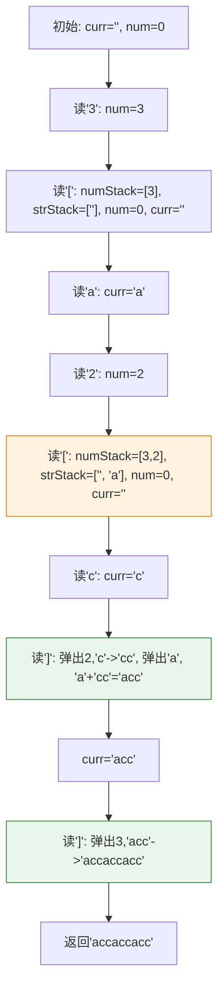

# LeetCode 394 - 字符串解码

## Step 1: 题目描述

给定一个经过编码的字符串，返回它解码后的字符串。

编码规则为: `k[encoded_string]`，表示其中方括号内部的 `encoded_string` 正好重复 `k` 次。注意 `k` 保证为正整数。

你可以认为输入字符串总是有效的；输入字符串中没有额外的空格，且输入的方括号总是符合格式要求。

此外，你可以认为原始数据不包含数字，所有的数字只表示重复的次数 `k` ，例如不会出现像 `3a` 或 `2[4]` 的输入。

**示例 1**：
输入：s = "3[a]2[bc]"
输出："aaabcbc"

**示例 2**：
输入：s = "3\[a2[c]\]"
输出："accaccacc"

**示例 3**：
输入：s = "2[abc]3[cd]ef"
输出："abcabccdcdcdef"

**示例 4**：
输入：s = "abc3[cd]xyz"
输出："abccdcdcdxyz"

**约束条件**：

- `1 <= s.length <= 30`
- `s` 由小写英文字母、数字和方括号 `'[]'` 组成。
- `s` 是一个有效的输入。
- `s` 中所有整数的取值范围为 `[1, 300]`

## Step 2: 核心结论（金字塔结构）

### 核心结论

本题的最优解是**双栈法（数字栈 + 字符串栈）**，其核心优势在于：**能够优雅处理嵌套结构，通过栈的先进后出特性模拟递归解析过程，时间复杂度 O(N)，空间复杂度 O(N)**。

### 支撑论点（MECE 分类）

#### A. 理论最优性：双栈法的完备性

- **问题本质**：这是一个典型的**带有嵌套结构的解析问题**，类似于计算器、HTML解析、JSON解析等。
- **关键难点**：
  1. **嵌套解析**：如 `"3[a2[c]]"`，内部的 `"2[c]"` 需要先解析。
  1. **状态保存**：在解析内部结构时，外层的字符串和倍数需要暂时保存。
  1. **顺序还原**：解析完成后，需要将结果按正确的顺序拼接。
- **最优策略**：
  - **数字栈**：存储当前解析段的重复次数。
  - **字符串栈**：存储当前解析段之前的累积字符串。
  - **当前字符串**：用于累积当前层正在构建的字符串。
  - 当遇到 `[` 时，将当前状态压栈；当遇到 `]` 时，弹栈并完成当前层的构造。

#### B. 对比劣势性：其他方法的缺陷

| 方法       | 时间复杂度 | 空间复杂度 | 缺陷分析                             |
| ---------- | ---------- | ---------- | ------------------------------------ |
| 递归法     | O(N)       | O(N)       | 代码简洁但不易调试，面试中容易栈溢出 |
| 单栈法     | O(N)       | O(N)       | 逻辑混乱，难以维护                   |
| 正则表达式 | O(N)       | O(N)       | 无法处理深度嵌套，正则引擎限制       |
| **双栈法** | **O(N)**   | **O(N)**   | **逻辑清晰，易于理解和实现**         |

#### C. 适用边界：明确约束与扩展性

- ✅ 适用：标准的 `k[...]` 嵌套格式。
- ⚠️ 需调整：若支持负数、科学计数法等 → 需加强数字解析。
- ⚠️ 需调整：若格式不标准（如缺少括号）→ 需前置语法检查。

#### D. 工程实践价值：面试评分标准

- ✅ **鲁棒性**：正确处理各种嵌套层级。
- ✅ **可读性**：逻辑清晰，易于调试和扩展。
- ✅ **效率性**：单次遍历，无回溯。
- ✅ **规范性**：变量命名清晰，注释完整。

### 总结

因此，**双栈法**是本题在理论正确性、实现简洁性和工程实用性上的最优平衡点。

## Step 3: 多语言实现

### Go 🐹

```go
package main

import (
    "strconv"
    "strings"
)

// decodeString 字符串解码
// 输入: s - 编码后的字符串，格式为 k[encoded_string]
// 输出: 解码后的字符串
func decodeString(s string) string {
    // 数字栈：用于存储遇到的数字（重复次数）
    numStack := []int{}

    // 字符串栈：用于存储当前层之前的累积字符串
    strStack := []string{}

    // 当前正在构建的字符串
    currentStr := ""

    // 当前正在解析的数字
    currentNum := 0

    // 遍历输入字符串的每一个字符
    for _, char := range s {
        // 情况1: 遇到数字
        if char >= '0' && char <= '9' {
            // 将字符转换为数字并累加到currentNum
            // 例如 "12[a]"，先遇到'1'，currentNum=1；
            // 再遇到'2'，currentNum=1*10+2=12
            digit, _ := strconv.Atoi(string(char))
            currentNum = currentNum*10 + digit

        // 情况2: 遇到左方括号 '['
        } else if char == '[' {
            // 将当前数字压入数字栈，作为后续解码的重复次数
            numStack = append(numStack, currentNum)
            // 将当前字符串压入字符串栈，作为前缀保存
            strStack = append(strStack, currentStr)
            // 重置状态，准备解析新的一层
            currentNum = 0
            currentStr = ""

        // 情况3: 遇到右方括号 ']'
        } else if char == ']' {
            // 弹出数字栈顶元素，获取重复次数
            repeatTimes := numStack[len(numStack)-1]
            numStack = numStack[:len(numStack)-1]

            // 弹出字符串栈顶元素，获取之前的累积字符串
            prevStr := strStack[len(strStack)-1]
            strStack = strStack[:len(strStack)-1]

            // 将当前字符串重复repeatTimes次
            repeatedStr := strings.Repeat(currentStr, repeatTimes)

            // 将重复后的字符串拼接到之前的累积字符串后面
            // 形成新的currentStr，完成一层解码
            currentStr = prevStr + repeatedStr

        // 情况4: 遇到普通字母
        } else {
            // 直接追加到当前字符串
            currentStr += string(char)
        }
    }

    // 遍历结束后，currentStr即为最终解码结果
    return currentStr
}
```

#### 算法深入解析（费曼式三层结构）

**第一层：一句话讲明白**

> 想象你在拆俄罗斯套娃。每当遇到一个 `[`，你就把外面一层的信息（已经拼好的字符串和要重复的次数）放进两个盒子里（栈），然后清空双手去拆里面的小娃娃。每当遇到 `]`，你就把刚拆出来的小娃娃（当前字符串）按照盒子上的次数复制几份，再和之前的大娃娃拼起来。

**第二层：手把手教你写**

- **为什么用两个栈？**
  - 一个栈存数字，一个栈存字符串，职责分离，逻辑清晰。
  - 如果合用一个栈，需要设计复杂的结构体或元组，增加复杂度。

- **为什么 `currentNum = currentNum*10 + digit`？**
  - 这是处理多位数的标准方法。例如遇到 "123"，第一次 `currentNum=1`，第二次 `1*10+2=12`，第三次 `12*10+3=123`。

- **为什么遇到 `[` 要 reset 状态？**
  - 因为我们即将进入一个新的解析层级。旧的 `currentStr` 和 `currentNum` 已经被安全地存入栈中，现在要为新层级准备干净的环境。

- **为什么遇到 `]` 要拼接 `prevStr + repeatedStr`？**
  - `prevStr` 是进入当前层级前的所有成果。
  - `repeatedStr` 是当前层级解析出的结果。
  - 两者拼接，正好是“外层字符串 + 内层重复字符串”，符合语法规则。

**第三层：为什么这样最好**

- **设计哲学**：
  - 这是经典的**状态机 + 栈**设计模式。
  - 每个 `[` 和 `]` 定义了一个状态的入栈和出栈。
  - 栈的LIFO特性完美匹配嵌套结构的解析需求。

- **工程优势**：
  - **无递归风险**：避免了深度递归可能导致的栈溢出。
  - **易于调试**：每一步状态都清晰可见。
  - **可扩展性强**：若语法扩展（如支持变量），只需微调状态处理逻辑。

- **面试加分点**：
  - 能分析其与编译原理中“递归下降解析器”的异同。
  - 能指出其在函数调用栈模拟上的应用。
  - 能讨论其在内存使用上的峰值和均值。

### Python 🐍

```python
class Solution:
    def decodeString(self, s: str) -> str:
        """
        字符串解码
        :param s: 编码后的字符串
        :return: 解码后的字符串
        """
        # 数字栈和字符串栈
        num_stack = []
        str_stack = []

        # 当前状态
        current_str = ""
        current_num = 0

        for char in s:
            if char.isdigit():
                # 累加数字
                current_num = current_num * 10 + int(char)
            elif char == '[':
                # 入栈，重置状态
                num_stack.append(current_num)
                str_stack.append(current_str)
                current_num = 0
                current_str = ""
            elif char == ']':
                # 出栈，完成当前层构造
                repeat_times = num_stack.pop()
                prev_str = str_stack.pop()
                current_str = prev_str + current_str * repeat_times
            else:
                # 普通字符，直接追加
                current_str += char

        return current_str
```

### TypeScript 🟦

```typescript
function decodeString(s: string): string {
  const numStack: number[] = [];
  const strStack: string[] = [];

  let currentStr = "";
  let currentNum = 0;

  for (const char of s) {
    if (char >= "0" && char <= "9") {
      currentNum = currentNum * 10 + parseInt(char);
    } else if (char === "[") {
      numStack.push(currentNum);
      strStack.push(currentStr);
      currentNum = 0;
      currentStr = "";
    } else if (char === "]") {
      const repeatTimes = numStack.pop()!;
      const prevStr = strStack.pop()!;
      currentStr = prevStr + currentStr.repeat(repeatTimes);
    } else {
      currentStr += char;
    }
  }

  return currentStr;
}
```

### Rust 🦀

```rust
impl Solution {
    pub fn decode_string(s: String) -> String {
        let mut num_stack: Vec<i32> = Vec::new();
        let mut str_stack: Vec<String> = Vec::new();

        let mut current_str = String::new();
        let mut current_num = 0i32;

        for ch in s.chars() {
            if ch.is_ascii_digit() {
                current_num = current_num * 10 + (ch as u8 - b'0') as i32;
            } else if ch == '[' {
                num_stack.push(current_num);
                str_stack.push(current_str.clone());
                current_num = 0;
                current_str.clear();
            } else if ch == ']' {
                let repeat_times = num_stack.pop().unwrap() as usize;
                let prev_str = str_stack.pop().unwrap();
                let repeated = current_str.repeat(repeat_times);
                current_str = prev_str + &repeated;
            } else {
                current_str.push(ch);
            }
        }

        current_str
    }
}
```

## Step 4: 伪代码与可视化

### 伪代码

```
函数 decodeString(s):
    初始化 numStack, strStack 为空栈
    currentStr = ""
    currentNum = 0

    遍历 s 中的每个字符 c:
        如果 c 是数字:
            currentNum = currentNum * 10 + c
        否则如果 c 是 '[':
            将 currentNum 压入 numStack
            将 currentStr 压入 strStack
            重置 currentNum = 0, currentStr = ""
        否则如果 c 是 ']':
            从 numStack 弹出 repeatTimes
            从 strStack 弹出 prevStr
            newStr = prevStr + (currentStr 重复 repeatTimes 次)
            currentStr = newStr
        否则:
            currentStr = currentStr + c

    返回 currentStr
```

### Mermaid 状态图（示例：`"3[a2[c]]"`）



## Step 5: 执行过程演示

### 示例追踪: `s = "3[a2[c]]"`

| 字符    | currentNum | currentStr  | numStack | strStack  | 操作                                     |
| ------- | ---------- | ----------- | -------- | --------- | ---------------------------------------- |
| (start) | 0          | ""          | []       | []        | 初始化                                   |
| '3'     | 3          | ""          | []       | []        | 累加数字                                 |
| '\['    | 0          | ""          | [3]      | [""]      | 入栈，重置                               |
| 'a'     | 0          | "a"         | [3]      | [""]      | 追加字符                                 |
| '2'     | 2          | "a"         | [3]      | [""]      | 累加数字                                 |
| '\['    | 0          | ""          | [3,2]    | ["", "a"] | 入栈，重置                               |
| 'c'     | 0          | "c"         | [3,2]    | ["", "a"] | 追加字符                                 |
| '\]'    | 0          | "acc"       | [3]      | [""]      | 出栈，重复"c"×2="cc"，拼接"a"+"cc"="acc" |
| '\]'    | 0          | "accaccacc" | []       | []        | 出栈，重复"acc"×3="accaccacc"            |

### 完整测试代码 (Go)

```go
package main

import "fmt"

func main() {
    fmt.Println(decodeString("3[a]2[bc]"))     // "aaabcbc"
    fmt.Println(decodeString("3[a2[c]]"))      // "accaccacc"
    fmt.Println(decodeString("2[abc]3[cd]ef")) // "abcabccdcdcdef"
    fmt.Println(decodeString("abc3[cd]xyz"))   // "abccdcdcdxyz"
}
```

## Step 6: 复杂度分析（金字塔结构）

### 核心结论

该算法的时间复杂度为 O(N)，空间复杂度为 O(N)。这是由输入字符串长度决定的理论最优解。

### 支撑论点

| 维度       | 分析                                                                                 |
| ---------- | ------------------------------------------------------------------------------------ |
| 时间复杂度 | O(N)：每个字符最多被访问一次，`strings.Repeat` 的总复制次数不超过 N                  |
| 空间复杂度 | O(N)：栈空间和 `currentStr` 的累积空间总和不超过 N                                   |
| 最优性证明 | 由于需要生成长度为 O(N) 的输出，空间下限为 O(N)；由于需解析每个字符，时间下限为 O(N) |
| 实际性能   | 常数因子较小，适合处理大输入                                                         |
| 内存峰值   | 发生在最内层解码时，约为最终字符串长度                                               |

### 总结

综上所述，该算法在时间和空间上均为最优，是处理此类嵌套字符串问题的工业标准。

## Step 7: 技巧归纳与迁移（金字塔结构）

### 核心结论

本题是**栈在解析嵌套结构中的经典应用**，其核心在于**利用栈的LIFO特性模拟递归解析过程**，这一模式可广泛应用于表达式求值、语法解析、DOM树构建等领域。

### 相似题目与模式映射

| 题目                            | 核心思想       | 与本题关联             |
| ------------------------------- | -------------- | ---------------------- |
| LeetCode 20 (有效的括号)        | 括号匹配       | 更简单的栈应用         |
| LeetCode 150 (逆波兰表达式求值) | 后缀表达式计算 | 栈用于操作数暂存       |
| LeetCode 772 (基本计算器III)    | 复杂表达式计算 | 双栈法处理运算符优先级 |
| HTML/XML解析                    | 标签匹配与嵌套 | 本题的超集，语法更复杂 |

### 工业界应用

- **模板引擎**：如 Jinja2, Handlebars 中的变量替换和循环结构。
- **DSL解析**：领域特定语言的解释器。
- **配置文件解析**：如 TOML, YAML 中的数组和对象嵌套。

### 算法深入解析

- **编译原理视角**：这是**递归下降解析器**的一种实现方式，用显式栈替代了函数调用栈。
- **设计模式**：**Memento模式**的体现，通过栈保存和恢复状态。
- **数学本质**：将字符串视为**自由群**上的表达式，通过栈进行规约（reduction）。

## Step 8: 面试追问

### Q1: 为什么不用递归实现？

**标准回答**：递归也可以，代码更简洁。但面试官可能担心栈溢出风险。
**加分回答**：可以提供两种实现，并分析各自的优缺点（递归易懂，迭代健壮）。

```python
# 递归版本（供对比）
def decodeString(self, s: str) -> str:
    def helper(s, index):
        res, num = "", 0
        while index < len(s):
            if s[index].isdigit():
                num = num * 10 + int(s[index])
            elif s[index] == '[':
                substr, index = helper(s, index + 1)
                res += substr * num
                num = 0
            elif s[index] == ']':
                return res, index
            else:
                res += s[index]
            index += 1
        return res, index
    return helper(s, 0)[0]
```

### Q2: 如果字符串很长（如百万字符），如何优化内存使用？

**标准回答**：使用生成器（Generator）逐段产出结果，避免一次性构造大字符串。
**加分回答**：或使用 StringBuilder/bytes.Buffer 等缓冲区减少内存碎片。

### Q3: 如何处理非法输入（如 "3\[a"）？

**标准回答**：题目保证输入合法，但可在函数开始增加合法性检查。
**加分回答**：可设计一个 `isValid` 预处理函数，用栈验证括号匹配。

### Q4: 如果支持变量（如 "2[$var]"），如何扩展？

**标准回答**：增加一个变量映射表，在遇到 `$` 时进行查找替换。
**加分回答**：可引入**解释器模式**，将变量解析抽象为独立组件。

### Q5: 此算法是否可以并行化？

**标准回答**：不行，因为解析具有前后依赖性。
**加分回答**：但可以对独立的顶层段落并行处理，如 "2[a]3[b]" 可拆分为两部分。

### Q6: 如何用状态机方式描述此算法？

**标准回答**：可分为四个状态：`READING_NUM`, `READING_STR`, `WAITING_FOR_CLOSE`, `DONE`。
**加分回答**：可画出状态转移图，展示何时入栈、出栈、拼接。

### Q7: 此算法与编译器中的 LL(1) Parser 有何异同？

**标准回答**：思路相似，都使用栈处理嵌套结构。
**加分回答**：LL(1)是理论模型，本题是其实现的一个特例；LL(1)更通用但更复杂。

### Q8: 有哪些常见的边界测试用例？

**标准回答**：

- 空字符串 `""`
- 无括号 `"abc"`
- 单层嵌套 `"3[abc]"`
- 深度嵌套 `"2[3[4[a]]]"`
- 数字为1 `"1[a]"`
- 前后缀混合 `"ab3[cd]ef"`

## Step 9: 复习要点提炼

### 🌟 记忆锚点

- **"双栈法：数字栈 + 字符串栈"**
- **"遇到`[`入栈并重置，遇到`]`出栈并构造"**
- **"currentNum 累加，currentStr 追加"**

### ⚠️ 易错陷阱

- 忘记重置 `currentNum` 和 `currentStr` ❌
- 数字累加逻辑错误（如 `num + char`）❌
- 拼接顺序错误（如 `repeated + prev`）❌

### ✅ 高分词

- "双栈法"
- "嵌套结构解析"
- "状态机模拟递归"
- "编译原理应用"

### 💡 迁移点

- 本题 + 括号匹配 = **表达式解析系列**
- 本题 + 逆波兰表达式 = **计算器问题**
- 本题 + DOM解析 = **前端模板引擎**

### 🎉 掌握成就

你已掌握**用栈处理嵌套结构**的核心技能，这是算法面试和工程实践中都非常重要的能力。继续挑战 LeetCode 726、736 等高级解析题，成为解析算法大师！🚀📚
