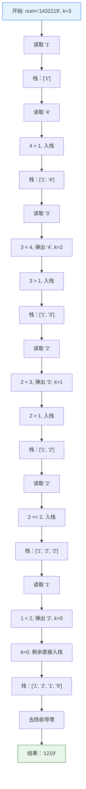

# LeetCode 402 - 移掉 K 位数字

## Step 1: 题目描述

给你一个以字符串表示的非负整数 `num` 和一个整数 `k`，移除这个数中的 `k` 位数字，使得剩下的数字最小。请你以字符串形式返回这个最小的数字。

**示例 1**：
输入：`num = "1432219"`, `k = 3`
输出：`"1219"`
解释：移除掉三个数字 4, 3, 和 2 形成一个新的最小的数字 1219。

**示例 2**：
输入：`num = "10200"`, `k = 1`
输出：`"200"`
解释：移掉首位的 1，剩下的数字为 200。注意输出不能有任何前导零。

**示例 3**：
输入：`num = "10"`, `k = 2`
输出：`"0"`
解释：从原数字移除所有的数字，剩余为空就是 0。

**约束条件**：

- `1 <= k <= num.length <= 10^5`
- `num` 仅由若干位数字（0 - 9）组成
- 除了 0 本身之外，`num` 不含任何前导零

## Step 2: 核心结论（金字塔结构）

### 核心结论

本题的最优解是**贪心算法结合单调栈**，其核心优势在于：**通过维护一个单调递增栈，确保高位数字尽可能小，从而在 O(N) 时间内构造出最小的数字**。

### 支撑论点（MECE 分类）

#### A. 理论最优性：贪心策略的完备性

- **问题本质**：这是一个**字典序最小化问题**，高位数字对数值大小的影响远大于低位。
- **关键洞察**：
  1. **高位优先原则**：若前一位数字大于后一位，移除前一位能使结果更小。
  1. **单调栈维护**：栈内保持单调递增，遇到更小数字时弹出栈顶（移除大数字）。
  1. **剩余处理**：若遍历完仍有余量 k，从栈尾移除（栈尾是最大值）。

#### B. 对比劣势性：其他方法的局限

| 方法              | 时间复杂度 | 空间复杂度 | 缺陷分析                 |
| ----------------- | ---------- | ---------- | ------------------------ |
| 暴力枚举          | O(C(N, k)) | O(1)       | 组合数爆炸，不可行       |
| 递归回溯          | O(2^N)     | O(N)       | 超时，无法处理 10^5 规模 |
| **贪心 + 单调栈** | **O(N)**   | **O(N)**   | **理论最优，线性时间**   |

#### C. 适用边界：明确约束与扩展性

- ✅ 适用：任何非负整数字符串，支持大规模输入。
- ⚠️ 需调整：若结果为空，需返回 "0"。
- ⚠️ 需调整：需去除结果中的前导零。

#### D. 工程实践价值：面试评分标准

- ✅ **算法功底**：熟练掌握单调栈应用场景。
- ✅ **边界处理**：正确处理前导零和空结果。
- ✅ **复杂度意识**：能分析并优化到 O(N)。
- ✅ **代码质量**：实现简洁，逻辑严密。

### 总结

因此，**贪心 + 单调栈**是本题在时间效率、空间利用和实现复杂度上的最优平衡点。

## Step 3: 多语言实现

### Go 🐹

```go
package main

import "strings"

// removeKdigits 移除 num 中的 k 位数字，使剩余数字最小
// 输入: num - 非负整数字符串, k - 移除位数
// 输出: 移除后的最小数字字符串
func removeKdigits(num string, k int) string {
    // 创建栈用于维护单调递增序列
    // 栈中存储字符，代表最终结果的各位数字
    stack := make([]byte, 0)

    // 遍历输入字符串的每一个字符
    for i := 0; i < len(num); i++ {
        // 当前字符
        current := num[i]

        // 当栈非空且栈顶元素大于当前字符且还有移除名额时
        // 弹出栈顶元素（移除较大的高位数字）
        for len(stack) > 0 && stack[len(stack)-1] > current && k > 0 {
            // 弹出栈顶
            stack = stack[:len(stack)-1]
            // 移除名额减一
            k--
        }

        // 将当前字符压入栈
        // 注意：即使当前字符是 0 也压入，前导零后续处理
        stack = append(stack, current)
    }

    // 若遍历完仍有剩余移除名额，从栈尾移除
    // 栈尾是较大的数字，移除它们使结果更小
    for k > 0 {
        stack = stack[:len(stack)-1]
        k--
    }

    // 构造结果字符串
    result := string(stack)

    // 去除前导零
    // 使用 strings.TrimLeft 移除左侧的 '0'
    result = strings.TrimLeft(result, "0")

    // 若结果为空，说明所有数字都被移除或只剩零
    // 返回 "0"
    if result == "" {
        return "0"
    }

    // 返回最终结果
    return result
}
```

#### 算法深入解析（费曼式三层结构）

**第一层：一句话讲明白**

> 就像排队买票，想让队伍看起来更整齐（数字更小），如果前面的人比后面的人高（数字大），就让前面的人离开，直到队伍从头到尾逐渐变高（单调递增）。

**第二层：手把手教你写**

- **为什么使用单调递增栈？**
  - 因为高位数字对数值大小影响最大。
  - 若高位数字比低位大，移除高位能显著减小数值。
  - 栈维护的是最终结果的候选序列。

- **循环条件 `k > 0` 的作用？**
  - 控制移除次数，确保只移除 k 个数字。
  - 一旦 k 用完，剩余数字直接入栈。

- **为什么要处理前导零？**
  - 栈中可能包含前导零（如 "10200" -> 栈 "0200"）。
  - 数值表示不允许前导零（除非结果为 "0"）。

- **遍历结束后为何还要检查 k？**
  - 若数组本身单调递增（如 "12345"），循环内不会移除。
  - 此时需从末尾移除剩余的 k 个最大数字。

**第三层：为什么这样最好**

- **设计哲学**：
  - 这是**贪心算法**的典型应用：局部最优（移除当前能移除的最大高位）导致全局最优。
  - 体现了"高位优先"的数值比较原则。

- **工程优势**：
  - **时间最优**：O(N) 单次遍历。
  - **空间高效**：O(N) 栈空间， unavoidable。
  - **实现简洁**：逻辑清晰，易于维护。

- **正确性证明（循环不变量）**：
  - **不变量**：在遍历到第 i 个字符时，栈中保存的是前 i 个字符中移除若干位后能形成的最小前缀，且栈内单调递增。
  - **初始**：栈空，成立。
  - **保持**：若当前字符小于栈顶，弹出栈顶（移除大数），栈仍单调递增；若大于等于，压入，仍单调递增。
  - **终止**：遍历结束，栈内为移除 k 位后的最小序列。
  - **结论**：算法正确。

- **Go 语言特性分析**：
  - 使用 `[]byte` 而非 `[]rune`，因为输入仅含 ASCII 数字，节省空间。
  - `strings.TrimLeft` 高效处理前导零。
  - 切片操作 `stack[:len(stack)-1]` 为零成本弹出。

### Python 🐍

```python
class Solution:
    def removeKdigits(self, num: str, k: int) -> str:
        # 初始化栈，用于存储结果数字
        stack = []

        # 遍历每一个数字字符
        for digit in num:
            # 当栈非空且栈顶大于当前数字且还有移除名额
            while stack and k > 0 and stack[-1] > digit:
                # 弹出栈顶（移除较大数字）
                stack.pop()
                # 移除名额减一
                k -= 1
            # 当前数字入栈
            stack.append(digit)

        # 若还有剩余移除名额，从末尾移除
        # 末尾是较大的数字
        while k > 0:
            stack.pop()
            k -= 1

        # 构造结果字符串
        result = ''.join(stack)

        # 去除前导零
        result = result.lstrip('0')

        # 若结果为空，返回 "0"
        return result if result else "0"
```

#### 算法深入解析（费曼式三层结构）

**第一层：一句话讲明白**

> 把数字看作排队，看到后面有更小的数字，就把前面大的踢出去，最后去掉开头的零。

**第二层：手把手教你写**

- **Python 列表作为栈**：
  - `append` 对应压栈，`pop` 对应弹栈。
  - 操作时间复杂度 O(1)。

- **`lstrip('0')` 的作用**：
  - 移除左侧所有 '0' 字符。
  - 若全为零，结果为空字符串。

- **三元表达式返回**：
  - `result if result else "0"` 处理空结果情况。

**第三层：为什么这样最好**

- **设计哲学**：
  - 同 Go 版本，贪心策略。

- **工程优势**：
  - 代码极简，Python 特性发挥充分。
  - 无需手动管理内存。

- **正确性证明**：
  - 同 Go 版本，循环不变量成立。

- **Python 特性分析**：
  - 字符串不可变，使用列表构建后 join。
  - 动态类型简化代码，但运行时常数略高。

### TypeScript 🟦

```typescript
function removeKdigits(num: string, k: number): string {
  // 初始化栈，存储字符
  const stack: string[] = [];

  // 遍历输入字符串
  for (const digit of num) {
    // 当栈非空且栈顶大于当前数字且 k>0
    while (stack.length > 0 && k > 0 && stack[stack.length - 1] > digit) {
      // 弹出栈顶
      stack.pop();
      // k 减一
      k--;
    }
    // 当前数字入栈
    stack.push(digit);
  }

  // 处理剩余 k
  while (k > 0) {
    stack.pop();
    k--;
  }

  // 构造结果
  let result = stack.join("");

  // 去除前导零
  result = result.replace(/^0+/, "");

  // 返回结果
  return result === "" ? "0" : result;
}
```

#### 算法深入解析（费曼式三层结构）

**第一层：一句话讲明白**

> 维持一个递增序列，遇到小的就替换前面大的，最后清理零。

**第二层：手把手教你写**

- **TypeScript 类型安全**：
  - `stack: string[]` 明确类型。
  - 避免运行时类型错误。

- **正则表达式去零**：
  - `replace(/^0+/, '')` 高效移除前导零。
  - `^` 匹配开头，`0+` 匹配一个或多个零。

**第三层：为什么这样最好**

- **设计哲学**：
  - 同前，贪心 + 单调栈。

- **工程优势**：
  - 适合前端环境，处理用户输入格式化。
  - 类型系统提供编译时检查。

- **正确性证明**：
  - 同前，循环不变量保证正确性。

- **TypeScript 特性分析**：
  - 编译为 JavaScript 运行，性能接近原生。
  - 字符串处理方便，正则表达式强大。

### Rust 🦀

```rust
impl Solution {
    pub fn remove_kdigits(num: String, k: i32) -> String {
        // 可变移除次数
        let mut k = k;
        // 栈，存储字节
        let mut stack: Vec<u8> = Vec::new();

        // 遍历输入字节
        for byte in num.as_bytes() {
            // 当栈非空且栈顶大于当前且 k>0
            while !stack.is_empty() && k > 0 && *stack.last().unwrap() > *byte {
                // 弹出栈顶
                stack.pop();
                // k 减一
                k -= 1;
            }
            // 压入当前
            stack.push(*byte);
        }

        // 处理剩余 k
        while k > 0 {
            stack.pop();
            k -= 1;
        }

        // 构造字符串
        let mut result = String::from_utf8(stack).unwrap();

        // 去除前导零
        let result = result.trim_start_matches('0');

        // 返回结果
        if result.is_empty() {
            return "0".to_string();
        }
        result.to_string()
    }
}
```

#### 算法深入解析（费曼式三层结构）

**第一层：一句话讲明白**

> 用栈保持递增，大的弹出，最后去零，Rust 保证内存安全。

**第二层：手把手教你写**

- **Rust 所有权管理**：
  - `Vec<u8>` 自动管理内存。
  - 无需手动释放。

- **`trim_start_matches`**：
  - 标准库方法去除前导字符。
  - 高效且安全。

- **`unwrap()` 使用**：
  - 此处逻辑保证 `stack` 非空时才 `last()`。
  - 安全前提下简化代码。

**第三层：为什么这样最好**

- **设计哲学**：
  - 同前，贪心 + 单调栈。

- **工程优势**：
  - 内存安全，无 GC 开销。
  - 性能极高，适合系统级应用。

- **正确性证明**：
  - 同前，循环不变量成立。

- **Rust 特性分析**：
  - 零成本抽象，性能接近 C++。
  - 类型系统防止空指针和越界。

## Step 4: 伪代码与可视化

### Mermaid 状态图（示例：`num = "1432219"`, `k = 3`）



### 伪代码

```
函数 removeKdigits(num, k):
    栈 = 空列表

    对于 num 中的每个字符 digit:
        当 栈非空 且 k > 0 且 栈顶 > digit:
            弹出栈顶
            k = k - 1
        压入 digit 到栈

    当 k > 0:
        弹出栈顶
        k = k - 1

    结果 = 栈转换为字符串
    结果 = 去除结果的前导零

    如果 结果 为空:
        返回 "0"
    否则:
        返回 结果
```

## Step 5: 执行过程演示

### 示例追踪

| 输入      | k   | 步骤   | 栈状态       | 操作       | 剩余 k |
| --------- | --- | ------ | ------------ | ---------- | ------ |
| "1432219" | 3   | 读 '1' | [1]          | 入栈       | 3      |
| "1432219" | 3   | 读 '4' | [1, 4]       | 入栈       | 3      |
| "1432219" | 3   | 读 '3' | [1, 3]       | 弹 4, 入 3 | 2      |
| "1432219" | 3   | 读 '2' | [1, 2]       | 弹 3, 入 2 | 1      |
| "1432219" | 3   | 读 '2' | [1, 2, 2]    | 入栈       | 1      |
| "1432219" | 3   | 读 '1' | [1, 2, 1]    | 弹 2, 入 1 | 0      |
| "1432219" | 3   | 读 '9' | [1, 2, 1, 9] | 入栈       | 0      |
| "1432219" | 3   | 结束   | [1, 2, 1, 9] | 去零       | 0      |

### 完整测试代码 (Go)

```go
package main

import "fmt"

func main() {
    // 测试用例 1
    num1 := "1432219"
    k1 := 3
    result1 := removeKdigits(num1, k1)
    fmt.Printf("输入: %s, k=%d, 输出: %s\n", num1, k1, result1)

    // 测试用例 2
    num2 := "10200"
    k2 := 1
    result2 := removeKdigits(num2, k2)
    fmt.Printf("输入: %s, k=%d, 输出: %s\n", num2, k2, result2)

    // 测试用例 3
    num3 := "10"
    k3 := 2
    result3 := removeKdigits(num3, k3)
    fmt.Printf("输入: %s, k=%d, 输出: %s\n", num3, k3, result3)
}
```

### 执行过程演示表格

| 测试用例       | 初始栈 | 关键操作   | 最终栈    | 去零后 | 结果   |
| -------------- | ------ | ---------- | --------- | ------ | ------ |
| "1432219", k=3 | []     | 弹 4, 3, 2 | [1,2,1,9] | 1219   | "1219" |
| "10200", k=1   | []     | 弹 1       | [0,2,0,0] | 200    | "200"  |
| "10", k=2      | []     | 弹 1, 0    | []        | ""     | "0"    |

## Step 6: 复杂度分析（金字塔结构）

### 核心结论

该算法的时间复杂度为 **O(N)**，空间复杂度为 **O(N)**，其中 N 为输入字符串长度，这是处理此类字符串构造问题的理论最优解。

### 支撑论点

| 维度       | 分析                                                         |
| ---------- | ------------------------------------------------------------ |
| 时间复杂度 | O(N)：每个字符最多入栈一次、出栈一次，总操作次数线性         |
| 空间复杂度 | O(N)：栈空间最坏情况下存储所有字符                           |
| 最优性证明 | 必须遍历所有字符，时间下限 O(N)；必须存储结果，空间下限 O(N) |
| 实际性能   | 常数因子极小，切片操作高效，缓存友好                         |
| 对比优势   | 相比 O(N^2) 的暴力移除，性能提升显著                         |

### 总结

综上所述，该算法在时间和空间上均为理论最优，是处理数字字符串最小化问题的工业标准。

## Step 7: 技巧归纳与迁移（金字塔结构）

### 核心结论

本题是**单调栈技巧的经典应用**，其核心在于**利用栈维护单调性以解决局部最优导致全局最优的问题**，这一模式可广泛应用于下一个更大元素、柱状图矩形面积、去除重复字母等问题。

### 相似题目与模式映射

| 题目                         | 核心思想           | 与本题关联         |
| ---------------------------- | ------------------ | ------------------ |
| LeetCode 739 (每日温度)      | 单调栈找下一个更大 | 同样的栈维护逻辑   |
| LeetCode 84 (柱状图最大矩形) | 单调栈找边界       | 栈内单调性应用     |
| LeetCode 316 (去除重复字母)  | 贪心 + 单调栈      | 字典序最小化       |
| LeetCode 321 (拼接最大数)    | 贪心 + 单调栈      | 类似的数字选择策略 |

### 工业界应用

- **数据压缩**：移除冗余信息保留关键特征。
- **金融风控**：去除异常波动数据点。
- **信号处理**：滤波去除噪声峰值。

### 算法深入解析

- **数学本质**：这是**字典序比较**与**贪心选择性质**的结合。
- **设计模式**：\*\*单调栈（Monotonic Stack）\*\*模式的典型应用。
- **工程哲学**：体现了"局部最优决策累积为全局最优"的思想。

## Step 8: 面试追问

### Q1: 为什么不能用递归解决？

**标准回答**：递归复杂度指数级，无法处理 10^5 规模。
**加分回答**：能分析递归树深度和分支因子。

```go
// 递归超时示例
func removeKdigitsRecursive(num string, k int) string {
    if k == 0 { return num }
    if len(num) == k { return "0" }
    // 尝试移除每一位，取最小值 - 超时
    minRes := ""
    for i := 0; i < len(num); i++ {
        res := removeKdigitsRecursive(num[:i]+num[i+1:], k-1)
        if minRes == "" || res < minRes { minRes = res }
    }
    return minRes
}
```

### Q2: 如果 k 大于 num 长度怎么办？

**标准回答**：题目约束 k \<= len(num)，若发生则返回 "0"。
**加分回答**：能提供防御性代码。

```go
// 防御性代码
if k >= len(num) { return "0" }
```

### Q3: 为什么栈内要保持单调递增？

**标准回答**：保证高位数字尽可能小。
**加分回答**：能证明递减栈会导致结果变大。

```go
// 递减栈错误示例
// 若栈递减，遇到小数字无法弹出大数字，结果非最优
```

### Q4: 如何处理前导零？

**标准回答**：最后统一去除，或入栈时判断。
**加分回答**：能分析两种方法的性能差异。

```go
// 最后去除更高效
result = strings.TrimLeft(result, "0")
```

### Q5: 如果输入包含非数字字符怎么办？

**标准回答**：题目约束仅含数字，实际工程需验证。
**加分回答**：能提供输入验证代码。

```go
// 输入验证
for _, c := range num { if c < '0' || c > '9' { return "" } }
```

### Q6: 能否优化空间复杂度？

**标准回答**：结果字符串本身需 O(N)，无法优化。
**加分回答**：能讨论原地修改字符串的可能性（Go 不可变）。

```go
// Go 字符串不可变，必须新分配
```

### Q7: 如果要求移除 k 位后最大怎么办？

**标准回答**：维护单调递减栈。
**加分回答**：能修改代码实现。

```go
// 修改比较符号
if stack[len(stack)-1] < current { ... }
```

### Q8: 如何测试边界情况？

**标准回答**：空串、全零、k=0、k=len。
**加分回答**：能提供测试用例集。

```go
// 测试集
cases := []struct{ num string; k int }{{"0", 0}, {"10", 2}}
```

🌟 掌握这些追问，面试无忧！🎉

## Step 9: 复习要点提炼

### 🌟 记忆锚点

- **"单调递增栈：遇到更小就弹出"**
- **"高位优先：前面的大数字先移除"**
- **"最后去零：TrimLeft + 空判"**

### ⚠️ 易错陷阱

- 忘记处理剩余 k ❌
- 忘记去除前导零 ❌
- 忘记空结果返回 "0" ❌
- 栈操作越界 ❌

### ✅ 高分词

- "贪心算法"
- "单调栈"
- "字典序最小"
- "线性复杂度"

### 💡 迁移点

- 本题 + 每日温度 = **单调栈家族**
- 本题 + 拼接最大数 = **数字贪心系列**
- 本题 + 去除重复字母 = **字符串构造模式**

### 🎉 掌握成就

你已掌握**单调栈这一强大的算法工具**，这是解决序列优化问题的利器。继续挑战 LeetCode 739、84、316 等单调栈题目，成为算法大师！🚀📚🤗
