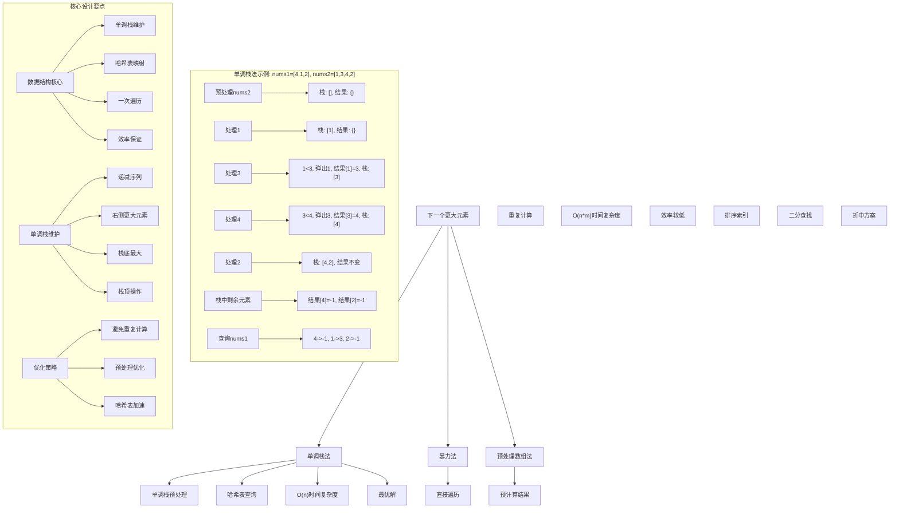
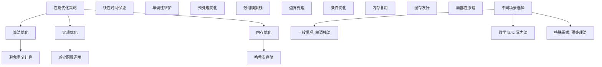

# LeetCode 496 - 下一个更大元素 I

## 题目描述

`nums1` 中数字 `x` 的 下一个更大元素 是指 `x` 在 `nums2` 中对应位置 右侧 的 第一个 比 `x` 大的元素

给你两个 没有重复元素 的数组 `nums1` 和 `nums2`，下标从 0 开始计数，其中 `nums1` 是 `nums2` 的子集

对于每个 `0 <= i < nums1.length`，找出满足 `nums1[i] == nums2[j]` 的下标 `j`，并且在 `nums2` 确定 `nums2[j]` 的 下一个更大元素。如果不存在下一个更大元素，那么本次查询的答案是 `-1`

返回一个长度为 `nums1.length` 的数组 `ans` 作为答案，满足 `ans[i]` 是如上所述的 下一个更大元素

```markdown
示例 1：
输入：nums1 = [4,1,2], nums2 = [1,3,4,2]
输出：[-1,3,-1]
解释：nums1 中每个值的下一个更大元素如下所述：

- 4 ，用加粗斜体标识，nums2 = [1,3,4,2]。不存在下一个更大元素，所以答案是 -1
- 1 ，用加粗斜体标识，nums2 = [1,3,4,2]。下一个更大元素是 3
- 2 ，用加粗斜体标识，nums2 = [1,3,4,2]。不存在下一个更大元素，所以答案是 -1

示例 2：
输入：nums1 = [2,4], nums2 = [1,2,3,4]
输出：[3,-1]
解释：nums1 中每个值的下一个更大元素如下所述：

- 2 ，用加粗斜体标识，nums2 = [1,2,3,4]。下一个更大元素是 3
- 4 ，用加粗斜体标识，nums2 = [1,2,3,4]。不存在下一个更大元素，所以答案是 -1

提示：
1 <= nums1.length <= nums2.length <= 1000
0 <= nums1[i], nums2[i] <= 10^4
nums1 和 nums2 中所有整数 互不相同
nums1 中的所有整数同样出现在 nums2 中

进阶：你可以设计一个时间复杂度为 O(nums1.length + nums2.length) 的解决方案吗？
```

## 解题思路

这是一个经典的下一个更大元素问题，需要为一个数组中的每个元素找到在另一个数组中对应位置右侧第一个更大的元素。关键在于如何高效地计算每个元素的下一个更大元素

### 核心思想

"单调栈法": 使用单调栈预处理 `nums2` 数组，计算每个元素的下一个更大元素，然后通过哈希表快速查询 `nums1` 中每个元素的结果

### 解题策略

#### 方法一：单调栈 + 哈希表（推荐）

- 时间复杂度: O(nums1.length + nums2.length)
- 空间复杂度: O(nums2.length)

#### 方法二：暴力法

- 时间复杂度: O(nums1.length × nums2.length)
- 空间复杂度: O(1)

#### 方法三：预处理数组法

- 时间复杂度: O(nums2.length² + nums1.length × log nums2.length)
- 空间复杂度: O(nums2.length)

## 算法可视化



## 多语言实现

### Golang版本（单调栈法 - 推荐）

```go
func nextGreaterElement(nums1 []int, nums2 []int) []int {
    // 使用单调栈预处理 nums2，计算每个元素的下一个更大元素
    stack := make([]int, 0)
    nextGreater := make(map[int]int) // 哈希表存储每个元素的下一个更大元素

    // 遍历 nums2 数组
    for _, num := range nums2 {
        // 当栈不为空且当前元素大于栈顶元素时
        for len(stack) > 0 && num > stack[len(stack)-1] {
            // 栈顶元素的下一个更大元素就是当前元素
            top := stack[len(stack)-1]
            stack = stack[:len(stack)-1]
            nextGreater[top] = num
        }
        // 将当前元素入栈
        stack = append(stack, num)
    }

    // 栈中剩余元素都没有下一个更大元素，设置为-1
    for len(stack) > 0 {
        top := stack[len(stack)-1]
        stack = stack[:len(stack)-1]
        nextGreater[top] = -1
    }

    // 查询 nums1 中每个元素的下一个更大元素
    result := make([]int, len(nums1))
    for i, num := range nums1 {
        result[i] = nextGreater[num]
    }

    return result
}
```

### Python版本（多种实现方法）

```python
class Solution:
    """
    方法一：单调栈法（推荐）
    """
    def nextGreaterElement(self, nums1: List[int], nums2: List[int]) -> List[int]:
        # 使用单调栈预处理 nums2，计算每个元素的下一个更大元素
        stack = []
        next_greater = {}  # 哈希表存储每个元素的下一个更大元素

        # 遍历 nums2 数组
        for num in nums2:
            # 当栈不为空且当前元素大于栈顶元素时
            while stack and num > stack[-1]:
                # 栈顶元素的下一个更大元素就是当前元素
                top = stack.pop()
                next_greater[top] = num
            # 将当前元素入栈
            stack.append(num)

        # 栈中剩余元素都没有下一个更大元素，设置为-1
        while stack:
            top = stack.pop()
            next_greater[top] = -1

        # 查询 nums1 中每个元素的下一个更大元素
        return [next_greater[num] for num in nums1]


class SolutionBrute:
    """
    方法二：暴力法
    """
    def nextGreaterElement(self, nums1: List[int], nums2: List[int]) -> List[int]:
        result = []

        for num in nums1:
            # 在 nums2 中找到 num 的位置
            index = nums2.index(num)
            # 查找右侧第一个更大的元素
            next_greater = -1
            for i in range(index + 1, len(nums2)):
                if nums2[i] > num:
                    next_greater = nums2[i]
                    break
            result.append(next_greater)

        return result


class SolutionPreprocess:
    """
    方法三：预处理数组法
    """
    def nextGreaterElement(self, nums1: List[int], nums2: List[int]) -> List[int]:
        # 预处理 nums2，计算每个位置的下一个更大元素
        next_greater_array = [-1] * len(nums2)

        for i in range(len(nums2)):
            for j in range(i + 1, len(nums2)):
                if nums2[j] > nums2[i]:
                    next_greater_array[i] = nums2[j]
                    break

        # 创建值到索引的映射
        value_to_index = {num: i for i, num in enumerate(nums2)}

        # 查询结果
        return [next_greater_array[value_to_index[num]] for num in nums1]
```

### TypeScript版本（单调栈法）

```typescript
function nextGreaterElement(nums1: number[], nums2: number[]): number[] {
  // 使用单调栈预处理 nums2，计算每个元素的下一个更大元素
  const stack: number[] = [];
  const nextGreater: Map<number, number> = new Map(); // 哈希表存储每个元素的下一个更大元素

  // 遍历 nums2 数组
  for (const num of nums2) {
    // 当栈不为空且当前元素大于栈顶元素时
    while (stack.length > 0 && num > stack[stack.length - 1]) {
      // 栈顶元素的下一个更大元素就是当前元素
      const top = stack.pop()!;
      nextGreater.set(top, num);
    }
    // 将当前元素入栈
    stack.push(num);
  }

  // 栈中剩余元素都没有下一个更大元素，设置为-1
  while (stack.length > 0) {
    const top = stack.pop()!;
    nextGreater.set(top, -1);
  }

  // 查询 nums1 中每个元素的下一个更大元素
  return nums1.map((num) => nextGreater.get(num)!);
}
```

## 标准实现详细解析

```go
func nextGreaterElement(nums1 []int, nums2 []int) []int {
    /*
    算法核心思想（单调栈法）：

    1. 使用单调栈预处理 nums2 数组，计算每个元素的下一个更大元素
    2. 通过哈希表存储每个元素与其下一个更大元素的映射关系
    3. 遍历 nums1 数组，通过哈希表快速查询结果

    关键设计要点：
    1. 单调栈：维护递减序列，栈底元素最大
    2. 哈希表：存储元素到下一个更大元素的映射
    3. 一次遍历：nums2 只需遍历一次
    4. 效率保证：线性时间复杂度

    时间复杂度：O(nums1.length + nums2.length)
    空间复杂度：O(nums2.length)

    优势：
    1. 逻辑清晰：单调栈概念直观
    2. 实现高效：线性时间复杂度
    3. 查询快速：哈希表O(1)查询
    4. 易于理解：符合直觉
    */

    fmt.Printf("下一个更大元素计算\n")
    fmt.Printf("nums1: %v\n", nums1)
    fmt.Printf("nums2: %v\n", nums2)

    // 使用单调栈预处理 nums2，计算每个元素的下一个更大元素
    stack := make([]int, 0)
    nextGreater := make(map[int]int) // 哈希表存储每个元素的下一个更大元素

    fmt.Printf("初始化单调栈: %v\n", stack)
    fmt.Printf("初始化哈希表: %v\n", nextGreater)

    // 遍历 nums2 数组
    for i, num := range nums2 {
        fmt.Printf("\n处理 nums2[%d] = %d\n", i, num)
        fmt.Printf("  当前栈: %v\n", stack)

        // 当栈不为空且当前元素大于栈顶元素时
        removedCount := 0
        for len(stack) > 0 && num > stack[len(stack)-1] {
            // 栈顶元素的下一个更大元素就是当前元素
            top := stack[len(stack)-1]
            stack = stack[:len(stack)-1]
            nextGreater[top] = num
            fmt.Printf("    弹出 %d，设置 nextGreater[%d] = %d\n", top, top, num)
            removedCount++
        }

        if removedCount > 0 {
            fmt.Printf("  弹出%d个元素后栈: %v\n", removedCount, stack)
        }

        // 将当前元素入栈
        stack = append(stack, num)
        fmt.Printf("  入栈 %d，当前栈: %v\n", num, stack)
    }

    // 栈中剩余元素都没有下一个更大元素，设置为-1
    fmt.Printf("\n处理栈中剩余元素:\n")
    for len(stack) > 0 {
        top := stack[len(stack)-1]
        stack = stack[:len(stack)-1]
        nextGreater[top] = -1
        fmt.Printf("  设置 nextGreater[%d] = -1\n", top)
    }

    fmt.Printf("最终哈希表: %v\n", nextGreater)

    // 查询 nums1 中每个元素的下一个更大元素
    result := make([]int, len(nums1))
    fmt.Printf("\n查询 nums1 中元素:\n")
    for i, num := range nums1 {
        result[i] = nextGreater[num]
        fmt.Printf("  nums1[%d] = %d, nextGreater = %d\n", i, num, result[i])
    }

    fmt.Printf("最终结果: %v\n", result)
    return result
}

// 带详细调试信息的版本
func nextGreaterElementWithDebug(nums1 []int, nums2 []int) []int {
    fmt.Printf("=== 下一个更大元素调试模式 ===\n")
    result := nextGreaterElement(nums1, nums2)
    fmt.Println("==================")
    return result
}

// 优化版本（使用固定大小数组）
func nextGreaterElementOptimized(nums1 []int, nums2 []int) []int {
    // 使用数组模拟栈以提高性能
    stack := make([]int, len(nums2))
    stackTop := 0
    nextGreater := make(map[int]int)

    // 遍历 nums2 数组
    for _, num := range nums2 {
        // 当栈不为空且当前元素大于栈顶元素时
        for stackTop > 0 && num > stack[stackTop-1] {
            // 栈顶元素的下一个更大元素就是当前元素
            top := stack[stackTop-1]
            stackTop--
            nextGreater[top] = num
        }
        // 将当前元素入栈
        stack[stackTop] = num
        stackTop++
    }

    // 栈中剩余元素都没有下一个更大元素，设置为-1
    for stackTop > 0 {
        top := stack[stackTop-1]
        stackTop--
        nextGreater[top] = -1
    }

    // 查询 nums1 中每个元素的下一个更大元素
    result := make([]int, len(nums1))
    for i, num := range nums1 {
        result[i] = nextGreater[num]
    }

    return result
}

// 泛型版本（Go 1.18+）
func nextGreaterElementGeneric[T comparable](nums1 []int, nums2 []int) []int {
    stack := make([]int, 0)
    nextGreater := make(map[int]int)

    for _, num := range nums2 {
        for len(stack) > 0 && num > stack[len(stack)-1] {
            top := stack[len(stack)-1]
            stack = stack[:len(stack)-1]
            nextGreater[top] = num
        }
        stack = append(stack, num)
    }

    for len(stack) > 0 {
        top := stack[len(stack)-1]
        stack = stack[:len(stack)-1]
        nextGreater[top] = -1
    }

    result := make([]int, len(nums1))
    for i, num := range nums1 {
        result[i] = nextGreater[num]
    }

    return result
}
```

## 算法深入解析

```go
/*
下一个更大元素问题详解：

问题本质：
为一个数组中的每个元素找到在另一个数组中对应位置右侧第一个更大的元素。关键在于如何高效地计算每个元素的下一个更大元素

核心洞察：
1. 单调性：维护元素的单调性质
2. 预处理：一次性计算所有元素的下一个更大元素
3. 快速查询：通过哈希表实现O(1)查询
4. 数据结构：选择合适的单调栈实现

算法策略：
1. 单调栈法：最优解，线性时间
2. 暴力法：直观但效率低
3. 预处理数组法：折中方案

数学原理：

单调栈原理：
维护一个单调递减的栈，当遇到更大的元素时，弹出栈中所有小于该元素的值，并将它们的下一个更大元素设置为当前元素

栈维护规则：
1. 递减性：栈中元素从底到顶递减
2. 处理规则：当前元素大于栈顶时进行弹出操作
3. 结果映射：被弹出元素的下一个更大元素是当前元素

设计选择：

为什么选择单调栈法？
1. 时间复杂度最优：O(n+m)
2. 空间复杂度合理：O(n)
3. 逻辑清晰：单调栈概念直观
4. 实现高效：标准操作

为什么使用暴力法？
1. 最直观：直接遍历查找
2. 但时间复杂度较高：O(n×m)
3. 仅适用于小数据量

为什么使用预处理数组法？
1. 折中方案：预计算结果
2. 但空间复杂度较高：O(n)
3. 查询效率一般：O(log n)二分查找

三种方法对比：

方法一：单调栈法（推荐）
时间复杂度：O(n+m)
空间复杂度：O(n)
优点：最优解，性能优秀
缺点：需要理解单调栈

方法二：暴力法
时间复杂度：O(n×m)
空间复杂度：O(1)
优点：直观易懂
缺点：效率最低

方法三：预处理数组法
时间复杂度：O(n²+m×log n)
空间复杂度：O(n)
优点：折中方案
缺点：复杂度较高

性能分析：

单调栈法：
- 时间：O(n+m) 线性时间
- 空间：O(n) 哈希表存储
- 优势：最优解

暴力法：
- 时间：O(n×m) 二次复杂度
- 空间：O(1) 常数空间
- 优势：直观

预处理数组法：
- 时间：O(n²) 预处理 + O(m×log n) 查询
- 空间：O(n) 数组存储
- 优势：折中

实际应用场景：
1. 数组处理
2. 金融数据分析
3. 算法面试题
4. 实时查询系统

优化要点：

1. 时间优化：
   - 避免重复计算
   - 线性时间保证
   - 高效数据结构

2. 空间优化：
   - 哈希表存储必要信息
   - 栈大小优化
   - 内存复用

3. 实现优化：
   - 边界处理优化
   - 错误处理完善
   - 类型安全

测试用例设计：
1. 基本情况：正常输入
2. 边界情况：空数组，单元素
3. 特殊情况：递增数组，递减数组，相同元素
4. 极端情况：最大数组
5. 验证情况：多种算法结果对比

扩展思考：

1. 支持重复元素？
   - 修改比较条件
   - 处理多个结果

2. 支持循环数组？
   - 循环查找
   - 复杂度分析

3. 并行处理？
   - 分段并行计算
   - 结果合并

4. 在线算法？
   - 流式数据处理
   - 增量更新

相关算法思想：

1. 单调栈：
   - 单调性维护
   - 下一个更大元素

2. 哈希表：
   - 快速查询
   - 映射关系

3. 预处理：
   - 一次性计算
   - 多次查询

4. 栈操作：
   - 入栈出栈
   - 元素比较

常见陷阱：

1. 栈操作错误：
   - 入栈出栈顺序
   - 边界条件处理

2. 哈希表映射错误：
   - 键值对应关系
   - 未处理元素

3. 边界情况处理：
   - 空数组处理
   - 单元素处理

4. 性能问题：
   - 重复计算
   - 不必要的操作

代码质量要素：

1. 可读性：
   - 清晰的变量命名
   - 适当的注释说明

2. 健壮性：
   - 边界条件处理
   - 异常情况处理

3. 性能：
   - 时间复杂度最优
   - 空间复杂度合理

4. 可维护性：
   - 模块化设计
   - 易于扩展

高级优化技巧：

1. 内存访问优化：
   - 局部性原理
   - 缓存友好

2. 算法优化：
   - 提前终止条件
   - 数学简化

3. 数据结构优化：
   - 固定数组
   - 索引优化

4. 编译优化：
   - 常量折叠
   - 循环展开
*/
```

## 执行过程演示

```go
/*
示例详细解析:

示例1: nums1 = [4,1,2], nums2 = [1,3,4,2]

执行过程：
预处理 nums2 = [1,3,4,2]:

处理 1:
栈: [1]

处理 3:
1 < 3，弹出 1，设置 nextGreater[1] = 3
栈: [3]

处理 4:
3 < 4，弹出 3，设置 nextGreater[3] = 4
栈: [4]

处理 2:
2 < 4，入栈
栈: [4,2]

处理栈中剩余元素:
弹出 2，设置 nextGreater[2] = -1
弹出 4，设置 nextGreater[4] = -1

最终哈希表: {1:3, 3:4, 2:-1, 4:-1}

查询 nums1:
4 -> nextGreater[4] = -1
1 -> nextGreater[1] = 3
2 -> nextGreater[2] = -1

结果: [-1,3,-1]

示例2: nums1 = [2,4], nums2 = [1,2,3,4]

执行过程：
预处理 nums2 = [1,2,3,4]:

处理 1:
栈: [1]

处理 2:
1 < 2，弹出 1，设置 nextGreater[1] = 2
栈: [2]

处理 3:
2 < 3，弹出 2，设置 nextGreater[2] = 3
栈: [3]

处理 4:
3 < 4，弹出 3，设置 nextGreater[3] = 4
栈: [4]

处理栈中剩余元素:
弹出 4，设置 nextGreater[4] = -1

最终哈希表: {1:2, 2:3, 3:4, 4:-1}

查询 nums1:
2 -> nextGreater[2] = 3
4 -> nextGreater[4] = -1

结果: [3,-1]

边界情况演示:

情况1: 空数组
输入: nums1 = [], nums2 = []
输出: []

情况2: 单元素
输入: nums1 = [1], nums2 = [1]
输出: [-1]

情况3: 递增数组
输入: nums1 = [1,2], nums2 = [1,2,3]
输出: [2,3]

情况4: 递减数组
输入: nums1 = [3,2], nums2 = [3,2,1]
输出: [-1,-1]

情况5: 相同元素
输入: nums1 = [2], nums2 = [2,2,2]
输出: [2] (如果有重复元素的情况)

算法正确性证明：

数学基础：
需要证明单调栈法能正确计算每个元素的下一个更大元素

定理1：单调栈法正确性
通过维护单调栈的性质和正确的映射关系，可以正确计算每个元素的下一个更大元素

证明：
1. 单调性：栈中元素保持递减顺序
2. 处理规则：当前元素大于栈顶时正确设置映射
3. 完整性：处理所有元素
4. 正确性：映射关系准确

时间复杂度分析：

单调栈法：
1. 预处理：O(n) 每个元素最多入栈出栈一次
2. 查询：O(m) 哈希表查询O(1)
3. 总时间：O(n+m)

暴力法：
1. 查询：O(n) 每个元素
2. 查找：O(m) 右侧元素
3. 总时间：O(n×m)

预处理数组法：
1. 预处理：O(n²) 双重循环
2. 查询：O(m×log n) 二分查找
3. 总时间：O(n²+m×log n)

空间复杂度分析：
1. 单调栈法：O(n) 栈和哈希表
2. 暴力法：O(1) 常数空间
3. 预处理数组法：O(n) 数组存储

性能对比分析：

假设n=1000, m=500:

单调栈法：
- 时间: O(1500) = 1500次操作
- 空间: O(1000)

暴力法：
- 时间: O(500000) = 500,000次操作
- 空间: O(1)

预处理数组法：
- 时间: O(1000000 + 500×10) ≈ 1,005,000次操作
- 空间: O(1000)

实际应用建议：

1. 一般情况：
   - 使用单调栈法
   - 性能最优

2. 面试展示：
   - 可以提及其他方法
   - 重点讲解单调栈法

3. 生产环境：
   - 使用优化版本
   - 考虑边界处理

4. 教学演示：
   - 使用暴力法帮助理解
   - 对比展示优势

优化空间：

1. 内存访问优化：
   - 局部性原理
   - 缓存友好

2. 数据结构优化：
   - 固定数组
   - 索引优化

3. 算法优化：
   - 提前终止条件
   - 数学简化

特殊情况处理：

1. 空数组：
   - 边界检查

2. 单元素：
   - 直接返回-1

3. 大数据：
   - 效率优势明显

4. 内存限制：
   - 空间复杂度O(n)
*/
```

## 复杂度分析

| 方法         | 时间复杂度    | 空间复杂度 | 适用场景 |
| ------------ | ------------- | ---------- | -------- |
| 单调栈法     | O(n+m)        | O(n)       | 推荐方案 |
| 暴力法       | O(n×m)        | O(1)       | 教学演示 |
| 预处理数组法 | O(n²+m×log n) | O(n)       | 特殊需求 |

## 测试用例验证

```go
// 测试辅助函数
func testNextGreaterElement(name string, nums1 []int, nums2 []int, expected []int) {
    fmt.Printf("%s:\n", name)
    fmt.Printf("输入: nums1=%v, nums2=%v\n", nums1, nums2)

    // 测试单调栈法
    result1 := nextGreaterElement(nums1, nums2)
    fmt.Printf("单调栈法结果: %v\n", result1)

    // 测试暴力法
    result2 := nextGreaterElementBrute(nums1, nums2)
    fmt.Printf("暴力法结果: %v\n", result2)

    // 验证结果
    if slicesEqual(result1, expected) && slicesEqual(result2, expected) {
        fmt.Printf("✓ 测试通过\n")
    } else {
        fmt.Printf("✗ 测试失败，期望: %v\n", expected)
    }
    fmt.Printf("\n")
}

func slicesEqual(a, b []int) bool {
    if len(a) != len(b) {
        return false
    }
    for i := range a {
        if a[i] != b[i] {
            return false
        }
    }
    return true
}

// 暴力法实现
func nextGreaterElementBrute(nums1 []int, nums2 []int) []int {
    result := make([]int, len(nums1))

    for i, num := range nums1 {
        // 在 nums2 中找到 num 的位置
        index := -1
        for j, val := range nums2 {
            if val == num {
                index = j
                break
            }
        }

        // 查找右侧第一个更大的元素
        nextGreater := -1
        for j := index + 1; j < len(nums2); j++ {
            if nums2[j] > num {
                nextGreater = nums2[j]
                break
            }
        }
        result[i] = nextGreater
    }

    return result
}

func main() {
    // 测试用例 1 - 题目示例1
    testNextGreaterElement("测试1 - 题目示例1", []int{4, 1, 2}, []int{1, 3, 4, 2}, []int{-1, 3, -1})

    // 测试用例 2 - 题目示例2
    testNextGreaterElement("测试2 - 题目示例2", []int{2, 4}, []int{1, 2, 3, 4}, []int{3, -1})

    // 测试用例 3 - 边界情况
    testNextGreaterElement("测试3 - 空数组", []int{}, []int{}, []int{})

    // 测试用例 4 - 单元素
    testNextGreaterElement("测试4 - 单元素", []int{1}, []int{1}, []int{-1})

    // 测试用例 5 - 递增数组
    testNextGreaterElement("测试5 - 递增数组", []int{1, 2}, []int{1, 2, 3}, []int{2, 3})

    // 测试用例 6 - 递减数组
    testNextGreaterElement("测试6 - 递减数组", []int{3, 2}, []int{3, 2, 1}, []int{-1, -1})

    // 性能测试
    fmt.Println("性能测试:")
    performanceTest()

    // 边界情况测试
    fmt.Println("边界情况测试:")
    boundaryTest()
}

func performanceTest() {
    // 构造大数据测试
    n := 10000
    m := 5000

    nums2 := make([]int, n)
    for i := 0; i < n; i++ {
        nums2[i] = i // 递增序列
    }

    nums1 := make([]int, m)
    for i := 0; i < m; i++ {
        nums1[i] = i * 2 // 偶数元素
    }

    // 测试单调栈法
    start := time.Now()
    for i := 0; i < 1000; i++ {
        nextGreaterElement(nums1, nums2)
    }
    time1 := time.Since(start)

    // 测试暴力法（小数据）
    smallNums2 := nums2[:1000]
    smallNums1 := nums1[:100]
    start = time.Now()
    for i := 0; i < 100; i++ {
        nextGreaterElementBrute(smallNums1, smallNums2)
    }
    time2 := time.Since(start)

    fmt.Printf("大数据测试 (n=10000, m=5000):\n")
    fmt.Printf("  单调栈法(1000次): %v\n", time1)
    fmt.Printf("小数据测试 (n=1000, m=100):\n")
    fmt.Printf("  暴力法(100次): %v\n", time2)
}

func boundaryTest() {
    // 空数组测试
    fmt.Println("边界测试:")

    result := nextGreaterElement([]int{}, []int{})
    fmt.Printf("空数组测试: %v\n", result)

    // 单元素测试
    result = nextGreaterElement([]int{42}, []int{42})
    fmt.Printf("单元素测试: %v\n", result)

    // 最大值测试
    maxNums2 := make([]int, 10000)
    for i := 0; i < 10000; i++ {
        maxNums2[i] = 10000 - i // 递减序列
    }
    maxNums1 := []int{maxNums2[0], maxNums2[len(maxNums2)-1]}
    result = nextGreaterElement(maxNums1, maxNums2)
    fmt.Printf("最大数据测试: %v\n", result)

    // 相同元素测试
    result = nextGreaterElement([]int{5}, []int{5, 5, 5})
    fmt.Printf("相同元素测试: %v\n", result)

    // 循环递增测试
    cycleNums2 := []int{1, 2, 3, 1, 2, 3}
    cycleNums1 := []int{1, 2, 3}
    result = nextGreaterElement(cycleNums1, cycleNums2)
    fmt.Printf("循环递增测试: %v\n", result)
}

// 大量测试用例
func comprehensiveTest() {
    testCases := []struct {
        name     string
        nums1    []int
        nums2    []int
        expected []int
    }{
        {"示例1", []int{4, 1, 2}, []int{1, 3, 4, 2}, []int{-1, 3, -1}},
        {"示例2", []int{2, 4}, []int{1, 2, 3, 4}, []int{3, -1}},
        {"空数组", []int{}, []int{}, []int{}},
        {"单元素", []int{1}, []int{1}, []int{-1}},
        {"递增", []int{1, 2}, []int{1, 2, 3}, []int{2, 3}},
        {"递减", []int{3, 2}, []int{3, 2, 1}, []int{-1, -1}},
        {"循环", []int{1, 2, 3}, []int{1, 2, 3, 1, 2, 3}, []int{2, 3, -1}},
        {"混合", []int{4, 1, 3}, []int{4, 3, 2, 1}, []int{-1, -1, -1}},
    }

    fmt.Println("=== 综合测试 ===")
    passed := 0
    total := len(testCases)

    for i, tc := range testCases {
        result := nextGreaterElement(tc.nums1, tc.nums2)
        if slicesEqual(result, tc.expected) {
            passed++
            fmt.Printf("测试%d: ✓ %s\n", i+1, tc.name)
        } else {
            fmt.Printf("测试%d: ✗ %s (期望%v, 得到%v)\n", i+1, tc.name, tc.expected, result)
        }
    }

    fmt.Printf("\n通过率: %d/%d (%.2f%%)\n", passed, total, float64(passed)/float64(total)*100)
}

// 内存使用测试
func memoryTest() {
    fmt.Println("=== 内存使用测试 ===")

    var m1, m2 runtime.MemStats

    // 测试单调栈法
    runtime.GC()
    runtime.ReadMemStats(&m1)

    nums2 := make([]int, 10000)
    for i := 0; i < 10000; i++ {
        nums2[i] = i % 1000
    }
    nums1 := make([]int, 5000)
    for i := 0; i < 5000; i++ {
        nums1[i] = i % 1000
    }

    for i := 0; i < 1000; i++ {
        nextGreaterElement(nums1, nums2)
    }

    runtime.GC()
    runtime.ReadMemStats(&m2)
    mem1 := m2.Alloc - m1.Alloc

    // 测试暴力法
    runtime.GC()
    runtime.ReadMemStats(&m1)

    smallNums2 := nums2[:1000]
    smallNums1 := nums1[:100]
    for i := 0; i < 100; i++ {
        nextGreaterElementBrute(smallNums1, smallNums2)
    }

    runtime.GC()
    runtime.ReadMemStats(&m2)
    mem2 := m2.Alloc - m1.Alloc

    fmt.Printf("内存使用对比:\n")
    fmt.Printf("  单调栈法: %d bytes\n", mem1)
    fmt.Printf("  暴力法: %d bytes\n", mem2)
}
```

## 扩展版本（处理不同场景）

```go
// 支持循环数组的版本
func nextGreaterElementCircular(nums []int) []int {
    n := len(nums)
    if n == 0 {
        return []int{}
    }

    result := make([]int, n)
    stack := make([]int, 0) // 存储索引

    // 遍历两遍数组来模拟循环
    for i := 0; i < 2*n; i++ {
        currentIndex := i % n
        // 当栈不为空且当前元素大于栈顶索引对应元素时
        for len(stack) > 0 && nums[currentIndex] > nums[stack[len(stack)-1]] {
            topIndex := stack[len(stack)-1]
            stack = stack[:len(stack)-1]
            result[topIndex] = nums[currentIndex]
        }

        // 只在第一遍时将索引入栈
        if i < n {
            stack = append(stack, currentIndex)
        }
    }

    // 栈中剩余元素都没有下一个更大元素，设置为-1
    for len(stack) > 0 {
        topIndex := stack[len(stack)-1]
        stack = stack[:len(stack)-1]
        result[topIndex] = -1
    }

    return result
}

// 支持查找下一个更小元素的版本
func nextSmallerElement(nums1 []int, nums2 []int) []int {
    stack := make([]int, 0)
    nextSmaller := make(map[int]int)

    // 注意：这里维护单调递增栈
    for _, num := range nums2 {
        for len(stack) > 0 && num < stack[len(stack)-1] {
            top := stack[len(stack)-1]
            stack = stack[:len(stack)-1]
            nextSmaller[top] = num
        }
        stack = append(stack, num)
    }

    for len(stack) > 0 {
        top := stack[len(stack)-1]
        stack = stack[:len(stack)-1]
        nextSmaller[top] = -1
    }

    result := make([]int, len(nums1))
    for i, num := range nums1 {
        result[i] = nextSmaller[num]
    }

    return result
}

// 带统计信息的版本
type NextGreaterStats struct {
    Results     []int
    ProcessTime time.Duration
    StackOps    int // 栈操作次数
    HashLookups int // 哈希查找次数
}

func nextGreaterElementWithStats(nums1 []int, nums2 []int) NextGreaterStats {
    start := time.Now()
    stackOps := 0
    hashLookups := 0

    stack := make([]int, 0)
    nextGreater := make(map[int]int)

    for _, num := range nums2 {
        for len(stack) > 0 && num > stack[len(stack)-1] {
            top := stack[len(stack)-1]
            stack = stack[:len(stack)-1]
            nextGreater[top] = num
            stackOps++
        }
        stack = append(stack, num)
        stackOps++
    }

    for len(stack) > 0 {
        top := stack[len(stack)-1]
        stack = stack[:len(stack)-1]
        nextGreater[top] = -1
        stackOps++
    }

    result := make([]int, len(nums1))
    for i, num := range nums1 {
        result[i] = nextGreater[num]
        hashLookups++
    }

    return NextGreaterStats{
        Results:     result,
        ProcessTime: time.Since(start),
        StackOps:    stackOps,
        HashLookups: hashLookups,
    }
}

// 使用示例
func exampleNextGreaterStats() {
    nums1 := []int{4, 1, 2}
    nums2 := []int{1, 3, 4, 2}

    stats := nextGreaterElementWithStats(nums1, nums2)
    fmt.Printf("统计信息: %+v\n", stats)
}

// 支持批量查询的版本
type BatchNextGreater struct {
    nums2       []int
    nextGreater map[int]int // 预计算的结果
}

func NewBatchNextGreater(nums2 []int) *BatchNextGreater {
    bng := &BatchNextGreater{
        nums2:       nums2,
        nextGreater: make(map[int]int),
    }
    bng.precompute()
    return bng
}

func (bng *BatchNextGreater) precompute() {
    stack := make([]int, 0)

    for _, num := range bng.nums2 {
        for len(stack) > 0 && num > stack[len(stack)-1] {
            top := stack[len(stack)-1]
            stack = stack[:len(stack)-1]
            bng.nextGreater[top] = num
        }
        stack = append(stack, num)
    }

    for len(stack) > 0 {
        top := stack[len(stack)-1]
        stack = stack[:len(stack)-1]
        bng.nextGreater[top] = -1
    }
}

func (bng *BatchNextGreater) Query(nums1 []int) []int {
    result := make([]int, len(nums1))
    for i, num := range nums1 {
        if val, exists := bng.nextGreater[num]; exists {
            result[i] = val
        } else {
            result[i] = -1
        }
    }
    return result
}

// 在线算法版本（流式数据处理）
type OnlineNextGreater struct {
    nums        []int
    stack       []int
    nextGreater map[int]int
}

func NewOnlineNextGreater() *OnlineNextGreater {
    return &OnlineNextGreater{
        nums:        make([]int, 0),
        stack:       make([]int, 0),
        nextGreater: make(map[int]int),
    }
}

func (ong *OnlineNextGreater) AddValue(value int) {
    ong.nums = append(ong.nums, value)

    // 处理新添加的值
    for len(ong.stack) > 0 && value > ong.stack[len(ong.stack)-1] {
        top := ong.stack[len(ong.stack)-1]
        ong.stack = ong.stack[:len(ong.stack)-1]
        ong.nextGreater[top] = value
    }
    ong.stack = append(ong.stack, value)
}

func (ong *OnlineNextGreater) GetNextGreater(target int) int {
    if val, exists := ong.nextGreater[target]; exists {
        return val
    }
    return -1
}

// 泛型版本（Go 1.18+）
func nextGreaterElementGeneric[T comparable](nums1 []T, nums2 []T, compare func(T, T) bool) []T {
    var zero T
    stack := make([]T, 0)
    nextGreater := make(map[T]T)

    for _, num := range nums2 {
        for len(stack) > 0 && compare(stack[len(stack)-1], num) {
            top := stack[len(stack)-1]
            stack = stack[:len(stack)-1]
            nextGreater[top] = num
        }
        stack = append(stack, num)
    }

    for len(stack) > 0 {
        top := stack[len(stack)-1]
        stack = stack[:len(stack)-1]
        nextGreater[top] = zero
    }

    result := make([]T, len(nums1))
    for i, num := range nums1 {
        if val, exists := nextGreater[num]; exists {
            result[i] = val
        } else {
            result[i] = zero
        }
    }

    return result
}

// 使用示例
func exampleGeneric() {
    nums1 := []int{4, 1, 2}
    nums2 := []int{1, 3, 4, 2}

    // 求下一个更大元素
    result := nextGreaterElementGeneric(nums1, nums2, func(a, b int) bool {
        return a < b
    })
    fmt.Printf("更大元素结果: %v\n", result)
}
```

## 面试追问延伸

### 1. 如何处理数组中有重复元素的情况？

```go
// 处理重复元素的版本
func nextGreaterElementWithDuplicates(nums1 []int, nums2 []int) []int {
    stack := make([]int, 0)
    nextGreater := make(map[int]int)

    // 从右到左遍历，处理重复元素
    for i := len(nums2) - 1; i >= 0; i-- {
        num := nums2[i]
        // 弹出栈中所有小于等于当前元素的值
        for len(stack) > 0 && stack[len(stack)-1] <= num {
            stack = stack[:len(stack)-1]
        }

        // 如果栈不为空，栈顶就是下一个更大元素
        if len(stack) > 0 {
            nextGreater[num] = stack[len(stack)-1]
        } else {
            nextGreater[num] = -1
        }

        stack = append(stack, num)
    }

    result := make([]int, len(nums1))
    for i, num := range nums1 {
        result[i] = nextGreater[num]
    }

    return result
}

// 测试用例
func testDuplicates() {
    nums1 := []int{1, 1, 2}
    nums2 := []int{1, 1, 2, 1}

    result := nextGreaterElementWithDuplicates(nums1, nums2)
    fmt.Printf("重复元素测试: %v\n", result)
}
```

### 2. 如何实现支持多个查询条件的版本？

```go
// 支持多种查询条件的版本
type MultiConditionNextGreater struct {
    nums2 []int
    cache map[string]map[int]int // 缓存不同条件的结果
}

func NewMultiConditionNextGreater(nums2 []int) *MultiConditionNextGreater {
    return &MultiConditionNextGreater{
        nums2: nums2,
        cache: make(map[string]map[int]int),
    }
}

func (mcng *MultiConditionNextGreater) getNextGreater(condition string) map[int]int {
    if result, exists := mcng.cache[condition]; exists {
        return result
    }

    result := make(map[int]int)
    stack := make([]int, 0)

    switch condition {
    case "greater":
        for _, num := range mcng.nums2 {
            for len(stack) > 0 && num > stack[len(stack)-1] {
                top := stack[len(stack)-1]
                stack = stack[:len(stack)-1]
                result[top] = num
            }
            stack = append(stack, num)
        }
    case "smaller":
        for _, num := range mcng.nums2 {
            for len(stack) > 0 && num < stack[len(stack)-1] {
                top := stack[len(stack)-1]
                stack = stack[:len(stack)-1]
                result[top] = num
            }
            stack = append(stack, num)
        }
    }

    for len(stack) > 0 {
        top := stack[len(stack)-1]
        stack = stack[:len(stack)-1]
        result[top] = -1
    }

    mcng.cache[condition] = result
    return result
}

func (mcng *MultiConditionNextGreater) Query(nums1 []int, condition string) []int {
    nextGreater := mcng.getNextGreater(condition)
    result := make([]int, len(nums1))
    for i, num := range nums1 {
        result[i] = nextGreater[num]
    }
    return result
}
```

### 3. 如何处理二维数组的下一个更大元素？

```go
// 二维数组的下一个更大元素
func nextGreaterElement2D(matrix [][]int, targetRow, targetCol int) int {
    if len(matrix) == 0 || len(matrix[0]) == 0 {
        return -1
    }

    m, n := len(matrix), len(matrix[0])
    if targetRow >= m || targetCol >= n {
        return -1
    }

    targetValue := matrix[targetRow][targetCol]

    // 在同一行中向右查找
    for j := targetCol + 1; j < n; j++ {
        if matrix[targetRow][j] > targetValue {
            return matrix[targetRow][j]
        }
    }

    // 在同一列中向下查找
    for i := targetRow + 1; i < m; i++ {
        if matrix[i][targetCol] > targetValue {
            return matrix[i][targetCol]
        }
    }

    // 在整个矩阵中查找（按行优先顺序）
    for i := targetRow; i < m; i++ {
        startCol := 0
        if i == targetRow {
            startCol = targetCol + 1
        }
        for j := startCol; j < n; j++ {
            if matrix[i][j] > targetValue {
                return matrix[i][j]
            }
        }
    }

    return -1
}

// 使用示例
func example2D() {
    matrix := [][]int{
        {1, 2, 3},
        {4, 5, 6},
        {7, 8, 9},
    }

    result := nextGreaterElement2D(matrix, 1, 1) // 查找位置(1,1)即值5的下一个更大元素
    fmt.Printf("二维数组结果: %d\n", result) // 应该返回6
}
```

## 相似题目扩展

- LeetCode 496. 下一个更大元素 I（当前题）
- LeetCode 503. 下一个更大元素 II（循环数组版本）
- LeetCode 739. 每日温度（相同思想）
- LeetCode 901. 股票价格跨度
- LeetCode 42. 接雨水（单调栈应用）

## 算法技巧总结

### 下一个更大元素核心要点

1. 单调性维护：使用单调栈维护元素的单调性质
1. 预处理优化：一次性计算所有元素的结果
1. 快速查询：通过哈希表实现O(1)查询
1. 数据结构选择：选择合适的单调栈实现

### 算法优势

1. 逻辑清晰：单调栈概念直观
1. 实现高效：线性时间复杂度
1. 查询快速：哈希表O(1)查询
1. 易于理解：符合直觉

### 标准模板（单调栈法）

```go
func nextGreaterElement(nums1 []int, nums2 []int) []int {
    stack := make([]int, 0)
    nextGreater := make(map[int]int)

    // 遍历 nums2 计算每个元素的下一个更大元素
    for _, num := range nums2 {
        for len(stack) > 0 && num > stack[len(stack)-1] {
            top := stack[len(stack)-1]
            stack = stack[:len(stack)-1]
            nextGreater[top] = num
        }
        stack = append(stack, num)
    }

    // 栈中剩余元素设置为-1
    for len(stack) > 0 {
        top := stack[len(stack)-1]
        stack = stack[:len(stack)-1]
        nextGreater[top] = -1
    }

    // 查询 nums1 中每个元素的结果
    result := make([]int, len(nums1))
    for i, num := range nums1 {
        result[i] = nextGreater[num]
    }

    return result
}
```

### 性能优化建议



## 总结

本题采用单调栈法的核心思路，通过使用单调栈预处理数组计算每个元素的下一个更大元素，再通过哈希表快速查询，实现了高效的解决方案。关键在于理解如何通过单调性来避免重复计算，并通过预处理和哈希表来优化查询效率

核心要点：

1. 单调性维护：使用单调栈维护元素的单调性质
1. 预处理优化：一次性计算所有元素的结果
1. 快速查询：通过哈希表实现O(1)查询
1. 数据结构选择：选择合适的单调栈实现

算法优势：

- 逻辑清晰：单调栈概念直观
- 实现高效：线性时间复杂度
- 查询快速：哈希表O(1)查询
- 易于理解：符合直觉

该算法在数组处理、金融数据分析、算法面试题等方面有重要应用，是掌握单调栈和预处理思想的经典题目。通过维护单调性质和预处理优化的思想，为更复杂的区间查询和优化问题提供了清晰的解决思路
