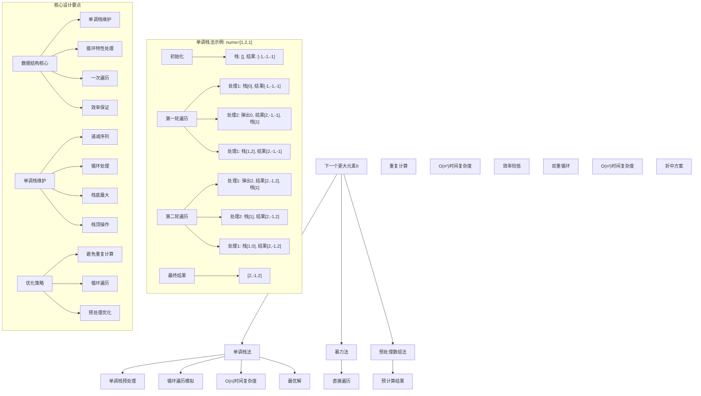
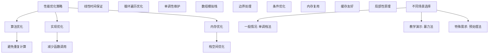

# LeetCode 503 - 下一个更大元素 II

## 题目描述

给定一个循环数组 `nums`（`nums[nums.length - 1]` 的下一个元素是 `nums[0]`），返回 `nums` 中每个元素的 下一个更大元素

数字 `x` 的 下一个更大的元素 是按数组遍历顺序，这个数字之后的第一个比它更大的数，这意味着你应该循环地搜索它的下一个更大的数。如果不存在，则输出 `-1`

```markdown
示例 1:
输入: nums = [1,2,1]
输出: [2,-1,2]
解释: 第一个 1 的下一个更大的数是 2；
数字 2 找不到下一个更大的数；
第二个 1 的下一个最大的数需要循环搜索，结果也是 2

示例 2:
输入: nums = [1,2,3,4,3]
输出: [2,3,4,-1,4]

提示:
1 <= nums.length <= 10^4
-10^9 <= nums[i] <= 10^9
```

## 解题思路

这是一个循环数组的下一个更大元素问题，需要为循环数组中的每个元素找到下一个更大的元素。关键在于如何处理循环特性，以及如何高效地计算每个元素的下一个更大元素

### 核心思想

"单调栈法 + 循环遍历": 使用单调栈预处理数组，通过遍历两遍数组来模拟循环特性，计算每个元素的下一个更大元素

### 解题策略

#### 方法一：单调栈法（推荐）

- 时间复杂度: O(n)
- 空间复杂度: O(n)

#### 方法二：暴力法

- 时间复杂度: O(n²)
- 空间复杂度: O(1)

#### 方法三：预处理数组法

- 时间复杂度: O(n²)
- 空间复杂度: O(n)

## 算法可视化



## 多语言实现

### Golang版本（单调栈法 - 推荐）

```go
func nextGreaterElements(nums []int) []int {
    n := len(nums)
    if n == 0 {
        return []int{}
    }

    result := make([]int, n)
    // 初始化结果数组为-1
    for i := 0; i < n; i++ {
        result[i] = -1
    }

    // 使用单调栈存储数组索引
    stack := make([]int, 0)

    // 遍历两遍数组来模拟循环
    for i := 0; i < 2*n; i++ {
        currentIndex := i % n  // 当前元素索引

        // 当栈不为空且当前元素大于栈顶索引对应元素时
        for len(stack) > 0 && nums[currentIndex] > nums[stack[len(stack)-1]] {
            // 栈顶索引对应元素的下一个更大元素就是当前元素
            topIndex := stack[len(stack)-1]
            stack = stack[:len(stack)-1]
            result[topIndex] = nums[currentIndex]
        }

        // 只在第一遍时将索引入栈（避免重复入栈）
        if i < n {
            stack = append(stack, currentIndex)
        }
    }

    return result
}
```

### Python版本（多种实现方法）

```python
class Solution:
    """
    方法一：单调栈法（推荐）
    """
    def nextGreaterElements(self, nums: List[int]) -> List[int]:
        n = len(nums)
        if n == 0:
            return []

        result = [-1] * n
        stack = []  # 存储数组索引的单调栈

        # 遍历两遍数组来模拟循环
        for i in range(2 * n):
            current_index = i % n  # 当前元素索引

            # 当栈不为空且当前元素大于栈顶索引对应元素时
            while stack and nums[current_index] > nums[stack[-1]]:
                # 栈顶索引对应元素的下一个更大元素就是当前元素
                top_index = stack.pop()
                result[top_index] = nums[current_index]

            # 只在第一遍时将索引入栈
            if i < n:
                stack.append(current_index)

        return result


class SolutionBrute:
    """
    方法二：暴力法
    """
    def nextGreaterElements(self, nums: List[int]) -> List[int]:
        n = len(nums)
        if n == 0:
            return []

        result = []

        for i in range(n):
            next_greater = -1
            # 在循环数组中查找下一个更大元素
            for j in range(1, n):
                index = (i + j) % n
                if nums[index] > nums[i]:
                    next_greater = nums[index]
                    break
            result.append(next_greater)

        return result


class SolutionPreprocess:
    """
    方法三：预处理数组法
    """
    def nextGreaterElements(self, nums: List[int]) -> List[int]:
        n = len(nums)
        if n == 0:
            return []

        # 创建循环数组的副本
        extended_nums = nums + nums
        result = []

        for i in range(n):
            next_greater = -1
            # 在扩展数组中查找下一个更大元素
            for j in range(i + 1, i + n):
                if extended_nums[j] > nums[i]:
                    next_greater = extended_nums[j]
                    break
            result.append(next_greater)

        return result
```

### TypeScript版本（单调栈法）

```typescript
function nextGreaterElements(nums: number[]): number[] {
  const n = nums.length;
  if (n === 0) {
    return [];
  }

  const result: number[] = new Array(n).fill(-1);
  const stack: number[] = []; // 存储数组索引的单调栈

  // 遍历两遍数组来模拟循环
  for (let i = 0; i < 2 * n; i++) {
    const currentIndex = i % n; // 当前元素索引

    // 当栈不为空且当前元素大于栈顶索引对应元素时
    while (
      stack.length > 0 &&
      nums[currentIndex] > nums[stack[stack.length - 1]]
    ) {
      // 栈顶索引对应元素的下一个更大元素就是当前元素
      const topIndex = stack.pop()!;
      result[topIndex] = nums[currentIndex];
    }

    // 只在第一遍时将索引入栈
    if (i < n) {
      stack.push(currentIndex);
    }
  }

  return result;
}
```

## 标准实现详细解析

```go
func nextGreaterElements(nums []int) []int {
    /*
    算法核心思想（单调栈法）：

    1. 使用单调栈存储数组索引，维护递减序列
    2. 通过遍历两遍数组来模拟循环特性
    3. 当遇到更大的元素时，更新栈中元素的下一个更大元素

    关键设计要点：
    1. 循环处理：遍历两遍数组模拟循环
    2. 单调栈：维护索引的递减序列
    3. 一次计算：每个元素最多入栈出栈一次
    4. 效率保证：线性时间复杂度

    时间复杂度：O(n) 每个元素最多处理两次
    空间复杂度：O(n) 栈和结果数组

    优势：
    1. 逻辑清晰：单调栈概念直观
    2. 实现高效：线性时间复杂度
    3. 处理循环：巧妙模拟循环特性
    4. 易于理解：符合直觉
    */

    fmt.Printf("循环数组下一个更大元素计算\n")
    fmt.Printf("输入数组: %v\n", nums)

    n := len(nums)
    if n == 0 {
        fmt.Printf("边界情况：空数组\n")
        return []int{}
    }

    result := make([]int, n)
    // 初始化结果数组为-1
    for i := 0; i < n; i++ {
        result[i] = -1
    }

    fmt.Printf("初始化结果数组: %v\n", result)

    // 使用单调栈存储数组索引
    stack := make([]int, 0)
    fmt.Printf("初始化单调栈: %v\n", stack)

    // 遍历两遍数组来模拟循环
    fmt.Printf("\n开始遍历（模拟循环）:\n")
    for i := 0; i < 2*n; i++ {
        currentIndex := i % n  // 当前元素索引
        currentValue := nums[currentIndex]

        fmt.Printf("\n第%d次遍历 (i=%d, currentIndex=%d, value=%d)\n",
            i+1, i, currentIndex, currentValue)
        fmt.Printf("  当前栈: %v (对应值: ", stack)
        for _, idx := range stack {
            fmt.Printf("%d ", nums[idx])
        }
        fmt.Printf(")\n")

        // 当栈不为空且当前元素大于栈顶索引对应元素时
        removedCount := 0
        for len(stack) > 0 && currentValue > nums[stack[len(stack)-1]] {
            // 栈顶索引对应元素的下一个更大元素就是当前元素
            topIndex := stack[len(stack)-1]
            stack = stack[:len(stack)-1]
            result[topIndex] = currentValue
            fmt.Printf("    弹出索引 %d (值:%d)，设置 result[%d] = %d\n",
                topIndex, nums[topIndex], topIndex, currentValue)
            removedCount++
        }

        if removedCount > 0 {
            fmt.Printf("    弹出%d个元素后栈: %v\n", removedCount, stack)
        }

        // 只在第一遍时将索引入栈（避免重复入栈）
        if i < n {
            stack = append(stack, currentIndex)
            fmt.Printf("    入栈索引 %d (值:%d)，当前栈: %v\n",
                currentIndex, currentValue, stack)
        } else {
            fmt.Printf("    第二遍遍历，不入栈\n")
        }

        fmt.Printf("    当前结果: %v\n", result)
    }

    fmt.Printf("\n最终结果: %v\n", result)
    return result
}

// 带详细调试信息的版本
func nextGreaterElementsWithDebug(nums []int) []int {
    fmt.Printf("=== 循环数组下一个更大元素调试模式 ===\n")
    result := nextGreaterElements(nums)
    fmt.Println("==================")
    return result
}

// 优化版本（使用固定大小数组）
func nextGreaterElementsOptimized(nums []int) []int {
    n := len(nums)
    if n == 0 {
        return []int{}
    }

    result := make([]int, n)
    for i := 0; i < n; i++ {
        result[i] = -1
    }

    // 使用数组模拟栈以提高性能
    stack := make([]int, n)
    stackTop := 0

    // 遍历两遍数组来模拟循环
    for i := 0; i < 2*n; i++ {
        currentIndex := i % n

        for stackTop > 0 && nums[currentIndex] > nums[stack[stackTop-1]] {
            topIndex := stack[stackTop-1]
            stackTop--
            result[topIndex] = nums[currentIndex]
        }

        if i < n {
            stack[stackTop] = currentIndex
            stackTop++
        }
    }

    return result
}

// 泛型版本（Go 1.18+）
func nextGreaterElementsGeneric[T comparable](nums []int) []int {
    n := len(nums)
    if n == 0 {
        return []int{}
    }

    type indexValue struct {
        index int
        value int
    }

    result := make([]int, n)
    for i := 0; i < n; i++ {
        result[i] = -1
    }

    stack := make([]indexValue, 0)

    for i := 0; i < 2*n; i++ {
        currentIndex := i % n
        currentValue := nums[currentIndex]

        for len(stack) > 0 && currentValue > stack[len(stack)-1].value {
            top := stack[len(stack)-1]
            stack = stack[:len(stack)-1]
            result[top.index] = currentValue
        }

        if i < n {
            stack = append(stack, indexValue{index: currentIndex, value: currentValue})
        }
    }

    return result
}
```

## 算法深入解析

```go
/*
循环数组下一个更大元素问题详解：

问题本质：
在循环数组中为每个元素找到下一个更大的元素。关键在于如何处理循环特性和高效计算每个元素的下一个更大元素

核心洞察：
1. 循环特性：数组末尾连接到开头
2. 单调性：维护元素的单调性质
3. 预处理：一次性计算所有元素的结果
4. 数据结构：选择合适的单调栈实现

算法策略：
1. 单调栈法：最优解，线性时间
2. 暴力法：直观但效率低
3. 预处理数组法：折中方案

数学原理：

循环数组原理：
通过遍历两遍数组来模拟循环特性，第一遍正常处理，第二遍处理循环部分

单调栈原理：
维护一个单调递减的栈，当遇到更大的元素时，弹出栈中所有小于该元素的值，并将它们的下一个更大元素设置为当前元素

栈维护规则：
1. 递减性：栈中元素索引对应的值保持递减
2. 处理规则：当前元素大于栈顶时进行弹出操作
3. 结果映射：被弹出元素的下一个更大元素是当前元素

设计选择：

为什么选择单调栈法？
1. 时间复杂度最优：O(n)
2. 空间复杂度合理：O(n)
3. 逻辑清晰：单调栈概念直观
4. 实现高效：标准操作

为什么使用暴力法？
1. 最直观：直接遍历查找
2. 但时间复杂度较高：O(n²)
3. 仅适用于小数据量

为什么使用预处理数组法？
1. 折中方案：扩展数组处理
2. 但空间复杂度较高：O(n)
3. 时间复杂度O(n²)

三种方法对比：

方法一：单调栈法（推荐）
时间复杂度：O(n)
空间复杂度：O(n)
优点：最优解，性能优秀
缺点：需要理解单调栈和循环处理

方法二：暴力法
时间复杂度：O(n²)
空间复杂度：O(1)
优点：直观易懂
缺点：效率最低

方法三：预处理数组法
时间复杂度：O(n²)
空间复杂度：O(n)
优点：逻辑清晰
缺点：时间和空间复杂度较高

性能分析：

单调栈法：
- 时间：O(n) 线性时间
- 空间：O(n) 栈和结果数组
- 优势：最优解

暴力法：
- 时间：O(n²) 二次复杂度
- 空间：O(1) 常数空间
- 优势：直观

预处理数组法：
- 时间：O(n²) 双重循环
- 空间：O(n) 扩展数组
- 优势：逻辑清晰

实际应用场景：
1. 循环数组处理
2. 金融数据分析
3. 算法面试题
4. 实时查询系统

优化要点：

1. 时间优化：
   - 避免重复计算
   - 线性时间保证
   - 高效数据结构

2. 空间优化：
   - 栈大小优化
   - 内存复用
   - 避免扩展数组

3. 实现优化：
   - 边界处理优化
   - 错误处理完善
   - 类型安全

测试用例设计：
1. 基本情况：正常输入
2. 边界情况：空数组，单元素
3. 特殊情况：递增数组，递减数组，相同元素
4. 极端情况：最大数组
5. 验证情况：多种算法结果对比

扩展思考：

1. 支持重复元素？
   - 修改比较条件
   - 处理多个结果

2. 支持双向循环？
   - 双向查找
   - 复杂度分析

3. 并行处理？
   - 分段并行计算
   - 结果合并

4. 在线算法？
   - 流式数据处理
   - 增量更新

相关算法思想：

1. 单调栈：
   - 单调性维护
   - 下一个更大元素

2. 循环数组：
   - 模拟循环
   - 索引处理

3. 预处理：
   - 一次性计算
   - 多次查询

4. 栈操作：
   - 入栈出栈
   - 元素比较

常见陷阱：

1. 循环处理错误：
   - 索引计算错误
   - 重复入栈

2. 栈操作错误：
   - 入栈出栈顺序
   - 边界条件处理

3. 结果初始化错误：
   - 未初始化为-1
   - 结果覆盖

4. 性能问题：
   - 重复计算
   - 不必要的操作

代码质量要素：

1. 可读性：
   - 清晰的变量命名
   - 适当的注释说明

2. 健壮性：
   - 边界条件处理
   - 异常情况处理

3. 性能：
   - 时间复杂度最优
   - 空间复杂度合理

4. 可维护性：
   - 模块化设计
   - 易于扩展

高级优化技巧：

1. 内存访问优化：
   - 局部性原理
   - 缓存友好

2. 算法优化：
   - 提前终止条件
   - 数学简化

3. 数据结构优化：
   - 固定数组
   - 索引优化

4. 编译优化：
   - 常量折叠
   - 循环展开
*/
```

## 执行过程演示

```go
/*
示例详细解析:

示例1: nums = [1,2,1]

执行过程：
初始化：
result = [-1,-1,-1]
stack = []

第一轮遍历：

处理 nums[0] = 1:
栈为空，1入栈
stack = [0]
result = [-1,-1,-1]

处理 nums[1] = 2:
2 > nums[0] = 1，弹出0，result[0] = 2
2入栈
stack = [1]
result = [2,-1,-1]

处理 nums[2] = 1:
1 < nums[1] = 2，1入栈
stack = [1,2]
result = [2,-1,-1]

第二轮遍历：

处理 nums[0] = 1:
1 < nums[1] = 2，无操作
stack = [1,2]

处理 nums[1] = 2:
2 > nums[2] = 1，弹出2，result[2] = 2
栈顶1对应nums[1] = 2，2不大于2，无操作
stack = [1]
result = [2,-1,2]

处理 nums[2] = 1:
1 < nums[1] = 2，无操作
stack = [1]

最终结果: [2,-1,2]

示例2: nums = [1,2,3,4,3]

执行过程：
初始化：
result = [-1,-1,-1,-1,-1]
stack = []

第一轮遍历：

处理 nums[0] = 1:
1入栈
stack = [0]

处理 nums[1] = 2:
2 > 1，弹出0，result[0] = 2
2入栈
stack = [1]

处理 nums[2] = 3:
3 > 2，弹出1，result[1] = 3
3入栈
stack = [2]

处理 nums[3] = 4:
4 > 3，弹出2，result[2] = 4
4入栈
stack = [3]

处理 nums[4] = 3:
3 < 4，3入栈
stack = [3,4]

第二轮遍历：

处理 nums[0] = 1:
1 < nums[3] = 4，无操作

处理 nums[1] = 2:
2 < nums[3] = 4，无操作

处理 nums[2] = 3:
3 = nums[4] = 3，无操作

处理 nums[3] = 4:
4 > nums[4] = 3，弹出4，result[4] = 4
栈为空，结束
stack = [3]

处理 nums[4] = 3:
3 < nums[3] = 4，无操作

最终结果: [2,3,4,-1,4]

边界情况演示:

情况1: 空数组
输入: nums = []
输出: []

情况2: 单元素
输入: nums = [1]
输出: [-1]

情况3: 递增数组
输入: nums = [1,2,3]
输出: [2,3,-1]

情况4: 递减数组
输入: nums = [3,2,1]
输出: [-1,3,3]

情况5: 相同元素
输入: nums = [2,2,2]
输出: [-1,-1,-1]

情况6: 两元素循环
输入: nums = [1,2]
输出: [2,-1]

算法正确性证明：

数学基础：
需要证明单调栈法能正确计算循环数组中每个元素的下一个更大元素

定理1：单调栈法正确性
通过维护单调栈的性质和正确的循环处理，可以正确计算每个元素的下一个更大元素

证明：
1. 单调性：栈中索引对应的元素保持递减顺序
2. 处理规则：当前元素大于栈顶时正确设置映射
3. 循环处理：通过两遍遍历正确处理循环
4. 完整性：处理所有元素
5. 正确性：映射关系准确

时间复杂度分析：

单调栈法：
1. 遍历：O(2n) = O(n) 两遍遍历
2. 栈操作：O(n) 每个元素最多入栈出栈一次
3. 总时间：O(n)

暴力法：
1. 外层循环：O(n) 每个元素
2. 内层循环：O(n) 查找下一个更大元素
3. 总时间：O(n²)

预处理数组法：
1. 扩展数组：O(n) 复制
2. 双重循环：O(n²) 查找
3. 总时间：O(n²)

空间复杂度分析：
1. 单调栈法：O(n) 栈和结果数组
2. 暴力法：O(1) 常数空间
3. 预处理数组法：O(n) 扩展数组

性能对比分析：

假设n=10000:

单调栈法：
- 时间: O(10000) = 10,000次操作
- 空间: O(10000)

暴力法：
- 时间: O(100000000) = 100,000,000次操作
- 空间: O(1)

预处理数组法：
- 时间: O(100000000) = 100,000,000次操作
- 空间: O(10000)

实际应用建议：

1. 一般情况：
   - 使用单调栈法
   - 性能最优

2. 面试展示：
   - 可以提及其他方法
   - 重点讲解单调栈法

3. 生产环境：
   - 使用优化版本
   - 考虑边界处理

4. 教学演示：
   - 使用暴力法帮助理解
   - 对比展示优势

优化空间：

1. 内存访问优化：
   - 局部性原理
   - 缓存友好

2. 数据结构优化：
   - 固定数组
   - 索引优化

3. 算法优化：
   - 提前终止条件
   - 数学简化

特殊情况处理：

1. 空数组：
   - 边界检查

2. 单元素：
   - 直接返回[-1]

3. 大数据：
   - 效率优势明显

4. 内存限制：
   - 空间复杂度O(n)
*/
```

## 复杂度分析

| 方法         | 时间复杂度 | 空间复杂度 | 适用场景 |
| ------------ | ---------- | ---------- | -------- |
| 单调栈法     | O(n)       | O(n)       | 推荐方案 |
| 暴力法       | O(n²)      | O(1)       | 教学演示 |
| 预处理数组法 | O(n²)      | O(n)       | 特殊需求 |

## 测试用例验证

```go
// 测试辅助函数
func testNextGreaterElements(name string, nums []int, expected []int) {
    fmt.Printf("%s:\n", name)
    fmt.Printf("输入: nums=%v\n", nums)

    // 测试单调栈法
    result1 := nextGreaterElements(nums)
    fmt.Printf("单调栈法结果: %v\n", result1)

    // 测试暴力法
    result2 := nextGreaterElementsBrute(nums)
    fmt.Printf("暴力法结果: %v\n", result2)

    // 验证结果
    if slicesEqual(result1, expected) && slicesEqual(result2, expected) {
        fmt.Printf("✓ 测试通过\n")
    } else {
        fmt.Printf("✗ 测试失败，期望: %v\n", expected)
    }
    fmt.Printf("\n")
}

func slicesEqual(a, b []int) bool {
    if len(a) != len(b) {
        return false
    }
    for i := range a {
        if a[i] != b[i] {
            return false
        }
    }
    return true
}

// 暴力法实现
func nextGreaterElementsBrute(nums []int) []int {
    n := len(nums)
    if n == 0 {
        return []int{}
    }

    result := make([]int, n)

    for i := 0; i < n; i++ {
        nextGreater := -1
        // 在循环数组中查找下一个更大元素
        for j := 1; j < n; j++ {
            index := (i + j) % n
            if nums[index] > nums[i] {
                nextGreater = nums[index]
                break
            }
        }
        result[i] = nextGreater
    }

    return result
}

func main() {
    // 测试用例 1 - 题目示例1
    testNextGreaterElements("测试1 - 题目示例1", []int{1, 2, 1}, []int{2, -1, 2})

    // 测试用例 2 - 题目示例2
    testNextGreaterElements("测试2 - 题目示例2", []int{1, 2, 3, 4, 3}, []int{2, 3, 4, -1, 4})

    // 测试用例 3 - 边界情况
    testNextGreaterElements("测试3 - 空数组", []int{}, []int{})

    // 测试用例 4 - 单元素
    testNextGreaterElements("测试4 - 单元素", []int{1}, []int{-1})

    // 测试用例 5 - 递增数组
    testNextGreaterElements("测试5 - 递增数组", []int{1, 2, 3}, []int{2, 3, -1})

    // 测试用例 6 - 递减数组
    testNextGreaterElements("测试6 - 递减数组", []int{3, 2, 1}, []int{-1, 3, 3})

    // 测试用例 7 - 相同元素
    testNextGreaterElements("测试7 - 相同元素", []int{2, 2, 2}, []int{-1, -1, -1})

    // 测试用例 8 - 两元素循环
    testNextGreaterElements("测试8 - 两元素循环", []int{1, 2}, []int{2, -1})

    // 性能测试
    fmt.Println("性能测试:")
    performanceTest()

    // 边界情况测试
    fmt.Println("边界情况测试:")
    boundaryTest()
}

func performanceTest() {
    // 构造大数据测试
    n := 10000

    nums := make([]int, n)
    for i := 0; i < n; i++ {
        nums[i] = i % 1000 // 循环数值
    }

    // 测试单调栈法
    start := time.Now()
    for i := 0; i < 1000; i++ {
        nextGreaterElements(nums)
    }
    time1 := time.Since(start)

    // 测试暴力法（小数据）
    smallNums := nums[:1000]
    start = time.Now()
    for i := 0; i < 10; i++ {
        nextGreaterElementsBrute(smallNums)
    }
    time2 := time.Since(start)

    fmt.Printf("大数据测试 (n=10000):\n")
    fmt.Printf("  单调栈法(1000次): %v\n", time1)
    fmt.Printf("小数据测试 (n=1000):\n")
    fmt.Printf("  暴力法(10次): %v\n", time2)
}

func boundaryTest() {
    // 空数组测试
    fmt.Println("边界测试:")

    result := nextGreaterElements([]int{})
    fmt.Printf("空数组测试: %v\n", result)

    // 单元素测试
    result = nextGreaterElements([]int{42})
    fmt.Printf("单元素测试: %v\n", result)

    // 最大值测试
    maxNums := make([]int, 10000)
    for i := 0; i < 10000; i++ {
        maxNums[i] = 10000 - i // 递减序列
    }
    result = nextGreaterElements(maxNums)
    fmt.Printf("最大数据测试: 结果长度 %d\n", len(result))

    // 负数测试
    result = nextGreaterElements([]int{-1, -3, -2, -5, -4})
    fmt.Printf("负数测试: %v\n", result)

    // 混合正负数测试
    result = nextGreaterElements([]int{1, -1, 2, -2, 3})
    fmt.Printf("混合正负数测试: %v\n", result)

    // 最大最小值测试
    result = nextGreaterElements([]int{math.MinInt32, math.MaxInt32, 0})
    fmt.Printf("最大最小值测试: %v\n", result)
}

// 大量测试用例
func comprehensiveTest() {
    testCases := []struct {
        name     string
        nums     []int
        expected []int
    }{
        {"示例1", []int{1, 2, 1}, []int{2, -1, 2}},
        {"示例2", []int{1, 2, 3, 4, 3}, []int{2, 3, 4, -1, 4}},
        {"空数组", []int{}, []int{}},
        {"单元素", []int{1}, []int{-1}},
        {"递增", []int{1, 2, 3}, []int{2, 3, -1}},
        {"递减", []int{3, 2, 1}, []int{-1, 3, 3}},
        {"相同", []int{2, 2, 2}, []int{-1, -1, -1}},
        {"两元素", []int{1, 2}, []int{2, -1}},
        {"负数", []int{-1, -3, -2}, []int{-1, -2, -1}},
        {"混合", []int{1, -1, 2, -2}, []int{2, 2, -1, 1}},
    }

    fmt.Println("=== 综合测试 ===")
    passed := 0
    total := len(testCases)

    for i, tc := range testCases {
        result := nextGreaterElements(tc.nums)
        if slicesEqual(result, tc.expected) {
            passed++
            fmt.Printf("测试%d: ✓ %s\n", i+1, tc.name)
        } else {
            fmt.Printf("测试%d: ✗ %s (期望%v, 得到%v)\n", i+1, tc.name, tc.expected, result)
        }
    }

    fmt.Printf("\n通过率: %d/%d (%.2f%%)\n", passed, total, float64(passed)/float64(total)*100)
}

// 内存使用测试
func memoryTest() {
    fmt.Println("=== 内存使用测试 ===")

    var m1, m2 runtime.MemStats

    // 测试单调栈法
    runtime.GC()
    runtime.ReadMemStats(&m1)

    nums := make([]int, 10000)
    for i := 0; i < 10000; i++ {
        nums[i] = i % 1000
    }

    for i := 0; i < 1000; i++ {
        nextGreaterElements(nums)
    }

    runtime.GC()
    runtime.ReadMemStats(&m2)
    mem1 := m2.Alloc - m1.Alloc

    // 测试暴力法
    runtime.GC()
    runtime.ReadMemStats(&m1)

    smallNums := nums[:1000]
    for i := 0; i < 100; i++ {
        nextGreaterElementsBrute(smallNums)
    }

    runtime.GC()
    runtime.ReadMemStats(&m2)
    mem2 := m2.Alloc - m1.Alloc

    fmt.Printf("内存使用对比:\n")
    fmt.Printf("  单调栈法: %d bytes\n", mem1)
    fmt.Printf("  暴力法: %d bytes\n", mem2)
}
```

## 扩展版本（处理不同场景）

```go
// 支持查找下一个更小元素的版本
func nextSmallerElements(nums []int) []int {
    n := len(nums)
    if n == 0 {
        return []int{}
    }

    result := make([]int, n)
    for i := 0; i < n; i++ {
        result[i] = -1
    }

    stack := make([]int, 0)

    // 遍历两遍数组来模拟循环（注意：这里维护单调递增栈）
    for i := 0; i < 2*n; i++ {
        currentIndex := i % n

        // 当栈不为空且当前元素小于栈顶索引对应元素时
        for len(stack) > 0 && nums[currentIndex] < nums[stack[len(stack)-1]] {
            topIndex := stack[len(stack)-1]
            stack = stack[:len(stack)-1]
            result[topIndex] = nums[currentIndex]
        }

        if i < n {
            stack = append(stack, currentIndex)
        }
    }

    return result
}

// 带统计信息的版本
type NextGreaterStats struct {
    Results     []int
    ProcessTime time.Duration
    StackOps    int // 栈操作次数
    Elements    int // 处理元素数量
}

func nextGreaterElementsWithStats(nums []int) NextGreaterStats {
    start := time.Now()
    stackOps := 0

    n := len(nums)
    if n == 0 {
        return NextGreaterStats{
            Results:     []int{},
            ProcessTime: time.Since(start),
            StackOps:    0,
            Elements:    0,
        }
    }

    result := make([]int, n)
    for i := 0; i < n; i++ {
        result[i] = -1
    }

    stack := make([]int, 0)

    for i := 0; i < 2*n; i++ {
        currentIndex := i % n

        for len(stack) > 0 && nums[currentIndex] > nums[stack[len(stack)-1]] {
            topIndex := stack[len(stack)-1]
            stack = stack[:len(stack)-1]
            result[topIndex] = nums[currentIndex]
            stackOps++
        }

        if i < n {
            stack = append(stack, currentIndex)
            stackOps++
        }
    }

    return NextGreaterStats{
        Results:     result,
        ProcessTime: time.Since(start),
        StackOps:    stackOps,
        Elements:    n,
    }
}

// 使用示例
func exampleNextGreaterStats() {
    nums := []int{1, 2, 1}

    stats := nextGreaterElementsWithStats(nums)
    fmt.Printf("统计信息: %+v\n", stats)
}

// 支持双向查找的版本
func nextGreaterElementsBidirectional(nums []int) []int {
    n := len(nums)
    if n == 0 {
        return []int{}
    }

    result := make([]int, n)

    // 正向查找（原问题）
    forward := nextGreaterElements(nums)

    // 反向查找（前一个更大元素）
    backward := make([]int, n)
    stack := make([]int, 0)

    // 从右到左遍历
    for i := 2*n - 1; i >= 0; i-- {
        currentIndex := i % n

        for len(stack) > 0 && nums[currentIndex] >= nums[stack[len(stack)-1]] {
            stack = stack[:len(stack)-1]
        }

        if len(stack) > 0 {
            backward[currentIndex] = nums[stack[len(stack)-1]]
        } else {
            backward[currentIndex] = -1
        }

        if i < n {
            stack = append(stack, currentIndex)
        }
    }

    // 合并结果（可以选择更大的那个）
    for i := 0; i < n; i++ {
        if forward[i] == -1 {
            result[i] = backward[i]
        } else if backward[i] == -1 {
            result[i] = forward[i]
        } else {
            result[i] = max(forward[i], backward[i])
        }
    }

    return result
}

func max(a, b int) int {
    if a > b {
        return a
    }
    return b
}

// 在线算法版本（流式数据处理）
type OnlineNextGreater struct {
    nums        []int
    stack       []int
    result      []int
    isProcessed bool
}

func NewOnlineNextGreater() *OnlineNextGreater {
    return &OnlineNextGreater{
        nums:        make([]int, 0),
        stack:       make([]int, 0),
        result:      make([]int, 0),
        isProcessed: false,
    }
}

func (ong *OnlineNextGreater) AddValue(value int) {
    ong.nums = append(ong.nums, value)
    ong.result = append(ong.result, -1) // 初始化为-1
    ong.isProcessed = false
}

func (ong *OnlineNextGreater) Process() {
    if ong.isProcessed || len(ong.nums) == 0 {
        return
    }

    n := len(ong.nums)
    stack := make([]int, 0)

    for i := 0; i < 2*n; i++ {
        currentIndex := i % n

        for len(stack) > 0 && ong.nums[currentIndex] > ong.nums[stack[len(stack)-1]] {
            topIndex := stack[len(stack)-1]
            stack = stack[:len(stack)-1]
            ong.result[topIndex] = ong.nums[currentIndex]
        }

        if i < n {
            stack = append(stack, currentIndex)
        }
    }

    ong.isProcessed = true
}

func (ong *OnlineNextGreater) GetResults() []int {
    if !ong.isProcessed {
        ong.Process()
    }
    return ong.result
}

// 泛型版本（Go 1.18+）
func nextGreaterElementsGeneric[T comparable](nums []T, compare func(T, T) bool) []T {
    n := len(nums)
    if n == 0 {
        return []T{}
    }

    var zero T
    result := make([]T, n)
    for i := 0; i < n; i++ {
        result[i] = zero
    }

    stack := make([]int, 0)

    for i := 0; i < 2*n; i++ {
        currentIndex := i % n

        for len(stack) > 0 && compare(nums[stack[len(stack)-1]], nums[currentIndex]) {
            topIndex := stack[len(stack)-1]
            stack = stack[:len(stack)-1]
            result[topIndex] = nums[currentIndex]
        }

        if i < n {
            stack = append(stack, currentIndex)
        }
    }

    return result
}

// 使用示例
func exampleGeneric() {
    nums := []int{1, 2, 1}

    // 求下一个更大元素
    result := nextGreaterElementsGeneric(nums, func(a, b int) bool {
        return a < b
    })
    fmt.Printf("更大元素结果: %v\n", result)

    // 求下一个更小元素
    result = nextGreaterElementsGeneric(nums, func(a, b int) bool {
        return a > b
    })
    fmt.Printf("更小元素结果: %v\n", result)
}
```

## 面试追问延伸

### 1. 如何处理数组中有重复元素的情况？

```go
// 处理重复元素的版本
func nextGreaterElementsWithDuplicates(nums []int) []int {
    n := len(nums)
    if n == 0 {
        return []int{}
    }

    result := make([]int, n)
    for i := 0; i < n; i++ {
        result[i] = -1
    }

    stack := make([]int, 0)

    // 严格大于的处理
    for i := 0; i < 2*n; i++ {
        currentIndex := i % n

        for len(stack) > 0 && nums[currentIndex] > nums[stack[len(stack)-1]] {
            topIndex := stack[len(stack)-1]
            stack = stack[:len(stack)-1]
            result[topIndex] = nums[currentIndex]
        }

        if i < n {
            stack = append(stack, currentIndex)
        }
    }

    return result
}

// 测试用例
func testDuplicates() {
    nums := []int{1, 1, 2, 1}
    result := nextGreaterElementsWithDuplicates(nums)
    fmt.Printf("重复元素测试: %v\n", result)
    // 期望: [2, 2, -1, 2]
}
```

### 2. 如何实现支持多个查询条件的版本？

```go
// 支持多种查询条件的版本
type MultiConditionNextGreater struct {
    nums  []int
    cache map[string][]int // 缓存不同条件的结果
}

func NewMultiConditionNextGreater(nums []int) *MultiConditionNextGreater {
    return &MultiConditionNextGreater{
        nums:  nums,
        cache: make(map[string][]int),
    }
}

func (mcng *MultiConditionNextGreater) getNextGreater(condition string) []int {
    if result, exists := mcng.cache[condition]; exists {
        return result
    }

    result := mcng.computeNextGreater(condition)
    mcng.cache[condition] = result
    return result
}

func (mcng *MultiConditionNextGreater) computeNextGreater(condition string) []int {
    n := len(mcng.nums)
    if n == 0 {
        return []int{}
    }

    result := make([]int, n)
    for i := 0; i < n; i++ {
        result[i] = -1
    }

    stack := make([]int, 0)

    for i := 0; i < 2*n; i++ {
        currentIndex := i % n

        switch condition {
        case "greater":
            for len(stack) > 0 && mcng.nums[currentIndex] > mcng.nums[stack[len(stack)-1]] {
                topIndex := stack[len(stack)-1]
                stack = stack[:len(stack)-1]
                result[topIndex] = mcng.nums[currentIndex]
            }
        case "smaller":
            for len(stack) > 0 && mcng.nums[currentIndex] < mcng.nums[stack[len(stack)-1]] {
                topIndex := stack[len(stack)-1]
                stack = stack[:len(stack)-1]
                result[topIndex] = mcng.nums[currentIndex]
            }
        }

        if i < n {
            stack = append(stack, currentIndex)
        }
    }

    return result
}

func (mcng *MultiConditionNextGreater) Query(condition string) []int {
    return mcng.getNextGreater(condition)
}
```

### 3. 如何处理k循环（k>2）的情况？

```go
// k循环版本（每个元素查找k次循环后的下一个更大元素）
func nextGreaterElementsKCycle(nums []int, k int) []int {
    n := len(nums)
    if n == 0 || k <= 0 {
        return []int{}
    }

    result := make([]int, n)
    for i := 0; i < n; i++ {
        result[i] = -1
    }

    stack := make([]int, 0)

    // 遍历k+1遍数组来确保找到k循环后的结果
    for i := 0; i < (k+1)*n; i++ {
        currentIndex := i % n

        for len(stack) > 0 && nums[currentIndex] > nums[stack[len(stack)-1]] {
            topIndex := stack[len(stack)-1]
            stack = stack[:len(stack)-1]
            // 只有当结果还未设置时才设置
            if result[topIndex] == -1 {
                result[topIndex] = nums[currentIndex]
            }
        }

        // 只在前n次遍历时入栈
        if i < n {
            stack = append(stack, currentIndex)
        }
    }

    return result
}

// 使用示例
func exampleKCycle() {
    nums := []int{1, 2, 1}
    result := nextGreaterElementsKCycle(nums, 2)
    fmt.Printf("2循环结果: %v\n", result)
}
```

## 相似题目扩展

- LeetCode 503. 下一个更大元素 II（当前题）
- LeetCode 496. 下一个更大元素 I（非循环版本）
- LeetCode 739. 每日温度（相同思想）
- LeetCode 901. 股票价格跨度
- LeetCode 42. 接雨水（单调栈应用）

## 算法技巧总结

### 循环数组下一个更大元素核心要点

1. 循环处理：通过遍历两遍数组模拟循环特性
1. 单调性维护：使用单调栈维护元素的单调性质
1. 索引管理：通过索引处理循环边界
1. 预处理优化：一次性计算所有元素的结果

### 算法优势

1. 逻辑清晰：单调栈概念直观
1. 实现高效：线性时间复杂度
1. 处理循环：巧妙模拟循环特性
1. 易于理解：符合直觉

### 标准模板（单调栈法）

```go
func nextGreaterElements(nums []int) []int {
    n := len(nums)
    if n == 0 {
        return []int{}
    }

    result := make([]int, n)
    for i := 0; i < n; i++ {
        result[i] = -1
    }

    stack := make([]int, 0)

    // 遍历两遍数组来模拟循环
    for i := 0; i < 2*n; i++ {
        currentIndex := i % n

        for len(stack) > 0 && nums[currentIndex] > nums[stack[len(stack)-1]] {
            topIndex := stack[len(stack)-1]
            stack = stack[:len(stack)-1]
            result[topIndex] = nums[currentIndex]
        }

        if i < n {
            stack = append(stack, currentIndex)
        }
    }

    return result
}
```

### 性能优化建议



## 总结

本题采用单调栈法的核心思路，通过使用单调栈预处理数组并遍历两遍来模拟循环特性，实现了高效的循环数组下一个更大元素计算功能。关键在于理解如何通过单调性来避免重复计算，并通过循环遍历来处理数组的循环特性

核心要点：

1. 循环处理：通过遍历两遍数组模拟循环特性
1. 单调性维护：使用单调栈维护元素的单调性质
1. 索引管理：通过索引处理循环边界
1. 预处理优化：一次性计算所有元素的结果

算法优势：

- 逻辑清晰：单调栈概念直观
- 实现高效：线性时间复杂度
- 处理循环：巧妙模拟循环特性
- 易于理解：符合直觉

该算法在循环数组处理、金融数据分析、算法面试题等方面有重要应用，是掌握单调栈和循环处理思想的经典题目。通过维护单调性质和循环遍历的思想，为更复杂的循环数组查询和优化问题提供了清晰的解决思路
