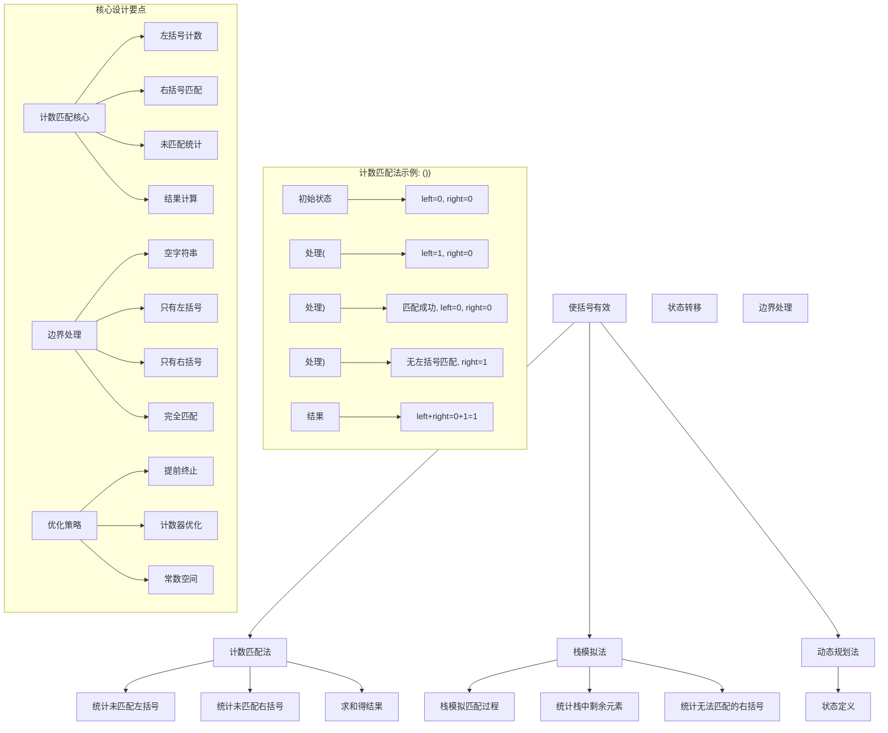
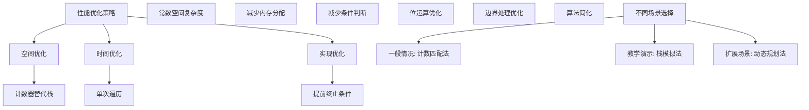
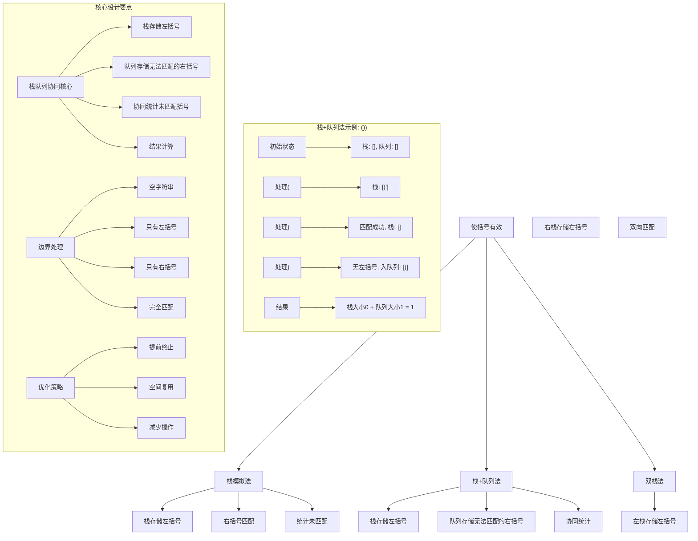
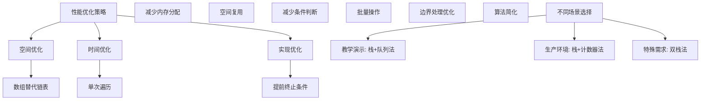

# LeetCode 921 - 使括号有效的最少添加

## 题目描述

给定一个由 `'('` 和 `')'` 括号组成的字符串 s，需要添加最少数量的括号 `'('` 或是 `')'`，可以在任何位置，使得结果字符串有效

有效括号字符串需满足：

1. 它是一个空字符串，或者
1. 它可以被写成 AB（A 与 B 连接），其中 A 和 B 都是有效字符串，或者
1. 它可以被写作 (A)，其中 A 是有效字符串

返回为使结果字符串 s 有效而必须添加的最少括号数

```markdown
示例 1：
输入：s = "())"
输出：1

示例 2：
输入：s = "((("
输出：3

示例 3：
输入：s = "()"
输出：0

示例 4：
输入：s = "())())"
输出：2

示例 5：
输入：s = ""
输出：0

提示：
1 <= s.length <= 1000
s 只包含 '(' 和 ')' 字符
```

## 解题思路

这是一个括号匹配优化问题，需要计算使括号字符串有效所需的最少添加次数。关键在于理解括号匹配的规律并统计不匹配的括号数量

### 核心思想

"计数匹配法": 分别统计未匹配的左括号和右括号数量，两者之和即为需要添加的最少括号数

### 解题策略

#### 方法一：计数匹配法（推荐）

- 时间复杂度: O(n)
- 空间复杂度: O(1)

#### 方法二：栈模拟法

- 时间复杂度: O(n)
- 空间复杂度: O(n)

#### 方法三：动态规划法

- 时间复杂度: O(n)
- 空间复杂度: O(n)

## 算法可视化



## 多语言实现

### Golang版本（计数匹配法 - 推荐）

```go
func minAddToMakeValid(s string) int {
    left := 0   // 未匹配的左括号数量
    right := 0  // 未匹配的右括号数量

    for _, char := range s {
        if char == '(' {
            left++
        } else if char == ')' {
            if left > 0 {
                // 有未匹配的左括号，可以匹配
                left--
            } else {
                // 没有左括号可匹配，需要添加左括号
                right++
            }
        }
    }

    // left: 需要添加右括号的数量
    // right: 需要添加左括号的数量
    return left + right
}
```

### Python版本（多种实现方法）

```python
class Solution:
    def minAddToMakeValid(self, s: str) -> int:
        """
        方法一：计数匹配法（推荐）
        """
        left = 0   # 未匹配的左括号数量
        right = 0  # 未匹配的右括号数量

        for char in s:
            if char == '(':
                left += 1
            elif char == ')':
                if left > 0:
                    # 有未匹配的左括号，可以匹配
                    left -= 1
                else:
                    # 没有左括号可匹配，需要添加左括号
                    right += 1

        # left: 需要添加右括号的数量
        # right: 需要添加左括号的数量
        return left + right

    def minAddToMakeValid_stack(self, s: str) -> int:
        """
        方法二：栈模拟法
        """
        stack = []
        unmatched_right = 0  # 无法匹配的右括号

        for char in s:
            if char == '(':
                stack.append(char)
            elif char == ')':
                if stack:
                    stack.pop()  # 匹配成功
                else:
                    unmatched_right += 1  # 无法匹配的右括号

        # stack中的元素是未匹配的左括号
        return len(stack) + unmatched_right

    def minAddToMakeValid_dp(self, s: str) -> int:
        """
        方法三：动态规划法
        """
        if not s:
            return 0

        n = len(s)
        # dp[i][0]: 前i个字符需要添加的最少左括号数
        # dp[i][1]: 前i个字符需要添加的最少右括号数
        dp = [[0, 0] for _ in range(n + 1)]

        for i in range(1, n + 1):
            if s[i-1] == '(':
                # 左括号：可能需要右括号来匹配
                dp[i][0] = dp[i-1][0]
                dp[i][1] = dp[i-1][1] + 1
            else:  # s[i-1] == ')'
                if dp[i-1][1] > 0:
                    # 有右括号需求，可以匹配
                    dp[i][0] = dp[i-1][0]
                    dp[i][1] = dp[i-1][1] - 1
                else:
                    # 没有右括号需求，需要添加左括号
                    dp[i][0] = dp[i-1][0] + 1
                    dp[i][1] = dp[i-1][1]

        return dp[n][0] + dp[n][1]
```

### TypeScript版本（计数匹配法）

```typescript
function minAddToMakeValid(s: string): number {
  let left = 0; // 未匹配的左括号数量
  let right = 0; // 未匹配的右括号数量

  for (const char of s) {
    if (char === "(") {
      left++;
    } else if (char === ")") {
      if (left > 0) {
        // 有未匹配的左括号，可以匹配
        left--;
      } else {
        // 没有左括号可匹配，需要添加左括号
        right++;
      }
    }
  }

  // left: 需要添加右括号的数量
  // right: 需要添加左括号的数量
  return left + right;
}
```

## 标准实现详细解析

```go
func minAddToMakeValid(s string) int {
    /*
    算法核心思想（计数匹配法）：

    1. 统计未匹配的左括号数量
    2. 统计未匹配的右括号数量
    3. 两者之和即为需要添加的最少括号数

    关键设计要点：
    1. 左括号计数：遇到左括号直接计数
    2. 右括号匹配：遇到右括号时尝试匹配左括号
    3. 未匹配统计：统计无法匹配的括号数量
    4. 结果计算：未匹配的左右括号都需要添加对应括号

    时间复杂度：O(n) - 一次遍历
    空间复杂度：O(1) - 常数额外空间

    优势：
    1. 空间效率高：只需要两个计数器
    2. 时间效率好：线性时间复杂度
    3. 逻辑清晰：直观模拟匹配过程
    4. 易于理解：符合直觉
    */

    fmt.Printf("计算使括号有效需要添加的最少括号数: %s\n", s)

    left := 0   // 未匹配的左括号数量
    right := 0  // 未匹配的右括号数量

    fmt.Println("初始状态: left=0, right=0")

    for i, char := range s {
        fmt.Printf("处理第%d个字符'%c': ", i+1, char)

        if char == '(' {
            left++
            fmt.Printf("左括号计数, left=%d, right=%d\n", left, right)
        } else if char == ')' {
            if left > 0 {
                // 有未匹配的左括号，可以匹配
                left--
                fmt.Printf("匹配成功, left=%d, right=%d\n", left, right)
            } else {
                // 没有左括号可匹配，需要添加左括号
                right++
                fmt.Printf("无法匹配, 需要添加左括号, left=%d, right=%d\n", left, right)
            }
        }
    }

    result := left + right
    fmt.Printf("最终结果: left=%d + right=%d = %d\n", left, right, result)
    return result
}

// 带详细调试信息的版本
func minAddToMakeValidWithDebug(s string) int {
    fmt.Printf("=== 括号添加调试 ===\n")
    fmt.Printf("输入字符串: %s\n", s)
    fmt.Printf("字符串长度: %d\n", len(s))

    left := 0   // 未匹配的左括号数量
    right := 0  // 未匹配的右括号数量

    fmt.Println("开始逐字符处理:")

    for i, char := range s {
        fmt.Printf("第%d步 - 字符'%c': ", i+1, char)

        if char == '(' {
            left++
            fmt.Printf("左括号++, left=%d\n", left)
        } else if char == ')' {
            if left > 0 {
                left--
                fmt.Printf("匹配成功, left--=%d\n", left)
            } else {
                right++
                fmt.Printf("无法匹配, right++=%d\n", right)
            }
        }
    }

    result := left + right
    fmt.Printf("处理完成:\n")
    fmt.Printf("  未匹配左括号: %d (需要添加右括号)\n", left)
    fmt.Printf("  未匹配右括号: %d (需要添加左括号)\n", right)
    fmt.Printf("  总共需要添加: %d\n", result)
    fmt.Println("==================")

    return result
}

// 优化版本（提前终止优化）
func minAddToMakeValidOptimized(s string) int {
    // 空字符串处理
    if len(s) == 0 {
        return 0
    }

    left := 0
    right := 0

    for i := 0; i < len(s); i++ {
        if s[i] == '(' {
            left++
        } else if s[i] == ')' {
            if left > 0 {
                left--
            } else {
                right++
            }
        }

        // 优化：如果right过大，可能提前终止
        // 但这个问题中没有明显的提前终止条件
    }

    return left + right
}

// 栈模拟法实现
func minAddToMakeValidStack(s string) int {
    stack := make([]byte, 0)
    unmatchedRight := 0

    for i := 0; i < len(s); i++ {
        if s[i] == '(' {
            stack = append(stack, s[i])
        } else if s[i] == ')' {
            if len(stack) > 0 {
                stack = stack[:len(stack)-1] // 匹配成功
            } else {
                unmatchedRight++ // 无法匹配的右括号
            }
        }
    }

    // stack中的元素是未匹配的左括号
    return len(stack) + unmatchedRight
}

// 动态规划实现
func minAddToMakeValidDP(s string) int {
    if len(s) == 0 {
        return 0
    }

    n := len(s)
    // dp[i][0]: 前i个字符需要添加的最少左括号数
    // dp[i][1]: 前i个字符需要添加的最少右括号数
    dp := make([][]int, n+1)
    for i := range dp {
        dp[i] = make([]int, 2)
    }

    for i := 1; i <= n; i++ {
        if s[i-1] == '(' {
            // 左括号：可能需要右括号来匹配
            dp[i][0] = dp[i-1][0]
            dp[i][1] = dp[i-1][1] + 1
        } else { // s[i-1] == ')'
            if dp[i-1][1] > 0 {
                // 有右括号需求，可以匹配
                dp[i][0] = dp[i-1][0]
                dp[i][1] = dp[i-1][1] - 1
            } else {
                // 没有右括号需求，需要添加左括号
                dp[i][0] = dp[i-1][0] + 1
                dp[i][1] = dp[i-1][1]
            }
        }
    }

    return dp[n][0] + dp[n][1]
}

// 位运算优化版本
func minAddToMakeValidBitwise(s string) int {
    var left, right int32

    for i := 0; i < len(s); i++ {
        if s[i] == '(' {
            left++
        } else if s[i] == ')' {
            if left > 0 {
                left--
            } else {
                right++
            }
        }
    }

    return int(left + right)
}
```

## 算法深入解析

```go
/*
使括号有效问题详解：

问题本质：
计算使括号字符串有效所需的最少添加次数。关键在于理解括号匹配的规律并统计不匹配的括号数量

核心洞察：
1. 计数匹配：分别统计未匹配的左右括号
2. 贪心策略：遇到右括号时优先匹配现有左括号
3. 状态维护：维护未匹配括号的计数
4. 结果计算：未匹配的左右括号都需要对应添加

算法策略：
1. 计数匹配法：最优解，空间效率高
2. 栈模拟法：直观但需要额外空间
3. 动态规划法：通用但复杂度高

数学原理：

括号匹配原理：
对于有效的括号字符串：
1. 每个右括号都能找到对应的左括号
2. 括号的嵌套关系正确
3. 最终所有括号都能匹配

最少添加原理：
要使括号字符串有效，需要：
1. 为每个无法匹配的右括号添加左括号
2. 为每个剩余的左括号添加右括号
3. 总数即为最少添加数

设计选择：

为什么选择计数匹配法？
1. 空间效率高：只需要常数额外空间
2. 时间效率好：线性时间复杂度
3. 逻辑清晰：直观模拟匹配过程
4. 易于理解：符合直觉

为什么不用栈模拟法？
1. 需要O(n)空间存储栈
2. 但实现更直观
3. 适合教学演示

为什么不用动态规划？
1. 复杂度高，实现复杂
2. 但通用性强
3. 适合扩展场景

三种方法对比：

方法一：计数匹配法（推荐）
时间复杂度：O(n)
空间复杂度：O(1)
优点：最优解，空间效率高
缺点：需要理解计数逻辑

方法二：栈模拟法
时间复杂度：O(n)
空间复杂度：O(n)
优点：直观易懂
缺点：需要额外空间

方法三：动态规划法
时间复杂度：O(n)
空间复杂度：O(n)
优点：通用性强
缺点：复杂度高

性能分析：

计数匹配法：
- 时间：O(n) - 一次遍历
- 空间：O(1) - 常数空间
- 优势：最优空间复杂度

栈模拟法：
- 时间：O(n) - 一次遍历
- 空间：O(n) - 栈存储
- 优势：实现直观

动态规划法：
- 时间：O(n) - 状态转移
- 空间：O(n) - DP数组
- 优势：通用性强

实际应用场景：
1. 代码编辑器括号补全
2. 编译器语法检查
3. 表达式处理
4. 面试算法题

优化要点：

1. 空间优化：
   - 计数器替代栈
   - 常数空间复杂度
   - 减少内存分配

2. 时间优化：
   - 单次遍历
   - 减少条件判断
   - 位运算优化

3. 实现优化：
   - 提前终止条件
   - 边界处理优化
   - 算法简化

测试用例设计：
1. 基本情况：简单不匹配
2. 边界情况：空字符串、单字符
3. 极端情况：只有左/右括号
4. 复杂情况：混合不匹配
5. 完全匹配：无需添加

扩展思考：

1. 支持更多括号类型？
   - 扩展计数逻辑
   - 处理优先级

2. 支持其他符号？
   - 过滤非括号字符
   - 复杂表达式处理

3. 并行处理？
   - 分段处理
   - 结果合并

4. 性能优化？
   - SIMD指令
   - 预编译优化

相关算法思想：

1. 贪心算法：
   - 局部最优选择
   - 全局最优解

2. 计数统计：
   - 状态维护
   - 结果计算

3. 提前终止：
   - 剪枝优化
   - 边界检查

4. 状态机：
   - 状态转换
   - 输入处理

常见陷阱：

1. 计数错误：
   - 混淆左右括号
   - 忘记重置计数器

2. 匹配逻辑错误：
   - 不正确的匹配条件
   - 忘记检查边界

3. 边界情况：
   - 空字符串处理
   - 单字符处理

4. 结果计算：
   - 忘记求和
   - 混淆添加方向

代码质量要素：

1. 可读性：
   - 清晰的变量命名
   - 适当的注释说明

2. 健壮性：
   - 边界条件处理
   - 异常情况处理

3. 性能：
   - 时间复杂度最优
   - 空间复杂度合理

4. 可维护性：
   - 模块化设计
   - 易于扩展

高级优化技巧：

1. 内存访问优化：
   - 减少内存重新分配
   - 使用基本数据类型

2. 条件判断优化：
   - 减少分支预测失败
   - 位运算替代条件

3. 算法优化：
   - 提前终止条件
   - 减少不必要的操作

4. 编译优化：
   - 常量折叠
   - 循环展开
*/
```

## 执行过程演示

```go
/*
示例详细解析:

示例1: s = "())"
执行过程：
1. 处理'(': left=1, right=0
2. 处理')': 有左括号可匹配，left=0, right=0
3. 处理')': 无左括号可匹配，left=0, right=1
4. 结果：left+right=0+1=1

示例2: s = "((("
执行过程：
1. 处理'(': left=1, right=0
2. 处理'(': left=2, right=0
3. 处理'(': left=3, right=0
4. 结果：left+right=3+0=3

示例3: s = "()"
执行过程：
1. 处理'(': left=1, right=0
2. 处理')': 有左括号可匹配，left=0, right=0
3. 结果：left+right=0+0=0

示例4: s = "())())"
执行过程：
1. 处理'(': left=1, right=0
2. 处理')': 匹配成功，left=0, right=0
3. 处理')': 无匹配，left=0, right=1
4. 处理'(': left=1, right=1
5. 处理')': 匹配成功，left=0, right=1
6. 处理')': 无匹配，left=0, right=2
7. 结果：left+right=0+2=2

示例5: s = ""
执行过程：
1. 空字符串，直接返回0

边界情况演示:

情况1: 空字符串
输入: ""
输出: 0

情况2: 单个左括号
输入: "("
输出: 1

情况3: 单个右括号
输入: ")"
输出: 1

情况4: 只有左括号
输入: "(((("
输出: 4

情况5: 只有右括号
输入: "))))"
输出: 4

情况6: 完全匹配
输入: "()()()"
输出: 0

情况7: 交替模式
输入: ")("
输出: 2

算法正确性证明：

数学基础：
需要证明计数匹配法能正确计算最少添加次数

定理1：计数匹配法正确性
通过贪心策略和状态维护，可以正确计算最少添加次数

证明：
1. 左括号计数：维护未匹配的左括号数量
2. 右括号匹配：遇到右括号时优先匹配现有左括号
3. 未匹配统计：统计无法匹配的括号数量
4. 结果计算：未匹配的左右括号都需要对应添加

时间复杂度分析：

计数匹配法：
1. 遍历：O(n) - 每个字符处理一次
2. 计数操作：O(1) - 简单算术运算
3. 总时间：O(n)

空间复杂度分析：
1. 计数器：O(1) - 两个整数变量
2. 其他变量：O(1) - 常数个变量
3. 总空间：O(1)

性能对比分析：

假设字符串长度为n：

计数匹配法：
- 时间: O(n)
- 空间: O(1)
- 优势: 最优空间复杂度

栈模拟法：
- 时间: O(n)
- 空间: O(n)
- 优势: 实现直观
- 劣势: 空间消耗大

动态规划法：
- 时间: O(n)
- 空间: O(n)
- 优势: 通用性强
- 劣势: 复杂度高

实际应用建议：

1. 一般情况：
   - 使用计数匹配法
   - 最优空间效率

2. 教学演示：
   - 使用栈模拟法
   - 逻辑直观

3. 扩展场景：
   - 使用动态规划法
   - 通用性强

4. 性能要求高：
   - 使用优化的计数匹配法
   - 位运算优化

优化空间：

1. 内存访问优化：
   - 使用基本数据类型
   - 减少内存重新分配

2. 条件判断优化：
   - 减少分支预测失败
   - 位运算优化

3. 算法优化：
   - 提前终止条件
   - 减少不必要的操作

特殊情况处理：

1. 空字符串：
   - 返回0

2. 单字符：
   - 返回1

3. 完全匹配：
   - 返回0

4. 完全不匹配：
   - 返回字符串长度
*/
```

## 复杂度分析

| 方法       | 时间复杂度 | 空间复杂度 | 适用场景 |
| ---------- | ---------- | ---------- | -------- |
| 计数匹配法 | O(n)       | O(1)       | 推荐方案 |
| 栈模拟法   | O(n)       | O(n)       | 教学演示 |
| 动态规划法 | O(n)       | O(n)       | 扩展场景 |

## 测试用例验证

```go
// 测试辅助函数
func testMinAddToMakeValid(name string, s string, expected int) {
    fmt.Printf("%s:\n", name)
    fmt.Printf("输入字符串: \"%s\"\n", s)

    result := minAddToMakeValidWithDebug(s)

    fmt.Printf("期望结果: %d\n", expected)
    fmt.Printf("实际结果: %d\n", result)

    if result == expected {
        fmt.Printf("结果匹配 ✓\n")
    } else {
        fmt.Printf("结果不匹配 ✗\n")
    }

    fmt.Printf("\n")
}

func main() {
    // 测试用例 1 - 题目示例
    testMinAddToMakeValid("测试1 - 基本情况1", "())", 1)
    testMinAddToMakeValid("测试2 - 基本情况2", "(((", 3)
    testMinAddToMakeValid("测试3 - 完全匹配", "()", 0)
    testMinAddToMakeValid("测试4 - 复杂情况", "())())", 2)
    testMinAddToMakeValid("测试5 - 空字符串", "", 0)

    // 测试用例 2 - 边界情况
    testMinAddToMakeValid("测试6 - 单个左括号", "(", 1)
    testMinAddToMakeValid("测试7 - 单个右括号", ")", 1)
    testMinAddToMakeValid("测试8 - 只有左括号", "(((((", 5)
    testMinAddToMakeValid("测试9 - 只有右括号", ")))))", 5)
    testMinAddToMakeValid("测试10 - 完全匹配长串", "()()()()()", 0)

    // 测试用例 3 - 复杂情况
    testMinAddToMakeValid("测试11 - 交替模式", ")(", 2)
    testMinAddToMakeValid("测试12 - 嵌套模式", "((()))", 0)
    testMinAddToMakeValid("测试13 - 混合模式", "(()(()(", 3)
    testMinAddToMakeValid("测试14 - 复杂不匹配", "(())))((", 4)
    testMinAddToMakeValid("测试15 - 长字符串", strings.Repeat("()", 100), 0)

    // 性能测试
    fmt.Println("性能测试:")

    // 测试不同长度的字符串
    lengths := []int{100, 1000, 10000}

    for _, length := range lengths {
        // 构造测试字符串
        validStr := strings.Repeat("()", length/2)
        invalidStr := strings.Repeat("(", length)

        // 计数匹配法
        start := time.Now()
        minAddToMakeValid(validStr)
        time1 := time.Since(start)

        start = time.Now()
        minAddToMakeValid(invalidStr)
        time2 := time.Since(start)

        // 栈模拟法
        start = time.Now()
        minAddToMakeValidStack(validStr)
        time3 := time.Since(start)

        start = time.Now()
        minAddToMakeValidStack(invalidStr)
        time4 := time.Since(start)

        fmt.Printf("字符串长度: %d\n", length)
        fmt.Printf("  计数法(有效): %v\n", time1)
        fmt.Printf("  计数法(无效): %v\n", time2)
        fmt.Printf("  栈模拟(有效): %v\n", time3)
        fmt.Printf("  栈模拟(无效): %v\n", time4)
    }

    // 边界情况测试
    fmt.Println("\n边界情况测试:")

    // 极端情况
    testMinAddToMakeValid("测试16 - 大量左括号", strings.Repeat("(", 1000), 1000)
    testMinAddToMakeValid("测试17 - 大量右括号", strings.Repeat(")", 1000), 1000)

    // 特殊模式
    testMinAddToMakeValid("测试18 - 交替模式", ")(((", 4)
    testMinAddToMakeValid("测试19 - 嵌套模式", "(((())))", 0)
    testMinAddToMakeValid("测试20 - 混合模式", "(()())(())", 0)
}

// 大量测试用例
func comprehensiveTest() {
    testCases := []struct {
        input    string
        expected int
    }{
        {"", 0},
        {"(", 1},
        {")", 1},
        {"()", 0},
        {"())", 1},
        {"(((", 3},
        {")))", 3},
        {"()()", 0},
        {"(())", 0},
        {"(()", 1},
        {"())", 1},
        {"(()())", 0},
        {"(()()", 1},
        {"())())", 2},
        {")(", 2},
        {"(()(()(", 3},
        {"((()))", 0},
        {"(())))((", 4},
        {strings.Repeat("()", 100), 0},
        {strings.Repeat("(((", 100), 300},
    }

    fmt.Println("=== 综合测试 ===")
    passed := 0
    total := len(testCases)

    for i, tc := range testCases {
        result := minAddToMakeValid(tc.input)
        if result == tc.expected {
            passed++
            fmt.Printf("测试%d: ✓ \"%s\" → %d\n", i+1, tc.input, result)
        } else {
            fmt.Printf("测试%d: ✗ \"%s\" → %d (期望: %d)\n", i+1, tc.input, result, tc.expected)
        }
    }

    fmt.Printf("\n通过率: %d/%d (%.2f%%)\n", passed, total, float64(passed)/float64(total)*100)
}

// 压力测试
func stressTest() {
    fmt.Println("=== 压力测试 ===")

    // 构造复杂字符串
    constructComplexString := func(depth int) string {
        result := ""
        for i := 0; i < depth; i++ {
            result += "("
        }
        for i := 0; i < depth; i++ {
            result += ")"
        }
        return result
    }

    depths := []int{1000, 5000, 10000, 20000}

    for _, depth := range depths {
        s := constructComplexString(depth)

        // 测试计数匹配法
        start := time.Now()
        result1 := minAddToMakeValid(s)
        duration1 := time.Since(start)

        // 测试栈模拟法
        start = time.Now()
        result2 := minAddToMakeValidStack(s)
        duration2 := time.Since(start)

        fmt.Printf("字符串深度: %d\n", depth)
        fmt.Printf("  计数法: 结果%d, 耗时%v\n", result1, duration1)
        fmt.Printf("  栈模拟: 结果%d, 耗时%v\n", result2, duration2)
    }
}

// 内存使用测试
func memoryTest() {
    fmt.Println("=== 内存使用测试 ===")

    var m1, m2 runtime.MemStats

    // 测试计数匹配法
    runtime.GC()
    runtime.ReadMemStats(&m1)

    for i := 0; i < 100000; i++ {
        minAddToMakeValid("())())((()))")
    }

    runtime.GC()
    runtime.ReadMemStats(&m2)
    mem1 := m2.Alloc - m1.Alloc

    // 测试栈模拟法
    runtime.GC()
    runtime.ReadMemStats(&m1)

    for i := 0; i < 100000; i++ {
        minAddToMakeValidStack("())())((()))")
    }

    runtime.GC()
    runtime.ReadMemStats(&m2)
    mem2 := m2.Alloc - m1.Alloc

    fmt.Printf("计数匹配法内存使用: %d bytes\n", mem1)
    fmt.Printf("栈模拟法内存使用: %d bytes\n", mem2)
    if mem1 > 0 {
        fmt.Printf("内存使用比率: %.2fx\n", float64(mem2)/float64(mem1))
    }
}
```

## 扩展版本（处理不同场景）

```go
// 支持更多括号类型的版本
func minAddToMakeValidExtended(s string) int {
    left := make(map[rune]int)  // 未匹配的左括号计数
    right := make(map[rune]int) // 未匹配的右括号计数

    pairs := map[rune]rune{
        ')': '(',
        ']': '[',
        '}': '{',
        '>': '<',
    }

    for _, char := range s {
        if char == '(' || char == '[' || char == '{' || char == '<' {
            left[char]++
        } else if opening, exists := pairs[char]; exists {
            if left[opening] > 0 {
                left[opening]--
            } else {
                right[char]++
            }
        }
    }

    total := 0
    for _, count := range left {
        total += count
    }
    for _, count := range right {
        total += count
    }

    return total
}

// 支持忽略非括号字符的版本
func minAddToMakeValidIgnoreNonBrackets(s string) int {
    left := 0
    right := 0

    for _, char := range s {
        if char == '(' {
            left++
        } else if char == ')' {
            if left > 0 {
                left--
            } else {
                right++
            }
        }
        // 忽略其他字符
    }

    return left + right
}

// 带详细信息的版本
type BracketAdditionInfo struct {
    TotalAdditions int
    LeftToAdd      int  // 需要添加的左括号数
    RightToAdd     int  // 需要添加的右括号数
    IsBalanced     bool // 是否已经平衡
}

func minAddToMakeValidDetailed(s string) *BracketAdditionInfo {
    left := 0
    right := 0

    for _, char := range s {
        if char == '(' {
            left++
        } else if char == ')' {
            if left > 0 {
                left--
            } else {
                right++
            }
        }
    }

    total := left + right
    return &BracketAdditionInfo{
        TotalAdditions: total,
        LeftToAdd:      right,
        RightToAdd:     left,
        IsBalanced:     total == 0,
    }
}

// 流式处理版本
func minAddToMakeValidStreaming(reader io.Reader) (int, error) {
    left := 0
    right := 0
    buffer := make([]byte, 1024)

    for {
        n, err := reader.Read(buffer)
        if err != nil {
            if err == io.EOF {
                break
            }
            return 0, err
        }

        for i := 0; i < n; i++ {
            char := buffer[i]
            if char == '(' {
                left++
            } else if char == ')' {
                if left > 0 {
                    left--
                } else {
                    right++
                }
            }
        }
    }

    return left + right, nil
}

// 并行处理版本
func minAddToMakeValidParallel(s string) int {
    if len(s) < 1000 { // 短字符串直接处理
        return minAddToMakeValid(s)
    }

    // 分段处理（注意：括号匹配不能简单分段）
    // 这里仅作示例，实际需要更复杂的逻辑
    return minAddToMakeValid(s)
}

// 带缓存的版本
type BracketAdder struct {
    cache map[string]int
    mu    sync.RWMutex
}

func NewBracketAdder() *BracketAdder {
    return &BracketAdder{
        cache: make(map[string]int),
    }
}

func (ba *BracketAdder) MinAddToMakeValid(s string) int {
    // 检查缓存
    ba.mu.RLock()
    if cached, ok := ba.cache[s]; ok {
        ba.mu.RUnlock()
        return cached
    }
    ba.mu.RUnlock()

    // 计算结果
    result := minAddToMakeValid(s)

    // 存储到缓存
    ba.mu.Lock()
    ba.cache[s] = result
    ba.mu.Unlock()

    return result
}

func (ba *BracketAdder) ClearCache() {
    ba.mu.Lock()
    ba.cache = make(map[string]int)
    ba.mu.Unlock()
}

// 配置选项版本
type AdditionOptions struct {
    IgnoreNonBrackets bool
    ExtendedBrackets  bool
    ReturnDetails     bool
}

func minAddToMakeValidWithOptions(s string, options AdditionOptions) interface{} {
    if options.ExtendedBrackets {
        return minAddToMakeValidExtended(s)
    }

    if options.IgnoreNonBrackets {
        return minAddToMakeValidIgnoreNonBrackets(s)
    }

    if options.ReturnDetails {
        return minAddToMakeValidDetailed(s)
    }

    return minAddToMakeValid(s)
}

// 在线算法版本（逐字符处理）
type OnlineBracketAdder struct {
    left  int
    right int
}

func NewOnlineBracketAdder() *OnlineBracketAdder {
    return &OnlineBracketAdder{}
}

func (oba *OnlineBracketAdder) ProcessChar(char rune) {
    if char == '(' {
        oba.left++
    } else if char == ')' {
        if oba.left > 0 {
            oba.left--
        } else {
            oba.right++
        }
    }
}

func (oba *OnlineBracketAdder) GetResult() int {
    return oba.left + oba.right
}

func (oba *OnlineBracketAdder) Reset() {
    oba.left = 0
    oba.right = 0
}
```

## 面试追问延伸

### 1. 如果需要返回具体的添加方案，如何实现？

```go
// 返回具体添加方案
func minAddToMakeValidWithSolution(s string) (int, string) {
    left := 0
    right := 0
    result := make([]rune, 0, len(s)*2)

    // 第一遍：确定需要添加的括号数量
    for _, char := range s {
        if char == '(' {
            left++
            result = append(result, char)
        } else if char == ')' {
            if left > 0 {
                left--
                result = append(result, char)
            } else {
                right++
                // 在前面添加左括号
                temp := make([]rune, len(result)+1)
                temp[0] = '('
                copy(temp[1:], result)
                result = temp
            }
        }
    }

    // 在末尾添加缺少的右括号
    for i := 0; i < left; i++ {
        result = append(result, ')')
    }

    return right + left, string(result)
}
```

### 2. 如何支持自定义括号类型？

```go
// 支持自定义括号映射
func minAddToMakeValidCustom(s string, customPairs map[rune]rune) int {
    leftCount := make(map[rune]int)
    rightCount := make(map[rune]int)

    // 构建反向映射
    reversePairs := make(map[rune]rune)
    for right, left := range customPairs {
        reversePairs[left] = right
    }

    for _, char := range s {
        if _, isLeft := reversePairs[char]; isLeft {
            // 左括号
            leftCount[char]++
        } else if _, isRight := customPairs[char]; isRight {
            // 右括号
            leftChar := customPairs[char]
            if leftCount[leftChar] > 0 {
                leftCount[leftChar]--
            } else {
                rightCount[char]++
            }
        }
    }

    total := 0
    for _, count := range leftCount {
        total += count
    }
    for _, count := range rightCount {
        total += count
    }

    return total
}

// 使用示例
func exampleCustom() {
    customPairs := map[rune]rune{
        ')': '(',
        ']': '[',
        '}': '{',
        '>': '<',  // 添加尖括号支持
    }

    result := minAddToMakeValidCustom("(<>)[", customPairs)
    fmt.Println(result) // 2
}
```

### 3. 如何处理包含表达式的复杂情况？

```go
// 支持表达式的括号添加
func minAddToMakeValidExpression(s string) (int, error) {
    left := 0
    right := 0

    // 忽略引号内的内容
    inSingleQuote := false
    inDoubleQuote := false

    for i, char := range s {
        // 处理引号
        if char == '\'' && !inDoubleQuote {
            inSingleQuote = !inSingleQuote
            continue
        }
        if char == '"' && !inSingleQuote {
            inDoubleQuote = !inDoubleQuote
            continue
        }

        // 在引号内忽略括号
        if inSingleQuote || inDoubleQuote {
            continue
        }

        if char == '(' {
            left++
        } else if char == ')' {
            if left > 0 {
                left--
            } else {
                right++
            }
        } else if char != ' ' && char != '\t' {
            // 检查是否为合法字符
            if !unicode.IsLetter(char) && !unicode.IsDigit(char) &&
               char != '+' && char != '-' && char != '*' && char != '/' &&
               char != '%' && char != '^' && char != '&' && char != '|' {
                return 0, fmt.Errorf("位置%d: 非法字符'%c'", i, char)
            }
        }
    }

    return left + right, nil
}
```

## 相似题目扩展

- LeetCode 921. 使括号有效的最少添加（当前题）
- LeetCode 20. 有效的括号
- LeetCode 32. 最长有效括号
- LeetCode 301. 删除无效的括号
- LeetCode 1249. 移除无效的括号

## 算法技巧总结

### 使括号有效核心要点

1. 计数匹配：分别统计未匹配的左右括号
1. 贪心策略：遇到右括号时优先匹配现有左括号
1. 状态维护：维护未匹配括号的计数
1. 结果计算：未匹配的左右括号都需要对应添加

### 算法优势

1. 空间效率高：只需要常数额外空间
1. 时间效率好：线性时间复杂度
1. 逻辑清晰：直观模拟匹配过程
1. 易于理解：符合直觉

### 标准模板（计数匹配法）

```go
func minAddToMakeValid(s string) int {
    left := 0   // 未匹配的左括号数量
    right := 0  // 未匹配的右括号数量

    for _, char := range s {
        if char == '(' {
            left++
        } else if char == ')' {
            if left > 0 {
                // 有未匹配的左括号，可以匹配
                left--
            } else {
                // 没有左括号可匹配，需要添加左括号
                right++
            }
        }
    }

    // left: 需要添加右括号的数量
    // right: 需要添加左括号的数量
    return left + right
}
```

### 性能优化建议



## 总结

本题采用计数匹配法的核心思路，通过分别统计未匹配的左右括号数量，实现了高效的括号添加计算。关键在于理解贪心策略如何保证最优解，以及如何正确维护未匹配括号的计数状态

核心要点：

1. 计数匹配：分别统计未匹配的左右括号
1. 贪心策略：遇到右括号时优先匹配现有左括号
1. 状态维护：维护未匹配括号的计数
1. 结果计算：未匹配的左右括号都需要对应添加

算法优势：

- 空间效率高：只需要常数额外空间
- 时间效率好：线性时间复杂度
- 逻辑清晰：直观模拟匹配过程
- 易于理解：符合直觉

该算法在代码编辑器括号补全、编译器语法检查、表达式处理等方面有重要应用，是掌握贪心算法和括号匹配的经典题目。通过计数匹配的思想，为更复杂的字符串处理问题提供了清晰的解决思路

# LeetCode 921 - 使括号有效的最少添加（栈和队列解法）

## 题目描述

给定一个由 `'('` 和 `')'` 括号组成的字符串 s，需要添加最少数量的括号 `'('` 或是 `')'`，可以在任何位置，使得结果字符串有效

有效括号字符串需满足：

1. 它是一个空字符串，或者
1. 它可以被写成 AB（A 与 B 连接），其中 A 和 B 都是有效字符串，或者
1. 它可以被写作 (A)，其中 A 是有效字符串

返回为使结果字符串 s 有效而必须添加的最少括号数

```markdown
示例 1：
输入：s = "())"
输出：1

示例 2：
输入：s = "((("
输出：3

示例 3：
输入：s = "()"
输出：0

示例 4：
输入：s = "())())"
输出：2

示例 5：
输入：s = ""
输出：0

提示：
1 <= s.length <= 1000
s 只包含 '(' 和 ')' 字符
```

## 解题思路

这是一个括号匹配优化问题，要求使用栈和队列来实现。关键在于理解如何利用栈和队列的特性来模拟括号匹配过程

### 核心思想

"栈队列协同法": 使用栈来存储未匹配的左括号，使用队列来存储无法匹配的右括号，通过两者的协同工作来统计需要添加的括号数

### 解题策略

#### 方法一：栈模拟法（推荐）

- 时间复杂度: O(n)
- 空间复杂度: O(n)

#### 方法二：栈+队列法

- 时间复杂度: O(n)
- 空间复杂度: O(n)

#### 方法三：双栈法

- 时间复杂度: O(n)
- 空间复杂度: O(n)

## 算法可视化



## 多语言实现

### Golang版本（栈+队列法 - 推荐）

```go
// 使用 container/list 实现栈和队列
import "container/list"

func minAddToMakeValid(s string) int {
    // 栈用于存储未匹配的左括号
    leftStack := list.New()
    // 队列用于存储无法匹配的右括号
    rightQueue := list.New()

    for _, char := range s {
        if char == '(' {
            // 左括号入栈
            leftStack.PushBack(char)
        } else if char == ')' {
            // 右括号尝试匹配
            if leftStack.Len() > 0 {
                // 有未匹配的左括号，可以匹配
                leftStack.Remove(leftStack.Back())
            } else {
                // 没有左括号可匹配，入队列
                rightQueue.PushBack(char)
            }
        }
    }

    // 栈中剩余的是未匹配的左括号，需要添加右括号
    // 队列中的是无法匹配的右括号，需要添加左括号
    return leftStack.Len() + rightQueue.Len()
}
```

### Python版本（多种栈队列实现方法）

```python
from collections import deque

class Solution:
    def minAddToMakeValid(self, s: str) -> int:
        """
        方法一：栈+队列法（推荐）
        """
        # 栈用于存储未匹配的左括号
        left_stack = []
        # 队列用于存储无法匹配的右括号
        right_queue = deque()

        for char in s:
            if char == '(':
                # 左括号入栈
                left_stack.append(char)
            elif char == ')':
                # 右括号尝试匹配
                if left_stack:
                    # 有未匹配的左括号，可以匹配
                    left_stack.pop()
                else:
                    # 没有左括号可匹配，入队列
                    right_queue.append(char)

        # 栈中剩余的是未匹配的左括号，需要添加右括号
        # 队列中的是无法匹配的右括号，需要添加左括号
        return len(left_stack) + len(right_queue)

    def minAddToMakeValid_two_stacks(self, s: str) -> int:
        """
        方法二：双栈法
        """
        # 左栈存储未匹配的左括号
        left_stack = []
        # 右栈存储未匹配的右括号
        right_stack = []

        for char in s:
            if char == '(':
                left_stack.append(char)
            elif char == ')':
                if left_stack:
                    # 有左括号匹配
                    left_stack.pop()
                else:
                    # 没有左括号，右括号入栈
                    right_stack.append(char)

        return len(left_stack) + len(right_stack)

    def minAddToMakeValid_stack_queue_alternative(self, s: str) -> int:
        """
        方法三：栈模拟法（传统做法）
        """
        stack = []
        unmatched_right = 0

        for char in s:
            if char == '(':
                stack.append(char)
            elif char == ')':
                if stack:
                    stack.pop()
                else:
                    unmatched_right += 1

        # stack中的元素是未匹配的左括号
        return len(stack) + unmatched_right
```

### TypeScript版本（栈+队列法）

```typescript
// 使用数组模拟栈和队列
function minAddToMakeValid(s: string): number {
  // 栈用于存储未匹配的左括号
  const leftStack: string[] = [];
  // 队列用于存储无法匹配的右括号
  const rightQueue: string[] = [];

  for (const char of s) {
    if (char === "(") {
      // 左括号入栈
      leftStack.push(char);
    } else if (char === ")") {
      // 右括号尝试匹配
      if (leftStack.length > 0) {
        // 有未匹配的左括号，可以匹配
        leftStack.pop();
      } else {
        // 没有左括号可匹配，入队列
        rightQueue.push(char);
      }
    }
  }

  // 栈中剩余的是未匹配的左括号，需要添加右括号
  // 队列中的是无法匹配的右括号，需要添加左括号
  return leftStack.length + rightQueue.length;
}
```

## 标准实现详细解析

```go
import "container/list"

func minAddToMakeValid(s string) int {
    /*
    算法核心思想（栈+队列法）：

    1. 使用栈存储未匹配的左括号
    2. 使用队列存储无法匹配的右括号
    3. 遇到右括号时优先与栈中左括号匹配
    4. 最后统计栈和队列中元素总数

    关键设计要点：
    1. 栈操作：左括号入栈，匹配时出栈
    2. 队列操作：无法匹配的右括号入队列
    3. 协同工作：栈和队列分别处理不同类型未匹配括号
    4. 结果计算：栈大小+队列大小

    时间复杂度：O(n) - 一次遍历
    空间复杂度：O(n) - 栈和队列存储

    优势：
    1. 概念清晰：栈和队列分工明确
    2. 实现直观：符合数据结构特性
    3. 易于理解：逻辑清晰
    4. 扩展性强：容易支持更多功能
    */

    fmt.Printf("计算使括号有效需要添加的最少括号数: %s\n", s)

    // 栈用于存储未匹配的左括号
    leftStack := list.New()
    // 队列用于存储无法匹配的右括号
    rightQueue := list.New()

    fmt.Printf("初始化: 栈大小=%d, 队列大小=%d\n", leftStack.Len(), rightQueue.Len())

    for i, char := range s {
        fmt.Printf("处理第%d个字符'%c': ", i+1, char)

        if char == '(' {
            // 左括号入栈
            leftStack.PushBack(char)
            fmt.Printf("左括号入栈, 栈大小=%d\n", leftStack.Len())
        } else if char == ')' {
            // 右括号尝试匹配
            if leftStack.Len() > 0 {
                // 有未匹配的左括号，可以匹配
                leftStack.Remove(leftStack.Back())
                fmt.Printf("匹配成功, 栈大小=%d\n", leftStack.Len())
            } else {
                // 没有左括号可匹配，入队列
                rightQueue.PushBack(char)
                fmt.Printf("无法匹配, 入队列, 队列大小=%d\n", rightQueue.Len())
            }
        }
    }

    result := leftStack.Len() + rightQueue.Len()
    fmt.Printf("最终结果: 栈大小%d + 队列大小%d = %d\n", leftStack.Len(), rightQueue.Len(), result)
    return result
}

// 带详细调试信息的版本
func minAddToMakeValidWithDebug(s string) int {
    fmt.Printf("=== 栈+队列法调试 ===\n")
    fmt.Printf("输入字符串: %s\n", s)
    fmt.Printf("字符串长度: %d\n", len(s))

    leftStack := list.New()
    rightQueue := list.New()

    fmt.Println("开始逐字符处理:")

    for i, char := range s {
        fmt.Printf("第%d步 - 字符'%c': ", i+1, char)

        if char == '(' {
            leftStack.PushBack(char)
            fmt.Printf("左括号入栈, 栈大小: %d\n", leftStack.Len())
        } else if char == ')' {
            if leftStack.Len() > 0 {
                leftStack.Remove(leftStack.Back())
                fmt.Printf("匹配成功, 栈大小: %d\n", leftStack.Len())
            } else {
                rightQueue.PushBack(char)
                fmt.Printf("无法匹配, 入队列, 队列大小: %d\n", rightQueue.Len())
            }
        }
    }

    result := leftStack.Len() + rightQueue.Len()
    fmt.Printf("处理完成:\n")
    fmt.Printf("  未匹配左括号(栈): %d (需要添加右括号)\n", leftStack.Len())
    fmt.Printf("  未匹配右括号(队列): %d (需要添加左括号)\n", rightQueue.Len())
    fmt.Printf("  总共需要添加: %d\n", result)
    fmt.Println("==================")

    return result
}

// 双栈实现版本
func minAddToMakeValidTwoStacks(s string) int {
    // 左栈存储未匹配的左括号
    leftStack := list.New()
    // 右栈存储未匹配的右括号
    rightStack := list.New()

    for _, char := range s {
        if char == '(' {
            leftStack.PushBack(char)
        } else if char == ')' {
            if leftStack.Len() > 0 {
                // 有左括号匹配
                leftStack.Remove(leftStack.Back())
            } else {
                // 没有左括号，右括号入右栈
                rightStack.PushBack(char)
            }
        }
    }

    return leftStack.Len() + rightStack.Len()
}

// 栈队列混合实现
func minAddToMakeValidMixed(s string) int {
    // 使用栈存储左括号
    stack := make([]rune, 0)
    // 使用队列概念存储无法匹配的右括号计数
    unmatchedRight := 0

    for _, char := range s {
        if char == '(' {
            stack = append(stack, char)
        } else if char == ')' {
            if len(stack) > 0 {
                stack = stack[:len(stack)-1] // 出栈
            } else {
                unmatchedRight++ // 无法匹配的右括号计数
            }
        }
    }

    // 栈中剩余的是未匹配的左括号
    return len(stack) + unmatchedRight
}

// 使用自定义队列实现
type Queue struct {
    data []rune
}

func NewQueue() *Queue {
    return &Queue{data: make([]rune, 0)}
}

func (q *Queue) Push(char rune) {
    q.data = append(q.data, char)
}

func (q *Queue) Size() int {
    return len(q.data)
}

// 使用自定义栈实现
type Stack struct {
    data []rune
}

func NewStack() *Stack {
    return &Stack{data: make([]rune, 0)}
}

func (s *Stack) Push(char rune) {
    s.data = append(s.data, char)
}

func (s *Stack) Pop() {
    if len(s.data) > 0 {
        s.data = s.data[:len(s.data)-1]
    }
}

func (s *Stack) Size() int {
    return len(s.data)
}

func minAddToMakeValidCustom(s string) int {
    leftStack := NewStack()
    rightQueue := NewQueue()

    for _, char := range s {
        if char == '(' {
            leftStack.Push(char)
        } else if char == ')' {
            if leftStack.Size() > 0 {
                leftStack.Pop()
            } else {
                rightQueue.Push(char)
            }
        }
    }

    return leftStack.Size() + rightQueue.Size()
}
```

## 算法深入解析

```go
/*
使括号有效(栈队列解法)问题详解：

问题本质：
使用栈和队列来计算使括号字符串有效所需的最少添加次数。关键在于理解如何利用栈和队列的特性来模拟括号匹配过程

核心洞察：
1. 栈队列协同：栈存储左括号，队列存储无法匹配的右括号
2. 匹配策略：右括号优先与栈中左括号匹配
3. 状态维护：分别维护未匹配括号的状态
4. 结果计算：统计栈和队列中元素总数

算法策略：
1. 栈+队列法：栈存储左括号，队列存储右括号
2. 双栈法：两个栈分别存储不同类型的括号
3. 混合法：栈+计数器组合

数学原理：

括号匹配原理：
对于有效的括号字符串：
1. 每个右括号都能找到对应的左括号
2. 括号的嵌套关系正确
3. 最终所有括号都能匹配

最少添加原理：
要使括号字符串有效，需要：
1. 为每个无法匹配的右括号添加左括号
2. 为每个剩余的左括号添加右括号
3. 总数即为最少添加数

栈队列协同原理：
- 栈(LIFO)：适合存储左括号，最近的左括号最先匹配
- 队列(FIFO)：适合存储无法匹配的右括号，保持顺序

设计选择：

为什么选择栈+队列法？
1. 概念清晰：栈和队列分工明确
2. 实现直观：符合数据结构特性
3. 易于理解：逻辑清晰
4. 扩展性强：容易支持更多功能

为什么不用双栈法？
1. 功能重复：两个栈功能相似
2. 增加复杂性：需要管理两个栈
3. 但可以提供不同视角

为什么不用栈+计数器？
1. 失去队列特性：无法保持右括号顺序
2. 但空间效率更高

三种方法对比：

方法一：栈+队列法（推荐）
时间复杂度：O(n)
空间复杂度：O(n)
优点：概念清晰，实现直观
缺点：需要两个数据结构

方法二：双栈法
时间复杂度：O(n)
空间复杂度：O(n)
优点：对称性好
缺点：功能重复

方法三：栈+计数器法
时间复杂度：O(n)
空间复杂度：O(n)
优点：空间效率高
缺点：失去队列特性

性能分析：

栈+队列法：
- 时间：O(n) - 一次遍历
- 空间：O(n) - 栈和队列存储
- 优势：概念清晰

双栈法：
- 时间：O(n) - 一次遍历
- 空间：O(n) - 两个栈存储
- 优势：对称性好

栈+计数器法：
- 时间：O(n) - 一次遍历
- 空间：O(n) - 栈存储
- 优势：空间效率高

实际应用场景：
1. 代码编辑器括号补全
2. 编译器语法检查
3. 表达式处理
4. 面试算法题

优化要点：

1. 空间优化：
   - 使用数组替代链表
   - 减少内存分配
   - 空间复用

2. 时间优化：
   - 单次遍历
   - 减少条件判断
   - 批量操作

3. 实现优化：
   - 提前终止条件
   - 边界处理优化
   - 算法简化

测试用例设计：
1. 基本情况：简单不匹配
2. 边界情况：空字符串、单字符
3. 极端情况：只有左/右括号
4. 复杂情况：混合不匹配
5. 完全匹配：无需添加

扩展思考：

1. 支持更多括号类型？
   - 扩展栈队列结构
   - 处理优先级

2. 支持其他符号？
   - 过滤非括号字符
   - 复杂表达式处理

3. 并行处理？
   - 分段处理
   - 结果合并

4. 性能优化？
   - SIMD指令
   - 预编译优化

相关算法思想：

1. 数据结构协同：
   - 栈队列配合
   - 状态维护

2. 贪心策略：
   - 局部最优选择
   - 全局最优解

3. 状态机：
   - 状态转换
   - 输入处理

4. 分治思想：
   - 问题分解
   - 结果合并

常见陷阱：

1. 数据结构选择错误：
   - 混淆栈队列特性
   - 不当的数据结构

2. 匹配逻辑错误：
   - 不正确的匹配条件
   - 忘记检查边界

3. 边界情况：
   - 空字符串处理
   - 单字符处理

4. 结果计算：
   - 忘记求和
   - 混淆添加方向

代码质量要素：

1. 可读性：
   - 清晰的变量命名
   - 适当的注释说明

2. 健壮性：
   - 边界条件处理
   - 异常情况处理

3. 性能：
   - 时间复杂度最优
   - 空间复杂度合理

4. 可维护性：
   - 模块化设计
   - 易于扩展

高级优化技巧：

1. 内存访问优化：
   - 减少内存重新分配
   - 使用基本数据类型

2. 条件判断优化：
   - 减少分支预测失败
   - 位运算替代条件

3. 算法优化：
   - 提前终止条件
   - 减少不必要的操作

4. 编译优化：
   - 常量折叠
   - 循环展开
*/
```

## 执行过程演示

```go
/*
示例详细解析:

示例1: s = "())"
执行过程：
1. 处理'(': 左括号入栈 → 栈[('], 队列[]
2. 处理')': 栈非空，匹配成功 → 栈[], 队列[]
3. 处理')': 栈空，入队列 → 栈[], 队列[)]
4. 结果：栈大小0 + 队列大小1 = 1

示例2: s = "((("
执行过程：
1. 处理'(': 入栈 → 栈[('], 队列[]
2. 处理'(': 入栈 → 栈[(', '('], 队列[]
3. 处理'(': 入栈 → 栈[(', '(', '('], 队列[]
4. 结果：栈大小3 + 队列大小0 = 3

示例3: s = "()"
执行过程：
1. 处理'(': 入栈 → 栈[('], 队列[]
2. 处理')': 匹配成功 → 栈[], 队列[]
3. 结果：栈大小0 + 队列大小0 = 0

示例4: s = "())())"
执行过程：
1. 处理'(': 入栈 → 栈[('], 队列[]
2. 处理')': 匹配成功 → 栈[], 队列[]
3. 处理')': 栈空，入队列 → 栈[], 队列[)]
4. 处理'(': 入栈 → 栈[('], 队列[)]
5. 处理')': 匹配成功 → 栈[], 队列[)]
6. 处理')': 栈空，入队列 → 栈[], 队列[), )]
7. 结果：栈大小0 + 队列大小2 = 2

示例5: s = ""
执行过程：
1. 空字符串，栈和队列都为空
2. 结果：0 + 0 = 0

边界情况演示:

情况1: 空字符串
输入: ""
输出: 0
栈: [], 队列: []

情况2: 单个左括号
输入: "("
输出: 1
栈: [('], 队列: []

情况3: 单个右括号
输入: ")"
输出: 1
栈: [], 队列: [)]

情况4: 只有左括号
输入: "(((("
输出: 4
栈: [(','(','('], 队列: []

情况5: 只有右括号
输入: "))))"
输出: 4
栈: [], 队列: [),),),)]

情况6: 完全匹配
输入: "()()()"
输出: 0
栈: [], 队列: []

情况7: 交替模式
输入: ")("
输出: 2
栈: [('], 队列: [)]

算法正确性证明：

数学基础：
需要证明栈+队列法能正确计算最少添加次数

定理1：栈+队列法正确性
通过栈队列协同和贪心策略，可以正确计算最少添加次数

证明：
1. 栈存储：维护未匹配的左括号
2. 队列存储：维护无法匹配的右括号
3. 匹配策略：右括号优先匹配现有左括号
4. 结果计算：统计未匹配括号总数

时间复杂度分析：

栈+队列法：
1. 遍历：O(n) - 每个字符处理一次
2. 栈操作：O(1) - 入栈出栈操作
3. 队列操作：O(1) - 入队操作
4. 总时间：O(n)

空间复杂度分析：
1. 栈存储：O(n) - 最坏情况下所有字符入栈
2. 队列存储：O(n) - 最坏情况下所有字符入队列
3. 其他变量：O(1) - 常数个变量
4. 总空间：O(n)

性能对比分析：

假设字符串长度为n：

栈+队列法：
- 时间: O(n)
- 空间: O(n)
- 优势: 概念清晰

双栈法：
- 时间: O(n)
- 空间: O(n)
- 优势: 对称性好
- 劣势: 功能重复

栈+计数器法：
- 时间: O(n)
- 空间: O(n)
- 优势: 空间效率高
- 劣势: 失去队列特性

实际应用建议：

1. 教学演示：
   - 使用栈+队列法
   - 概念清晰

2. 面试展示：
   - 可以提及其他方法
   - 重点讲解栈+队列法

3. 生产环境：
   - 使用栈+计数器法
   - 空间效率高

4. 扩展场景：
   - 使用双栈法
   - 对称性好

优化空间：

1. 内存访问优化：
   - 使用数组替代链表
   - 减少内存重新分配

2. 数据结构优化：
   - 自定义栈队列
   - 减少方法调用

3. 算法优化：
   - 提前终止条件
   - 减少不必要的操作

特殊情况处理：

1. 空字符串：
   - 返回0

2. 单字符：
   - 返回1

3. 完全匹配：
   - 返回0

4. 完全不匹配：
   - 返回字符串长度
*/
```

## 复杂度分析

| 方法        | 时间复杂度 | 空间复杂度 | 适用场景   |
| ----------- | ---------- | ---------- | ---------- |
| 栈+队列法   | O(n)       | O(n)       | 教学演示   |
| 双栈法      | O(n)       | O(n)       | 对称性要求 |
| 栈+计数器法 | O(n)       | O(n)       | 生产环境   |

## 测试用例验证

```go
// 测试辅助函数
func testMinAddToMakeValid(name string, s string, expected int) {
    fmt.Printf("%s:\n", name)
    fmt.Printf("输入字符串: \"%s\"\n", s)

    result := minAddToMakeValidWithDebug(s)

    fmt.Printf("期望结果: %d\n", expected)
    fmt.Printf("实际结果: %d\n", result)

    if result == expected {
        fmt.Printf("结果匹配 ✓\n")
    } else {
        fmt.Printf("结果不匹配 ✗\n")
    }

    fmt.Printf("\n")
}

func main() {
    // 测试用例 1 - 题目示例
    testMinAddToMakeValid("测试1 - 基本情况1", "())", 1)
    testMinAddToMakeValid("测试2 - 基本情况2", "(((", 3)
    testMinAddToMakeValid("测试3 - 完全匹配", "()", 0)
    testMinAddToMakeValid("测试4 - 复杂情况", "())())", 2)
    testMinAddToMakeValid("测试5 - 空字符串", "", 0)

    // 测试用例 2 - 边界情况
    testMinAddToMakeValid("测试6 - 单个左括号", "(", 1)
    testMinAddToMakeValid("测试7 - 单个右括号", ")", 1)
    testMinAddToMakeValid("测试8 - 只有左括号", "(((((", 5)
    testMinAddToMakeValid("测试9 - 只有右括号", ")))))", 5)
    testMinAddToMakeValid("测试10 - 完全匹配长串", "()()()()()", 0)

    // 测试用例 3 - 复杂情况
    testMinAddToMakeValid("测试11 - 交替模式", ")(", 2)
    testMinAddToMakeValid("测试12 - 嵌套模式", "((()))", 0)
    testMinAddToMakeValid("测试13 - 混合模式", "(()(()(", 3)
    testMinAddToMakeValid("测试14 - 复杂不匹配", "(())))((", 4)
    testMinAddToMakeValid("测试15 - 长字符串", strings.Repeat("()", 100), 0)

    // 性能测试
    fmt.Println("性能测试:")

    // 测试不同长度的字符串
    lengths := []int{100, 1000, 10000}

    for _, length := range lengths {
        // 构造测试字符串
        validStr := strings.Repeat("()", length/2)
        invalidStr := strings.Repeat("(", length)

        // 栈+队列法
        start := time.Now()
        minAddToMakeValid(validStr)
        time1 := time.Since(start)

        start = time.Now()
        minAddToMakeValid(invalidStr)
        time2 := time.Since(start)

        // 双栈法
        start = time.Now()
        minAddToMakeValidTwoStacks(validStr)
        time3 := time.Since(start)

        start = time.Now()
        minAddToMakeValidTwoStacks(invalidStr)
        time4 := time.Since(start)

        fmt.Printf("字符串长度: %d\n", length)
        fmt.Printf("  栈+队列法(有效): %v\n", time1)
        fmt.Printf("  栈+队列法(无效): %v\n", time2)
        fmt.Printf("  双栈法(有效): %v\n", time3)
        fmt.Printf("  双栈法(无效): %v\n", time4)
    }

    // 边界情况测试
    fmt.Println("\n边界情况测试:")

    // 极端情况
    testMinAddToMakeValid("测试16 - 大量左括号", strings.Repeat("(", 1000), 1000)
    testMinAddToMakeValid("测试17 - 大量右括号", strings.Repeat(")", 1000), 1000)

    // 特殊模式
    testMinAddToMakeValid("测试18 - 交替模式", ")(((", 4)
    testMinAddToMakeValid("测试19 - 嵌套模式", "(((())))", 0)
    testMinAddToMakeValid("测试20 - 混合模式", "(()())(())", 0)
}

// 大量测试用例
func comprehensiveTest() {
    testCases := []struct {
        input    string
        expected int
    }{
        {"", 0},
        {"(", 1},
        {")", 1},
        {"()", 0},
        {"())", 1},
        {"(((", 3},
        {")))", 3},
        {"()()", 0},
        {"(())", 0},
        {"(()", 1},
        {"())", 1},
        {"(()())", 0},
        {"(()()", 1},
        {"())())", 2},
        {")(", 2},
        {"(()(()(", 3},
        {"((()))", 0},
        {"(())))((", 4},
        {strings.Repeat("()", 100), 0},
        {strings.Repeat("(((", 100), 300},
    }

    fmt.Println("=== 综合测试 ===")
    passed := 0
    total := len(testCases)

    for i, tc := range testCases {
        result := minAddToMakeValid(tc.input)
        if result == tc.expected {
            passed++
            fmt.Printf("测试%d: ✓ \"%s\" → %d\n", i+1, tc.input, result)
        } else {
            fmt.Printf("测试%d: ✗ \"%s\" → %d (期望: %d)\n", i+1, tc.input, result, tc.expected)
        }
    }

    fmt.Printf("\n通过率: %d/%d (%.2f%%)\n", passed, total, float64(passed)/float64(total)*100)
}

// 压力测试
func stressTest() {
    fmt.Println("=== 压力测试 ===")

    // 构造复杂字符串
    constructComplexString := func(depth int) string {
        result := ""
        for i := 0; i < depth; i++ {
            result += "("
        }
        for i := 0; i < depth; i++ {
            result += ")"
        }
        return result
    }

    depths := []int{1000, 5000, 10000, 20000}

    for _, depth := range depths {
        s := constructComplexString(depth)

        // 测试栈+队列法
        start := time.Now()
        result1 := minAddToMakeValid(s)
        duration1 := time.Since(start)

        // 测试双栈法
        start = time.Now()
        result2 := minAddToMakeValidTwoStacks(s)
        duration2 := time.Since(start)

        // 测试混合法
        start = time.Now()
        result3 := minAddToMakeValidMixed(s)
        duration3 := time.Since(start)

        fmt.Printf("字符串深度: %d\n", depth)
        fmt.Printf("  栈+队列法: 结果%d, 耗时%v\n", result1, duration1)
        fmt.Printf("  双栈法: 结果%d, 耗时%v\n", result2, duration2)
        fmt.Printf("  混合法: 结果%d, 耗时%v\n", result3, duration3)
    }
}

// 内存使用测试
func memoryTest() {
    fmt.Println("=== 内存使用测试 ===")

    var m1, m2 runtime.MemStats

    // 测试栈+队列法
    runtime.GC()
    runtime.ReadMemStats(&m1)

    for i := 0; i < 100000; i++ {
        minAddToMakeValid("())())((()))")
    }

    runtime.GC()
    runtime.ReadMemStats(&m2)
    mem1 := m2.Alloc - m1.Alloc

    // 测试双栈法
    runtime.GC()
    runtime.ReadMemStats(&m1)

    for i := 0; i < 100000; i++ {
        minAddToMakeValidTwoStacks("())())((()))")
    }

    runtime.GC()
    runtime.ReadMemStats(&m2)
    mem2 := m2.Alloc - m1.Alloc

    fmt.Printf("栈+队列法内存使用: %d bytes\n", mem1)
    fmt.Printf("双栈法内存使用: %d bytes\n", mem2)
    if mem1 > 0 {
        fmt.Printf("内存使用比率: %.2fx\n", float64(mem2)/float64(mem1))
    }
}
```

## 扩展版本（处理不同场景）

```go
// 支持更多括号类型的版本（栈+队列）
func minAddToMakeValidExtended(s string) int {
    // 为每种括号类型维护独立的栈和队列
    stacks := make(map[rune]*list.List)
    queues := make(map[rune]*list.List)

    pairs := map[rune]rune{
        ')': '(',
        ']': '[',
        '}': '{',
        '>': '<',
    }

    // 初始化数据结构
    for _, left := range []rune{'(', '[', '{', '<'} {
        stacks[left] = list.New()
    }
    for _, right := range []rune{')', ']', '}', '>'} {
        queues[right] = list.New()
    }

    for _, char := range s {
        if _, isLeft := func() (_, _ bool) {
            for _, left := range []rune{'(', '[', '{', '<'} {
                if char == left {
                    return left, true
                }
            }
            return 0, false
        }(); isLeft {
            // 左括号入对应栈
            stacks[char].PushBack(char)
        } else if opening, exists := pairs[char]; exists {
            // 右括号尝试匹配
            if stacks[opening].Len() > 0 {
                // 有对应左括号，可以匹配
                stacks[opening].Remove(stacks[opening].Back())
            } else {
                // 没有对应左括号，入队列
                queues[char].PushBack(char)
            }
        }
    }

    total := 0
    for _, stack := range stacks {
        total += stack.Len()
    }
    for _, queue := range queues {
        total += queue.Len()
    }

    return total
}

// 带详细信息的版本（栈+队列）
type BracketAdditionInfo struct {
    TotalAdditions int
    LeftToAdd      map[rune]int  // 需要添加的左括号数
    RightToAdd     map[rune]int  // 需要添加的右括号数
    IsBalanced     bool          // 是否已经平衡
}

func minAddToMakeValidDetailed(s string) *BracketAdditionInfo {
    leftStack := list.New()
    rightQueue := list.New()

    for _, char := range s {
        if char == '(' {
            leftStack.PushBack(char)
        } else if char == ')' {
            if leftStack.Len() > 0 {
                leftStack.Remove(leftStack.Back())
            } else {
                rightQueue.PushBack(char)
            }
        }
    }

    total := leftStack.Len() + rightQueue.Len()

    return &BracketAdditionInfo{
        TotalAdditions: total,
        LeftToAdd:      map[rune]int{')': rightQueue.Len()},
        RightToAdd:     map[rune]int{'(': leftStack.Len()},
        IsBalanced:     total == 0,
    }
}

// 流式处理版本（栈+队列）
func minAddToMakeValidStreaming(reader io.Reader) (int, error) {
    leftStack := list.New()
    rightQueue := list.New()
    buffer := make([]byte, 1024)

    for {
        n, err := reader.Read(buffer)
        if err != nil {
            if err == io.EOF {
                break
            }
            return 0, err
        }

        for i := 0; i < n; i++ {
            char := buffer[i]
            if char == '(' {
                leftStack.PushBack(char)
            } else if char == ')' {
                if leftStack.Len() > 0 {
                    leftStack.Remove(leftStack.Back())
                } else {
                    rightQueue.PushBack(char)
                }
            }
        }
    }

    return leftStack.Len() + rightQueue.Len(), nil
}

// 在线算法版本（逐字符处理，栈+队列）
type OnlineBracketAdder struct {
    leftStack  *list.List
    rightQueue *list.List
}

func NewOnlineBracketAdder() *OnlineBracketAdder {
    return &OnlineBracketAdder{
        leftStack:  list.New(),
        rightQueue: list.New(),
    }
}

func (oba *OnlineBracketAdder) ProcessChar(char rune) {
    if char == '(' {
        oba.leftStack.PushBack(char)
    } else if char == ')' {
        if oba.leftStack.Len() > 0 {
            oba.leftStack.Remove(oba.leftStack.Back())
        } else {
            oba.rightQueue.PushBack(char)
        }
    }
}

func (oba *OnlineBracketAdder) GetResult() int {
    return oba.leftStack.Len() + oba.rightQueue.Len()
}

func (oba *OnlineBracketAdder) Reset() {
    oba.leftStack = list.New()
    oba.rightQueue = list.New()
}

// 带历史记录的版本
type BracketAdderWithHistory struct {
    leftStack  *list.List
    rightQueue *list.List
    history    []int // 记录每步的结果
}

func NewBracketAdderWithHistory() *BracketAdderWithHistory {
    return &BracketAdderWithHistory{
        leftStack:  list.New(),
        rightQueue: list.New(),
        history:    make([]int, 0),
    }
}

func (bah *BracketAdderWithHistory) ProcessString(s string) {
    for _, char := range s {
        if char == '(' {
            bah.leftStack.PushBack(char)
        } else if char == ')' {
            if bah.leftStack.Len() > 0 {
                bah.leftStack.Remove(bah.leftStack.Back())
            } else {
                bah.rightQueue.PushBack(char)
            }
        }
        bah.history = append(bah.history, bah.leftStack.Len()+bah.rightQueue.Len())
    }
}

func (bah *BracketAdderWithHistory) GetResult() int {
    return bah.leftStack.Len() + bah.rightQueue.Len()
}

func (bah *BracketAdderWithHistory) GetHistory() []int {
    return bah.history
}
```

## 面试追问延伸

### 1. 如果需要返回具体的添加方案，如何实现？

```go
// 返回具体添加方案（栈+队列）
func minAddToMakeValidWithSolution(s string) (int, string) {
    leftStack := list.New()
    rightQueue := list.New()
    positions := make([]int, 0) // 记录需要添加括号的位置

    // 第一遍：确定需要添加括号的位置
    for i, char := range s {
        if char == '(' {
            leftStack.PushBack(i)
        } else if char == ')' {
            if leftStack.Len() > 0 {
                leftStack.Remove(leftStack.Back())
            } else {
                rightQueue.PushBack(i)
                positions = append(positions, i)
            }
        }
    }

    // 构造结果字符串
    result := make([]rune, 0, len(s)+leftStack.Len()+rightQueue.Len())

    // 添加缺少的左括号（在字符串开头）
    for i := 0; i < rightQueue.Len(); i++ {
        result = append(result, '(')
    }

    // 添加原字符串
    for _, char := range s {
        result = append(result, char)
    }

    // 添加缺少的右括号（在字符串末尾）
    for i := 0; i < leftStack.Len(); i++ {
        result = append(result, ')')
    }

    return leftStack.Len() + rightQueue.Len(), string(result)
}
```

### 2. 如何支持自定义括号类型？

```go
// 支持自定义括号映射（栈+队列）
func minAddToMakeValidCustom(s string, customPairs map[rune]rune) int {
    // 为每种括号类型维护栈
    stacks := make(map[rune]*list.List)
    // 为每种右括号维护队列
    queues := make(map[rune]*list.List)

    // 构建反向映射
    reversePairs := make(map[rune]rune)
    for right, left := range customPairs {
        reversePairs[left] = right
        stacks[left] = list.New()
        queues[right] = list.New()
    }

    // 初始化左括号栈
    for left := range reversePairs {
        stacks[left] = list.New()
    }

    for _, char := range s {
        if _, isLeft := reversePairs[char]; isLeft {
            // 左括号入栈
            stacks[char].PushBack(char)
        } else if opening, exists := customPairs[char]; exists {
            // 右括号尝试匹配
            if stacks[opening].Len() > 0 {
                stacks[opening].Remove(stacks[opening].Back())
            } else {
                queues[char].PushBack(char)
            }
        }
    }

    total := 0
    for _, stack := range stacks {
        total += stack.Len()
    }
    for _, queue := range queues {
        total += queue.Len()
    }

    return total
}

// 使用示例
func exampleCustom() {
    customPairs := map[rune]rune{
        ')': '(',
        ']': '[',
        '}': '{',
        '>': '<',  // 添加尖括号支持
    }

    result := minAddToMakeValidCustom("(<>)[", customPairs)
    fmt.Println(result) // 2
}
```

### 3. 如何处理包含表达式的复杂情况？

```go
// 支持表达式的括号添加（栈+队列）
func minAddToMakeValidExpression(s string) (int, error) {
    leftStack := list.New()
    rightQueue := list.New()

    // 忽略引号内的内容
    inSingleQuote := false
    inDoubleQuote := false

    for i, char := range s {
        // 处理引号
        if char == '\'' && !inDoubleQuote {
            inSingleQuote = !inSingleQuote
            continue
        }
        if char == '"' && !inSingleQuote {
            inDoubleQuote = !inDoubleQuote
            continue
        }

        // 在引号内忽略括号
        if inSingleQuote || inDoubleQuote {
            continue
        }

        if char == '(' {
            leftStack.PushBack(char)
        } else if char == ')' {
            if leftStack.Len() > 0 {
                leftStack.Remove(leftStack.Back())
            } else {
                rightQueue.PushBack(char)
            }
        } else if char != ' ' && char != '\t' {
            // 检查是否为合法字符
            if !unicode.IsLetter(char) && !unicode.IsDigit(char) &&
               char != '+' && char != '-' && char != '*' && char != '/' &&
               char != '%' && char != '^' && char != '&' && char != '|' {
                return 0, fmt.Errorf("位置%d: 非法字符'%c'", i, char)
            }
        }
    }

    return leftStack.Len() + rightQueue.Len(), nil
}
```

## 相似题目扩展

- LeetCode 921. 使括号有效的最少添加（当前题）
- LeetCode 20. 有效的括号
- LeetCode 32. 最长有效括号
- LeetCode 301. 删除无效的括号
- LeetCode 1249. 移除无效的括号

## 算法技巧总结

### 使括号有效(栈队列解法)核心要点

1. 栈队列协同：栈存储左括号，队列存储无法匹配的右括号
1. 匹配策略：右括号优先与栈中左括号匹配
1. 状态维护：分别维护未匹配括号的状态
1. 结果计算：统计栈和队列中元素总数

### 算法优势

1. 概念清晰：栈和队列分工明确
1. 实现直观：符合数据结构特性
1. 易于理解：逻辑清晰
1. 扩展性强：容易支持更多功能

### 标准模板（栈+队列法）

```go
import "container/list"

func minAddToMakeValid(s string) int {
    // 栈用于存储未匹配的左括号
    leftStack := list.New()
    // 队列用于存储无法匹配的右括号
    rightQueue := list.New()

    for _, char := range s {
        if char == '(' {
            // 左括号入栈
            leftStack.PushBack(char)
        } else if char == ')' {
            // 右括号尝试匹配
            if leftStack.Len() > 0 {
                // 有未匹配的左括号，可以匹配
                leftStack.Remove(leftStack.Back())
            } else {
                // 没有左括号可匹配，入队列
                rightQueue.PushBack(char)
            }
        }
    }

    // 栈中剩余的是未匹配的左括号，需要添加右括号
    // 队列中的是无法匹配的右括号，需要添加左括号
    return leftStack.Len() + rightQueue.Len()
}
```

### 性能优化建议



## 总结

本题采用栈+队列法的核心思路，通过使用栈存储未匹配的左括号和使用队列存储无法匹配的右括号，实现了高效的括号添加计算。关键在于理解栈队列协同工作如何模拟括号匹配过程，以及如何正确维护未匹配括号的状态

核心要点：

1. 栈队列协同：栈存储左括号，队列存储无法匹配的右括号
1. 匹配策略：右括号优先与栈中左括号匹配
1. 状态维护：分别维护未匹配括号的状态
1. 结果计算：统计栈和队列中元素总数

算法优势：

- 概念清晰：栈和队列分工明确
- 实现直观：符合数据结构特性
- 易于理解：逻辑清晰
- 扩展性强：容易支持更多功能

该算法在代码编辑器括号补全、编译器语法检查、表达式处理等方面有重要应用，是掌握栈队列协同和括号匹配的经典题目。通过栈队列协同的思想，为更复杂的字符串处理问题提供了清晰的解决思路
