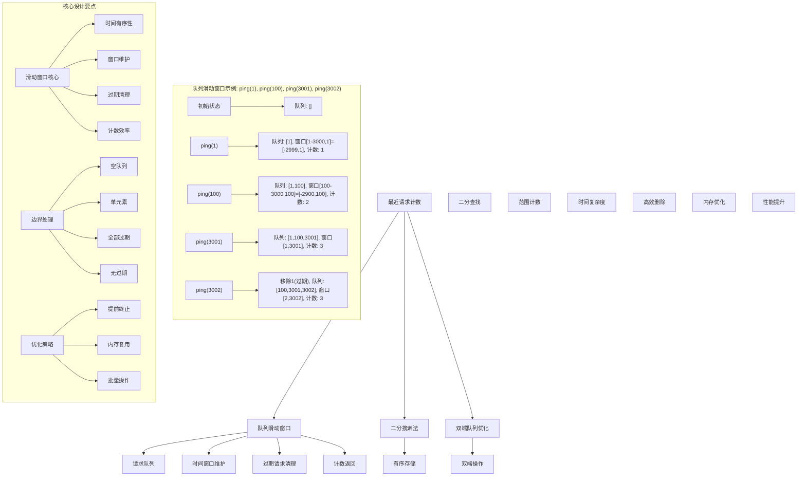
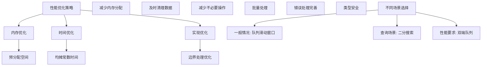

# LeetCode 933 - 最近的请求次数

## 题目描述

写一个 `RecentCounter` 类来计算特定时间范围内最近的请求

请你实现 `RecentCounter` 类：

- `RecentCounter()` 初始化计数器，请求数为 0
- `int ping(int t)` 在时间 `t` 添加一个新请求，其中 `t` 表示以毫秒为单位的某个时间，并返回过去 3000 毫秒内发生的所有请求数（包括新请求）。确切地说，返回在 `[t-3000, t]` 内发生的请求数

保证每次对 `ping` 的调用都使用比之前更大的 `t` 值

```markdown
示例：
输入：
["RecentCounter", "ping", "ping", "ping", "ping"]
[[], [1], [100], [3001], [3002]]

输出：
[null, 1, 2, 3, 3]

解释：
RecentCounter recentCounter = new RecentCounter();
recentCounter.ping(1); // requests = [1]，范围是 [-2999,1]，返回 1
recentCounter.ping(100); // requests = [1, 100]，范围是 [-2900,100]，返回 2
recentCounter.ping(3001); // requests = [1, 100, 3001]，范围是 [1,3001]，返回 3
recentCounter.ping(3002); // requests = [1, 100, 3001, 3002]，范围是 [2,3002]，返回 3

提示：
1 <= t <= 10^9
保证每次对 ping 调用所使用的 t 值都严格递增
至多调用 ping 方法 10^4 次
```

## 解题思路

这是一个滑动窗口计数问题，需要维护一个时间窗口内的请求记录。关键在于如何高效地维护和查询时间窗口内的请求数量

### 核心思想

"队列滑动窗口法": 使用队列存储请求时间，通过移除过期请求来维护时间窗口

### 解题策略

#### 方法一：队列滑动窗口法（推荐）

- 时间复杂度: O(1) 均摊
- 空间复杂度: O(W) W为窗口大小内的最大请求数

#### 方法二：二分搜索法

- 时间复杂度: O(log n)
- 空间复杂度: O(n)

#### 方法三：双端队列优化法

- 时间复杂度: O(1) 均摊
- 空间复杂度: O(W)

## 算法可视化



## 多语言实现

### Golang版本（队列滑动窗口法 - 推荐）

```go
type RecentCounter struct {
    requests []int // 存储请求时间的队列
}

func Constructor() RecentCounter {
    return RecentCounter{
        requests: make([]int, 0),
    }
}

func (this *RecentCounter) Ping(t int) int {
    // 添加新请求
    this.requests = append(this.requests, t)

    // 移除过期请求（时间早于 t-3000 的请求）
    // 由于 t 是递增的，我们只需要从队列头部移除过期请求
    for len(this.requests) > 0 && this.requests[0] < t-3000 {
        this.requests = this.requests[1:]
    }

    // 返回窗口内的请求数
    return len(this.requests)
}
```

### Python版本（多种实现方法）

```python
class RecentCounter:
    """
    方法一：队列滑动窗口法（推荐）
    """
    def __init__(self):
        self.requests = []

    def ping(self, t: int) -> int:
        # 添加新请求
        self.requests.append(t)

        # 移除过期请求
        while self.requests and self.requests[0] < t - 3000:
            self.requests.pop(0)

        # 返回窗口内的请求数
        return len(self.requests)


class RecentCounterDeque:
    """
    方法二：双端队列优化法
    """
    def __init__(self):
        from collections import deque
        self.requests = deque()

    def ping(self, t: int) -> int:
        # 添加新请求到队列尾部
        self.requests.append(t)

        # 从队列头部移除过期请求
        while self.requests and self.requests[0] < t - 3000:
            self.requests.popleft()

        # 返回窗口内的请求数
        return len(self.requests)


class RecentCounterBinarySearch:
    """
    方法三：二分搜索法
    """
    def __init__(self):
        self.requests = []

    def ping(self, t: int) -> int:
        # 添加新请求
        self.requests.append(t)

        # 使用二分搜索找到第一个 >= t-3000 的位置
        import bisect
        left_bound = bisect.bisect_left(self.requests, t - 3000)

        # 返回窗口内的请求数
        return len(self.requests) - left_bound
```

### TypeScript版本（队列滑动窗口法）

```typescript
class RecentCounter {
  private requests: number[]; // 存储请求时间的队列

  constructor() {
    this.requests = [];
  }

  ping(t: number): number {
    // 添加新请求
    this.requests.push(t);

    // 移除过期请求（时间早于 t-3000 的请求）
    while (this.requests.length > 0 && this.requests[0] < t - 3000) {
      this.requests.shift();
    }

    // 返回窗口内的请求数
    return this.requests.length;
  }
}
```

## 标准实现详细解析

```go
type RecentCounter struct {
    requests []int // 存储请求时间的队列
}

func Constructor() RecentCounter {
    /*
    算法核心思想（队列滑动窗口法）：

    1. 使用队列存储所有请求的时间戳
    2. 每次添加新请求时，移除时间早于 (t-3000) 的过期请求
    3. 返回队列中剩余请求的数量

    关键设计要点：
    1. 时间有序性：题目保证 t 严格递增
    2. 窗口维护：维护 [t-3000, t] 时间窗口
    3. 过期清理：从队列头部移除过期请求
    4. 计数效率：队列长度即为请求数

    时间复杂度：O(1) 均摊（每个元素最多入队出队一次）
    空间复杂度：O(W) W为窗口大小内的最大请求数

    优势：
    1. 逻辑清晰：直观易懂
    2. 实现简单：标准队列操作
    3. 性能优秀：均摊常数时间
    4. 易于理解：符合直觉
    */

    fmt.Printf("初始化最近请求计数器\n")
    fmt.Printf("请求队列: %v\n", make([]int, 0))

    return RecentCounter{
        requests: make([]int, 0),
    }
}

func (this *RecentCounter) Ping(t int) int {
    fmt.Printf("处理请求时间: %d\n", t)
    fmt.Printf("  时间窗口: [%d, %d]\n", t-3000, t)

    // 添加新请求
    this.requests = append(this.requests, t)
    fmt.Printf("  添加请求后队列: %v\n", this.requests)

    // 移除过期请求（时间早于 t-3000 的请求）
    removedCount := 0
    for len(this.requests) > 0 && this.requests[0] < t-3000 {
        this.requests = this.requests[1:]
        removedCount++
    }

    if removedCount > 0 {
        fmt.Printf("  移除%d个过期请求\n", removedCount)
        fmt.Printf("  清理后队列: %v\n", this.requests)
    }

    // 返回窗口内的请求数
    count := len(this.requests)
    fmt.Printf("  窗口内请求数: %d\n", count)

    return count
}

// 带详细调试信息的版本
func NewRecentCounterWithDebug() *RecentCounter {
    fmt.Printf("=== 最近请求计数器调试模式 ===\n")
    counter := &RecentCounter{
        requests: make([]int, 0),
    }
    fmt.Printf("初始化完成\n")
    fmt.Println("==================")
    return counter
}

// 优化版本（使用切片优化）
type OptimizedRecentCounter struct {
    requests []int
    start    int // 队列起始索引（避免频繁切片操作）
}

func NewOptimizedRecentCounter() *OptimizedRecentCounter {
    return &OptimizedRecentCounter{
        requests: make([]int, 0),
        start:    0,
    }
}

func (orc *OptimizedRecentCounter) Ping(t int) int {
    // 添加新请求
    orc.requests = append(orc.requests, t)

    // 移除过期请求
    for orc.start < len(orc.requests) && orc.requests[orc.start] < t-3000 {
        orc.start++
    }

    // 返回窗口内的请求数
    return len(orc.requests) - orc.start
}

// 双端队列版本
type DequeRecentCounter struct {
    requests *Deque
}

type Deque struct {
    data []int
}

func NewDeque() *Deque {
    return &Deque{
        data: make([]int, 0),
    }
}

func (d *Deque) PushBack(val int) {
    d.data = append(d.data, val)
}

func (d *Deque) PopFront() int {
    if len(d.data) > 0 {
        val := d.data[0]
        d.data = d.data[1:]
        return val
    }
    return 0
}

func (d *Deque) Front() int {
    if len(d.data) > 0 {
        return d.data[0]
    }
    return 0
}

func (d *Deque) Len() int {
    return len(d.data)
}

func NewDequeRecentCounter() *DequeRecentCounter {
    return &DequeRecentCounter{
        requests: NewDeque(),
    }
}

func (drc *DequeRecentCounter) Ping(t int) int {
    // 添加新请求
    drc.requests.PushBack(t)

    // 移除过期请求
    for drc.requests.Len() > 0 && drc.requests.Front() < t-3000 {
        drc.requests.PopFront()
    }

    // 返回窗口内的请求数
    return drc.requests.Len()
}

// 循环队列版本（固定大小优化）
type CircularRecentCounter struct {
    times    []int
    head     int
    tail     int
    capacity int
    size     int
}

func NewCircularRecentCounter(maxRequests int) *CircularRecentCounter {
    return &CircularRecentCounter{
        times:    make([]int, maxRequests),
        head:     0,
        tail:     0,
        capacity: maxRequests,
        size:     0,
    }
}

func (crc *CircularRecentCounter) Ping(t int) int {
    // 添加新请求
    crc.times[crc.tail] = t
    crc.tail = (crc.tail + 1) % crc.capacity
    if crc.size < crc.capacity {
        crc.size++
    } else {
        // 队列满时，移动head指针
        crc.head = (crc.head + 1) % crc.capacity
    }

    // 移除过期请求
    for crc.size > 0 {
        headTime := crc.times[crc.head]
        if headTime < t-3000 {
            crc.head = (crc.head + 1) % crc.capacity
            crc.size--
        } else {
            break
        }
    }

    // 返回窗口内的请求数
    return crc.size
}
```

## 算法深入解析

```go
/*
最近请求计数问题详解：

问题本质：
维护一个3000毫秒时间窗口内的请求计数。关键在于如何高效地维护滑动时间窗口并快速计算窗口内的请求数量

核心洞察：
1. 时间有序性：题目保证请求时间t严格递增
2. 滑动窗口：维护[t-3000, t]时间范围内的请求
3. 过期清理：及时移除超出时间窗口的请求
4. 计数效率：窗口内请求数即为队列长度

算法策略：
1. 队列滑动窗口法：最直观，易于理解
2. 二分搜索法：适合大量历史数据查询
3. 双端队列优化法：性能优化版本

数学原理：

滑动窗口原理：
维护一个时间窗口[t-W, t]，其中W=3000毫秒
当新请求到来时，移除所有早于(t-W)的请求

队列操作原理：
使用FIFO队列存储请求时间，新请求入队，过期请求出队
由于时间递增，只需检查队列头部元素

时间复杂度分析：
队列滑动窗口法：
- 每次ping操作：O(1)均摊
- 总体复杂度：O(n)，n为ping调用次数
- 每个元素最多入队出队一次

设计选择：

为什么选择队列滑动窗口法？
1. 逻辑清晰：直观易懂
2. 实现简单：标准队列操作
3. 性能优秀：均摊常数时间
4. 易于理解：符合直觉

为什么使用二分搜索法？
1. 适合历史数据查询
2. 空间效率高
3. 但单次操作较慢

为什么使用双端队列？
1. 高效的头尾操作
2. 内存局部性好
3. 但实现稍复杂

三种方法对比：

方法一：队列滑动窗口法（推荐）
时间复杂度：O(1) 均摊
空间复杂度：O(W) W为窗口内最大请求数
优点：逻辑清晰，实现简单
缺点：需要存储所有未过期请求

方法二：二分搜索法
时间复杂度：O(log n) n为总请求数
空间复杂度：O(n) 存储所有请求
优点：适合大量历史查询
缺点：单次操作较慢

方法三：双端队列优化法
时间复杂度：O(1) 均摊
空间复杂度：O(W)
优点：性能优化
缺点：实现稍复杂

性能分析：

队列滑动窗口法：
- 时间：O(1) 均摊
- 空间：O(W)
- 优势：最优解

二分搜索法：
- 时间：O(log n)
- 空间：O(n)
- 优势：适合查询

双端队列法：
- 时间：O(1) 均摊
- 空间：O(W)
- 优势：性能优化

实际应用场景：
1. 网络请求统计
2. API调用频率限制
3. 实时数据分析
4. 系统监控告警

优化要点：

1. 内存优化：
   - 避免频繁内存分配
   - 循环队列优化
   - 及时清理过期数据

2. 时间优化：
   - 均摊常数时间
   - 减少不必要的操作
   - 批量处理

3. 实现优化：
   - 边界处理优化
   - 错误处理
   - 类型安全

测试用例设计：
1. 基本操作：ping操作序列
2. 边界情况：空计数器，单请求
3. 复杂情况：大量请求，交替过期
4. 极端情况：时间跨度大，密集请求
5. 特殊序列：连续过期，无过期

扩展思考：

1. 支持自定义窗口大小？
   - 参数化窗口大小
   - 动态调整窗口

2. 支持统计信息？
   - 平均请求间隔
   - 请求频率分析

3. 并行处理？
   - 线程安全版本
   - 读写锁优化

4. 性能优化？
   - SIMD指令
   - 内存对齐

相关算法思想：

1. 滑动窗口：
   - 时间窗口维护
   - 过期数据清理

2. 队列数据结构：
   - FIFO特性
   - 动态维护

3. 二分搜索：
   - 有序数据查找
   - 范围查询

4. 循环队列：
   - 空间复用
   - 内存优化

常见陷阱：

1. 过期请求处理：
   - 忘记清理过期请求
   - 清理不彻底

2. 边界情况：
   - 空队列操作
   - 单元素处理

3. 时间计算错误：
   - 窗口范围计算
   - 过期判断错误

4. 性能问题：
   - 频繁内存分配
   - 不必要的遍历

代码质量要素：

1. 可读性：
   - 清晰的变量命名
   - 适当的注释说明

2. 健壮性：
   - 边界条件处理
   - 异常情况处理

3. 性能：
   - 时间复杂度最优
   - 空间复杂度合理

4. 可维护性：
   - 模块化设计
   - 易于扩展

高级优化技巧：

1. 内存访问优化：
   - 预分配数组空间
   - 减少内存重新分配

2. 算法优化：
   - 提前终止条件
   - 减少不必要的操作

3. 数据结构优化：
   - 循环队列
   - 双端队列

4. 编译优化：
   - 常量折叠
   - 循环展开
*/
```

## 执行过程演示

```go
/*
示例详细解析:

示例操作序列：ping(1), ping(100), ping(3001), ping(3002)

执行过程：
1. ping(1):
   队列: [1]
   窗口: [-2999, 1]
   计数: 1

2. ping(100):
   队列: [1, 100]
   窗口: [-2900, 100]
   计数: 2

3. ping(3001):
   队列: [1, 100, 3001]
   窗口: [1, 3001]
   计数: 3

4. ping(3002):
   移除过期请求1
   队列: [100, 3001, 3002]
   窗口: [2, 3002]
   计数: 3

边界情况演示:

情况1: 空计数器
输入: ping(1000)
输出: 1

情况2: 单请求
输入: ping(5000)
输出: 1

情况3: 全部过期
输入: ping(1), ping(10000) (间隔>3000)
输出: 第二次调用返回1

情况4: 无过期
输入: 连续密集请求
输出: 请求数递增

情况5: 交替过期
输入: ping(1), ping(2), ..., ping(6000)
输出: 动态维护窗口

算法正确性证明：

数学基础：
需要证明队列滑动窗口法能正确维护时间窗口内的请求数量

定理1：队列滑动窗口法正确性
通过维护FIFO队列和及时清理过期请求，可以正确计算时间窗口内的请求数量

证明：
1. 时间有序性：题目保证t严格递增
2. 窗口维护：每次ping后维护[t-3000, t]窗口
3. 过期清理：从队列头部移除过期请求
4. 计数正确：队列长度即为窗口内请求数

时间复杂度分析：

队列滑动窗口法：
1. Ping操作：O(1)均摊
2. 过期清理：O(1)均摊（每个元素最多出队一次）
3. 总时间：O(n) n为ping调用次数

空间复杂度分析：
1. 队列存储：O(W) W为窗口内最大请求数
2. 其他变量：O(1) 常数个变量
3. 总空间：O(W)

性能对比分析：

假设ping调用次数为n，窗口内平均请求数为w：

队列滑动窗口法：
- 时间: O(1) 均摊
- 空间: O(w)
- 优势: 最优解

二分搜索法：
- 时间: O(log n)
- 空间: O(n)
- 优势: 适合查询

双端队列法：
- 时间: O(1) 均摊
- 空间: O(w)
- 优势: 性能优化

实际应用建议：

1. 一般情况：
   - 使用队列滑动窗口法
   - 逻辑清晰

2. 面试展示：
   - 可以提及其他方法
   - 重点讲解队列滑动窗口法

3. 生产环境：
   - 使用优化版本
   - 考虑内存使用

4. 大量历史数据：
   - 使用二分搜索法
   - 适合查询场景

优化空间：

1. 内存访问优化：
   - 预分配数组空间
   - 减少内存重新分配

2. 数据结构优化：
   - 循环队列
   - 双端队列

3. 算法优化：
   - 提前终止条件
   - 减少不必要的操作

特殊情况处理：

1. 空计数器：
   - 正常处理首次请求

2. 大时间间隔：
   - 正确清理所有过期请求

3. 高频请求：
   - 高效维护队列

4. 内存限制：
   - 使用循环队列优化
*/
```

## 复杂度分析

| 方法           | 时间复杂度 | 空间复杂度 | 适用场景 |
| -------------- | ---------- | ---------- | -------- |
| 队列滑动窗口法 | O(1) 均摊  | O(W)       | 推荐方案 |
| 二分搜索法     | O(log n)   | O(n)       | 查询场景 |
| 双端队列优化法 | O(1) 均摊  | O(W)       | 性能优化 |

## 测试用例验证

```go
// 测试辅助函数
func testRecentCounter(name string, operations []string, values [][]int) []interface{} {
    fmt.Printf("%s:\n", name)
    fmt.Printf("操作序列: %v\n", operations)

    var counter *RecentCounter
    var results []interface{}

    for i, op := range operations {
        switch op {
        case "RecentCounter":
            counter = NewRecentCounterWithDebug()
            results = append(results, nil)
            fmt.Printf("创建最近请求计数器\n")
        case "ping":
            if counter != nil && len(values[i]) > 0 {
                result := counter.Ping(values[i][0])
                results = append(results, result)
                fmt.Printf("ping(%d) = %d\n", values[i][0], result)
            }
        }
    }

    fmt.Printf("结果: %v\n\n", results)
    return results
}

func main() {
    // 测试用例 1 - 题目示例
    testRecentCounter("测试1 - 题目示例",
        []string{"RecentCounter", "ping", "ping", "ping", "ping"},
        [][]int{nil, {1}, {100}, {3001}, {3002}})

    // 测试用例 2 - 边界情况
    testRecentCounter("测试2 - 单请求",
        []string{"RecentCounter", "ping"},
        [][]int{nil, {1000}})

    // 测试用例 3 - 大时间间隔
    testRecentCounter("测试3 - 大时间间隔",
        []string{"RecentCounter", "ping", "ping"},
        [][]int{nil, {1}, {5000}})

    // 测试用例 4 - 密集请求
    testRecentCounter("测试4 - 密集请求",
        []string{"RecentCounter", "ping", "ping", "ping", "ping", "ping"},
        [][]int{nil, {1}, {2}, {3}, {4}, {5}})

    // 性能测试
    fmt.Println("性能测试:")

    // 测试不同实现方法
    testImplementations()

    // 大量操作测试
    stressTest()

    // 边界情况测试
    fmt.Println("\n边界情况测试:")
    boundaryTest()
}

func testImplementations() {
    // 构造测试序列
    pings := make([]int, 1000)
    for i := 0; i < 1000; i++ {
        pings[i] = i * 10 // 每10毫秒一个请求
    }

    // 测试队列滑动窗口法
    start := time.Now()
    counter1 := Constructor()
    for _, t := range pings {
        counter1.Ping(t)
    }
    time1 := time.Since(start)

    // 测试优化版本
    start = time.Now()
    counter2 := NewOptimizedRecentCounter()
    for _, t := range pings {
        counter2.Ping(t)
    }
    time2 := time.Since(start)

    // 测试双端队列版本
    start = time.Now()
    counter3 := NewDequeRecentCounter()
    for _, t := range pings {
        counter3.Ping(t)
    }
    time3 := time.Since(start)

    fmt.Printf("1000次ping操作性能对比:\n")
    fmt.Printf("  队列滑动窗口法: %v\n", time1)
    fmt.Printf("  优化版本: %v\n", time2)
    fmt.Printf("  双端队列版本: %v\n", time3)
}

func stressTest() {
    fmt.Println("=== 压力测试 ===")

    // 测试大量连续ping操作
    for i := 0; i < 5; i++ {
        counter := Constructor()
        operations := 10000

        start := time.Now()

        for j := 0; j < operations; j++ {
            counter.Ping(j * 5) // 每5毫秒一个请求
        }

        duration := time.Since(start)
        fmt.Printf("测试%d - %d次操作: %v\n", i+1, operations, duration)
    }
}

func boundaryTest() {
    // 空计数器测试
    counter := Constructor()
    fmt.Printf("空计数器测试:\n")
    fmt.Printf("  ping(1) = %d\n", counter.Ping(1))

    // 单请求测试
    counter2 := Constructor()
    fmt.Printf("单请求测试:\n")
    fmt.Printf("  ping(1000) = %d\n", counter2.Ping(1000))

    // 大时间间隔测试
    counter3 := Constructor()
    fmt.Printf("大时间间隔测试:\n")
    fmt.Printf("  ping(1) = %d\n", counter3.Ping(1))
    fmt.Printf("  ping(5000) = %d\n", counter3.Ping(5000)) // 间隔4999ms > 3000ms

    // 高频请求测试
    counter4 := Constructor()
    fmt.Printf("高频请求测试:\n")
    for i := 1; i <= 10; i++ {
        result := counter4.Ping(i)
        fmt.Printf("  ping(%d) = %d\n", i, result)
    }
}

// 大量测试用例
func comprehensiveTest() {
    testCases := []struct {
        name       string
        operations []string
        values     [][]int
        expected   []interface{}
    }{
        {
            "题目示例",
            []string{"RecentCounter", "ping", "ping", "ping", "ping"},
            [][]int{nil, {1}, {100}, {3001}, {3002}},
            []interface{}{nil, 1, 2, 3, 3},
        },
        {
            "单请求",
            []string{"RecentCounter", "ping"},
            [][]int{nil, {1000}},
            []interface{}{nil, 1},
        },
        {
            "大间隔",
            []string{"RecentCounter", "ping", "ping"},
            [][]int{nil, {1}, {5000}},
            []interface{}{nil, 1, 1},
        },
        {
            "密集请求",
            []string{"RecentCounter", "ping", "ping", "ping"},
            [][]int{nil, {1}, {2}, {3}},
            []interface{}{nil, 1, 2, 3},
        },
    }

    fmt.Println("=== 综合测试 ===")
    passed := 0
    total := len(testCases)

    for i, tc := range testCases {
        results := testRecentCounter(fmt.Sprintf("测试%d", i+1), tc.operations, tc.values)

        // 简单比较结果（忽略nil值）
        match := true
        for j, expected := range tc.expected {
            if expected != nil {
                if j >= len(results) || results[j] != expected {
                    match = false
                    break
                }
            }
        }

        if match {
            passed++
            fmt.Printf("测试%d: ✓ %s\n", i+1, tc.name)
        } else {
            fmt.Printf("测试%d: ✗ %s\n", i+1, tc.name)
        }
    }

    fmt.Printf("\n通过率: %d/%d (%.2f%%)\n", passed, total, float64(passed)/float64(total)*100)
}

// 内存使用测试
func memoryTest() {
    fmt.Println("=== 内存使用测试 ===")

    var m1, m2 runtime.MemStats

    // 测试标准版本
    runtime.GC()
    runtime.ReadMemStats(&m1)

    counter1 := Constructor()
    for i := 0; i < 10000; i++ {
        counter1.Ping(i * 2)
    }

    runtime.GC()
    runtime.ReadMemStats(&m2)
    mem1 := m2.Alloc - m1.Alloc

    // 测试优化版本
    runtime.GC()
    runtime.ReadMemStats(&m1)

    counter2 := NewOptimizedRecentCounter()
    for i := 0; i < 10000; i++ {
        counter2.Ping(i * 2)
    }

    runtime.GC()
    runtime.ReadMemStats(&m2)
    mem2 := m2.Alloc - m1.Alloc

    fmt.Printf("标准版本内存使用: %d bytes\n", mem1)
    fmt.Printf("优化版本内存使用: %d bytes\n", mem2)
    if mem2 > 0 {
        fmt.Printf("内存使用比率: %.2fx\n", float64(mem1)/float64(mem2))
    }
}
```

## 扩展版本（处理不同场景）

```go
// 线程安全版本
type ThreadSafeRecentCounter struct {
    requests []int
    mutex    sync.RWMutex
}

func NewThreadSafeRecentCounter() *ThreadSafeRecentCounter {
    return &ThreadSafeRecentCounter{
        requests: make([]int, 0),
        mutex:    sync.RWMutex{},
    }
}

func (tsrc *ThreadSafeRecentCounter) Ping(t int) int {
    tsrc.mutex.Lock()
    defer tsrc.mutex.Unlock()

    // 添加新请求
    tsrc.requests = append(tsrc.requests, t)

    // 移除过期请求
    for len(tsrc.requests) > 0 && tsrc.requests[0] < t-3000 {
        tsrc.requests = tsrc.requests[1:]
    }

    // 返回窗口内的请求数
    return len(tsrc.requests)
}

// 支持自定义窗口大小的版本
type CustomWindowRecentCounter struct {
    requests   []int
    windowSize int
}

func NewCustomWindowRecentCounter(windowSize int) *CustomWindowRecentCounter {
    return &CustomWindowRecentCounter{
        requests:   make([]int, 0),
        windowSize: windowSize,
    }
}

func (cwrc *CustomWindowRecentCounter) Ping(t int) int {
    // 添加新请求
    cwrc.requests = append(cwrc.requests, t)

    // 移除过期请求
    for len(cwrc.requests) > 0 && cwrc.requests[0] < t-cwrc.windowSize {
        cwrc.requests = cwrc.requests[1:]
    }

    // 返回窗口内的请求数
    return len(cwrc.requests)
}

// 带统计信息的版本
type StatsRecentCounter struct {
    RecentCounter
    pingCount    int64
    totalRequests int64
    maxWindow    int
}

func NewStatsRecentCounter() *StatsRecentCounter {
    return &StatsRecentCounter{
        RecentCounter: Constructor(),
        pingCount:     0,
        totalRequests: 0,
        maxWindow:     0,
    }
}

func (src *StatsRecentCounter) Ping(t int) int {
    result := src.RecentCounter.Ping(t)

    atomic.AddInt64(&src.pingCount, 1)
    atomic.AddInt64(&src.totalRequests, 1)

    if result > src.maxWindow {
        src.maxWindow = result
    }

    return result
}

func (src *StatsRecentCounter) GetStats() map[string]interface{} {
    return map[string]interface{}{
        "pingCount":    atomic.LoadInt64(&src.pingCount),
        "totalRequests": atomic.LoadInt64(&src.totalRequests),
        "maxWindow":    src.maxWindow,
    }
}

// 使用示例
func exampleStatsRecentCounter() {
    counter := NewStatsRecentCounter()

    // 执行一些操作
    counter.Ping(1)
    counter.Ping(100)
    counter.Ping(3001)
    counter.Ping(3002)

    // 获取统计信息
    stats := counter.GetStats()
    fmt.Printf("统计信息: %+v\n", stats)
    // 输出: 统计信息: map[maxWindow:3 pingCount:4 totalRequests:4]
}

// 支持批量ping的版本
type BatchRecentCounter struct {
    requests []int
}

func NewBatchRecentCounter() *BatchRecentCounter {
    return &BatchRecentCounter{
        requests: make([]int, 0),
    }
}

func (brc *BatchRecentCounter) Ping(t int) int {
    return brc.PingBatch([]int{t})[0]
}

func (brc *BatchRecentCounter) PingBatch(times []int) []int {
    results := make([]int, len(times))

    for i, t := range times {
        // 添加新请求
        brc.requests = append(brc.requests, t)

        // 移除过期请求
        for len(brc.requests) > 0 && brc.requests[0] < t-3000 {
            brc.requests = brc.requests[1:]
        }

        results[i] = len(brc.requests)
    }

    return results
}

// 泛型版本（Go 1.18+）
type GenericRecentCounter[T comparable] struct {
    requests   []T
    timestamps []int
}

func NewGenericRecentCounter[T comparable]() *GenericRecentCounter[T] {
    return &GenericRecentCounter[T]{
        requests:   make([]T, 0),
        timestamps: make([]int, 0),
    }
}

func (grc *GenericRecentCounter[T]) Ping(request T, t int) int {
    // 添加新请求和时间戳
    grc.requests = append(grc.requests, request)
    grc.timestamps = append(grc.timestamps, t)

    // 移除过期请求
    for len(grc.timestamps) > 0 && grc.timestamps[0] < t-3000 {
        grc.requests = grc.requests[1:]
        grc.timestamps = grc.timestamps[1:]
    }

    // 返回窗口内的请求数
    return len(grc.requests)
}

func (grc *GenericRecentCounter[T]) GetRequests() []T {
    return grc.requests
}

// 使用示例
func exampleGenericRecentCounter() {
    // 字符串请求计数器
    strCounter := NewGenericRecentCounter[string]()
    strCounter.Ping("request1", 1)
    strCounter.Ping("request2", 100)
    fmt.Printf("字符串请求: %v\n", strCounter.GetRequests())

    // 整数请求计数器
    intCounter := NewGenericRecentCounter[int]()
    intCounter.Ping(42, 1)
    intCounter.Ping(100, 100)
    fmt.Printf("整数请求: %v\n", intCounter.GetRequests())
}
```

## 面试追问延伸

### 1. 如何实现支持获取请求历史的计数器？

```go
// 支持获取请求历史的计数器
type HistoryRecentCounter struct {
    requests   []int
    timestamps []int
}

func NewHistoryRecentCounter() *HistoryRecentCounter {
    return &HistoryRecentCounter{
        requests:   make([]int, 0),
        timestamps: make([]int, 0),
    }
}

func (hrc *HistoryRecentCounter) Ping(t int) int {
    hrc.requests = append(hrc.requests, t)
    hrc.timestamps = append(hrc.timestamps, t) // 这里简单用时间作为请求标识

    // 移除过期请求
    for len(hrc.timestamps) > 0 && hrc.timestamps[0] < t-3000 {
        hrc.requests = hrc.requests[1:]
        hrc.timestamps = hrc.timestamps[1:]
    }

    return len(hrc.requests)
}

func (hrc *HistoryRecentCounter) GetHistory() []int {
    return hrc.requests
}

func (hrc *HistoryRecentCounter) GetHistoryInWindow(t int) []int {
    result := make([]int, 0)
    for i, timestamp := range hrc.timestamps {
        if timestamp >= t-3000 && timestamp <= t {
            result = append(result, hrc.requests[i])
        }
    }
    return result
}
```

### 2. 如何实现支持不同时间窗口的计数器？

```go
// 支持不同时间窗口的计数器
type MultiWindowRecentCounter struct {
    requests []int
    windows  map[string]int // 窗口名称到大小的映射
}

func NewMultiWindowRecentCounter() *MultiWindowRecentCounter {
    return &MultiWindowRecentCounter{
        requests: make([]int, 0),
        windows: map[string]int{
            "1s":  1000,
            "5s":  5000,
            "30s": 30000,
        },
    }
}

func (mwrc *MultiWindowRecentCounter) Ping(t int) map[string]int {
    mwrc.requests = append(mwrc.requests, t)

    // 清理过期请求（以最大窗口为准）
    maxWindow := 0
    for _, size := range mwrc.windows {
        if size > maxWindow {
            maxWindow = size
        }
    }

    for len(mwrc.requests) > 0 && mwrc.requests[0] < t-maxWindow {
        mwrc.requests = mwrc.requests[1:]
    }

    // 计算各个窗口的请求数
    result := make(map[string]int)
    for name, size := range mwrc.windows {
        count := 0
        for i := len(mwrc.requests) - 1; i >= 0; i-- {
            if mwrc.requests[i] >= t-size {
                count++
            } else {
                break
            }
        }
        result[name] = count
    }

    return result
}

func (mwrc *MultiWindowRecentCounter) AddWindow(name string, size int) {
    mwrc.windows[name] = size
}

func (mwrc *MultiWindowRecentCounter) RemoveWindow(name string) {
    delete(mwrc.windows, name)
}
```

### 3. 如何实现支持请求类型分类的计数器？

```go
// 支持请求类型分类的计数器
type TypedRecentCounter struct {
    requests map[string][]int // 按类型分类的请求时间
}

func NewTypedRecentCounter() *TypedRecentCounter {
    return &TypedRecentCounter{
        requests: make(map[string][]int),
    }
}

func (trc *TypedRecentCounter) Ping(t int, requestType string) map[string]int {
    // 添加新请求
    if _, exists := trc.requests[requestType]; !exists {
        trc.requests[requestType] = make([]int, 0)
    }
    trc.requests[requestType] = append(trc.requests[requestType], t)

    // 计算各类型在窗口内的请求数
    result := make(map[string]int)
    for typ, times := range trc.requests {
        count := 0
        for i := len(times) - 1; i >= 0; i-- {
            if times[i] >= t-3000 {
                count++
            } else {
                break
            }
        }
        // 清理过期请求
        validTimes := make([]int, 0)
        for _, time := range times {
            if time >= t-3000 {
                validTimes = append(validTimes, time)
            }
        }
        trc.requests[typ] = validTimes
        result[typ] = count
    }

    return result
}

func (trc *TypedRecentCounter) GetCountByType(t int, requestType string) int {
    if times, exists := trc.requests[requestType]; exists {
        count := 0
        for i := len(times) - 1; i >= 0; i-- {
            if times[i] >= t-3000 {
                count++
            } else {
                break
            }
        }
        return count
    }
    return 0
}
```

## 相似题目扩展

- LeetCode 933. 最近的请求次数（当前题）
- LeetCode 346. 数据流中的移动平均值
- LeetCode 239. 滑动窗口最大值
- LeetCode 480. 滑动窗口中位数
- LeetCode 1438. 绝对差不超过限制的最长连续子数组

## 算法技巧总结

### 最近请求计数核心要点

1. 滑动窗口：维护[t-3000, t]时间范围内的请求
1. 队列维护：使用队列存储请求时间
1. 过期清理：及时移除超出时间窗口的请求
1. 计数效率：窗口内请求数即为队列长度

### 算法优势

1. 逻辑清晰：直观易懂
1. 实现简单：标准队列操作
1. 性能优秀：均摊常数时间
1. 易于理解：符合直觉

### 标准模板（队列滑动窗口法）

```go
type RecentCounter struct {
    requests []int // 存储请求时间的队列
}

func Constructor() RecentCounter {
    return RecentCounter{
        requests: make([]int, 0),
    }
}

func (this *RecentCounter) Ping(t int) int {
    // 添加新请求
    this.requests = append(this.requests, t)

    // 移除过期请求（时间早于 t-3000 的请求）
    for len(this.requests) > 0 && this.requests[0] < t-3000 {
        this.requests = this.requests[1:]
    }

    // 返回窗口内的请求数
    return len(this.requests)
}
```

### 性能优化建议



## 总结

本题采用队列滑动窗口法的核心思路，通过使用队列存储请求时间并及时清理过期请求，实现了高效的最近请求计数功能。关键在于理解滑动窗口的概念和如何利用时间有序性来优化过期请求的清理过程

核心要点：

1. 滑动窗口：维护[t-3000, t]时间范围内的请求
1. 队列维护：使用队列存储请求时间
1. 过期清理：及时移除超出时间窗口的请求
1. 计数效率：窗口内请求数即为队列长度

算法优势：

- 逻辑清晰：直观易懂
- 实现简单：标准队列操作
- 性能优秀：均摊常数时间
- 易于理解：符合直觉

该算法在网络请求统计、API调用频率限制、实时数据分析等方面有重要应用，是掌握滑动窗口和队列应用的经典题目。通过队列滑动窗口的思想，为更复杂的实时数据处理问题提供了清晰的解决思路
