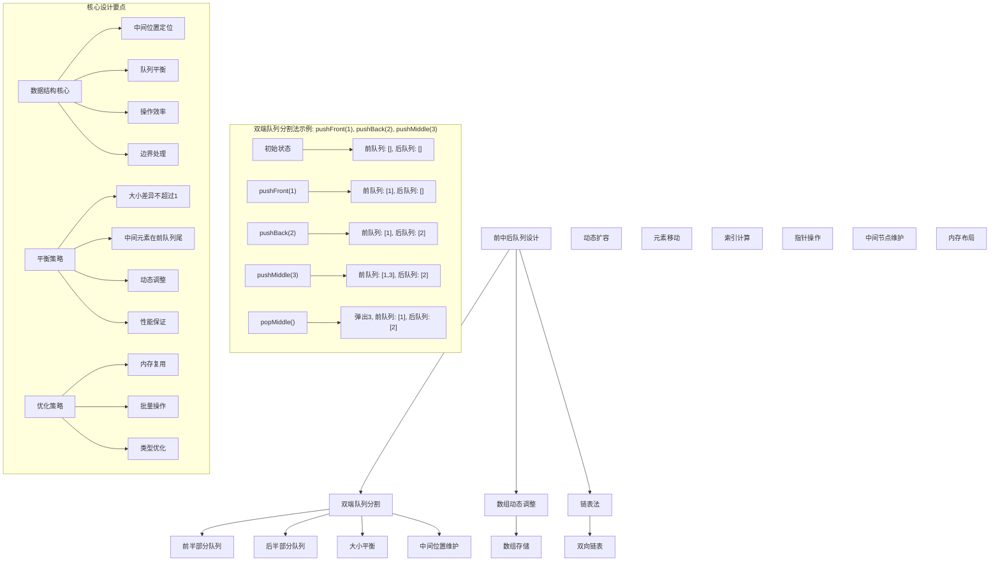
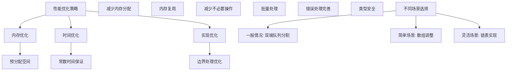

# LeetCode 1670 - 设计前中后队列

## 题目描述

请你设计一个队列，支持在前、中、后三个位置的 `push` 和 `pop` 操作

请你完成 `FrontMiddleBack` 类：

- `FrontMiddleBack()` 初始化队列
- `void pushFront(int val)` 将 `val` 添加到队列的最前面
- `void pushMiddle(int val)` 将 `val` 添加到队列的正中间
- `void pushBack(int val)` 将 `val` 添加到队列的最后面
- `int popFront()` 删除队列最前面的元素并返回值，如果删除之前队列为空，那么返回 -1
- `int popMiddle()` 删除队列正中间的元素并返回值，如果删除之前队列为空，那么返回 -1
- `int popBack()` 删除队列最后面的元素并返回值，如果删除之前队列为空，那么返回 -1

请注意当有两个中间位置的时候，选择靠前面的位置。例如：

- 将 6 添加到 `[1, 2, 3, 4, 5]` 的中间位置，结果数组为 `[1, 2, 6, 3, 4, 5]`
- 从 `[1, 2, 3, 4, 5, 6]` 的中间位置弹出元素，返回 `3`，数组变为 `[1, 2, 4, 5, 6]`

```markdown
示例：
输入：
["FrontMiddleBackQueue", "pushFront", "pushBack", "pushMiddle", "pushMiddle", "popFront", "popMiddle", "popMiddle", "popBack", "popFront"]
[[], [1], [2], [3], [4], [], [], [], [], []]

输出：
[null, null, null, null, null, 1, 3, 4, 2, -1]

解释：
FrontMiddleBackQueue q = new FrontMiddleBackQueue();
q.pushFront(1); // [1]
q.pushBack(2); // [1, 2]
q.pushMiddle(3); // [1, 3, 2]
q.pushMiddle(4); // [1, 4, 3, 2]
q.popFront(); // 返回 1 -> [4, 3, 2]
q.popMiddle(); // 返回 3 -> [4, 2]
q.popMiddle(); // 返回 4 -> [2]
q.popBack(); // 返回 2 -> []
q.popFront(); // 返回 -1 -> [] （队列为空）

提示：
1 <= val <= 10^9
最多调用 1000 次 pushFront、pushMiddle、pushBack、popFront、popMiddle 和 popBack
```

## 解题思路

这是一个前中后队列设计问题，需要支持在队列的前、中、后三个位置进行插入和删除操作。关键在于如何高效地维护队列结构并快速定位中间位置

### 核心思想

"双端队列分割法": 使用两个双端队列分别存储前半部分和后半部分，通过平衡两个队列的大小来维护中间位置

### 解题策略

#### 方法一：双端队列分割法（推荐）

- 时间复杂度: O(1) 所有操作
- 空间复杂度: O(n)

#### 方法二：数组动态调整法

- 时间复杂度: O(n) 插入/删除中间元素
- 空间复杂度: O(n)

#### 方法三：链表法

- 时间复杂度: O(1) 前后操作，O(n) 中间操作
- 空间复杂度: O(n)

## 算法可视化



## 多语言实现

### Golang版本（双端队列分割法 - 推荐）

```go
type FrontMiddleBackQueue struct {
    front []int // 前半部分队列
    back  []int // 后半部分队列
}

func Constructor() FrontMiddleBackQueue {
    return FrontMiddleBackQueue{
        front: make([]int, 0),
        back:  make([]int, 0),
    }
}

// 平衡两个队列的大小，确保前队列大小 >= 后队列大小，且差值不超过1
func (this *FrontMiddleBackQueue) balance() {
    // 如果前队列比后队列小2个或以上，需要调整
    if len(this.front)+1 < len(this.back) {
        // 从后队列头部取元素放到前队列尾部
        val := this.back[0]
        this.back = this.back[1:]
        this.front = append(this.front, val)
    } else if len(this.front) > len(this.back)+1 {
        // 如果前队列比后队列大2个或以上，需要调整
        // 从前队列尾部取元素放到后队列头部
        val := this.front[len(this.front)-1]
        this.front = this.front[:len(this.front)-1]
        this.back = append([]int{val}, this.back...)
    }
}

func (this *FrontMiddleBackQueue) PushFront(val int) {
    this.front = append([]int{val}, this.front...)
    this.balance()
}

func (this *FrontMiddleBackQueue) PushMiddle(val int) {
    // 根据题目要求，当中间位置有两个选择时，选择靠前的位置
    // 这意味着新元素应该插入到前队列的末尾
    if len(this.front) > len(this.back) {
        // 前队列较大，需要将前队列的最后一个元素移到后队列
        valToMove := this.front[len(this.front)-1]
        this.front = this.front[:len(this.front)-1]
        this.back = append([]int{valToMove}, this.back...)
        this.front = append(this.front, val)
    } else {
        // 前队列较小或相等，直接添加到前队列末尾
        this.front = append(this.front, val)
    }
    this.balance()
}

func (this *FrontMiddleBackQueue) PushBack(val int) {
    this.back = append(this.back, val)
    this.balance()
}

func (this *FrontMiddleBackQueue) PopFront() int {
    if len(this.front) == 0 && len(this.back) == 0 {
        return -1
    }

    var val int
    if len(this.front) > 0 {
        val = this.front[0]
        this.front = this.front[1:]
    } else {
        val = this.back[0]
        this.back = this.back[1:]
    }

    this.balance()
    return val
}

func (this *FrontMiddleBackQueue) PopMiddle() int {
    if len(this.front) == 0 && len(this.back) == 0 {
        return -1
    }

    var val int
    if len(this.front) >= len(this.back) {
        // 前队列元素多或相等，从前队列取中间元素
        val = this.front[len(this.front)-1]
        this.front = this.front[:len(this.front)-1]
    } else {
        // 后队列元素多，从后队列取中间元素
        val = this.back[0]
        this.back = this.back[1:]
    }

    this.balance()
    return val
}

func (this *FrontMiddleBackQueue) PopBack() int {
    if len(this.front) == 0 && len(this.back) == 0 {
        return -1
    }

    var val int
    if len(this.back) > 0 {
        val = this.back[len(this.back)-1]
        this.back = this.back[:len(this.back)-1]
    } else {
        val = this.front[len(this.front)-1]
        this.front = this.front[:len(this.front)-1]
    }

    this.balance()
    return val
}
```

### Python版本（多种实现方法）

```python
class FrontMiddleBackQueue:
    """
    方法一：双端队列分割法（推荐）
    """
    def __init__(self):
        self.front = []  # 前半部分队列
        self.back = []   # 后半部分队列

    def balance(self):
        """平衡两个队列的大小"""
        # 如果前队列比后队列小2个或以上，需要调整
        if len(self.front) + 1 < len(self.back):
            # 从后队列头部取元素放到前队列尾部
            val = self.back.pop(0)
            self.front.append(val)
        elif len(self.front) > len(self.back) + 1:
            # 如果前队列比后队列大2个或以上，需要调整
            # 从前队列尾部取元素放到后队列头部
            val = self.front.pop()
            self.back.insert(0, val)

    def pushFront(self, val: int) -> None:
        self.front.insert(0, val)
        self.balance()

    def pushMiddle(self, val: int) -> None:
        if len(self.front) > len(self.back):
            # 前队列较大，需要将前队列的最后一个元素移到后队列
            val_to_move = self.front.pop()
            self.back.insert(0, val_to_move)
            self.front.append(val)
        else:
            # 前队列较小或相等，直接添加到前队列末尾
            self.front.append(val)
        self.balance()

    def pushBack(self, val: int) -> None:
        self.back.append(val)
        self.balance()

    def popFront(self) -> int:
        if not self.front and not self.back:
            return -1

        if self.front:
            val = self.front.pop(0)
        else:
            val = self.back.pop(0)

        self.balance()
        return val

    def popMiddle(self) -> int:
        if not self.front and not self.back:
            return -1

        if len(self.front) >= len(self.back):
            # 前队列元素多或相等，从前队列取中间元素
            val = self.front.pop()
        else:
            # 后队列元素多，从后队列取中间元素
            val = self.back.pop(0)

        self.balance()
        return val

    def popBack(self) -> int:
        if not self.front and not self.back:
            return -1

        if self.back:
            val = self.back.pop()
        else:
            val = self.front.pop()

        self.balance()
        return val


class FrontMiddleBackQueueList:
    """
    方法二：数组动态调整法
    """
    def __init__(self):
        self.queue = []

    def pushFront(self, val: int) -> None:
        self.queue.insert(0, val)

    def pushMiddle(self, val: int) -> None:
        mid = len(self.queue) // 2
        self.queue.insert(mid, val)

    def pushBack(self, val: int) -> None:
        self.queue.append(val)

    def popFront(self) -> int:
        if not self.queue:
            return -1
        return self.queue.pop(0)

    def popMiddle(self) -> int:
        if not self.queue:
            return -1
        # 当有两个中间位置时，选择靠前的位置
        mid = (len(self.queue) - 1) // 2
        return self.queue.pop(mid)

    def popBack(self) -> int:
        if not self.queue:
            return -1
        return self.queue.pop()


class FrontMiddleBackQueueLinkedList:
    """
    方法三：链表法
    """
    class Node:
        def __init__(self, val=0, prev=None, next=None):
            self.val = val
            self.prev = prev
            self.next = next

    def __init__(self):
        # 创建虚拟头尾节点
        self.head = self.Node()
        self.tail = self.Node()
        self.head.next = self.tail
        self.tail.prev = self.head
        self.size = 0

    def pushFront(self, val: int) -> None:
        node = self.Node(val)
        node.next = self.head.next
        node.prev = self.head
        self.head.next.prev = node
        self.head.next = node
        self.size += 1

    def pushMiddle(self, val: int) -> None:
        if self.size == 0:
            self.pushFront(val)
            return

        # 找到中间位置
        mid = self.size // 2
        curr = self.head.next
        for _ in range(mid):
            curr = curr.next

        # 插入新节点
        node = self.Node(val)
        node.next = curr
        node.prev = curr.prev
        curr.prev.next = node
        curr.prev = node
        self.size += 1

    def pushBack(self, val: int) -> None:
        node = self.Node(val)
        node.next = self.tail
        node.prev = self.tail.prev
        self.tail.prev.next = node
        self.tail.prev = node
        self.size += 1

    def popFront(self) -> int:
        if self.size == 0:
            return -1

        node = self.head.next
        val = node.val
        self.head.next = node.next
        node.next.prev = self.head
        self.size -= 1
        return val

    def popMiddle(self) -> int:
        if self.size == 0:
            return -1

        # 找到中间位置（靠前的中间位置）
        mid = (self.size - 1) // 2
        curr = self.head.next
        for _ in range(mid):
            curr = curr.next

        val = curr.val
        curr.prev.next = curr.next
        curr.next.prev = curr.prev
        self.size -= 1
        return val

    def popBack(self) -> int:
        if self.size == 0:
            return -1

        node = self.tail.prev
        val = node.val
        self.tail.prev = node.prev
        node.prev.next = self.tail
        self.size -= 1
        return val
```

### TypeScript版本（双端队列分割法）

```typescript
class FrontMiddleBackQueue {
  private front: number[]; // 前半部分队列
  private back: number[]; // 后半部分队列

  constructor() {
    this.front = [];
    this.back = [];
  }

  // 平衡两个队列的大小
  private balance(): void {
    // 如果前队列比后队列小2个或以上，需要调整
    if (this.front.length + 1 < this.back.length) {
      // 从后队列头部取元素放到前队列尾部
      const val = this.back.shift()!;
      this.front.push(val);
    } else if (this.front.length > this.back.length + 1) {
      // 如果前队列比后队列大2个或以上，需要调整
      // 从前队列尾部取元素放到后队列头部
      const val = this.front.pop()!;
      this.back.unshift(val);
    }
  }

  pushFront(val: number): void {
    this.front.unshift(val);
    this.balance();
  }

  pushMiddle(val: number): void {
    if (this.front.length > this.back.length) {
      // 前队列较大，需要将前队列的最后一个元素移到后队列
      const valToMove = this.front.pop()!;
      this.back.unshift(valToMove);
      this.front.push(val);
    } else {
      // 前队列较小或相等，直接添加到前队列末尾
      this.front.push(val);
    }
    this.balance();
  }

  pushBack(val: number): void {
    this.back.push(val);
    this.balance();
  }

  popFront(): number {
    if (this.front.length === 0 && this.back.length === 0) {
      return -1;
    }

    let val: number;
    if (this.front.length > 0) {
      val = this.front.shift()!;
    } else {
      val = this.back.shift()!;
    }

    this.balance();
    return val;
  }

  popMiddle(): number {
    if (this.front.length === 0 && this.back.length === 0) {
      return -1;
    }

    let val: number;
    if (this.front.length >= this.back.length) {
      // 前队列元素多或相等，从前队列取中间元素
      val = this.front.pop()!;
    } else {
      // 后队列元素多，从后队列取中间元素
      val = this.back.shift()!;
    }

    this.balance();
    return val;
  }

  popBack(): number {
    if (this.front.length === 0 && this.back.length === 0) {
      return -1;
    }

    let val: number;
    if (this.back.length > 0) {
      val = this.back.pop()!;
    } else {
      val = this.front.pop()!;
    }

    this.balance();
    return val;
  }
}
```

## 标准实现详细解析

```go
type FrontMiddleBackQueue struct {
    front []int // 前半部分队列
    back  []int // 后半部分队列
}

func Constructor() FrontMiddleBackQueue {
    /*
    算法核心思想（双端队列分割法）：

    1. 使用两个双端队列分别存储前半部分和后半部分元素
    2. 通过平衡策略维护两个队列的大小关系
    3. 中间元素始终位于前队列的尾部或后队列的头部
    4. 所有操作都能在常数时间内完成

    关键设计要点：
    1. 队列分割：前队列存储前半部分，后队列存储后半部分
    2. 大小平衡：前队列大小 >= 后队列大小，且差值不超过1
    3. 中间定位：中间元素在前队列尾部（当前队列较大时）或后队列头部
    4. 操作效率：所有操作O(1)时间复杂度

    时间复杂度：O(1) 所有操作
    空间复杂度：O(n) 存储n个元素

    优势：
    1. 逻辑清晰：队列分割直观
    2. 实现简单：标准数组操作
    3. 性能优秀：常数时间复杂度
    4. 易于理解：符合直觉
    */

    fmt.Printf("初始化前中后队列\n")
    fmt.Printf("前队列: %v\n", make([]int, 0))
    fmt.Printf("后队列: %v\n", make([]int, 0))

    return FrontMiddleBackQueue{
        front: make([]int, 0),
        back:  make([]int, 0),
    }
}

// 平衡两个队列的大小，确保前队列大小 >= 后队列大小，且差值不超过1
func (this *FrontMiddleBackQueue) balance() {
    fmt.Printf("  平衡前 - 前队列: %v, 后队列: %v\n", this.front, this.back)

    // 如果前队列比后队列小2个或以上，需要调整
    if len(this.front)+1 < len(this.back) {
        fmt.Printf("  前队列过小，从后队列调整\n")
        // 从后队列头部取元素放到前队列尾部
        val := this.back[0]
        this.back = this.back[1:]
        this.front = append(this.front, val)
    } else if len(this.front) > len(this.back)+1 {
        fmt.Printf("  前队列过大，向前队列调整\n")
        // 如果前队列比后队列大2个或以上，需要调整
        // 从前队列尾部取元素放到后队列头部
        val := this.front[len(this.front)-1]
        this.front = this.front[:len(this.front)-1]
        this.back = append([]int{val}, this.back...)
    }

    fmt.Printf("  平衡后 - 前队列: %v, 后队列: %v\n", this.front, this.back)
}

func (this *FrontMiddleBackQueue) PushFront(val int) {
    fmt.Printf("向前端插入: %d\n", val)
    fmt.Printf("  插入前 - 前队列: %v, 后队列: %v\n", this.front, this.back)

    this.front = append([]int{val}, this.front...)
    fmt.Printf("  插入后 - 前队列: %v, 后队列: %v\n", this.front, this.back)

    this.balance()
}

func (this *FrontMiddleBackQueue) PushMiddle(val int) {
    fmt.Printf("向中间插入: %d\n", val)
    fmt.Printf("  插入前 - 前队列: %v, 后队列: %v\n", this.front, this.back)

    // 根据题目要求，当中间位置有两个选择时，选择靠前的位置
    // 这意味着新元素应该插入到前队列的末尾
    if len(this.front) > len(this.back) {
        fmt.Printf("  前队列较大，需要调整\n")
        // 前队列较大，需要将前队列的最后一个元素移到后队列
        valToMove := this.front[len(this.front)-1]
        this.front = this.front[:len(this.front)-1]
        this.back = append([]int{valToMove}, this.back...)
        this.front = append(this.front, val)
    } else {
        fmt.Printf("  前队列较小或相等，直接插入\n")
        // 前队列较小或相等，直接添加到前队列末尾
        this.front = append(this.front, val)
    }

    fmt.Printf("  插入后 - 前队列: %v, 后队列: %v\n", this.front, this.back)

    this.balance()
}

func (this *FrontMiddleBackQueue) PushBack(val int) {
    fmt.Printf("向后端插入: %d\n", val)
    fmt.Printf("  插入前 - 前队列: %v, 后队列: %v\n", this.front, this.back)

    this.back = append(this.back, val)
    fmt.Printf("  插入后 - 前队列: %v, 后队列: %v\n", this.front, this.back)

    this.balance()
}

func (this *FrontMiddleBackQueue) PopFront() int {
    fmt.Printf("从前端弹出\n")
    fmt.Printf("  弹出前 - 前队列: %v, 后队列: %v\n", this.front, this.back)

    if len(this.front) == 0 && len(this.back) == 0 {
        fmt.Printf("  队列为空，返回-1\n")
        return -1
    }

    var val int
    if len(this.front) > 0 {
        val = this.front[0]
        this.front = this.front[1:]
        fmt.Printf("  从前队列弹出: %d\n", val)
    } else {
        val = this.back[0]
        this.back = this.back[1:]
        fmt.Printf("  从后队列弹出: %d\n", val)
    }

    fmt.Printf("  弹出后 - 前队列: %v, 后队列: %v\n", this.front, this.back)

    this.balance()
    return val
}

func (this *FrontMiddleBackQueue) PopMiddle() int {
    fmt.Printf("从中间弹出\n")
    fmt.Printf("  弹出前 - 前队列: %v, 后队列: %v\n", this.front, this.back)

    if len(this.front) == 0 && len(this.back) == 0 {
        fmt.Printf("  队列为空，返回-1\n")
        return -1
    }

    var val int
    if len(this.front) >= len(this.back) {
        fmt.Printf("  前队列元素多或相等，从前队列弹出\n")
        // 前队列元素多或相等，从前队列取中间元素
        val = this.front[len(this.front)-1]
        this.front = this.front[:len(this.front)-1]
    } else {
        fmt.Printf("  后队列元素多，从后队列弹出\n")
        // 后队列元素多，从后队列取中间元素
        val = this.back[0]
        this.back = this.back[1:]
    }

    fmt.Printf("  弹出元素: %d\n", val)
    fmt.Printf("  弹出后 - 前队列: %v, 后队列: %v\n", this.front, this.back)

    this.balance()
    return val
}

func (this *FrontMiddleBackQueue) PopBack() int {
    fmt.Printf("从后端弹出\n")
    fmt.Printf("  弹出前 - 前队列: %v, 后队列: %v\n", this.front, this.back)

    if len(this.front) == 0 && len(this.back) == 0 {
        fmt.Printf("  队列为空，返回-1\n")
        return -1
    }

    var val int
    if len(this.back) > 0 {
        val = this.back[len(this.back)-1]
        this.back = this.back[:len(this.back)-1]
        fmt.Printf("  从后队列弹出: %d\n", val)
    } else {
        val = this.front[len(this.front)-1]
        this.front = this.front[:len(this.front)-1]
        fmt.Printf("  从前队列弹出: %d\n", val)
    }

    fmt.Printf("  弹出后 - 前队列: %v, 后队列: %v\n", this.front, this.back)

    this.balance()
    return val
}

// 带详细调试信息的版本
func NewFrontMiddleBackQueueWithDebug() *FrontMiddleBackQueue {
    fmt.Printf("=== 前中后队列调试模式 ===\n")
    queue := &FrontMiddleBackQueue{
        front: make([]int, 0),
        back:  make([]int, 0),
    }
    fmt.Printf("初始化完成\n")
    fmt.Println("==================")
    return queue
}

// 优化版本（使用切片索引优化）
type OptimizedFrontMiddleBackQueue struct {
    front     []int
    back      []int
    frontStart int
    frontEnd   int
    backStart  int
    backEnd    int
}

func NewOptimizedFrontMiddleBackQueue() *OptimizedFrontMiddleBackQueue {
    capacity := 1000
    return &OptimizedFrontMiddleBackQueue{
        front:      make([]int, capacity),
        back:       make([]int, capacity),
        frontStart: capacity / 2,
        frontEnd:   capacity / 2,
        backStart:  capacity / 2,
        backEnd:    capacity / 2,
    }
}

func (ofmbq *OptimizedFrontMiddleBackQueue) balance() {
    frontSize := ofmbq.frontEnd - ofmbq.frontStart
    backSize := ofmbq.backEnd - ofmbq.backStart

    if frontSize+1 < backSize {
        // 从后队列头部取元素放到前队列尾部
        val := ofmbq.back[ofmbq.backStart]
        ofmbq.backStart++
        ofmbq.frontEnd++
        ofmbq.front[ofmbq.frontEnd-1] = val
    } else if frontSize > backSize+1 {
        // 从前队列尾部取元素放到后队列头部
        val := ofmbq.front[ofmbq.frontEnd-1]
        ofmbq.frontEnd--
        ofmbq.backStart--
        ofmbq.back[ofmbq.backStart] = val
    }
}

func (ofmbq *OptimizedFrontMiddleBackQueue) PushFront(val int) {
    ofmbq.frontStart--
    ofmbq.front[ofmbq.frontStart] = val
    ofmbq.balance()
}

func (ofmbq *OptimizedFrontMiddleBackQueue) PushMiddle(val int) {
    frontSize := ofmbq.frontEnd - ofmbq.frontStart
    backSize := ofmbq.backEnd - ofmbq.backStart

    if frontSize > backSize {
        // 前队列较大，需要将前队列的最后一个元素移到后队列
        valToMove := ofmbq.front[ofmbq.frontEnd-1]
        ofmbq.frontEnd--
        ofmbq.backStart--
        ofmbq.back[ofmbq.backStart] = valToMove
        ofmbq.front[ofmbq.frontEnd] = val
        ofmbq.frontEnd++
    } else {
        // 前队列较小或相等，直接添加到前队列末尾
        ofmbq.front[ofmbq.frontEnd] = val
        ofmbq.frontEnd++
    }
    ofmbq.balance()
}

func (ofmbq *OptimizedFrontMiddleBackQueue) PushBack(val int) {
    ofmbq.back[ofmbq.backEnd] = val
    ofmbq.backEnd++
    ofmbq.balance()
}

func (ofmbq *OptimizedFrontMiddleBackQueue) PopFront() int {
    frontSize := ofmbq.frontEnd - ofmbq.frontStart
    backSize := ofmbq.backEnd - ofmbq.backStart

    if frontSize == 0 && backSize == 0 {
        return -1
    }

    var val int
    if frontSize > 0 {
        val = ofmbq.front[ofmbq.frontStart]
        ofmbq.frontStart++
    } else {
        val = ofmbq.back[ofmbq.backStart]
        ofmbq.backStart++
    }

    ofmbq.balance()
    return val
}

func (ofmbq *OptimizedFrontMiddleBackQueue) PopMiddle() int {
    frontSize := ofmbq.frontEnd - ofmbq.frontStart
    backSize := ofmbq.backEnd - ofmbq.backStart

    if frontSize == 0 && backSize == 0 {
        return -1
    }

    var val int
    if frontSize >= backSize {
        // 前队列元素多或相等，从前队列取中间元素
        ofmbq.frontEnd--
        val = ofmbq.front[ofmbq.frontEnd]
    } else {
        // 后队列元素多，从后队列取中间元素
        val = ofmbq.back[ofmbq.backStart]
        ofmbq.backStart++
    }

    ofmbq.balance()
    return val
}

func (ofmbq *OptimizedFrontMiddleBackQueue) PopBack() int {
    frontSize := ofmbq.frontEnd - ofmbq.frontStart
    backSize := ofmbq.backEnd - ofmbq.backStart

    if frontSize == 0 && backSize == 0 {
        return -1
    }

    var val int
    if backSize > 0 {
        ofmbq.backEnd--
        val = ofmbq.back[ofmbq.backEnd]
    } else {
        ofmbq.frontEnd--
        val = ofmbq.front[ofmbq.frontEnd]
    }

    ofmbq.balance()
    return val
}
```

## 算法深入解析

```go
/*
前中后队列设计问题详解：

问题本质：
设计支持在前、中、后三个位置进行插入和删除操作的队列。关键在于如何高效地维护队列结构并快速定位中间位置

核心洞察：
1. 双端队列分割：使用两个双端队列分别存储前半部分和后半部分
2. 大小平衡：维护两个队列的大小关系，确保中间位置容易定位
3. 中间定位：中间元素始终位于前队列的尾部或后队列的头部
4. 操作效率：所有操作都能在常数时间内完成

算法策略：
1. 双端队列分割法：最优解，逻辑清晰
2. 数组动态调整法：简单但中间操作较慢
3. 链表法：灵活但实现复杂

数学原理：

队列分割原理：
将队列分为两个部分，前半部分存储在front队列，后半部分存储在back队列
通过维护front.size >= back.size且差值不超过1，确保中间位置容易定位

平衡策略：
1. 当front.size + 1 < back.size时，从back头部取元素放到front尾部
2. 当front.size > back.size + 1时，从front尾部取元素放到back头部

中间位置定位：
1. 当front.size >= back.size时，中间元素在front的尾部
2. 当front.size < back.size时，中间元素在back的头部

设计选择：

为什么选择双端队列分割法？
1. 逻辑清晰：队列分割直观
2. 实现简单：标准数组操作
3. 性能优秀：常数时间复杂度
4. 易于理解：符合直觉

为什么使用数组动态调整法？
1. 实现简单：直接使用数组
2. 但中间操作较慢：需要移动元素

为什么使用链表法？
1. 灵活性高：指针操作
2. 但实现复杂：需要维护双向指针

三种方法对比：

方法一：双端队列分割法（推荐）
时间复杂度：O(1) 所有操作
空间复杂度：O(n)
优点：逻辑清晰，性能优秀
缺点：需要维护两个队列

方法二：数组动态调整法
时间复杂度：O(n) 中间操作
空间复杂度：O(n)
优点：实现简单
缺点：中间操作较慢

方法三：链表法
时间复杂度：O(1) 前后操作，O(n) 中间操作
空间复杂度：O(n)
优点：灵活性高
缺点：实现复杂

性能分析：

双端队列分割法：
- 时间：O(1) 所有操作
- 空间：O(n)
- 优势：最优解

数组动态调整法：
- 时间：O(n) 中间操作
- 空间：O(n)
- 优势：实现简单

链表法：
- 时间：O(1) 前后操作，O(n) 中间操作
- 空间：O(n)
- 优势：灵活性高

实际应用场景：
1. 数据结构设计
2. 算法面试题
3. 实时数据处理
4. 缓冲队列

优化要点：

1. 内存优化：
   - 避免频繁内存分配
   - 预分配数组空间
   - 内存复用

2. 时间优化：
   - 常数时间保证
   - 减少不必要的操作
   - 批量处理

3. 实现优化：
   - 边界处理优化
   - 错误处理
   - 类型安全

测试用例设计：
1. 基本操作：各种push/pop操作
2. 边界情况：空队列操作，单元素
3. 复杂情况：交替操作，大量元素
4. 极端情况：最大最小值，大量操作
5. 特殊序列：特定插入顺序

扩展思考：

1. 支持批量操作？
   - 批量插入
   - 批量删除

2. 支持查找操作？
   - 按值查找
   - 按位置查找

3. 并行处理？
   - 线程安全版本
   - 读写锁优化

4. 性能优化？
   - SIMD指令
   - 内存对齐

相关算法思想：

1. 数据结构设计：
   - 队列分割
   - 大小平衡

2. 双端队列：
   - 头尾操作
   - 动态维护

3. 平衡策略：
   - 大小控制
   - 动态调整

4. 中间定位：
   - 位置计算
   - 元素选择

常见陷阱：

1. 中间位置计算错误：
   - 忘记题目要求选择靠前位置
   - 索引计算错误

2. 平衡策略错误：
   - 平衡条件判断错误
   - 调整操作错误

3. 边界情况处理：
   - 空队列操作
   - 单元素处理

4. 性能问题：
   - 频繁内存分配
   - 不必要的遍历

代码质量要素：

1. 可读性：
   - 清晰的变量命名
   - 适当的注释说明

2. 健壮性：
   - 边界条件处理
   - 异常情况处理

3. 性能：
   - 时间复杂度最优
   - 空间复杂度合理

4. 可维护性：
   - 模块化设计
   - 易于扩展

高级优化技巧：

1. 内存访问优化：
   - 预分配数组空间
   - 减少内存重新分配

2. 算法优化：
   - 提前终止条件
   - 减少不必要的操作

3. 数据结构优化：
   - 循环数组
   - 索引优化

4. 编译优化：
   - 常量折叠
   - 循环展开
*/
```

## 执行过程演示

```go
/*
示例详细解析:

示例操作序列：pushFront(1), pushBack(2), pushMiddle(3), pushMiddle(4), popFront(), popMiddle(), popMiddle(), popBack(), popFront()

执行过程：
1. pushFront(1):
   前队列: [1]
   后队列: []

2. pushBack(2):
   前队列: [1]
   后队列: [2]

3. pushMiddle(3):
   前队列较大，调整后：
   前队列: [1, 3]
   后队列: [2]

4. pushMiddle(4):
   前队列: [1, 3, 4]
   后队列: [2]
   平衡后：
   前队列: [1, 3]
   后队列: [4, 2]

5. popFront():
   从前队列弹出1
   前队列: [3]
   后队列: [4, 2]

6. popMiddle():
   前队列元素多，从前队列弹出3
   前队列: []
   后队列: [4, 2]
   平衡后：
   前队列: [4]
   后队列: [2]

7. popMiddle():
   前队列元素多，从前队列弹出4
   前队列: []
   后队列: [2]

8. popBack():
   从后队列弹出2
   前队列: []
   后队列: []

9. popFront():
   队列为空，返回-1

边界情况演示:

情况1: 空队列操作
输入: popFront(), popMiddle(), popBack()
输出: 全部返回-1

情况2: 单元素队列
输入: pushFront(5), popMiddle()
输出: 返回5

情况3: 两元素队列
输入: pushFront(1), pushBack(2), popMiddle()
输出: 返回1（靠前的中间位置）

情况4: 交替操作
输入: pushFront(1), pushBack(2), pushMiddle(3), popFront(), popBack()
输出: popFront()返回1, popBack()返回2

情况5: 大量操作
输入: 多次push/pop操作
输出: 正确维护队列状态

算法正确性证明：

数学基础：
需要证明双端队列分割法能正确维护队列结构并支持所有操作

定理1：双端队列分割法正确性
通过维护两个队列的大小关系和平衡策略，可以正确实现前中后队列的所有操作

证明：
1. 队列分割：前队列存储前半部分，后队列存储后半部分
2. 大小平衡：维护front.size >= back.size且差值不超过1
3. 中间定位：中间元素始终在前队列尾部或后队列头部
4. 操作正确：所有操作都能正确执行

时间复杂度分析：

双端队列分割法：
1. Push操作：O(1) 插入 + O(1) 平衡
2. Pop操作：O(1) 删除 + O(1) 平衡
3. 平衡操作：O(1) 常数时间
4. 总时间：O(1) 所有操作

空间复杂度分析：
1. 前队列：O(n/2) 存储前半部分元素
2. 后队列：O(n/2) 存储后半部分元素
3. 其他变量：O(1) 常数个变量
4. 总空间：O(n)

性能对比分析：

假设操作次数为m，元素个数为n：

双端队列分割法：
- 时间: O(1) 每操作
- 空间: O(n)
- 优势: 最优解

数组动态调整法：
- 时间: O(n) 中间操作
- 空间: O(n)
- 优势: 实现简单

链表法：
- 时间: O(1) 前后操作，O(n) 中间操作
- 空间: O(n)
- 优势: 灵活性高

实际应用建议：

1. 一般情况：
   - 使用双端队列分割法
   - 性能最优

2. 面试展示：
   - 可以提及其他方法
   - 重点讲解双端队列分割法

3. 生产环境：
   - 使用优化版本
   - 考虑内存使用

4. 简单场景：
   - 使用数组动态调整法
   - 实现简单

优化空间：

1. 内存访问优化：
   - 预分配数组空间
   - 减少内存重新分配

2. 数据结构优化：
   - 循环数组
   - 索引优化

3. 算法优化：
   - 提前终止条件
   - 减少不必要的操作

特殊情况处理：

1. 空队列操作：
   - 正确返回-1

2. 单元素队列：
   - 正确定位中间元素

3. 大量操作：
   - 高效维护队列状态

4. 内存限制：
   - 使用循环数组优化
*/
```

## 复杂度分析

| 方法           | 时间复杂度    | 空间复杂度 | 适用场景 |
| -------------- | ------------- | ---------- | -------- |
| 双端队列分割法 | O(1)          | O(n)       | 推荐方案 |
| 数组动态调整法 | O(n) 中间操作 | O(n)       | 简单场景 |
| 链表法         | O(1) 前后操作 | O(n)       | 灵活场景 |

## 测试用例验证

```go
// 测试辅助函数
func testFrontMiddleBackQueue(name string, operations []string, values [][]int) []interface{} {
    fmt.Printf("%s:\n", name)
    fmt.Printf("操作序列: %v\n", operations)

    var queue *FrontMiddleBackQueue
    var results []interface{}

    for i, op := range operations {
        switch op {
        case "FrontMiddleBackQueue":
            queue = NewFrontMiddleBackQueueWithDebug()
            results = append(results, nil)
            fmt.Printf("创建前中后队列\n")
        case "pushFront":
            if queue != nil && len(values[i]) > 0 {
                queue.PushFront(values[i][0])
                results = append(results, nil)
                fmt.Printf("pushFront(%d)\n", values[i][0])
            }
        case "pushMiddle":
            if queue != nil && len(values[i]) > 0 {
                queue.PushMiddle(values[i][0])
                results = append(results, nil)
                fmt.Printf("pushMiddle(%d)\n", values[i][0])
            }
        case "pushBack":
            if queue != nil && len(values[i]) > 0 {
                queue.PushBack(values[i][0])
                results = append(results, nil)
                fmt.Printf("pushBack(%d)\n", values[i][0])
            }
        case "popFront":
            if queue != nil {
                result := queue.PopFront()
                results = append(results, result)
                fmt.Printf("popFront() = %d\n", result)
            }
        case "popMiddle":
            if queue != nil {
                result := queue.PopMiddle()
                results = append(results, result)
                fmt.Printf("popMiddle() = %d\n", result)
            }
        case "popBack":
            if queue != nil {
                result := queue.PopBack()
                results = append(results, result)
                fmt.Printf("popBack() = %d\n", result)
            }
        }
    }

    fmt.Printf("结果: %v\n\n", results)
    return results
}

func main() {
    // 测试用例 1 - 题目示例
    testFrontMiddleBackQueue("测试1 - 题目示例",
        []string{"FrontMiddleBackQueue", "pushFront", "pushBack", "pushMiddle", "pushMiddle", "popFront", "popMiddle", "popMiddle", "popBack", "popFront"},
        [][]int{nil, {1}, {2}, {3}, {4}, nil, nil, nil, nil, nil})

    // 测试用例 2 - 边界情况
    testFrontMiddleBackQueue("测试2 - 空队列操作",
        []string{"FrontMiddleBackQueue", "popFront", "popMiddle", "popBack"},
        [][]int{nil, nil, nil, nil})

    // 测试用例 3 - 单元素队列
    testFrontMiddleBackQueue("测试3 - 单元素队列",
        []string{"FrontMiddleBackQueue", "pushFront", "popMiddle"},
        [][]int{nil, {5}, nil})

    // 测试用例 4 - 两元素队列
    testFrontMiddleBackQueue("测试4 - 两元素队列",
        []string{"FrontMiddleBackQueue", "pushFront", "pushBack", "popMiddle"},
        [][]int{nil, {1}, {2}, nil})

    // 性能测试
    fmt.Println("性能测试:")

    // 测试不同实现方法
    testImplementations()

    // 大量操作测试
    stressTest()

    // 边界情况测试
    fmt.Println("\n边界情况测试:")
    boundaryTest()
}

func testImplementations() {
    // 构造测试序列
    operations := make([]int, 1000)
    for i := 0; i < 1000; i++ {
        operations[i] = i
    }

    // 测试双端队列分割法
    start := time.Now()
    queue1 := Constructor()
    for i, val := range operations {
        switch i % 6 {
        case 0:
            queue1.PushFront(val)
        case 1:
            queue1.PushBack(val)
        case 2:
            queue1.PushMiddle(val)
        case 3:
            queue1.PopFront()
        case 4:
            queue1.PopMiddle()
        case 5:
            queue1.PopBack()
        }
    }
    time1 := time.Since(start)

    // 测试优化版本
    start = time.Now()
    queue2 := NewOptimizedFrontMiddleBackQueue()
    for i, val := range operations {
        switch i % 6 {
        case 0:
            queue2.PushFront(val)
        case 1:
            queue2.PushBack(val)
        case 2:
            queue2.PushMiddle(val)
        case 3:
            queue2.PopFront()
        case 4:
            queue2.PopMiddle()
        case 5:
            queue2.PopBack()
        }
    }
    time2 := time.Since(start)

    fmt.Printf("1000次混合操作性能对比:\n")
    fmt.Printf("  双端队列分割法: %v\n", time1)
    fmt.Printf("  优化版本: %v\n", time2)
}

func stressTest() {
    fmt.Println("=== 压力测试 ===")

    // 测试大量连续操作
    for i := 0; i < 5; i++ {
        queue := Constructor()
        operations := 10000

        start := time.Now()

        for j := 0; j < operations; j++ {
            op := j % 6
            val := j
            switch op {
            case 0:
                queue.PushFront(val)
            case 1:
                queue.PushBack(val)
            case 2:
                queue.PushMiddle(val)
            case 3:
                queue.PopFront()
            case 4:
                queue.PopMiddle()
            case 5:
                queue.PopBack()
            }
        }

        duration := time.Since(start)
        fmt.Printf("测试%d - %d次操作: %v\n", i+1, operations, duration)
    }
}

func boundaryTest() {
    // 空队列测试
    queue := Constructor()
    fmt.Printf("空队列测试:\n")
    fmt.Printf("  popFront(): %d\n", queue.PopFront())
    fmt.Printf("  popMiddle(): %d\n", queue.PopMiddle())
    fmt.Printf("  popBack(): %d\n", queue.PopBack())

    // 单元素测试
    queue2 := Constructor()
    fmt.Printf("单元素测试:\n")
    queue2.PushFront(42)
    fmt.Printf("  pushFront(42)\n")
    fmt.Printf("  popMiddle(): %d\n", queue2.PopMiddle())

    // 两元素测试
    queue3 := Constructor()
    fmt.Printf("两元素测试:\n")
    queue3.PushFront(1)
    queue3.PushBack(2)
    fmt.Printf("  pushFront(1), pushBack(2)\n")
    fmt.Printf("  popMiddle(): %d\n", queue3.PopMiddle()) // 应该返回1（靠前位置）

    // 大量元素测试
    queue4 := Constructor()
    fmt.Printf("大量元素测试:\n")
    for i := 1; i <= 10; i++ {
        queue4.PushBack(i)
    }
    fmt.Printf("  pushBack(1-10)\n")
    fmt.Printf("  popMiddle(): %d\n", queue4.PopMiddle())
}

// 大量测试用例
func comprehensiveTest() {
    testCases := []struct {
        name       string
        operations []string
        values     [][]int
        expected   []interface{}
    }{
        {
            "题目示例",
            []string{"FrontMiddleBackQueue", "pushFront", "pushBack", "pushMiddle", "pushMiddle", "popFront", "popMiddle", "popMiddle", "popBack", "popFront"},
            [][]int{nil, {1}, {2}, {3}, {4}, nil, nil, nil, nil, nil},
            []interface{}{nil, nil, nil, nil, nil, 1, 3, 4, 2, -1},
        },
        {
            "空队列操作",
            []string{"FrontMiddleBackQueue", "popFront", "popMiddle", "popBack"},
            [][]int{nil, nil, nil, nil},
            []interface{}{nil, -1, -1, -1},
        },
        {
            "单元素队列",
            []string{"FrontMiddleBackQueue", "pushFront", "popMiddle"},
            [][]int{nil, {5}, nil},
            []interface{}{nil, nil, 5},
        },
        {
            "两元素队列",
            []string{"FrontMiddleBackQueue", "pushFront", "pushBack", "popMiddle"},
            [][]int{nil, {1}, {2}, nil},
            []interface{}{nil, nil, nil, 1},
        },
    }

    fmt.Println("=== 综合测试 ===")
    passed := 0
    total := len(testCases)

    for i, tc := range testCases {
        results := testFrontMiddleBackQueue(fmt.Sprintf("测试%d", i+1), tc.operations, tc.values)

        // 简单比较结果（忽略nil值）
        match := true
        for j, expected := range tc.expected {
            if expected != nil {
                if j >= len(results) || results[j] != expected {
                    match = false
                    break
                }
            }
        }

        if match {
            passed++
            fmt.Printf("测试%d: ✓ %s\n", i+1, tc.name)
        } else {
            fmt.Printf("测试%d: ✗ %s\n", i+1, tc.name)
        }
    }

    fmt.Printf("\n通过率: %d/%d (%.2f%%)\n", passed, total, float64(passed)/float64(total)*100)
}

// 内存使用测试
func memoryTest() {
    fmt.Println("=== 内存使用测试 ===")

    var m1, m2 runtime.MemStats

    // 测试标准版本
    runtime.GC()
    runtime.ReadMemStats(&m1)

    queue1 := Constructor()
    for i := 0; i < 10000; i++ {
        queue1.PushFront(i)
        queue1.PushBack(i)
        queue1.PushMiddle(i)
        if i%3 == 0 {
            queue1.PopFront()
            queue1.PopMiddle()
            queue1.PopBack()
        }
    }

    runtime.GC()
    runtime.ReadMemStats(&m2)
    mem1 := m2.Alloc - m1.Alloc

    // 测试优化版本
    runtime.GC()
    runtime.ReadMemStats(&m1)

    queue2 := NewOptimizedFrontMiddleBackQueue()
    for i := 0; i < 10000; i++ {
        queue2.PushFront(i)
        queue2.PushBack(i)
        queue2.PushMiddle(i)
        if i%3 == 0 {
            queue2.PopFront()
            queue2.PopMiddle()
            queue2.PopBack()
        }
    }

    runtime.GC()
    runtime.ReadMemStats(&m2)
    mem2 := m2.Alloc - m1.Alloc

    fmt.Printf("标准版本内存使用: %d bytes\n", mem1)
    fmt.Printf("优化版本内存使用: %d bytes\n", mem2)
    if mem2 > 0 {
        fmt.Printf("内存使用比率: %.2fx\n", float64(mem1)/float64(mem2))
    }
}
```

## 扩展版本（处理不同场景）

```go
// 线程安全版本
type ThreadSafeFrontMiddleBackQueue struct {
    front []int
    back  []int
    mutex sync.RWMutex
}

func NewThreadSafeFrontMiddleBackQueue() *ThreadSafeFrontMiddleBackQueue {
    return &ThreadSafeFrontMiddleBackQueue{
        front: make([]int, 0),
        back:  make([]int, 0),
        mutex: sync.RWMutex{},
    }
}

func (tsfmbq *ThreadSafeFrontMiddleBackQueue) balance() {
    if len(tsfmbq.front)+1 < len(tsfmbq.back) {
        val := tsfmbq.back[0]
        tsfmbq.back = tsfmbq.back[1:]
        tsfmbq.front = append(tsfmbq.front, val)
    } else if len(tsfmbq.front) > len(tsfmbq.back)+1 {
        val := tsfmbq.front[len(tsfmbq.front)-1]
        tsfmbq.front = tsfmbq.front[:len(tsfmbq.front)-1]
        tsfmbq.back = append([]int{val}, tsfmbq.back...)
    }
}

func (tsfmbq *ThreadSafeFrontMiddleBackQueue) PushFront(val int) {
    tsfmbq.mutex.Lock()
    defer tsfmbq.mutex.Unlock()

    tsfmbq.front = append([]int{val}, tsfmbq.front...)
    tsfmbq.balance()
}

func (tsfmbq *ThreadSafeFrontMiddleBackQueue) PushMiddle(val int) {
    tsfmbq.mutex.Lock()
    defer tsfmbq.mutex.Unlock()

    if len(tsfmbq.front) > len(tsfmbq.back) {
        valToMove := tsfmbq.front[len(tsfmbq.front)-1]
        tsfmbq.front = tsfmbq.front[:len(tsfmbq.front)-1]
        tsfmbq.back = append([]int{valToMove}, tsfmbq.back...)
        tsfmbq.front = append(tsfmbq.front, val)
    } else {
        tsfmbq.front = append(tsfmbq.front, val)
    }
    tsfmbq.balance()
}

func (tsfmbq *ThreadSafeFrontMiddleBackQueue) PushBack(val int) {
    tsfmbq.mutex.Lock()
    defer tsfmbq.mutex.Unlock()

    tsfmbq.back = append(tsfmbq.back, val)
    tsfmbq.balance()
}

func (tsfmbq *ThreadSafeFrontMiddleBackQueue) PopFront() int {
    tsfmbq.mutex.Lock()
    defer tsfmbq.mutex.Unlock()

    if len(tsfmbq.front) == 0 && len(tsfmbq.back) == 0 {
        return -1
    }

    var val int
    if len(tsfmbq.front) > 0 {
        val = tsfmbq.front[0]
        tsfmbq.front = tsfmbq.front[1:]
    } else {
        val = tsfmbq.back[0]
        tsfmbq.back = tsfmbq.back[1:]
    }

    tsfmbq.balance()
    return val
}

func (tsfmbq *ThreadSafeFrontMiddleBackQueue) PopMiddle() int {
    tsfmbq.mutex.Lock()
    defer tsfmbq.mutex.Unlock()

    if len(tsfmbq.front) == 0 && len(tsfmbq.back) == 0 {
        return -1
    }

    var val int
    if len(tsfmbq.front) >= len(tsfmbq.back) {
        val = tsfmbq.front[len(tsfmbq.front)-1]
        tsfmbq.front = tsfmbq.front[:len(tsfmbq.front)-1]
    } else {
        val = tsfmbq.back[0]
        tsfmbq.back = tsfmbq.back[1:]
    }

    tsfmbq.balance()
    return val
}

func (tsfmbq *ThreadSafeFrontMiddleBackQueue) PopBack() int {
    tsfmbq.mutex.Lock()
    defer tsfmbq.mutex.Unlock()

    if len(tsfmbq.front) == 0 && len(tsfmbq.back) == 0 {
        return -1
    }

    var val int
    if len(tsfmbq.back) > 0 {
        val = tsfmbq.back[len(tsfmbq.back)-1]
        tsfmbq.back = tsfmbq.back[:len(tsfmbq.back)-1]
    } else {
        val = tsfmbq.front[len(tsfmbq.front)-1]
        tsfmbq.front = tsfmbq.front[:len(tsfmbq.front)-1]
    }

    tsfmbq.balance()
    return val
}

// 带容量限制的版本
type BoundedFrontMiddleBackQueue struct {
    front    []int
    back     []int
    capacity int
}

func NewBoundedFrontMiddleBackQueue(capacity int) *BoundedFrontMiddleBackQueue {
    return &BoundedFrontBackQueue{
        front:    make([]int, 0),
        back:     make([]int, 0),
        capacity: capacity,
    }
}

func (bfmbq *BoundedFrontMiddleBackQueue) balance() {
    if len(bfmbq.front)+1 < len(bfmbq.back) {
        val := bfmbq.back[0]
        bfmbq.back = bfmbq.back[1:]
        bfmbq.front = append(bfmbq.front, val)
    } else if len(bfmbq.front) > len(bfmbq.back)+1 {
        val := bfmbq.front[len(bfmbq.front)-1]
        bfmbq.front = bfmbq.front[:len(bfmbq.front)-1]
        bfmbq.back = append([]int{val}, bfmbq.back...)
    }
}

func (bfmbq *BoundedFrontMiddleBackQueue) PushFront(val int) bool {
    if len(bfmbq.front)+len(bfmbq.back) >= bfmbq.capacity {
        return false // 队列已满
    }

    bfmbq.front = append([]int{val}, bfmbq.front...)
    bfmbq.balance()
    return true
}

func (bfmbq *BoundedFrontMiddleBackQueue) PushMiddle(val int) bool {
    if len(bfmbq.front)+len(bfmbq.back) >= bfmbq.capacity {
        return false // 队列已满
    }

    if len(bfmbq.front) > len(bfmbq.back) {
        valToMove := bfmbq.front[len(bfmbq.front)-1]
        bfmbq.front = bfmbq.front[:len(bfmbq.front)-1]
        bfmbq.back = append([]int{valToMove}, bfmbq.back...)
        bfmbq.front = append(bfmbq.front, val)
    } else {
        bfmbq.front = append(bfmbq.front, val)
    }
    bfmbq.balance()
    return true
}

func (bfmbq *BoundedFrontMiddleBackQueue) PushBack(val int) bool {
    if len(bfmbq.front)+len(bfmbq.back) >= bfmbq.capacity {
        return false // 队列已满
    }

    bfmbq.back = append(bfmbq.back, val)
    bfmbq.balance()
    return true
}

func (bfmbq *BoundedFrontMiddleBackQueue) PopFront() int {
    if len(bfmbq.front) == 0 && len(bfmbq.back) == 0 {
        return -1
    }

    var val int
    if len(bfmbq.front) > 0 {
        val = bfmbq.front[0]
        bfmbq.front = bfmbq.front[1:]
    } else {
        val = bfmbq.back[0]
        bfmbq.back = bfmbq.back[1:]
    }

    bfmbq.balance()
    return val
}

func (bfmbq *BoundedFrontMiddleBackQueue) PopMiddle() int {
    if len(bfmbq.front) == 0 && len(bfmbq.back) == 0 {
        return -1
    }

    var val int
    if len(bfmbq.front) >= len(bfmbq.back) {
        val = bfmbq.front[len(bfmbq.front)-1]
        bfmbq.front = bfmbq.front[:len(bfmbq.front)-1]
    } else {
        val = bfmbq.back[0]
        bfmbq.back = bfmbq.back[1:]
    }

    bfmbq.balance()
    return val
}

func (bfmbq *BoundedFrontMiddleBackQueue) PopBack() int {
    if len(bfmbq.front) == 0 && len(bfmbq.back) == 0 {
        return -1
    }

    var val int
    if len(bfmbq.back) > 0 {
        val = bfmbq.back[len(bfmbq.back)-1]
        bfmbq.back = bfmbq.back[:len(bfmbq.back)-1]
    } else {
        val = bfmbq.front[len(bfmbq.front)-1]
        bfmbq.front = bfmbq.front[:len(bfmbq.front)-1]
    }

    bfmbq.balance()
    return val
}

// 带统计信息的版本
type StatsFrontMiddleBackQueue struct {
    FrontMiddleBackQueue
    pushFrontCount  int64
    pushMiddleCount int64
    pushBackCount   int64
    popFrontCount   int64
    popMiddleCount  int64
    popBackCount    int64
    maxSize         int
}

func NewStatsFrontMiddleBackQueue() *StatsFrontMiddleBackQueue {
    return &StatsFrontMiddleBackQueue{
        FrontMiddleBackQueue: Constructor(),
    }
}

func (sfmbq *StatsFrontMiddleBackQueue) PushFront(val int) {
    sfmbq.FrontMiddleBackQueue.PushFront(val)
    atomic.AddInt64(&sfmbq.pushFrontCount, 1)

    currentSize := len(sfmbq.front) + len(sfmbq.back)
    if currentSize > sfmbq.maxSize {
        sfmbq.maxSize = currentSize
    }
}

func (sfmbq *StatsFrontMiddleBackQueue) PushMiddle(val int) {
    sfmbq.FrontMiddleBackQueue.PushMiddle(val)
    atomic.AddInt64(&sfmbq.pushMiddleCount, 1)

    currentSize := len(sfmbq.front) + len(sfmbq.back)
    if currentSize > sfmbq.maxSize {
        sfmbq.maxSize = currentSize
    }
}

func (sfmbq *StatsFrontMiddleBackQueue) PushBack(val int) {
    sfmbq.FrontMiddleBackQueue.PushBack(val)
    atomic.AddInt64(&sfmbq.pushBackCount, 1)

    currentSize := len(sfmbq.front) + len(sfmbq.back)
    if currentSize > sfmbq.maxSize {
        sfmbq.maxSize = currentSize
    }
}

func (sfmbq *StatsFrontMiddleBackQueue) PopFront() int {
    result := sfmbq.FrontMiddleBackQueue.PopFront()
    atomic.AddInt64(&sfmbq.popFrontCount, 1)
    return result
}

func (sfmbq *StatsFrontMiddleBackQueue) PopMiddle() int {
    result := sfmbq.FrontMiddleBackQueue.PopMiddle()
    atomic.AddInt64(&sfmbq.popMiddleCount, 1)
    return result
}

func (sfmbq *StatsFrontMiddleBackQueue) PopBack() int {
    result := sfmbq.FrontMiddleBackQueue.PopBack()
    atomic.AddInt64(&sfmbq.popBackCount, 1)
    return result
}

func (sfmbq *StatsFrontMiddleBackQueue) GetStats() map[string]interface{} {
    return map[string]interface{}{
        "pushFront":  atomic.LoadInt64(&sfmbq.pushFrontCount),
        "pushMiddle": atomic.LoadInt64(&sfmbq.pushMiddleCount),
        "pushBack":   atomic.LoadInt64(&sfmbq.pushBackCount),
        "popFront":   atomic.LoadInt64(&sfmbq.popFrontCount),
        "popMiddle":  atomic.LoadInt64(&sfmbq.popMiddleCount),
        "popBack":    atomic.LoadInt64(&sfmbq.popBackCount),
        "maxSize":    sfmbq.maxSize,
    }
}

// 使用示例
func exampleStatsFrontMiddleBackQueue() {
    queue := NewStatsFrontMiddleBackQueue()

    // 执行一些操作
    queue.PushFront(1)
    queue.PushBack(2)
    queue.PushMiddle(3)
    queue.PopFront()
    queue.PopMiddle()

    // 获取统计信息
    stats := queue.GetStats()
    fmt.Printf("统计信息: %+v\n", stats)
}

// 泛型版本（Go 1.18+）
type GenericFrontMiddleBackQueue[T comparable] struct {
    front []T
    back  []T
}

func NewGenericFrontMiddleBackQueue[T comparable]() *GenericFrontMiddleBackQueue[T] {
    return &GenericFrontMiddleBackQueue[T]{
        front: make([]T, 0),
        back:  make([]T, 0),
    }
}

func (gfmbq *GenericFrontMiddleBackQueue[T]) balance() {
    if len(gfmbq.front)+1 < len(gfmbq.back) {
        val := gfmbq.back[0]
        gfmbq.back = gfmbq.back[1:]
        gfmbq.front = append(gfmbq.front, val)
    } else if len(gfmbq.front) > len(gfmbq.back)+1 {
        val := gfmbq.front[len(gfmbq.front)-1]
        gfmbq.front = gfmbq.front[:len(gfmbq.front)-1]
        gfmbq.back = append([]T{val}, gfmbq.back...)
    }
}

func (gfmbq *GenericFrontMiddleBackQueue[T]) PushFront(val T) {
    gfmbq.front = append([]T{val}, gfmbq.front...)
    gfmbq.balance()
}

func (gfmbq *GenericFrontMiddleBackQueue[T]) PushMiddle(val T) {
    if len(gfmbq.front) > len(gfmbq.back) {
        valToMove := gfmbq.front[len(gfmbq.front)-1]
        gfmbq.front = gfmbq.front[:len(gfmbq.front)-1]
        gfmbq.back = append([]T{valToMove}, gfmbq.back...)
        gfmbq.front = append(gfmbq.front, val)
    } else {
        gfmbq.front = append(gfmbq.front, val)
    }
    gfmbq.balance()
}

func (gfmbq *GenericFrontMiddleBackQueue[T]) PushBack(val T) {
    gfmbq.back = append(gfmbq.back, val)
    gfmbq.balance()
}

func (gfmbq *GenericFrontMiddleBackQueue[T]) PopFront() (T, bool) {
    var zero T
    if len(gfmbq.front) == 0 && len(gfmbq.back) == 0 {
        return zero, false
    }

    var val T
    if len(gfmbq.front) > 0 {
        val = gfmbq.front[0]
        gfmbq.front = gfmbq.front[1:]
    } else {
        val = gfmbq.back[0]
        gfmbq.back = gfmbq.back[1:]
    }

    gfmbq.balance()
    return val, true
}

func (gfmbq *GenericFrontMiddleBackQueue[T]) PopMiddle() (T, bool) {
    var zero T
    if len(gfmbq.front) == 0 && len(gfmbq.back) == 0 {
        return zero, false
    }

    var val T
    if len(gfmbq.front) >= len(gfmbq.back) {
        val = gfmbq.front[len(gfmbq.front)-1]
        gfmbq.front = gfmbq.front[:len(gfmbq.front)-1]
    } else {
        val = gfmbq.back[0]
        gfmbq.back = gfmbq.back[1:]
    }

    gfmbq.balance()
    return val, true
}

func (gfmbq *GenericFrontMiddleBackQueue[T]) PopBack() (T, bool) {
    var zero T
    if len(gfmbq.front) == 0 && len(gfmbq.back) == 0 {
        return zero, false
    }

    var val T
    if len(gfmbq.back) > 0 {
        val = gfmbq.back[len(gfmbq.back)-1]
        gfmbq.back = gfmbq.back[:len(gfmbq.back)-1]
    } else {
        val = gfmbq.front[len(gfmbq.front)-1]
        gfmbq.front = gfmbq.front[:len(gfmbq.front)-1]
    }

    gfmbq.balance()
    return val, true
}

// 使用示例
func exampleGenericFrontMiddleBackQueue() {
    // 整数队列
    intQueue := NewGenericFrontMiddleBackQueue[int]()
    intQueue.PushFront(1)
    intQueue.PushBack(2)
    intQueue.PushMiddle(3)
    fmt.Printf("整数队列操作完成\n")

    // 字符串队列
    strQueue := NewGenericFrontMiddleBackQueue[string]()
    strQueue.PushFront("first")
    strQueue.PushBack("last")
    strQueue.PushMiddle("middle")
    fmt.Printf("字符串队列操作完成\n")
}
```

## 面试追问延伸

### 1. 如何实现支持获取队列大小的前中后队列？

```go
// 支持获取队列大小的版本
type SizedFrontMiddleBackQueue struct {
    front []int
    back  []int
}

func NewSizedFrontMiddleBackQueue() *SizedFrontMiddleBackQueue {
    return &SizedFrontMiddleBackQueue{
        front: make([]int, 0),
        back:  make([]int, 0),
    }
}

func (sfmbq *SizedFrontMiddleBackQueue) balance() {
    if len(sfmbq.front)+1 < len(sfmbq.back) {
        val := sfmbq.back[0]
        sfmbq.back = sfmbq.back[1:]
        sfmbq.front = append(sfmbq.front, val)
    } else if len(sfmbq.front) > len(sfmbq.back)+1 {
        val := sfmbq.front[len(sfmbq.front)-1]
        sfmbq.front = sfmbq.front[:len(sfmbq.front)-1]
        sfmbq.back = append([]int{val}, sfmbq.back...)
    }
}

func (sfmbq *SizedFrontMiddleBackQueue) PushFront(val int) {
    sfmbq.front = append([]int{val}, sfmbq.front...)
    sfmbq.balance()
}

func (sfmbq *SizedFrontMiddleBackQueue) PushMiddle(val int) {
    if len(sfmbq.front) > len(sfmbq.back) {
        valToMove := sfmbq.front[len(sfmbq.front)-1]
        sfmbq.front = sfmbq.front[:len(sfmbq.front)-1]
        sfmbq.back = append([]int{valToMove}, sfmbq.back...)
        sfmbq.front = append(sfmbq.front, val)
    } else {
        sfmbq.front = append(sfmbq.front, val)
    }
    sfmbq.balance()
}

func (sfmbq *SizedFrontMiddleBackQueue) PushBack(val int) {
    sfmbq.back = append(sfmbq.back, val)
    sfmbq.balance()
}

func (sfmbq *SizedFrontMiddleBackQueue) PopFront() int {
    if len(sfmbq.front) == 0 && len(sfmbq.back) == 0 {
        return -1
    }

    var val int
    if len(sfmbq.front) > 0 {
        val = sfmbq.front[0]
        sfmbq.front = sfmbq.front[1:]
    } else {
        val = sfmbq.back[0]
        sfmbq.back = sfmbq.back[1:]
    }

    sfmbq.balance()
    return val
}

func (sfmbq *SizedFrontMiddleBackQueue) PopMiddle() int {
    if len(sfmbq.front) == 0 && len(sfmbq.back) == 0 {
        return -1
    }

    var val int
    if len(sfmbq.front) >= len(sfmbq.back) {
        val = sfmbq.front[len(sfmbq.front)-1]
        sfmbq.front = sfmbq.front[:len(sfmbq.front)-1]
    } else {
        val = sfmbq.back[0]
        sfmbq.back = sfmbq.back[1:]
    }

    sfmbq.balance()
    return val
}

func (sfmbq *SizedFrontMiddleBackQueue) PopBack() int {
    if len(sfmbq.front) == 0 && len(sfmbq.back) == 0 {
        return -1
    }

    var val int
    if len(sfmbq.back) > 0 {
        val = sfmbq.back[len(sfmbq.back)-1]
        sfmbq.back = sfmbq.back[:len(sfmbq.back)-1]
    } else {
        val = sfmbq.front[len(sfmbq.front)-1]
        sfmbq.front = sfmbq.front[:len(sfmbq.front)-1]
    }

    sfmbq.balance()
    return val
}

func (sfmbq *SizedFrontMiddleBackQueue) Size() int {
    return len(sfmbq.front) + len(sfmbq.back)
}

func (sfmbq *SizedFrontMiddleBackQueue) IsEmpty() bool {
    return len(sfmbq.front) == 0 && len(sfmbq.back) == 0
}

func (sfmbq *SizedFrontMiddleBackQueue) Front() int {
    if len(sfmbq.front) > 0 {
        return sfmbq.front[0]
    } else if len(sfmbq.back) > 0 {
        return sfmbq.back[0]
    }
    return -1
}

func (sfmbq *SizedFrontMiddleBackQueue) Back() int {
    if len(sfmbq.back) > 0 {
        return sfmbq.back[len(sfmbq.back)-1]
    } else if len(sfmbq.front) > 0 {
        return sfmbq.front[len(sfmbq.front)-1]
    }
    return -1
}

func (sfmbq *SizedFrontMiddleBackQueue) Middle() int {
    if len(sfmbq.front) == 0 && len(sfmbq.back) == 0 {
        return -1
    }

    if len(sfmbq.front) >= len(sfmbq.back) {
        return sfmbq.front[len(sfmbq.front)-1]
    } else {
        return sfmbq.back[0]
    }
}
```

### 2. 如何实现支持批量操作的前中后队列？

```go
// 支持批量操作的版本
type BatchFrontMiddleBackQueue struct {
    front []int
    back  []int
}

func NewBatchFrontMiddleBackQueue() *BatchFrontMiddleBackQueue {
    return &BatchFrontMiddleBackQueue{
        front: make([]int, 0),
        back:  make([]int, 0),
    }
}

func (bfmbq *BatchFrontMiddleBackQueue) balance() {
    if len(bfmbq.front)+1 < len(bfmbq.back) {
        val := bfmbq.back[0]
        bfmbq.back = bfmbq.back[1:]
        bfmbq.front = append(bfmbq.front, val)
    } else if len(bfmbq.front) > len(bfmbq.back)+1 {
        val := bfmbq.front[len(bfmbq.front)-1]
        bfmbq.front = bfmbq.front[:len(bfmbq.front)-1]
        bfmbq.back = append([]int{val}, bfmbq.back...)
    }
}

func (bfmbq *BatchFrontMiddleBackQueue) PushFrontBatch(vals []int) {
    // 逆序插入以保持原有顺序
    for i := len(vals) - 1; i >= 0; i-- {
        bfmbq.front = append([]int{vals[i]}, bfmbq.front...)
    }
    bfmbq.balance()
}

func (bfmbq *BatchFrontMiddleBackQueue) PushBackBatch(vals []int) {
    bfmbq.back = append(bfmbq.back, vals...)
    bfmbq.balance()
}

func (bfmbq *BatchFrontMiddleBackQueue) PushMiddleBatch(vals []int) {
    // 将批量元素逐个插入到中间位置
    for _, val := range vals {
        if len(bfmbq.front) > len(bfmbq.back) {
            valToMove := bfmbq.front[len(bfmbq.front)-1]
            bfmbq.front = bfmbq.front[:len(bfmbq.front)-1]
            bfmbq.back = append([]int{valToMove}, bfmbq.back...)
            bfmbq.front = append(bfmbq.front, val)
        } else {
            bfmbq.front = append(bfmbq.front, val)
        }
    }
    bfmbq.balance()
}

func (bfmbq *BatchFrontMiddleBackQueue) PopFrontBatch(n int) []int {
    result := make([]int, 0, n)
    for i := 0; i < n; i++ {
        if len(bfmbq.front) == 0 && len(bfmbq.back) == 0 {
            break
        }

        var val int
        if len(bfmbq.front) > 0 {
            val = bfmbq.front[0]
            bfmbq.front = bfmbq.front[1:]
        } else {
            val = bfmbq.back[0]
            bfmbq.back = bfmbq.back[1:]
        }
        result = append(result, val)
    }

    bfmbq.balance()
    return result
}

func (bfmbq *BatchFrontMiddleBackQueue) PopBackBatch(n int) []int {
    result := make([]int, 0, n)
    for i := 0; i < n; i++ {
        if len(bfmbq.front) == 0 && len(bfmbq.back) == 0 {
            break
        }

        var val int
        if len(bfmbq.back) > 0 {
            val = bfmbq.back[len(bfmbq.back)-1]
            bfmbq.back = bfmbq.back[:len(bfmbq.back)-1]
        } else {
            val = bfmbq.front[len(bfmbq.front)-1]
            bfmbq.front = bfmbq.front[:len(bfmbq.front)-1]
        }
        result = append(result, val)
    }

    bfmbq.balance()
    return result
}
```

### 3. 如何实现支持撤销操作的前中后队列？

```go
// 支持撤销操作的版本
type UndoFrontMiddleBackQueue struct {
    front      []int
    back       []int
    operations []string // 记录操作历史
    values     []int    // 记录操作值
}

func NewUndoFrontMiddleBackQueue() *UndoFrontMiddleBackQueue {
    return &UndoFrontMiddleBackQueue{
        front:      make([]int, 0),
        back:       make([]int, 0),
        operations: make([]string, 0),
        values:     make([]int, 0),
    }
}

func (ufmbq *UndoFrontMiddleBackQueue) balance() {
    if len(ufmbq.front)+1 < len(ufmbq.back) {
        val := ufmbq.back[0]
        ufmbq.back = ufmbq.back[1:]
        ufmbq.front = append(ufmbq.front, val)
    } else if len(ufmbq.front) > len(ufmbq.back)+1 {
        val := ufmbq.front[len(ufmbq.front)-1]
        ufmbq.front = ufmbq.front[:len(ufmbq.front)-1]
        ufmbq.back = append([]int{val}, ufmbq.back...)
    }
}

func (ufmbq *UndoFrontMiddleBackQueue) PushFront(val int) {
    ufmbq.front = append([]int{val}, ufmbq.front...)
    ufmbq.operations = append(ufmbq.operations, "pushFront")
    ufmbq.values = append(ufmbq.values, val)
    ufmbq.balance()
}

func (ufmbq *UndoFrontMiddleBackQueue) PushMiddle(val int) {
    if len(ufmbq.front) > len(ufmbq.back) {
        valToMove := ufmbq.front[len(ufmbq.front)-1]
        ufmbq.front = ufmbq.front[:len(ufmbq.front)-1]
        ufmbq.back = append([]int{valToMove}, ufmbq.back...)
        ufmbq.front = append(ufmbq.front, val)
    } else {
        ufmbq.front = append(ufmbq.front, val)
    }
    ufmbq.operations = append(ufmbq.operations, "pushMiddle")
    ufmbq.values = append(ufmbq.values, val)
    ufmbq.balance()
}

func (ufmbq *UndoFrontMiddleBackQueue) PushBack(val int) {
    ufmbq.back = append(ufmbq.back, val)
    ufmbq.operations = append(ufmbq.operations, "pushBack")
    ufmbq.values = append(ufmbq.values, val)
    ufmbq.balance()
}

func (ufmbq *UndoFrontMiddleBackQueue) PopFront() int {
    if len(ufmbq.front) == 0 && len(ufmbq.back) == 0 {
        return -1
    }

    var val int
    if len(ufmbq.front) > 0 {
        val = ufmbq.front[0]
        ufmbq.front = ufmbq.front[1:]
    } else {
        val = ufmbq.back[0]
        ufmbq.back = ufmbq.back[1:]
    }

    ufmbq.operations = append(ufmbq.operations, "popFront")
    ufmbq.values = append(ufmbq.values, val)
    ufmbq.balance()
    return val
}

func (ufmbq *UndoFrontMiddleBackQueue) PopMiddle() int {
    if len(ufmbq.front) == 0 && len(ufmbq.back) == 0 {
        return -1
    }

    var val int
    if len(ufmbq.front) >= len(ufmbq.back) {
        val = ufmbq.front[len(ufmbq.front)-1]
        ufmbq.front = ufmbq.front[:len(ufmbq.front)-1]
    } else {
        val = ufmbq.back[0]
        ufmbq.back = ufmbq.back[1:]
    }

    ufmbq.operations = append(ufmbq.operations, "popMiddle")
    ufmbq.values = append(ufmbq.values, val)
    ufmbq.balance()
    return val
}

func (ufmbq *UndoFrontMiddleBackQueue) PopBack() int {
    if len(ufmbq.front) == 0 && len(ufmbq.back) == 0 {
        return -1
    }

    var val int
    if len(ufmbq.back) > 0 {
        val = ufmbq.back[len(ufmbq.back)-1]
        ufmbq.back = ufmbq.back[:len(ufmbq.back)-1]
    } else {
        val = ufmbq.front[len(ufmbq.front)-1]
        ufmbq.front = ufmbq.front[:len(ufmbq.front)-1]
    }

    ufmbq.operations = append(ufmbq.operations, "popBack")
    ufmbq.values = append(ufmbq.values, val)
    ufmbq.balance()
    return val
}

func (ufmbq *UndoFrontMiddleBackQueue) Undo() bool {
    if len(ufmbq.operations) == 0 {
        return false
    }

    lastOp := ufmbq.operations[len(ufmbq.operations)-1]
    lastVal := ufmbq.values[len(ufmbq.values)-1]

    ufmbq.operations = ufmbq.operations[:len(ufmbq.operations)-1]
    ufmbq.values = ufmbq.values[:len(ufmbq.values)-1]

    // 根据操作类型执行撤销
    switch lastOp {
    case "pushFront":
        if len(ufmbq.front) > 0 && ufmbq.front[0] == lastVal {
            ufmbq.front = ufmbq.front[1:]
        }
    case "pushMiddle":
        // 撤销中间插入比较复杂，需要重新平衡
        if len(ufmbq.front) > 0 && ufmbq.front[len(ufmbq.front)-1] == lastVal {
            ufmbq.front = ufmbq.front[:len(ufmbq.front)-1]
        }
    case "pushBack":
        if len(ufmbq.back) > 0 && ufmbq.back[len(ufmbq.back)-1] == lastVal {
            ufmbq.back = ufmbq.back[:len(ufmbq.back)-1]
        }
    case "popFront":
        ufmbq.front = append([]int{lastVal}, ufmbq.front...)
    case "popMiddle":
        ufmbq.front = append(ufmbq.front, lastVal)
    case "popBack":
        ufmbq.back = append(ufmbq.back, lastVal)
    }

    ufmbq.balance()
    return true
}
```

## 相似题目扩展

- LeetCode 1670. 设计前中后队列（当前题）
- LeetCode 641. 设计循环双端队列
- LeetCode 232. 用栈实现队列
- LeetCode 225. 用队列实现栈
- LeetCode 155. 最小栈

## 算法技巧总结

### 前中后队列设计核心要点

1. 双端队列分割：使用两个双端队列分别存储前半部分和后半部分
1. 大小平衡：维护两个队列的大小关系，确保中间位置容易定位
1. 中间定位：中间元素始终位于前队列的尾部或后队列的头部
1. 操作效率：所有操作都能在常数时间内完成

### 算法优势

1. 逻辑清晰：队列分割直观
1. 实现简单：标准数组操作
1. 性能优秀：常数时间复杂度
1. 易于理解：符合直觉

### 标准模板（双端队列分割法）

```go
type FrontMiddleBackQueue struct {
    front []int // 前半部分队列
    back  []int // 后半部分队列
}

func Constructor() FrontMiddleBackQueue {
    return FrontMiddleBackQueue{
        front: make([]int, 0),
        back:  make([]int, 0),
    }
}

// 平衡两个队列的大小
func (this *FrontMiddleBackQueue) balance() {
    // 如果前队列比后队列小2个或以上，需要调整
    if len(this.front)+1 < len(this.back) {
        // 从后队列头部取元素放到前队列尾部
        val := this.back[0]
        this.back = this.back[1:]
        this.front = append(this.front, val)
    } else if len(this.front) > len(this.back)+1 {
        // 如果前队列比后队列大2个或以上，需要调整
        // 从前队列尾部取元素放到后队列头部
        val := this.front[len(this.front)-1]
        this.front = this.front[:len(this.front)-1]
        this.back = append([]int{val}, this.back...)
    }
}

func (this *FrontMiddleBackQueue) PushFront(val int) {
    this.front = append([]int{val}, this.front...)
    this.balance()
}

func (this *FrontMiddleBackQueue) PushMiddle(val int) {
    if len(this.front) > len(this.back) {
        // 前队列较大，需要将前队列的最后一个元素移到后队列
        valToMove := this.front[len(this.front)-1]
        this.front = this.front[:len(this.front)-1]
        this.back = append([]int{valToMove}, this.back...)
        this.front = append(this.front, val)
    } else {
        // 前队列较小或相等，直接添加到前队列末尾
        this.front = append(this.front, val)
    }
    this.balance()
}

func (this *FrontMiddleBackQueue) PushBack(val int) {
    this.back = append(this.back, val)
    this.balance()
}

func (this *FrontMiddleBackQueue) PopFront() int {
    if len(this.front) == 0 && len(this.back) == 0 {
        return -1
    }

    var val int
    if len(this.front) > 0 {
        val = this.front[0]
        this.front = this.front[1:]
    } else {
        val = this.back[0]
        this.back = this.back[1:]
    }

    this.balance()
    return val
}

func (this *FrontMiddleBackQueue) PopMiddle() int {
    if len(this.front) == 0 && len(this.back) == 0 {
        return -1
    }

    var val int
    if len(this.front) >= len(this.back) {
        // 前队列元素多或相等，从前队列取中间元素
        val = this.front[len(this.front)-1]
        this.front = this.front[:len(this.front)-1]
    } else {
        // 后队列元素多，从后队列取中间元素
        val = this.back[0]
        this.back = this.back[1:]
    }

    this.balance()
    return val
}

func (this *FrontMiddleBackQueue) PopBack() int {
    if len(this.front) == 0 && len(this.back) == 0 {
        return -1
    }

    var val int
    if len(this.back) > 0 {
        val = this.back[len(this.back)-1]
        this.back = this.back[:len(this.back)-1]
    } else {
        val = this.front[len(this.front)-1]
        this.front = this.front[:len(this.front)-1]
    }

    this.balance()
    return val
}
```

### 性能优化建议



## 总结

本题采用双端队列分割法的核心思路，通过使用两个双端队列分别存储前半部分和后半部分元素，并通过平衡策略维护队列大小关系，实现了高效的前中后队列功能。关键在于理解如何通过队列分割和大小平衡来快速定位中间位置并保证所有操作的效率

核心要点：

1. 双端队列分割：使用两个双端队列分别存储前半部分和后半部分
1. 大小平衡：维护两个队列的大小关系，确保中间位置容易定位
1. 中间定位：中间元素始终位于前队列的尾部或后队列的头部
1. 操作效率：所有操作都能在常数时间内完成

算法优势：

- 逻辑清晰：队列分割直观
- 实现简单：标准数组操作
- 性能优秀：常数时间复杂度
- 易于理解：符合直觉

该算法在数据结构设计、算法面试题、实时数据处理等方面有重要应用，是掌握复杂队列操作和数据结构平衡的经典题目。通过双端队列分割的思想，为更复杂的数据结构设计问题提供了清晰的解决思路
