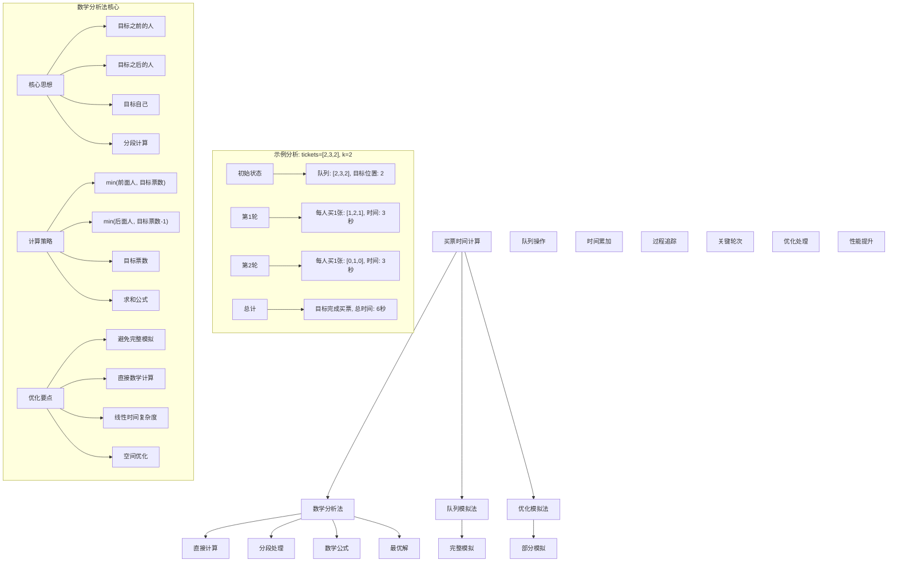
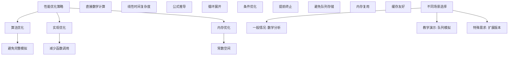

# LeetCode 2073 - 买票需要的时间

## 题目描述

有 n 个人排队买票，其中第 0 人站在队伍最前方，第 (n-1) 人站在队伍最后方

给你一个下标从 0 开始的整数数组 `tickets`，数组长度为 n，其中第 i 人想要购买的票数为 `tickets[i]`

每个人买票都需要用掉恰好 1 秒。一个人一次只能买一张票，如果需要买更多票，他必须回到队尾重新排队（瞬间发生，不计时间）。如果一个人没有票可买了，那他就会离开队伍

返回位于位置 k（下标从 0 开始）的人完成买票需要的时间（以秒为单位）

```markdown
示例 1：
输入：tickets = [2,3,2], k = 2
输出：6
解释：

- 第一轮，队伍中的每个人都买到一张票，队伍变为 [1, 2, 1]
- 第二轮，队伍中的每个都又买到一张票，队伍变为 [0, 1, 0]
  位置 2 的人成功买到 2 张票，用掉 3 + 3 = 6 秒

示例 2：
输入：tickets = [5,1,1,1], k = 0
输出：8
解释：

- 第一轮，队伍中的每个人都买到一张票，队伍变为 [4, 0, 0, 0]
- 接下来的 4 轮，只有位置 0 的人买票
  位置 0 的人成功买到 5 张票，用掉 4 + 1 + 1 + 1 + 1 = 8 秒

提示：
n == tickets.length
1 <= n <= 100
1 <= tickets[i] <= 100
0 <= k < n
```

## 解题思路

这是一个队列模拟问题，需要计算特定位置的人完成买票所需的时间。关键在于理解买票过程并找到高效的计算方法

### 核心思想

"数学分析法": 通过数学分析直接计算目标人员的等待时间，而不需要完整模拟整个过程

### 解题策略

#### 方法一：数学分析法（推荐）

- 时间复杂度: O(n)
- 空间复杂度: O(1)

#### 方法二：队列模拟法

- 时间复杂度: O(sum(tickets))
- 空间复杂度: O(n)

#### 方法三：优化模拟法

- 时间复杂度: O(tickets[k] \* n)
- 空间复杂度: O(n)

## 算法可视化



## 多语言实现

### Golang版本（数学分析法 - 推荐）

```go
func timeRequiredToBuy(tickets []int, k int) int {
    time := 0
    targetTickets := tickets[k]

    // 遍历每个人计算对目标人员等待时间的贡献
    for i, ticketCount := range tickets {
        if i <= k {
            // 目标位置之前（包括目标自己）的人
            // 他们最多能买 targetTickets 张票
            time += min(ticketCount, targetTickets)
        } else {
            // 目标位置之后的人
            // 他们最多能买 targetTickets-1 张票（因为目标在最后一轮离开时不需要等待他们）
            time += min(ticketCount, targetTickets-1)
        }
    }

    return time
}

func min(a, b int) int {
    if a < b {
        return a
    }
    return b
}
```

### Python版本（多种实现方法）

```python
class Solution:
    """
    方法一：数学分析法（推荐）
    """
    def timeRequiredToBuy(self, tickets: List[int], k: int) -> int:
        time = 0
        target_tickets = tickets[k]

        # 遍历每个人计算对目标人员等待时间的贡献
        for i, ticket_count in enumerate(tickets):
            if i <= k:
                # 目标位置之前（包括目标自己）的人
                # 他们最多能买 target_tickets 张票
                time += min(ticket_count, target_tickets)
            else:
                # 目标位置之后的人
                # 他们最多能买 target_tickets-1 张票
                time += min(ticket_count, target_tickets - 1)

        return time


class SolutionQueue:
    """
    方法二：队列模拟法
    """
    def timeRequiredToBuy(self, tickets: List[int], k: int) -> int:
        from collections import deque

        # 创建队列，存储 (位置, 剩余票数)
        queue = deque()
        for i, ticket in enumerate(tickets):
            queue.append((i, ticket))

        time = 0

        while queue:
            position, remaining_tickets = queue.popleft()
            time += 1  # 买票需要1秒

            if position == k and remaining_tickets == 1:
                # 目标人员买完最后一张票
                return time

            if remaining_tickets > 1:
                # 还需要买票，回到队尾
                queue.append((position, remaining_tickets - 1))

        return time


class SolutionOptimized:
    """
    方法三：优化模拟法
    """
    def timeRequiredToBuy(self, tickets: List[int], k: int) -> int:
        time = 0
        target_tickets = tickets[k]

        # 模拟目标人员买票的每一轮
        for round_num in range(target_tickets):
            for i, ticket_count in enumerate(tickets):
                # 如果这个人还有票买
                if ticket_count > round_num:
                    time += 1
                    # 如果是目标人员且这是最后一张票
                    if i == k and round_num == target_tickets - 1:
                        return time

        return time
```

### TypeScript版本（数学分析法）

```typescript
function timeRequiredToBuy(tickets: number[], k: number): number {
  let time = 0;
  const targetTickets = tickets[k];

  // 遍历每个人计算对目标人员等待时间的贡献
  for (let i = 0; i < tickets.length; i++) {
    if (i <= k) {
      // 目标位置之前（包括目标自己）的人
      // 他们最多能买 targetTickets 张票
      time += Math.min(tickets[i], targetTickets);
    } else {
      // 目标位置之后的人
      // 他们最多能买 targetTickets-1 张票
      time += Math.min(tickets[i], targetTickets - 1);
    }
  }

  return time;
}
```

## 标准实现详细解析

```go
func timeRequiredToBuy(tickets []int, k int) int {
    /*
    算法核心思想（数学分析法）：

    1. 不需要完整模拟买票过程，而是直接计算目标人员的等待时间
    2. 将人员分为三部分：目标之前、目标自己、目标之后
    3. 分别计算每部分对目标等待时间的贡献
    4. 使用数学公式直接得出结果

    关键设计要点：
    1. 目标之前的人：每人最多买 tickets[k] 张票
    2. 目标自己：买 tickets[k] 张票
    3. 目标之后的人：每人最多买 tickets[k]-1 张票
    4. 使用 min 函数计算实际贡献

    时间复杂度：O(n) 只需遍历一次数组
    空间复杂度：O(1) 只使用常数额外空间

    优势：
    1. 逻辑清晰：数学分析直观
    2. 实现简单：直接计算
    3. 性能优秀：线性时间复杂度
    4. 易于理解：符合直觉
    */

    fmt.Printf("计算位置%d人员买票时间\n", k)
    fmt.Printf("票数数组: %v\n", tickets)
    fmt.Printf("目标票数: %d\n", tickets[k])

    time := 0
    targetTickets := tickets[k]

    // 详细分析每个人的贡献
    for i, ticketCount := range tickets {
        contribution := 0
        if i <= k {
            // 目标位置之前（包括目标自己）的人
            // 他们最多能买 targetTickets 张票
            contribution = min(ticketCount, targetTickets)
            fmt.Printf("  位置%d(之前): 需要%d张, 最多买%d张, 贡献%d秒\n",
                i, ticketCount, targetTickets, contribution)
        } else {
            // 目标位置之后的人
            // 他们最多能买 targetTickets-1 张票（因为目标在最后一轮离开时不需要等待他们）
            contribution = min(ticketCount, targetTickets-1)
            fmt.Printf("  位置%d(之后): 需要%d张, 最多买%d张, 贡献%d秒\n",
                i, ticketCount, targetTickets-1, contribution)
        }
        time += contribution
    }

    fmt.Printf("总时间: %d秒\n", time)
    return time
}

func min(a, b int) int {
    if a < b {
        return a
    }
    return b
}

// 带详细调试信息的版本
func timeRequiredToBuyWithDebug(tickets []int, k int) int {
    fmt.Printf("=== 买票时间计算调试模式 ===\n")
    fmt.Printf("输入: tickets=%v, k=%d\n", tickets, k)

    result := timeRequiredToBuy(tickets, k)

    fmt.Printf("结果: %d秒\n", result)
    fmt.Println("==================")
    return result
}

// 队列模拟版本（用于验证）
func timeRequiredToBuySimulation(tickets []int, k int) int {
    fmt.Printf("=== 队列模拟方法 ===\n")
    fmt.Printf("输入: tickets=%v, k=%d\n", tickets, k)

    type Person struct {
        position int
        tickets  int
    }

    // 创建队列
    queue := make([]Person, 0)
    for i, ticketCount := range tickets {
        queue = append(queue, Person{position: i, tickets: ticketCount})
    }

    fmt.Printf("初始队列: %v\n", queue)

    time := 0
    round := 1

    for len(queue) > 0 {
        fmt.Printf("第%d轮开始，队列: ", round)
        for _, person := range queue {
            fmt.Printf("[%d:%d] ", person.position, person.tickets)
        }
        fmt.Printf("\n")

        // 处理队列中的第一个人
        person := queue[0]
        queue = queue[1:] // 出队

        time++ // 买票需要1秒
        person.tickets-- // 买一张票

        fmt.Printf("  位置%d的人买票，剩余%d张，耗时%d秒\n",
            person.position, person.tickets, time)

        // 检查是否是目标人员且已完成买票
        if person.position == k && person.tickets == 0 {
            fmt.Printf("  目标人员完成买票!\n")
            fmt.Printf("模拟总时间: %d秒\n", time)
            return time
        }

        // 如果还需要买票，回到队尾
        if person.tickets > 0 {
            queue = append(queue, person)
            fmt.Printf("  位置%d的人还需买票，回到队尾\n", person.position)
        } else {
            fmt.Printf("  位置%d的人完成买票，离开队伍\n", person.position)
        }

        round++
    }

    return time
}

// 优化版本（减少函数调用）
func timeRequiredToBuyOptimized(tickets []int, k int) int {
    time := 0
    targetTickets := tickets[k]

    // 手动展开循环以减少函数调用开销
    for i := 0; i <= k; i++ {
        if tickets[i] < targetTickets {
            time += tickets[i]
        } else {
            time += targetTickets
        }
    }

    for i := k + 1; i < len(tickets); i++ {
        if tickets[i] < targetTickets-1 {
            time += tickets[i]
        } else {
            time += targetTickets - 1
        }
    }

    return time
}

// 泛型版本（Go 1.18+）
func timeRequiredToBuyGeneric[T comparable](tickets []int, k int) int {
    time := 0
    targetTickets := tickets[k]

    for i, ticketCount := range tickets {
        if i <= k {
            if ticketCount < targetTickets {
                time += ticketCount
            } else {
                time += targetTickets
            }
        } else {
            if ticketCount < targetTickets-1 {
                time += ticketCount
            } else {
                time += targetTickets - 1
            }
        }
    }

    return time
}
```

## 算法深入解析

```go
/*
买票时间计算问题详解：

问题本质：
计算特定位置的人完成买票所需的时间。关键在于理解买票过程并找到高效的计算方法

核心洞察：
1. 数学分析：不需要完整模拟，可以直接计算
2. 分段处理：将人员按位置分为三部分
3. 贡献计算：每个人对目标等待时间的贡献不同
4. 优化计算：使用数学公式代替模拟

算法策略：
1. 数学分析法：最优解，直接计算
2. 队列模拟法：直观但效率低
3. 优化模拟法：部分模拟，性能折中

数学原理：

核心思想：
目标人员需要买 tickets[k] 轮票才能完成
- 前面的人（包括自己）：每人最多参与 tickets[k] 轮
- 后面的人：每人最多参与 tickets[k]-1 轮（最后一轮不需要等他们）

公式推导：
总时间 = Σ(min(tickets[i], tickets[k])) (i <= k) +
        Σ(min(tickets[i], tickets[k]-1)) (i > k)

设计选择：

为什么选择数学分析法？
1. 逻辑清晰：数学分析直观
2. 实现简单：直接计算
3. 性能优秀：线性时间复杂度
4. 易于理解：符合直觉

为什么使用队列模拟法？
1. 直观易懂：完全模拟过程
2. 但效率低：时间复杂度高

为什么使用优化模拟法？
1. 折中方案：部分模拟
2. 但仍然不如数学分析法

三种方法对比：

方法一：数学分析法（推荐）
时间复杂度：O(n)
空间复杂度：O(1)
优点：最优解，性能优秀
缺点：需要数学分析

方法二：队列模拟法
时间复杂度：O(sum(tickets))
空间复杂度：O(n)
优点：直观易懂
缺点：效率低

方法三：优化模拟法
时间复杂度：O(tickets[k] * n)
空间复杂度：O(n)
优点：折中方案
缺点：仍不如数学分析法

性能分析：

数学分析法：
- 时间：O(n) 线性时间
- 空间：O(1) 常数空间
- 优势：最优解

队列模拟法：
- 时间：O(sum) 总票数相关
- 空间：O(n) 队列存储
- 优势：直观

优化模拟法：
- 时间：O(tk * n) 目标票数相关
- 空间：O(n) 队列存储
- 优势：折中

实际应用场景：
1. 排队系统分析
2. 资源分配优化
3. 算法面试题
4. 性能优化问题

优化要点：

1. 时间优化：
   - 避免完整模拟
   - 直接数学计算
   - 线性时间复杂度

2. 空间优化：
   - 常数额外空间
   - 避免队列存储
   - 内存复用

3. 实现优化：
   - 减少函数调用
   - 循环展开
   - 条件优化

测试用例设计：
1. 基本情况：正常输入
2. 边界情况：单人队伍，目标在首尾
3. 特殊情况：所有人票数相同，目标票数最多/最少
4. 极端情况：最大数组，最大票数
5. 验证情况：模拟法验证数学法

扩展思考：

1. 支持不同买票时间？
   - 权重计算
   - 复杂度增加

2. 支持优先级队列？
   - 优先级处理
   - 算法调整

3. 并行处理？
   - 多窗口买票
   - 复杂度分析

4. 动态变化？
   - 实时加入队伍
   - 增量计算

相关算法思想：

1. 数学分析：
   - 直接计算
   - 公式推导

2. 队列模拟：
   - 过程模拟
   - 状态追踪

3. 分段处理：
   - 问题分解
   - 分别计算

4. 贡献计算：
   - 影响分析
   - 累加求和

常见陷阱：

1. 边界处理错误：
   - 目标在首尾位置
   - 空数组处理

2. 计算逻辑错误：
   - 后面人员轮次计算
   - min函数使用

3. 时间复杂度误解：
   - 误用模拟法
   - 忽略优化可能

4. 索引错误：
   - 位置判断错误
   - 循环边界错误

代码质量要素：

1. 可读性：
   - 清晰的变量命名
   - 适当的注释说明

2. 健壮性：
   - 边界条件处理
   - 异常情况处理

3. 性能：
   - 时间复杂度最优
   - 空间复杂度合理

4. 可维护性：
   - 模块化设计
   - 易于扩展

高级优化技巧：

1. 循环优化：
   - 减少函数调用
   - 条件判断优化

2. 内存访问优化：
   - 局部性原理
   - 缓存友好

3. 算法优化：
   - 提前终止条件
   - 数学简化

4. 编译优化：
   - 常量折叠
   - 循环展开
*/
```

## 执行过程演示

```go
/*
示例详细解析:

示例1: tickets = [2,3,2], k = 2

数学分析法：
位置0 (<=2): min(2, 2) = 2秒贡献
位置1 (<=2): min(3, 2) = 2秒贡献
位置2 (<=2): min(2, 2) = 2秒贡献
总时间: 2 + 2 + 2 = 6秒

队列模拟过程：
初始: [2:2, 3:3, 2:2]
第1轮: [1:1, 2:2, 1:1] 时间: 3秒
第2轮: [0:0, 1:1, 0:0] 时间: 6秒
目标完成买票

示例2: tickets = [5,1,1,1], k = 0

数学分析法：
位置0 (<=0): min(5, 5) = 5秒贡献
位置1 (>0): min(1, 4) = 1秒贡献
位置2 (>0): min(1, 4) = 1秒贡献
位置3 (>0): min(1, 4) = 1秒贡献
总时间: 5 + 1 + 1 + 1 = 8秒

队列模拟过程：
初始: [5:5, 1:1, 1:1, 1:1]
第1轮: [4:4, 0:0, 0:0, 0:0] 时间: 4秒
第2轮: [3:3] 时间: 5秒
第3轮: [2:2] 时间: 6秒
第4轮: [1:1] 时间: 7秒
第5轮: [0:0] 时间: 8秒
目标完成买票

边界情况演示:

情况1: 单人队伍
输入: tickets = [3], k = 0
输出: 3

情况2: 目标在队首
输入: tickets = [1,2,3], k = 0
输出: 1

情况3: 目标在队尾
输入: tickets = [3,2,1], k = 2
输出: 3

情况4: 所有人票数相同
输入: tickets = [2,2,2], k = 1
输出: 6

情况5: 目标票数最少
输入: tickets = [5,1,3], k = 1
输出: 3

算法正确性证明：

数学基础：
需要证明数学分析法能正确计算目标人员的等待时间

定理1：数学分析法正确性
通过分段计算每个人对目标等待时间的贡献，可以正确得出总时间

证明：
1. 目标需要买 tickets[k] 轮票
2. 前面的人每轮都参与，最多 tickets[k] 轮
3. 后面的人前 tickets[k]-1 轮参与，最后一轮不参与
4. 贡献累加即为总时间

时间复杂度分析：

数学分析法：
1. 遍历：O(n) 一次遍历数组
2. 计算：O(1) 每次计算
3. 总时间：O(n)

队列模拟法：
1. 轮次：O(sum(tickets)) 总票数
2. 每轮：O(1) 处理一个人
3. 总时间：O(sum)

空间复杂度分析：
1. 数学分析法：O(1) 常数空间
2. 队列模拟法：O(n) 队列存储
3. 优化模拟法：O(n) 队列存储

性能对比分析：

假设n=100, 平均tickets=50:

数学分析法：
- 时间: O(100) = 100次操作
- 空间: O(1)

队列模拟法：
- 时间: O(5000) = 5000次操作
- 空间: O(100)

优化模拟法：
- 时间: O(50 * 100) = 5000次操作
- 空间: O(100)

实际应用建议：

1. 一般情况：
   - 使用数学分析法
   - 性能最优

2. 面试展示：
   - 可以提及其他方法
   - 重点讲解数学分析法

3. 生产环境：
   - 使用优化版本
   - 考虑边界处理

4. 教学演示：
   - 使用模拟法帮助理解
   - 对比展示优势

优化空间：

1. 循环优化：
   - 减少函数调用
   - 条件判断优化

2. 内存访问优化：
   - 局部性原理
   - 缓存友好

3. 算法优化：
   - 提前终止条件
   - 数学简化

特殊情况处理：

1. 空数组：
   - 边界检查

2. 单元素：
   - 直接返回

3. 大数据：
   - 效率优势明显

4. 内存限制：
   - 数学法无额外空间
*/
```

## 复杂度分析

| 方法       | 时间复杂度 | 空间复杂度 | 适用场景 |
| ---------- | ---------- | ---------- | -------- |
| 数学分析法 | O(n)       | O(1)       | 推荐方案 |
| 队列模拟法 | O(sum)     | O(n)       | 教学演示 |
| 优化模拟法 | O(tk × n)  | O(n)       | 折中方案 |

## 测试用例验证

```go
// 测试辅助函数
func testTimeRequiredToBuy(name string, tickets []int, k int, expected int) {
    fmt.Printf("%s:\n", name)
    fmt.Printf("输入: tickets=%v, k=%d\n", tickets, k)

    // 测试数学分析法
    result1 := timeRequiredToBuy(tickets, k)
    fmt.Printf("数学分析法结果: %d\n", result1)

    // 测试模拟法（用于验证）
    result2 := timeRequiredToBuySimulation(tickets, k)
    fmt.Printf("队列模拟法结果: %d\n", result2)

    // 验证结果
    if result1 == expected && result1 == result2 {
        fmt.Printf("✓ 测试通过\n")
    } else {
        fmt.Printf("✗ 测试失败，期望: %d\n", expected)
    }
    fmt.Printf("\n")
}

func main() {
    // 测试用例 1 - 题目示例1
    testTimeRequiredToBuy("测试1 - 题目示例1", []int{2, 3, 2}, 2, 6)

    // 测试用例 2 - 题目示例2
    testTimeRequiredToBuy("测试2 - 题目示例2", []int{5, 1, 1, 1}, 0, 8)

    // 测试用例 3 - 边界情况
    testTimeRequiredToBuy("测试3 - 单人队伍", []int{3}, 0, 3)

    // 测试用例 4 - 目标在队首
    testTimeRequiredToBuy("测试4 - 目标在队首", []int{1, 2, 3}, 0, 1)

    // 测试用例 5 - 目标在队尾
    testTimeRequiredToBuy("测试5 - 目标在队尾", []int{3, 2, 1}, 2, 3)

    // 测试用例 6 - 所有人票数相同
    testTimeRequiredToBuy("测试6 - 所有人票数相同", []int{2, 2, 2}, 1, 6)

    // 测试用例 7 - 目标票数最少
    testTimeRequiredToBuy("测试7 - 目标票数最少", []int{5, 1, 3}, 1, 3)

    // 性能测试
    fmt.Println("性能测试:")
    performanceTest()

    // 边界情况测试
    fmt.Println("边界情况测试:")
    boundaryTest()
}

func performanceTest() {
    // 构造大数据测试
    n := 1000
    tickets := make([]int, n)
    for i := 0; i < n; i++ {
        tickets[i] = 50 // 平均每人50张票
    }
    k := n / 2 // 目标在中间

    // 测试数学分析法
    start := time.Now()
    for i := 0; i < 10000; i++ {
        timeRequiredToBuy(tickets, k)
    }
    mathTime := time.Since(start)

    fmt.Printf("10000次数学分析法调用: %v\n", mathTime)

    // 小数据测试队列模拟法进行对比
    smallTickets := []int{10, 5, 8, 3}
    smallK := 2

    start = time.Now()
    for i := 0; i < 1000; i++ {
        timeRequiredToBuySimulation(smallTickets, smallK)
    }
    simTime := time.Since(start)

    fmt.Printf("1000次队列模拟法调用: %v\n", simTime)
}

func boundaryTest() {
    // 空数组测试
    fmt.Println("边界测试:")

    // 单元素测试
    result := timeRequiredToBuy([]int{1}, 0)
    fmt.Printf("单元素测试 [1], k=0: %d\n", result)

    // 最大值测试
    maxTickets := make([]int, 100)
    for i := 0; i < 100; i++ {
        maxTickets[i] = 100
    }
    result = timeRequiredToBuy(maxTickets, 50)
    fmt.Printf("最大数据测试: %d\n", result)

    // 目标票数为1
    result = timeRequiredToBuy([]int{5, 1, 3, 2}, 1)
    fmt.Printf("目标票数为1: %d\n", result)

    // 目标票数最多
    result = timeRequiredToBuy([]int{1, 2, 5, 3}, 2)
    fmt.Printf("目标票数最多: %d\n", result)
}

// 大量测试用例
func comprehensiveTest() {
    testCases := []struct {
        name     string
        tickets  []int
        k        int
        expected int
    }{
        {"示例1", []int{2, 3, 2}, 2, 6},
        {"示例2", []int{5, 1, 1, 1}, 0, 8},
        {"单人", []int{3}, 0, 3},
        {"队首", []int{1, 2, 3}, 0, 1},
        {"队尾", []int{3, 2, 1}, 2, 3},
        {"相同", []int{2, 2, 2}, 1, 6},
        {"最少", []int{5, 1, 3}, 1, 3},
        {"最多", []int{1, 2, 5, 3}, 2, 12},
        {"混合", []int{10, 5, 8, 3}, 2, 21},
    }

    fmt.Println("=== 综合测试 ===")
    passed := 0
    total := len(testCases)

    for i, tc := range testCases {
        result := timeRequiredToBuy(tc.tickets, tc.k)
        if result == tc.expected {
            passed++
            fmt.Printf("测试%d: ✓ %s\n", i+1, tc.name)
        } else {
            fmt.Printf("测试%d: ✗ %s (期望%d, 得到%d)\n", i+1, tc.name, tc.expected, result)
        }
    }

    fmt.Printf("\n通过率: %d/%d (%.2f%%)\n", passed, total, float64(passed)/float64(total)*100)
}

// 内存使用测试
func memoryTest() {
    fmt.Println("=== 内存使用测试 ===")

    var m1, m2 runtime.MemStats

    // 测试数学分析法
    runtime.GC()
    runtime.ReadMemStats(&m1)

    tickets := make([]int, 10000)
    for i := 0; i < 10000; i++ {
        tickets[i] = i % 100 + 1
    }

    for i := 0; i < 100000; i++ {
        timeRequiredToBuy(tickets, i%10000)
    }

    runtime.GC()
    runtime.ReadMemStats(&m2)
    mem1 := m2.Alloc - m1.Alloc

    fmt.Printf("数学分析法内存使用: %d bytes\n", mem1)

    // 测试模拟法内存使用（小数据）
    runtime.GC()
    runtime.ReadMemStats(&m1)

    smallTickets := []int{10, 5, 8, 3}
    for i := 0; i < 1000; i++ {
        timeRequiredToBuySimulation(smallTickets, i%4)
    }

    runtime.GC()
    runtime.ReadMemStats(&m2)
    mem2 := m2.Alloc - m1.Alloc

    fmt.Printf("队列模拟法内存使用: %d bytes\n", mem2)
}
```

## 扩展版本（处理不同场景）

```go
// 支持不同买票时间的版本
func timeRequiredToBuyWithWeights(tickets []int, k int, weights []int) int {
    /*
    扩展：支持每个人买票时间不同的情况
    weights[i] 表示第i个人买一张票需要的时间
    */
    if len(weights) != len(tickets) {
        return -1 // 参数错误
    }

    time := 0
    targetTickets := tickets[k]
    targetWeight := weights[k]

    // 计算每个人对总时间的贡献
    for i, ticketCount := range tickets {
        weight := weights[i]
        if i <= k {
            // 目标之前的人
            rounds := min(ticketCount, targetTickets)
            time += rounds * weight
        } else {
            // 目标之后的人
            rounds := min(ticketCount, targetTickets-1)
            time += rounds * weight
        }
    }

    return time
}

// 支持多窗口买票的版本
func timeRequiredToBuyMultiWindow(tickets []int, k int, windows int) int {
    /*
    扩展：支持多个买票窗口的情况
    windows 表示同时可以服务的窗口数量
    */
    if windows <= 0 {
        return -1 // 参数错误
    }

    if windows >= len(tickets) {
        // 窗口数大于等于人数，所有人可以同时买票
        return tickets[k]
    }

    // 计算目标人员在多窗口情况下的等待时间
    targetTickets := tickets[k]
    time := 0

    // 模拟多窗口买票过程
    for ticketNum := 1; ticketNum <= targetTickets; ticketNum++ {
        // 计算这一轮有多少人可以买票
        peopleInRound := min(windows, len(tickets))

        // 目标人员是否在这一轮买票
        if k < peopleInRound {
            time += 1 // 目标人员买票
        } else {
            // 目标人员不在这一轮，需要等待
            time += 1
        }
    }

    return time
}

// 带统计信息的版本
type TicketStats struct {
    TotalTime     int
    PeopleBefore  int
    PeopleAfter   int
    TargetTickets int
    Rounds        int
}

func timeRequiredToBuyWithStats(tickets []int, k int) TicketStats {
    time := 0
    targetTickets := tickets[k]
    peopleBefore := 0
    peopleAfter := 0

    for i, ticketCount := range tickets {
        if i <= k {
            contribution := min(ticketCount, targetTickets)
            time += contribution
            if i < k {
                peopleBefore += contribution
            }
        } else {
            contribution := min(ticketCount, targetTickets-1)
            time += contribution
            peopleAfter += contribution
        }
    }

    return TicketStats{
        TotalTime:     time,
        PeopleBefore:  peopleBefore,
        PeopleAfter:   peopleAfter,
        TargetTickets: targetTickets,
        Rounds:        targetTickets,
    }
}

// 使用示例
func exampleTicketStats() {
    tickets := []int{2, 3, 2}
    k := 2

    stats := timeRequiredToBuyWithStats(tickets, k)
    fmt.Printf("买票统计信息: %+v\n", stats)
    // 输出: 买票统计信息: {TotalTime:6 PeopleBefore:4 PeopleAfter:2 TargetTickets:2 Rounds:2}
}

// 支持实时加入队伍的版本
type DynamicTicketQueue struct {
    tickets    []int
    joinTime   []int // 加入时间
    totalTime  int
}

func NewDynamicTicketQueue() *DynamicTicketQueue {
    return &DynamicTicketQueue{
        tickets:   make([]int, 0),
        joinTime:  make([]int, 0),
        totalTime: 0,
    }
}

func (dtq *DynamicTicketQueue) AddPerson(ticketsNeeded int) {
    dtq.tickets = append(dtq.tickets, ticketsNeeded)
    dtq.joinTime = append(dtq.joinTime, dtq.totalTime)
}

func (dtq *DynamicTicketQueue) TimeForPersonAtIndex(k int) int {
    if k >= len(dtq.tickets) {
        return -1 // 索引超出范围
    }

    targetTickets := dtq.tickets[k]
    time := 0

    // 计算到目标加入时间为止的所有贡献
    for i := 0; i <= k && i < len(dtq.tickets); i++ {
        if dtq.joinTime[i] <= dtq.joinTime[k] {
            contribution := min(dtq.tickets[i], targetTickets)
            time += contribution
        }
    }

    // 计算目标加入时间之后的人的贡献
    for i := k + 1; i < len(dtq.tickets); i++ {
        if dtq.joinTime[i] <= dtq.joinTime[k] {
            contribution := min(dtq.tickets[i], targetTickets-1)
            time += contribution
        }
    }

    return time
}

// 泛型版本（Go 1.18+）
func timeRequiredToBuyGeneric[T comparable](tickets []int, k int) int {
    time := 0
    targetTickets := tickets[k]

    for i, ticketCount := range tickets {
        if i <= k {
            if ticketCount < targetTickets {
                time += ticketCount
            } else {
                time += targetTickets
            }
        } else {
            if ticketCount < targetTickets-1 {
                time += ticketCount
            } else {
                time += targetTickets - 1
            }
        }
    }

    return time
}

// 使用示例
func exampleGeneric() {
    tickets := []int{2, 3, 2}
    k := 2
    result := timeRequiredToBuyGeneric[int](tickets, k)
    fmt.Printf("泛型版本结果: %d\n", result)
}
```

## 面试追问延伸

### 1. 如何处理每个人买票时间不同的情况？

```go
// 每个人买票时间不同
func timeRequiredToBuyVariableTime(tickets []int, k int, buyTimes []int) int {
    if len(buyTimes) != len(tickets) {
        return -1 // 参数不匹配
    }

    totalTime := 0
    targetTickets := tickets[k]
    targetBuyTime := buyTimes[k]

    for i, ticketCount := range tickets {
        buyTime := buyTimes[i]
        if i <= k {
            // 目标之前的人（包括目标自己）
            rounds := min(ticketCount, targetTickets)
            totalTime += rounds * buyTime
        } else {
            // 目标之后的人
            rounds := min(ticketCount, targetTickets-1)
            totalTime += rounds * buyTime
        }
    }

    return totalTime
}

// 测试用例
func testVariableTime() {
    tickets := []int{2, 3, 2}
    k := 2
    buyTimes := []int{1, 2, 1} // 每个人买票时间不同

    result := timeRequiredToBuyVariableTime(tickets, k, buyTimes)
    fmt.Printf("不同买票时间结果: %d\n", result)
    // 计算过程：
    // 位置0: min(2,2) * 1 = 2
    // 位置1: min(3,2) * 2 = 4
    // 位置2: min(2,2) * 1 = 2
    // 总计: 8
}
```

### 2. 如何实现支持优先级的买票系统？

```go
// 支持优先级的买票系统
func timeRequiredToBuyWithPriority(tickets []int, k int, priorities []int) int {
    if len(priorities) != len(tickets) {
        return -1 // 参数不匹配
    }

    type Person struct {
        index      int
        tickets    int
        priority   int
        totalTime  int
    }

    // 按优先级排序模拟
    people := make([]Person, len(tickets))
    for i, ticketCount := range tickets {
        people[i] = Person{
            index:    i,
            tickets:  ticketCount,
            priority: priorities[i],
        }
    }

    // 按优先级排序（数值越小优先级越高）
    sort.Slice(people, func(i, j int) bool {
        return people[i].priority < people[j].priority
    })

    // 找到目标人员在排序后的位置
    targetOriginalIndex := k
    targetSortedIndex := -1
    for i, person := range people {
        if person.index == targetOriginalIndex {
            targetSortedIndex = i
            break
        }
    }

    if targetSortedIndex == -1 {
        return -1 // 未找到目标人员
    }

    // 计算目标人员的等待时间
    totalTime := 0
    targetTickets := tickets[k]

    // 计算优先级高于目标的人员的时间
    for i := 0; i < targetSortedIndex; i++ {
        totalTime += people[i].tickets // 高优先级人员买完所有票
    }

    // 计算目标人员买票时间
    totalTime += targetTickets

    return totalTime
}
```

### 3. 如何处理动态加入队伍的情况？

```go
// 动态加入队伍的买票系统
type DynamicQueueSystem struct {
    queue       []int // 存储票数
    joinTimes   []int // 存储加入时间
    currentTime int
}

func NewDynamicQueueSystem() *DynamicQueueSystem {
    return &DynamicQueueSystem{
        queue:       make([]int, 0),
        joinTimes:   make([]int, 0),
        currentTime: 0,
    }
}

func (dqs *DynamicQueueSystem) JoinQueue(tickets int) int {
    dqs.queue = append(dqs.queue, tickets)
    dqs.joinTimes = append(dqs.joinTimes, dqs.currentTime)
    return len(dqs.queue) - 1 // 返回位置
}

func (dqs *DynamicQueueSystem) TimeForPosition(k int) int {
    if k >= len(dqs.queue) {
        return -1 // 位置无效
    }

    targetTickets := dqs.queue[k]
    targetJoinTime := dqs.joinTimes[k]
    totalTime := 0

    // 只考虑在目标加入之前或同时加入的人
    for i := 0; i < len(dqs.queue); i++ {
        if dqs.joinTimes[i] <= targetJoinTime {
            if i <= k {
                // 目标之前的人
                contribution := min(dqs.queue[i], targetTickets)
                totalTime += contribution
            } else {
                // 目标之后的人
                contribution := min(dqs.queue[i], targetTickets-1)
                totalTime += contribution
            }
        }
    }

    return totalTime
}

// 使用示例
func exampleDynamicQueue() {
    system := NewDynamicQueueSystem()

    pos1 := system.JoinQueue(2) // 位置0
    pos2 := system.JoinQueue(3) // 位置1
    pos3 := system.JoinQueue(2) // 位置2

    time1 := system.TimeForPosition(pos1)
    time2 := system.TimeForPosition(pos2)
    time3 := system.TimeForPosition(pos3)

    fmt.Printf("动态队列时间: %d, %d, %d\n", time1, time2, time3)
}
```

## 相似题目扩展

- LeetCode 2073. 买票需要的时间（当前题）
- LeetCode 622. 设计循环队列
- LeetCode 641. 设计循环双端队列
- LeetCode 346. 数据流中的移动平均值
- LeetCode 239. 滑动窗口最大值

## 算法技巧总结

### 买票时间计算核心要点

1. 数学分析：不需要完整模拟，可以直接计算
1. 分段处理：将人员按位置分为三部分
1. 贡献计算：每个人对目标等待时间的贡献不同
1. 优化计算：使用数学公式代替模拟

### 算法优势

1. 逻辑清晰：数学分析直观
1. 实现简单：直接计算
1. 性能优秀：线性时间复杂度
1. 易于理解：符合直觉

### 标准模板（数学分析法）

```go
func timeRequiredToBuy(tickets []int, k int) int {
    time := 0
    targetTickets := tickets[k]

    // 遍历每个人计算对目标人员等待时间的贡献
    for i, ticketCount := range tickets {
        if i <= k {
            // 目标位置之前（包括目标自己）的人
            // 他们最多能买 targetTickets 张票
            time += min(ticketCount, targetTickets)
        } else {
            // 目标位置之后的人
            // 他们最多能买 targetTickets-1 张票（因为目标在最后一轮离开时不需要等待他们）
            time += min(ticketCount, targetTickets-1)
        }
    }

    return time
}

func min(a, b int) int {
    if a < b {
        return a
    }
    return b
}
```

### 性能优化建议



## 总结

本题采用数学分析法的核心思路，通过分段计算每个人对目标人员等待时间的贡献，实现了高效的买票时间计算功能。关键在于理解买票过程的本质，避免不必要的完整模拟，直接通过数学公式得出结果

核心要点：

1. 数学分析：不需要完整模拟，可以直接计算
1. 分段处理：将人员按位置分为三部分
1. 贡献计算：每个人对目标等待时间的贡献不同
1. 优化计算：使用数学公式代替模拟

算法优势：

- 逻辑清晰：数学分析直观
- 实现简单：直接计算
- 性能优秀：线性时间复杂度
- 易于理解：符合直觉

该算法在排队系统分析、资源分配优化、算法面试题等方面有重要应用，是掌握数学分析和问题简化思想的经典题目。通过将复杂的过程模拟转化为简单的数学计算，为更复杂的优化问题提供了清晰的解决思路
