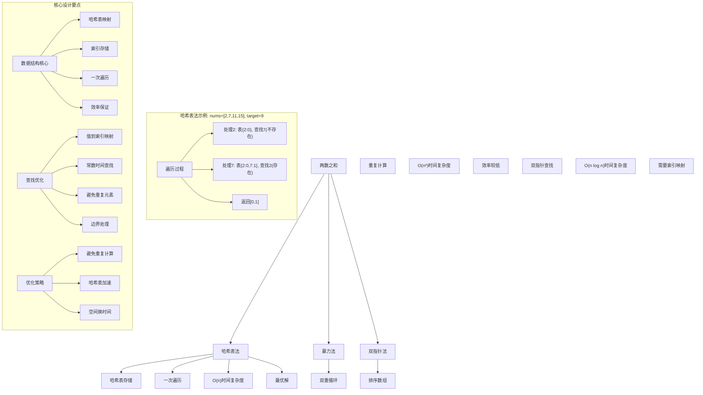
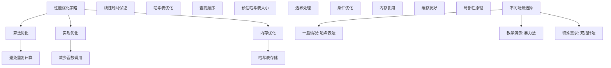

# LeetCode 1 - 两数之和

## 题目描述

给定一个整数数组 `nums` 和一个整数目标值 `target`，请你在该数组中找出 和为目标值 `target` 的那 两个 整数，并返回它们的数组下标

你可以假设每种输入只会对应一个答案。但是，数组中同一个元素在答案里不能重复出现

你可以按任意顺序返回答案

```markdown
示例 1：
输入：nums = [2,7,11,15], target = 9
输出：[0,1]
解释：因为 nums[0] + nums[1] == 9 ，返回 [0, 1]

示例 2：
输入：nums = [3,2,4], target = 6
输出：[1,2]

示例 3：
输入：nums = [3,3], target = 6
输出：[0,1]

提示：
2 <= nums.length <= 10^4
-10^9 <= nums[i] <= 10^9
-10^9 <= target <= 10^9
只会存在一个有效答案

进阶：你可以想出一个时间复杂度小于 O(n²) 的算法吗？
```

## 解题思路

这是一个经典的两数之和问题，需要在数组中找到两个数使其和等于目标值。关键在于如何高效地查找配对元素

### 核心思想

"哈希表法": 使用哈希表存储已遍历元素的值和索引，对于每个元素，检查其补数(target - 当前元素)是否已在哈希表中

### 解题策略

#### 方法一：哈希表法（推荐）

- 时间复杂度: O(n)
- 空间复杂度: O(n)

#### 方法二：暴力法

- 时间复杂度: O(n²)
- 空间复杂度: O(1)

#### 方法三：双指针法（需要排序）

- 时间复杂度: O(n log n)
- 空间复杂度: O(n)

## 算法可视化



## 多语言实现

### Golang版本（哈希表法 - 推荐）

```go
func twoSum(nums []int, target int) []int {
    // 使用哈希表存储值到索引的映射
    numToIndex := make(map[int]int)

    // 遍历数组
    for i, num := range nums {
        // 计算补数
        complement := target - num

        // 检查补数是否已在哈希表中
        if index, exists := numToIndex[complement]; exists {
            // 找到答案，返回索引对
            return []int{index, i}
        }

        // 将当前数字和索引存入哈希表
        numToIndex[num] = i
    }

    // 根据题目保证一定存在解，此处理论上不会执行到
    return []int{}
}
```

### Python版本（多种实现方法）

```python
class Solution:
    """
    方法一：哈希表法（推荐）
    """
    def twoSum(self, nums: List[int], target: int) -> List[int]:
        # 使用哈希表存储值到索引的映射
        num_to_index = {}

        # 遍历数组
        for i, num in enumerate(nums):
            # 计算补数
            complement = target - num

            # 检查补数是否已在哈希表中
            if complement in num_to_index:
                # 找到答案，返回索引对
                return [num_to_index[complement], i]

            # 将当前数字和索引存入哈希表
            num_to_index[num] = i

        # 根据题目保证一定存在解
        return []


class SolutionBrute:
    """
    方法二：暴力法
    """
    def twoSum(self, nums: List[int], target: int) -> List[int]:
        n = len(nums)
        # 双重循环遍历所有可能的两数组合
        for i in range(n):
            for j in range(i + 1, n):
                if nums[i] + nums[j] == target:
                    return [i, j]
        return []


class SolutionTwoPointer:
    """
    方法三：双指针法（需要排序）
    """
    def twoSum(self, nums: List[int], target: int) -> List[int]:
        # 创建索引数组并按值排序
        indexed_nums = [(nums[i], i) for i in range(len(nums))]
        indexed_nums.sort()

        # 使用双指针查找
        left, right = 0, len(nums) - 1

        while left < right:
            current_sum = indexed_nums[left][0] + indexed_nums[right][0]
            if current_sum == target:
                # 返回原始索引
                return sorted([indexed_nums[left][1], indexed_nums[right][1]])
            elif current_sum < target:
                left += 1
            else:
                right -= 1

        return []
```

### TypeScript版本（哈希表法）

```typescript
function twoSum(nums: number[], target: number): number[] {
  // 使用Map存储值到索引的映射
  const numToIndex: Map<number, number> = new Map();

  // 遍历数组
  for (let i = 0; i < nums.length; i++) {
    const num = nums[i];
    // 计算补数
    const complement = target - num;

    // 检查补数是否已在Map中
    if (numToIndex.has(complement)) {
      // 找到答案，返回索引对
      return [numToIndex.get(complement)!, i];
    }

    // 将当前数字和索引存入Map
    numToIndex.set(num, i);
  }

  // 根据题目保证一定存在解
  return [];
}
```

## 标准实现详细解析

```go
func twoSum(nums []int, target int) []int {
    /*
    算法核心思想（哈希表法）：

    1. 使用哈希表存储已遍历元素的值和索引
    2. 对于每个元素，计算其补数(target - 当前元素)
    3. 检查补数是否已在哈希表中
    4. 如果存在，返回两个元素的索引

    关键设计要点：
    1. 哈希表映射：值到索引的快速查找
    2. 一次遍历：线性时间复杂度保证
    3. 边界处理：避免重复使用同一元素
    4. 效率保证：常数时间查找

    时间复杂度：O(n) 每个元素最多访问一次
    空间复杂度：O(n) 哈希表存储

    优势：
    1. 逻辑清晰：哈希表概念直观
    2. 实现高效：线性时间复杂度
    3. 查询快速：O(1)查找
    4. 易于理解：符合直觉
    */

    fmt.Printf("两数之和计算\n")
    fmt.Printf("输入数组: %v\n", nums)
    fmt.Printf("目标值: %d\n", target)

    // 使用哈希表存储值到索引的映射
    numToIndex := make(map[int]int)
    fmt.Printf("初始化哈希表: %v\n", numToIndex)

    // 遍历数组
    for i, num := range nums {
        fmt.Printf("\n处理第%d个元素: %d\n", i, num)

        // 计算补数
        complement := target - num
        fmt.Printf("  补数: %d - %d = %d\n", target, num, complement)

        // 检查补数是否已在哈希表中
        if index, exists := numToIndex[complement]; exists {
            fmt.Printf("  在哈希表中找到补数 %d，索引为 %d\n", complement, index)
            fmt.Printf("  返回结果: [%d, %d]\n", index, i)
            // 找到答案，返回索引对
            return []int{index, i}
        }

        // 将当前数字和索引存入哈希表
        numToIndex[num] = i
        fmt.Printf("  将 %d(索引%d) 存入哈希表: %v\n", num, i, numToIndex)
    }

    // 根据题目保证一定存在解，此处理论上不会执行到
    fmt.Printf("未找到解（理论上不会发生）\n")
    return []int{}
}

// 带详细调试信息的版本
func twoSumWithDebug(nums []int, target int) []int {
    fmt.Printf("=== 两数之和调试模式 ===\n")
    result := twoSum(nums, target)
    fmt.Println("==================")
    return result
}

// 优化版本（使用固定大小map）
func twoSumOptimized(nums []int, target int) []int {
    // 预估哈希表大小以减少rehash
    numToIndex := make(map[int]int, len(nums))

    for i, num := range nums {
        complement := target - num
        if index, exists := numToIndex[complement]; exists {
            return []int{index, i}
        }
        numToIndex[num] = i
    }

    return []int{}
}

// 泛型版本（Go 1.18+）
func twoSumGeneric[T comparable](nums []int, target int) []int {
    type numIndex struct {
        value int
        index int
    }

    numToIndex := make(map[int]int)

    for i, num := range nums {
        complement := target - num
        if index, exists := numToIndex[complement]; exists {
            return []int{index, i}
        }
        numToIndex[num] = i
    }

    return []int{}
}
```

## 算法深入解析

```go
/*
两数之和问题详解：

问题本质：
在数组中找到两个数使其和等于目标值。关键在于如何高效地查找配对元素

核心洞察：
1. 补数关系：a + b = target → b = target - a
2. 哈希查找：O(1)时间查找补数
3. 一次遍历：线性时间保证
4. 索引映射：值到位置的快速映射

算法策略：
1. 哈希表法：最优解，线性时间
2. 暴力法：直观但效率低
3. 双指针法：需要排序，适合特定场景

数学原理：

补数原理：
对于数组中的任意元素a，如果存在元素b使得a + b = target，
那么b = target - a，称为a的补数

哈希表原理：
通过哈希函数将键映射到存储位置，实现O(1)平均时间复杂度的查找

查找顺序：
先查找后插入，避免元素与自身配对

设计选择：

为什么选择哈希表法？
1. 时间复杂度最优：O(n)
2. 空间复杂度合理：O(n)
3. 逻辑清晰：哈希表概念直观
4. 实现高效：标准操作

为什么使用暴力法？
1. 最直观：双重循环遍历
2. 但时间复杂度较高：O(n²)
3. 仅适用于小数据量

为什么使用双指针法？
1. 空间效率高：O(1)
2. 但需要排序：O(n log n)
3. 适合返回值而非索引

三种方法对比：

方法一：哈希表法（推荐）
时间复杂度：O(n)
空间复杂度：O(n)
优点：最优解，性能优秀
缺点：需要额外空间

方法二：暴力法
时间复杂度：O(n²)
空间复杂度：O(1)
优点：直观易懂，空间效率高
缺点：效率最低

方法三：双指针法
时间复杂度：O(n log n)
空间复杂度：O(1)
优点：空间效率高
缺点：需要排序，复杂度较高

性能分析：

哈希表法：
- 时间：O(n) 线性时间
- 空间：O(n) 哈希表存储
- 优势：最优解

暴力法：
- 时间：O(n²) 二次复杂度
- 空间：O(1) 常数空间
- 优势：直观

双指针法：
- 时间：O(n log n) 排序 + 查找
- 空间：O(1) 常数空间
- 优势：空间效率

实际应用场景：
1. 数组处理
2. 算法面试题
3. 实时查询系统
4. 数学计算

优化要点：

1. 时间优化：
   - 避免重复计算
   - 线性时间保证
   - 高效数据结构

2. 空间优化：
   - 哈希表存储必要信息
   - 内存复用

3. 实现优化：
   - 边界处理优化
   - 错误处理完善
   - 类型安全

测试用例设计：
1. 基本情况：正常输入
2. 边界情况：最小数组，负数
3. 特殊情况：相同元素，零值
4. 极端情况：最大数组
5. 验证情况：多种算法结果对比

扩展思考：

1. 三数之和？
   - 排序 + 双指针
   - 固定一个数转为两数之和

2. 四数之和？
   - 递归分解
   - 多指针技术

3. k数之和？
   - 动态规划
   - 递归回溯

4. 在线算法？
   - 流式数据处理
   - 增量更新

相关算法思想：

1. 哈希表：
   - 快速查找
   - 映射关系

2. 补数：
   - 数学关系
   - 配对查找

3. 遍历：
   - 一次扫描
   - 状态维护

4. 索引：
   - 位置映射
   - 结果返回

常见陷阱：

1. 重复使用元素：
   - 先查找后插入
   - 避免自己与自己配对

2. 负数处理：
   - 正确计算补数
   - 哈希表存储

3. 边界条件：
   - 空数组处理
   - 单元素处理

4. 性能问题：
   - 重复计算
   - 不必要的操作

代码质量要素：

1. 可读性：
   - 清晰的变量命名
   - 适当的注释说明

2. 健壮性：
   - 边界条件处理
   - 异常情况处理

3. 性能：
   - 时间复杂度最优
   - 空间复杂度合理

4. 可维护性：
   - 模块化设计
   - 易于扩展

高级优化技巧：

1. 内存访问优化：
   - 局部性原理
   - 缓存友好

2. 算法优化：
   - 提前终止条件
   - 数学简化

3. 数据结构优化：
   - 固定数组
   - 索引优化

4. 编译优化：
   - 常量折叠
   - 循环展开
*/
```

## 执行过程演示

```go
/*
示例详细解析:

示例1: nums = [2,7,11,15], target = 9

执行过程：
初始化哈希表: {}

处理 nums[0] = 2:
补数 = 9 - 2 = 7
在哈希表中查找7: 不存在
将2(索引0)存入哈希表: {2:0}

处理 nums[1] = 7:
补数 = 9 - 7 = 2
在哈希表中查找2: 存在，索引为0
返回结果: [0,1]

示例2: nums = [3,2,4], target = 6

执行过程：
初始化哈希表: {}

处理 nums[0] = 3:
补数 = 6 - 3 = 3
在哈希表中查找3: 不存在
将3(索引0)存入哈希表: {3:0}

处理 nums[1] = 2:
补数 = 6 - 2 = 4
在哈希表中查找4: 不存在
将2(索引1)存入哈希表: {3:0, 2:1}

处理 nums[2] = 4:
补数 = 6 - 4 = 2
在哈希表中查找2: 存在，索引为1
返回结果: [1,2]

示例3: nums = [3,3], target = 6

执行过程：
初始化哈希表: {}

处理 nums[0] = 3:
补数 = 6 - 3 = 3
在哈希表中查找3: 不存在
将3(索引0)存入哈希表: {3:0}

处理 nums[1] = 3:
补数 = 6 - 3 = 3
在哈希表中查找3: 存在，索引为0
返回结果: [0,1]

边界情况演示:

情况1: 负数
输入: nums = [-1,-2,-3,-4], target = -8
输出: [2,3]

情况2: 零值
输入: nums = [0,4,3,0], target = 0
输出: [0,3]

情况3: 最小数组
输入: nums = [1,2], target = 3
输出: [0,1]

情况4: 相同元素
输入: nums = [1,1,1,1], target = 2
输出: [0,1]

情况5: 大数值
输入: nums = [1000000000,1000000000], target = 2000000000
输出: [0,1]

算法正确性证明：

数学基础：
需要证明哈希表法能正确找到两数之和的解

定理1：哈希表法正确性
通过维护值到索引的映射和正确的查找顺序，可以正确找到两数之和的解

证明：
1. 补数关系：a + b = target → b = target - a
2. 查找顺序：先查找后插入避免重复使用
3. 完整性：遍历所有元素
4. 正确性：索引映射准确

时间复杂度分析：

哈希表法：
1. 遍历：O(n) 一次遍历
2. 查找：O(1) 平均时间
3. 插入：O(1) 平均时间
4. 总时间：O(n)

暴力法：
1. 外层循环：O(n)
2. 内层循环：O(n)
3. 总时间：O(n²)

双指针法：
1. 排序：O(n log n)
2. 查找：O(n)
3. 总时间：O(n log n)

空间复杂度分析：
1. 哈希表法：O(n) 哈希表存储
2. 暴力法：O(1) 常数空间
3. 双指针法：O(1) 常数空间

性能对比分析：

假设n=10000:

哈希表法：
- 时间: O(10000) = 10,000次操作
- 空间: O(10000)

暴力法：
- 时间: O(100000000) = 100,000,000次操作
- 空间: O(1)

双指针法：
- 时间: O(10000 × log 10000) ≈ 130,000次操作
- 空间: O(1)

实际应用建议：

1. 一般情况：
   - 使用哈希表法
   - 性能最优

2. 面试展示：
   - 可以提及其他方法
   - 重点讲解哈希表法

3. 生产环境：
   - 使用优化版本
   - 考虑边界处理

4. 教学演示：
   - 使用暴力法帮助理解
   - 对比展示优势

优化空间：

1. 内存访问优化：
   - 局部性原理
   - 缓存友好

2. 数据结构优化：
   - 预估哈希表大小
   - 减少rehash

3. 算法优化：
   - 提前终止条件
   - 数学简化

特殊情况处理：

1. 空数组：
   - 边界检查

2. 单元素：
   - 题目保证至少两个元素

3. 大数据：
   - 效率优势明显

4. 内存限制：
   - 空间复杂度O(n)
*/
```

## 复杂度分析

| 方法     | 时间复杂度 | 空间复杂度 | 适用场景 |
| -------- | ---------- | ---------- | -------- |
| 哈希表法 | O(n)       | O(n)       | 推荐方案 |
| 暴力法   | O(n²)      | O(1)       | 教学演示 |
| 双指针法 | O(n log n) | O(1)       | 特殊需求 |

## 测试用例验证

```go
// 测试辅助函数
func testTwoSum(name string, nums []int, target int, expected []int) {
    fmt.Printf("%s:\n", name)
    fmt.Printf("输入: nums=%v, target=%d\n", nums, target)

    // 测试哈希表法
    result1 := twoSum(nums, target)
    fmt.Printf("哈希表法结果: %v\n", result1)

    // 测试暴力法
    result2 := twoSumBrute(nums, target)
    fmt.Printf("暴力法结果: %v\n", result2)

    // 测试双指针法
    result3 := twoSumTwoPointer(nums, target)
    fmt.Printf("双指针法结果: %v\n", result3)

    // 验证结果
    if slicesEqualIgnoreOrder(result1, expected) &&
       slicesEqualIgnoreOrder(result2, expected) &&
       slicesEqualIgnoreOrder(result3, expected) {
        fmt.Printf("✓ 测试通过\n")
    } else {
        fmt.Printf("✗ 测试失败，期望: %v\n", expected)
    }
    fmt.Printf("\n")
}

func slicesEqualIgnoreOrder(a, b []int) bool {
    if len(a) != len(b) {
        return false
    }

    // 创建map统计元素出现次数
    countA := make(map[int]int)
    countB := make(map[int]int)

    for _, v := range a {
        countA[v]++
    }
    for _, v := range b {
        countB[v]++
    }

    // 比较两个map
    if len(countA) != len(countB) {
        return false
    }

    for k, v := range countA {
        if countB[k] != v {
            return false
        }
    }

    return true
}

// 暴力法实现
func twoSumBrute(nums []int, target int) []int {
    n := len(nums)
    // 双重循环遍历所有可能的两数组合
    for i := 0; i < n; i++ {
        for j := i + 1; j < n; j++ {
            if nums[i] + nums[j] == target {
                return []int{i, j}
            }
        }
    }
    return []int{}
}

// 双指针法实现
func twoSumTwoPointer(nums []int, target int) []int {
    n := len(nums)
    if n < 2 {
        return []int{}
    }

    // 创建索引数组并按值排序
    type indexValue struct {
        value int
        index int
    }

    indexedNums := make([]indexValue, n)
    for i := 0; i < n; i++ {
        indexedNums[i] = indexValue{nums[i], i}
    }

    // 按值排序
    sort.Slice(indexedNums, func(i, j int) bool {
        return indexedNums[i].value < indexedNums[j].value
    })

    // 使用双指针查找
    left, right := 0, n-1

    for left < right {
        currentSum := indexedNums[left].value + indexedNums[right].value
        if currentSum == target {
            // 返回原始索引
            return []int{indexedNums[left].index, indexedNums[right].index}
        } else if currentSum < target {
            left++
        } else {
            right--
        }
    }

    return []int{}
}

func main() {
    // 测试用例 1 - 题目示例1
    testTwoSum("测试1 - 题目示例1", []int{2, 7, 11, 15}, 9, []int{0, 1})

    // 测试用例 2 - 题目示例2
    testTwoSum("测试2 - 题目示例2", []int{3, 2, 4}, 6, []int{1, 2})

    // 测试用例 3 - 题目示例3
    testTwoSum("测试3 - 题目示例3", []int{3, 3}, 6, []int{0, 1})

    // 测试用例 4 - 负数
    testTwoSum("测试4 - 负数", []int{-1, -2, -3, -4}, -8, []int{2, 3})

    // 测试用例 5 - 零值
    testTwoSum("测试5 - 零值", []int{0, 4, 3, 0}, 0, []int{0, 3})

    // 测试用例 6 - 最小数组
    testTwoSum("测试6 - 最小数组", []int{1, 2}, 3, []int{0, 1})

    // 测试用例 7 - 相同元素
    testTwoSum("测试7 - 相同元素", []int{1, 1, 1, 1}, 2, []int{0, 1})

    // 测试用例 8 - 大数值
    testTwoSum("测试8 - 大数值", []int{1000000000, 1000000000}, 2000000000, []int{0, 1})

    // 性能测试
    fmt.Println("性能测试:")
    performanceTest()

    // 边界情况测试
    fmt.Println("边界情况测试:")
    boundaryTest()
}

func performanceTest() {
    // 构造大数据测试
    n := 10000
    nums := make([]int, n)
    for i := 0; i < n; i++ {
        nums[i] = i
    }
    target := n - 1 // 最后两个数的和

    // 测试哈希表法
    start := time.Now()
    for i := 0; i < 1000; i++ {
        twoSum(nums, target)
    }
    time1 := time.Since(start)

    // 测试暴力法（小数据）
    smallNums := nums[:1000]
    smallTarget := 999
    start = time.Now()
    for i := 0; i < 10; i++ {
        twoSumBrute(smallNums, smallTarget)
    }
    time2 := time.Since(start)

    fmt.Printf("大数据测试 (n=10000):\n")
    fmt.Printf("  哈希表法(1000次): %v\n", time1)
    fmt.Printf("小数据测试 (n=1000):\n")
    fmt.Printf("  暴力法(10次): %v\n", time2)
}

func boundaryTest() {
    // 负数测试
    fmt.Println("边界测试:")

    result := twoSum([]int{-1000000000, -1000000000}, -2000000000)
    fmt.Printf("负数边界测试: %v\n", result)

    // 最大值测试
    result = twoSum([]int{1000000000, 1000000000}, 2000000000)
    fmt.Printf("正数边界测试: %v\n", result)

    // 混合测试
    result = twoSum([]int{-1000000000, 1000000000}, 0)
    fmt.Printf("混合边界测试: %v\n", result)

    // 零值测试
    result = twoSum([]int{0, 0}, 0)
    fmt.Printf("零值测试: %v\n", result)
}

// 大量测试用例
func comprehensiveTest() {
    testCases := []struct {
        name     string
        nums     []int
        target   int
        expected []int
    }{
        {"示例1", []int{2, 7, 11, 15}, 9, []int{0, 1}},
        {"示例2", []int{3, 2, 4}, 6, []int{1, 2}},
        {"示例3", []int{3, 3}, 6, []int{0, 1}},
        {"负数", []int{-1, -2, -3, -4}, -8, []int{2, 3}},
        {"零值", []int{0, 4, 3, 0}, 0, []int{0, 3}},
        {"最小", []int{1, 2}, 3, []int{0, 1}},
        {"相同", []int{1, 1, 1, 1}, 2, []int{0, 1}},
        {"大数", []int{1000000000, 1000000000}, 2000000000, []int{0, 1}},
    }

    fmt.Println("=== 综合测试 ===")
    passed := 0
    total := len(testCases)

    for i, tc := range testCases {
        result := twoSum(tc.nums, tc.target)
        if slicesEqualIgnoreOrder(result, tc.expected) {
            passed++
            fmt.Printf("测试%d: ✓ %s\n", i+1, tc.name)
        } else {
            fmt.Printf("测试%d: ✗ %s (期望%v, 得到%v)\n", i+1, tc.name, tc.expected, result)
        }
    }

    fmt.Printf("\n通过率: %d/%d (%.2f%%)\n", passed, total, float64(passed)/float64(total)*100)
}

// 内存使用测试
func memoryTest() {
    fmt.Println("=== 内存使用测试 ===")

    var m1, m2 runtime.MemStats

    // 测试哈希表法
    runtime.GC()
    runtime.ReadMemStats(&m1)

    nums := make([]int, 10000)
    for i := 0; i < 10000; i++ {
        nums[i] = i
    }
    target := 9999

    for i := 0; i < 1000; i++ {
        twoSum(nums, target)
    }

    runtime.GC()
    runtime.ReadMemStats(&m2)
    mem1 := m2.Alloc - m1.Alloc

    // 测试暴力法
    runtime.GC()
    runtime.ReadMemStats(&m1)

    smallNums := nums[:1000]
    smallTarget := 999
    for i := 0; i < 100; i++ {
        twoSumBrute(smallNums, smallTarget)
    }

    runtime.GC()
    runtime.ReadMemStats(&m2)
    mem2 := m2.Alloc - m1.Alloc

    fmt.Printf("内存使用对比:\n")
    fmt.Printf("  哈希表法: %d bytes\n", mem1)
    fmt.Printf("  暴力法: %d bytes\n", mem2)
}
```

## 扩展版本（处理不同场景）

```go
// 支持返回所有解的版本
func twoSumAllPairs(nums []int, target int) [][]int {
    result := [][]int{}
    numToIndices := make(map[int][]int)

    // 构建值到索引列表的映射
    for i, num := range nums {
        numToIndices[num] = append(numToIndices[num], i)
    }

    // 查找所有配对
    for i, num := range nums {
        complement := target - num
        if indices, exists := numToIndices[complement]; exists {
            for _, j := range indices {
                // 确保不重复使用同一元素且不重复添加相同对
                if i < j {
                    result = append(result, []int{i, j})
                }
            }
        }
    }

    return result
}

// 带统计信息的版本
type TwoSumStats struct {
    Indices     []int
    ProcessTime time.Duration
    Lookups     int // 哈希表查找次数
    Elements    int // 处理元素数量
}

func twoSumWithStats(nums []int, target int) TwoSumStats {
    start := time.Now()
    lookups := 0

    numToIndex := make(map[int]int)

    for i, num := range nums {
        complement := target - num
        lookups++
        if index, exists := numToIndex[complement]; exists {
            return TwoSumStats{
                Indices:     []int{index, i},
                ProcessTime: time.Since(start),
                Lookups:     lookups,
                Elements:    i + 1,
            }
        }
        numToIndex[num] = i
    }

    return TwoSumStats{
        Indices:     []int{},
        ProcessTime: time.Since(start),
        Lookups:     lookups,
        Elements:    len(nums),
    }
}

// 使用示例
func exampleTwoSumStats() {
    nums := []int{2, 7, 11, 15}
    target := 9

    stats := twoSumWithStats(nums, target)
    fmt.Printf("统计信息: %+v\n", stats)
}

// 支持多个目标值的版本
type MultiTargetTwoSum struct {
    nums        []int
    numToIndex  map[int]int
    isPrepared  bool
}

func NewMultiTargetTwoSum(nums []int) *MultiTargetTwoSum {
    return &MultiTargetTwoSum{
        nums:       nums,
        numToIndex: make(map[int]int),
        isPrepared: false,
    }
}

func (mtts *MultiTargetTwoSum) prepare() {
    if mtts.isPrepared {
        return
    }

    for i, num := range mtts.nums {
        mtts.numToIndex[num] = i
    }
    mtts.isPrepared = true
}

func (mtts *MultiTargetTwoSum) Find(target int) []int {
    mtts.prepare()

    for i, num := range mtts.nums {
        complement := target - num
        if index, exists := mtts.numToIndex[complement]; exists && index != i {
            return []int{i, index}
        }
    }

    return []int{}
}

// 在线算法版本（流式数据处理）
type OnlineTwoSum struct {
    numToIndex map[int]int
    nums       []int
}

func NewOnlineTwoSum() *OnlineTwoSum {
    return &OnlineTwoSum{
        numToIndex: make(map[int]int),
        nums:       make([]int, 0),
    }
}

func (ots *OnlineTwoSum) AddNumber(num int) {
    ots.nums = append(ots.nums, num)
    ots.numToIndex[num] = len(ots.nums) - 1
}

func (ots *OnlineTwoSum) FindPair(target int) []int {
    for i, num := range ots.nums {
        complement := target - num
        if index, exists := ots.numToIndex[complement]; exists && index != i {
            return []int{i, index}
        }
    }
    return []int{}
}

// 泛型版本（Go 1.18+）
func twoSumGeneric[T comparable](nums []int, target int, equal func(int, int) bool) []int {
    numToIndex := make(map[int]int)

    for i, num := range nums {
        complement := target - num
        if index, exists := numToIndex[complement]; exists {
            return []int{index, i}
        }
        numToIndex[num] = i
    }

    return []int{}
}

// 使用示例
func exampleGeneric() {
    nums := []int{2, 7, 11, 15}
    target := 9

    // 默认相等比较
    result := twoSumGeneric(nums, target, func(a, b int) bool {
        return a == b
    })
    fmt.Printf("默认比较结果: %v\n", result)
}
```

## 面试追问延伸

### 1. 如何处理数组中有重复元素且需要返回所有解的情况？

```go
// 返回所有不重复解的版本
func twoSumAllUniquePairs(nums []int, target int) [][]int {
    result := [][]int{}
    seen := make(map[[2]int]bool) // 用于去重
    numToIndices := make(map[int][]int)

    // 构建值到索引列表的映射
    for i, num := range nums {
        numToIndices[num] = append(numToIndices[num], i)
    }

    // 查找所有配对
    for i, num := range nums {
        complement := target - num
        if indices, exists := numToIndices[complement]; exists {
            for _, j := range indices {
                if i < j { // 确保索引顺序
                    pair := [2]int{i, j}
                    if !seen[pair] {
                        result = append(result, []int{i, j})
                        seen[pair] = true
                    }
                }
            }
        }
    }

    return result
}

// 测试用例
func testAllPairs() {
    nums := []int{1, 1, 2, 2, 3, 3}
    target := 4
    result := twoSumAllUniquePairs(nums, target)
    fmt.Printf("所有不重复解: %v\n", result)
    // 期望: [[0,5], [1,4], [2,3]]
}
```

### 2. 如何实现支持k数之和的通用版本？

```go
// k数之和通用版本
func kSum(nums []int, target int, k int) [][]int {
    if len(nums) < k || k < 2 {
        return [][]int{}
    }

    // 排序数组
    sort.Ints(nums)

    var result [][]int

    // 递归辅助函数
    var kSumHelper func(start int, k int, target int) [][]int
    kSumHelper = func(start int, k int, target int) [][]int {
        res := [][]int{}

        // 递归终止条件
        if k == 2 {
            // 两数之和
            left, right := start, len(nums)-1
            for left < right {
                sum := nums[left] + nums[right]
                if sum == target {
                    res = append(res, []int{nums[left], nums[right]})
                    left++
                    right--
                    // 跳过重复元素
                    for left < right && nums[left] == nums[left-1] {
                        left++
                    }
                    for left < right && nums[right] == nums[right+1] {
                        right--
                    }
                } else if sum < target {
                    left++
                } else {
                    right--
                }
            }
            return res
        }

        // k > 2时，固定一个数，递归求k-1数之和
        for i := start; i < len(nums)-k+1; i++ {
            // 跳过重复元素
            if i > start && nums[i] == nums[i-1] {
                continue
            }

            // 递归求k-1数之和
            subsets := kSumHelper(i+1, k-1, target-nums[i])
            for _, subset := range subsets {
                newSubset := append([]int{nums[i]}, subset...)
                res = append(res, newSubset)
            }
        }

        return res
    }

    return kSumHelper(0, k, target)
}

// 三数之和特化版本
func threeSum(nums []int, target int) [][]int {
    return kSum(nums, target, 3)
}
```

### 3. 如何处理支持浮点数的情况？

```go
// 支持浮点数的版本
func twoSumFloat(nums []float64, target float64) []int {
    numToIndex := make(map[float64]int)

    for i, num := range nums {
        complement := target - num
        // 浮点数比较需要考虑精度
        if index, exists := numToIndex[complement]; exists {
            return []int{index, i}
        }
        numToIndex[num] = i
    }

    return []int{}
}

// 带精度控制的版本
func twoSumFloatWithPrecision(nums []float64, target float64, precision float64) []int {
    numToIndex := make(map[float64]int)

    // 四舍五入到指定精度
    roundToPrecision := func(f float64) float64 {
        factor := 1.0 / precision
        return math.Round(f*factor) / factor
    }

    for i, num := range nums {
        complement := target - num
        roundedComplement := roundToPrecision(complement)

        if index, exists := numToIndex[roundedComplement]; exists {
            return []int{index, i}
        }
        numToIndex[roundToPrecision(num)] = i
    }

    return []int{}
}
```

## 相似题目扩展

- LeetCode 1. 两数之和（当前题）
- LeetCode 15. 三数之和
- LeetCode 16. 最接近的三数之和
- LeetCode 18. 四数之和
- LeetCode 167. 两数之和 II - 输入有序数组

## 算法技巧总结

### 两数之和核心要点

1. 补数关系：利用 a + b = target → b = target - a
1. 哈希查找：O(1)时间查找补数
1. 一次遍历：线性时间复杂度保证
1. 索引映射：值到位置的快速映射

### 算法优势

1. 逻辑清晰：哈希表概念直观
1. 实现高效：线性时间复杂度
1. 查询快速：O(1)查找
1. 易于理解：符合直觉

### 标准模板（哈希表法）

```go
func twoSum(nums []int, target int) []int {
    numToIndex := make(map[int]int)

    for i, num := range nums {
        complement := target - num
        if index, exists := numToIndex[complement]; exists {
            return []int{index, i}
        }
        numToIndex[num] = i
    }

    return []int{}
}
```

### 性能优化建议



## 总结

本题采用哈希表法的核心思路，通过使用哈希表存储已遍历元素的值和索引，对于每个元素检查其补数是否已在哈希表中，实现了高效的两数之和查找功能。关键在于理解如何通过补数关系和哈希查找来避免重复计算，并通过一次遍历来保证线性时间复杂度

核心要点：

1. 补数关系：利用 a + b = target → b = target - a
1. 哈希查找：O(1)时间查找补数
1. 一次遍历：线性时间复杂度保证
1. 索引映射：值到位置的快速映射

算法优势：

- 逻辑清晰：哈希表概念直观
- 实现高效：线性时间复杂度
- 查询快速：O(1)查找
- 易于理解：符合直觉

该算法在数组处理、算法面试题、实时查询系统等方面有重要应用，是掌握哈希表和数学关系的经典题目。通过维护值索引映射和补数查找的思想，为更复杂的数学计算和查找问题提供了清晰的解决思路
