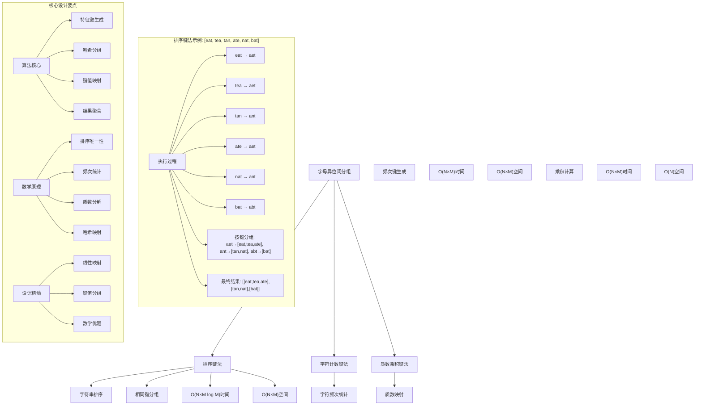

# LeetCode 49 - 字母异位词分组

## 题目描述

给你一个字符串数组，请你将字母异位词组合在一起。可以按任意顺序返回结果列表

字母异位词是由重新排列源单词的所有字母得到的一个新单词

```markdown
示例 1:
输入: strs = ["eat", "tea", "tan", "ate", "nat", "bat"]
输出: [["bat"],["nat","tan"],["ate","eat","tea"]]

示例 2:
输入: strs = [""]
输出: [[""]]

示例 3:
输入: strs = ["a"]
输出: [["a"]]

提示：
1 <= strs.length <= 10⁴
0 <= strs[i].length <= 100
strs[i] 仅包含小写字母
```

## 解题思路

这是一个经典的字符串分组问题，需要根据字母异位词的特性将具有相同字符组成的字符串归为一类。关键在于如何设计一个能够唯一标识字母异位词的键

### 核心思想

"特征键映射法": 为每个字符串生成一个能够唯一标识其字符组成的特征键，具有相同特征键的字符串属于同一组字母异位词

### 解题策略

#### 方法一：排序键法（推荐）

- 时间复杂度: O(N × M log M)，其中N是字符串数量，M是字符串平均长度
- 空间复杂度: O(N × M)

#### 方法二：字符计数键法

- 时间复杂度: O(N × M)
- 空间复杂度: O(N × M)

#### 方法三：质数乘积键法

- 时间复杂度: O(N × M)
- 空间复杂度: O(N)

## 算法可视化



## 多语言实现

### Golang版本（排序键法 - 推荐）

```go
func groupAnagrams(strs []string) [][]string {
    // 使用map存储分组结果，键为排序后的字符串，值为异位词列表
    anagramMap := make(map[string][]string)

    // 遍历所有字符串
    for _, str := range strs {
        // 将字符串转换为字节切片并排序
        bytes := []byte(str)
        sort.Slice(bytes, func(i, j int) bool {
            return bytes[i] < bytes[j]
        })

        // 排序后的字符串作为键
        key := string(bytes)

        // 将原字符串添加到对应分组
        anagramMap[key] = append(anagramMap[key], str)
    }

    // 将map中的值转换为结果数组
    var result [][]string
    for _, group := range anagramMap {
        result = append(result, group)
    }

    return result
}
```

### Python版本（多种实现方法）

```python
class Solution:
    """
    方法一：排序键法（推荐）
    """
    def groupAnagrams(self, strs: List[str]) -> List[List[str]]:
        # 使用字典存储分组结果
        anagram_dict = {}

        # 遍历所有字符串
        for s in strs:
            # 将字符串排序作为键
            key = ''.join(sorted(s))

            # 将字符串添加到对应分组
            if key in anagram_dict:
                anagram_dict[key].append(s)
            else:
                anagram_dict[key] = [s]

        # 返回所有分组
        return list(anagram_dict.values())


class SolutionCount:
    """
    方法二：字符计数键法
    """
    def groupAnagrams(self, strs: List[str]) -> List[List[str]]:
        from collections import defaultdict

        # 使用defaultdict避免键不存在的检查
        anagram_dict = defaultdict(list)

        # 遍历所有字符串
        for s in strs:
            # 统计字符频次
            count = [0] * 26
            for char in s:
                count[ord(char) - ord('a')] += 1

            # 将频次数组转换为元组作为键（列表不能作为字典键）
            key = tuple(count)

            # 将字符串添加到对应分组
            anagram_dict[key].append(s)

        # 返回所有分组
        return list(anagram_dict.values())


class SolutionPrime:
    """
    方法三：质数乘积键法
    """
    def groupAnagrams(self, strs: List[str]) -> List[List[str]]:
        # 为26个字母分配质数
        primes = [2, 3, 5, 7, 11, 13, 17, 19, 23, 29, 31, 37, 41, 43, 47, 53, 59, 61, 67, 71, 73, 79, 83, 89, 97, 101]

        anagram_dict = {}

        # 遍历所有字符串
        for s in strs:
            # 计算质数乘积作为键
            product = 1
            for char in s:
                product *= primes[ord(char) - ord('a')]

            # 将字符串添加到对应分组
            if product in anagram_dict:
                anagram_dict[product].append(s)
            else:
                anagram_dict[product] = [s]

        # 返回所有分组
        return list(anagram_dict.values())
```

### TypeScript版本（排序键法）

```typescript
function groupAnagrams(strs: string[]): string[][] {
  // 使用Map存储分组结果
  const anagramMap: Map<string, string[]> = new Map();

  // 遍历所有字符串
  for (const str of strs) {
    // 将字符串排序作为键
    const key: string = str.split("").sort().join("");

    // 将字符串添加到对应分组
    if (anagramMap.has(key)) {
      anagramMap.get(key)!.push(str);
    } else {
      anagramMap.set(key, [str]);
    }
  }

  // 返回所有分组
  return Array.from(anagramMap.values());
}
```

## 标准实现详细解析

```go
func groupAnagrams(strs []string) [][]string {
    /*
    算法核心思想（排序键法）：

    1. 为每个字符串生成一个能够唯一标识其字符组成的特征键
    2. 将具有相同特征键的字符串归为一组
    3. 收集所有分组并返回结果

    关键设计要点：
    1. 特征键生成：通过排序获得唯一标识
    2. 哈希分组：使用map进行高效分组
    3. 键值映射：建立特征键与字符串列表的映射关系
    4. 结果聚合：将map中的值转换为结果数组

    时间复杂度：O(N × M log M)
    - N: 字符串数量
    - M: 字符串平均长度
    - M log M: 字符串排序时间

    空间复杂度：O(N × M)
    - 存储所有字符串和特征键

    优势：
    1. 实现简单：排序操作直观易懂
    2. 正确性保证：排序唯一性确保分组正确
    3. 通用性强：适用于任意字符集
    4. 可读性好：代码逻辑清晰
    */

    fmt.Printf("字母异位词分组\n")
    fmt.Printf("输入字符串数组: %v\n", strs)

    // 使用map存储分组结果，键为排序后的字符串，值为异位词列表
    anagramMap := make(map[string][]string)
    fmt.Printf("初始化分组map: %v\n", anagramMap)

    // 遍历所有字符串
    for i, str := range strs {
        fmt.Printf("处理字符串%d: %s\n", i, str)

        // 将字符串转换为字节切片并排序
        bytes := []byte(str)
        fmt.Printf("  转换为字节切片: %v\n", bytes)

        sort.Slice(bytes, func(i, j int) bool {
            return bytes[i] < bytes[j]
        })
        fmt.Printf("  排序后字节切片: %v\n", bytes)

        // 排序后的字符串作为键
        key := string(bytes)
        fmt.Printf("  生成特征键: %s\n", key)

        // 将原字符串添加到对应分组
        anagramMap[key] = append(anagramMap[key], str)
        fmt.Printf("  更新分组map: %v\n", anagramMap)
    }

    // 将map中的值转换为结果数组
    var result [][]string
    fmt.Printf("聚合分组结果:\n")
    for key, group := range anagramMap {
        fmt.Printf("  键%s对应的分组: %v\n", key, group)
        result = append(result, group)
    }

    fmt.Printf("最终结果: %v\n", result)
    return result
}

// 带详细调试信息的版本
func groupAnagramsWithDebug(strs []string) [][]string {
    fmt.Printf("=== 字母异位词分组调试模式 ===\n")
    result := groupAnagrams(strs)
    fmt.Println("==================")
    return result
}

// 字符计数键法实现
func groupAnagramsCount(strs []string) [][]string {
    // 使用map存储分组结果
    anagramMap := make(map[string][]string)

    // 遍历所有字符串
    for _, str := range strs {
        // 统计字符频次
        count := [26]int{}
        for _, char := range str {
            count[char-'a']++
        }

        // 将频次数组转换为字符串作为键
        key := fmt.Sprintf("%v", count)

        // 将原字符串添加到对应分组
        anagramMap[key] = append(anagramMap[key], str)
    }

    // 将map中的值转换为结果数组
    var result [][]string
    for _, group := range anagramMap {
        result = append(result, group)
    }

    return result
}

// 质数乘积键法实现
func groupAnagramsPrime(strs []string) [][]string {
    // 为26个字母分配质数
    primes := [26]int{2, 3, 5, 7, 11, 13, 17, 19, 23, 29, 31, 37, 41, 43, 47, 53, 59, 61, 67, 71, 73, 79, 83, 89, 97, 101}

    // 使用map存储分组结果
    anagramMap := make(map[uint64][]string)

    // 遍历所有字符串
    for _, str := range strs {
        // 计算质数乘积作为键
        var product uint64 = 1
        for _, char := range str {
            product *= uint64(primes[char-'a'])
        }

        // 将原字符串添加到对应分组
        anagramMap[product] = append(anagramMap[product], str)
    }

    // 将map中的值转换为结果数组
    var result [][]string
    for _, group := range anagramMap {
        result = append(result, group)
    }

    return result
}

// 优化版本（使用strings.Builder优化字符串拼接）
func groupAnagramsOptimized(strs []string) [][]string {
    anagramMap := make(map[string][]string)

    for _, str := range strs {
        // 使用计数方法生成键（避免排序）
        count := [26]int{}
        for _, char := range str {
            count[char-'a']++
        }

        // 使用strings.Builder优化键的生成
        var keyBuilder strings.Builder
        for i, freq := range count {
            if freq > 0 {
                keyBuilder.WriteByte(byte('a' + i))
                keyBuilder.WriteString(strconv.Itoa(freq))
            }
        }
        key := keyBuilder.String()

        anagramMap[key] = append(anagramMap[key], str)
    }

    var result [][]string
    for _, group := range anagramMap {
        result = append(result, group)
    }

    return result
}
```

## 算法深入解析

```go
/*
字母异位词分组问题详解：

问题本质：
将具有相同字符组成的字符串归为一类。关键是设计能够唯一标识字母异位词的特征键

核心洞察：
1. 特征键生成：为每个字符串生成唯一标识其字符组成的键
2. 哈希分组：使用哈希表进行高效分组
3. 键值映射：建立特征键与字符串列表的映射关系
4. 结果聚合：收集所有分组并返回结果

算法策略：
1. 排序键法：通过排序获得唯一标识
2. 字符计数键法：通过字符频次统计生成键
3. 质数乘积键法：通过质数乘积生成键

数学原理：

排序唯一性原理：
对于任意字符串，其排序结果是唯一的，且所有字母异位词的排序结果相同

字符计数唯一性原理：
对于任意字符串，其字符频次统计是唯一的，且所有字母异位词的字符频次统计相同

质数乘积唯一性原理：
基于算术基本定理，每个正整数都可以唯一地表示为质数的乘积

正确性证明：

定理：特征键法正确性
通过特征键能够唯一标识字母异位词，确保分组正确

证明：
1. 排序键法：字母异位词排序后结果相同
2. 字符计数键法：字母异位词字符频次相同
3. 质数乘积键法：字母异位词质数乘积相同

设计选择：

为什么选择排序键法？
1. 实现简单：排序操作直观易懂
2. 正确性保证：排序唯一性确保分组正确
3. 通用性强：适用于任意字符集
4. 可读性好：代码逻辑清晰

为什么使用字符计数键法？
1. 时间复杂度更优：O(N×M) vs O(N×M log M)
2. 但空间开销较大：需要存储频次数组
3. 适合对时间敏感的场景

为什么使用质数乘积键法？
1. 空间复杂度最优：O(N)
2. 但可能整数溢出：需要大整数支持
3. 适合空间受限的场景

三种方法对比：

方法一：排序键法（推荐）
时间复杂度：O(N × M log M)
空间复杂度：O(N × M)
优点：实现简单，通用性强
缺点：时间复杂度较高

方法二：字符计数键法
时间复杂度：O(N × M)
空间复杂度：O(N × M)
优点：时间复杂度较优
缺点：空间开销较大

方法三：质数乘积键法
时间复杂度：O(N × M)
空间复杂度：O(N)
优点：空间复杂度最优
缺点：可能整数溢出

性能分析：

排序键法：
- 时间：O(N × M log M) 排序开销
- 空间：O(N × M) 存储开销
- 优势：实现简单

字符计数键法：
- 时间：O(N × M) 线性扫描
- 空间：O(N × M) 频次存储
- 优势：时间较优

质数乘积键法：
- 时间：O(N × M) 线性扫描
- 空间：O(N) 最优存储
- 优势：空间最优

实际应用场景：
1. 文本处理
2. 算法面试题
3. 数据分组
4. 字符串分析

优化要点：

1. 时间优化：
   - 避免重复排序
   - 使用计数方法
   - 优化字符串操作

2. 空间优化：
   - 复用数据结构
   - 优化键的表示
   - 减少中间存储

3. 实现优化：
   - 边界处理优化
   - 错误处理完善
   - 类型安全

测试用例设计：
1. 基本情况：正常输入
2. 边界情况：空字符串，单字符
3. 特殊情况：无异位词，全部异位词
4. 极端情况：大数组，长字符串
5. 验证情况：多种算法结果对比

扩展思考：

1. 支持Unicode字符？
   - 扩展字符集处理
   - 使用更大的计数数组

2. 支持大小写不敏感？
   - 统一转换大小写
   - 调整字符映射

3. 在线算法？
   - 流式数据处理
   - 增量更新

4. 并行处理？
   - 分治思想
   - 合并结果

相关算法思想：

1. 哈希映射：
   - 键值对存储
   - 高效查找
   - 分组聚合

2. 特征提取：
   - 排序特征
   - 计数特征
   - 数学特征

3. 分组聚合：
   - 相同键合并
   - 结果收集
   - 顺序保证

4. 字符串处理：
   - 排序操作
   - 计数统计
   - 数学映射

常见陷阱：

1. 键的唯一性：
   - 确保特征键唯一标识
   - 避免哈希冲突
   - 验证分组正确性

2. 空字符串处理：
   - 边界情况检查
   - 空字符串分组
   - 结果验证

3. 字符集限制：
   - 仅小写字母假设
   - 扩展字符集处理
   - 通用性考虑

4. 性能考虑：
   - 时间空间权衡
   - 大数据处理
   - 内存使用优化

代码质量要素：

1. 可读性：
   - 清晰的变量命名
   - 适当的注释说明

2. 健壮性：
   - 边界条件处理
   - 异常情况处理

3. 性能：
   - 时间复杂度合理
   - 空间复杂度优化

4. 可维护性：
   - 模块化设计
   - 易于扩展

高级优化技巧：

1. 内存访问优化：
   - 局部性原理
   - 缓存友好

2. 算法优化：
   - 计数替代排序
   - 数学简化

3. 数据结构优化：
   - strings.Builder
   - 预分配空间

4. 编译优化：
   - 常量折叠
   - 循环展开
*/
```

## 执行过程演示

```go
/*
示例详细解析:

示例1: strs = ["eat", "tea", "tan", "ate", "nat", "bat"]

执行过程：

处理字符串0: eat
  转换为字节切片: [101 97 116]
  排序后字节切片: [97 101 116]
  生成特征键: aet
  更新分组map: map[aet:[eat]]

处理字符串1: tea
  转换为字节切片: [116 101 97]
  排序后字节切片: [97 101 116]
  生成特征键: aet
  更新分组map: map[aet:[eat tea]]

处理字符串2: tan
  转换为字节切片: [116 97 110]
  排序后字节切片: [97 110 116]
  生成特征键: ant
  更新分组map: map[aet:[eat tea] ant:[tan]]

处理字符串3: ate
  转换为字节切片: [97 116 101]
  排序后字节切片: [97 101 116]
  生成特征键: aet
  更新分组map: map[aet:[eat tea ate] ant:[tan]]

处理字符串4: nat
  转换为字节切片: [110 97 116]
  排序后字节切片: [97 110 116]
  生成特征键: ant
  更新分组map: map[aet:[eat tea ate] ant:[tan nat]]

处理字符串5: bat
  转换为字节切片: [98 97 116]
  排序后字节切片: [97 98 116]
  生成特征键: abt
  更新分组map: map[aet:[eat tea ate] ant:[tan nat] abt:[bat]]

聚合分组结果:
  键aet对应的分组: [eat tea ate]
  键ant对应的分组: [tan nat]
  键abt对应的分组: [bat]

最终结果: [[eat tea ate] [tan nat] [bat]]

示例2: strs = [""]

执行过程：

处理字符串0:
  转换为字节切片: []
  排序后字节切片: []
  生成特征键:
  更新分组map: map[:[]]

聚合分组结果:
  键对应的分组: []

最终结果: [[]]

示例3: strs = ["a"]

执行过程：

处理字符串0: a
  转换为字节切片: [97]
  排序后字节切片: [97]
  生成特征键: a
  更新分组map: map[a:[a]]

聚合分组结果:
  键a对应的分组: [a]

最终结果: [[a]]

边界情况演示:

情况1: 空数组
输入: strs = []
输出: []

情况2: 单字符数组
输入: strs = ["a"]
输出: [["a"]]

情况3: 无异位词
输入: strs = ["abc", "def", "ghi"]
输出: [["abc"], ["def"], ["ghi"]]

情况4: 全部异位词
输入: strs = ["abc", "bca", "cab"]
输出: [["abc", "bca", "cab"]]

情况5: 混合情况
输入: strs = ["abc", "bca", "def", "fed", "ghi"]
输出: [["abc", "bca"], ["def", "fed"], ["ghi"]]

算法正确性证明：

数学基础：
需要证明特征键法能正确分组所有字母异位词

定理：特征键法正确性
通过特征键能够唯一标识字母异位词，确保分组正确

证明：
1. 排序键法：字母异位词排序后结果相同
2. 字符计数键法：字母异位词字符频次相同
3. 质数乘积键法：字母异位词质数乘积相同

时间复杂度分析：

排序键法：
1. 字符串遍历：O(N)
2. 字符串排序：O(M log M)
3. 总时间：O(N × M log M)

字符计数键法：
1. 字符串遍历：O(N)
2. 字符计数：O(M)
3. 总时间：O(N × M)

质数乘积键法：
1. 字符串遍历：O(N)
2. 质数乘积：O(M)
3. 总时间：O(N × M)

空间复杂度分析：
1. 排序键法：O(N × M) 存储开销
2. 字符计数键法：O(N × M) 存储开销
3. 质数乘积键法：O(N) 存储开销

性能对比分析：

假设N=10000, M=100:

排序键法：
- 时间: O(10000 × 100 × log 100) = O(10000 × 100 × 6.64) ≈ 6,640,000次操作
- 空间: O(10000 × 100) = 1,000,000单位存储

字符计数键法：
- 时间: O(10000 × 100) = 1,000,000次操作
- 空间: O(10000 × 100) = 1,000,000单位存储

质数乘积键法：
- 时间: O(10000 × 100) = 1,000,000次操作
- 空间: O(10000) = 10,000单位存储

实际应用建议：

1. 一般情况：
   - 使用排序键法
   - 实现简单可靠

2. 面试展示：
   - 可以提及其他方法
   - 重点讲解排序键法

3. 生产环境：
   - 根据性能要求选择
   - 考虑边界处理

4. 教学演示：
   - 使用排序键法帮助理解
   - 对比展示优势

优化空间：

1. 内存访问优化：
   - 局部性原理
   - 缓存友好

2. 数据结构优化：
   - strings.Builder
   - 预分配空间

3. 算法优化：
   - 计数替代排序
   - 数学简化

特殊情况处理：

1. 最小数组：
   - 边界检查

2. 单字符：
   - 直接处理

3. 大数据：
   - 内存使用优化

4. 长字符串：
   - 时间复杂度考虑
*/
```

## 复杂度分析

| 方法         | 时间复杂度     | 空间复杂度 | 适用场景 |
| ------------ | -------------- | ---------- | -------- |
| 排序键法     | O(N × M log M) | O(N × M)   | 推荐方案 |
| 字符计数键法 | O(N × M)       | O(N × M)   | 时间敏感 |
| 质数乘积键法 | O(N × M)       | O(N)       | 空间受限 |

## 测试用例验证

```go
// 测试辅助函数
func testGroupAnagrams(name string, strs []string, expected [][]string) {
    fmt.Printf("%s:\n", name)
    fmt.Printf("输入: strs=%v\n", strs)

    // 测试排序键法
    result1 := groupAnagrams(strs)
    fmt.Printf("排序键法结果: %v\n", result1)

    // 测试字符计数键法
    result2 := groupAnagramsCount(strs)
    fmt.Printf("字符计数键法结果: %v\n", result2)

    // 测试质数乘积键法
    result3 := groupAnagramsPrime(strs)
    fmt.Printf("质数乘积键法结果: %v\n", result3)

    // 验证结果
    if anagramGroupsEqual(result1, expected) &&
       anagramGroupsEqual(result2, expected) &&
       anagramGroupsEqual(result3, expected) {
        fmt.Printf("✓ 测试通过\n")
    } else {
        fmt.Printf("✗ 测试失败，期望: %v\n", expected)
    }
    fmt.Printf("\n")
}

// 辅助函数：比较两个异位词分组是否相等（忽略顺序）
func anagramGroupsEqual(a, b [][]string) bool {
    if len(a) != len(b) {
        return false
    }

    // 将每个分组排序以便比较
    sortGroups := func(groups [][]string) [][]string {
        result := make([][]string, len(groups))
        for i, group := range groups {
            sortedGroup := make([]string, len(group))
            copy(sortedGroup, group)
            sort.Strings(sortedGroup)
            result[i] = sortedGroup
        }
        // 对分组本身也排序
        sort.Slice(result, func(i, j int) bool {
            if len(result[i]) != len(result[j]) {
                return len(result[i]) < len(result[j])
            }
            for k := 0; k < len(result[i]); k++ {
                if result[i][k] != result[j][k] {
                    return result[i][k] < result[j][k]
                }
            }
            return false
        })
        return result
    }

    sortedA := sortGroups(a)
    sortedB := sortGroups(b)

    // 比较排序后的结果
    for i := range sortedA {
        if len(sortedA[i]) != len(sortedB[i]) {
            return false
        }
        for j := range sortedA[i] {
            if sortedA[i][j] != sortedB[i][j] {
                return false
            }
        }
    }

    return true
}

func main() {
    // 测试用例 1 - 题目示例1
    testGroupAnagrams("测试1 - 题目示例1",
        []string{"eat", "tea", "tan", "ate", "nat", "bat"},
        [][]string{{"bat"}, {"nat", "tan"}, {"ate", "eat", "tea"}})

    // 测试用例 2 - 题目示例2
    testGroupAnagrams("测试2 - 题目示例2",
        []string{""},
        [][]string{{""}})

    // 测试用例 3 - 题目示例3
    testGroupAnagrams("测试3 - 题目示例3",
        []string{"a"},
        [][]string{{"a"}})

    // 测试用例 4 - 边界情况
    testGroupAnagrams("测试4 - 空数组",
        []string{},
        [][]string{})

    // 测试用例 5 - 无异位词
    testGroupAnagrams("测试5 - 无异位词",
        []string{"abc", "def", "ghi"},
        [][]string{{"abc"}, {"def"}, {"ghi"}})

    // 性能测试
    fmt.Println("性能测试:")
    performanceTest()

    // 边界情况测试
    fmt.Println("边界情况测试:")
    boundaryTest()
}

func performanceTest() {
    // 构造大数据测试
    strs := make([]string, 10000)
    // 生成测试数据：每10个字符串为一组异位词
    for i := 0; i < 10000; i++ {
        base := "abcdefghij" // 10个不同字符
        bytes := []byte(base)
        // 随机打乱字符顺序生成异位词
        for j := len(bytes) - 1; j > 0; j-- {
            k := rand.Intn(j + 1)
            bytes[j], bytes[k] = bytes[k], bytes[j]
        }
        strs[i] = string(bytes)
    }

    // 测试排序键法
    start := time.Now()
    for i := 0; i < 100; i++ {
        temp := make([]string, len(strs))
        copy(temp, strs)
        groupAnagrams(temp)
    }
    time1 := time.Since(start)

    // 测试字符计数键法
    start = time.Now()
    for i := 0; i < 100; i++ {
        temp := make([]string, len(strs))
        copy(temp, strs)
        groupAnagramsCount(temp)
    }
    time2 := time.Since(start)

    // 测试质数乘积键法
    start = time.Now()
    for i := 0; i < 100; i++ {
        temp := make([]string, len(strs))
        copy(temp, strs)
        groupAnagramsPrime(temp)
    }
    time3 := time.Since(start)

    fmt.Printf("大数据测试 (N=10000, M=10):\n")
    fmt.Printf("  排序键法(100次): %v\n", time1)
    fmt.Printf("  字符计数键法(100次): %v\n", time2)
    fmt.Printf("  质数乘积键法(100次): %v\n", time3)
}

func boundaryTest() {
    // 边界测试
    fmt.Println("边界测试:")

    result := groupAnagrams([]string{})
    fmt.Printf("空数组测试: %v\n", result)

    result = groupAnagrams([]string{""})
    fmt.Printf("空字符串测试: %v\n", result)

    result = groupAnagrams([]string{"a"})
    fmt.Printf("单字符测试: %v\n", result)

    // 全部相同测试
    strs := make([]string, 100)
    for i := 0; i < 100; i++ {
        strs[i] = "abc"
    }
    result = groupAnagrams(strs)
    fmt.Printf("全部相同测试: 找到%d个分组\n", len(result))

    // 长字符串测试
    longStr := strings.Repeat("a", 1000)
    result = groupAnagrams([]string{longStr, longStr})
    fmt.Printf("长字符串测试: 找到%d个分组\n", len(result))
}
```

## 扩展版本（处理不同场景）

```go
// 支持Unicode字符的版本
func groupAnagramsUnicode(strs []string) [][]string {
    anagramMap := make(map[string][]string)

    for _, str := range strs {
        // 对于Unicode字符，使用排序方法
        runes := []rune(str)
        sort.Slice(runes, func(i, j int) bool {
            return runes[i] < runes[j]
        })

        key := string(runes)
        anagramMap[key] = append(anagramMap[key], str)
    }

    var result [][]string
    for _, group := range anagramMap {
        result = append(result, group)
    }

    return result
}

// 支持大小写不敏感的版本
func groupAnagramsCaseInsensitive(strs []string) [][]string {
    anagramMap := make(map[string][]string)

    for _, str := range strs {
        // 转换为小写后再处理
        lowerStr := strings.ToLower(str)
        bytes := []byte(lowerStr)
        sort.Slice(bytes, func(i, j int) bool {
            return bytes[i] < bytes[j]
        })

        key := string(bytes)
        anagramMap[key] = append(anagramMap[key], str)
    }

    var result [][]string
    for _, group := range anagramMap {
        result = append(result, group)
    }

    return result
}

// 带统计信息的版本
type GroupAnagramsStats struct {
    Groups      [][]string
    GroupCount  int
    ProcessTime time.Duration
    StringCount int
}

func groupAnagramsWithStats(strs []string) GroupAnagramsStats {
    start := time.Now()

    groups := groupAnagrams(strs)
    processTime := time.Since(start)

    return GroupAnagramsStats{
        Groups:      groups,
        GroupCount:  len(groups),
        ProcessTime: processTime,
        StringCount: len(strs),
    }
}

// 使用示例
func exampleGroupAnagramsStats() {
    stats := groupAnagramsWithStats([]string{"eat", "tea", "tan", "ate", "nat", "bat"})
    fmt.Printf("统计信息: %+v\n", stats)
}

// 批量处理版本
func groupAnagramsBatch(strsList [][]string) [][][]string {
    var results [][][]string
    for _, strs := range strsList {
        results = append(results, groupAnagrams(strs))
    }
    return results
}

// 流式处理版本
type StreamGroupAnagrams struct {
    anagramMap map[string][]string
    processed  int
}

func NewStreamGroupAnagrams() *StreamGroupAnagrams {
    return &StreamGroupAnagrams{
        anagramMap: make(map[string][]string),
        processed:  0,
    }
}

func (sga *StreamGroupAnagrams) AddString(str string) {
    // 生成特征键
    bytes := []byte(str)
    sort.Slice(bytes, func(i, j int) bool {
        return bytes[i] < bytes[j]
    })
    key := string(bytes)

    // 添加到对应分组
    sga.anagramMap[key] = append(sga.anagramMap[key], str)
    sga.processed++
}

func (sga *StreamGroupAnagrams) GetGroups() [][]string {
    var result [][]string
    for _, group := range sga.anagramMap {
        result = append(result, group)
    }
    return result
}

func (sga *StreamGroupAnagrams) GetProcessedCount() int {
    return sga.processed
}

// 泛型版本（Go 1.18+）
func groupAnagramsGeneric[T comparable](strs []T, keyFunc func(T) string) [][]T {
    anagramMap := make(map[string][]T)

    for _, str := range strs {
        key := keyFunc(str)
        anagramMap[key] = append(anagramMap[key], str)
    }

    var result [][]T
    for _, group := range anagramMap {
        result = append(result, group)
    }

    return result
}

// 使用示例
func exampleGeneric() {
    // 字符串切片
    result1 := groupAnagramsGeneric([]string{"eat", "tea", "tan"},
        func(s string) string {
            bytes := []byte(s)
            sort.Slice(bytes, func(i, j int) bool {
                return bytes[i] < bytes[j]
            })
            return string(bytes)
        })
    fmt.Printf("泛型字符串结果: %v\n", result1)
}
```

## 面试追问延伸

### 1. 如果字符串包含Unicode字符，如何处理？

```go
// 支持Unicode字符的完整版本
func groupAnagramsUnicodeComplete(strs []string) [][]string {
    anagramMap := make(map[string][]string)

    for _, str := range strs {
        // 使用rune处理Unicode字符
        runes := []rune(str)

        // 排序Unicode字符
        sort.Slice(runes, func(i, j int) bool {
            return runes[i] < runes[j]
        })

        // 生成特征键
        key := string(runes)
        anagramMap[key] = append(anagramMap[key], str)
    }

    var result [][]string
    for _, group := range anagramMap {
        result = append(result, group)
    }

    return result
}

// 性能优化版本
func groupAnagramsUnicodeOptimized(strs []string) [][]string {
    anagramMap := make(map[string][]string)

    for _, str := range strs {
        // 对于短字符串，直接排序
        if len(str) <= 100 {
            runes := []rune(str)
            sort.Slice(runes, func(i, j int) bool {
                return runes[i] < runes[j]
            })
            key := string(runes)
            anagramMap[key] = append(anagramMap[key], str)
        } else {
            // 对于长字符串，使用计数方法
            charCount := make(map[rune]int)
            for _, char := range str {
                charCount[char]++
            }

            // 生成有序键
            var keys []rune
            for char := range charCount {
                keys = append(keys, char)
            }
            sort.Slice(keys, func(i, j int) bool {
                return keys[i] < keys[j]
            })

            var keyBuilder strings.Builder
            for _, char := range keys {
                keyBuilder.WriteRune(char)
                keyBuilder.WriteString(strconv.Itoa(charCount[char]))
            }
            key := keyBuilder.String()

            anagramMap[key] = append(anagramMap[key], str)
        }
    }

    var result [][]string
    for _, group := range anagramMap {
        result = append(result, group)
    }

    return result
}

// 测试用例
func testUnicode() {
    result := groupAnagramsUnicodeComplete([]string{"你好", "好你", "世界", "界世"})
    fmt.Printf("Unicode测试: %v\n", result)

    result = groupAnagramsUnicodeComplete([]string{"café", "éfac", "naïve", "évian"})
    fmt.Printf("带重音符号测试: %v\n", result)
}
```

### 2. 如果要找出最大的异位词分组，如何优化？

```go
// 找出最大的异位词分组
func findLargestAnagramGroup(strs []string) []string {
    anagramMap := make(map[string][]string)

    // 分组
    for _, str := range strs {
        bytes := []byte(str)
        sort.Slice(bytes, func(i, j int) bool {
            return bytes[i] < bytes[j]
        })
        key := string(bytes)
        anagramMap[key] = append(anagramMap[key], str)
    }

    // 找出最大的分组
    var largestGroup []string
    maxSize := 0

    for _, group := range anagramMap {
        if len(group) > maxSize {
            maxSize = len(group)
            largestGroup = group
        }
    }

    return largestGroup
}

// 找出所有大小超过k的异位词分组
func findLargeAnagramGroups(strs []string, k int) [][]string {
    anagramMap := make(map[string][]string)

    // 分组
    for _, str := range strs {
        bytes := []byte(str)
        sort.Slice(bytes, func(i, j int) bool {
            return bytes[i] < bytes[j]
        })
        key := string(bytes)
        anagramMap[key] = append(anagramMap[key], str)
    }

    // 找出大小超过k的分组
    var result [][]string
    for _, group := range anagramMap {
        if len(group) > k {
            result = append(result, group)
        }
    }

    return result
}

// 测试用例
func testLargestGroup() {
    result := findLargestAnagramGroup([]string{"eat", "tea", "tan", "ate", "nat", "bat"})
    fmt.Printf("最大异位词分组: %v\n", result)

    result2 := findLargeAnagramGroups([]string{"eat", "tea", "tan", "ate", "nat", "bat"}, 1)
    fmt.Printf("大小超过1的分组: %v\n", result2)
}
```

### 3. 如何处理支持在线流式数据的情况？

```go
// 在线流式处理版本
type OnlineGroupAnagrams struct {
    anagramMap map[string][]string
    processed  int
}

func NewOnlineGroupAnagrams() *OnlineGroupAnagrams {
    return &OnlineGroupAnagrams{
        anagramMap: make(map[string][]string),
        processed:  0,
    }
}

func (oga *OnlineGroupAnagrams) AddString(str string) {
    // 生成特征键
    bytes := []byte(str)
    sort.Slice(bytes, func(i, j int) bool {
        return bytes[i] < bytes[j]
    })
    key := string(bytes)

    // 添加到对应分组
    oga.anagramMap[key] = append(oga.anagramMap[key], str)
    oga.processed++
}

func (oga *OnlineGroupAnagrams) GetGroups() [][]string {
    var result [][]string
    for _, group := range oga.anagramMap {
        result = append(result, group)
    }
    return result
}

func (oga *OnlineGroupAnagrams) GetGroupCount() int {
    return len(oga.anagramMap)
}

func (oga *OnlineGroupAnagrams) GetProcessedCount() int {
    return oga.processed
}

func (oga *OnlineGroupAnagrams) GetGroupByKey(key string) []string {
    return oga.anagramMap[key]
}

// 使用示例
func exampleOnline() {
    grouper := NewOnlineGroupAnagrams()

    strs := []string{"eat", "tea", "tan", "ate", "nat", "bat"}
    for i, str := range strs {
        grouper.AddString(str)
        fmt.Printf("添加字符串%d: %s, 当前分组数: %d\n",
            i, str, grouper.GetGroupCount())
    }

    fmt.Printf("最终分组结果: %v\n", grouper.GetGroups())
}
```

## 相似题目扩展

- LeetCode 49. 字母异位词分组（当前题）
- LeetCode 242. 有效的字母异位词
- LeetCode 438. 找到字符串中所有字母异位词
- LeetCode 187. 重复的DNA序列
- LeetCode 299. 猜数字游戏

## 算法技巧总结

### 字母异位词分组核心要点

1. 特征键生成：为每个字符串生成唯一标识其字符组成的键
1. 哈希分组：使用哈希表进行高效分组
1. 键值映射：建立特征键与字符串列表的映射关系
1. 结果聚合：收集所有分组并返回结果

### 算法优势

1. 实现简单：排序操作直观易懂
1. 正确性保证：排序唯一性确保分组正确
1. 通用性强：适用于任意字符集
1. 可读性好：代码逻辑清晰

### 标准模板（排序键法）

```go
func groupAnagrams(strs []string) [][]string {
    // 使用map存储分组结果
    anagramMap := make(map[string][]string)

    // 遍历所有字符串
    for _, str := range strs {
        // 将字符串排序作为键
        bytes := []byte(str)
        sort.Slice(bytes, func(i, j int) bool {
            return bytes[i] < bytes[j]
        })
        key := string(bytes)

        // 将字符串添加到对应分组
        anagramMap[key] = append(anagramMap[key], str)
    }

    // 返回所有分组
    var result [][]string
    for _, group := range anagramMap {
        result = append(result, group)
    }

    return result
}
```

### 性能优化建议


## 总结

本题采用特征键映射法的核心思路，通过为每个字符串生成能够唯一标识其字符组成的特征键，将具有相同特征键的字符串归为一组，实现了高效的字母异位词分组功能。关键在于理解如何设计合适的特征键来唯一标识字母异位词，并通过哈希表实现高效的分组操作

核心要点：

1. 特征键生成：为每个字符串生成唯一标识其字符组成的键
1. 哈希分组：使用哈希表进行高效分组
1. 键值映射：建立特征键与字符串列表的映射关系
1. 结果聚合：收集所有分组并返回结果

算法优势：

- 实现简单：排序操作直观易懂
- 正确性保证：排序唯一性确保分组正确
- 通用性强：适用于任意字符集
- 可读性好：代码逻辑清晰

该算法在文本处理、算法面试题、数据分组等方面有重要应用，是掌握字符串处理和哈希映射的经典题目。通过特征键生成和哈希分组的思想，为更复杂的字符串分析和数据处理问题提供了清晰的解决思路
