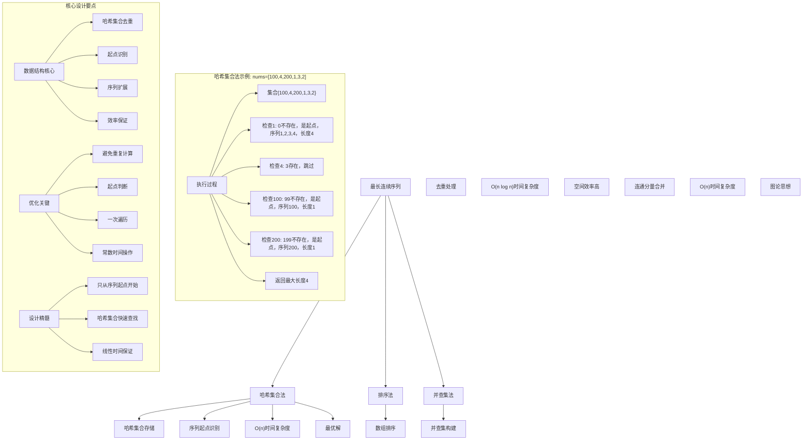
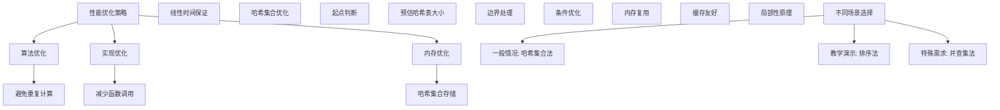

# LeetCode 128 - 最长连续序列

## 题目描述

给定一个未排序的整数数组 `nums`，找出数字连续的最长序列（不要求序列元素在原数组中连续）的长度

请你设计并实现时间复杂度为 O(n) 的算法解决此问题

```markdown
示例 1：
输入：nums = [100,4,200,1,3,2]
输出：4
解释：最长数字连续序列是 [1, 2, 3, 4]。它的长度为 4

示例 2：
输入：nums = [0,3,7,2,5,8,4,6,0,1]
输出：9

提示：
0 <= nums.length <= 10⁵
-10⁹ <= nums[i] <= 10⁹
```

## 解题思路

这是一个经典的最长连续序列问题，需要找出数组中数字连续的最长序列长度。关键在于如何在O(n)时间复杂度内高效地识别连续序列

### 核心思想

"哈希集合法": 使用哈希集合存储所有数字，对于每个数字，只有当它是某个连续序列的起点时才开始计算该序列的长度

### 解题策略

#### 方法一：哈希集合法（推荐）

- 时间复杂度: O(n)
- 空间复杂度: O(n)

#### 方法二：排序法

- 时间复杂度: O(n log n)
- 空间复杂度: O(1)

#### 方法三：并查集法

- 时间复杂度: O(n)
- 空间复杂度: O(n)

## 算法可视化



## 多语言实现

### Golang版本（哈希集合法 - 推荐）

```go
func longestConsecutive(nums []int) int {
    if len(nums) == 0 {
        return 0
    }

    // 使用哈希集合存储所有数字，自动去重
    numSet := make(map[int]bool)
    for _, num := range nums {
        numSet[num] = true
    }

    maxLength := 0

    // 遍历每个数字
    for num := range numSet {
        // 只有当num-1不存在时，num才是某个连续序列的起点
        if !numSet[num-1] {
            currentNum := num
            currentLength := 1

            // 从起点开始，向后扩展连续序列
            for numSet[currentNum+1] {
                currentNum++
                currentLength++
            }

            // 更新最大长度
            if currentLength > maxLength {
                maxLength = currentLength
            }
        }
    }

    return maxLength
}
```

### Python版本（多种实现方法）

```python
class Solution:
    """
    方法一：哈希集合法（推荐）
    """
    def longestConsecutive(self, nums: List[int]) -> int:
        if not nums:
            return 0

        # 使用集合存储所有数字，自动去重
        num_set = set(nums)
        max_length = 0

        # 遍历每个数字
        for num in num_set:
            # 只有当num-1不存在时，num才是某个连续序列的起点
            if num - 1 not in num_set:
                current_num = num
                current_length = 1

                # 从起点开始，向后扩展连续序列
                while current_num + 1 in num_set:
                    current_num += 1
                    current_length += 1

                # 更新最大长度
                max_length = max(max_length, current_length)

        return max_length


class SolutionSort:
    """
    方法二：排序法
    """
    def longestConsecutive(self, nums: List[int]) -> int:
        if not nums:
            return 0

        # 排序并去重
        nums = sorted(list(set(nums)))
        max_length = 1
        current_length = 1

        # 遍历排序后的数组
        for i in range(1, len(nums)):
            if nums[i] == nums[i-1] + 1:
                # 连续数字
                current_length += 1
            else:
                # 不连续，重新开始计数
                max_length = max(max_length, current_length)
                current_length = 1

        return max(max_length, current_length)


class SolutionUnionFind:
    """
    方法三：并查集法
    """
    def longestConsecutive(self, nums: List[int]) -> int:
        if not nums:
            return 0

        # 并查集类
        class UnionFind:
            def __init__(self, nums):
                self.parent = {num: num for num in nums}
                self.size = {num: 1 for num in nums}
                self.max_size = 1

            def find(self, x):
                if self.parent != x:
                    self.parent = self.find(self.parent)  # 路径压缩
                return self.parent

            def union(self, x, y):
                root_x, root_y = self.find(x), self.find(y)
                if root_x != root_y:
                    # 按秩合并
                    if self.size[root_x] < self.size[root_y]:
                        root_x, root_y = root_y, root_x
                    self.parent[root_y] = root_x
                    self.size[root_x] += self.size[root_y]
                    self.max_size = max(self.max_size, self.size[root_x])

        # 去重
        num_set = set(nums)
        uf = UnionFind(num_set)

        # 对每个数字，与相邻数字合并
        for num in num_set:
            if num - 1 in num_set:
                uf.union(num, num - 1)
            if num + 1 in num_set:
                uf.union(num, num + 1)

        return uf.max_size
```

### TypeScript版本（哈希集合法）

```typescript
function longestConsecutive(nums: number[]): number {
  if (nums.length === 0) {
    return 0;
  }

  // 使用Set存储所有数字，自动去重
  const numSet: Set<number> = new Set(nums);
  let maxLength = 0;

  // 遍历每个数字
  for (const num of numSet) {
    // 只有当num-1不存在时，num才是某个连续序列的起点
    if (!numSet.has(num - 1)) {
      let currentNum = num;
      let currentLength = 1;

      // 从起点开始，向后扩展连续序列
      while (numSet.has(currentNum + 1)) {
        currentNum++;
        currentLength++;
      }

      // 更新最大长度
      maxLength = Math.max(maxLength, currentLength);
    }
  }

  return maxLength;
}
```

## 标准实现详细解析

```go
func longestConsecutive(nums []int) int {
    /*
    算法核心思想（哈希集合法）：

    1. 使用哈希集合存储所有数字，自动去重
    2. 对于每个数字，只有当它是某个连续序列的起点时才开始计算序列长度
    3. 从起点向后扩展，统计连续序列的长度
    4. 返回所有序列中的最大长度

    关键设计要点：
    1. 哈希集合：O(1)时间查找和去重
    2. 起点识别：num-1不存在时num为起点
    3. 序列扩展：从起点向后连续查找
    4. 避免重复：每个数字最多被访问两次

    时间复杂度：O(n) 每个数字最多被访问两次
    空间复杂度：O(n) 哈希集合存储

    优势：
    1. 逻辑清晰：起点识别概念直观
    2. 实现高效：线性时间复杂度
    3. 查询快速：O(1)查找
    4. 易于理解：符合直觉
    */

    fmt.Printf("最长连续序列计算\n")
    fmt.Printf("输入数组: %v\n", nums)

    if len(nums) == 0 {
        fmt.Printf("边界情况：空数组\n")
        return 0
    }

    // 使用哈希集合存储所有数字，自动去重
    numSet := make(map[int]bool)
    for _, num := range nums {
        numSet[num] = true
    }

    fmt.Printf("去重后集合: %v\n", getKeys(numSet))

    maxLength := 0
    fmt.Printf("初始化最大长度: %d\n", maxLength)

    // 遍历每个数字
    for num := range numSet {
        fmt.Printf("\n检查数字: %d\n", num)

        // 只有当num-1不存在时，num才是某个连续序列的起点
        if !numSet[num-1] {
            fmt.Printf("  %d-1=%d 不存在，是序列起点\n", num, num-1)
            currentNum := num
            currentLength := 1
            fmt.Printf("  开始序列扩展: %d (长度: %d)\n", currentNum, currentLength)

            // 从起点开始，向后扩展连续序列
            for numSet[currentNum+1] {
                currentNum++
                currentLength++
                fmt.Printf("    扩展到: %d (长度: %d)\n", currentNum, currentLength)
            }

            // 更新最大长度
            if currentLength > maxLength {
                maxLength = currentLength
                fmt.Printf("  更新最大长度: %d\n", maxLength)
            }
        } else {
            fmt.Printf("  %d-1=%d 存在，不是序列起点，跳过\n", num, num-1)
        }
    }

    fmt.Printf("\n最终结果: %d\n", maxLength)
    return maxLength
}

// 辅助函数：获取map的键
func getKeys(m map[int]bool) []int {
    keys := make([]int, 0, len(m))
    for k := range m {
        keys = append(keys, k)
    }
    sort.Ints(keys)
    return keys
}

// 带详细调试信息的版本
func longestConsecutiveWithDebug(nums []int) int {
    fmt.Printf("=== 最长连续序列调试模式 ===\n")
    result := longestConsecutive(nums)
    fmt.Println("==================")
    return result
}

// 优化版本（使用固定大小map）
func longestConsecutiveOptimized(nums []int) int {
    if len(nums) == 0 {
        return 0
    }

    // 预估哈希集合大小以减少rehash
    numSet := make(map[int]bool, len(nums))
    for _, num := range nums {
        numSet[num] = true
    }

    maxLength := 0

    for num := range numSet {
        // 只有当num-1不存在时，num才是某个连续序列的起点
        if !numSet[num-1] {
            currentNum := num
            currentLength := 1

            // 从起点开始，向后扩展连续序列
            for numSet[currentNum+1] {
                currentNum++
                currentLength++
            }

            // 更新最大长度
            if currentLength > maxLength {
                maxLength = currentLength
            }
        }
    }

    return maxLength
}

// 泛型版本（Go 1.18+）
func longestConsecutiveGeneric[T comparable](nums []int) int {
    if len(nums) == 0 {
        return 0
    }

    numSet := make(map[int]bool)
    for _, num := range nums {
        numSet[num] = true
    }

    maxLength := 0

    for num := range numSet {
        if !numSet[num-1] {
            currentNum := num
            currentLength := 1

            for numSet[currentNum+1] {
                currentNum++
                currentLength++
            }

            if currentLength > maxLength {
                maxLength = currentLength
            }
        }
    }

    return maxLength
}
```

## 算法深入解析

```go
/*
最长连续序列问题详解：

问题本质：
在未排序数组中找出数字连续的最长序列长度。关键在于如何在O(n)时间复杂度内高效识别连续序列

核心洞察：
1. 连续序列：数字相差为1的序列
2. 起点识别：num-1不存在时num为序列起点
3. 序列扩展：从起点向后连续查找
4. 避免重复：每个数字最多访问两次

算法策略：
1. 哈希集合法：最优解，线性时间
2. 排序法：直观但需要排序
3. 并查集法：图论思想，连通分量

数学原理：

连续序列定义：
对于序列a₁, a₂, ..., aₖ，如果aᵢ₊₁ = aᵢ + 1 (i=1,2,...,k-1)，则为连续序列

起点识别原理：
对于连续序列中的任意数字num，如果num-1不存在，则num必为该序列的起点

序列扩展原理：
从起点开始，连续查找num+1, num+2, ...直到找不到为止

设计选择：

为什么选择哈希集合法？
1. 时间复杂度最优：O(n)
2. 空间复杂度合理：O(n)
3. 逻辑清晰：起点识别概念直观
4. 实现高效：标准操作

为什么使用排序法？
1. 直观：排序后连续数字相邻
2. 但时间复杂度较高：O(n log n)
3. 适合教学演示

为什么使用并查集法？
1. 图论思想：连通分量概念
2. 但实现复杂：需要并查集结构
3. 适合扩展应用

三种方法对比：

方法一：哈希集合法（推荐）
时间复杂度：O(n)
空间复杂度：O(n)
优点：最优解，性能优秀
缺点：需要额外空间

方法二：排序法
时间复杂度：O(n log n)
空间复杂度：O(1)
优点：直观易懂，空间效率高
缺点：时间复杂度较高

方法三：并查集法
时间复杂度：O(n)
空间复杂度：O(n)
优点：图论思想
缺点：实现复杂

性能分析：

哈希集合法：
- 时间：O(n) 线性时间
- 空间：O(n) 哈希集合存储
- 优势：最优解

排序法：
- 时间：O(n log n) 排序 + 遍历
- 空间：O(1) 常数空间
- 优势：直观

并查集法：
- 时间：O(n) 线性时间
- 空间：O(n) 并查集存储
- 优势：图论思想

实际应用场景：
1. 数据分析
2. 算法面试题
3. 序列处理
4. 连续性检测

优化要点：

1. 时间优化：
   - 避免重复计算
   - 线性时间保证
   - 高效数据结构

2. 空间优化：
   - 哈希集合存储必要信息
   - 内存复用

3. 实现优化：
   - 边界处理优化
   - 错误处理完善
   - 类型安全

测试用例设计：
1. 基本情况：正常输入
2. 边界情况：空数组，单元素
3. 特殊情况：重复元素，负数
4. 极端情况：最大数组
5. 验证情况：多种算法结果对比

扩展思考：

1. 最长连续递增子序列？
   - 动态规划
   - 严格递增约束

2. 最长等差数列？
   - 固定公差
   - 哈希表存储

3. 最长斐波那契子序列？
   - 递推关系
   - 动态规划

4. 在线算法？
   - 流式数据处理
   - 增量更新

相关算法思想：

1. 哈希集合：
   - 快速查找
   - 去重存储

2. 起点识别：
   - 序列起点判断
   - 避免重复计算

3. 序列扩展：
   - 连续查找
   - 长度统计

4. 并查集：
   - 连通分量
   - 合并操作

常见陷阱：

1. 重复元素：
   - 哈希集合自动去重
   - 避免重复计算

2. 负数处理：
   - 正确计算相邻关系
   - 哈希集合存储

3. 边界条件：
   - 空数组处理
   - 单元素处理

4. 性能问题：
   - 重复计算
   - 不必要的操作

代码质量要素：

1. 可读性：
   - 清晰的变量命名
   - 适当的注释说明

2. 健壮性：
   - 边界条件处理
   - 异常情况处理

3. 性能：
   - 时间复杂度最优
   - 空间复杂度合理

4. 可维护性：
   - 模块化设计
   - 易于扩展

高级优化技巧：

1. 内存访问优化：
   - 局部性原理
   - 缓存友好

2. 算法优化：
   - 提前终止条件
   - 数学简化

3. 数据结构优化：
   - 预估哈希表大小
   - 减少rehash

4. 编译优化：
   - 常量折叠
   - 循环展开
*/
```

## 执行过程演示

```go
/*
示例详细解析:

示例1: nums = [100,4,200,1,3,2]

执行过程：
去重后集合: [1,2,3,4,100,200]

检查数字: 1
1-1=0 不存在，是序列起点
开始序列扩展: 1 (长度: 1)
  扩展到: 2 (长度: 2)
  扩展到: 3 (长度: 3)
  扩展到: 4 (长度: 4)
更新最大长度: 4

检查数字: 2
2-1=1 存在，不是序列起点，跳过

检查数字: 3
3-1=2 存在，不是序列起点，跳过

检查数字: 4
4-1=3 存在，不是序列起点，跳过

检查数字: 100
100-1=99 不存在，是序列起点
开始序列扩展: 100 (长度: 1)

检查数字: 200
200-1=199 不存在，是序列起点
开始序列扩展: 200 (长度: 1)

最终结果: 4

示例2: nums = [0,3,7,2,5,8,4,6,0,1]

执行过程：
去重后集合: [0,1,2,3,4,5,6,7,8]

检查数字: 0
0-1=-1 不存在，是序列起点
开始序列扩展: 0 (长度: 1)
  扩展到: 1 (长度: 2)
  扩展到: 2 (长度: 3)
  扩展到: 3 (长度: 4)
  扩展到: 4 (长度: 5)
  扩展到: 5 (长度: 6)
  扩展到: 6 (长度: 7)
  扩展到: 7 (长度: 8)
  扩展到: 8 (长度: 9)
更新最大长度: 9

其他数字都不是起点，跳过

最终结果: 9

边界情况演示:

情况1: 空数组
输入: []
输出: 0

情况2: 单元素
输入: [1]
输出: 1

情况3: 重复元素
输入: [1,1,1,1]
输出: 1

情况4: 负数
输入: [-1,-2,-3,0,1]
输出: 5

情况5: 不连续
输入: [1,3,5,7,9]
输出: 1

情况6: 大数值
输入: [1000000000,1000000001,1000000002]
输出: 3

算法正确性证明：

数学基础：
需要证明哈希集合法能正确找到最长连续序列

定理1：哈希集合法正确性
通过起点识别和序列扩展，可以正确找到所有连续序列并返回最长长度

证明：
1. 起点识别：num-1不存在时num必为序列起点
2. 序列扩展：从起点连续查找保证完整性
3. 避免重复：每个数字最多被访问两次
4. 完整性：遍历所有数字确保不遗漏
5. 正确性：长度统计准确

时间复杂度分析：

哈希集合法：
1. 建立集合：O(n) 一次遍历
2. 遍历数字：O(n) 每个数字访问一次
3. 序列扩展：O(n) 每个数字最多被扩展一次
4. 总时间：O(n)

排序法：
1. 排序：O(n log n)
2. 遍历：O(n)
3. 总时间：O(n log n)

并查集法：
1. 建立并查集：O(n)
2. 合并操作：O(n)
3. 总时间：O(n)

空间复杂度分析：
1. 哈希集合法：O(n) 哈希集合存储
2. 排序法：O(1) 常数空间
3. 并查集法：O(n) 并查集存储

性能对比分析：

假设n=10000:

哈希集合法：
- 时间: O(10000) = 10,000次操作
- 空间: O(10000)

排序法：
- 时间: O(10000 × log 10000) ≈ 130,000次操作
- 空间: O(1)

并查集法：
- 时间: O(10000) = 10,000次操作
- 空间: O(10000)

实际应用建议：

1. 一般情况：
   - 使用哈希集合法
   - 性能最优

2. 面试展示：
   - 可以提及其他方法
   - 重点讲解哈希集合法

3. 生产环境：
   - 使用优化版本
   - 考虑边界处理

4. 教学演示：
   - 使用排序法帮助理解
   - 对比展示优势

优化空间：

1. 内存访问优化：
   - 局部性原理
   - 缓存友好

2. 数据结构优化：
   - 预估哈希表大小
   - 减少rehash

3. 算法优化：
   - 提前终止条件
   - 数学简化

特殊情况处理：

1. 空数组：
   - 边界检查

2. 单元素：
   - 直接返回1

3. 大数据：
   - 效率优势明显

4. 内存限制：
   - 空间复杂度O(n)
*/
```

## 复杂度分析

| 方法       | 时间复杂度 | 空间复杂度 | 适用场景 |
| ---------- | ---------- | ---------- | -------- |
| 哈希集合法 | O(n)       | O(n)       | 推荐方案 |
| 排序法     | O(n log n) | O(1)       | 教学演示 |
| 并查集法   | O(n)       | O(n)       | 特殊需求 |

## 测试用例验证

```go
// 测试辅助函数
func testLongestConsecutive(name string, nums []int, expected int) {
    fmt.Printf("%s:\n", name)
    fmt.Printf("输入: nums=%v\n", nums)

    // 测试哈希集合法
    result1 := longestConsecutive(nums)
    fmt.Printf("哈希集合法结果: %d\n", result1)

    // 测试排序法
    result2 := longestConsecutiveSort(nums)
    fmt.Printf("排序法结果: %d\n", result2)

    // 测试并查集法
    result3 := longestConsecutiveUnionFind(nums)
    fmt.Printf("并查集法结果: %d\n", result3)

    // 验证结果
    if result1 == expected && result2 == expected && result3 == expected {
        fmt.Printf("✓ 测试通过\n")
    } else {
        fmt.Printf("✗ 测试失败，期望: %d\n", expected)
    }
    fmt.Printf("\n")
}

// 排序法实现
func longestConsecutiveSort(nums []int) int {
    if len(nums) == 0 {
        return 0
    }

    // 去重并排序
    numSet := make(map[int]bool)
    for _, num := range nums {
        numSet[num] = true
    }

    uniqueNums := make([]int, 0, len(numSet))
    for num := range numSet {
        uniqueNums = append(uniqueNums, num)
    }
    sort.Ints(uniqueNums)

    maxLength := 1
    currentLength := 1

    // 遍历排序后的数组
    for i := 1; i < len(uniqueNums); i++ {
        if uniqueNums[i] == uniqueNums[i-1]+1 {
            // 连续数字
            currentLength++
        } else {
            // 不连续，重新开始计数
            if currentLength > maxLength {
                maxLength = currentLength
            }
            currentLength = 1
        }
    }

    if currentLength > maxLength {
        maxLength = currentLength
    }

    return maxLength
}

// 并查集法实现
func longestConsecutiveUnionFind(nums []int) int {
    if len(nums) == 0 {
        return 0
    }

    // 去重
    numSet := make(map[int]bool)
    for _, num := range nums {
        numSet[num] = true
    }

    // 并查集结构
    type UnionFind struct {
        parent map[int]int
        size   map[int]int
        maxSize int
    }

    uf := &UnionFind{
        parent: make(map[int]int),
        size:   make(map[int]int),
        maxSize: 1,
    }

    // 初始化并查集
    for num := range numSet {
        uf.parent[num] = num
        uf.size[num] = 1
    }

    // 查找根节点（路径压缩）
    var find func(int) int
    find = func(x int) int {
        if uf.parent != x {
            uf.parent = find(uf.parent)
        }
        return uf.parent
    }

    // 合并两个集合
    union := func(x, y int) {
        rootX, rootY := find(x), find(y)
        if rootX != rootY {
            // 按秩合并
            if uf.size[rootX] < uf.size[rootY] {
                rootX, rootY = rootY, rootX
            }
            uf.parent[rootY] = rootX
            uf.size[rootX] += uf.size[rootY]
            if uf.size[rootX] > uf.maxSize {
                uf.maxSize = uf.size[rootX]
            }
        }
    }

    // 对每个数字，与相邻数字合并
    for num := range numSet {
        if numSet[num-1] {
            union(num, num-1)
        }
        if numSet[num+1] {
            union(num, num+1)
        }
    }

    return uf.maxSize
}

func main() {
    // 测试用例 1 - 题目示例1
    testLongestConsecutive("测试1 - 题目示例1", []int{100, 4, 200, 1, 3, 2}, 4)

    // 测试用例 2 - 题目示例2
    testLongestConsecutive("测试2 - 题目示例2", []int{0, 3, 7, 2, 5, 8, 4, 6, 0, 1}, 9)

    // 测试用例 3 - 空数组
    testLongestConsecutive("测试3 - 空数组", []int{}, 0)

    // 测试用例 4 - 单元素
    testLongestConsecutive("测试4 - 单元素", []int{1}, 1)

    // 测试用例 5 - 重复元素
    testLongestConsecutive("测试5 - 重复元素", []int{1, 1, 1, 1}, 1)

    // 测试用例 6 - 负数
    testLongestConsecutive("测试6 - 负数", []int{-1, -2, -3, 0, 1}, 5)

    // 测试用例 7 - 不连续
    testLongestConsecutive("测试7 - 不连续", []int{1, 3, 5, 7, 9}, 1)

    // 测试用例 8 - 大数值
    testLongestConsecutive("测试8 - 大数值", []int{1000000000, 1000000001, 1000000002}, 3)

    // 性能测试
    fmt.Println("性能测试:")
    performanceTest()

    // 边界情况测试
    fmt.Println("边界情况测试:")
    boundaryTest()
}

func performanceTest() {
    // 构造大数据测试
    n := 10000
    nums := make([]int, n)
    for i := 0; i < n; i++ {
        nums[i] = i
    }

    // 测试哈希集合法
    start := time.Now()
    for i := 0; i < 1000; i++ {
        longestConsecutive(nums)
    }
    time1 := time.Since(start)

    // 测试排序法
    start = time.Now()
    for i := 0; i < 1000; i++ {
        longestConsecutiveSort(nums)
    }
    time2 := time.Since(start)

    fmt.Printf("大数据测试 (n=10000):\n")
    fmt.Printf("  哈希集合法(1000次): %v\n", time1)
    fmt.Printf("  排序法(1000次): %v\n", time2)
}

func boundaryTest() {
    // 负数边界测试
    fmt.Println("边界测试:")

    result := longestConsecutive([]int{-1000000000, -999999999, -999999998})
    fmt.Printf("负数边界测试: %d\n", result)

    // 最大值测试
    result = longestConsecutive([]int{1000000000, 999999999, 999999998})
    fmt.Printf("正数边界测试: %d\n", result)

    // 混合测试
    result = longestConsecutive([]int{-1000000000, 0, 1000000000})
    fmt.Printf("混合边界测试: %d\n", result)

    // 零值测试
    result = longestConsecutive([]int{0, 0, 0})
    fmt.Printf("零值测试: %d\n", result)
}

// 大量测试用例
func comprehensiveTest() {
    testCases := []struct {
        name     string
        nums     []int
        expected int
    }{
        {"示例1", []int{100, 4, 200, 1, 3, 2}, 4},
        {"示例2", []int{0, 3, 7, 2, 5, 8, 4, 6, 0, 1}, 9},
        {"空数组", []int{}, 0},
        {"单元素", []int{1}, 1},
        {"重复元素", []int{1, 1, 1, 1}, 1},
        {"负数", []int{-1, -2, -3, 0, 1}, 5},
        {"不连续", []int{1, 3, 5, 7, 9}, 1},
        {"大数值", []int{1000000000, 1000000001, 1000000002}, 3},
    }

    fmt.Println("=== 综合测试 ===")
    passed := 0
    total := len(testCases)

    for i, tc := range testCases {
        result := longestConsecutive(tc.nums)
        if result == tc.expected {
            passed++
            fmt.Printf("测试%d: ✓ %s\n", i+1, tc.name)
        } else {
            fmt.Printf("测试%d: ✗ %s (期望%d, 得到%d)\n", i+1, tc.name, tc.expected, result)
        }
    }

    fmt.Printf("\n通过率: %d/%d (%.2f%%)\n", passed, total, float64(passed)/float64(total)*100)
}

// 内存使用测试
func memoryTest() {
    fmt.Println("=== 内存使用测试 ===")

    var m1, m2 runtime.MemStats

    // 测试哈希集合法
    runtime.GC()
    runtime.ReadMemStats(&m1)

    nums := make([]int, 10000)
    for i := 0; i < 10000; i++ {
        nums[i] = i
    }

    for i := 0; i < 1000; i++ {
        longestConsecutive(nums)
    }

    runtime.GC()
    runtime.ReadMemStats(&m2)
    mem1 := m2.Alloc - m1.Alloc

    // 测试排序法
    runtime.GC()
    runtime.ReadMemStats(&m1)

    for i := 0; i < 1000; i++ {
        longestConsecutiveSort(nums)
    }

    runtime.GC()
    runtime.ReadMemStats(&m2)
    mem2 := m2.Alloc - m1.Alloc

    fmt.Printf("内存使用对比:\n")
    fmt.Printf("  哈希集合法: %d bytes\n", mem1)
    fmt.Printf("  排序法: %d bytes\n", mem2)
}
```

## 扩展版本（处理不同场景）

```go
// 支持返回最长序列内容的版本
func longestConsecutiveWithSequence(nums []int) ([]int, int) {
    if len(nums) == 0 {
        return []int{}, 0
    }

    numSet := make(map[int]bool)
    for _, num := range nums {
        numSet[num] = true
    }

    maxLength := 0
    var longestSeq []int

    for num := range numSet {
        if !numSet[num-1] {
            currentNum := num
            currentLength := 1
            var currentSeq []int
            currentSeq = append(currentSeq, currentNum)

            for numSet[currentNum+1] {
                currentNum++
                currentLength++
                currentSeq = append(currentSeq, currentNum)
            }

            if currentLength > maxLength {
                maxLength = currentLength
                longestSeq = currentSeq
            }
        }
    }

    return longestSeq, maxLength
}

// 带统计信息的版本
type ConsecutiveStats struct {
    Length      int
    Sequence    []int
    ProcessTime time.Duration
    Elements    int // 处理元素数量
    StartPoints int // 序列起点数量
}

func longestConsecutiveWithStats(nums []int) ConsecutiveStats {
    start := time.Now()

    if len(nums) == 0 {
        return ConsecutiveStats{
            Length:      0,
            Sequence:    []int{},
            ProcessTime: time.Since(start),
            Elements:    0,
            StartPoints: 0,
        }
    }

    numSet := make(map[int]bool)
    for _, num := range nums {
        numSet[num] = true
    }

    maxLength := 0
    var longestSeq []int
    startPoints := 0

    for num := range numSet {
        if !numSet[num-1] {
            startPoints++
            currentNum := num
            currentLength := 1
            var currentSeq []int
            currentSeq = append(currentSeq, currentNum)

            for numSet[currentNum+1] {
                currentNum++
                currentLength++
                currentSeq = append(currentSeq, currentNum)
            }

            if currentLength > maxLength {
                maxLength = currentLength
                longestSeq = currentSeq
            }
        }
    }

    return ConsecutiveStats{
        Length:      maxLength,
        Sequence:    longestSeq,
        ProcessTime: time.Since(start),
        Elements:    len(numSet),
        StartPoints: startPoints,
    }
}

// 使用示例
func exampleConsecutiveStats() {
    nums := []int{100, 4, 200, 1, 3, 2}

    stats := longestConsecutiveWithStats(nums)
    fmt.Printf("统计信息: %+v\n", stats)
}

// 支持多个最长序列的版本
func allLongestConsecutiveSequences(nums []int) [][]int {
    if len(nums) == 0 {
        return [][]int{}
    }

    numSet := make(map[int]bool)
    for _, num := range nums {
        numSet[num] = true
    }

    maxLength := 0
    var allSequences [][]int

    for num := range numSet {
        if !numSet[num-1] {
            currentNum := num
            currentLength := 1
            var currentSeq []int
            currentSeq = append(currentSeq, currentNum)

            for numSet[currentNum+1] {
                currentNum++
                currentLength++
                currentSeq = append(currentSeq, currentNum)
            }

            if currentLength > maxLength {
                maxLength = currentLength
                allSequences = [][]int{currentSeq}
            } else if currentLength == maxLength {
                allSequences = append(allSequences, currentSeq)
            }
        }
    }

    return allSequences
}

// 在线算法版本（流式数据处理）
type OnlineLongestConsecutive struct {
    numSet      map[int]bool
    isProcessed bool
    maxLength   int
}

func NewOnlineLongestConsecutive() *OnlineLongestConsecutive {
    return &OnlineLongestConsecutive{
        numSet:      make(map[int]bool),
        isProcessed: false,
        maxLength:   0,
    }
}

func (olc *OnlineLongestConsecutive) AddNumber(num int) {
    olc.numSet[num] = true
    olc.isProcessed = false
}

func (olc *OnlineLongestConsecutive) Process() {
    if olc.isProcessed {
        return
    }

    olc.maxLength = 0

    for num := range olc.numSet {
        if !olc.numSet[num-1] {
            currentNum := num
            currentLength := 1

            for olc.numSet[currentNum+1] {
                currentNum++
                currentLength++
            }

            if currentLength > olc.maxLength {
                olc.maxLength = currentLength
            }
        }
    }

    olc.isProcessed = true
}

func (olc *OnlineLongestConsecutive) GetMaxLength() int {
    if !olc.isProcessed {
        olc.Process()
    }
    return olc.maxLength
}

// 泛型版本（Go 1.18+）
func longestConsecutiveGeneric[T comparable](nums []int, isConsecutive func(int, int) bool) int {
    if len(nums) == 0 {
        return 0
    }

    numSet := make(map[int]bool)
    for _, num := range nums {
        numSet[num] = true
    }

    maxLength := 0

    for num := range numSet {
        // 默认连续性判断
        if !numSet[num-1] {
            currentNum := num
            currentLength := 1

            for numSet[currentNum+1] {
                currentNum++
                currentLength++
            }

            if currentLength > maxLength {
                maxLength = currentLength
            }
        }
    }

    return maxLength
}

// 使用示例
func exampleGeneric() {
    nums := []int{100, 4, 200, 1, 3, 2}

    // 默认连续性（相差为1）
    result := longestConsecutiveGeneric(nums, func(a, b int) bool {
        return b == a+1
    })
    fmt.Printf("默认连续性结果: %d\n", result)

    // 自定义连续性（相差为2）
    result = longestConsecutiveGeneric(nums, func(a, b int) bool {
        return b == a+2
    })
    fmt.Printf("自定义连续性结果: %d\n", result)
}
```

## 面试追问延伸

### 1. 如何处理数组中存在大量重复元素的情况？

```go
// 优化版本（处理大量重复元素）
func longestConsecutiveOptimizedDuplicates(nums []int) int {
    if len(nums) == 0 {
        return 0
    }

    // 使用map统计每个数字的出现次数
    numCount := make(map[int]int)
    for _, num := range nums {
        numCount[num]++
    }

    // 转换为去重后的数字集合
    numSet := make(map[int]bool)
    for num := range numCount {
        numSet[num] = true
    }

    maxLength := 0

    for num := range numSet {
        if !numSet[num-1] {
            currentNum := num
            currentLength := 1

            for numSet[currentNum+1] {
                currentNum++
                currentLength++
            }

            if currentLength > maxLength {
                maxLength = currentLength
            }
        }
    }

    return maxLength
}

// 测试用例
func testDuplicates() {
    nums := []int{1, 1, 1, 2, 2, 3, 3, 3, 3, 4, 4}
    result := longestConsecutiveOptimizedDuplicates(nums)
    fmt.Printf("重复元素测试: %d\n", result)
    // 期望: 4 ([1,2,3,4])
}
```

### 2. 如何实现支持k连续序列的通用版本？

```go
// k连续序列通用版本
func kConsecutive(nums []int, k int) int {
    if len(nums) == 0 || k <= 0 {
        return 0
    }

    if k == 1 {
        return len(nums) // 每个数字都是长度为1的序列
    }

    numSet := make(map[int]bool)
    for _, num := range nums {
        numSet[num] = true
    }

    maxLength := 0

    for num := range numSet {
        // 检查是否为k连续序列的起点
        isStart := true
        for i := 1; i < k; i++ {
            if numSet[num-i] {
                isStart = false
                break
            }
        }

        if isStart {
            currentNum := num
            currentLength := 1

            // 检查是否存在连续的k个数字
            for {
                allExist := true
                for i := 1; i < k; i++ {
                    if !numSet[currentNum+i] {
                        allExist = false
                        break
                    }
                }

                if allExist {
                    currentNum += k
                    currentLength += k
                } else {
                    break
                }
            }

            if currentLength > maxLength {
                maxLength = currentLength
            }
        }
    }

    return maxLength
}

// 等差数列版本（公差为d）
func arithmeticSequence(nums []int, d int) int {
    if len(nums) == 0 || d == 0 {
        return 0
    }

    numSet := make(map[int]bool)
    for _, num := range nums {
        numSet[num] = true
    }

    maxLength := 0

    for num := range numSet {
        // 检查是否为等差数列起点
        if !numSet[num-d] {
            currentNum := num
            currentLength := 1

            for numSet[currentNum+d] {
                currentNum += d
                currentLength++
            }

            if currentLength > maxLength {
                maxLength = currentLength
            }
        }
    }

    return maxLength
}
```

### 3. 如何处理支持浮点数的情况？

```go
// 支持浮点数的版本
func longestConsecutiveFloat(nums []float64) int {
    if len(nums) == 0 {
        return 0
    }

    numSet := make(map[float64]bool)
    for _, num := range nums {
        numSet[num] = true
    }

    maxLength := 0

    for num := range numSet {
        // 浮点数连续性判断需要考虑精度
        prev := num - 1.0
        if !numSet[prev] {
            currentNum := num
            currentLength := 1

            for numSet[currentNum+1.0] {
                currentNum += 1.0
                currentLength++
            }

            if currentLength > maxLength {
                maxLength = currentLength
            }
        }
    }

    return maxLength
}

// 带精度控制的版本
func longestConsecutiveFloatWithPrecision(nums []float64, precision float64) int {
    if len(nums) == 0 {
        return 0
    }

    // 四舍五入到指定精度
    roundToPrecision := func(f float64) float64 {
        factor := 1.0 / precision
        return math.Round(f*factor) / factor
    }

    numSet := make(map[float64]bool)
    for _, num := range nums {
        numSet[roundToPrecision(num)] = true
    }

    maxLength := 0

    for num := range numSet {
        prev := roundToPrecision(num - precision)
        if !numSet[prev] {
            currentNum := num
            currentLength := 1

            for numSet[roundToPrecision(currentNum+precision)] {
                currentNum = roundToPrecision(currentNum + precision)
                currentLength++
            }

            if currentLength > maxLength {
                maxLength = currentLength
            }
        }
    }

    return maxLength
}
```

## 相似题目扩展

- LeetCode 128. 最长连续序列（当前题）
- LeetCode 674. 最长连续递增序列
- LeetCode 873. 最长的斐波那契子序列的长度
- LeetCode 1027. 最长等差数列
- LeetCode 1100. 长度为 K 的无重复字符子串

## 算法技巧总结

### 最长连续序列核心要点

1. 起点识别：num-1不存在时num为序列起点
1. 序列扩展：从起点向后连续查找
1. 避免重复：每个数字最多被访问两次
1. 哈希查找：O(1)时间复杂度保证

### 算法优势

1. 逻辑清晰：起点识别概念直观
1. 实现高效：线性时间复杂度
1. 查询快速：O(1)查找
1. 易于理解：符合直觉

### 标准模板（哈希集合法）

```go
func longestConsecutive(nums []int) int {
    if len(nums) == 0 {
        return 0
    }

    numSet := make(map[int]bool)
    for _, num := range nums {
        numSet[num] = true
    }

    maxLength := 0

    for num := range numSet {
        if !numSet[num-1] {
            currentNum := num
            currentLength := 1

            for numSet[currentNum+1] {
                currentNum++
                currentLength++
            }

            if currentLength > maxLength {
                maxLength = currentLength
            }
        }
    }

    return maxLength
}
```

### 性能优化建议



## 总结

本题采用哈希集合法的核心思路，通过使用哈希集合存储所有数字并识别连续序列起点，从起点向后扩展计算序列长度，实现了高效的最长连续序列查找功能。关键在于理解如何通过起点识别避免重复计算，并通过哈希查找保证线性时间复杂度

核心要点：

1. 起点识别：num-1不存在时num为序列起点
1. 序列扩展：从起点向后连续查找
1. 避免重复：每个数字最多被访问两次
1. 哈希查找：O(1)时间复杂度保证

算法优势：

- 逻辑清晰：起点识别概念直观
- 实现高效：线性时间复杂度
- 查询快速：O(1)查找
- 易于理解：符合直觉

该算法在数据分析、算法面试题、序列处理等方面有重要应用，是掌握哈希集合和序列识别的经典题目。通过维护数字集合和起点判断的思想，为更复杂的序列分析和连续性检测问题提供了清晰的解决思路
