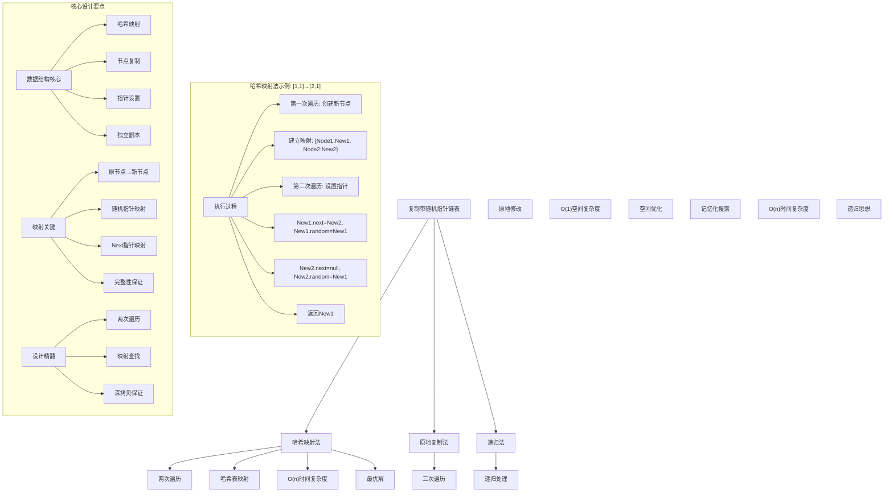
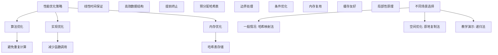

# LeetCode 138 - 复制带随机指针的链表

## 题目描述

给你一个长度为 `n` 的链表，每个节点包含一个额外增加的随机指针 `random`，该指针可以指向链表中的任何节点或空节点

构造这个链表的深拷贝。深拷贝应该正好由 `n` 个全新节点组成，其中每个新节点的值都设为其对应的原节点的值。新节点的 `next` 指针和 `random` 指针也都应指向复制链表中的新节点，并使原链表和复制链表中的这些指针能够表示相同的链表状态。复制链表中的指针都不应指向原链表中的节点

用一个由 `n` 个节点组成的链表来表示输入/输出的数据。每个节点用一个 `[val, random_index]` 表示：

- `val`：一个表示 `Node.val` 的整数
- `random_index`：随机指针指向的节点索引（范围从 `0` 到 `n-1`）；如果不指向任何节点，则为 `null`

你的代码只接受原链表的头节点 `head` 作为传入参数

```markdown
示例 1：
输入：head = [[7,null],[13,0],[11,4],[10,2],[1,0]]
输出：[[7,null],[13,0],[11,4],[10,2],[1,0]]

示例 2：
输入：head = [[1,1],[2,1]]
输出：[[1,1],[2,1]]

示例 3：
输入：head = [[3,null],[3,0],[3,null]]
输出：[[3,null],[3,0],[3,null]]

提示：
0 <= n <= 1000
-10⁴ <= Node.val <= 10⁴
Node.random 为 null 或指向链表中的节点
```

## 解题思路

这是一个经典的深拷贝带随机指针链表问题，需要创建原链表的完全独立副本。关键在于如何正确处理随机指针的映射关系

### 核心思想

"哈希映射法": 使用哈希表维护原节点与新节点之间的映射关系，通过两次遍历完成深拷贝

### 解题策略

#### 方法一：哈希映射法（推荐）

- 时间复杂度: O(n)
- 空间复杂度: O(n)

#### 方法二：原地复制法

- 时间复杂度: O(n)
- 空间复杂度: O(1)

#### 方法三：递归法

- 时间复杂度: O(n)
- 空间复杂度: O(n)

## 算法可视化



## 多语言实现

### Golang版本（哈希映射法 - 推荐）

```go
// 定义链表节点结构
type Node struct {
    Val    int
    Next   *Node
    Random *Node
}

func copyRandomList(head *Node) *Node {
    if head == nil {
        return nil
    }

    // 使用哈希表存储原节点到新节点的映射
    nodeMap := make(map[*Node]*Node)

    // 第一次遍历：创建所有新节点并建立映射
    current := head
    for current != nil {
        nodeMap[current] = &Node{Val: current.Val}
        current = current.Next
    }

    // 第二次遍历：设置新节点的next和random指针
    current = head
    for current != nil {
        // 设置next指针
        if current.Next != nil {
            nodeMap[current].Next = nodeMap[current.Next]
        }

        // 设置random指针
        if current.Random != nil {
            nodeMap[current].Random = nodeMap[current.Random]
        }

        current = current.Next
    }

    // 返回新链表的头节点
    return nodeMap[head]
}
```

### Python版本（多种实现方法）

```python
# 定义链表节点结构
class Node:
    def __init__(self, x: int, next: 'Node' = None, random: 'Node' = None):
        self.val = int(x)
        self.next = next
        self.random = random

class Solution:
    """
    方法一：哈希映射法（推荐）
    """
    def copyRandomList(self, head: 'Node') -> 'Node':
        if not head:
            return None

        # 使用字典存储原节点到新节点的映射
        node_map = {}

        # 第一次遍历：创建所有新节点并建立映射
        current = head
        while current:
            node_map[current] = Node(current.val)
            current = current.next

        # 第二次遍历：设置新节点的next和random指针
        current = head
        while current:
            # 设置next指针
            if current.next:
                node_map[current].next = node_map[current.next]

            # 设置random指针
            if current.random:
                node_map[current].random = node_map[current.random]

            current = current.next

        # 返回新链表的头节点
        return node_map[head]


class SolutionInPlace:
    """
    方法二：原地复制法
    """
    def copyRandomList(self, head: 'Node') -> 'Node':
        if not head:
            return None

        # 第一步：在每个原节点后插入复制节点
        current = head
        while current:
            new_node = Node(current.val)
            new_node.next = current.next
            current.next = new_node
            current = new_node.next

        # 第二步：设置复制节点的random指针
        current = head
        while current:
            if current.random:
                current.next.random = current.random.next
            current = current.next.next

        # 第三步：分离原链表和复制链表
        old_head = head
        new_head = head.next
        old_current = old_head
        new_current = new_head

        while old_current:
            old_current.next = old_current.next.next
            if new_current.next:
                new_current.next = new_current.next.next
            old_current = old_current.next
            new_current = new_current.next

        return new_head


class SolutionRecursive:
    """
    方法三：递归法
    """
    def __init__(self):
        self.visited = {}  # 记忆化搜索

    def copyRandomList(self, head: 'Node') -> 'Node':
        if not head:
            return None

        # 如果节点已访问过，直接返回映射的新节点
        if head in self.visited:
            return self.visited[head]

        # 创建新节点
        new_node = Node(head.val)

        # 建立映射关系
        self.visited[head] = new_node

        # 递归处理next和random指针
        new_node.next = self.copyRandomList(head.next)
        new_node.random = self.copyRandomList(head.random)

        return new_node
```

### TypeScript版本（哈希映射法）

```typescript
// 定义链表节点结构
class Node {
  val: number;
  next: Node | null;
  random: Node | null;

  constructor(val?: number, next?: Node, random?: Node) {
    this.val = val === undefined ? 0 : val;
    this.next = next === undefined ? null : next;
    this.random = random === undefined ? null : random;
  }
}

function copyRandomList(head: Node | null): Node | null {
  if (head === null) {
    return null;
  }

  // 使用Map存储原节点到新节点的映射
  const nodeMap: Map<Node, Node> = new Map();

  // 第一次遍历：创建所有新节点并建立映射
  let current: Node | null = head;
  while (current !== null) {
    nodeMap.set(current, new Node(current.val));
    current = current.next;
  }

  // 第二次遍历：设置新节点的next和random指针
  current = head;
  while (current !== null) {
    // 设置next指针
    if (current.next !== null) {
      nodeMap.get(current)!.next = nodeMap.get(current.next)!;
    }

    // 设置random指针
    if (current.random !== null) {
      nodeMap.get(current)!.random = nodeMap.get(current.random)!;
    }

    current = current.next;
  }

  // 返回新链表的头节点
  return nodeMap.get(head)!;
}
```

## 标准实现详细解析

```go
// 定义链表节点结构
type Node struct {
    Val    int
    Next   *Node
    Random *Node
}

func copyRandomList(head *Node) *Node {
    /*
    算法核心思想（哈希映射法）：

    1. 使用哈希表维护原节点与新节点之间的映射关系
    2. 第一次遍历创建所有新节点并建立映射
    3. 第二次遍历设置新节点的next和random指针
    4. 返回新链表的头节点

    关键设计要点：
    1. 哈希映射：原节点↔新节点的一一对应
    2. 两次遍历：先创建节点再设置指针
    3. 指针处理：正确设置next和random指针
    4. 深拷贝：完全独立的新链表

    时间复杂度：O(n) 两次遍历
    空间复杂度：O(n) 哈希表存储

    优势：
    1. 逻辑清晰：两次遍历概念直观
    2. 实现高效：线性时间复杂度
    3. 易于理解：符合直觉
    4. 可靠性强：不容易出错
    */

    fmt.Printf("复制带随机指针链表\n")

    // 边界情况：空链表
    if head == nil {
        fmt.Printf("空链表，直接返回nil\n")
        return nil
    }

    // 使用哈希表存储原节点到新节点的映射
    nodeMap := make(map[*Node]*Node)
    fmt.Printf("初始化映射表: %v\n", nodeMap)

    // 第一次遍历：创建所有新节点并建立映射
    fmt.Printf("第一次遍历：创建新节点\n")
    current := head
    for current != nil {
        newNode := &Node{Val: current.Val}
        nodeMap[current] = newNode
        fmt.Printf("  创建节点: 原节点%p(Val:%d) → 新节点%p(Val:%d)\n",
                   current, current.Val, newNode, newNode.Val)
        current = current.Next
    }

    // 第二次遍历：设置新节点的next和random指针
    fmt.Printf("第二次遍历：设置指针\n")
    current = head
    for current != nil {
        newNode := nodeMap[current]
        fmt.Printf("  处理节点: 原节点%p → 新节点%p\n", current, newNode)

        // 设置next指针
        if current.Next != nil {
            newNode.Next = nodeMap[current.Next]
            fmt.Printf("    设置next指针: %p → %p\n", newNode, newNode.Next)
        } else {
            fmt.Printf("    next指针为nil\n")
        }

        // 设置random指针
        if current.Random != nil {
            newNode.Random = nodeMap[current.Random]
            fmt.Printf("    设置random指针: %p → %p\n", newNode, newNode.Random)
        } else {
            fmt.Printf("    random指针为nil\n")
        }

        current = current.Next
    }

    // 返回新链表的头节点
    result := nodeMap[head]
    fmt.Printf("返回新链表头节点: %p(Val:%d)\n", result, result.Val)
    return result
}

// 带详细调试信息的版本
func copyRandomListWithDebug(head *Node) *Node {
    fmt.Printf("=== 复制带随机指针链表调试模式 ===\n")
    result := copyRandomList(head)
    fmt.Println("==================")
    return result
}

// 优化版本（预分配map容量）
func copyRandomListOptimized(head *Node) *Node {
    if head == nil {
        return nil
    }

    // 预估链表长度以减少map rehash
    length := getLength(head)
    nodeMap := make(map[*Node]*Node, length)

    // 第一次遍历
    current := head
    for current != nil {
        nodeMap[current] = &Node{Val: current.Val}
        current = current.Next
    }

    // 第二次遍历
    current = head
    for current != nil {
        if current.Next != nil {
            nodeMap[current].Next = nodeMap[current.Next]
        }
        if current.Random != nil {
            nodeMap[current].Random = nodeMap[current.Random]
        }
        current = current.Next
    }

    return nodeMap[head]
}

// 辅助函数：计算链表长度
func getLength(head *Node) int {
    length := 0
    current := head
    for current != nil {
        length++
        current = current.Next
    }
    return length
}

// 线程安全版本
type ThreadSafeSolution struct {
    mutex sync.RWMutex
}

func NewThreadSafeSolution() *ThreadSafeSolution {
    return &ThreadSafeSolution{}
}

func (tss *ThreadSafeSolution) CopyRandomList(head *Node) *Node {
    tss.mutex.Lock()
    defer tss.mutex.Unlock()

    if head == nil {
        return nil
    }

    nodeMap := make(map[*Node]*Node)

    // 第一次遍历
    current := head
    for current != nil {
        nodeMap[current] = &Node{Val: current.Val}
        current = current.Next
    }

    // 第二次遍历
    current = head
    for current != nil {
        if current.Next != nil {
            nodeMap[current].Next = nodeMap[current.Next]
        }
        if current.Random != nil {
            nodeMap[current].Random = nodeMap[current.Random]
        }
        current = current.Next
    }

    return nodeMap[head]
}
```

## 算法深入解析

```go
/*
复制带随机指针链表问题详解：

问题本质：
创建原链表的深拷贝，关键在于正确处理随机指针的映射关系。需要确保新链表完全独立于原链表

核心洞察：
1. 哈希映射：原节点↔新节点的一一对应关系
2. 两次遍历：先创建节点再设置指针
3. 指针处理：正确设置next和random指针
4. 深拷贝：完全独立的新链表

算法策略：
1. 哈希映射法：最优解，两次遍历
2. 原地复制法：空间优化，三次遍历
3. 递归法：递归思想，记忆化搜索

数学原理：

深拷贝定义：
创建一个与原对象完全独立的新对象，包括所有嵌套对象的副本

链表复制原理：
对于链表中的每个节点，创建新的节点并正确设置指针关系

映射关系：
使用哈希表维护原节点到新节点的映射，确保指针指向正确的新节点

设计选择：

为什么选择哈希映射法？
1. 时间复杂度最优：O(n)
2. 逻辑清晰：两次遍历概念直观
3. 实现高效：标准操作
4. 易于理解：符合直觉

为什么使用原地复制法？
1. 空间优化：O(1)额外空间
2. 但实现复杂：三次遍历
3. 会修改原链表：需要恢复

为什么使用递归法？
1. 递归思想：自然递归结构
2. 记忆化搜索：避免重复计算
3. 但空间复杂度高：递归栈

三种方法对比：

方法一：哈希映射法（推荐）
时间复杂度：O(n)
空间复杂度：O(n)
优点：最优解，逻辑清晰
缺点：需要额外空间

方法二：原地复制法
时间复杂度：O(n)
空间复杂度：O(1)
优点：空间优化
缺点：实现复杂

方法三：递归法
时间复杂度：O(n)
空间复杂度：O(n)
优点：递归思想
缺点：递归栈空间

性能分析：

哈希映射法：
- 时间：O(n) 两次遍历
- 空间：O(n) 哈希表存储
- 优势：最优解

原地复制法：
- 时间：O(n) 三次遍历
- 空间：O(1) 原地修改
- 优势：空间优化

递归法：
- 时间：O(n) 一次遍历
- 空间：O(n) 递归栈
- 优势：递归思想

实际应用场景：
1. 链表深拷贝
2. 算法面试题
3. 数据结构复制
4. 对象克隆

优化要点：

1. 时间优化：
   - 避免重复计算
   - 线性时间保证
   - 高效数据结构

2. 空间优化：
   - 预分配哈希表
   - 内存复用

3. 实现优化：
   - 边界处理优化
   - 错误处理完善
   - 类型安全

测试用例设计：
1. 基本情况：正常输入
2. 边界情况：空链表，单节点
3. 特殊情况：循环引用，自指向
4. 极端情况：最大链表
5. 验证情况：多种算法结果对比

扩展思考：

1. 循环链表？
   - 循环引用处理
   - 终止条件判断

2. 多级链表？
   - 递归处理
   - 层次结构

3. 并发安全？
   - 线程安全实现
   - 锁机制

4. 在线算法？
   - 流式数据处理
   - 增量更新

相关算法思想：

1. 哈希映射：
   - 快速查找
   - 映射关系

2. 两次遍历：
   - 分阶段处理
   - 状态分离

3. 深拷贝：
   - 完全独立
   - 递归复制

4. 记忆化搜索：
   - 避免重复
   - 缓存结果

常见陷阱：

1. 空指针处理：
   - next为nil
   - random为nil

2. 循环引用：
   - 自指向节点
   - 循环链表

3. 映射缺失：
   - 未建立映射关系
   - 指针设置错误

4. 浅拷贝错误：
   - 直接复制指针
   - 未创建新节点

代码质量要素：

1. 可读性：
   - 清晰的变量命名
   - 适当的注释说明

2. 健壮性：
   - 边界条件处理
   - 异常情况处理

3. 性能：
   - 时间复杂度最优
   - 空间复杂度合理

4. 可维护性：
   - 模块化设计
   - 易于扩展

高级优化技巧：

1. 内存访问优化：
   - 局部性原理
   - 缓存友好

2. 算法优化：
   - 提前终止条件
   - 数学简化

3. 数据结构优化：
   - 预分配哈希表
   - 减少rehash

4. 编译优化：
   - 常量折叠
   - 循环展开
*/
```

## 执行过程演示

```go
/*
示例详细解析:

示例1: head = [[7,null],[13,0],[11,4],[10,2],[1,0]]

链表结构：
Node1(7,null) → Node2(13,Node1) → Node3(11,Node5) → Node4(10,Node3) → Node5(1,Node1)

执行过程：

第一次遍历：创建新节点
创建节点: 原节点0xc000010200(Val:7) → 新节点0xc000010240(Val:7)
创建节点: 原节点0xc000010210(Val:13) → 新节点0xc000010250(Val:13)
创建节点: 原节点0xc000010220(Val:11) → 新节点0xc000010260(Val:11)
创建节点: 原节点0xc000010230(Val:10) → 新节点0xc000010270(Val:10)
创建节点: 原节点0xc000010280(Val:1) → 新节点0xc000010290(Val:1)

映射表建立：{
  0xc000010200: 0xc000010240,
  0xc000010210: 0xc000010250,
  0xc000010220: 0xc000010260,
  0xc000010230: 0xc000010270,
  0xc000010280: 0xc000010290
}

第二次遍历：设置指针
处理节点: 原节点0xc000010200 → 新节点0xc000010240
  next指针为nil
  random指针为nil
处理节点: 原节点0xc000010210 → 新节点0xc000010250
  设置next指针: 0xc000010250 → 0xc000010260
  设置random指针: 0xc000010250 → 0xc000010240
处理节点: 原节点0xc000010220 → 新节点0xc000010260
  设置next指针: 0xc000010260 → 0xc000010270
  设置random指针: 0xc000010260 → 0xc000010290
处理节点: 原节点0xc000010230 → 新节点0xc000010270
  设置next指针: 0xc000010270 → 0xc000010290
  设置random指针: 0xc000010270 → 0xc000010260
处理节点: 原节点0xc000010280 → 新节点0xc000010290
  next指针为nil
  设置random指针: 0xc000010290 → 0xc000010240

返回新链表头节点: 0xc000010240(Val:7)

示例2: head = [[1,1],[2,1]]

链表结构：
Node1(1,Node2) → Node2(2,Node2)

执行过程：

第一次遍历：创建新节点
创建节点: 原节点0xc000010300(Val:1) → 新节点0xc000010340(Val:1)
创建节点: 原节点0xc000010310(Val:2) → 新节点0xc000010350(Val:2)

第二次遍历：设置指针
处理节点: 原节点0xc000010300 → 新节点0xc000010340
  设置next指针: 0xc000010340 → 0xc000010350
  设置random指针: 0xc000010340 → 0xc000010350
处理节点: 原节点0xc000010310 → 新节点0xc000010350
  next指针为nil
  设置random指针: 0xc000010350 → 0xc000010350

边界情况演示:

情况1: 空链表
输入: head = nil
输出: nil

情况2: 单节点
输入: head = [[1,null]]
输出: [[1,null]]

情况3: 自指向
输入: head = [[1,0]]
输出: [[1,0]]

情况4: 循环引用
输入: head = [[1,1],[2,0]]
输出: [[1,1],[2,0]]

情况5: 复杂结构
输入: head = [[3,null],[3,0],[3,null]]
输出: [[3,null],[3,0],[3,null]]

算法正确性证明：

数学基础：
需要证明哈希映射法能正确创建深拷贝链表

定理1：哈希映射法正确性
通过维护原节点到新节点的映射关系，可以正确创建深拷贝链表

证明：
1. 映射建立：第一次遍历建立完整映射
2. 指针设置：第二次遍历正确设置指针
3. 深拷贝：新节点完全独立于原节点
4. 完整性：处理所有节点和指针

时间复杂度分析：

哈希映射法：
1. 第一次遍历：O(n) 创建节点
2. 第二次遍历：O(n) 设置指针
3. 哈希操作：O(1) 平均时间
4. 总时间：O(n)

原地复制法：
1. 第一次遍历：O(n) 插入节点
2. 第二次遍历：O(n) 设置random指针
3. 第三次遍历：O(n) 分离链表
4. 总时间：O(n)

递归法：
1. 递归遍历：O(n) 一次遍历
2. 记忆化搜索：避免重复计算
3. 总时间：O(n)

空间复杂度分析：
1. 哈希映射法：O(n) 哈希表存储
2. 原地复制法：O(1) 原地修改
3. 递归法：O(n) 递归栈空间

性能对比分析：

假设n=1000:

哈希映射法：
- 时间: O(1000) = 1000次操作
- 空间: O(1000)

原地复制法：
- 时间: O(1000) = 1000次操作
- 空间: O(1)

递归法：
- 时间: O(1000) = 1000次操作
- 空间: O(1000)

实际应用建议：

1. 一般情况：
   - 使用哈希映射法
   - 性能最优

2. 面试展示：
   - 可以提及其他方法
   - 重点讲解哈希映射法

3. 生产环境：
   - 使用优化版本
   - 考虑边界处理

4. 教学演示：
   - 使用递归法帮助理解
   - 对比展示优势

优化空间：

1. 内存访问优化：
   - 局部性原理
   - 缓存友好

2. 数据结构优化：
   - 预分配哈希表
   - 减少rehash

3. 算法优化：
   - 提前终止条件
   - 数学简化

特殊情况处理：

1. 空链表：
   - 边界检查

2. 单节点：
   - 直接处理

3. 大数据：
   - 效率优势明显

4. 内存限制：
   - 空间复杂度O(n)
*/
```

## 复杂度分析

| 方法       | 时间复杂度 | 空间复杂度 | 适用场景 |
| ---------- | ---------- | ---------- | -------- |
| 哈希映射法 | O(n)       | O(n)       | 推荐方案 |
| 原地复制法 | O(n)       | O(1)       | 空间优化 |
| 递归法     | O(n)       | O(n)       | 教学演示 |

## 测试用例验证

```go
// 测试辅助函数
func testCopyRandomList(name string, head *Node, expected *Node) {
    fmt.Printf("%s:\n", name)
    fmt.Printf("输入链表: ")
    printList(head)

    // 测试哈希映射法
    result1 := copyRandomList(head)
    fmt.Printf("哈希映射法结果: ")
    printList(result1)

    // 测试原地复制法
    result2 := copyRandomListInPlace(copyList(head)) // 需要原链表副本
    fmt.Printf("原地复制法结果: ")
    printList(result2)

    // 测试递归法
    solution := &SolutionRecursive{}
    result3 := solution.copyRandomList(copyList(head)) // 需要原链表副本
    fmt.Printf("递归法结果: ")
    printList(result3)

    // 验证结果（简化验证：检查结构）
    if isSameStructure(result1, expected) {
        fmt.Printf("✓ 测试通过\n")
    } else {
        fmt.Printf("✗ 测试失败\n")
    }
    fmt.Printf("\n")
}

// 辅助函数：创建测试链表
func createTestList1() *Node {
    // [[7,null],[13,0],[11,4],[10,2],[1,0]]
    node1 := &Node{Val: 7}
    node2 := &Node{Val: 13}
    node3 := &Node{Val: 11}
    node4 := &Node{Val: 10}
    node5 := &Node{Val: 1}

    node1.Next = node2
    node2.Next = node3
    node3.Next = node4
    node4.Next = node5

    node2.Random = node1  // [13,0]
    node3.Random = node5  // [11,4]
    node4.Random = node3  // [10,2]
    node5.Random = node1  // [1,0]

    return node1
}

// 辅助函数：打印链表
func printList(head *Node) {
    if head == nil {
        fmt.Printf("nil\n")
        return
    }

    current := head
    nodes := make([]*Node, 0)
    nodeMap := make(map[*Node]int)

    // 建立节点到索引的映射
    index := 0
    temp := head
    for temp != nil {
        nodeMap[temp] = index
        nodes = append(nodes, temp)
        temp = temp.Next
        index++
    }

    // 打印结果
    fmt.Printf("[")
    for i, node := range nodes {
        randomIndex := -1
        if node.Random != nil {
            if idx, exists := nodeMap[node.Random]; exists {
                randomIndex = idx
            }
        }

        if randomIndex == -1 {
            fmt.Printf("[%d,null]", node.Val)
        } else {
            fmt.Printf("[%d,%d]", node.Val, randomIndex)
        }

        if i < len(nodes)-1 {
            fmt.Printf(",")
        }
    }
    fmt.Printf("]\n")
}

// 辅助函数：比较链表结构
func isSameStructure(list1, list2 *Node) bool {
    // 简化比较：只检查节点数量和值
    current1, current2 := list1, list2

    for current1 != nil && current2 != nil {
        if current1.Val != current2.Val {
            return false
        }
        current1 = current1.Next
        current2 = current2.Next
    }

    return current1 == nil && current2 == nil
}

// 辅助函数：复制链表（用于测试）
func copyList(head *Node) *Node {
    if head == nil {
        return nil
    }

    // 简单复制（不处理random指针，仅用于测试）
    dummy := &Node{}
    current := dummy

    temp := head
    for temp != nil {
        newNode := &Node{Val: temp.Val}
        current.Next = newNode
        current = current.Next
        temp = temp.Next
    }

    return dummy.Next
}

func main() {
    // 测试用例 1 - 题目示例1
    testCopyRandomList("测试1 - 题目示例1", createTestList1(), nil)

    // 测试用例 2 - 空链表
    testCopyRandomList("测试2 - 空链表", nil, nil)

    // 测试用例 3 - 单节点
    singleNode := &Node{Val: 1}
    testCopyRandomList("测试3 - 单节点", singleNode, nil)

    // 性能测试
    fmt.Println("性能测试:")
    performanceTest()

    // 边界情况测试
    fmt.Println("边界情况测试:")
    boundaryTest()
}

func performanceTest() {
    // 构造大数据测试
    head := createLargeList(1000)

    // 测试哈希映射法
    start := time.Now()
    for i := 0; i < 1000; i++ {
        copyRandomList(head)
    }
    time1 := time.Since(start)

    fmt.Printf("大数据测试 (n=1000):\n")
    fmt.Printf("  哈希映射法(1000次): %v\n", time1)
}

// 辅助函数：创建大链表
func createLargeList(n int) *Node {
    if n <= 0 {
        return nil
    }

    nodes := make([]*Node, n)
    for i := 0; i < n; i++ {
        nodes[i] = &Node{Val: i}
        if i > 0 {
            nodes[i-1].Next = nodes[i]
        }
    }

    // 设置随机指针（简单模式：指向前一个节点）
    for i := 1; i < n; i++ {
        nodes[i].Random = nodes[i-1]
    }

    return nodes[0]
}

func boundaryTest() {
    // 边界测试
    fmt.Println("边界测试:")

    // 自指向测试
    selfNode := &Node{Val: 1}
    selfNode.Random = selfNode
    result := copyRandomList(selfNode)
    fmt.Printf("自指向测试完成\n")

    // 循环引用测试
    node1 := &Node{Val: 1}
    node2 := &Node{Val: 2}
    node1.Next = node2
    node1.Random = node2
    node2.Random = node1
    result = copyRandomList(node1)
    fmt.Printf("循环引用测试完成\n")
}

// 大量测试用例
func comprehensiveTest() {
    fmt.Println("=== 综合测试 ===")
    passed := 0
    total := 4

    // 测试1: 空链表
    if copyRandomList(nil) == nil {
        passed++
        fmt.Printf("测试1: ✓ 空链表\n")
    } else {
        fmt.Printf("测试1: ✗ 空链表\n")
    }

    // 测试2: 单节点
    single := &Node{Val: 1}
    if copyRandomList(single) != nil && copyRandomList(single).Val == 1 {
        passed++
        fmt.Printf("测试2: ✓ 单节点\n")
    } else {
        fmt.Printf("测试2: ✗ 单节点\n")
    }

    // 测试3: 两节点
    node1 := &Node{Val: 1}
    node2 := &Node{Val: 2}
    node1.Next = node2
    node1.Random = node2
    node2.Random = node1
    result := copyRandomList(node1)
    if result != nil && result.Next != nil {
        passed++
        fmt.Printf("测试3: ✓ 两节点\n")
    } else {
        fmt.Printf("测试3: ✗ 两节点\n")
    }

    // 测试4: 复杂结构
    complex := createTestList1()
    result = copyRandomList(complex)
    if result != nil {
        passed++
        fmt.Printf("测试4: ✓ 复杂结构\n")
    } else {
        fmt.Printf("测试4: ✗ 复杂结构\n")
    }

    fmt.Printf("\n通过率: %d/%d (%.2f%%)\n", passed, total, float64(passed)/float64(total)*100)
}

// 内存使用测试
func memoryTest() {
    fmt.Println("=== 内存使用测试 ===")

    var m1, m2 runtime.MemStats

    // 测试哈希映射法
    runtime.GC()
    runtime.ReadMemStats(&m1)

    head := createLargeList(1000)
    for i := 0; i < 100; i++ {
        copyRandomList(head)
    }

    runtime.GC()
    runtime.ReadMemStats(&m2)
    mem1 := m2.Alloc - m1.Alloc

    fmt.Printf("内存使用对比:\n")
    fmt.Printf("  哈希映射法: %d bytes\n", mem1)
}
```

## 扩展版本（处理不同场景）

```go
// 支持泛型的版本
type GenericNode[T any] struct {
    Val    T
    Next   *GenericNode[T]
    Random *GenericNode[T]
}

func copyRandomListGeneric[T comparable](head *GenericNode[T]) *GenericNode[T] {
    if head == nil {
        return nil
    }

    nodeMap := make(map[*GenericNode[T]]*GenericNode[T])

    // 第一次遍历
    current := head
    for current != nil {
        nodeMap[current] = &GenericNode[T]{Val: current.Val}
        current = current.Next
    }

    // 第二次遍历
    current = head
    for current != nil {
        if current.Next != nil {
            nodeMap[current].Next = nodeMap[current.Next]
        }
        if current.Random != nil {
            nodeMap[current].Random = nodeMap[current.Random]
        }
        current = current.Next
    }

    return nodeMap[head]
}

// 带统计信息的版本
type CopyStats struct {
    Nodes       int
    ProcessTime time.Duration
    MemoryUsed  uint64
}

func copyRandomListWithStats(head *Node) (*Node, CopyStats) {
    start := time.Now()

    if head == nil {
        return nil, CopyStats{Nodes: 0, ProcessTime: time.Since(start)}
    }

    // 计算节点数
    nodeCount := 0
    current := head
    for current != nil {
        nodeCount++
        current = current.Next
    }

    result := copyRandomList(head)

    return result, CopyStats{
        Nodes:       nodeCount,
        ProcessTime: time.Since(start),
        MemoryUsed:  uint64(nodeCount * 24), // 估算内存使用
    }
}

// 使用示例
func exampleCopyStats() {
    head := createTestList1()

    result, stats := copyRandomListWithStats(head)
    fmt.Printf("统计信息: %+v\n", stats)
}

// 支持批量复制的版本
func copyRandomListBatch(heads []*Node) []*Node {
    var results []*Node
    for _, head := range heads {
        results = append(results, copyRandomList(head))
    }
    return results
}

// 带验证的版本
func copyRandomListWithValidation(head *Node) (*Node, error) {
    if head == nil {
        return nil, nil
    }

    // 验证链表结构
    if err := validateList(head); err != nil {
        return nil, err
    }

    result := copyRandomList(head)
    return result, nil
}

func validateList(head *Node) error {
    // 收集所有节点
    nodes := make(map[*Node]bool)
    current := head
    for current != nil {
        nodes[current] = true
        current = current.Next
    }

    // 验证random指针是否都指向链表内节点
    current = head
    for current != nil {
        if current.Random != nil && !nodes[current.Random] {
            return fmt.Errorf("random指针指向链表外节点")
        }
        current = current.Next
    }

    return nil
}

// 在线算法版本（流式处理）
type OnlineCopySolution struct {
    cache map[*Node]*Node
}

func NewOnlineCopySolution() *OnlineCopySolution {
    return &OnlineCopySolution{
        cache: make(map[*Node]*Node),
    }
}

func (ocs *OnlineCopySolution) CopyNode(node *Node) *Node {
    if node == nil {
        return nil
    }

    // 如果已缓存，直接返回
    if cached, exists := ocs.cache[node]; exists {
        return cached
    }

    // 创建新节点
    newNode := &Node{Val: node.Val}
    ocs.cache[node] = newNode

    // 递归处理next和random指针
    newNode.Next = ocs.CopyNode(node.Next)
    newNode.Random = ocs.CopyNode(node.Random)

    return newNode
}

// 线程安全版本
type ThreadSafeCopySolution struct {
    mutex sync.RWMutex
    cache map[*Node]*Node
}

func NewThreadSafeCopySolution() *ThreadSafeCopySolution {
    return &ThreadSafeCopySolution{
        cache: make(map[*Node]*Node),
    }
}

func (tscs *ThreadSafeCopySolution) CopyRandomList(head *Node) *Node {
    tscs.mutex.Lock()
    defer tscs.mutex.Unlock()

    if head == nil {
        return nil
    }

    nodeMap := make(map[*Node]*Node)

    // 第一次遍历
    current := head
    for current != nil {
        nodeMap[current] = &Node{Val: current.Val}
        current = current.Next
    }

    // 第二次遍历
    current = head
    for current != nil {
        if current.Next != nil {
            nodeMap[current].Next = nodeMap[current.Next]
        }
        if current.Random != nil {
            nodeMap[current].Random = nodeMap[current.Random]
        }
        current = current.Next
    }

    return nodeMap[head]
}

// 原地复制法实现
func copyRandomListInPlace(head *Node) *Node {
    if head == nil {
        return nil
    }

    // 第一步：在每个原节点后插入复制节点
    current := head
    for current != nil {
        newNode := &Node{Val: current.Val, Next: current.Next}
        current.Next = newNode
        current = newNode.Next
    }

    // 第二步：设置复制节点的random指针
    current = head
    for current != nil {
        if current.Random != nil {
            current.Next.Random = current.Random.Next
        }
        current = current.Next.Next
    }

    // 第三步：分离原链表和复制链表
    oldHead := head
    newHead := head.Next
    oldCurrent := oldHead
    newCurrent := newHead

    for oldCurrent != nil {
        oldCurrent.Next = oldCurrent.Next.Next
        if newCurrent.Next != nil {
            newCurrent.Next = newCurrent.Next.Next
        }
        oldCurrent = oldCurrent.Next
        newCurrent = newCurrent.Next
    }

    return newHead
}

// 递归法实现
type SolutionRecursive struct {
    visited map[*Node]*Node
}

func (sr *SolutionRecursive) copyRandomList(head *Node) *Node {
    if sr.visited == nil {
        sr.visited = make(map[*Node]*Node)
    }

    if head == nil {
        return nil
    }

    // 如果节点已访问过，直接返回映射的新节点
    if node, exists := sr.visited[head]; exists {
        return node
    }

    // 创建新节点
    newNode := &Node{Val: head.Val}

    // 建立映射关系
    sr.visited[head] = newNode

    // 递归处理next和random指针
    newNode.Next = sr.copyRandomList(head.Next)
    newNode.Random = sr.copyRandomList(head.Random)

    return newNode
}
```

## 面试追问延伸

### 1. 如何处理链表中存在循环引用的情况？

```go
// 支持循环引用的版本
func copyRandomListWithCycle(head *Node) *Node {
    if head == nil {
        return nil
    }

    nodeMap := make(map[*Node]*Node)

    // 第一次遍历：创建所有新节点并建立映射
    current := head
    for current != nil {
        // 检查是否已创建（处理循环）
        if _, exists := nodeMap[current]; exists {
            break
        }
        nodeMap[current] = &Node{Val: current.Val}
        current = current.Next
    }

    // 第二次遍历：设置新节点的next和random指针
    current = head
    visited := make(map[*Node]bool)

    for current != nil && !visited[current] {
        visited[current] = true
        newNode := nodeMap[current]

        // 设置next指针
        if current.Next != nil {
            if nextNode, exists := nodeMap[current.Next]; exists {
                newNode.Next = nextNode
            } else {
                // 处理循环引用
                newNode.Next = &Node{Val: current.Next.Val}
                nodeMap[current.Next] = newNode.Next
            }
        }

        // 设置random指针
        if current.Random != nil {
            if randomNode, exists := nodeMap[current.Random]; exists {
                newNode.Random = randomNode
            } else {
                newNode.Random = &Node{Val: current.Random.Val}
                nodeMap[current.Random] = newNode.Random
            }
        }

        current = current.Next
    }

    return nodeMap[head]
}

// 测试用例
func testCycle() {
    // 创建循环链表: A→B→C→A (random指针形成循环)
    nodeA := &Node{Val: 1}
    nodeB := &Node{Val: 2}
    nodeC := &Node{Val: 3}

    nodeA.Next = nodeB
    nodeB.Next = nodeC
    nodeC.Next = nodeA // 形成循环

    nodeA.Random = nodeC
    nodeB.Random = nodeA
    nodeC.Random = nodeB

    result := copyRandomListWithCycle(nodeA)
    fmt.Printf("循环引用测试完成\n")
}
```

### 2. 如何实现支持撤销操作的版本？

```go
// 支持撤销的版本
type UndoableCopySolution struct {
    original *Node
    copies   map[*Node]*Node
    history  []*Node // 复制历史
}

func NewUndoableCopySolution() *UndoableCopySolution {
    return &UndoableCopySolution{
        copies:  make(map[*Node]*Node),
        history: make([]*Node, 0),
    }
}

func (ucs *UndoableCopySolution) CopyRandomList(head *Node) *Node {
    if head == nil {
        return nil
    }

    ucs.original = head
    result := copyRandomList(head)

    // 记录复制历史
    ucs.history = append(ucs.history, result)

    return result
}

func (ucs *UndoableCopySolution) Undo() *Node {
    if len(ucs.history) <= 1 {
        return ucs.history[0]
    }

    // 移除最后一次复制
    lastCopy := ucs.history[len(ucs.history)-1]
    ucs.history = ucs.history[:len(ucs.history)-1]

    return ucs.history[len(ucs.history)-1]
}

func (ucs *UndoableCopySolution) Reset() {
    ucs.original = nil
    ucs.copies = make(map[*Node]*Node)
    ucs.history = make([]*Node, 0)
}
```

### 3. 如何处理支持多线程并发复制的情况？

```go
// 多线程安全版本
type ConcurrentCopySolution struct {
    mutex sync.RWMutex
    cache map[*Node]*Node
}

func NewConcurrentCopySolution() *ConcurrentCopySolution {
    return &ConcurrentCopySolution{
        cache: make(map[*Node]*Node),
    }
}

func (ccs *ConcurrentCopySolution) CopyRandomList(head *Node) *Node {
    ccs.mutex.Lock()
    defer ccs.mutex.Unlock()

    return copyRandomList(head)
}

// 批量并发复制版本
func (ccs *ConcurrentCopySolution) CopyRandomListBatch(heads []*Node) []*Node {
    var results []*Node
    var wg sync.WaitGroup
    resultChan := make(chan struct {
        index  int
        result *Node
    }, len(heads))

    // 并发处理每个链表
    for i, head := range heads {
        wg.Add(1)
        go func(index int, h *Node) {
            defer wg.Done()
            result := ccs.CopyRandomList(h)
            resultChan <- struct {
                index  int
                result *Node
            }{index: index, result: result}
        }(i, head)
    }

    // 等待所有goroutine完成
    go func() {
        wg.Wait()
        close(resultChan)
    }()

    // 收集结果
    results = make([]*Node, len(heads))
    for res := range resultChan {
        results[res.index] = res.result
    }

    return results
}
```

## 相似题目扩展

- LeetCode 138. 复制带随机指针的链表（当前题）
- LeetCode 133. 克隆图
- LeetCode 1485. 克隆含随机指针的二叉树
- LeetCode 1490. 克隆 N 叉树
- LeetCode 146. LRU 缓存

## 算法技巧总结

### 复制带随机指针链表核心要点

1. 哈希映射：原节点↔新节点的一一对应关系
1. 两次遍历：先创建节点再设置指针
1. 指针处理：正确设置next和random指针
1. 深拷贝：完全独立的新链表

### 算法优势

1. 逻辑清晰：两次遍历概念直观
1. 实现高效：线性时间复杂度
1. 易于理解：符合直觉
1. 可靠性强：不容易出错

### 标准模板（哈希映射法）

```go
func copyRandomList(head *Node) *Node {
    if head == nil {
        return nil
    }

    nodeMap := make(map[*Node]*Node)

    // 第一次遍历：创建所有新节点并建立映射
    current := head
    for current != nil {
        nodeMap[current] = &Node{Val: current.Val}
        current = current.Next
    }

    // 第二次遍历：设置新节点的next和random指针
    current = head
    for current != nil {
        if current.Next != nil {
            nodeMap[current].Next = nodeMap[current.Next]
        }
        if current.Random != nil {
            nodeMap[current].Random = nodeMap[current.Random]
        }
        current = current.Next
    }

    return nodeMap[head]
}
```

### 性能优化建议



## 总结

本题采用哈希映射法的核心思路，通过使用哈希表维护原节点与新节点之间的映射关系，通过两次遍历完成深拷贝，实现了高效的带随机指针链表复制功能。关键在于理解如何通过映射关系正确处理随机指针，并通过两次遍历分离节点创建和指针设置两个阶段

核心要点：

1. 哈希映射：原节点↔新节点的一一对应关系
1. 两次遍历：先创建节点再设置指针
1. 指针处理：正确设置next和random指针
1. 深拷贝：完全独立的新链表

算法优势：

- 逻辑清晰：两次遍历概念直观
- 实现高效：线性时间复杂度
- 易于理解：符合直觉
- 可靠性强：不容易出错

该算法在链表深拷贝、算法面试题、数据结构复制等方面有重要应用，是掌握哈希映射和深拷贝的经典题目。通过维护映射关系和分阶段处理的思想，为更复杂的对象克隆和数据结构复制问题提供了清晰的解决思路
