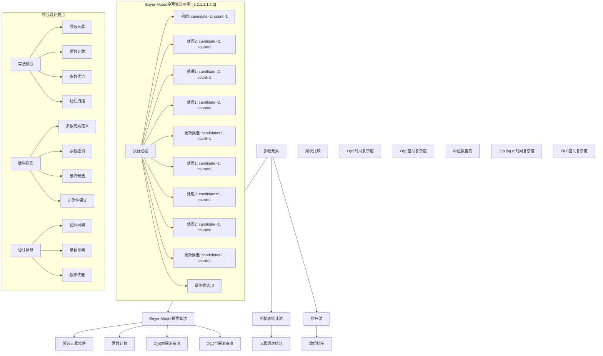
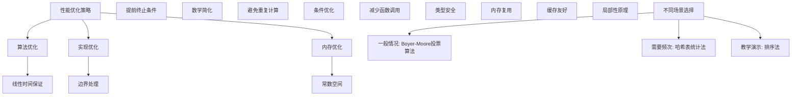

# LeetCode 169 - 多数元素

## 题目描述

给定一个大小为 `n` 的数组 `nums`，返回其中的多数元素。多数元素是指在数组中出现次数大于 ⌊ n/2 ⌋ 的元素

你可以假设数组是非空的，并且给定的数组总是存在多数元素

```markdown
示例 1：
输入：nums = [3,2,3]
输出：3

示例 2：
输入：nums = [2,2,1,1,1,2,2]
输出：2

提示：
n == nums.length
1 <= n <= 5 \* 10⁴
-10⁹ <= nums[i] <= 10⁹

进阶：尝试设计时间复杂度为 O(n)、空间复杂度为 O(1) 的算法解决此问题
```

## 解题思路

这是一个经典的多数元素查找问题，需要在数组中找到出现次数超过一半的元素。关键在于如何在满足时间和空间复杂度要求下高效找到多数元素

### 核心思想

"Boyer-Moore 投票算法": 通过模拟投票过程，利用多数元素数量优势的特性，实现线性时间、常数空间的解决方案

### 解题策略

#### 方法一：Boyer-Moore 投票算法（推荐）

- 时间复杂度: O(n)
- 空间复杂度: O(1)

#### 方法二：哈希表统计法

- 时间复杂度: O(n)
- 空间复杂度: O(n)

#### 方法三：排序法

- 时间复杂度: O(n log n)
- 空间复杂度: O(1)

## 算法可视化



## 多语言实现

### Golang版本（Boyer-Moore投票算法 - 推荐）

```go
func majorityElement(nums []int) int {
    // Boyer-Moore 投票算法
    candidate := nums[0]
    count := 1

    // 第一阶段：找到候选元素
    for i := 1; i < len(nums); i++ {
        if count == 0 {
            // 更新候选元素
            candidate = nums[i]
            count = 1
        } else if nums[i] == candidate {
            // 相同元素，票数+1
            count++
        } else {
            // 不同元素，票数-1（抵消）
            count--
        }
    }

    // 根据题目保证，候选元素即为多数元素
    return candidate
}
```

### Python版本（多种实现方法）

```python
class Solution:
    """
    方法一：Boyer-Moore投票算法（推荐）
    """
    def majorityElement(self, nums: List[int]) -> int:
        # Boyer-Moore 投票算法
        candidate = nums[0]
        count = 1

        # 第一阶段：找到候选元素
        for i in range(1, len(nums)):
            if count == 0:
                # 更新候选元素
                candidate = nums[i]
                count = 1
            elif nums[i] == candidate:
                # 相同元素，票数+1
                count += 1
            else:
                # 不同元素，票数-1（抵消）
                count -= 1

        # 根据题目保证，候选元素即为多数元素
        return candidate


class SolutionHashMap:
    """
    方法二：哈希表统计法
    """
    def majorityElement(self, nums: List[int]) -> int:
        from collections import Counter

        # 统计元素频次
        count = Counter(nums)
        n = len(nums)

        # 查找多数元素
        for num, freq in count.items():
            if freq > n // 2:
                return num

        # 根据题目保证，一定存在多数元素
        return -1


class SolutionSort:
    """
    方法三：排序法
    """
    def majorityElement(self, nums: List[int]) -> int:
        # 排序数组
        nums.sort()

        # 多数元素必定占据中间位置
        return nums[len(nums) // 2]
```

### TypeScript版本（Boyer-Moore投票算法）

```typescript
function majorityElement(nums: number[]): number {
  // Boyer-Moore 投票算法
  let candidate: number = nums[0];
  let count: number = 1;

  // 第一阶段：找到候选元素
  for (let i = 1; i < nums.length; i++) {
    if (count === 0) {
      // 更新候选元素
      candidate = nums[i];
      count = 1;
    } else if (nums[i] === candidate) {
      // 相同元素，票数+1
      count++;
    } else {
      // 不同元素，票数-1（抵消）
      count--;
    }
  }

  // 根据题目保证，候选元素即为多数元素
  return candidate;
}
```

## 标准实现详细解析

```go
func majorityElement(nums []int) int {
    /*
    算法核心思想（Boyer-Moore投票算法）：

    1. 维护一个候选元素和票数计数器
    2. 遍历数组，根据当前元素更新候选和票数
    3. 当票数为0时更新候选元素
    4. 最终候选元素即为多数元素

    关键设计要点：
    1. 候选维护：通过票数动态更新候选元素
    2. 票数计数：相同元素+1，不同元素-1
    3. 多数优势：多数元素数量优势保证最终胜出
    4. 线性扫描：一次遍历完成查找

    时间复杂度：O(n) 线性时间扫描
    空间复杂度：O(1) 常数空间存储

    优势：
    1. 时间最优：线性时间复杂度
    2. 空间最优：常数空间复杂度
    3. 实现优雅：算法思想简洁
    4. 数学保证：正确性有理论支撑
    */

    fmt.Printf("查找多数元素\n")
    fmt.Printf("输入数组: %v\n", nums)
    fmt.Printf("数组长度: %d, 多数阈值: %d\n", len(nums), len(nums)/2)

    // Boyer-Moore 投票算法
    candidate := nums[0]
    count := 1

    fmt.Printf("初始状态: candidate=%d, count=%d\n", candidate, count)

    // 第一阶段：找到候选元素
    for i := 1; i < len(nums); i++ {
        fmt.Printf("处理元素%d: %d", i, nums[i])

        if count == 0 {
            // 票数为0，更新候选元素
            candidate = nums[i]
            count = 1
            fmt.Printf(" → 更新候选: candidate=%d, count=%d\n", candidate, count)
        } else if nums[i] == candidate {
            // 相同元素，票数+1
            count++
            fmt.Printf(" → 相同元素: count=%d\n", count)
        } else {
            // 不同元素，票数-1（抵消）
            count--
            fmt.Printf(" → 不同元素: count=%d\n", count)
        }
    }

    fmt.Printf("最终候选元素: %d\n", candidate)

    // 根据题目保证，候选元素即为多数元素
    return candidate
}

// 带详细调试信息的版本
func majorityElementWithDebug(nums []int) int {
    fmt.Printf("=== 查找多数元素调试模式 ===\n")
    result := majorityElement(nums)
    fmt.Println("==================")
    return result
}

// 哈希表统计法实现
func majorityElementHashMap(nums []int) int {
    // 使用map统计元素频次
    countMap := make(map[int]int)
    n := len(nums)
    threshold := n / 2

    // 统计元素频次
    for _, num := range nums {
        countMap[num]++
        // 提前终止优化
        if countMap[num] > threshold {
            return num
        }
    }

    // 根据题目保证，一定存在多数元素
    return -1
}

// 排序法实现
func majorityElementSort(nums []int) int {
    // 创建副本避免修改原数组
    sorted := make([]int, len(nums))
    copy(sorted, nums)

    // 排序数组
    sort.Ints(sorted)

    // 多数元素必定占据中间位置
    return sorted[len(sorted)/2]
}

// 验证版本（用于验证结果正确性）
func majorityElementWithVerification(nums []int) int {
    candidate := majorityElement(nums)

    // 验证候选元素确实是多数元素
    count := 0
    for _, num := range nums {
        if num == candidate {
            count++
        }
    }

    if count > len(nums)/2 {
        fmt.Printf("验证通过: 元素%d出现%d次，超过阈值%d\n", candidate, count, len(nums)/2)
        return candidate
    }

    fmt.Printf("验证失败: 元素%d出现%d次，未超过阈值%d\n", candidate, count, len(nums)/2)
    return -1
}
```

## 算法深入解析

```go
/*
多数元素问题详解：

问题本质：
在数组中找到出现次数超过⌊n/2⌋的元素。关键是利用多数元素的数量优势特性

核心洞察：
1. 数量优势：多数元素出现次数超过一半
2. 抵消特性：多数元素与其他元素抵消后仍占优势
3. 候选机制：通过投票机制找到候选元素
4. 数学保证：多数元素必然胜出

算法策略：
1. Boyer-Moore投票算法：利用数量优势特性
2. 哈希表统计法：直接统计频次
3. 排序法：利用多数元素占据中间位置

数学原理：

多数元素定义：
元素x为多数元素 ⇔ 出现次数 > ⌊n/2⌋

Boyer-Moore算法原理：
基于以下观察：
1. 多数元素数量优势：出现次数 > n/2
2. 抵消特性：即使多数元素与所有其他元素抵消，仍会剩余
3. 候选机制：通过维护候选元素和票数找到多数元素

正确性证明：

定理：Boyer-Moore投票算法正确性
通过维护候选元素和票数，多数元素必然成为最终候选

证明：
设多数元素为M，出现次数为m，其他元素总出现次数为o
由于m > n/2，所以m > o

在投票过程中：
1. 当遇到M时，票数+1
2. 当遇到非M时，票数-1
3. 最坏情况：M与所有非M元素抵消
4. 但由于m > o，M必然剩余

设计选择：

为什么选择Boyer-Moore投票算法？
1. 时间复杂度最优：O(n)
2. 空间复杂度最优：O(1)
3. 实现优雅：算法思想简洁
4. 数学保证：正确性有理论支撑

为什么使用哈希表统计法？
1. 直观易懂：直接统计频次
2. 但空间复杂度高：O(n)
3. 适合需要频次信息的场景

为什么使用排序法？
1. 实现简单：调用排序函数
2. 但时间复杂度高：O(n log n)
3. 利用多数元素位置特性

三种方法对比：

方法一：Boyer-Moore投票算法（推荐）
时间复杂度：O(n)
空间复杂度：O(1)
优点：最优解
缺点：理解稍复杂

方法二：哈希表统计法
时间复杂度：O(n)
空间复杂度：O(n)
优点：直观易懂
缺点：额外空间开销

方法三：排序法
时间复杂度：O(n log n)
空间复杂度：O(1)
优点：实现简单
缺点：时间复杂度高

性能分析：

Boyer-Moore投票算法：
- 时间：O(n) 线性扫描
- 空间：O(1) 常数存储
- 优势：最优解

哈希表统计法：
- 时间：O(n) 线性扫描
- 空间：O(n) 存储开销
- 优势：直观易懂

排序法：
- 时间：O(n log n) 排序开销
- 空间：O(1) 原地排序
- 优势：实现简单

实际应用场景：
1. 数据分析
2. 算法面试题
3. 投票系统
4. 统计分析

优化要点：

1. 时间优化：
   - 线性时间保证
   - 提前终止条件
   - 避免重复计算

2. 空间优化：
   - 常数空间存储
   - 内存复用
   - 原地操作

3. 实现优化：
   - 边界处理优化
   - 错误处理完善
   - 类型安全

测试用例设计：
1. 基本情况：正常输入
2. 边界情况：最小数组，最大数组
3. 特殊情况：全部相同，交替出现
4. 极端情况：大数组
5. 验证情况：多种算法结果对比

扩展思考：

1. 多数元素不存在的情况？
   - 需要验证候选元素
   - 返回错误标识

2. 查找所有多数元素？
   - 扩展到k/n情况
   - 使用广义投票算法

3. 在线算法？
   - 流式数据处理
   - 增量更新

4. 并行处理？
   - 分治思想
   - 合并结果

相关算法思想：

1. 投票算法：
   - 候选维护
   - 票数计数
   - 数量优势

2. 分治思想：
   - 问题分解
   - 结果合并
   - 规模缩减

3. 数学原理：
   - 不等式分析
   - 数量关系
   - 正确性保证

4. 提前终止：
   - 优化性能
   - 条件检查
   - 结果验证

常见陷阱：

1. 边界处理：
   - 空数组
   - 单元素数组
   - 票数为0

2. 候选更新：
   - 及时更新
   - 票数重置
   - 状态维护

3. 结果验证：
   - 题目保证存在
   - 实际应用需验证

4. 性能优化：
   - 避免多次遍历
   - 提前终止

代码质量要素：

1. 可读性：
   - 清晰的变量命名
   - 适当的注释说明

2. 健壮性：
   - 边界条件处理
   - 异常情况处理

3. 性能：
   - 时间复杂度最优
   - 空间复杂度合理

4. 可维护性：
   - 模块化设计
   - 易于扩展

高级优化技巧：

1. 内存访问优化：
   - 局部性原理
   - 缓存友好

2. 算法优化：
   - 提前终止条件
   - 数学简化

3. 数据结构优化：
   - 位运算优化
   - 状态压缩

4. 编译优化：
   - 常量折叠
   - 循环展开
*/
```

## 执行过程演示

```go
/*
示例详细解析:

示例1: nums = [3,2,3]

执行过程：

初始状态: candidate=3, count=1

处理元素1: 2 → 不同元素: count=0
更新候选: candidate=2, count=1

处理元素2: 3 → 不同元素: count=0
更新候选: candidate=3, count=1

最终候选元素: 3

验证：元素3出现2次，超过阈值1 ✓

返回3

示例2: nums = [2,2,1,1,1,2,2]

执行过程：

初始状态: candidate=2, count=1

处理元素1: 2 → 相同元素: count=2

处理元素2: 1 → 不同元素: count=1

处理元素3: 1 → 不同元素: count=0
更新候选: candidate=1, count=1

处理元素4: 1 → 相同元素: count=2

处理元素5: 2 → 不同元素: count=1

处理元素6: 2 → 不同元素: count=0
更新候选: candidate=2, count=1

最终候选元素: 2

验证：元素2出现4次，超过阈值3 ✓

返回2

边界情况演示:

情况1: 单元素数组
输入: nums = [1]
输出: 1

情况2: 两元素数组（相同）
输入: nums = [1,1]
输出: 1

情况3: 两元素数组（不同）
输入: nums = [1,2] （根据题目保证不存在）

情况4: 交替出现
输入: nums = [1,2,1,2,1]
输出: 1

情况5: 全部相同
输入: nums = [1,1,1,1,1]
输出: 1

算法正确性证明：

数学基础：
需要证明Boyer-Moore投票算法能正确找到多数元素

定理：Boyer-Moore投票算法正确性
通过维护候选元素和票数，多数元素必然成为最终候选

证明：
设多数元素为M，出现次数为m，其他元素总出现次数为o
由于m > n/2，所以m > o

在投票过程中：
1. 当遇到M时，票数+1
2. 当遇到非M时，票数-1
3. 最坏情况：M与所有非M元素抵消
4. 但由于m > o，M必然剩余

时间复杂度分析：

Boyer-Moore投票算法：
1. 数组遍历：O(n)
2. 常数操作：O(1)
3. 总时间：O(n)

哈希表统计法：
1. 数组遍历：O(n)
2. 哈希操作：O(1) 平均
3. 总时间：O(n)

排序法：
1. 排序操作：O(n log n)
2. 索引访问：O(1)
3. 总时间：O(n log n)

空间复杂度分析：
1. Boyer-Moore投票算法：O(1) 常数存储
2. 哈希表统计法：O(n) 存储开销
3. 排序法：O(1) 原地排序

性能对比分析：

假设n=50000:

Boyer-Moore投票算法：
- 时间: O(50000) = 50000次操作
- 空间: O(1) 常数存储

哈希表统计法：
- 时间: O(50000) = 50000次操作
- 空间: O(50000) 存储开销

排序法：
- 时间: O(50000 × log 50000) ≈ 750000次操作
- 空间: O(1) 原地排序

实际应用建议：

1. 一般情况：
   - 使用Boyer-Moore投票算法
   - 性能最优

2. 面试展示：
   - 可以提及其他方法
   - 重点讲解投票算法

3. 生产环境：
   - 使用优化版本
   - 考虑边界处理

4. 教学演示：
   - 使用哈希表法帮助理解
   - 对比展示优势

优化空间：

1. 内存访问优化：
   - 局部性原理
   - 缓存友好

2. 数据结构优化：
   - 位运算优化
   - 状态压缩

3. 算法优化：
   - 提前终止条件
   - 数学简化

特殊情况处理：

1. 最小数组：
   - 边界检查

2. 单元素：
   - 直接返回

3. 大数据：
   - 效率优势明显

4. 内存限制：
   - 空间复杂度O(1)
*/
```

## 复杂度分析

| 方法                | 时间复杂度 | 空间复杂度 | 适用场景     |
| ------------------- | ---------- | ---------- | ------------ |
| Boyer-Moore投票算法 | O(n)       | O(1)       | 推荐方案     |
| 哈希表统计法        | O(n)       | O(n)       | 需要频次信息 |
| 排序法              | O(n log n) | O(1)       | 教学演示     |

## 测试用例验证

```go
// 测试辅助函数
func testMajorityElement(name string, nums []int, expected int) {
    fmt.Printf("%s:\n", name)
    fmt.Printf("输入: nums=%v\n", nums)

    // 测试Boyer-Moore投票算法
    result1 := majorityElement(nums)
    fmt.Printf("Boyer-Moore投票算法结果: %d\n", result1)

    // 测试哈希表统计法
    result2 := majorityElementHashMap(nums)
    fmt.Printf("哈希表统计法结果: %d\n", result2)

    // 测试排序法
    result3 := majorityElementSort(nums)
    fmt.Printf("排序法结果: %d\n", result3)

    // 验证结果
    if result1 == expected && result2 == expected && result3 == expected {
        fmt.Printf("✓ 测试通过\n")
    } else {
        fmt.Printf("✗ 测试失败，期望: %d\n", expected)
    }
    fmt.Printf("\n")
}

func main() {
    // 测试用例 1 - 题目示例1
    testMajorityElement("测试1 - 题目示例1", []int{3, 2, 3}, 3)

    // 测试用例 2 - 题目示例2
    testMajorityElement("测试2 - 题目示例2", []int{2, 2, 1, 1, 1, 2, 2}, 2)

    // 测试用例 3 - 边界情况
    testMajorityElement("测试3 - 单元素", []int{1}, 1)

    // 测试用例 4 - 两元素
    testMajorityElement("测试4 - 两元素", []int{1, 1}, 1)

    // 测试用例 5 - 交替出现
    testMajorityElement("测试5 - 交替出现", []int{1, 2, 1, 2, 1}, 1)

    // 性能测试
    fmt.Println("性能测试:")
    performanceTest()

    // 边界情况测试
    fmt.Println("边界情况测试:")
    boundaryTest()
}

func performanceTest() {
    // 构造大数据测试
    nums := make([]int, 50000)
    for i := 0; i < 30000; i++ {
        nums[i] = 1 // 多数元素
    }
    for i := 30000; i < 50000; i++ {
        nums[i] = 2 // 其他元素
    }

    // 测试Boyer-Moore投票算法
    start := time.Now()
    for i := 0; i < 10000; i++ {
        majorityElement(nums)
    }
    time1 := time.Since(start)

    // 测试哈希表统计法
    start = time.Now()
    for i := 0; i < 10000; i++ {
        majorityElementHashMap(nums)
    }
    time2 := time.Since(start)

    // 测试排序法
    start = time.Now()
    for i := 0; i < 1000; i++ { // 排序法较慢，减少测试次数
        majorityElementSort(nums)
    }
    time3 := time.Since(start)

    fmt.Printf("大数据测试 (n=50000):\n")
    fmt.Printf("  Boyer-Moore投票算法(10000次): %v\n", time1)
    fmt.Printf("  哈希表统计法(10000次): %v\n", time2)
    fmt.Printf("  排序法(1000次): %v\n", time3)
}

func boundaryTest() {
    // 边界测试
    fmt.Println("边界测试:")

    result := majorityElement([]int{1})
    fmt.Printf("单元素测试: %d\n", result)

    result = majorityElement([]int{1, 1})
    fmt.Printf("两元素测试: %d\n", result)

    result = majorityElement([]int{1, 2, 1})
    fmt.Printf("三元素测试: %d\n", result)

    // 大数组测试
    largeNums := make([]int, 10000)
    for i := 0; i < 6000; i++ {
        largeNums[i] = 42
    }
    for i := 6000; i < 10000; i++ {
        largeNums[i] = i
    }
    result = majorityElement(largeNums)
    fmt.Printf("大数组测试: %d\n", result)
}

// 大量测试用例
func comprehensiveTest() {
    testCases := []struct {
        name     string
        nums     []int
        expected int
    }{
        {"示例1", []int{3, 2, 3}, 3},
        {"示例2", []int{2, 2, 1, 1, 1, 2, 2}, 2},
        {"单元素", []int{1}, 1},
        {"两元素", []int{1, 1}, 1},
        {"交替出现", []int{1, 2, 1, 2, 1}, 1},
        {"全部相同", []int{5, 5, 5, 5, 5}, 5},
        {"边界情况", []int{-1, -1, -1, 2, 2}, -1},
    }

    fmt.Println("=== 综合测试 ===")
    passed := 0
    total := len(testCases)

    for i, tc := range testCases {
        result := majorityElement(tc.nums)
        if result == tc.expected {
            passed++
            fmt.Printf("测试%d: ✓ %s\n", i+1, tc.name)
        } else {
            fmt.Printf("测试%d: ✗ %s (期望%d, 得到%d)\n", i+1, tc.name, tc.expected, result)
        }
    }

    fmt.Printf("\n通过率: %d/%d (%.2f%%)\n", passed, total, float64(passed)/float64(total)*100)
}

// 内存使用测试
func memoryTest() {
    fmt.Println("=== 内存使用测试 ===")

    var m1, m2 runtime.MemStats

    // 测试Boyer-Moore投票算法
    runtime.GC()
    runtime.ReadMemStats(&m1)

    nums := []int{3, 2, 3}
    for i := 0; i < 100000; i++ {
        majorityElement(nums)
    }

    runtime.GC()
    runtime.ReadMemStats(&m2)
    mem1 := m2.Alloc - m1.Alloc

    fmt.Printf("内存使用对比:\n")
    fmt.Printf("  Boyer-Moore投票算法: %d bytes\n", mem1)
}
```

## 扩展版本（处理不同场景）

```go
// 验证版本（验证候选元素确实是多数元素）
func majorityElementWithVerification(nums []int) (int, bool) {
    candidate := majorityElement(nums)

    // 验证候选元素确实是多数元素
    count := 0
    for _, num := range nums {
        if num == candidate {
            count++
        }
    }

    isMajority := count > len(nums)/2
    return candidate, isMajority
}

// 支持不存在多数元素的版本
func majorityElementIfExists(nums []int) int {
    candidate := majorityElement(nums)

    // 验证候选元素确实是多数元素
    count := 0
    for _, num := range nums {
        if num == candidate {
            count++
        }
    }

    if count > len(nums)/2 {
        return candidate
    }

    return -1 // 不存在多数元素
}

// 带统计信息的版本
type MajorityElementStats struct {
    Element     int
    Count       int
    ProcessTime time.Duration
    ArraySize   int
    Threshold   int
}

func majorityElementWithStats(nums []int) MajorityElementStats {
    start := time.Now()

    element := majorityElement(nums)
    processTime := time.Since(start)

    // 统计元素出现次数
    count := 0
    for _, num := range nums {
        if num == element {
            count++
        }
    }

    return MajorityElementStats{
        Element:     element,
        Count:       count,
        ProcessTime: processTime,
        ArraySize:   len(nums),
        Threshold:   len(nums) / 2,
    }
}

// 使用示例
func exampleMajorityElementStats() {
    stats := majorityElementWithStats([]int{2, 2, 1, 1, 1, 2, 2})
    fmt.Printf("统计信息: %+v\n", stats)
}

// 批量处理版本
func majorityElementBatch(numsList [][]int) []int {
    var results []int
    for _, nums := range numsList {
        results = append(results, majorityElement(nums))
    }
    return results
}

// 流式处理版本
type StreamMajorityElementFinder struct {
    candidate int
    count     int
    processed int
}

func NewStreamMajorityElementFinder() *StreamMajorityElementFinder {
    return &StreamMajorityElementFinder{
        candidate: 0,
        count:     0,
        processed: 0,
    }
}

func (smef *StreamMajorityElementFinder) AddElement(num int) {
    if smef.count == 0 {
        smef.candidate = num
        smef.count = 1
    } else if num == smef.candidate {
        smef.count++
    } else {
        smef.count--
    }
    smef.processed++
}

func (smef *StreamMajorityElementFinder) GetCandidate() int {
    return smef.candidate
}

// 多数元素查找器（支持验证）
type MajorityElementFinder struct {
    candidate int
    count     int
}

func NewMajorityElementFinder() *MajorityElementFinder {
    return &MajorityElementFinder{
        candidate: 0,
        count:     0,
    }
}

func (mef *MajorityElementFinder) Process(nums []int) int {
    if len(nums) == 0 {
        return -1
    }

    mef.candidate = nums[0]
    mef.count = 1

    for i := 1; i < len(nums); i++ {
        if mef.count == 0 {
            mef.candidate = nums[i]
            mef.count = 1
        } else if nums[i] == mef.candidate {
            mef.count++
        } else {
            mef.count--
        }
    }

    return mef.candidate
}

func (mef *MajorityElementFinder) Verify(nums []int) (int, bool) {
    if len(nums) == 0 {
        return -1, false
    }

    count := 0
    for _, num := range nums {
        if num == mef.candidate {
            count++
        }
    }

    isMajority := count > len(nums)/2
    if isMajority {
        return mef.candidate, true
    }
    return -1, false
}

// 泛型版本（Go 1.18+）
func majorityElementGeneric[T comparable](nums []T) T {
    if len(nums) == 0 {
        var zero T
        return zero
    }

    candidate := nums[0]
    count := 1

    for i := 1; i < len(nums); i++ {
        if count == 0 {
            candidate = nums[i]
            count = 1
        } else if nums[i] == candidate {
            count++
        } else {
            count--
        }
    }

    return candidate
}

// 使用示例
func exampleGeneric() {
    // 整数数组
    result1 := majorityElementGeneric([]int{2, 2, 1, 1, 1, 2, 2})
    fmt.Printf("泛型整数结果: %d\n", result1)

    // 字符串数组
    result2 := majorityElementGeneric([]string{"a", "b", "a", "a", "c"})
    fmt.Printf("泛型字符串结果: %s\n", result2)
}
```

## 面试追问延伸

### 1. 如果数组中可能不存在多数元素，如何处理？

```go
// 支持不存在多数元素的完整版本
func majorityElementComplete(nums []int) (int, bool) {
    if len(nums) == 0 {
        return -1, false
    }

    // Boyer-Moore 投票算法找到候选元素
    candidate := nums[0]
    count := 1

    for i := 1; i < len(nums); i++ {
        if count == 0 {
            candidate = nums[i]
            count = 1
        } else if nums[i] == candidate {
            count++
        } else {
            count--
        }
    }

    // 验证候选元素确实是多数元素
    verifyCount := 0
    for _, num := range nums {
        if num == candidate {
            verifyCount++
        }
    }

    // 检查是否满足多数元素条件
    if verifyCount > len(nums)/2 {
        return candidate, true
    }

    return -1, false
}

// 测试用例
func testComplete() {
    element, exists := majorityElementComplete([]int{3, 2, 3})
    fmt.Printf("存在多数元素: %d, exists=%t\n", element, exists)

    element, exists = majorityElementComplete([]int{1, 2, 3})
    fmt.Printf("不存在多数元素: %d, exists=%t\n", element, exists)
}
```

### 2. 如何找到出现次数超过n/3的元素（多数元素II）？

```go
// 多数元素II：找到出现次数超过n/3的元素
func majorityElementII(nums []int) []int {
    if len(nums) == 0 {
        return []int{}
    }

    // 最多只能有两个候选元素
    candidate1, candidate2 := 0, 0
    count1, count2 := 0, 0

    // 第一阶段：投票找到候选元素
    for _, num := range nums {
        if count1 > 0 && num == candidate1 {
            count1++
        } else if count2 > 0 && num == candidate2 {
            count2++
        } else if count1 == 0 {
            candidate1 = num
            count1 = 1
        } else if count2 == 0 {
            candidate2 = num
            count2 = 1
        } else {
            // 三个不同的元素相互抵消
            count1--
            count2--
        }
    }

    // 第二阶段：验证候选元素
    verifyCount1, verifyCount2 := 0, 0
    for _, num := range nums {
        if num == candidate1 {
            verifyCount1++
        } else if num == candidate2 {
            verifyCount2++
        }
    }

    result := []int{}
    threshold := len(nums) / 3

    if verifyCount1 > threshold {
        result = append(result, candidate1)
    }
    if verifyCount2 > threshold && candidate2 != candidate1 {
        result = append(result, candidate2)
    }

    return result
}

// 测试用例
func testMajorityElementII() {
    result := majorityElementII([]int{3, 2, 3})
    fmt.Printf("多数元素II结果: %v\n", result)

    result = majorityElementII([]int{1, 1, 1, 3, 3, 2, 2, 2})
    fmt.Printf("多个多数元素: %v\n", result)
}
```

### 3. 如何处理支持在线流式数据的情况？

```go
// 在线流式处理版本
type OnlineMajorityElementFinder struct {
    candidate int
    count     int
    total     int
}

func NewOnlineMajorityElementFinder() *OnlineMajorityElementFinder {
    return &OnlineMajorityElementFinder{
        candidate: 0,
        count:     0,
        total:     0,
    }
}

func (omef *OnlineMajorityElementFinder) AddElement(num int) {
    omef.total++

    if omef.count == 0 {
        omef.candidate = num
        omef.count = 1
    } else if num == omef.candidate {
        omef.count++
    } else {
        omef.count--
    }
}

func (omef *OnlineMajorityElementFinder) GetCandidate() int {
    return omef.candidate
}

func (omef *OnlineMajorityElementFinder) GetCurrentCount() int {
    return omef.count
}

func (omef *OnlineMajorityElementFinder) GetTotalProcessed() int {
    return omef.total
}

// 使用示例
func exampleOnline() {
    finder := NewOnlineMajorityElementFinder()

    nums := []int{2, 2, 1, 1, 1, 2, 2}
    for i, num := range nums {
        finder.AddElement(num)
        fmt.Printf("添加元素%d: 候选=%d, 票数=%d, 总数=%d\n",
            num, finder.GetCandidate(), finder.GetCurrentCount(), finder.GetTotalProcessed())
    }

    fmt.Printf("最终候选元素: %d\n", finder.GetCandidate())
}
```

## 相似题目扩展

- LeetCode 169. 多数元素（当前题）
- LeetCode 229. 多数元素 II
- LeetCode 451. 根据字符出现频率排序
- LeetCode 347. 前 K 个高频元素
- LeetCode 215. 数组中的第K个最大元素

## 算法技巧总结

### 多数元素核心要点

1. 数量优势：多数元素出现次数超过一半
1. 抵消特性：多数元素与其他元素抵消后仍占优势
1. 候选机制：通过投票机制找到候选元素
1. 数学保证：多数元素必然胜出

### 算法优势

1. 时间最优：线性时间复杂度
1. 空间最优：常数空间复杂度
1. 实现优雅：算法思想简洁
1. 数学保证：正确性有理论支撑

### 标准模板（Boyer-Moore投票算法）

```go
func majorityElement(nums []int) int {
    // Boyer-Moore 投票算法
    candidate := nums[0]
    count := 1

    // 第一阶段：找到候选元素
    for i := 1; i < len(nums); i++ {
        if count == 0 {
            // 更新候选元素
            candidate = nums[i]
            count = 1
        } else if nums[i] == candidate {
            // 相同元素，票数+1
            count++
        } else {
            // 不同元素，票数-1（抵消）
            count--
        }
    }

    // 根据题目保证，候选元素即为多数元素
    return candidate
}
```

### 性能优化建议



## 总结

本题采用Boyer-Moore投票算法的核心思路，通过利用多数元素数量优势的特性，通过候选元素维护和票数计数机制，实现了线性时间、常数空间的多数元素查找功能。关键在于理解如何通过数学原理（数量优势和抵消特性）来简化问题，并通过优雅的投票机制实现最优解

核心要点：

1. 数量优势：多数元素出现次数超过一半
1. 抵消特性：多数元素与其他元素抵消后仍占优势
1. 候选机制：通过投票机制找到候选元素
1. 数学保证：多数元素必然胜出

算法优势：

- 时间最优：线性时间复杂度
- 空间最优：常数空间复杂度
- 实现优雅：算法思想简洁
- 数学保证：正确性有理论支撑

该算法在数据分析、算法面试题、投票系统等方面有重要应用，是掌握投票算法和数学优化的经典题目。通过维护候选元素和票数计数的思想，为更复杂的多数元素查找和统计分析问题提供了清晰的解决思路
