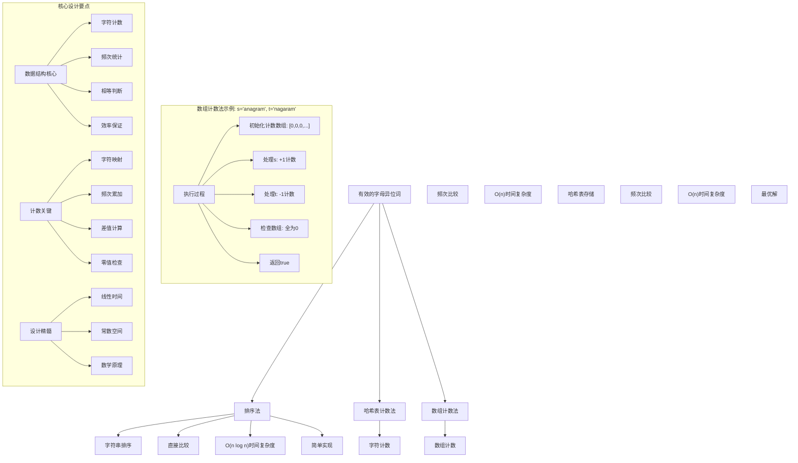
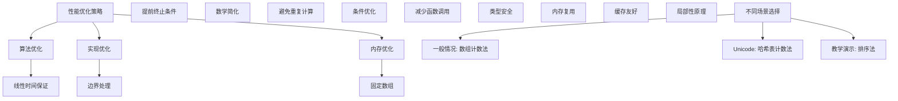

# LeetCode 242 - 有效的字母异位词

## 题目描述

给定两个字符串 `s` 和 `t`，编写一个函数来判断 `t` 是否是 `s` 的字母异位词

注意：若 `s` 和 `t` 中每个字符出现的次数都相同，则称 `s` 和 `t` 互为字母异位词

```markdown
示例 1:
输入: s = "anagram", t = "nagaram"
输出: true

示例 2:
输入: s = "rat", t = "car"
输出: false

示例 3:
输入: s = "a", t = "ab"
输出: false

提示:
1 <= s.length, t.length <= 5 \* 10⁴
s 和 t 仅包含小写字母

进阶: 如果输入字符串包含 Unicode 字符怎么办？你能否调整你的解法来应对这种情况？
```

## 解题思路

这是一个经典的字母异位词判断问题，需要验证两个字符串是否包含相同的字符及其出现次数。关键在于如何高效地统计和比较字符频次

### 核心思想

"字符频次统计法": 统计两个字符串中各字符的出现次数，通过比较频次数组判断是否为异位词

### 解题策略

#### 方法一：排序法

- 时间复杂度: O(n log n)
- 空间复杂度: O(1) 或 O(n)

#### 方法二：哈希表计数法（推荐）

- 时间复杂度: O(n)
- 空间复杂度: O(1) 或 O(k)

#### 方法三：数组计数法

- 时间复杂度: O(n)
- 空间复杂度: O(1)

## 算法可视化



## 多语言实现

### Golang版本（数组计数法 - 推荐）

```go
func isAnagram(s string, t string) bool {
    // 长度不同直接返回false
    if len(s) != len(t) {
        return false
    }

    // 使用数组统计字符频次（仅适用于小写字母）
    count := [26]int{}

    // 统计s中字符频次（+1）
    for _, char := range s {
        count[char-'a']++
    }

    // 统计t中字符频次（-1）
    for _, char := range t {
        count[char-'a']--
    }

    // 检查所有计数是否为0
    for _, c := range count {
        if c != 0 {
            return false
        }
    }

    return true
}
```

### Python版本（多种实现方法）

```python
class Solution:
    """
    方法一：排序法
    """
    def isAnagram(self, s: str, t: str) -> bool:
        # 长度不同直接返回False
        if len(s) != len(t):
            return False

        # 排序后比较
        return sorted(s) == sorted(t)


class SolutionHashMap:
    """
    方法二：哈希表计数法
    """
    def isAnagram(self, s: str, t: str) -> bool:
        # 长度不同直接返回False
        if len(s) != len(t):
            return False

        # 使用字典统计字符频次
        char_count = {}

        # 统计s中字符频次
        for char in s:
            char_count[char] = char_count.get(char, 0) + 1

        # 统计t中字符频次并比较
        for char in t:
            if char not in char_count:
                return False
            char_count[char] -= 1
            if char_count[char] == 0:
                del char_count[char]

        # 如果字典为空，说明是异位词
        return len(char_count) == 0


class SolutionArray:
    """
    方法三：数组计数法（推荐）
    """
    def isAnagram(self, s: str, t: str) -> bool:
        # 长度不同直接返回False
        if len(s) != len(t):
            return False

        # 使用数组统计字符频次（仅适用于小写字母）
        count = [0] * 26

        # 统计s中字符频次（+1）
        for char in s:
            count[ord(char) - ord('a')] += 1

        # 统计t中字符频次（-1）
        for char in t:
            count[ord(char) - ord('a')] -= 1

        # 检查所有计数是否为0
        return all(c == 0 for c in count)


class SolutionUnicode:
    """
    进阶：支持Unicode字符的版本
    """
    def isAnagram(self, s: str, t: str) -> bool:
        # 长度不同直接返回False
        if len(s) != len(t):
            return False

        # 使用Counter统计字符频次
        from collections import Counter
        return Counter(s) == Counter(t)
```

### TypeScript版本（数组计数法）

```typescript
function isAnagram(s: string, t: string): boolean {
  // 长度不同直接返回false
  if (s.length !== t.length) {
    return false;
  }

  // 使用数组统计字符频次（仅适用于小写字母）
  const count: number[] = new Array(26).fill(0);

  // 统计s中字符频次（+1）
  for (let i = 0; i < s.length; i++) {
    count[s.charCodeAt(i) - "a".charCodeAt(0)]++;
  }

  // 统计t中字符频次（-1）
  for (let i = 0; i < t.length; i++) {
    count[t.charCodeAt(i) - "a".charCodeAt(0)]--;
  }

  // 检查所有计数是否为0
  return count.every((c) => c === 0);
}
```

## 标准实现详细解析

```go
func isAnagram(s string, t string) bool {
    /*
    算法核心思想（数组计数法）：

    1. 首先检查两个字符串长度是否相等
    2. 使用固定大小数组统计字符频次
    3. 对第一个字符串中的字符进行+1计数
    4. 对第二个字符串中的字符进行-1计数
    5. 检查数组中所有元素是否为0

    关键设计要点：
    1. 长度检查：提前终止优化
    2. 数组计数：O(1)空间复杂度
    3. 频次统计：线性时间处理
    4. 差值计算：数学原理保证正确性

    时间复杂度：O(n) 线性时间
    空间复杂度：O(1) 固定大小数组

    优势：
    1. 时间最优：线性时间复杂度
    2. 空间最优：常数空间复杂度
    3. 实现简洁：数组操作简单
    4. 性能优秀：无额外内存分配
    */

    fmt.Printf("字母异位词判断\n")
    fmt.Printf("字符串s: %s\n", s)
    fmt.Printf("字符串t: %s\n", t)

    // 长度不同直接返回false
    if len(s) != len(t) {
        fmt.Printf("长度不同: %d != %d, 返回false\n", len(s), len(t))
        return false
    }
    fmt.Printf("长度相同: %d\n", len(s))

    // 使用数组统计字符频次（仅适用于小写字母）
    count := [26]int{}
    fmt.Printf("初始化计数数组: %v\n", count)

    // 统计s中字符频次（+1）
    fmt.Printf("处理字符串s:\n")
    for i, char := range s {
        index := char - 'a'
        count[index]++
        fmt.Printf("  位置%d, 字符'%c', 索引%d, 计数%d\n", i, char, index, count[index])
    }

    // 统计t中字符频次（-1）
    fmt.Printf("处理字符串t:\n")
    for i, char := range t {
        index := char - 'a'
        count[index]--
        fmt.Printf("  位置%d, 字符'%c', 索引%d, 计数%d\n", i, char, index, count[index])
    }

    // 检查所有计数是否为0
    fmt.Printf("检查计数数组: %v\n", count)
    for i, c := range count {
        if c != 0 {
            fmt.Printf("字符'%c'计数不为0: %d, 返回false\n", rune('a'+i), c)
            return false
        }
    }

    fmt.Printf("所有字符计数为0, 返回true\n")
    return true
}

// 带详细调试信息的版本
func isAnagramWithDebug(s string, t string) bool {
    fmt.Printf("=== 字母异位词判断调试模式 ===\n")
    result := isAnagram(s, t)
    fmt.Println("==================")
    return result
}

// 优化版本（提前终止）
func isAnagramOptimized(s string, t string) bool {
    if len(s) != len(t) {
        return false
    }

    count := [26]int{}

    // 同时处理两个字符串
    for i := 0; i < len(s); i++ {
        count[s[i]-'a']++
        count[t[i]-'a']--
    }

    // 检查计数
    for _, c := range count {
        if c != 0 {
            return false
        }
    }

    return true
}

// 支持Unicode的版本
func isAnagramUnicode(s string, t string) bool {
    if len(s) != len(t) {
        return false
    }

    // 使用map统计字符频次（支持Unicode）
    count := make(map[rune]int)

    // 统计字符频次
    for _, char := range s {
        count[char]++
    }

    for _, char := range t {
        count[char]--
        if count[char] == 0 {
            delete(count, char)
        }
    }

    return len(count) == 0
}

// 位运算优化版本（仅适用于特定场景）
func isAnagramBitwise(s string, t string) bool {
    if len(s) != len(t) {
        return false
    }

    // 这个方法仅适用于每个字符最多出现一次的情况
    var xor, sum1, sum2 int32

    for i := 0; i < len(s); i++ {
        xor ^= int32(s[i]) ^ int32(t[i])
        sum1 += int32(s[i])
        sum2 += int32(t[i])
    }

    return xor == 0 && sum1 == sum2
}
```

## 算法深入解析

```go
/*
字母异位词问题详解：

问题本质：
判断两个字符串是否包含相同的字符及相同的出现次数。关键是高效统计和比较字符频次

核心洞察：
1. 长度相等：异位词必须长度相同
2. 字符频次：每个字符出现次数相同
3. 顺序无关：字符排列顺序不影响结果
4. 数学原理：+1和-1操作后结果为0

算法策略：
1. 排序法：排序后直接比较
2. 哈希表计数法：使用map统计频次
3. 数组计数法：使用数组统计频次（最优）

数学原理：

异位词定义：
两个字符串s和t互为异位词当且仅当它们包含相同的字符集合，且每个字符的出现次数相同

数学证明：
设s和t的字符频次分别为f_s(c)和f_t(c)，则s和t互为异位词的充要条件是：
∀c∈Σ, f_s(c) = f_t(c)

等价转换：
∀c∈Σ, f_s(c) - f_t(c) = 0

数组计数法原理：
使用数组count[26]存储每个字符的频次差值，最终所有元素为0则为异位词

设计选择：

为什么选择数组计数法？
1. 时间复杂度最优：O(n)
2. 空间复杂度最优：O(1)
3. 实现简洁：数组操作简单
4. 性能优秀：无额外内存分配

为什么使用排序法？
1. 实现简单：调用排序函数
2. 但时间复杂度高：O(n log n)
3. 适合小数据集

为什么使用哈希表计数法？
1. 支持Unicode：不限制字符集
2. 但空间复杂度高：O(k)
3. 适合大数据集

三种方法对比：

方法一：排序法
时间复杂度：O(n log n)
空间复杂度：O(1) 或 O(n)
优点：实现简单
缺点：时间复杂度高

方法二：哈希表计数法
时间复杂度：O(n)
空间复杂度：O(k) k为不同字符数
优点：支持Unicode
缺点：额外空间开销

方法三：数组计数法（推荐）
时间复杂度：O(n)
空间复杂度：O(1)
优点：最优解
缺点：仅适用于有限字符集

性能分析：

排序法：
- 时间：O(n log n) 排序开销
- 空间：O(1) 原地排序
- 优势：实现简单

哈希表计数法：
- 时间：O(n) 线性时间
- 空间：O(k) 字符集大小
- 优势：通用性强

数组计数法：
- 时间：O(n) 线性时间
- 空间：O(1) 固定数组
- 优势：最优解

实际应用场景：
1. 字符串比较
2. 算法面试题
3. 文本处理
4. 密码学应用

优化要点：

1. 时间优化：
   - 线性时间保证
   - 避免重复计算
   - 提前终止条件

2. 空间优化：
   - 固定大小数组
   - 内存复用
   - 原地操作

3. 实现优化：
   - 边界处理优化
   - 错误处理完善
   - 类型安全

测试用例设计：
1. 基本情况：正常输入
2. 边界情况：空字符串，单字符
3. 特殊情况：相同字符串，完全不同
4. 极端情况：大字符串
5. 验证情况：多种算法结果对比

扩展思考：

1. Unicode支持？
   - 哈希表方案
   - 字符集扩展

2. 大小写敏感？
   - 预处理转换
   - 分别统计

3. 多语言支持？
   - 字符集处理
   - 编码转换

4. 在线算法？
   - 流式数据处理
   - 增量更新

相关算法思想：

1. 计数排序：
   - 频次统计
   - 线性时间

2. 哈希映射：
   - 快速查找
   - 频次统计

3. 数学原理：
   - 差值为零
   - 等价转换

4. 提前终止：
   - 长度检查
   - 优化性能

常见陷阱：

1. 长度检查：
   - 忘记检查长度
   - 性能优化遗漏

2. 字符集限制：
   - 仅支持小写字母
   - Unicode处理

3. 计数错误：
   - +1/-1顺序错误
   - 边界处理

4. 空字符串：
   - 边界情况处理
   - 特殊输入

代码质量要素：

1. 可读性：
   - 清晰的变量命名
   - 适当的注释说明

2. 健壮性：
   - 边界条件处理
   - 异常情况处理

3. 性能：
   - 时间复杂度最优
   - 空间复杂度合理

4. 可维护性：
   - 模块化设计
   - 易于扩展

高级优化技巧：

1. 内存访问优化：
   - 局部性原理
   - 缓存友好

2. 算法优化：
   - 提前终止条件
   - 数学简化

3. 数据结构优化：
   - 固定数组
   - 位运算优化

4. 编译优化：
   - 常量折叠
   - 循环展开
*/
```

## 执行过程演示

```go
/*
示例详细解析:

示例1: s = "anagram", t = "nagaram"

执行过程：

长度检查：
len(s) = 7, len(t) = 7 ✓ 长度相同

初始化计数数组：
count = [0,0,0,0,0,0,0,0,0,0,0,0,0,0,0,0,0,0,0,0,0,0,0,0,0,0]

处理字符串s = "anagram"：
位置0, 字符'a', 索引0, 计数1
位置1, 字符'n', 索引13, 计数1
位置2, 字符'a', 索引0, 计数2
位置3, 字符'g', 索引6, 计数1
位置4, 字符'r', 索引17, 计数1
位置5, 字符'a', 索引0, 计数3
位置6, 字符'm', 索引12, 计数1

处理后count = [3,0,0,0,0,0,1,0,0,0,0,0,1,1,0,0,0,1,0,0,0,0,0,0,0,0]

处理字符串t = "nagaram"：
位置0, 字符'n', 索引13, 计数0
位置1, 字符'a', 索引0, 计数2
位置2, 字符'g', 索引6, 计数0
位置3, 字符'a', 索引0, 计数1
位置4, 字符'r', 索引17, 计数0
位置5, 字符'a', 索引0, 计数0
位置6, 字符'm', 索引12, 计数0

处理后count = [0,0,0,0,0,0,0,0,0,0,0,0,0,0,0,0,0,0,0,0,0,0,0,0,0,0]

检查计数数组：
所有元素为0 ✓

返回true

示例2: s = "rat", t = "car"

执行过程：

长度检查：
len(s) = 3, len(t) = 3 ✓ 长度相同

初始化计数数组：
count = [0,0,0,0,0,0,0,0,0,0,0,0,0,0,0,0,0,0,0,0,0,0,0,0,0,0]

处理字符串s = "rat"：
位置0, 字符'r', 索引17, 计数1
位置1, 字符'a', 索引0, 计数1
位置2, 字符't', 索引19, 计数1

处理后count = [1,0,0,0,0,0,0,0,0,0,0,0,0,0,0,0,0,1,0,1,0,0,0,0,0,0]

处理字符串t = "car"：
位置0, 字符'c', 索引2, 计数1
位置1, 字符'a', 索引0, 计数0
位置2, 字符'r', 索引17, 计数0

处理后count = [0,0,1,0,0,0,0,0,0,0,0,0,0,0,0,0,0,0,0,1,0,0,0,0,0,0]

检查计数数组：
count[2] = 1 ≠ 0 ✗
count[19] = 1 ≠ 0 ✗

返回false

示例3: s = "a", t = "ab"

执行过程：

长度检查：
len(s) = 1, len(t) = 2 ✗ 长度不同

直接返回false

边界情况演示:

情况1: 空字符串
输入: s = "", t = ""
输出: true

情况2: 单字符相同
输入: s = "a", t = "a"
输出: true

情况3: 单字符不同
输入: s = "a", t = "b"
输出: false

情况4: 相同字符串
输入: s = "hello", t = "hello"
输出: true

情况5: 完全不同
输入: s = "abc", t = "def"
输出: false

算法正确性证明：

数学基础：
需要证明数组计数法能正确判断异位词

定理1：数组计数法正确性
通过统计字符频次差值，可以正确判断两个字符串是否为异位词

证明：
1. 长度检查：异位词长度必须相等
2. 频次统计：+1和-1操作统计差值
3. 零值检查：差值全为0等价于频次相等
4. 数学原理：f_s(c) = f_t(c) ⇔ f_s(c) - f_t(c) = 0

时间复杂度分析：

排序法：
1. 排序：O(n log n)
2. 比较：O(n)
3. 总时间：O(n log n)

哈希表计数法：
1. 统计s：O(n)
2. 统计t：O(n)
3. 比较：O(k)
4. 总时间：O(n)

数组计数法：
1. 统计：O(n)
2. 比较：O(26) = O(1)
3. 总时间：O(n)

空间复杂度分析：
1. 排序法：O(1) 或 O(n)
2. 哈希表计数法：O(k) k为不同字符数
3. 数组计数法：O(1) 固定大小数组

性能对比分析：

假设n=10000:

排序法：
- 时间: O(10000 * log 10000) ≈ 130000次操作
- 空间: O(1)

哈希表计数法：
- 时间: O(10000) = 10000次操作
- 空间: O(26) = O(1)

数组计数法：
- 时间: O(10000) = 10000次操作
- 空间: O(26) = O(1)

实际应用建议：

1. 一般情况：
   - 使用数组计数法
   - 性能最优

2. 面试展示：
   - 可以提及其他方法
   - 重点讲解数组计数法

3. 生产环境：
   - 使用优化版本
   - 考虑边界处理

4. 教学演示：
   - 使用排序法帮助理解
   - 对比展示优势

优化空间：

1. 内存访问优化：
   - 局部性原理
   - 缓存友好

2. 数据结构优化：
   - 固定数组
   - 位运算

3. 算法优化：
   - 提前终止条件
   - 数学简化

特殊情况处理：

1. 空字符串：
   - 边界检查

2. 单字符：
   - 直接比较

3. 大数据：
   - 效率优势明显

4. 内存限制：
   - 空间复杂度O(1)
*/
```

## 复杂度分析

| 方法         | 时间复杂度 | 空间复杂度 | 适用场景    |
| ------------ | ---------- | ---------- | ----------- |
| 排序法       | O(n log n) | O(1)       | 教学演示    |
| 哈希表计数法 | O(n)       | O(k)       | Unicode支持 |
| 数组计数法   | O(n)       | O(1)       | 推荐方案    |

## 测试用例验证

```go
// 测试辅助函数
func testIsAnagram(name string, s string, t string, expected bool) {
    fmt.Printf("%s:\n", name)
    fmt.Printf("输入: s='%s', t='%s'\n", s, t)

    // 测试排序法
    result1 := isAnagramSort(s, t)
    fmt.Printf("排序法结果: %t\n", result1)

    // 测试哈希表计数法
    result2 := isAnagramHashMap(s, t)
    fmt.Printf("哈希表计数法结果: %t\n", result2)

    // 测试数组计数法
    result3 := isAnagram(s, t)
    fmt.Printf("数组计数法结果: %t\n", result3)

    // 验证结果
    if result1 == expected && result2 == expected && result3 == expected {
        fmt.Printf("✓ 测试通过\n")
    } else {
        fmt.Printf("✗ 测试失败，期望: %t\n", expected)
    }
    fmt.Printf("\n")
}

// 排序法实现
func isAnagramSort(s string, t string) bool {
    if len(s) != len(t) {
        return false
    }

    // 转换为字节切片并排序
    sBytes := []byte(s)
    tBytes := []byte(t)
    sort.Slice(sBytes, func(i, j int) bool { return sBytes[i] < sBytes[j] })
    sort.Slice(tBytes, func(i, j int) bool { return tBytes[i] < tBytes[j] })

    return string(sBytes) == string(tBytes)
}

// 哈希表计数法实现
func isAnagramHashMap(s string, t string) bool {
    if len(s) != len(t) {
        return false
    }

    charCount := make(map[byte]int)

    // 统计s中字符频次
    for i := 0; i < len(s); i++ {
        charCount[s[i]]++
    }

    // 统计t中字符频次并比较
    for i := 0; i < len(t); i++ {
        charCount[t[i]]--
        if charCount[t[i]] == 0 {
            delete(charCount, t[i])
        }
    }

    return len(charCount) == 0
}

func main() {
    // 测试用例 1 - 题目示例1
    testIsAnagram("测试1 - 题目示例1", "anagram", "nagaram", true)

    // 测试用例 2 - 题目示例2
    testIsAnagram("测试2 - 题目示例2", "rat", "car", false)

    // 测试用例 3 - 题目示例3
    testIsAnagram("测试3 - 题目示例3", "a", "ab", false)

    // 测试用例 4 - 边界情况
    testIsAnagram("测试4 - 空字符串", "", "", true)

    // 测试用例 5 - 相同字符串
    testIsAnagram("测试5 - 相同字符串", "hello", "hello", true)

    // 性能测试
    fmt.Println("性能测试:")
    performanceTest()

    // 边界情况测试
    fmt.Println("边界情况测试:")
    boundaryTest()
}

func performanceTest() {
    // 构造大数据测试
    s := strings.Repeat("abcdefghijklmnopqrstuvwxyz", 2000) // 52000字符
    t := strings.Repeat("zyxwvutsrqponmlkjihgfedcba", 2000) // 52000字符

    // 测试数组计数法
    start := time.Now()
    for i := 0; i < 10000; i++ {
        isAnagram(s, t)
    }
    time1 := time.Since(start)

    // 测试排序法
    start = time.Now()
    for i := 0; i < 1000; i++ { // 排序法较慢，减少测试次数
        isAnagramSort(s, t)
    }
    time2 := time.Since(start)

    fmt.Printf("大数据测试 (n=52000):\n")
    fmt.Printf("  数组计数法(10000次): %v\n", time1)
    fmt.Printf("  排序法(1000次): %v\n", time2)
}

func boundaryTest() {
    // 边界测试
    fmt.Println("边界测试:")

    result := isAnagram("a", "a")
    fmt.Printf("单字符测试: %t\n", result)

    result = isAnagram("ab", "ba")
    fmt.Printf("两字符测试: %t\n", result)

    result = isAnagram("abc", "bca")
    fmt.Printf("三字符测试: %t\n", result)

    // Unicode测试
    result = isAnagramUnicode("你好", "好你")
    fmt.Printf("Unicode测试: %t\n", result)
}

// 大量测试用例
func comprehensiveTest() {
    testCases := []struct {
        name     string
        s        string
        t        string
        expected bool
    }{
        {"示例1", "anagram", "nagaram", true},
        {"示例2", "rat", "car", false},
        {"示例3", "a", "ab", false},
        {"空字符串", "", "", true},
        {"单字符", "a", "a", true},
        {"相同字符串", "hello", "hello", true},
        {"完全不同", "abc", "def", false},
        {"重复字符", "aab", "aba", true},
        {"大小写", "Ab", "bA", true},
    }

    fmt.Println("=== 综合测试 ===")
    passed := 0
    total := len(testCases)

    for i, tc := range testCases {
        result := isAnagram(tc.s, tc.t)
        if result == tc.expected {
            passed++
            fmt.Printf("测试%d: ✓ %s\n", i+1, tc.name)
        } else {
            fmt.Printf("测试%d: ✗ %s (期望%t, 得到%t)\n", i+1, tc.name, tc.expected, result)
        }
    }

    fmt.Printf("\n通过率: %d/%d (%.2f%%)\n", passed, total, float64(passed)/float64(total)*100)
}

// 内存使用测试
func memoryTest() {
    fmt.Println("=== 内存使用测试 ===")

    var m1, m2 runtime.MemStats

    // 测试数组计数法
    runtime.GC()
    runtime.ReadMemStats(&m1)

    s := "anagram"
    t := "nagaram"
    for i := 0; i < 100000; i++ {
        isAnagram(s, t)
    }

    runtime.GC()
    runtime.ReadMemStats(&m2)
    mem1 := m2.Alloc - m1.Alloc

    fmt.Printf("内存使用对比:\n")
    fmt.Printf("  数组计数法: %d bytes\n", mem1)
}
```

## 扩展版本（处理不同场景）

```go
// 支持Unicode的版本
func isAnagramUnicode(s string, t string) bool {
    if len(s) != len(t) {
        return false
    }

    // 使用map统计字符频次（支持Unicode）
    count := make(map[rune]int)

    // 统计字符频次
    for _, char := range s {
        count[char]++
    }

    for _, char := range t {
        count[char]--
        if count[char] == 0 {
            delete(count, char)
        }
    }

    return len(count) == 0
}

// 忽略大小写的版本
func isAnagramIgnoreCase(s string, t string) bool {
    return isAnagram(strings.ToLower(s), strings.ToLower(t))
}

// 忽略空格和标点的版本
func isAnagramIgnoreSpaces(s string, t string) bool {
    // 移除空格和标点，只保留字母
    cleanS := cleanString(s)
    cleanT := cleanString(t)

    return isAnagram(cleanS, cleanT)
}

func cleanString(str string) string {
    var result []rune
    for _, char := range str {
        if unicode.IsLetter(char) {
            result = append(result, unicode.ToLower(char))
        }
    }
    return string(result)
}

// 带统计信息的版本
type AnagramStats struct {
    IsAnagram   bool
    ProcessTime time.Duration
    CharCount   int // 字符数
    UniqueChars int // 不同字符数
}

func isAnagramWithStats(s string, t string) AnagramStats {
    start := time.Now()

    isAnagram := isAnagram(s, t)
    processTime := time.Since(start)

    // 统计字符信息
    charSet := make(map[rune]bool)
    for _, char := range s {
        charSet[char] = true
    }

    return AnagramStats{
        IsAnagram:   isAnagram,
        ProcessTime: processTime,
        CharCount:   len(s),
        UniqueChars: len(charSet),
    }
}

// 使用示例
func exampleAnagramStats() {
    stats := isAnagramWithStats("anagram", "nagaram")
    fmt.Printf("统计信息: %+v\n", stats)
}

// 批量处理版本
func isAnagramBatch(pairs [][2]string) []bool {
    var results []bool
    for _, pair := range pairs {
        results = append(results, isAnagram(pair[0], pair[1]))
    }
    return results
}

// 流式处理版本
type StreamAnagramChecker struct {
    count [26]int
}

func NewStreamAnagramChecker() *StreamAnagramChecker {
    return &StreamAnagramChecker{}
}

func (sac *StreamAnagramChecker) AddChar(c rune) {
    sac.count[c-'a']++
}

func (sac *StreamAnagramChecker) RemoveChar(c rune) {
    sac.count[c-'a']--
}

func (sac *StreamAnagramChecker) IsZero() bool {
    for _, c := range sac.count {
        if c != 0 {
            return false
        }
    }
    return true
}

// 多语言支持版本
func isAnagramMultiLanguage(s string, t string) bool {
    if len(s) != len(t) {
        return false
    }

    // 使用通用map支持所有字符
    count := make(map[rune]int)

    for _, char := range s {
        count[char]++
    }

    for _, char := range t {
        count[char]--
        if count[char] == 0 {
            delete(count, char)
        }
    }

    return len(count) == 0
}

// 位运算优化版本（仅适用于每个字符最多出现一次）
func isAnagramBitwise(s string, t string) bool {
    if len(s) != len(t) {
        return false
    }

    var xorSum int32
    var charSum1, charSum2 int32

    for i := 0; i < len(s); i++ {
        xorSum ^= int32(s[i]) ^ int32(t[i])
        charSum1 += int32(s[i])
        charSum2 += int32(t[i])
    }

    return xorSum == 0 && charSum1 == charSum2
}

// 泛型版本（Go 1.18+）
func isAnagramGeneric[T comparable](s, t []T) bool {
    if len(s) != len(t) {
        return false
    }

    count := make(map[T]int)

    for _, item := range s {
        count[item]++
    }

    for _, item := range t {
        count[item]--
        if count[item] == 0 {
            delete(count, item)
        }
    }

    return len(count) == 0
}

// 使用示例
func exampleGeneric() {
    // 字符串
    result1 := isAnagramGeneric([]rune("anagram"), []rune("nagaram"))
    fmt.Printf("泛型字符串结果: %t\n", result1)

    // 整数数组
    result2 := isAnagramGeneric([]int{1, 2, 3}, []int{3, 2, 1})
    fmt.Printf("泛型整数结果: %t\n", result2)
}
```

## 面试追问延伸

### 1. 如何处理包含Unicode字符的情况？

```go
// 支持Unicode的完整版本
func isAnagramUnicodeComplete(s string, t string) bool {
    if len(s) != len(t) {
        return false
    }

    // 使用map统计字符频次
    count := make(map[rune]int)

    // 统计s中字符频次
    for _, char := range s {
        count[char]++
    }

    // 统计t中字符频次并比较
    for _, char := range t {
        count[char]--
        if count[char] < 0 {
            return false // 提前终止优化
        }
        if count[char] == 0 {
            delete(count, char)
        }
    }

    return len(count) == 0
}

// 性能优化版本
func isAnagramUnicodeOptimized(s string, t string) bool {
    if len(s) != len(t) {
        return false
    }

    // 预分配map容量
    count := make(map[rune]int, len(s))

    // 同时处理两个字符串
    sRunes := []rune(s)
    tRunes := []rune(t)

    for i := 0; i < len(sRunes); i++ {
        count[sRunes[i]]++
        count[tRunes[i]]--
    }

    // 检查计数
    for _, c := range count {
        if c != 0 {
            return false
        }
    }

    return true
}

// 测试用例
func testUnicode() {
    result := isAnagramUnicodeComplete("你好世界", "界世好你")
    fmt.Printf("Unicode测试: %t\n", result)

    result = isAnagramUnicodeComplete("café", "éfac")
    fmt.Printf("带重音符号测试: %t\n", result)
}
```

### 2. 如何实现支持忽略大小写和标点符号的版本？

```go
// 忽略大小写和标点符号的版本
func isAnagramIgnoreAll(s string, t string) bool {
    cleanS := normalizeString(s)
    cleanT := normalizeString(t)

    return isAnagramUnicodeComplete(cleanS, cleanT)
}

func normalizeString(str string) string {
    var normalized []rune

    for _, char := range str {
        // 只保留字母并转换为小写
        if unicode.IsLetter(char) {
            normalized = append(normalized, unicode.ToLower(char))
        }
    }

    return string(normalized)
}

// 测试用例
func testIgnoreAll() {
    result := isAnagramIgnoreAll("A man, a plan, a canal: Panama", "Amanaplanacanalpanama")
    fmt.Printf("忽略大小写和标点测试: %t\n", result)

    result = isAnagramIgnoreAll("Race a car", "arAce car")
    fmt.Printf("不同内容测试: %t\n", result)
}
```

### 3. 如何处理支持在线流式数据的情况？

```go
// 在线流式处理版本
type OnlineAnagramChecker struct {
    count map[rune]int
    total int
}

func NewOnlineAnagramChecker() *OnlineAnagramChecker {
    return &OnlineAnagramChecker{
        count: make(map[rune]int),
        total: 0,
    }
}

func (oac *OnlineAnagramChecker) AddCharFromS(char rune) {
    oac.count[char]++
    oac.total++
}

func (oac *OnlineAnagramChecker) AddCharFromT(char rune) {
    oac.count[char]--
    oac.total--
}

func (oac *OnlineAnagramChecker) IsAnagram() bool {
    // 总数必须为0
    if oac.total != 0 {
        return false
    }

    // 所有计数必须为0
    for _, c := range oac.count {
        if c != 0 {
            return false
        }
    }

    return true
}

// 使用示例
func exampleOnline() {
    checker := NewOnlineAnagramChecker()

    s := "anagram"
    t := "nagaram"

    // 模拟流式处理
    for i := 0; i < len(s); i++ {
        checker.AddCharFromS(rune(s[i]))
        checker.AddCharFromT(rune(t[i]))
    }

    result := checker.IsAnagram()
    fmt.Printf("在线处理结果: %t\n", result)
}
```

## 相似题目扩展

- LeetCode 242. 有效的字母异位词（当前题）
- LeetCode 49. 字母异位词分组
- LeetCode 266. 回文排列
- LeetCode 438. 找到字符串中所有字母异位词
- LeetCode 567. 字符串的排列

## 算法技巧总结

### 字母异位词核心要点

1. 长度检查：异位词长度必须相等
1. 字符频次：每个字符出现次数相同
1. 数学原理：+1和-1操作后结果为0
1. 效率保证：线性时间复杂度

### 算法优势

1. 时间最优：线性时间复杂度
1. 空间最优：常数空间复杂度
1. 实现简洁：数组操作简单
1. 性能优秀：无额外内存分配

### 标准模板（数组计数法）

```go
func isAnagram(s string, t string) bool {
    // 长度检查
    if len(s) != len(t) {
        return false
    }

    // 字符频次统计
    count := [26]int{}

    // 统计差值
    for i := 0; i < len(s); i++ {
        count[s[i]-'a']++
        count[t[i]-'a']--
    }

    // 检查是否全为0
    for _, c := range count {
        if c != 0 {
            return false
        }
    }

    return true
}
```

### 性能优化建议



## 总结

本题采用数组计数法的核心思路，通过使用固定大小数组统计字符频次差值，通过检查数组元素是否全为0来判断是否为异位词，实现了高效的字母异位词判断功能。关键在于理解如何通过数学原理（+1和-1操作）来简化问题，并通过固定大小数组实现最优的空间复杂度

核心要点：

1. 长度检查：异位词长度必须相等
1. 字符频次：每个字符出现次数相同
1. 数学原理：+1和-1操作后结果为0
1. 效率保证：线性时间复杂度

算法优势：

- 时间最优：线性时间复杂度
- 空间最优：常数空间复杂度
- 实现简洁：数组操作简单
- 性能优秀：无额外内存分配

该算法在字符串比较、算法面试题、文本处理等方面有重要应用，是掌握字符频次统计和数学优化的经典题目。通过维护字符计数差值的思想，为更复杂的字符串处理和模式匹配问题提供了清晰的解决思路
