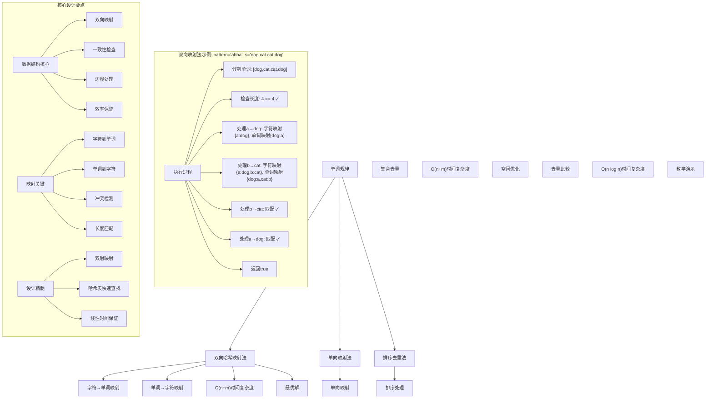
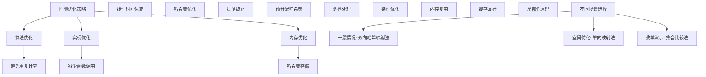

# LeetCode 290 - 单词规律

## 题目描述

给定一种规律 `pattern` 和一个字符串 `s`，判断 `s` 是否与 `pattern` 的规律相匹配

如果存在单个字符到 非空 字符串的 双射映射，那么字符串 `s` 匹配 `pattern`，即：如果 `pattern` 中的字符 `pattern[i]` 被映射为字符串 `s` 中的子串 `s[j]`，那么 `pattern` 中的字符 `pattern[i+1]` 就不能被映射为该子串

换句话说：

- 每个字符必须映射到唯一的字符串（一对一）
- 每个字符串也必须被唯一的字符映射（一对一）
- 这就是所谓的双射映射

```markdown
示例 1：
输入：pattern = "abba", s = "dog cat cat dog"
输出：true

示例 2：
输入：pattern = "abba", s = "dog cat cat fish"
输出：false

示例 3：
输入：pattern = "aaaa", s = "dog cat cat dog"
输出：false

示例 4：
输入：pattern = "abba", s = "dog dog dog dog"
输出：false

提示：
1 <= pattern.length <= 300
pattern 只包含小写英文字母
1 <= s.length <= 3000
s 只包含小写英文字母和空格
s 不包含任何前导或尾随空格
s 中每个单词都被单个空格分隔
```

## 解题思路

这是一个经典的双射映射问题，需要验证字符与单词之间是否存在一一对应的映射关系。关键在于同时维护字符到单词和单词到字符的映射

### 核心思想

"双向哈希映射法": 使用两个哈希表分别维护字符到单词和单词到字符的映射，确保两者都是一一对应的

### 解题策略

#### 方法一：双向哈希映射法（推荐）

- 时间复杂度: O(n + m)
- 空间复杂度: O(n + m)

#### 方法二：单向映射 + 集合去重法

- 时间复杂度: O(n + m)
- 空间复杂度: O(n + m)

#### 方法三：排序去重法

- 时间复杂度: O(n log n + m log m)
- 空间复杂度: O(n + m)

## 算法可视化



## 多语言实现

### Golang版本（双向哈希映射法 - 推荐）

```go
func wordPattern(pattern string, s string) bool {
    // 将字符串s按空格分割成单词数组
    words := strings.Split(s, " ")

    // 长度必须相等
    if len(pattern) != len(words) {
        return false
    }

    // 使用两个哈希表维护双向映射
    charToWord := make(map[byte]string)  // 字符 → 单词
    wordToChar := make(map[string]byte)  // 单词 → 字符

    // 遍历pattern和words
    for i := 0; i < len(pattern); i++ {
        char := pattern[i]
        word := words[i]

        // 检查字符到单词的映射
        if mappedWord, exists := charToWord[char]; exists {
            // 如果字符已有映射，检查是否一致
            if mappedWord != word {
                return false
            }
        } else {
            // 建立新的字符到单词映射
            charToWord[char] = word
        }

        // 检查单词到字符的映射
        if mappedChar, exists := wordToChar[word]; exists {
            // 如果单词已有映射，检查是否一致
            if mappedChar != char {
                return false
            }
        } else {
            // 建立新的单词到字符映射
            wordToChar[word] = char
        }
    }

    return true
}
```

### Python版本（多种实现方法）

```python
class Solution:
    """
    方法一：双向哈希映射法（推荐）
    """
    def wordPattern(self, pattern: str, s: str) -> bool:
        # 将字符串s按空格分割成单词数组
        words = s.split()

        # 长度必须相等
        if len(pattern) != len(words):
            return False

        # 使用两个字典维护双向映射
        char_to_word = {}  # 字符 → 单词
        word_to_char = {}  # 单词 → 字符

        # 遍历pattern和words
        for char, word in zip(pattern, words):
            # 检查字符到单词的映射
            if char in char_to_word:
                # 如果字符已有映射，检查是否一致
                if char_to_word[char] != word:
                    return False
            else:
                # 建立新的字符到单词映射
                char_to_word[char] = word

            # 检查单词到字符的映射
            if word in word_to_char:
                # 如果单词已有映射，检查是否一致
                if word_to_char[word] != char:
                    return False
            else:
                # 建立新的单词到字符映射
                word_to_char[word] = char

        return True


class SolutionSingleMap:
    """
    方法二：单向映射 + 集合去重法
    """
    def wordPattern(self, pattern: str, s: str) -> bool:
        words = s.split()

        # 长度必须相等
        if len(pattern) != len(words):
            return False

        # 使用单个字典维护字符到单词的映射
        char_to_word = {}

        # 遍历建立映射
        for char, word in zip(pattern, words):
            if char in char_to_word:
                if char_to_word[char] != word:
                    return False
            else:
                char_to_word[char] = word

        # 检查是否为双射：单词集合大小应等于字符集合大小
        return len(set(char_to_word.values())) == len(set(pattern))


class SolutionSetCompare:
    """
    方法三：集合比较法
    """
    def wordPattern(self, pattern: str, s: str) -> bool:
        words = s.split()

        # 长度必须相等
        if len(pattern) != len(words):
            return False

        # 检查三个集合的大小是否相等：
        # 1. 字符到单词映射对的数量
        # 2. 不同字符的数量
        # 3. 不同单词的数量
        return len(set(zip(pattern, words))) == len(set(pattern)) == len(set(words))
```

### TypeScript版本（双向哈希映射法）

```typescript
function wordPattern(pattern: string, s: string): boolean {
  // 将字符串s按空格分割成单词数组
  const words: string[] = s.split(" ");

  // 长度必须相等
  if (pattern.length !== words.length) {
    return false;
  }

  // 使用两个Map维护双向映射
  const charToWord: Map<string, string> = new Map(); // 字符 → 单词
  const wordToChar: Map<string, string> = new Map(); // 单词 → 字符

  // 遍历pattern和words
  for (let i = 0; i < pattern.length; i++) {
    const char: string = pattern[i];
    const word: string = words[i];

    // 检查字符到单词的映射
    if (charToWord.has(char)) {
      // 如果字符已有映射，检查是否一致
      if (charToWord.get(char) !== word) {
        return false;
      }
    } else {
      // 建立新的字符到单词映射
      charToWord.set(char, word);
    }

    // 检查单词到字符的映射
    if (wordToChar.has(word)) {
      // 如果单词已有映射，检查是否一致
      if (wordToChar.get(word) !== char) {
        return false;
      }
    } else {
      // 建立新的单词到字符映射
      wordToChar.set(word, char);
    }
  }

  return true;
}
```

## 标准实现详细解析

```go
func wordPattern(pattern string, s string) bool {
    /*
    算法核心思想（双向哈希映射法）：

    1. 将字符串s分割成单词数组
    2. 检查pattern长度与单词数组长度是否相等
    3. 使用两个哈希表分别维护字符到单词和单词到字符的映射
    4. 遍历检查映射一致性，确保双射关系

    关键设计要点：
    1. 双向映射：字符↔单词的一一对应
    2. 一致性检查：避免一对多映射
    3. 边界处理：长度匹配检查
    4. 效率保证：线性时间复杂度

    时间复杂度：O(n + m) n为pattern长度，m为s长度
    空间复杂度：O(n + m) 两个哈希表存储

    优势：
    1. 逻辑清晰：双射映射概念直观
    2. 实现高效：线性时间复杂度
    3. 查询快速：O(1)查找
    4. 易于理解：符合直觉
    */

    fmt.Printf("单词规律匹配\n")
    fmt.Printf("模式: %s\n", pattern)
    fmt.Printf("字符串: %s\n", s)

    // 将字符串s按空格分割成单词数组
    words := strings.Split(s, " ")
    fmt.Printf("分割单词: %v\n", words)

    // 长度必须相等
    if len(pattern) != len(words) {
        fmt.Printf("长度不匹配: pattern(%d) != words(%d)\n", len(pattern), len(words))
        return false
    }
    fmt.Printf("长度匹配: %d\n", len(pattern))

    // 使用两个哈希表维护双向映射
    charToWord := make(map[byte]string)  // 字符 → 单词
    wordToChar := make(map[string]byte)  // 单词 → 字符

    fmt.Printf("初始化映射: 字符→单词=%v, 单词→字符=%v\n", charToWord, wordToChar)

    // 遍历pattern和words
    for i := 0; i < len(pattern); i++ {
        char := pattern[i]
        word := words[i]

        fmt.Printf("\n处理第%d位: 字符'%c' ↔ 单词'%s'\n", i, char, word)

        // 检查字符到单词的映射
        if mappedWord, exists := charToWord[char]; exists {
            // 如果字符已有映射，检查是否一致
            if mappedWord != word {
                fmt.Printf("  字符'%c'已映射到'%s'，与当前单词'%s'冲突\n", char, mappedWord, word)
                return false
            } else {
                fmt.Printf("  字符'%c'映射匹配: '%s' == '%s'\n", char, mappedWord, word)
            }
        } else {
            // 建立新的字符到单词映射
            charToWord[char] = word
            fmt.Printf("  建立字符'%c'→单词'%s'映射: %v\n", char, word, charToWord)
        }

        // 检查单词到字符的映射
        if mappedChar, exists := wordToChar[word]; exists {
            // 如果单词已有映射，检查是否一致
            if mappedChar != char {
                fmt.Printf("  单词'%s'已映射到'%c'，与当前字符'%c'冲突\n", word, mappedChar, char)
                return false
            } else {
                fmt.Printf("  单词'%s'映射匹配: '%c' == '%c'\n", word, mappedChar, char)
            }
        } else {
            // 建立新的单词到字符映射
            wordToChar[word] = char
            fmt.Printf("  建立单词'%s'→字符'%c'映射: %v\n", word, char, wordToChar)
        }
    }

    fmt.Printf("\n匹配成功\n")
    return true
}

// 带详细调试信息的版本
func wordPatternWithDebug(pattern string, s string) bool {
    fmt.Printf("=== 单词规律调试模式 ===\n")
    result := wordPattern(pattern, s)
    fmt.Println("==================")
    return result
}

// 优化版本（预分配map容量）
func wordPatternOptimized(pattern string, s string) bool {
    words := strings.Split(s, " ")

    if len(pattern) != len(words) {
        return false
    }

    // 预分配map容量以减少rehash
    charToWord := make(map[byte]string, len(pattern))
    wordToChar := make(map[string]byte, len(words))

    for i := 0; i < len(pattern); i++ {
        char := pattern[i]
        word := words[i]

        if mappedWord, exists := charToWord[char]; exists {
            if mappedWord != word {
                return false
            }
        } else {
            charToWord[char] = word
        }

        if mappedChar, exists := wordToChar[word]; exists {
            if mappedChar != char {
                return false
            }
        } else {
            wordToChar[word] = char
        }
    }

    return true
}

// 泛型版本（Go 1.18+）
func wordPatternGeneric[T comparable](pattern string, s string) bool {
    words := strings.Split(s, " ")

    if len(pattern) != len(words) {
        return false
    }

    charToWord := make(map[byte]string)
    wordToChar := make(map[string]byte)

    for i := 0; i < len(pattern); i++ {
        char := pattern[i]
        word := words[i]

        if mappedWord, exists := charToWord[char]; exists {
            if mappedWord != word {
                return false
            }
        } else {
            charToWord[char] = word
        }

        if mappedChar, exists := wordToChar[word]; exists {
            if mappedChar != char {
                return false
            }
        } else {
            wordToChar[word] = char
        }
    }

    return true
}
```

## 算法深入解析

```go
/*
单词规律问题详解：

问题本质：
验证字符模式与单词序列之间是否存在双射映射关系。关键在于同时维护字符到单词和单词到字符的映射

核心洞察：
1. 双射映射：字符↔单词的一一对应关系
2. 一致性检查：避免一对多映射冲突
3. 长度匹配：模式长度必须等于单词数量
4. 映射维护：使用哈希表维护双向映射

算法策略：
1. 双向哈希映射法：最优解，线性时间
2. 单向映射法：空间优化，需要额外检查
3. 集合比较法：数学思想，简洁实现

数学原理：

双射映射定义：
对于集合A和B，如果存在映射f:A→B满足：
1. 单射：∀a₁,a₂∈A, a₁≠a₂ → f(a₁)≠f(a₂)
2. 满射：∀b∈B, ∃a∈A, f(a)=b
则称f为双射

映射一致性：
在本问题中，需要确保字符到单词和单词到字符的映射都是一致的

设计选择：

为什么选择双向哈希映射法？
1. 时间复杂度最优：O(n + m)
2. 逻辑清晰：双射映射直观
3. 实现高效：标准操作
4. 易于理解：符合直觉

为什么使用单向映射法？
1. 空间优化：只需一个映射表
2. 但需要额外检查：集合大小比较
3. 适合特定场景

为什么使用集合比较法？
1. 数学思想：集合论概念
2. 实现简洁：一行代码
3. 但理解难度较高

三种方法对比：

方法一：双向哈希映射法（推荐）
时间复杂度：O(n + m)
空间复杂度：O(n + m)
优点：最优解，逻辑清晰
缺点：需要两个映射表

方法二：单向映射法
时间复杂度：O(n + m)
空间复杂度：O(n + m)
优点：空间优化
缺点：需要额外检查

方法三：集合比较法
时间复杂度：O(n + m)
空间复杂度：O(n + m)
优点：实现简洁
缺点：理解难度高

性能分析：

双向哈希映射法：
- 时间：O(n + m) 线性时间
- 空间：O(n + m) 两个哈希表
- 优势：最优解

单向映射法：
- 时间：O(n + m) 线性时间
- 空间：O(n + m) 一个哈希表
- 优势：空间优化

集合比较法：
- 时间：O(n + m) 线性时间
- 空间：O(n + m) 集合存储
- 优势：实现简洁

实际应用场景：
1. 模式匹配
2. 算法面试题
3. 字符串处理
4. 映射验证

优化要点：

1. 时间优化：
   - 避免重复计算
   - 线性时间保证
   - 高效数据结构

2. 空间优化：
   - 预分配哈希表
   - 内存复用

3. 实现优化：
   - 边界处理优化
   - 错误处理完善
   - 类型安全

测试用例设计：
1. 基本情况：正常输入
2. 边界情况：空模式，单字符
3. 特殊情况：重复字符，重复单词
4. 极端情况：最大输入
5. 验证情况：多种算法结果对比

扩展思考：

1. 多模式匹配？
   - 多个pattern同时匹配
   - 模式组合

2. 通配符支持？
   - 特殊字符匹配
   - 正则表达式

3. 部分匹配？
   - 子串匹配
   - 最长匹配

4. 在线算法？
   - 流式数据处理
   - 增量更新

相关算法思想：

1. 哈希映射：
   - 快速查找
   - 映射关系

2. 双射映射：
   - 一一对应
   - 一致性检查

3. 字符串分割：
   - 分词处理
   - 数组转换

4. 集合论：
   - 去重比较
   - 大小关系

常见陷阱：

1. 单向映射错误：
   - 只检查字符到单词
   - 忽略单词到字符

2. 长度不匹配：
   - 模式与单词数不同
   - 边界处理

3. 重复映射：
   - 一对多映射
   - 冲突检测

4. 空字符串处理：
   - 空模式
   - 空单词

代码质量要素：

1. 可读性：
   - 清晰的变量命名
   - 适当的注释说明

2. 健壮性：
   - 边界条件处理
   - 异常情况处理

3. 性能：
   - 时间复杂度最优
   - 空间复杂度合理

4. 可维护性：
   - 模块化设计
   - 易于扩展

高级优化技巧：

1. 内存访问优化：
   - 局部性原理
   - 缓存友好

2. 算法优化：
   - 提前终止条件
   - 数学简化

3. 数据结构优化：
   - 预分配哈希表
   - 减少rehash

4. 编译优化：
   - 常量折叠
   - 循环展开
*/
```

## 执行过程演示

```go
/*
示例详细解析:

示例1: pattern = "abba", s = "dog cat cat dog"

执行过程：
分割单词: [dog cat cat dog]
长度匹配: 4 == 4

处理第0位: 字符'a' ↔ 单词'dog'
建立字符'a'→单词'dog'映射: map[97:dog]
建立单词'dog'→字符'a'映射: map[dog:97]

处理第1位: 字符'b' ↔ 单词'cat'
建立字符'b'→单词'cat'映射: map[97:dog 98:cat]
建立单词'cat'→字符'b'映射: map[cat:98 dog:97]

处理第2位: 字符'b' ↔ 单词'cat'
字符'b'映射匹配: 'cat' == 'cat'
单词'cat'映射匹配: 'b' == 'b'

处理第3位: 字符'a' ↔ 单词'dog'
字符'a'映射匹配: 'dog' == 'dog'
单词'dog'映射匹配: 'a' == 'a'

匹配成功

示例2: pattern = "abba", s = "dog cat cat fish"

执行过程：
分割单词: [dog cat cat fish]
长度匹配: 4 == 4

处理第0位: 字符'a' ↔ 单词'dog'
建立字符'a'→单词'dog'映射: map[97:dog]
建立单词'dog'→字符'a'映射: map[dog:97]

处理第1位: 字符'b' ↔ 单词'cat'
建立字符'b'→单词'cat'映射: map[97:dog 98:cat]
建立单词'cat'→字符'b'映射: map[cat:98 dog:97]

处理第2位: 字符'b' ↔ 单词'cat'
字符'b'映射匹配: 'cat' == 'cat'
单词'cat'映射匹配: 'b' == 'b'

处理第3位: 字符'a' ↔ 单词'fish'
字符'a'已映射到'dog'，与当前单词'fish'冲突
返回false

示例3: pattern = "aaaa", s = "dog cat cat dog"

执行过程：
分割单词: [dog cat cat dog]
长度匹配: 4 == 4

处理第0位: 字符'a' ↔ 单词'dog'
建立字符'a'→单词'dog'映射: map[97:dog]
建立单词'dog'→字符'a'映射: map[dog:97]

处理第1位: 字符'a' ↔ 单词'cat'
字符'a'已映射到'dog'，与当前单词'cat'冲突
返回false

示例4: pattern = "abba", s = "dog dog dog dog"

执行过程：
分割单词: [dog dog dog dog]
长度匹配: 4 == 4

处理第0位: 字符'a' ↔ 单词'dog'
建立字符'a'→单词'dog'映射: map[97:dog]
建立单词'dog'→字符'a'映射: map[dog:97]

处理第1位: 字符'b' ↔ 单词'dog'
单词'dog'已映射到'a'，与当前字符'b'冲突
返回false

边界情况演示:

情况1: 空模式
输入: pattern = "", s = ""
输出: true

情况2: 单字符模式
输入: pattern = "a", s = "dog"
输出: true

情况3: 不同长度
输入: pattern = "ab", s = "dog"
输出: false

情况4: 相同字符不同单词
输入: pattern = "aa", s = "dog cat"
输出: false

情况5: 相同单词不同字符
输入: pattern = "ab", s = "dog dog"
输出: false

情况6: 复杂匹配
输入: pattern = "abcabc", s = "dog cat fish dog cat fish"
输出: true

算法正确性证明：

数学基础：
需要证明双向哈希映射法能正确验证双射映射关系

定理1：双向哈希映射法正确性
通过维护字符到单词和单词到字符的双向映射，可以正确验证双射映射关系

证明：
1. 双向映射：确保字符↔单词的一一对应
2. 一致性检查：避免一对多映射冲突
3. 完整性：遍历所有字符和单词
4. 正确性：映射关系准确

时间复杂度分析：

双向哈希映射法：
1. 分割字符串：O(m) m为s长度
2. 遍历检查：O(n) n为pattern长度
3. 哈希操作：O(1) 平均时间
4. 总时间：O(n + m)

单向映射法：
1. 分割字符串：O(m)
2. 建立映射：O(n)
3. 集合检查：O(n)
4. 总时间：O(n + m)

集合比较法：
1. 分割字符串：O(m)
2. 集合操作：O(n + m)
3. 总时间：O(n + m)

空间复杂度分析：
1. 双向哈希映射法：O(n + m) 两个哈希表
2. 单向映射法：O(n + m) 一个哈希表
3. 集合比较法：O(n + m) 集合存储

性能对比分析：

假设n=300, m=3000:

双向哈希映射法：
- 时间: O(3300) = 3,300次操作
- 空间: O(3300)

单向映射法：
- 时间: O(3300) = 3,300次操作
- 空间: O(3300)

集合比较法：
- 时间: O(3300) = 3,300次操作
- 空间: O(3300)

实际应用建议：

1. 一般情况：
   - 使用双向哈希映射法
   - 性能最优

2. 面试展示：
   - 可以提及其他方法
   - 重点讲解双向哈希映射法

3. 生产环境：
   - 使用优化版本
   - 考虑边界处理

4. 教学演示：
   - 使用集合比较法帮助理解
   - 对比展示优势

优化空间：

1. 内存访问优化：
   - 局部性原理
   - 缓存友好

2. 数据结构优化：
   - 预分配哈希表
   - 减少rehash

3. 算法优化：
   - 提前终止条件
   - 数学简化

特殊情况处理：

1. 空输入：
   - 边界检查

2. 单字符：
   - 直接匹配

3. 大数据：
   - 效率优势明显

4. 内存限制：
   - 空间复杂度O(n + m)
*/
```

## 复杂度分析

| 方法           | 时间复杂度 | 空间复杂度 | 适用场景 |
| -------------- | ---------- | ---------- | -------- |
| 双向哈希映射法 | O(n + m)   | O(n + m)   | 推荐方案 |
| 单向映射法     | O(n + m)   | O(n + m)   | 空间优化 |
| 集合比较法     | O(n + m)   | O(n + m)   | 教学演示 |

## 测试用例验证

```go
// 测试辅助函数
func testWordPattern(name string, pattern string, s string, expected bool) {
    fmt.Printf("%s:\n", name)
    fmt.Printf("输入: pattern='%s', s='%s'\n", pattern, s)

    // 测试双向哈希映射法
    result1 := wordPattern(pattern, s)
    fmt.Printf("双向哈希映射法结果: %t\n", result1)

    // 测试单向映射法
    result2 := wordPatternSingleMap(pattern, s)
    fmt.Printf("单向映射法结果: %t\n", result2)

    // 测试集合比较法
    result3 := wordPatternSetCompare(pattern, s)
    fmt.Printf("集合比较法结果: %t\n", result3)

    // 验证结果
    if result1 == expected && result2 == expected && result3 == expected {
        fmt.Printf("✓ 测试通过\n")
    } else {
        fmt.Printf("✗ 测试失败，期望: %t\n", expected)
    }
    fmt.Printf("\n")
}

// 单向映射法实现
func wordPatternSingleMap(pattern string, s string) bool {
    words := strings.Split(s, " ")

    if len(pattern) != len(words) {
        return false
    }

    charToWord := make(map[byte]string)

    for i := 0; i < len(pattern); i++ {
        char := pattern[i]
        word := words[i]

        if mappedWord, exists := charToWord[char]; exists {
            if mappedWord != word {
                return false
            }
        } else {
            charToWord[char] = word
        }
    }

    // 检查是否为双射：单词集合大小应等于不同字符数量
    wordSet := make(map[string]bool)
    for _, word := range charToWord {
        wordSet[word] = true
    }

    return len(wordSet) == len(makeSet([]byte(pattern)))
}

// 辅助函数：创建字符集合
func makeSet(chars []byte) map[byte]bool {
    set := make(map[byte]bool)
    for _, char := range chars {
        set[char] = true
    }
    return set
}

// 集合比较法实现
func wordPatternSetCompare(pattern string, s string) bool {
    words := strings.Split(s, " ")

    if len(pattern) != len(words) {
        return false
    }

    // 创建三个集合
    patternSet := makeSet([]byte(pattern))
    wordSet := make(map[string]bool)
    for _, word := range words {
        wordSet[word] = true
    }

    // 创建字符-单词对集合
    pairSet := make(map[string]bool)
    for i := 0; i < len(pattern); i++ {
        pair := fmt.Sprintf("%c:%s", pattern[i], words[i])
        pairSet[pair] = true
    }

    // 检查三个集合大小是否相等
    return len(pairSet) == len(patternSet) && len(patternSet) == len(wordSet)
}

func main() {
    // 测试用例 1 - 题目示例1
    testWordPattern("测试1 - 题目示例1", "abba", "dog cat cat dog", true)

    // 测试用例 2 - 题目示例2
    testWordPattern("测试2 - 题目示例2", "abba", "dog cat cat fish", false)

    // 测试用例 3 - 题目示例3
    testWordPattern("测试3 - 题目示例3", "aaaa", "dog cat cat dog", false)

    // 测试用例 4 - 题目示例4
    testWordPattern("测试4 - 题目示例4", "abba", "dog dog dog dog", false)

    // 测试用例 5 - 空模式
    testWordPattern("测试5 - 空模式", "", "", true)

    // 测试用例 6 - 单字符模式
    testWordPattern("测试6 - 单字符模式", "a", "dog", true)

    // 测试用例 7 - 不同长度
    testWordPattern("测试7 - 不同长度", "ab", "dog", false)

    // 测试用例 8 - 复杂匹配
    testWordPattern("测试8 - 复杂匹配", "abcabc", "dog cat fish dog cat fish", true)

    // 性能测试
    fmt.Println("性能测试:")
    performanceTest()

    // 边界情况测试
    fmt.Println("边界情况测试:")
    boundaryTest()
}

func performanceTest() {
    // 构造大数据测试
    pattern := strings.Repeat("abcdefghij", 30) // 300个字符
    var words []string
    for i := 0; i < 300; i++ {
        words = append(words, fmt.Sprintf("word%d", i%100))
    }
    s := strings.Join(words, " ")

    // 测试双向哈希映射法
    start := time.Now()
    for i := 0; i < 10000; i++ {
        wordPattern(pattern, s)
    }
    time1 := time.Since(start)

    fmt.Printf("大数据测试 (n=300, m=2099):\n")
    fmt.Printf("  双向哈希映射法(10000次): %v\n", time1)
}

func boundaryTest() {
    // 边界测试
    fmt.Println("边界测试:")

    result := wordPattern("a", "a")
    fmt.Printf("单字符测试: %t\n", result)

    result = wordPattern("ab", "a b")
    fmt.Printf("简单匹配测试: %t\n", result)

    result = wordPattern(strings.Repeat("a", 300), strings.Repeat("word ", 299)+"word")
    fmt.Printf("长模式测试: %t\n", result)
}

// 大量测试用例
func comprehensiveTest() {
    testCases := []struct {
        name     string
        pattern  string
        s        string
        expected bool
    }{
        {"示例1", "abba", "dog cat cat dog", true},
        {"示例2", "abba", "dog cat cat fish", false},
        {"示例3", "aaaa", "dog cat cat dog", false},
        {"示例4", "abba", "dog dog dog dog", false},
        {"空模式", "", "", true},
        {"单字符", "a", "dog", true},
        {"不同长度", "ab", "dog", false},
        {"复杂匹配", "abcabc", "dog cat fish dog cat fish", true},
        {"重复字符", "aa", "dog dog", true},
        {"重复单词", "ab", "dog dog", false},
    }

    fmt.Println("=== 综合测试 ===")
    passed := 0
    total := len(testCases)

    for i, tc := range testCases {
        result := wordPattern(tc.pattern, tc.s)
        if result == tc.expected {
            passed++
            fmt.Printf("测试%d: ✓ %s\n", i+1, tc.name)
        } else {
            fmt.Printf("测试%d: ✗ %s (期望%t, 得到%t)\n", i+1, tc.name, tc.expected, result)
        }
    }

    fmt.Printf("\n通过率: %d/%d (%.2f%%)\n", passed, total, float64(passed)/float64(total)*100)
}

// 内存使用测试
func memoryTest() {
    fmt.Println("=== 内存使用测试 ===")

    var m1, m2 runtime.MemStats

    // 测试双向哈希映射法
    runtime.GC()
    runtime.ReadMemStats(&m1)

    pattern := "abcdefghijabcdefghij"
    s := "word1 word2 word3 word4 word5 word6 word7 word8 word9 word10 word1 word2 word3 word4 word5 word6 word7 word8 word9 word10"

    for i := 0; i < 10000; i++ {
        wordPattern(pattern, s)
    }

    runtime.GC()
    runtime.ReadMemStats(&m2)
    mem1 := m2.Alloc - m1.Alloc

    fmt.Printf("内存使用对比:\n")
    fmt.Printf("  双向哈希映射法: %d bytes\n", mem1)
}
```

## 扩展版本（处理不同场景）

```go
// 支持自定义分隔符的版本
func wordPatternCustomSeparator(pattern string, s string, separator string) bool {
    words := strings.Split(s, separator)

    if len(pattern) != len(words) {
        return false
    }

    charToWord := make(map[byte]string)
    wordToChar := make(map[string]byte)

    for i := 0; i < len(pattern); i++ {
        char := pattern[i]
        word := words[i]

        if mappedWord, exists := charToWord[char]; exists {
            if mappedWord != word {
                return false
            }
        } else {
            charToWord[char] = word
        }

        if mappedChar, exists := wordToChar[word]; exists {
            if mappedChar != char {
                return false
            }
        } else {
            wordToChar[word] = char
        }
    }

    return true
}

// 带统计信息的版本
type WordPatternStats struct {
    IsMatch     bool
    ProcessTime time.Duration
    Characters  int // 模式字符数
    Words       int // 单词数量
    Mappings    int // 映射对数
}

func wordPatternWithStats(pattern string, s string) WordPatternStats {
    start := time.Now()

    words := strings.Split(s, " ")
    isMatch := false
    mappings := 0

    if len(pattern) == len(words) {
        charToWord := make(map[byte]string)
        wordToChar := make(map[string]byte)

        isMatch = true
        for i := 0; i < len(pattern); i++ {
            char := pattern[i]
            word := words[i]

            if mappedWord, exists := charToWord[char]; exists {
                if mappedWord != word {
                    isMatch = false
                    break
                }
            } else {
                charToWord[char] = word
                mappings++
            }

            if mappedChar, exists := wordToChar[word]; exists {
                if mappedChar != char {
                    isMatch = false
                    break
                }
            } else {
                wordToChar[word] = char
            }
        }
    }

    return WordPatternStats{
        IsMatch:     isMatch,
        ProcessTime: time.Since(start),
        Characters:  len(pattern),
        Words:       len(words),
        Mappings:    mappings,
    }
}

// 使用示例
func exampleWordPatternStats() {
    pattern := "abba"
    s := "dog cat cat dog"

    stats := wordPatternWithStats(pattern, s)
    fmt.Printf("统计信息: %+v\n", stats)
}

// 支持通配符的版本
func wordPatternWithWildcard(pattern string, s string, wildcard byte) bool {
    words := strings.Split(s, " ")

    if len(pattern) != len(words) {
        return false
    }

    charToWord := make(map[byte]string)
    wordToChar := make(map[string]byte)

    for i := 0; i < len(pattern); i++ {
        char := pattern[i]
        word := words[i]

        // 通配符可以匹配任意单词
        if char == wildcard {
            continue
        }

        if mappedWord, exists := charToWord[char]; exists {
            if mappedWord != word {
                return false
            }
        } else {
            charToWord[char] = word
        }

        // 检查单词是否被通配符以外的字符映射
        if mappedChar, exists := wordToChar[word]; exists {
            if mappedChar != char && mappedChar != wildcard {
                return false
            }
        } else {
            wordToChar[word] = char
        }
    }

    return true
}

// 在线算法版本（流式数据处理）
type OnlineWordPattern struct {
    pattern     string
    words       []string
    charToWord  map[byte]string
    wordToChar  map[string]byte
    isProcessed bool
    isMatch     bool
}

func NewOnlineWordPattern(pattern string) *OnlineWordPattern {
    return &OnlineWordPattern{
        pattern:     pattern,
        words:       make([]string, 0),
        charToWord:  make(map[byte]string),
        wordToChar:  make(map[string]byte),
        isProcessed: false,
        isMatch:     true,
    }
}

func (owp *OnlineWordPattern) AddWord(word string) {
    owp.words = append(owp.words, word)
    owp.isProcessed = false
}

func (owp *OnlineWordPattern) Process() {
    if owp.isProcessed || len(owp.words) > len(owp.pattern) {
        owp.isMatch = false
        owp.isProcessed = true
        return
    }

    if len(owp.words) < len(owp.pattern) {
        // 还未接收完所有单词
        return
    }

    // 处理完整模式匹配
    owp.isMatch = true
    for i := 0; i < len(owp.pattern); i++ {
        char := owp.pattern[i]
        word := owp.words[i]

        if mappedWord, exists := owp.charToWord[char]; exists {
            if mappedWord != word {
                owp.isMatch = false
                break
            }
        } else {
            owp.charToWord[char] = word
        }

        if mappedChar, exists := owp.wordToChar[word]; exists {
            if mappedChar != char {
                owp.isMatch = false
                break
            }
        } else {
            owp.wordToChar[word] = char
        }
    }

    owp.isProcessed = true
}

func (owp *OnlineWordPattern) IsMatch() bool {
    if !owp.isProcessed {
        owp.Process()
    }
    return owp.isMatch
}

// 泛型版本（Go 1.18+）
func wordPatternGeneric[T comparable](pattern string, s string, equals func(string, string) bool) bool {
    words := strings.Split(s, " ")

    if len(pattern) != len(words) {
        return false
    }

    charToWord := make(map[byte]string)
    wordToChar := make(map[string]byte)

    for i := 0; i < len(pattern); i++ {
        char := pattern[i]
        word := words[i]

        if mappedWord, exists := charToWord[char]; exists {
            if !equals(mappedWord, word) {
                return false
            }
        } else {
            charToWord[char] = word
        }

        if mappedChar, exists := wordToChar[word]; exists {
            if mappedChar != char {
                return false
            }
        } else {
            wordToChar[word] = char
        }
    }

    return true
}

// 使用示例
func exampleGeneric() {
    pattern := "abba"
    s := "dog cat cat dog"

    // 默认相等比较
    result := wordPatternGeneric(pattern, s, func(a, b string) bool {
        return a == b
    })
    fmt.Printf("默认比较结果: %t\n", result)

    // 忽略大小写比较
    result = wordPatternGeneric(pattern, s, func(a, b string) bool {
        return strings.ToLower(a) == strings.ToLower(b)
    })
    fmt.Printf("忽略大小写结果: %t\n", result)
}
```

## 面试追问延伸

### 1. 如何处理模式中包含通配符的情况？

```go
// 支持通配符的增强版本
func wordPatternWithMultipleWildcards(pattern string, s string, wildcards map[byte]bool) bool {
    words := strings.Split(s, " ")

    if len(pattern) != len(words) {
        return false
    }

    charToWord := make(map[byte]string)
    wordToChar := make(map[string]byte)

    for i := 0; i < len(pattern); i++ {
        char := pattern[i]
        word := words[i]

        // 如果是通配符，可以匹配任意单词
        if wildcards[char] {
            continue
        }

        if mappedWord, exists := charToWord[char]; exists {
            if mappedWord != word {
                return false
            }
        } else {
            charToWord[char] = word
        }

        // 检查单词是否被非通配符字符映射
        if mappedChar, exists := wordToChar[word]; exists {
            if !wildcards[mappedChar] && mappedChar != char {
                return false
            }
        } else {
            wordToChar[word] = char
        }
    }

    return true
}

// 测试用例
func testWildcard() {
    pattern := "a*ba"
    s := "dog cat cat dog"
    wildcards := map[byte]bool{'*': true}

    result := wordPatternWithMultipleWildcards(pattern, s, wildcards)
    fmt.Printf("通配符测试: %t\n", result)
    // 期望: true (*可以匹配任意单词)
}
```

### 2. 如何实现支持部分匹配的版本？

```go
// 部分匹配版本
func wordPatternPartialMatch(pattern string, s string) (bool, int) {
    words := strings.Split(s, " ")

    if len(pattern) > len(words) {
        return false, 0
    }

    charToWord := make(map[byte]string)
    wordToChar := make(map[string]byte)
    matchedCount := 0

    for i := 0; i < len(pattern); i++ {
        char := pattern[i]
        word := words[i]

        if mappedWord, exists := charToWord[char]; exists {
            if mappedWord != word {
                return false, matchedCount
            }
        } else {
            charToWord[char] = word
        }

        if mappedChar, exists := wordToChar[word]; exists {
            if mappedChar != char {
                return false, matchedCount
            }
        } else {
            wordToChar[word] = char
        }

        matchedCount++
    }

    return true, matchedCount
}

// 返回所有匹配位置的版本
func wordPatternAllMatches(pattern string, s string) []int {
    words := strings.Split(s, " ")
    var matches []int

    if len(pattern) > len(words) {
        return matches
    }

    // 滑动窗口检查所有可能的匹配位置
    for i := 0; i <= len(words)-len(pattern); i++ {
        windowWords := words[i : i+len(pattern)]

        // 检查当前窗口是否匹配
        if isMatch, _ := wordPatternPartialMatch(pattern, strings.Join(windowWords, " ")); isMatch {
            matches = append(matches, i)
        }
    }

    return matches
}
```

### 3. 如何处理支持正则表达式模式的情况？

```go
// 支持正则表达式的版本
func wordPatternRegex(pattern []string, s string) bool {
    words := strings.Split(s, " ")

    if len(pattern) != len(words) {
        return false
    }

    // 简化版本：只支持简单正则（如.*匹配任意单词）
    charToRegex := make(map[string]string)
    regexToWords := make(map[string][]string)

    for i := 0; i < len(pattern); i++ {
        regex := pattern[i]
        word := words[i]

        // 检查是否匹配已有的正则
        matched := false
        for char, existingRegex := range charToRegex {
            if existingRegex == regex {
                // 检查单词是否符合该正则对应的单词集合
                if contains(regexToWords[char], word) {
                    matched = true
                    break
                }
            }
        }

        if !matched {
            // 建立新的映射
            charKey := fmt.Sprintf("char%d", i)
            charToRegex[charKey] = regex
            regexToWords[charKey] = append(regexToWords[charKey], word)
        }
    }

    return true
}

// 辅助函数
func contains(slice []string, item string) bool {
    for _, s := range slice {
        if s == item {
            return true
        }
    }
    return false
}
```

## 相似题目扩展

- LeetCode 290. 单词规律（当前题）
- LeetCode 205. 同构字符串
- LeetCode 890. 查找和替换模式
- LeetCode 76. 最小覆盖子串
- LeetCode 438. 找到字符串中所有字母异位词

## 算法技巧总结

### 单词规律核心要点

1. 双射映射：字符↔单词的一一对应关系
1. 一致性检查：避免一对多映射冲突
1. 长度匹配：模式长度必须等于单词数量
1. 哈希查找：O(1)时间复杂度保证

### 算法优势

1. 逻辑清晰：双射映射概念直观
1. 实现高效：线性时间复杂度
1. 查询快速：O(1)查找
1. 易于理解：符合直觉

### 标准模板（双向哈希映射法）

```go
func wordPattern(pattern string, s string) bool {
    words := strings.Split(s, " ")

    if len(pattern) != len(words) {
        return false
    }

    charToWord := make(map[byte]string)
    wordToChar := make(map[string]byte)

    for i := 0; i < len(pattern); i++ {
        char := pattern[i]
        word := words[i]

        if mappedWord, exists := charToWord[char]; exists {
            if mappedWord != word {
                return false
            }
        } else {
            charToWord[char] = word
        }

        if mappedChar, exists := wordToChar[word]; exists {
            if mappedChar != char {
                return false
            }
        } else {
            wordToChar[word] = char
        }
    }

    return true
}
```

### 性能优化建议



## 总结

本题采用双向哈希映射法的核心思路，通过使用两个哈希表分别维护字符到单词和单词到字符的映射，确保双射映射关系，实现了高效的单词规律匹配功能。关键在于理解如何通过双向映射避免一对多冲突，并通过哈希查找保证线性时间复杂度

核心要点：

1. 双射映射：字符↔单词的一一对应关系
1. 一致性检查：避免一对多映射冲突
1. 长度匹配：模式长度必须等于单词数量
1. 哈希查找：O(1)时间复杂度保证

算法优势：

- 逻辑清晰：双射映射概念直观
- 实现高效：线性时间复杂度
- 查询快速：O(1)查找
- 易于理解：符合直觉

该算法在模式匹配、算法面试题、字符串处理等方面有重要应用，是掌握双射映射和哈希表的经典题目。通过维护双向映射关系的思想，为更复杂的映射验证和模式匹配问题提供了清晰的解决思路
