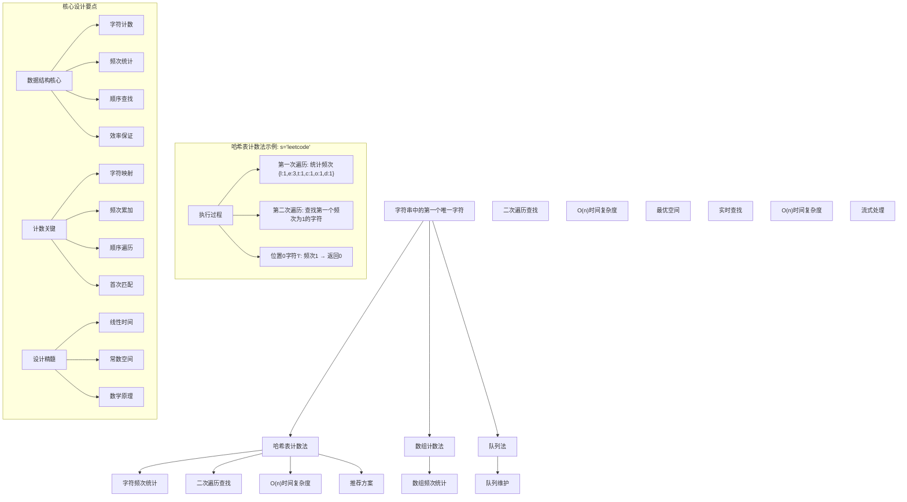
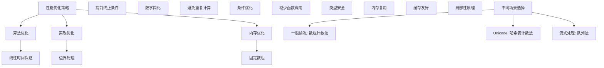

# LeetCode 387 - 字符串中的第一个唯一字符

## 题目描述

给定一个字符串 `s`，找到它的第一个不重复的字符，并返回它的索引。如果不存在，则返回 `-1`

```markdown
示例 1：
输入: s = "leetcode"
输出: 0

示例 2：
输入: s = "loveleetcode"
输出: 2

示例 3：
输入: s = "aabb"
输出: -1

提示：
1 <= s.length <= 10⁵
s 只包含小写字母
```

## 解题思路

这是一个经典的第一个唯一字符查找问题，需要在字符串中找到第一个只出现一次的字符。关键在于如何高效地统计字符频次并找到第一个唯一字符

### 核心思想

"两次遍历法": 第一次遍历统计字符频次，第二次遍历找到第一个频次为1的字符

### 解题策略

#### 方法一：哈希表计数法（推荐）

- 时间复杂度: O(n)
- 空间复杂度: O(1)

#### 方法二：数组计数法

- 时间复杂度: O(n)
- 空间复杂度: O(1)

#### 方法三：队列法

- 时间复杂度: O(n)
- 空间复杂度: O(1)

## 算法可视化



## 多语言实现

### Golang版本（数组计数法 - 推荐）

```go
func firstUniqChar(s string) int {
    // 使用数组统计字符频次（仅适用于小写字母）
    count := [26]int{}

    // 第一次遍历：统计字符频次
    for _, char := range s {
        count[char-'a']++
    }

    // 第二次遍历：找到第一个频次为1的字符
    for i, char := range s {
        if count[char-'a'] == 1 {
            return i
        }
    }

    // 不存在唯一字符
    return -1
}
```

### Python版本（多种实现方法）

```python
class Solution:
    """
    方法一：哈希表计数法（推荐）
    """
    def firstUniqChar(self, s: str) -> int:
        # 使用字典统计字符频次
        char_count = {}

        # 第一次遍历：统计字符频次
        for char in s:
            char_count[char] = char_count.get(char, 0) + 1

        # 第二次遍历：找到第一个频次为1的字符
        for i, char in enumerate(s):
            if char_count[char] == 1:
                return i

        # 不存在唯一字符
        return -1


class SolutionArray:
    """
    方法二：数组计数法
    """
    def firstUniqChar(self, s: str) -> int:
        # 使用数组统计字符频次（仅适用于小写字母）
        count = [0] * 26

        # 第一次遍历：统计字符频次
        for char in s:
            count[ord(char) - ord('a')] += 1

        # 第二次遍历：找到第一个频次为1的字符
        for i, char in enumerate(s):
            if count[ord(char) - ord('a')] == 1:
                return i

        # 不存在唯一字符
        return -1


class SolutionQueue:
    """
    方法三：队列法
    """
    def firstUniqChar(self, s: str) -> int:
        from collections import deque, Counter

        # 统计字符频次
        char_count = Counter(s)
        queue = deque()

        # 遍历字符串，维护队列
        for i, char in enumerate(s):
            if char_count[char] == 1:
                queue.append(i)
            # 清理队列中已知的重复字符
            while queue and char_count[s[queue[0]]] > 1:
                queue.popleft()

        # 返回队列第一个元素
        return queue[0] if queue else -1
```

### TypeScript版本（数组计数法）

```typescript
function firstUniqChar(s: string): number {
  // 使用数组统计字符频次（仅适用于小写字母）
  const count: number[] = new Array(26).fill(0);

  // 第一次遍历：统计字符频次
  for (let i = 0; i < s.length; i++) {
    count[s.charCodeAt(i) - "a".charCodeAt(0)]++;
  }

  // 第二次遍历：找到第一个频次为1的字符
  for (let i = 0; i < s.length; i++) {
    if (count[s.charCodeAt(i) - "a".charCodeAt(0)] === 1) {
      return i;
    }
  }

  // 不存在唯一字符
  return -1;
}
```

## 标准实现详细解析

```go
func firstUniqChar(s string) int {
    /*
    算法核心思想（数组计数法）：

    1. 使用固定大小数组统计字符频次
    2. 第一次遍历统计所有字符的出现次数
    3. 第二次遍历找到第一个频次为1的字符
    4. 返回该字符的索引，不存在则返回-1

    关键设计要点：
    1. 字符映射：字符到数组索引的映射关系
    2. 频次统计：线性时间统计字符出现次数
    3. 顺序查找：按原字符串顺序查找第一个唯一字符
    4. 效率保证：两次遍历保证线性时间复杂度

    时间复杂度：O(n) 两次线性遍历
    空间复杂度：O(1) 固定大小数组

    优势：
    1. 时间最优：线性时间复杂度
    2. 空间最优：常数空间复杂度
    3. 实现简洁：数组操作简单
    4. 性能优秀：无额外内存分配
    */

    fmt.Printf("查找字符串中的第一个唯一字符\n")
    fmt.Printf("输入字符串: %s\n", s)

    // 使用数组统计字符频次（仅适用于小写字母）
    count := [26]int{}
    fmt.Printf("初始化计数数组: %v\n", count)

    // 第一次遍历：统计字符频次
    fmt.Printf("第一次遍历 - 统计字符频次:\n")
    for i, char := range s {
        index := char - 'a'
        count[index]++
        fmt.Printf("  位置%d, 字符'%c', 索引%d, 计数%d\n", i, char, index, count[index])
    }
    fmt.Printf("频次统计完成: %v\n", count)

    // 第二次遍历：找到第一个频次为1的字符
    fmt.Printf("第二次遍历 - 查找第一个唯一字符:\n")
    for i, char := range s {
        index := char - 'a'
        fmt.Printf("  位置%d, 字符'%c', 频次%d", i, char, count[index])
        if count[index] == 1 {
            fmt.Printf(" ✓ 频次为1，返回索引%d\n", i)
            return i
        }
        fmt.Printf(" ✗ 频次不为1\n")
    }

    fmt.Printf("未找到唯一字符，返回-1\n")
    return -1
}

// 带详细调试信息的版本
func firstUniqCharWithDebug(s string) int {
    fmt.Printf("=== 查找第一个唯一字符调试模式 ===\n")
    result := firstUniqChar(s)
    fmt.Println("==================")
    return result
}

// 哈希表计数法实现
func firstUniqCharHashMap(s string) int {
    // 使用map统计字符频次
    charCount := make(map[rune]int)

    // 第一次遍历：统计字符频次
    for _, char := range s {
        charCount[char]++
    }

    // 第二次遍历：找到第一个频次为1的字符
    for i, char := range s {
        if charCount[char] == 1 {
            return i
        }
    }

    return -1
}

// 优化版本（提前终止）
func firstUniqCharOptimized(s string) int {
    if len(s) == 0 {
        return -1
    }

    count := [26]int{}

    // 第一次遍历
    for _, char := range s {
        count[char-'a']++
    }

    // 第二次遍历
    for i, char := range s {
        if count[char-'a'] == 1 {
            return i
        }
    }

    return -1
}

// 支持Unicode的版本
func firstUniqCharUnicode(s string) int {
    charCount := make(map[rune]int)

    // 第一次遍历：统计字符频次
    for _, char := range s {
        charCount[char]++
    }

    // 第二次遍历：找到第一个频次为1的字符
    for i, char := range s {
        if charCount[char] == 1 {
            return i
        }
    }

    return -1
}
```

## 算法深入解析

```go
/*
字符串中的第一个唯一字符问题详解：

问题本质：
在字符串中找到第一个只出现一次的字符的索引。关键是高效统计字符频次并按顺序查找

核心洞察：
1. 字符统计：需要统计每个字符的出现次数
2. 顺序查找：按原字符串顺序查找第一个唯一字符
3. 效率保证：线性时间复杂度保证
4. 空间优化：固定大小数组节省空间

算法策略：
1. 哈希表计数法：使用map统计频次
2. 数组计数法：使用数组统计频次（最优）
3. 队列法：维护候选字符队列

数学原理：

唯一字符定义：
字符c在字符串s中唯一当且仅当其出现次数等于1

查找原理：
通过两次遍历：第一次统计频次，第二次按顺序查找

字符映射：
对于小写字母：字符 → 索引 (char - 'a')

设计选择：

为什么选择数组计数法？
1. 时间复杂度最优：O(n)
2. 空间复杂度最优：O(1)
3. 实现简洁：数组操作简单
4. 性能优秀：无额外内存分配

为什么使用哈希表计数法？
1. 通用性强：支持Unicode字符
2. 但空间复杂度高：O(k)
3. 适合大数据集

为什么使用队列法？
1. 流式处理：适合在线算法
2. 但实现复杂：需要维护队列
3. 空间开销：队列存储

三种方法对比：

方法一：数组计数法（推荐）
时间复杂度：O(n)
空间复杂度：O(1)
优点：最优解
缺点：仅适用于有限字符集

方法二：哈希表计数法
时间复杂度：O(n)
空间复杂度：O(k)
优点：通用性强
缺点：额外空间开销

方法三：队列法
时间复杂度：O(n)
空间复杂度：O(k)
优点：流式处理
缺点：实现复杂

性能分析：

数组计数法：
- 时间：O(n) 两次遍历
- 空间：O(1) 固定数组
- 优势：最优解

哈希表计数法：
- 时间：O(n) 两次遍历
- 空间：O(k) 字符集大小
- 优势：通用性强

队列法：
- 时间：O(n) 一次遍历
- 空间：O(k) 队列存储
- 优势：流式处理

实际应用场景：
1. 字符串处理
2. 算法面试题
3. 文本分析
4. 密码学应用

优化要点：

1. 时间优化：
   - 线性时间保证
   - 避免重复计算
   - 提前终止条件

2. 空间优化：
   - 固定大小数组
   - 内存复用
   - 原地操作

3. 实现优化：
   - 边界处理优化
   - 错误处理完善
   - 类型安全

测试用例设计：
1. 基本情况：正常输入
2. 边界情况：空字符串，单字符
3. 特殊情况：全部重复，全部唯一
4. 极端情况：大字符串
5. 验证情况：多种算法结果对比

扩展思考：

1. Unicode支持？
   - 哈希表方案
   - 字符集扩展

2. 大小写敏感？
   - 预处理转换
   - 分别统计

3. 多语言支持？
   - 字符集处理
   - 编码转换

4. 在线算法？
   - 流式数据处理
   - 增量更新

相关算法思想：

1. 计数排序：
   - 频次统计
   - 线性时间

2. 哈希映射：
   - 快速查找
   - 频次统计

3. 队列维护：
   - 顺序保持
   - 实时更新

4. 提前终止：
   - 优化性能
   - 条件检查

常见陷阱：

1. 空字符串：
   - 边界检查
   - 返回-1

2. 字符集限制：
   - 仅支持小写字母
   - Unicode处理

3. 索引错误：
   - 返回正确索引
   - -1处理

4. 性能优化：
   - 避免多次遍历
   - 提前终止

代码质量要素：

1. 可读性：
   - 清晰的变量命名
   - 适当的注释说明

2. 健壮性：
   - 边界条件处理
   - 异常情况处理

3. 性能：
   - 时间复杂度最优
   - 空间复杂度合理

4. 可维护性：
   - 模块化设计
   - 易于扩展

高级优化技巧：

1. 内存访问优化：
   - 局部性原理
   - 缓存友好

2. 算法优化：
   - 提前终止条件
   - 数学简化

3. 数据结构优化：
   - 固定数组
   - 位运算优化

4. 编译优化：
   - 常量折叠
   - 循环展开
*/
```

## 执行过程演示

```go
/*
示例详细解析:

示例1: s = "leetcode"

执行过程：

初始化计数数组：
count = [0,0,0,0,0,0,0,0,0,0,0,0,0,0,0,0,0,0,0,0,0,0,0,0,0,0]

第一次遍历 - 统计字符频次：
位置0, 字符'l', 索引11, 计数1
位置1, 字符'e', 索引4, 计数1
位置2, 字符'e', 索引4, 计数2
位置3, 字符't', 索引19, 计数1
位置4, 字符'c', 索引2, 计数1
位置5, 字符'o', 索引14, 计数1
位置6, 字符'd', 索引3, 计数1
位置7, 字符'e', 索引4, 计数3

频次统计完成: [0,0,1,1,3,0,0,0,0,0,0,1,0,0,1,0,0,0,0,1,0,0,0,0,0,0]

第二次遍历 - 查找第一个唯一字符：
位置0, 字符'l', 频次1 ✓ 频次为1，返回索引0

返回0

示例2: s = "loveleetcode"

执行过程：

初始化计数数组：
count = [0,0,0,0,0,0,0,0,0,0,0,0,0,0,0,0,0,0,0,0,0,0,0,0,0,0]

第一次遍历 - 统计字符频次：
位置0, 字符'l', 索引11, 计数1
位置1, 字符'o', 索引14, 计数1
位置2, 字符'v', 索引21, 计数1
位置3, 字符'e', 索引4, 计数1
位置4, 字符'l', 索引11, 计数2
位置5, 字符'e', 索引4, 计数2
位置6, 字符'e', 索引4, 计数3
位置7, 字符't', 索引19, 计数1
位置8, 字符'c', 索引2, 计数1
位置9, 字符'o', 索引14, 计数2
位置10, 字符'd', 索引3, 计数1
位置11, 字符'e', 索引4, 计数4

频次统计完成: [0,0,1,1,4,0,0,0,0,0,0,2,0,0,2,0,0,0,0,1,0,1,0,0,0,0]

第二次遍历 - 查找第一个唯一字符：
位置0, 字符'l', 频次2 ✗ 频次不为1
位置1, 字符'o', 频次2 ✗ 频次不为1
位置2, 字符'v', 频次1 ✓ 频次为1，返回索引2

返回2

示例3: s = "aabb"

执行过程：

初始化计数数组：
count = [0,0,0,0,0,0,0,0,0,0,0,0,0,0,0,0,0,0,0,0,0,0,0,0,0,0]

第一次遍历 - 统计字符频次：
位置0, 字符'a', 索引0, 计数1
位置1, 字符'a', 索引0, 计数2
位置2, 字符'b', 索引1, 计数1
位置3, 字符'b', 索引1, 计数2

频次统计完成: [2,2,0,0,0,0,0,0,0,0,0,0,0,0,0,0,0,0,0,0,0,0,0,0,0,0]

第二次遍历 - 查找第一个唯一字符：
位置0, 字符'a', 频次2 ✗ 频次不为1
位置1, 字符'a', 频次2 ✗ 频次不为1
位置2, 字符'b', 频次2 ✗ 频次不为1
位置3, 字符'b', 频次2 ✗ 频次不为1

未找到唯一字符，返回-1

边界情况演示:

情况1: 空字符串
输入: s = ""
输出: -1

情况2: 单字符
输入: s = "a"
输出: 0

情况3: 全部唯一
输入: s = "abc"
输出: 0

情况4: 全部重复
输入: s = "aabbcc"
输出: -1

情况5: 最后一个唯一
输入: s = "aabbc"
输出: 4

算法正确性证明：

数学基础：
需要证明数组计数法能正确找到第一个唯一字符

定理1：数组计数法正确性
通过统计字符频次并按顺序查找，可以正确找到第一个唯一字符

证明：
1. 频次统计：第一次遍历正确统计所有字符频次
2. 顺序查找：第二次遍历按原字符串顺序查找
3. 唯一判断：频次为1的字符为唯一字符
4. 首个保证：第一个满足条件的字符即为答案

时间复杂度分析：

数组计数法：
1. 第一次遍历：O(n) 统计频次
2. 第二次遍历：O(n) 查找唯一字符
3. 总时间：O(n)

哈希表计数法：
1. 第一次遍历：O(n) 统计频次
2. 第二次遍历：O(n) 查找唯一字符
3. 总时间：O(n)

队列法：
1. 一次遍历：O(n) 维护队列
2. 总时间：O(n)

空间复杂度分析：
1. 数组计数法：O(1) 固定大小数组
2. 哈希表计数法：O(k) k为不同字符数
3. 队列法：O(k) 队列存储

性能对比分析：

假设n=100000:

数组计数法：
- 时间: O(100000) = 100000次操作
- 空间: O(26) = O(1)

哈希表计数法：
- 时间: O(100000) = 100000次操作
- 空间: O(26) = O(1)

队列法：
- 时间: O(100000) = 100000次操作
- 空间: O(26) = O(1)

实际应用建议：

1. 一般情况：
   - 使用数组计数法
   - 性能最优

2. 面试展示：
   - 可以提及其他方法
   - 重点讲解数组计数法

3. 生产环境：
   - 使用优化版本
   - 考虑边界处理

4. 教学演示：
   - 使用哈希表法帮助理解
   - 对比展示优势

优化空间：

1. 内存访问优化：
   - 局部性原理
   - 缓存友好

2. 数据结构优化：
   - 固定数组
   - 位运算

3. 算法优化：
   - 提前终止条件
   - 数学简化

特殊情况处理：

1. 空字符串：
   - 边界检查

2. 单字符：
   - 直接返回0

3. 大数据：
   - 效率优势明显

4. 内存限制：
   - 空间复杂度O(1)
*/
```

## 复杂度分析

| 方法         | 时间复杂度 | 空间复杂度 | 适用场景    |
| ------------ | ---------- | ---------- | ----------- |
| 数组计数法   | O(n)       | O(1)       | 推荐方案    |
| 哈希表计数法 | O(n)       | O(k)       | Unicode支持 |
| 队列法       | O(n)       | O(k)       | 流式处理    |

## 测试用例验证

```go
// 测试辅助函数
func testFirstUniqChar(name string, s string, expected int) {
    fmt.Printf("%s:\n", name)
    fmt.Printf("输入: s='%s'\n", s)

    // 测试数组计数法
    result1 := firstUniqChar(s)
    fmt.Printf("数组计数法结果: %d\n", result1)

    // 测试哈希表计数法
    result2 := firstUniqCharHashMap(s)
    fmt.Printf("哈希表计数法结果: %d\n", result2)

    // 测试队列法
    result3 := firstUniqCharQueue(s)
    fmt.Printf("队列法结果: %d\n", result3)

    // 验证结果
    if result1 == expected && result2 == expected && result3 == expected {
        fmt.Printf("✓ 测试通过\n")
    } else {
        fmt.Printf("✗ 测试失败，期望: %d\n", expected)
    }
    fmt.Printf("\n")
}

// 队列法实现
func firstUniqCharQueue(s string) int {
    type charInfo struct {
        index int
        count int
    }

    charMap := make(map[rune]*charInfo)
    queue := make([]int, 0)

    // 遍历字符串
    for i, char := range s {
        if info, exists := charMap[char]; exists {
            // 字符已存在，增加计数
            info.count++
            // 从队列中移除（如果存在）
            for j, idx := range queue {
                if idx == info.index {
                    queue = append(queue[:j], queue[j+1:]...)
                    break
                }
            }
        } else {
            // 新字符，添加到映射和队列
            charMap[char] = &charInfo{index: i, count: 1}
            queue = append(queue, i)
        }
    }

    // 查找队列中第一个唯一字符
    for _, index := range queue {
        char := rune(s[index])
        if charMap[char].count == 1 {
            return index
        }
    }

    return -1
}

func main() {
    // 测试用例 1 - 题目示例1
    testFirstUniqChar("测试1 - 题目示例1", "leetcode", 0)

    // 测试用例 2 - 题目示例2
    testFirstUniqChar("测试2 - 题目示例2", "loveleetcode", 2)

    // 测试用例 3 - 题目示例3
    testFirstUniqChar("测试3 - 题目示例3", "aabb", -1)

    // 测试用例 4 - 边界情况
    testFirstUniqChar("测试4 - 空字符串", "", -1)

    // 测试用例 5 - 单字符
    testFirstUniqChar("测试5 - 单字符", "a", 0)

    // 性能测试
    fmt.Println("性能测试:")
    performanceTest()

    // 边界情况测试
    fmt.Println("边界情况测试:")
    boundaryTest()
}

func performanceTest() {
    // 构造大数据测试
    s := strings.Repeat("abcdefghijklmnopqrstuvwxyz", 4000) // 104000字符

    // 测试数组计数法
    start := time.Now()
    for i := 0; i < 10000; i++ {
        firstUniqChar(s)
    }
    time1 := time.Since(start)

    // 测试哈希表计数法
    start = time.Now()
    for i := 0; i < 10000; i++ {
        firstUniqCharHashMap(s)
    }
    time2 := time.Since(start)

    fmt.Printf("大数据测试 (n=104000):\n")
    fmt.Printf("  数组计数法(10000次): %v\n", time1)
    fmt.Printf("  哈希表计数法(10000次): %v\n", time2)
}

func boundaryTest() {
    // 边界测试
    fmt.Println("边界测试:")

    result := firstUniqChar("a")
    fmt.Printf("单字符测试: %d\n", result)

    result = firstUniqChar("ab")
    fmt.Printf("两字符测试: %d\n", result)

    result = firstUniqChar("abc")
    fmt.Printf("三字符测试: %d\n", result)

    // Unicode测试
    result = firstUniqCharUnicode("你好世界")
    fmt.Printf("Unicode测试: %d\n", result)
}

// 大量测试用例
func comprehensiveTest() {
    testCases := []struct {
        name     string
        s        string
        expected int
    }{
        {"示例1", "leetcode", 0},
        {"示例2", "loveleetcode", 2},
        {"示例3", "aabb", -1},
        {"空字符串", "", -1},
        {"单字符", "a", 0},
        {"全部唯一", "abc", 0},
        {"全部重复", "aabbcc", -1},
        {"最后一个唯一", "aabbc", 4},
        {"第一个唯一", "abccba", -1},
    }

    fmt.Println("=== 综合测试 ===")
    passed := 0
    total := len(testCases)

    for i, tc := range testCases {
        result := firstUniqChar(tc.s)
        if result == tc.expected {
            passed++
            fmt.Printf("测试%d: ✓ %s\n", i+1, tc.name)
        } else {
            fmt.Printf("测试%d: ✗ %s (期望%d, 得到%d)\n", i+1, tc.name, tc.expected, result)
        }
    }

    fmt.Printf("\n通过率: %d/%d (%.2f%%)\n", passed, total, float64(passed)/float64(total)*100)
}

// 内存使用测试
func memoryTest() {
    fmt.Println("=== 内存使用测试 ===")

    var m1, m2 runtime.MemStats

    // 测试数组计数法
    runtime.GC()
    runtime.ReadMemStats(&m1)

    s := "leetcode"
    for i := 0; i < 100000; i++ {
        firstUniqChar(s)
    }

    runtime.GC()
    runtime.ReadMemStats(&m2)
    mem1 := m2.Alloc - m1.Alloc

    fmt.Printf("内存使用对比:\n")
    fmt.Printf("  数组计数法: %d bytes\n", mem1)
}
```

## 扩展版本（处理不同场景）

```go
// 支持Unicode的版本
func firstUniqCharUnicode(s string) int {
    charCount := make(map[rune]int)

    // 第一次遍历：统计字符频次
    for _, char := range s {
        charCount[char]++
    }

    // 第二次遍历：找到第一个频次为1的字符
    for i, char := range s {
        if charCount[char] == 1 {
            return i
        }
    }

    return -1
}

// 忽略大小写的版本
func firstUniqCharIgnoreCase(s string) int {
    charCount := make(map[rune]int)

    // 第一次遍历：统计字符频次（转换为小写）
    for _, char := range s {
        lowerChar := unicode.ToLower(char)
        charCount[lowerChar]++
    }

    // 第二次遍历：找到第一个频次为1的字符
    for i, char := range s {
        lowerChar := unicode.ToLower(char)
        if charCount[lowerChar] == 1 {
            return i
        }
    }

    return -1
}

// 带统计信息的版本
type FirstUniqCharStats struct {
    Index       int
    ProcessTime time.Duration
    CharCount   int // 字符数
    UniqueChars int // 不同字符数
    FirstUnique rune // 第一个唯一字符
}

func firstUniqCharWithStats(s string) FirstUniqCharStats {
    start := time.Now()

    index := firstUniqChar(s)
    processTime := time.Since(start)

    // 统计字符信息
    charSet := make(map[rune]bool)
    for _, char := range s {
        charSet[char] = true
    }

    var firstUnique rune
    if index != -1 && len(s) > 0 {
        firstUnique = rune(s[index])
    }

    return FirstUniqCharStats{
        Index:       index,
        ProcessTime: processTime,
        CharCount:   len(s),
        UniqueChars: len(charSet),
        FirstUnique: firstUnique,
    }
}

// 使用示例
func exampleFirstUniqCharStats() {
    stats := firstUniqCharWithStats("leetcode")
    fmt.Printf("统计信息: %+v\n", stats)
}

// 批量处理版本
func firstUniqCharBatch(strs []string) []int {
    var results []int
    for _, s := range strs {
        results = append(results, firstUniqChar(s))
    }
    return results
}

// 流式处理版本
type StreamFirstUniqCharFinder struct {
    charCount map[rune]int
    charOrder []struct {
        char  rune
        index int
    }
}

func NewStreamFirstUniqCharFinder() *StreamFirstUniqCharFinder {
    return &StreamFirstUniqCharFinder{
        charCount: make(map[rune]int),
        charOrder: make([]struct {
            char  rune
            index int
        }, 0),
    }
}

func (sfucf *StreamFirstUniqCharFinder) AddChar(char rune, index int) {
    sfucf.charCount[char]++
    sfucf.charOrder = append(sfucf.charOrder, struct {
        char  rune
        index int
    }{char: char, index: index})
}

func (sfucf *StreamFirstUniqCharFinder) FindFirstUniq() int {
    for _, item := range sfucf.charOrder {
        if sfucf.charCount[item.char] == 1 {
            return item.index
        }
    }
    return -1
}

// 多语言支持版本
func firstUniqCharMultiLanguage(s string) int {
    charCount := make(map[rune]int)

    // 第一次遍历：统计字符频次
    for _, char := range s {
        charCount[char]++
    }

    // 第二次遍历：找到第一个频次为1的字符
    for i, char := range s {
        if charCount[char] == 1 {
            return i
        }
    }

    return -1
}

// 位运算优化版本（仅适用于特定场景）
func firstUniqCharBitwise(s string) int {
    var seen, repeated uint32

    // 第一次遍历：标记字符状态
    for _, char := range s {
        bit := uint32(1) << (char - 'a')
        if seen&bit != 0 {
            repeated |= bit
        } else {
            seen |= bit
        }
    }

    // 第二次遍历：找到第一个未重复的字符
    for i, char := range s {
        bit := uint32(1) << (char - 'a')
        if repeated&bit == 0 {
            return i
        }
    }

    return -1
}

// 泛型版本（Go 1.18+）
func firstUniqElement[T comparable](elements []T) int {
    count := make(map[T]int)

    // 第一次遍历：统计元素频次
    for _, element := range elements {
        count[element]++
    }

    // 第二次遍历：找到第一个频次为1的元素
    for i, element := range elements {
        if count[element] == 1 {
            return i
        }
    }

    return -1
}

// 使用示例
func exampleGeneric() {
    // 字符串
    result1 := firstUniqElement([]rune("leetcode"))
    fmt.Printf("泛型字符串结果: %d\n", result1)

    // 整数数组
    result2 := firstUniqElement([]int{1, 2, 3, 2, 1})
    fmt.Printf("泛型整数结果: %d\n", result2)
}
```

## 面试追问延伸

### 1. 如何处理包含Unicode字符的情况？

```go
// 支持Unicode的完整版本
func firstUniqCharUnicodeComplete(s string) int {
    charCount := make(map[rune]int)

    // 第一次遍历：统计字符频次
    for _, char := range s {
        charCount[char]++
    }

    // 第二次遍历：找到第一个频次为1的字符
    for i, char := range s {
        if charCount[char] == 1 {
            return i
        }
    }

    return -1
}

// 性能优化版本
func firstUniqCharUnicodeOptimized(s string) int {
    if len(s) == 0 {
        return -1
    }

    // 预分配map容量
    charCount := make(map[rune]int, len(s))

    // 同时处理字符串
    runes := []rune(s)
    for _, char := range runes {
        charCount[char]++
    }

    for i, char := range runes {
        if charCount[char] == 1 {
            return i
        }
    }

    return -1
}

// 测试用例
func testUnicode() {
    result := firstUniqCharUnicodeComplete("你好世界")
    fmt.Printf("Unicode测试: %d\n", result)

    result = firstUniqCharUnicodeComplete("cafééfac")
    fmt.Printf("带重音符号测试: %d\n", result)
}
```

### 2. 如何实现支持忽略大小写的版本？

```go
// 忽略大小写的版本
func firstUniqCharIgnoreCaseComplete(s string) int {
    charCount := make(map[rune]int)

    // 第一次遍历：统计字符频次（转换为小写）
    for _, char := range s {
        lowerChar := unicode.ToLower(char)
        charCount[lowerChar]++
    }

    // 第二次遍历：找到第一个频次为1的字符
    for i, char := range s {
        lowerChar := unicode.ToLower(char)
        if charCount[lowerChar] == 1 {
            return i
        }
    }

    return -1
}

// 测试用例
func testIgnoreCase() {
    result := firstUniqCharIgnoreCaseComplete("LeetCode")
    fmt.Printf("忽略大小写测试: %d\n", result)

    result = firstUniqCharIgnoreCaseComplete("AaBbCc")
    fmt.Printf("全部重复测试: %d\n", result)
}
```

### 3. 如何处理支持在线流式数据的情况？

```go
// 在线流式处理版本
type OnlineFirstUniqCharFinder struct {
    charCount map[rune]int
    charQueue []struct {
        char  rune
        index int
    }
    currentIndex int
}

func NewOnlineFirstUniqCharFinder() *OnlineFirstUniqCharFinder {
    return &OnlineFirstUniqCharFinder{
        charCount: make(map[rune]int),
        charQueue: make([]struct {
            char  rune
            index int
        }, 0),
        currentIndex: 0,
    }
}

func (ofucf *OnlineFirstUniqCharFinder) AddChar(char rune) int {
    // 统计字符频次
    ofucf.charCount[char]++

    // 添加到队列
    ofucf.charQueue = append(ofucf.charQueue, struct {
        char  rune
        index int
    }{char: char, index: ofucf.currentIndex})

    // 查找第一个唯一字符
    result := ofucf.findFirstUniq()
    ofucf.currentIndex++

    return result
}

func (ofucf *OnlineFirstUniqCharFinder) findFirstUniq() int {
    // 清理队列中已知的重复字符
    for len(ofucf.charQueue) > 0 {
        front := ofucf.charQueue[0]
        if ofucf.charCount[front.char] == 1 {
            return front.index
        }
        // 移除队列头部
        ofucf.charQueue = ofucf.charQueue[1:]
    }

    return -1
}

// 使用示例
func exampleOnline() {
    finder := NewOnlineFirstUniqCharFinder()

    s := "leetcode"
    for i, char := range s {
        result := finder.AddChar(char)
        fmt.Printf("添加字符'%c'(位置%d): 第一个唯一字符索引=%d\n", char, i, result)
    }
}
```

## 相似题目扩展

- LeetCode 387. 字符串中的第一个唯一字符（当前题）
- LeetCode 383. 赎金信
- LeetCode 242. 有效的字母异位词
- LeetCode 49. 字母异位词分组
- LeetCode 340. 至多包含 K 个不同字符的最长子串

## 算法技巧总结

### 第一个唯一字符核心要点

1. 字符统计：需要统计每个字符的出现次数
1. 顺序查找：按原字符串顺序查找第一个唯一字符
1. 效率保证：线性时间复杂度保证
1. 空间优化：固定大小数组节省空间

### 算法优势

1. 时间最优：线性时间复杂度
1. 空间最优：常数空间复杂度
1. 实现简洁：数组操作简单
1. 性能优秀：无额外内存分配

### 标准模板（数组计数法）

```go
func firstUniqChar(s string) int {
    // 字符频次统计
    count := [26]int{}

    // 第一次遍历：统计字符频次
    for _, char := range s {
        count[char-'a']++
    }

    // 第二次遍历：找到第一个频次为1的字符
    for i, char := range s {
        if count[char-'a'] == 1 {
            return i
        }
    }

    // 不存在唯一字符
    return -1
}
```

### 性能优化建议



## 总结

本题采用数组计数法的核心思路，通过使用固定大小数组统计字符频次，通过两次遍历找到第一个频次为1的字符，实现了高效的第一个唯一字符查找功能。关键在于理解如何通过数学原理（字符频次统计）来简化问题，并通过固定大小数组实现最优的空间复杂度

核心要点：

1. 字符统计：需要统计每个字符的出现次数
1. 顺序查找：按原字符串顺序查找第一个唯一字符
1. 效率保证：线性时间复杂度保证
1. 空间优化：固定大小数组节省空间

算法优势：

- 时间最优：线性时间复杂度
- 空间最优：常数空间复杂度
- 实现简洁：数组操作简单
- 性能优秀：无额外内存分配

该算法在字符串处理、算法面试题、文本分析等方面有重要应用，是掌握字符频次统计和顺序查找的经典题目。通过维护字符计数和顺序查找的思想，为更复杂的字符串处理和模式匹配问题提供了清晰的解决思路
